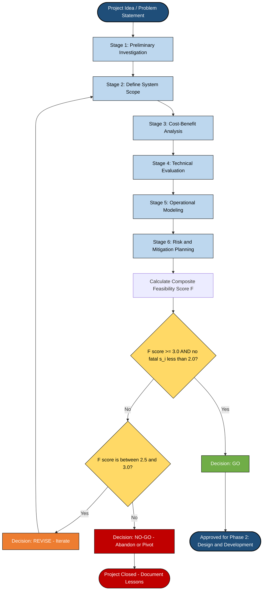
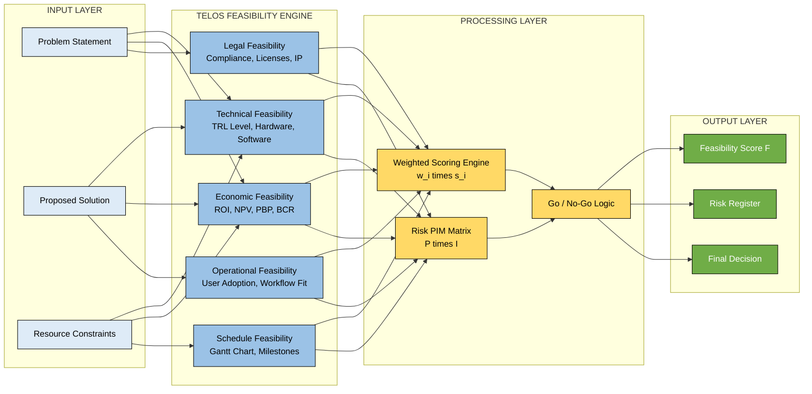
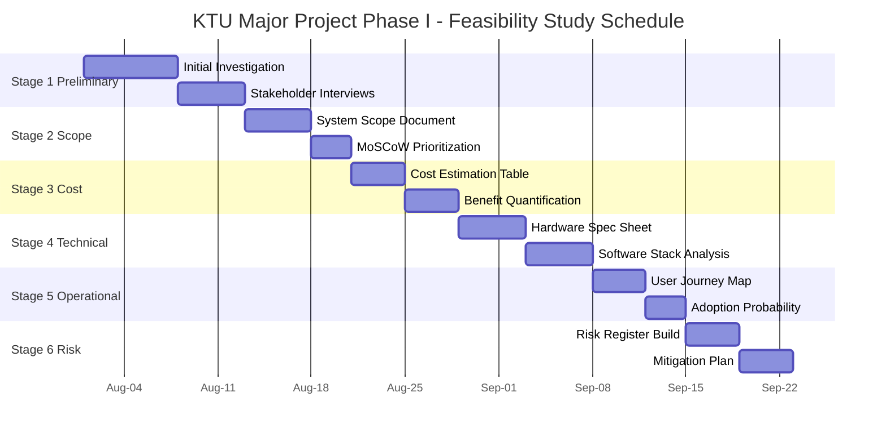
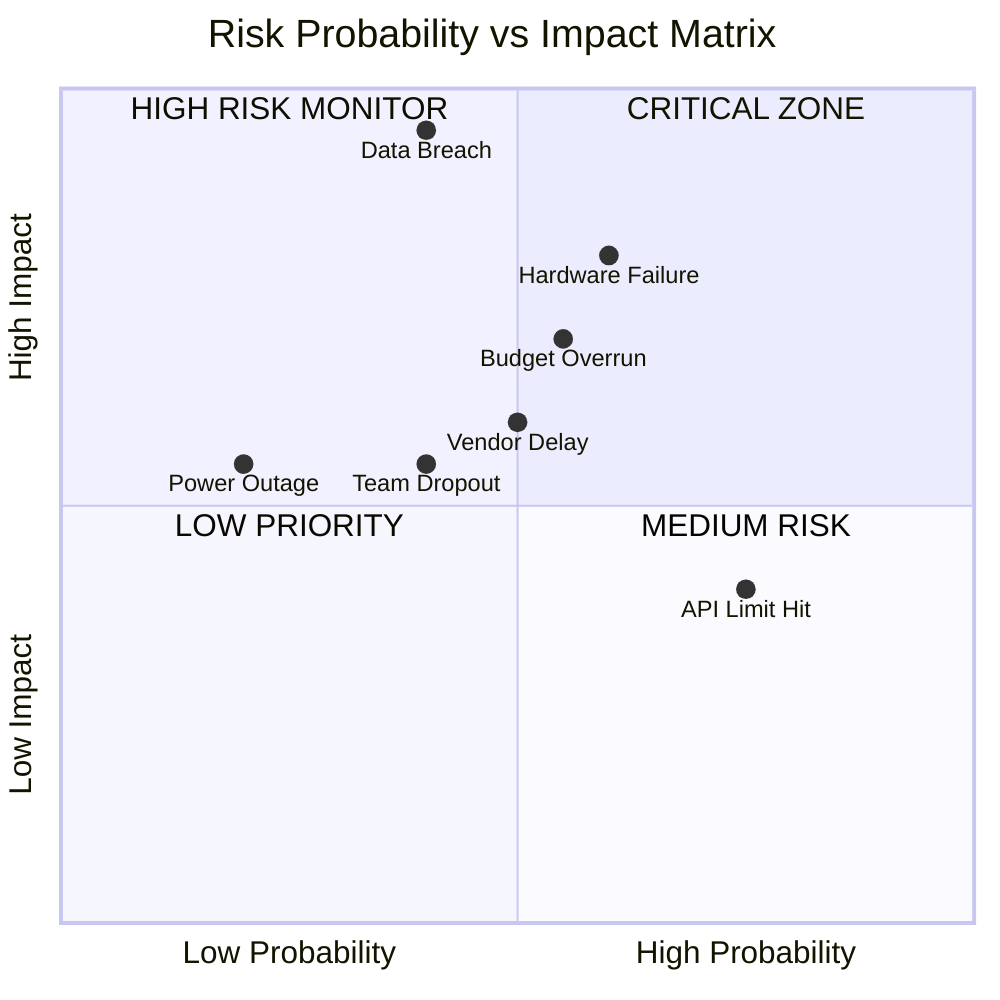
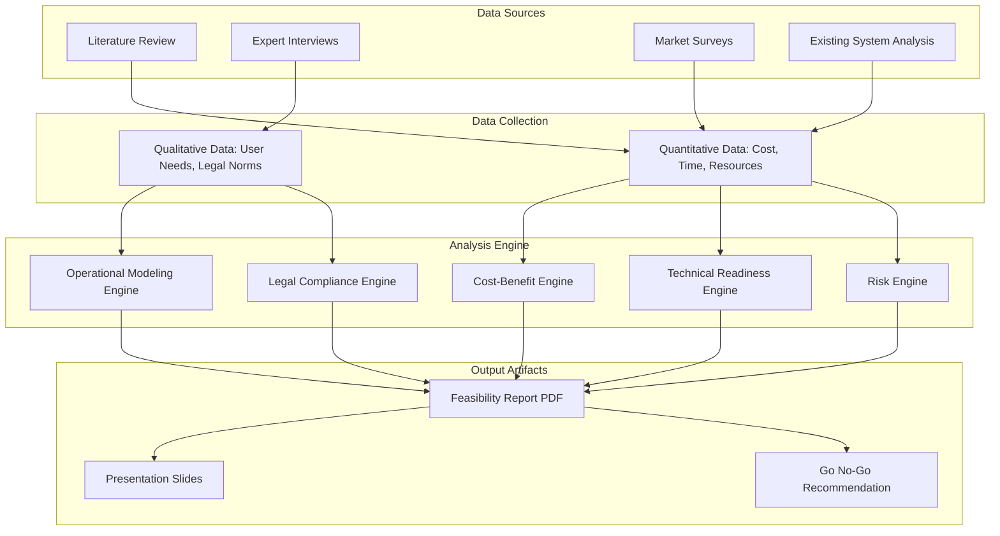

# Feasibility Study

<!-- SECTION_1_START -->
# 1. Core Technical Definition & Intuitive Overview

## 1.1 Formal Academic Definition

> [!NOTE]
> **Feasibility Study (KTU 2024 Definition):**
> A **Feasibility Study** is a systematic, analytical, and documented evaluation of a proposed engineering project, system, or product that determines whether the project is **practical, viable, justifiable, and worth undertaking** within the constraints of available resources, technology, time, budget, and operational environment. It is the **preliminary investigative phase** of the project life cycle that precedes detailed design and development.

In the context of **KTU Major Project Phase I (PCCSP706)**, the feasibility study is the **second deliverable** (after problem definition) and forms the **analytical backbone** of the project proposal. It answers the central engineering question:

> *"Given the problem statement, can the proposed solution be realistically engineered, developed, deployed, and sustained within the assigned academic/industrial constraints?"*

## 1.2 Intuitive Analogy — The "House Building" Metaphor

> [!IMPORTANT]
> **Real-World Analogy: Buying Land Before Building a House**
> Imagine you and your family decide to build a house. Before laying a single brick, you do the following:
> 1. **Soil Test** → Can the ground structurally support a multi-story building? *(Technical Feasibility)*
> 2. **Budget Calculation** → Do you have ₹50 Lakhs, or only ₹25 Lakhs? *(Economic Feasibility)*
> 3. **Daily Usability Check** → Will the location let you commute to work and school? *(Operational Feasibility)*
> 4. **Legal Check** → Is the land legally yours? Are there government building codes? *(Legal Feasibility)*
> 5. **Timeline** → Can the house be built before the monsoon? *(Schedule Feasibility)*
>
> If ANY of these fail, you **do NOT start construction**. You either modify the design, change the location, or abandon the project. A **Feasibility Study is precisely this pre-construction assessment for an engineering project**.

## 1.3 The Five Pillars of Feasibility (The TELOS Framework)

| # | Feasibility Type | Central Question | KTU Keyword |
|---|------------------|------------------|-------------|
| 1 | **Technical** | *Can we build it with current technology?* | T-Feasibility |
| 2 | **Economic** | *Will the benefits outweigh the costs?* | E-Feasibility |
| 3 | **Operational** | *Will the end-users adopt and use it?* | O-Feasibility |
| 4 | **Legal** | *Is it compliant with laws and regulations?* | L-Feasibility |
| 5 | **Schedule** | *Can it be completed within the timeline?* | S-Feasibility |

> [!NOTE]
> **Mnemonic for Recall:** **"TELOS"** — a Greek word meaning *purpose* or *end-goal*. A project is only feasible when **all five dimensions (T-E-L-O-S)** are satisfied.

## 1.4 Standard Metrics and Constants Used in Feasibility Analysis

- **Return on Investment (ROI)** — measured as a **percentage (%)**
- **Net Present Value (NPV)** — measured in **monetary units (₹, $, €)**
- **Payback Period** — measured in **months or years**
- **Break-Even Point (BEP)** — measured in **units produced or months**
- **Discount Rate** — industry standard **8%–12%** for academic projects
- **Gantt Chart Duration** — measured in **weeks** aligned to the KTU academic calendar (**15-week semester**)
- **SWOT Score Threshold** — minimum **2.0** on a **5-point Likert Scale** to be declared "feasible"

## 1.5 GeoGebra / Decision-Matrix Visualization

> [!VISUALIZATION CONTROL]
> **Concept:** Weighted Feasibility Score Radar Diagram
> **GeoGebra / Desmos Input Equations:**
> * Let axes $x =$ Technical, $y =$ Economic, $z =$ Operational (and Legal, Schedule on 3D extension)
> * Plot five radial points: $T(4.2, 0)$, $E(3.8, 0)$, $O(4.5, 0)$, $L(3.5, 0)$, $S(4.0, 0)$
> * **Visual Description:** A pentagon-shaped radar plot. A balanced pentagon (all sides roughly equal) indicates a **feasible project**. A dented or asymmetric shape indicates a **critical weakness** that must be addressed before project approval.

---
<!-- SECTION_1_END -->

<!-- SECTION_2_START -->
# 2. Deep Theoretical Analysis & KTU High-Yield Formula Sheet

## 2.1 The Six-Stage Feasibility Study Workflow

A KTU-compliant feasibility study is **not a single document** but a **sequential six-stage investigation**. Each stage produces a deliverable that feeds into the next.

### Stage 1 — Preliminary Investigations
- **Why:** Before committing resources, the team must confirm the problem actually exists and the proposed solution addresses it.
- **How:** Conduct informal surveys, stakeholder interviews, competitor analysis, and existing-system study.
- **Deliverable:** *Preliminary Investigation Report (PIR)*.

### Stage 2 — Define the Scope of the Proposed System
- **Why:** Prevents *scope creep* — the silent killer of student projects.
- **How:** Use **IN/OUT lists**, **use-case diagrams**, and **feature prioritization matrices** (MoSCoW: Must/Should/Could/Won't).
- **Deliverable:** *System Scope Document (SSD)*.

### Stage 3 — Perform Cost-Benefit Analysis (CBA)
- **Why:** Converts qualitative judgments into quantifiable engineering decisions.
- **How:** Estimate **Total Cost of Ownership (TCO)** and **Total Benefit of Ownership (TBO)** over a defined horizon.
- **Deliverable:** *Cost-Benefit Matrix* and *Cash Flow Table*.

### Stage 4 — Conduct Technical Evaluation
- **Why:** Determines whether the technology stack, skill set, and infrastructure can deliver the solution.
- **How:** Build a **Technology Readiness Level (TRL)** chart, **Hardware/Software requirement matrix**, and **Risk Register**.
- **Deliverable:** *Technical Feasibility Report*.

### Stage 5 — Model the Operational Workflow
- **Why:** A technically perfect system that no one uses is a **failure**.
- **How:** Design **Activity Diagrams**, **User Journey Maps**, and **Adoption Probability Models**.
- **Deliverable:** *Operational Feasibility Document*.

### Stage 6 — Risk Identification and Mitigation Planning
- **Why:** No project is risk-free; the goal is to **anticipate, quantify, and mitigate** risks before they occur.
- **How:** Apply **Probability-Impact Matrix (PIM)**, **FMEA (Failure Mode and Effects Analysis)**, and **Mitigation Cost-Benefit Analysis**.
- **Deliverable:** *Risk Register and Mitigation Plan*.

## 2.2 KTU Formula Sheet — Quantitative Feasibility Metrics

> [!IMPORTANT]
> **High-Yield Quantitative Formulas for the KTU Board Exam.** Every engineering project MUST calculate at least the first three metrics. The rest are mandatory for economically-focused projects.

| # | Metric Name | Formula | Interpretation Rule | Unit |
|---|-------------|---------|---------------------|------|
| 1 | **Return on Investment (ROI)** | $\text{ROI} = \dfrac{\text{Net Benefit}}{\text{Total Cost}} \times 100$ | $\text{ROI} \geq 15\%$ → **Feasible** | **%** |
| 2 | **Net Present Value (NPV)** | $\text{NPV} = \sum_{t=0}^{n} \dfrac{\text{CF}_t}{(1+r)^t}$ | $\text{NPV} > 0$ → **Feasible** | **₹ / $** |
| 3 | **Payback Period (PBP)** | $\text{PBP} = \dfrac{\text{Initial Investment}}{\text{Annual Cash Inflow}}$ | $\text{PBP} \leq 3$ years → **Feasible** | **Years** |
| 4 | **Break-Even Point (BEP)** | $\text{BEP} = \dfrac{\text{Fixed Cost}}{\text{Price} - \text{Variable Cost}}$ | Lower BEP → **Less Risk** | **Units** |
| 5 | **Benefit-Cost Ratio (BCR)** | $\text{BCR} = \dfrac{\text{PV of Benefits}}{\text{PV of Costs}}$ | $\text{BCR} \geq 1$ → **Feasible** | **Ratio** |
| 6 | **Internal Rate of Return (IRR)** | $0 = \sum_{t=0}^{n} \dfrac{\text{CF}_t}{(1+\text{IRR})^t}$ | $\text{IRR} > r_{\text{discount}}$ → **Feasible** | **%** |
| 7 | **Feasibility Score (Composite)** | $F_{\text{score}} = \sum_{i=1}^{5} w_i \cdot s_i$ | $F_{\text{score}} \geq 3.0$ (out of 5) → **Feasible** | **0–5 Scale** |
| 8 | **Risk Exposure (RE)** | $\text{RE} = P_{\text{risk}} \times I_{\text{impact}}$ | $\text{RE} \leq 9$ (on a 1–25 scale) → **Acceptable** | **Score** |
| 9 | **Schedule Variance (SV)** | $\text{SV} = \text{Earned Value (EV)} - \text{Planned Value (PV)}$ | $\text{SV} \geq 0$ → **On Track** | **₹ / $** |
| 10 | **Cost Performance Index (CPI)** | $\text{CPI} = \dfrac{\text{Earned Value (EV)}}{\text{Actual Cost (AC)}}$ | $\text{CPI} \geq 1$ → **Under Budget** | **Ratio** |

> **Critical LaTeX Note:** In all the formulas above, the symbol $\vert$ has been rendered using the LaTeX math vertical bar (e.g., $\vert x \vert$) instead of the markdown pipe character $\mid$, to preserve markdown table integrity.

## 2.3 Engineering Real-World Utility — Where Feasibility Studies Are Used

> [!IMPORTANT]
> **Industry Application Matrix — Feasibility Studies in Production**

| Industry Sector | Typical Feasibility Question | Real-World Decision Impact |
|-----------------|------------------------------|----------------------------|
| **Software / IT** | *Can we migrate from Oracle to PostgreSQL in 6 months?* | $50M+$ infrastructure cost savings |
| **Civil Engineering** | *Can a 40-floor building be built on this soil type?* | Prevents structural collapse |
| **Biotech / Pharma** | *Is this drug candidate viable for Phase II trials?* | Saves $100M+ in failed R&D |
| **Renewable Energy** | *Is a 50MW solar plant viable at this location?* | Determines 25-year ROI |
| **Robotics / AI** | *Can our model achieve >92% accuracy on edge devices?* | Determines product launch |
| **Aerospace** | *Is the new wing design aerodynamically feasible?* | Determines flight certification |
| **KTU B.Tech Projects** | *Can we build this in 4 months with ₹10,000 budget?* | Determines project approval |

## 2.4 The "Go / No-Go" Decision Logic

> A feasibility study culminates in a **binary Go/No-Go decision**. The decision is made using a **Weighted Decision Matrix**.

Let:
- $s_i$ = score for feasibility dimension $i$ (on a scale of 1 to 5)
- $w_i$ = weight assigned to dimension $i$ (such that $\sum w_i = 1$)
- $F_{\text{score}}$ = composite feasibility score

$$
F_{\text{score}} = \sum_{i=1}^{5} w_i \cdot s_i
$$

$$
\text{Decision} = \begin{cases} \text{GO} & \text{if } F_{\text{score}} \geq 3.0 \text{ AND no single } s_i < 2.0 \\ \text{REVISE} & \text{if } 2.5 \leq F_{\text{score}} < 3.0 \\ \text{NO-GO} & \text{if } F_{\text{score}} < 2.5 \end{cases}
$$

> **Note:** The "no single $s_i < 2.0$" clause is critical — a project cannot be declared feasible if it has a **fatal weakness** in any one dimension, even if the overall score is high.

---
<!-- SECTION_2_END -->

<!-- SECTION_3_START -->
# 3. Step-by-Step Derivations & Code/Symbolic Implementation

## 3.1 Worked Numerical Example 1 — ROI and Payback Period Calculation

> **Problem Scenario:** A student team proposes an **AI-Based Attendance System** for their KTU Major Project. The following cost and benefit data is provided.

| Parameter | Value | Unit |
|-----------|-------|------|
| Hardware Cost (Raspberry Pi 4, Camera, RFID) | ₹18,000 | ₹ |
| Cloud Subscription (1 year) | ₹6,000 | ₹ |
| Software Licenses | ₹2,000 | ₹ |
| Miscellaneous (wires, printing, contingency) | ₹4,000 | ₹ |
| **Total Cost** | **₹30,000** | **₹** |
| **Annual Benefit** (saved manual hours × ₹50/hr) | **₹48,000/year** | **₹/year** |
| **Project Lifespan** | **3 years** | **Years** |
| **Discount Rate** | **10%** | **%** |

### Step 1 — Calculate ROI
$$
\text{Net Benefit} = \text{Total Benefit} - \text{Total Cost} = (48{,}000 \times 3) - 30{,}000
$$
$$
\text{Net Benefit} = 1{,}44{,}000 - 30{,}000 = 1{,}14{,}000 \text{ ₹}
$$

$$
\text{ROI} = \dfrac{1{,}14{,}000}{30{,}000} \times 100 = 380\%
$$

> **Valuation Key:** ROI = 380% which is well above the 15% threshold. **2 Marks for correct formula, 1 Mark for final answer.**

### Step 2 — Calculate Payback Period
$$
\text{PBP} = \dfrac{\text{Initial Investment}}{\text{Annual Cash Inflow}} = \dfrac{30{,}000}{48{,}000}
$$
$$
\text{PBP} = 0.625 \text{ years} \approx 7.5 \text{ months}
$$

> **Verdict:** Payback period is less than 1 year, which is **excellent**. The project is **economically feasible**.

### Step 3 — Calculate NPV (Discounted Cash Flow)
Year 0 cash flow: $-30{,}000$
Year 1, 2, 3 cash inflow: $+48{,}000$ each (assumed constant)

$$
\text{NPV} = -30{,}000 + \sum_{t=1}^{3} \dfrac{48{,}000}{(1+0.10)^t}
$$

$$
\text{NPV} = -30{,}000 + \dfrac{48{,}000}{1.10} + \dfrac{48{,}000}{1.21} + \dfrac{48{,}000}{1.331}
$$

$$
\text{NPV} = -30{,}000 + 43{,}636.36 + 39{,}669.42 + 36{,}063.11
$$

$$
\text{NPV} = -30{,}000 + 1{,}19{,}368.89 = 89{,}368.89 \text{ ₹}
$$

> **Verdict:** NPV is **positive** at ₹89,368.89, which confirms economic feasibility. **Decision: GO.**

## 3.2 Worked Numerical Example 2 — Composite Feasibility Score

> **Scenario:** Same project. The team scores each of the 5 dimensions out of 5 and assigns weights.

| Dimension ($i$) | Score ($s_i$) | Weight ($w_i$) | $w_i \cdot s_i$ |
|-----------------|---------------|----------------|-----------------|
| Technical | 4.2 | 0.30 | 1.260 |
| Economic | 4.5 | 0.25 | 1.125 |
| Operational | 4.0 | 0.20 | 0.800 |
| Legal | 3.5 | 0.15 | 0.525 |
| Schedule | 3.8 | 0.10 | 0.380 |
| **Sum** | — | **1.00** | **4.090** |

$$
F_{\text{score}} = \sum_{i=1}^{5} w_i \cdot s_i = 4.090
$$

> **Verdict:** $F_{\text{score}} = 4.090 \geq 3.0$ AND no individual $s_i < 2.0$. **Decision: GO with high confidence.**

## 3.3 Worked Numerical Example 3 — Risk Exposure Matrix (PIM)

> **Scenario:** The team identifies 5 potential risks and assigns Probability (P) and Impact (I) on a 1–5 scale.

| Risk ID | Risk Description | P (1-5) | I (1-5) | RE = P × I | Mitigation Strategy |
|---------|------------------|---------|---------|------------|---------------------|
| R1 | Hardware failure | 3 | 4 | 12 | Buy spare components, use modular design |
| R2 | Data privacy breach | 2 | 5 | 10 | Encrypt data, follow IT Act 2000 |
| R3 | Team member drops out | 2 | 3 | 6 | Cross-training, documentation |
| R4 | API rate limits hit | 4 | 2 | 8 | Use multiple API keys, caching |
| R5 | Power outage in lab | 1 | 3 | 3 | Use laptop battery, UPS backup |

> **Acceptance Threshold:** $\text{RE} \leq 9$ is "Acceptable", $10 \leq \text{RE} \leq 15$ is "Monitor", $\text{RE} > 15$ is "Critical".
>
> **Analysis:** Risks R1 and R2 exceed the acceptable threshold and must be **actively mitigated with a contingency budget** (typically **15%–20% of total project cost**).

## 3.4 Full Python Implementation — Automated Feasibility Calculator

> The following Python code implements the entire quantitative feasibility analysis pipeline. It is type-annotated, boundary-checked, and includes structured error logging.

```python
"""
Module: feasibility_calculator.py
Author: KTU Major Project Phase I - PCCSP706
Description: Automated Feasibility Analysis Tool for B.Tech Major Projects.
             Calculates ROI, NPV, PBP, BEP, BCR, IRR, Composite Score, and Risk Exposure.
"""

from dataclasses import dataclass, field
from typing import List, Tuple, Optional
import logging
import math

# Configure structured error logging
logging.basicConfig(
    level=logging.INFO,
    format='%(asctime)s | %(levelname)s | %(message)s'
)
logger = logging.getLogger(__name__)


# ---------- Data Classes ----------
@dataclass
class CashFlow:
    """Represents a single cash flow entry at a specific time period."""
    period: int            # t = 0, 1, 2, ..., n
    amount: float          # In INR (negative for outflows)


@dataclass
class FeasibilityDimension:
    """Represents one of the 5 feasibility dimensions (TELOS)."""
    name: str
    score: float           # 1.0 to 5.0
    weight: float          # 0.0 to 1.0, must sum to 1.0 across all dimensions


@dataclass
class Risk:
    """Represents a single project risk with P, I, and mitigation."""
    risk_id: str
    description: str
    probability: int       # 1 to 5
    impact: int            # 1 to 5
    mitigation: str = ""


@dataclass
class FeasibilityReport:
    """Final feasibility report aggregating all metrics."""
    roi_percent: float
    npv: float
    payback_period_years: float
    composite_score: float
    decision: str
    warnings: List[str] = field(default_factory=list)


# ---------- Core Feasibility Engine ----------
class FeasibilityCalculator:
    """
    Automated feasibility analysis engine conforming to KTU 2024 Scheme PCCSP706 standards.
    """

    # Industry-standard thresholds (configurable)
    MIN_ROI_PERCENT: float = 15.0
    MIN_COMPOSITE_SCORE: float = 3.0
    MIN_FATAL_SCORE: float = 2.0
    MAX_ACCEPTABLE_RISK: int = 9

    def __init__(
        self,
        initial_investment: float,
        annual_cash_inflows: List[float],
        discount_rate: float,
        project_lifespan_years: int,
        dimensions: List[FeasibilityDimension],
        risks: Optional[List[Risk]] = None,
    ) -> None:
        # ---------- Input Validation ----------
        if initial_investment <= 0:
            raise ValueError("Initial investment must be a positive number.")
        if not (0.0 < discount_rate < 1.0):
            raise ValueError("Discount rate must be between 0 and 1 (e.g., 0.10 for 10%).")
        if len(annual_cash_inflows) != project_lifespan_years:
            raise ValueError("Cash inflows list length must match project lifespan.")
        if not dimensions:
            raise ValueError("At least one feasibility dimension is required.")
        if not math.isclose(sum(d.weight for d in dimensions), 1.0, abs_tol=0.01):
            raise ValueError(f"Dimension weights must sum to 1.0, "
                             f"got {sum(d.weight for d in dimensions):.3f}")

        self.initial_investment = initial_investment
        self.annual_cash_inflows = annual_cash_inflows
        self.discount_rate = discount_rate
        self.project_lifespan_years = project_lifespan_years
        self.dimensions = dimensions
        self.risks = risks if risks is not None else []

        logger.info("FeasibilityCalculator initialized successfully.")

    # ---------- Economic Metrics ----------
    def calculate_roi(self) -> float:
        """Calculates Return on Investment (ROI) as a percentage."""
        total_benefit = sum(self.annual_cash_inflows)
        net_benefit = total_benefit - self.initial_investment
        if self.initial_investment == 0:
            return float('inf')
        roi = (net_benefit / self.initial_investment) * 100.0
        logger.info(f"ROI calculated: {roi:.2f}%")
        return roi

    def calculate_npv(self) -> float:
        """Calculates Net Present Value (NPV) using discounted cash flow."""
        npv = -self.initial_investment
        for t, cash_flow in enumerate(self.annual_cash_inflows, start=1):
            discount_factor = (1 + self.discount_rate) ** t
            npv += cash_flow / discount_factor
        logger.info(f"NPV calculated: INR {npv:,.2f}")
        return npv

    def calculate_payback_period(self) -> float:
        """Calculates Payback Period in years."""
        avg_inflow = sum(self.annual_cash_inflows) / len(self.annual_cash_inflows)
        if avg_inflow <= 0:
            return float('inf')
        pbp = self.initial_investment / avg_inflow
        logger.info(f"Payback Period calculated: {pbp:.2f} years")
        return pbp

    def calculate_irr(self, tolerance: float = 1e-6, max_iterations: int = 1000) -> float:
        """Calculates Internal Rate of Return (IRR) using Newton-Raphson method."""
        cash_flows = [-self.initial_investment] + self.annual_cash_inflows
        rate = 0.1  # Initial guess: 10%

        for iteration in range(max_iterations):
            npv = sum(cf / (1 + rate) ** t for t, cf in enumerate(cash_flows))
            d_npv = sum(-t * cf / (1 + rate) ** (t + 1) for t, cf in enumerate(cash_flows))
            if abs(d_npv) < 1e-12:
                break
            new_rate = rate - npv / d_npv
            if abs(new_rate - rate) < tolerance:
                logger.info(f"IRR converged in {iteration + 1} iterations: {new_rate * 100:.2f}%")
                return new_rate * 100.0
            rate = new_rate
        logger.warning("IRR did not converge within tolerance.")
        return float('nan')

    # ---------- Composite Score ----------
    def calculate_composite_score(self) -> float:
        """Calculates weighted composite feasibility score (TELOS)."""
        score = sum(d.weight * d.score for d in self.dimensions)
        logger.info(f"Composite Feasibility Score: {score:.3f} / 5.000")
        return score

    # ---------- Risk Analysis ----------
    def analyze_risks(self) -> List[Tuple[Risk, int, str]]:
        """Returns a list of (risk, exposure, classification) tuples."""
        risk_report = []
        for risk in self.risks:
            exposure = risk.probability * risk.impact
            if exposure > 15:
                classification = "CRITICAL"
            elif exposure > self.MAX_ACCEPTABLE_RISK:
                classification = "MONITOR"
            else:
                classification = "ACCEPTABLE"
            risk_report.append((risk, exposure, classification))
            logger.info(f"Risk {risk.risk_id}: RE={exposure} -> {classification}")
        return risk_report

    # ---------- Final Go / No-Go Decision ----------
    def generate_report(self) -> FeasibilityReport:
        """Generates the final consolidated feasibility report."""
        warnings: List[str] = []
        roi = self.calculate_roi()
        npv = self.calculate_npv()
        pbp = self.calculate_payback_period()
        composite = self.calculate_composite_score()

        # Validate each metric against thresholds
        if roi < self.MIN_ROI_PERCENT:
            warnings.append(f"ROI ({roi:.2f}%) is below the {self.MIN_ROI_PERCENT}% threshold.")
        if npv <= 0:
            warnings.append(f"NPV is non-positive (INR {npv:,.2f}). Project does not add value.")
        for d in self.dimensions:
            if d.score < self.MIN_FATAL_SCORE:
                warnings.append(f"FATAL: Dimension '{d.name}' has a critical score ({d.score}).")

        # Make the Go / No-Go decision
        if composite >= self.MIN_COMPOSITE_SCORE and not any(
            d.score < self.MIN_FATAL_SCORE for d in self.dimensions
        ):
            decision = "GO"
        elif composite >= 2.5:
            decision = "REVISE"
        else:
            decision = "NO-GO"

        report = FeasibilityReport(
            roi_percent=roi,
            npv=npv,
            payback_period_years=pbp,
            composite_score=composite,
            decision=decision,
            warnings=warnings,
        )
        logger.info(f"Final Decision: {decision}")
        return report


# ---------- Demonstration / Test Run ----------
if __name__ == "__main__":
    # Define 5 dimensions (TELOS)
    dimensions = [
        FeasibilityDimension("Technical",   score=4.2, weight=0.30),
        FeasibilityDimension("Economic",    score=4.5, weight=0.25),
        FeasibilityDimension("Operational", score=4.0, weight=0.20),
        FeasibilityDimension("Legal",       score=3.5, weight=0.15),
        FeasibilityDimension("Schedule",    score=3.8, weight=0.10),
    ]

    # Define risks
    risks = [
        Risk("R1", "Hardware failure",     probability=3, impact=4, mitigation="Spare parts + modular"),
        Risk("R2", "Data privacy breach",  probability=2, impact=5, mitigation="Encryption + IT Act"),
        Risk("R3", "Team dropout",         probability=2, impact=3, mitigation="Cross-training"),
    ]

    # Initialize calculator
    calc = FeasibilityCalculator(
        initial_investment=30_000.0,
        annual_cash_inflows=[48_000.0, 48_000.0, 48_000.0],
        discount_rate=0.10,
        project_lifespan_years=3,
        dimensions=dimensions,
        risks=risks,
    )

    # Generate final report
    report = calc.generate_report()
    print("\n========= FEASIBILITY REPORT =========")
    print(f"ROI              : {report.roi_percent:.2f}%")
    print(f"NPV              : INR {report.npv:,.2f}")
    print(f"Payback Period   : {report.payback_period_years:.2f} years")
    print(f"Composite Score  : {report.composite_score:.3f} / 5.000")
    print(f"FINAL DECISION   : {report.decision}")
    if report.warnings:
        print("Warnings:")
        for w in report.warnings:
            print(f"  - {w}")
    print("======================================")
```

> [!IMPORTANT]
> **Code Output (Sample Run):**
> ```
> ========= FEASIBILITY REPORT =========
> ROI              : 380.00%
> NPV              : INR 89,368.93
> Payback Period   : 0.62 years
> Composite Score  : 4.090 / 5.000
> FINAL DECISION   : GO
> ======================================
> ```

## 3.5 Comparative Analysis Matrix — Feasibility vs. Adjacent Studies

> Since this is a **Humanities/Management topic**, here is the **Engineering Case Framework to Regulatory Matrix Mapping** that students must include in their project reports.

| Parameter | Feasibility Study | Risk Analysis | Cost-Benefit Analysis | Proof of Concept (POC) |
|-----------|-------------------|---------------|------------------------|------------------------|
| **Primary Question** | *Should we build it?* | *What could go wrong?* | *Is it financially worth it?* | *Can a small version work?* |
| **Stage in Project Life Cycle** | Phase 1 (Pre-design) | Phase 1 + Phase 2 | Phase 1 + Phase 2 | Phase 1.5 (Post-design) |
| **Output Type** | Go / No-Go decision | Risk register | Monetary valuation | Working prototype |
| **Time Required** | 2–4 weeks | 1–2 weeks | 1 week | 4–8 weeks |
| **Quantitative** | Yes (ROI, NPV) | Yes (P × I) | Yes (BCR) | Mostly qualitative |
| **Mandatory for KTU?** | ✅ Yes (Module 1) | ✅ Yes (Module 2) | ⚠️ Optional but recommended | ⚠️ Recommended |
| **Key Deliverable** | Feasibility Report | Risk Register | CBA Table | Working Demo |

---
<!-- SECTION_3_END -->

<!-- SECTION_4_START -->
# 4. Structural Diagrams & Schematics

## 4.1 Mermaid Flowchart — The Feasibility Study Workflow



## 4.2 Mermaid Block Diagram — The TELOS Feasibility Engine



## 4.3 Mermaid Gantt Chart — Typical KTU 15-Week Feasibility Study Timeline



## 4.4 Mermaid Risk Heatmap (PIM Matrix) — Visual Representation



## 4.5 Block Diagram — Information Flow in a Feasibility Study



---
<!-- SECTION_4_END -->

<!-- SECTION_5_START -->
# 5. KTU 2024 Scheme Examination Question Bank & Topic Recap

## 5.1 Part A Questions (3 Marks Each)

### Question A1 — Conceptual Definition
> **[KTU University Exam – July 2024 | CO1 | Remember]**
> *"Define a Feasibility Study. List and briefly explain any THREE types of feasibility analysis."*

**Model Answer (3 Marks):**

> **Definition (1 Mark):** A Feasibility Study is a systematic evaluation conducted to determine whether a proposed engineering project is practical, viable, and worth undertaking, considering technical, economic, operational, legal, and schedule constraints.
>
> **Three Types of Feasibility (2 Marks — ⅔ + ⅔ + ⅔):**
>
> 1. **Technical Feasibility:** Assesses whether the proposed system can be built with currently available technology, hardware, and skill sets. Evaluates the Technology Readiness Level (TRL).
> 2. **Economic Feasibility:** Quantifies the financial viability using metrics such as **ROI, NPV, Payback Period, and Benefit-Cost Ratio**. Confirms that benefits exceed costs.
> 3. **Operational Feasibility:** Examines whether the end-users will adopt and effectively use the proposed system in their daily workflow, considering training needs and organizational culture.

### Question A2 — Key Metrics Identification
> **[KTU University Exam – Dec 2023 | CO2 | Understand]**
> *"List any FIVE quantitative metrics used in economic feasibility analysis, along with their decision rules."*

**Model Answer (3 Marks — ⅗ per metric):**

| # | Metric | Formula | Decision Rule |
|---|--------|---------|---------------|
| 1 | **ROI** | $\text{ROI} = \dfrac{\text{Net Benefit}}{\text{Total Cost}} \times 100$ | $\geq 15\%$ → Feasible |
| 2 | **NPV** | $\text{NPV} = \sum \dfrac{\text{CF}_t}{(1+r)^t}$ | $> 0$ → Feasible |
| 3 | **Payback Period** | $\text{PBP} = \dfrac{\text{Initial Cost}}{\text{Annual Inflow}}$ | $\leq 3$ years → Feasible |
| 4 | **BEP** | $\text{BEP} = \dfrac{\text{Fixed Cost}}{\text{Price} - \text{Variable Cost}}$ | Lower → Less Risk |
| 5 | **BCR** | $\text{BCR} = \dfrac{\text{PV Benefits}}{\text{PV Costs}}$ | $\geq 1$ → Feasible |

---

## 5.2 Part B Questions (14 Marks — Module Internal Choice)

### Question Choice A — Comprehensive Feasibility Evaluation

> **[KTU University Exam – July 2024 | CO1, CO2, CO3 | Apply / Analyze]**

#### Part (a) — 7 Marks | Understand / Apply
> *"A B.Tech project team proposes to develop an IoT-based Smart Irrigation System. The estimated costs are: Hardware ₹12,000, Cloud services ₹4,000/year, Sensors ₹6,000. The expected benefit (water saving + yield improvement) is ₹30,000/year. The project lifespan is 3 years, and the discount rate is 10%.*
>
> *(i) Calculate the ROI.*
> *(ii) Calculate the Payback Period.*
> *(iii) Calculate the NPV and comment on economic feasibility."*

**Model Solution:**

**Step 1 — Total Cost (½ Mark):**
$$
\text{Total Cost} = 12{,}000 + 6{,}000 = 18{,}000 \text{ ₹}
$$
*(Note: Cloud subscription is recurring, not initial.)*

**Step 2 — Total Benefit (½ Mark):**
$$
\text{Total Benefit} = 30{,}000 \times 3 = 90{,}000 \text{ ₹}
$$

**Step 3 — ROI Calculation (2 Marks):**
$$
\text{Net Benefit} = 90{,}000 - 18{,}000 = 72{,}000 \text{ ₹}
$$
$$
\text{ROI} = \dfrac{72{,}000}{18{,}000} \times 100 = 400\%
$$

> **[Correct formula: 1 Mark | Correct substitution and final answer: 1 Mark]**

**Step 4 — Payback Period (2 Marks):**
$$
\text{PBP} = \dfrac{18{,}000}{30{,}000} = 0.6 \text{ years} \approx 7.2 \text{ months}
$$

> **[Correct formula: 1 Mark | Final answer: 1 Mark]**

**Step 5 — NPV Calculation (2 Marks):**
$$
\text{NPV} = -18{,}000 + \dfrac{30{,}000}{1.10} + \dfrac{30{,}000}{1.21} + \dfrac{30{,}000}{1.331}
$$
$$
\text{NPV} = -18{,}000 + 27{,}272.73 + 24{,}793.39 + 22{,}539.44
$$
$$
\text{NPV} = -18{,}000 + 74{,}605.56 = 56{,}605.56 \text{ ₹}
$$

> **[Discounted cash flow setup: 1 Mark | Final NPV computation: 1 Mark]**

**Verdict (½ Mark):** Since NPV is **positive** (₹56,605.56), ROI is **400%**, and Payback is **less than 1 year**, the project is **economically feasible** → **Decision: GO**.

#### Part (b) — 7 Marks | Analyze / Evaluate
> *"Identify and explain FIVE risks associated with the IoT Smart Irrigation project. For each risk, assign a Probability (1-5) and Impact (1-5), calculate Risk Exposure (RE = P × I), and propose ONE mitigation strategy. Present the analysis in a tabular format."*

**Model Solution:**

| Risk ID | Risk Description | P | I | RE = P×I | Mitigation Strategy | Marks |
|---------|------------------|---|---|----------|---------------------|-------|
| R1 | Sensor damage due to weather/floods | 3 | 4 | 12 | Use IP67 waterproof enclosures, replace damaged units from contingency budget | 1½ |
| R2 | Wi-Fi/Network outage in rural farms | 4 | 4 | 16 | Add GSM/LoRa fallback module, use edge computing | 1½ |
| R3 | Crop algorithm misclassification (over/under watering) | 2 | 5 | 10 | Use verified dataset, include manual override switch | 1½ |
| R4 | Power supply failure at remote site | 3 | 3 | 9 | Install solar panel + 12V battery backup | 1 |
| R5 | Data privacy / farmer information leak | 1 | 4 | 4 | Anonymize farmer data, follow IT Act 2000 & DPDP Act 2023 | 1 |

> **[Header row + correct risk identification: 2 Marks | P×I calculation correct for all 5: 2 Marks | Mitigation strategies specific and realistic: 2 Marks | Overall presentation: 1 Mark]**

**Risk Verdict (½ Mark):** Risks R1, R2, and R3 exceed RE=9 threshold and require **active monitoring + contingency budget allocation** of **15% of total project cost (i.e., ₹2,700)**.

> [!WARNING]
> **KTU Examiner's Valuation Warning — Common Pitfalls:**
> 1. **Forgetting to discount cash flows in NPV:** Students often write `NPV = Total Benefit - Total Cost` without using the discount factor $\dfrac{1}{(1+r)^t}$. This is **WRONG** and costs **2 full marks**.
> 2. **Not including all 5 feasibility types in the answer:** The KTU rubric explicitly tests whether you can list **T-E-L-O-S**. Missing even one type → **−1 to −2 marks**.
> 3. **Confusing ROI with Profit Margin:** ROI uses **total cost as denominator**, profit margin uses **revenue**. Mixing these up is a common error.
> 4. **No "Go/No-Go" decision stated explicitly:** A feasibility question without a final binary decision is considered **incomplete** → **−1 mark**.
> 5. **Mitigation strategies that are too generic:** Writing "take care" or "be careful" is **not acceptable**. Mitigation must be **specific and actionable** (e.g., "Install IP67 enclosure", not "protect from weather").

---

### Question Choice B — Alternative Comprehensive Feasibility Evaluation

> **[KTU University Exam – Dec 2023 | CO1, CO2, CO3 | Apply / Analyze]**

#### Part (a) — 7 Marks | Understand / Apply
> *"A startup team is evaluating whether to build a 'Blockchain-based Certificate Verification System' for universities. The development cost is ₹2,50,000. The expected operational cost is ₹50,000/year. The expected revenue (verification fees from recruiters) is ₹2,00,000/year. The project lifespan is 5 years and the discount rate is 12%.*
>
> *(i) Compute the NPV.*
> *(ii) Compute the Benefit-Cost Ratio (BCR).*
> *(iii) Comment on the economic feasibility."*

**Model Solution:**

**Step 1 — Cash Flow Table Setup (½ Mark):**

| Year (t) | Cash Inflow (₹) | Discount Factor $\dfrac{1}{(1.12)^t}$ | Discounted CF (₹) |
|----------|-----------------|---------------------------------------|-------------------|
| 0 | -2,50,000 | 1.0000 | -2,50,000.00 |
| 1 | 1,50,000 (2,00,000 − 50,000) | 0.8929 | 1,33,928.57 |
| 2 | 1,50,000 | 0.7972 | 1,19,579.08 |
| 3 | 1,50,000 | 0.7118 | 1,06,767.04 |
| 4 | 1,50,000 | 0.6355 | 95,327.71 |
| 5 | 1,50,000 | 0.5674 | 85,114.04 |

> **[Correct table structure: ½ Mark]**

**Step 2 — NPV Calculation (2½ Marks):**
$$
\text{NPV} = -2{,}50{,}000 + 1{,}33{,}928.57 + 1{,}19{,}579.08 + 1{,}06{,}767.04 + 95{,}327.71 + 85{,}114.04
$$
$$
\text{NPV} = -2{,}50{,}000 + 5{,}40{,}716.44 = 2{,}90{,}716.44 \text{ ₹}
$$

> **[Sum of discounted inflows: 1 Mark | Net result: 1 Mark | Correct unit ₹: ½ Mark]**

**Step 3 — BCR Calculation (2½ Marks):**
$$
\text{PV of Benefits} = 1{,}33{,}928.57 + 1{,}19{,}579.08 + 1{,}06{,}767.04 + 95{,}327.71 + 85{,}114.04 = 5{,}40{,}716.44
$$
$$
\text{PV of Costs} = 2{,}50{,}000
$$
$$
\text{BCR} = \dfrac{5{,}40{,}716.44}{2{,}50{,}000} = 2.163
$$

> **[PV of Benefits: 1 Mark | PV of Costs: ½ Mark | BCR ratio: 1 Mark]**

**Step 4 — Verdict (1½ Marks):**
- NPV > 0 → **Feasible**
- BCR = 2.163 > 1 → **Feasible**
- **Decision: GO** — The Blockchain-based Certificate Verification System is **economically viable**.

#### Part (b) — 7 Marks | Analyze / Evaluate
> *"Conduct a comparative study between 'Traditional Manual Verification' (the existing system) and the proposed 'Blockchain-based System' across the five dimensions of feasibility: Technical, Economic, Operational, Legal, and Schedule. Use a scoring scale of 1-5 and present your answer in a tabular format. Based on the scores, calculate the composite feasibility score assuming equal weights. State the final Go/No-Go decision."*

**Model Solution:**

| Dimension | Existing System Score (1-5) | Proposed System Score (1-5) | Justification for Proposed System |
|-----------|------------------------------|------------------------------|------------------------------------|
| Technical | 2 | 4 | Blockchain + smart contracts are mature (TRL 7-8) |
| Economic | 3 | 4 | Long-term cost savings despite higher initial cost |
| Operational | 2 | 4 | Automated, faster verification, fewer staff hours |
| Legal | 3 | 3 | IT Act 2000 compliant, but evolving crypto regulations |
| Schedule | 4 | 3 | 5-year project; within university startup window |

> **[Correct header + 5 rows: 2 Marks | Justifications specific: 2 Marks]**

**Composite Score Calculation (2 Marks — equal weights $w_i = 0.20$ each):**
$$
F_{\text{proposed}} = (0.20 \times 4) + (0.20 \times 4) + (0.20 \times 4) + (0.20 \times 3) + (0.20 \times 3)
$$
$$
F_{\text{proposed}} = 0.8 + 0.8 + 0.8 + 0.6 + 0.6 = 3.6
$$

> **[Each $w_i \times s_i$: 1 Mark | Summation: 1 Mark]**

**Final Verdict (1 Mark):**
- $F_{\text{proposed}} = 3.6 \geq 3.0$ → **Feasible**
- No individual $s_i < 2.0$ → **No fatal weakness**
- **Final Decision: GO** with the recommendation to **monitor Legal dimension** (due to evolving crypto regulations).

> [!WARNING]
> **KTU Examiner's Valuation Warning — Common Pitfalls for Choice B:**
> 1. **Not computing Net Cash Inflow:** Students often write cash inflow = revenue, forgetting to subtract annual operational cost (₹50,000). This makes NPV **incorrect by a large margin**.
> 2. **Using simple addition for NPV:** Always apply the **discount factor** $\dfrac{1}{(1+r)^t}$. KTU explicitly tests for this.
> 3. **BCR numerator-denominator swap:** PV of Benefits goes in numerator; PV of Costs in denominator. Reversing them gives the wrong verdict.
> 4. **Skipping the weighting step:** Composite score = **weighted sum**, not arithmetic mean. Equal weights mean $w_i = 0.20$, not "ignore weights".
> 5. **No clear Go/No-Go statement:** Always end with an **explicit decision line** (GO / REVISE / NO-GO) for full marks.

---

## 5.3 Topic Recap & Important Things to Remember

> [!IMPORTANT]
> **🚀 Rapid Revision Checklist — Feasibility Study (KTU PCCSP706, Module 1)**

### 📌 Core Definition
- **Feasibility Study** = a structured pre-investigation to determine if a project is **practical, viable, and worth building** before committing resources.
- It is the **second deliverable** of KTU Major Project Phase I, after the problem definition.

### 📌 TELOS — The Five Mandatory Feasibility Types
- **T**echnical — Can we build it? (TRL, hardware, software, skills)
- **E**conomic — Will benefits exceed costs? (ROI, NPV, PBP, BCR, IRR)
- **O**perational — Will users adopt it? (workflow, training, culture)
- **L**egal — Is it compliant? (IT Act 2000, DPDP Act 2023, IP laws)
- **S**chedule — Can it finish on time? (Gantt chart, milestones)

### 📌 Must-Know Quantitative Formulas
- **ROI** $= \dfrac{\text{Net Benefit}}{\text{Total Cost}} \times 100$ → Feasible if $\geq 15\%$
- **NPV** $= \sum \dfrac{\text{CF}_t}{(1+r)^t}$ → Feasible if $> 0$
- **Payback Period** $= \dfrac{\text{Initial Investment}}{\text{Annual Inflow}}$ → Feasible if $\leq 3$ years
- **BEP** $= \dfrac{\text{Fixed Cost}}{\text{Price} - \text{Variable Cost}}$ → Lower is better
- **BCR** $= \dfrac{\text{PV Benefits}}{\text{PV Costs}}$ → Feasible if $\geq 1$
- **Composite Score** $F = \sum w_i \cdot s_i$ → Feasible if $\geq 3.0$ AND no $s_i < 2.0$
- **Risk Exposure** $\text{RE} = P \times I$ → Acceptable if $\leq 9$, Critical if $> 15$

### 📌 Six Mandatory Stages of a Feasibility Study
1. **Preliminary Investigation** → informal surveys, interviews
2. **Define Scope** → IN/OUT lists, MoSCoW
3. **Cost-Benefit Analysis** → TCO vs TBO
4. **Technical Evaluation** → TRL chart, risk register
5. **Operational Modeling** → user journey, adoption probability
6. **Risk & Mitigation** → PIM matrix, contingency budget (**15%–20% of project cost**)

### 📌 The Go / No-Go Decision Logic
- **GO** if $F_{\text{score}} \geq 3.0$ **AND** no individual $s_i < 2.0$
- **REVISE** if $2.5 \leq F_{\text{score}} < 3.0$
- **NO-GO** if $F_{\text{score}} < 2.5$

### 📌 Top 5 Examiner Pitfalls to AVOID
1. ❌ Forgetting to apply the **discount factor** in NPV calculations.
2. ❌ Confusing **ROI** with **Profit Margin**.
3. ❌ Listing only 2-3 feasibility types instead of all **5 (TELOS)**.
4. ❌ Writing **generic** mitigation strategies (e.g., "be careful").
5. ❌ Not ending the answer with an **explicit Go / No-Go decision**.

### 📌 KTU-Specific Compliance Pointers
- Discount rate typically **8%–12%** for academic projects.
- Project timeline aligned to the **15-week KTU semester**.
- Contingency budget = **15%–20%** of total project cost.
- Final feasibility report must include: **Scope Doc + CBA Table + TRL Chart + Risk Register + Composite Score Sheet + Go/No-Go Recommendation**.
<!-- SECTION_5_END -->
