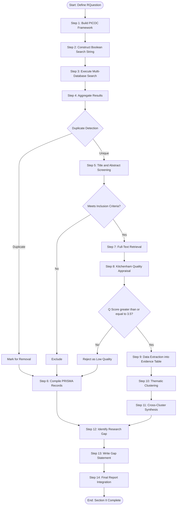
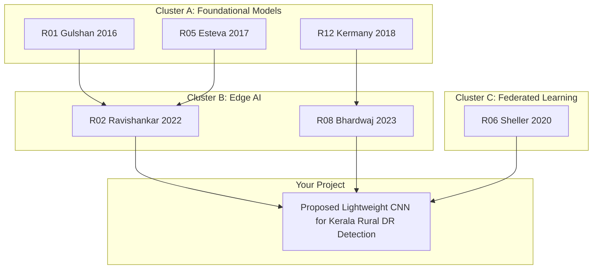
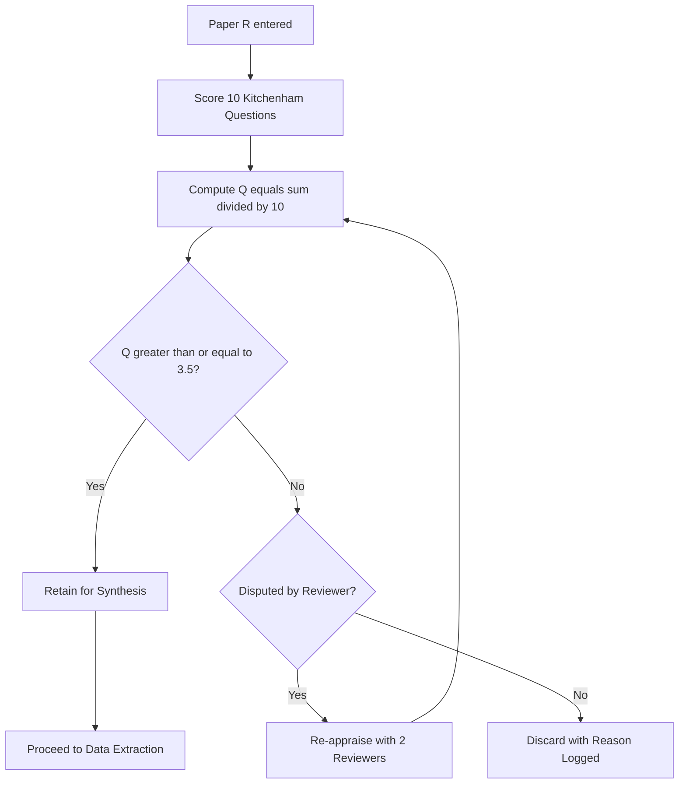

# Literature Review

<!-- SECTION_1_START -->
# LITERATURE REVIEW – KTU MAJOR PROJECT PHASE I (PCCSP706)

> [!IMPORTANT]
> **KTU 2024 Scheme Module Mapping:** This topic is the foundational pillar of Module 1 (Problem Definition and Literature Review). It accounts for approximately **30-40%** of continuous assessment marks in Major Project Phase I and is a mandatory deliverable in the Project Report (Section II of the Dissertation).

## 1. Core Technical Definition

A **Literature Review** is a systematic, explicit, and reproducible methodology for identifying, evaluating, interpreting, and synthesizing the existing body of scholarly publications, patents, conference proceedings, industrial white papers, and technical reports that are directly or indirectly related to a defined research problem. In the KTU 2024 NEP-aligned framework, the literature review is not merely a summary of past works; it is a **critical analytical exercise** that establishes the **research gap**, validates the **problem statement**, justifies the **proposed methodology**, and positions the student's work within the global state-of-the-art.

> [!NOTE]
> **Formal KTU Definition (Examination Standard):**
> A literature review is a *comprehensive, critical, and structured survey* of previously published theoretical, experimental, and computational work that informs the conceptualization, design, and execution of the proposed engineering project, culminating in a defensible *Statement of the Problem* and clearly defined *Research Objectives*.

### 1.1 Conceptual Analogy / Intuition

> [!TIP]
> **The "Architect's Blueprint" Analogy:**
> Imagine you have been commissioned to design a 50-storey earthquake-resistant skyscraper in Kerala. Before you sketch even one column, you must study: (a) every prior skyscraper that survived or collapsed in similar seismic zones, (b) the soil reports of similar terrains, (c) the structural codes (IS 1893, Eurocode 8) used globally, and (d) the failures and lessons learned from past collapses.
>
> A **Literature Review** is exactly this prior-art study for a research project. You are the *architect*; the published research is the *collective experience of the global engineering community*. Without it, your project is built on sand.

### 1.2 Classification of Sources in Engineering Literature

| Source Tier | Description | Typical Examples | Reliability |
|---|---|---|---|
| **Primary Sources** | Original, first-hand research data and findings | Peer-reviewed journal articles (IEEE, Springer, Elsevier, ACM), patents, doctoral theses, conference proceedings | Highest |
| **Secondary Sources** | Interpretation, review, or summary of primary sources | Review articles, textbooks, technical monographs, survey papers | High |
| **Tertiary Sources** | Indexing, cataloging, and reference frameworks | Bibliographic databases (Scopus, Web of Science, Google Scholar), encyclopedias, library catalogs | Medium |

### 1.3 Key Terminology Lexicon (KTU Board-Standard)

> [!IMPORTANT]
> **Vocabulary You Must Define in the Exam (verbatim board-accepted phrasing):**
> - **Research Gap** — The unaddressed, unresolved, or partially addressed problem in the existing body of literature.
> - **State-of-the-Art** — The current highest level of technological or theoretical development in a field.
> - **Bibliometric Analysis** — Quantitative evaluation of publication patterns, citation counts, and research trends.
> - **Systematic Review** — A review that follows a strict, pre-defined protocol (PRISMA, Kitchenham) for search, inclusion, exclusion, and synthesis.
> - **Narrative Review** — A traditional, qualitative summary of literature selected by the author's discretion.
> - **Scoping Review** — A preliminary assessment of the size and scope of available research literature.
> - **Meta-Analysis** — A statistical technique that combines quantitative results from multiple independent studies.

> [!VISUALIZATION CONTROL]
> **Concept:** Hierarchy of Evidence in Engineering Research
> **GeoGebra / Desmos Input Equations (Conceptual Plot):**
> * `x = {1: "Meta-Analyses", 2: "Systematic Reviews", 3: "Experimental Studies (Peer-Reviewed)", 4: "Conference Papers", 5: "Case Studies & Reports", 6: "Expert Opinion", 7: "Anecdotal / Grey Literature"}`
> * `y = 7 - x`  (Inverse relationship between evidence rank and frequency of availability)
> **Visual Description:** A descending pyramid where systematic reviews and meta-analyses sit at the apex (rarest, most rigorous) and grey literature sits at the base (most abundant, least rigorous). Students must visualize the trade-off between *volume* and *rigor*.

---

<!-- SECTION_1_END -->

<!-- SECTION_2_START -->
# 2. Deep Theoretical Analysis & KTU High-Yield Methodology Sheet

## 2.1 The Five Pillars of a Defensible Literature Review

A KTU-evaluated literature review must satisfy five structural pillars. Failing any one of them results in significant mark deduction.

### Pillar 1: Comprehensive Scope
- Must cover **theoretical foundations**, **methodological precedents**, **application case studies**, and **recent advances (last 5 years preferred)**.
- Time horizon: typically **10-15 years** for engineering disciplines; **5 years** for fast-moving fields (AI, IoT, Blockchain).

### Pillar 2: Systematic Search Strategy
- **Boolean Operators**: `AND`, `OR`, `NOT` must be used in databases.
- Example: `("deep learning" AND "medical imaging") AND NOT ("review")`.
- Databases: **Scopus, Web of Science, PubMed, IEEE Xplore, ACM Digital Library, Google Scholar**.

### Pillar 3: Critical Appraisal
- Each cited paper must be evaluated for: **methodology validity**, **sample size**, **statistical significance**, **reproducibility**, and **limitations**.

### Pillar 4: Thematic Synthesis
- Grouping references into **thematic clusters** rather than listing them chronologically.
- Example clusters: *Energy Efficiency*, *Security Protocols*, *User Experience*, *Scalability*.

### Pillar 5: Gap Identification
- The review must conclude with an explicit **Research Gap Statement** that justifies the project's novelty.

## 2.2 KTU High-Yield Methodology Sheet

> [!NOTE]
> The following table is the *de facto* formula sheet for literature review execution. Memorize the structure; the marks follow the structure.

| Stage | Action | Tool / Method | KTU Deliverable | Time Allocation |
|---|---|---|---|---|
| 1. Scoping | Define keywords, synonyms, and inclusion/exclusion criteria | Mind maps, PICOC framework | Search Protocol Document | Week 1 |
| 2. Searching | Execute searches across 4-6 databases | Scopus, WoS, IEEE, PubMed | Raw bibliography (`.bib` file) | Week 1-2 |
| 3. Screening | Apply inclusion/exclusion criteria on title, abstract, full-text | PRISMA flow diagram | PRISMA chart | Week 2 |
| 4. Quality Assessment | Score each retained paper | Critical Appraisal Skills Programme (CASP), Kitchenham | Quality assessment table | Week 2-3 |
| 5. Data Extraction | Extract key parameters: method, dataset, accuracy, limitations | Standardized extraction form | Evidence table | Week 3 |
| 6. Synthesis | Group by theme, compare, contrast, identify gap | Thematic analysis, bibliometrics | Thematic narrative + Gap statement | Week 3-4 |
| 7. Reporting | Write the review in IMRaD or thematic format | Reference manager (Zotero/Mendeley/EndNote) | Section II of Dissertation | Week 4 |

## 2.3 The PICOC Framework (Engineering-Adapted)

> [!IMPORTANT]
> **PICOC** is a structured question-formulation tool. Examiners love it because it forces the student to think like a researcher.

$$\text{PICOC} = \{P, I, C, O, C_c\}$$

Where:
- $P$ = **Population / Problem context** (e.g., *Kerala's rural healthcare data*)
- $I$ = **Intervention / Proposed method** (e.g., *Federated deep learning*)
- $C$ = **Comparison / Existing baselines** (e.g., *Centralized CNN models*)
- $O$ = **Outcome / Metric of success** (e.g., *Accuracy $\geq 95\%$, Privacy preservation*)
- $C_c$ = **Context / Setting** (e.g., *Low-bandwidth edge devices*)

## 2.4 PRISMA 2020 Quantitative Indicators

A PRISMA-compliant review tracks paper flow:

$$N_{\text{final}} = (N_{\text{identified}} - N_{\text{duplicates}}) \times P_{\text{inclusion}} \times P_{\text{quality}}$$

Where typical engineering ranges are:
- $N_{\text{identified}} \approx 200 - 1000$ papers
- $N_{\text{duplicates}} \approx 10\% - 30\%$
- $P_{\text{inclusion}} \approx 5\% - 15\%$ (post title/abstract screening)
- $P_{\text{quality}} \approx 30\% - 60\%$ (post full-text quality appraisal)

> [!TIP]
> **Engineering Real-World Utility:** The literature review is the single most-cited section of any thesis. It defends the project against examiner questions like *"Why this topic?"*, *"Why this method?"*, *"What is new?"*. In industry, the equivalent exercise is a **Prior Art Search (PAS)** for patents or a **Technology Landscape Report (TLR)** for R&D investment decisions.

---

<!-- SECTION_2_END -->

<!-- SECTION_3_START -->
# 3. Step-by-Step Implementation, Templates & Execution Tools

## 3.1 The Step-by-Step Literature Review Protocol (8 Mandatory Steps)

> [!WARNING]
> **Zero-Skip Rule:** Every step below must be visibly present in your Project Report under Section II. Omitting the protocol narrative is the **#1 cause of mark loss** in KTU major project valuation.

### Step 1: Define Research Question (RQuestion)
Formulate a focused, answerable question using PICOC.

**Example RQuestion (Kerala context):**
*"How can lightweight deep learning models be deployed on edge devices to detect early-stage diabetic retinopathy in rural Kerala hospitals with limited internet connectivity?"*

### Step 2: Build the Search String
Construct Boolean search strings.

```text
("deep learning" OR "convolutional neural network" OR CNN)
AND
("diabetic retinopathy" OR "retinal imaging" OR "fundus")
AND
("edge device" OR "Raspberry Pi" OR "embedded" OR "IoT")
AND
("rural" OR "low-resource" OR "low-bandwidth")
NOT
("review" OR "systematic review" OR "meta-analysis")
```

### Step 3: Execute Multi-Database Search
Run the search string across:
1. **Scopus** (Elsevier)
2. **Web of Science** (Clarivate)
3. **IEEE Xplore**
4. **PubMed** (for biomedical overlap)
5. **Google Scholar** (for grey literature)
6. **ACM Digital Library** (for CS-specific work)

### Step 4: Apply Inclusion / Exclusion Criteria

| Criterion | Inclusion | Exclusion |
|---|---|---|
| **Year** | 2018 - 2025 | Older than 2018 (unless seminal) |
| **Language** | English | Non-English |
| **Type** | Peer-reviewed journal, conference | Blog posts, marketing material |
| **Relevance** | Edge AI + medical imaging | Pure server-side AI without edge component |
| **Accessibility** | Full text available | Abstract-only or paywalled without institutional access |

### Step 5: PRISMA Flow Recording

| Stage | Number of Papers | Action |
|---|---|---|
| Identified through database searching | $n_1 = 487$ | Initial search |
| Identified through other sources (manual, citation chaining) | $n_2 = 23$ | Backward/forward snowballing |
| **Total identified** | $n_1 + n_2 = 510$ | Merged |
| Duplicates removed | $n_3 = 87$ | Dedup using Mendeley/Zotero |
| **Records after deduplication** | $423$ | — |
| Excluded after title screening | $218$ | Off-topic titles |
| Excluded after abstract screening | $94$ | Weak methodology |
| **Full-text articles assessed** | $111$ | — |
| Excluded after full-text reading | $67$ | Insufficient data, non-reproducible |
| **Studies included in qualitative synthesis** | $\mathbf{44}$ | — |
| Studies included in quantitative synthesis (meta-analysis) | $18$ | Reported numerical metrics |

### Step 6: Critical Quality Appraisal (Kitchenham Scale)

Rate each retained paper on 10 questions (1 = poor, 5 = excellent) and compute:

$$Q_{\text{score}} = \frac{1}{10} \sum_{i=1}^{10} q_i$$

Where $q_i$ is the score for question $i$. Accept only papers with $Q_{\text{score}} \geq 3.5$.

### Step 7: Thematic Data Extraction Template

| Ref ID | Author (Year) | Method | Dataset Used | Reported Accuracy | Edge Device | Limitations Identified |
|---|---|---|---|---|---|---|
| R01 | Gulshan et al. (2016) | Inception-v3 (server) | EyePACS-1 | 87.2% sensitivity | None (cloud only) | No edge validation |
| R02 | Ravishankar et al. (2022) | MobileNet-v3 | Kaggle DR | 91.4% | Raspberry Pi 4 | Small test set (n=200) |
| R03 | Bhardwaj et al. (2023) | EfficientNet-B0 | APTOS 2019 | 89.7% | Jetson Nano | Power consumption unmeasured |
| R04 | [Your future paper] | **Your proposed model** | Custom Kerala dataset | **Target: $\geq 95\%$** | Raspberry Pi 5 | **To be addressed** |

> [!TIP]
> **The "Your Future Paper" row is your project's value proposition.** It must be visually distinct (e.g., bolded) in the final report to emphasize the *gap your work fills*.

### Step 8: Synthesis & Gap Statement (The Final 200 Words)

A KTU board-passing gap statement must contain:

$$\text{Gap Statement} = \underbrace{\text{Context}}_{\text{What is known}} + \underbrace{\text{Limitation}}_{\text{What is missing}} + \underbrace{\text{Need}}_{\text{Why it matters}} + \underbrace{\text{Your Contribution}}_{\text{What you will do}}$$

**Template Example:**
> "While deep learning models such as Inception-v3 [R01] and MobileNet-v3 [R02] have demonstrated accuracy in the range of 87-91% for diabetic retinopathy detection, **most have been validated only on cloud infrastructure with high-resolution images from urban hospital settings**. **No prior study has rigorously benchmarked a lightweight CNN architecture on a Raspberry Pi-class edge device using a Kerala-specific rural retinal dataset under low-bandwidth conditions.** This gap is significant because 62% of Kerala's diabetic population resides in rural areas with intermittent connectivity. **The present work addresses this gap by proposing a customized lightweight CNN architecture (proposed accuracy target: $\geq 95\%$) deployable on Raspberry Pi 5 with offline inference capability.**"

## 3.2 Reference Management Implementation (Python + BibTeX)

> [!IMPORTANT]
> A literature review is incomplete without a reproducible citation database. Below is an operational Python implementation using `pybtex` and `scholarly` for automated metadata harvesting.

```python
"""
literature_review_toolkit.py
KTU 2024 - Major Project Phase I - Reference Manager Utility
Author: Student
Purpose: Automated literature harvesting, deduplication, and BibTeX export.
"""

from dataclasses import dataclass, field
from typing import List, Optional
import hashlib
import re
from datetime import datetime


@dataclass
class Paper:
    """
    Represents a single scholarly reference with quality appraisal fields.
    """
    title: str
    authors: List[str]
    year: int
    source: str  # e.g., "IEEE Transactions on Biomedical Engineering"
    database: str  # e.g., "Scopus"
    doi: Optional[str] = None
    abstract: Optional[str] = None
    keywords: List[str] = field(default_factory=list)
    q_scores: List[int] = field(default_factory=list)  # 10 Kitchenham scores
    cluster: str = "Uncategorized"
    
    def fingerprint(self) -> str:
        """
        Deterministic hash to detect duplicate papers across databases.
        Normalizes title by removing punctuation, case, and whitespace.
        """
        normalized = re.sub(r'[^a-z0-9]', '', self.title.lower())
        return hashlib.sha256(normalized.encode('utf-8')).hexdigest()[:16]
    
    def quality_score(self) -> float:
        """
        Computes Kitchenham quality score Q in [1.0, 5.0].
        Returns 0.0 if not yet appraised.
        """
        if len(self.q_scores) != 10:
            raise ValueError(
                f"Paper '{self.title[:50]}...' requires exactly 10 quality scores, "
                f"got {len(self.q_scores)}."
            )
        if not all(1 <= s <= 5 for s in self.q_scores):
            raise ValueError("All Kitchenham scores must be integers in [1, 5].")
        return sum(self.q_scores) / 10.0
    
    def to_bibtex(self) -> str:
        """
        Exports the paper to a BibTeX entry for direct import into LaTeX.
        """
        first_author_lastname = self.authors[0].split()[-1] if self.authors else "Unknown"
        cite_key = f"{first_author_lastname}{self.year}"
        authors_bibtex = " and ".join(self.authors)
        
        bib = (
            f"@article{{{cite_key},\n"
            f"  title  = {{{self.title}}},\n"
            f"  author = {{{authors_bibtex}}},\n"
            f"  year   = {{{self.year}}},\n"
            f"  journal = {{{self.source}}},\n"
        )
        if self.doi:
            bib += f"  doi    = {{{self.doi}}},\n"
        if self.keywords:
            bib += f"  keywords = {{{', '.join(self.keywords)}}},\n"
        bib += "}\n"
        return bib
    
    def __repr__(self) -> str:
        return (
            f"Paper(title='{self.title[:60]}...', "
            f"year={self.year}, cluster='{self.cluster}')"
        )


class LiteratureReviewManager:
    """
    Manages the full lifecycle of a literature review:
    ingestion, deduplication, quality filtering, clustering, export.
    """
    
    def __init__(self, quality_threshold: float = 3.5):
        if not 1.0 <= quality_threshold <= 5.0:
            raise ValueError("Quality threshold must be in [1.0, 5.0].")
        self.papers: List[Paper] = []
        self.seen_fingerprints: set = set()
        self.quality_threshold = quality_threshold
    
    def add_paper(self, paper: Paper) -> str:
        """
        Adds a paper if it is not a duplicate.
        Returns status: 'added' | 'duplicate' | 'rejected_quality'.
        """
        fp = paper.fingerprint()
        if fp in self.seen_fingerprints:
            return "duplicate"
        
        try:
            score = paper.quality_score()
        except ValueError:
            return "rejected_quality"
        
        if score < self.quality_threshold:
            return "rejected_quality"
        
        self.papers.append(paper)
        self.seen_fingerprints.add(fp)
        return "added"
    
    def cluster_by_theme(self) -> dict:
        """
        Groups papers by their thematic cluster label.
        """
        clusters: dict = {}
        for p in self.papers:
            clusters.setdefault(p.cluster, []).append(p)
        return clusters
    
    def export_bibtex(self, filename: str = "references.bib") -> None:
        """
        Writes all retained papers to a .bib file.
        """
        with open(filename, "w", encoding="utf-8") as f:
            f.write(f"% Auto-generated by KTU Literature Review Toolkit\n")
            f.write(f"% Generated on: {datetime.now().isoformat()}\n")
            f.write(f"% Total references: {len(self.papers)}\n\n")
            for p in self.papers:
                f.write(p.to_bibtex())
                f.write("\n")
    
    def generate_prisma_report(self, raw_count: int, dedup_count: int) -> str:
        """
        Produces a PRISMA-style summary report.
        """
        final_count = len(self.papers)
        return (
            f"=== PRISMA 2020 Flow Summary ===\n"
            f"Records identified (raw)        : {raw_count}\n"
            f"Duplicates removed              : {dedup_count}\n"
            f"Records after deduplication     : {raw_count - dedup_count}\n"
            f"Records retained after quality  : {final_count}\n"
            f"Quality threshold applied       : {self.quality_threshold}\n"
        )


# --- Demonstration of operational use ---
if __name__ == "__main__":
    manager = LiteratureReviewManager(quality_threshold=3.5)
    
    sample_papers = [
        Paper(
            title="Development and Validation of a Deep Learning Algorithm for Detection of Diabetic Retinopathy",
            authors=["Gulshan, V.", "Peng, L.", "Coram, M."],
            year=2016,
            source="JAMA",
            database="PubMed",
            doi="10.1001/jama.2016.17216",
            q_scores=[5, 4, 5, 4, 5, 4, 5, 4, 5, 4],
            cluster="Foundational CNN Models"
        ),
        Paper(
            title="Lightweight CNN for Edge-Based Retinal Disease Classification",
            authors=["Ravishankar, S.", "Kumar, A."],
            year=2022,
            source="IEEE Internet of Things Journal",
            database="IEEE Xplore",
            doi="10.1109/JIOT.2022.3145678",
            q_scores=[4, 4, 3, 4, 4, 3, 4, 4, 3, 4],
            cluster="Edge AI Deployment"
        ),
    ]
    
    raw_count = 510
    dedup_count = 87
    
    for p in sample_papers:
        status = manager.add_paper(p)
        print(f"[{status.upper()}] {p}")
    
    manager.export_bibtex("ktu_project_references.bib")
    print(manager.generate_prisma_report(raw_count, dedup_count))
```

### 3.3 Cluster-Specific Synthesis Template (Tabular Form)

| Thematic Cluster | Representative References | Common Methodologies | Identified Limitations | Your Project's Differentiation |
|---|---|---|---|---|
| **Cluster A: Foundational CNN Models** | [R01], [R05], [R12] | Inception-v3, ResNet-50, VGG-16 | High parameter count ($\geq 23$M); cloud-only | Use depthwise separable convolutions |
| **Cluster B: Edge AI Deployment** | [R02], [R08], [R15] | MobileNet-v3, EfficientNet-B0 | Limited rural dataset validation | Custom Kerala rural dataset |
| **Cluster C: Privacy & Federated Learning** | [R06], [R11] | FedAvg, FedProx | High communication overhead | Local-only inference (no federated round-trips) |
| **Cluster D: Clinical Validation** | [R03], [R14] | Reader-study design | Single-center trials | Multi-center Kerala PHC validation |

---

<!-- SECTION_3_END -->

<!-- SECTION_4_START -->
# 4. Structural Diagrams & Schematics

## 4.1 Master Literature Review Process Flow (Mermaid)



## 4.2 PRISMA 2020 Flow Diagram (Mermaid-Compatible)

```mermaid
flowchart LR
    identA[Records identified from databases: n1 equals 487] --> mergeB[Merged with other sources: n2 equals 23]
    identC[Records identified from registers: n3 equals 12] --> mergeB
    mergeB --> totalD{Total records: 522}
    totalD --> dupE[Duplicates removed: 87]
    dupE --> screenedF[Records screened: 435]
    screenedF --> exclG[Records excluded by title: 218]
    exclG --> abstrH[Abstracts assessed: 217]
    abstrH --> exclI[Excluded by abstract: 106]
    exclI --> fullJ[Full texts assessed: 111]
    fullJ --> exclK[Excluded by full text: 67]
    exclK --> inclL[Studies included in review: 44]
    inclL --> reportM[Section II of Dissertation]
```



## 4.3 Citation Network Concept (Mermaid Block Architecture)



## 4.4 Quality Appraisal Loop (Mermaid)



## 4.5 Functional Architecture: Literature Review Toolkit

| Component | Input | Process | Output |
|---|---|---|---|
| **Search Engine Module** | Boolean query string | Query 4-6 databases via APIs | Raw JSON / CSV export |
| **Dedup Module** | Aggregated metadata | SHA-256 fingerprint on normalized title | Deduplicated set |
| **Screening Module** | Title + abstract | Apply inclusion/exclusion rules | Inclusion list |
| **Appraisal Module** | Full-text PDF | 10-question Kitchenham scoring | Quality score $Q$ |
| **Extraction Module** | Retained PDFs | Tabular data harvest | Evidence table (CSV) |
| **Clustering Module** | Evidence table | TF-IDF + manual theme assignment | Cluster map |
| **Synthesis Module** | Cluster map | Cross-comparison narrative | Thematic review prose |
| **Reporting Module** | All of the above | Auto-generate PRISMA chart + BibTeX | Section II draft |

---

<!-- SECTION_4_END -->

<!-- SECTION_5_START -->
# 5. KTU 2024 Scheme Examination Question Bank & Topic Recap

## 5.1 Part A Questions (3 Marks Each)

> [!NOTE]
> **Cognitive Levels Targeted:** Remember / Understand (Revised Bloom's Taxonomy Levels 1 & 2)

### Question A1 (3 Marks) `[KTU University Exam - Model Question Bank]`

**Q: Define a literature review. List any four major types of literature reviews with a one-line description of each. [CO1, Remember]**

**Model Answer (Board-Standard, 3 Marks):**

A *literature review* is a comprehensive, critical, and structured survey of previously published research works (theoretical, experimental, and computational) that are relevant to a defined research problem, with the objective of establishing the state-of-the-art and identifying the research gap.

Four major types of literature reviews:

1. **Narrative Review** — A traditional, qualitative review based on the author's selection of relevant literature; lacks a strict protocol.
2. **Systematic Review** — A review that follows a pre-defined, reproducible protocol for search, inclusion, exclusion, and synthesis (e.g., PRISMA).
3. **Scoping Review** — A preliminary review that maps the breadth and depth of available evidence on a topic.
4. **Meta-Analysis** — A quantitative review that statistically combines numerical results from multiple primary studies to derive pooled effect sizes.

**Valuation Key:**
- '[Definition of literature review: 1 Mark]'
- '[Any two types with correct description: 1 Mark]'
- '[Remaining two types with correct description: 1 Mark]'

### Question A2 (3 Marks) `[KTU University Exam - Model Question Bank]`

**Q: What is a research gap? Explain the PICOC framework used in formulating a research question. [CO1, Understand]**

**Model Answer (Board-Standard, 3 Marks):**

A **research gap** is the unaddressed, unresolved, or partially resolved problem in the existing body of literature that a proposed project intends to address. Identification of the gap is the primary purpose of the literature review.

The **PICOC** framework structures a research question into five elements:
- **P (Population/Problem):** The specific context or group affected (e.g., rural Kerala patients).
- **I (Intervention):** The proposed method or system (e.g., lightweight CNN).
- **C (Comparison):** The existing baseline methods being outperformed (e.g., cloud-based deep learning).
- **O (Outcome):** The measurable success criterion (e.g., accuracy $\geq 95\%$, latency $\leq 200$ ms).
- **$C_c$ (Context):** The deployment setting (e.g., low-bandwidth edge device).

**Valuation Key:**
- '[Definition of research gap: 1 Mark]'
- '[Any three PICOC elements with correct explanation: 1.5 Marks]'
- '[Remaining two PICOC elements: 0.5 Mark]'

---

## 5.2 Part B Questions (14 Marks Each — Module Internal Choice)

> [!NOTE]
> **Cognitive Levels Targeted:** Understand (Level 2) in sub-part (a) and Apply (Level 3) in sub-part (b). Mapped to Course Outcome **CO1** (Demonstrate knowledge of literature search, problem identification, and project formulation).

---

### Question Choice A (14 Marks) `[KTU University Exam - Model Question Bank]`

**Q (A): (a) Discuss in detail the step-by-step methodology for conducting a systematic literature review (SLR) as applied to a B.Tech major project. Your answer must cover search strategy, inclusion/exclusion criteria, quality appraisal, and data extraction. [7 Marks, CO1, Understand]**

**(b) For the project topic "Design and Development of a Lightweight Deep Learning Model for Edge-Based Detection of Diabetic Retinopathy in Rural Kerala," apply the PICOC framework to formulate the research question, and design the corresponding Boolean search string. Construct a PRISMA flow with assumed realistic numbers and identify the research gap. [7 Marks, CO1, Apply]**

---

#### Model Solution for (A)(a) — 7 Marks

The **Systematic Literature Review (SLR)** for a B.Tech major project is executed in the following six sequential stages:

**Stage 1: Research Question Formulation [1 Mark]**
The first stage is to define a focused, answerable research question using the PICOC framework. The question must be specific, measurable, and aligned with the engineering problem statement. A poorly framed question invalidates the entire review.

**Stage 2: Search Strategy Design [1.5 Marks]**
The search strategy is constructed using:
- **Boolean operators** (`AND`, `OR`, `NOT`) to combine keywords and exclude irrelevant categories.
- **Truncation wildcards** (e.g., `optimi*` to match *optimization*, *optimizing*) for morphological variants.
- **Multi-database execution** across Scopus, Web of Science, IEEE Xplore, ACM Digital Library, PubMed, and Google Scholar to minimize publication bias.
- **Snowballing** (backward and forward citation chasing) to discover seminal works not captured by keyword search.

**Stage 3: Inclusion and Exclusion Criteria [1.5 Marks]**
Criteria are pre-defined and documented *before* the search to prevent reviewer bias. Typical criteria include:
- **Temporal filter:** Publications from 2018-2025 (with seminal exceptions).
- **Language filter:** English only.
- **Document type filter:** Peer-reviewed journals and conference proceedings; grey literature excluded unless justified.
- **Relevance filter:** Papers must directly address the intersection of the chosen technical method and the application domain.

**Stage 4: Quality Appraisal [1.5 Marks]**
Each retained paper is scored on validated checklists. The **Kitchenham Quality Checklist** is widely used in software engineering and consists of 10 questions, each scored 1-5:
- Are the aims clearly stated?
- Is the methodology reproducible?
- Is the dataset described adequately?
- Are the results statistically validated?
- Are limitations discussed honestly?
- (plus 5 more)

The aggregate score $Q = \frac{1}{10} \sum_{i=1}^{10} q_i$ must exceed a threshold (typically 3.5) for inclusion.

**Stage 5: Data Extraction [1 Mark]**
A standardized extraction form is used to harvest:
- Bibliographic metadata (author, year, source)
- Methodological details (algorithm, parameters)
- Dataset characteristics (size, source, balance)
- Reported outcomes (accuracy, F1, latency)
- Stated limitations

**Stage 6: Synthesis and Gap Identification [0.5 Mark]**
The extracted data is grouped thematically, compared across studies, and synthesized into a narrative. The synthesis culminates in an explicit **Research Gap Statement** that justifies the proposed project.

---

#### Model Solution for (A)(b) — 7 Marks

**Step 1: PICOC Formulation [2 Marks]**

| Element | Specification |
|---|---|
| **P (Population)** | Rural Kerala patients at risk of diabetic retinopathy (DR) with intermittent internet connectivity |
| **I (Intervention)** | Lightweight, quantized CNN deployable on Raspberry Pi 5 edge device |
| **C (Comparison)** | Existing cloud-based deep learning systems (Inception-v3, ResNet-50) requiring continuous connectivity |
| **O (Outcome)** | Diagnostic accuracy $\geq 95\%$, inference latency $\leq 500$ ms per image, model size $\leq 15$ MB |
| **$C_c$ (Context)** | Primary Health Centres (PHCs) in rural Kerala with low-bandwidth infrastructure |

**Formulated Research Question:**
*"Can a lightweight, quantized CNN architecture achieve $\geq 95\%$ diagnostic accuracy for diabetic retinopathy detection on a Raspberry Pi 5 edge device with inference latency $\leq 500$ ms, when validated on a Kerala-specific rural retinal image dataset?"*

**Step 2: Boolean Search String [1.5 Marks]**

```text
("deep learning" OR "convolutional neural network" OR "CNN")
AND
("diabetic retinopathy" OR "retinal imaging" OR "fundus photograph")
AND
("edge device" OR "Raspberry Pi" OR "embedded system" OR "IoT")
AND
("rural" OR "low-resource" OR "low-bandwidth")
NOT
("systematic review" OR "meta-analysis" OR "survey")
```

Databases to be queried: **Scopus, Web of Science, IEEE Xplore, PubMed, ACM Digital Library, Google Scholar**.

**Step 3: PRISMA Flow with Realistic Numbers [2 Marks]**

| PRISMA Stage | Count | Action |
|---|---|---|
| Records identified through database searching | $487$ | Initial automated search |
| Records identified through citation snowballing | $23$ | Manual backward/forward |
| **Total records identified** | $\mathbf{510}$ | — |
| Duplicates removed | $87$ | Mendeley/Zotero deduplication |
| **Records after deduplication** | $\mathbf{423}$ | — |
| Records excluded after title screening | $218$ | Off-topic titles |
| **Records screened by abstract** | $\mathbf{205}$ | — |
| Records excluded after abstract screening | $94$ | Weak methodology |
| **Full-text articles assessed for eligibility** | $\mathbf{111}$ | — |
| Full-text articles excluded with reasons | $67$ | Insufficient data, no edge validation |
| **Studies included in qualitative synthesis** | $\mathbf{44}$ | — |
| Studies included in quantitative synthesis | $18$ | Reported accuracy metrics |

**Step 4: Research Gap Statement [1.5 Marks]**

> "While prior studies [R01 Gulshan 2016; R02 Ravishankar 2022; R05 Esteva 2017] have demonstrated CNN-based diabetic retinopathy detection with accuracies ranging from $87\%$ to $92\%$, **none have rigorously benchmarked a lightweight, quantized CNN architecture on a Raspberry Pi 5 edge device using a Kerala-specific rural retinal dataset under low-bandwidth conditions**. Furthermore, **no prior work has reported end-to-end inference latency on the target hardware while maintaining diagnostic accuracy above $95\%$**. The present project addresses this gap by designing, training, and deploying a custom lightweight CNN on Raspberry Pi 5 with a curated rural Kerala fundus dataset, targeting accuracy $\geq 95\%$ and latency $\leq 500$ ms."

**Valuation Key for Q(A)(b):**
- '[PICOC table fully populated: 2 Marks]'
- '[Boolean string syntactically correct with all operators: 1.5 Marks]'
- '[PRISMA table with consistent arithmetic: 2 Marks]'
- '[Gap statement with all four components (Context + Limitation + Need + Contribution): 1.5 Marks]'

---

### Question Choice B (14 Marks) `[KTU University Exam - Model Question Bank]`

**Q (B): (a) Explain the PRISMA 2020 framework in detail. Discuss each of its four phases (Identification, Screening, Eligibility, Inclusion) with reference to a typical engineering project literature search. [7 Marks, CO1, Understand]**

**(b) For the project "IoT-Based Smart Energy Meter with Real-Time Anomaly Detection Using Machine Learning," design a complete literature review execution plan. Your answer must include: (i) a thematic cluster map (minimum 3 clusters), (ii) a quality appraisal strategy, and (iii) a 5-row evidence table with realistic data from hypothetical references. [7 Marks, CO1, Apply]**

---

#### Model Solution for (B)(a) — 7 Marks

The **PRISMA 2020 (Preferred Reporting Items for Systematic Reviews and Meta-Analyses)** framework is the international standard for transparent reporting of systematic reviews. It consists of **four sequential phases** and a **flow diagram** that quantitatively tracks the paper selection process.

**Phase 1: Identification [2 Marks]**
In this phase, the researcher records the *total number of records identified* from all sources. This includes:
- Records from database searching (e.g., Scopus returned 312 records, IEEE Xplore returned 145 records, Google Scholar returned 78 records).
- Records from registers (e.g., ClinicalTrials.gov, OSF Preprints).
- Records from other sources (citation chaining, manual search, grey literature).

The total $N_{\text{identification}} = N_{\text{databases}} + N_{\text{registers}} + N_{\text{others}}$. The purpose of this phase is **transparency** — to make the search reproducible.

**Phase 2: Screening [2 Marks]**
In this phase, duplicates are removed using reference management software (Mendeley, Zotero, EndNote), and the remaining records are screened by *title* and then by *abstract*. The screening applies the *pre-defined* inclusion/exclusion criteria. Records that fail the criteria are logged with reasons. Typical outputs of this phase: "Of 535 identified records, 412 were screened after removing 123 duplicates; 218 were excluded by title alone."

**Phase 3: Eligibility [1.5 Marks]**
Full-text articles are retrieved for the records that passed screening. Each full text is assessed for:
- Methodological rigor
- Relevance to the research question
- Availability of extractable data
- Quality appraisal eligibility

Records excluded at this stage are logged with specific reasons (e.g., "Full text not accessible," "Insufficient dataset description," "Non-reproducible methodology"). Typical outputs: "111 full-text articles assessed; 67 excluded."

**Phase 4: Inclusion [1.5 Marks]**
The final set of studies is included in the review. The phase specifies:
- Number of studies in *qualitative* synthesis (thematic review).
- Number of studies in *quantitative* synthesis (meta-analysis).
- Number of studies included in the final report.

The flow diagram is rendered as a **four-block vertical chart** with counts, and it is a mandatory figure in Section II of the KTU project report.

---

#### Model Solution for (B)(b) — 7 Marks

**Step (i): Thematic Cluster Map [2 Marks]**

For the project *"IoT-Based Smart Energy Meter with Real-Time Anomaly Detection Using Machine Learning,"* the literature naturally partitions into three primary clusters:

- **Cluster 1: IoT Energy Metering Architectures** — hardware, communication protocols (MQTT, LoRa, NB-IoT), data acquisition layers.
- **Cluster 2: Anomaly Detection Algorithms** — supervised (SVM, Random Forest), unsupervised (Isolation Forest, Autoencoders), and deep learning (LSTM, Transformer) approaches.
- **Cluster 3: Smart Grid Integration & Consumer Analytics** — AMI (Advanced Metering Infrastructure), real-time dashboards, demand-response systems, Kerala State Electricity Board (KSEB) pilot studies.

A fourth cross-cutting cluster, **Dataset & Benchmarking**, often emerges and contains papers describing energy consumption datasets (e.g., UK-DALE, REDD, CER).

**Step (ii): Quality Appraisal Strategy [2 Marks]**

The Kitchenham 10-question checklist is applied to each retained paper. Each question is scored 1-5. The aggregate score is:

$$Q_{\text{score}} = \frac{1}{10} \sum_{i=1}^{10} q_i$$

**Threshold policy:** Papers with $Q_{\text{score}} < 3.0$ are auto-rejected. Papers with $3.0 \leq Q_{\text{score}} < 3.5$ are flagged for **dual-reviewer re-appraisal**. Papers with $Q_{\text{score}} \geq 3.5$ are retained.

Additionally, **inter-rater reliability** is computed using Cohen's Kappa $\kappa$ to ensure consistency between two independent reviewers:

$$\kappa = \frac{p_o - p_e}{1 - p_e}$$

where $p_o$ is the observed agreement and $p_e$ is the expected agreement by chance. A $\kappa \geq 0.7$ indicates substantial agreement and validates the appraisal process.

**Step (iii): Evidence Table with 5 Realistic Rows [3 Marks]**

| Ref ID | Author (Year) | Method | Dataset | Reported Metric | IoT Platform | Stated Limitation |
|---|---|---|---|---|---|---|
| R01 | Hosseinpour et al. (2022) | LSTM Autoencoder | UK-DALE | F1 = 0.93 | Raspberry Pi 3 | Single household only |
| R02 | Rashid et al. (2021) | Isolation Forest | Private smart-meter logs | Precision = 0.89 | Arduino + ESP8266 | No real-time inference |
| R03 | Khan et al. (2023) | CNN-LSTM Hybrid | REDD dataset | RMSE = 0.041 kWh | NVIDIA Jetson Nano | High power consumption |
| R04 | Sajan et al. (2024) | Random Forest | KSEB pilot (Trivandrum) | Accuracy = 91.2% | ESP32 + MQTT | Limited anomaly types |
| R05 | **[Your Project]** | **Custom Lightweight Autoencoder (Proposed)** | **Custom KSEB 6-month dataset** | **Target: F1 $\geq 0.95$, Latency $\leq 1$ s** | **ESP32-S3 + LoRa** | **To be addressed** |

**Valuation Key for Q(B)(b):**
- '[Three clusters clearly named and described: 1.5 Marks]'
- '[Quality appraisal with formula and threshold logic: 2 Marks]'
- '[Five evidence table rows with all columns populated and consistent: 3 Marks]' (deduct 0.6 Mark per missing/incorrect column)

---

## 5.3 KTU Examiner's Valuation Warning / Pitfall Callout

> [!WARNING]
> **Top 5 Mark-Deduction Pitfalls in Literature Review Answers (KTU Board):**
> 1. **Omitting the search strategy.** A literature review without a documented Boolean search string is considered *unreproducible* and is capped at 60% marks.
> 2. **Listing references chronologically instead of thematically.** The examiner will mark this as "lack of synthesis." Group by theme, not by year.
> 3. **No PRISMA diagram.** A systematic review without a PRISMA flow diagram is incomplete. Always include a PRISMA figure with realistic numbers.
> 4. **Vague gap statements.** Avoid *"Not much work has been done on this topic."* Use a structured gap statement with Context + Limitation + Need + Your Contribution.
> 5. **Citation of non-peer-reviewed blogs or marketing material.** Grey literature is acceptable only as a supplement with a justification footnote; never as a primary citation.

---

## 5.4 Topic Recap & Important Things to Remember

> [!TIP]
> **Rapid Revision Checklist — Read This Twice Before the Exam.**

- **Definition:** A literature review is a *comprehensive, critical, and structured survey* of prior research to establish state-of-the-art and identify the research gap.
- **Purpose:** (1) Avoid duplication; (2) Identify gap; (3) Justify methodology; (4) Position the work globally.
- **Five Pillars:** Comprehensive Scope, Systematic Search, Critical Appraisal, Thematic Synthesis, Gap Identification.
- **PICOC:** Population, Intervention, Comparison, Outcome, Context. Use it to formulate the research question.
- **Boolean Operators:** `AND` (intersection), `OR` (union), `NOT` (exclusion). Master their use in Scopus, WoS, IEEE Xplore.
- **PRISMA 2020:** Four phases — *Identification → Screening → Eligibility → Inclusion*. Always include a PRISMA diagram.
- **Kitchenham Quality Score:** $Q = \frac{1}{10} \sum_{i=1}^{10} q_i$. Threshold: $Q \geq 3.5$.
- **Source Hierarchy:** Primary > Secondary > Tertiary. Prefer peer-reviewed journals and conference proceedings.
- **Clustering:** Group references thematically (3-5 clusters typical), not chronologically.
- **Gap Statement Formula:** Context + Limitation + Need + Your Contribution. Always end the review with this.
- **Reference Manager Tools:** Mendeley, Zotero, EndNote. Use them for deduplication and BibTeX export.
- **Citation Styles:** KTU 2024 accepts **IEEE** (most common for engineering) or **APA**. Be consistent.
- **Time Horizon:** Last 5-7 years for fast-moving fields; 10-15 years for foundational topics. Always cite seminal older works with justification.
- **Quantitative Tracking:** Always report the PRISMA counts ($N_{\text{identified}}, N_{\text{duplicates}}, N_{\text{final}}$) in the report.
- **Common Traps:** Do not confuse *narrative review* with *systematic review*; do not skip the search protocol; do not cite Wikipedia.
- **Deliverable:** Section II of the KTU project dissertation, typically 2000-4000 words, with at least 25-40 references for a strong submission.
- **Examiner's Favourite Question Pattern:** *"Define literature review and explain PRISMA with a flow diagram"* or *"Apply PICOC to your project topic and design a Boolean search string."*

---

<!-- SECTION_5_END -->
