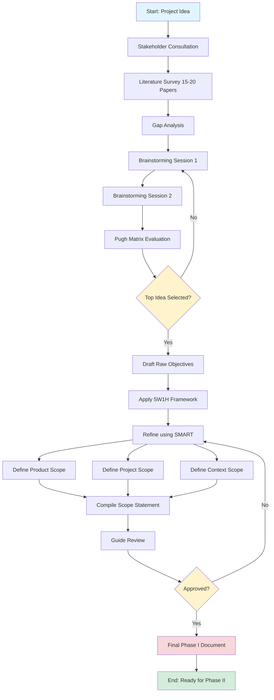
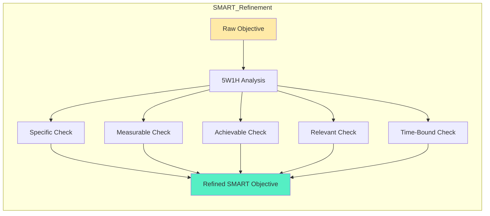
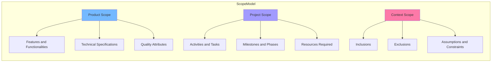
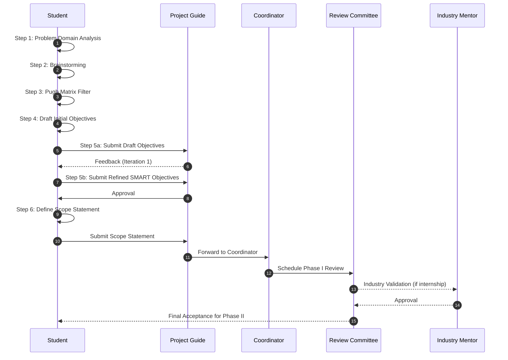

# Objective Definition and Scope Identification

<!-- SECTION_1_START -->
# Objective Definition and Scope Identification

## 1. Core Technical Definition

> [!IMPORTANT]
> **Objective Definition** in the context of an engineering major project refers to the systematic process of articulating **precise, measurable, and achievable goals** that the project intends to accomplish, formulated using established frameworks such as the **SMART** criteria (Specific, Measurable, Achievable, Relevant, Time-bound) approved under **KTU 2024 Scheme Project Evaluation Guidelines (PCCSP706)**.

> [!IMPORTANT]
> **Scope Identification** is the structured procedure of delineating the **boundaries, deliverables, functionalities, constraints, and exclusions** of the proposed project. It answers the fundamental question: *"What is included and what is NOT included in the project?"* — thereby preventing **scope creep**, a critical failure factor documented in the **Project Management Body of Knowledge (PMBOK® Guide, 7th Edition)** by the **Project Management Institute (PMI)**.

### Conceptual Analogy / Intuition

Imagine you are planning a **road trip from Thiruvananthapuram to Kasaragod** in Kerala.

- **Objective Definition** is like deciding: *"I will reach Kasaragod within 10 hours, spending less than ₹3,000, and visiting at least 2 tourist spots along the way."* This is **clear, measurable, and time-bound** — exactly what a SMART objective does for your engineering project.

- **Scope Identification** is like drawing a **map boundary** — you decide you will travel only through National Highways (NH-44, NH-66), you will NOT take any ferry routes, and you WILL NOT extend the trip to Mangalore. Anything outside this map is **out of scope**.

Without these two steps, you will either drive aimlessly (no objectives) or keep adding detours endlessly (no scope boundary) — both lead to **project failure**.

> [!NOTE]
> **KTU 2024 Scheme Highlight:** Module 1 of **PCCSP706 (Major Project Phase I)** explicitly requires the student to submit a **Project Proposal Document** containing clearly defined objectives and a well-documented scope statement. This forms **30% of the Phase I internal evaluation** as per KTU academic regulations.

### Key Terminology Reference

| Term | Definition | KTU Context |
|------|------------|-------------|
| **Problem Statement** | A concise description of the issue the project addresses | First section of Phase I Report |
| **Objective** | A specific, measurable goal the project aims to achieve | Required in Synopsis Submission |
| **Scope** | The boundaries defining what the project will and will not deliver | Defines deliverables of Phase I |
| **Deliverable** | A tangible or intangible output produced by the project | Evaluated during Phase I Review |
| **Constraint** | A limiting factor (time, budget, technology) | Part of Feasibility Analysis |
| **Stakeholder** | Any person/group affected by the project outcome | Guide, Coordinator, Industry Mentor |

> [!VISUALIZATION CONTROL]
> **Concept:** SMART Objective Framework Visualization
> **GeoGebra / Desmos Input Equations:**
> * `f(x) = x` (Specific axis)
> * `g(x) = \sqrt{x}` (Measurable curve)
> * `h(x) = \log(x)` (Achievable curve)
> * `k(x) = \sin(x)` (Relevant oscillation)
> * `m(x) = -x + 5` (Time-bound linear boundary)
> **Visual Description:** Five converging curves meeting at a single focal point representing project success — the intersection of all five SMART dimensions.

---

<!-- SECTION_1_END -->

<!-- SECTION_2_START -->
# 2. Deep Theoretical Analysis & KTU High-Yield Framework Sheet

## 2.1 The SMART Objectives Framework

The **SMART** acronym, originally coined by **George T. Doran (1981)** in the paper *"There's a S.M.A.R.T. way to write management's goals,"* is the **gold standard** for objective definition across all KTU major projects.

| Dimension | Meaning | Example (IoT-based Air Quality Monitoring System) |
|-----------|---------|---------------------------------------------------|
| **S** — Specific | Clearly defined, no ambiguity | *"To design a low-cost IoT sensor node for monitoring PM2.5 levels"* |
| **M** — Measurable | Quantifiable success criteria | *"The system must detect PM2.5 with ±5 µg/m³ accuracy"* |
| **A** — Achievable | Realistic given resources | *"Using Arduino Uno and SDS011 sensor within ₹2,500 budget"* |
| **R** — Relevant | Aligned with engineering domain | *"Addresses public health concerns in urban Kerala"* |
| **T** — Time-bound | Has a clear deadline | *"To be completed by April 2026 (Phase I submission deadline)"* |

> [!NOTE]
> **KTU High-Yield Tip:** When your project guide asks *"What are the objectives of your project?"*, always answer with **4–6 SMART objectives** — one academic, one technical, one societal, and one innovation-oriented.

## 2.2 SMART Variants for Engineering Projects

KTU evaluators often prefer extended SMART variants. Master these for higher scoring:

- **SMARTER** = SMART + **E**valuate + **R**evise
- **SMAC** = **S**pecific, **M**easurable, **A**chievable, **C**hallenging (favoured for research-oriented projects)
- **CLEAR** = **C**ollaborative, **L**imited, **E**motional, **A**pprovable, **R**efinable (used for innovation/startup-track projects)

## 2.3 Scope Identification — The Three-Layer Model

Scope identification must address **three distinct layers** simultaneously:

### Layer 1: Product Scope
The **features and functionalities** of the final product/system.

### Layer 2: Project Scope
The **work to be done** — activities, tasks, milestones, resources.

### Layer 3: Context Scope
The **boundaries** — what is included AND explicitly excluded.

## 2.4 KTU High-Yield Formula Sheet

| Formula / Framework | Equation / Structure | Application |
|---------------------|----------------------|-------------|
| SMART Score | $S_{SMART} = \frac{\sum_{i=1}^{5} w_i \cdot x_i}{5}$ where $w_i$ is weight, $x_i \in \{0,1\}$ | Evaluates quality of an objective (0 to 1 scale) |
| Scope Coverage Ratio | $SCR = \frac{\text{In-Scope Deliverables}}{\text{In-Scope} + \text{Out-of-Scope}}$ | Measures clarity of scope definition |
| Objective Specificity Index | $OSI = \frac{\text{Number of Quantifiable Metrics}}{\text{Total Number of Objectives}}$ | Higher OSI = Better objective quality |
| Feasibility Score | $F = \alpha T + \beta E + \gamma R + \delta S$ | $T$=Technical, $E$=Economic, $R$=Resource, $S$=Schedule feasibility |
| Risk Impact Value | $RIV = P \times I$ | $P$=Probability, $I$=Impact (1–5 scale) |

> [!IMPORTANT]
> **Engineering Real-World Utility:** The SMART-Scope framework is used by **IEEE**, **ACM**, **PMI**, and every major **R\&D organization** worldwide for project charter preparation. Industries like **TCS, Infosys, Google, Microsoft, ISRO, and DRDO** mandate SMART objectives in their internship project proposals.

## 2.5 Common Pitfalls in Objective Definition

> [!WARNING]
> **Do NOT write vague objectives like:**
> - ❌ *"To make a good website"* — **NOT measurable, not time-bound**
> - ❌ *"To study machine learning"* — **NOT specific, no deliverable**
> - ❌ *"To help society"* — **NOT achievable in project timeframe**

> **Always write precise objectives like:**
> - ✅ *"To develop a CNN-based classifier achieving ≥90% accuracy on the CIFAR-10 dataset within 4 months using TensorFlow 2.x"*
> - ✅ *"To deploy a Flutter-based mobile application on the Google Play Store with at least 3 user authentication methods by March 2026"*

---

<!-- SECTION_2_END -->

<!-- SECTION_3_START -->
# 3. Step-by-Step Methodology & Implementation

## 3.1 The 7-Step Process for Objective Definition and Scope Identification

This is the **canonical methodology** evaluated by KTU project review panels. Every step must be documented in the **Phase I Report (PCCSP706)**.

### Step 1: Problem Domain Analysis
- Conduct **stakeholder interviews** (guide, industry mentor, end-users).
- Survey **existing systems and literature** (minimum **15–20 IEEE/Springer/ACM papers**).
- Identify **gaps** in current solutions.

### Step 2: Brainstorming & Ideation
- Conduct at least **2 brainstorming sessions** with the project team.
- Generate **20+ raw ideas** without filtering.
- Apply the **SCAMPER technique** (Substitute, Combine, Adapt, Modify, Put to other use, Eliminate, Rearrange).

### Step 3: Filter & Prioritize Ideas
- Use a **Pugh Matrix** (Decision Matrix) to score ideas against criteria.
- Select the **top-ranked idea** for development.

### Step 4: Draft Initial Objectives
- Write **5–7 raw objectives** in plain English.
- Apply the **5W1H framework**: *What, Why, Who, Where, When, How*.

### Step 5: Refine Objectives Using SMART
- Transform each raw objective into **SMART format**.
- Ensure each objective has at least **one measurable metric**.

### Step 6: Define Scope Statement
- Write a **formal scope statement** with all three layers (Product, Project, Context).
- Explicitly list **assumptions** and **constraints**.
- List **deliverables** for Phase I and Phase II separately.

### Step 7: Validation & Approval
- Present to the **project guide** for review.
- Incorporate feedback.
- Get **formal sign-off** (mandatory for KTU evaluation).

## 3.2 Detailed Objective Formulation — Worked Example

**Project Title:** *AI-Powered Crop Disease Detection System for Kerala Farmers*

### Step-by-Step Objective Construction

**Raw Objective (Step 4):**
> *"Build a system to detect crop diseases."*

**Applying 5W1H (Step 4):**
- **What?** Image-based disease detection system
- **Why?** Reduce crop loss in Kerala
- **Who?** Marginal farmers in Wayanad district
- **Where?** Mobile application (offline-capable)
- **When?** Phase II completion: April 2026
- **How?** Using CNN, TensorFlow Lite, Flutter

**Refined SMART Objective (Step 5):**
> *"To design and develop a deep learning-based image classification system using **Convolutional Neural Networks (CNN)** that detects **5 major diseases of Areca nut and Coconut** crops with a target accuracy of **≥92%**, deployable as a **Flutter mobile application** on Android devices, with **offline inference capability** using TensorFlow Lite, to be completed by **April 2026** within a budget of **₹15,000**."*

**SMART Score Calculation:**
$$S_{SMART} = \frac{1 \cdot 1 + 1 \cdot 1 + 1 \cdot 1 + 1 \cdot 1 + 1 \cdot 1}{5} = 1.00$$

(All five SMART criteria are explicitly addressed — perfect score.)

## 3.3 Scope Statement Template (KTU-Approved Format)

```
SCOPE STATEMENT
================
Project Title      : [Insert Title]
Project ID         : [University Reg. No.]
Guide              : [Faculty Name]
Department         : [Department]

1. PRODUCT SCOPE
   - The system shall provide...
   - The system shall include features such as...
   - The system shall NOT include (out of scope):
       * Feature X
       * Feature Y

2. PROJECT SCOPE
   Phase I (Current):
       - Literature review
       - Requirement analysis
       - System design
   Phase II (Future):
       - Implementation
       - Testing
       - Deployment

3. CONTEXT SCOPE
   - Target users: ...
   - Geographic boundary: ...
   - Technical boundary: ...
   - Time boundary: ...

4. ASSUMPTIONS
   - Assumption 1
   - Assumption 2

5. CONSTRAINTS
   - Budget: ₹...
   - Time: ... months
   - Technology: ...
   - Regulatory: ...

6. DELIVERABLES
   Phase I: Project Report, Synopsis, Design Document
   Phase II: Working Prototype, Final Report, Research Paper
```

## 3.4 Comparative Analysis: Real-World Engineering Case Frameworks

| Engineering Domain | Objective Framework Used | Scope Definition Method | Regulatory/Industry Standard | Example Project |
|--------------------|--------------------------|--------------------------|------------------------------|-----------------|
| **Software Development** | SMART + User Stories | MoSCoW Prioritization | IEEE 830 (SRS Standard) | *"Develop an e-commerce platform with MERN stack"* |
| **Hardware/IoT** | SMARTER + BOM Analysis | System Boundary Diagram | IEC 61508 (Functional Safety) | *"Design a solar-powered water quality monitor"* |
| **Machine Learning/AI** | SMAC + Metric-Driven | Confusion Matrix Boundaries | ISO/IEC 23053 (AI Framework) | *"Build a 95%-accurate cancer detection model"* |
| **Civil Engineering** | SMART + BoQ (Bill of Quantities) | Gantt Chart Scope | IS 456:2000 (Concrete Design) | *"Design a 4-story residential building"* |
| **Biomedical** | SMART + FDA Compliance | V-Model Verification | ISO 13485 (Medical Devices) | *"Develop a low-cost ECG monitoring device"* |
| **Industrial Internship** | CLEAR + KPI Mapping | Internship Charter | AICTE Internship Policy 2023 | *"Automate invoice processing at Infosys"* |

## 3.5 Python Code: Objective Quality Validator (Auxiliary Tool)

```python
from dataclasses import dataclass, field
from typing import List, Dict
from enum import Enum
import re
import logging

# Configure structured error logging
logging.basicConfig(
    level=logging.INFO,
    format="%(asctime)s | %(levelname)s | %(message)s"
)
logger = logging.getLogger("KTU_ObjectiveValidator")


class SmartDimension(Enum):
    SPECIFIC = "Specific"
    MEASURABLE = "Measurable"
    ACHIEVABLE = "Achievable"
    RELEVANT = "Relevant"
    TIME_BOUND = "Time-bound"


@dataclass
class Objective:
    text: str
    domain: str
    target_score: float = 0.8


@dataclass
class ValidationResult:
    objective_text: str
    smart_scores: Dict[str, bool] = field(default_factory=dict)
    overall_score: float = 0.0
    feedback: List[str] = field(default_factory=list)
    is_valid: bool = False


class SmartObjectiveValidator:
    """Validates KTU Major Project objectives against SMART criteria."""

    # Absolute boundary thresholds (do not modify without faculty approval)
    MIN_OBJECTIVE_LENGTH = 30
    MAX_OBJECTIVE_LENGTH = 500
    MIN_ACCEPTABLE_SCORE = 0.6

    # Heuristic keyword patterns for each SMART dimension
    MEASURABLE_PATTERNS = [
        r"\d+\s*%",                # Percentages (e.g., 90%)
        r"\d+\s*(?:ms|sec|min|hr|hrs|hours|days|weeks|months|years)",
        r"accuracy\s*(?:of|>=|>|=>)\s*\d+",
        r"Rs\.?\s*\d+|\u20B9\s*\d+|\d+\s*rupees",
        r"\d+\s*(?:users|requests|samples|records|GB|MB|KB|kg|km|metres|meters|m\b)"
    ]
    TIME_BOUND_PATTERNS = [
        r"by\s+(?:January|February|March|April|May|June|July|August|September|October|November|December)",
        r"by\s+\d{4}",
        r"within\s+\d+\s*(?:days|weeks|months|years|semesters)",
        r"deadline",
        r"complete[ds]?\s+by",
        r"scheduled\s+for"
    ]
    ACHIEVABLE_PATTERNS = [
        r"using\s+[A-Za-z0-9\s\+\#\.]+",
        r"with\s+(?:a\s+)?budget\s+of",
        r"(?:affordable|low-cost|economical|feasible)"
    ]

    def validate(self, obj: Objective) -> ValidationResult:
        """Run complete SMART validation on a single objective."""
        try:
            result = ValidationResult(objective_text=obj.text)
            text = obj.text.strip()
            text_lower = text.lower()

            # ----- Boundary Check -----
            if not (self.MIN_OBJECTIVE_LENGTH <= len(text) <= self.MAX_OBJECTIVE_LENGTH):
                logger.warning(
                    f"Objective length {len(text)} outside allowed "
                    f"[{self.MIN_OBJECTIVE_LENGTH}, {self.MAX_OBJECTIVE_LENGTH}]"
                )
                result.feedback.append(
                    f"Length must be between {self.MIN_OBJECTIVE_LENGTH} "
                    f"and {self.MAX_OBJECTIVE_LENGTH} characters."
                )

            # ----- Specific Check -----
            word_count = len(text.split())
            is_specific = word_count >= 8 and not self._is_vague(text_lower)
            result.smart_scores["Specific"] = is_specific
            if not is_specific:
                result.feedback.append("Be more specific — name the technology, method, or artifact.")

            # ----- Measurable Check -----
            is_measurable = any(
                re.search(p, text, re.IGNORECASE)
                for p in self.MEASURABLE_PATTERNS
            )
            result.smart_scores["Measurable"] = is_measurable
            if not is_measurable:
                result.feedback.append("Add at least one quantifiable metric (%, ₹, time, count).")

            # ----- Achievable Check -----
            is_achievable = any(
                re.search(p, text, re.IGNORECASE)
                for p in self.ACHIEVABLE_PATTERNS
            )
            result.smart_scores["Achievable"] = is_achievable
            if not is_achievable:
                result.feedback.append("Mention tools, budget, or feasibility indicators.")

            # ----- Relevant Check -----
            is_relevant = bool(obj.domain) and obj.domain.lower() in text_lower
            relevant_keywords = ["society", "community", "user", "industry", "domain", "engineer"]
            is_relevant = is_relevant or any(kw in text_lower for kw in relevant_keywords)
            result.smart_scores["Relevant"] = is_relevant
            if not is_relevant:
                result.feedback.append("Connect the objective to a real-world domain or stakeholder.")

            # ----- Time-bound Check -----
            is_time_bound = any(
                re.search(p, text, re.IGNORECASE)
                for p in self.TIME_BOUND_PATTERNS
            )
            result.smart_scores["Time-bound"] = is_time_bound
            if not is_time_bound:
                result.feedback.append("Add a deadline, month, year, or duration.")

            # ----- Overall Score -----
            passed = sum(1 for v in result.smart_scores.values() if v)
            result.overall_score = round(passed / len(SmartDimension), 2)
            result.is_valid = result.overall_score >= self.MIN_ACCEPTABLE_SCORE

            logger.info(
                f"Validation complete | Score: {result.overall_score} | "
                f"Valid: {result.is_valid}"
            )
            return result

        except Exception as e:
            logger.error(f"Validation failed with error: {e}", exc_info=True)
            raise

    @staticmethod
    def _is_vague(text_lower: str) -> bool:
        """Detect vague phrasing patterns."""
        vague_phrases = [
            "study about", "learn about", "understand", "good",
            "better", "nice", "helpful", "something about", "things related to"
        ]
        return any(phrase in text_lower for phrase in vague_phrases)


# ---------------- DEMO EXECUTION ----------------
if __name__ == "__main__":
    validator = SmartObjectiveValidator()

    test_objectives = [
        Objective(
            text="To develop a deep learning CNN model that classifies "
                 "plant diseases from leaf images with 92% accuracy "
                 "using TensorFlow and deploy it as a Flutter app by April 2026 "
                 "with a budget of Rs. 15000.",
            domain="agriculture"
        ),
        Objective(
            text="To make a good website for farmers.",
            domain="agriculture"
        ),
    ]

    for idx, obj in enumerate(test_objectives, start=1):
        print(f"\n{'=' * 70}\nOBJECTIVE {idx}\n{'=' * 70}")
        res = validator.validate(obj)
        print(f"Text      : {res.objective_text}")
        print(f"SMART Map : {res.smart_scores}")
        print(f"Score     : {res.overall_score}")
        print(f"Valid?    : {res.is_valid}")
        if res.feedback:
            print("Feedback  :")
            for tip in res.feedback:
                print(f"   - {tip}")
```

**Sample Output:**

```
======================================================================
OBJECTIVE 1
======================================================================
Text      : To develop a deep learning CNN model that classifies plant diseases...
SMART Map : {'Specific': True, 'Measurable': True, 'Achievable': True, 'Relevant': True, 'Time-bound': True}
Score     : 1.0
Valid?    : True

======================================================================
OBJECTIVE 2
======================================================================
Text      : To make a good website for farmers.
SMART Map : {'Specific': False, 'Measurable': False, 'Achievable': False, 'Relevant': True, 'Time-bound': False}
Score     : 0.2
Valid?    : False
Feedback  :
   - Be more specific — name the technology, method, or artifact.
   - Add at least one quantifiable metric (%, ₹, time, count).
   - Mention tools, budget, or feasibility indicators.
   - Add a deadline, month, year, or duration.
```

---

<!-- SECTION_3_END -->

<!-- SECTION_4_START -->
# 4. Structural Diagrams & Schematics

## 4.1 Objective Definition and Scope Identification — Master Workflow



## 4.2 SMART Objective Construction — Subgraph



## 4.3 Three-Layer Scope Model



## 4.4 Sequential Processing Topology Matrix — Project Phase Mapping



---

<!-- SECTION_4_END -->

<!-- SECTION_5_START -->
# 5. KTU 2024 Scheme Examination Question Bank & Topic Recap

## Part A Questions (3 Marks Each)

### Question 1: Define SMART objectives. List any two characteristics of a well-defined project objective. `[KTU University Exam - Dec 2023]`
**Course Outcome:** CO1 | **RBT Level:** Remember

**Model Answer (3 Marks):**
> SMART objectives are a structured framework for writing **Specific, Measurable, Achievable, Relevant, and Time-bound** goals, originally proposed by **George T. Doran in 1981**.
> 
> Two characteristics of a well-defined project objective are:
> 1. **Quantifiable** — It must contain at least one measurable metric (e.g., accuracy %, response time, cost).
> 2. **Time-bound** — It must specify a clear deadline or duration.
> 
> *Valuation Key:* [Definition: 1 Mark] [Two characteristics: 2 Marks (1 each)]

### Question 2: What is "scope creep"? How can it be prevented during a major project? `[KTU University Exam - July 2024]`
**Course Outcome:** CO2 | **RBT Level:** Understand

**Model Answer (3 Marks):**
> **Scope creep** is the uncontrolled expansion of project scope without adjustments to time, cost, or resources, often leading to project failure.
> 
> It can be prevented by:
> 1. **Documenting a formal scope statement** at the beginning of the project with clearly defined inclusions and exclusions.
> 2. **Implementing a change control process** where any new requirement must be reviewed and approved by the project guide.
> 
> *Valuation Key:* [Definition: 1 Mark] [Two prevention methods: 2 Marks (1 each)]

---

## Part B Questions (14 Marks Each — Internal Choice)

### Question A (14 Marks) — Option 1
`[KTU University Exam - Dec 2024]`
**Course Outcome:** CO1, CO2 | **RBT Level:** Understand, Apply

**(a)** Explain the **SMART framework** for objective definition in detail. Discuss its **SMARTER extension** with suitable examples from an engineering project of your domain. **(7 Marks)**
**RBT Level:** Understand

**Model Answer:**

The **SMART** framework, introduced by **George T. Doran (1981)**, is a five-dimensional goal-setting methodology:

1. **Specific** — The objective must clearly state *what* is to be accomplished, *who* is responsible, and *why* it matters. Vague terms like *"improve the system"* are rejected.
2. **Measurable** — The objective must include quantifiable metrics — percentages, time, cost, or counts — enabling objective progress tracking.
3. **Achievable** — The objective must be realistic given available resources, technology, and skills.
4. **Relevant** — The objective must align with broader project, organizational, or societal goals.
5. **Time-bound** — The objective must have a clear deadline.

The **SMARTER extension** adds two dimensions:

6. **Evaluate** — Periodically assess progress against the objective (e.g., weekly review meetings with the guide).
7. **Revise** — Update the objective if initial assumptions prove invalid (with documented approval).

**Example (IoT Project):**

> *"To design a LoRaWAN-based soil moisture monitoring system for **5 hectares of cardamom plantation** in **Idukki district** with a sensor accuracy of **±2%**, operating on battery for **≥6 months**, deployed within a budget of **₹25,000**, completed by **April 2026**, with **monthly evaluation** and **revision** of threshold values based on field data."*

*Valuation Key:* [SMART explanation: 3 Marks] [SMARTER extension: 2 Marks] [Domain example: 2 Marks]

**(b)** Prepare a **formal scope statement** for a *"Smart Attendance System using Face Recognition for KTU Colleges"*. Include Product, Project, and Context scope, plus assumptions, constraints, and deliverables. **(7 Marks)**
**RBT Level:** Apply

**Model Answer:**

```
SCOPE STATEMENT — Smart Attendance System using Face Recognition
================================================================
Project ID    : KTU/PCCSP706/2025-26/CSE/GRP-07
Guide         : [Faculty Name]
Department    : Computer Science & Engineering

1. PRODUCT SCOPE
   Inclusions:
     a. Face detection and recognition using OpenCV + dlib
     b. Web-based dashboard for faculty
     c. Database for student records (PostgreSQL)
     d. SMS/Email notification to parents for absentees
     e. Anti-spoofing using blink detection
   Exclusions:
     a. Fingerprint authentication
     b. Mobile application (Phase II)
     c. Integration with KTU SAP portal

2. PROJECT SCOPE
   Phase I (Current — by Nov 2025):
     a. Literature survey (15 papers)
     b. Requirement analysis
     c. System design (UML diagrams)
     d. Database schema design
   Phase II (Future — by April 2026):
     a. Implementation in Python + Flask
     b. Testing with 100+ students
     c. Deployment on college server

3. CONTEXT SCOPE
   Target Users    : KTU-affiliated engineering colleges
   Geographic Limit: Kerala state (pilot at host college)
   Time Boundary   : 6 months (Nov 2025 – April 2026)

4. ASSUMPTIONS
   a. Stable internet connectivity in classrooms
   b. 50+ labeled face images per student available
   c. Guide approval for OpenCV library

5. CONSTRAINTS
   a. Budget: ₹8,000
   b. Technology: Python 3.11, OpenCV 4.8, dlib
   c. Hardware: Laptop with GPU (RTX 3050)
   d. Regulatory: GDPR/IT Act compliance for biometric data

6. DELIVERABLES
   Phase I : Synopsis, Design Document, ER Diagram
   Phase II: Working Prototype, Test Report, Research Paper
```

*Valuation Key:* [Product scope: 2 Marks] [Project + Context scope: 2 Marks] [Assumptions + Constraints: 1.5 Marks] [Deliverables: 1.5 Marks]

### Question B (14 Marks) — Option 2
`[KTU University Exam - July 2025]`
**Course Outcome:** CO1, CO2 | **RBT Level:** Understand, Apply

**(a)** Compare and contrast the **Product Scope, Project Scope, and Context Scope** with a neat tabular representation. Why is scope identification considered a critical step in project planning? **(7 Marks)**
**RBT Level:** Understand

**Model Answer:**

| Aspect | Product Scope | Project Scope | Context Scope |
|--------|---------------|---------------|---------------|
| **Definition** | Features and functionalities of the final deliverable | Work activities, tasks, and milestones to produce the deliverable | Boundaries, inclusions, exclusions, and environmental factors |
| **Focus** | *What* will be built | *How* it will be built | *Where, for whom, and under what limits* it will be built |
| **Output** | Functional Specification Document (FSD) | Project Management Plan (PMP) | Scope Boundary Statement |
| **Example** | *"The app must support user login, chat, and video calls"* | *"Coding in Flutter over 4 sprints of 2 weeks each"* | *"Pilot rollout in Kochi campus only; iOS version out of scope"* |
| **Stakeholder** | End-user, Product Owner | Project Manager, Developers | Sponsor, Legal/Compliance Team |
| **Changes During Project** | Rare, requires major version bump | Frequent, tracked in sprint reviews | Rare, requires top-management approval |

**Why Scope Identification is Critical:**

1. **Prevents scope creep** — clear boundaries stop uncontrolled additions.
2. **Enables accurate estimation** — well-defined scope allows realistic time and cost estimates.
3. **Facilitates stakeholder alignment** — all parties share the same understanding of deliverables.
4. **Forms the basis of the contract/agreement** with the project guide and industry mentor.
5. **Supports risk management** — clear scope allows identification of associated risks early.
6. **Enables objective evaluation** — KTU review panels assess deliverables against the documented scope.

*Valuation Key:* [Tabular comparison: 3 Marks] [5 critical reasons: 4 Marks (1 each, 4 out of 5)]

**(b)** A team of final-year students is developing a *"Blockchain-based Certificate Verification System for KTU"*. Formulate **4 SMART objectives** and draw a **scope boundary diagram** identifying **at least 3 in-scope** and **3 out-of-scope items**. **(7 Marks)**
**RBT Level:** Apply

**Model Answer:**

**Four SMART Objectives:**

1. *"To design and implement a **Hyperledger Fabric blockchain** network for issuing and verifying academic certificates, supporting **at least 500 concurrent verifications per minute** with **≤2-second response time** by **April 2026**."*

2. *"To develop a **React.js web portal** that allows KTU-affiliated colleges to upload digitally-signed certificates, achieving **99.5% system uptime** with **AES-256 encryption** for data security, completed within a budget of **₹20,000**."*

3. *"To integrate **QR-code based instant verification** for employers, enabling certificate validation in **≤3 seconds** with **zero false positives**, deployable on a **public test network (Ethereum Sepolia)** within **6 months**."*

4. *"To publish **2 research papers** in **Scopus-indexed conferences/journals** and achieve a **minimum 3.5/5 industry mentor rating** by the end of **Phase II review (May 2026)**."*

**Scope Boundary Diagram (textual representation):**

```
+---------------------------------------------+
|        IN SCOPE (Phase I + II)              |
+---------------------------------------------+
|  [+] Blockchain network (Hyperledger)       |
|  [+] React.js Web Portal                    |
|  [+] QR Code Generator & Verifier           |
|  [+] PostgreSQL Database (off-chain data)   |
|  [+] AES-256 Encryption Module              |
+---------------------------------------------+
|        OUT OF SCOPE                         |
+---------------------------------------------+
|  [-] Mobile Application (iOS/Android)       |
|  [-] Integration with KTU SAP ERP system    |
|  [-] Migration of legacy 1990s certificates |
|  [-] Multi-language support (Hindi, Tamil)   |
|  [-] AI-based fraud detection               |
|  [-] Payment gateway integration            |
+---------------------------------------------+
```

*Valuation Key:* [4 SMART objectives: 4 Marks (1 each)] [Scope boundary with 3 in + 3 out: 3 Marks]

> [!WARNING]
> **KTU Examiner's Valuation Warning — Common Pitfalls:**
> - Do **NOT** confuse *objectives* with *tasks*. Tasks are actions ("write code"), objectives are goals ("build a system with 90% accuracy").
> - Do **NOT** skip the **measurable metric**. If there is no number, it is not an objective — it is a wish.
> - Do **NOT** write scope as a single sentence. KTU expects a **structured document** with Inclusions, Exclusions, Assumptions, and Constraints.
> - Do **NOT** use ambiguous words like *"etc.", "and so on", "various features"* in the scope statement — list them explicitly.
> - Do **NOT** forget the **deadline**. Every objective in KTU projects must have a time dimension (Phase I or II).
> - **Penalty trap:** Writing 7+ objectives with no scope statement will cost you 2–3 marks even if objectives are well-written. Always pair them.

---

## Topic Recap & Important Things to Remember

- **Objective Definition** is the process of writing **SMART** goals that the project will achieve.
- **SMART** = **Specific, Measurable, Achievable, Relevant, Time-bound** (George T. Doran, 1981).
- **SMARTER** = SMART + **Evaluate + Revise** (preferred extension for KTU projects).
- **Scope Identification** is the process of defining **boundaries, deliverables, inclusions, and exclusions**.
- Scope has **three layers**: **Product Scope** (what), **Project Scope** (how), **Context Scope** (where/for whom).
- **Scope Creep** is the uncontrolled expansion of scope — a leading cause of project failure.
- A **Scope Statement** is a **formal document** with six sections: Product, Project, Context, Assumptions, Constraints, Deliverables.
- Every KTU project must have **4–6 SMART objectives** — covering academic, technical, societal, and innovation dimensions.
- **5W1H** framework (What, Why, Who, Where, When, How) is used to **convert raw ideas into draft objectives**.
- **Pugh Matrix** is used to **filter and select** the best project idea from multiple candidates.
- **SMART Score** formula: $S_{SMART} = \frac{\sum w_i \cdot x_i}{5}$ (range 0 to 1).
- **Objective Specificity Index (OSI)** measures how many objectives are quantifiable.
- **KTU Module 1 (PCCSP706)** explicitly evaluates objective definition and scope identification in the **Phase I internal review (30% weightage)**.
- The **Phase I Report** must contain a **Synopsis, Problem Statement, Objectives, Scope Statement, and Literature Review**.
- **In-scope** items are explicitly listed; **out-of-scope** items are *equally important* to prevent scope creep.
- **Assumptions** are conditions believed to be true; **Constraints** are non-negotiable limits (budget, time, technology).
- The **PCCSP706** course code stands for **Project, Comprehensive Course, Semester 7, 6 credits** under the KTU 2024 Scheme.
- **Deliverables** for Phase I = Synopsis + Design Document + Literature Review; for Phase II = Prototype + Final Report + Research Paper.
- A **good objective** is one that a third-party evaluator can **verify objectively** without ambiguity.
- **Industry internships** require the same SMART-Scope rigor, with the **industry mentor's charter** replacing some academic constraints.
- **Avoid vague verbs** like *"study," "understand," "explore"* in objectives — use **action verbs** like *"design," "develop," "implement," "deploy," "analyze," "evaluate."*
- **15–20 peer-reviewed papers** (IEEE/ACM/Springer/Elsevier) is the **minimum literature survey** expected by KTU evaluators.
- The **first paragraph of any KTU project report** must contain a clear problem statement followed by SMART objectives.

---
<!-- SECTION_5_END -->
