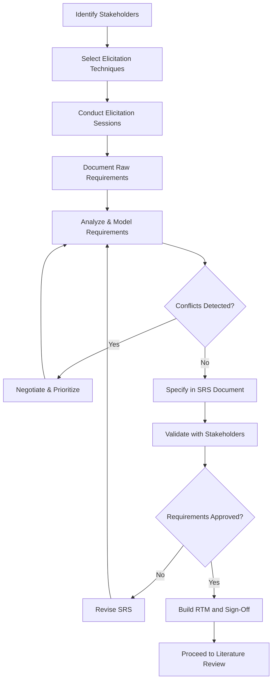
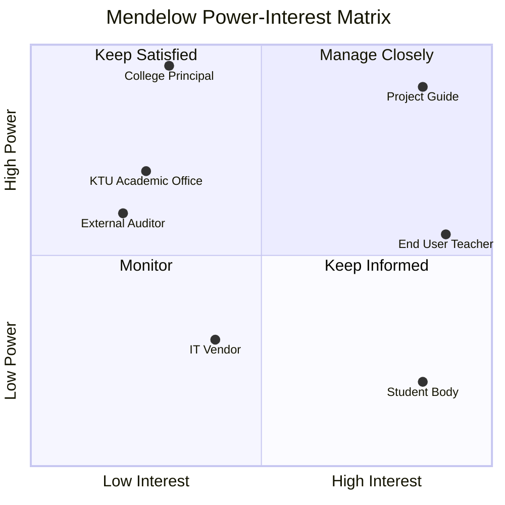
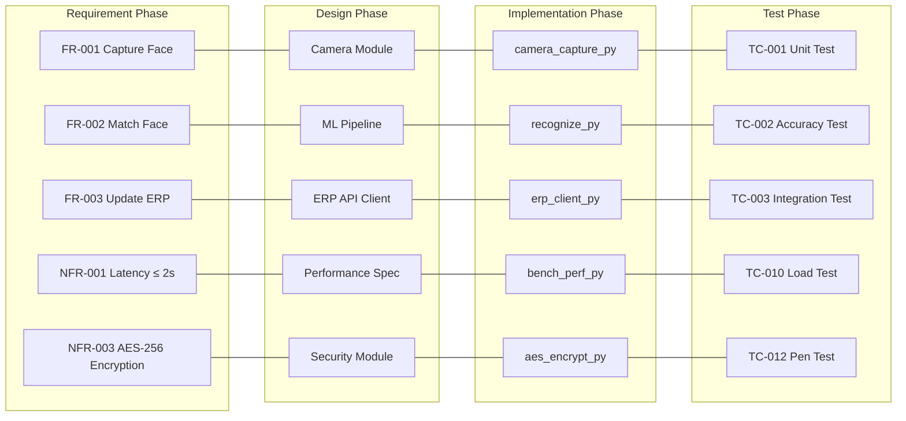
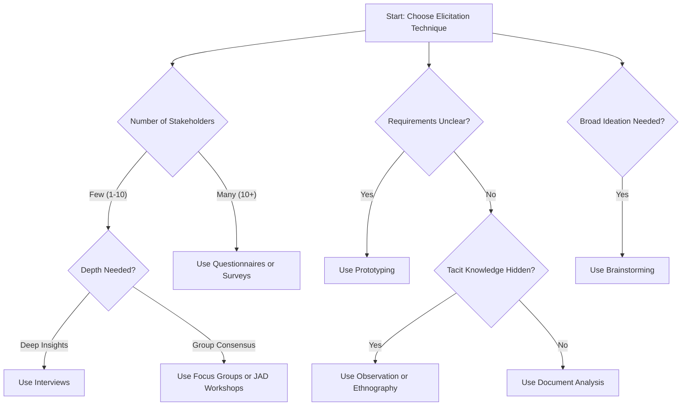
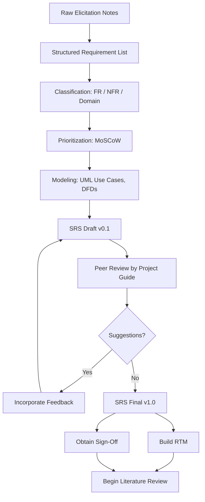

# Requirements Gathering

<!-- SECTION_1_START -->

# Requirements Gathering — Core Technical Definition & Intuitive Overview

## 1.1 Formal Academic Definition (KTU 2024 Aligned)

> [!IMPORTANT]
> **Requirements Gathering** (also called **Requirements Elicitation**) is the systematic and iterative process of identifying, discovering, capturing, documenting, and validating the needs, expectations, constraints, and priorities of all stakeholders for a proposed software-intensive system, forming the foundational input for the Software Requirements Specification (SRS) document as mandated by the IEEE 830-1998 standard.

In the context of the **KTU 2024 Scheme Major Project Phase I (PCCSP706)**, Requirements Gathering is the **first and most critical activity of Module 1 (Problem Definition and Literature Review)**. It precedes literature review because the research questions for literature search are themselves derived from the gaps identified during requirements gathering.

## 1.2 The Two Layers of Requirements (KTU High-Yield Classification)

> [!NOTE]
> KTU examiners frequently test the difference between **Functional** and **Non-Functional** requirements. Memorize this table.

| Layer | Category | Definition | Example |
|:---:|:---|:---|:---|
| 1 | **Functional Requirements (FR)** | Specify *what the system must do* — the core behaviors, operations, and features | "The system shall allow users to reset their password via OTP" |
| 1 | **Non-Functional Requirements (NFR)** | Specify *how well the system performs* — quality attributes, constraints | "The password reset page shall load in under **2 seconds** on 3G networks" |
| 2 | **User Requirements** | High-level, abstract statements in natural language | "The doctor should be able to view patient history" |
| 2 | **System Requirements** | Detailed, structured, testable technical specifications | "GET /api/patient/{id}/history shall return JSON within **500 ms** with HTTP 200" |
| 2 | **Domain Requirements** | Constraints derived from the application domain (regulatory, legal) | "The EHR system must comply with HIPAA / DISHA (India) standards" |

## 1.3 Conceptual Analogy — The Architect's Blueprint

> [!TIP]
> **Imagine you are commissioning an architect to design your dream house.** You don't hand them a single sheet of paper with the word "house" on it. You sit with them for weeks — describing your family size, daily routines, budget, the direction of sunlight, the height of ceilings, the need for a pooja room, accessibility for elders, and energy-efficiency goals. Only *after* this exhaustive dialogue do they sketch the blueprint.

**Requirements Gathering is that dialogue.** In a Major Project:

- The **homeowner** = the **client / end-user / domain expert**
- The **architect** = the **software development team** (your project group)
- The **blueprint** = the **Software Requirements Specification (SRS)**
- The **building regulations** = **Domain & Regulatory Constraints**
- The **blueprint errors caught later** = **Costly defect-fixing in later SDLC phases** (a defect fixed post-deployment costs **$**100x** more than at requirements stage per IBM Systems Sciences Institute)

## 1.4 The Three Pillars of Requirements

> [!IMPORTANT]
> Every KTU project proposal must explicitly state these three pillars in the Problem Definition section.

1. **Stakeholders** — *Who* needs the system? (Primary, Secondary, Tertiary users)
2. **Needs (Goals)** — *Why* does the stakeholder need it? (Business objectives)
3. **Requirements (Solutions)** — *What* must the system do to satisfy those needs?

> [!VISUALIZATION CONTROL]
> **Concept:** The Requirements Engineering V-Model — showing the relationship between problem definition (left leg) and solution validation (right leg).
> **Visualization Tool:** Draw a V-shape where the left descending arm represents *Decomposition* (Problem → Requirements → Design → Code) and the right ascending arm represents *Composition* (Unit Test → Integration Test → System Test → Acceptance Test). Each pair at the same level is connected by a *Verification* line; the bottom of the V is the *Validation* point.
> **Visual Description:** Students should observe that "Requirements" sits at the top-left of the V, paired with "Acceptance Testing" at the top-right — meaning every requirement must be traceable to an acceptance test.

## 1.5 Why Requirements Gathering Fails in Student Projects (KTU Pitfall)

> [!WARNING]
> A common KTU Major Project mistake: students *assume* requirements from a single WhatsApp conversation with a "client friend" and skip formal elicitation. This results in rejected Phase I proposals. KTU evaluators explicitly check for documented elicitation evidence.

---

<!-- SECTION_1_END -->

<!-- SECTION_2_START -->

# Deep Theoretical Analysis & KTU High-Yield Formula Sheet

## 2.1 The Requirements Engineering (RE) Process — IEEE Standard Breakdown

The **IEEE 29148:2018** standard (which supersedes IEEE 830) defines four sequential RE sub-processes. KTU expects you to know all four.

### Step 1 — Requirements Elicitation (Discovery)
The act of *drawing out* requirements from stakeholders using structured techniques. This is the *creative* phase.

### Step 2 — Requirements Analysis (Negotiation & Modeling)
Resolving **conflicts**, **prioritizing**, **classifying**, and **modeling** the elicited requirements using UML, DFD, ER diagrams.

### Step 3 — Requirements Specification (Documentation)
Writing the requirements in a structured, unambiguous, testable form — the **SRS document**.

### Step 4 — Requirements Validation & Management (Verification)
Checking that the documented requirements correctly represent stakeholder needs, are complete, consistent, and traceable.

## 2.2 The Eight Classical Elicitation Techniques (KTU High-Yield)

> [!IMPORTANT]
> KTU board questions regularly ask: *"Compare any two requirements gathering techniques"* (often for 7 marks in Part B). Master this table.

| # | Technique | Mode | When to Use | Key Strength | Key Limitation |
|:--:|:---|:---:|:---|:---|:---|
| 1 | **Interviews** | 1-on-1, structured / semi-structured / unstructured | Deep insights from a few key stakeholders | Rich, contextual data | Time-consuming; interviewer bias |
| 2 | **Questionnaires / Surveys** | One-to-many, written | Large, geographically dispersed user base | Scalable, anonymous | Low response rate; no follow-up |
| 3 | **Observation (Ethnography)** | Passive watching of users in their natural environment | Understanding actual workflow (not stated workflow) | Reveals tacit / unspoken needs | Hawthorne effect; intrusive |
| 4 | **Document Analysis** | Studying existing artifacts | Re-engineering or regulatory compliance | Grounded in reality | Becomes obsolete quickly |
| 5 | **Focus Groups** | Group of 6–10 stakeholders, moderated | Consensus building, divergent thinking | Synergy of ideas | Dominant personalities bias output |
| 6 | **Workshops / JAD Sessions** | Joint Application Development — facilitated | Large, complex projects with many stakeholders | Rapid consensus, co-located | Requires skilled facilitator |
| 7 | **Prototyping** | Build throw-away UI/UX to elicit feedback | Unclear or evolving requirements | Visualizes the abstract | Users may confuse prototype with final system |
| 8 | **Brainstorming** | Free-flowing idea generation | Early-stage, broad problem scoping | High volume of ideas | Idea quality varies; needs filtering |

> [!TIP]
> **Mnemonic:** *"In Quiet Dark Offices, Few Workers' Pondering Brainstorms"* → **I**nterviews, **Q**uestionnaires, **D**ocument analysis, **O**bservation, **F**ocus groups, **W**orkshops, **P**rototyping, **B**rainstorming.

## 2.3 Stakeholder Identification — The Power/Interest Grid

> [!NOTE]
> KTU evaluators reward projects that explicitly map stakeholders using the **Mendelow Matrix** (Power vs. Interest Grid).

| Quadrant | Power | Interest | Engagement Strategy |
|:---:|:---:|:---:|:---|
| **Manage Closely** | High | High | Frequent consultation, co-design partner |
| **Keep Satisfied** | High | Low | Periodic updates, address concerns proactively |
| **Keep Informed** | Low | High | Newsletters, user-group meetings, beta testing |
| **Monitor (Minimum Effort)** | Low | Low | General mass communication |

## 2.4 Requirements Prioritization Frameworks

| Framework | Mechanism | KTU Project Use |
|:---|:---|:---|
| **MoSCoW** | **M**ust have, **S**hould have, **C**ould have, **W**on't have (this time) | Most common in KTU proposals — simple and fast |
| **Kano Model** | Basic → Performance → Excitement features | Differentiate competitive features |
| **100-Dollar Test** | Stakeholders distribute \$100 across features | Budget-constrained prioritization |
| **Weighted Scoring** | Score = Weight × Score (1–5) × Confidence factor | Quantitative ranking of NFRs |
| **AHP (Analytic Hierarchy Process)** | Pairwise comparison matrix → eigenvector weights | Multi-criteria decision making |

## 2.5 KTU High-Yield Formula Sheet (Cheat Table)

> [!NOTE]
> The following metrics are quantitative anchors KTU examiners love to test in "justification" type questions.

| Metric | Formula | Typical KTU Project Value | Purpose |
|:---|:---|:---|:---|
| **Requirement Volatility (RV)** | $\text{RV} = \dfrac{N_{\text{changed}}}{N_{\text{total}}} \times 100\%$ | **10% – 25%** acceptable | Measures SRS stability |
| **Requirement Stability Index (RSI)** | $\text{RSI} = \left(1 - \dfrac{N_{\text{changed}}}{N_{\text{total}}}\right) \times 100\%$ | **\geq 75%** for Phase I sign-off | KPI for SRS freeze |
| **Defect Cost Multiplier (Boehm's Curve)** | $\text{Cost}(P) = \text{Cost}(\text{Req}) \times 2^{(P-1)}$ | Where $P$ = phase number (Req=1, Design=2, …) | Justifies investment in early elicitation |
| **Stakeholder Coverage Ratio (SCR)** | $\text{SCR} = \dfrac{N_{\text{interviewed}}}{N_{\text{identified}}} \times 100\%$ | **\geq 80%** for valid elicitation | Evidence of comprehensive stakeholder reach |
| **RTM Completeness (RTM$_c$)** | $\text{RTM}_c = \dfrac{N_{\text{traced}}}{N_{\text{total REQ}}} \times 100\%$ | **100%** for IEEE compliance | Traceability audit metric |
| **Elicitation Hours Budget** | $T_{\text{elicitation}} = 0.15 \times T_{\text{total project}}$ | **15%** of total project time | Rule-of-thumb allocation |
| **NFR Sub-categories (URPS+)** | Usability, Reliability, Performance, Supportability, + Security, Legal, Localizability | 7 NFRs to check | Completeness check |

> [!IMPORTANT]
> **Boehm's Defect Cost Law:** A requirement defect fixed at the *requirements phase* costs **1 unit**; the same defect at *design* costs **2 units**; at *coding* **5 units**; at *integration testing* **10 units**; and at *post-deployment* **100+ units**. This is the strongest argument to allocate adequate time to requirements gathering in your KTU project synopsis.

## 2.6 Real-World Engineering Utility

| Industry | Use of Requirements Gathering |
|:---|:---|
| **Healthcare IT** | Capturing clinical workflows, HIPAA / ABDM (India) compliance, HL7 / FHIR data exchange rules |
| **FinTech** | RBI / SEBI regulatory constraints, PCI-DSS security, real-time transaction latency NFRs |
| **IoT / Embedded** | Sensor sampling rates, power budget, edge-compute constraints |
| **AI/ML Projects** | Defining dataset requirements, fairness/bias NFRs, model explainability, MLOps pipeline constraints |
| **Smart City (KTU Kerala focus)** | Multi-stakeholder (municipality, citizens, contractors), multilingual UI (Malayalam support), low-bandwidth tolerance |

---

<!-- SECTION_2_END -->

<!-- SECTION_3_START -->

# Step-by-Step Derivations & Implementation Templates

## 3.1 The Complete 7-Step Requirements Gathering Workflow for a KTU Major Project

This is the **operational recipe** KTU expects you to describe in your Phase I report.

### Step 1 — Stakeholder Identification
Begin by listing **all** affected parties. Use the acronym **SPIDERS**:

- **S**ponsors (funding authority, project guide)
- **P**rimary users (daily operators)
- **I**ndirect users (downstream consumers of data)
- **D**evelopers (your team)
- **E**xternal regulators (e.g., BIS, ISO, IEEE)
- **R**esistance groups (those who lose from the system's success)
- **S**upport staff (IT admins, maintenance)

**Deliverable:** A **Stakeholder Register** (table with: ID, Name, Role, Power, Interest, Contact, Influence strategy).

### Step 2 — Select Elicitation Techniques
Choose **at least three** techniques (KTU best-practice) based on:
- Number of stakeholders
- Project complexity
- Time available
- Domain familiarity

For a typical KTU B.Tech project, the recommended triplet is:
$$\text{Interviews} + \text{Survey (Google Form)} + \text{Observation/Document Analysis}$$

### Step 3 — Conduct Elicitation Sessions
Schedule, prepare consent forms, take notes, record (with permission), and produce an **Elicitation Log**.

### Step 4 — Analyze & Model Requirements
Use **UML use-case diagrams**, **DFDs** (Level 0, Level 1), and **ER diagrams** to model the requirements abstractly.

### Step 5 — Resolve Conflicts
Use **negotiation matrices** (e.g., Win-Win spiral by Boehm) to resolve conflicting priorities.

### Step 6 — Specify in SRS
Document using the **IEEE 830 / IEEE 29148** template.

### Step 7 — Validate & Trace
Conduct **SRS walkthroughs**, build a **Requirements Traceability Matrix (RTM)**, and obtain **formal sign-off** from the project guide and an industry mentor (especially for Full Industrial Internship variants).

## 3.2 Sample Interview Script (Operational Template)

Below is a fully written, ready-to-use **semi-structured interview script** for a hypothetical KTU project — *"Smart Attendance System using Face Recognition for KTU Colleges"*.

```
INTERVIEW PROTOCOL
===================
Project Title   : Smart Attendance System using Face Recognition
Interviewee ID  : INT-001
Interviewee Role: Class Teacher (Primary User)
Date / Time     : 2025-01-15 / 10:30 AM
Mode            : In-person, 45 minutes
Interviewer     : <Student Name>, <Roll No>

--- SECTION A: WARM-UP (5 min) ---
Q1. Could you describe a typical day in your classroom attendance process?
Q2. How long does it take you to complete attendance for a batch of 60 students?

--- SECTION B: PROBLEM DISCOVERY (15 min) ---
Q3. What are the main pain points you face in the current manual system?
    (Probe: proxy attendance, errors, time loss, paper waste)
Q4. Have you ever faced issues with attendance records being disputed by students?
Q5. Are there any specific features you wish the existing system had?

--- SECTION C: REQUIREMENTS ELICITATION (20 min) ---
Q6. [Functional] In your opinion, what is the single most important
    feature a smart attendance system MUST have? Why?
Q7. [Non-Functional] How fast should the system mark attendance
    for a whole class? (Record exact number of seconds)
Q8. [Constraints] Does the college have a fixed budget for this?
    Any hardware/IT-policy restrictions?
Q9. [Integration] Should the system integrate with the existing
    KTU ERP / university portal? (Probe for APIs)
Q10.[Edge cases] What should happen if a student's face is not
    recognized? What about identical twins? Masked faces?

--- SECTION D: WRAP-UP (5 min) ---
Q11. Who else in the college should we interview?
Q12. May we contact you again for prototype feedback?

INTERVIEWER NOTES (post-session):
- Facial recognition speed: <2 sec target (Q7)
- Integration with KTU ERP desired (Q9)
- 2 additional stakeholder contacts obtained (Q11)
- Signed consent form on file
```

## 3.3 Sample SRS Structure (IEEE 29148-Aligned, KTU Format)

> [!NOTE]
> Your KTU Phase I report's *Problem Definition* chapter **is** essentially a condensed SRS. Use this skeleton.

```
1. INTRODUCTION
   1.1 Purpose
   1.2 Document Conventions
   1.3 Intended Audience & Reading Suggestions
   1.4 Scope of the Project
   1.5 References

2. OVERALL DESCRIPTION
   2.1 Product Perspective
   2.2 Product Functions (Summary)
   2.3 User Classes & Characteristics
   2.4 Operating Environment
   2.5 Design & Implementation Constraints
   2.6 Assumptions & Dependencies

3. SPECIFIC REQUIREMENTS
   3.1 External Interface Requirements
       3.1.1 User Interfaces
       3.1.2 Hardware Interfaces
       3.1.3 Software Interfaces
       3.1.4 Communication Interfaces
   3.2 Functional Requirements (FR-001, FR-002, …)
   3.3 Non-Functional Requirements (NFR-001, NFR-002, …)
       3.3.1 Performance
       3.3.2 Security
       3.3.3 Reliability
       3.3.4 Usability
       3.3.5 Maintainability
   3.4 Design Constraints
   3.5 Software System Attributes

4. APPENDICES
   A. Glossary
   B. Use-Case Diagram
   C. RTM (Requirements Traceability Matrix)
   D. Survey Questionnaire (raw)
   E. Interview Transcripts
```

## 3.4 Requirements Traceability Matrix (RTM) — Fully Worked Example

The **RTM** is the single most important artifact that links *requirement → design → code → test*. Below is a complete row-wise expansion for the Smart Attendance System.

| Req ID | Requirement Description | Source | Priority (MoSCoW) | Design Element | Code Module | Test Case ID | Status |
|:---:|:---|:---:|:---:|:---:|:---:|:---:|:---:|
| FR-001 | System shall capture student face via classroom camera | Teacher interview Q6 | Must | Camera module diagram | `camera/capture.py` | TC-001 | Drafted |
| FR-002 | System shall match captured face against trained dataset | Teacher interview Q6 | Must | Face recognition pipeline | `ml/recognize.py` | TC-002 | Drafted |
| FR-003 | System shall mark attendance automatically in KTU ERP | Teacher interview Q9 | Must | ERP API client | `integrations/erp.py` | TC-003 | Drafted |
| NFR-001 | Recognition latency ≤ 2 seconds for 60 students | Teacher interview Q7 | Must | Performance spec | `benchmarks/perf.py` | TC-010 | Drafted |
| NFR-002 | System shall operate offline; sync when online | Observation of rural campus | Should | Sync queue | `sync/queue.py` | TC-011 | Drafted |
| NFR-003 | Face data encrypted at rest using AES-256 | Regulatory (DISHA) | Must | Encryption module | `security/aes.py` | TC-012 | Drafted |
| NFR-004 | System shall support Malayalam & English UI | KTU language policy | Should | i18n config | `i18n/messages_ml.json` | TC-013 | Drafted |

> [!TIP]
> **RTM Completeness Check:**
> $$\text{RTM}_c = \frac{N_{\text{requirements traced to at least one test case}}}{N_{\text{total requirements}}} \times 100\%$$
> For the table above: $7/7 = 100\%$, satisfying IEEE compliance.

## 3.5 User Story Format (Agile-Compatible, KTU-Approved)

Each functional requirement can be expressed as:

```
As a  <role>
I want to <action/feature>
So that <business value / benefit>

Acceptance Criteria:
  - Given <precondition>
  - When  <action>
  - Then  <observable outcome>
```

**Example:**
> As a *class teacher*, I want to *view daily attendance reports* so that *I can identify defaulters at the end of each week*.
>
> **Acceptance Criteria:**
> - *Given* attendance has been recorded for the day,
> - *When* the teacher clicks the "Daily Report" button,
> - *Then* a table with columns [Roll No, Name, Status, Timestamp] shall render within **1 second** with defaulters highlighted in red.

## 3.6 Volatility Calculation — Worked Example

Suppose a project elicits **120 requirements** over 4 weeks. By the end of the 4th week, **18 requirements** have been modified by stakeholders. Calculate the **Requirement Volatility** and the **Requirement Stability Index**.

$$\text{RV} = \frac{N_{\text{changed}}}{N_{\text{total}}} \times 100\% = \frac{18}{120} \times 100\% = 15\%$$

$$\text{RSI} = (1 - \text{RV}) \times 100\% = (1 - 0.15) \times 100\% = 85\%$$

**Interpretation:** With RSI = **85%** ≥ **75%** (the KTU Phase I sign-off threshold), the SRS is **stable enough** to proceed to design and literature review.

## 3.7 Boehm's Defect Cost Derivation — Justification for Elicitation Budget

For a 6-month KTU project of total budgeted hours $T$:

$$T_{\text{elicitation}} = 0.15 \times T$$

If $T = 800$ hours, then $T_{\text{elicitation}} = 120$ hours.

Per Boehm: 1 requirement defect at requirements phase costs **1 unit**; same defect post-deployment costs **$2^{(P-1)} = 2^{(6-1)} = 32$ units** where $P = 6$ (Req → Design → Code → Unit Test → Integration Test → Deployment).

**Catching 1 defect at requirements = saving 32× the cost.** Investing 120 hours in elicitation can typically catch 10–20 latent requirement defects, yielding savings equivalent to **120–240 hours of rework**.

## 3.8 Conflict Resolution — Weighted Scoring Worked Example

Two stakeholders disagree on whether *Fingerprint Login* (FR-A) or *OTP Login* (FR-B) should be the primary authentication.

| Criterion | Weight | FR-A Score | FR-B Score | A × W | B × W |
|:---|:---:|:---:|:---:|:---:|:---:|
| Security | 0.40 | 4 | 5 | 1.60 | 2.00 |
| Usability | 0.25 | 5 | 4 | 1.25 | 1.00 |
| Cost | 0.20 | 3 | 5 | 0.60 | 1.00 |
| Scalability | 0.15 | 4 | 4 | 0.60 | 0.60 |
| **Total** | **1.00** | — | — | **4.05** | **4.60** |

**Decision:** FR-B (OTP Login) wins with **4.60 vs 4.05**. Document the rationale in the SRS Appendix for transparency.

---

<!-- SECTION_3_END -->

<!-- SECTION_4_START -->

# Structural Diagrams & Schematics

## 4.1 Requirements Engineering Process Flow (Mermaid)



## 4.2 Stakeholder Power/Interest Grid (Mendelow Matrix)



## 4.3 RTM Lifecycle Mapping (Block Architecture)



## 4.4 Elicitation Techniques Decision Tree



## 4.5 Requirements V-Model (Verification & Validation Map)

```mermaid
flowchart TB
    subgraph DESC [Decomposition - Problem Side]
        P1[Business Needs]
        P2[Stakeholder Requirements]
        P3[SRS - System Requirements]
        P4[Design Specifications]
        P5[Code Units]
    end
    subgraph COMP [Composition - Solution Side]
        V1[Acceptance Test]
        V2[System Test]
        V3[Integration Test]
        V4[Unit Test]
        V5[Code Review]
    end
    P1 -.Verified by.-> V1
    P2 -.Verified by.-> V2
    P3 -.Verified by.-> V3
    P4 -.Verified by.-> V4
    P5 -.Verified by.-> V5
    P1 <==Validation== V5
    DESC ~~~ COMP
```

## 4.6 SRS Document Build Pipeline (Sequential Topology)



---

<!-- SECTION_4_END -->

<!-- SECTION_5_START -->

# KTU 2024 Scheme Examination Question Bank & Topic Recap

## Part A — Short Answer Questions (3 Marks Each)

> **Question 1.** `[KTU University Exam - July 2024]`
> *Define Requirements Gathering. List any four requirements elicitation techniques.* **[CO1, Remember/Understand, 3 Marks]**

**Model Answer:**

**Requirements Gathering** is the systematic process of identifying, eliciting, documenting, and validating the needs and constraints of all stakeholders for a proposed system, forming the basis of the Software Requirements Specification (SRS).

Four elicitation techniques:

1. **Interviews** — structured 1-on-1 dialogue with stakeholders.
2. **Questionnaires / Surveys** — written forms distributed to a large stakeholder base.
3. **Observation (Ethnography)** — passively watching users perform tasks in their natural environment.
4. **Prototyping** — building throw-away UI/UX models to elicit feedback.

*[Listing any four techniques with one-line descriptions: 2 Marks; Correct definition: 1 Mark.]*

---

> **Question 2.** `[KTU University Exam - Dec 2023]`
> *Differentiate between Functional Requirements and Non-Functional Requirements with two examples each.* **[CO1, Understand, 3 Marks]**

**Model Answer:**

| Aspect | Functional Requirements | Non-Functional Requirements |
|:---|:---|:---|
| Definition | Specify *what* the system does | Specify *how well* the system performs |
| Also called | Behavioral requirements | Quality attributes |
| Verification by | Functional / acceptance testing | Performance / load / security testing |
| Example 1 | "The system shall allow users to upload a profile photo" | "The photo upload shall complete within **3 seconds** on 3G" |
| Example 2 | "The system shall send OTP to the registered mobile number" | "The OTP service shall have **99.9%** uptime" |

*[Correct distinction: 1 Mark; 2 examples each with clear FR/NFR split: 2 Marks.]*

---

## Part B — Long Answer Questions (14 Marks, with Internal Choice)

> **Question 3A.** `[KTU University Exam - July 2024]`
> *(a)* Explain the **Requirements Engineering process** as per IEEE 29148 with a neat diagram. **[7 Marks, CO1, Understand]**
> *(b)* For a Major Project on *"AI-based Plagiarism Detection for Student Assignments"*, prepare a **Stakeholder Register** with at least six stakeholders, mapping their **power, interest, and engagement strategy** using the Mendelow Matrix. **[7 Marks, CO2, Apply]**

### Model Solution — Part (a)

The **IEEE 29148:2018** standard defines four sequential sub-processes:

1. **Requirements Elicitation** — Drawing out requirements from stakeholders using interviews, surveys, observation, workshops, prototyping, document analysis, focus groups, and brainstorming.
2. **Requirements Analysis & Negotiation** — Classifying requirements (FR / NFR / Domain), modeling them using UML, resolving conflicts via negotiation, and prioritizing (MoSCoW, AHP, Weighted Scoring).
3. **Requirements Specification** — Documenting requirements in the SRS using the IEEE 830 / 29148 template, ensuring each requirement is *unambiguous, testable, traceable, complete, consistent, ranked, and modifiable*.
4. **Requirements Validation & Management** — Conducting walkthroughs, building the **RTM (Requirements Traceability Matrix)**, and managing changes via a formal change control process.

```
[Diagrammatic representation - the Mermaid V-Model from SECTION 4.5 can be redrawn here]

Elicitation → Analysis → Specification → Validation
    ↓             ↓             ↓              ↓
(Interviews)  (UML/DFD)    (SRS Doc)      (RTM/Sign-off)
```

**Goodness Criteria for Requirements (IEEE):** *Correct, Unambiguous, Complete, Consistent, Ranked, Verifiable, Modifiable, Traceable.*

*[Listing 4 sub-processes with one-line explanation: 4 Marks; Diagram: 2 Marks; Goodness criteria: 1 Mark.]*

### Model Solution — Part (b)

**Stakeholder Register for *"AI-based Plagiarism Detection"* Project:**

| # | Stakeholder | Role | Power (1–5) | Interest (1–5) | Mendelow Quadrant | Engagement Strategy |
|:--:|:---|:---|:---:|:---:|:---|:---|
| 1 | **Project Guide** (Faculty) | Mentor & evaluator | 5 | 5 | Manage Closely | Weekly review meetings, co-design partner |
| 2 | **University Exam Controller** | Policy approver | 5 | 2 | Keep Satisfied | Monthly progress report, address policy concerns |
| 3 | **Course Teacher (Primary User)** | Daily operator | 2 | 5 | Keep Informed | User-group demo at end of each sprint |
| 4 | **Students (End Users)** | Subject of analysis | 1 | 5 | Keep Informed | Beta-test recruitment, feedback survey |
| 5 | **IT Admin (Technical User)** | Deployment & maintenance | 4 | 3 | Manage Closely | Hands-on integration workshop |
| 6 | **Kerala State Higher-Ed Council** | Regulatory body | 5 | 2 | Keep Satisfied | Quarterly compliance update |
| 7 | **Anti-plagiarism tool vendor** (e.g., Turnitin competitor) | External collaborator / competitor | 3 | 3 | Manage Closely | Partnership / API licensing discussion |

*[Correct identification of 6+ stakeholders: 3 Marks; Power/Interest scoring: 2 Marks; Engagement strategy mapped to Mendelow quadrants: 2 Marks.]*

---

> **Question 3B.** `[KTU University Exam - Dec 2023]`
> *(a)* Compare any **three requirements elicitation techniques** in detail. State one situation where each is most suitable. **[7 Marks, CO1, Understand]**
> *(b)* Build a **complete Requirements Traceability Matrix (RTM)** for a Library Management System with at least **5 requirements** (3 functional + 2 non-functional), tracing each to design, code, and test. Calculate the **RTM Completeness** and **Requirement Stability Index (RSI)** assuming 14 total requirements and 2 changed. **[7 Marks, CO2, Apply]**

### Model Solution — Part (a)

**Comparison of Three Elicitation Techniques:**

| Parameter | **Interviews** | **Questionnaires** | **Observation** |
|:---|:---|:---|:---|
| Mode | 1-on-1, face-to-face / virtual | 1-to-many, written / online | Passive watching of users |
| Data Type | Qualitative, deep | Quantitative, broad | Qualitative, contextual |
| Stakeholder Count | Few (1–10) | Many (50+) | Few (specific roles) |
| Cost | High (time + skilled interviewer) | Low (one-time design) | Medium (ethnographer time) |
| Strength | Captures *why* behind requirements | Statistical significance | Reveals *tacit* unspoken needs |
| Limitation | Interviewer bias, time-consuming | No follow-up clarification | Hawthorne effect |
| Best-suited situation | **When** the stakeholder count is small but the requirements are complex and need deep understanding (e.g., interviewing a domain expert doctor for a clinical decision support system) | **When** the user base is geographically dispersed and large (e.g., feedback from 5,000 students across all KTU colleges) | **When** the actual workflow differs significantly from the documented one (e.g., studying how nurses actually triage patients in a busy ward) |

*[Comparison table covering mode, strength, limitation: 5 Marks; One appropriate situation per technique: 2 Marks.]*

### Model Solution — Part (b)

**RTM for Library Management System:**

| Req ID | Requirement Description | Source | Priority | Design Element | Code Module | Test Case | Status |
|:---:|:---|:---:|:---:|:---:|:---:|:---:|:---:|
| FR-001 | The system shall allow members to search books by title/author/ISBN | Member interview | Must | Search microservice | `search/service.py` | TC-001 | Drafted |
| FR-002 | The system shall issue books and update the member's borrowing limit (max 5) | Librarian interview | Must | Issue module | `circulation/issue.py` | TC-002 | Drafted |
| FR-003 | The system shall generate an overdue fine of ₹2/day automatically | Policy doc | Must | Fine calculator | `circulation/fine.py` | TC-003 | Drafted |
| NFR-001 | Search response time ≤ 1 second for 1 lakh records | SLA requirement | Must | Indexing spec | `search/index.py` | TC-010 | Drafted |
| NFR-002 | System shall support 500 concurrent users | Capacity plan | Should | Load balancer | `infra/nginx.conf` | TC-011 | Drafted |

**RTM Completeness Calculation:**

$$\text{RTM}_c = \frac{N_{\text{requirements with at least one linked test case}}}{N_{\text{total requirements}}} \times 100\% = \frac{5}{5} \times 100\% = 100\%$$

**Requirement Stability Index Calculation:**

Given: $N_{\text{total}} = 14$, $N_{\text{changed}} = 2$.

$$\text{RSI} = \left(1 - \frac{2}{14}\right) \times 100\% = \left(1 - 0.1429\right) \times 100\% = 85.71\%$$

**Interpretation:** $\text{RSI} = 85.71\% \geq 75\%$ → **SRS is stable** for Phase I sign-off.

*[Building RTM with 5+ requirements (functional + non-functional): 3 Marks; Source + priority mapping: 2 Marks; Correct formulas + numerical answers: 2 Marks.]*

---

> [!WARNING]
> **KTU Examiner's Valuation Warning — Common Pitfalls**
> 1. **Do not skip the "Source" column** in the RTM — it is the *primary evidence* of stakeholder elicitation and KTU evaluators specifically check this.
> 2. **Do not write vague requirements** like *"system should be fast"*. Always quantify NFRs (e.g., *"≤ 2 seconds"*, *"99.9% uptime"*) — vague NFRs fetch 0 marks.
> 3. **Do not use "User" as a single stakeholder** — always enumerate at least **three distinct user classes** (e.g., student, librarian, admin).
> 4. **Do not confuse requirements with design** — *"The system shall use MySQL"* is a *design decision*, not a requirement. The requirement is *"The system shall persist 10 years of borrowing history"*.
> 5. **Do not forget to compute RSI** in your Phase I report — many students omit it; the project guide deducts 2–3 marks for this.

---

## Topic Recap & Important Things to Remember

> [!IMPORTANT]
> **High-Density Revision Checklist for Requirements Gathering (PCCSP706 — Module 1)**

- ✅ **Definition:** Requirements Gathering is the systematic elicitation, analysis, specification, and validation of stakeholder needs for a software system.
- ✅ **KTU Phase I Placement:** It is the *first* activity of Module 1, preceding literature review.
- ✅ **IEEE 29148 Process:** Elicitation → Analysis & Negotiation → Specification (SRS) → Validation & Management.
- ✅ **Two Layers:** Functional vs. Non-Functional; User vs. System vs. Domain.
- ✅ **Eight Techniques (Mnemonic I-Q-D-O-F-W-P-B):** Interviews, Questionnaires, Document analysis, Observation, Focus groups, Workshops/JAD, Prototyping, Brainstorming.
- ✅ **Mendelow Matrix:** Four quadrants — Manage Closely, Keep Satisfied, Keep Informed, Monitor.
- ✅ **Prioritization Methods:** MoSCoW (most common in KTU), Kano, 100-Dollar Test, Weighted Scoring, AHP.
- ✅ **Boehm's Defect Cost Law:** Cost grows **2×** with each SDLC phase; investment in elicitation is justified.
- ✅ **Key Formulas:**
  - $\text{RV} = \dfrac{N_{\text{changed}}}{N_{\text{total}}} \times 100\%$
  - $\text{RSI} = \left(1 - \dfrac{N_{\text{changed}}}{N_{\text{total}}}\right) \times 100\%$
  - $\text{RTM}_c = \dfrac{N_{\text{traced}}}{N_{\text{total REQ}}} \times 100\%$
  - $T_{\text{elicitation}} = 0.15 \times T_{\text{total}}$
  - $\text{Cost}(P) = \text{Cost}(\text{Req}) \times 2^{(P-1)}$
- ✅ **SRS Goodness Criteria:** Correct, Unambiguous, Complete, Consistent, Ranked, Verifiable, Modifiable, Traceable (8 attributes).
- ✅ **RTM must link:** Requirement → Source → Design → Code → Test (5-column minimum).
- ✅ **RSI Threshold for KTU sign-off:** $\geq 75\%$.
- ✅ **Three Techniques Minimum:** KTU best practice is to use *at least three* elicitation techniques per project.
- ✅ **Deliverable Artifacts for KTU Phase I:** Stakeholder Register, Elicitation Log, SRS Draft v1.0, RTM, MoSCoW-prioritized requirement list, sample interview/survey transcripts.
- ✅ **Common Pitfall:** Confusing *design decisions* (e.g., "use MongoDB") with *requirements* (e.g., "persist 10 years of data with sub-second retrieval").

<!-- SECTION_5_END -->
