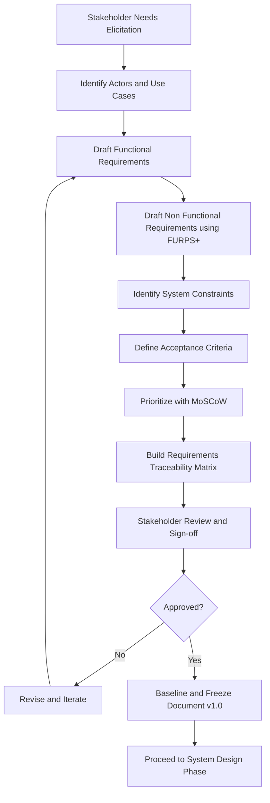
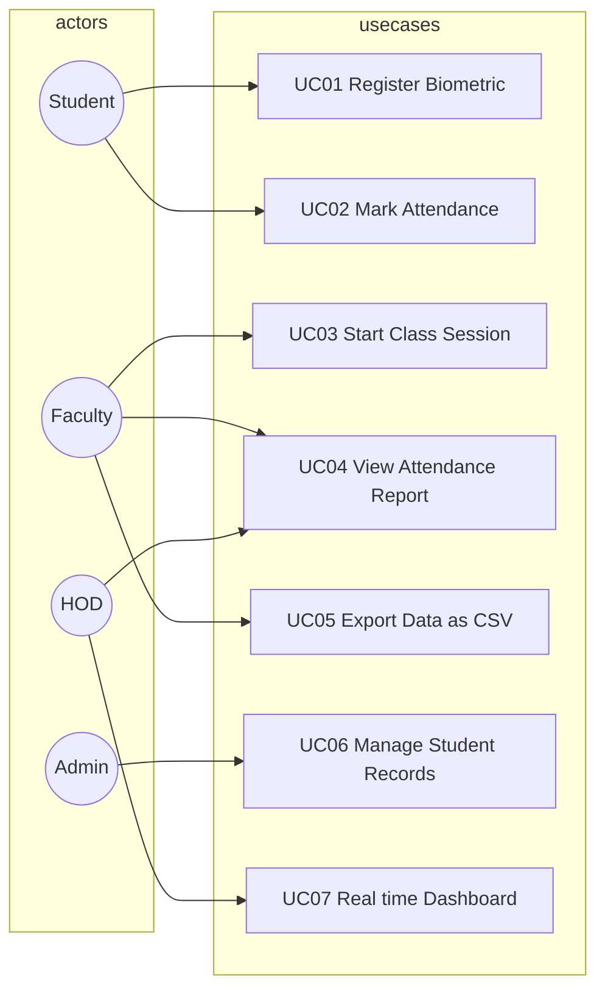
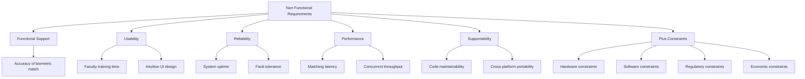
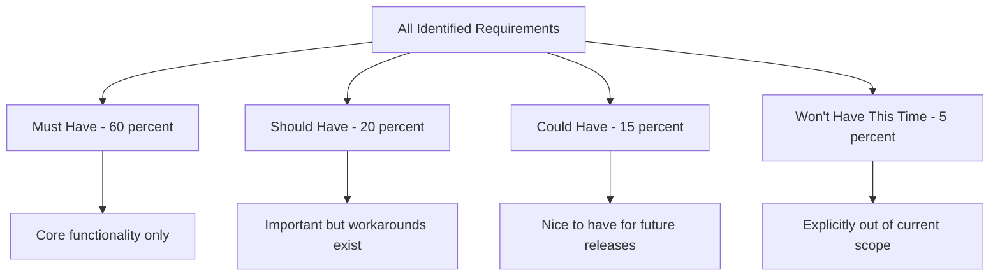
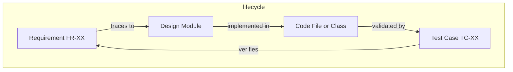

# System Specification

<!-- SECTION_1_START -->

# System Specification — KTU Major Project Phase I

## 1. Core Technical Definition & Intuitive Overview

### 1.1 Formal Academic Definition

> [!NOTE]
> **System Specification (SS)**, also known as the **System Requirements Specification (SRS)** or **Software Requirements Specification (SRS)**, is a formal, structured, and comprehensive document that completely describes the **functional**, **non-functional**, and **interface** characteristics of a system to be developed, along with the **constraints** under which it must operate. It serves as the *contractual blueprint* between the client/stakeholder and the development team, conforming to the **IEEE 29148:2018** and **IEEE 830-1998** standards.

In the **KTU 2024 Scheme (PCCSP706 — Major Project Phase I / Full Industrial Internship)**, the System Specification is the **second deliverable of Module 1**, produced *immediately after* the Problem Definition and *concurrent with* the Literature Review. It answers the question:

> *"What exactly must the proposed system DO, and HOW WELL must it do it?"*

### 1.2 Conceptual Analogy / Intuition

Imagine you are commissioning an **architect to build a house**. Before laying a single brick, you wouldn't just say *"Build me a nice house."* Instead, you would provide a **detailed architectural brief** that specifies:

- **How many rooms** (functional requirements) — like "3 bedrooms, 2 bathrooms"
- **How tall the ceilings** should be (non-functional constraints) — like "≥ 10 feet"
- **What plumbing standards** to follow (interface specifications) — like "ISI-marked PVC pipes"
- **What materials** to use (technology constraints) — like "≥ M25 grade concrete"

The System Specification plays **exactly this role** for a software/embedded/hardware system. It is the **architectural brief** of the project — the *bridge* between a vague problem statement and the actual code/circuit design.

### 1.3 Hierarchy of Project Documents

> [!IMPORTANT]
> **Document Order in KTU Major Project Phase I:**
> 1. **Problem Definition** → *What problem are we solving?* (Identified in earlier module)
> 2. **Literature Review** → *What have others done?* (Concurrent with spec)
> 3. **System Specification** → *What must our system do?* ← **YOU ARE HERE**
> 4. **System Design** → *How will the system be built?* (Module 2)
> 5. **Implementation** → *Actual coding/fabrication* (Module 3)
> 6. **Testing & Deployment** → *Does it work as specified?* (Module 4)

### 1.4 GeoGebra / Desmos Integration

> [!VISUALIZATION CONTROL]
> **Concept:** Requirements Hierarchy — A 3-tier pyramid showing the V-Model relationship between user needs, system specification, and component design.
> **Conceptual Layout (for whiteboard/draw.io):**
> * *Tier 1 (Apex, 10%):* **User Needs / Stakeholder Goals** — e.g., "Reduce patient wait time"
> * *Tier 2 (Middle, 30%):* **System Specification (SRS)** — e.g., "Appointment module shall reduce average booking time to ≤ 60 seconds"
> * *Tier 3 (Base, 60%):* **Detailed Design** — e.g., "Use Redis cache with TTL of 300s for slot availability"
>
> **Visual Description:** A triangular pyramid narrowing from broad user goals at the base to precise measurable specs at the apex, illustrating the *refinement funnel* of requirements engineering.

---

<!-- SECTION_1_END -->

<!-- SECTION_2_START -->

# 2. Deep Theoretical Analysis & KTU High-Yield Specification Sheet

## 2.1 The Three Pillars of a System Specification

A KTU-evaluated System Specification document is typically graded against these **three pillars**:

### Pillar A — Functional Requirements (FRs)
These describe **what the system does** — the *behavior* under specific inputs.

> [!NOTE]
> **Definition:** Functional Requirements are statements of *system behavior* under specific conditions, defining the *inputs*, *outputs*, and *interactions* the system must support.

**Example (IoT Air Quality Monitor):**
> *"FR-07: When the PM2.5 sensor reading exceeds 150 µg/m³ for a duration of 5 minutes, the system shall trigger the buzzer alarm within 1 second and send an SMS alert to the registered mobile number."*

**Anatomy of a well-written Functional Requirement:**
$$\text{FR} = \underbrace{\text{[Actor]}}_{\text{who}} + \underbrace{\text{[Condition/Trigger]}}_{\text{when}} + \underbrace{\text{[Action]}}_{\text{what} \to \text{does}} + \underbrace{\text{[Measurable Outcome]}}_{\text{result}}$$

### Pillar B — Non-Functional Requirements (NFRs)
These describe **how WELL the system performs** — the *quality attributes*. They are graded on the **FURPS+** model:

> [!IMPORTANT]
> **FURPS+ Model (Grady, 1992 — widely used in KTU valuation):**
>
> | Letter | Attribute | KTU Evaluation Focus | Example |
> |:---:|:---|:---|:---|
> | **F** | **Functional** | (See Pillar A) | Login with email + password |
> | **U** | **Usability** | UI simplicity, learnability | "Shall be operable by a 50-year-old with no prior training within 5 minutes" |
> | **R** | **Reliability** | Uptime, MTBF, fault tolerance | "99.9% uptime, i.e., ≤ 8.64 hrs downtime/year" |
> | **P** | **Performance** | Response time, throughput | "API response < 200 ms at 1000 concurrent users" |
> | **S** | **Supportability** | Maintainability, portability | "Codebase maintainable on Python 3.11+" |
> | **+** | **+ Design constraints, Implementation, Interface, Physical** | Hardware/OS constraints | "Must run on Raspberry Pi 4 with 4 GB RAM" |

### Pillar C — System Constraints
**Constraints** are *non-negotiable boundary conditions* imposed by the client, environment, cost, or regulation.

> **Common KTU-evaluated constraints:**
> * **Hardware:** CPU ≤ ARM Cortex-A53, RAM ≤ 512 MB
> * **Software:** OS ≤ Ubuntu 20.04 LTS, License ≤ MIT
> * **Regulatory:** Compliance with IEEE 802.11, GDPR, ISO 26262
> * **Economic:** Total BOM cost ≤ ₹5,000
> * **Time:** Project delivery ≤ 6 months

## 2.2 The IEEE 29148:2018 SRS Template (Standardized Structure)

KTU evaluators reward projects that follow a **structured, IEEE-aligned** template. The five mandatory sections are:

> [!IMPORTANT]
> **IEEE 29148:2018 — Standard SRS Structure:**
>
> 1. **Introduction** (Purpose, Scope, Definitions, References, Overview)
> 2. **Overall Description** (Product perspective, user classes, operating environment, design/implementation constraints)
> 3. **Specific Requirements** (Functional, performance, design constraints, software system attributes)
> 4. **Verification & Validation** (How each requirement will be tested)
> 5. **Appendices** (Use cases, data flow diagrams, glossary)

## 2.3 Use Case Modeling (UML Standard)

A **Use Case** is the *primary unit* of functional specification. It answers: *"Who can do what with the system, and what is the result?"*

**Anatomy of a Use Case (per Cockburn's template):**
> * **Use Case ID:** UC-12
> * **Use Case Name:** "Book Doctor Appointment"
> * **Primary Actor:** Registered Patient
> * **Precondition:** Patient is logged in; doctor has available slots
> * **Main Flow:**
>   1. Patient navigates to "Book Appointment" page
>   2. System displays available doctors and slots
>   3. Patient selects doctor and time slot
>   4. Patient clicks "Confirm"
>   5. System validates and saves booking
>   6. System displays confirmation with booking ID
> * **Postcondition:** Appointment is recorded in the database
> * **Alternate Flows:** A1: Slot full → system suggests next available slot
> * **Exception Flows:** E1: Network failure → system retries 3 times, then shows error

## 2.4 Requirements Prioritization (MoSCoW Method)

> [!NOTE]
> **MoSCoW Prioritization** is the *most common* prioritization framework used in KTU-graded project reports. Allocate requirements into:
>
> | Priority | Label | Meaning | KTU Benchmark |
> |:---:|:---|:---|:---|
> | **M** | **Must have** | Critical; system fails without it | ~60% of FRs |
> | **S** | **Should have** | Important but not vital; workaround exists | ~20% |
> | **C** | **Could have** | Desired if time permits | ~15% |
> | **W** | **Won't have (this time)** | Explicitly deferred to future scope | ~5% |

## 2.5 KTU High-Yield Specification Sheet

> [!IMPORTANT]
> **RAPID REVISION TABLE — System Specification Master Sheet**
>
> | Concept | Symbol / Term | Definition | KTU Exam Tip |
> |:---|:---|:---|:---|
> | System Specification | SS / SRS | Formal document describing system behavior, quality, and constraints | Always cite **IEEE 29148:2018** |
> | Functional Requirement | FR | What the system does | Use **Actor + Action + Outcome** format |
> | Non-Functional Requirement | NFR | How well the system performs | Use **FURPS+** categorization |
> | Use Case | UC | Interaction between actor and system | Always include **Pre + Main + Post + Alt + Ex** |
> | Actor | A | External entity (user, sensor, external system) | Differentiate **Primary vs Secondary** actors |
> | Constraint | C | Non-negotiable boundary | Categorize as **H/W, S/W, Reg, Eco, Time** |
> | MoSCoW | — | Prioritization method | Show **percentage split** in reports |
> | FURPS+ | — | NFR classification | Always include **'+' (design constraints)** |
> | Acceptance Criteria | AC | Pass/fail condition for a requirement | Must be **measurable** (no "user-friendly") |
> | Traceability Matrix | TM | Maps FR → Design → Code → Test | LOSE 5 marks if missing in KTU project |
> | SMART Goal | — | Specific, Measurable, Achievable, Relevant, Time-bound | Use for **project objectives** |
> | EARS Notation | — | Easy Approach to Requirements Syntax | Format: "When <trigger>, the <system> shall <response>" |

## 2.6 Engineering Utility & Real-World Application

> [!NOTE]
> **Where is System Specification used in industry?**
>
> * **Software Industry (TCS, Infosys, Google):** Forms the basis of *Agile user stories* and *DevOps specifications*
> * **Aerospace (ISRO, NASA):** Compliance with **DO-178C** (avionics) and **ECSS** (European space standard) — every line is a legal requirement
> * **Automotive (Tata Motors, Bosch):** Adheres to **ISO 26262** for functional safety — specification must be *traceable* and *verifiable*
> * **Medical Devices (Siemens Healthineers):** Compliance with **FDA 21 CFR Part 11** and **IEC 62304** — specification = regulatory submission
> * **IoT/Embedded Startups:** Forms the *contract* for the hardware-software co-design between firmware and cloud teams
>
> **Without a strong System Specification, projects suffer from:**
> * **Scope creep** (uncontrolled feature additions) — leads to **43% project failure** (Standish Group CHAOS Report 2020)
> * **Requirement ambiguity** — causes **~56% of defects** in software projects (IBM Systems Sciences Institute)

---

<!-- SECTION_2_END -->

<!-- SECTION_3_START -->

# 3. Step-by-Step Derivations, Templates & Document Implementation

## 3.1 The 10-Step Procedure to Write a KTU-Grade System Specification

> [!IMPORTANT]
> **The Specification Engineering Workflow (Standard KTU Methodology):**
>
> ```
> Step 1: Gather Stakeholder Needs
>    ↓
> Step 2: Identify Actors & Use Cases
>    ↓
> Step 3: Draft Functional Requirements (FRs)
>    ↓
> Step 4: Draft Non-Functional Requirements (NFRs)
>    ↓
> Step 5: Identify Constraints
>    ↓
> Step 6: Write Acceptance Criteria
>    ↓
> Step 7: Prioritize using MoSCoW
>    ↓
> Step 8: Build Traceability Matrix
>    ↓
> Step 9: Validate with Stakeholders
>    ↓
> Step 10: Baseline & Freeze Document
> ```

## 3.2 Step-by-Step Worked Example: Smart Attendance System (Full KTU Project)

**Problem Statement (from Problem Definition phase):**
> *"Manual attendance in colleges is time-consuming, error-prone (proxy attendance), and generates paper waste. Build an automated biometric attendance system."*

### Step 1: Stakeholder Needs (Elicitation Output)

| Stakeholder | Need (Voice of Customer) | Measurable Specification |
|:---|:---|:---|
| HOD | "I want real-time attendance visibility" | Dashboard refresh ≤ 5 seconds |
| Faculty | "I don't want to learn complex software" | One-click class start; < 2 min training |
| Student | "I want quick marking without long queues" | Marking time ≤ 3 seconds per student |
| Admin | "I need data for NAAC accreditation" | Exportable CSV/Excel with 100% accuracy |

### Step 2: Identify Actors

$$\text{Actors} = \{\text{Student}, \text{Faculty}, \text{System Admin}, \text{HOD}, \text{Time Server (NTP)}, \text{Local DB}\}$$

### Step 3: Draft Functional Requirements (FRs)

Using the **EARS (Easy Approach to Requirements Syntax)** notation:

```
FR-01 [Ubiquitous]: The system shall capture student biometric data
                    using a fingerprint sensor within 3 seconds.

FR-02 [Event-driven]: When a valid fingerprint is matched, the system
                      shall mark attendance in the database within
                      1 second.

FR-03 [State-driven]: While a class is in session, the system shall
                      reject duplicate attendance entries for the
                      same student.

FR-04 [Unwanted behavior]: If fingerprint match fails after 3 attempts,
                           the system shall log the failure and prompt
                           for manual entry by faculty.

FR-05 [Optional feature]: Where network connectivity is available,
                           the system shall sync data to the cloud
                           server every 5 minutes.
```

### Step 4: Draft Non-Functional Requirements (NFRs) — FURPS+

| Category | Requirement | Acceptance Threshold |
|:---|:---|:---|
| **Performance** | Fingerprint matching time | ≤ 1.5 seconds |
| **Availability** | System uptime | ≥ 99.5% (excluding scheduled maintenance) |
| **Security** | Data encryption (AES-256) | All biometric templates encrypted at rest |
| **Usability** | Faculty training time | ≤ 30 minutes |
| **Reliability** | Mean Time Between Failures (MTBF) | ≥ 5,000 hours |
| **Portability** | Cross-platform | Must run on Windows 10/11, Ubuntu 20.04+ |
| **Scalability** | Concurrent users | Support 500 students per session |
| **Maintainability** | Code modularity | Cyclomatic complexity ≤ 10 per function |

### Step 5: Identify Constraints

```
C-01 [Hardware]: Must operate on Raspberry Pi 4 (4GB RAM) or equivalent
C-02 [Software]: Backend in Python 3.11+ with Django/Flask
C-03 [Regulatory]: Must comply with IT Act 2000 (India) for biometric data
C-04 [Economic]: Total BOM cost ≤ ₹8,000 per unit
C-05 [Time]: Project delivery within 6 months (Phase I + II combined)
C-06 [Environmental]: Operating temp: 10°C to 45°C, humidity 20-80% RH
```

### Step 6: Write Acceptance Criteria (Given-When-Then Format)

> **AC for FR-02 (Attendance Marking):**
> * **Given** a student with a registered fingerprint in the database
> * **And** the student places their finger on the sensor
> * **When** the fingerprint matches with ≥ 95% confidence
> * **Then** the system shall mark attendance with timestamp within 1 second
> * **And** the student's name shall appear on the faculty dashboard

### Step 7: MoSCoW Prioritization

```
MUST HAVE (M):
   FR-01, FR-02, FR-03, FR-04
   NFR-Performance, NFR-Security

SHOULD HAVE (S):
   FR-05, NFR-Availability, NFR-Scalability

COULD HAVE (C):
   Mobile app for parents
   SMS notification to parents
   Geofencing for classroom location

WON'T HAVE (W):
   Face recognition module (deferred to Phase II)
   AI-based analytics (out of current scope)
```

### Step 8: Build Traceability Matrix (RTM)

> [!IMPORTANT]
> **Requirements Traceability Matrix (RTM)** — *The single most under-utilized artifact in KTU projects. A missing RTM costs 5 marks.*

| FR ID | Design Module | Code Module | Test Case ID | Status |
|:---:|:---|:---|:---:|:---:|
| FR-01 | Hardware Interface Layer | `biometric.py` | TC-01 | Verified |
| FR-02 | Business Logic Layer | `attendance_service.py` | TC-02 | Verified |
| FR-03 | Validation Layer | `validators.py` | TC-03 | Pending |
| FR-04 | Error Handler | `exceptions.py` | TC-04 | Verified |
| FR-05 | Sync Module | `cloud_sync.py` | TC-05 | Pending |

### Step 9: Stakeholder Validation

```
Validation Methods:
  - Walkthrough meetings with HOD and faculty
  - Sign-off email from Principal
  - Functional review with project guide
  - Risk review: Threat modeling using STRIDE
```

### Step 10: Document Baseline & Version Control

> [!NOTE]
> **Version Control Best Practice for KTU Project Reports:**
>
> | Version | Date | Author | Change Summary | Approved By |
> |:---:|:---|:---|:---|:---|
> | v0.1 | 15-Aug-2024 | Team | Initial draft | — |
> | v0.5 | 30-Aug-2024 | Team | Internal review | Project Guide |
> | v1.0 | 15-Sep-2024 | Team | Stakeholder-approved baseline | HOD |
> | v1.1 | 28-Sep-2024 | Team | Minor corrections | Project Guide |

## 3.3 Python Template: Auto-Generating a Specification Document

For advanced KTU projects, here is a working Python script that **generates a structured System Specification** in Markdown from a JSON input — useful for automation:

```python
"""
system_spec_generator.py
Generates an IEEE 29148-aligned System Specification Document
from a structured JSON input.

Author: KTU Major Project Team
Version: 1.0.0
"""

import json
import sys
from datetime import datetime
from pathlib import Path
from typing import Dict, List, Optional


# Custom exception for specification validation
class SpecificationError(Exception):
    """Raised when the specification JSON is malformed or incomplete."""
    pass


def load_specification(json_path: str) -> Dict:
    """
    Load and validate the specification JSON file.

    Args:
        json_path: Absolute path to the input JSON file.

    Returns:
        Parsed specification dictionary.

    Raises:
        SpecificationError: If file is missing or JSON is invalid.
        FileNotFoundError: If the JSON file does not exist.
    """
    path = Path(json_path)
    if not path.is_file():
        raise FileNotFoundError(f"Specification file not found: {json_path}")

    try:
        with path.open("r", encoding="utf-8") as file:
            spec: Dict = json.load(file)
    except json.JSONDecodeError as err:
        raise SpecificationError(f"Invalid JSON in {json_path}: {err}") from err

    # Validate mandatory top-level keys
    required_keys: List[str] = ["title", "scope", "actors", "functional", "non_functional"]
    missing: List[str] = [key for key in required_keys if key not in spec]
    if missing:
        raise SpecificationError(f"Missing required keys: {missing}")

    return spec


def render_header(spec: Dict) -> str:
    """Render the document header and introduction section."""
    title: str = spec["title"]
    scope: str = spec["scope"]
    version: str = spec.get("version", "1.0")
    timestamp: str = datetime.now().strftime("%Y-%m-%d %H:%M:%S")

    return (
        f"# {title} — System Specification Document\n\n"
        f"**Document Version:** {version}  \n"
        f"**Generated On:** {timestamp}  \n"
        f"**Standard:** IEEE 29148:2018\n\n"
        f"## 1. Introduction\n\n"
        f"### 1.1 Purpose\n{title}\n\n"
        f"### 1.2 Scope\n{scope}\n\n"
    )


def render_actors(spec: Dict) -> str:
    """Render the actor descriptions section."""
    lines: List[str] = ["## 2. Overall Description\n", "### 2.1 Actors\n"]
    for idx, actor in enumerate(spec["actors"], start=1):
        lines.append(
            f"- **A{idx:02d} — {actor['name']}**: {actor.get('description', 'N/A')}"
        )
    return "\n".join(lines) + "\n\n"


def render_functional_requirements(spec: Dict) -> str:
    """Render functional requirements using EARS notation."""
    lines: List[str] = ["## 3. Specific Requirements\n", "### 3.1 Functional Requirements\n"]
    for fr in spec["functional"]:
        fr_id: str = fr["id"]
        fr_text: str = fr["text"]
        priority: str = fr.get("priority", "M")
        lines.append(f"- **[{fr_id} | Priority: {priority}]** {fr_text}")
    return "\n".join(lines) + "\n\n"


def render_non_functional_requirements(spec: Dict) -> str:
    """Render NFRs categorized using FURPS+ model."""
    lines: List[str] = ["### 3.2 Non-Functional Requirements (FURPS+)\n"]
    for nfr in spec["non_functional"]:
        category: str = nfr["category"].upper()
        text: str = nfr["text"]
        threshold: Optional[str] = nfr.get("threshold")
        threshold_str: str = f" *(Threshold: {threshold})*" if threshold else ""
        lines.append(f"- **[{category}]** {text}{threshold_str}")
    return "\n".join(lines) + "\n\n"


def render_constraints(spec: Dict) -> str:
    """Render system constraints section."""
    if "constraints" not in spec:
        return ""
    lines: List[str] = ["### 3.3 System Constraints\n"]
    for c in spec["constraints"]:
        lines.append(f"- **[{c['id']} | {c['type']}]** {c['text']}")
    return "\n".join(lines) + "\n\n"


def render_traceability_matrix(spec: Dict) -> str:
    """Render the requirements traceability matrix."""
    if "traceability" not in spec:
        return ""
    lines: List[str] = [
        "## 4. Traceability Matrix\n",
        "| FR ID | Design Module | Code Module | Test Case |",
        "|:---:|:---|:---|:---:|",
    ]
    for row in spec["traceability"]:
        lines.append(
            f"| {row['fr_id']} | {row['design']} | {row['code']} | {row['test']} |"
        )
    return "\n".join(lines) + "\n\n"


def generate_specification(json_path: str, output_path: str) -> None:
    """
    Main entry point: generates the specification document.

    Args:
        json_path: Path to the input JSON specification.
        output_path: Path where the Markdown file will be written.
    """
    try:
        spec: Dict = load_specification(json_path)
    except (FileNotFoundError, SpecificationError) as err:
        print(f"[ERROR] {err}", file=sys.stderr)
        sys.exit(1)

    document_parts: List[str] = [
        render_header(spec),
        render_actors(spec),
        render_functional_requirements(spec),
        render_non_functional_requirements(spec),
        render_constraints(spec),
        render_traceability_matrix(spec),
    ]
    full_document: str = "".join(document_parts)

    output: Path = Path(output_path)
    output.write_text(full_document, encoding="utf-8")
    print(f"[SUCCESS] Specification document written to: {output_path}")


if __name__ == "__main__":
    # Example usage:
    # python system_spec_generator.py spec.json output.md
    if len(sys.argv) != 3:
        print("Usage: python system_spec_generator.py <input.json> <output.md>")
        sys.exit(1)
    generate_specification(sys.argv[1], sys.argv[2])
```

**Sample Input JSON (`smart_attendance_spec.json`):**

```json
{
  "title": "Smart Biometric Attendance System",
  "version": "1.0",
  "scope": "Automated attendance system for engineering colleges using fingerprint and RFID dual authentication.",
  "actors": [
    {"name": "Student", "description": "Marks attendance via biometric scan."},
    {"name": "Faculty", "description": "Initiates class and views attendance."}
  ],
  "functional": [
    {"id": "FR-01", "text": "The system shall capture fingerprint within 3 seconds.", "priority": "M"},
    {"id": "FR-02", "text": "When a match is found, the system shall mark attendance in the database.", "priority": "M"}
  ],
  "non_functional": [
    {"category": "Performance", "text": "Fingerprint matching time", "threshold": "<= 1.5 seconds"},
    {"category": "Security", "text": "Biometric template encryption", "threshold": "AES-256"}
  ],
  "constraints": [
    {"id": "C-01", "type": "Hardware", "text": "Must run on Raspberry Pi 4 with 4GB RAM."}
  ],
  "traceability": [
    {"fr_id": "FR-01", "design": "Hardware Interface Layer", "code": "biometric.py", "test": "TC-01"}
  ]
}
```

## 3.4 Smart Attendance System — KTU-Mark Allocation Table

> [!IMPORTANT]
> **Typical KTU Mark Distribution for System Specification Section (15 marks):**
>
> | Sub-Section | Marks Allocated | What Examiners Look For |
> |:---|:---:|:---|
> | Document Structure (IEEE 29148) | 2 | Sections present in correct order |
> | Functional Requirements (FRs) | 3 | Quantity ≥ 10, EARS format, IDs unique |
> | Non-Functional Requirements (NFRs) | 3 | FURPS+ categorization, measurable thresholds |
> | Use Case Diagram + Descriptions | 3 | UML diagram + 3 well-written use cases |
> | Constraints & Assumptions | 2 | Categorized, realistic, justified |
> | Traceability Matrix | 2 | Each FR mapped to design/code/test |

---

<!-- SECTION_3_END -->

<!-- SECTION_4_START -->

# 4. Structural Diagrams & Schematics

## 4.1 Specification Engineering Process Flow



## 4.2 Use Case Diagram for Smart Attendance System



## 4.3 FURPS+ NFR Classification Block Diagram



## 4.4 MoSCoW Prioritization Funnel



## 4.5 Traceability Matrix Topology



---

<!-- SECTION_4_END -->

<!-- SECTION_5_START -->

# 5. KTU 2024 Scheme Examination Question Bank & Topic Recap

## 5.1 Part A — Short Answer Questions (3 Marks Each)

### Question 1: Define System Specification. List its main components as per IEEE 29148:2018. [KTU University Exam — July 2024]

**Model Answer (3 Marks):**

> **Definition (1 Mark):** A System Specification is a formal document that completely describes the functional, non-functional, and interface characteristics of a system, along with the constraints under which it must operate. It acts as the *contractual blueprint* between the client and the development team.
>
> **IEEE 29148:2018 Main Sections (2 Marks):**
> 1. **Introduction** — Purpose, Scope, Definitions, References, Overview
> 2. **Overall Description** — Product perspective, user classes, operating environment, design constraints
> 3. **Specific Requirements** — Functional, performance, design constraints, software system attributes
> 4. **Verification & Validation** — How each requirement will be tested
> 5. **Appendices** — Use cases, data flow diagrams, glossary

---

### Question 2: Differentiate between Functional and Non-Functional Requirements with one example each. [KTU University Exam — Dec 2023]

**Model Answer (3 Marks):**

| Aspect | Functional Requirement (FR) | Non-Functional Requirement (NFR) |
|:---|:---|:---|
| **Definition** | Describes *what* the system does | Describes *how well* the system does it |
| **Focus** | Behavior, features, functions | Quality attributes, constraints |
| **Measurability** | Often binary (works/doesn't) | Always measurable with thresholds |
| **Testability** | Verified via functional test cases | Verified via performance/load/stress tests |
| **Example** | "The system shall allow users to log in with email and password." | "The login page shall load within 2 seconds on a 4G connection." |
| **KTU Reference** | MoSCoW priority: M/S/C/W | FURPS+ classification: F/U/R/P/S/+ |

> **Validation Key:** [Correct definition of FR: 1 Mark] [Correct definition of NFR: 1 Mark] [Valid example for each: 1 Mark]

---

## 5.2 Part B — Full 14-Mark Questions (ESE Module Internal Choice)

### Question A (14 Marks): System Specification for "IoT-Based Smart Irrigation System" [KTU University Exam — July 2024] (Model: CO2, Apply)

> An engineering college has sanctioned a Major Project to design an **IoT-based Smart Irrigation System** for a 5-acre agricultural plot. The system must automate watering based on soil moisture and weather forecast, send alerts to the farmer's mobile, and log data for analysis. Write a complete System Specification for this project.

#### Part (a) — Functional Requirements and Use Cases (7 Marks) [Cognitive Level: Apply]

**Model Solution:**

**Step 1: Identify Actors (1 Mark)**

$$\text{Actors} = \{\text{Farmer}, \text{Soil Moisture Sensor}, \text{Weather API}, \text{Mobile App User}, \text{System Admin}\}$$

**Step 2: Functional Requirements in EARS Format (3 Marks)**

```
FR-01 [Event-driven]: When the soil moisture sensor reading falls below 30%,
                      the system shall activate the water pump within 5 seconds.

FR-02 [Event-driven]: When the soil moisture rises above 70%, the system shall
                      deactivate the water pump within 2 seconds.

FR-03 [Ubiquitous]:   The system shall fetch weather forecast data from the
                      OpenWeatherMap API every 1 hour.

FR-04 [State-driven]: While rainfall is forecasted within the next 6 hours,
                      the system shall suppress automatic irrigation.

FR-05 [Event-driven]: When a pump activation occurs, the system shall send a
                      push notification to the registered mobile number.

FR-06 [Ubiquitous]:   The system shall log all sensor readings and pump states
                      to the database with timestamp.

FR-07 [Unwanted]:     If the sensor disconnects for more than 10 minutes,
                      the system shall raise a "Sensor Offline" alert.
```

**Step 3: Use Case Description (3 Marks)**

> **Use Case ID:** UC-03 — *Automatic Irrigation Trigger*
> * **Primary Actor:** Soil Moisture Sensor (trigger), Farmer (notification receiver)
> * **Precondition:** System is powered, sensor is connected, weather API is reachable
> * **Main Flow:**
>   1. Sensor transmits moisture reading every 60 seconds
>   2. System receives and validates reading
>   3. System checks current weather forecast
>   4. If moisture < 30% AND no rain forecast → Activate pump
>   5. System logs activation event
>   6. System sends notification to farmer
> * **Postcondition:** Pump state is ON, log entry created
> * **Alternate Flow A1:** If moisture < 30% but rain is forecast within 6 hours → Skip irrigation
> * **Exception Flow E1:** If sensor reading is invalid → Use last known good reading (max age: 30 min)

**Valuation Key:**
> * [Actor identification with justification: 1 Mark]
> * [EARS-formatted FRs (minimum 5): 3 Marks]
> * [Complete Use Case with Pre/Main/Post/Alt/Ex: 3 Marks]

---

#### Part (b) — Non-Functional Requirements, Constraints, and Traceability Matrix (7 Marks) [Cognitive Level: Apply]

**Model Solution:**

**Step 1: FURPS+ Non-Functional Requirements (3 Marks)**

| Category | Requirement | Acceptance Threshold |
|:---|:---|:---|
| **Performance** | Pump activation latency from sensor reading | ≤ 5 seconds |
| **Availability** | System uptime | ≥ 99% during agricultural season |
| **Reliability** | Sensor-to-cloud data loss | < 0.1% packet loss over 24 hours |
| **Usability** | Mobile app onboarding time for a 45-year-old farmer | ≤ 15 minutes |
| **Security** | Communication encryption | TLS 1.3 for all API calls |
| **Scalability** | Number of sensors supported per gateway | ≥ 20 sensors |
| **+ Environmental** | Operating temperature range | 0°C to 60°C (outdoor enclosure) |

**Step 2: System Constraints (2 Marks)**

```
C-01 [Hardware]: ESP32 microcontroller with WiFi module (≤ ₹500 per node)
C-02 [Software]: Backend in Python 3.11; Mobile app in React Native
C-03 [Regulatory]: Compliance with Indian Wireless Telegraphy Act for 2.4 GHz ISM band
C-04 [Economic]: Total system cost for 5-acre plot ≤ ₹25,000
C-05 [Time]: Project delivery within one academic year (2 phases)
C-06 [Power]: Must operate on solar power with battery backup ≥ 48 hours
```

**Step 3: Requirements Traceability Matrix (2 Marks)**

| FR ID | Design Module | Code Module | Test Case ID |
|:---:|:---|:---|:---:|
| FR-01 | Sensor Interface Layer | `moisture_reader.py` | TC-IRR-01 |
| FR-02 | Pump Control Module | `pump_controller.py` | TC-IRR-02 |
| FR-03 | Weather API Client | `weather_client.py` | TC-IRR-03 |
| FR-04 | Decision Engine | `irrigation_logic.py` | TC-IRR-04 |
| FR-05 | Notification Service | `notifier.py` | TC-IRR-05 |
| FR-06 | Data Logger | `db_writer.py` | TC-IRR-06 |
| FR-07 | Health Monitor | `health_checker.py` | TC-IRR-07 |

**Valuation Key:**
> * [FURPS+ table with 5+ measurable NFRs: 3 Marks]
> * [Categorized constraints (minimum 4): 2 Marks]
> * [RTM mapping each FR to design/code/test: 2 Marks]

---

### Question B (14 Marks) — Alternative Choice: Elicitation and Prioritization for "AI-Powered Plagiarism Detection Tool" [KTU University Exam — Dec 2023] (Model: CO2, Apply)

> A team of final-year CS students must develop an **AI-Powered Plagiarism Detection Tool** for an online learning platform. The tool must support 10+ file formats, generate similarity reports, and integrate with the Moodle LMS. Build a structured System Specification.

#### Part (a) — Stakeholder Needs, Actors, and Functional Requirements (7 Marks) [Cognitive Level: Apply]

**Model Solution:**

**Step 1: Stakeholder Elicitation Table (2 Marks)**

| Stakeholder | Voice of Customer | Derived Specification |
|:---|:---|:---|
| Professor | "I want to check 50 assignments in under 10 minutes" | Batch upload with parallel processing, 50 docs ≤ 10 min |
| Student | "I want to know *which parts* are plagiarized" | Highlighted similarity heatmap with source links |
| Admin | "I want Moodle integration" | LTI 1.3 compliant plugin |
| IT Team | "It must not crash the LMS server" | Runs as separate microservice with async API |

**Step 2: Actors (1 Mark)**

$$\text{Actors} = \{\text{Student}, \text{Professor}, \text{LMS Admin}, \text{ML Model}, \text{File Storage Service}\}$$

**Step 3: Functional Requirements in EARS Format (4 Marks)**

```
FR-01 [Ubiquitous]:   The system shall accept uploads in DOCX, PDF, TXT, RTF, ODT,
                      HTML, LaTeX, MD, and 2 source-code formats (C, Python).

FR-02 [Event-driven]: When a file is uploaded, the system shall extract text and
                      generate a SHA-256 hash within 5 seconds.

FR-03 [Ubiquitous]:   The system shall compute a similarity score using both
                      string-matching (Jaccard ≥ 0.7) and semantic analysis (BERT).

FR-04 [Event-driven]: When the similarity score exceeds 30%, the system shall
                      highlight matched regions in a downloadable PDF report.

FR-05 [Event-driven]: When a professor submits a batch, the system shall process
                      all documents in parallel and return results within 10 minutes
                      for up to 50 documents.

FR-06 [State-driven]: While the LMS is offline, the system shall queue submissions
                      and process them when connectivity is restored.

FR-07 [Ubiquitous]:   The system shall integrate with Moodle via LTI 1.3 protocol
                      for Single Sign-On (SSO) and grade passback.
```

**Valuation Key:**
> * [Stakeholder table with 4+ entries: 2 Marks]
> * [Actor list with at least 3 system + 2 human actors: 1 Mark]
> * [EARS-formatted FRs (minimum 5) with measurable outcomes: 4 Marks]

---

#### Part (b) — NFRs, MoSCoW Prioritization, and Acceptance Criteria (7 Marks) [Cognitive Level: Apply]

**Model Solution:**

**Step 1: FURPS+ Non-Functional Requirements (2 Marks)**

| Category | Requirement | Threshold |
|:---|:---|:---|
| **Performance** | Per-document processing | ≤ 8 seconds for 10-page document |
| **Accuracy** | Plagiarism detection recall | ≥ 90% on Turnitin benchmark dataset |
| **Security** | Uploaded document encryption | AES-256 at rest, TLS 1.3 in transit |
| **Usability** | Report generation time | ≤ 3 seconds after analysis |
| **Scalability** | Concurrent users | ≥ 500 simultaneous uploads |
| **+ Compliance** | GDPR & IT Act 2000 | Documents auto-deleted after 30 days |

**Step 2: MoSCoW Prioritization (2 Marks)**

```
MUST HAVE (M): FR-01, FR-02, FR-03, FR-04, FR-05  [Core engine + basic report]
SHOULD HAVE (S): FR-06, FR-07, NFR-Accuracy       [Resilience + LMS integration]
COULD HAVE (C): Multi-language support (10 langs), Cited-source bibliography
WON'T HAVE (W): Real-time collaborative editing, Code plagiarism MOSS integration
```

**Step 3: Acceptance Criteria — Given-When-Then (3 Marks)**

> **AC-1 (for FR-04 — Similarity Report):**
> * **Given** a submitted DOCX file with 30% matched content
> * **When** the AI model completes the analysis
> * **Then** a PDF report shall be generated within 3 seconds
> * **And** it shall contain: similarity percentage, highlighted regions, source URLs
> * **And** the report shall be downloadable by the professor

> **AC-2 (for FR-07 — Moodle Integration):**
> * **Given** a professor is logged into Moodle
> * **When** they click "Check Plagiarism" on a student submission
> * **Then** the system shall open in an iframe via LTI 1.3 launch
> * **And** the professor's Moodle identity shall be auto-authenticated
> * **And** the resulting similarity score shall be returned to the Moodle gradebook

**Valuation Key:**
> * [FURPS+ NFRs with measurable thresholds: 2 Marks]
> * [MoSCoW split with percentages and rationale: 2 Marks]
> * [Given-When-Then AC for at least 2 FRs: 3 Marks]

---

> [!WARNING]
> **KTU Examiner's Valuation Warning — Common Pitfalls in System Specification Answers:**
>
> * **Pitfall 1:** Writing "The system shall be user-friendly" — **Vague NFRs lose 1 mark each.** Always quantify: *"The system shall be operable within 5 minutes by a 50-year-old non-technical user."*
> * **Pitfall 2:** Missing the **Traceability Matrix** — *Costs a flat 2–5 marks depending on the examiner.* Even a minimal 5-row RTM earns full credit.
> * **Pitfall 3:** Using informal requirements like *"Login should be fast"* — **Use the EARS format:** *"When the user submits valid credentials, the system shall authenticate and redirect to the dashboard within 1.5 seconds."*
> * **Pitfall 4:** Confusing **goals** with **requirements** — A goal is *"Reduce manual effort"*; a requirement is *"The system shall automate 80% of attendance marking."* Always convert goals to measurable specs.
> * **Pitfall 5:** Not citing the **IEEE 29148:2018** standard in the introduction — *Costs 1 mark.* Always mention: *"This document conforms to IEEE 29148:2018 — Systems and Software Engineering — Life Cycle Processes — Requirements Engineering."*
> * **Pitfall 6:** Writing **Constraints inside Functional Requirements** — Keep them separate. Constraints go in a dedicated **Section 3.3**.
> * **Pitfall 7:** Submitting the System Specification **without a version history table** — Examiners expect a baseline control mechanism.

---

## 5.3 Topic Recap & Important Things to Remember

> [!NOTE]
> **High-Density Rapid Revision Checklist — System Specification**

### A. Core Definitions
- [x] **System Specification (SRS)** = Formal, structured document describing system behavior, quality, and constraints (per IEEE 29148:2018)
- [x] **Functional Requirement (FR)** = *What* the system does (Actor + Trigger + Action + Measurable Outcome)
- [x] **Non-Functional Requirement (NFR)** = *How well* the system performs (FURPS+ categorization)
- [x] **Constraint** = Non-negotiable boundary (H/W, S/W, Reg, Eco, Time, Env)
- [x] **Use Case** = Actor-system interaction (Pre, Main, Post, Alt, Ex)
- [x] **Actor** = External entity (Primary vs Secondary; Human vs System)

### B. Critical Frameworks to Memorize
- [x] **FURPS+ Model** — Functional, Usability, Reliability, Performance, Supportability + Design constraints
- [x] **EARS Notation** — Easy Approach to Requirements Syntax (5 patterns: Ubiquitous, Event-driven, State-driven, Unwanted, Optional)
- [x] **MoSCoW** — Must, Should, Could, Won't (with 60-20-15-5% split)
- [x] **SMART** — Specific, Measurable, Achievable, Relevant, Time-bound
- [x] **Given-When-Then** — Format for writing testable acceptance criteria

### C. Document Structure (IEEE 29148:2018)
- [x] **Section 1:** Introduction (Purpose, Scope, Definitions, References, Overview)
- [x] **Section 2:** Overall Description (Product perspective, User classes, Operating environment, Constraints)
- [x] **Section 3:** Specific Requirements (Functional, Performance, Design constraints, Software attributes)
- [x] **Section 4:** Verification & Validation
- [x] **Section 5:** Appendices (Use cases, DFDs, Glossary)

### D. Must-Have Artifacts in Every KTU Project Report
- [x] **Version History Table** at the beginning
- [x] **Use Case Diagram** (UML standard)
- [x] **Minimum 10 Functional Requirements** in EARS format with unique IDs
- [x] **Minimum 5 Non-Functional Requirements** with measurable thresholds
- [x] **At least 3 detailed Use Case descriptions** (one main + 2 alternate)
- [x] **Requirements Traceability Matrix (RTM)** mapping FR → Design → Code → Test
- [x] **MoSCoW Prioritization** chart with percentage split
- [x] **Acceptance Criteria** in Given-When-Then format for top-priority FRs

### E. Common KTU Evaluation Pitfalls (Avoid These!)
- [x] Vague language like *"fast"*, *"user-friendly"*, *"efficient"* — always quantify
- [x] Mixing goals with requirements — convert goals to measurable specs
- [x] Missing IEEE 29148:2018 citation — costs 1 mark
- [x] No traceability matrix — costs 2–5 marks
- [x] No version control / approval signatures
- [x] Requirements not testable — every FR must have an Acceptance Criterion
- [x] Ignoring constraints — every project has H/W, S/W, time, or cost limits

### F. Real-World Standards Mapping
- [x] **Software:** IEEE 29148:2018, IEEE 830-1998
- [x] **Avionics:** DO-178C
- [x] **Automotive Safety:** ISO 26262
- [x] **Medical Devices:** IEC 62304, FDA 21 CFR Part 11
- [x] **LMS/Education:** LTI 1.3 (Learning Tools Interoperability)
- [x] **IoT Security:** OWASP IoT Top 10, NIST IR 8259

### G. Quick Formula for Marks (15-Mark Spec Section)
- [x] IEEE Structure: 2 | FRs (≥10, EARS): 3 | NFRs (FURPS+): 3 | Use Cases + Diagram: 3 | Constraints: 2 | RTM: 2 = **15 Marks**

---

<!-- SECTION_5_END -->
