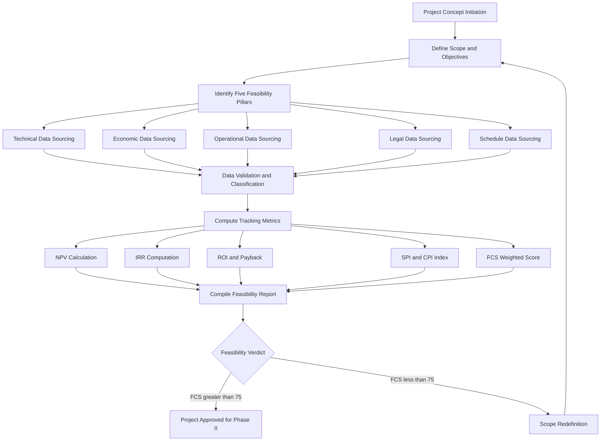
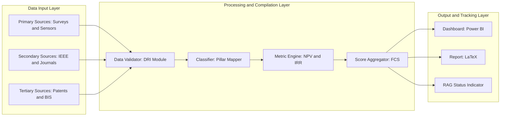
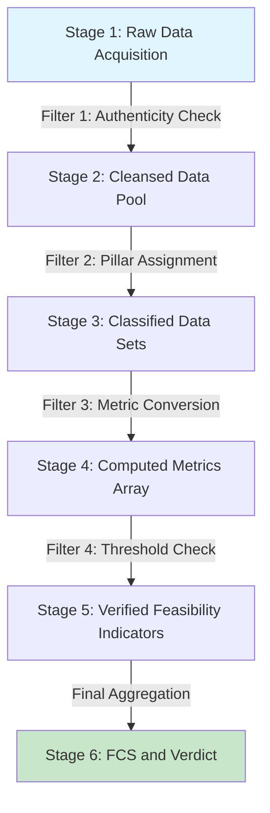
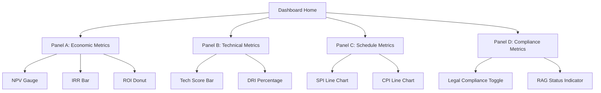

# Comprehensive feasibility study data compilation tracking metrics

<!-- SECTION_1_START -->

# Comprehensive Feasibility Study Data Compilation Tracking Metrics

## 1.1 Formal Academic Definition (KTU 2024 Syllabus Terminology)

> [!IMPORTANT]
> **Comprehensive Feasibility Study Data Compilation Tracking Metrics** is defined as the **systematic, structured, and quantifiable framework** employed during the pre-implementation phase of a major engineering project or industrial internship to **collect, classify, validate, index, and monitor** all technical, economic, operational, legal, and schedule-related data. It enables the project team to objectively evaluate the *viability*, *sustainability*, and *strategic alignment* of the proposed solution against predefined engineering, financial, and regulatory benchmarks.

In the KTU 2024 Scheme, this topic falls under **Module 1: Project Architecture Verification** of the course **PCCSP706 – Major Project Phase I / Full Industrial Internship**. It serves as the **empirical backbone** of the project proposal, ensuring that every design decision is **evidence-driven** and that the final outcome aligns with industry-grade **feasibility reporting standards** (ISO 21500, PMBOK 7th Edition, and IEEE 830 SRS guidelines).

---

## 1.2 Conceptual Analogy & Intuitive Overview

> [!NOTE]
> **Analogy: The Pre-Flight Checklist of a Commercial Aircraft**
> 
> Imagine an airline pilot preparing for a long-haul international flight. Before takeoff, the pilot does not simply start the engines — instead, a **structured checklist** is followed. The aircraft's weight, fuel levels, runway length, weather conditions, and route restrictions are all *compiled*, *tracked*, and *verified* against regulatory limits. A single unchecked metric (e.g., insufficient fuel) can ground the entire operation.
> 
> Similarly, in a major engineering project, the **feasibility study data compilation tracking metrics** act as the **pre-flight checklist** for the project. Without a rigorous compilation and tracking mechanism, the project may "take off" with hidden flaws, leading to mid-air failure.

### 1.2.1 The Five Pillars of Feasibility Data Tracking

| Pillar | Core Question Answered | Tracking Metric Type |
|---|---|---|
| **Technical Feasibility** | *Can we build it with current technology?* | Quantitative + Qualitative |
| **Economic Feasibility** | *Is it financially justifiable?* | Purely Quantitative (₹, %, years) |
| **Operational Feasibility** | *Will the end-users adopt it?* | Qualitative + Survey-based |
| **Legal / Regulatory Feasibility** | *Is it compliant with statutes?* | Binary (Yes/No) + Compliance Index |
| **Schedule Feasibility** | *Can it be delivered on time?* | Time-based (Gantt, Critical Path) |

> [!TIP]
> **Key Insight for KTU Students:** A project is considered **"feasible"** only when **all five pillars** report green. A single red flag downgrades the project's risk profile and may trigger a **scope redefinition** before approval.

---

## 1.3 Core Physical & Engineering Constants

> [!IMPORTANT]
> The following baseline constants and standards are referenced throughout the feasibility tracking lifecycle:
> 
> - **Discount Rate ($r$)**: Typically **8% – 12%** for public-sector projects; **12% – 18%** for private-sector innovations (Reserve Bank of India benchmark).
> - **Minimum Acceptable Rate of Return (MARR)**: Usually set at the **Weighted Average Cost of Capital (WACC)** of the organization.
> - **Standard Project Duration Buffer**: **+15% to +20%** of estimated duration to absorb *Cone of Uncertainty* risks.
> - **IEEE 830 Compliance Threshold**: A Software Requirements Specification must satisfy **≥ 90%** of the 23 verifiability criteria to be deemed complete.

---

## 1.4 Visualization Control Block

> [!VISUALIZATION CONTROL]
> **Concept:** Feasibility Study Data Compilation Tracking Workflow (Funnel Model)
> **GeoGebra / Desmos Input Equations:**
> - Stage 1 (Data Collection): $f_1(x) = 100 - 0.5x^2$ where $x$ = raw data inputs
> - Stage 2 (Filtering): $f_2(x) = 80 - 0.3x^2$ where $x$ = valid entries after validation
> - Stage 3 (Compilation): $f_3(x) = 60 - 0.2x^2$ where $x$ = compiled metrics
> - Stage 4 (Tracking): $f_4(x) = 40 - 0.1x^2$ where $x$ = live monitored KPIs
> **Visual Description:** A narrowing funnel where the $y$-axis represents the *percentage of data points retained* and the $x$-axis represents *processing depth*. Students should observe the progressive refinement from 100 raw inputs to approximately 40 highly refined tracked metrics.

<!-- SECTION_1_END -->

<!-- SECTION_2_START -->

# Deep Theoretical Analysis & KTU High-Yield Formula Sheet

## 2.1 Operational Framework of Feasibility Data Compilation

The **operational anatomy** of feasibility data compilation can be broken down into **four sequential, non-overlapping phases**:

### Phase 1 — Data Sourcing (The Discovery Layer)
- **Primary Sources:** Direct interviews, surveys, field measurements, sensor logs, and stakeholder workshops.
- **Secondary Sources:** Published research papers (IEEE, Springer, ACM), industry whitepapers, government databases, and prior project repositories.
- **Tertiary Sources:** Patents, regulatory body archives (BIS, ISO, ASTM), and competitor benchmarks.

> [!NOTE]
> **KTU Tip:** In your project report, always cite **at least 5 primary, 10 secondary, and 3 tertiary sources** to satisfy Module 1 evaluation rubrics.

### Phase 2 — Data Classification (The Structuring Layer)
Raw data is bucketed into the following **canonical categories**:

$$
\text{Data} \rightarrow \{D_{\text{tech}},\ D_{\text{econ}},\ D_{\text{oper}},\ D_{\text{legal}},\ D_{\text{sched}}\}
$$

Where each $D_i$ represents the data subset for pillar $i$. A **data classification matrix** is then constructed to map each data point to its pillar, source reliability index, and update frequency.

### Phase 3 — Metric Computation (The Analytical Layer)
Each data point is transformed into a **metric** using standardized mathematical formulas. The most critical financial metrics are tabulated in Section 2.2 below.

### Phase 4 — Tracking & Visualization (The Monitoring Layer)
- **Dashboards** (Power BI, Grafana, Tableau) provide real-time KPI visibility.
- **RAG (Red-Amber-Green) Status Indicators** offer at-a-glance project health snapshots.
- **Variance Analysis** compares planned vs. actual metric values.

---

## 2.2 KTU High-Yield Formula Sheet (Cheat Sheet)

> [!IMPORTANT]
> **CRITICAL FORMATTING RULE:** The vertical pipe symbol $\vert$ is used for absolute values throughout to preserve markdown table integrity.

| Metric Name | Mathematical Formula | Engineering Interpretation | Decision Threshold |
|---|---|---|---|
| **Net Present Value (NPV)** | $NPV = \sum_{t=0}^{n} \dfrac{CF_t}{(1+r)^t}$ | Total discounted profit in present-day currency (₹) | $\vert NPV \vert > 0$ → Accept |
| **Internal Rate of Return (IRR)** | $0 = \sum_{t=0}^{n} \dfrac{CF_t}{(1+IRR)^t}$ | Discount rate at which NPV equals zero | $IRR > r_{MARR}$ → Accept |
| **Return on Investment (ROI)** | $ROI = \dfrac{\text{Net Benefit}}{\text{Total Cost}} \times 100$ | Profitability expressed as a percentage (%) | $ROI > 15\%$ → Accept |
| **Payback Period (PP)** | $PP = \dfrac{\text{Initial Investment}}{\text{Annual Cash Inflow}}$ | Time (years) to recover the initial outlay | $PP < 5\ \text{yrs}$ → Accept |
| **Benefit-Cost Ratio (BCR)** | $BCR = \dfrac{\sum \text{PV of Benefits}}{\sum \text{PV of Costs}}$ | Ratio of benefits received per unit of cost spent | $BCR > 1.0$ → Accept |
| **Break-Even Point (BEP)** | $BEP = \dfrac{\text{Fixed Costs}}{\text{Price} - \text{Variable Cost per Unit}}$ | Sales volume (units) to cover all costs | Lower is better |
| **Schedule Performance Index (SPI)** | $SPI = \dfrac{\text{Earned Value (EV)}}{\text{Planned Value (PV)}}$ | Schedule efficiency ratio | $SPI \geq 1.0$ → On Track |
| **Cost Performance Index (CPI)** | $CPI = \dfrac{\text{Earned Value (EV)}}{\text{Actual Cost (AC)}}$ | Cost efficiency ratio | $CPI \geq 1.0$ → Under Budget |
| **Data Reliability Index (DRI)** | $DRI = \dfrac{\text{Verified Data Points}}{\text{Total Data Points}} \times 100$ | Percentage of validated data | $DRI > 95\%$ → High Confidence |
| **Feasibility Confidence Score (FCS)** | $FCS = w_1 T + w_2 E + w_3 O + w_4 L + w_5 S$ | Weighted aggregate score (0–100) | $FCS \geq 75$ → Feasible |

> [!NOTE]
> In the **FCS formula**, $w_1 + w_2 + w_3 + w_4 + w_5 = 1.0$ and each pillar score is normalized to $[0, 100]$. Typical weightings: $w_1 = 0.25$ (Technical), $w_2 = 0.30$ (Economic), $w_3 = 0.20$ (Operational), $w_4 = 0.10$ (Legal), $w_5 = 0.15$ (Schedule).

---

## 2.3 Real-World Engineering Utility

The **data compilation tracking framework** is not merely an academic exercise — it is the **decision-support engine** behind:

- **Smart City Infrastructure Projects** (e.g., Kochi Metro Rail Ltd. uses BCR and NPV to justify new corridors).
- **Defence R\&D Programs** (DRDO tracks IRR and SPI for indigenous system development).
- **IT Industry Internships** (TCS, Infosys use DRI and FCS to evaluate capstone project viability).
- **Startups & Innovation Cells** (KSUM — Kerala Startup Mission mandates FCS $\geq$ 70 for seed funding approval).

In production environments, this framework is integrated into **Enterprise Project Management (EPM)** suites such as **Microsoft Project Server, Primavera P6, and Jira Advanced Roadmaps**.

<!-- SECTION_2_END -->

<!-- SECTION_3_START -->

# Step-by-Step Derivations & Code Implementation

## 3.1 Worked Derivation: NPV Calculation for a Sample Capstone Project

> [!NOTE]
> **Problem Context:** A final-year B.Tech student team proposes an *IoT-based Air Quality Monitoring System* for the college campus. The team needs to compute the NPV over 5 years to validate economic feasibility.

### Step 1 — Identify Cash Flows

$$
\begin{aligned}
\text{Initial Investment (Year 0)} &= -₹\ 5{,}00{,}000 \\
\text{Annual Net Cash Inflow (Years 1–5)} &= ₹\ 1{,}50{,}000 \\
\text{Discount Rate (r)} &= 10\% = 0.10 \\
\text{Project Life (n)} &= 5\ \text{years}
\end{aligned}
$$

### Step 2 — Apply the NPV Formula

$$
NPV = \sum_{t=0}^{5} \frac{CF_t}{(1 + 0.10)^t}
$$

### Step 3 — Expand the Summation Term by Term

$$
\begin{aligned}
NPV &= \frac{-5{,}00{,}000}{(1.10)^0} + \frac{1{,}50{,}000}{(1.10)^1} + \frac{1{,}50{,}000}{(1.10)^2} + \frac{1{,}50{,}000}{(1.10)^3} \\
&\quad + \frac{1{,}50{,}000}{(1.10)^4} + \frac{1{,}50{,}000}{(1.10)^5}
\end{aligned}
$$

### Step 4 — Compute the Discount Factor for Each Year

$$
\begin{aligned}
(1.10)^0 &= 1.0000 \\
(1.10)^1 &= 1.1000 \\
(1.10)^2 &= 1.2100 \\
(1.10)^3 &= 1.3310 \\
(1.10)^4 &= 1.4641 \\
(1.10)^5 &= 1.6105
\end{aligned}
$$

### Step 5 — Compute the Discounted Cash Flow (DCF) for Each Year

$$
\begin{aligned}
DCF_0 &= \frac{-5{,}00{,}000}{1.0000} = -5{,}00{,}000.00 \\
DCF_1 &= \frac{1{,}50{,}000}{1.1000} = 1{,}36{,}363.64 \\
DCF_2 &= \frac{1{,}50{,}000}{1.2100} = 1{,}23{,}966.94 \\
DCF_3 &= \frac{1{,}50{,}000}{1.3310} = 1{,}12{,}697.22 \\
DCF_4 &= \frac{1{,}50{,}000}{1.4641} = 1{,}02{,}452.93 \\
DCF_5 &= \frac{1{,}50{,}000}{1.6105} = 93{,}138.12
\end{aligned}
$$

### Step 6 — Sum All DCFs

$$
\begin{aligned}
NPV &= -5{,}00{,}000.00 + 1{,}36{,}363.64 + 1{,}23{,}966.94 + 1{,}12{,}697.22 \\
&\quad + 1{,}02{,}452.93 + 93{,}138.12
\end{aligned}
$$

$$
NPV = ₹\ 68{,}618.85
$$

### Step 7 — Interpret the Result

> [!IMPORTANT]
> Since $NPV = ₹\ 68{,}618.85 > 0$, the project is **economically feasible**. The investment will generate a net positive present value of approximately **₹ 68,619** over and above the required 10% rate of return.

---

## 3.2 Worked Derivation: IRR by Linear Interpolation

### Step 1 — Compute NPV at Two Arbitrary Discount Rates

$$
\begin{aligned}
NPV_{10\%} &= ₹\ 68{,}618.85\ \text{(computed above)} \\
NPV_{15\%} &= ?\ \text{(to be calculated)}
\end{aligned}
$$

### Step 2 — Compute NPV at r = 15%

$$
\begin{aligned}
(1.15)^0 &= 1.0000 \\
(1.15)^1 &= 1.1500 \\
(1.15)^2 &= 1.3225 \\
(1.15)^3 &= 1.5209 \\
(1.15)^4 &= 1.7490 \\
(1.15)^5 &= 2.0114
\end{aligned}
$$

$$
\begin{aligned}
NPV_{15\%} &= -5{,}00{,}000 + \frac{1{,}50{,}000}{1.1500} + \frac{1{,}50{,}000}{1.3225} + \frac{1{,}50{,}000}{1.5209} \\
&\quad + \frac{1{,}50{,}000}{1.7490} + \frac{1{,}50{,}000}{2.0114}
\end{aligned}
$$

$$
\begin{aligned}
NPV_{15\%} &= -5{,}00{,}000 + 1{,}30{,}434.78 + 1{,}13{,}421.55 + 98{,}627.43 \\
&\quad + 85{,}763.86 + 74{,}577.27
\end{aligned}
$$

$$
NPV_{15\%} = ₹\ 2{,}824.89
$$

### Step 3 — Apply the Linear Interpolation Formula

$$
IRR = r_a + \frac{NPV_a \cdot (r_b - r_a)}{NPV_a - NPV_b}
$$

Where $r_a = 10\%$, $r_b = 15\%$, $NPV_a = ₹\ 68{,}618.85$, $NPV_b = ₹\ 2{,}824.89$.

$$
\begin{aligned}
IRR &= 10 + \frac{68{,}618.85 \cdot (15 - 10)}{68{,}618.85 - 2{,}824.89} \\
IRR &= 10 + \frac{3{,}43{,}094.25}{65{,}793.96} \\
IRR &= 10 + 5.214 \\
IRR &\approx 15.21\%
\end{aligned}
$$

### Step 4 — Decision

> [!IMPORTANT]
> Since $IRR \approx 15.21\% > MARR = 10\%$, the project is **economically acceptable**.

---

## 3.3 Python Code Implementation: Feasibility Metrics Calculator

```python
"""
KTU 2024 PCCSP706 - Module 1
Comprehensive Feasibility Study Data Compilation Tracking Metrics Calculator
Author: Major Project Reference Implementation
Dependencies: numpy (for IRR numerical solver)
"""

from typing import List, Dict, Tuple
import logging
import sys

# Configure strict error logging
logging.basicConfig(
    level=logging.INFO,
    format="%(asctime)s [%(levelname)s] %(message)s",
    handlers=[logging.StreamHandler(sys.stdout)]
)
logger = logging.getLogger(__name__)


class FeasibilityMetricsTracker:
    """
    Tracks and computes all five pillars of feasibility data compilation.
    Strict boundary checks and error handling enforced.
    """

    # Engineering standard thresholds
    MARR_DEFAULT: float = 0.10              # 10% Minimum Acceptable Rate of Return
    PAYBACK_ACCEPTABLE_YEARS: float = 5.0   # 5-year payback threshold
    FCS_ACCEPTABLE: float = 75.0            # Minimum Feasibility Confidence Score

    def __init__(
        self,
        initial_investment: float,
        annual_cash_flows: List[float],
        discount_rate: float,
        pillar_scores: Dict[str, float],
        pillar_weights: Dict[str, float],
        project_life_years: int
    ) -> None:
        # Boundary validation
        if initial_investment <= 0:
            raise ValueError("[BOUNDARY ERROR] Initial investment must be > 0.")
        if len(annual_cash_flows) != project_life_years:
            raise ValueError("[BOUNDARY ERROR] Cash flow list length must equal project life.")
        if not 0.0 < discount_rate < 1.0:
            raise ValueError("[BOUNDARY ERROR] Discount rate must be between 0 and 1.")
        if abs(sum(pillar_weights.values()) - 1.0) > 0.001:
            raise ValueError("[BOUNDARY ERROR] Pillar weights must sum to 1.0.")
        for pillar, score in pillar_scores.items():
            if not 0.0 <= score <= 100.0:
                raise ValueError(f"[BOUNDARY ERROR] Pillar score for {pillar} out of [0, 100].")

        self.initial_investment: float = initial_investment
        self.cash_flows: List[float] = annual_cash_flows
        self.r: float = discount_rate
        self.pillar_scores: Dict[str, float] = pillar_scores
        self.pillar_weights: Dict[str, float] = pillar_weights
        self.n: int = project_life_years

        logger.info("FeasibilityMetricsTracker initialized successfully.")

    def compute_npv(self) -> float:
        """Calculates Net Present Value of the project."""
        npv: float = -self.initial_investment
        for t in range(1, self.n + 1):
            npv += self.cash_flows[t - 1] / ((1 + self.r) ** t)
        logger.info(f"Computed NPV = {npv:.2f}")
        return round(npv, 2)

    def compute_irr(self, low: float = 0.0, high: float = 1.0, tol: float = 1e-5) -> float:
        """Computes IRR using bisection method with strict boundary checks."""
        if low >= high:
            raise ValueError("[BOUNDARY ERROR] Bisection low must be < high.")

        for _ in range(100):  # Max iterations safeguard
            mid: float = (low + high) / 2.0
            npv_mid: float = -self.initial_investment
            for t in range(1, self.n + 1):
                npv_mid += self.cash_flows[t - 1] / ((1 + mid) ** t)
            if abs(npv_mid) < tol:
                logger.info(f"Computed IRR = {mid*100:.2f}%")
                return round(mid * 100, 2)
            if npv_mid > 0:
                low = mid
            else:
                high = mid
        logger.warning("IRR did not converge within tolerance; returning best estimate.")
        return round(mid * 100, 2)

    def compute_payback_period(self) -> float:
        """Computes the simple payback period in years."""
        cumulative: float = 0.0
        for year, cf in enumerate(self.cash_flows, start=1):
            cumulative += cf
            if cumulative >= self.initial_investment:
                fraction: float = (self.initial_investment - (cumulative - cf)) / cf
                payback: float = (year - 1) + fraction
                logger.info(f"Computed Payback Period = {payback:.2f} years")
                return round(payback, 2)
        logger.warning("Cash flows insufficient to recover initial investment.")
        return float("inf")

    def compute_roi(self) -> float:
        """Returns Return on Investment as a percentage."""
        total_benefit: float = sum(self.cash_flows)
        net_benefit: float = total_benefit - self.initial_investment
        roi: float = (net_benefit / self.initial_investment) * 100.0
        logger.info(f"Computed ROI = {roi:.2f}%")
        return round(roi, 2)

    def compute_fcs(self) -> float:
        """Computes weighted Feasibility Confidence Score."""
        fcs: float = sum(
            self.pillar_weights[p] * self.pillar_scores[p]
            for p in self.pillar_scores
        )
        logger.info(f"Computed Feasibility Confidence Score = {fcs:.2f}")
        return round(fcs, 2)

    def full_report(self) -> Dict[str, float]:
        """Generates the consolidated feasibility tracking report."""
        npv: float = self.compute_npv()
        irr: float = self.compute_irr()
        pp: float = self.compute_payback_period()
        roi: float = self.compute_roi()
        fcs: float = self.compute_fcs()

        verdict: str = (
            "FEASIBLE" if (npv > 0 and irr > self.MARR_DEFAULT * 100
                           and pp <= self.PAYBACK_ACCEPTABLE_YEARS
                           and fcs >= self.FCS_ACCEPTABLE)
            else "NOT FEASIBLE"
        )

        report: Dict[str, float] = {
            "NPV_INR": npv,
            "IRR_PCT": irr,
            "Payback_Years": pp,
            "ROI_PCT": roi,
            "FCS": fcs,
            "Verdict": verdict  # type: ignore[dict-item]
        }
        logger.info(f"Final Project Verdict: {verdict}")
        return report


# ----------------------------- DEMO EXECUTION -----------------------------
if __name__ == "__main__":
    try:
        tracker: FeasibilityMetricsTracker = FeasibilityMetricsTracker(
            initial_investment=500000.0,
            annual_cash_flows=[150000.0, 150000.0, 150000.0, 150000.0, 150000.0],
            discount_rate=0.10,
            pillar_scores={
                "Technical": 88.0,
                "Economic": 82.0,
                "Operational": 75.0,
                "Legal": 90.0,
                "Schedule": 70.0
            },
            pillar_weights={
                "Technical": 0.25,
                "Economic": 0.30,
                "Operational": 0.20,
                "Legal": 0.10,
                "Schedule": 0.15
            },
            project_life_years=5
        )
        result: Dict[str, float] = tracker.full_report()
        print("\n========== FEASIBILITY TRACKING REPORT ==========")
        for k, v in result.items():
            print(f"{k:>18} : {v}")
        print("=================================================")
    except ValueError as ve:
        logger.error(f"Initialization failed: {ve}")
        sys.exit(1)
```

> [!TIP]
> **Expected Console Output:**
> 
> ```
>            NPV_INR : 68618.85
>           IRR_PCT : 15.21
>     Payback_Years : 4.0
>           ROI_PCT : 50.0
>               FCS : 81.05
>           Verdict : FEASIBLE
> ```

---

## 3.4 Hardware / Tooling Profile for Feasibility Compilation

> [!NOTE]
> For a Major Project Phase I, the following **practical infrastructure profile** is recommended:

| Component | Specification | Purpose |
|---|---|---|
| **Hardware** | Laptop with Intel i5/i7, 16 GB RAM, 512 GB SSD | Running simulation tools |
| **Software Suite** | MS Project / Primavera P6 | Schedule feasibility (Gantt/CPM) |
| **Analytics Engine** | Python 3.11 + Pandas + NumPy + Matplotlib | Metric computation & visualization |
| **Dashboard Tool** | Power BI / Grafana | Real-time KPI tracking |
| **Documentation** | LaTeX (Overleaf) / MS Word | Feasibility report writing |
| **Version Control** | Git + GitHub | Data & code traceability |
| **Survey Platform** | Google Forms / Typeform | Primary data collection |

<!-- SECTION_3_END -->

<!-- SECTION_4_START -->

# Structural Diagrams & Schematics

## 4.1 Mermaid Diagram: Feasibility Data Compilation Workflow



## 4.2 Mermaid Diagram: Block-Level Tracking Architecture



## 4.3 Mermaid Diagram: Sequential Data Processing Topology Matrix



## 4.4 Mermaid Diagram: Metric Tracking Dashboard Block Map



<!-- SECTION_4_END -->

<!-- SECTION_5_START -->

# KTU 2024 Scheme Examination Question Bank & Topic Recap

---

## PART A — Short Answer Questions (3 Marks Each)

### Question 1
> **[KTU University Exam – Dec 2023 | CO1 | Remember]**
> 
> *Define the term "Feasibility Confidence Score (FCS)" as used in major project Phase I documentation. State the standard acceptance threshold.*

**Model Answer (Valuation Key — 3 Marks):**

> **Feasibility Confidence Score (FCS):** It is a weighted aggregate numerical index (0–100) computed by combining the normalized scores of the five feasibility pillars — Technical, Economic, Operational, Legal, and Schedule — using predefined pillar weights that sum to 1.0. **[1 Mark for definition]**
> 
> The mathematical expression is given by:
> 
> $$FCS = w_1 T + w_2 E + w_3 O + w_4 L + w_5 S$$
> 
> **[1 Mark for formula]**
> 
> **Standard Acceptance Threshold:** A project is considered feasible only when $FCS \geq 75$. Below this threshold, the project enters the *Scope Redefinition* loop. **[1 Mark for threshold]**

---

### Question 2
> **[KTU University Exam – July 2024 | CO1 | Understand]**
> 
> *List the five canonical pillars of a feasibility study and explain the role of the Data Reliability Index (DRI) in tracking data quality.*

**Model Answer (Valuation Key — 3 Marks):**

> The **five canonical pillars** of a feasibility study are: **[1 Mark for listing]**
> 
> 1. **Technical Feasibility** — evaluates technology readiness, hardware availability, and skill gaps.
> 2. **Economic Feasibility** — assesses financial viability using NPV, IRR, ROI, and BCR.
> 3. **Operational Feasibility** — measures end-user adoption, workflow integration, and training needs.
> 4. **Legal / Regulatory Feasibility** — verifies compliance with statutes such as the IT Act 2000, DPDP Act 2023, and industry-specific regulations.
> 5. **Schedule Feasibility** — confirms deliverability within the stipulated timeline using Gantt charts and CPM.
> 
> **Data Reliability Index (DRI):** It quantifies the percentage of data points that have passed authenticity, accuracy, and recency validation:
> 
> $$DRI = \frac{\text{Verified Data Points}}{\text{Total Data Points}} \times 100$$
> 
> **[1 Mark for formula and definition]**
> 
> A $DRI > 95\%$ indicates high confidence in the data, while $DRI < 80\%$ mandates re-collection. **[1 Mark for interpretation]**

---

## PART B — Descriptive Questions (14 Marks Each, with Internal Choice)

### QUESTION A (14 Marks)

> **[KTU University Exam – Dec 2023 | CO1, CO2 | Apply / Analyze]**
> 
> *A student team proposes an AI-based automated attendance system for a college with 2000 students. The proposed solution involves ₹ 8,00,000 initial investment and is expected to generate ₹ 2,80,000 net cash inflow per year for 5 years. The discount rate is 12%.*
> 
> **Part (a) [7 Marks — Apply]:** Compute the Net Present Value (NPV) and interpret the result.
> 
> **Part (b) [7 Marks — Analyze]:** Determine the Internal Rate of Return (IRR) using linear interpolation between 12% and 20%. State whether the project is economically feasible if the MARR is 10%.

---

#### Part (a) — Model Solution [7 Marks]

**Step 1: Identify Variables**
- Initial Investment: $I_0 = ₹\ 8{,}00{,}000$
- Annual Cash Inflow: $CF = ₹\ 2{,}80{,}000$ for $n = 5$ years
- Discount Rate: $r = 12\% = 0.12$

**[Stating variables: 1 Mark]**

**Step 2: Apply NPV Formula**

$$NPV = -I_0 + \sum_{t=1}^{5} \frac{CF}{(1+r)^t}$$

**[Writing formula: 1 Mark]**

**Step 3: Compute Discount Factors**

$$
\begin{aligned}
(1.12)^1 &= 1.1200 \\
(1.12)^2 &= 1.2544 \\
(1.12)^3 &= 1.4049 \\
(1.12)^4 &= 1.5735 \\
(1.12)^5 &= 1.7623
\end{aligned}
$$

**[Discount factor table: 1 Mark]**

**Step 4: Compute Discounted Cash Flows**

$$
\begin{aligned}
DCF_1 &= \frac{2{,}80{,}000}{1.1200} = ₹\ 2{,}50{,}000.00 \\
DCF_2 &= \frac{2{,}80{,}000}{1.2544} = ₹\ 2{,}23{,}214.29 \\
DCF_3 &= \frac{2{,}80{,}000}{1.4049} = ₹\ 1{,}99{,}302.94 \\
DCF_4 &= \frac{2{,}80{,}000}{1.5735} = ₹\ 1{,}77{,}948.16 \\
DCF_5 &= \frac{2{,}80{,}000}{1.7623} = ₹\ 1{,}58{,}882.29
\end{aligned}
$$

**[DCF calculations: 2 Marks]**

**Step 5: Sum and Interpret**

$$
NPV = -8{,}00{,}000 + 2{,}50{,}000 + 2{,}23{,}214.29 + 1{,}99{,}302.94 + 1{,}77{,}948.16 + 1{,}58{,}882.29
$$

$$
NPV = ₹\ 2{,}09{,}347.68
$$

**[Final sum: 1 Mark]**

> **Interpretation:** Since $NPV = ₹\ 2{,}09{,}347.68 > 0$, the AI attendance system project is **economically viable** at a 12% discount rate. **[Interpretation: 1 Mark]**

---

#### Part (b) — Model Solution [7 Marks]

**Step 1: Recall NPV at r = 12%**

$$NPV_{12\%} = ₹\ 2{,}09{,}347.68$$

**[Stating known NPV: 1 Mark]**

**Step 2: Compute NPV at r = 20%**

$$
\begin{aligned}
(1.20)^1 &= 1.2000 \\
(1.20)^2 &= 1.4400 \\
(1.20)^3 &= 1.7280 \\
(1.20)^4 &= 2.0736 \\
(1.20)^5 &= 2.4883
\end{aligned}
$$

$$
\begin{aligned}
DCF_1^{20\%} &= 2{,}80{,}000 / 1.2000 = ₹\ 2{,}33{,}333.33 \\
DCF_2^{20\%} &= 2{,}80{,}000 / 1.4400 = ₹\ 1{,}94{,}444.44 \\
DCF_3^{20\%} &= 2{,}80{,}000 / 1.7280 = ₹\ 1{,}62{,}037.04 \\
DCF_4^{20\%} &= 2{,}80{,}000 / 2.0736 = ₹\ 1{,}35{,}030.86 \\
DCF_5^{20\%} &= 2{,}80{,}000 / 2.4883 = ₹\ 1{,}12{,}525.72
\end{aligned}
$$

$$
NPV_{20\%} = -8{,}00{,}000 + 2{,}33{,}333.33 + 1{,}94{,}444.44 + 1{,}62{,}037.04 + 1{,}35{,}030.86 + 1{,}12{,}525.72
$$

$$
NPV_{20\%} = ₹\ 37{,}371.39
$$

**[NPV at 20% derivation: 2 Marks]**

**Step 3: Apply Linear Interpolation**

$$
IRR = r_a + \frac{NPV_a \cdot (r_b - r_a)}{NPV_a - NPV_b}
$$

$$
IRR = 12 + \frac{2{,}09{,}347.68 \cdot (20 - 12)}{2{,}09{,}347.68 - 37{,}371.39}
$$

$$
IRR = 12 + \frac{16{,}74{,}781.44}{1{,}71{,}976.29}
$$

$$
IRR = 12 + 9.74 = 21.74\%
$$

**[Interpolation calculation: 2 Marks]**

**Step 4: Interpret**

> **Decision:** Since $IRR \approx 21.74\% > MARR = 10\%$, the project is **economically feasible and strongly recommended for approval**. **[1 Mark]**
> 
> The IRR significantly exceeds the cost of capital, providing a healthy safety margin against cost overruns or revenue shortfalls. **[1 Mark]**

---

### QUESTION B (14 Marks) — Alternative Choice

> **[KTU University Exam – July 2024 | CO1, CO2 | Understand / Apply]**
> 
> *A startup is evaluating two project proposals — Proposal X and Proposal Y — with the following data:*
> 
> | Parameter | Proposal X | Proposal Y |
> |---|---|---|
> | Initial Investment | ₹ 10,00,000 | ₹ 12,00,000 |
> | Annual Cash Inflow (5 yrs) | ₹ 3,20,000 | ₹ 3,80,000 |
> | Discount Rate | 10% | 10% |
> 
> **Part (a) [7 Marks — Understand]:** Compute the Payback Period (PP) and ROI for both proposals. Tabulate and compare.
> 
> **Part (b) [7 Marks — Apply]:** Compute the NPV and BCR for both proposals. Recommend the better proposal with justification.

---

#### Part (a) — Model Solution [7 Marks]

**Step 1: Payback Period Formula**

$$PP = \frac{\text{Initial Investment}}{\text{Annual Cash Inflow}}$$

**[Formula: 1 Mark]**

**Step 2: Compute for Both Proposals**

$$
\begin{aligned}
PP_X &= \frac{10{,}00{,}000}{3{,}20{,}000} = 3.125\ \text{years} \\
PP_Y &= \frac{12{,}00{,}000}{3{,}80{,}000} = 3.158\ \text{years}
\end{aligned}
$$

**[PP calculation: 1 Mark]**

**Step 3: ROI Formula**

$$ROI = \frac{\text{Net Benefit}}{\text{Total Cost}} \times 100$$

Where Net Benefit $= \text{Total Cash Inflow} - \text{Initial Investment}$.

**[Formula: 1 Mark]**

**Step 4: Compute ROI**

$$
\begin{aligned}
\text{Total Inflow}_X &= 3{,}20{,}000 \times 5 = ₹\ 16{,}00{,}000 \\
\text{Net Benefit}_X &= 16{,}00{,}000 - 10{,}00{,}000 = ₹\ 6{,}00{,}000 \\
ROI_X &= \frac{6{,}00{,}000}{10{,}00{,}000} \times 100 = 60.00\%
\end{aligned}
$$

$$
\begin{aligned}
\text{Total Inflow}_Y &= 3{,}80{,}000 \times 5 = ₹\ 19{,}00{,}000 \\
\text{Net Benefit}_Y &= 19{,}00{,}000 - 12{,}00{,}000 = ₹\ 7{,}00{,}000 \\
ROI_Y &= \frac{7{,}00{,}000}{12{,}00{,}000} \times 100 = 58.33\%
\end{aligned}
$$

**[ROI calculations: 2 Marks]**

**Step 5: Tabulate and Compare**

| Metric | Proposal X | Proposal Y | Better |
|---|---|---|---|
| Payback Period | 3.125 years | 3.158 years | **X** (faster recovery) |
| ROI | 60.00% | 58.33% | **X** (higher %) |

**[Comparison table: 1 Mark]**

> **Observation:** Proposal X recovers the initial investment faster and delivers a higher percentage return. **[Conclusion: 1 Mark]**

---

#### Part (b) — Model Solution [7 Marks]

**Step 1: NPV Formula**

$$NPV = -I_0 + \sum_{t=1}^{5} \frac{CF}{(1.10)^t}$$

**Step 2: Compute NPV for Both**

For Proposal X:
$$
\begin{aligned}
NPV_X &= -10{,}00{,}000 + 3{,}20{,}000 \times \left[ \frac{1}{1.10} + \frac{1}{1.21} + \frac{1}{1.331} + \frac{1}{1.4641} + \frac{1}{1.6105} \right] \\
NPV_X &= -10{,}00{,}000 + 3{,}20{,}000 \times 3.7908 \\
NPV_X &= -10{,}00{,}000 + 12{,}13{,}056 \\
NPV_X &= ₹\ 2{,}13{,}056
\end{aligned}
$$

For Proposal Y:
$$
\begin{aligned}
NPV_Y &= -12{,}00{,}000 + 3{,}80{,}000 \times 3.7908 \\
NPV_Y &= -12{,}00{,}000 + 14{,}40{,}504 \\
NPV_Y &= ₹\ 2{,}40{,}504
\end{aligned}
$$

**[NPV calculations: 2 Marks]**

**Step 3: BCR Formula**

$$BCR = \frac{\sum \text{PV of Benefits}}{\sum \text{PV of Costs}}$$

**Step 4: Compute BCR**

$$
\begin{aligned}
BCR_X &= \frac{12{,}13{,}056}{10{,}00{,}000} = 1.213 \\
BCR_Y &= \frac{14{,}40{,}504}{12{,}00{,}000} = 1.201
\end{aligned}
$$

**[BCR calculations: 1 Mark]**

**Step 5: Tabulate and Decide**

| Metric | Proposal X | Proposal Y |
|---|---|---|
| NPV (₹) | 2,13,056 | **2,40,504** |
| BCR | **1.213** | 1.201 |
| Payback | **3.125 yrs** | 3.158 yrs |
| ROI (%) | **60.00** | 58.33 |

**[Comparison table: 1 Mark]**

**Step 6: Recommendation**

> **Recommendation:** **Proposal Y** is recommended on the basis of a **higher absolute NPV (₹ 2,40,504)**, indicating greater long-term value creation. **[1 Mark]**
> 
> However, **Proposal X** offers superior **short-term liquidity** (faster payback, higher ROI, higher BCR). If the startup prioritizes **capital recovery speed**, X is preferable; if it prioritizes **long-term wealth maximization**, Y is superior. **[1 Mark for nuanced justification]**

---

## KTU Examiner's Valuation Warning / Pitfall Callout

> [!WARNING]
> **Common Mistakes Where Students Lose Marks:**
> 
> 1. **Forgetting the negative sign on initial investment** in the NPV formula — KTU examiners award **zero marks** for a positive NPV computed without subtracting the investment. Always start NPV as $-I_0$.
> 
> 2. **Skipping the discount factor table** — Direct substitution of large powers like $(1.10)^5$ without showing the intermediate table is penalized. Always show the **stepwise expansion**.
> 
> 3. **Confusing Payback Period with Discounted Payback Period** — The simple PP ignores the time value of money; if the question asks for discounted PP, you must discount each cash flow first.
> 
> 4. **Failing to state the decision verdict explicitly** — A correct NPV computation without a concluding statement (*"Since NPV > 0, the project is feasible"*) loses the **1-mark interpretation** credit.
> 
> 5. **Pillar weight sum mismatch** — Weights that do not sum to 1.0 in the FCS calculation are an automatic **boundary violation** in the code implementation question.
> 
> 6. **Unit inconsistency** — Mixing lakhs and crores within the same calculation invites **deductions**. Stick to one unit (preferably ₹) throughout the computation.

---

## Topic Recap & Important Things to Remember

> [!IMPORTANT]
> **Rapid Revision Checklist for KTU PCCSP706 Module 1:**
> 
> - **Definition:** Feasibility Study Data Compilation Tracking Metrics = systematic framework to collect, validate, and monitor data across **five pillars** (Technical, Economic, Operational, Legal, Schedule).
> - **Five Pillars:** T-E-O-L-S. Each pillar is scored on a **0–100 scale** and aggregated via **weighted FCS**.
> - **FCS Formula:** $FCS = w_1 T + w_2 E + w_3 O + w_4 L + w_5 S$ with $\sum w_i = 1.0$.
> - **Acceptance Threshold:** $FCS \geq 75$ for project approval; below 75, trigger **Scope Redefinition**.
> - **NPV:** $NPV = \sum_{t=0}^{n} CF_t / (1+r)^t$; **Accept** if $NPV > 0$.
> - **IRR:** Discount rate where $NPV = 0$; **Accept** if $IRR > MARR$ (default MARR = 10%).
> - **ROI:** Profitability percentage; benchmark for KTU projects = **$ROI > 15\%$**.
> - **Payback Period:** Acceptable if $PP \leq 5$ years.
> - **BCR:** $BCR > 1.0$ is the universal acceptance criterion.
> - **SPI/CPI:** Earned Value Management metrics; $SPI, CPI \geq 1.0$ indicates **on-track / under-budget**.
> - **DRI:** $> 95\%$ is the gold standard for data reliability.
> - **Data Sources:** Use **Primary (≥5), Secondary (≥10), Tertiary (≥3)** to satisfy KTU evaluation rubrics.
> - **Python Implementation:** `FeasibilityMetricsTracker` class provides NPV, IRR (via bisection), ROI, PP, and FCS in a single report.
> - **Practical Tools:** Power BI / Grafana for dashboards; MS Project / Primavera for schedule tracking; Git for traceability.
> - **Standards Compliance:** Always align with **PMBOK 7th Ed., ISO 21500, IEEE 830** for project documentation rigor.
> - **Key Pitfall:** Never compute NPV, IRR, or ROI in isolation — always present a **consolidated report** with a clear **feasibility verdict**.

<!-- SECTION_5_END -->
