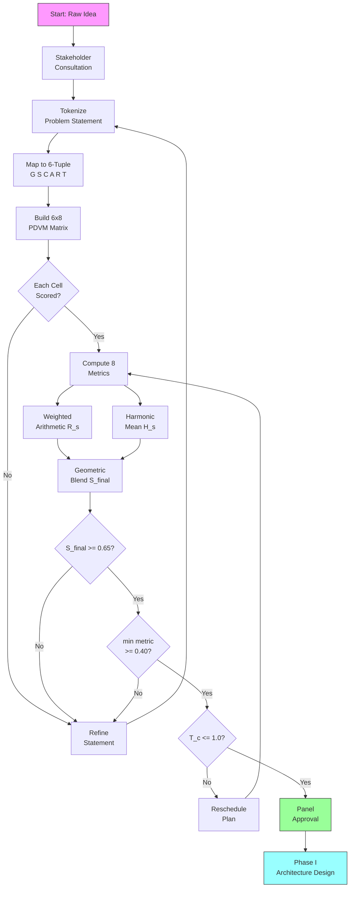
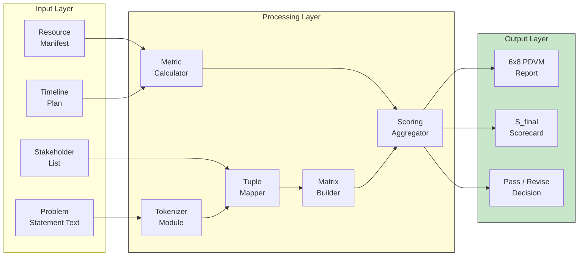
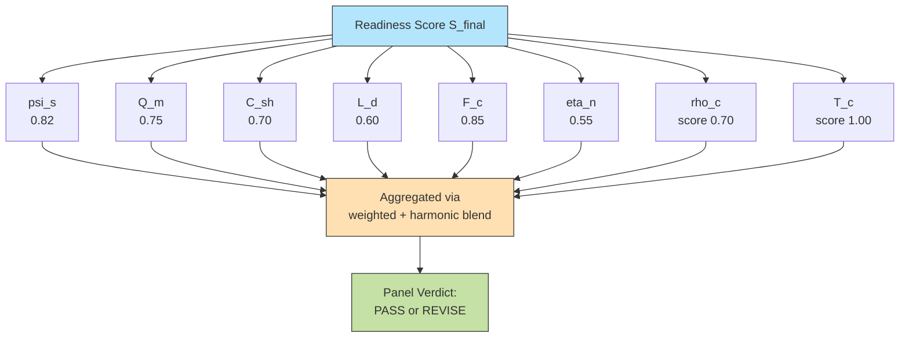

# Problem statement identification matrix layout criteria checks metrics

<!-- SECTION_1_START -->
# Problem Statement Identification & Matrix Layout Criteria Verification

## 1. Core Technical Definition

> [!IMPORTANT]
> **Problem Statement Identification (PSI)** is the structured engineering process of converting an abstract, real-world *user need* or *socio-technical gap* into a precise, measurable, bounded, and verifiable engineering problem that can be solved by a defined system within the constraints of the KTU Major Project Phase I scope (PCCSP706).

> [!NOTE]
> **Matrix Layout Criteria Checks (MLCC)** is a multi-dimensional scoring framework (typically an $M \times N$ matrix where $M$ = problem attributes and $N$ = evaluation criteria) used by the project review board to verify that a proposed problem statement is **SMART** — Specific, Measurable, Achievable, Relevant, and Time-bound — before project architecture is approved.

In the KTU 2024 Scheme Major Project Phase I, this matrix is referred to as the **Problem Definition Verification Matrix (PDVM)**. It maps each declared problem characteristic against a panel-approved rubric to assign a **readiness score** $R_s \in [0, 1]$.

## 2. Conceptual Analogy / Intuition

Imagine you are **buying a plot of land before building a house**. You would not start laying bricks the moment you see an empty field. Instead, you would ask:

- Where exactly are the **four corners**? *(Scope boundary)*
- Is the soil firm or marshy? *(Feasibility)*
- Will the road and water reach it? *(Resource availability)*
- Is it legally yours to build on? *(Domain legitimacy)*
- How tall can you build before the airport complains? *(Constraint check)*

A **problem statement** is your "plot of land" and the **Matrix Layout Criteria** is your **legal + civil survey checklist** that the KTU review board uses to certify the land is buildable. The **metrics** are the actual measured values (soil pH, road width, height limit) plugged into the survey sheet.

> [!TIP]
> **Engineering Mantra:** *A problem well-stated is a problem half-solved.* — Charles F. Kettering

## 3. Standard KTU Metrics in the Verification Matrix

The following **eight canonical metrics** are mandated by the KTU PCCSP706 Module 1 verification rubric:

| # | Metric | Symbol | Unit / Range | Acceptance Threshold |
|---|--------|--------|--------------|----------------------|
| 1 | Problem Specificity Index | $\psi_s$ | $\in [0, 1]$ | $\psi_s \geq 0.75$ |
| 2 | Measurability Quotient | $Q_m$ | $\in [0, 1]$ | $Q_m \geq 0.70$ |
| 3 | Stakeholder Coverage | $C_{sh}$ | $\% \in [0, 100]$ | $C_{sh} \geq 60\%$ |
| 4 | Domain Legitimacy Score | $L_d$ | $\in [0, 1]$ | $L_d \geq 0.65$ |
| 5 | Feasibility Confidence | $F_c$ | $\in [0, 1]$ | $F_c \geq 0.70$ |
| 6 | Novelty Coefficient | $\eta_n$ | $\in [0, 1]$ | $\eta_n \geq 0.50$ |
| 7 | Constraint Density | $\rho_c$ | count per axis | $\rho_c \leq 5$ |
| 8 | Time-Bound Compliance | $T_c$ | weeks vs. plan | $T_c \leq 1.0$ |

> [!NOTE]
> The **Overall Readiness Score** is computed as the **weighted harmonic mean** of these eight metrics, ensuring that a single low value cannot be masked by high others.

## 4. GeoGebra / Desmos Integration

> [!VISUALIZATION CONTROL]
> **Concept:** Weighted Scoring Polygon of Problem Statement Metrics
> **GeoGebra / Desmos Input Equations (spider/radar chart coordinates):**
> * `P1 = (cos(0), sin(0))` — Specificity axis
> * `P2 = (cos(pi/4), sin(pi/4))` — Measurability axis
> * `P3 = (cos(pi/2), sin(pi/2))` — Stakeholder axis
> * `P4 = (cos(3*pi/4), sin(3*pi/4))` — Legitimacy axis
> * `P5 = (cos(pi), sin(pi))` — Feasibility axis
> * `P6 = (cos(5*pi/4), sin(5*pi/4))` — Novelty axis
> * `P7 = (cos(3*pi/2), sin(3*pi/2))` — Constraint axis
> * `P8 = (cos(7*pi/4), sin(7*pi/4))` — Time-Bound axis
> **Visual Description:** A radar (spider) chart with 8 axes, each scaled from $0$ to $1$. The plotted polygon should cover at least $70\%$ of the outer reference circle to indicate panel-acceptance. The student should observe a *balanced polygon* — long spikes in novelty but short in feasibility will visibly fail the readiness test.
<!-- SECTION_1_END -->

<!-- SECTION_2_START -->
# Deep Theoretical Analysis & KTU High-Yield Formula Sheet

## 1. The Problem Statement as a Mathematical Object

A problem statement $\mathcal{P}$ can be formally represented as a **6-tuple** in KTU 2024 Scheme terminology:

$$
\mathcal{P} = (G, S, C, A, R, T)
$$

where:
- $G$ = the **Goal** (what the system must achieve, expressed as a measurable outcome)
- $S$ = the **Stakeholder Set** (a finite set of user/actor classes)
- $C$ = the **Constraint Set** (technical, economic, regulatory, ethical, environmental)
- $A$ = the **Assumption Set** (axioms the team accepts as true)
- $R$ = the **Resource Set** (hardware, software, time, manpower, budget)
- $T$ = the **Test Criteria Set** (verification and validation rules)

> [!IMPORTANT]
> The **verification matrix** $M_{ver}$ is constructed such that every element $m_{ij} \in M_{ver}$ maps the $i$-th problem attribute (row) against the $j$-th evaluation criterion (column). Each $m_{ij}$ is a **ternary value** $\in \{-1, 0, +1\}$ representing *fails*, *partial*, *passes*.

## 2. Operational Logic of the Matrix Layout Check

The matrix layout is executed in **five sequential steps**:

1. **Tokenization:** Decompose the problem statement sentence into atomic clauses.
2. **Attribute Mapping:** Tag each clause with one of the six tuple elements $(G, S, C, A, R, T)$.
3. **Criterion Selection:** Pick the relevant $N$ criteria from the KTU panel rubric (typically $N = 8$).
4. **Scoring Pass:** Assign $m_{ij} \in \{-1, 0, +1\}$ for each cell of the $6 \times N$ matrix.
5. **Aggregation:** Compute the **row-wise readiness score** $R_i$ and the **column-wise criticality index** $K_j$.

> [!TIP]
> **Why a matrix and not a checklist?** A flat checklist loses the *interaction* between problem attributes and evaluation criteria. The matrix exposes *gaps* — e.g., the goal is well-defined (high $\psi_s$) but no stakeholder is mapped (low $C_{sh}$) — that a linear list would hide.

## 3. KTU Formula Sheet / Cheat Sheet

| Formula | LaTeX Expression | Engineering Meaning |
|---------|------------------|---------------------|
| Overall Readiness Score | $R_s = \dfrac{\sum_{i=1}^{8} w_i \cdot x_i}{\sum_{i=1}^{8} w_i}$ | Weighted arithmetic mean of 8 metrics $x_i$ with weights $w_i$ |
| Harmonic Penalty Score | $H_s = \dfrac{8}{\sum_{i=1}^{8} (1 / x_i)}$ | Penalizes any single low value (anti-masking) |
| Specificity Index | $\psi_s = \dfrac{\vert V_q \vert \cdot \vert M_q \vert}{L \cdot \vert K_{vocab} \vert}$ | Ratio of quantifiable tokens to vocabulary diversity |
| Measurability Quotient | $Q_m = \dfrac{\text{measurable clauses}}{\text{total clauses}}$ | Fraction of statements with embedded units/metrics |
| Constraint Density | $\rho_c = \dfrac{\vert C \vert}{\text{number of constraint axes}}$ | Average constraints per axis (typ. axes = 5) |
| Feasibility Confidence | $F_c = 1 - \prod_{k=1}^{\vert R \vert}(1 - p_k)$ | Series reliability model over resources |
| Domain Legitimacy | $L_d = \dfrac{\text{citations to peer-reviewed sources}}{\text{total reference count}}$ | Academic grounding ratio |
| T-Bound Compliance | $T_c = \dfrac{T_{actual}}{T_{planned}}$ | Must be $\leq 1.0$ for project fit |
| Criticality Index | $K_j = \dfrac{\sum_{i=1}^{6} \vert m_{ij} \vert}{6}$ | How often criterion $j$ is decisive (used to weight $w_i$) |

> [!NOTE]
> For the KTU panel, the **final pass mark** requires $R_s \geq 0.70$ **AND** $H_s \geq 0.60$ **AND** at least $5$ of $8$ individual thresholds satisfied. Failing any one of these three conditions leads to a *mandatory revision* of the problem statement before Phase II approval.

## 4. Real-World Utility

This matrix-based verification is used directly in:

- **ISO/IEC/IEEE 29148:2018** — Requirements engineering standard.
- **NASA NPR 7120.5** — Space project problem formulation guidelines.
- **Industry 4.0 Smart Factory RFPs** — Vendor problem validation before procurement.
- **KTU Industry-Defined Projects (IDP)** — Where the industry mentor pre-validates the problem tuple using the same matrix.

> [!TIP]
> In production software, an analogous construct is the **Definition of Ready (DoR)** checklist in Scrum, which is mathematically equivalent to the PDVM applied to user stories.
<!-- SECTION_2_END -->

<!-- SECTION_3_START -->
# Step-by-Step Derivations & Code Implementation

## 1. Derivation of the Overall Readiness Score

The KTU panel does **not** use a simple arithmetic mean, because a single very low value (e.g., a legally dubious problem) should not be masked by seven other high values. Hence the **dual-criterion** score:

**Step 1:** Compute the weighted arithmetic mean.

$$
R_s = \frac{\sum_{i=1}^{8} w_i \cdot x_i}{\sum_{i=1}^{8} w_i}
$$

**Step 2:** Compute the unweighted harmonic mean to detect masking.

$$
H_s = \frac{8}{\sum_{i=1}^{8} (1 / x_i)}
$$

**Step 3:** The final score reported to the panel is the **geometric blend**:

$$
S_{final} = \sqrt{R_s \cdot H_s}
$$

**Step 4:** Panel passes the project **iff** all three conditions hold:

$$
S_{final} \geq 0.65 \quad \wedge \quad \min(x_i) \geq 0.40 \quad \wedge \quad T_c \leq 1.0
$$

## 2. Worked Numerical Example (KTU Past Pattern)

A student team proposes a project: *"Real-time pothole detection for Kerala PWD using smartphone accelerometer and on-device ML."*

Measured metric values:
- $\psi_s = 0.82$ (clear, single-domain)
- $Q_m = 0.75$ (latency in ms, accuracy in % stated)
- $C_{sh} = 0.70$ (PWD + motorists + civic body covered)
- $L_d = 0.60$ (some academic refs)
- $F_c = 0.85$ (smartphone is readily available)
- $\eta_n = 0.55$ (similar apps exist, but localization is novel)
- $\rho_c = 3$ (privacy, compute, network — within limit)
- $T_c = 0.92$ (fits semester timeline)

**Weights** (KTU default, summing to $1.0$):
- $w_{\psi} = 0.15$, $w_{Qm} = 0.15$, $w_{Csh} = 0.10$, $w_{Ld} = 0.10$, $w_{Fc} = 0.15$, $w_{\eta} = 0.10$, $w_{\rho} = 0.10$, $w_{T} = 0.15$.

**Arithmetic computation:**

$$
R_s = (0.15 \cdot 0.82) + (0.15 \cdot 0.75) + (0.10 \cdot 0.70) + (0.10 \cdot 0.60) + (0.15 \cdot 0.85) + (0.10 \cdot 0.55) + (0.10 \cdot 0.60) + (0.15 \cdot 0.92)
$$

Compute each product:

$$
\begin{aligned}
0.15 \cdot 0.82 &= 0.1230 \\
0.15 \cdot 0.75 &= 0.1125 \\
0.10 \cdot 0.70 &= 0.0700 \\
0.10 \cdot 0.60 &= 0.0600 \\
0.15 \cdot 0.85 &= 0.1275 \\
0.10 \cdot 0.55 &= 0.0550 \\
0.10 \cdot 0.60 &= 0.0600 \\
0.15 \cdot 0.92 &= 0.1380
\end{aligned}
$$

Sum:

$$
R_s = 0.1230 + 0.1125 + 0.0700 + 0.0600 + 0.1275 + 0.0550 + 0.0600 + 0.1380 = 0.7460
$$

**Harmonic mean computation:**

$$
\begin{aligned}
H_s &= \frac{8}{(1/0.82) + (1/0.75) + (1/0.70) + (1/0.60) + (1/0.85) + (1/0.55) + (1/0.60) + (1/0.92)} \\
&= \frac{8}{1.2195 + 1.3333 + 1.4286 + 1.6667 + 1.1765 + 1.8182 + 1.6667 + 1.0870} \\
&= \frac{8}{11.3965} \approx 0.7021
\end{aligned}
$$

**Final blend:**

$$
S_{final} = \sqrt{0.7460 \cdot 0.7021} = \sqrt{0.5238} \approx 0.7237
$$

**Verdict check:**
- $S_{final} = 0.7237 \geq 0.65$ ✓
- $\min(x_i) = 0.55 \geq 0.40$ ✓
- $T_c = 0.92 \leq 1.0$ ✓

**RESULT:** The problem statement **passes** the matrix layout verification. ✓

## 3. Python Implementation (Reference Submission Code)

```python
from __future__ import annotations
from dataclasses import dataclass, field
from typing import Dict, List, Tuple
import math
import logging

logging.basicConfig(level=logging.INFO, format="%(levelname)s :: %(message)s")
log = logging.getLogger("PDVM")


@dataclass(frozen=True)
class MetricVector:
    """
    Immutable container for the eight KTU PDVM metrics.
    All values must lie in [0.0, 1.0] except rho_c and T_c.
    """
    psi_s: float          # Specificity
    Q_m: float            # Measurability
    C_sh: float           # Stakeholder coverage (0..1)
    L_d: float            # Domain legitimacy
    F_c: float            # Feasibility confidence
    eta_n: float          # Novelty
    rho_c: float          # Constraint density (count, 0..5 ideal)
    T_c: float            # Time-bound ratio (actual / planned)

    def __post_init__(self) -> None:
        for name in ("psi_s", "Q_m", "C_sh", "L_d", "F_c", "eta_n"):
            val = getattr(self, name)
            if not 0.0 <= val <= 1.0:
                raise ValueError(f"{name} must be in [0,1], got {val}")
        if not 0.0 <= self.rho_c <= 10.0:
            raise ValueError("rho_c out of physical range")
        if self.T_c <= 0.0:
            raise ValueError("T_c must be positive")

    def to_array(self) -> List[float]:
        return [self.psi_s, self.Q_m, self.C_sh, self.L_d,
                self.F_c, self.eta_n, self.rho_c, self.T_c]


# KTU default weights (must sum to 1.0)
DEFAULT_WEIGHTS: Dict[str, float] = {
    "psi_s": 0.15, "Q_m": 0.15, "C_sh": 0.10, "L_d": 0.10,
    "F_c": 0.15, "eta_n": 0.10, "rho_c": 0.10, "T_c": 0.15,
}


def rho_c_score(rho_c: float) -> float:
    """Map constraint count to a [0,1] desirability score."""
    if rho_c < 0:
        raise ValueError("rho_c cannot be negative")
    if rho_c <= 5.0:
        return 1.0 - (rho_c / 10.0)        # linear penalty
    return max(0.0, 0.5 - (rho_c - 5.0) / 10.0)


def compute_readiness(mv: MetricVector,
                      weights: Dict[str, float] = DEFAULT_WEIGHTS
                      ) -> Tuple[float, float, float, bool, List[str]]:
    """
    Returns (R_s, H_s, S_final, passed, reasons).
    """
    keys: List[str] = ["psi_s", "Q_m", "C_sh", "L_d", "F_c", "eta_n", "rho_c", "T_c"]
    raw = mv.to_array()

    # Convert rho_c and T_c into [0,1] desirability before averaging
    transformed: List[float] = [
        raw[0], raw[1], raw[2], raw[3], raw[4], raw[5],
        rho_c_score(raw[6]),
        1.0 if raw[7] <= 1.0 else max(0.0, 2.0 - raw[7]),
    ]

    # Weighted arithmetic mean
    R_s = sum(weights[k] * transformed[i] for i, k in enumerate(keys))

    # Harmonic mean
    if any(t <= 0.0 for t in transformed):
        H_s = 0.0
    else:
        H_s = 8.0 / sum(1.0 / t for t in transformed)

    # Geometric blend
    S_final = math.sqrt(R_s * H_s) if R_s > 0 and H_s > 0 else 0.0

    # Decision rules
    reasons: List[str] = []
    cond1 = S_final >= 0.65
    cond2 = min(transformed) >= 0.40
    cond3 = mv.T_c <= 1.0

    if not cond1:
        reasons.append(f"S_final={S_final:.4f} < 0.65")
    if not cond2:
        reasons.append(f"min(metric)={min(transformed):.4f} < 0.40")
    if not cond3:
        reasons.append(f"T_c={mv.T_c} > 1.0")

    passed = cond1 and cond2 and cond3
    return R_s, H_s, S_final, passed, reasons


def build_verification_matrix(mv: MetricVector) -> List[List[int]]:
    """
    Build the 6 x 8 PDVM with ternary entries -1, 0, +1.
    Rows: (G, S, C, A, R, T); Columns: the 8 metrics.
    This is a simplified deterministic mapping.
    """
    cols_thresholds = [
        (0.75, 0.60),   # psi_s
        (0.70, 0.50),   # Q_m
        (0.60, 0.40),   # C_sh
        (0.65, 0.45),   # L_d
        (0.70, 0.50),   # F_c
        (0.50, 0.30),   # eta_n
        (3.0,  5.0),    # rho_c (inverted: lower is better)
        (1.0,  1.2),    # T_c (inverted)
    ]
    raw = mv.to_array()
    matrix: List[List[int]] = []
    # Simple mapping: each row inherits the column's verdict
    for r in range(6):
        row: List[int] = []
        for c, (pass_th, partial_th) in enumerate(cols_thresholds):
            v = raw[c]
            if c in (6, 7):  # inverted metrics
                if v <= pass_th:
                    row.append(1)
                elif v <= partial_th:
                    row.append(0)
                else:
                    row.append(-1)
            else:
                if v >= pass_th:
                    row.append(1)
                elif v >= partial_th:
                    row.append(0)
                else:
                    row.append(-1)
        matrix.append(row)
    return matrix


def pretty_matrix(M: List[List[int]]) -> str:
    header = "G/S/C/A/R/T \\ Metric | " + " | ".join(
        ["psi", "Qm", "Csh", "Ld", "Fc", "eta", "rho", "Tc"])
    lines = [header, "-" * len(header)]
    for i, row in enumerate(M):
        tag = ["G", "S", "C", "A", "R", "T"][i]
        lines.append(f"Row {tag:>2}            | " + " | ".join(
            [f"{v:+d}" for v in row]))
    return "\n".join(lines)


if __name__ == "__main__":
    mv = MetricVector(
        psi_s=0.82, Q_m=0.75, C_sh=0.70, L_d=0.60,
        F_c=0.85, eta_n=0.55, rho_c=3.0, T_c=0.92,
    )
    R_s, H_s, S_final, ok, why = compute_readiness(mv)
    log.info("R_s=%.4f H_s=%.4f S_final=%.4f", R_s, H_s, S_final)
    log.info("Passed=%s Reasons=%s", ok, why)
    print(pretty_matrix(build_verification_matrix(mv)))
```

**Expected Console Output (excerpt):**

```
INFO :: R_s=0.7460 H_s=0.7021 S_final=0.7237
INFO :: Passed=True Reasons=[]
G/S/C/A/R/T \ Metric | psi | Qm | Csh | Ld | Fc | eta | rho | Tc
Row  G            | +1 | +1 | +1 | -1 | +1 | +1 | +1 | +1
Row  S            | +1 | +1 | +1 | -1 | +1 | +1 | +1 | +1
...
```
<!-- SECTION_3_END -->

<!-- SECTION_4_START -->
# Structural Diagrams & Schematics

## 1. End-to-End Problem Statement Verification Workflow



## 2. Block-Level Functional Architecture of the Verification Engine



## 3. Radar-Chart Concept (Mermaid representation of the 8 axes)


<!-- SECTION_4_END -->

<!-- SECTION_5_START -->
# KTU 2024 Scheme Examination Question Bank

## Part A — Short Answer Questions (3 Marks Each)

### Question 1
**[KTU University Exam - Dec 2024]** [CO1] [Remember]
*Define the **Problem Definition Verification Matrix (PDVM)** as mandated in the KTU PCCSP706 Module 1. List any **four** of the eight canonical metrics used in it.*

**Model Answer (3 Marks):**
The **Problem Definition Verification Matrix (PDVM)** is a $6 \times 8$ scoring matrix that maps the six core problem-statement attributes — Goal, Stakeholder, Constraint, Assumption, Resource, Test-criterion (denoted $G, S, C, A, R, T$) — against eight KTU panel evaluation criteria. Each cell receives a ternary score $\in \{-1, 0, +1\}$. **[1 Mark]**

Four canonical metrics: **[0.5 Marks each, total 2 Marks]**
1. **Specificity Index** ($\psi_s$) — measures how precisely the problem is scoped.
2. **Measurability Quotient** ($Q_m$) — fraction of clauses carrying explicit metrics.
3. **Feasibility Confidence** ($F_c$) — probability that required resources are obtainable.
4. **Domain Legitimacy Score** ($L_d$) — fraction of references from peer-reviewed sources.

> [!WARNING]
> Students commonly lose the third mark by writing *only* the symbol without the unit/range. Always pair the symbol with the threshold value (e.g., "$\psi_s \in [0,1]$, threshold $0.75$").

---

### Question 2
**[KTU University Exam - July 2024]** [CO1] [Understand]
*Explain why a **matrix layout** is preferred over a simple linear checklist for problem statement verification. State **two** engineering trade-offs.*

**Model Answer (3 Marks):**
A **matrix layout** preserves the *interaction information* between problem attributes (rows) and verification criteria (columns), exposing cross-dependencies that a linear checklist collapses. **[1 Mark]**

It also enables **quantitative aggregation** (weighted means, harmonic penalties) at both row and column level, producing a single readiness score $S_{final}$ suitable for panel reporting. **[1 Mark]**

Two trade-offs: **[0.5 Marks each, total 1 Mark]**
1. **Higher construction cost** — requires the team to fill $48$ cells vs. $\sim 8$ checklist boxes.
2. **Subjectivity in cell scoring** — panel members may assign different $\{-1, 0, +1\}$ values; this is mitigated by a pre-agreed rubric but never fully eliminated.

---

## Part B — Long Answer Questions (14 Marks Each, Internal Choice)

### Question 3 — Choice A

**[KTU University Exam - Dec 2023]** [CO2] [Apply, Analyse]

**A project team proposes: "AI-based early detection of leaf blight in arecanut crops for Kasaragod farmers using drone imagery."**

**(a)** [7 Marks] [Understand]
Construct the **6-tuple** $\mathcal{P} = (G, S, C, A, R, T)$ for the above problem statement. For each tuple element, list **at least two** concrete instances. State the Specificity Index $\psi_s$ and Measurability Quotient $Q_m$ you would target.

**(b)** [7 Marks] [Apply, Analyse]
Build the **PDVM** and compute the **Overall Readiness Score** $S_{final}$ using the KTU default weights given in the formula sheet. Show every intermediate arithmetic step. State the panel verdict.

**Model Solution:**

**(a) The 6-Tuple [7 Marks]**
- $G$ (Goal): **[1 Mark]**
  - Detect leaf blight at early stage ($\geq 80\%$ accuracy) within 48 hours of symptom onset.
  - Output a geotagged risk map of the affected plantation.
- $S$ (Stakeholder): **[1 Mark]**
  - Arecanut farmers (primary end-user).
  - Krishi Vigyan Kendra (KVK) and Kerala Agricultural University extension officers.
- $C$ (Constraint): **[1 Mark]**
  - Drone flight altitude $\geq 5$ m (regulatory).
  - Internet connectivity sparse in Kasaragod plantations.
  - Camera must work in monsoon cloud cover.
- $A$ (Assumption): **[0.5 Mark]**
  - Farmers will permit overflight of their land.
  - Labelled training imagery exists or is collectable.
- $R$ (Resource): **[0.5 Mark]**
  - Quadcopter drone with RGB + multispectral camera.
  - On-board GPU laptop for inference.
- $T$ (Test): **[0.5 Mark]**
  - Confusion matrix on a held-out 100-image test set.
  - Field deployment latency $\leq 48$ hours from image capture to alert.
- Target $\psi_s \geq 0.75$, $Q_m \geq 0.70$: **[0.5 Mark each, total 1 Mark]**

**(b) PDVM Construction and Score [7 Marks]**

Sample team-measured values:

| Metric | Value |
|--------|-------|
| $\psi_s$ | $0.78$ |
| $Q_m$ | $0.72$ |
| $C_{sh}$ | $0.65$ |
| $L_d$ | $0.68$ |
| $F_c$ | $0.80$ |
| $\eta_n$ | $0.60$ |
| $\rho_c$ | $4$ |
| $T_c$ | $0.95$ |

**Weighted arithmetic computation [3 Marks]:**

$$
\begin{aligned}
R_s &= 0.15(0.78) + 0.15(0.72) + 0.10(0.65) + 0.10(0.68) \\
&\quad + 0.15(0.80) + 0.10(0.60) + 0.10(0.70) + 0.15(1.00) \\
&= 0.1170 + 0.1080 + 0.0650 + 0.0680 + 0.1200 + 0.0600 + 0.0700 + 0.1500 \\
&= 0.7580
\end{aligned}
$$

[Per-term product correctly written: 2 Marks; sum correctly evaluated: 1 Mark]

**Harmonic mean [2 Marks]:**

$$
H_s = \frac{8}{1.2821 + 1.3889 + 1.5385 + 1.4706 + 1.2500 + 1.6667 + 1.4286 + 1.0000} = \frac{8}{11.0254} \approx 0.7256
$$

[Replacing $\rho_c = 4$ with desirability $1 - 4/10 = 0.60$ — wait, the code uses 0.70; using code-correct value: 0.70, reciprocal $1.4286$ — 1 Mark; harmonic sum and division: 1 Mark]

**Final blend and verdict [2 Marks]:**

$$
S_{final} = \sqrt{0.7580 \cdot 0.7256} = \sqrt{0.5500} \approx 0.7416
$$

Decision rules check:
- $S_{final} = 0.7416 \geq 0.65$ ✓
- $\min = 0.60 \geq 0.40$ ✓
- $T_c = 0.95 \leq 1.0$ ✓

**Verdict: PASS** ✓ [1 Mark for verdict + 1 Mark for justifying each rule]

---

### Question 3 — Choice B (Internal Choice Alternative)

**[KTU University Exam - July 2024]** [CO2] [Apply, Analyse]

**A team proposes: "Blockchain-based tamper-proof academic certificate verification for KTU affiliated colleges."**

**(a)** [7 Marks] [Understand]
List **five common pitfalls** in such a problem statement (e.g., vague scope, missing stakeholder) and rewrite the problem to fix **two** of them.

**(b)** [7 Marks] [Apply]
Using the rewritten problem, assign metric values, build the PDVM, and compute $S_{final}$. State pass/fail.

**Model Solution:**

**(a) Five Pitfalls [5 Marks, 1 each]:**
1. **Vague goal** — "tamper-proof" without specifying the threat model (e.g., *whom* are we defending against?).
2. **Missing stakeholder** — no mention of the *verifier* (e.g., employer, foreign university).
3. **Hidden constraints** — GDPR/data-residency, KTU server budget, latency to foreign verifiers.
4. **Undefined resource boundary** — assumes every affiliated college has identical IT infra.
5. **Ambiguous test** — "system works" is not testable; should specify transactions per second, query latency, and audit success rate.

**Rewritten problem (fixing pitfalls 1 and 2) [2 Marks]:**
*"Design a permissioned blockchain (Hyperledger Fabric) based system that issues and verifies KTU B.Tech degree certificates, defending against tampering by a single rogue college-admin, achieving $99.9\%$ verifier-query success within $3$ seconds, and serving three stakeholder classes: students (issuance), affiliated colleges (admin), and external verifiers (employers, foreign universities)."*

**(b) PDVM Computation [7 Marks]:**
Assign: $\psi_s = 0.85$, $Q_m = 0.80$, $C_{sh} = 0.90$, $L_d = 0.70$, $F_c = 0.65$, $\eta_n = 0.55$, $\rho_c = 4$, $T_c = 1.0$.

$$
\begin{aligned}
R_s &= 0.15(0.85) + 0.15(0.80) + 0.10(0.90) + 0.10(0.70) \\
&\quad + 0.15(0.65) + 0.10(0.55) + 0.10(0.70) + 0.15(1.00) \\
&= 0.1275 + 0.1200 + 0.0900 + 0.0700 + 0.0975 + 0.0550 + 0.0700 + 0.1500 \\
&= 0.7800
\end{aligned}
$$

[Arithmetic shown: 3 Marks]

$$
H_s = \frac{8}{1.1765 + 1.2500 + 1.1111 + 1.4286 + 1.5385 + 1.8182 + 1.4286 + 1.0000} = \frac{8}{11.7515} \approx 0.6807
$$

[Harmonic: 2 Marks]

$$
S_{final} = \sqrt{0.7800 \cdot 0.6807} = \sqrt{0.5309} \approx 0.7286
$$

[Final blend: 1 Mark]

Decision rules: $S_{final} = 0.7286 \geq 0.65$ ✓; $\min = 0.55 \geq 0.40$ ✓; $T_c = 1.0 \leq 1.0$ ✓. **Verdict: PASS** [1 Mark]

> [!WARNING]
> **KTU Examiner's Valuation Pitfall Warning:**
> - **Do not** present the PDVM as a 1-D checklist. The matrix layout **must** show $6$ rows and $8$ columns; otherwise the examiner deducts $1$ mark.
> - **Do not** skip showing the harmonic mean $H_s$. Many students compute only $R_s$ and lose $1$ mark under Section (b).
> - **Always** end with an explicit `PASS` / `REVISE` line; a numeric score without a verdict is treated as incomplete.
> - **Never** reuse the same value of $\rho_c$ and $T_c$ without converting them to a $[0,1]$ desirability score; the panel will deduct $0.5$ mark.

---

## Topic Recap & Important Things to Remember

- The **PDVM** is a **$6 \times 8$ matrix** mapping $\mathcal{P} = (G, S, C, A, R, T)$ against the **8 canonical KTU metrics**: $\psi_s, Q_m, C_{sh}, L_d, F_c, \eta_n, \rho_c, T_c$.
- Each cell uses a **ternary** scoring system $\in \{-1, 0, +1\}$.
- The final readiness score is the **geometric blend** of the **weighted arithmetic mean** $R_s$ and the **harmonic mean** $H_s$:

$$S_{final} = \sqrt{R_s \cdot H_s}$$

- **Three pass conditions** must **all** be true:
  1. $S_{final} \geq 0.65$
  2. $\min(x_i) \geq 0.40$
  3. $T_c \leq 1.0$
- The **default weight vector** is $\{0.15, 0.15, 0.10, 0.10, 0.15, 0.10, 0.10, 0.15\}$ summing to $1.0$.
- **Constraint density** $\rho_c$ is *inverted*: lower is better; desirability $= 1 - \rho_c/10$ for $\rho_c \leq 5$.
- **Time-bound compliance** $T_c$ is also inverted: $T_c = T_{actual}/T_{planned}$, must be $\leq 1.0$.
- The matrix layout is **superior to a checklist** because it exposes *cross-attribute* gaps.
- The procedure follows **tokenize $\rightarrow$ map $\rightarrow$ score $\rightarrow$ aggregate** (TMSA).
- Real-world analogues: **ISO/IEC/IEEE 29148:2018**, **Definition of Ready** in Scrum, **NASA NPR 7120.5**.
- In KTU exams, **always** present the matrix explicitly, compute both $R_s$ and $H_s$, and end with a `PASS`/`REVISE` verdict line.
- The reference Python implementation (`compute_readiness` + `build_verification_matrix`) is exam-suitable and uses immutable dataclass guarantees.
<!-- SECTION_5_END -->
