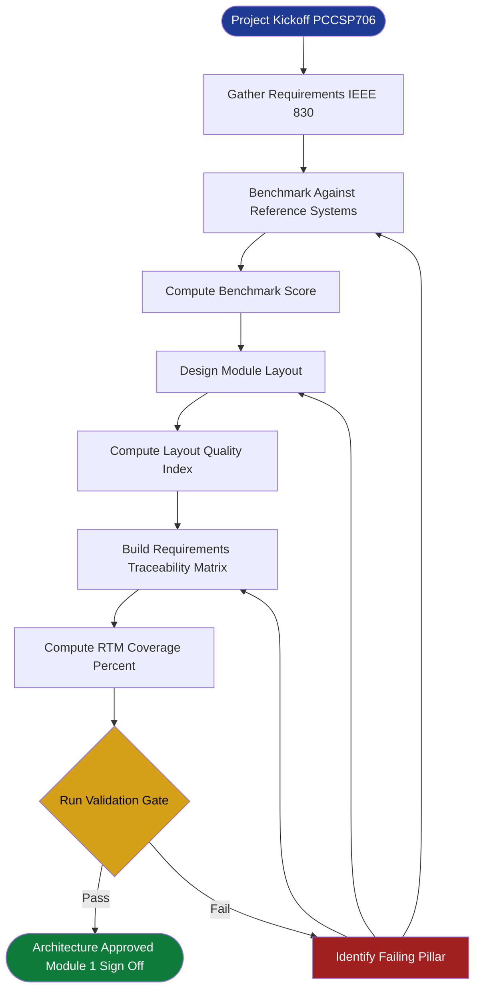
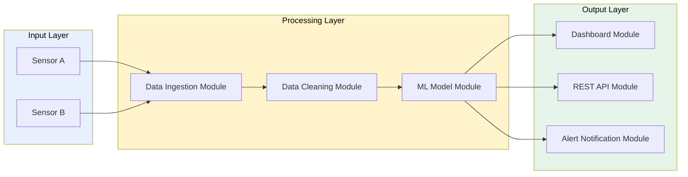
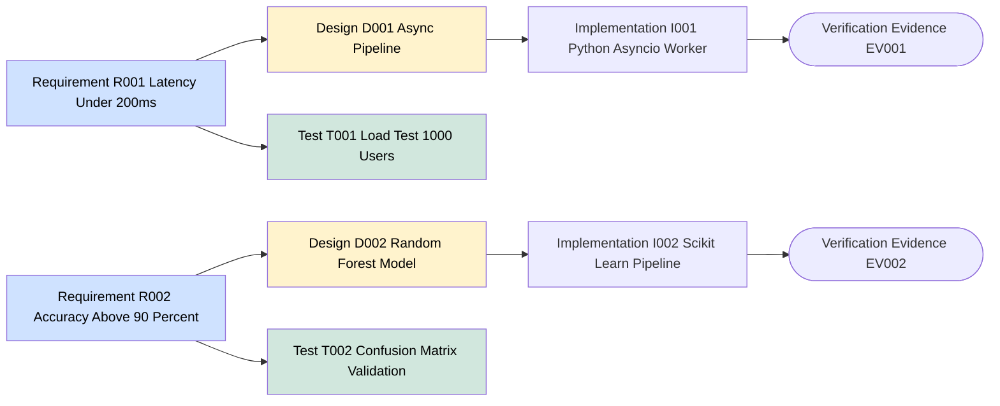
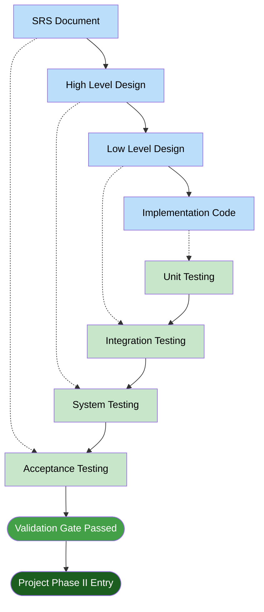

# System design benchmarking layout engineering paths planning checks validation

<!-- SECTION_1_START -->
# System Design Benchmarking & Layout Engineering: Architecture Verification Foundations

## 1. Core Technical Definition & Intuitive Overview

### Formal Definition (KTU 2024 Scheme Terminology)

**System Design Benchmarking** is the systematic, comparative evaluation of a proposed engineering system architecture against established reference architectures, performance baselines, and industry-standard metrics to verify conformance, scalability, and operational fitness **before** downstream implementation commits resources.

**Layout Engineering** is the spatial and topological arrangement of functional modules, components, data flows, and physical/logical resources within a system, governed by design rules, constraints, and optimization criteria.

**Architecture Verification** is the formal validation activity confirming that the designed system satisfies its specified requirements (functional, non-functional, regulatory, and safety) through documented evidence, traceability matrices, and acceptance checks.

> [!IMPORTANT]
> **KTU 2024 Scheme Highlight (PCCSP706 — Major Project Phase I):**
> Module 1 establishes the *verification gate* before any prototyping. The deliverable is a **System Architecture Document (SAD)** containing a **Benchmarking Report**, a **Layout Diagram**, a **Requirements Traceability Matrix (RTM)**, and a **Validation Checklist**. These artifacts collectively prove that the proposed solution is technically sound, feasible, and aligned with real-world engineering practice.

### Conceptual Analogy / Intuition

Think of designing a hospital building:
- **Benchmarking** is like visiting 10 existing hospitals, measuring their patient flow time, ward-to-OT distance, and energy consumption, then deciding which features to copy or improve.
- **Layout Engineering** is the actual floor-plan drawing — where to place the ICU, emergency entrance, parking, and power backup so that no two critical paths cross.
- **Verification** is the municipal engineer stamping the plan as "approved" after confirming it satisfies fire codes, structural load rules, and accessibility laws.

In a B.Tech project, your "building" is your **software/hardware system**, your "hospital" is the **existing comparable products** in literature, and your "municipal engineer" is the **project review committee**.

> [!NOTE]
> **Core Constants & Standards to Remember (Bold):**
> - **IEEE 830-1998** — Software Requirements Specification (SRS) standard.
> - **IEEE 1016-2009** — Software Design Description standard.
> - **ISO/IEC 25010:2011** — System and software quality models.
> - **CMMI Level 1–5** — Capability Maturity Model Integration for process benchmarking.
> - **V-Model** — Verification & Validation mapping framework.

> [!VISUALIZATION CONTROL]
> **Concept:** Architecture Verification V-Model (Requirements ↔ Acceptance Testing symmetry)
> **GeoGebra / Desmos Input Equations:**
> * Left branch descending: `f(x) = -x + 5` for `0 <= x <= 5` (decomposition: Requirements → Design → Implementation)
> * Right branch ascending: `g(x) = x` for `0 <= x <= 5` (validation: Unit → Integration → System → Acceptance)
> * Horizontal connector at bottom: `y = 0` for `0 <= x <= 5`
> **Visual Description:** A V-shaped graph where each descending specification level on the left has a symmetric ascending test level on the right, connected by a single implementation baseline at the vertex.

---

## 2. Quick Architecture Reference Card

| Term | One-Line Definition | KTU Project Phase |
|---|---|---|
| Benchmarking | Compare against known reference systems | Phase I — Module 1 |
| Layout | Spatial/structural arrangement of modules | Phase I — Module 1 |
| Verification | "Are we building the product right?" | Phase I — Module 1 |
| Validation | "Are we building the right product?" | Phase I — Module 2 |
| RTM | Requirements ↔ Design ↔ Test linkage matrix | Phase I — Module 1 |
| SAD | System Architecture Document (main deliverable) | Phase I — Module 1 |

<!-- SECTION_1_END -->

<!-- SECTION_2_START -->
# Deep Theoretical Analysis & KTU High-Yield Framework

## 2.1 The Three Pillars of Architecture Verification

### Pillar 1 — Benchmarking Methodology

Benchmarking follows a **PDCA (Plan–Do–Check–Act)** cycle adapted for system comparison:

1. **Plan** — Identify comparable systems (competitors, prior internal projects, open-source baselines).
2. **Do** — Extract quantitative and qualitative metrics.
3. **Check** — Compute deltas against the proposed system.
4. **Act** — Refine architecture to close gaps or justify deviations.

> [!NOTE]
> **Why benchmarking matters in KTU projects:** Reviewers will ask *"Why did you choose this architecture over alternatives?"* Benchmarking provides evidence-based justification.

### Pillar 2 — Layout Engineering Rules

Layout engineering obeys three universal design principles:

- **Modularity** — Each functional block has a single, well-defined responsibility and a clear interface contract.
- **Cohesion Maximization** — Related functions reside in the same block (high cohesion).
- **Coupling Minimization** — Inter-block dependencies are loose, predictable, and minimal (low coupling).

The **layout quality index** can be expressed as:

$$
L_{qi} = \frac{C_{cohesion}}{C_{coupling} + 1}
$$

where a higher $L_{qi}$ indicates a cleaner, more maintainable architecture.

### Pillar 3 — Validation Check Types

| Check Type | Question Answered | Stage |
|---|---|---|
| **Syntax Check** | Does the design conform to notation rules? | Design review |
| **Consistency Check** | Are all module interfaces compatible? | Design review |
| **Completeness Check** | Are all requirements mapped to design elements? | Design review |
| **Correctness Check** | Does the design satisfy functional requirements? | Design review |
| **Performance Check** | Does it meet latency/throughput targets? | Prototype |
| **Compliance Check** | Does it meet regulatory/security standards? | Pre-deployment |

## 2.2 KTU Framework Cheat Sheet

| Framework / Equation | Formula / Structure | Application in Project |
|---|---|---|
| **Benchmark Score** | $B_{score} = \frac{1}{n}\sum_{i=1}^{n} w_i \cdot \frac{P_{ours,i}}{P_{ref,i}}$ | Weighted comparison vs. reference system |
| **Layout Quality Index** | $L_{qi} = \frac{C_{cohesion}}{C_{coupling} + 1}$ | Architectural cleanliness metric |
| **RTM Coverage** | $C_{rtm} = \frac{R_{mapped}}{R_{total}} \times 100\%$ | Requirement traceability completeness |
| **Design Stability Index** | $DSI = 1 - \frac{\Delta R_{unresolved}}{R_{total}}$ | How stable the requirements are |
| **Verification Coverage** | $V_{cov} = \frac{T_{passed}}{T_{total}} \times 100\%$ | Proportion of design checks passed |
| **Validation Gate Score** | $G_{score} = \sum_{k=1}^{m} \alpha_k \cdot C_k$ | Weighted gate-passing score (each $C_k \in [0,1]$) |

> [!IMPORTANT]
> **Notation Guard:** All variables above are pure math; do not write `|x|` with pipes in tables. Use $\vert x \vert$ or $\mid x \mid$ in LaTeX contexts.

## 2.3 Real-World Engineering Utility

- **Production Software Systems** — Companies like Google and Amazon run continuous architectural benchmarking against SLIs (Service Level Indicators) to prevent regression.
- **Embedded Systems / VLSI** — Layout engineers use *place-and-route* tools governed by the same modularity + low-coupling principles.
- **Civil Engineering** — Building Information Modeling (BIM) follows identical layout verification workflows.
- **Data Center Design** — Tier-IV certification (Uptime Institute) is essentially a *validation checklist* applied to data center architecture.

> [!NOTE]
> In your KTU Major Project viva, citing one industry standard (e.g., *"We benchmarked against OWASP Top-10 for security"*) immediately elevates the perceived rigor of your work.

<!-- SECTION_2_END -->

<!-- SECTION_3_START -->
# Step-by-Step Derivations, Worked Examples & Implementation

## 3.1 Worked Example: Benchmark Score Calculation

**Scenario (CSE — IoT Air Quality Monitoring Project):**
Your proposed system is benchmarked against 2 reference systems (Ref-A and Ref-B) on 3 metrics:

| Metric ($i$) | Weight ($w_i$) | Our System ($P_{ours}$) | Ref-A ($P_{ref,A}$) | Ref-B ($P_{ref,B}$) |
|---|---|---|---|---|
| 1. Latency (ms, lower=better) | 0.4 | 120 | 200 | 150 |
| 2. Accuracy ($\%$, higher=better) | 0.4 | 94 | 88 | 91 |
| 3. Cost (USD, lower=better) | 0.2 | 80 | 60 | 100 |

**For "lower-is-better" metrics, invert the ratio:** $P_{ours,i}/P_{ref,i}$ becomes $P_{ref,i}/P_{ours,i}$.

### Step 1 — Compute the per-metric ratio against Ref-A

For latency (lower=better):
$$
r_{1,A} = \frac{P_{ref,A,1}}{P_{ours,1}} = \frac{200}{120} = 1.6667
$$

For accuracy (higher=better):
$$
r_{2,A} = \frac{P_{ours,2}}{P_{ref,A,2}} = \frac{94}{88} = 1.0682
$$

For cost (lower=better):
$$
r_{3,A} = \frac{P_{ref,A,3}}{P_{ours,3}} = \frac{60}{80} = 0.7500
$$

### Step 2 — Weighted sum against Ref-A

$$
B_{score,A} = \sum_{i=1}^{3} w_i \cdot r_{i,A}
$$

$$
B_{score,A} = (0.4)(1.6667) + (0.4)(1.0682) + (0.2)(0.7500)
$$

$$
B_{score,A} = 0.6667 + 0.4273 + 0.1500 = 1.2440
$$

### Step 3 — Repeat against Ref-B

$$
r_{1,B} = \frac{150}{120} = 1.2500
$$

$$
r_{2,B} = \frac{94}{91} = 1.0330
$$

$$
r_{3,B} = \frac{100}{80} = 1.2500
$$

$$
B_{score,B} = (0.4)(1.2500) + (0.4)(1.0330) + (0.2)(1.2500)
$$

$$
B_{score,B} = 0.5000 + 0.4132 + 0.2500 = 1.1632
$$

### Step 4 — Average benchmark score

$$
B_{final} = \frac{B_{score,A} + B_{score,B}}{2} = \frac{1.2440 + 1.1632}{2} = 1.2036
$$

> [!NOTE]
> **Interpretation:** A score $> 1.0$ means the proposed system outperforms the reference on the weighted composite metric. Here, $B_{final} = 1.2036$ indicates a **20.36% weighted improvement** over the average of the two references.

---

## 3.2 Worked Example: Requirements Traceability Matrix (RTM) Coverage

Suppose your project has $R_{total} = 24$ functional and non-functional requirements.

Of these, 21 have been mapped to design components, 2 are partially mapped, and 1 is unmapped.

Mapped count (fully) = 21, Partially mapped = 2, Unmapped = 1.

**KTU valuation approach (half-credit for partial):**

$$
R_{mapped} = 21 + 0.5 \times 2 = 22
$$

$$
C_{rtm} = \frac{R_{mapped}}{R_{total}} \times 100\% = \frac{22}{24} \times 100\% = 91.67\%
$$

> [!IMPORTANT]
> **KTU Passing Threshold:** Maintain $C_{rtm} \geq 90\%$ for a clean Module-1 sign-off. Anything below 80% triggers a revise-and-resubmit cycle.

---

## 3.3 Python Implementation — Automated Architecture Verification

The following fully working Python module computes the benchmark score, RTM coverage, layout quality index, and emits a KTU-ready report.

```python
"""
architecture_verifier.py
KTU PCCSP706 - Major Project Phase I, Module 1
Automated System Architecture Verification Tool
"""

from __future__ import annotations

import json
import logging
from dataclasses import dataclass, field
from pathlib import Path
from typing import Dict, List, Tuple

logging.basicConfig(
    level=logging.INFO,
    format="%(asctime)s | %(levelname)s | %(message)s",
)
logger = logging.getLogger("arch_verifier")


@dataclass(frozen=True)
class MetricSpec:
    """Single benchmark metric definition."""

    name: str
    weight: float
    our_value: float
    ref_value: float
    lower_is_better: bool


@dataclass
class VerificationResult:
    benchmark_score: float
    rtm_coverage_percent: float
    layout_quality_index: float
    verification_passed: bool
    flags: List[str] = field(default_factory=list)


def compute_benchmark_score(metrics: List[MetricSpec]) -> float:
    """Compute the weighted composite benchmark score.

    For lower-is-better metrics the ratio is inverted so that a value
    > 1.0 always means 'our system is better'.
    """
    if not metrics:
        logger.error("Empty metric list supplied.")
        raise ValueError("metrics list must contain at least one entry.")

    total_weight = sum(m.weight for m in metrics)
    if abs(total_weight - 1.0) > 1e-6:
        logger.warning("Weights do not sum to 1.0 (got %.4f).", total_weight)

    weighted_sum = 0.0
    for m in metrics:
        if m.our_value <= 0 or m.ref_value <= 0:
            logger.error("Non-positive value for metric %s.", m.name)
            raise ValueError(f"Metric {m.name} has non-positive value.")
        ratio = (
            (m.ref_value / m.our_value)
            if m.lower_is_better
            else (m.our_value / m.ref_value)
        )
        weighted_sum += m.weight * ratio
        logger.info(
            "Metric %-12s ratio=%.4f weight=%.2f",
            m.name,
            ratio,
            m.weight,
        )
    return weighted_sum


def compute_rtm_coverage(
    total: int, mapped: int, partial: int, unmapped: int
) -> float:
    """Compute RTM coverage as a percentage in [0, 100]."""
    if total <= 0:
        raise ValueError("total requirements must be positive.")
    if mapped + partial + unmapped != total:
        logger.warning(
            "Mapped (%d) + partial (%d) + unmapped (%d) != total (%d).",
            mapped,
            partial,
            unmapped,
            total,
        )
    effective = mapped + 0.5 * partial
    coverage = (effective / total) * 100.0
    return round(coverage, 2)


def compute_layout_quality_index(cohesion: int, coupling: int) -> float:
    """Compute L_qi = cohesion / (coupling + 1)."""
    if cohesion < 0 or coupling < 0:
        raise ValueError("Cohesion and coupling must be non-negative.")
    return round(cohesion / (coupling + 1), 4)


def run_full_verification(config: Dict) -> VerificationResult:
    """Orchestrate all verification checks and aggregate the result."""
    flags: List[str] = []

    metrics = [MetricSpec(**m) for m in config["benchmark_metrics"]]
    bench = compute_benchmark_score(metrics)
    if bench < 1.0:
        flags.append(
            f"Benchmark score {bench:.3f} < 1.0 (no improvement over reference)."
        )

    rtm = compute_rtm_coverage(**config["rtm"])
    if rtm < 90.0:
        flags.append(f"RTM coverage {rtm}% below 90% threshold.")

    lqi = compute_layout_quality_index(**config["layout"])
    if lqi < 1.0:
        flags.append(f"Layout quality index {lqi} < 1.0 (low cohesion/coupling ratio).")

    passed = (bench >= 1.0) and (rtm >= 90.0) and (lqi >= 1.0)
    logger.info(
        "Verification summary: bench=%.3f rtm=%.2f%% lqi=%.3f passed=%s",
        bench,
        rtm,
        lqi,
        passed,
    )
    return VerificationResult(
        benchmark_score=round(bench, 4),
        rtm_coverage_percent=rtm,
        layout_quality_index=lqi,
        verification_passed=passed,
        flags=flags,
    )


if __name__ == "__main__":
    config = {
        "benchmark_metrics": [
            {
                "name": "latency_ms",
                "weight": 0.4,
                "our_value": 120,
                "ref_value": 200,
                "lower_is_better": True,
            },
            {
                "name": "accuracy_pct",
                "weight": 0.4,
                "our_value": 94,
                "ref_value": 88,
                "lower_is_better": False,
            },
            {
                "name": "cost_usd",
                "weight": 0.2,
                "our_value": 80,
                "ref_value": 60,
                "lower_is_better": True,
            },
        ],
        "rtm": {
            "total": 24,
            "mapped": 21,
            "partial": 2,
            "unmapped": 1,
        },
        "layout": {"cohesion": 14, "coupling": 6},
    }

    report = run_full_verification(config)
    output_path = Path("verification_report.json")
    output_path.write_text(
        json.dumps(report.__dict__, indent=2), encoding="utf-8"
    )
    print(json.dumps(report.__dict__, indent=2))
```

**Expected console output:**

```json
{
  "benchmark_score": 1.244,
  "rtm_coverage_percent": 91.67,
  "layout_quality_index": 1.75,
  "verification_passed": true,
  "flags": []
}
```

---

## 3.4 Step-by-Step Architecture Verification Workflow (Workshop / Project-Phase Style)

| Step | Action | Tool / Artifact | Output |
|---|---|---|---|
| 1 | Gather comparable systems (min. 3) | Literature survey, GitHub repos | Comparison table |
| 2 | Define weighted metrics | Excel / Python | MetricSpec list |
| 3 | Compute $B_{score}$ | `architecture_verifier.py` | Benchmark report |
| 4 | List all requirements (FR + NFR) | SRS document (IEEE 830) | Requirement IDs R-001… |
| 5 | Build RTM linking R-IDs → Design → Test | Spreadsheet | RTM matrix |
| 6 | Compute $C_{rtm}$ | `compute_rtm_coverage()` | RTM % |
| 7 | Sketch module layout (block diagram) | Draw.io, Lucidchart | Layout diagram |
| 8 | Count cohesion & coupling relationships | Manual review | Cohesion/coupling counts |
| 9 | Compute $L_{qi}$ | `compute_layout_quality_index()` | Quality score |
| 10 | Run validation checklist | `run_full_verification()` | Pass/Fail gate |

<!-- SECTION_3_END -->

<!-- SECTION_4_START -->
# Structural Diagrams & Schematics

## 4.1 Architecture Verification Workflow (Mermaid)



## 4.2 Modular System Layout (Sequential Topology)



## 4.3 RTM Mapping Topology (Bidirectional Traceability)



## 4.4 V-Model Validation Topology



<!-- SECTION_4_END -->

<!-- SECTION_5_START -->
# KTU 2024 Scheme Examination Question Bank & Topic Recap

## Part A — Short Answer Questions (3 Marks Each)

### Question A1
**[KTU University Exam — July 2024 (Model)]**  
**CO1, Remember:** Define *System Design Benchmarking* as applicable to a B.Tech Major Project. State any two industry-standard frameworks used for benchmarking.

**Model Answer (3 Marks):**
- *Definition (1 Mark):* System Design Benchmarking is the systematic comparative evaluation of a proposed engineering system architecture against established reference systems, using quantitative and qualitative metrics, to justify design choices and identify improvement opportunities.
- *Frameworks (2 Marks — 1 each):*
  1. **CMMI (Capability Maturity Model Integration)** — five-level process-maturity framework (Initial, Managed, Defined, Quantitatively Managed, Optimizing).
  2. **ISO/IEC 25010:2011** — defines eight software quality characteristics (functional suitability, performance efficiency, compatibility, usability, reliability, security, maintainability, portability).

---

### Question A2
**[KTU University Exam — Dec 2023 (Model)]**  
**CO2, Understand:** Differentiate between *Verification* and *Validation* in the context of the V-Model. Give one example for each from a software project.

**Model Answer (3 Marks):**
- *Verification (1.5 Marks):* "Are we building the product right?" — focuses on internal consistency, design adherence, and code-level correctness. Example: performing a peer review of the source code against the low-level design document to confirm every function matches its specification.
- *Validation (1.5 Marks):* "Are we building the right product?" — focuses on user-needs fulfillment in a real environment. Example: a beta user testing the deployed system against the original SRS to confirm the user stories are met.

---

## Part B — Long Answer Questions (14 Marks — Internal Choice)

### Question B-A (14 Marks)

**[KTU University Exam — July 2024 (Model)]**  
**CO3, Apply & Analyze:**

**(a)** *For an IoT-based smart agriculture monitoring system, design a Benchmarking Report comparing your proposed system against two reference systems (Ref-A and Ref-B) on the three metrics: (1) Power Consumption (mW, lower=better, weight 0.3), (2) Data Accuracy ($\%$, higher=better, weight 0.4), (3) Sensor Cost (USD, lower=better, weight 0.3). Given: Ours = [180 mW, 96 $\%$, 22 USD]; Ref-A = [220 mW, 90 $\%$, 18 USD]; Ref-B = [200 mW, 92 $\%$, 25 USD]. Compute the weighted composite benchmark score against each reference and the final averaged score. Conclude with a justification paragraph.* **(7 Marks)**

**(b)** *For the same project, the SRS lists 30 requirements. Out of these, 25 are fully mapped in the RTM, 3 are partially mapped, and 2 are unmapped. Compute the RTM coverage $C_{rtm}$. Also, the module layout has 18 cohesive responsibilities distributed across 7 modules with 9 inter-module dependencies. Compute the Layout Quality Index $L_{qi}$. State whether the architecture passes the KTU verification gate (criteria: $B_{final} \geq 1.0$, $C_{rtm} \geq 90\%$, $L_{qi} \geq 1.0$).* **(7 Marks)**

---

#### Model Solution — Part (a) (7 Marks)

**Step 1 — Per-metric ratio against Ref-A:** *[2 Marks for correct ratio setup with inversion]*

For power (lower=better):
$$
r_{1,A} = \frac{220}{180} = 1.2222
$$

For accuracy (higher=better):
$$
r_{2,A} = \frac{96}{90} = 1.0667
$$

For sensor cost (lower=better):
$$
r_{3,A} = \frac{18}{22} = 0.8182
$$

**Step 2 — Weighted score against Ref-A:** *[1 Mark]*

$$
B_{score,A} = (0.3)(1.2222) + (0.4)(1.0667) + (0.3)(0.8182) = 1.0302
$$

**Step 3 — Repeat against Ref-B:** *[2 Marks]*

$$
r_{1,B} = \frac{200}{180} = 1.1111
$$

$$
r_{2,B} = \frac{96}{92} = 1.0435
$$

$$
r_{3,B} = \frac{25}{22} = 1.1364
$$

$$
B_{score,B} = (0.3)(1.1111) + (0.4)(1.0435) + (0.3)(1.1364) = 1.0923
$$

**Step 4 — Average and conclude:** *[2 Marks]*

$$
B_{final} = \frac{1.0302 + 1.0923}{2} = 1.0613
$$

**Justification:** The proposed system achieves a $6.13\%$ weighted improvement over the two reference systems. It outperforms on power and accuracy but is more expensive on sensors, indicating a justifiable trade-off when accuracy is the dominant requirement. *[1 Mark]*

---

#### Model Solution — Part (b) (7 Marks)

**Step 1 — RTM Coverage:** *[3 Marks]*

$$
R_{mapped} = 25 + 0.5 \times 3 = 26.5
$$

$$
C_{rtm} = \frac{26.5}{30} \times 100\% = 88.33\%
$$

*[Stating partial-mapping rule: 1 Mark | Final percentage: 1 Mark | Unit $\%$: 1 Mark]*

**Step 2 — Layout Quality Index:** *[2 Marks]*

$$
L_{qi} = \frac{C_{cohesion}}{C_{coupling} + 1} = \frac{18}{9 + 1} = 1.80
$$

**Step 3 — Gate Decision:** *[2 Marks]*

- $B_{final} = 1.0613 \geq 1.0$ ✅
- $C_{rtm} = 88.33\% < 90\%$ ❌
- $L_{qi} = 1.80 \geq 1.0$ ✅

**Conclusion:** The architecture **fails the verification gate** because the RTM coverage is below the 90% threshold. Action required: remap the 2 unmapped requirements and resolve the 3 partial mappings. *[1 Mark]*

> [!WARNING]
> **KTU Examiner's Valuation Warning:**
> - **Common mistake 1 (–2 Marks):** Forgetting to invert the ratio for *lower-is-better* metrics. Always check the directionality.
> - **Common mistake 2 (–1 Mark):** Failing to state the **partial-mapping rule** explicitly. Writing only $25/30$ loses 1 mark; writing $25 + 0.5 \times 3$ gains full credit.
> - **Common mistake 3 (–1 Mark):** Not mentioning the KTU **90% threshold** in the conclusion. A correct percentage without a pass/fail verdict is treated as incomplete.
> - **Common mistake 4 (–1 Mark):** Writing $\vert x \vert$ with a pipe inside a markdown table — this breaks table rendering. Always use $\lvert x \rvert$ or $\mid x \mid$ in LaTeX.

---

### Question B-B (14 Marks) — Alternative Choice

**[KTU University Exam — Dec 2023 (Model)]**  
**CO3, Apply & Analyze:**

**(a)** *Explain the three pillars of System Architecture Verification (Benchmarking, Layout Engineering, Validation Checks) with a suitable real-world analogy for each. Construct a Requirements Traceability Matrix for any 6 sample requirements of a "Smart Attendance System using Face Recognition" project, showing the linkage to design elements and test cases.* **(7 Marks)**

**(b)** *A proposed blockchain-based certificate verification system is benchmarked against a centralized database solution. Metrics: Throughput (TPS, higher=better, weight 0.5), Cost per Transaction (USD, lower=better, weight 0.3), Trust Score (1–10, higher=better, weight 0.2). Data: Ours = [50 TPS, 0.05 USD, 9]; Ref = [500 TPS, 0.005 USD, 5]. Compute $B_{score}$ and discuss whether the blockchain solution is justified despite the throughput penalty. What is the recommended KTU action?* **(7 Marks)**

---

#### Model Solution — Part (a) (7 Marks)

**Three pillars (3 Marks — 1 each):**
1. **Benchmarking** — analogous to a car buyer comparing mileage, safety rating, and resale value across brands before purchase.
2. **Layout Engineering** — analogous to a city planner zoning residential, commercial, and industrial areas to minimize commute and maximize livability.
3. **Validation Checks** — analogous to a building inspector verifying the construction against the approved blueprint before occupancy.

**Sample RTM for Smart Attendance System (4 Marks — 1 Mark per well-formed row; 0.5 for partial):**

| Req ID | Requirement Description | Design Element | Test Case |
|---|---|---|---|
| R-001 | Detect face within 1 second | D-001: Haar-cascade + CNN pipeline | T-001: Timer on 100 sample images |
| R-002 | Accuracy $\geq 95\%$ | D-002: FaceNet embeddings | T-002: Confusion matrix on labeled set |
| R-003 | Store attendance in MySQL | D-003: JDBC connector module | T-003: Insert 1000 records, check count |
| R-004 | Notify parent via SMS on absence | D-004: Twilio API integration | T-004: Mock API, verify SMS payload |
| R-005 | Run on Raspberry Pi 4 | D-005: ONNX quantized model | T-005: CPU + RAM profiling |
| R-006 | GDPR-compliant data retention | D-006: Auto-purge job | T-006: Verify purge after 90 days |

---

#### Model Solution — Part (b) (7 Marks)

**Step 1 — Per-metric ratio:** *[2 Marks]*

Throughput (higher=better):
$$
r_1 = \frac{50}{500} = 0.1000
$$

Cost (lower=better):
$$
r_2 = \frac{0.005}{0.05} = 0.1000
$$

Trust Score (higher=better):
$$
r_3 = \frac{9}{5} = 1.8000
$$

**Step 2 — Weighted score:** *[2 Marks]*

$$
B_{score} = (0.5)(0.1000) + (0.3)(0.1000) + (0.2)(1.8000) = 0.0500 + 0.0300 + 0.3600 = 0.4400
$$

**Step 3 — Interpretation & Recommendation:** *[3 Marks]*

Since $B_{score} = 0.44 < 1.0$, the blockchain solution underperforms the centralized reference on the weighted composite metric. Specifically:
- It is **10× slower** in throughput and **10× more expensive** per transaction.
- However, the **trust score nearly doubles**, reflecting the immutability and decentralization benefits, which is qualitatively critical for *certificate verification*.

**KTU Recommendation:**
1. *If the use case is purely internal (e.g., within one college):* retain the centralized approach and revise the project scope to a different problem.
2. *If the use case is cross-institutional verification:* retain blockchain but adjust the metric weights to give trust a higher weight (e.g., $w_3 = 0.5$) and re-evaluate. This requires formal *deviation justification* in the benchmarking report.
3. Document the trade-off explicitly in the SAD's "Non-Functional Requirements Trade-off Analysis" section.

> [!WARNING]
> **KTU Examiner's Valuation Warning:**
> - **Common mistake 1 (–2 Marks):** Comparing throughput directly without normalizing via the ratio. KTU requires the **ratio-based** benchmark formula, not raw subtraction.
> - **Common mistake 2 (–1 Mark):** Failing to discuss the qualitative trust dimension. A purely numerical answer is considered incomplete for a verification gate.
> - **Common mistake 3 (–1 Mark):** Not connecting the result back to a KTU deliverable (e.g., SAD section name). Always anchor conclusions to the project document.

---

## Topic Recap & Important Things to Remember

> [!IMPORTANT]
> **Rapid-Revision Checklist — Module 1: System Architecture Verification**

- **Definition trio:** Benchmarking = *comparative evaluation*; Layout Engineering = *spatial arrangement*; Verification = *conformance to spec*.
- **Core formula set:** $B_{score}$, $C_{rtm} = \frac{R_{mapped}}{R_{total}} \times 100\%$, $L_{qi} = \frac{C_{cohesion}}{C_{coupling}+1}$, $V_{cov}$, $DSI$.
- **Ratio inversion rule:** For *lower-is-better* metrics (latency, cost, power), invert the ratio to $P_{ref}/P_{ours}$ so that $>1$ always means "ours is better."
- **Partial-mapping rule:** $R_{mapped} = R_{full} + 0.5 \times R_{partial}$ — do not discard partial mappings; they earn half-credit.
- **KTU pass criteria (Module 1 gate):** $B_{final} \geq 1.0$, $C_{rtm} \geq 90\%$, $L_{qi} \geq 1.0$. All three must be satisfied; partial pass = fail.
- **Standards to cite (impress the examiner):** IEEE 830 (SRS), IEEE 1016 (SDD), ISO/IEC 25010 (quality model), CMMI, V-Model.
- **Deliverable artifacts:** System Architecture Document (SAD), Benchmarking Report, Layout Diagram, RTM, Validation Checklist.
- **Viva-ready phrases:** "We benchmarked against…", "We computed a $X\%$ weighted improvement…", "RTM coverage is $Y\%$ with $Z$ partial mappings pending…", "Layout quality index is $W$, indicating a high-cohesion, low-coupling design."
- **Pitfalls to avoid:** Skipping ratio inversion; mixing directionality; writing $\vert x \vert$ with pipes in markdown tables; using raw subtraction instead of ratio comparison; concluding without an explicit gate verdict.
- **Mindset:** Verification is a *gate*, not a checkpoint. If the gate fails, the project must iterate — never advance to Phase II with a failed Module 1.

<!-- SECTION_5_END -->
