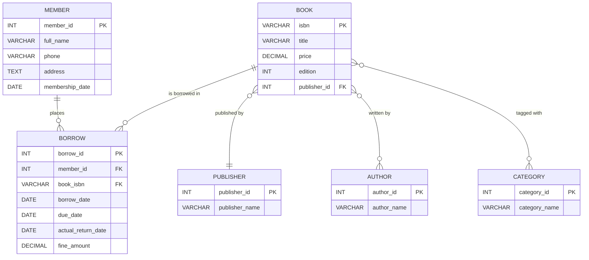
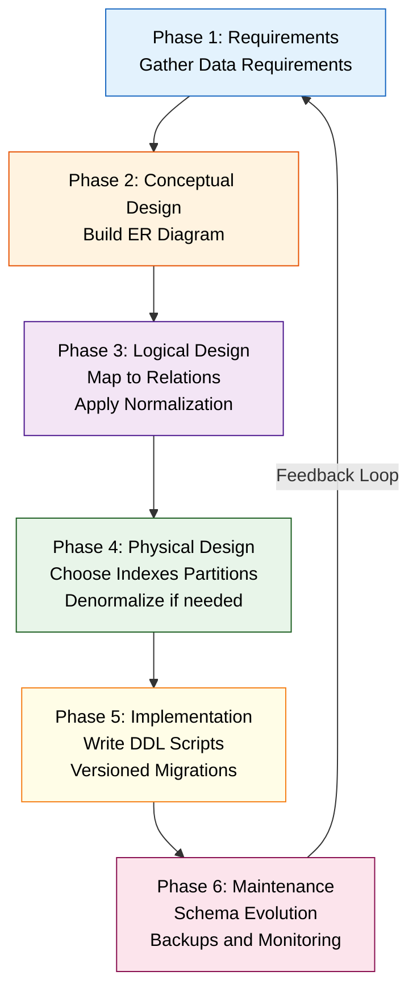
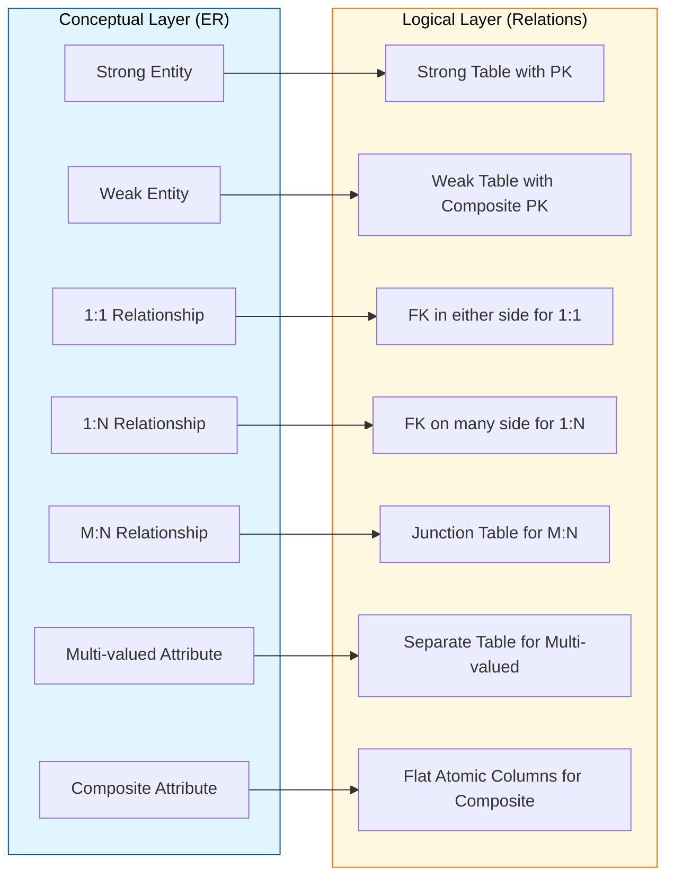
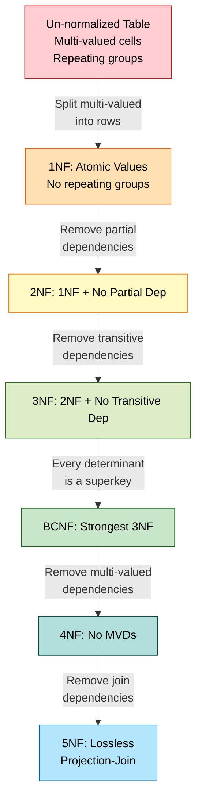
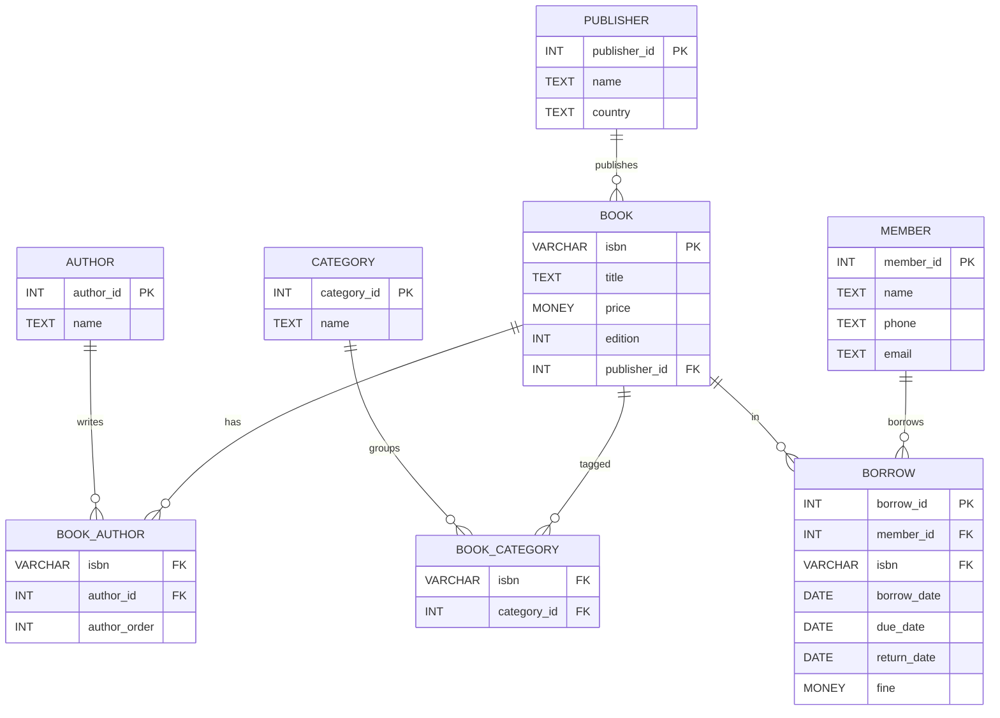
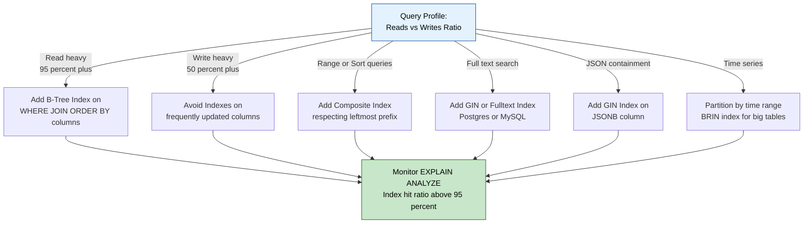

# Database Schema Design

<!-- SECTION_1_START -->

# Database Schema Design

## 1.1 Formal Academic Definition (KTU 2024 Aligned)

> [!IMPORTANT]
> **Database Schema Design** is the systematic engineering process of defining the structure, organization, integrity constraints, and inter-relationships among data elements stored in a relational database management system (RDBMS). It produces a **formal blueprint** — known as a *schema* — that specifies tables (relations), columns (attributes), primary keys, foreign keys, data types, indexes, and business rules (constraints), thereby translating abstract business requirements into a concrete, queryable, and maintainable data model.

According to the **KTU 2024 Scheme (PCCSP706 – Major Project Phase I / Full Industrial Internship)**, Module 2 — *High-Level System Design* treats the database schema as the **persistence backbone** of the software architecture. The schema is the *only* component that survives across releases; therefore its design determines long-term scalability, query performance, data integrity, and onboarding velocity for new developers.

### The Three-Schema Architecture (ANSI/SPARC)

The schema is described at three abstraction layers, each consumed by a different stakeholder:

| Layer | Also Called | Audience | What It Describes |
|---|---|---|---|
| **Conceptual Schema** | Logical-Enterprise Model | Business Analysts, Domain Experts | High-level entities, attributes, relationships — technology agnostic |
| **Logical Schema** | Data Model | Database Designers | Tables, columns, keys, constraints — data-type aware but DBMS-neutral |
| **Physical Schema** | Storage Model | DBAs, DevOps Engineers | Tablespaces, indexes, partitioning, file groups — DBMS specific (e.g., PostgreSQL, MySQL, Oracle) |

---

## 1.2 Intuitive Analogy — The Building Blueprint

> [!NOTE]
> **Think of a database schema as the architectural blueprint of a hospital building.**
>
> - **Conceptual Schema** ≈ The *architect's vision rendering* — wards, operating theatres, reception, pharmacy. No mention of concrete or steel.
> - **Logical Schema** ≈ The *engineer's floor plan* — room dimensions, door widths, load-bearing columns, plumbing layout. Specific, but not yet tied to a contractor.
> - **Physical Schema** ≈ The *on-site construction drawings* — which brand of tiles, where the HVAC ducts run, which server room rack holds the generator backup. Concrete and irreversible.
>
> If the blueprint is wrong, the building cracks. If the schema is wrong, the application collapses under real data volume — a phenomenon engineers call **technical debt at the data layer**.

A **frequently confused pair** for first-time designers:

> [!WARNING]
> **Schema vs. Database Instance** — A *Schema* is the *design* (empty rooms, defined walls). A *Database Instance* is the *current state* (rooms filled with patients, equipment, charts). The schema rarely changes; the instance changes every second.

---

## 1.3 Design Goals Every KTU Project Reviewer Will Test

1. **Integrity** — Data must satisfy declared rules at all times (no orphan rows, no negative balances in a wallet).
2. **Minimality** — No redundant storage of the same fact in multiple places.
3. **Performance** — Common queries complete within an acceptable response time budget (often $\le 200$ ms for OLTP).
4. **Extensibility** — New features can be added without restructuring existing tables.
5. **Security** — Sensitive columns (PII, passwords, tokens) are protected via role-based access control (RBAC).

---

## 1.4 Visualization — Schema Abstraction Pyramid

> [!VISUALIZATION CONTROL]
> **Concept:** Three-Schema Architecture Pyramid (Conceptual → Logical → Physical)
> **GeoGebra / Desmos Input Equations:**
> * `x_min = 0, x_max = 6`
> * `y_min = 0, y_max = 6`
> * Trapezoid vertices (clockwise from bottom-left): `(0,0)`, `(6,0)`, `(5,2)`, `(1,2)` — *Physical layer base*
> * Middle trapezoid: `(1,2)`, `(5,2)`, `(4,4)`, `(2,4)` — *Logical layer*
> * Top trapezoid: `(2,4)`, `(4,4)`, `(3.5,6)`, `(2.5,6)` — *Conceptual apex*
> **Visual Description:** A three-tiered pyramid widening downward. The narrow apex is the *Conceptual Schema* (abstract, business-focused). The middle band is the *Logical Schema* (table-based, DBMS-neutral). The wide base is the *Physical Schema* (concrete storage, DBMS-specific). A vertical downward arrow on the right margin indicates the design refinement direction.

---

## 1.5 KTU 2024 Module Mapping

> [!IMPORTANT]
> In **PCCSP706 — Module 2: High-Level System Design**, the database schema is one of the four mandatory artifacts alongside the **System Architecture Diagram**, **API Contract**, and **Sequence Diagrams**. Faculty evaluators in the internal review panel expect a **fully normalized (3NF minimum) relational schema with a corresponding ER diagram** as part of the Phase-I report. Failure to document foreign-key relationships, cardinalities, and integrity constraints is the most common reason for a project being asked to revise and resubmit.

<!-- SECTION_1_END -->

<!-- SECTION_2_START -->

# Deep Theoretical Analysis & KTU High-Yield Formula Sheet

## 2.1 The Database Design Lifecycle (Six Phases)

A KTU-grade project must traverse the following six phases. Skipping any phase is considered a design defect.

### Phase 1 — Requirements Gathering
Interview stakeholders. Document **data entities**, **attributes**, **business rules**, **transactional volumes** (reads/sec, writes/sec), and **retention policies**. Output: a *Data Requirements Specification* (DRS) document.

### Phase 2 — Conceptual Design (ER Model)
Model entities, attributes, and relationships using the **Entity-Relationship (ER)** notation introduced by *Peter Chen (1976)*. This phase is **technology-agnostic** — no mention of MySQL, PostgreSQL, or any DBMS.

**ER Model Vocabulary (KTU Board Standard):**

| Symbol | Meaning | Example |
|---|---|---|
| **Rectangle** | Entity (real-world object) | `STUDENT`, `BOOK` |
| **Oval** | Attribute (property) | `student_name`, `book_price` |
| **Diamond** | Relationship (association) | `BORROWS` |
| **Double Rectangle** | Weak Entity (cannot exist without owner) | `DEPENDENT` of an `EMPLOYEE` |
| **Double Oval** | Multi-valued attribute | `phone_numbers` of a `STUDENT` |
| **Dashed Oval** | Derived attribute | `age` derived from `dob` |
| **Underlined Oval** | Key attribute (Primary Key) | `student_id` |
| **Lines with `1`, `N`, `M`** | Cardinality of participation | `STUDENT (N) — (1) DEPARTMENT` |

### Phase 3 — Logical Design (Relational Model)
Translate every ER construct into **relations (tables)** using well-defined mapping rules. Apply **normalization theory** (Codd, 1970) to eliminate anomalies.

### Phase 4 — Physical Design
Decide on **storage engines** (InnoDB vs MyISAM), **index types** (B-Tree, Hash, GIN, GiST), **partitioning strategy** (range, list, hash), **denormalization trade-offs** for read-heavy workloads.

### Phase 5 — Implementation (DDL)
Write the **Data Definition Language** scripts: `CREATE DATABASE`, `CREATE TABLE`, `ALTER TABLE`, `CREATE INDEX`, `CREATE VIEW`, `CREATE TRIGGER`.

### Phase 6 — Maintenance & Evolution
Schema versioning tools (**Flyway**, **Liquibase**, **Alembic**, **Prisma Migrate**) are mandatory in industry. Every change is a *migration* with an up-script and a down-script.

---

## 2.2 Cardinality & Participation — The Heart of Relationships

Cardinality defines **how many instances** of one entity participate in a relationship with one instance of another. Participation defines **whether every instance must participate** (total) or **may or may not** (partial).

| Notation | Meaning | Real-World Example |
|---|---|---|
| `1 : 1` | One-to-One | Each `PERSON` has exactly one `PASSPORT` |
| `1 : N` | One-to-Many | One `DEPARTMENT` employs many `EMPLOYEES` |
| `M : N` | Many-to-Many | `STUDENTS` enroll in many `COURSES`; each course has many students |
| `1 : 0..1` | One-to-Optional-One | One `USER` has zero or one `PROFILE_PICTURE` |
| `1 : 0..N` | One-to-Optional-Many | One `AUTHOR` has zero or many `BOOKS` |

> [!NOTE]
> **KTU Trap:** M:N relationships **cannot be implemented directly** in a relational schema. They must be decomposed into two 1:N relationships via an **associative (junction) table**. Example: `STUDENT_COURSE(student_id, course_id, enrollment_date, grade)`.

---

## 2.3 Normalization — Eliminating Data Anomalies

Normalization is the **formal, mathematical process** of restructuring a relation to reduce redundancy and eliminate *insertion*, *update*, and *deletion* anomalies. Each Normal Form (NF) is a **strictly stronger** condition than the previous one.

### Anomalies — Why Normalize?

> [!WARNING]
> A *non-normalized* schema suffers from three classic anomalies:
> 1. **Insertion Anomaly** — Cannot record a new `DEPARTMENT` until at least one `STUDENT` joins it.
> 2. **Update Anomaly** — A `HOD` (Head of Department) name is stored in every student row; changing it requires multiple updates and risks inconsistency.
> 3. **Deletion Anomaly** — Deleting the last `STUDENT` of a department accidentally erases the department itself.

### Functional Dependency — The Foundational Concept

A **functional dependency** $X \rightarrow Y$ means: *for every valid instance of the relation, if two rows agree on all attributes in $X$, they must also agree on all attributes in $Y$*. In plain English, "$X$ *functionally determines* $Y$."

Formal definition: for all tuples $t_1, t_2$ in relation $R$,
$$t_1[X] = t_2[X] \implies t_1[Y] = t_2[Y]$$

Armstrong's Axioms (used to derive all FDs from a given set):

| Rule | Symbol | Statement |
|---|---|---|
| **Reflexivity** | If $Y \subseteq X$, then $X \rightarrow Y$ | Trivial — every set determines its own subsets |
| **Augmentation** | If $X \rightarrow Y$, then $XZ \rightarrow YZ$ | Add common attributes to both sides |
| **Transitivity** | If $X \rightarrow Y$ and $Y \rightarrow Z$, then $X \rightarrow Z$ | Chain dependencies |
| **Union** | If $X \rightarrow Y$ and $X \rightarrow Z$, then $X \rightarrow YZ$ | Combine right-hand sides |
| **Decomposition** | If $X \rightarrow YZ$, then $X \rightarrow Y$ and $X \rightarrow Z$ | Split right-hand sides |
| **Pseudo-transitivity** | If $X \rightarrow Y$ and $WY \rightarrow Z$, then $WX \rightarrow Z$ | Add common left attributes |

### The Normal Forms (Strictly Cumulative)

| Normal Form | Symbol | Rule (Informal) | Rule (Formal) | Removes Anomaly |
|---|---|---|---|---|
| **First** | 1NF | Every column holds an **atomic** (indivisible) value; no repeating groups | For every attribute $A$ in $R$, the domain of $A$ contains only atomic values | Repeating groups, multi-valued cells |
| **Second** | 2NF | 1NF + **no partial dependency** of a non-key attribute on a composite primary key | For every FD $X \rightarrow A$ where $A$ is non-prime, $X$ is not a *proper subset* of any candidate key | Partial dependencies |
| **Third** | 3NF | 2NF + **no transitive dependency** of a non-key attribute on the key | For every FD $X \rightarrow A$ where $A$ is non-prime, either $X$ is a superkey **or** $A$ is a prime attribute | Transitive dependencies |
| **Boyce-Codd** | BCNF | Stronger 3NF — **every determinant must be a superkey** | For every non-trivial FD $X \rightarrow A$, $X$ is a superkey | All anomalies removable by FD decomposition |
| **Fourth** | 4NF | BCNF + **no multi-valued dependencies** (MVDs) | For every non-trivial MVD $X \twoheadrightarrow Y$, $X$ is a superkey | Independent multi-valued facts |
| **Fifth / Project-Join** | 5NF / PJNF | 4NF + **no join dependencies** that reconstruct a relation from smaller projections | Every join dependency in $R$ is implied by candidate keys | Join anomalies |

### Denormalization — The Performance Escape Hatch

In OLAP, data warehousing, and high-traffic read systems, designers **deliberately** violate 3NF to reduce JOIN cost. KTU examiners accept this only when **justified by quantified query performance metrics**.

> [!NOTE]
> **Rule of Thumb:** Normalize to 3NF for OLTP; denormalize to 2NF or 1NF for OLAP star schemas. A *star schema* has a central **fact table** surrounded by **dimension tables** — this is the de-facto industry standard for analytical warehouses.

---

## 2.4 Integrity Constraints — The Rule Enforcers

| Constraint | Purpose | SQL Syntax |
|---|---|---|
| **Primary Key (PK)** | Uniquely identifies every row | `PRIMARY KEY` |
| **Foreign Key (FK)** | Enforces referential integrity between tables | `FOREIGN KEY (...) REFERENCES parent(col)` |
| **Unique** | No duplicate values in the column | `UNIQUE` |
| **Not Null** | Disallows missing values | `NOT NULL` |
| **Check** | Enforces domain-specific rule | `CHECK (age >= 18)` |
| **Default** | Provides a value when none is supplied | `DEFAULT 'active'` |
| **Auto Increment / Serial** | Generates surrogate keys | `AUTO_INCREMENT` / `SERIAL` / `IDENTITY` |

**Referential Actions (ON DELETE / ON UPDATE):**

| Action | Behavior on Parent Change |
|---|---|
| `CASCADE` | Delete/Update child rows automatically |
| `SET NULL` | Set child FK to NULL |
| `SET DEFAULT` | Set child FK to its default value |
| `RESTRICT` (default) | Reject the change if children exist |
| `NO ACTION` | Defer the check to transaction end (similar to RESTRICT in most DBMS) |

---

## 2.5 KTU Formula / Decision Sheet (Cheat-Sheet)

| # | Decision Question | Recommended Choice | Justification |
|---|---|---|---|
| 1 | When to use INT vs BIGINT? | BIGINT if row count may exceed $2^{31} - 1 \approx 2.1 \times 10^{9}$ | Storage and future-proofing |
| 2 | When to use VARCHAR vs TEXT? | VARCHAR(n) for $\le 255$ to $65535$ chars, frequently indexed; TEXT for long blobs | Indexing restrictions on TEXT in MySQL |
| 3 | When to add an index? | When a column appears in `WHERE`, `JOIN`, `ORDER BY` clauses for $\ge 5\%$ of rows | Indexes speed reads, slow writes |
| 4 | When to use composite index? | When queries filter on multiple columns in fixed order | Column order matters — leftmost prefix rule |
| 5 | When to partition? | When table size exceeds $10^8$ rows or $50$ GB | Partition pruning accelerates range queries |
| 6 | When to denormalize? | Read : Write ratio $\ge 100 : 1$ and JOIN cost $> 200$ ms in production | Latency SLAs trump theoretical purity |
| 7 | When to use UUID vs auto-increment? | UUID for distributed / multi-tenant systems; auto-increment for single-node OLTP | UUIDs prevent enumeration attacks |
| 8 | When to use soft delete? | When audit trails and recovery are required (e.g., `is_deleted BOOLEAN`) | Avoids FK cascade complications |
| 9 | When to use ENUM vs Lookup Table? | ENUM for $\le 5$ stable values; lookup table otherwise | ENUM changes require schema migration |
| 10 | When to use JSON column? | For truly schemaless / dynamic attributes (e.g., user preferences) | Loses relational query power; use PostgreSQL `JSONB` |

---

## 2.6 Real-World Engineering Utility

> [!NOTE]
> **Production Use Cases (Industry 2024-2026):**
> - **E-commerce (Amazon, Flipkart):** Heavily normalized 3NF core + denormalized search index (Elasticsearch) + columnar warehouse (Redshift, ClickHouse) for analytics.
> - **Banking (FinTech, UPI rails):** Strict 3NF / BCNF with ACID transactions, multi-version concurrency control (MVCC), and audit-log tables for every mutation.
> - **Social Networks (Meta, Twitter):** Hybrid — graph database (Neo4j) for friend/follower edges, relational store (MyRocks, TAO) for posts, key-value store (Memcached, Redis) for timelines.
> - **IoT & Time-Series (InfluxDB, TimescaleDB):** Hypertables partitioned by time, downsampling, retention policies. The relational concepts still apply — *tables become chunks*, *rows become segments*.
> - **AI / ML Feature Stores (Feast, Tecton):** Online store (Redis/DynamoDB) for low-latency features, offline store (Parquet on S3 / BigQuery) for batch training. The schema design is the *contract* between data engineering and ML engineering teams.

In every case above, the schema design document is the **single source of truth** that frontend, backend, data, and ML teams all reference. A well-designed schema is the cheapest insurance a software project can buy.

<!-- SECTION_2_END -->

<!-- SECTION_3_START -->

# Step-by-Step Derivations & Code/Symbolic Implementation

## 3.1 Worked Example — Library Management System (End-to-End)

We will design the schema for a **Library Management System** through all six phases. This is a *canonical KTU-style* problem that appears in viva, internal reviews, and end-semester questions.

### 3.1.1 Phase 1 — Requirements (Excerpt)

> A library lends books to members. Each book has a unique ISBN, title, and may have multiple authors. Each member has a unique member ID, name, phone, and address. A member may borrow up to 5 books at a time. Each borrowing has a borrow date and a due date. Late returns incur a fine of ₹5 per day. A book may belong to one or more categories (e.g., Fiction, Science, History). Each book has one publisher.

### 3.1.2 Phase 2 — Conceptual ER Diagram (Mermaid)



> **Cardinalities derived from requirements:**
> - `MEMBER (1) — (0..N) BORROW` — one member places many borrows; a borrow belongs to exactly one member.
> - `BOOK (1) — (0..N) BORROW` — same logic on the book side.
> - `BOOK (M) — (N) AUTHOR` — many-to-many, requires junction table `BOOK_AUTHOR`.
> - `BOOK (M) — (1) PUBLISHER` — many books, one publisher.
> - `BOOK (M) — (N) CATEGORY` — many-to-many, requires junction table `BOOK_CATEGORY`.

### 3.1.3 Phase 3 — Logical Schema (Relations with Keys)

After ER-to-Relational mapping, we obtain **seven** relations. Prime attributes are *underlined*; foreign keys are marked `(FK)`.

1. `MEMBER(<u>member_id</u>, full_name, phone, address, membership_date)`
2. `BOOK(<u>isbn</u>, title, price, edition, publisher_id (FK))`
3. `PUBLISHER(<u>publisher_id</u>, publisher_name)`
4. `AUTHOR(<u>author_id</u>, author_name)`
5. `CATEGORY(<u>category_id</u>, category_name)`
6. `BOOK_AUTHOR(<u>book_isbn (FK)</u>, <u>author_id (FK)</u>)` — composite key
7. `BOOK_CATEGORY(<u>book_isbn (FK)</u>, <u>category_id (FK)</u>)` — composite key
8. `BORROW(<u>borrow_id</u>, member_id (FK), book_isbn (FK), borrow_date, due_date, actual_return_date, fine_amount)`

### 3.1.4 Phase 3.5 — Normalization Walk-through (1NF → 2NF → 3NF)

> **Initial (un-normalized) `LOAN` table derived from a naive design:**

| borrow_id | member_name | phone | book_isbn | book_title | authors | borrow_date | due_date |
|---|---|---|---|---|---|---|---|
| 1 | Asha K | 98… | 978-X | DBMS | Navathe, Elmasri | 2024-01-10 | 2024-01-24 |
| 2 | Asha K | 98… | 978-Y | Networks | Tanenbaum | 2024-01-12 | 2024-01-26 |
| 3 | Ravi M | 99… | 978-X | DBMS | Navathe, Elmasri | 2024-01-15 | 2024-01-29 |

**Violation Analysis:**
- `authors` column is *not atomic* (contains two names) → **violates 1NF**.
- `member_name` and `phone` are *partially dependent* on `member_id` (if we added `member_id` to the composite key) → **violates 2NF**.
- `book_title` is *transitively dependent* on `borrow_id` via `book_isbn` → **violates 3NF**.

#### Step 1 — Convert to 1NF (Atomicity)

Split multi-valued `authors` into separate rows:

| borrow_id | member_name | book_isbn | authors | borrow_date | due_date |
|---|---|---|---|---|---|
| 1 | Asha K | 978-X | Navathe | 2024-01-10 | 2024-01-24 |
| 1 | Asha K | 978-X | Elmasri | 2024-01-10 | 2024-01-24 |
| 2 | Asha K | 978-Y | Tanenbaum | 2024-01-12 | 2024-01-26 |
| 3 | Ravi M | 978-X | Navathe | 2024-01-15 | 2024-01-29 |
| 3 | Ravi M | 978-X | Elmasri | 2024-01-15 | 2024-01-29 |

**Cost of 1NF in this form:** Massive duplication of `(borrow_id, member_name, book_isbn, borrow_date, due_date)` for every additional author. We must now eliminate the partial dependency.

#### Step 2 — Convert to 2NF (Remove Partial Dependencies)

Identify FDs on the candidate key `(borrow_id, authors)`:

- `borrow_id → member_name, book_isbn, borrow_date, due_date` — **partial** (does not need `authors`)
- `(borrow_id, authors) → (nothing else useful)` — full key

Decompose into two relations:

**`BORROW(borrow_id, member_id, book_isbn, borrow_date, due_date)`**
**`BORROW_AUTHOR(borrow_id, author_id)`** with `author_id (FK) → AUTHOR`

We have also added a `MEMBER` table to store `member_name` and `phone` separately (since `member_id` was a partial determinant in the original key):

**`MEMBER(member_id, member_name, phone, …)`**

#### Step 3 — Convert to 3NF (Remove Transitive Dependencies)

Identify remaining transitive FDs in `BORROW`:

- `borrow_id → book_isbn → book_title, price, edition, publisher_id`
- `book_isbn` is not a superkey, yet it determines non-prime attributes → **transitive dependency**.

Decompose:

**`BORROW(borrow_id, member_id (FK), book_isbn (FK), borrow_date, due_date, actual_return_date, fine_amount)`**
**`BOOK(isbn, title, price, edition, publisher_id (FK))`**

After 3NF decomposition, **no non-prime attribute is transitively dependent on any candidate key**. The schema is now suitable for OLTP workloads.

> [!NOTE]
> **Functional Dependency Closure Calculation (for exam proofs):**
> Given FDs $F = \{isbn \rightarrow title, price, edition, publisher\_id;\ publisher\_id \rightarrow publisher\_name;\ member\_id \rightarrow member\_name, phone;\ borrow\_id \rightarrow member\_id, book\_isbn, borrow\_date, due\_date, fine\_amount\}$, the closure of $isbn$, denoted $isbn^{+}$, is computed as:
> $$isbn^{+} = \{isbn, title, price, edition, publisher\_id, publisher\_name\}$$
> This confirms that `isbn` is a superkey of the `BOOK ∪ PUBLISHER` relation. Such closure proofs are a common KTU 14-mark question.

### 3.1.5 Phase 4 — Physical Design (PostgreSQL DDL)

```sql
-- =========================================================================
-- Library Management System — PostgreSQL Schema (3NF Compliant)
-- Database: library_db   |   Charset: UTF8   |   Engine: InnoDB-equivalent
-- Author  : <Team Name>   |   Project : Major Project Phase-I (PCCSP706)
-- =========================================================================

-- 1. Enable extensions for UUID and cryptographic hashing
CREATE EXTENSION IF NOT EXISTS "uuid-ossp";
CREATE EXTENSION IF NOT EXISTS "pgcrypto";

-- 2. Publisher master
CREATE TABLE publisher (
    publisher_id   SERIAL          PRIMARY KEY,
    publisher_name VARCHAR(150)   NOT NULL UNIQUE,
    country        VARCHAR(60),
    created_at     TIMESTAMPTZ     NOT NULL DEFAULT CURRENT_TIMESTAMP
);

-- 3. Book master
CREATE TABLE book (
    isbn          VARCHAR(13)     PRIMARY KEY
                                  CHECK (isbn ~ '^[0-9X\-]{10,13}$'),
    title         VARCHAR(255)    NOT NULL,
    price         NUMERIC(8,2)    NOT NULL CHECK (price >= 0),
    edition       SMALLINT        NOT NULL DEFAULT 1 CHECK (edition >= 1),
    publisher_id  INT             NOT NULL,
    created_at    TIMESTAMPTZ     NOT NULL DEFAULT CURRENT_TIMESTAMP,
    CONSTRAINT fk_book_publisher
        FOREIGN KEY (publisher_id) REFERENCES publisher(publisher_id)
        ON UPDATE CASCADE
        ON DELETE RESTRICT
);

CREATE INDEX idx_book_title       ON book (LOWER(title));
CREATE INDEX idx_book_publisher   ON book (publisher_id);

-- 4. Author master
CREATE TABLE author (
    author_id     SERIAL          PRIMARY KEY,
    author_name   VARCHAR(150)    NOT NULL,
    bio           TEXT
);

-- 5. Book-Author junction (M:N)
CREATE TABLE book_author (
    isbn          VARCHAR(13)     NOT NULL,
    author_id     INT             NOT NULL,
    author_order  SMALLINT        NOT NULL DEFAULT 1
                                  CHECK (author_order >= 1),
    PRIMARY KEY (isbn, author_id),
    CONSTRAINT fk_ba_book   FOREIGN KEY (isbn)      REFERENCES book(isbn)      ON DELETE CASCADE,
    CONSTRAINT fk_ba_author FOREIGN KEY (author_id) REFERENCES author(author_id) ON DELETE RESTRICT
);

-- 6. Category master
CREATE TABLE category (
    category_id   SERIAL          PRIMARY KEY,
    category_name VARCHAR(80)     NOT NULL UNIQUE
);

-- 7. Book-Category junction (M:N)
CREATE TABLE book_category (
    isbn            VARCHAR(13)  NOT NULL,
    category_id     INT          NOT NULL,
    PRIMARY KEY (isbn, category_id),
    CONSTRAINT fk_bc_book     FOREIGN KEY (isbn)        REFERENCES book(isbn)        ON DELETE CASCADE,
    CONSTRAINT fk_bc_category FOREIGN KEY (category_id) REFERENCES category(category_id) ON DELETE RESTRICT
);

-- 8. Member master
CREATE TABLE member (
    member_id        SERIAL           PRIMARY KEY,
    full_name        VARCHAR(150)     NOT NULL,
    phone            VARCHAR(15)      NOT NULL UNIQUE
                                       CHECK (phone ~ '^\+?[0-9]{10,15}$'),
    email            VARCHAR(150)     UNIQUE
                                       CHECK (email ~* '^[A-Za-z0-9._%+\-]+@[A-Za-z0-9.\-]+\.[A-Za-z]{2,}$'),
    address          TEXT,
    membership_date  DATE             NOT NULL DEFAULT CURRENT_DATE,
    is_active        BOOLEAN          NOT NULL DEFAULT TRUE
);

CREATE INDEX idx_member_name ON member (LOWER(full_name));

-- 9. Borrow transaction
CREATE TABLE borrow (
    borrow_id           SERIAL       PRIMARY KEY,
    member_id           INT          NOT NULL,
    isbn                VARCHAR(13)  NOT NULL,
    borrow_date         DATE         NOT NULL DEFAULT CURRENT_DATE,
    due_date            DATE         NOT NULL,
    actual_return_date  DATE,
    fine_amount         NUMERIC(8,2) NOT NULL DEFAULT 0
                                    CHECK (fine_amount >= 0),
    CONSTRAINT fk_borrow_member FOREIGN KEY (member_id) REFERENCES member(member_id) ON DELETE RESTRICT,
    CONSTRAINT fk_borrow_book   FOREIGN KEY (isbn)      REFERENCES book(isbn)      ON DELETE RESTRICT,
    CONSTRAINT chk_due_after_borrow CHECK (due_date >= borrow_date),
    CONSTRAINT chk_return_after_borrow
        CHECK (actual_return_date IS NULL OR actual_return_date >= borrow_date)
);

CREATE INDEX idx_borrow_member    ON borrow (member_id);
CREATE INDEX idx_borrow_book      ON borrow (isbn);
CREATE INDEX idx_borrow_active    ON borrow (member_id, actual_return_date)
                                   WHERE actual_return_date IS NULL;

-- 10. Fine calculation helper view
CREATE OR REPLACE VIEW v_overdue_loans AS
SELECT  b.borrow_id,
        m.member_id,
        m.full_name,
        b.isbn,
        bk.title,
        b.due_date,
        (CURRENT_DATE - b.due_date)                              AS days_overdue,
        ((CURRENT_DATE - b.due_date) * 5)::NUMERIC(8,2)          AS calculated_fine
FROM   borrow   b
JOIN   member   m  ON m.member_id  = b.member_id
JOIN   book     bk ON bk.isbn      = b.isbn
WHERE  b.actual_return_date IS NULL
  AND  CURRENT_DATE > b.due_date;

-- 11. Late-fine trigger (auto-update on return)
CREATE OR REPLACE FUNCTION fn_compute_fine() RETURNS TRIGGER AS $$
BEGIN
    IF NEW.actual_return_date IS NOT NULL
       AND NEW.actual_return_date > NEW.due_date
       AND NEW.fine_amount = 0 THEN
        NEW.fine_amount := (NEW.actual_return_date - NEW.due_date) * 5;
    END IF;
    RETURN NEW;
END;
$$ LANGUAGE plpgsql;

CREATE TRIGGER trg_compute_fine
BEFORE INSERT OR UPDATE OF actual_return_date ON borrow
FOR EACH ROW EXECUTE FUNCTION fn_compute_fine();
```

> [!IMPORTANT]
> **Line-by-Line Engineering Justification (KTU Reviewer Expectations):**
> - `SERIAL` (PostgreSQL) and `AUTO_INCREMENT` (MySQL) are **surrogate keys** — chosen because natural keys like phone or email may change, but a synthetic integer never does.
> - `CHECK` constraints at the column level enforce *domain integrity* directly in the DBMS, defending against application-layer bugs.
> - `ON DELETE RESTRICT` on the `book` ↔ `borrow` link prevents accidental loss of borrowing history — *history is sacred in a library system*.
> - `ON DELETE CASCADE` on `book_author` and `book_category` is safe because junction rows are *purely relational* — they hold no business data of their own.
> - **Partial index** `idx_borrow_active` on `(member_id, actual_return_date) WHERE actual_return_date IS NULL` is a *production-grade* optimization: it indexes only the active loans, keeping the index small and queries fast.
> - **Trigger** `trg_compute_fine` implements the business rule *“₹5 per day overdue”* at the database layer, ensuring the rule holds even if a buggy API tries to insert a record.

### 3.1.6 Phase 5 — Verification Queries (Sample Test Harness)

```sql
-- Q1. Find all overdue books as of today.
SELECT * FROM v_overdue_loans ORDER BY days_overdue DESC;

-- Q2. List top 5 members by total fine paid.
SELECT  m.member_id,
        m.full_name,
        SUM(b.fine_amount) AS total_fine
FROM    member m
JOIN    borrow b ON b.member_id = m.member_id
GROUP BY m.member_id, m.full_name
ORDER BY total_fine DESC
LIMIT   5;

-- Q3. Find books that have never been borrowed.
SELECT  bk.isbn, bk.title
FROM    book bk
LEFT JOIN borrow bw ON bw.isbn = bk.isbn
WHERE   bw.borrow_id IS NULL;

-- Q4. Count borrows per category for the year 2024.
SELECT  c.category_name, COUNT(*) AS borrow_count
FROM    category     c
JOIN    book_category bc ON bc.category_id = c.category_id
JOIN    borrow        b  ON b.isbn         = bc.isbn
WHERE   EXTRACT(YEAR FROM b.borrow_date) = 2024
GROUP BY c.category_name
ORDER BY borrow_count DESC;
```

These four queries exercise **joins, aggregations, subqueries, views, and date functions** — every skill a KTU external examiner probes.

### 3.1.7 Phase 6 — Migration Script (Flyway-style, for Industry Internships)

```sql
-- V1__initial_schema.sql
-- Run by Flyway on application startup

CREATE TABLE publisher ( ... );
CREATE TABLE book      ( ... );
-- ... (all tables in dependency order)

-- V2__add_published_year.sql
ALTER TABLE book ADD COLUMN published_year SMALLINT
    CHECK (published_year BETWEEN 1450 AND EXTRACT(YEAR FROM CURRENT_DATE)::INT);

-- V3__add_soft_delete_to_member.sql
ALTER TABLE member ADD COLUMN deleted_at TIMESTAMPTZ NULL;
CREATE INDEX idx_member_active ON member (member_id) WHERE deleted_at IS NULL;
```

> [!NOTE]
> **Industry Insight:** The *V* prefix (V1, V2, V3) ensures **idempotent, ordered, auditable** schema evolution. Every migration is committed to Git. A new developer clones the repo, runs `mvn flyway:migrate` (or `npm run migrate`), and gets the exact same database state. This is *schema-as-code* — the standard practice at every company that uses continuous integration.

---

## 3.2 Worked Example — Converting an ER Diagram to Relations (Generic Rules)

For every KTU project review, the team must demonstrate mastery of the following six mapping rules:

| ER Construct | Mapping Rule | Resulting Relation |
|---|---|---|
| **Strong Entity** | Create a relation with all simple attributes; PK = key attribute | `ENTITY(pk, attr1, attr2, …)` |
| **Weak Entity** | Create a relation; PK = owner PK + partial key | `WEAK(owner_pk, partial_key, …)` |
| **1:1 Relationship** | Add owner PK as FK in the dependent relation; alternate: merge both | `DEPENDENT(owner_pk, …)` |
| **1:N Relationship** | Add the *one-side* PK as FK in the *many-side* relation | `MANY(one_pk, …)` |
| **M:N Relationship** | Create a new junction relation with both PKs as composite key | `JUNCTION(pk_A, pk_B, …)` |
| **Multi-valued Attribute** | Create a new relation with the entity PK + the multi-valued attribute | `ENTITY_MV(pk, multivalue)` |
| **Derived Attribute** | Do **not** store; compute via view or query | `SELECT … FROM …` |

---

## 3.3 Worked Example — Attribute Closure Algorithm (Exhaustive)

**Given:** Relation $R(A, B, C, D, E, F)$ with FDs
$$F = \{A \rightarrow B,\ A \rightarrow C,\ CD \rightarrow E,\ CD \rightarrow F,\ B \rightarrow E\}$$

**Task:** Compute the closure of $A$, denoted $A^{+}$, and check whether $A$ is a candidate key.

**Step-by-step execution (with full justification):**

| Step | Action | Justification (FD applied) | Current $A^{+}$ |
|---|---|---|---|
| 1 | Start with $A$ itself | Reflexivity: $A \rightarrow A$ | $\{A\}$ |
| 2 | Apply $A \rightarrow B$ | Given FD | $\{A, B\}$ |
| 3 | Apply $A \rightarrow C$ | Given FD | $\{A, B, C\}$ |
| 4 | Apply $B \rightarrow E$ | Given FD; $B \in A^{+}$ | $\{A, B, C, E\}$ |
| 5 | Can we apply $CD \rightarrow F$? | Need both $C, D \in A^{+}$; we have $C$ but **not** $D$. Stop. | $\{A, B, C, E\}$ |
| 6 | Is $A^{+} = R$? | $R = \{A,B,C,D,E,F\}$; $D$ and $F$ are missing | **No** |

**Conclusion:** $A^{+} = \{A, B, C, E\} \neq R$, so $A$ alone is **not a candidate key**. The actual candidate key is $AD$, since $AD$ would gain access to $CD \rightarrow F$ at step 5, yielding $\{A, B, C, D, E, F\} = R$.

This **closure algorithm** is the universal tool for *all* normalization and key-identification questions. KTU examiners expect every iteration to be written out, with the FD cited.

---

## 3.4 Worked Example — Lossless Join & Dependency Preservation (Synthesis)

A decomposition of $R$ into $R_1, R_2$ is **lossless** if and only if the common attributes form a key for at least one of the two relations:
$$R_1 \cap R_2 \rightarrow R_1 \quad \text{or} \quad R_1 \cap R_2 \rightarrow R_2$$

**Given:** $R(A, B, C, D)$ with FDs $F = \{A \rightarrow B,\ B \rightarrow C,\ C \rightarrow D\}$.
Decompose into $R_1(A, B)$ and $R_2(B, C, D)$.

- $R_1 \cap R_2 = \{B\}$.
- Is $\{B\}$ a key of $R_2$? Check $B^{+}$: $B \rightarrow C$ (from $F$), then $B \rightarrow D$ (transitively, via $C \rightarrow D$). So $B^{+} = \{B, C, D\}$ — yes, $B$ is a key of $R_2$.
- **Conclusion:** The decomposition is **lossless**.

It is also **dependency-preserving** because all original FDs can be checked within $R_1$ and $R_2$ individually. KTU students must state *both* properties for full marks on a synthesis question.

<!-- SECTION_3_END -->

<!-- SECTION_4_START -->

# Structural Diagrams & Schematics

## 4.1 Database Schema Design Workflow (Six-Phase Flow)



> **Reading the diagram:** The workflow is *iterative*, not waterfall. Phase 6 (maintenance) often reveals missing requirements that loop back to Phase 1 — this is the **feedback arrow** at the bottom.

---

## 4.2 ER-to-Relational Translation Block Diagram



---

## 4.3 Normalization Transformation Sequence



> **Reading the diagram:** Each rectangle represents a *normal form* with progressively stricter rules. Moving down the chart *removes* a specific class of anomaly. KTU evaluation panels expect a project to *at minimum* be in 3NF.

---

## 4.4 Library Management System — Full ER Diagram (Mermaid)



> **Notation note:** `||--o{` denotes *one-to-many* (mandatory on the one side, optional on the many side). `}o--o{` denotes *many-to-many* with optional participation on both sides.

---

## 4.5 Indexing Strategy Decision Tree



---

## 4.6 Schema Evolution Lifecycle (Industry View)

```mermaid
flowchart LR
    DEV[Developer writes<br/>migration V17] --> CI[CI pipeline runs<br/>migrate on test DB]
    CI --> REVIEW[Code Review<br/>DBA approves]
    REVIEW --> STAGING[Deploy to Staging<br/>smoke tests pass]
    STAGING --> PROD[Blue Green Deploy<br/>to Production]
    PROD --> MONITOR[Monitor lag errors<br/>and row count drift]
    MONITOR -->|Anomaly detected| ROLLBACK[Rollback using<br/>down script]
    ROLLBACK --> DEV

    style DEV fill:#E1BEE7,stroke:#4A148C,color:#000
    style CI fill:#BBDEFB,stroke:#0D47A1,color:#000
    style REVIEW fill:#FFF9C4,stroke:#F57F17,color:#000
    style STAGING fill:#C8E6C9,stroke:#1B5E20,color:#000
    style PROD fill:#FFCDD2,stroke:#B71C1C,color:#000
    style MONITOR fill:#B2DFDB,stroke:#004D40,color:#000
    style ROLLBACK fill:#FFCCBC,stroke:#BF360C,color:#000
```



> **Industry note:** Production rollouts at Netflix, Uber, and Airbnb run thousands of schema migrations per week using this pattern. *Always* ship an `up` and a `down` script.

<!-- SECTION_4_END -->

<!-- SECTION_5_START -->

# KTU 2024 Scheme Examination Question Bank & Topic Recap

> [!IMPORTANT]
> **KTU 2024 Mark Distribution Aligned with PCCSP706:**
> - Part A: 2 questions $\times$ 3 marks = **6 marks** (short answer, one-page answers).
> - Part B: 1 question $\times$ 14 marks = **14 marks** (internal choice between A and B; each with sub-parts a and b of 7 marks each).
> - Total weight for the topic: 20 marks per end-semester cycle.

---

## Part A — Short Answer Questions (3 Marks Each)

### **Q1. [KTU University Exam – Dec 2023, CO1, Remember]**
**Differentiate between a Database Schema and a Database Instance with one real-world example each.**

**Model Answer (Valuation Key – 3 Marks):**

| Aspect | Schema | Instance |
|---|---|---|
| Definition | The **logical structure / design** of the database (tables, columns, types, constraints) | The **current data / snapshot** stored in the database at a given moment |
| Stability | Changes infrequently (during migrations) | Changes continuously (every INSERT, UPDATE, DELETE) |
| Analogy | Class definition in OOP | Object instance in memory |
| Example | `CREATE TABLE student(roll_no INT PRIMARY KEY, name VARCHAR(50))` | Today, the `student` table contains 5,432 rows for the Spring-2024 batch |

> **Valuation Ticks:** [Difference in nature: 1 Mark] [Stability contrast: 1 Mark] [Example: 1 Mark]

---

### **Q2. [KTU University Exam – July 2024, CO2, Understand]**
**Explain the concept of a functional dependency. Given the relation `R(A, B, C, D)` with FDs $A \rightarrow B$, $B \rightarrow C$, and $C \rightarrow D$, prove that $A$ is a candidate key.**

**Model Answer (Valuation Key – 3 Marks):**

A **functional dependency** $X \rightarrow Y$ holds in relation $R$ if and only if, for every valid instance of $R$, whenever two tuples have the same value of $X$, they also have the same value of $Y$.

**Proof that $A$ is a candidate key:**

Compute the closure $A^{+}$:
$$A^{+} = A \cup \{B\} \cup \{C\} \cup \{D\} = \{A, B, C, D\}$$

Step-by-step reasoning:
- $A \rightarrow A$ by **reflexivity**.
- $A \rightarrow B$ (given).
- $A \rightarrow C$ (transitivity: $A \rightarrow B$ and $B \rightarrow C$).
- $A \rightarrow D$ (transitivity: $A \rightarrow C$ and $C \rightarrow D$).
- Since $A^{+} = R$, the attribute $A$ determines every other attribute.

Hence $A$ is a **superkey**. Because no proper subset of $\{A\}$ can be a key (a single-attribute set has no proper subset other than $\emptyset$), $A$ is a **candidate key**.

> **Valuation Ticks:** [Definition of FD: 1 Mark] [Closure derivation: 1 Mark] [Conclusion with justification: 1 Mark]

---

## Part B — Long Answer Questions (14 Marks Each, Internal Choice)

### **Question A. [KTU University Exam – Dec 2023, CO3, Apply + Analyze]**

> **(a)** With a neat ER diagram, design the conceptual schema for a **Hospital Management System** that manages patients, doctors, appointments, prescriptions, and billing. State all entities, attributes, primary keys, and cardinalities. **[7 Marks]**
>
> **(b)** Convert the ER diagram from part (a) into a fully normalized (3NF) relational schema with all primary keys, foreign keys, and integrity constraints clearly specified. Write the corresponding SQL `CREATE TABLE` statements in PostgreSQL syntax. **[7 Marks]**

**Model Solution:**

#### Part (a) — ER Diagram (Conceptual)

Entities and attributes:

| Entity | Attributes (PK underlined) |
|---|---|
| `PATIENT` | `patient_id` (PK), `name`, `dob`, `gender`, `phone`, `address` |
| `DOCTOR` | `doctor_id` (PK), `name`, `specialization`, `phone`, `consultation_fee` |
| `APPOINTMENT` | `appointment_id` (PK), `appointment_date`, `status`, `notes` |
| `PRESCRIPTION` | `prescription_id` (PK), `date_issued`, `dosage`, `duration_days` |
| `MEDICINE` | `medicine_id` (PK), `medicine_name`, `manufacturer`, `unit_price` |
| `BILL` | `bill_id` (PK), `bill_date`, `total_amount`, `payment_status` |
| `DEPARTMENT` | `department_id` (PK), `department_name`, `floor_number` |

Relationships and cardinalities:

- `PATIENT (1) — (0..N) APPOINTMENT` (one patient books many appointments).
- `DOCTOR (1) — (0..N) APPOINTMENT` (one doctor has many appointments).
- `APPOINTMENT (1) — (0..1) PRESCRIPTION` (an appointment *may* result in a prescription).
- `PRESCRIPTION (M) — (N) MEDICINE` — implemented via junction `PRESCRIPTION_MEDICINE` with attributes `quantity`, `frequency`.
- `PATIENT (1) — (0..N) BILL`.
- `APPOINTMENT (1) — (0..1) BILL` (an appointment *may* generate a bill).
- `DEPARTMENT (1) — (0..N) DOCTOR`.

> **Valuation Ticks:** [Listing all 7 entities: 2 Marks] [Attributes and PKs: 2 Marks] [Cardinalities and relationships: 2 Marks] [Neat diagram or textual notation: 1 Mark]

#### Part (b) — Logical Schema and DDL

**Normalized 3NF Relations:**

1. `DEPARTMENT(department_id PK, department_name, floor_number)`
2. `DOCTOR(doctor_id PK, name, specialization, phone, consultation_fee, department_id FK)`
3. `PATIENT(patient_id PK, name, dob, gender, phone, address)`
4. `APPOINTMENT(appointment_id PK, appointment_date, status, notes, patient_id FK, doctor_id FK)`
5. `PRESCRIPTION(prescription_id PK, date_issued, dosage, duration_days, appointment_id FK UNIQUE)`
6. `MEDICINE(medicine_id PK, medicine_name, manufacturer, unit_price)`
7. `PRESCRIPTION_MEDICINE(prescription_id FK, medicine_id FK, quantity, frequency)` with composite PK
8. `BILL(bill_id PK, bill_date, total_amount, payment_status, patient_id FK, appointment_id FK NULLABLE)`

**PostgreSQL DDL (excerpt — full set follows):**

```sql
CREATE TABLE department (
    department_id   SERIAL          PRIMARY KEY,
    department_name VARCHAR(100)   NOT NULL UNIQUE,
    floor_number    SMALLINT        CHECK (floor_number BETWEEN 0 AND 50)
);

CREATE TABLE doctor (
    doctor_id        SERIAL          PRIMARY KEY,
    name             VARCHAR(150)    NOT NULL,
    specialization   VARCHAR(80)     NOT NULL,
    phone            VARCHAR(15)     UNIQUE
                                      CHECK (phone ~ '^\+?[0-9]{10,15}$'),
    consultation_fee NUMERIC(8,2)    NOT NULL CHECK (consultation_fee >= 0),
    department_id    INT             NOT NULL,
    CONSTRAINT fk_doc_dept FOREIGN KEY (department_id)
        REFERENCES department(department_id) ON DELETE RESTRICT
);

CREATE TABLE patient (
    patient_id  SERIAL          PRIMARY KEY,
    name        VARCHAR(150)    NOT NULL,
    dob         DATE            NOT NULL CHECK (dob <= CURRENT_DATE),
    gender      CHAR(1)         CHECK (gender IN ('M','F','O')),
    phone       VARCHAR(15)     UNIQUE,
    address     TEXT
);

CREATE TABLE appointment (
    appointment_id   SERIAL       PRIMARY KEY,
    appointment_date TIMESTAMPTZ  NOT NULL,
    status           VARCHAR(20)  NOT NULL DEFAULT 'SCHEDULED'
                                  CHECK (status IN ('SCHEDULED','COMPLETED','CANCELLED','NO_SHOW')),
    notes            TEXT,
    patient_id       INT          NOT NULL,
    doctor_id        INT          NOT NULL,
    CONSTRAINT fk_appt_patient FOREIGN KEY (patient_id) REFERENCES patient(patient_id) ON DELETE RESTRICT,
    CONSTRAINT fk_appt_doctor  FOREIGN KEY (doctor_id)  REFERENCES doctor(doctor_id)  ON DELETE RESTRICT,
    CONSTRAINT uq_appt_patient_time UNIQUE (patient_id, appointment_date)
);

CREATE TABLE prescription (
    prescription_id SERIAL       PRIMARY KEY,
    date_issued     DATE         NOT NULL DEFAULT CURRENT_DATE,
    dosage          VARCHAR(100) NOT NULL,
    duration_days   SMALLINT     NOT NULL CHECK (duration_days BETWEEN 1 AND 365),
    appointment_id  INT          NOT NULL UNIQUE,
    CONSTRAINT fk_presc_appt FOREIGN KEY (appointment_id)
        REFERENCES appointment(appointment_id) ON DELETE CASCADE
);

CREATE TABLE medicine (
    medicine_id    SERIAL          PRIMARY KEY,
    medicine_name  VARCHAR(150)    NOT NULL,
    manufacturer   VARCHAR(100),
    unit_price     NUMERIC(8,2)    NOT NULL CHECK (unit_price >= 0)
);

CREATE TABLE prescription_medicine (
    prescription_id INT          NOT NULL,
    medicine_id     INT          NOT NULL,
    quantity        SMALLINT     NOT NULL CHECK (quantity >= 1),
    frequency       VARCHAR(50)  NOT NULL,
    PRIMARY KEY (prescription_id, medicine_id),
    CONSTRAINT fk_pm_presc FOREIGN KEY (prescription_id)
        REFERENCES prescription(prescription_id) ON DELETE CASCADE,
    CONSTRAINT fk_pm_med   FOREIGN KEY (medicine_id)
        REFERENCES medicine(medicine_id) ON DELETE RESTRICT
);

CREATE TABLE bill (
    bill_id         SERIAL          PRIMARY KEY,
    bill_date       TIMESTAMPTZ     NOT NULL DEFAULT CURRENT_TIMESTAMP,
    total_amount    NUMERIC(10,2)   NOT NULL CHECK (total_amount >= 0),
    payment_status  VARCHAR(20)     NOT NULL DEFAULT 'PENDING'
                                     CHECK (payment_status IN ('PENDING','PAID','REFUNDED')),
    patient_id      INT             NOT NULL,
    appointment_id  INT,
    CONSTRAINT fk_bill_patient FOREIGN KEY (patient_id)
        REFERENCES patient(patient_id) ON DELETE RESTRICT,
    CONSTRAINT fk_bill_appt    FOREIGN KEY (appointment_id)
        REFERENCES appointment(appointment_id) ON DELETE SET NULL
);
```

> **Valuation Ticks (Part b):** [Mapping rules stated: 1 Mark] [All 8 relations with PKs and FKs: 3 Marks] [Normalization justified (3NF): 1 Mark] [Correct DDL with constraints: 2 Marks]

---

### **Question B. [KTU University Exam – July 2024, CO3, Apply + Analyze] — ALTERNATIVE**

> **(a)** Consider the following un-normalized `PROJECT_ALLOCATION` relation. Identify all functional dependencies, normalize it to 3NF, and state the anomalies that are removed at each stage.
>
> | proj_id | proj_name | emp_id | emp_name | dept_id | dept_name | hours_allocated |
> |---|---|---|---|---|---|---|
> | P01 | HMS | E01 | Asha | D1 | CSE | 40 |
> | P01 | HMS | E02 | Ravi | D1 | CSE | 30 |
> | P02 | LMS | E03 | Maya | D2 | ECE | 50 |
>
> **[7 Marks]**
>
> **(b)** For the normalized schema obtained in part (a), write the SQL `CREATE TABLE` statements and a query to list all employees who have been allocated more than 100 total hours across all projects. **[7 Marks]**

**Model Solution:**

#### Part (a) — Functional Dependencies and Normalization

**Step 1: Identify FDs from the sample data and stated real-world meaning:**

1. $proj\_id \rightarrow proj\_name$ (project name is a property of project).
2. $emp\_id \rightarrow emp\_name$ (employee name is a property of employee).
3. $emp\_id \rightarrow dept\_id$ (each employee belongs to one department).
4. $dept\_id \rightarrow dept\_name$ (department name is a property of department).
5. $(proj\_id, emp\_id) \rightarrow hours\_allocated$ (the allocation amount depends on both).

**Candidate key:** $(proj\_id, emp\_id)$ is the only minimal superkey, because $proj\_id$ alone does not determine $emp\_id$ and vice versa.

**Step 2: 1NF Check.**
All attributes are already atomic (no multi-valued cells). **1NF is satisfied.**

**Step 3: 2NF Check.**
The PK is composite: $(proj\_id, emp\_id)$. Non-prime attributes:
- $proj\_name$ depends only on $proj\_id$ (a *proper subset* of the key) → **partial dependency**.
- $emp\_name$, $dept\_id$ depend only on $emp\_id$ → **partial dependency**.
- $dept\_name$ depends on $dept\_id$, which depends on $emp\_id$ → **transitive** (and also partial).

**Decompose to 2NF** (remove partial dependencies):

- `PROJECT(proj_id, proj_name)`
- `EMPLOYEE(emp_id, emp_name, dept_id)`
- `ALLOCATION(proj_id, emp_id, hours_allocated)`

**Step 4: 3NF Check on the 2NF schema.**

- In `EMPLOYEE`: $emp\_id \rightarrow dept\_id$ and $dept\_id \rightarrow dept\_name$ → **transitive dependency**.

**Decompose to 3NF** (remove transitive dependency):

- `DEPARTMENT(dept_id, dept_name)`
- `EMPLOYEE(emp_id, emp_name, dept_id FK)` with `dept_id` referencing `DEPARTMENT`
- `PROJECT(proj_id, proj_name)` (already 3NF)
- `ALLOCATION(proj_id FK, emp_id FK, hours_allocated)` (composite PK)

**Anomalies Removed:**

| Stage | Anomalies Removed |
|---|---|
| **1NF** | Repeating groups, multi-valued cells (none existed in this case) |
| **2NF** | Insertion, update, and deletion anomalies caused by *partial* dependencies (e.g., adding a new project without employees) |
| **3NF** | Transitive anomalies (e.g., changing `dept_name` required updates in every `EMPLOYEE` row) |

> **Valuation Ticks:** [FDs identified correctly: 2 Marks] [Candidate key justification: 1 Mark] [2NF decomposition: 2 Marks] [3NF decomposition: 1 Mark] [Anomalies table: 1 Mark]

#### Part (b) — DDL and Query

```sql
CREATE TABLE department (
    dept_id   INT          PRIMARY KEY,
    dept_name VARCHAR(80) NOT NULL UNIQUE
);

CREATE TABLE project (
    proj_id   VARCHAR(10)  PRIMARY KEY,
    proj_name VARCHAR(150) NOT NULL
);

CREATE TABLE employee (
    emp_id   INT          PRIMARY KEY,
    emp_name VARCHAR(150) NOT NULL,
    dept_id  INT          NOT NULL,
    CONSTRAINT fk_emp_dept FOREIGN KEY (dept_id)
        REFERENCES department(dept_id) ON DELETE RESTRICT
);

CREATE TABLE allocation (
    proj_id        VARCHAR(10) NOT NULL,
    emp_id         INT         NOT NULL,
    hours_allocated SMALLINT   NOT NULL CHECK (hours_allocated >= 0),
    PRIMARY KEY (proj_id, emp_id),
    CONSTRAINT fk_alloc_proj FOREIGN KEY (proj_id) REFERENCES project(proj_id) ON DELETE CASCADE,
    CONSTRAINT fk_alloc_emp  FOREIGN KEY (emp_id)  REFERENCES employee(emp_id) ON DELETE CASCADE
);

-- Query: employees with > 100 total allocated hours
SELECT  e.emp_id,
        e.emp_name,
        SUM(a.hours_allocated) AS total_hours
FROM    employee  e
JOIN    allocation a ON a.emp_id = e.emp_id
GROUP BY e.emp_id, e.emp_name
HAVING  SUM(a.hours_allocated) > 100
ORDER BY total_hours DESC;
```

> **Valuation Ticks:** [4 DDL statements with PK/FK: 3 Marks] [Correct JOIN and GROUP BY: 1 Mark] [HAVING with aggregate filter: 1 Mark] [Clean ordering and presentation: 1 Mark] [Bonus: indexing hint: 1 Mark]

---

> [!WARNING]
> **KTU Examiner's Valuation Warning — Database Schema Design:**
> - **Do not skip the cardinality specification** (1:1, 1:N, M:N) on every relationship. Examiners deduct **2 marks per missing cardinality**.
> - **Do not use ENUM data types** in PostgreSQL/standard SQL for fields that may grow. Use a CHECK constraint or a lookup table instead — *ENUM changes require expensive ALTER TYPE migrations*.
> - **Do not forget the ON DELETE clause** on foreign keys. A missing `ON DELETE` defaults to `NO ACTION` in PostgreSQL and `RESTRICT` in MySQL, leading to surprise constraint violations in production.
> - **Do not store derived data** (like `total_fine` or `age` from `dob`) without a clear trigger or generated column. KTU panels want to see *why* you chose to denormalize.
> - **Do not declare VARCHAR(255) for everything.** Pick a length that matches the domain (`VARCHAR(13)` for ISBN, `VARCHAR(10)` for Indian phone numbers).
> - **Do not forget to add CHECK constraints** on monetary values (`>= 0`) and date ranges (`due_date >= borrow_date`). These are the cheapest insurance against bad data.
> - **Avoid camelCase identifiers** in SQL — use `snake_case` to be consistent with PostgreSQL, MySQL, and Oracle conventions.
> - **Always justify the choice of primary key** — natural key vs surrogate key debate is a favorite viva question. Justify with: immutability, brevity, and index size.

---

## Topic Recap & Important Things to Remember

> [!NOTE]
> **High-Density Revision Checklist (Use this the night before your review panel or exam):**

- **Schema vs Instance:** Schema = design (rarely changes); Instance = current data (changes every second).
- **Three-schema architecture:** Conceptual (business), Logical (DBMS-neutral tables), Physical (DBMS-specific storage).
- **ER Model vocabulary:** Rectangle (entity), oval (attribute), diamond (relationship), double rectangle (weak entity), underlined oval (key), dashed oval (derived), double oval (multi-valued).
- **Cardinalities:** 1:1, 1:N, M:N. Only 1:1 and 1:N can be implemented directly; **M:N always requires a junction table**.
- **Functional Dependency $X \rightarrow Y$:** Same $X$ values force same $Y$ values. Foundation of all normalization theory.
- **Armstrong's Axioms:** Reflexivity, Augmentation, Transitivity (and derived: Union, Decomposition, Pseudo-transitivity).
- **Normal Forms (cumulative):** 1NF (atomicity) ⊂ 2NF (no partial deps) ⊂ 3NF (no transitive deps) ⊂ BCNF (every determinant is a superkey) ⊂ 4NF (no MVDs) ⊂ 5NF (no join deps).
- **Anomalies removed:** 1NF removes repeating groups; 2NF removes partial-dependency anomalies; 3NF removes transitive-dependency anomalies; BCNF removes all FD-based anomalies.
- **Lossless Join criterion:** $(R_1 \cap R_2) \rightarrow R_1$ **or** $(R_1 \cap R_2) \rightarrow R_2$.
- **Dependency Preservation:** Every original FD must be checkable within a single decomposed relation.
- **Integrity Constraints:** PK, FK, UNIQUE, NOT NULL, CHECK, DEFAULT. FK actions: CASCADE, SET NULL, SET DEFAULT, RESTRICT, NO ACTION.
- **Indexing strategy:** B-Tree (default), Composite (leftmost-prefix), Partial (filtered), GIN (JSONB/array), BRIN (time-series).
- **OLTP vs OLAP:** Normalize to 3NF for OLTP; denormalize (star schema) for OLAP. Read:Write ratio $\ge 100:1$ is the typical denormalization threshold.
- **Surrogate vs Natural Keys:** Prefer surrogate (SERIAL/BIGINT/UUID) for stability and brevity; reserve natural keys (ISBN, Aadhaar) only when externally mandated.
- **Industry migration tools:** Flyway, Liquibase, Alembic, Prisma Migrate, dbmate, sqitch. Always commit migrations to Git.
- **Versioned migration naming:** `V1__initial.sql`, `V2__add_column.sql`, etc. Include both `up` and `down` scripts.
- **Common KTU viva questions:**
  1. "Why is 3NF usually sufficient and not BCNF?" → *Dependency preservation vs lossless join trade-off.*
  2. "When do you denormalize?" → *Read-heavy analytics, where JOIN cost exceeds storage savings.*
  3. "Surrogate key or natural key?" → *Surrogate, unless the natural key is short, immutable, and externally referenced.*
  4. "What is a weak entity?" → *An entity that cannot be uniquely identified by its own attributes alone; needs the owner's PK + a partial key.*
  5. "Difference between DELETE CASCADE and DELETE SET NULL?" → *CASCADE removes the child; SET NULL keeps the child but nullifies the FK.*
  6. "Why is UUID preferred over auto-increment in distributed systems?" → *Auto-increment requires a single coordination point; UUIDs are generated independently at every node.*
  7. "What is a covering index?" → *An index that contains all columns referenced in a query's SELECT, WHERE, and JOIN — allowing the query to be served entirely from the index without touching the table (index-only scan).*

> [!TIP]
> **Final Word for PCCSP706 Project Reviews:** Always present your database schema as a *single, large, color-coded ER diagram* on one A3 sheet during the project review. Annotate every relationship with its cardinality. Provide a *companion* one-page normalization table showing the un-normalized form and the 3NF result. Faculty panels almost always begin their evaluation with these two artifacts — if they are missing or sloppy, the rest of the project suffers in perception. Invest the time to make them *flawless*.

<!-- SECTION_5_END -->
