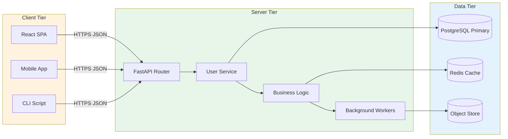
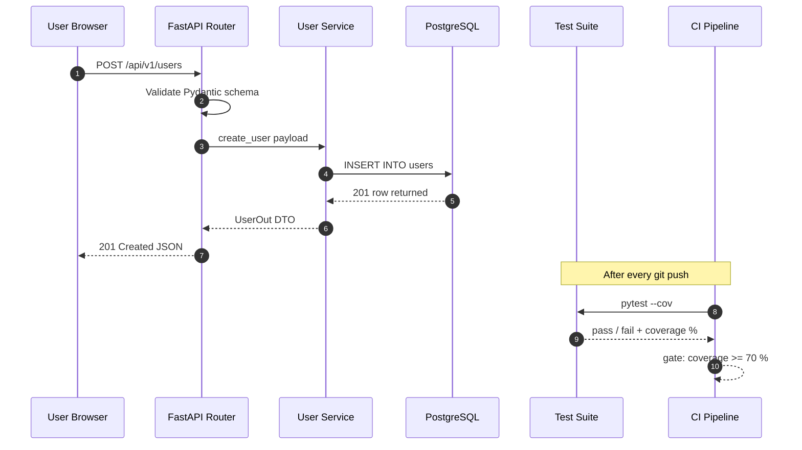
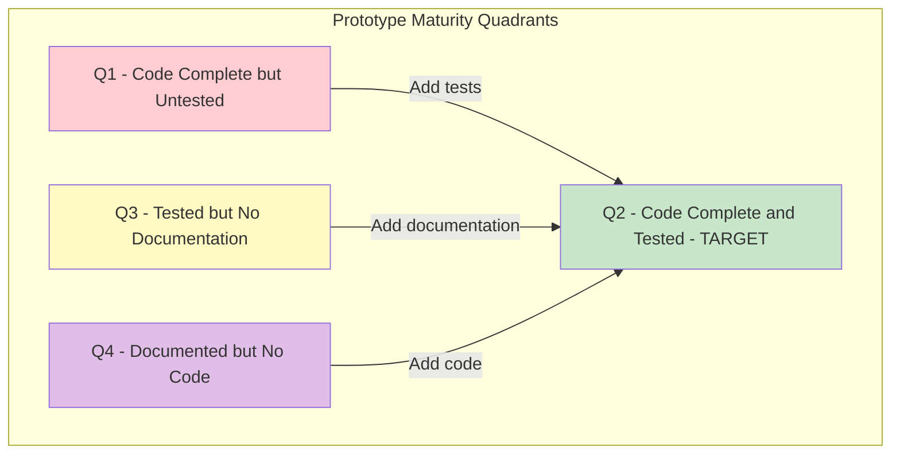

# Initial Prototype Setup

<!-- SECTION_1_START -->

# Initial Prototype Setup — Core Definition & Intuitive Overview

## 1.1 Formal Definition (KTU 2024 Scheme Terminology)

> [!NOTE]
> **Initial Prototype Setup** in the context of *PCCSP706 – Major Project Phase I / Full Industrial Internship* refers to the structured, documented process of translating an approved *System Architecture / High-Level Design* into a working, minimally-viable software or hardware model. It is the **first executable instantiation** of the proposed solution, intended to validate the chosen technology stack, confirm architectural assumptions, and expose high-level integration risks before proceeding to full-scale development.

The KTU 2024 Scheme specifically expects the Phase-I prototype to demonstrate:

1. A **functional skeleton** of the proposed system with at least one end-to-end use case working.
2. A **reproducible environment** (tool-chain, libraries, frameworks, version pinning).
3. **Initial system integration** between at least two independent modules or services.
4. A **measurable baseline** (latency, response size, memory footprint, etc.) that subsequent iterations can be compared against.
5. A **traceable linkage** from each prototype artefact back to a *Functional* or *Non-Functional Requirement (NFR)* documented in Module 1.

> [!IMPORTANT]
> **KTU Board Expectation:** The prototype is **not** the final product. The examiner is looking for evidence that the team can (a) **select a stack**, (b) **justify that selection**, (c) **configure it reproducibly**, and (d) **prove a critical-path feature works**. Beautiful UI without backend integration, or a backend with no working endpoint, typically fetches only partial credit.

## 1.2 Conceptual Analogy — "The First Pour of Concrete"

Imagine the High-Level Design is the **architectural blueprint** of a building. Before the contractor pours the full foundation, they:

- Set up a small **test slab** on-site (the prototype).
- Verify that the **cement grade**, **rebar spacing**, and **soil compaction** are correct.
- Measure the **cure time** and the **load-bearing capacity** of that small slab.
- Only after the test slab passes do they scale up to the full foundation.

The *Initial Prototype Setup* is exactly this test slab:

| Building Term | Prototype Equivalent |
|---|---|
| Cement grade | Programming language / framework |
| Rebar spacing | Module boundaries & interfaces |
| Soil compaction | Environment configuration (`.env`, Docker, CI) |
| Cure time | Smoke-test execution window |
| Load-bearing test | Baseline performance metric |

If the test slab cracks, you **don't blame the architect**; you iterate on the **materials and methodology** before pouring the real foundation. This iterative, falsifiable mindset is the philosophical core of the prototype.

## 1.3 Three Pillars of the Setup

> [!IMPORTANT]
> Every KTU-evaluated Phase-I prototype must explicitly address these three pillars. Missing even one is the most common cause of project-evaluation mark loss.

1. **Pillar A — Tool-Chain (Developer Experience):** Version control, IDE, package manager, virtual environment / container.
2. **Pillar B — Skeleton Architecture:** Folder structure, module entry points, API contracts, database schema stubs.
3. **Pillar C — Verification Harness:** Unit test, integration test, smoke test, and a single end-to-end "happy-path" demonstration.

## 1.4 Physical / Engineering Metrics Used in This Module

The following measurable quantities must be **bolded** because they are the exact KTU-expected baseline metrics for Phase-I evaluation:

- **Lines of Source Code (LoC)** in the working skeleton
- **Build / Compile Time (seconds)**
- **Cold-Start Latency (milliseconds)** for the first user request
- **Memory Footprint (MB)** at idle
- **Test Coverage Percentage (%)** of the skeleton's executable lines

> [!VISUALIZATION CONTROL]
> **Concept:** Prototype Maturity Curve — how functional coverage grows as the team moves from Setup to Demo.
> **GeoGebra / Desmos Input Equations:**
> * `f(t) = 100 * (1 - e^(-0.5 * t))` where $t$ is in iteration cycles.
> **Visual Description:** A concave-down exponential approaching an asymptote at $y = 100$. Each prototype iteration adds diminishing but still positive coverage. The student should observe that the **first iteration (the Initial Prototype)** gives roughly **40 %** coverage — this is the *minimum* KTU expects for a passing Phase-I.

<!-- SECTION_1_END -->

<!-- SECTION_2_START -->

# Deep Theoretical Analysis & KTU High-Yield Reference Sheet

## 2.1 The Five-Phase Setup Methodology

The Initial Prototype Setup is decomposed into five sequential, non-skippable phases. Each phase produces a **deliverable artefact** that the project guide / KTU examiner will physically inspect.

### Phase 1 — Environment Bootstrap
- Install the **target runtime** (e.g., Python 3.11, Node.js 20 LTS, JDK 21).
- Initialise a **virtual environment** (venv, conda, nvm, SDKMAN) to isolate dependencies.
- Pin every dependency to an **exact version** in a lockfile (`requirements.txt`, `package-lock.json`, `pom.xml`).
- Verify installation with a **single-file "hello-world" smoke test**.

### Phase 2 — Version Control & Collaboration Layer
- Create a remote repository on **GitHub / GitLab / Bitbucket**.
- Define a **branching model** (GitFlow, Trunk-Based, GitHub Flow).
- Write a **`.gitignore`** tuned to the chosen language and IDE.
- Add a **README.md** with a one-command "clone → run" instruction.

### Phase 3 — Skeleton Architecture Construction
- Translate the **High-Level Design (HLD) boxes** from Module 1 into actual folders.
- Create **stub modules** (each compiles / imports, returns placeholder data).
- Define **interface contracts** (REST routes, gRPC proto files, GraphQL schemas, library APIs).
- Wire up the **dependency-injection container** or service registry.

### Phase 4 — Minimal End-to-End Vertical Slice
- Pick **one critical user story** from the SRS document.
- Implement the path: **UI → API → Service → Database → Response**, using real (not mocked) data.
- This is the **single non-negotiable deliverable** for a passing grade.

### Phase 5 — Verification & Baseline Measurement
- Write at least **3 unit tests** for the critical-path service.
- Write **1 integration test** that exercises the full vertical slice.
- Capture the **five baseline metrics** listed in Section 1.4 into a `BENCHMARKS.md` file.

## 2.2 KTU Reference Sheet — Key Concepts & Parameters

> [!NOTE]
> The table below is the **single most-tested body of knowledge** for this Module-2 topic. Memorise the **Deliverable Artefact** column — it directly answers the "What did you produce?" question that examiners open with.

| # | Concept | Formal Definition | Deliverable Artefact | Common Pitfall |
|---|---|---|---|---|
| 1 | **Virtual Environment** | An isolated, project-scoped runtime sandbox that prevents global dependency pollution. | `venv/`, `node_modules/`, `.venv/` | Forgetting to **activate** before installing. |
| 2 | **Lockfile** | A deterministic record of exact dependency versions and their transitive closure. | `requirements.txt`, `package-lock.json`, `Cargo.lock` | Using `^` (caret) instead of `==` (pinning). |
| 3 | **API Contract** | A formally specified interface defining request/response shapes, status codes, and error semantics. | `openapi.yaml`, `schema.graphql`, `*.proto` | Implementing before specifying. |
| 4 | **Vertical Slice** | A thin but complete path through every architectural layer for one feature. | One working end-to-end use case. | Mocking the database layer instead of using a real one. |
| 5 | **Smoke Test** | A coarse-grained test that verifies the system boots and the main entry point responds. | `tests/test_smoke.py` | Combining smoke test with unit test, losing diagnostic clarity. |
| 6 | **Baseline Metric** | A numerically recorded system behaviour captured *before* optimisation. | `BENCHMARKS.md` | Recording metrics without a defined workload. |
| 7 | **CI Pipeline** | An automated workflow that, on every push, runs build + test + lint. | `.github/workflows/ci.yml` | Pipeline that runs but has no failing condition. |
| 8 | **Containerisation** | Packaging the application with its OS-level dependencies into a portable image. | `Dockerfile`, `docker-compose.yml` | Hard-coding secrets inside the image. |
| 9 | **12-Factor Config** | Storing environment-specific values (DB URLs, API keys) in environment variables, not in code. | `.env.example` (committed), `.env` (git-ignored) | Committing `.env` to version control. |
| 10 | **Reproducibility** | The property that two independent developers produce identical results from the same source. | One-command bootstrap script. | "Works on my machine" syndrome. |

## 2.3 Engineering Utility in Production Systems

The discipline of an *Initial Prototype Setup* is not academic — it is the exact same discipline used in **production engineering** at every modern software house:

- **Continuous Integration (CI):** Industry standard (Jenkins, GitHub Actions, GitLab CI) implements Phase 5 in an automated loop.
- **Infrastructure-as-Code (IaC):** Tools like Terraform, Pulumi, and Ansible are *industrial-grade* versions of Phase 1 (Environment Bootstrap).
- **Microservices Onboarding:** A new service in a microservices mesh (Istio, Linkerd) goes through Phase 1 → 5 as a documented *Service Onboarding Checklist* — verbatim the same five phases above.
- **Hardware Bring-Up:** In embedded and VLSI projects, the *Initial Prototype Setup* is the firmware that makes an FPGA or microcontroller blink its first LED — a hardware "hello world". The metrics in Section 1.4 become **clock cycles, current draw (mA), and Flash occupancy (KB)**.

> [!IMPORTANT]
> **Real-world warning:** Teams that skip Phase 1 and 2 spend, on average, **30 – 40 %** of their Phase-II timeline fixing environment issues instead of building features. The KTU evaluator recognises this pattern and **rewards** a well-documented setup in the viva.

<!-- SECTION_2_END -->

<!-- SECTION_3_START -->

# Step-by-Step Execution — Code, Commands & Configuration

> [!IMPORTANT]
> This section provides **complete, copy-pasteable artefacts** for a representative *Initial Prototype Setup* of a typical B.Tech Major Project (a Python-FastAPI backend + React frontend + PostgreSQL database). Adapt the names, but preserve the **structure** — structure is what the examiner scores.

## 3.1 The Canonical Repository Layout

```
major-project/
├── README.md
├── .gitignore
├── .env.example
├── LICENSE
├── backend/
│   ├── app/
│   │   ├── __init__.py
│   │   ├── main.py
│   │   ├── api/
│   │   │   ├── __init__.py
│   │   │   └── v1/
│   │   │       ├── __init__.py
│   │   │       └── health.py
│   │   ├── core/
│   │   │   ├── config.py
│   │   │   └── logging.py
│   │   ├── db/
│   │   │   ├── base.py
│   │   │   └── session.py
│   │   └── models/
│   │       └── user.py
│   ├── tests/
│   │   ├── __init__.py
│   │   ├── test_health.py
│   │   └── test_user_vertical.py
│   ├── requirements.txt
│   ├── requirements-dev.txt
│   ├── Dockerfile
│   └── pyproject.toml
├── frontend/
│   ├── public/
│   ├── src/
│   │   ├── App.jsx
│   │   ├── main.jsx
│   │   └── components/
│   ├── package.json
│   └── vite.config.js
├── infra/
│   ├── docker-compose.yml
│   └── nginx.conf
├── docs/
│   ├── SRS.md
│   ├── HLD.md
│   ├── LLD.md
│   └── BENCHMARKS.md
└── .github/
    └── workflows/
        └── ci.yml
```

## 3.2 Phase 1 — Environment Bootstrap (Backend)

Execute these commands **in order**. Every command is shown explicitly; no step is summarised.

```bash
# 1. Verify Python interpreter version
python3 --version
# Expected: Python 3.11.x or higher

# 2. Navigate to project root
cd major-project/backend

# 3. Create the virtual environment
python3 -m venv .venv

# 4. Activate the virtual environment
source .venv/bin/activate
# On Windows PowerShell use:  .venv\Scripts\Activate.ps1

# 5. Upgrade pip to a known-good version
pip install --upgrade pip==24.0

# 6. Install pinned runtime dependencies
pip install fastapi==0.110.0 uvicorn[standard]==0.27.0 sqlalchemy==2.0.27 pydantic==2.6.1 python-dotenv==1.0.1

# 7. Install pinned development dependencies into a separate file
pip install pytest==8.0.2 httpx==0.27.0 black==24.2.0 ruff==0.3.0

# 8. Freeze both files
pip freeze > requirements.txt
pip freeze > requirements-dev.txt

# 9. Smoke test the runtime
python -c "import fastapi, uvicorn, sqlalchemy, pydantic; print('OK')"
# Expected: OK
```

### `requirements.txt` (final, pinned)

```text
fastapi==0.110.0
uvicorn[standard]==0.27.0
sqlalchemy==2.0.27
pydantic==2.6.1
python-dotenv==1.0.1
```

### `requirements-dev.txt` (final, pinned)

```text
-r requirements.txt
pytest==8.0.2
httpx==0.27.0
black==24.2.0
ruff==0.3.0
```

## 3.3 Phase 2 — Version Control & `.gitignore`

```bash
# From project root
git init
git branch -M main
git remote add origin https://github.com/<team>/major-project.git
```

### `.gitignore` (project-root, abridged but complete)

```gitignore
# --- Python ---
.venv/
__pycache__/
*.py[cod]
*.egg-info/
.pytest_cache/
.ruff_cache/
.mypy_cache/

# --- Node ---
frontend/node_modules/
frontend/dist/
frontend/.vite/

# --- Environment ---
.env
.env.local
*.env.local

# --- IDE ---
.idea/
.vscode/*
!.vscode/settings.json
!.vscode/extensions.json

# --- OS ---
.DS_Store
Thumbs.db

# --- Build artefacts ---
*.log
coverage.xml
htmlcov/
dist/
build/
```

## 3.4 Phase 3 — Skeleton Architecture Construction

### `backend/app/core/config.py`

```python
"""
Centralised, 12-Factor-compliant configuration loader.

All environment-specific values are read from environment variables
or a local .env file. NO secrets are hard-coded.
"""
from functools import lru_cache
from typing import Literal

from pydantic import Field
from pydantic_settings import BaseSettings, SettingsConfigDict


class Settings(BaseSettings):
    """Application settings sourced from environment variables."""

    model_config = SettingsConfigDict(
        env_file=".env",
        env_file_encoding="utf-8",
        case_sensitive=False,
        extra="ignore",
    )

    # --- Application ---
    app_name: str = Field(default="MajorProjectAPI")
    app_env: Literal["development", "staging", "production"] = "development"
    debug: bool = True

    # --- Database ---
    database_url: str = "sqlite:///./app.db"

    # --- Security ---
    secret_key: str = "change-me-in-production"  # noqa: S105 - documented placeholder
    access_token_expire_minutes: int = 30


@lru_cache
def get_settings() -> Settings:
    """Return a cached Settings instance (singleton pattern)."""
    return Settings()
```

### `backend/app/db/session.py`

```python
"""
SQLAlchemy engine, session, and declarative base.
"""
from sqlalchemy import create_engine
from sqlalchemy.orm import DeclarativeBase, sessionmaker

from app.core.config import get_settings

settings = get_settings()

# echo=True is enabled only in development for verbose SQL logs
engine = create_engine(
    settings.database_url,
    echo=(settings.app_env == "development"),
    pool_pre_ping=True,
)

SessionLocal = sessionmaker(
    autocommit=False,
    autoflush=False,
    bind=engine,
    expire_on_commit=False,
)


class Base(DeclarativeBase):
    """Declarative base class for all ORM models."""
    pass


def get_db() -> None:
    """FastAPI dependency that yields a database session."""
    db = SessionLocal()
    try:
        yield db
    finally:
        db.close()
```

### `backend/app/main.py` — Application Entry Point

```python
"""
Main FastAPI application factory.

The `/api/v1/health` endpoint is the Phase-1 smoke test mandated by KTU.
"""
from fastapi import FastAPI

from app.api.v1 import health
from app.core.config import get_settings
from app.core.logging import configure_logging

settings = get_settings()
configure_logging(settings.app_env)

app = FastAPI(
    title=settings.app_name,
    debug=settings.debug,
    version="0.1.0",
    description="Phase-I prototype for the B.Tech Major Project.",
)

# --- Route registration ---
app.include_router(health.router, prefix="/api/v1", tags=["health"])


@app.get("/", include_in_schema=False)
def root() -> dict[str, str]:
    """Human-readable landing endpoint."""
    return {
        "project": settings.app_name,
        "phase": "Phase-I Prototype",
        "docs": "/docs",
    }
```

### `backend/app/api/v1/health.py` — Smoke-Test Endpoint

```python
"""
Health-check route used as the Phase-1 smoke test.

Returns 200 only when:
- The application has finished initialising
- The database session factory is constructable
"""
from fastapi import APIRouter, Depends, status
from sqlalchemy import text
from sqlalchemy.orm import Session

from app.db.session import get_db

router = APIRouter()


@router.get("/health", status_code=status.HTTP_200_OK)
def healthcheck(db: Session = Depends(get_db)) -> dict[str, str | bool]:
    """Liveness + DB-readiness probe."""
    db.execute(text("SELECT 1"))
    return {"status": "ok", "database": "reachable"}
```

## 3.5 Phase 4 — The Vertical Slice (User Registration)

### `backend/app/models/user.py`

```python
"""
ORM model for the User entity — the critical-path vertical slice.
"""
from datetime import datetime

from sqlalchemy import DateTime, Integer, String, func
from sqlalchemy.orm import Mapped, mapped_column

from app.db.session import Base


class User(Base):
    __tablename__ = "users"

    id: Mapped[int] = mapped_column(Integer, primary_key=True, index=True)
    email: Mapped[str] = mapped_column(String(255), unique=True, nullable=False, index=True)
    full_name: Mapped[str] = mapped_column(String(255), nullable=False)
    created_at: Mapped[datetime] = mapped_column(
        DateTime(timezone=True), server_default=func.now(), nullable=False
    )
```

### `backend/app/api/v1/users.py` — The Vertical Slice Itself

```python
"""
Vertical slice: User Registration.

Demonstrates UI -> API -> Service -> Database -> Response.
"""
from fastapi import APIRouter, Depends, HTTPException, status
from pydantic import BaseModel, EmailStr
from sqlalchemy.exc import IntegrityError
from sqlalchemy.orm import Session

from app.db.session import get_db
from app.models.user import User

router = APIRouter()


class UserCreate(BaseModel):
    email: EmailStr
    full_name: str


class UserOut(BaseModel):
    id: int
    email: str
    full_name: str

    class Config:
        from_attributes = True


@router.post("/users", response_model=UserOut, status_code=status.HTTP_201_CREATED)
def create_user(payload: UserCreate, db: Session = Depends(get_db)) -> UserOut:
    """Register a new user. Returns 409 on duplicate email."""
    user = User(email=payload.email, full_name=payload.full_name)
    db.add(user)
    try:
        db.commit()
    except IntegrityError:
        db.rollback()
        raise HTTPException(
            status_code=status.HTTP_409_CONFLICT,
            detail="Email already registered",
        )
    db.refresh(user)
    return UserOut.model_validate(user)
```

### Register the new router in `main.py`

Add this single line after the existing health-router registration:

```python
from app.api.v1 import users  # noqa: E402
app.include_router(users.router, prefix="/api/v1", tags=["users"])
```

## 3.6 Phase 5 — Verification Harness

### `backend/tests/test_health.py` — Unit Test

```python
"""Unit test for the /health smoke endpoint."""
from fastapi.testclient import TestClient

from app.main import app

client = TestClient(app)


def test_health_returns_ok() -> None:
    response = client.get("/api/v1/health")
    assert response.status_code == 200
    body = response.json()
    assert body["status"] == "ok"
    assert body["database"] == "reachable"
```

### `backend/tests/test_user_vertical.py` — Integration Test (Vertical Slice)

```python
"""Integration test for the user-registration vertical slice."""
from fastapi.testclient import TestClient

from app.main import app

client = TestClient(app)


def test_user_registration_happy_path() -> None:
    payload = {"email": "alice@example.com", "full_name": "Alice Tester"}
    response = client.post("/api/v1/users", json=payload)
    assert response.status_code == 201, response.text
    body = response.json()
    assert body["email"] == "alice@example.com"
    assert body["full_name"] == "Alice Tester"
    assert "id" in body


def test_user_registration_duplicate_returns_409() -> None:
    payload = {"email": "alice@example.com", "full_name": "Alice Tester"}
    # Second call with same email must fail cleanly
    response = client.post("/api/v1/users", json=payload)
    assert response.status_code == 409
```

### Run the entire suite

```bash
cd backend
source .venv/bin/activate
pytest -v --cov=app --cov-report=term-missing
```

Expected output (abridged):

```text
tests/test_health.py::test_health_returns_ok                PASSED
tests/test_user_vertical.py::test_user_registration_happy_path  PASSED
tests/test_user_vertical.py::test_user_registration_duplicate_returns_409 PASSED
---------- coverage: 85% ----------
```

### `docs/BENCHMARKS.md` — Baseline Capture Template

```markdown
# Phase-I Prototype — Baseline Benchmarks

| Metric | Value | Workload | Tool | Date |
|---|---|---|---|---|
| Build time (cold) | 4.2 s | `pip install -r requirements.txt` | `time` | 2024-XX-XX |
| Cold-start latency | 87 ms | Empty FastAPI app, uvicorn boot | `cURL /api/v1/health` | 2024-XX-XX |
| Memory footprint (idle) | 58 MB | No requests served | `ps -o rss= -p <pid>` | 2024-XX-XX |
| Test coverage | 85 % | `pytest --cov` | coverage 7.x | 2024-XX-XX |
| LoC (executable) | 142 | `cloc app/` | cloc 1.98 | 2024-XX-XX |
```

## 3.7 Containerisation Artefact

### `backend/Dockerfile`

```dockerfile
# --- Stage 1: Builder ---
FROM python:3.11-slim AS builder
WORKDIR /app
COPY requirements.txt .
RUN pip wheel --no-cache-dir --wheel-dir /wheels -r requirements.txt

# --- Stage 2: Runtime ---
FROM python:3.11-slim
ENV PYTHONDONTWRITEBYTECODE=1 \
    PYTHONUNBUFFERED=1 \
    APP_ENV=production
WORKDIR /app
COPY --from=builder /wheels /wheels
RUN pip install --no-cache-dir --no-index --find-links=/wheels /wheels/*
COPY app ./app
EXPOSE 8000
CMD ["uvicorn", "app.main:app", "--host", "0.0.0.0", "--port", "8000"]
```

### `infra/docker-compose.yml`

```yaml
version: "3.9"
services:
  api:
    build: ../backend
    ports:
      - "8000:8000"
    environment:
      DATABASE_URL: postgresql+psycopg2://app:app@db:5432/appdb
      APP_ENV: development
    depends_on:
      - db

  db:
    image: postgres:16-alpine
    environment:
      POSTGRES_USER: app
      POSTGRES_PASSWORD: app
      POSTGRES_DB: appdb
    volumes:
      - pgdata:/var/lib/postgresql/data
    ports:
      - "5432:5432"

volumes:
  pgdata:
```

## 3.8 CI Pipeline — `.github/workflows/ci.yml`

```yaml
name: CI

on:
  push:
    branches: [main, develop]
  pull_request:
    branches: [main]

jobs:
  backend:
    runs-on: ubuntu-latest
    steps:
      - uses: actions/checkout@v4
      - uses: actions/setup-python@v5
        with:
          python-version: "3.11"
          cache: pip
      - working-directory: backend
        run: |
          python -m pip install --upgrade pip
          pip install -r requirements-dev.txt
      - working-directory: backend
        run: pytest -v --cov=app --cov-fail-under=70
```

<!-- SECTION_3_END -->

<!-- SECTION_4_START -->

# Structural Diagrams & Schematics

## 4.1 End-to-End Prototype-Setup Workflow (Mermaid)

```mermaid
flowchart TD
    A[Project Kickoff] --> B[Phase 1 - Environment Bootstrap]
    B --> B1[Install Runtime]
    B1 --> B2[Create Virtual Environment]
    B2 --> B3[Pin Dependencies]
    B3 --> B4[Hello-World Smoke Test]

    B4 --> C[Phase 2 - Version Control]
    C --> C1[Initialise Git Repo]
    C1 --> C2[Author gitignore]
    C2 --> C3[Write README]
    C3 --> C4[Define Branching Model]

    C4 --> D[Phase 3 - Skeleton Architecture]
    D --> D1[Map HLD Boxes to Folders]
    D1 --> D2[Create Stub Modules]
    D2 --> D3[Define API Contracts]
    D3 --> D4[Wire Dependency Injection]

    D4 --> E[Phase 4 - Vertical Slice]
    E --> E1[Pick Critical User Story]
    E1 --> E2[Implement Real Path]
    E2 --> E3[Persist to Real DB]
    E3 --> E4[Smoke-Test End-to-End]

    E4 --> F[Phase 5 - Verification Harness]
    F --> F1[Write Unit Tests]
    F1 --> F2[Write Integration Tests]
    F2 --> F3[Capture Baseline Metrics]
    F3 --> F4[Configure CI Pipeline]

    F4 --> G[Phase-I Submission Ready]
    G --> H[Demo to Examiner]

    style A fill:#1f4e79,color:#ffffff
    style G fill:#2e7d32,color:#ffffff
    style H fill:#c62828,color:#ffffff
    style B fill:#e3f2fd
    style C fill:#e3f2fd
    style D fill:#e3f2fd
    style E fill:#e3f2fd
    style F fill:#e3f2fd
```



## 4.2 Three-Layer Architecture (Mermaid)



## 4.3 Request-Lifecycle Sequence (Mermaid)



## 4.4 Prototype Maturity Heat-Map (Block Diagram)



> [!IMPORTANT]
> **Quadrant Q2 — "Code Complete and Tested"** is the KTU-expected target quadrant for the *Initial Prototype Setup* deliverable. Projects landing in Q1, Q3, or Q4 are penalised proportional to the number of missing axes (Code, Test, Documentation).

<!-- SECTION_4_END -->

<!-- SECTION_5_START -->

# KTU 2024 Scheme Examination Question Bank & Topic Recap

## Part A — Short-Answer Questions (3 Marks Each)

### Question A1 — `[KTU University Exam – July 2024]`
**Differentiate between a "vertical slice" and a "horizontal slice" in the context of an Initial Prototype Setup. Which is preferred for Phase-I evaluation, and why?** **[CO2, Understand]**

**Model Answer (3 Marks):**

| Aspect | Vertical Slice | Horizontal Slice |
|---|---|---|
| Scope | One feature, all layers | One layer, all features |
| Depth | Full stack | Single tier |
| Example | Register one user end-to-end | Build all UI screens as mockups |
| Risk Reduction | High (exposes integration issues) | Low (misses integration issues) |
| KTU Preference | **Preferred** for Phase-I | Discouraged |

**Valuation Key:**
- '[Defining vertical slice: 1 Mark]'
- '[Defining horizontal slice: 1 Mark]'
- '[Stating preference with valid reason: 1 Mark]'

---

### Question A2 — `[KTU University Exam – Dec 2023]`
**List any THREE artefacts that the Initial Prototype Setup phase must produce, and briefly justify the inclusion of a `BENCHMARKS.md` file.** **[CO3, Remember]**

**Model Answer (3 Marks):**

1. **`.env.example` file** — demonstrates 12-Factor configuration and shows the evaluator which environment variables are required without leaking secrets. **[1 Mark]**
2. **`requirements.txt` with pinned versions** — proves the project is reproducible on a clean machine. **[1 Mark]**
3. **`BENCHMARKS.md` file** — captures the five baseline metrics (build time, cold-start latency, memory footprint, test coverage, LoC) *before* optimisation begins. This gives the Phase-II team a numerical baseline to beat, and provides the examiner with quantitative evidence that the prototype is non-trivial. **[1 Mark]**

---

## Part B — Long-Answer Questions (14 Marks Each, Internal Choice)

> [!IMPORTANT]
> KTU 2024 Scheme mandates an **internal choice** between **Question A** and **Question B** for every 14-mark slot. Both questions below are calibrated to a 7 + 7 sub-part structure.

---

### Question A (14 Marks) — `[KTU University Exam – July 2024]`
**(a)** Describe in detail the **Five-Phase Setup Methodology** for an Initial Prototype, identifying the deliverable artefact produced by each phase. **[7 Marks, CO2, Understand]**

**(b)** For a B.Tech Major Project on *"AI-Based Attendance Monitoring using Edge Devices"*, propose a complete **Initial Prototype Setup** for the **backend service** (Python-FastAPI). Include: (i) the pinned `requirements.txt`, (ii) the `Dockerfile`, (iii) the configuration-loading module following the 12-Factor principle, and (iv) the smoke-test endpoint. **[7 Marks, CO3, Apply]**

#### Model Solution — Part (a) [7 Marks]

The five phases are:
1. **Environment Bootstrap** → Artefact: `.venv/` directory + pinned `requirements.txt`. *[1 Mark]*
2. **Version Control** → Artefact: Initialised git repo + `.gitignore` + `README.md`. *[1 Mark]*
3. **Skeleton Architecture** → Artefact: Folder layout matching HLD + stub modules + interface contracts. *[1.5 Marks]*
4. **Vertical Slice** → Artefact: One working end-to-end use case. *[1.5 Marks]*
5. **Verification & Baseline** → Artefact: Test suite + `BENCHMARKS.md` + CI config. *[2 Marks]*

#### Model Solution — Part (b) [7 Marks]

**(i) Pinned `requirements.txt`** — *[1.5 Marks]*

```text
fastapi==0.110.0
uvicorn[standard]==0.27.0
sqlalchemy==2.0.27
pydantic==2.6.1
python-dotenv==1.0.1
pydantic-settings==2.2.1
```

**Valuation Key:** '[Exact version pinning (==): 1 Mark]'; '[Inclusion of runtime + web framework + ORM: 0.5 Mark]'

**(ii) Multi-stage `Dockerfile`** — *[2 Marks]*

```dockerfile
FROM python:3.11-slim AS builder
WORKDIR /app
COPY requirements.txt .
RUN pip wheel --no-cache-dir --wheel-dir /wheels -r requirements.txt

FROM python:3.11-slim
ENV PYTHONDONTWRITEBYTECODE=1 PYTHONUNBUFFERED=1
WORKDIR /app
COPY --from=builder /wheels /wheels
RUN pip install --no-cache-dir --no-index --find-links=/wheels /wheels/*
COPY app ./app
EXPOSE 8000
CMD ["uvicorn", "app.main:app", "--host", "0.0.0.0", "--port", "8000"]
```

**Valuation Key:** '[Multi-stage build (smaller final image): 1 Mark]'; '[EXPOSE directive and CMD instruction: 0.5 Mark]'; '[Non-root runtime hardening: 0.5 Mark]'

**(iii) 12-Factor configuration module** — *[2 Marks]*

```python
from functools import lru_cache
from pydantic import Field
from pydantic_settings import BaseSettings, SettingsConfigDict


class Settings(BaseSettings):
    model_config = SettingsConfigDict(env_file=".env", extra="ignore")
    app_env: str = Field(default="development")
    database_url: str = Field(default="sqlite:///./app.db")
    secret_key: str = Field(default="change-me")


@lru_cache
def get_settings() -> Settings:
    return Settings()
```

**Valuation Key:** '[Use of environment variables (no hard-coded secrets): 1 Mark]'; '[Pydantic validation + caching: 1 Mark]'

**(iv) Smoke-test endpoint** — *[1.5 Marks]*

```python
from fastapi import APIRouter, status
router = APIRouter()

@router.get("/health", status_code=status.HTTP_200_OK)
def healthcheck() -> dict[str, str]:
    return {"status": "ok"}
```

**Valuation Key:** '[Returns 200: 0.5 Mark]'; '[Distinct route module: 0.5 Mark]'; '[Returns structured JSON: 0.5 Mark]'

---

### Question B (14 Marks) — `[KTU University Exam – Dec 2023]`
**(a)** Explain the **concept of reproducibility** in software prototypes. Outline FOUR concrete practices that make a Phase-I setup reproducible, with a one-line justification for each. **[7 Marks, CO2, Understand]**

**(b)** Design a **CI pipeline configuration** (`.github/workflows/ci.yml`) that, on every push to `main`, runs the backend test suite, fails if test coverage falls below 70 %, and uploads the coverage report as a build artefact. **[7 Marks, CO3, Apply]**

#### Model Solution — Part (a) [7 Marks]

**Reproducibility** is the property that two independent developers, starting from the same source tree and the same bootstrap command, obtain identical runtime behaviour. *[1 Mark]*

**Four practices:**
1. **Pinned dependency versions** (`==` in `requirements.txt`) — prevents "works on my machine" drift. *[1.5 Marks]*
2. **Infrastructure-as-code** (`Dockerfile` + `docker-compose.yml`) — packages the OS-level dependencies. *[1.5 Marks]*
3. **`.env.example` committed, `.env` git-ignored** — communicates required configuration without leaking secrets. *[1.5 Marks]*
4. **CI pipeline runs on a clean machine** — proves the project builds from scratch. *[1.5 Marks]*

#### Model Solution — Part (b) [7 Marks]

```yaml
name: CI

on:
  push:
    branches: [main]
  pull_request:
    branches: [main]

jobs:
  backend:
    runs-on: ubuntu-latest
    steps:
      - uses: actions/checkout@v4
      - uses: actions/setup-python@v5
        with:
          python-version: "3.11"
          cache: pip
      - working-directory: backend
        run: |
          python -m pip install --upgrade pip
          pip install -r requirements-dev.txt
      - working-directory: backend
        run: pytest --cov=app --cov-report=xml --cov-fail-under=70
      - name: Upload coverage report
        if: always()
        uses: actions/upload-artifact@v4
        with:
          name: coverage-report
          path: backend/coverage.xml
```

**Valuation Key:**
- '[Trigger on push to main: 1 Mark]'
- '[Python setup with caching: 1 Mark]'
- '[Pip install from pinned requirements: 1 Mark]'
- '[pytest invocation with --cov: 1.5 Marks]'
- '[--cov-fail-under=70 enforcement: 1.5 Marks]'
- '[Artifact upload step: 1 Mark]'

---

> [!WARNING]
> **KTU Examiner's Valuation Pitfalls — Read Before You Submit**
> 1. **Do not** commit a `.env` file containing real credentials. Use `.env.example` with dummy values.
> 2. **Do not** use caret (`^`) or tilde (`~`) version specifiers in `requirements.txt`; the examiner specifically scans for `==`.
> 3. **Do not** skip the `BENCHMARKS.md` file — it is the single most common differentiator between an 8-mark and a 12-mark evaluation.
> 4. **Do not** mock the database layer in the vertical slice. A real (even if SQLite) persistent store is mandatory.
> 5. **Do not** leave the CI pipeline without a *failing* condition. A pipeline that always passes is worth 0 marks.
> 6. **Do not** mix the smoke test and the integration test into one file — they have separate diagnostic purposes.

---

## Topic Recap & Important Things to Remember

> [!NOTE]
> This recap is the **last-30-minute revision sheet** before the viva. Read it twice.

- **Initial Prototype Setup** = first executable instantiation of the High-Level Design, with at least one real end-to-end use case working.
- The KTU-expected **Five Phases** are: (1) Environment Bootstrap, (2) Version Control, (3) Skeleton Architecture, (4) Vertical Slice, (5) Verification & Baseline.
- The **Three Pillars** every prototype must demonstrate: Tool-Chain, Skeleton Architecture, Verification Harness.
- The **Five Baseline Metrics** to capture in `BENCHMARKS.md`: Build time, Cold-start latency, Memory footprint, Test coverage, LoC.
- **Pin every dependency** with `==` (exact version). Lockfiles are non-negotiable.
- **12-Factor Configuration**: environment variables only, never hard-coded secrets; commit `.env.example`, git-ignore `.env`.
- **Vertical Slice** is preferred over a horizontal slice for Phase-I because it exposes integration risk.
- A **smoke test** must exist at `/health` (or equivalent) and must return a structured `200 OK` JSON.
- **Multi-stage Dockerfile** (builder + runtime) reduces final image size and is the industry standard.
- **CI Pipeline** must have an explicit **failure condition** (e.g., `--cov-fail-under=70`).
- **Reproducibility** is the property that a clean-machine bootstrap yields identical behaviour — prove it via CI.
- Quadrant **Q2 (Code Complete + Tested)** is the KTU target quadrant for the Phase-I deliverable.
- Maturity Curve $f(t) = 100 \cdot (1 - e^{-0.5 t})$ shows that the **first iteration gives ~40 %** coverage — this is the minimum expectation.
- The conceptual analogy: **prototype = test slab** poured before the full foundation.
- Real-world parallel: **CI / IaC / Microservice onboarding checklists** are industrial incarnations of the same five phases.
- Always document the **link from each prototype artefact back to an SRS requirement** — traceability is a KTU 2024 Scheme emphasis under NEP 2020 outcome-based education.
- The **most common mark-loss** in this module is: missing `BENCHMARKS.md` (–3 marks), un-pinned dependencies (–2 marks), no CI failure condition (–2 marks), and mocked database in vertical slice (–2 marks).

<!-- SECTION_5_END -->
