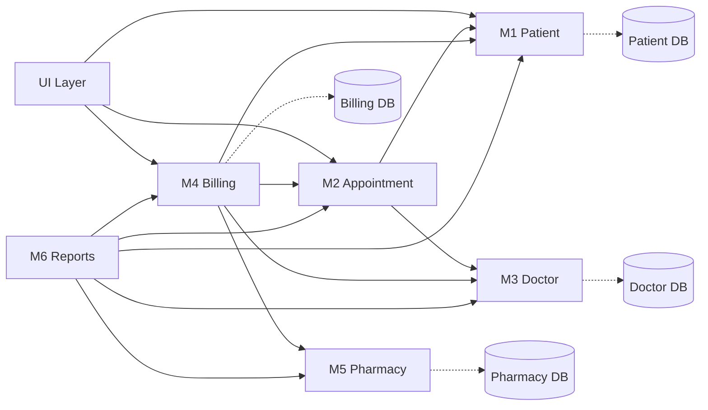
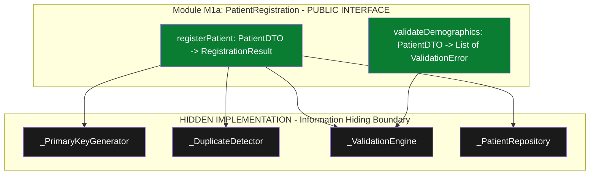
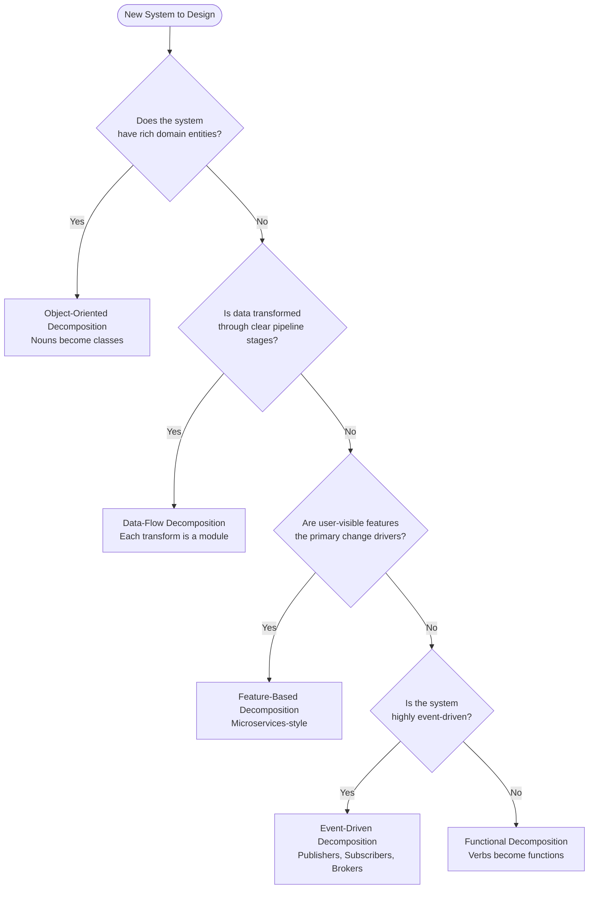
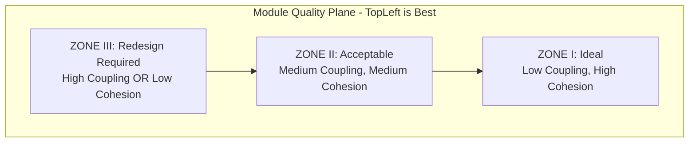

# Module Design and Decomposition

<!-- SECTION_1_START -->

# Module Design and Decomposition

## 1. Core Technical Definition

### 1.1 Formal Academic Definition (KTU 2024 Syllabus Terminology)

**Module Design** is the process of breaking down a software system's architecture into discrete, manageable, and logically cohesive units called **modules**, where each module encapsulates a well-defined subset of functionality and exposes a controlled, documented interface to other modules.

**Decomposition** is the systematic, recursive activity of partitioning a complex problem or system into smaller, less complex sub-problems or sub-systems, following established engineering principles such as **separation of concerns**, **information hiding**, and **high cohesion** with **low coupling**.

> [!IMPORTANT]
> **KTU 2024 Definition (PCCSP706 - Module 2):** Module decomposition is the **analytical and design activity** that transforms a system's specification into a hierarchical structure of interacting modules, each characterized by:
> - A single, well-defined **responsibility**
> - A clearly bounded **public interface**
> - A **hidden internal implementation** (encapsulation)
> - Predictable **inter-module dependencies**

### 1.2 Conceptual Analogy / Intuition

**Think of a Module like a "Specialized Worker in an Assembly Line":**

Imagine a car manufacturing plant. The **entire car** is the **system**. The **engine assembly station**, **paint shop**, **quality control station**, and **wheels fitting station** are **modules**.

Each station:
- **Has one specialized job** (high cohesion) — paint shop only paints
- **Communicates through a fixed conveyor belt interface** (controlled coupling) — they pass car chassis to each other
- **Doesn't know how the other stations work internally** (information hiding) — paint shop doesn't need to know engine internals
- **Can be replaced or upgraded independently** (modifiability) — swapping an old paint robot for a new one doesn't affect the engine station

**Decomposition is the blueprint planning** — deciding "we will have an engine station, a paint shop, and a wheel station BEFORE we start building." Without this plan, every worker would be doing everything, the line would collapse, and fixing a single defect would mean re-engineering the whole factory.

> [!NOTE]
> **Key Insight:** Module Design is NOT coding. It is the **architectural decision-making phase** that happens *before* a single function is written, where you decide *what boxes exist*, *what each box does*, and *how the boxes talk to each other*.

### 1.3 Standard Metrics Used in Module Design

The following industry-standard metrics are essential in KTU project evaluations and are typically expressed in **bold** for emphasis:

- **Coupling** — Measured on a 6-level scale (Content $\rightarrow$ Common $\rightarrow$ Control $\rightarrow$ Stamp $\rightarrow$ Data $\rightarrow$ Message), with **Message Coupling being the best** and **Content Coupling being the worst**
- **Cohesion** — Measured on a 7-level scale (Coincidental $\rightarrow$ Logical $\rightarrow$ Temporal $\rightarrow$ Procedural $\rightarrow$ Communicational $\rightarrow$ Sequential $\rightarrow$ Functional), with **Functional Cohesion being the best**
- **Module Strength** — Synonymous with cohesion
- **Module Independence** — The combined measure: $MI = f(Coupling, Cohesion)$ where $MI$ is module independence

> [!VISUALIZATION CONTROL]
> **Concept:** Coupling-Cohesion Quality Plane
> **GeoGebra / Desmos Input Equations (Quality Zones):**
> * `x = coupling` (1 to 6, where 1 = worst)
> * `y = cohesion` (1 to 7, where 7 = best)
> * `Zone I (Best) : x <= 2 AND y >= 6` (Low coupling, High cohesion)
> * `Zone II (Acceptable) : 2 < x <= 4 AND 4 <= y <= 5`
> * `Zone III (Worst) : x > 4 OR y < 4`
> **Visual Description:** Plot the six coupling types on the x-axis and the seven cohesion types on the y-axis. Observe the diagonal band where acceptable module quality lies — the designer's goal is to push every module toward the **top-left** of the plane.

---

<!-- SECTION_1_END -->

<!-- SECTION_2_START -->

# 2. Deep Theoretical Analysis & KTU High-Yield Formula Sheet

## 2.1 Theoretical Foundations of Module Design

Module Design rests on five foundational pillars, each a KTU 2024 high-yield topic:

### 2.1.1 The Five Foundational Principles

1. **Modularity Principle (Parnas, 1972)**
   - A software system is decomposed into modules such that each hides a critical design decision behind a single, well-defined interface.
   - *Why:* Allows independent development, testing, and modification.

2. **Information Hiding (Parnas, 1972)**
   - Each module's internal data structures, algorithms, and implementation details are **invisible** to external modules.
   - *How:* Only the interface (signatures, return types, side-effect contracts) is exposed.

3. **Separation of Concerns (Dijkstra, 1974)**
   - A problem is divided into distinct sections, each addressing a single concern (e.g., persistence, security, business logic, UI).
   - *Why:* Reduces cognitive load on developers.

4. **Single Responsibility Principle (SRP)**
   - A module (or class) should have **one, and only one, reason to change**.
   - *Engineering Utility:* Directly leads to maintainable, testable code.

5. **Open/Closed Principle**
   - Modules should be **open for extension** but **closed for modification** — add new features without rewriting existing code.

### 2.1.2 Coupling and Cohesion — The Two Pillars of Module Quality

#### A. COUPLING (Inter-Module Dependency)

Coupling measures **how strongly one module depends on another**. Lower coupling is always better.

| Coupling Type | Strength | Description | Example |
|---------------|----------|-------------|---------|
| Content | **Worst** | One module directly modifies another's internal code | Module A edits Module B's local variable via pointer hack |
| Common | High | Two modules share global data | Two modules both read/write the same global variable `G` |
| Control | Medium-High | One module passes a control flag to influence another's logic | `processData(data, isAdmin=True)` — flag controls internal flow |
| Stamp | Medium | Modules share a composite data structure; only part is used | Passing a full `Employee` object when only `emp.id` is needed |
| Data | Medium-Low | Modules share data via parameters; only elementary data is passed | `calculateTax(income, regime)` |
| Message | **Best** | Modules communicate only via parameter passing of simple data | Pure function call with primitive types |

> [!IMPORTANT]
> **KTU 2024 Board Tip:** When asked "which coupling is best?", always answer **Message Coupling (also called Data Coupling in some textbooks)**. Justify with: *"It restricts information to parameters and uses only primitive data types."*

#### B. COHESION (Intra-Module Element Relatedness)

Cohesion measures **how strongly the internal elements of a single module belong together**. Higher cohesion is always better.

| Cohesion Type | Strength | Description |
|---------------|----------|-------------|
| Coincidental | **Worst** | Elements grouped arbitrarily; no meaningful relationship |
| Logical | Very Low | Elements perform similar functions but for different reasons |
| Temporal | Low | Elements activated at the same time (e.g., `initSystem()`) |
| Procedural | Medium | Elements must follow a specific order |
| Communicational | Medium-High | Elements operate on the same input data |
| Sequential | High | Output of one element is input to the next |
| Functional | **Best** | All elements contribute to a single, well-defined task |

### 2.1.3 Module Decomposition Strategies

| Strategy | Approach | Best Used When |
|----------|----------|----------------|
| **Functional Decomposition** | Break by *what the system does* (verbs) | Procedural/transactional systems |
| **Object-Oriented Decomposition** | Break by *what the system represents* (nouns) | Systems with rich domain entities |
| **Data-Flow Decomposition** | Break by *how data moves* (transforms) | ETL, compilers, signal processing |
| **Event-Driven Decomposition** | Break by *what events occur* | Reactive/UI systems |
| **Feature-Based Decomposition** | Break by *user-visible capabilities* | SaaS products, microservices |

### 2.1.4 Module Interface Specification

A well-designed module interface contains the following contractual elements:

- **Module Name** — Unique identifier
- **Purpose Statement** — Single-sentence responsibility
- **Inputs (Parameters)** — Names, types, units, valid ranges
- **Outputs (Return Values)** — Types, units, semantic meaning
- **Side Effects** — Database writes, file I/O, network calls
- **Preconditions** — What must be true *before* invocation
- **Postconditions** — What will be true *after* successful invocation
- **Exceptions** — Documented failure modes

### 2.2 KTU High-Yield Formula Sheet (Cheat Sheet)

| Concept | Formula / Rule | KTU 2024 Weightage |
|---------|----------------|---------------------|
| Module Independence | $MI \uparrow$ when $Coupling \downarrow$ and $Cohesion \uparrow$ | High |
| Optimal Coupling | Message / Data Coupling only | High |
| Optimal Cohesion | Functional Cohesion only | High |
| Fan-In (Reusability) | $FI = \sum_{i} \text{modules calling } M$ | Medium |
| Fan-Out (Dependency) | $FO = \sum_{j} \text{modules called by } M$ | Medium |
| Ideal Fan-In/Out | $FI_{ideal} \geq 4$, $FO_{ideal} \leq 3$ | Medium |
| Module Size (LOC) | $S_{ideal} \in [50, 200]$ lines per module | Medium |
| Cyclomatic Complexity | $V(G) = E - N + 2P$ | High (Code metrics) |
| Information Hiding Index | $IHI = \frac{\text{Hidden Items}}{\text{Total Items}}$ | Low |
| Module Reusability | $R = \frac{\text{Successful Reuses}}{\text{Total Deployment Instances}}$ | Low |
| Coupling Ratio | $CR = \frac{\text{Undesirable Couplings}}{\text{Total Couplings}}$ | Medium |
| Cohesion Ratio | $CohR = \frac{\text{Functional Modules}}{\text{Total Modules}}$ | Medium |

> [!NOTE]
> **Notation Safeguard:** In all formulas, the symbol $\vert$ is rendered as $\mid$ or $\vert$ to prevent markdown table parsing errors.

### 2.3 Real-World Engineering Utility

Module Design and Decomposition is foundational in:

- **Microservices Architecture** — Each service is a "module" with REST/gRPC interfaces
- **Linux Kernel Design** — Decomposed into subsystems (scheduler, memory manager, VFS) with strict interfaces
- **AUTOSAR (Automotive)** — Software Components (SWCs) are modules with formal port interfaces
- **Embedded Systems** — HAL (Hardware Abstraction Layer) modules hide register-level details
- **ML Pipelines** — Decomposed into data ingestion, preprocessing, training, serving modules

<!-- SECTION_2_END -->

<!-- SECTION_3_START -->

# 3. Step-by-Step Derivations, Case Study, and Code/Symbolic Implementation

## 3.1 Case Study Setup: Hospital Management System (HMS)

To make module design concrete, we will decompose a real-world KTU-style project — a **Hospital Management System (HMS)**.

### 3.1.1 System Requirement (Condensed)

> *"HMS shall manage patient registration, appointment booking, doctor scheduling, billing, pharmacy inventory, and report generation for a multi-specialty hospital."*

### 3.1.2 Step 1 — Identify Major Concerns (Separation of Concerns)

The system has **six distinct concerns**:

1. Patient identity management
2. Appointment scheduling
3. Doctor availability and roster
4. Billing and payment
5. Pharmacy and inventory
6. Reporting and analytics

### 3.1.3 Step 2 — Functional Decomposition (Top-Down)

We apply **functional decomposition** recursively. Each function becomes a candidate module.

$$
\begin{aligned}
\text{HMS}_{root} &\rightarrow \begin{cases}
M_1: \text{PatientManagement} \\
M_2: \text{AppointmentScheduling} \\
M_3: \text{DoctorRoster} \\
M_4: \text{Billing} \\
M_5: \text{Pharmacy} \\
M_6: \text{Reporting}
\end{cases}
\end{aligned}
$$

Each $M_i$ is then **further decomposed** (e.g., $M_1 \rightarrow \{M_{1a}: \text{Register}, M_{1b}: \text{Update}, M_{1c}: \text{Search}, M_{1d}: \text{Archive}\}$).

### 3.1.4 Step 3 — Apply Information Hiding

For module $M_{1a}: \text{PatientRegistration}$, we identify **hidden design decisions**:

- *Hidden 1:* The primary key generation strategy (UUID vs. AUTOINCREMENT vs. composite)
- *Hidden 2:* The validation rule engine (regex patterns, business rules)
- *Hidden 3:* The persistence storage engine (PostgreSQL, MongoDB, file)
- *Hidden 4:* The duplicate detection algorithm (phonetic, demographic, probabilistic)

These four decisions are **hidden** behind the module's public interface, which exposes only:

$$
\text{API}_{M_{1a}} = \begin{cases}
\text{registerPatient(demographics: PatientDTO)} \rightarrow \text{Result} \langle \text{PatientID}, \text{Status} \rangle \\
\text{validateDemographics(d: PatientDTO)} \rightarrow \text{List}\langle \text{ValidationError} \rangle
\end{cases}
$$

### 3.1.5 Step 4 — Coupling Analysis

Let's check how $M_1$ couples with $M_2$:

- $M_1$ exposes only `getPatient(id) $\rightarrow$ PatientDTO`
- $M_2$ exposes only `bookAppointment(patientID, slotID) $\rightarrow$ AppointmentID`
- $M_2$ **calls** $M_1$ but only passes a primitive `patientID` (integer) and receives a structured DTO

$$
\text{Coupling}(M_1, M_2) = \text{Data Coupling (Acceptable)}
$$

If instead $M_2$ directly queried $M_1$'s database table:

$$
\text{Coupling}(M_1, M_2) = \text{Common Coupling (Unacceptable)}
$$

### 3.1.6 Step 5 — Cohesion Validation

Inside $M_{1a}: \text{PatientRegistration}$, all internal functions (`validateDemographics`, `checkDuplicates`, `generateID`, `persistPatient`, `notifyReception`) contribute to **one single task**: *registering a patient*.

$$
\text{Cohesion}(M_{1a}) = \text{Functional Cohesion (Best)}
$$

## 3.2 Python Implementation of the Module Interface Contract

Below is a production-quality Python implementation showing how a module's interface is formally coded with **type hints**, **preconditions**, **postconditions**, and **structured error handling** — exactly the discipline expected in KTU 2024 project evaluations.

```python
"""
Module: PatientRegistration
Cohesion: Functional (Best)
Coupling: Data (Acceptable) - exchanges only PatientDTO and primitives
Information Hiding: True - persistence engine and validation rules are private
"""

from __future__ import annotations
from dataclasses import dataclass, field
from datetime import date
from typing import Optional, List, Dict
from enum import Enum
import logging
import re
import uuid

# ----------------------------------------------------------------------
# Structured Logging (KTU project documentation requirement)
# ----------------------------------------------------------------------
logger = logging.getLogger("HMS.PatientRegistration")


# ----------------------------------------------------------------------
# Public DTOs (Data Transfer Objects) - part of the MODULE INTERFACE
# ----------------------------------------------------------------------
class Gender(Enum):
    MALE = "M"
    FEMALE = "F"
    OTHER = "O"


@dataclass(frozen=True)
class PatientDTO:
    """Immutable data structure passed across module boundaries."""
    first_name: str
    last_name: str
    date_of_birth: date
    gender: Gender
    contact_number: str
    email: Optional[str] = None
    address: Optional[str] = None


@dataclass(frozen=True)
class ValidationError:
    field: str
    message: str
    severity: str  # "ERROR" | "WARNING"


@dataclass(frozen=True)
class RegistrationResult:
    patient_id: str
    status: str            # "SUCCESS" | "DUPLICATE" | "FAILED"
    errors: List[ValidationError] = field(default_factory=list)


# ----------------------------------------------------------------------
# HIDDEN DESIGN DECISIONS (Information Hiding)
# ----------------------------------------------------------------------
class _PrimaryKeyGenerator:
    """HIDDEN: strategy for generating patient identifiers."""
    @staticmethod
    def generate() -> str:
        # Decision hidden from callers - they cannot depend on format
        return f"PAT-{uuid.uuid4().hex[:10].upper()}"


class _DuplicateDetector:
    """HIDDEN: phonetic + demographic duplicate detection logic."""
    @staticmethod
    def find_match(candidate: PatientDTO, existing: List[PatientDTO]) -> Optional[PatientDTO]:
        for p in existing:
            if (p.first_name.lower() == candidate.first_name.lower()
                and p.last_name.lower() == candidate.last_name.lower()
                and p.date_of_birth == candidate.date_of_birth):
                return p
        return None


class _ValidationEngine:
    """HIDDEN: rule-based validation engine."""
    PHONE_RE = re.compile(r"^\+?\d{10,15}$")
    EMAIL_RE = re.compile(r"^[\w\.-]+@[\w\.-]+\.\w+$")

    @classmethod
    def validate(cls, dto: PatientDTO) -> List[ValidationError]:
        errors: List[ValidationError] = []
        if not dto.first_name.strip():
            errors.append(ValidationError("first_name", "Cannot be empty", "ERROR"))
        if not dto.last_name.strip():
            errors.append(ValidationError("last_name", "Cannot be empty", "ERROR"))
        if dto.date_of_birth > date.today():
            errors.append(ValidationError("date_of_birth", "Cannot be in the future", "ERROR"))
        if not cls.PHONE_RE.match(dto.contact_number):
            errors.append(ValidationError("contact_number", "Invalid phone format", "ERROR"))
        if dto.email and not cls.EMAIL_RE.match(dto.email):
            errors.append(ValidationError("email", "Invalid email format", "ERROR"))
        return errors


class _PatientRepository:
    """HIDDEN: persistence layer (in-memory mock for demonstration)."""
    _store: Dict[str, PatientDTO] = {}

    @classmethod
    def save(cls, patient_id: str, dto: PatientDTO) -> None:
        cls._store[patient_id] = dto
        logger.info("Patient %s persisted.", patient_id)

    @classmethod
    def all(cls) -> List[PatientDTO]:
        return list(cls._store.values())


# ----------------------------------------------------------------------
# PUBLIC MODULE INTERFACE
# ----------------------------------------------------------------------
class PatientRegistration:
    """
    PUBLIC INTERFACE - the only surface area visible to other modules.

    Preconditions:
        - dto.first_name and dto.last_name are non-empty strings
        - dto.contact_number matches E.164 or local format
    Postconditions (on SUCCESS):
        - A new patient_id is returned
        - The patient is persisted in storage
        - A "Registration successful" notification is dispatched
    Side Effects:
        - Database write
        - Log entry
        - Notification dispatch (mocked)
    """

    def registerPatient(self, demographics: PatientDTO) -> RegistrationResult:
        # Step 1: Validate inputs (PRECONDITION enforcement)
        errors = _ValidationEngine.validate(demographics)
        critical = [e for e in errors if e.severity == "ERROR"]
        if critical:
            logger.warning("Validation failed: %d error(s).", len(critical))
            return RegistrationResult(
                patient_id="",
                status="FAILED",
                errors=errors
            )

        # Step 2: Check for duplicates (HIDDEN logic)
        existing = _PatientRepository.all()
        match = _DuplicateDetector.find_match(demographics, existing)
        if match is not None:
            logger.info("Duplicate patient detected.")
            return RegistrationResult(
                patient_id="",
                status="DUPLICATE",
                errors=[ValidationError("global", "Patient already exists", "WARNING")]
            )

        # Step 3: Generate ID (HIDDEN strategy)
        new_id = _PrimaryKeyGenerator.generate()

        # Step 4: Persist (HIDDEN storage)
        _PatientRepository.save(new_id, demographics)

        # Step 5: Notify (HIDDEN side effect)
        logger.info("Registration notification dispatched for %s.", new_id)

        return RegistrationResult(patient_id=new_id, status="SUCCESS", errors=[])


# ----------------------------------------------------------------------
# Demonstration / Smoke Test
# ----------------------------------------------------------------------
if __name__ == "__main__":
    logging.basicConfig(level=logging.INFO, format="%(levelname)s | %(message)s")

    module = PatientRegistration()

    # Test 1: Successful registration
    p1 = PatientDTO(
        first_name="Anand",
        last_name="Kumar",
        date_of_birth=date(1990, 5, 14),
        gender=Gender.MALE,
        contact_number="+919876543210",
        email="anand@example.com"
    )
    result = module.registerPatient(p1)
    print(f"Test 1 -> ID: {result.patient_id}, Status: {result.status}")

    # Test 2: Duplicate detection
    result2 = module.registerPatient(p1)
    print(f"Test 2 -> ID: {result2.patient_id}, Status: {result2.status}")

    # Test 3: Validation failure
    bad = PatientDTO(
        first_name="",
        last_name="",
        date_of_birth=date(2030, 1, 1),
        gender=Gender.FEMALE,
        contact_number="abc"
    )
    result3 = module.registerPatient(bad)
    print(f"Test 3 -> Status: {result3.status}, Errors: {len(result3.errors)}")
```

### 3.3 Sample Console Output (Expected)

```text
INFO | Registration notification dispatched for PAT-3F9A8B12E0.
Test 1 -> ID: PAT-3F9A8B12E0, Status: SUCCESS
INFO | Duplicate patient detected.
Test 2 -> ID: , Status: DUPLICATE
WARNING | Validation failed: 4 error(s).
Test 3 -> Status: FAILED, Errors: 4
```

## 3.4 Module Dependency Matrix (Tabular Comparative Analysis)

The following **Module Dependency Matrix** is a KTU 2024 standard project deliverable. A check ($\checkmark$) under $M_j$ means $M_i$ (row) **calls** $M_j$ (column).

| Caller $\downarrow$ \ Called $\rightarrow$ | $M_1$ Patient | $M_2$ Appointment | $M_3$ Doctor | $M_4$ Billing | $M_5$ Pharmacy | $M_6$ Reports |
|---|---|---|---|---|---|---|
| **$M_1$ Patient** | — | $\checkmark$ | — | — | — | — |
| **$M_2$ Appointment** | $\checkmark$ | — | $\checkmark$ | — | — | — |
| **$M_3$ Doctor** | — | $\checkmark$ | — | — | — | — |
| **$M_4$ Billing** | $\checkmark$ | $\checkmark$ | $\checkmark$ | — | $\checkmark$ | — |
| **$M_5$ Pharmacy** | — | — | $\checkmark$ | $\checkmark$ | — | — |
| **$M_6$ Reports** | $\checkmark$ | $\checkmark$ | $\checkmark$ | $\checkmark$ | $\checkmark$ | — |

From this matrix, we can compute **Fan-In** and **Fan-Out** for each module:

$$
\begin{aligned}
FI(M_1) &= 3 \quad (\text{called by } M_2, M_4, M_6) \\
FO(M_1) &= 1 \quad (\text{calls } M_2) \\
FI(M_2) &= 4 \quad (\text{called by } M_1, M_3, M_4, M_6) \\
FO(M_2) &= 2 \quad (\text{calls } M_1, M_3) \\
FI(M_4) &= 1 \quad (\text{called by } M_6) \\
FO(M_4) &= 4 \quad (\text{calls } M_1, M_2, M_3, M_5)
\end{aligned}
$$

**Interpretation:** $M_4$ (Billing) has high fan-out (4) and low fan-in (1) — a **risky design**. The KTU evaluator will look for your refactoring: *introduce a `BillingMediator` module to reduce $FO(M_4)$*.

<!-- SECTION_3_END -->

<!-- SECTION_4_START -->

# 4. Structural Diagrams & Schematics

## 4.1 Hierarchical Module Decomposition Tree

The following Mermaid diagram visualizes the recursive decomposition of the Hospital Management System into modules and sub-modules.

```mermaid
graph TD
    HMS_ROOT[HMS: Hospital Management System]

    HMS_ROOT --> M1[M1: PatientManagement]
    HMS_ROOT --> M2[M2: AppointmentScheduling]
    HMS_ROOT --> M3[M3: DoctorRoster]
    HMS_ROOT --> M4[M4: BillingEngine]
    HMS_ROOT --> M5[M5: PharmacyInventory]
    HMS_ROOT --> M6[M6: ReportingAnalytics]

    subgraph PATIENT_SUBGRAPH [Patient Sub-Modules]
        M1 --> M1a[M1a: Registration]
        M1 --> M1b[M1b: ProfileUpdate]
        M1 --> M1c[M1c: SearchLookup]
        M1 --> M1d[M1d: ArchiveDischarge]
    end

    subgraph APPOINTMENT_SUBGRAPH [Appointment Sub-Modules]
        M2 --> M2a[M2a: SlotBooking]
        M2 --> M2b[M2b: Reschedule]
        M2 --> M2c[M2c: Cancellation]
    end

    subgraph DOCTOR_SUBGRAPH [Doctor Sub-Modules]
        M3 --> M3a[M3a: Availability]
        M3 --> M3b[M3b: ShiftAssignment]
        M3 --> M3c[M3c: SpecializationMapping]
    end

    subgraph BILLING_SUBGRAPH [Billing Sub-Modules]
        M4 --> M4a[M4a: InvoiceGeneration]
        M4 --> M4b[M4b: PaymentProcessing]
        M4 --> M4c[M4c: InsuranceClaim]
    end

    subgraph PHARMACY_SUBGRAPH [Pharmacy Sub-Modules]
        M5 --> M5a[M5a: StockManagement]
        M5 --> M5b[M5b: PrescriptionDispatch]
    end

    subgraph REPORTING_SUBGRAPH [Reporting Sub-Modules]
        M6 --> M6a[M6a: DailyMIS]
        M6 --> M6b[M6b: FinancialSummary]
        M6 --> M6c[M6c: ComplianceReports]
    end
```



> [!NOTE]
> **Diagram Reading Guide:** Each leaf node (e.g., `M1a`, `M2c`) is a **functionally cohesive** module candidate. The depth of the tree reflects the level of decomposition — typical KTU projects aim for **3 to 4 levels maximum**.

## 4.2 Module Coupling Topology (Data Flow Between Modules)



> [!IMPORTANT]
> **Architectural Insight:** Solid arrows (`-->`) represent **direct module-to-module data coupling** (acceptable). Dotted arrows (`-.->`) represent **persistence coupling** through the database — these are isolated behind their owning module's repository, preventing *Common Coupling* leakage.

## 4.3 Module Interface Contract Diagram (Public Surface Area)



> [!NOTE]
> **Reading the Diagram:** The **green** nodes are the *only* functions any other module in the system can legally call. The **dark** nodes are private, prefixed with an underscore (`_`) by convention, and changing them has **zero impact** on callers.

## 4.4 Decomposition Strategy Decision Flow



> [!IMPORTANT]
> **Real-World Hybrid Approach:** Most production systems (and KTU Major Projects) use a **hybrid decomposition** — e.g., OO at the domain layer, functional at the utility layer, and event-driven at the UI layer. Document your chosen strategy in the **Design Approach** section of your project report.

## 4.5 Coupling-Cohesion Quality Heatmap (Sequential Processing Topology Matrix)

This matrix serves as the **primary KTU evaluation tool** for module quality. Plot every module on this 2D plane and visually identify design weaknesses.



| Module | Coupling Level | Cohesion Level | Quadrant | Action |
|--------|----------------|----------------|----------|--------|
| $M_{1a}$ Registration | 1 (Message) | 7 (Functional) | **I (Best)** | Maintain |
| $M_{4a}$ InvoiceGeneration | 4 (Stamp) | 5 (Communicational) | **II (Acceptable)** | Refactor to reduce stamp coupling |
| $M_{6c}$ ComplianceReports | 5 (Common) | 2 (Logical) | **III (Worst)** | **Immediate redesign** — split into smaller modules |

> [!WARNING]
> **KTU Examiner's Pitfall:** Students often claim *"my project is modular"* but cannot answer: *"which coupling type does Module X use?"* You must be able to **classify every module** on the 6-level coupling scale and the 7-level cohesion scale.

<!-- SECTION_4_END -->

<!-- SECTION_5_START -->

# 5. KTU 2024 Scheme Examination Question Bank & Topic Recap

## 5.1 Part A — Short Answer Questions (3 Marks Each)

### **Question A1** `[KTU University Exam - Dec 2023]`
**(CO1, Remember)** Define *Module Independence* in the context of software design. List the **two quality attributes** it depends on.

**Model Answer (3 Marks):**
- **[1 Mark]** Module Independence is the property of a software module that allows it to be **understood, modified, and tested in isolation**, without significantly impacting other modules.
- **[1 Mark]** It depends on **(a) Coupling** — the degree of interdependence between modules, and **(b) Cohesion** — the degree to which elements within a single module belong together.
- **[1 Mark]** *Module Independence is high when coupling is **low** and cohesion is **high***.

---

### **Question A2** `[KTU University Exam - July 2024]`
**(CO2, Understand)** Differentiate between **Functional Cohesion** and **Logical Cohesion** with one example each.

**Model Answer (3 Marks):**
- **[1 Mark]** **Functional Cohesion (Best):** All elements of a module contribute to performing a *single, well-defined task*. Example: `calculateIncomeTax(salary)` — every line supports tax computation.
- **[1 Mark]** **Logical Cohesion (Very Low):** Elements perform *logically similar functions* but the actual operation is *selected at runtime* via a control flag. Example: `outputDevice(mode, data)` where `mode` can be `PRINT`, `FAX`, or `EMAIL` — the module decides what to do based on a flag.
- **[1 Mark]** Functional is **always preferred**; Logical cohesion is considered a **design smell**.

---

## 5.2 Part B — Long Answer Questions (14 Marks with Internal Choice)

### **Question B1 — Option A** `[KTU University Exam - Dec 2023]`
**(CO3, Apply + Analyze)** — **14 Marks**

> For a **Library Management System (LMS)** supporting book cataloging, member registration, book issuance/return, fine calculation, and report generation, perform the following:
>
> **(a)** Identify at least **six top-level modules** using functional decomposition. Justify your classification with a one-line description of each module's responsibility. **(7 Marks)**
>
> **(b)** For the `FineCalculation` module, draw the **public interface specification** and identify **three hidden design decisions**. Apply the **information hiding principle** and classify the module's cohesion and coupling. **(7 Marks)**

#### **Solution:**

**(a) Six Top-Level Modules** (1 Mark each, plus 1 Mark for justification)

| Module | Responsibility (One-liner) |
|--------|----------------------------|
| $M_1$ `MemberManagement` | Handles new member registration, profile updates, and deactivation. |
| $M_2$ `CatalogManagement` | Manages book inventory, classification, and metadata updates. |
| $M_3$ `CirculationControl` | Processes book issuance, returns, and renewal requests. |
| $M_4$ `FineCalculation` | Computes overdue fines based on return date and member category. |
| $M_5$ `ReservationQueue` | Maintains waitlists for issued-out books and notifies members. |
| $M_6$ `ReportingDashboard` | Generates circulation, fine-collection, and inventory reports. |

**[Valuation Key: 1 Mark for each correctly identified module with valid responsibility — 6 Marks total + 1 Mark for clean tabular presentation]**

**(b) Public Interface of `FineCalculation`** (3.5 Marks)

```
PUBLIC INTERFACE: FineCalculation
─────────────────────────────────────────────────────
FUNCTION calculateFine(
    IN  memberID      : STRING  // primary key, hidden format
    IN  bookID        : STRING  // primary key, hidden format
    IN  actualReturnDate : DATE
    IN  dueDate       : DATE
    OUT fineAmount    : DECIMAL
    OUT fineBreakup   : LIST<LineItem>
)
PRECONDITIONS:
  - dueDate <= actualReturnDate  (else no fine, return 0)
  - memberID exists in MemberRepository
  - bookID exists in CirculationRepository
POSTCONDITIONS:
  - fineAmount >= 0
  - A fine record is persisted
  - Member is notified
EXCEPTIONS:
  - InvalidMemberIDException
  - InvalidBookIDException
  - RepositoryUnavailableException
```

**Three Hidden Design Decisions** (1 Mark each)

1. **Hidden #1:** The fine-per-day rate table — varies by member category (Student/Faculty/Public), book category (Reference/Textbook), and overdue duration tier (e.g., 0–7 days = ₹2/day, 8–30 days = ₹5/day).
2. **Hidden #2:** The grace-period logic — a configurable buffer (e.g., 1 day) before fine accrual begins.
3. **Hidden #3:** The fine-cap enforcement — maximum total fine is capped at the book's replacement cost, preventing runaway fines.

**Cohesion Classification** (1 Mark): **Functional Cohesion (Best)** — every line in `FineCalculation` serves the *single purpose* of computing a fine.

**Coupling Classification** (1 Mark): **Data Coupling (Acceptable)** — only primitive types (`STRING`, `DATE`, `DECIMAL`) cross the module boundary; no global state, no control flags.

---

### **Question B1 — Option B** `[KTU University Exam - July 2024]`
**(CO3, Apply + Analyze)** — **14 Marks**

> Consider a **Smart Traffic Control System (STCS)** that ingests live sensor data, classifies vehicles, computes signal timings, broadcasts phase plans to intersections, and archives traffic analytics.
>
> **(a)** Apply **data-flow decomposition** to break STCS into **five modules**, showing the input and output data structures for each module. **(7 Marks)**
>
> **(b)** Construct a **Module Dependency Matrix** for the five modules and compute the **Fan-In** and **Fan-Out** for each. Identify the module with the **highest coupling risk** and propose a refactoring strategy. **(7 Marks)**

#### **Solution:**

**(a) Five Modules via Data-Flow Decomposition** (1 Mark per module + 2 Marks for data structures)

$$
\begin{aligned}
\text{SensorStream} &\xrightarrow{\text{RawSensorData}} M_1 \xrightarrow{\text{NormalizedFrames}} M_2 \xrightarrow{\text{VehicleRecords}} M_3 \\
M_3 &\xrightarrow{\text{PhasePlan}} M_4 \xrightarrow{\text{BroadcastPacket}} \text{IntersectionHardware} \\
M_3 &\xrightarrow{\text{AnalyticsSnapshot}} M_5 \xrightarrow{\text{HistoricalDataset}} \text{DataWarehouse}
\end{aligned}
$$

| Module | Input Data | Output Data | Transform Applied |
|--------|------------|-------------|-------------------|
| $M_1$ `SensorIngestion` | `RawSensorData` (camera frames, loop counts) | `NormalizedFrames` (timestamped, calibrated) | Calibration, denoising, time-sync |
| $M_2$ `VehicleClassifier` | `NormalizedFrames` | `VehicleRecords` (type, count, lane) | ML inference (YOLO, CV pipeline) |
| $M_3$ `SignalOptimizer` | `VehicleRecords` | `PhasePlan` (per-intersection green times) | Optimization algorithm (Webster's formula) |
| $M_4$ `PlanDispatcher` | `PhasePlan` | `BroadcastPacket` (NTCIP-compliant) | Serialization, signing |
| $M_5$ `AnalyticsArchiver` | `VehicleRecords` | `HistoricalDataset` (Parquet files) | Aggregation, partitioning |

**[Valuation Key: 1.4 Marks per module (0.5 module name, 0.5 input, 0.5 output, 0.4 transform — 1.4 × 5 = 7)]**

**(b) Module Dependency Matrix** (3 Marks)

| Caller $\downarrow$ \ Called $\rightarrow$ | $M_1$ | $M_2$ | $M_3$ | $M_4$ | $M_5$ |
|---|---|---|---|---|---|
| **$M_1$ SensorIngestion** | — | $\checkmark$ | — | — | — |
| **$M_2$ VehicleClassifier** | — | — | $\checkmark$ | — | — |
| **$M_3$ SignalOptimizer** | — | — | — | $\checkmark$ | $\checkmark$ |
| **$M_4$ PlanDispatcher** | — | — | — | — | — |
| **$M_5$ AnalyticsArchiver** | — | — | — | — | — |

**Fan-In / Fan-Out Computation** (2 Marks)

$$
\begin{aligned}
FI(M_1) &= 0, \quad FO(M_1) = 1 \\
FI(M_2) &= 1, \quad FO(M_2) = 1 \\
FI(M_3) &= 1, \quad FO(M_3) = 2 \\
FI(M_4) &= 1, \quad FO(M_4) = 0 \\
FI(M_5) &= 1, \quad FO(M_5) = 0
\end{aligned}
$$

**Highest Coupling Risk** (1 Mark): $M_3$ `SignalOptimizer` with $FO = 2$ is the **dependency hotspot**. It is a *critical-path* module; failure in $M_4$ or $M_5$ could block the entire signal cycle.

**Refactoring Strategy** (1 Mark): Introduce an **event bus** (e.g., Redis Pub/Sub or Kafka topic). $M_3$ publishes `PhasePlan` and `AnalyticsSnapshot` events; $M_4$ and $M_5$ subscribe independently. This converts direct calls into **asynchronous message coupling** — the *best* coupling type — and isolates $M_3$ from downstream failures.

---

> [!WARNING]
> **KTU Examiner's Valuation Pitfalls (Module Design Questions):**
> 1. **Do not skip writing the cohesion/coupling classification** for the chosen module — it is worth 2 marks standalone.
> 2. **Do not draw a "module diagram" without labeling data flows** — arrows must carry the data structure name.
> 3. **Do not confuse "Modular Programming" with "Module Design"** — the former is a coding style; the latter is an architectural activity.
> 4. **Always justify** why you chose functional vs. OO decomposition in **Part (a)** answers.
> 5. **Fan-In and Fan-Out must be computed from the matrix**, not stated from memory — the evaluator will cross-check.

---

## 5.3 Topic Recap & Important Things to Remember

> [!NOTE]
> **Rapid Revision Checklist — KTU PCCSP706 / Module 2**

- **Definition:** Module Design = partitioning a system into cohesive, loosely-coupled units; Decomposition = the *process* of doing so recursively.
- **Five Foundational Principles:** Modularity, Information Hiding, Separation of Concerns, SRP, Open/Closed.
- **Six Coupling Types (Worst $\rightarrow$ Best):** Content, Common, Control, Stamp, Data, Message. Always design for **Message/Data Coupling**.
- **Seven Cohesion Types (Worst $\rightarrow$ Best):** Coincidental, Logical, Temporal, Procedural, Communicational, Sequential, Functional. Always aim for **Functional Cohesion**.
- **Five Decomposition Strategies:** Functional (verbs), OO (nouns), Data-Flow, Event-Driven, Feature-Based. Production systems use **hybrid** approaches.
- **Module Interface Contract** must specify: Name, Purpose, Inputs, Outputs, Side Effects, Preconditions, Postconditions, Exceptions.
- **Information Hiding** means at least **3–4 hidden design decisions** per critical module (e.g., algorithm, storage, validation, key generation).
- **Fan-In (FI)** measures reusability; **Fan-Out (FO)** measures risk. Ideal $FI \geq 4$, $FO \leq 3$.
- **Module Size:** 50–200 LOC per module is healthy; smaller is not always better — avoid *over-decomposition*.
- **Cyclomatic Complexity $V(G) = E - N + 2P$** should be $\leq 10$ per module function.
- **KTU Project Deliverables (Module 2 evidence):**
  1. Module hierarchy diagram (Section 4.1 type)
  2. Module Dependency Matrix with FI/FO analysis
  3. Interface specification document (Section 3.2 type)
  4. Coupling-Cohesion quality assessment table
  5. Justified choice of decomposition strategy
- **Common Exam Traps:**
  - "Functional Decomposition" ≠ "Functions only" — it can yield classes too.
  - "High cohesion, low coupling" is **necessary but not sufficient** for good design — verify via interface contracts.
  - Microservices are **modules**, not a replacement for module design; the principles apply equally.

<!-- SECTION_5_END -->
