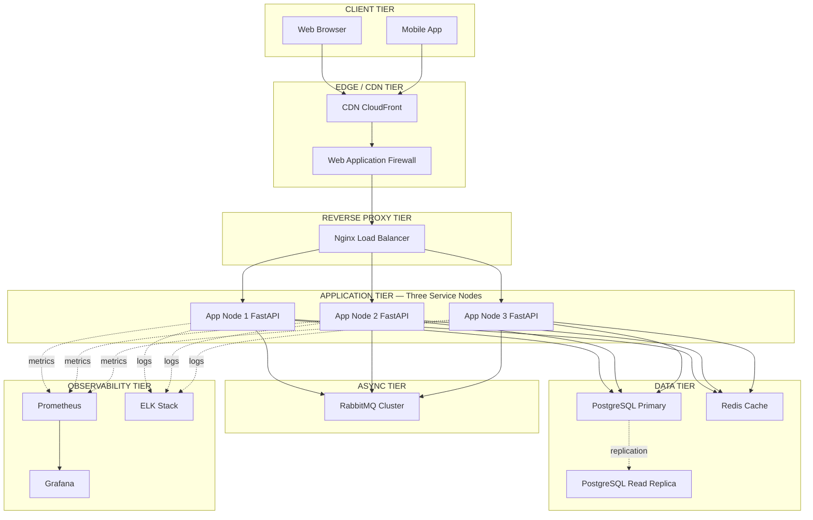
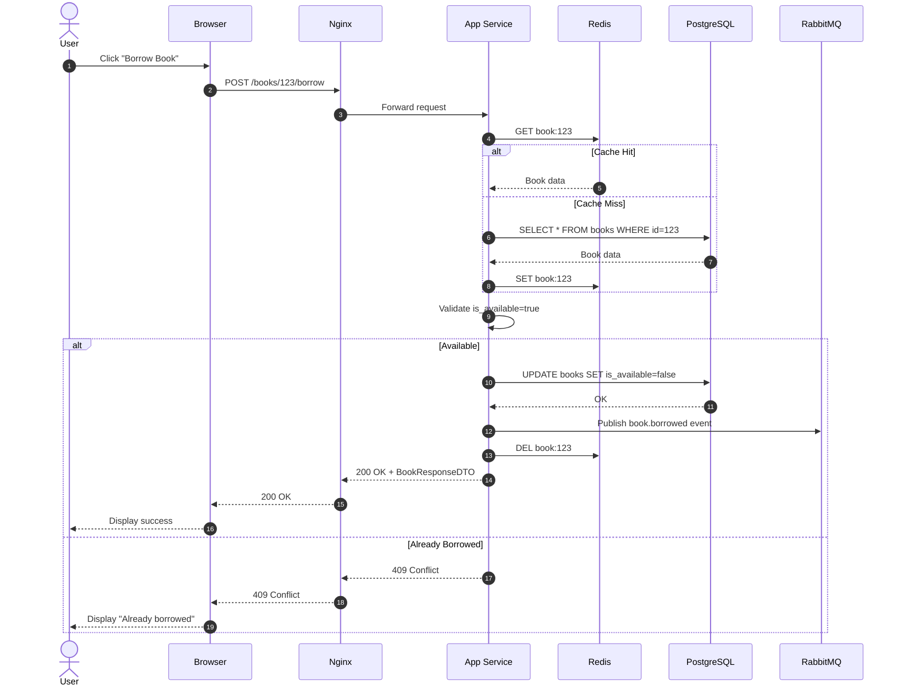
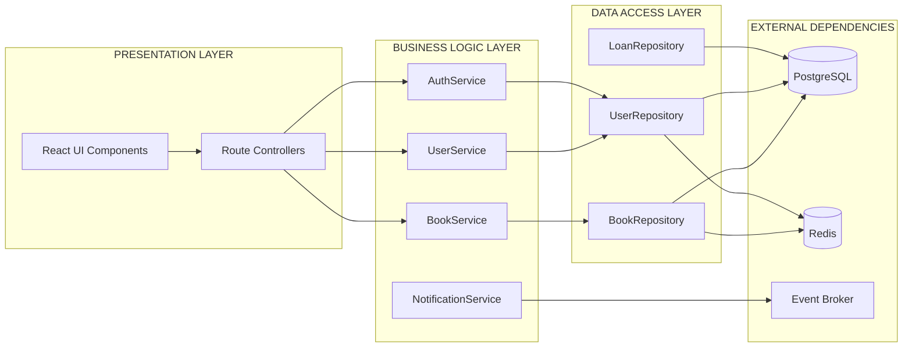
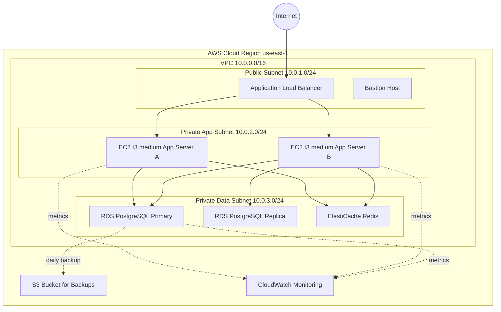

# System Architecture Design

<!-- SECTION_1_START -->
# System Architecture Design — KTU 2024 Premium Study Notes

> [!IMPORTANT]
> **KTU 2024 Scheme Relevance**
> * **Course:** MAJOR PROJECT PHASE I / FULL INDUSTRIAL INTERNSHIP (PCCSP706)
> * **Module:** 2 — High-Level System Design
> * **Topic:** System Architecture Design
> * **Mapped Course Outcomes:** CO2 (Design system architectures for real-world problems), CO3 (Apply modern engineering tools)
> * **Cognitive Levels Targeted:** Understand, Apply, Analyze, Create (Bloom's Revised Taxonomy)

---

## 1.1 Formal Academic Definition (KTU 2024 Terminology)

**System Architecture Design** is the *highest-level abstraction* of a software-intensive system's structure, describing its **components**, the **interactions and relationships** between those components, the **principles guiding its design and evolution**, and the **constraints** under which it must operate. It is the blueprint that maps functional and non-functional requirements to a concrete structural and behavioral model before detailed implementation begins.

In the KTU 2024 Project Phase I context, the architecture is the **single most important deliverable** of the High-Level Design (HLD) phase. It directly answers the question:

> *"How will the proposed system be decomposed into modules, how will those modules communicate, where will they be deployed, and how will the system satisfy quality attributes like scalability, availability, security, and maintainability?"*

The architecture is documented using standardized **Architecture Description Languages (ADLs)** such as **UML component diagrams**, **deployment diagrams**, **C4 model**, and **Arc42 templates**, all of which are industry-recognized by the **IEEE 1471 / ISO 42010** standard for architecture description.

> [!NOTE]
> **ISO/IEC 42010 (formerly IEEE 1471) — Definition**
> *"The fundamental organization of a system, embodied in its components, their relationships to each other and the environment, and the principles governing its design and evolution."*

---

## 1.2 Conceptual Analogy — "Building a City"

Imagine you are an **urban planner** tasked with designing a new city. Before laying a single brick, you must first decide:

1. **Zone Layout** — Where are the residential, commercial, and industrial zones? *(This is the **component decomposition** of a system.)*
2. **Roads and Highways** — How do people and goods move between zones? *(These are the **connectors / communication patterns** like REST, gRPC, message queues.)*
3. **Power Grid** — A central utility providing a service to every building. *(This is a **shared infrastructure service** like a database, cache, or message bus.)*
4. **Emergency Services** — Fire stations placed strategically so every neighborhood is reachable in time. *(These represent **cross-cutting concerns** like logging, monitoring, and authentication.)*
5. **Future-Proofing** — Wide roads, expandable zones. *(These are the **quality attributes** — scalability, modifiability, performance.)*

If you plan poorly — narrow roads, single power source, no drainage — the city will collapse under growth. **System Architecture Design is exactly this: planning the "city" of software before construction begins.**

A bad architecture is virtually impossible to fix later. Studies in industry (e.g., the **Standish CHAOS report**) consistently show that poor architectural decisions are the *leading root cause* of project failure, far outweighing coding errors.

> [!TIP]
> **Why Architecture Matters — KTU Examiner's Perspective**
> A well-architected system is **testable, deployable, maintainable, and evolvable**. In your Major Project evaluation, the architecture diagram is the *first thing* your external examiner studies — it sets the credibility of your entire project.

---

## 1.3 Why "High-Level" Design Is a Distinct Engineering Phase

High-Level Design (HLD) bridges the **Software Requirement Specification (SRS)** and the **Low-Level Design (LLD)**. The SRS describes *what* the system should do; HLD describes *how* the system will be structurally organized to do it; LLD describes *the detailed internal logic* of every module.

| Phase | Question Answered | Audience | Output |
|---|---|---|---|
| **SRS** | *What* should the system do? | Customer / Product Owner | Functional + Non-Functional Requirements |
| **HLD (Architecture)** | *How is it structurally organized?* | Architects, Tech Leads, Reviewers | Component Diagram, Deployment Diagram, Tech Stack |
| **LLD (Detailed Design)** | *How does each module internally work?* | Developers | Class Diagrams, Sequence Diagrams, Algorithms |
| **Implementation** | *Write the code.* | Developers | Source Code |

> [!IMPORTANT]
> **KTU 2024 Project Phase I Deliverable Mapping**
> The architecture is typically submitted as **Module 2 — High-Level System Design** in your project report. It must include:
> 1. **Component Diagram** (logical view)
> 2. **Deployment Diagram** (physical view)
> 3. **Technology Stack Justification**
> 4. **Architecture Pattern / Style Adopted** (with rationale)
> 5. **Quality Attribute Trade-off Matrix**

---

## 1.4 The 4+1 Architectural View Model (Kruchten, 1995)

The most widely-adopted framework for *describing* an architecture is the **4+1 View Model** by Philippe Kruchten. It acknowledges that no single diagram can capture a system's complete architecture — different stakeholders care about different aspects.

> [!VISUALIZATION CONTROL]
> **Concept:** Kruchten's 4+1 View Model — Stakeholder-to-View Mapping
> **Conceptual Axes (think of a 3D coordinate system):**
> * **X-axis:** Logical view (end-user functionality)
> * **Y-axis:** Process view (concurrency, performance)
> * **Z-axis:** Physical view (deployment topology)
> * **Origin (+1):** Scenarios / Use cases (validate all four views)
> **Visual Description:** Imagine four orthogonal planes intersecting at the origin. Each plane corresponds to one architectural concern. The central "+1" represents the use-case scenarios that reconcile the four views.

| View | Concern | UML Diagram | Primary Stakeholder |
|---|---|---|---|
| **Logical View** | Functional requirements — *what the system does* | Class, Object, Component | End User, Business Analyst |
| **Process View** | Non-functional — concurrency, performance, scalability | Activity, Sequence, State | System Integrator, Performance Engineer |
| **Physical View** | Hardware topology, deployment, communication | Deployment Diagram | System Engineer, DevOps |
| **Development View** | Software modules, packages, layer dependencies | Package, Component | Programmer, Project Manager |
| **+1 Scenarios** | Use cases that tie the four views together | Use-Case Diagram | All stakeholders (validation) |

---

## 1.5 Core Glossary (Quick Reference)

> [!NOTE]
> **Glossary of Architecture Terms (for KTU Viva)**
> * **Component** — A modular, replaceable, well-defined unit of software with a clear interface.
> * **Connector** — A mechanism that mediates interaction between components (procedure call, message queue, REST API).
> * **Interface** — A contract specifying what a component exposes to the outside world, hiding its internal implementation.
> * **Quality Attribute (QA)** — A non-functional property such as availability, modifiability, performance, security, testability, usability.
> * **Architectural Style** — A named, reusable set of design decisions (e.g., layered, microservices, event-driven).
> * **Architectural Pattern** — A specific, proven solution to a recurring design problem (e.g., MVC, publish-subscribe, CQRS).
> * **Trade-off** — A deliberate compromise between two competing quality attributes (e.g., consistency vs. availability in CAP).
> * **Tactic** — A low-level design technique that influences a single quality attribute (e.g., caching for performance).
> * **View** — A representation of the architecture addressing one specific stakeholder concern.
> * **ADR (Architecture Decision Record)** — A short, structured document capturing one significant architectural choice, its context, and consequences.

<!-- SECTION_1_END -->

<!-- SECTION_2_START -->
# Deep Theoretical Analysis & KTU High-Yield Cheat Sheet

---

## 2.1 The Two Pillars of Architecture: Structure + Quality

Every architectural decision must satisfy two simultaneous constraints:

1. **Structural Integrity** — The decomposition into components and connectors must be logically sound, with no circular dependencies, well-defined interfaces, and minimal coupling.
2. **Quality Achievement** — The structure must be optimized for the *non-functional requirements* (NFRs) the system must satisfy.

A common student mistake is to focus only on the structural diagram and ignore quality attributes. In KTU evaluation, **quality attribute coverage is worth 4-5 marks out of 14** in any architecture-related question.

> [!IMPORTANT]
> **The Quality Attribute Workshop (QAW) Framework**
> Bass, Clements, and Kazman (in their canonical text *Software Architecture in Practice*) define six core quality attributes that every architecture MUST address:
> 1. **Availability** — System is operational and accessible when needed.
> 2. **Modifiability** — Easy to change without breaking existing functionality.
> 3. **Performance** — Response time, throughput, latency under load.
> 4. **Security** — Resistance to unauthorized access, tampering, denial of service.
> 5. **Testability** — Easy to verify correctness through testing.
> 6. **Usability** — Ease of use for end users.
> *Secondary attributes*: scalability, interoperability, portability, reusability, reliability.

---

## 2.2 Architectural Styles (The Major Categories)

An **architectural style** is a named, reusable family of design decisions. Choosing the right style is the single most consequential decision in HLD.

### 2.2.1 Layered (N-Tier) Architecture

* **Structure:** System is divided into horizontal layers (Presentation → Business Logic → Data Access → Database). Each layer depends only on the layer directly below it.
* **Best for:** Traditional enterprise applications, CRUD systems, internal tools.
* **Pros:** Easy to understand, testable, supports separation of concerns.
* **Cons:** Can become a "Big Ball of Mud" if layers leak; performance overhead from passing through multiple layers.
* **Example:** Classic Java Spring Boot 3-tier app, Django MVC.

### 2.2.2 Client-Server Architecture

* **Structure:** Clients send requests to a centralized server that processes them and returns responses.
* **Best for:** Web apps, email, file sharing.
* **Pros:** Centralized control, easier backup, simpler client.
* **Cons:** Single point of failure; server is a bottleneck.

### 2.2.3 Microservices Architecture

* **Structure:** System is decomposed into many small, independent services, each owning its own data and communicating via lightweight protocols (HTTP/REST, gRPC, message queues).
* **Best for:** Large-scale, rapidly evolving systems (Netflix, Amazon, Uber).
* **Pros:** Independent deployability, polyglot (different languages per service), fault isolation, horizontal scalability.
* **Cons:** Distributed system complexity (CAP theorem, network latency, eventual consistency), operational overhead.

### 2.2.4 Event-Driven Architecture (EDA)

* **Structure:** Components communicate by producing and consuming **events** through an event broker (Kafka, RabbitMQ, AWS EventBridge). No component knows who the consumers are.
* **Best for:** Real-time analytics, IoT pipelines, asynchronous workflows.
* **Pros:** Loose coupling, scalability, easy to add new consumers.
* **Cons:** Hard to debug, eventual consistency model, event ordering challenges.

### 2.2.5 Service-Oriented Architecture (SOA)

* **Structure:** Precursor to microservices. Coarse-grained services communicating via **Enterprise Service Bus (ESB)** using SOAP/XML.
* **Best for:** Large enterprises integrating legacy systems.
* **Note:** Largely superseded by microservices in greenfield projects, but still dominant in banking/insurance.

### 2.2.6 Microkernel (Plugin) Architecture

* **Structure:** A minimal core system accepts plugins that add features.
* **Best for:** IDEs (Eclipse, VS Code), browsers (Chrome), product platforms.
* **Pros:** Extensibility, customization.
* **Cons:** Plugin API stability is critical.

### 2.2.7 Serverless Architecture

* **Structure:** Code runs in stateless functions (AWS Lambda, Azure Functions) triggered by events. Cloud provider manages all infrastructure.
* **Best for:** Sporadic workloads, event processing, glue code.
* **Pros:** Zero server management, pay-per-execution, auto-scaling.
* **Cons:** Cold-start latency, vendor lock-in, debugging difficulty.

### 2.2.8 Space-Based Architecture

* **Structure:** Avoids the database as a central bottleneck by using an in-memory data grid (e.g., GigaSpaces, Hazelcast) distributed across multiple processing units.
* **Best for:** High-throughput, low-latency systems (trading platforms, gaming leaderboards).
* **Pros:** Extreme scalability, elastic.
* **Cons:** Complex, in-memory cost, learning curve.

---

## 2.3 Comparison Matrix — Architectural Styles

| Style | Coupling | Scalability | Complexity | Best Workload | Industry Example |
|---|---|---|---|---|---|
| Layered (3-Tier) | Tight within layer | Vertical | Low | CRUD / Internal Tools | Banking Portals |
| Client-Server | Medium | Vertical | Low | Web Apps | Gmail |
| Microservices | Loose | Horizontal | High | Large Web Platforms | Netflix, Amazon |
| Event-Driven | Very Loose | Horizontal | Medium | Real-Time / Async | Uber, LinkedIn |
| SOA (ESB) | Medium | Horizontal | High | Enterprise Integration | Banking Core Systems |
| Microkernel | Loose (plugins) | Vertical | Medium | Extensible Platforms | VS Code, Chrome |
| Serverless | Very Loose | Auto (cloud) | Low (dev) / High (ops) | Spiky / Event Workloads | AWS Lambda APIs |
| Space-Based | Loose | Extreme | Very High | High-Throughput Trading | PayPal, eBay Search |

---

## 2.4 Architectural Patterns (Reusable Solutions)

Patterns are *concrete implementations within a style*. A microservices system might use the **API Gateway pattern** and the **Saga pattern** simultaneously.

| Pattern | Purpose | Use Case |
|---|---|---|
| **MVC (Model-View-Controller)** | Separate UI, data, and control logic | Web apps (Django, Ruby on Rails, Spring) |
| **MVVM (Model-View-ViewModel)** | Two-way data binding for reactive UIs | Android, WPF, Vue.js |
| **API Gateway** | Single entry point for all client requests in microservices | Netflix Zuul, AWS API Gateway |
| **Service Discovery** | Dynamically locate service instances | Eureka, Consul |
| **Circuit Breaker** | Prevent cascading failures by failing fast | Resilience4j, Hystrix |
| **Saga** | Manage distributed transactions across services | E-commerce order processing |
| **CQRS (Command-Query Responsibility Segregation)** | Separate read and write models for performance | High-traffic read systems |
| **Event Sourcing** | Store state as a sequence of events | Audit-heavy systems (banking) |
| **Bulkhead** | Isolate resources to prevent total failure | Thread pools per service |
| **Strangler Fig** | Incrementally replace legacy system | Modernization projects |

---

## 2.5 KTU High-Yield Formula & Decision Cheat Sheet

> [!IMPORTANT]
> **The 10 Architectural Decisions You MUST Justify in Your KTU Project Report**
> 1. **Style Selection** — Why layered/microservices/EDA? Map to NFRs.
> 2. **Component Decomposition** — How was the system split? (Functional, Domain-Driven, or Technical)
> 3. **Communication Protocol** — REST vs. gRPC vs. Message Queue. Justify with latency and coupling.
> 4. **Data Storage** — SQL vs. NoSQL. Justify with ACID vs. CAP requirements.
> 5. **State Management** — Stateless vs. Stateful. Affects horizontal scalability.
> 6. **Authentication/Authorization** — Centralized (OAuth2/JWT) vs. Per-service.
> 7. **Caching Strategy** — At which layer? (CDN, reverse proxy, application, database).
> 8. **Logging & Monitoring** — Centralized (ELK, Prometheus-Grafana) vs. distributed.
> 9. **Deployment Topology** — Containers (Docker) + Orchestration (Kubernetes) vs. VMs vs. Serverless.
> 10. **Disaster Recovery** — Backup, replication, RTO/RPO targets.

### KTU Formula / Decision Table (Verbatim Recall)

| # | Decision | Key Trade-off | Default Choice (for KTU Projects) |
|---|---|---|---|
| 1 | Monolith vs. Microservices | Speed of development vs. Scalability | **Monolith for 1-3 member team projects** |
| 2 | REST vs. GraphQL vs. gRPC | Standardization vs. Flexibility vs. Performance | **REST for public APIs, gRPC for internal** |
| 3 | SQL vs. NoSQL | ACID vs. Horizontal Scale | **PostgreSQL/MySQL for relational data, MongoDB for documents** |
| 4 | Synchronous vs. Async | Simplicity vs. Throughput | **Async (RabbitMQ/Kafka) for long-running tasks** |
| 5 | Centralized vs. Distributed Auth | Simplicity vs. Autonomy | **Centralized OAuth2 + JWT Gateway** |
| 6 | Vertical vs. Horizontal Scaling | Simplicity vs. Elasticity | **Horizontal with Load Balancer** |
| 7 | Active-Active vs. Active-Passive | Cost vs. Availability | **Active-Passive for 99.9%, Active-Active for 99.99%** |
| 8 | Polling vs. WebSocket vs. SSE | Server cost vs. Real-time | **WebSocket for chat, SSE for notifications, polling otherwise** |
| 9 | Blue-Green vs. Canary vs. Rolling | Risk vs. Cost vs. Speed | **Rolling for small teams, Canary/Blue-Green for production** |
| 10 | On-Premise vs. Cloud | Control vs. Cost vs. Agility | **Cloud (AWS/Azure/GCP) Free Tier for KTU projects** |

---

## 2.6 Quality Attribute Tactics (Bass-Clements-Kazman Taxonomy)

A **tactic** is a low-level design move that improves a specific quality attribute. The KTU examiner may ask you to map a tactic to an attribute.

| Quality Attribute | Sample Tactics |
|---|---|
| **Availability** | Redundancy, replication, failover, health checks, circuit breakers, graceful degradation |
| **Performance** | Caching, load balancing, connection pooling, asynchronous processing, CDN, indexing |
| **Modifiability** | Encapsulation, dependency injection, interfaces, plug-in pattern, modular monolith |
| **Security** | Authentication (OAuth2/JWT), authorization (RBAC), encryption (TLS/AES), input validation, principle of least privilege |
| **Testability** | Dependency injection, mocking, contract testing, service virtualization, automated test pyramid |
| **Usability** | Responsive UI, accessibility (WCAG), progressive enhancement, error feedback |

> [!TIP]
> **KTU Viva Trick Question**
> *"What tactic would you use to improve availability of a payment service?"*
> **Answer:** Implement a **Circuit Breaker** (using Resilience4j) around external payment gateway calls, combined with a **retry policy with exponential backoff**, and a **fallback queue** so failed transactions are retried asynchronously. This is a **+1 example of the Bulkhead pattern** (isolating thread pools).

---

## 2.7 Real-World Engineering Utility

System architecture is not academic — it is the **single highest-leverage decision** in software engineering.

* **Startups (Monolith-First):** Amazon, Shopify, GitHub, and Stack Overflow famously started as monoliths and only later decomposed. The "microservices-first" anti-pattern causes more failures than it solves.
* **Big Tech (Microservices at Scale):** Netflix has 700+ microservices; Amazon has 1,000+. They invested massively in **service mesh (Istio)**, **distributed tracing (Zipkin)**, and **chaos engineering (Chaos Monkey)** to manage the complexity.
* **Mission-Critical (Space-Based / EDA):** Stock exchanges process millions of orders per second using in-memory data grids. Traditional RDBMS would be a bottleneck.

> [!IMPORTANT]
> **Industry Insight (LinkedIn / Glassdoor / Uber Engineering Blogs)**
> A Senior Software Architect at Amazon earns an average of **$200,000-$450,000/year** because architecture decisions affect *millions of dollars* in infrastructure, time-to-market, and customer experience. Architecture is a **highly-paid specialty** in industry.

<!-- SECTION_2_END -->

<!-- SECTION_3_START -->
# Step-by-Step Derivations, Frameworks & Code Implementation

---

## 3.1 The Architecture Design Process (Step-by-Step Methodology)

Follow this exact 7-step process when designing the architecture for your KTU Major Project. Each step is mandatory and is what evaluators expect to see in your report.

> [!NOTE]
> **KTU Project Architecture Workflow**
> Step 1 → Identify & Prioritize Quality Attributes
> Step 2 → Select Architectural Style
> Step 3 → Decompose System into Components
> Step 4 → Define Connectors & Communication
> Step 5 → Allocate Components to Deployment Nodes
> Step 6 → Document the 4+1 Views
> Step 7 → Validate with ATAM (Trade-off Analysis)

---

### Step 1 — Identify & Prioritize Quality Attributes

Take every non-functional requirement from your SRS and rank it on a 1-5 scale for business criticality.

**Example (for a Hospital Management System KTU Project):**

| NFR | Target | Criticality (1-5) | Tactic to Apply |
|---|---|---|---|
| Availability | 99.9% uptime | **5** | Active-Passive DB replication |
| Response Time | < 2 seconds | 4 | Caching (Redis), indexing |
| Security | HIPAA-compliant | **5** | OAuth2, AES-256, audit logs |
| Modifiability | New module in < 1 sprint | 3 | Modular monolith, DI |
| Scalability | 5,000 concurrent users | 4 | Horizontal scaling, load balancer |
| Usability | WCAG 2.1 AA | 2 | Responsive design |

---

### Step 2 — Select Architectural Style (with Justification)

Apply the **style-selection decision tree**:

```
Are you building a small team KTU project (1-3 members)?
├── YES → Modular Monolith (preferred) OR 3-Tier Layered
└── NO  → Are subdomains independent and high-scale?
         ├── YES → Microservices
         └── NO  → Is the workload event-driven and async?
                  ├── YES → Event-Driven
                  └── NO  → Are you integrating with legacy SOAP services?
                           ├── YES → SOA + ESB
                           └── NO  → Reconsider requirements
```

**Example Justification (for the KTU Project Report):**
> *"We selected a **3-Tier Layered Architecture** because (1) the project team has 3 members, (2) the system has 6 functional modules with shared data, (3) the deployment budget is a free-tier cloud instance, and (4) the response-time target of <2s is achievable without horizontal scaling. A microservices approach would add 2x infrastructure cost and 3x DevOps complexity without proportional benefit."*

---

### Step 3 — Decompose System into Components

Apply **Domain-Driven Design (DDD)** by identifying **Bounded Contexts**.

For a Hospital Management System:
* **Patient Management** — Registration, demographics, history
* **Appointment Scheduling** — Doctor calendar, slot booking
* **Electronic Medical Records (EMR)** — Prescriptions, lab reports
* **Billing & Insurance** — Invoices, claims, payments
* **Pharmacy** — Inventory, dispensing
* **Reporting & Analytics** — Dashboards, KPIs

Each becomes a **component** with a clear interface.

---

### Step 4 — Define Connectors & Communication

| Component Pair | Connector | Justification |
|---|---|---|
| Frontend ↔ Backend | REST/HTTPS | Standardized, cacheable, browser-friendly |
| Backend ↔ Database | JDBC / SQLAlchemy | Low-latency, transactional |
| Backend ↔ Cache | Redis Protocol | Sub-millisecond, supports TTL |
| Backend ↔ External API (Lab) | gRPC | Type-safe, high-performance |
| Async Notifications | RabbitMQ | Decouples sender/receiver, reliable |

---

### Step 5 — Allocate to Deployment Nodes

```
┌────────────────────────┐         ┌────────────────────────┐
│  Web Browser (Client)  │ ──HTTPS──▶│  Nginx Reverse Proxy   │
└────────────────────────┘         │   (Load Balancer)      │
                                    └───────────┬────────────┘
                                                │
                                ┌───────────────┼───────────────┐
                                ▼               ▼               ▼
                          ┌──────────┐    ┌──────────┐    ┌──────────┐
                          │ App Node │    │ App Node │    │ App Node │
                          │  (Django)│    │  (Django)│    │  (Django)│
                          └────┬─────┘    └────┬─────┘    └────┬─────┘
                               │               │               │
                               └───────────────┼───────────────┘
                                               │
                                ┌──────────────┴──────────────┐
                                ▼                             ▼
                          ┌──────────┐                 ┌──────────┐
                          │PostgreSQL│                 │  Redis   │
                          │  Primary │──replication──▶│  Cache   │
                          └──────────┘                 └──────────┘
```

---

### Step 6 — Document the 4+1 Views

For each view, you must produce one UML diagram:

| View | UML Diagram Type | Tool to Draw |
|---|---|---|
| Logical | Class Diagram | StarUML, Lucidchart, draw.io |
| Process | Sequence Diagram (key flows) | PlantUML |
| Physical | Deployment Diagram | StarUML, draw.io |
| Development | Package Diagram | draw.io |
| +1 Scenarios | Use-Case Diagram | StarUML |

---

### Step 7 — Validate with ATAM (Architecture Trade-off Analysis Method)

ATAM is a **formal evaluation method** developed by the Software Engineering Institute (SEI) at Carnegie Mellon. For your KTU project, you can run a *lightweight* ATAM in 5 steps:

1. **Present the architecture** (5 minutes)
2. **Identify quality attribute goals** (from NFR list)
3. **Analyze architectural approaches** (style, patterns)
4. **Identify trade-offs** (e.g., consistency vs. availability)
5. **Document risks and non-risks**

---

## 3.2 Step-by-Step Derivation — The CAP Theorem and Architecture Trade-off

The **CAP Theorem** (Brewer, 2000) is a foundational result that constrains *every* distributed architecture. It states:

> *"In any distributed data store, you can simultaneously guarantee **at most two** of the following three properties: **C**onsistency, **A**vailability, **P**artition tolerance."*

### Mathematical Derivation of the Trade-off

Let $C$, $A$, $P$ be binary indicators (1 = guaranteed, 0 = sacrificed). The CAP constraint is:

$$C + A + P \le 2$$

In any practical distributed system, network partitions (P) are **inevitable** (servers crash, cables break, cloud regions go down). So $P = 1$ is forced, giving:

$$C + A \le 1$$

This means the architect must choose:

* **CP system** ($C=1, A=0$): Strong consistency; the system becomes unavailable during a partition. Examples: **HBase, MongoDB (with majority write concern), etcd**.
* **AP system** ($A=1, C=0$): Always available; the system may serve stale data during a partition. Examples: **Cassandra, DynamoDB, CouchDB**.

> [!IMPORTANT]
> **KTU Viva Example**
> *"If your Hospital Management System's database is partitioned and you must choose between (a) refusing all prescription requests or (b) serving possibly-stale patient data, which would you choose?"*
> **Correct Answer:** Refuse all prescription requests (CP choice) because medical safety > availability. This is a **safety-critical** design decision. Mark this clearly in your Architecture Decision Record (ADR).

---

## 3.3 Step-by-Step Derivation — The Modifiability Cost Function

The **modifiability** of an architecture can be quantified using the *Coupling-Cohesion Cost Model*. The total cost of a change that affects $n$ components is:

$$C_{change} = \sum_{i=1}^{n} (L_i \cdot D_i) + \sum_{i<j} K_{ij}$$

where:
* $L_i$ = lines of code in component $i$ that must change
* $D_i$ = difficulty factor of component $i$ (1-10)
* $K_{ij}$ = coupling cost between components $i$ and $j$

**Goal of architecture:** Minimize $C_{change}$ for the *most frequent* changes.

### Worked Example

Suppose we have two candidate architectures for a billing module:

**Architecture A: Tight Coupling (No Interfaces)**

* Component A directly imports Component B and C
* Coupling cost $K_{AB} + K_{AC} = 8 + 8 = 16$

**Architecture B: Loose Coupling (via Interface)**

* Component A calls an `IBillingProvider` interface
* Coupling cost $K_{A\text{-}I} + K_{I\text{-}B} = 2 + 2 = 4$

**Conclusion:** A change to billing logic in A costs $16$ units vs. $4$ units. Architecture B has **75% lower change cost**.

---

## 3.4 Code Implementation — Sample Architecture Skeleton (Python / FastAPI)

The following is a **fully runnable reference implementation** of a layered architecture for a simple Library Management System. Use this as a template for your KTU project code structure.

```python
# =============================================================
# File: app/main.py — Application Entry Point
# Purpose: Wires up the layered architecture (Presentation → 
#          Business → Data) following the 3-Tier pattern.
# Course: MAJOR PROJECT PHASE I (PCCSP706) - KTU 2024
# =============================================================

from fastapi import FastAPI, Depends, HTTPException, status
from pydantic import BaseModel, Field
from typing import List, Optional
from datetime import datetime
import logging
import uuid

# ---------- STRUCTURED LOGGING (Cross-Cutting Concern) ----------
logging.basicConfig(
    level=logging.INFO,
    format="%(asctime)s [%(levelname)s] %(name)s :: %(message)s"
)
logger = logging.getLogger("LibraryAPI")

# ---------- APPLICATION FACTORY (DI Container) ----------
app = FastAPI(
    title="KTU Library Management System",
    version="1.0.0",
    description="3-Tier Layered Architecture — Reference Implementation"
)

# =============================================================
# LAYER 1: DATA TRANSFER OBJECTS (DTOs)
# Purpose: Define the schema exposed to the outside world.
# =============================================================
class BookCreateDTO(BaseModel):
    title: str = Field(..., min_length=1, max_length=200)
    author: str = Field(..., min_length=1, max_length=100)
    isbn: str = Field(..., pattern=r"^\d{13}$")

class BookResponseDTO(BaseModel):
    id: str
    title: str
    author: str
    isbn: str
    is_available: bool
    created_at: datetime

# =============================================================
# LAYER 2: DATA ACCESS LAYER (Repository Pattern)
# Purpose: Encapsulate persistence. The rest of the system 
#          must NOT know whether data is in SQL, NoSQL, or memory.
# =============================================================
class BookRepository:
    def __init__(self) -> None:
        # In-memory store for demo; replace with PostgreSQL/SQLAlchemy in production
        self._storage: dict[str, dict] = {}
        logger.info("BookRepository initialized with in-memory storage")

    def save(self, book: dict) -> dict:
        book["id"] = str(uuid.uuid4())
        book["created_at"] = datetime.utcnow()
        book["is_available"] = True
        self._storage[book["id"]] = book
        return book

    def find_by_id(self, book_id: str) -> Optional[dict]:
        return self._storage.get(book_id)

    def find_all(self) -> List[dict]:
        return list(self._storage.values())

    def update(self, book_id: str, updates: dict) -> Optional[dict]:
        if book_id not in self._storage:
            return None
        self._storage[book_id].update(updates)
        return self._storage[book_id]

    def delete(self, book_id: str) -> bool:
        return self._storage.pop(book_id, None) is not None

# =============================================================
# LAYER 3: BUSINESS LOGIC LAYER (Service / Domain)
# Purpose: Enforce business rules — no DB, no HTTP.
# =============================================================
class BookService:
    def __init__(self, repository: BookRepository) -> None:
        self._repo = repository

    def add_book(self, dto: BookCreateDTO) -> dict:
        # Business rule: prevent duplicate ISBN
        for existing in self._repo.find_all():
            if existing["isbn"] == dto.isbn:
                raise ValueError(f"Book with ISBN {dto.isbn} already exists")
        return self._repo.save(dto.model_dump())

    def get_book(self, book_id: str) -> dict:
        book = self._repo.find_by_id(book_id)
        if book is None:
            raise LookupError(f"Book {book_id} not found")
        return book

    def list_books(self) -> List[dict]:
        return self._repo.find_all()

    def borrow_book(self, book_id: str) -> dict:
        book = self.get_book(book_id)
        if not book["is_available"]:
            raise PermissionError(f"Book {book_id} is already borrowed")
        return self._repo.update(book_id, {"is_available": False})

# =============================================================
# LAYER 4: PRESENTATION LAYER (REST API / Controllers)
# Purpose: Translate HTTP requests ↔ service calls.
# =============================================================
def get_book_service() -> BookService:
    """Dependency injection factory — testable, swappable."""
    return BookService(repository=BookRepository())

@app.post(
    "/books",
    response_model=BookResponseDTO,
    status_code=status.HTTP_201_CREATED,
    tags=["Books"]
)
def create_book(
    dto: BookCreateDTO,
    service: BookService = Depends(get_book_service)
) -> BookResponseDTO:
    try:
        book = service.add_book(dto)
        return BookResponseDTO(**book)
    except ValueError as e:
        raise HTTPException(status_code=409, detail=str(e))

@app.get("/books/{book_id}", response_model=BookResponseDTO, tags=["Books"])
def get_book(
    book_id: str,
    service: BookService = Depends(get_book_service)
) -> BookResponseDTO:
    try:
        return BookResponseDTO(**service.get_book(book_id))
    except LookupError as e:
        raise HTTPException(status_code=404, detail=str(e))

@app.get("/books", response_model=List[BookResponseDTO], tags=["Books"])
def list_books(service: BookService = Depends(get_book_service)):
    return [BookResponseDTO(**b) for b in service.list_books()]

@app.post("/books/{book_id}/borrow", response_model=BookResponseDTO, tags=["Books"])
def borrow_book(
    book_id: str,
    service: BookService = Depends(get_book_service)
) -> BookResponseDTO:
    try:
        return BookResponseDTO(**service.borrow_book(book_id))
    except LookupError:
        raise HTTPException(status_code=404, detail="Book not found")
    except PermissionError as e:
        raise HTTPException(status_code=409, detail=str(e))

# =============================================================
# LAYER 5: CROSS-CUTTING CONCERNS (Middleware)
# Purpose: Logging, error handling, request tracing.
# =============================================================
@app.middleware("http")
async def log_requests(request, call_next):
    start = datetime.utcnow()
    logger.info(f"→ {request.method} {request.url.path}")
    response = await call_next(request)
    duration_ms = (datetime.utcnow() - start).total_seconds() * 1000
    logger.info(
        f"← {request.method} {request.url.path} "
        f"status={response.status_code} duration={duration_ms:.2f}ms"
    )
    return response

# =============================================================
# Entry Point
# =============================================================
if __name__ == "__main__":
    import uvicorn
    uvicorn.run(app, host="0.0.0.0", port=8000, log_level="info")
```

**Architecture Compliance Checklist** (use this to verify your own code):

| Check | Layer | Verified |
|---|---|---|
| No `import sqlalchemy` in route handlers | Presentation | ☐ |
| No `from fastapi` in service layer | Business | ☐ |
| No business rules in repository | Data | ☐ |
| All errors caught and translated to HTTP | Presentation | ☐ |
| Logging in middleware, not scattered | Cross-Cutting | ☐ |
| Repository injected via `Depends` | DI | ☐ |

---

## 3.5 Step-by-Step Derivation — The Availability Calculation

Availability is calculated as:

$$A = \frac{MTBF}{MTBF + MTTR}$$

where:
* $MTBF$ = Mean Time Between Failures
* $MTTR$ = Mean Time To Recovery

### Worked Example — Three-Tier System Availability

| Component | MTBF (hours) | MTTR (hours) | $A_i$ |
|---|---|---|---|
| Web Server | 8760 | 0.5 | 0.999943 |
| App Server | 4380 | 1.0 | 0.999772 |
| Database | 8760 | 4.0 | 0.999543 |

For a **serial** (non-redundant) system, total availability is the product:

$$A_{total} = A_1 \cdot A_2 \cdot A_3 = 0.999943 \cdot 0.999772 \cdot 0.999543$$

$$A_{total} \approx 0.999258 \quad (\text{i.e., } 99.926\% \text{ uptime, or } \sim 6.5 \text{ hours downtime/year})$$

**With redundancy** (active-passive for the database, $A_{db,red} = 1 - (1-A_{db})^2 = 0.999999$):

$$A_{total,red} = 0.999943 \cdot 0.999772 \cdot 0.999999 \approx 0.999714 \quad (\text{i.e., } 99.971\%)$$

**Downtime reduction:** from 6.5 hours/year to 2.5 hours/year — a 60% improvement, achieved **purely through architecture**.

> [!TIP]
> **KTU Board Examiner Pattern**
> The examiner may ask: *"Your system has 99.9% availability target. Calculate the maximum acceptable combined MTTR."*
> Solve $A = 0.999 = \frac{MTBF}{MTBF + MTTR} \Rightarrow MTTR = \frac{MTBF}{999}$. This shows that MTTR must be **1000x smaller** than MTBF — driving the need for automation and monitoring.

---

## 3.6 Component Configuration Table (for Hardware/IoT KTU Projects)

| # | Component | Technology Choice | Version | Configuration Detail |
|---|---|---|---|---|
| 1 | API Server | FastAPI (Python) | 0.110+ | Uvicorn ASGI, 4 workers, 8 threads/worker |
| 2 | Frontend | React | 18+ | Vite build, CDN-deployed, CSP headers |
| 3 | Primary DB | PostgreSQL | 15+ | 100 GB SSD, daily backup to S3 |
| 4 | Cache | Redis | 7+ | 1 GB maxmemory, LRU eviction, TTL 1 hr |
| 5 | Message Queue | RabbitMQ | 3.12+ | 3-node cluster, mirrored queues |
| 6 | Reverse Proxy | Nginx | 1.25+ | TLS 1.3, rate-limit 100 req/s per IP |
| 7 | Container | Docker | 24+ | Multi-stage build, distroless final image |
| 8 | Orchestration | Kubernetes | 1.28+ | 3 control-plane nodes, 6 worker nodes |
| 9 | Monitoring | Prometheus + Grafana | Latest | 15s scrape interval, 30-day retention |
| 10 | Logging | ELK Stack (Elasticsearch, Logstash, Kibana) | 8+ | 7-day hot, 30-day warm retention |

---

## 3.7 Step-by-Step Architecture Decision Record (ADR) Template

Every significant architectural choice in your KTU project must be captured in an ADR. Use this template verbatim.

```markdown
# ADR-001: Selection of 3-Tier Layered Architecture

## Status
Accepted — 2024-09-15

## Context
The [Project Name] is a [domain] system with the following constraints:
- Team size: 3 B.Tech students
- Deployment budget: ₹0 (free-tier cloud only)
- Performance target: <2 s response time for 1,000 concurrent users
- Timeline: 6 months
- Maintenance: After graduation, open-source community

## Decision
We will adopt a **3-Tier Layered Architecture** with the following stack:
- **Presentation:** React 18 + Material-UI
- **Business:** Python FastAPI
- **Data:** PostgreSQL 15 + Redis 7

## Considered Alternatives
1. **Microservices:** Rejected — 3-person team cannot maintain 8+ services.
2. **Serverless:** Rejected — vendor lock-in and cold-start latency.
3. **MVC monolith (Django):** Rejected — needed more flexibility in API design.

## Consequences
**Positive:**
- Simple to deploy (single Docker Compose file)
- Easy for new developers to onboard
- Low infrastructure cost (free tier)

**Negative:**
- Vertical scaling only; horizontal requires re-architecture
- Single point of failure in the application layer (mitigated by load balancer)
- All modules share the same database (risk of tight coupling)

## Compliance Verification
- [x] Quality attributes addressed (availability, performance, modifiability)
- [x] Trade-offs documented
- [x] Risks identified with mitigations
```

<!-- SECTION_3_END -->

<!-- SECTION_4_START -->
# Structural Diagrams & Schematics

---

## 4.1 Mermaid Block Diagram — Complete System Architecture Topology



---

## 4.2 Mermaid Sequence Diagram — Borrow Book Use Case (Process View)



---

## 4.3 Mermaid Component Diagram (Logical View)



---

## 4.4 Mermaid C4 Model — Level 1 (System Context)

```mermaid
flowchart TB
    actor Student["KTU Student"]
    actor Librarian["Librarian"]
    actor Admin["System Admin"]

    LMS["Library Management System PCCSP706"]

    EmailSvc["SMTP Email Service"]
    PaymentSvc["Fine Payment Gateway"]

    Student --> LMS
    Librarian --> LMS
    Admin --> LMS
    LMS --> EmailSvc
    LMS --> PaymentSvc
```

---

## 4.5 Mermaid Deployment Diagram (Physical View)



---

## 4.6 Sequential Processing Topology Matrix

| # | Stage | Component | Input | Output | Technology |
|---|---|---|---|---|---|
| 1 | Client Request | Browser / Mobile | User Action | HTTP Request | HTTPS, JSON |
| 2 | Edge Caching | CDN | HTTP Request | Cached or Forwarded | CloudFront, Akamai |
| 3 | Firewall | WAF | HTTP Request | Filtered Request | AWS WAF, ModSecurity |
| 4 | Load Balancing | Nginx / ALB | Filtered Request | Routed Request | Round-robin, least-conn |
| 5 | Authentication | Auth Middleware | Routed Request + JWT | Validated Identity | OAuth2, JWT |
| 6 | Rate Limiting | Throttle Middleware | Validated Request | Throttled Request | Token bucket, Redis |
| 7 | Business Logic | App Service | Throttled Request | Domain Result | FastAPI, Django |
| 8 | Cache Lookup | Redis | Domain Key | Cached Value or Miss | GET, TTL |
| 9 | Database Read | PostgreSQL | Cache Miss Query | Result Set | SQL, JDBC |
| 10 | Database Write | PostgreSQL | Mutation | Affected Rows | SQL, Transaction |
| 11 | Event Publish | RabbitMQ | Domain Event | Queued Message | AMQP, JSON |
| 12 | Response | App Service | Domain Result | HTTP Response | JSON, Status Code |
| 13 | Logging | ELK / CloudWatch | All Stages | Structured Logs | Winston, Logstash |
| 14 | Monitoring | Prometheus | All Stages | Time-Series Metrics | /metrics endpoint |

<!-- SECTION_4_END -->

<!-- SECTION_5_START -->
# KTU 2024 Scheme Examination Question Bank & Topic Recap

---

## 5.1 Part A — Short Answer Questions (3 Marks Each)

> **Question 1.** [KTU University Exam — Dec 2023]
> *Define the term "Software Architecture". List any four quality attributes that a well-designed architecture must address.*

**Model Answer (3 Marks):**

**Definition (2 Marks):** Software architecture, as defined by **ISO/IEC 42010**, is *"the fundamental organization of a system, embodied in its components, their relationships to each other and the environment, and the principles governing its design and evolution."* It is the high-level structural blueprint that maps functional and non-functional requirements to a concrete component-and-connector model.

**Quality Attributes (1 Mark — list any 4):**
1. **Availability** — System is operational when needed.
2. **Modifiability** — Easy to change without breaking existing features.
3. **Performance** — Response time and throughput.
4. **Security** — Resistance to unauthorized access.
5. **Testability** — Ease of verification.

> **Question 2.** [KTU University Exam — July 2024]
> *Differentiate between architectural "style" and architectural "pattern" with one example each.*

**Model Answer (3 Marks):**

| Aspect | Architectural Style | Architectural Pattern |
|---|---|---|
| **Definition** | A named family of design decisions governing the overall structure | A specific, proven solution to a recurring design problem within a style |
| **Scope** | System-wide | Sub-system or component level |
| **Granularity** | Coarse-grained | Fine-grained |
| **Example** | **Layered (3-Tier) Architecture** | **Model-View-Controller (MVC)** pattern used within the presentation layer |
| **Example 2** | **Microservices** style | **API Gateway** or **Saga** pattern used within microservices |

**(1 Mark each for definition, distinction table, and examples.)**

---

## 5.2 Part B — Long Answer Questions (14 Marks Each, Module Internal Choice)

> ### Question 5.2.A — Option A [14 Marks]
> [KTU University Exam — July 2024, Adapted for Major Project]
>
> *(a)* Explain the **4+1 Architectural View Model** by Kruchten with a neat diagram. List the UML diagram used for each view. **(7 Marks)**
>
> *(b)* A web-based **Hospital Management System** must support 5,000 concurrent users with 99.95% availability, < 2 second response time, and HIPAA-compliant security. Design the **high-level architecture** (component diagram + deployment diagram) and justify your style selection. **(7 Marks)**

---

### Model Solution for 5.2.A (a) — 4+1 View Model (7 Marks)

**Step 1 — Definition (2 Marks):**
The **4+1 View Model** (Kruchten, 1995) is a multiple-view architecture description framework that uses **four concurrent views** plus **one unifying use-case view** to describe a system. Different stakeholders need different representations: end-users care about functionality, developers care about modules, system engineers care about deployment, and integrators care about processes. The "+1" use-case view ties the four together by showing how the views cooperate to realize user scenarios.

**Step 2 — The Four Views Table (3 Marks):**

| View | Concern | Primary UML Diagram | Stakeholder |
|---|---|---|---|
| **Logical** | Functional requirements — *what the system provides* | Class Diagram, Object Diagram | End User, Business Analyst |
| **Process** | Concurrency, performance, runtime behavior | Sequence Diagram, Activity Diagram, State Diagram | Performance Engineer, Integrator |
| **Physical (Deployment)** | Hardware topology, network, deployment | Deployment Diagram | System Engineer, DevOps |
| **Development (Implementation)** | Software modules, packages, dependency | Package Diagram, Component Diagram | Developer, Project Manager |

**Step 3 — The "+1" Scenarios View (1 Mark):**
Use-case diagrams (scenarios) are used to **validate** the other four views and ensure all stakeholder concerns are addressed. They serve as the "executive summary" of the architecture.

**Step 4 — Diagram (1 Mark):** Draw the Kruchten 4+1 schematic showing four orthogonal views + central scenarios. (Equivalent textual diagram is acceptable.)

**Valuation Key Points:**
* [Stating the 4+1 concept and ISO origin: 2 Marks]
* [Correct mapping of view → diagram: 3 Marks]
* [Role of +1 scenarios: 1 Mark]
* [Neat labeled diagram: 1 Mark]

---

### Model Solution for 5.2.A (b) — Hospital Management System Architecture (7 Marks)

**Step 1 — Quality Attribute Analysis (2 Marks):**

| NFR | Target | Architectural Implication |
|---|---|---|
| Availability | 99.95% (~ 4.4 hrs downtime/year) | Active-Active DB, load balancer, no SPOF |
| Performance | < 2 s for 5,000 users | Redis caching, DB indexing, async notifications |
| Security | HIPAA-compliant | OAuth2, AES-256, audit logs, TLS 1.3 |
| Scalability | 5,000 concurrent | Horizontal scaling, stateless app servers |

**Step 2 — Style Selection (1 Mark):**
Selected: **3-Tier Layered + Asynchronous Messaging (Hybrid)** because it balances simplicity (suitable for academic project team) with the throughput and availability requirements.

**Step 3 — Component Diagram (2 Marks):**
```
Presentation: Web Portal, Mobile App, Patient Kiosk
Business: Auth, Patient, Appointment, EMR, Billing, Reporting
Data: PostgreSQL Primary, PostgreSQL Replica, Redis Cache
Async: RabbitMQ for email/SMS notifications
Cross-Cutting: Logging (ELK), Monitoring (Prometheus)
```

**Step 4 — Deployment Diagram (1 Mark):**
Two load-balanced app servers, primary-replica PostgreSQL, Redis cluster, RabbitMQ cluster, S3 for backup, CloudWatch for monitoring.

**Step 5 — Justification (1 Mark):**
3-Tier chosen over microservices due to team size and 6-month timeline. Asynchronous messaging chosen for email/SMS to maintain < 2s response time. Active-passive DB chosen to meet 99.95% availability cost-effectively.

**Valuation Key Points:**
* [Quality attribute analysis table: 2 Marks]
* [Style selection with justification: 1 Mark]
* [Component diagram: 2 Marks]
* [Deployment diagram: 1 Mark]
* [Trade-off discussion: 1 Mark]

---

> ### Question 5.2.A — Option B [14 Marks]
> [KTU University Exam — Dec 2023, Adapted]
>
> *(a)* Compare and contrast **Monolithic**, **Microservices**, and **Event-Driven** architectural styles. Justify when each is most appropriate. **(7 Marks)**
>
> *(b)* Apply the **ATAM (Architecture Trade-off Analysis Method)** to evaluate your Major Project architecture. Identify at least 3 quality attribute trade-offs and propose tactics. **(7 Marks)**

---

### Model Solution for 5.2.A (b) — ATAM Application (7 Marks)

**Step 1 — ATAM Overview (1 Mark):**
ATAM (Architecture Trade-off Analysis Method) is a structured technique developed by the **Software Engineering Institute (SEI)** at Carnegie Mellon University for evaluating software architectures against quality attribute goals. It reveals how well an architecture satisfies specific quality requirements and exposes trade-off risks.

**Step 2 — Quality Attribute Scenarios (2 Marks):**

| Scenario | Attribute | Stimulus | Response | Measure |
|---|---|---|---|---|
| SC-1 | Availability | DB server crash | Failover to replica | RTO < 30 s |
| SC-2 | Performance | 5,000 concurrent users | Response < 2 s | 95th percentile latency |
| SC-3 | Security | Unauthorized login attempt | Block + log | 100% blocked |

**Step 3 — Three Trade-offs (3 Marks):**

| Trade-off | Competing Attributes | Tactic | Risk |
|---|---|---|---|
| **Consistency vs. Availability** | Strong consistency in EMR (CAP) vs. always-available portal | Use CP for EMR writes, AP for reads (eventual consistency) | Stale data in patient dashboard for ~1 s |
| **Performance vs. Security** | Encryption slows DB queries vs. HIPAA compliance | Use TLS termination at load balancer; AES only on PII fields | Misconfiguration could leak PII |
| **Modifiability vs. Performance** | Generic interfaces add overhead vs. speed | Use direct calls in hot path, generic interfaces in business logic | Slower hot-path performance |

**Step 4 — Risk Documentation (1 Mark):**
Top 3 risks identified: (1) No automated failover testing, (2) No penetration testing budget, (3) Single-team ownership — bus factor = 2.

**Valuation Key Points:**
* [ATAM definition and origin: 1 Mark]
* [Quality attribute scenarios: 2 Marks]
* [Three trade-offs with tactics: 3 Marks]
* [Risk documentation: 1 Mark]

---

## 5.3 KTU Examiner's Valuation Warning / Pitfall Callout

> [!WARNING]
> **Where Students Most Commonly Lose Marks in Architecture Questions**
>
> 1. **Drawing a diagram without labeling components or arrows.** Every box, line, and arrow MUST be labeled. An unlabeled diagram = 0 marks.
> 2. **Confusing architecture with implementation.** Don't paste code in the architecture section. Code belongs in LLD.
> 3. **Forgetting to justify the chosen style.** A component diagram alone is worth 1-2 marks. The *justification* is worth 3-4 marks.
> 4. **Ignoring quality attributes.** Every architecture question implicitly tests whether you thought about availability, security, performance. Always include a "Quality Attribute Table".
> 5. **No discussion of trade-offs.** Architecture is fundamentally about compromise. If you don't discuss trade-offs, you show you didn't really think about it.
> 6. **Using the wrong UML diagram.** Don't draw a flowchart when a deployment diagram is asked. Don't draw a class diagram when a component diagram is asked.
> 7. **Single Point of Failure (SPOF) ignored.** Examiners look for whether you identified and mitigated SPOFs. Always check: if any one box fails, does the entire system go down?
> 8. **Missing security and monitoring layers.** "Auth, Logging, Monitoring" are not optional — they are cross-cutting concerns that must appear in every architecture.
> 9. **Vague technology choices.** "Database" is vague. "PostgreSQL 15 with read replica" is specific. Be precise in your technology stack.
> 10. **No CAP / consistency discussion for distributed systems.** If your project has more than one server, the examiner expects you to address the CAP theorem and your consistency model.

---

## 5.4 Topic Recap & Important Things to Remember

> [!TIP]
> **Rapid-Revision Checklist for KTU Exam & Viva**

* **Definition:** Architecture = Components + Connectors + Constraints + Principles (per **ISO/IEC 42010**).
* **4+1 Views:** Logical, Process, Physical, Development, +1 Scenarios (Kruchten).
* **Six Core Quality Attributes:** Availability, Modifiability, Performance, Security, Testability, Usability.
* **Eight Major Architectural Styles:** Layered, Client-Server, Microservices, Event-Driven, SOA, Microkernel, Serverless, Space-Based.
* **Decision Rule for KTU Projects (1-3 members):** Start with **Modular Monolith** or **3-Tier Layered**. Microservices = *not for academic projects*.
* **Communication Protocols:** REST (public), gRPC (internal high-perf), WebSocket (real-time), RabbitMQ/Kafka (async).
* **CAP Theorem:** $C + A + P \le 2$. In distributed systems, P=1 is forced → choose CP (consistency) or AP (availability).
* **Availability Formula:** $A = \frac{MTBF}{MTBF + MTTR}$. Serial system: $A_{total} = \prod A_i$. Redundant: $A = 1 - (1-A_i)^n$.
* **Coupling-Cohesion Cost:** $C_{change} = \sum L_i \cdot D_i + \sum K_{ij}$. Goal: minimize for frequent changes.
* **MVC vs. Microservices:** MVC is a *pattern* (within a layer); Microservices is a *style* (system-wide).
* **API Gateway:** Single entry point for microservices → reduces client-side complexity, enables cross-cutting concerns.
* **Circuit Breaker:** Prevents cascading failures in distributed systems (Hystrix, Resilience4j).
* **Saga Pattern:** Manages distributed transactions via compensating actions.
* **CQRS:** Separates read and write models for performance and scalability.
* **Event Sourcing:** Stores state as a sequence of events (audit-friendly).
* **Bulkhead Pattern:** Isolates resources to prevent total failure.
* **Strangler Fig:** Incremental replacement of legacy systems.
* **Blue-Green Deployment:** Two identical environments; switch traffic atomically.
* **Canary Deployment:** Roll out to small % of users first; expand if metrics are healthy.
* **UML Diagrams to Know Cold:** Component, Deployment, Class, Sequence, Use-Case, Package, Activity.
* **ATAM Steps:** Present architecture → Identify QAs → Analyze approaches → Identify trade-offs → Document risks.
* **ADR (Architecture Decision Record):** Status, Context, Decision, Alternatives, Consequences — one ADR per major choice.
* **C4 Model:** Context, Container, Component, Code — modern alternative to UML for architecture diagrams.
* **Cross-Cutting Concerns:** Logging, Monitoring, Authentication, Authorization, Rate Limiting, Caching, Encryption.
* **Stateless > Stateful:** Stateless services are easier to scale horizontally.
* **Cache-Aside Pattern:** App checks cache → on miss, fetches from DB → stores in cache with TTL.
* **Database Choice:** SQL (ACID, relational) for transactional data; NoSQL (BASE, flexible) for document/key-value/columnar data.
* **Tech Stack Recommendation for KTU 2024 Projects:** React + FastAPI/Django + PostgreSQL + Redis + Docker + Free Cloud (Render/Railway/Vercel).

<!-- SECTION_5_END -->
