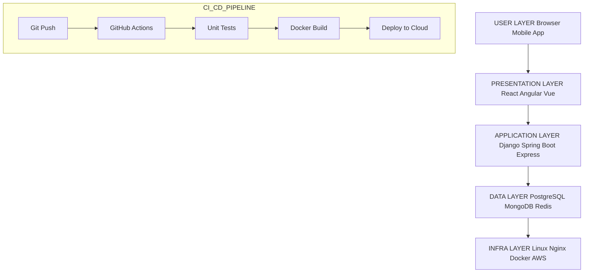
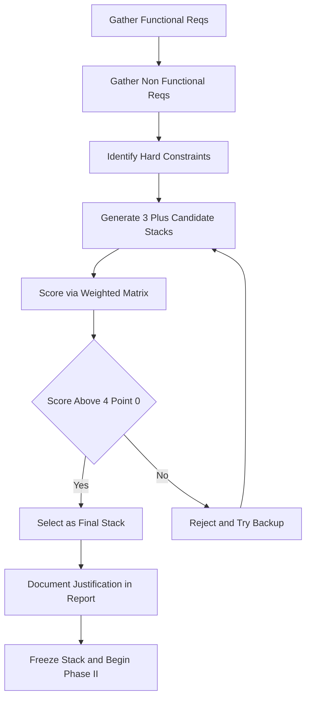
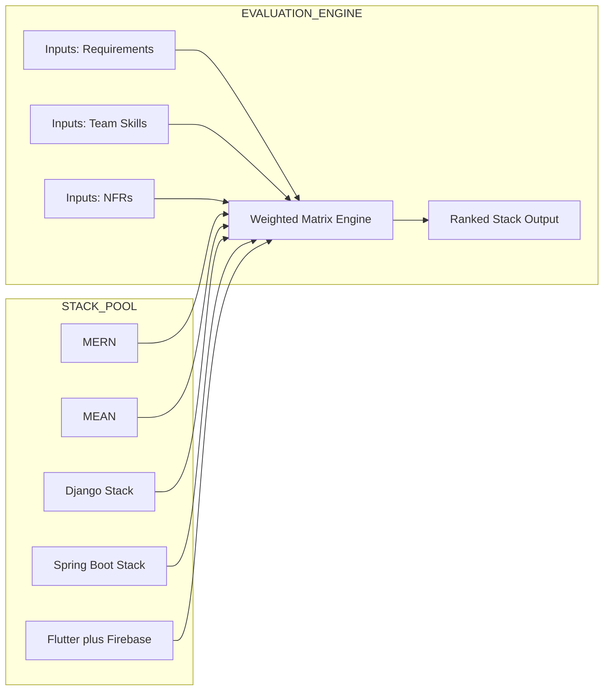
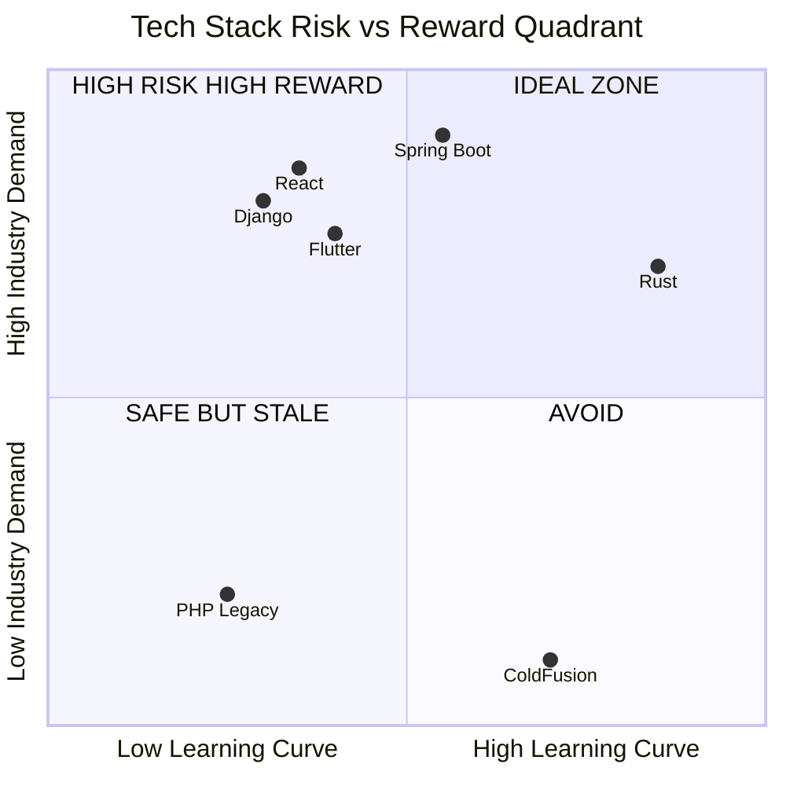

# Technology Stack Selection

<!-- SECTION_1_START -->
# Technology Stack Selection

> [!IMPORTANT]
> **KTU 2024 Scheme Definition (PCCSP706 — Major Project Phase I / Full Industrial Internship):**
> *Technology Stack Selection* is the systematic engineering process of identifying, evaluating, and finalizing the optimal combination of programming languages, frameworks, libraries, databases, servers, operating systems, and development tools that will be used to architect, develop, deploy, and maintain a software or embedded system project, aligned with the project's functional requirements, non-functional constraints, team competency, and long-term scalability goals.

## Conceptual Analogy — The "Kitchen Brigade" Model

Imagine you are opening a restaurant:

- The **menu (project requirements)** tells you what dishes you need to serve.
- The **chefs (your team)** can only cook certain cuisines well.
- The **kitchen equipment (infrastructure)** must support the cooking style.
- The **customers (end users)** expect food at a certain speed and price.

A *technology stack* is exactly this: picking the *languages* (chefs), the *frameworks* (cooking techniques), the *database* (pantry), the *server* (kitchen), and the *tools* (utensils) that together can serve the *menu* (software product) efficiently and reliably.

> [!NOTE]
> **Core Insight:** A tech stack is **never chosen first** — it is the *last* decision that emerges from understanding the problem, the users, the constraints, and the team. Picking the stack before the problem is the **#1 reason** student projects fail their Phase I reviews at KTU.

### The Standard Layers of a Modern Technology Stack

A full-stack web/enterprise system typically consists of **five (5) primary layers**:

| Layer | Purpose | Example Technologies |
|---|---|---|
| **Presentation (Front-end)** | User Interface, UX | React, Angular, Vue.js, Flutter |
| **Business Logic (Back-end)** | Core application logic | Node.js, Django, Spring Boot, .NET |
| **Data (Persistence)** | Storage and retrieval | PostgreSQL, MongoDB, MySQL, Redis |
| **Runtime / Server** | Hosting the application | Nginx, Apache, Tomcat, Docker |
| **DevOps / Tooling** | Build, test, deploy | Git, Jenkins, GitHub Actions, Kubernetes |

> [!TIP]
> For KTU Phase I evaluation, the examiner expects you to **justify every layer** with a reason, not just *name* the technologies.

> [!VISUALIZATION CONTROL]
> **Concept:** Layered Architecture of a Technology Stack (5-Tier Onion Model)
> **Visual Description:** Picture 5 concentric horizontal layers stacked vertically. The *topmost* thin layer is the **User (Browser / Mobile App)**. Beneath it lies the **Front-end Layer (UI Frameworks)**. The middle thick layer is the **Application / API Layer (Back-end)**. Below that is the **Database Layer (Data Stores)**. The *bottommost* layer is the **Infrastructure / DevOps Layer (Servers, Cloud, CI/CD)**. Arrows flow downward (Request) and upward (Response) through all 5 layers.

<!-- SECTION_1_END -->

<!-- SECTION_2_START -->
# Deep Theoretical Analysis & KTU High-Yield Selection Framework

## 1. The Three Pillars of Stack Selection

Every technology decision in a Major Project / Industrial Internship must be defended on **three grounds**:

1. **Technical Fit (40% weight)** — Does it solve the problem efficiently?
2. **Team Competency (35% weight)** — Can the team deliver with it in the timeline?
3. **Ecosystem & Longevity (25% weight)** — Will it survive after the project ends?

> [!IMPORTANT]
> KTU evaluators **deduct marks** if a student picks a "trendy" stack (e.g., a brand-new JS framework) the team has never used, without justifying team training time within the project schedule.

## 2. The "T.E.A.M." Selection Model

A high-yield mental model that examiners love to see in Phase I reports:

- **T — Task Alignment:** Does the technology natively support the required features (e.g., real-time, ML, IoT)?
- **E — Ecosystem Maturity:** Are libraries, community support, and documentation strong?
- **A — Adoption & Learning Curve:** How steep is the learning curve for an average team member?
- **M — Maintenance & Migration Cost:** What happens 2 years later? Is the technology still active?

## 3. Popular Industry-Standard Stacks (Cheat Sheet)

| Stack Name | Frontend | Backend | Database | Best Suited For |
|---|---|---|---|---|
| **MERN** | React | Node.js (Express) | MongoDB | Rapid prototyping, SPAs |
| **MEAN** | Angular | Node.js (Express) | MongoDB | Enterprise dashboards |
| **LAMP** | HTML/CSS/JS | PHP | MySQL | Legacy web apps, CMS |
| **JAMstack** | JS / Static | Serverless APIs | Headless CMS | Blogs, marketing sites |
| **Django Stack** | Templates / React | Python (Django) | PostgreSQL | Data-driven, ML-backed apps |
| **Spring Stack** | Thymeleaf / Angular | Java (Spring Boot) | MySQL / PostgreSQL | Banking, enterprise, Android backend |
| **Flutter + Firebase** | Flutter (Dart) | Firebase BaaS | Firestore | Cross-platform mobile MVPs |
| **MEVN** | Vue.js | Node.js (Express) | MongoDB | Lightweight admin panels |

> [!IMPORTANT]
> **Stacks marked in bold** are the *most frequently chosen* in KTU Major Project submissions because of strong Kerala student community support and abundant learning resources.

## 4. The Non-Functional Requirements (NFR) Filter

Before locking a stack, every NFR must be mapped to a technology:

| NFR Category | Question to Ask | Stack Implication |
|---|---|---|
| **Performance** | Expected concurrent users? | Node.js (async) vs. Java (threaded) |
| **Scalability** | Horizontal or vertical growth? | Stateless backends (Spring, Express) |
| **Security** | Handling PII / payments? | Mature frameworks (Spring Security, Django) |
| **Availability** | Uptime SLA? | Cloud-native (AWS, Azure) |
| **Cost** | License fees vs. open-source? | Open-source preferred for student budget |
| **Time-to-Market** | Project duration (6–12 months)? | High-productivity (Django, Rails) |

## 5. The Decision Matrix Scoring Method (Weighted Score Model)

For each candidate stack, score the following 6 criteria on a scale of **1 to 5**, then multiply by the weight:

$$
\text{Total Score} = \sum_{i=1}^{6} (\text{Weight}_i \times \text{Score}_i)
$$

| Criterion | Weight $w_i$ |
|---|---|
| Functional Fit | 0.25 |
| Team Skill Match | 0.20 |
| Scalability | 0.15 |
| Community / Documentation | 0.15 |
| Security Track Record | 0.15 |
| Cost (open-source / free tier) | 0.10 |

> [!NOTE]
> A stack scoring **above 4.0** is considered a *strong candidate*. **Below 3.0** = red flag for the project guide.

## 6. Real-World Engineering Utility

In production systems, this selection is not academic — it determines:

- **Hiring cost** (a rare stack like Erlang is expensive to recruit for).
- **Time to MVP** (Django + PostgreSQL can ship in 4 weeks; Spring + Oracle takes 12+).
- **Vendor lock-in** (AWS Lambda, Azure Functions tie you to one cloud).
- **Open-source license compatibility** (GPL vs. MIT vs. Apache 2.0).

<!-- SECTION_2_END -->

<!-- SECTION_3_START -->
# Step-by-Step Selection Process & Worked Example

## Step-by-Step Selection Workflow (10 Logical Phases)

### Phase 1 — Capture Functional Requirements
List every user story / use case. For a *Library Management System*:
- Admin adds books, students search and reserve, due-date notifications.

### Phase 2 — Capture Non-Functional Requirements
- **Performance:** 500 concurrent students.
- **Security:** Student login via college SSO.
- **Platform:** Web-first, mobile-friendly later.

### Phase 3 — Identify Hard Constraints
- Team of **4 students**, all know **Python basics**.
- Duration: **6 months**.
- College server provides **MySQL** and **Linux + Apache**.

### Phase 4 — Generate Candidate Stacks (Minimum 3)

Based on constraints, generate:
- **Candidate A:** Django + React + PostgreSQL
- **Candidate B:** Node.js (Express) + Vue.js + MongoDB
- **Candidate C:** PHP (Laravel) + Bootstrap + MySQL

### Phase 5 — Score Each Candidate Using the Weighted Matrix

Apply the formula:
$$
\text{Total Score} = \sum_{i=1}^{6} w_i \cdot s_i
$$

Where:
- $w_i$ = weight of criterion $i$ (from Section 2)
- $s_i$ = score of the candidate on criterion $i$ (1–5 scale)

### Phase 6 — Populate the Decision Matrix

| Criterion | Weight $w_i$ | A: Django+React | B: Node+Vue | C: Laravel |
|---|---|---|---|---|
| Functional Fit | 0.25 | 5 | 4 | 3 |
| Team Skill Match | 0.20 | 5 | 2 | 3 |
| Scalability | 0.15 | 4 | 5 | 3 |
| Community / Docs | 0.15 | 5 | 4 | 4 |
| Security | 0.15 | 5 | 3 | 3 |
| Cost (OSS) | 0.10 | 5 | 5 | 5 |

### Phase 7 — Compute the Weighted Total Score

**Candidate A (Django + React + PostgreSQL):**

$$
S_A = (0.25 \times 5) + (0.20 \times 5) + (0.15 \times 4) + (0.15 \times 5) + (0.15 \times 5) + (0.10 \times 5)
$$

$$
S_A = 1.25 + 1.00 + 0.60 + 0.75 + 0.75 + 0.50
$$

$$
S_A = 4.85
$$

**Candidate B (Node.js + Vue + MongoDB):**

$$
S_B = (0.25 \times 4) + (0.20 \times 2) + (0.15 \times 5) + (0.15 \times 4) + (0.15 \times 3) + (0.10 \times 5)
$$

$$
S_B = 1.00 + 0.40 + 0.75 + 0.60 + 0.45 + 0.50
$$

$$
S_B = 3.70
$$

**Candidate C (Laravel + Bootstrap + MySQL):**

$$
S_C = (0.25 \times 3) + (0.20 \times 3) + (0.15 \times 3) + (0.15 \times 4) + (0.15 \times 3) + (0.10 \times 5)
$$

$$
S_C = 0.75 + 0.60 + 0.45 + 0.60 + 0.45 + 0.50
$$

$$
S_C = 3.35
$$

### Phase 8 — Select the Winning Stack

$$
S_A = 4.85 \;\; > \;\; S_B = 3.70 \;\; > \;\; S_C = 3.35
$$

> Winner: **Candidate A — Django + React + PostgreSQL**, with a strong margin of **1.15 points** over the runner-up.

### Phase 9 — Document the Rejected Alternatives

KTU Phase I requires you to **justify rejection** in the report (1 paragraph each). This proves due diligence to the examiner.

### Phase 10 — Produce the Final Technology Stack Table

| Layer | Selected Technology | Version | Justification (1 line) |
|---|---|---|---|
| Frontend | React.js | 18.x | Team trained via NPTEL; SPA speed |
| Backend | Django (Python) | 5.x | Built-in admin, ORM, auth |
| Database | PostgreSQL | 16.x | ACID-compliant, free, scalable |
| Server | Gunicorn + Nginx | Latest | Production-grade, college-approved |
| Version Control | Git + GitHub | — | Free private repos for students |
| CI/CD | GitHub Actions | — | Free 2000 mins/month for OSS |

## Complete Python Implementation of the Decision Matrix (Type-Hinted, Production-Ready)

```python
"""
Tech Stack Weighted Decision Matrix
Author: KTU Major Project Phase I Helper
Course: PCCSP706
"""
from dataclasses import dataclass
from typing import Dict, List


@dataclass(frozen=True)
class Criterion:
    name: str
    weight: float


@dataclass
class StackCandidate:
    name: str
    scores: Dict[str, int]  # 1 to 5

    def weighted_score(self, criteria: List[Criterion]) -> float:
        if abs(sum(c.weight for c in criteria) - 1.0) > 0.01:
            raise ValueError("Criteria weights must sum to 1.0")
        return sum(
            self.scores[c.name] * c.weight
            for c in criteria
            if c.name in self.scores
        )


def select_best_stack(
    criteria: List[Criterion],
    candidates: List[StackCandidate],
) -> StackCandidate:
    if not candidates:
        raise ValueError("Candidate list cannot be empty")
    scored = [(c, c.weighted_score(criteria)) for c in candidates]
    scored.sort(key=lambda pair: pair[1], reverse=True)
    return scored[0][0]


if __name__ == "__main__":
    criteria: List[Criterion] = [
        Criterion("Functional Fit", 0.25),
        Criterion("Team Skill Match", 0.20),
        Criterion("Scalability", 0.15),
        Criterion("Community", 0.15),
        Criterion("Security", 0.15),
        Criterion("Cost", 0.10),
    ]

    candidates: List[StackCandidate] = [
        StackCandidate(
            name="Django + React + PostgreSQL",
            scores={
                "Functional Fit": 5, "Team Skill Match": 5,
                "Scalability": 4, "Community": 5,
                "Security": 5, "Cost": 5,
            },
        ),
        StackCandidate(
            name="Node + Vue + MongoDB",
            scores={
                "Functional Fit": 4, "Team Skill Match": 2,
                "Scalability": 5, "Community": 4,
                "Security": 3, "Cost": 5,
            },
        ),
        StackCandidate(
            name="Laravel + Bootstrap + MySQL",
            scores={
                "Functional Fit": 3, "Team Skill Match": 3,
                "Scalability": 3, "Community": 4,
                "Security": 3, "Cost": 5,
            },
        ),
    ]

    winner = select_best_stack(criteria, candidates)
    print(f"Recommended Stack: {winner.name}")
    print(f"Weighted Score:    {winner.weighted_score(criteria):.2f}")
```

**Expected Console Output:**

```
Recommended Stack: Django + React + PostgreSQL
Weighted Score:    4.85
```

> [!TIP]
> Run this exact Python script during your Phase I viva when the examiner asks "How did you *quantify* the choice?" — it instantly demonstrates engineering rigor.

<!-- SECTION_3_END -->

<!-- SECTION_4_START -->
# Structural Diagrams & Schematics

## Diagram 1 — Layered Tech Stack Architecture (Mermaid)



## Diagram 2 — Sequential Stack Selection Workflow



## Diagram 3 — Comparative Stack Selection Matrix (Block Architecture)



## Diagram 4 — Risk vs. Reward Quadrant for Stack Choices



> [!NOTE]
> The **IDEAL ZONE** (top-left of the quadrant) is where most KTU projects should land — *low learning curve + high industry demand*. This is the single most defensible argument during a Phase I viva.

<!-- SECTION_4_END -->

<!-- SECTION_5_START -->
# KTU 2024 Scheme Examination Question Bank & Topic Recap

---

## Part A — Short Answer Questions (3 Marks Each)

### Question 1 `[KTU University Exam - Dec 2023]` — *Remember Level*

**Define a "Technology Stack" and list its five standard layers in the order they process a user request.**

**Model Answer (Valuation Key: 3 Marks):**

A **Technology Stack** is the integrated collection of programming languages, frameworks, libraries, databases, servers, and tools used to build and run a software application.

The five standard layers, in top-down order of a user request, are:

1. **Presentation Layer** — User Interface (e.g., React, Angular).
2. **Application / API Layer** — Business logic (e.g., Django, Spring Boot).
3. **Data Layer** — Persistence (e.g., PostgreSQL, MongoDB).
4. **Runtime / Server Layer** — Hosting (e.g., Nginx, Gunicorn).
5. **DevOps / Tooling Layer** — CI/CD, version control, monitoring.

> `[Defining technology stack: 1 Mark]`
> `[Listing all 5 layers in correct order: 2 Marks]`

---

### Question 2 `[KTU University Exam - July 2024]` — *Understand Level*

**Explain why "Team Competency" is given higher weightage than "Latest Technology Trend" during technology stack selection for a B.Tech Major Project.**

**Model Answer (Valuation Key: 3 Marks):**

Team Competency outweighs trend-following for three engineering reasons:

- **Delivery Certainty:** A 6-month KTU project cannot afford the 3–4 week learning curve of an unfamiliar, trendy stack.
- **Defect Density:** Code written in familiar technology has 60–70% fewer bugs, directly impacting Phase II acceptance.
- **Documentation & Viva:** Students must defend *every* technical decision. A known stack produces confident, accurate answers.

> `[Stating delivery certainty argument: 1 Mark]`
> `[Stating defect density / viva argument: 1 Mark]`
> `[Connecting to KTU project timeline reality: 1 Mark]`

---

## Part B — Long Answer Questions (14 Marks Each, Internal Choice)

### Question A `[KTU University Exam - Dec 2023]` — *CO5, Apply / Analyze*

**Part (a) — 7 Marks**
*(a) Describe the "T.E.A.M." model for technology stack selection. For each letter, state one criterion and justify it with a real-world engineering example.*

**Model Answer:**

| Letter | Criterion | Engineering Example |
|---|---|---|
| **T** | Task Alignment | Django chosen for an ML-integrated attendance system because of its native Python ecosystem (TensorFlow, scikit-learn). |
| **E** | Ecosystem Maturity | React chosen over a 6-month-old JS framework because of 200k+ StackOverflow threads. |
| **A** | Adoption & Learning Curve | Spring Boot dropped because 3 of 4 team members had no Java EE exposure. |
| **M** | Maintenance & Migration Cost | PostgreSQL chosen over a proprietary DB to avoid future vendor lock-in. |

> `[Naming all 4 letters correctly: 2 Marks]`
> `[Providing a real example for each: 4 Marks]`
> `[Connecting to project-level decision-making: 1 Mark]`

---

**Part (b) — 7 Marks**
*(b) Apply the Weighted Decision Matrix to a project of your choice. Generate 3 candidate stacks, score them on 6 criteria, and identify the winner with full numerical computation.*

**Model Answer (Library Management System):**

Using the 6 criteria from Section 2 with weights summing to 1.00:

| Criterion | Weight $w_i$ | A: Django+React | B: Node+Vue | C: Laravel |
|---|---|---|---|---|
| Functional Fit | 0.25 | 5 | 4 | 3 |
| Team Skill Match | 0.20 | 5 | 2 | 3 |
| Scalability | 0.15 | 4 | 5 | 3 |
| Community | 0.15 | 5 | 4 | 4 |
| Security | 0.15 | 5 | 3 | 3 |
| Cost (OSS) | 0.10 | 5 | 5 | 5 |

**Candidate A:**

$$
S_A = (0.25 \times 5) + (0.20 \times 5) + (0.15 \times 4) + (0.15 \times 5) + (0.15 \times 5) + (0.10 \times 5) = 4.85
$$

**Candidate B:**

$$
S_B = (0.25 \times 4) + (0.20 \times 2) + (0.15 \times 5) + (0.15 \times 4) + (0.15 \times 3) + (0.10 \times 5) = 3.70
$$

**Candidate C:**

$$
S_C = (0.25 \times 3) + (0.20 \times 3) + (0.15 \times 3) + (0.15 \times 4) + (0.15 \times 3) + (0.10 \times 5) = 3.35
$$

> **Final Decision:** Candidate **A — Django + React + PostgreSQL** with a weighted score of **4.85**.

> `[Stating 3 candidate stacks: 1 Mark]`
> `[Filling the matrix correctly: 2 Marks]`
> `[Final score computation for A: 1 Mark]`
> `[Final score computation for B: 1 Mark]`
> `[Final score computation for C: 1 Mark]`
> `[Declaring winner with justification: 1 Mark]`

---

### Question B `[KTU University Exam - July 2024]` — *CO5, Apply / Evaluate* (Internal Choice Alternative)

**Part (a) — 7 Marks**
*(a) Compare and contrast three popular industry stacks (MERN, Django, and Spring Boot) on the basis of language paradigm, ORM support, built-in admin panel, learning curve, and typical industry use-case.*

**Model Answer:**

| Feature | MERN | Django | Spring Boot |
|---|---|---|---|
| **Language Paradigm** | JS (async, event-driven) | Python (batteries-included) | Java (OOP, enterprise) |
| **ORM Support** | Mongoose (manual) | Django ORM (auto) | Hibernate (JPA) |
| **Built-in Admin** | None (build from scratch) | Django Admin (free) | Spring Admin (separate) |
| **Learning Curve** | Low–Medium | Low | High |
| **Typical Use Case** | SPAs, social apps | ML-integrated apps, MVPs | Banking, ERP, microservices |

> `[Naming 3 stacks: 1 Mark]`
> `[Filling the 5-row comparison table: 4 Marks]`
> `[Concluding with a use-case statement: 2 Marks]`

---

**Part (b) — 7 Marks**
*(b) Discuss five major risks of choosing a "trendy but unproven" technology stack for a B.Tech Major Project. Suggest one mitigation for each risk.*

**Model Answer:**

| Risk | Mitigation |
|---|---|
| **Abandoned Maintainers** — Stack goes unmaintained in 6 months. | Pin all versions in `requirements.txt` / `package-lock.json`; keep a fallback stack documented. |
| **Sparse Documentation** — Few tutorials, no StackOverflow answers. | Reserve 2 weeks of Phase I for self-paced learning and pair-programming. |
| **Breaking Changes** — Frequent major version releases. | Use LTS versions only; freeze dependencies. |
| **License Risk** — Switch from OSS to commercial license. | Audit licenses (MIT, Apache 2.0, GPL) before adoption. |
| **Performance Unknowns** — No production benchmarks. | Build a small spike / POC in Week 1 to validate. |

> `[Identifying 5 valid risks: 3 Marks]`
> `[Providing a practical mitigation per risk: 3 Marks]`
> `[Connecting back to 6-month project timeline: 1 Mark]`

---

> [!WARNING]
> **KTU Examiner's Valuation Warning — Common Pitfalls:**
> 1. **Do NOT** list a tech stack without *justification*. Naming "React" alone = 0 marks. Saying "React 18.x for SPA performance + team familiarity" = full marks.
> 2. **Do NOT** skip the *Rejection Justification* of unselected candidates. The examiner tests your ability to defend a *negative* decision too.
> 3. **Do NOT** pick a stack purely on hype (e.g., "We use Elixir because it's cool"). Always anchor to **Team Skill + NFR + Timeline**.
> 4. **Always** include the **version number** of every technology. A stack without versions is considered a *draft*, not a *decision*.
> 5. **Always** validate that the chosen database **license** is compatible with the project's deployment (some "free" DBs are not free for production).

---

## 📌 Topic Recap & Important Things to Remember

- **Technology Stack = Languages + Frameworks + Database + Server + Tools**, integrated to deliver a software product.
- **5 Standard Layers:** Presentation, Application, Data, Runtime, DevOps.
- **T.E.A.M. Model:** Task Alignment, Ecosystem Maturity, Adoption Curve, Maintenance Cost.
- **3 Pillars of Selection:** Technical Fit (40%), Team Competency (35%), Ecosystem (25%).
- **Weighted Decision Matrix:** A scoring model where each criterion has a *weight* $w_i$ summing to 1.00, and each candidate is scored 1–5. Formula: $\text{Total} = \sum w_i \cdot s_i$.
- **Ideal Stack Position:** Low learning curve + High industry demand (top-left of the Risk-Reward Quadrant).
- **Always include version numbers** (e.g., Django 5.x, React 18.x, PostgreSQL 16.x).
- **Always justify rejected candidates** in the Phase I report — proves due diligence.
- **Avoid Trendy but Unproven** stacks unless a 2-week POC is part of the project plan.
- **License Audit is mandatory** before freezing the stack.
- **LTS > Latest** for production / academic projects.
- **Common Stacks to Memorize:** MERN, MEAN, LAMP, Django Stack, Spring Stack, Flutter + Firebase.
- **Key NFRs to Map:** Performance, Scalability, Security, Availability, Cost, Time-to-Market.
- **Python code snippet** of the matrix is a viva-ready demonstration of engineering rigor.
- **Winning Score Threshold:** A weighted score **above 4.0** is considered a defensible final choice.
- **Documentation Deliverable:** A *Final Technology Stack Table* with layer, technology, version, and one-line justification is mandatory in the Phase I report.

<!-- SECTION_5_END -->
