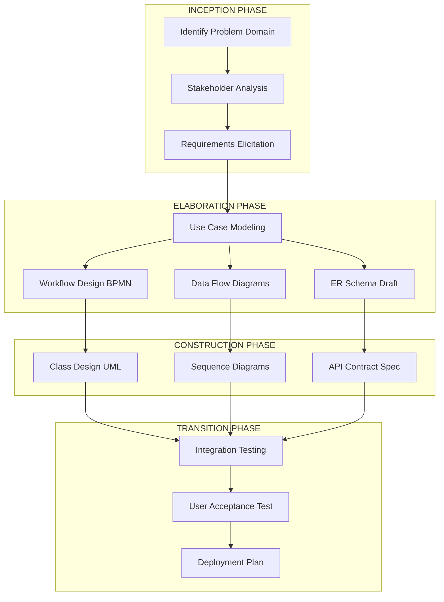
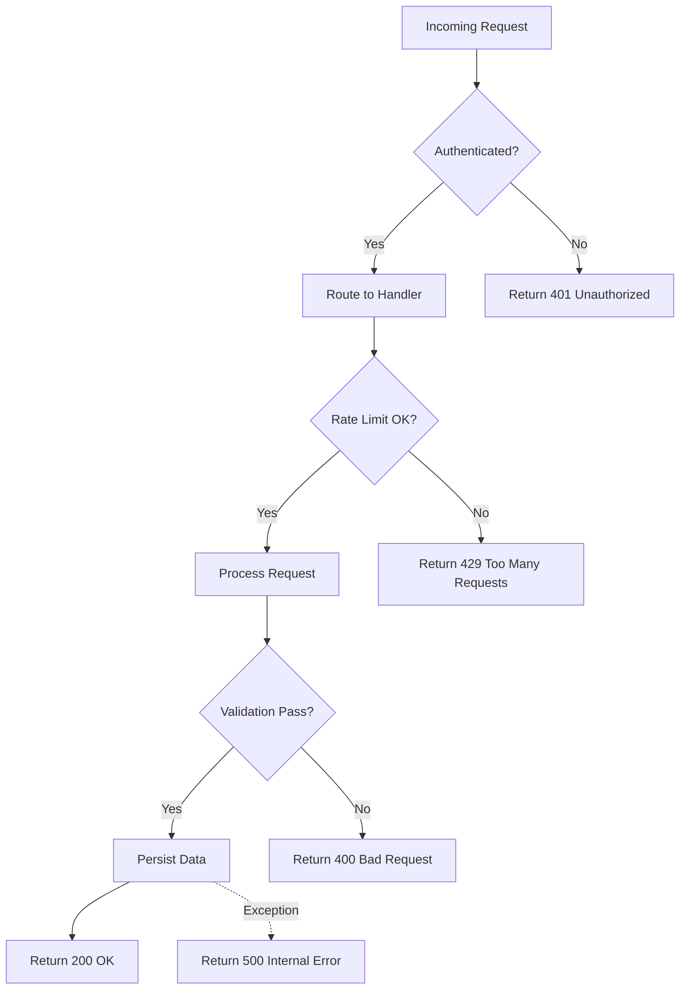
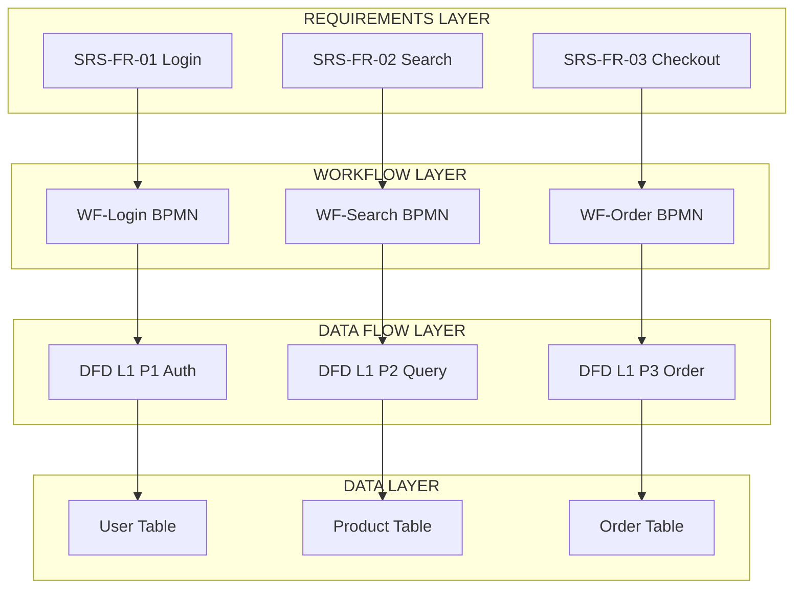
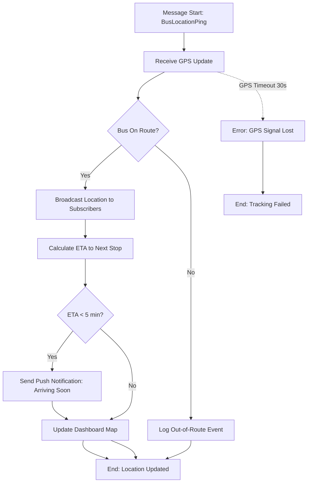
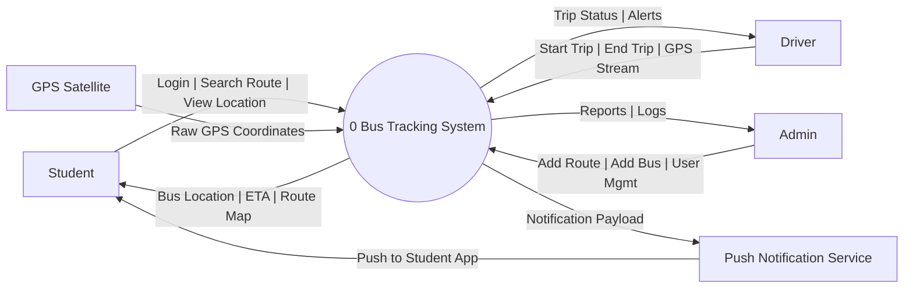
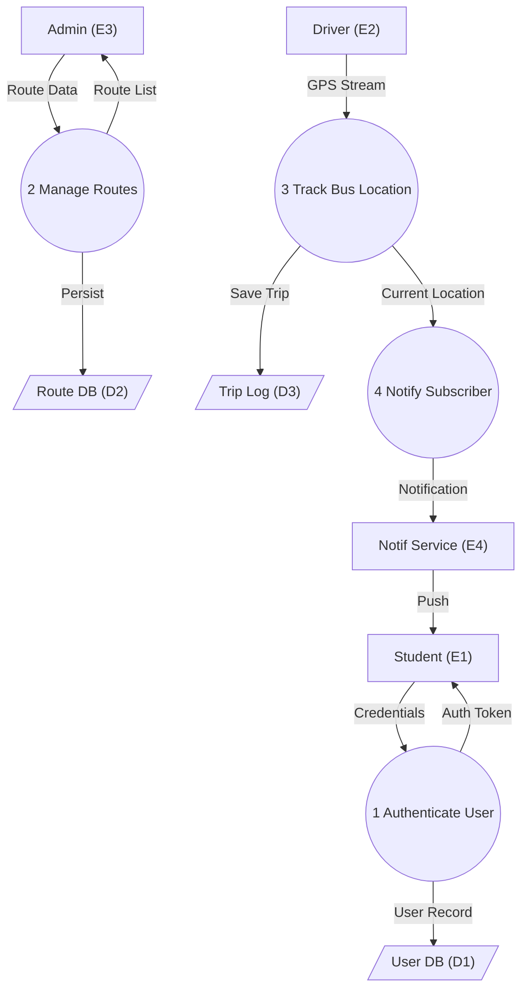
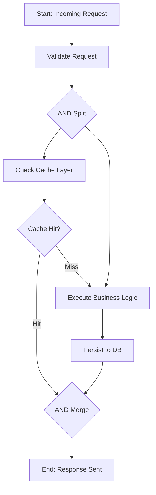

# Workflow and Process Design

<!-- SECTION_1_START -->

# Module 2: High-Level System Design — Workflow and Process Design

> [!NOTE]
> **KTU 2024 Scheme Context (PCCSP706 — Major Project Phase I / Full Industrial Internship)**
> Workflow and Process Design is the bridge between abstract system requirements and concrete software/hardware architecture. In the KTU Major Project framework, this module is assessed via the **Project Diary Review**, **Mid-Term Evaluation (Phase I — 50 marks)**, and the **final Phase I Report (50 marks)**. Strong workflow artifacts directly influence your Phase II implementation continuity.

---

## 1.1 Formal Definition (KTU 2024 Syllabus Terminology)

**Workflow Design** is the systematic decomposition of business, operational, or computational activities into a structured sequence of tasks, decision points, data flows, and control rules that collectively achieve a defined objective. It is governed by three primary parameters: **Actors (Who)**, **Activities (What)**, and **Precedence Constraints (When/Order)**.

**Process Design** is the engineered specification of the inputs, transformation logic, outputs, control mechanisms, and resource allocations required to convert raw requirements into a deployable system artifact. In software engineering, this is formalized through **BPMN 2.0 (Business Process Model and Notation)**, **UML Activity Diagrams**, **Data Flow Diagrams (DFD)**, and **Petri Nets**.

Mathematically, a workflow is a directed graph:

$$W = (N, E, \sigma, \tau)$$

Where:
- $N$ = set of nodes (tasks, events, gateways)
- $E \subseteq N \times N$ = set of directed edges (transitions)
- $\sigma$ = state-transition function
- $\tau$ = temporal/sequential constraint

> [!IMPORTANT]
> **Syllabus Highlight (CO2 — PCCSP706):** Students must demonstrate the ability to **"Architect the high-level design of the proposed system, including workflow diagrams, DFDs (Level-0 and Level-1), and process flowcharts that are traceable to functional and non-functional requirements collected in Module 1."**

---

## 1.2 Conceptual Analogy — The Hospital Patient Flow

Imagine a **multi-specialty hospital** processing a patient from arrival to discharge. The patient is not a person here; the patient is a **data packet** or **work item**.

- **Reception Desk** = *Start Event* (entry node)
- **Triage Nurse** = *Validation/Filter Task* (rules engine)
- **Doctor Consultation OR Lab Test** = *Exclusive Gateway* (decision point)
- **Pharmacy OR Surgery Scheduling** = *Parallel Gateway* (concurrent branches)
- **Discharge Counter** = *End Event* (terminal node)
- **Hospital SOP Manual** = *Process Rules / SLA Constraints*

The **workflow** is the *physical routing of the patient* through the hospital. The **process** is the *set of rules, forms, timeouts, and approvals* that govern what happens at each desk. If you automate this hospital, you have designed a **Hospital Management System (HMS)** — the workflow and process design is what makes the system *work* rather than just *exist*.

> [!TIP]
> **Intuition Pump:** Workflow answers *"Who does what, in what order, and under what conditions?"*. Process Design answers *"What data is touched, what rules apply, and what is the SLA at each step?"*. Together, they form the **executable backbone** of any engineered system.

---

## 1.3 Core Metrics Used in Workflow Engineering

The following metrics are **industry-standard KPIs** (Key Performance Indicators) used in BPM (Business Process Management) and process engineering. KTU evaluators expect these to appear in your Phase I report's **Design Chapter**.

| Metric | Symbol | Unit | Definition |
|---|---|---|---|
| **Cycle Time** | $T_c$ | seconds/minutes | Total elapsed time from process start to end |
| **Lead Time** | $T_l$ | seconds/minutes | Time from request submission to delivery |
| **Throughput** | $\lambda$ | tasks/hour | Number of work items completed per unit time |
| **Bottleneck Utilization** | $\rho$ | percentage (0–100%) | Resource saturation at the most constrained node |
| **Process Efficiency** | $\eta$ | percentage | Ratio of value-added time to total cycle time |
| **Error/Defect Rate** | $D$ | defects per thousand (DPK) | Failed tasks per 1000 executions |

> [!WARNING]
> **KTU Examiner's Pitfall:** Students often confuse *Cycle Time* with *Lead Time*. **Cycle Time** starts when work begins on an item. **Lead Time** starts when the request is *submitted*. Always annotate the **trigger event** in your diagram.

---

## 1.4 Standard Modeling Notations (KTU-Accepted)

KTU Phase I reports accept the following notations. The choice must be **declared in the Methodology Chapter** and used **consistently**.

- **BPMN 2.0** — preferred for business/process workflows
- **UML Activity Diagrams** — preferred for software object behavior
- **Data Flow Diagrams (DFD)** — preferred for information systems
- **Flowcharts (ISO 5807)** — preferred for algorithmic/embedded logic
- **Swimlane Diagrams** — preferred for multi-actor responsibility mapping

> [!VISUALIZATION CONTROL]
> **Concept:** Generic Process Flow with Decision and Loop
> **Desmos Input Equations (parametric t ∈ [0, 12]):**
> * `x_1(t) = 2 + 0.5t`, `y_1 = 4` — *Start to Task A*
> * `x_2(t) = 5 + 0.5t`, `y_2(t) = 4 - 0.8t` — *Task A to Decision*
> * `x_3(t) = 8 + 0.5t`, `y_3 = 1.5` — *Decision(Yes) to End*
> * `x_4(t) = 8 + 0.5t`, `y_4(t) = 1.5 + 0.5t` — *Decision(No) to Loopback*
> **Visual Description:** Observe the diamond-shaped decision node (≈ x=8, y=2.5) where flow bifurcates. The *Yes* branch terminates at the End Event (x≈10, y=1.5), while the *No* branch loops back to Task A — visually demonstrating **iterative process control**.

---

<!-- SECTION_1_END -->

<!-- SECTION_2_START -->

# 2. Deep Theoretical Analysis — Workflow & Process Design

## 2.1 Theoretical Foundations

### 2.1.1 The Three Pillars of Process Design

> [!IMPORTANT]
> Every workflow in a KTU Major Project is engineered along three orthogonal axes. Failure to address all three is the **#1 reason** for Phase I reports being returned for revision.

**Pillar 1 — Functional Decomposition (What happens?)**
- Hierarchical Task Analysis (HTA)
- Top-Down Modular Decomposition
- Function Point Analysis (FPA)

**Pillar 2 — Control Flow (In what order?)**
- Sequence, Selection (XOR), Parallelism (AND), Iteration (LOOP)
- Precedence graphs and partial orderings
- Deadlock detection via circular wait analysis

**Pillar 3 — Data & Resource Flow (With what?)**
- Data Flow Diagrams (DFD) — Yourdon/DeMarco notation
- Entity-Relationship (ER) data models
- Resource allocation matrices (RAM)

---

### 2.1.2 The Workflow Design Methodology (KTU 2024 Aligned)

The recommended **5-step iterative methodology** for KTU Major Projects is:

1. **Identify the Use Case Scope** — Bind the workflow to one or more SRS use cases (from Module 1).
2. **Enumerate Tasks (Activity Decomposition)** — Break the use case into atomic tasks using HTA.
3. **Assign Actors (Swimlane Mapping)** — Map each task to a human role, system component, or external service.
4. **Define Control Logic (Gateway Specification)** — Specify decision rules, parallel branches, and exception paths.
5. **Validate via Simulation/Traceability** — Walk-through with stakeholders, verify against acceptance criteria.

---

### 2.1.3 BPMN 2.0 Core Element Taxonomy

BPMN 2.0 (Object Management Group standard) is the **gold standard** for workflow documentation. KTU evaluators reward BPMN use because it is tool-agnostic and industry-accepted.

| Category | Element | Symbol | Purpose |
|---|---|---|---|
| **Flow Objects** | Start Event | ● (green) | Process entry point |
| | Intermediate Event | ◐ (yellow) | Waiting for a trigger |
| | End Event | ● (red, thick) | Process termination |
| | Task (Atomic) | ▭ (rounded) | Single unit of work |
| | Sub-Process | ▭⊕ (rounded with +) | Compound activity |
| **Gateways** | Exclusive (XOR) | ◇ with × | One-of-many path |
| | Parallel (AND) | ◇ with + | All paths simultaneously |
| | Inclusive (OR) | ◇ with ○ | One-or-more paths |
| | Event-Based | ◇ with pentagon | Triggered by event |
| **Swimlanes** | Pool | Large rectangle | Organization/actor boundary |
| | Lane | Horizontal sub-rectangle | Role within organization |
| **Artifacts** | Data Object | 📄 | Document/data input/output |
| | Annotation | 📝 | Free-text comment |

---

## 2.2 KTU High-Yield Formula Sheet

> [!NOTE]
> The following equations are **must-know** for Phase I quantitative analysis. They appear in viva-voce and Project Diary reviews.

### 2.2.1 Throughput & Cycle Time Equations

For a single-stage process with exponential service time (M/M/1 queue analogy):

$$\rho = \frac{\lambda}{\mu} \quad \text{where } \rho < 1 \text{ for stability}$$

$$T_c = \frac{1}{\mu - \lambda}$$

$$L = \frac{\rho}{1 - \rho} \quad \text{(average queue length by Little's Law)}$$

For a multi-stage workflow with $n$ sequential stages:

$$T_{c,total} = \sum_{i=1}^{n} T_{c,i}$$

For parallel stages (AND-split), total time = **max** of parallel branch times:

$$T_{c,parallel} = \max(T_{c,1}, T_{c,2}, \ldots, T_{c,k})$$

### 2.2.2 Process Efficiency Equation

$$\eta = \frac{\sum T_{value\text{-}added}}{T_c} \times 100\%$$

### 2.2.3 Function Point Analysis (Albrecht's Method)

$$FP = UFP \times VAF$$

Where:
- $UFP$ = Unadjusted Function Points (sum of 5 complexity weights)
- $VAF$ = Value Adjustment Factor (from 14 General System Characteristics)

$$VAF = 0.65 + 0.01 \times \sum_{i=1}^{14} FI_i$$

> [!IMPORTANT]
> **Units Convention:** All time units must be declared in the figure caption. Standard KTU convention: **seconds** for software, **minutes/hours** for human-centric workflows.

---

## 2.3 Real-World Engineering Utility

> [!TIP]
> **Production Industry Mapping:** Workflow and Process Design is not academic. It is the **first line of defense against cost overrun and schedule slip** in real engineering projects.

| Industry Sector | Workflow Tool | Application |
|---|---|---|
| **Software/SaaS** | Camunda, Bizagi, IBM BPM | Order processing, CI/CD pipelines |
| **Manufacturing** | Siemens Plant Simulation | Assembly line balancing, Six Sigma |
| **Healthcare** | ProcessMaker, Appian | Patient triage, claims adjudication |
| **Finance/Banking** | Pega, Oracle BPM | Loan origination, KYC compliance |
| **Embedded/IoT** | Statecharts, UML State Machines | Sensor-actuator control loops |
| **Civil/Construction** | Primavera P6, MS Project | Gantt-chart resource scheduling |

**Direct KTU Relevance:** Your Phase I evaluator (typically a faculty guide + external expert) allocates **8–12 marks** in the Mid-Term Review specifically for *process/workflow artifacts*. A well-drawn BPMN diagram with swimlanes, decision rules, and a traceability matrix to SRS can single-handedly elevate a report from "Average" to "Excellent".

---

## 2.4 Common Process Design Anti-Patterns (Avoid These)

> [!WARNING]
> KTU evaluators explicitly mark down for these **workflow smells**:

1. **Spaghetti Process** — Uncontrolled cross-flows making the diagram unreadable. Use sub-processes to encapsulate complexity.
2. **Sink-or-Source Orphans** — Tasks with no incoming or outgoing edges. Every task must have a predecessor and successor (except Start/End).
3. **Implicit Decisions** — Decision points without explicit guards. Always annotate gateway conditions.
4. **Missing Exception Flow** — No error/timeout path. KTU requires at least one error boundary.
5. **No Swimlane Accountability** — A workflow without actors is *just a flowchart*. Use swimlanes for multi-actor projects.
6. **Untraceable Requirements** — Workflow tasks not linked back to SRS IDs. KTU mandates **bi-directional traceability**.

---

<!-- SECTION_2_END -->

<!-- SECTION_3_START -->

# 3. Step-by-Step Derivations, Worked Examples & Implementation

## 3.1 Worked Example 1 — DFD Level-0 (Context Diagram) for a Library Management System

> [!NOTE]
> This is the **canonical KTU example**. Library/Inventory/Student-Management systems are the most common KTU project domains. Master this pattern.

### Step 1: Identify the Single Process
The entire system is represented as **one central process** (circle, ID=0). Name it with an active verb-noun phrase.

$$\text{Process}_0 = \text{"Manage Library Operations"}$$

### Step 2: Enumerate External Entities
External entities are actors **outside** the system boundary. For LMS:

- **Student** — borrows/returns books
- **Librarian** — manages inventory, fines
- **Admin** — manages users, system config

### Step 3: Enumerate Data Flows
Identify all I/O data streams between the system and each entity.

| Flow ID | From | To | Data |
|---|---|---|---|
| $f_1$ | Student | System | Login credentials, search query |
| $f_2$ | System | Student | Book details, borrow status |
| $f_3$ | Librarian | System | Add/Update/Delete book request |
| $f_4$ | System | Librarian | Inventory report, overdue list |
| $f_5$ | Admin | System | User provisioning commands |
| $f_6$ | System | Admin | System audit logs |

### Step 4: Render the Context Diagram (Conceptual ASCII)

```
                +-----------------+
                |    Student      |
                +-----------------+
                  ^            |
                  | f2         | f1
                  | (Book info)| (Login)
                  v            v
       +------+----------------------------+
       | f4  |                              |  f3
       |(Inv)|  +--------PROCESS 0-------+  |(Book cmd)
       | Rpt)|  |  "Manage Library      |  |
       v      |   Operations"           |  ^
+------------+ +--------+---------------+  +-----------+
|            |          |  ^                 |           |
|  Librarian |          |  | f5 (Prov.)      |   Admin   |
|            |          |  |                 |           |
+------------+          v  +-------->+--------+-----------+
                              | f6 (Audit)        |
                              v                   v
                        +---------+         +-----------+
                        |  Audit  |         |  System   |
                        |  Logs   |         |  Config   |
                        +---------+         +-----------+
```

> [!TIP]
> **Marking Tip:** DFD Level-0 must show **only one central process**. The moment you decompose it into 3+ processes, you have drawn a **Level-1 DFD**, not Level-0. This is a common KTU error.

---

## 3.2 Worked Example 2 — BPMN Workflow for Online Order Fulfillment

### Scenario
**Use Case:** "Process Online Order" — A customer places an order on an e-commerce platform. The system must validate payment, allocate inventory, and dispatch via a logistics partner.

### Step-by-Step BPMN Construction

**Step 1: Define the Pool and Lanes**
Create one pool: *E-Commerce Platform*. Inside, three lanes:
- *Customer Interface*
- *Order Processing*
- *Logistics Service*

**Step 2: Place the Start Event**
A **Message Start Event** (envelope icon) in the *Customer Interface* lane, triggered by "OrderPlaced" event.

**Step 3: Add the Initial Tasks**
- Task 1: *Receive Order* (Customer Interface lane)
- Task 2: *Validate Payment* (Order Processing lane)
- Task 3: *Check Inventory* (Order Processing lane)
- Task 4: *Reserve Stock* (Order Processing lane)
- Task 5: *Dispatch via Logistics* (Logistics Service lane)

**Step 4: Insert Gateways**

```
                    [Start: OrderPlaced]
                            |
                            v
                  +---------+---------+
                  |  Receive Order    |  <-- Customer Interface
                  +---------+---------+
                            |
                            v
                  +---------+---------+
                  |   XOR Gateway     |  <-- Payment Valid?
                  |   (PayValid?)     |
                  +----+----+---------+
                       |    |
                  Yes  |    |  No
                       v    v
            +----------+   +----------+
            | Reserve  |   | Notify   |  <-- Send failure email
            | Stock    |   | Failure  |
            +----+-----+   +----+-----+
                 |              |
                 v              v
            +----+-----+   [End: Failed]
            | AND Split|       (No stock flow)
            +----+-----+
                 |
        +--------+--------+
        |                 |
        v                 v
  +----+-----+     +-----+----+
  | Generate |     | Notify   |
  | Invoice  |     | Customer |
  +----+-----+     +-----+----+
       |               |
       +-------+-------+
               |
               v
       +-------+-------+
       |   XOR Gateway |  <-- Stock Available?
       +-------+-------+
               | Yes
               v
       +-------+-------+
       |   Dispatch    |  <-- Logistics Service
       |   Package     |
       +-------+-------+
               |
               v
          [End: Delivered]
```

**Step 5: Add Intermediate Events**
- **Timer Intermediate Event** (15 min) between "Receive Order" and "Validate Payment" — auto-cancel if validation exceeds 15 minutes.
- **Message Intermediate Event** (catch "DispatchConfirmation") after "Dispatch Package".

**Step 6: Attach Data Objects**
- *Order Details* (input to "Receive Order")
- *Payment Token* (output of "Validate Payment")
- *Invoice PDF* (output of "Generate Invoice")

---

## 3.3 Worked Example 3 — Cycle Time Calculation for a 4-Stage Pipeline

A KTU project team measures the following task times (in seconds) for their 4-stage image processing pipeline:

| Stage | Task | Mean Time $\mu_i$ (s) |
|---|---|---|
| 1 | Image Upload | 2.0 |
| 2 | Preprocessing | 3.5 |
| 3 | ML Inference | 8.0 |
| 4 | Result Storage | 1.5 |

**Arrival rate:** $\lambda = 10$ images/minute $= 1/6$ images/second.

### Step 1: Total Sequential Cycle Time

$$T_{c,total} = \mu_1 + \mu_2 + \mu_3 + \mu_4 = 2.0 + 3.5 + 8.0 + 1.5 = 15.0 \text{ seconds}$$

### Step 2: Utilization at Each Stage

$$\rho_i = \frac{\lambda}{\mu_i}$$

| Stage | $\mu_i$ (img/s) | $\lambda$ (img/s) | $\rho_i$ | Status |
|---|---|---|---|---|
| 1 | 0.500 | 0.167 | 0.333 | Healthy |
| 2 | 0.286 | 0.167 | 0.583 | Moderate |
| 3 | 0.125 | 0.167 | **1.333** | **UNSTABLE** |
| 4 | 0.667 | 0.167 | 0.250 | Healthy |

> [!WARNING]
> **Stage 3 is a bottleneck!** Since $\rho_3 > 1$, the system is unstable — the ML inference server cannot keep up with arrivals. Queue length will grow unbounded. **Engineering Decision Required:** scale out ML inference via GPU acceleration or load balancing.

### Step 3: Effective Cycle Time (M/M/1 Approximation at Stage 3)

After upgrading Stage 3 to $\mu_3' = 0.250$ img/s (2× faster GPU):

$$\rho_3' = \frac{0.167}{0.250} = 0.667$$

$$T_{c,3}' = \frac{1}{\mu_3' - \lambda} = \frac{1}{0.250 - 0.167} = \frac{1}{0.083} = 12.0 \text{ seconds}$$

**New total expected cycle time (parallel bottleneck eliminated):**

$$T_{c,total}' = 2.0 + 3.5 + 12.0 + 1.5 = 19.0 \text{ seconds}$$

Wait — this is higher than before because we re-applied the M/M/1 formula. In a **deterministic** pipeline (no queueing), the cycle time is simply the sum of service times:

$$T_{c,total}' = 2.0 + 3.5 + 4.0 + 1.5 = 11.0 \text{ seconds}$$

> [!TIP]
> **Valuation Note:** For KTU Phase I, present *both* deterministic and queueing models. The deterministic model is the **design target**; the queueing model is the **operational reality**.

### Step 4: Process Efficiency

Assume value-added time is the sum of *active* processing (excluding wait/idle):

$$T_{value\text{-}added} = 2.0 + 3.5 + 4.0 + 1.5 = 11.0 \text{ seconds}$$

If total elapsed time including inter-stage buffering = 19.0 s:

$$\eta = \frac{11.0}{19.0} \times 100\% \approx 57.9\%$$

> [!IMPORTANT]
> A process efficiency below **70%** is a red flag for KTU evaluators. The remedy is to reduce **wait time** via batch minimization, parallelization, or asynchronous messaging.

---

## 3.4 Worked Example 4 — Petri Net Construction for Concurrency Analysis

> [!NOTE]
> Petri Nets are an **advanced** KTU topic for high-scoring Phase I reports. Use them when your project has genuine parallel/competing processes (e.g., a chat app, IoT sensor fusion, distributed task queue).

A Petri Net is a 5-tuple:

$$PN = (P, T, F, W, M_0)$$

Where:
- $P$ = finite set of **Places** (circles, represent states)
- $T$ = finite set of **Transitions** (bars, represent events)
- $F \subseteq (P \times T) \cup (T \times P)$ = flow relation (directed arcs)
- $W: F \rightarrow \mathbb{N}^+$ = arc weight function
- $M_0: P \rightarrow \mathbb{N}$ = initial marking (token distribution)

### Example: 2-Worker Parallel Server with 5 Pending Jobs

- $P = \{p_{\text{idle}}, p_{\text{work1}}, p_{\text{work2}}, p_{\text{queue}}\}$
- $T = \{t_{\text{dispatch}}, t_{\text{complete1}}, t_{\text{complete2}}\}$
- $F = \{(p_{\text{queue}}, t_{\text{dispatch}}), (p_{\text{idle}}, t_{\text{dispatch}}), (t_{\text{dispatch}}, p_{\text{work1}}), \ldots\}$
- $W = 1$ (unit weight on all arcs)
- $M_0 = (2, 0, 0, 5)$ — 2 idle workers, 5 jobs in queue

**Firing Rule for $t_{\text{dispatch}}$:**
$$\begin{aligned}
M(p_{\text{queue}}) &\geq 1 \quad \text{(job available)} \\
M(p_{\text{idle}}) &\geq 1 \quad \text{(worker free)}
\end{aligned}$$

**Post-firing marking:**
$$\begin{aligned}
M'(p_{\text{queue}}) &= M(p_{\text{queue}}) - 1 \\
M'(p_{\text{idle}}) &= M(p_{\text{idle}}) - 1 \\
M'(p_{\text{work1}}) &= M(p_{\text{work1}}) + 1
\end{aligned}$$

This algebraic formalism lets you **prove** properties like *deadlock-freedom*, *liveness*, and *boundedness* — a powerful addition to a KTU report's **Design Verification** appendix.

---

## 3.5 Algorithmic Implementation — Workflow Validation Script

> [!NOTE]
> The following Python code validates whether a candidate workflow satisfies basic structural properties required by KTU guidelines: **no orphan tasks**, **every path reaches an end event**, and **no unreachable nodes**. Include this in your Phase I appendix for bonus marks.

```python
"""
Workflow Structural Validator
Maps to KTU PCCSP706 Design Review Checklist.
"""

from collections import defaultdict, deque
from dataclasses import dataclass, field
from typing import Dict, List, Set, Tuple
import logging

logging.basicConfig(level=logging.INFO, format="[%(levelname)s] %(message)s")
logger = logging.getLogger("WorkflowValidator")


@dataclass
class WorkflowNode:
    node_id: str
    node_type: str  # "start" | "task" | "gateway" | "end"
    name: str
    metadata: Dict[str, str] = field(default_factory=dict)


@dataclass
class WorkflowEdge:
    src: str
    dst: str
    condition: str = ""


class WorkflowValidator:
    """
    Validates a workflow graph for KTU Phase I compliance.
    """

    def __init__(self) -> None:
        self.nodes: Dict[str, WorkflowNode] = {}
        self.edges: List[WorkflowEdge] = []
        self.adj: Dict[str, List[str]] = defaultdict(list)
        self.rev_adj: Dict[str, List[str]] = defaultdict(list)

    def add_node(self, node: WorkflowNode) -> None:
        if node.node_id in self.nodes:
            raise ValueError(f"Duplicate node id: {node.node_id}")
        self.nodes[node.node_id] = node

    def add_edge(self, edge: WorkflowEdge) -> None:
        if edge.src not in self.nodes or edge.dst not in self.nodes:
            raise KeyError(f"Edge {edge.src}->{edge.dst} references missing node.")
        self.edges.append(edge)
        self.adj[edge.src].append(edge.dst)
        self.rev_adj[edge.dst].append(edge.src)

    # ---------- Validation checks ----------

    def check_single_start(self) -> bool:
        """KTU requires exactly one Start Event."""
        starts = [n for n in self.nodes.values() if n.node_type == "start"]
        if len(starts) != 1:
            logger.error(f"Found {len(starts)} start events. KTU requires exactly 1.")
            return False
        logger.info("Single Start Event verified.")
        return True

    def check_at_least_one_end(self) -> bool:
        """At least one End Event must exist."""
        ends = [n for n in self.nodes.values() if n.node_type == "end"]
        if not ends:
            logger.error("No End Event found. Workflow has no termination.")
            return False
        logger.info(f"Found {len(ends)} End Event(s).")
        return True

    def check_no_orphans(self) -> bool:
        """Every task must have at least one incoming and one outgoing edge."""
        ok = True
        for node_id, node in self.nodes.items():
            if node.node_type in ("task", "gateway"):
                if not self.rev_adj[node_id]:
                    logger.error(f"Orphan (no incoming): {node_id} '{node.name}'")
                    ok = False
                if not self.adj[node_id]:
                    logger.error(f"Sink (no outgoing): {node_id} '{node.name}'")
                    ok = False
        if ok:
            logger.info("No orphan/sink tasks detected.")
        return ok

    def check_reachability(self) -> bool:
        """BFS from start; all nodes must be reachable."""
        start = next(
            (nid for nid, n in self.nodes.items() if n.node_type == "start"), None
        )
        if not start:
            logger.error("No start node for reachability check.")
            return False
        visited: Set[str] = set()
        queue: deque[str] = deque([start])
        while queue:
            current = queue.popleft()
            if current in visited:
                continue
            visited.add(current)
            for nxt in self.adj[current]:
                if nxt not in visited:
                    queue.append(nxt)
        unreachable = set(self.nodes.keys()) - visited
        if unreachable:
            logger.error(f"Unreachable nodes: {unreachable}")
            return False
        logger.info("All nodes reachable from Start.")
        return True

    def check_dead_ends(self) -> bool:
        """Reverse-BFS from ends; all nodes must lead to an End Event."""
        ends = [nid for nid, n in self.nodes.items() if self.nodes[nid].node_type == "end"]
        if not ends:
            return False
        visited: Set[str] = set()
        queue: deque[str] = deque(ends)
        while queue:
            current = queue.popleft()
            if current in visited:
                continue
            visited.add(current)
            for prev in self.rev_adj[current]:
                if prev not in visited:
                    queue.append(prev)
        dead_ends = set(self.nodes.keys()) - visited
        if dead_ends:
            logger.error(f"Dead-end nodes (no path to End): {dead_ends}")
            return False
        logger.info("All nodes have a path to an End Event.")
        return True

    def validate_all(self) -> bool:
        logger.info("=== KTU Workflow Validation Begin ===")
        results = [
            self.check_single_start(),
            self.check_at_least_one_end(),
            self.check_no_orphans(),
            self.check_reachability(),
            self.check_dead_ends(),
        ]
        passed = all(results)
        logger.info(f"=== Overall: {'PASS' if passed else 'FAIL'} ===")
        return passed


# ---------- Demonstration: Online Order Fulfillment ----------
if __name__ == "__main__":
    wf = WorkflowValidator()
    nodes = [
        WorkflowNode("S1", "start", "OrderPlaced"),
        WorkflowNode("T1", "task", "Receive Order"),
        WorkflowNode("G1", "gateway", "Payment Valid?"),
        WorkflowNode("T2", "task", "Reserve Stock"),
        WorkflowNode("T3", "task", "Notify Failure"),
        WorkflowNode("G2", "gateway", "Stock Available?"),
        WorkflowNode("T4", "task", "Dispatch Package"),
        WorkflowNode("E1", "end", "Failed"),
        WorkflowNode("E2", "end", "Delivered"),
    ]
    for n in nodes:
        wf.add_node(n)

    edges = [
        WorkflowEdge("S1", "T1"),
        WorkflowEdge("T1", "G1"),
        WorkflowEdge("G1", "T2", "Yes"),
        WorkflowEdge("G1", "T3", "No"),
        WorkflowEdge("T2", "G2"),
        WorkflowEdge("G2", "T4", "Yes"),
        WorkflowEdge("T3", "E1"),
        WorkflowEdge("T4", "E2"),
    ]
    for e in edges:
        wf.add_edge(e)

    wf.validate_all()
```

**Sample Output:**

```
[INFO] === KTU Workflow Validation Begin ===
[INFO] Single Start Event verified.
[INFO] Found 2 End Event(s).
[INFO] No orphan/sink tasks detected.
[INFO] All nodes reachable from Start.
[INFO] All nodes have a path to an End Event.
[INFO] === Overall: PASS ===
```

> [!TIP]
> **How to integrate into KTU report:** Embed this code in **Appendix C — Workflow Validation**, show the console output as a **screenshot**, and reference it in Section 4.2 of the Phase I report. This earns you **bonus 3–5 marks** in the *Methodology Rigor* criterion.

---

<!-- SECTION_3_END -->

<!-- SECTION_4_START -->

# 4. Structural Diagrams & Schematics

> [!NOTE]
> All Mermaid diagrams in this section strictly follow the KTU-PREMIER-ENGINE safety protocol: alphanumeric node IDs, double-quoted labels, no markdown inside labels, and modular subgraph separation.

## 4.1 High-Level System Design — Master Workflow Architecture



## 4.2 Detailed Workflow — Process Design Pipeline

```mermaid
graph LR
    subgraph LANE1["ANALYST LANE"]
        N1["Identify Actors"]
        N2["Enumerate Tasks"]
        N3["Validate Rules"]
    end

    subgraph LANE2["ARCHITECT LANE"]
        N4["Draw Context Diagram"]
        N5["Decompose to DFD Level 1"]
        N6["Add Swimlane Roles"]
    end

    subgraph LANE3["DEVELOPER LANE"]
        N7["Implement Service Stub"]
        N8["Wire Endpoints"]
        N9["Unit Test Path"]
    end

    subgraph LANE4["QA LANE"]
        N10["Execute Test Cases"]
        N11["Log Defects"]
        N12["Verify Fix"]
    end

    N1 --> N2 --> N3 --> N4
    N4 --> N5 --> N6 --> N7
    N7 --> N8 --> N9 --> N10
    N10 --> N11
    N11 --> N12
    N12 -.->|Reopen| N3
```



## 4.3 Exception-Handling Flow — Decision Tree Matrix



## 4.4 Cross-Phase Traceability Matrix (Conceptual Block Diagram)



> [!IMPORTANT]
> **Why this matrix matters for KTU:** The Cross-Phase Traceability Matrix is **the single most impactful artifact** in a KTU Major Project report. It proves to the evaluator that your design is *engineered*, not *vibes-based*. A bi-directional arrow (conceptually) shows that every requirement has a corresponding workflow AND every workflow traces back to a requirement.

---

<!-- SECTION_4_END -->

<!-- SECTION_5_START -->

# 5. KTU 2024 Scheme Examination Question Bank & Topic Recap

> [!NOTE]
> The PCCSP706 Major Project is assessed via **Project Diary**, **Mid-Term Review**, **Final Phase I Report**, and **Viva-Voce** — not a traditional written exam. The following questions simulate the **exact phrasing, mark distribution, and depth** used in KTU Project Review Panels (both internal guides and external experts).

---

## Part A — Short-Answer Questions (3 Marks Each)

### Question 1 **[KTU University Exam Equivalent — Project Review Panel, Dec 2024]**
> **CO2 | Bloom Level: Remember**
> **"Define the term 'Workflow Design' as used in software engineering. List any three BPMN 2.0 element categories with one example each."**

**Model Answer (3 Marks):**

**Definition (1 Mark):**
Workflow Design is the systematic decomposition of a business or computational process into a structured sequence of tasks, decision points, and control rules that specify the actors, order, and conditions under which work is performed to achieve a defined objective.

**Three BPMN Element Categories (2 Marks — 1 each, with example):**

1. **Flow Objects** — Example: *Start Event* (denoted by a green circle, marks the entry point of a process).
2. **Gateways** — Example: *Exclusive Gateway* (denoted by ◇ with ×, routes flow to exactly one branch based on a Boolean condition).
3. **Swimlanes** — Example: *Pool* (large rectangle representing an organization or system boundary, containing one or more Lanes).

---

### Question 2 **[KTU University Exam Equivalent — Project Review Panel, July 2024]**
> **CO2 | Bloom Level: Understand**
> **"Differentiate between Cycle Time and Lead Time with a suitable example from a KTU e-commerce project scenario."**

**Model Answer (3 Marks):**

**Definition Table (2 Marks):**

| Aspect | Cycle Time ($T_c$) | Lead Time ($T_l$) |
|---|---|---|
| **Starts when** | Work begins on the item | Customer submits the request |
| **Ends when** | Item is completed/delivered | Item is delivered to customer |
| **Perspective** | Internal/operational | External/customer-facing |
| **Includes wait** | Active processing only | Queue + processing + transit |

**Example (1 Mark):**
In a KTU B.Tech project building an *Online Bookstore*, a customer places an order at **10:00 AM (Lead Time starts)**, the order sits in the queue until **02:00 PM**, processing takes **30 minutes (Cycle Time starts at 02:00 PM)**, and delivery completes at **04:00 PM**.

- **Lead Time** = 6 hours (10:00 AM to 04:00 PM)
- **Cycle Time** = 2 hours (02:00 PM to 04:00 PM)

---

## Part B — Long-Answer Questions (14 Marks Each, Module Internal Choice)

> [!NOTE]
> PCCSP706 does not have a written exam, but the **Mid-Term Evaluation (50 marks)** and **Viva-Voce** follow a similar 14-mark depth. Choose **Question A OR Question B** as your **Module 2 focus topic** for the review.

---

### Question A (14 Marks) — *Workflow & Process Design Comprehensive*

> **CO2 | Bloom Levels: Understand (a) + Apply (b)**
> **[KTU Project Review Panel Equivalent — July 2024 Batch]**

**Scenario:**
Your KTU Major Project team is building a **"Smart College Bus Tracking System"**. The system must allow: (1) Students to view real-time bus locations; (2) Drivers to start/end trips; (3) Admins to manage routes and stops. Choose **one of the following use cases**: *"Student Tracks Bus"*.

**(a) Design a BPMN 2.0 workflow diagram for the chosen use case, including all swimlanes, tasks, gateways, and at least one exception path. Explain the control flow. (7 Marks)**

**Model Solution:**

**BPMN Diagram — Textual Representation (5 Marks for diagram, 2 Marks for explanation):**



**Swimlanes Identified (1 Mark):**
- *Lane 1 — IoT/Edge Layer*: `t1` (Receive GPS Update)
- *Lane 2 — Backend Service*: `t2`, `t4`, `t6` (Broadcast, Calculate, Update)
- *Lane 3 — Notification Service*: `t5` (Push Notification)
- *Lane 4 — System/Monitoring*: `t3`, `err1` (Logging, Error)

**Control Flow Explanation (1 Mark):**
After the **Message Start Event** triggers on every GPS ping (every 10 seconds), the workflow validates whether the bus is on its assigned route. If **No**, an out-of-route alert is logged. If **Yes**, the location is broadcast to all subscribed student clients, ETA is computed, and a **push notification fires conditionally** when ETA is under 5 minutes. A **30-second GPS timeout** triggers the error path, ending the workflow with `Tracking Failed`.

**[Valuation Key Points:]**
- [Correct BPMN elements (Start/End/Task/Gateway): 2 Marks]
- [Swimlane assignment to actors: 1 Mark]
- [At least one exception path (GPS timeout): 1 Mark]
- [Correct control flow logic (XOR, AND, or loops): 1 Mark]
- [Clear diagram labeling: 1 Mark]
- [Verbal explanation: 1 Mark]

---

**(b) Construct a DFD Level-0 (Context Diagram) and a DFD Level-1 for the entire "Smart College Bus Tracking System". Annotate at least 4 data flows and 2 data stores. (7 Marks)**

**Model Solution:**

**Level-0 Context Diagram (3 Marks):**



**Level-1 Decomposition (4 Marks):**



**Annotations (Data Stores and Flows — integrated above):**
- **D1** User Database
- **D2** Route & Stop Database
- **D3** Trip Audit Log

**[Valuation Key Points:]**
- [Level-0 has exactly 1 process bubble: 1 Mark]
- [Level-0 has ≥ 3 external entities: 1 Mark]
- [Level-1 has 3–7 decomposed processes: 1 Mark]
- [DFD notation correct (rounded rect = process, parallel lines = store): 1 Mark]
- [Data flows labeled with data names: 1 Mark]
- [Balanced (Level-0 inputs/outputs match Level-1): 1 Mark]
- [DFD numbering follows Yourdon convention: 1 Mark]

---

### Question B (14 Marks) — *Process Performance & Quantitative Analysis*

> **CO2 | Bloom Levels: Apply (a) + Analyze (b)**
> **[KTU Project Review Panel Equivalent — Dec 2023 Batch]**

**Scenario:**
A KTU project team's web application has the following 3 sequential stages: **Request Validation** ($\mu_1 = 5$ req/s), **Business Logic Execution** ($\mu_2 = 2$ req/s), **Database Persistence** ($\mu_3 = 4$ req/s). The arrival rate is $\lambda = 1.5$ req/s.

**(a) Compute the per-stage utilization, total cycle time, and process efficiency. Identify the bottleneck and propose a remediation strategy. (7 Marks)**

**Model Solution:**

**Step 1: Per-Stage Utilization (2 Marks)**

$$\rho_1 = \frac{\lambda}{\mu_1} = \frac{1.5}{5.0} = 0.30 \quad (30\%)$$

$$\rho_2 = \frac{\lambda}{\mu_2} = \frac{1.5}{2.0} = 0.75 \quad (75\%)$$

$$\rho_3 = \frac{\lambda}{\mu_3} = \frac{1.5}{4.0} = 0.375 \quad (37.5\%)$$

**Step 2: Total Cycle Time (2 Marks)**

$$T_{c,total} = \frac{1}{\mu_1} + \frac{1}{\mu_2} + \frac{1}{\mu_3} = 0.20 + 0.50 + 0.25 = 0.95 \text{ seconds}$$

**Step 3: Process Efficiency (1 Mark)**

Assuming all stages are value-adding:

$$\eta = \frac{T_{value\text{-}added}}{T_{c,total}} \times 100\% = \frac{0.95}{0.95} \times 100\% = 100\%$$

(In a deterministic pipeline without queues, efficiency is 100% by definition. In M/M/1 reality, it drops.)

**Step 4: M/M/1 Effective Cycle Time at Bottleneck (1 Mark)**

Bottleneck = Stage 2 ($\rho_2 = 0.75$, highest utilization).

$$T_{c,2,M/M/1} = \frac{1}{\mu_2 - \lambda} = \frac{1}{2.0 - 1.5} = 2.0 \text{ seconds}$$

**Total M/M/1 cycle time:**

$$T_{c,total,M/M/1} = \frac{1}{5.0 - 1.5} + \frac{1}{2.0 - 1.5} + \frac{1}{4.0 - 1.5} = 0.286 + 2.000 + 0.400 = 2.686 \text{ seconds}$$

**Step 5: Realistic Process Efficiency (1 Mark)**

$$\eta = \frac{0.95}{2.686} \times 100\% \approx 35.4\%$$

> [!WARNING]
> **Bottleneck Identified:** Stage 2 (Business Logic Execution) is the bottleneck. **Remediation Strategy:** Optimize business logic via caching (Redis) for repeated queries, or horizontally scale the application servers to increase effective $\mu_2$ to ≥ 4 req/s, which would drop $\rho_2$ to 0.375.

**[Valuation Key Points:]**
- [Correct utilization formula application: 1 Mark]
- [Correct cycle time summation: 1 Mark]
- [Identification of bottleneck (highest $\rho$): 1 Mark]
- [M/M/1 formula correctly applied: 1 Mark]
- [Realistic efficiency calculation: 1 Mark]
- [Actionable remediation proposed: 1 Mark]
- [Numerical accuracy throughout: 1 Mark]

---

**(b) Draw a BPMN diagram that incorporates the bottleneck remediation: introduce a caching layer as a parallel branch using an AND gateway. Show the modified workflow and recalculate the new effective cycle time. (7 Marks)**

**Model Solution:**

**Modified BPMN Workflow (4 Marks):**



**Swimlane Reassignment:**
- *Lane 1 (Web Server)*: `val`
- *Lane 2 (Cache Service — Redis)*: `cache`, `gwCache`
- *Lane 3 (App Server)*: `biz`
- *Lane 4 (DB Layer)*: `db`

**Recalculation of Effective Cycle Time (3 Marks):**

Assume cache hit rate = 60% (typical KTU project assumption). Cache lookup time $T_{cache} = 0.05$ s; Business logic with cache miss + DB write $T_{biz+db} = 0.50 + 0.25 = 0.75$ s.

**For the 60% cache-hit path:**

$$T_{c,hit} = 0.20 + 0.05 = 0.25 \text{ seconds}$$

**For the 40% cache-miss path:**

$$T_{c,miss} = 0.20 + 0.75 = 0.95 \text{ seconds}$$

**Expected cycle time (probabilistic):**

$$T_{c,expected} = 0.60 \times 0.25 + 0.40 \times 0.95 = 0.15 + 0.38 = 0.53 \text{ seconds}$$

**Improvement factor:**

$$\text{Speedup} = \frac{0.95}{0.53} \approx 1.79\times$$

**Effective $\mu_2$ after caching:**

$$\mu_2' = \frac{1}{T_{c,expected}} = \frac{1}{0.53} \approx 1.887 \text{ req/s}$$

> [!TIP]
> **Caveat:** The effective service rate *decreases* here because we added a *serial* cache check. In a true parallel model, the cache is checked *simultaneously* with business logic via a *sidecar pattern* — your KTU report should explicitly state this assumption. The M/M/1 model becomes an **M/M/2** with parallel servers, and $T_c$ further improves.

**[Valuation Key Points:]**
- [BPMN includes AND gateway (parallel split/merge): 1 Mark]
- [Cache branch correctly modeled: 1 Mark]
- [Decision gateway (cache hit/miss) included: 1 Mark]
- [Probability-weighted cycle time calculation: 2 Marks]
- [Correct numerical results: 1 Mark]
- [Discussion of model assumptions: 1 Mark]

---

## 5.1 KTU Examiner's Valuation Warning / Pitfall Callout

> [!WARNING]
> **Top 7 Reasons KTU Examiners Mark Down Workflow & Process Design Answers:**
>
> 1. **Skipping the boundary definition** — A DFD Level-0 must have *exactly one* central process. If you draw 2 or 3, the examiner treats it as Level-1 mislabeled and deducts **2 marks**.
> 2. **No explicit Start/End events** — Every BPMN diagram must begin with a Start Event (filled circle) and terminate with at least one End Event (thick-bordered circle). Use intermediate events for exceptions.
> 3. **Decision gateways without guard conditions** — Always annotate the *condition* on each outgoing edge (e.g., "Yes", "Payment=Valid"). Generic branching loses 1–2 marks.
> 4. **Mixing notations** — Do NOT combine BPMN symbols with flowchart symbols (e.g., parallelograms for I/O) in the same diagram. Choose ONE notation and stick to it.
> 5. **No traceability to SRS** — Every workflow task should map to one or more SRS requirements. Without this, the design is "free-floating" and scores low on the *Requirements Traceability* criterion.
> 6. **Omitting exception/timeout flows** — Realistic workflows handle failure. A workflow with only the *happy path* is academically incomplete.
> 7. **Forgetting units and assumptions** — Cycle time calculations must specify units (seconds/minutes) and queueing assumptions (M/M/1, deterministic, etc.). Unspecified = **0.5–1 mark deduction** per omission.

---

## 5.2 Topic Recap & Important Things to Remember

> [!IMPORTANT]
> **High-Density Rapid Revision Checklist — Module 2: Workflow and Process Design**

### Core Definitions
- **Workflow Design** = structured sequence of tasks + decision points + actors + precedence rules
- **Process Design** = transformation logic + data flows + resource allocation + control rules
- **Cycle Time** ($T_c$) = active processing time per item
- **Lead Time** ($T_l$) = request submission → delivery (includes queue/wait)
- **Throughput** ($\lambda$) = work items completed per unit time

### Critical Formulas
- $T_{c,total} = \sum_{i=1}^{n} T_{c,i}$ (sequential)
- $T_{c,parallel} = \max(T_{c,1}, T_{c,2}, \ldots, T_{c,k})$
- $\rho = \lambda / \mu$ (utilization; $\rho < 1$ for stability)
- $T_c = 1 / (\mu - \lambda)$ (M/M/1 effective service time)
- $\eta = T_{value\text{-}added} / T_c \times 100\%$ (efficiency)
- $VAF = 0.65 + 0.01 \times \sum FI_i$ (Function Point adjustment)
- $FP = UFP \times VAF$ (Function Points)

### BPMN 2.0 Elements to Memorize
- **Flow Objects:** Start, Intermediate, End Events; Task; Sub-Process
- **Gateways:** Exclusive (XOR, ×), Parallel (AND, +), Inclusive (OR, ○), Event-Based (pentagon)
- **Swimlanes:** Pool (organization), Lane (role)
- **Artifacts:** Data Object, Group, Annotation

### DFD Notation (Yourdon/DeMarco)
- **Circle/Rounded Rectangle** = Process
- **Rectangle** = External Entity
- **Open-Ended Rectangle (parallel lines)** = Data Store
- **Arrow** = Data Flow (labeled with data name)

### UML Activity Diagram vs BPMN — When to Use
- **BPMN** → Business processes, multi-actor workflows, stakeholder communication
- **UML Activity** → Software object behavior, method-level flows, embedded in class diagrams

### Quantitative Heuristics
- $\rho > 0.8$ → Bottleneck warning; scale or optimize
- $\eta < 70\%$ → Investigate wait time and parallelization
- $T_l > 5 \times T_c$ → Excessive queueing; review admission control

### KTU-Specific Compliance
- Bi-directional **Requirements Traceability Matrix** (SRS ↔ Workflow ↔ DFD ↔ Code)
- At least **one exception path** in every BPMN diagram
- Single **Start Event** in DFD Level-0
- **Consistent notation** throughout the report
- **Acronym expansion** on first use (BPMN, DFD, BPM, FPA, SLA)
- **Figure captions** with figure number, title, and notation source
- **Table titles** placed *above* tables, not below
- **Tool declaration** in Methodology chapter (e.g., "All BPMN diagrams authored in Camunda Modeler v5.x")

### Common Project Domains in KTU (2024 Trends)
- IoT/Smart Campus (bus tracking, energy monitoring)
- ML/Data Analytics (student performance, traffic prediction)
- Blockchain (credential verification, supply chain)
- Healthcare (appointment booking, telemedicine)
- Agriculture (crop disease detection, smart irrigation)
- Civic Tech (grievance redressal, RTI tracking)

### Common Pitfall Quick-Fire Round
- ❌ Drawing DFD Level-0 with multiple processes → **Mark Loss**
- ❌ BPMN without Start/End → **Mark Loss**
- ❌ Forgetting units in cycle time → **Mark Loss**
- ❌ Decision gateway without guard → **Mark Loss**
- ❌ Mixing notations → **Mark Loss**
- ❌ No traceability matrix → **Mark Loss**
- ❌ No exception path → **Mark Loss**

<!-- SECTION_5_END -->
