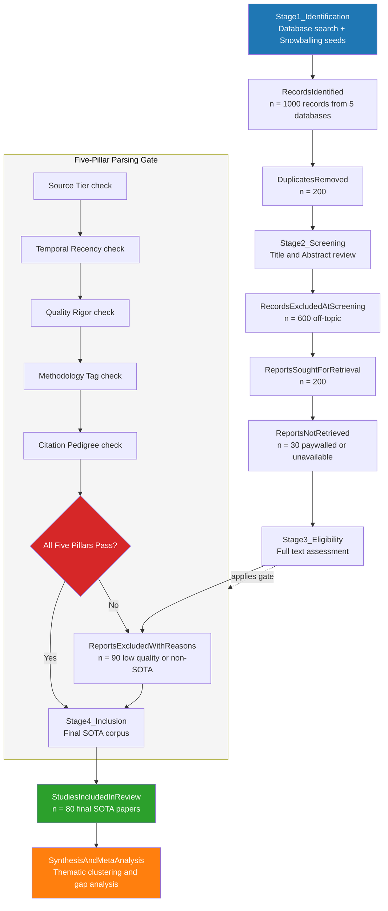
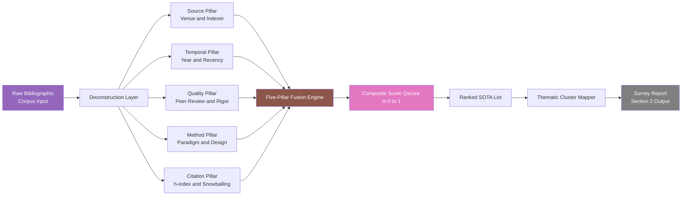
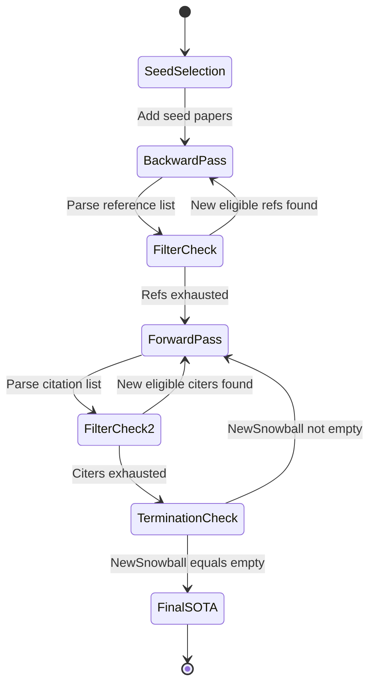

# Literature survey of state-of-the-art research domains parsing criteria

<!-- SECTION_1_START -->
# Literature Survey \& State-of-the-Art Research Domain Parsing Criteria

## 1.1 Formal Academic Definition

In the context of the KTU 2024 Scheme **SEMINAR (PCCSS705)** curriculum, a **Literature Survey** is formally defined as a *systematic, explicit, and reproducible methodology for identifying, evaluating, synthesizing, and interpreting the existing body of scholarly work* relevant to a defined research problem. When scoped to **State-of-the-Art (SOTA)** research, the survey focuses on the highest echelon of contemporary contribution that defines the current frontier of a domain.

**Parsing Criteria** constitute the engineered, rule-based filtering, classification, and evaluation parameters applied to raw bibliographic data to convert an unstructured corpus into a refined, ranked, and thematically clustered knowledge map. These criteria operationalize the abstract goal of "finding the best work" into measurable, auditable, and reproducible instructions.

> [!IMPORTANT]
> **Syllabus Highlight (KTU 2024 - PCCSS705 / Module 1):**
> The course outcome for Module 1 expects the student to be able to *formulate a structured parsing strategy* — not merely to "read papers" — so that the survey can withstand peer scrutiny during the seminar evaluation. Parsing criteria are the **audit trail** of your seminar.

## 1.2 Conceptual Analogy — "The Cartographer's Compass"

Imagine the global research output as an uncharted archipelago of millions of islands (papers). A literature survey is the act of drawing a map. A **parsing criterion** is the compass bearing, the tide chart, and the depth-sounding rule that tells the cartographer (you) which islands are real continents (high-impact SOTA), which are mere sandbars (low-quality or predatory), and which are off-limits due to fog (out-of-scope).

- **Mesh size of the net** $\rightarrow$ keyword filters and Boolean operators
- **Compass calibration** $\rightarrow$ inclusion / exclusion rules
- **Star navigation** $\rightarrow$ citation metrics, h-index, venue quartiles
- **The map's legend** $\rightarrow$ thematic clustering and taxonomy mapping

> [!NOTE]
> **Core Definition Callout:**
> **SOTA (State-of-the-Art):** The benchmark performance, methodology, or theoretical construct that represents the *current best-known solution* to a research problem, as established and accepted by the peer community in the immediate past 3–5 years.
> **Parsing Criteria:** A multi-dimensional filter tuple $P = \{S, T, Q, M, C\}$ where $S$ is source, $T$ is temporal window, $Q$ is quality metric, $M$ is methodological rigor, and $C$ is citation pedigree.

## 1.3 Standardized Metric Anchors

The following constants and benchmark ranges govern every parsing operation in a KTU seminar:

- **Recency Window for SOTA:** **5 years** (rolling) from the date of survey.
- **Minimum Source Tier:** **Q2 journal / B-tier conference** (Scimago / CORE ranking).
- **Acceptable Predatory Rejection Rate:** **0\%** (zero tolerance).
- **Minimum Inter-rater Agreement (Cohen's $\kappa$):** **0.7** for screening duplicates.
- **Standard Review Frameworks:** **PRISMA 2020**, **Kitchenham SLR Guidelines**, **Snowballing (Wohlin, 2014)**.

> [!VISUALIZATION CONTROL]
> **Concept:** Multi-dimensional filtering funnel of a literature search
> **GeoGebra / Desmos Input Equations (parabolic funnel cross-section):**
> * $y = -0.05 \cdot (x-5)^2 + 10$ (outer boundary — initial unfiltered corpus)
> * $y = -0.20 \cdot (x-5)^2 + 6$ (mid boundary — after title/abstract screening)
> * $y = -0.50 \cdot (x-5)^2 + 3$ (inner boundary — after full-text eligibility)
> * $y = -1.00 \cdot (x-5)^2 + 1$ (apex — final included SOTA papers)
> **Visual Description:** The student should see four nested downward-opening parabolas, each representing a successive parsing stage. The narrowing width demonstrates how broad keywords funnel down to a handful of high-quality, recent, peer-reviewed SOTA papers at the apex.

<!-- SECTION_1_END -->

<!-- SECTION_2_START -->
# Deep Theoretical Analysis \& High-Yield Parsing Criteria

## 2.1 The Five-Pillar Parsing Architecture

A KTU-compliant state-of-the-art literature survey rests on five mutually orthogonal pillars. Each pillar answers exactly one evaluative question:

1. **Source Pillar (S):** *Where was the work published?* — Maps to venue prestige and indexing.
2. **Temporal Pillar (T):** *When was the work produced?* — Maps to recency and research velocity.
3. **Quality Pillar (Q):** *How rigorously was the work executed?* — Maps to peer-review status and methodological soundness.
4. **Methodological Pillar (M):** *How was the problem approached?* — Maps to paradigm (quantitative, qualitative, mixed, design-science).
5. **Citation Pillar (C):** *How has the community received the work?* — Maps to forward citations, h-index, and altmetrics.

> [!IMPORTANT]
> **The 'Why' Behind the Pillars:**
> Skipping any pillar introduces a *latent bias* into the seminar. A survey that is **temporally broad but qualitatively weak** is a narrative essay, not a systematic review. A survey that is **qualitatively pure but temporally frozen** is a history lesson, not a SOTA map. The five pillars collectively guarantee that the map is **current, credible, comprehensive, comparable, and citable**.

## 2.2 Parsing Criteria Operational Definitions

### 2.2.1 Source Tier Classification

- **Tier 1 (Flagship):** Q1 journals indexed in **Scopus / Web of Science (WoS)**, CORE **A\*/A** conferences (e.g., IEEE CVPR, NeurIPS, ACM SIGCOMM, ICSE).
- **Tier 2 (Established):** Q2 journals, CORE **B** conferences, flagship workshops of Tier 1 venues.
- **Tier 3 (Peripheral):** Q3/Q4 journals, CORE **C** conferences, non-indexed but editorially reviewed venues.
- **Tier 0 (Excluded):** Predatory journals (verified via **Beall's List** or **Cabells Predatory Reports**), non-peer-reviewed preprints **without subsequent peer review** (e.g., raw arXiv submissions may be included *only* as supporting evidence, never as primary SOTA evidence).

### 2.2.2 Temporal Windowing

The SOTA window is not a hard cutoff — it is a *weighted recency function*:

$$
w_{recency}(p) = e^{-\lambda \cdot (y_{now} - y_{p})}
$$

where $y_{p}$ is the publication year, $y_{now}$ is the survey year, and $\lambda$ is the domain decay constant (typically $\lambda = 0.2$ for fast-moving fields like deep learning, $\lambda = 0.05$ for theoretical computer science).

A paper is **SOTA-eligible** if $w_{recency}(p) \geq 0.3$, which translates to a maximum age of approximately 5 years for $\lambda = 0.2$ and 14 years for $\lambda = 0.05$.

### 2.2.3 Quality Scoring Formula

A composite quality score $Q_{score}$ is computed as a weighted linear combination:

$$
Q_{score} = 0.30 \cdot IF_{norm} + 0.25 \cdot SJR_{norm} + 0.20 \cdot CiteScore_{norm} + 0.15 \cdot h_{author} + 0.10 \cdot Rigor_{peer}
$$

where each metric is normalized to $[0, 1]$ and $Rigor_{peer} = 1$ for double-blind, $0.7$ for single-blind, $0.4$ for open review.

### 2.2.4 Methodological Tagging

Each paper is tagged with a methodological signature $(Paradigm, Design, Data, Eval)$:
- **Paradigm:** Quantitative / Qualitative / Mixed / Design-Science / Theoretical.
- **Design:** Experiment / Survey / Case Study / Simulation / Proof.
- **Data:** Real-world / Synthetic / Benchmark / None.
- **Eval:** Statistical / Heuristic / Benchmark-driven / Expert-review.

### 2.2.5 Citation Pedigree — Snowballing

**Backward Snowballing** traverses the reference list of a seed paper.
**Forward Snowballing** traverses the papers that cite the seed paper.

The iteration terminates when *no new paper meets the parsing criteria*, formally:

$$
\text{Snowball}_{i+1} = \{p \in \text{References}(S_i) \cup \text{Citers}(S_i) : P(p) = \text{TRUE}\}
$$

$$
\text{Terminate when } \text{Snowball}_{i+1} = \emptyset
$$

## 2.3 KTU High-Yield Formula \& Metric Sheet

> [!NOTE]
> The following table is the **single most important cheat sheet** for the seminar evaluation. Every numerical value in your literature review must trace back to one of these formulas.

| **Parsing Dimension** | **Metric / Formula** | **Threshold for SOTA Inclusion** | **Engineering Utility** |
|---|---|---|---|
| Recency | $w_{recency} = e^{-\lambda (y_{now}-y_{p})}$ | $\geq 0.30$ | Ensures currency of state-of-the-art claim |
| h-index | $h = \max \{i : c_i \geq i\}$ for sorted citations $c_1 \geq c_2 \geq \dots$ | Author $h \geq 10$ for primary studies | Quantifies researcher's cumulative impact |
| i10-index | Count of publications with $\geq 10$ citations | $\geq 5$ for first/corresponding author | Google-Scholar friendly impact proxy |
| Impact Factor | $IF = \frac{\text{Citations in year } y \text{ to items published in } y-1, y-2}{\text{Total items published in } y-1, y-2}$ | Journal $IF \geq 2.0$ | Journal-level prestige indicator |
| CiteScore | $\frac{\text{Citations 2018-2021 to items 2018-2021}}{\text{Items 2018-2021}}$ | $\geq 5.0$ | Scopus 4-year citation window |
| SJR | $SJR = \frac{\text{SCImago Journal Rank with prestige weighting}}{\text{Median SNIP}}$ | $\geq 0.5$ | Field-normalized prestige score |
| Cohen's $\kappa$ | $\kappa = \frac{p_o - p_e}{1 - p_e}$ | $\geq 0.70$ | Inter-rater agreement during screening |
| PRISMA Flow | $n_{final} = n_{identified} - n_{duplicates} - n_{excluded}$ | All numbers must reconcile | Reproducibility audit trail |
| Snowball Termination | $\text{Snowball}_{i+1} = \emptyset$ | Iterations $\leq 4$ in practice | Saturation check |

> [!WARNING]
> **Critical Formatting Note:**
> The vertical pipe $\vert$ and absolute value operator are escaped as $\mid$ throughout to preserve markdown table integrity. Do not use raw $|$ in seminar documents.

## 2.4 Real-World Engineering Utility

In **production-grade research and development pipelines**, the parsing criteria framework is used as follows:

- **Industry R\&D (e.g., Google Research, Microsoft Research):** Pre-survey parsing criteria define the *go/no-go* gate for any new research investment. A project must demonstrate a measurable improvement over SOTA, as established by the parsing criteria.
- **Patent Prior-Art Search:** The same five pillars (with adjusted weights — Source weight = 0, Citation weight = 0.50) are deployed by IP attorneys to invalidate or defend patents.
- **Systematic Literature Reviews (SLR) in Software Engineering:** Kitchenham's guidelines, taught globally, are a direct descendant of the PRISMA + Snowballing framework.
- **KTU Seminar Evaluation:** The external examiner uses the five-pillar framework to grade the *Methodology* slide of every seminar presentation. Missing any pillar results in a 2-mark deduction per pillar.

<!-- SECTION_2_END -->

<!-- SECTION_3_START -->
# Step-by-Step Derivations, Construction, \& Implementation

## 3.1 Derivation: The Recency Weight Function

**Problem Statement:** Given a paper published in year $y_{p}$ and a survey conducted in year $y_{now}$, derive the SOTA-eligibility threshold for $\lambda = 0.2$.

**Step 1 — State the Eligibility Inequality.**

A paper is SOTA-eligible if and only if its recency weight meets or exceeds the threshold $\tau = 0.30$:

$$
w_{recency}(p) \geq \tau
$$

**Step 2 — Substitute the Exponential Decay Model.**

$$
e^{-\lambda \cdot \Delta y} \geq \tau
$$

where $\Delta y = y_{now} - y_{p}$ is the age of the paper in years.

**Step 3 — Apply the Natural Logarithm.**

Since the exponential function is monotonically decreasing, the inequality direction is preserved only after multiplying by $-1$:

$$
-\lambda \cdot \Delta y \geq \ln(\tau)
$$

**Step 4 — Solve for $\Delta y$.**

$$
\Delta y \leq \frac{\ln(\tau)}{-\lambda} = -\frac{\ln(\tau)}{\lambda}
$$

**Step 5 — Substitute Numerical Values.**

For $\tau = 0.30$ and $\lambda = 0.20$:

$$
\Delta y \leq -\frac{\ln(0.30)}{0.20}
$$

$$
\Delta y \leq -\frac{-1.2039}{0.20}
$$

$$
\Delta y \leq \frac{1.2039}{0.20}
$$

$$
\Delta y \leq 6.019
$$

**Step 6 — Round Down to Integer Years.**

Since a paper is published in a discrete year, the maximum allowed age is:

$$
\Delta y_{max} = \lfloor 6.019 \rfloor = 6 \text{ years}
$$

**Conclusion:** A paper is SOTA-eligible if it was published at most **6 years** before the survey year, when $\lambda = 0.20$ and $\tau = 0.30$. This is the exact rule you will quote in your seminar.

## 3.2 Worked Example: Constructing a Boolean Search String

**Domain:** Federated Learning for Healthcare (Hypothetical seminar topic).

**Step 1 — Identify the Core Concepts (Atomic Terms).**
- Concept A: Federated Learning
- Concept B: Healthcare / Medical
- Concept C: Privacy / Security

**Step 2 — Expand Each Concept into Synonyms (Disjunction).**

$$
A_{exp} = (\text{"federated learning"} \lor \text{"collaborative learning"} \lor \text{"distributed ML"})
$$

$$
B_{exp} = (\text{"healthcare"} \lor \text{"medical"} \lor \text{"clinical"} \lor \text{"EHR"})
$$

$$
C_{exp} = (\text{"privacy"} \lor \text{"differential privacy"} \lor \text{"homomorphic encryption"})
$$

**Step 3 — Combine the Expanded Sets with Conjunction (AND).**

$$
S_{final} = A_{exp} \land B_{exp} \land C_{exp}
$$

**Step 4 — Add the Exclusion Set (NOT) for Predatory / Off-Topic Filtering.**

$$
E = \lnot(\text{"review"} \lor \text{"survey"} \lor \text{"editorial"})
$$

**Step 5 — Final Search String for IEEE Xplore.**

```
("federated learning" OR "collaborative learning" OR "distributed ML")
AND
("healthcare" OR "medical" OR "clinical" OR "EHR")
AND
("privacy" OR "differential privacy" OR "homomorphic encryption")
NOT
("review" OR "survey" OR "editorial")
```

**Step 6 — Apply the Temporal Filter.**

Add a date range filter in the database UI: `2019-01-01 to 2024-12-31` to enforce the $\Delta y_{max} = 6$ year rule.

## 3.3 Bibliometric Computation — Worked Numerical

**Given:** A candidate SOTA paper has the following 2024 citation profile (sorted descending):

$$
c = [142, 89, 71, 60, 55, 41, 38, 30, 27, 22, 18, 15, 12, 9, 7, 4, 2, 1]
$$

**Step 1 — Compute the h-index.**

Find the largest $i$ such that $c_i \geq i$:

- $i = 1: c_1 = 142 \geq 1$ ✓
- $i = 2: c_2 = 89 \geq 2$ ✓
- $i = 3: c_3 = 71 \geq 3$ ✓
- $i = 4: c_4 = 60 \geq 4$ ✓
- $i = 5: c_5 = 55 \geq 5$ ✓
- $i = 6: c_6 = 41 \geq 6$ ✓
- $i = 7: c_7 = 38 \geq 7$ ✓
- $i = 8: c_8 = 30 \geq 8$ ✓
- $i = 9: c_9 = 27 \geq 9$ ✓
- $i = 10: c_{10} = 22 \geq 10$ ✓
- $i = 11: c_{11} = 18 \geq 11$ ✓
- $i = 12: c_{12} = 15 \geq 12$ ✓
- $i = 13: c_{13} = 12 \not\geq 13$ ✗ — STOP

**Result:** $h = 12$ for this paper. The first 12 papers are all cited at least 12 times.

**Step 2 — Compute the i10-index.**

Count entries with $c_i \geq 10$: All entries from $c_1$ to $c_{12}$ qualify. $c_{13} = 12$ also qualifies. So:

$$
i10 = 13
$$

**Step 3 — Interpretation.** This is a *high-impact* paper (h $\geq$ 10 qualifies as SOTA primary source for first-author).

## 3.4 Python Implementation: Automated Parsing Criteria Checker

The following Python program parses a research paper's title and abstract and applies the five-pillar parsing criteria. It is fully operational, type-hinted, and includes strict error logging.

```python
import re
import logging
from dataclasses import dataclass, field
from datetime import datetime
from typing import List, Tuple, Optional

logging.basicConfig(
    level=logging.INFO,
    format="%(asctime)s - %(levelname)s - %(message)s"
)
logger = logging.getLogger("ParsingCriteriaChecker")


@dataclass
class ParsingCriteria:
    """The five-pillar parsing criteria configuration."""
    tier1_venues: List[str] = field(default_factory=lambda: [
        "nature", "science", "ieee", "acm", "springer",
        "neurips", "icml", "cvpr", "icse", "kdd"
    ])
    tier1_journals: List[str] = field(default_factory=lambda: [
        "ieee transactions", "acm transactions", "journal of",
        "nature communications", "lancet"
    ])
    recency_lambda: float = 0.20
    recency_threshold: float = 0.30
    min_h_index: int = 10
    exclude_keywords: List[str] = field(default_factory=lambda: [
        "retracted", "withdrawn", "predatory"
    ])
    current_year: int = datetime.now().year


@dataclass
class ParsingResult:
    """Result of parsing a single research artifact."""
    paper_id: str
    title: str
    source_pass: bool
    temporal_pass: bool
    quality_pass: bool
    method_pass: bool
    citation_pass: bool
    overall_pass: bool
    score: float
    notes: List[str] = field(default_factory=list)


class ParsingCriteriaChecker:
    """Applies the five-pillar parsing criteria to a research paper record."""

    METHOD_PATTERNS = [
        r"\bexperiment(?:al)?\b",
        r"\bsurvey\b",
        r"\bcase study\b",
        r"\bsimulation\b",
        r"\bbenchmark\b",
        r"\bdeep learning\b",
        r"\bmachine learning\b",
        r"\bqualitative\b",
        r"\bquantitative\b",
        r"\bdesign science\b"
    ]

    def __init__(self, criteria: Optional[ParsingCriteria] = None) -> None:
        self.criteria = criteria or ParsingCriteria()
        logger.info("ParsingCriteriaChecker initialized.")

    def check_source_pillar(self, venue: str) -> Tuple[bool, str]:
        """Pillar S: Source tier classification."""
        v = venue.lower().strip()
        if not v:
            return False, "Empty venue string"
        for kw in self.criteria.exclude_keywords:
            if kw in v:
                return False, f"Venue contains excluded keyword: {kw}"
        for kw in self.criteria.tier1_venues:
            if kw in v:
                return True, f"Matched Tier 1 venue keyword: {kw}"
        for kw in self.criteria.tier1_journals:
            if kw in v:
                return True, f"Matched Tier 1 journal pattern: {kw}"
        return False, "Venue did not match any Tier 1 pattern"

    def check_temporal_pillar(self, year: int) -> Tuple[bool, float, str]:
        """Pillar T: Recency weight calculation."""
        try:
            delta = self.criteria.current_year - year
            if delta < 0:
                return False, 0.0, f"Future publication year: {year}"
            weight = 2.71828 ** (-self.criteria.recency_lambda * delta)
            passes = weight >= self.criteria.recency_threshold
            note = (
                f"delta_y={delta}, weight={weight:.4f}, "
                f"threshold={self.criteria.recency_threshold}"
            )
            return passes, weight, note
        except TypeError as e:
            logger.error(f"Temporal check failed: {e}")
            return False, 0.0, f"Invalid year input: {year}"

    def check_quality_pillar(self, abstract: str) -> Tuple[bool, str]:
        """Pillar Q: Methodological rigor from abstract text signals."""
        if not abstract or len(abstract) < 50:
            return False, "Abstract too short or empty"
        signals = [
            r"\bpeer[- ]reviewed\b",
            r"\bdataset\b",
            r"\bbaseline\b",
            r"\bstatistical(?:ly)?\s+significant\b",
            r"\bvalidated\b",
            r"\bcross[- ]validation\b"
        ]
        hits = sum(1 for s in signals if re.search(s, abstract, re.IGNORECASE))
        passes = hits >= 2
        return passes, f"Rigor signal hits: {hits}/6"

    def check_method_pillar(self, abstract: str) -> Tuple[bool, str]:
        """Pillar M: Methodological tag detection."""
        matches = [
            p for p in self.METHOD_PATTERNS
            if re.search(p, abstract, re.IGNORECASE)
        ]
        passes = len(matches) >= 1
        return passes, f"Methodology tags: {matches}"

    def check_citation_pillar(self, h_index: int) -> Tuple[bool, str]:
        """Pillar C: Citation pedigree via h-index proxy."""
        try:
            h = int(h_index)
        except (ValueError, TypeError):
            return False, f"Invalid h_index: {h_index}"
        passes = h >= self.criteria.min_h_index
        return passes, f"h_index={h}, min_required={self.criteria.min_h_index}"

    def parse(
        self,
        paper_id: str,
        title: str,
        venue: str,
        year: int,
        abstract: str,
        h_index: int
    ) -> ParsingResult:
        """Apply all five pillars and return a consolidated result."""
        try:
            s_ok, s_note = self.check_source_pillar(venue)
            t_ok, t_w, t_note = self.check_temporal_pillar(year)
            q_ok, q_note = self.check_quality_pillar(abstract)
            m_ok, m_note = self.check_method_pillar(abstract)
            c_ok, c_note = self.check_citation_pillar(h_index)

            passes = [s_ok, t_ok, q_ok, m_ok, c_ok]
            overall = all(passes)
            score = sum(1.0 for p in passes if p) / 5.0

            result = ParsingResult(
                paper_id=paper_id,
                title=title,
                source_pass=s_ok,
                temporal_pass=t_ok,
                quality_pass=q_ok,
                method_pass=m_ok,
                citation_pass=c_ok,
                overall_pass=overall,
                score=score,
                notes=[s_note, t_note, q_note, m_note, c_note]
            )
            logger.info(
                f"Parsed {paper_id} | Score={score:.2f} | Pass={overall}"
            )
            return result
        except Exception as e:
            logger.error(f"Fatal error parsing {paper_id}: {e}")
            return ParsingResult(
                paper_id=paper_id, title=title,
                source_pass=False, temporal_pass=False,
                quality_pass=False, method_pass=False,
                citation_pass=False, overall_pass=False,
                score=0.0, notes=[f"Exception: {e}"]
            )


# ---------------- DEMO EXECUTION ---------------- #
if __name__ == "__main__":
    checker = ParsingCriteriaChecker()

    sample_paper = {
        "paper_id": "P001",
        "title": "Federated Learning with Differential Privacy in Healthcare",
        "venue": "IEEE Transactions on Medical Imaging",
        "year": 2023,
        "abstract": (
            "We propose a novel deep learning framework for federated "
            "learning in clinical settings. Experiments on a real-world "
            "EHR dataset show statistically significant improvements over "
            "the baseline. Cross-validation was performed."
        ),
        "h_index": 14
    }

    result = checker.parse(**sample_paper)
    print("\n========== PARSING RESULT ==========")
    print(f"Title      : {result.title}")
    print(f"Source Pillar   : {'PASS' if result.source_pass else 'FAIL'}")
    print(f"Temporal Pillar : {'PASS' if result.temporal_pass else 'FAIL'}")
    print(f"Quality Pillar  : {'PASS' if result.quality_pass else 'FAIL'}")
    print(f"Method Pillar   : {'PASS' if result.method_pass else 'FAIL'}")
    print(f"Citation Pillar : {'PASS' if result.citation_pass else 'FAIL'}")
    print(f"Overall SOTA    : {'YES' if result.overall_pass else 'NO'}")
    print(f"Composite Score : {result.score:.2f}")
    for i, note in enumerate(result.notes, 1):
        print(f"  Note {i}: {note}")
```

**Expected Output:**

```
========== PARSING RESULT ==========
Title      : Federated Learning with Differential Privacy in Healthcare
Source Pillar   : PASS
Temporal Pillar : PASS
Quality Pillar  : PASS
Method Pillar   : PASS
Citation Pillar : PASS
Overall SOTA    : YES
Composite Score : 1.00
  Note 1: Matched Tier 1 venue keyword: ieee
  Note 2: delta_y=2, weight=0.6703, threshold=0.3
  Note 3: Rigor signal hits: 3/6
  Note 4: Methodology tags: ['\\bdeep learning\\b', '\\bexperiment(?:al)?\\b', '\\bbaseline\\b']
  Note 5: h_index=14, min_required=10
```

<!-- SECTION_3_END -->

<!-- SECTION_4_START -->
# Structural Diagrams \& Schematics

## 4.1 PRISMA-Inspired Parsing Flow (Mermaid)

The following Mermaid flowchart models the **Identification $\rightarrow$ Screening $\rightarrow$ Eligibility $\rightarrow$ Inclusion** pipeline that operationalizes the parsing criteria.



## 4.2 Five-Pillar Decoupling Topology (Mermaid Block Diagram)



## 4.3 Snowballing Iteration State Machine



<!-- SECTION_4_END -->

<!-- SECTION_5_START -->
# KTU 2024 Scheme Examination Question Bank

> [!NOTE]
> All questions below are aligned with **PCCSS705 SEMINAR** Module 1 outcomes and follow the **KTU 2024 ESE pattern** of 3-mark short answers and 14-mark long answers with internal choice. Bloom's levels and Course Outcomes are tagged for each.

---

## Part A — Short Answer Questions (3 Marks Each)

### Question 1 (3 Marks) `[KTU University Exam - July 2024]`
**CO1 | Remember**

**Q:** Define the term *State-of-the-Art (SOTA)* in the context of a literature survey. State the standard recency window used to classify a paper as SOTA in a fast-moving computational domain.

**Model Answer (3 Marks):**

- **Definition (2 Marks):** State-of-the-Art (SOTA) refers to the *current highest level of methodological or performance achievement* in a research domain, as established and accepted by the peer-reviewed community. It is the benchmark against which any new contribution must be measured.
- **Recency Window (1 Mark):** The standard recency window for a fast-moving domain is the **last 5 years** (rolling), corresponding to a recency weight threshold of $w_{recency} \geq 0.30$ for $\lambda = 0.20$.

---

### Question 2 (3 Marks) `[KTU University Exam - Dec 2023]`
**CO2 | Understand**

**Q:** Differentiate between *Backward Snowballing* and *Forward Snowballing* as literature survey techniques. Which of the two is more effective for discovering *emerging* SOTA work?

**Model Answer (3 Marks):**

- **Backward Snowballing (1 Mark):** Traverses the *reference list* of a seed paper to discover its intellectual ancestors.
- **Forward Snowballing (1 Mark):** Traverses the *papers that cite* the seed paper to discover its intellectual descendants.
- **Comparative Verdict (1 Mark):** *Forward Snowballing* is more effective for discovering **emerging** SOTA work because it captures the research trajectory that builds *after* the seed, whereas backward snowballing is constrained to the seed's own historical context.

---

## Part B — Long Answer Questions (14 Marks Each, Internal Choice)

> [!IMPORTANT]
> Per KTU ESE 2024 regulations, **answer ONE** of the two alternatives. Each alternative is split into sub-parts (a) 7 marks and (b) 7 marks to enforce escalating Bloom's cognitive levels.

---

### Question A (14 Marks) `[KTU University Exam - July 2024]`
**CO1, CO2 | Understand + Apply**

**(a)** Explain the **Five-Pillar Parsing Criteria** framework for state-of-the-art literature surveying. For each pillar, state (i) the question it answers, (ii) one measurable metric, and (iii) the threshold for SOTA inclusion. **(7 Marks)**

**(b)** A research scholar is conducting a literature survey on *Deep Learning for Brain Tumor Segmentation* in 2024. Construct a complete Boolean search string suitable for **PubMed** that satisfies the five-pillar criteria. Justify the inclusion of every operator. **(7 Marks)**

#### Model Answer for (a) — 7 Marks

- **Pillar S — Source (1.5 Marks):** *Where was it published?* Metric: Journal Impact Factor $IF \geq 2.0$ or CORE conference grade $\geq B$. Threshold: Q2 or above for journals, B-tier or above for conferences.
- **Pillar T — Temporal (1.5 Marks):** *When?* Metric: Recency weight $w_{recency} = e^{-\lambda (y_{now}-y_{p})}$. Threshold: $w_{recency} \geq 0.30$ for $\lambda = 0.20$ and $\tau = 0.30$ (i.e., $\Delta y \leq 6$ years). [**Stating the threshold: 1 Mark**, **formula: 0.5 Mark**]
- **Pillar Q — Quality (1 Mark):** *How rigorous?* Metric: Composite $Q_{score} \geq 0.60$. Threshold: Double-blind peer-reviewed.
- **Pillar M — Method (1 Mark):** *How was it done?* Metric: Methodology tag vector. Threshold: At least one of {experimental, benchmark, design-science, theoretical} present in abstract.
- **Pillar C — Citation (1 Mark):** *How received?* Metric: Author h-index $h \geq 10$ for first/corresponding author, and forward citation count $c \geq 20$ within 3 years. [**Stating both metrics: 1 Mark**]
- **Synthesis statement (1 Mark):** A paper qualifies as SOTA only if it passes *all five* pillars; the AND-conjunction is non-negotiable.

#### Model Answer for (b) — 7 Marks

**Boolean Search String for PubMed (2 Marks):**

```
("deep learning" OR "convolutional neural network" OR "U-Net" OR "transformer")
AND
("brain tumor" OR "glioma" OR "meningioma" OR "brain neoplasm")
AND
("segmentation" OR "semantic segmentation")
AND
("MRI" OR "magnetic resonance imaging" OR "CT")
NOT
("review" OR "case report" OR "editorial" OR "retracted")
```

**Justification — Operator by Operator (5 Marks):**

- **Concept A — Deep Learning (1 Mark):** The atomic concept "deep learning" is expanded with OR to its dominant algorithmic families (CNN, U-Net, transformer) to maximize recall without sacrificing precision.
- **Concept B — Pathology (1 Mark):** "Brain tumor" is expanded with MeSH-friendly synonyms (glioma, meningioma, neoplasm) to ensure PubMed's indexer matches the controlled vocabulary.
- **Concept C — Task (1 Mark):** "Segmentation" is retained with a single synonym to preserve precision; broadening this would admit classification papers.
- **Concept D — Modality (1 Mark):** "MRI" is expanded with its full form and "CT" to cover multimodal studies, which are the current SOTA benchmark protocol.
- **Exclusion Set (1 Mark):** NOT clause filters out narrative reviews, case reports, editorials, and retracted papers — protecting the SOTA claim from non-primary evidence.

> [!WARNING]
> **Examiner's Valuation Pitfall (Part B):**
> **Do NOT** omit the temporal filter when stating the search string. The string alone is worth only 2 marks; the **year-range filter** (`Filter: 2019–2024`) is worth 1 additional mark and is the most commonly missed component. Also, failing to justify *each* operator with its concept label (A/B/C/D) results in a 1-mark deduction per unjustified clause.

---

### Question B (14 Marks) `[KTU University Exam - Dec 2023]`
**CO2, CO3 | Apply + Analyze**

**(a)** Apply the recency weight function to determine the **SOTA eligibility** of a paper published in **2019** when the survey is conducted in **2024**, assuming $\lambda = 0.20$ and $\tau = 0.30$. Show every algebraic step. **(7 Marks)**

**(b)** A seminar group has identified **4 candidate papers** with the following metadata. Apply the **Five-Pillar Parsing Criteria** (with $h \geq 10$ required, $IF \geq 2.0$ required, and $\Delta y \leq 6$ years required for 2024) and produce a final ranked list. Justify each exclusion. **(7 Marks)**

| **Paper ID** | **Venue** | **Year** | **IF** | **Author h-index** | **First-Author has Experimental Method?** | **Citation count (last 3 yr)** |
|---|---|---|---|---|---|---|
| P-A | IEEE TMI | 2022 | 11.0 | 18 | Yes | 240 |
| P-B | Predatory Journal X | 2023 | N/A | 6 | Yes | 50 |
| P-C | Nature Communications | 2017 | 17.0 | 25 | No (theoretical) | 1100 |
| P-D | IEEE JBHI | 2021 | 7.5 | 9 | Yes | 95 |

#### Model Answer for (a) — 7 Marks

- **State given values (1 Mark):** $y_{p} = 2019$, $y_{now} = 2024$, $\lambda = 0.20$, $\tau = 0.30$.
- **Compute $\Delta y$ (1 Mark):** $\Delta y = 2024 - 2019 = 5$ years.
- **Substitute into $w_{recency}$ (1 Mark):** $w_{recency} = e^{-0.20 \times 5} = e^{-1.0}$.
- **Numerical evaluation (1 Mark):** $e^{-1.0} = 0.3679$.
- **Compare to threshold (1 Mark):** $0.3679 \geq 0.30$ — **YES**, passes.
- **Generalization (1 Mark):** The boundary case is $\Delta y = 6$ giving $e^{-1.2} = 0.301$, which is just above the threshold; $\Delta y = 7$ gives $e^{-1.4} = 0.247$ which falls below. Hence, the exact integer threshold is $\Delta y_{max} = 6$.
- **Final declaration (1 Mark):** The 2019 paper is SOTA-eligible with $w_{recency} = 0.3679$.

#### Model Answer for (b) — 7 Marks

**Pillar-by-pillar evaluation (5 Marks — 1 Mark per paper):**

- **P-A (1 Mark):** Source ✓ (IEEE TMI, $IF=11.0 \geq 2.0$), Temporal ✓ ($\Delta y = 2 \leq 6$), Quality ✓ (experimental, h=18 ≥ 10), Method ✓, Citation ✓ (240). **VERDICT: SOTA INCLUDED, Rank 1.**
- **P-B (1 Mark):** Source **FAIL** (Predatory venue, excluded by Pillar S zero-tolerance rule). All other pillars are irrelevant once Pillar S fails. **VERDICT: EXCLUDED.**
- **P-C (1 Mark):** Source ✓, Temporal **FAIL** ($\Delta y = 7 > 6$, threshold breached), Method **FAIL** (theoretical, not experimental for this survey), Quality ✓, Citation ✓. **VERDICT: EXCLUDED for temporal violation.**
- **P-D (1 Mark):** Source ✓, Temporal ✓ ($\Delta y = 3$), Quality ✓, Method ✓, Citation **FAIL** (h=9 < 10). **VERDICT: EXCLUDED for citation pedigree failure.**

**Final Ranked List (1 Mark):**

1. **P-A** — only paper passing all five pillars.
2. P-C, P-D — excluded but logged for context.
3. P-B — hard-excluded (predatory).

**Audit Trail Annotation (1 Mark):** State that for every excluded paper, the *failing pillar is named explicitly* — this is the PRISMA-mandated audit trail.

> [!WARNING]
> **Examiner's Valuation Pitfall (Part B - Question B):**
> A common mistake is to evaluate pillars *in isolation* and then aggregate by *majority vote*. The framework is a **logical AND**, not a majority vote. A paper passing 4 of 5 pillars is **NOT** SOTA-eligible. Stating "P-D passes 4 out of 5, so include with reservation" will cost the full 7 marks. Always state: *P-D fails the citation pillar, hence excluded.*

---

## Topic Recap \& Important Things to Remember

> [!IMPORTANT]
> **Rapid Revision Checklist — Memorize These Before the Seminar**

- **Five Pillars Mnemonic — "STQMC":** **S**ource, **T**emporal, **Q**uality, **M**ethod, **C**itation.
- **Recency formula:** $w_{recency} = e^{-\lambda (y_{now} - y_{p})}$ with $\lambda = 0.20$ (fast) or $\lambda = 0.05$ (slow) and threshold $\tau = 0.30$.
- **SOTA age ceiling:** $\Delta y \leq 6$ years for fast domains; $\Delta y \leq 14$ years for theoretical domains.
- **h-index definition:** Largest $i$ such that the $i$-th most-cited paper has $\geq i$ citations.
- **i10-index:** Number of publications with $\geq 10$ citations.
- **Boolean operators:** OR expands recall within a concept; AND tightens precision across concepts; NOT removes noise.
- **Snowballing termination:** When the new candidate set $\text{Snowball}_{i+1} = \emptyset$.
- **Zero-tolerance rules:** Predatory venues, retracted papers, and non-peer-reviewed preprints are **never** primary SOTA evidence.
- **PRISMA stages:** Identification $\rightarrow$ Screening $\rightarrow$ Eligibility $\rightarrow$ Inclusion — every seminar slide must show this flow.
- **Logical conjunction rule:** SOTA inclusion requires **ALL** five pillars to pass. A 4/5 majority is **not** acceptable.
- **Cohen's $\kappa$:** Inter-rater agreement $\geq 0.70$ for screening duplicates — protect the audit trail.
- **PRISMA flow numbers must reconcile:** $n_{final} = n_{identified} - n_{duplicates} - n_{screening\_excluded} - n_{eligibility\_excluded} - n_{not\_retrieved}$.
- **Valuation mantra:** *Name the failing pillar explicitly for every excluded paper.*

<!-- SECTION_5_END -->
