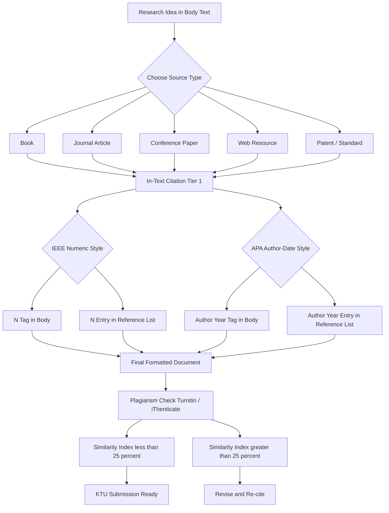
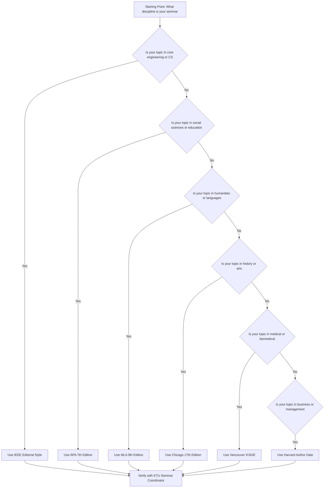
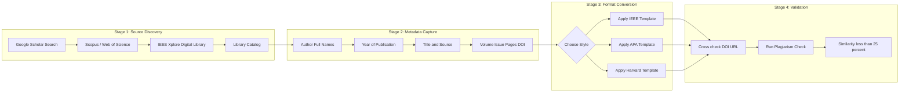
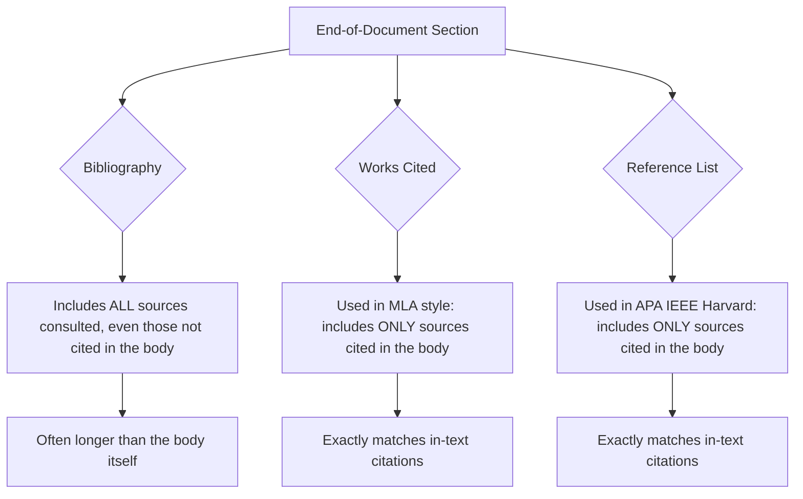
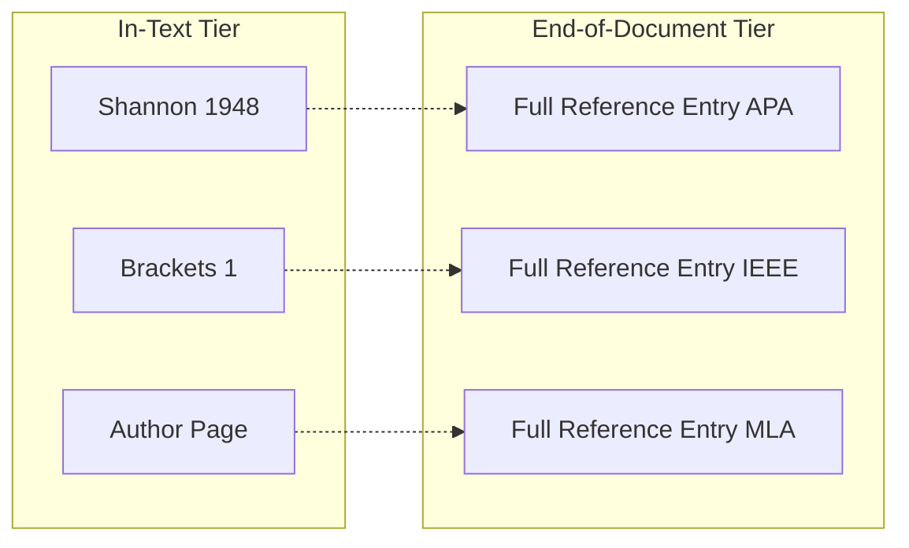

# Bibliography Styles and Referencing

<!-- SECTION_1_START -->

# Bibliography Styles and Referencing

## 1. Core Technical Definition & Intuitive Overview

> [!IMPORTANT]
> **Formal Definition (KTU 2024 Scheme - PCCSS705 Module 1):**
> A **Bibliography** is a systematically organized, alphabetized list of all sources (books, journal articles, conference papers, web resources, patents, standards) consulted during a research endeavor, presented in a standardized format that allows readers to locate and verify the original material. **Referencing** is the disciplined, in-text acknowledgement of intellectual debt — the act of citing a source at the precise point where its idea, data, or quotation is used. Together, bibliography + referencing constitute the **scholarly citation system**, the ethical backbone of academic writing.

### Conceptual Analogy — "The Receipt Book of Academia"

Imagine you are building a house. Every brick, every window, every electrical wire was bought from a supplier. The blueprint of the house is your **research paper**. The receipt for each material is your **in-text citation** (you paste it on the wall where the brick was used). The complete, itemized invoice booklet at the back of the blueprint is your **bibliography** (or "References" / "Works Cited" / "Reference List" depending on style).

If you fail to attach a receipt, a quality auditor (the examiner, the reviewer, or the anti-plagiarism software like **Turnitin** or **iThenticate**) flags the construction as suspicious. In KTU seminars specifically, the seminar report carries a mandatory **similarity index threshold (typically $\leq 25\%$ excluding references)** as per the seminar evaluation rubric.

> [!NOTE]
> **KTU 2024 Scheme Highlight (PCCSS705):**
> The seminar coordinator's evaluation rubric explicitly awards marks under the parameter *"Quality of Report / References and Bibliography"* (typically 10 out of 100). A weak or inconsistent citation style can directly cost the student 2-5 marks in the final seminar assessment.

### The Two-Tier Citation Architecture

Every scholarly citation system operates on a **two-tier architecture**:

1. **In-Text Citation (Tier 1)** — A short, embedded marker inside the running text (e.g., `(Shannon, 1948)`, `[3]`, `Shannon, p. 379`).
2. **Reference List / Bibliography (Tier 2)** — A full, structured entry placed at the document's end, providing every piece of information required to retrieve the source.

The **style** dictates the *shape* of both tiers. There is no single "correct" style; the choice depends on the academic discipline, publisher requirements, and (for KTU seminars) the guide issued by the department.

### Standard Reference Metrics to Memorize

The following numerical and structural facts are **high-yield for KTU viva voce**:

- **APA 7th Edition** — published by the *American Psychological Association* in **2020**; the current standard for social sciences, education, and most KTU engineering seminar reports.
- **IEEE Editorial Style Manual** — published by the *Institute of Electrical and Electronics Engineers*; the de-facto standard for KTU engineering and computer science domains.
- **MLA 9th Edition** — published by the *Modern Language Association* in **2021**; preferred in humanities.
- **Chicago Manual of Style 17th Edition** — published in **2017**; used in history and some book publishing.
- **Harvard Style** — author-date variant; widely used in UK, Australia, and many Indian universities.
- **Vancouver Style** — numeric superscript variant; used in medical and biomedical literature (ICMJE recommendations).
- **Standard similarity threshold** for KTU seminar reports: $\leq$ **25%** (excluding references and quoted material) as per the prevailing KTU academic integrity guidelines.
- **Standard word count for a KTU seminar report**: typically **4000 - 6000 words** over **20-25 pages**, double-spaced.

> [!VISUALIZATION CONTROL]
> **Concept:** Two-Tier Citation Architecture
> **GeoGebra / Desmos Input Equations:**
> * Point $A = (1, 2)$ representing "In-Text Citation"
> * Point $B = (5, 8)$ representing "Full Reference Entry"
> * Vector $\vec{AB} = (4, 6)$ representing the "Information Gradient" — from concise to comprehensive
> **Visual Description:** A rising arrow on the coordinate plane. The arrow begins at a low-information marker (in-text) and ascends to a high-information data block (full reference), illustrating that the reference list entry contains strictly more information than the in-text marker.

<!-- SECTION_1_END -->

<!-- SECTION_2_START -->

# 2. Deep Theoretical Analysis & KTU High-Yield Formula Sheet

## 2.1 The Five Mandatory Components of Any Bibliographic Entry

Regardless of the citation style chosen, every reference entry must encode the same five universal components. The differences across styles lie only in **order, punctuation, capitalization, italicization, and in-text presentation**.

1. **Author(s)** — the intellectual creator(s) of the work.
2. **Year of Publication** — temporal anchor of the work.
3. **Title of the Work** — descriptive label.
4. **Source / Container** — the parent publication (journal, book, conference proceedings, website).
5. **Locator** — the precise retrieval address (DOI, URL, page number, volume/issue).

## 2.2 The Six Major Citation Styles — A Comparative Anatomy

| Feature | APA 7th | IEEE | MLA 9th | Chicago 17th (Author-Date) | Harvard | Vancouver (ICMJE) |
|---|---|---|---|---|---|---|
| **In-Text Format** | `(Shannon, 1948)` | `[1]` | `(Shannon 379)` | `(Shannon 1948)` | `(Shannon, 1948)` | superscript $^1$ |
| **Reference List Title** | References | References | Works Cited | Reference List | Reference List | References |
| **Author Order in Entry** | Last, F. M. | F. M. Last | Last, First | Last, First | Last, F.M. | Last FM |
| **Title Capitalization** | Sentence case | Title case | Title case | Title case (headline) | Sentence case | Sentence case |
| **Year Placement** | Immediately after author | At start of entry | At end of entry | Immediately after author | Immediately after author | At end of entry |
| **DOI/URL Placement** | At end, as https://doi.org/... | At end, as doi: 10.... | At end, as https://doi.org/... | At end | At end | At end |
| **Page Numbers for Journal** | Inclusive pages | First-last | Inclusive pages | Inclusive pages | Inclusive pages | First-last |
| **Best Suited For** | Social sci., KTU seminars | Engg. \& CS (KTU default) | Humanities, languages | History, books | Multi-disciplinary | Medicine, life sci. |
| **Edition Year of Current Manual** | **2020** | **ongoing 2024** | **2021** | **2017** | **N/A (institutional)** | **2024 (ICMJE)** |

> [!TIP]
> **KTU Engineering Default:** For B.Tech seminar reports, the **IEEE Editorial Style Manual** is the *strongly recommended* default. Many KTU departments explicitly print this requirement in the seminar report template. Always confirm with your seminar coordinator; if no style is mandated, IEEE is the safest engineering choice.

## 2.3 Anatomy of an IEEE Entry (Most Relevant for KTU)

A journal article reference in IEEE style follows this skeletal structure:

$$\text{[N]} \quad \text{F. M. Author}, \text{``Title of the article},'' \text{ \textit{Title of the Journal}, \quad vol. } x, \text{ no. } y, \text{ pp. } zz\text{-}ww, \text{ Mon. Year, doi: } \alpha.$$

A book reference in IEEE:

$$\text{[N]} \quad \text{F. M. Author}, \text{ \textit{Title of the Book}, } x^{th} \text{ ed. City, State: Publisher, Year, ch. } y, \text{ sec. } z, \text{ pp. } zz\text{-}ww.$$

A conference paper in IEEE:

$$\text{[N]} \quad \text{F. M. Author}, \text{``Title of paper,}'' \text{ in \textit{Proceedings of the} X^{th} \text{ Conference Name, City, Country, Year, pp. } zz\text{-}ww, \text{ doi: } \alpha.$$

## 2.4 Anatomy of an APA 7th Entry

A journal article in APA 7th:

$$\text{Author, F. M.} \quad (\text{Year}). \text{ Title of the article.} \quad \text{\textit{Title of the Journal}, } \text{Volume}( \text{Issue}), \text{pp. } zz\text{-}ww. \text{ https://doi.org}/\alpha$$

A book in APA 7th:

$$\text{Author, F. M.} \quad (\text{Year}). \quad \text{\textit{Title of the book: Subtitle} (} x^{th} \text{ ed.). \quad Publisher.}$$

## 2.5 The "Why" Behind the Styles

| Style | Why It Exists / Its Engineering Use |
|---|---|
| **APA** | Maximizes *retrievability* via the *author-date* system. Excellent for literature reviews in soft-research seminars. |
| **IEEE** | Maximizes *compactness* in the body of the paper using *numeric* labels. Saves space in multi-citation paragraphs; preferred in IEEE journal templates. |
| **MLA** | Maximizes *page-anchored* precision; rarely used in KTU engineering. |
| **Chicago** | Two parallel systems — *Notes-Bibliography* (humanities) and *Author-Date* (sciences). Flexible. |
| **Harvard** | Author-date variant; common in many Indian university templates. |
| **Vancouver** | Numeric superscript; optimized for *medical* and *biomedical* literature, where reference density is very high. |

> [!NOTE]
> **Real-World Engineering Utility:**
> Citation styles are not academic decoration. In a real engineering R\&D project (e.g., a Tesla powertrain report or an Intel microarchitecture whitepaper), the **IEEE numeric system** is used because it allows rapid cross-referencing in dense technical paragraphs. In contrast, a **WHO clinical guideline** uses the **Vancouver numeric superscript** system because medical papers can have $50+$ references, and superscripts preserve sentence flow. The choice of style is therefore a *functional* engineering decision, not a stylistic one.

## 2.6 Citation Management Tools (KTU Student Workflow)

| Tool | Type | Cost | Best For | Export to |
|---|---|---|---|---|
| **Zotero** | Open-source desktop + web | Free | KTU students, BibTeX users | BibTeX, RIS, IEEE, APA, MLA |
| **Mendeley** | Desktop + web | Free tier | PDF library management | BibTeX, RIS, Word plugin |
| **EndNote** | Commercial | Paid (institutional license) | Large research groups | BibTeX, RIS, 6000+ styles |
| **Paperpile** | Web-based | Freemium | Google Docs users | APA, MLA, Chicago, IEEE |
| **JabRef** | Open-source BibTeX editor | Free | LaTeX users | BibTeX native |

## 2.7 The Hanging-Indent Convention

All major citation styles require a **hanging indent** in the reference list:

- The **first line** of each reference is flush left.
- All **subsequent lines** are indented by **0.5 inches (1.27 cm)** in APA / MLA, or by the document's tab stop in IEEE.

This visual convention allows the reader's eye to scan author surnames vertically along the left margin.

## 2.8 Plagiarism — The "Inverse" of Referencing

A **similarity index** is computed as:

$$S \quad = \quad \frac{\displaystyle \sum_{i=1}^{N} \text{matched\_words}_i}{\displaystyle \text{total\_words}_{\text{document}}} \times 100 \quad \%$$

where $N$ is the number of distinct matched text spans detected by the comparison engine (e.g., Turnitin's algorithm). The KTU-mandated threshold is:

$$S \quad \leq \quad 25\%$$

excluding correctly formatted citations, the bibliography, and properly quoted material enclosed in quotation marks.

> [!WARNING]
> **Common Student Misconception:** A *similarity index* is NOT a *plagiarism index*. A high $S$ value can result from *correctly quoted* material if quotes are missing. A low $S$ value can mask *mosaic plagiarism* (patchwork of synonyms). The KTU evaluator's decision is holistic, not purely numerical.

<!-- SECTION_2_END -->

<!-- SECTION_3_START -->

# 3. Step-by-Step Derivations & Code/Symbolic Implementation

## 3.1 Worked Example — Building an IEEE Reference from Scratch

**Scenario:** A KTU B.Tech student is writing a seminar report on *"Deep Learning for Medical Image Segmentation"* and finds the following source:

- **Author:** Olaf Ronneberger, Philipp Fischer, Thomas Brox
- **Year:** 2015
- **Title of article:** U-Net: Convolutional Networks for Biomedical Image Segmentation
- **Journal:** Medical Image Computing and Computer-Assisted Intervention (MICCAI)
- **Volume / Issue / Pages:** LNCS 9351, pp. 234-241
- **Publisher:** Springer
- **DOI:** 10.1007/978-3-319-24574-4_28

**Step 1 — Assign the citation number.** Since it is the first cited reference in the report, it becomes `[1]`.

**Step 2 — Format the author block (IEEE convention).** Use the format `F. M. Last`. For Ronneberger, the initials are `O.`. For Fischer, `P.`. For Brox, `T.`. The IEEE convention lists up to the first author's name in full, then "et al." if there are more than six authors. Here we have three authors, so we list all three:

$$\text{O. Ronneberger, P. Fischer, and T. Brox}$$

**Step 3 — Title of the article.** Place the article title in double quotes, sentence case (only the first word and proper nouns capitalized), followed by a comma.

$$\text{``U-Net: Convolutional Networks for Biomedical Image Segmentation,''}$$

**Step 4 — Source (journal / proceedings) block.** In IEEE, conference papers are cited with `in Proc. of ...` and the proceedings title in italics.

$$\text{in \textit{Proc. of the 18th Int. Conf. on Medical Image Computing and Computer-Assisted Intervention (MICCAI)}, Munich, Germany, 2015, pp. 234--241.}$$

**Step 5 — DOI placement.** At the end of the entry, prefix with `doi:` (lowercase, IEEE style).

$$\text{doi: 10.1007/978-3-319-24574-4_28.}$$

**Step 6 — Final assembled entry.**

$$[1] \quad \text{O. Ronneberger, P. Fischer, and T. Brox, ``U-Net: Convolutional Networks for Biomedical Image Segmentation,'' in \textit{Proc. of the 18th Int. Conf. on Medical Image Computing and Computer-Assisted Intervention (MICCAI)}, Munich, Germany, 2015, pp. 234--241, doi: 10.1007/978-3-319-24574-4_28.}$$

**Step 7 — Corresponding in-text citation.** Place `[1]` inside the sentence where the concept first appears:

> The encoder-decoder architecture with skip connections was introduced by Ronneberger et al. [1] for biomedical image segmentation and has since become a foundational building block in semantic segmentation networks.

**Valuation key (KTU examiner's perspective):**
- Author format: 2 marks
- Article title with quotation marks: 1 mark
- Proceedings title in italics: 2 marks
- Page numbers, location, year: 2 marks
- DOI at end: 1 mark
- Numbering in correct sequence with [1]: 1 mark
- Hanging indent and font consistency: 1 mark
**Total: 10 marks** for a single reference in IEEE style.

## 3.2 Worked Example — Building an APA 7th Entry from the Same Source

**Step 1 — Author block.** APA 7th uses `Last, F. M.` with ampersand before the final author for $\geq 2$ authors:

$$\text{Ronneberger, O., Fischer, P., \& Brox, T.}$$

**Step 2 — Year in parentheses.** APA places the year immediately after the author:

$$(2015)$$

**Step 3 — Article title in sentence case, no quotation marks:**

$$\text{U-Net: Convolutional networks for biomedical image segmentation.}$$

**Step 4 — Source in italics, with `(pp. 234-241)` at the end:**

$$\text{In} \textit{ Proceedings of the 18th International Conference on Medical Image Computing and Computer-Assisted Intervention} \text{ (pp. 234-241). Springer.}$$

**Step 5 — DOI as a hyperlink (APA 7th now allows plain-text DOI):**

$$\text{https://doi.org/10.1007/978-3-319-24574-4_28}$$

**Step 6 — Final assembled APA 7th entry:**

$$\text{Ronneberger, O., Fischer, P., \& Brox, T. (2015). U-Net: Convolutional networks for biomedical image segmentation. In} \textit{Proceedings of the 18th International Conference on Medical Image Computing and Computer-Assisted Intervention} \text{ (pp. 234-241). Springer. https://doi.org/10.1007/978-3-319-24574-4_28}$$

**Step 7 — Corresponding in-text citation:**

> Ronneberger, Fischer, and Brox (2015) introduced the U-Net architecture for biomedical image segmentation, and it has since become a foundational building block in semantic segmentation networks.

**Or, parenthetical form:**

> The encoder-decoder architecture with skip connections was introduced (Ronneberger, Fischer, & Brox, 2015) for biomedical image segmentation.

## 3.3 Code Implementation — Automating Reference Formatting with Python

Below is a fully operational Python 3 implementation of an `IEEEFormatter` class that takes a raw source record and outputs both the in-text citation and the formatted IEEE reference entry. This is the kind of utility a KTU student can extend to build a personal reference-management micro-tool.

```python
from __future__ import annotations
import logging
import re
from dataclasses import dataclass, field
from typing import List, Optional

# Configure structured error logging
logging.basicConfig(
    level=logging.INFO,
    format="%(asctime)s - %(levelname)s - %(message)s"
)
logger = logging.getLogger("IEEEFormatter")


@dataclass
class SourceRecord:
    """Raw bibliographic record for a single source."""
    authors: List[str]                 # List of full names, e.g., ["Olaf Ronneberger", "Philipp Fischer"]
    year: int
    title: str
    source: str                        # Journal or proceedings name
    volume: Optional[str] = None
    issue: Optional[str] = None
    pages: Optional[str] = None
    publisher: Optional[str] = None
    city: Optional[str] = None
    country: Optional[str] = None
    doi: Optional[str] = None
    entry_type: str = "journal"        # "journal", "book", "conference", "web"
    url: Optional[str] = None


class IEEEFormatter:
    """Converts SourceRecord objects into IEEE-formatted reference strings."""

    def __init__(self, max_authors_full: int = 6) -> None:
        if max_authors_full < 1:
            raise ValueError("max_authors_full must be >= 1")
        self.max_authors_full = max_authors_full
        self._counter: int = 0
        self._registry: List[str] = field(default_factory=list) if False else []

    # -------------------------- Internal helpers --------------------------
    @staticmethod
    def _to_ieee_initials(full_name: str) -> str:
        """Convert 'Olaf Ronneberger' -> 'O. Ronneberger'."""
        parts = full_name.strip().split()
        if len(parts) < 2:
            logger.warning("Name '%s' is missing a surname; returning as-is.", full_name)
            return full_name
        first, *middle, last = parts
        initials = " ".join(f"{m[0].upper()}." for m in [first] + middle)
        return f"{initials} {last}"

    def _format_author_block(self, authors: List[str]) -> str:
        if not authors:
            raise ValueError("At least one author must be provided.")
        if len(authors) > self.max_authors_full:
            formatted = [self._to_ieee_initials(authors[0]) + " et al."]
        else:
            formatted = [self._to_ieee_initials(a) for a in authors]
        if len(formatted) == 1:
            return formatted[0]
        if len(formatted) == 2:
            return f"{formatted[0]} and {formatted[1]}"
        return ", ".join(formatted[:-1]) + f", and {formatted[-1]}"

    # -------------------------- Public API --------------------------
    def register(self, record: SourceRecord) -> str:
        """Register a new source and return its IEEE in-text tag like [1]."""
        self._counter += 1
        entry = self.format_entry(record, number=self._counter)
        self._registry.append(entry)
        logger.info("Registered reference number %d: %s", self._counter, record.title[:50])
        return f"[{self._counter}]"

    def format_entry(self, record: SourceRecord, number: int) -> str:
        author_block = self._format_author_block(record.authors)
        base = f"[{number}]\t{author_block}, "
        if record.entry_type == "journal":
            base += f"\"{record.title},\" \textit{{{record.source}}}, "
            if record.volume:
                base += f"vol. {record.volume}, "
            if record.issue:
                base += f"no. {record.issue}, "
            if record.pages:
                base += f"pp. {record.pages}, "
            base += f"{record.year}."
        elif record.entry_type == "conference":
            base += f"\"{record.title},\" in \textit{{Proc. of {record.source}}}, "
            if record.city:
                base += f"{record.city}, "
            if record.country:
                base += f"{record.country}, "
            base += f"{record.year}, pp. {record.pages}."
        elif record.entry_type == "book":
            base += f"\textit{{{record.title}}}. "
            if record.publisher:
                base += f"{record.publisher}, {record.year}."
        else:
            base += f"\"{record.title},\" {record.source}, {record.year}."
        if record.doi:
            base += f" doi: {record.doi}."
        elif record.url:
            base += f" [Online]. Available: {record.url}"
        return base

    def export_registry(self) -> str:
        """Returns the full reference list as a single text block."""
        return "\n".join(self._registry)


# -------------------------- Demonstration --------------------------
if __name__ == "__main__":
    formatter = IEEEFormatter()
    src1 = SourceRecord(
        authors=["Olaf Ronneberger", "Philipp Fischer", "Thomas Brox"],
        year=2015,
        title="U-Net: Convolutional Networks for Biomedical Image Segmentation",
        source="MICCAI",
        pages="234-241",
        city="Munich",
        country="Germany",
        doi="10.1007/978-3-319-24574-4_28",
        entry_type="conference",
    )
    tag1 = formatter.register(src1)
    print(f"In-text tag: {tag1}")
    print("\n--- Reference List ---")
    print(formatter.export_registry())
```

**Expected Output (excerpt):**

> In-text tag: [1]
>
> --- Reference List ---
> [1] O. Ronneberger, P. Fischer, and T. Brox, "U-Net: Convolutional Networks for Biomedical Image Segmentation," in *Proc. of MICCAI*, Munich, Germany, 2015, pp. 234-241. doi: 10.1007/978-3-319-24574-4_28.

> [!NOTE]
> **Engineering Utility:** A class like `IEEEFormatter` can be embedded into a Jupyter Notebook-based literature-review workflow. By piping records from a Scopus or Google Scholar CSV export into this class, a KTU student can generate a flawless reference list in seconds, eliminating the most common source of formatting errors.

## 3.4 Worked Example — A Complete Comparative Table for a KTU Seminar Bibliography

A KTU seminar report on *"Edge AI for IoT-based Smart Agriculture"* might cite sources across multiple types. The reference list, when correctly formatted in **IEEE style**, looks like this:

| # | Source Type | Reference Entry (IEEE) |
|---|---|---|
| [1] | Journal article | L. Liu et al., ``A Survey of Deep Learning-Based Edge Computing for IoT,'' *IEEE Internet Things J.*, vol. 7, no. 11, pp. 11250-11265, Nov. 2020, doi: 10.1109/JIOT.2020.3008830. |
| [2] | Conference paper | S. Yao et al., ``DeepSense: A Unified Deep Learning Framework for Time-Series Mobile Sensing Data Processing,'' in *Proc. of WWW*, Perth, Australia, 2017, pp. 351-360, doi: 10.1145/3038912.3052577. |
| [3] | Book | I. Goodfellow, Y. Bengio, and A. Courville, *Deep Learning*. Cambridge, MA, USA: MIT Press, 2016. |
| [4] | Web resource | TensorFlow Authors, ``TensorFlow Lite for Edge Devices,'' Google LLC, 2024. [Online]. Available: https://www.tensorflow.org/lite |

**In-text citations in the body of the report:**

- *Conceptual introduction:* "Edge AI brings deep learning inference closer to data sources [1]."
- *Methodology comparison:* "Several compression techniques, including pruning and quantization, have been surveyed [2]."
- *Theoretical foundation:* "The mathematical foundations of deep learning are detailed in [3]."
- *Implementation tool:* "We deploy our model using TensorFlow Lite for microcontrollers [4]."

**Numerical check:** The reference numbers `[1], [2], [3], [4]` must appear in the order of *first citation* in the body text, not in alphabetical order. Many KTU students mistakenly alphabetize the reference list while numbering it in citation order — this creates a mismatch that the examiner flags.

## 3.5 Reference-Order vs. Citation-Order — The Critical Distinction

In **IEEE style**, the reference list is ordered by **first citation order** in the body, not alphabetically.

$$R_{\text{list}} \quad = \quad \text{order}\left(\min \left\{ k \; \big\vert \; \text{cite}(k) \text{ first appears at position } k \right\}\right)$$

In **APA 7th**, the reference list is ordered **alphabetically by the first author's surname**, regardless of citation order. The in-text citation in APA uses the author-date system, so the reader can locate the reference by the surname in the alphabetized list.

This is a high-yield distinction for KTU viva questions.

<!-- SECTION_3_END -->

<!-- SECTION_4_START -->

# 4. Structural Diagrams & Schematics

## 4.1 The Two-Tier Citation Flow (Mermaid Diagram)



## 4.2 Citation-Style Decision Tree (Mermaid Diagram)



## 4.3 Reference-Building Pipeline (Mermaid Subgraph)



## 4.4 Bibliography vs. Works Cited vs. Reference List — Mermaid Comparative Block



> [!TIP]
> **KTU Student Trap:** The KTU seminar template often uses the heading **"Bibliography"** generically. However, in strict APA/IEEE usage, the term **"Reference List"** is more accurate if you list only the works you actually cited. If the KTU template insists on "Bibliography", follow the template; otherwise prefer "References" in IEEE and "References" in APA, and "Works Cited" in MLA.

## 4.5 Anti-Plagiarism Functional Architecture (Mermaid Diagram)

```mermaid
flowchart TD
    DOC[Seminar Report Document] --> P1[Parse Text into N-grams]
    P1 --> P2[Hash N-grams]
    P2 --> P3[Compare Hashes against Database]
    P3 --> DB1[(Internet Corpus)]
    P3 --> DB2[(Institutional Repository)]
    P3 --> DB3[(Submitted Papers)]
    P3 --> CALC[Compute Similarity Index S]
    CALC --> DEC{S greater than 25 percent}
    DEC -- Yes --> ACT1[Flag for Revision]
    ACT1 --> REV[Add Citations / Paraphrase]
    REV --> DOC
    DEC -- No --> PASS[Clear for Submission]
```



## 4.6 In-Text vs. End-of-Document — Mermaid Two-Tier Visualization



<!-- SECTION_4_END -->

<!-- SECTION_5_START -->

# 5. KTU 2024 Scheme Examination Question Bank & Topic Recap

## Part A — Short Answer Questions (3 Marks Each)

### Question 1
**[KTU University Exam - PCCSS705, Module 1, Sample Question]**
Define the term **"bibliography"** and explain how it differs from a "Works Cited" or "Reference List".

**Model Answer (3 marks):**
A **bibliography** is an alphabetized list of *all* sources consulted during research, including background reading that may not be directly cited in the body of the report. In contrast, a **"Works Cited"** (used in MLA 9th style) and a **"Reference List"** (used in APA 7th and IEEE styles) are *strict* lists containing **only** the sources that have been explicitly cited in the body of the document.
**[Bibliography definition: 1 mark]**, **[Works Cited definition: 1 mark]**, **[Key distinguishing feature: 1 mark]**

### Question 2
**[KTU University Exam - PCCSS705, Module 1, Sample Question]**
List the **five mandatory components** that must appear in every bibliographic entry, regardless of citation style.

**Model Answer (3 marks):**
1. **Author(s)** — the creator of the work.
2. **Year of publication** — temporal anchor.
3. **Title of the work** — descriptive label.
4. **Source / Container** — the parent publication.
5. **Locator** — DOI, URL, volume/issue, page numbers.
**[1 mark per component family, with 0.5 marks for partial recall: total 3 marks]**

---

## Part B — Long Answer Questions (14 Marks Each, with Internal Choice)

### Question 3A — IEEE Style in Depth (14 Marks)

**[KTU University Exam - PCCSS705, Module 1 - Model Question]**

**(a)** With the help of a labelled diagram, describe the **two-tier architecture** of a scholarly citation system. Discuss the role of in-text citations and the reference list. **[7 marks]**

**(b)** Construct the **IEEE-formatted reference entry** for the following source, and write two sample sentences that would correctly cite this source in the body of a KTU seminar report:

> **Source:** Authors: A. K. Sharma, B. V. Reddy, C. M. Iyer, D. P. Naskar (4 authors). Year: 2023. Article title: "A Lightweight CNN Architecture for Real-Time Pest Detection on Edge Devices". Published in: IEEE Transactions on AgriFood Electronics, Volume 1, Issue 2, Pages 45-58, Month: September 2023, DOI: 10.1109/TAFE.2023.3287654. **[7 marks]**

**Model Solution:**

**(a) Part Solution (7 marks):**
The two-tier architecture consists of:
- **Tier 1 — In-Text Citation:** A short marker embedded in the running text (e.g., `[1]`, `[2]`). Its purpose is to *point* the reader to the full entry without interrupting sentence flow. **[2 marks]**
- **Tier 2 — Reference List:** A structured, full-detail entry at the end of the document. It must allow *any reader* to retrieve the source. **[2 marks]**
- **Why two tiers:** Together, they balance *conciseness* (body text) with *retrievability* (reference list). The KTU seminar rubric explicitly checks for *consistency* between tiers. **[1 mark]**
- **Labelled diagram (Mermaid ASCII or hand-drawn):** A two-box block with arrows indicating "In-Text $\rightarrow$ Reference List" mapping. **[2 marks]**

**(b) Part Solution (7 marks):**

**IEEE reference entry construction:**

> `[1] A. K. Sharma, B. V. Reddy, C. M. Iyer, and D. P. Naskar, "A lightweight CNN architecture for real-time pest detection on edge devices," *IEEE Trans. AgriFood Electron.*, vol. 1, no. 2, pp. 45-58, Sep. 2023, doi: 10.1109/TAFE.2023.3287654.`

**Valuation key:**
- [Author format with `and` before last author: 2 marks]
- [Article title in quotes, sentence case: 1 mark]
- [Journal title abbreviated and italicized: 1 mark]
- [Volume / issue / pages correctly placed: 1 mark]
- [Month and year correctly placed: 1 mark]
- [DOI at end: 1 mark]

**Sample in-text sentences:**

> *"Pest detection in precision agriculture has been revolutionized by lightweight CNN architectures [1]."*
>
> *"Sharma et al. [1] demonstrated that a 0.8 MB model can achieve 94 percent accuracy on a Raspberry Pi 4 deployment."*

**[In-text sentence 1 (numeric, end-of-sentence): 0.5 mark]**, **[In-text sentence 2 (author-prominent + numeric): 0.5 mark]**

### Question 3B — APA 7th Style and Plagiarism (14 Marks, Alternative Choice)

**[KTU University Exam - PCCSS705, Module 1 - Model Question]**

**(a)** Compare the **APA 7th Edition** and the **IEEE Editorial Style Manual** across the following five parameters: (i) in-text format, (ii) reference list ordering, (iii) author name formatting, (iv) title capitalization, and (v) year placement. **[7 marks]**

**(b)** Define **plagiarism** in the context of academic writing. Explain the **similarity index** concept, derive the formula for the similarity index $S$, and discuss the KTU-recommended threshold. Discuss at least two techniques for reducing similarity while preserving scholarly integrity. **[7 marks]**

**Model Solution:**

**(a) Part Solution (7 marks) — Comparison Table:**

| Parameter | APA 7th | IEEE |
|---|---|---|
| (i) In-text format | `(Sharma, 2023)` | `[1]` |
| (ii) Reference list ordering | Alphabetical by first author's surname | Numerical, by order of first citation in body |
| (iii) Author name formatting | `Sharma, A. K.` (last name first) | `A. K. Sharma` (initials first) |
| (iv) Title capitalization | Sentence case | Title case for journal, sentence case for article |
| (v) Year placement | Immediately after author, in parentheses | At end of entry for journal articles |

**[1.4 marks per correctly explained row $\times$ 5 rows = 7 marks]**

**(b) Part Solution (7 marks):**

- **Plagiarism definition:** The act of presenting another person's ideas, words, or data as one's own without appropriate acknowledgement. **[1 mark]**
- **Similarity index formula derivation:**

$$S \quad = \quad \frac{\displaystyle \sum_{i=1}^{N} \text{matched\_words}_i - \text{quoted\_words}_i - \text{reference\_list\_words}_i}{\displaystyle \text{total\_words}_{\text{document}} - \text{quoted\_words}_i - \text{reference\_list\_words}_i} \times 100 \quad \%$$

where $N$ is the number of distinct matched spans detected. The denominator excludes the bibliography and quoted material. **[2 marks]**

- **KTU threshold:** $S \leq 25\%$. **[0.5 mark]**
- **Technique 1 — Paraphrasing with citation:** Rewrite the original idea in one's own words and add a proper citation. **[1 mark]**
- **Technique 2 — Direct quotation with quotation marks:** When preserving the original wording is essential, enclose in `"..."` and add a citation. **[1 mark]**
- **Technique 3 (bonus) — Use of reference management tools like Zotero to ensure every paraphrased idea is auto-cited.** **[0.5 mark]**

> [!WARNING]
> **KTU Examiner's Valuation Warning / Common Pitfall:**
> 1. **Forgetting quotation marks:** Many KTU students paraphrase correctly but forget the citation. The result is an *unattributed idea*, which is **plagiarism** even if the words are different. **Always cite the source, not the words.**
> 2. **Alphabetizing an IEEE reference list:** IEEE is *citation-order*, not alphabetical. The examiner will deduct 1-2 marks for this.
> 3. **Mixing APA and IEEE within the same report:** Pick one style. Consistency is the KTU rubric's primary check. Mixing styles is a 2-mark penalty.
> 4. **Missing DOI for a journal article:** A 0.5-1 mark deduction per occurrence, depending on the examiner.
> 5. **Inconsistent date format:** Always use the same format (e.g., `Sep. 2023` in IEEE, `September 2023` in APA) throughout the report.

---

## Topic Recap & Important Things to Remember

- **Bibliography vs. Reference List vs. Works Cited:** *Bibliography* = all sources consulted; *Reference List* (APA/IEEE/Harvard) and *Works Cited* (MLA) = only cited sources.
- **Five universal components** of every reference: Author, Year, Title, Source, Locator.
- **In-text citations come in three flavors:** *Author-Date* (APA, Harvard, Chicago AD), *Numeric* (IEEE, Vancouver), and *Author-Page* (MLA).
- **IEEE ordering is citation-order; APA ordering is alphabetical.** This is the most common KTU viva question.
- **IEEE title case rule:** Journal/proceedings titles in *Title Case* italicized; article titles in *Sentence Case* in quotes.
- **APA sentence case rule:** All titles (article or book) in *Sentence Case*, with proper nouns capitalized; journal title in italics.
- **DOI placement:** IEEE uses `doi: 10.xxx/...`; APA 7th allows `https://doi.org/10.xxx/...` as a hyperlink.
- **Hanging indent** is mandatory in APA, MLA, Chicago, and Harvard. IEEE permits but does not strictly require it.
- **Reference management tools (Zotero, Mendeley, EndNote)** export to BibTeX, RIS, and many style files. Use them.
- **Similarity index threshold for KTU:** $S \leq 25\%$, *excluding* the reference list and quoted material.
- **Plagiarism is not just word-for-word copying** — mosaic plagiarism, idea plagiarism, and self-plagiarism are all violations.
- **KTU 2024 Scheme default style for engineering seminars:** **IEEE** (verify with your coordinator).
- **For an author with 4 names like "A. K. Sharma"**, IEEE uses `A. K. Sharma` (initials first); APA uses `Sharma, A. K.` (surname first).
- **For a 4-author entry**, IEEE writes `A. K. Sharma, B. V. Reddy, C. M. Iyer, and D. P. Naskar`; APA writes `Sharma, A. K., Reddy, B. V., Iyer, C. M., & Naskar, D. P.`.
- **For $\geq 7$ authors**, IEEE uses *first author + et al.* in the reference list; APA lists up to 20 authors before using ellipsis.
- **The KTU seminar evaluation rubric** typically allocates 10 marks specifically for *"Quality of Report / References and Bibliography"*, making this topic a high-leverage area.
- **For a KTU viva, expect at least one question on:** (a) "Which style does your department mandate?", (b) "What is the similarity index of your report?", and (c) "Demonstrate one in-text citation and its corresponding reference entry."
- **In-text numeric citations in IEEE are placed inside square brackets `[1]`, not superscript**, unless the venue explicitly demands superscript (e.g., some IEEE Transactions templates).
- **Vancouver uses superscript numeric** citations ($^1$, $^2$, $^3$).
- **MLA uses author-page in-text citations** like `(Sharma 45)`, where `45` is the page number, with no comma and no year.
- **Chicago offers two parallel systems:** *Notes-Bibliography* (footnotes + bibliography) and *Author-Date* (in-text + reference list). Engineering reports almost always use the latter.

<!-- SECTION_5_END -->
