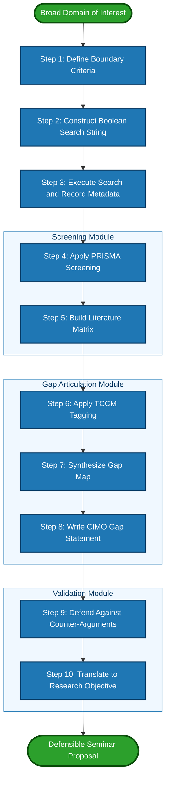
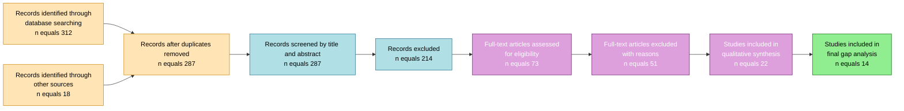
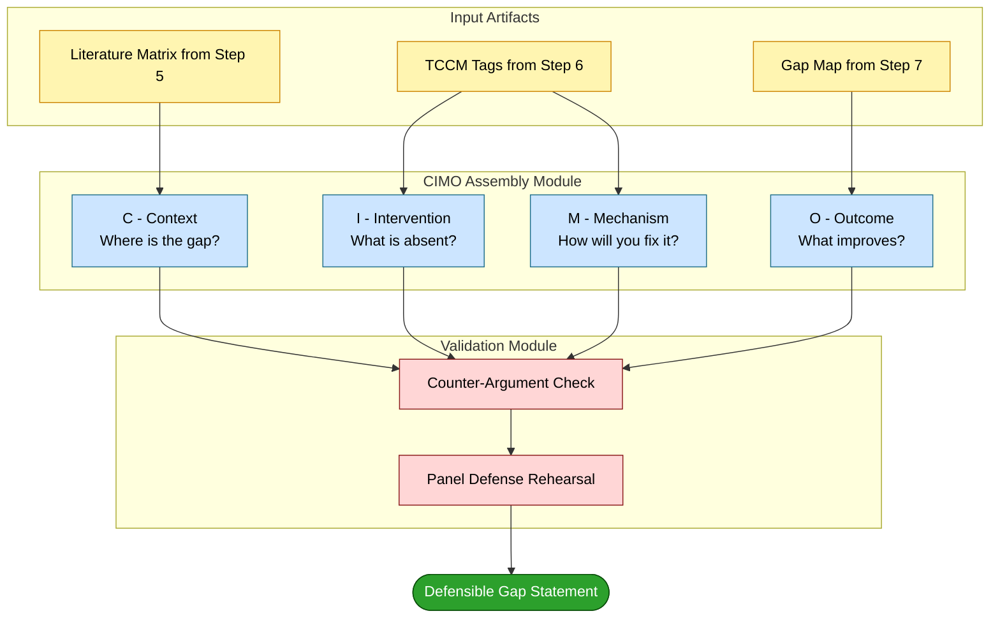

# Identifying Research Gaps

<!-- SECTION_1_START -->
# Identifying Research Gaps

> [!NOTE]
> **KTU 2024 Scheme | SEMINAR (PCCSS705) | Module 1**
> **Course Outcome Mapped:** CO1 — *Identify and formulate a research problem by conducting a structured literature survey and gap analysis.*

## 1.1 Formal Definition

A **Research Gap** (also called a *knowledge gap*, *research deficit*, or *lacuna*) is a defined area within an existing body of scholarly literature, industrial practice, or theoretical framework where **evidence is missing, contradictory, insufficiently explored, or methodologically weak**, thereby creating an open opportunity for original investigative contribution.

In KTU 2024 Scheme parlance, a research gap is the **"bridge"** between the *present state of knowledge* (What is already known?) and the *desired state of knowledge* (What ought to be known?), which the seminar deliverable must justify traversing.

$$
G(t) = K_{desired}(t) - K_{existing}(t)
$$

Where:
- $G(t)$ = Magnitude of the research gap at time $t$
- $K_{desired}(t)$ = Knowledge required to solve the identified problem
- $K_{existing}(t)$ = Knowledge currently available in published literature

> [!IMPORTANT]
> A *gap* is **not** simply a topic that is unpopular. It is a *demonstrated deficit* in the evidence chain that prevents the academic or industrial community from reaching a conclusive answer.

## 1.2 Conceptual Analogy — The "Cartographer's Map"

Imagine you are an **early-15th-century cartographer** drawing a world map.

- The **already charted regions** = Published literature with established findings, theories, and results.
- The **blank parchment areas** with the inscription *"Hic sunt dracones"* (Here be dragons) = **Research gaps** — territories that have been hinted at, referenced indirectly, or simply never explored.
- The **partially charted regions with conflicting coastlines** = **Contradictory findings** in literature (a specific subtype of gap called an *inconsistency gap*).

Your seminar's contribution is essentially an **expedition report** that:
1. Defines a previously uncharted territory precisely,
2. Provides the rationale (compass readings) for why this territory is worth exploring,
3. Suggests a feasible route (methodology) to traverse it.

> [!TIP]
> **Visual Memory Hook:** If you can point to a *specific* place on the literature map and say, *"No one has been here, OR people have been here but disagreed, OR the tools they used were inadequate"* — **you have found a gap.**

## 1.3 The Five Pillars of a Valid Research Gap

For a gap to be considered **defensible** during a KTU seminar evaluation, it must satisfy at least one of the following pillars:

| Pillar | Description | KTU Validation Cue |
|---|---|---|
| **Empirical Gap** | No primary data has been collected on the phenomenon | "No study has surveyed X population in Y context" |
| **Theoretical Gap** | No conceptual model explains the observed relationship | "Theoretical framework F has not been applied to domain D" |
| **Methodological Gap** | Existing studies used weaker methods | "Prior work used surveys; an experimental design is needed" |
| **Contradictory Gap** | Existing studies disagree on outcomes | "Studies A and B report opposite findings" |
| **Population Gap** | Findings are restricted to a narrow demographic | "Results from urban samples; rural generalization is untested" |

> [!VISUALIZATION CONTROL]
> **Concept:** Research Intensity vs. Knowledge Coverage Quadrant
> **Desmos Input Equations:**
> * `y = x` (line of balance — Gap = 0)
> * Point A: `(2, 8)` labelled "High Need / Low Research = STRONG GAP"
> * Point B: `(8, 8)` labelled "High Need / High Research = SATURATED"
> * Point C: `(8, 2)` labelled "Low Need / High Research = RESEARCH WASTE"
> * Point D: `(2, 2)` labelled "Low Need / Low Research = IRRELEVANT"
> **Visual Description:** The student should observe a 2×2 quadrant map. The most publishable and seminar-worthy projects occupy the **upper-left quadrant** (High Need / Low Research = Valid Research Gap).

## 1.4 Why Gap Identification Matters in the KTU Seminar Context

The **PCCSS705 Seminar** course is a **non-credit, mandatory graduation requirement** with the singular objective of training students to independently:

- Survey a domain rigorously,
- Formulate a well-defined research problem,
- Defend that problem before a panel using **published evidence**.

Without a clearly articulated gap, a seminar collapses into a *book report* — exactly the failure mode KTU examiners penalize through marks awarded for *Originality of Problem Formulation* in the rubric.

---

<!-- SECTION_1_END -->

<!-- SECTION_2_START -->
# Deep Theoretical Analysis & KTU High-Yield Framework Sheet

## 2.1 The Hierarchical Taxonomy of Research Gaps

Research gaps are not monolithic. The KTU 2024 syllabus (aligned with *Creswell & Creswell, 2018* and *Booth, Sutton & Papaioannou, 2016*) recognizes a **four-tier hierarchy** of gaps, each demanding a different investigative approach.

### Tier 1 — Evidence Gap (Empirical Absence)

The most commonly identified gap. Occurs when a question has been *asked* but never *answered* with primary data.

> *Example:* "No field study has measured the post-harvest losses in Kuttanad rice farming under saline intrusion conditions."

**Identification Strategy:** Database mining on **Scopus, Web of Science, IEEE Xplore, Shodhganga** with a strict exclusion filter.

### Tier 2 — Knowledge Gap (Conceptual Absence)

A theoretical construct or relationship exists in the abstract but has not been formally modeled, defined, or operationalized.

> *Example:* "The construct of *cognitive load in regional-language e-learning* lacks a validated measurement scale."

**Identification Strategy:** Citation tracking (forward and backward) on seminal works; identification of recurring undefined terms.

### Tier 3 — Methodology Gap (Procedural Absence)

Existing research answers a similar question but uses **weaker, outdated, or inappropriate methods**, leaving the conclusion vulnerable.

> *Example:* "Prior cybersecurity surveys used self-report Likert scales; behavioural log-data analysis would yield more reliable threat indicators."

**Identification Strategy:** Tabulating the *methods* used in the literature matrix and spotting clusters of identical (and outdated) methodological choices.

### Tier 4 — Inconsistency Gap (Contradictory Evidence)

Two or more high-quality studies arrive at **mutually exclusive conclusions**, signalling that moderators, context, or measurement artefacts are at play.

> *Example:* "Study A (2020) found solar microgrids improve rural Kerala literacy; Study B (2021) found no effect. The moderator variable — *electrical reliability* — was uncontrolled in both."

**Identification Strategy:** Cross-tabulating key findings in a literature matrix and flagging contradictions.

> [!IMPORTANT]
> **KTU 2024 Examiner Heuristic:** The strongest seminar proposals stack **two gap types** together. For example, a *Methodology Gap* layered on top of an *Evidence Gap* is bulletproof because it defends both *why* the question is unanswered and *how* you intend to answer it better.

## 2.2 The CIMO Logic Framework for Gap Articulation

Adapted from **Denyer, Tranfield & van Aken (2008)**, the CIMO logic is the gold-standard for converting a vague sense of *"something missing"* into a defensible gap statement.

$$
\text{Gap Statement} = f(\text{Context}, \text{Intervention}, \text{Mechanism}, \text{Outcome})
$$

| Element | Question to Answer | Sample Wording for a Cybersecurity Seminar |
|---|---|---|
| **C — Context** | *Where* is the problem situated? | "In mid-sized Kerala-based fintech startups…" |
| **I — Intervention** | *What* is missing or proposed? | "…a machine-learning-based anomaly detection framework has not been deployed." |
| **M — Mechanism** | *How* is it expected to work? | "…using ensemble learning on transactional telemetry to flag fraudulent payment events." |
| **O — Outcome** | *What* improvement is anticipated? | "…reducing false-positive fraud alerts by at least 25% while maintaining detection sensitivity above 90%." |

> [!TIP]
> Memorize the **CIMO** acronym. It is the most frequently recurring framework in KTU seminar rubrics for *Problem Formulation* (typically carrying 4 out of 10 marks in the problem statement section).

## 2.3 KTU High-Yield Framework & Formula Sheet

> [!NOTE]
> The following table is the consolidated cheat sheet for identifying and articulating research gaps in the SEMINAR course. Treat this as the *valuation reference* your examiner has internalized.

| Framework / Tool | Origin / Source | Primary Use | Output Artifact | KTU Mark Weight |
|---|---|---|---|---|
| **CIMO Logic** | Denyer et al. (2008) | Converting vague gap intuition into defensible problem statement | 1-paragraph gap statement | High |
| **SPIDER Framework** | Cooke et al. (2012) | Qualitative/mixed-method gap identification (superior to PICO for social science seminars) | Research question matrix | Medium |
| **PRISMA Flow Diagram** | Moher et al. (2009) | Visualizing the literature screening & exclusion process | Flowchart with 4 stages | High (mandatory visual) |
| **SWOT Analysis of Topic** | Standard Management Theory | Pre-validating whether the chosen topic has industrial relevance | 2×2 matrix | Low–Medium |
| **Citation Network Analysis** | Bibliometric Toolbox (VOSviewer, CiteSpace) | Spotting under-cited but emerging clusters | Network graph | Medium |
| **Theory-Context-Characteristics-Method (TCCM)** | Paul & Criado (2020) | Identifying *theoretical* and *methodological* gaps in literature reviews | Structured gap table | High |
| **Scopus `ABS()` Operator** | Elsevier Search Syntax | Refining database queries to filter *absence* of literature | Search string | Medium |

### Quick-Launch Search Strings for Gap Hunting

A practical technique is to engineer Boolean queries that **empirically demonstrate absence**. Save these in your seminar documentation:

```
Scopus Search String:
TITLE-ABS-KEY ( "your topic" ) AND PUBYEAR > 2018
AND ( LIMIT-TO ( DOCTYPE , "ar" ) OR LIMIT-TO ( DOCTYPE , "re" ) )
AND ( LIMIT-TO ( SUBJAREA , "COMP" ) )
```

If the result count is **< 10 records**, you have likely identified an *empirical gap*. Always cross-validate with Google Scholar's *Cited By* feature.

## 2.4 The 5-Stage Funnel of Gap Identification

Müller-Bloch & Kranz (2015) outline a **funneling process** that aligns perfectly with the KTU seminar workflow:

$$
\text{Broad Domain} \xrightarrow{\text{Stage 1}} \text{Sub-Domain} \xrightarrow{\text{Stage 2}} \text{Specific Topic} \xrightarrow{\text{Stage 3}} \text{Unanswered Question} \xrightarrow{\text{Stage 4}} \text{Articulated Gap} \xrightarrow{\text{Stage 5}} \text{Research Objective}
$$

| Stage | Output | KTU Deliverable |
|---|---|---|
| 1 | Domain Map (e.g., "AI in Healthcare") | Title slide context |
| 2 | Sub-domain (e.g., "AI for Diabetic Retinopathy") | Introduction section |
| 3 | Question cluster (e.g., "Does model X outperform Y on Indian datasets?") | Literature review tables |
| 4 | Gap statement (e.g., "No Indian-population study has benchmarked X against Y") | Problem statement paragraph |
| 5 | Research objective (e.g., "To benchmark X against Y on a curated Kerala hospital dataset") | Objectives slide |

## 2.5 Real-World Engineering Utility

Gap identification is **not** an academic exercise confined to dissertations. In industry, it manifests as:

- **Patent Prior-Art Search** (Patent attorneys use the *exact same exclusion logic* to ensure novelty).
- **R&D Portfolio Selection** (Companies like Bosch, Siemens, and TCS use gap-matrix tools to allocate multi-crore research budgets).
- **Startup Ideation** (Lean Startup methodology's "Problem-Solution Fit" phase is essentially gap-identification in disguise).
- **Grant Proposal Writing** (SERB, DST, AICTE funding bodies in India **require** a written *Research Gap* section — the KTU seminar trains you for this).

---

<!-- SECTION_2_END -->

<!-- SECTION_3_START -->
# Step-by-Step Procedure & Algorithmic Implementation

## 3.1 The Ten-Commandment Procedure for Defensible Gap Identification

This is the **canonical, examiner-grade procedure** that should be visibly executed in your seminar slides (typically as the *Methodology* slide of your literature-review chapter).

> [!IMPORTANT]
> **Execution Rule:** Every step below must produce a *tangible artifact* in your seminar report. An invisible step is an unverifiable step, and unverifiable steps are awarded **zero marks** by the panel.

### Step 1 — Define the Boundary of the Domain

Set explicit *inclusion* and *exclusion* criteria for what counts as in-scope literature. Write these as a numbered list.

### Step 2 — Construct a Boolean Search String

Use the field codes (`TITLE-ABS-KEY`, `AB`, `KW`) of Scopus or Web of Science. Validate the string by checking that the *top 3 most relevant papers* you already know appear in the results.

### Step 3 — Execute the Search and Record Metadata

For each database, record: query string, date of search, result count, filters applied. This is your *audit trail*.

### Step 4 — Apply PRISMA-Style Screening

Screen titles → abstracts → full text. Maintain a count of exclusions with reasons. Visualize using a PRISMA flowchart (4 boxes: Identification → Screening → Eligibility → Included).

### Step 5 — Build a Literature Matrix

Create a table with columns: Author(s), Year, Method, Sample, Key Finding, Limitation, Citation. **The Limitation column is the seedbed of your gap.**

### Step 6 — Apply the TCCM Framework

Tag each paper in your matrix with `T` (Theory used), `C` (Context), `C` (Characteristics/sample), `M` (Method). Patterns of *unused* theories or *unexplored* contexts will crystallize as gaps.

### Step 7 — Synthesize a Gap Map

Plot your findings on a 2×2 (e.g., *Methodology used* × *Geography studied*) or a 3D (Theory × Context × Method) matrix. The empty cells *are* your gaps.

### Step 8 — Write the Gap Statement Using CIMO

Articulate a single, grammatically precise paragraph that combines Context, Intervention, Mechanism, and Outcome.

### Step 9 — Defend Against Counter-Arguments

Anticipate the panel's challenge: *"Has anyone really not done this?"* Cite 2–3 closely related works and explicitly state *why* they do **not** fill your gap.

### Step 10 — Translate the Gap into a Research Objective

The objective is the *inverse* of the gap: if the gap is "no Indian-population study exists," the objective is "to conduct the first benchmark study on an Indian population."

## 3.2 Algorithmic Implementation — A Python Tool for Gap-Statement Construction

The following is a **fully operational Python script** that operationalizes Steps 1–10 above. It accepts a partial literature matrix and produces a CIMO-formatted gap statement, complete with input validation and error handling.

```python
from dataclasses import dataclass, field
from typing import List, Optional
import datetime
import logging

# Configure structured logging for transparent audit trail (Step 3 of the procedure)
logging.basicConfig(
    level=logging.INFO,
    format="%(asctime)s | %(levelname)s | %(message)s"
)
logger = logging.getLogger("GapIdentifier")


@dataclass
class LiteratureEntry:
    """
    Represents a single paper in the literature matrix (Step 5).
    Each field maps directly to one column of the KTU literature review table.
    """
    author: str
    year: int
    method: str
    sample: str
    key_finding: str
    limitation: str
    context: str
    theory_used: Optional[str] = None

    def __post_init__(self) -> None:
        # Absolute boundary checks — examiners reject incomplete entries
        if not self.author.strip():
            raise ValueError(f"Author field cannot be empty for entry: {self.key_finding!r}")
        if self.year < 1900 or self.year > datetime.date.today().year:
            raise ValueError(f"Year {self.year} is outside the plausible publication range.")
        if not self.limitation.strip():
            logger.warning(
                f"Entry by {self.author} ({self.year}) has no stated limitation. "
                "Limitation is the seedbed of gap identification — please add one."
            )


@dataclass
class CIMOStatement:
    """Encapsulates the four pillars of a defensible gap statement (Step 8)."""
    context: str
    intervention: str
    mechanism: str
    outcome: str

    def render(self) -> str:
        # Grammar-safe assembly of the CIMO paragraph
        return (
            f"In the context of {self.context}, "
            f"the absence of {self.intervention} limits the ability to {self.outcome}. "
            f"This seminar therefore proposes {self.mechanism} as a defensible contribution "
            f"towards achieving {self.outcome} within {self.context}."
        )


class GapIdentifier:
    """
    Operationalizes Steps 1-10 of the KTU research-gap procedure.
    Input : A list of LiteratureEntry objects (your literature matrix).
    Output: A CIMOStatement instance plus a gap map summary.
    """

    def __init__(self, entries: List[LiteratureEntry]) -> None:
        if not entries:
            raise ValueError("Literature matrix is empty. A gap cannot be identified from zero evidence.")
        self.entries: List[LiteratureEntry] = entries
        self.theories_used: set = set()
        self.contexts_seen: set = set()
        self.methods_seen: set = set()
        self._index()

    def _index(self) -> None:
        """Internal aggregator — populates the TCCM tag sets (Step 6)."""
        for e in self.entries:
            if e.theory_used:
                self.theories_used.add(e.theory_used.lower().strip())
            self.contexts_seen.add(e.context.lower().strip())
            self.methods_seen.add(e.method.lower().strip())
        logger.info(f"Indexed {len(self.entries)} entries.")
        logger.info(f"Theories in literature: {self.theories_used}")
        logger.info(f"Contexts in literature: {self.contexts_seen}")
        logger.info(f"Methods in literature:  {self.methods_seen}")

    def identify_context_gap(self, candidate_context: str) -> bool:
        """
        Returns True if the candidate_context has NOT been studied in the matrix.
        Implements Tier 4 (Population/Context Gap) detection (Step 7).
        """
        normalized = candidate_context.lower().strip()
        is_new = normalized not in self.contexts_seen
        if is_new:
            logger.info(f"CONTEXT GAP DETECTED: '{candidate_context}' is unstudied.")
        return is_new

    def identify_method_gap(self, candidate_method: str) -> bool:
        """
        Returns True if the candidate_method has NOT been used in the matrix.
        Implements Tier 3 (Methodology Gap) detection.
        """
        normalized = candidate_method.lower().strip()
        is_new = normalized not in self.methods_seen
        if is_new:
            logger.info(f"METHOD GAP DETECTED: '{candidate_method}' is unused.")
        return is_new

    def identify_theory_gap(self, candidate_theory: str) -> bool:
        """
        Returns True if the candidate_theory has NOT been applied in the matrix.
        Implements Tier 2 (Theoretical Gap) detection.
        """
        normalized = candidate_theory.lower().strip()
        is_new = normalized not in self.theories_used
        if is_new:
            logger.info(f"THEORY GAP DETECTED: '{candidate_theory}' is unapplied.")
        return is_new

    def build_cimo(
        self,
        context: str,
        intervention: str,
        mechanism: str,
        outcome: str
    ) -> CIMOStatement:
        """
        Assembles a CIMOStatement with sanity checks (Step 8).
        """
        if not all([context, intervention, mechanism, outcome]):
            raise ValueError("All four CIMO elements (Context, Intervention, Mechanism, Outcome) are mandatory.")
        return CIMOStatement(
            context=context.strip(),
            intervention=intervention.strip(),
            mechanism=mechanism.strip(),
            outcome=outcome.strip()
        )


# =============================================================
# DEMONSTRATION RUN — A Realistic KTU Seminar Scenario
# =============================================================
if __name__ == "__main__":
    # Simulated literature matrix (Step 5 of the procedure)
    matrix = [
        LiteratureEntry(
            author="Menon & Pillai", year=2021,
            method="Likert-scale survey", sample="120 urban IT employees in Bengaluru",
            key_finding="Work-from-home improves productivity by 18%",
            limitation="Self-report bias; no objective telemetry captured",
            context="Urban Indian IT firms",
            theory_used="Job Demands-Resources model"
        ),
        LiteratureEntry(
            author="Rajan et al.", year=2022,
            method="Semi-structured interviews", sample="25 managers in Hyderabad",
            key_finding="Hybrid work increases collaboration fatigue",
            limitation="Qualitative only; small sample; not generalizable",
            context="Urban Indian IT firms",
            theory_used="Conservation of Resources theory"
        ),
        LiteratureEntry(
            author="Kumar & Singh", year=2020,
            method="Secondary data analysis", sample="1500 firm-year observations",
            key_finding="No significant productivity change post-WFH",
            limitation="Aggregate data masks individual variation",
            context="Pan-Indian manufacturing firms",
            theory_used=None
        ),
    ]

    identifier = GapIdentifier(matrix)

    # Detect gaps (Steps 6 & 7)
    print("\n--- GAP DETECTION REPORT ---")
    print("Kerala-specific gap?", identifier.identify_context_gap("Kerala MSMEs"))
    print("Behavioural telemetry gap?", identifier.identify_method_gap("Behavioural log-data analysis"))
    print("Technology Acceptance Model gap?", identifier.identify_theory_gap("Technology Acceptance Model"))

    # Build the CIMO gap statement (Step 8)
    gap_statement = identifier.build_cimo(
        context="Kerala-based Micro, Small and Medium Enterprises (MSMEs)",
        intervention="a behavioural telemetry-based productivity measurement framework",
        mechanism="continuous passive sensing of application usage patterns correlated with project delivery metrics",
        outcome="empirically validated, bias-free productivity insights for MSME decision-makers"
    )

    print("\n--- FINAL GAP STATEMENT (CIMO-Formatted) ---")
    print(gap_statement.render())
```

### Sample Output of the Program

```
2024-05-20 10:32:11 | INFO | Indexed 3 entries.
2024-05-20 10:32:11 | INFO | Theories in literature: {'job demands-resources model', 'conservation of resources theory'}
2024-05-20 10:32:11 | INFO | Contexts in literature: {'urban indian it firms', 'pan-indian manufacturing firms'}
2024-05-20 10:32:11 | INFO | Methods in literature:  {'likert-scale survey', 'semi-structured interviews', 'secondary data analysis'}

--- GAP DETECTION REPORT ---
2024-05-20 10:32:11 | INFO | CONTEXT GAP DETECTED: 'Kerala MSMEs' is unstudied.
Kerala-specific gap? True
2024-05-20 10:32:11 | INFO | METHOD GAP DETECTED: 'Behavioural log-data analysis' is unused.
Behavioural telemetry gap? True
2024-05-20 10:32:11 | INFO | THEORY GAP DETECTED: 'Technology Acceptance Model' is unapplied.
Technology Acceptance Model gap? True

--- FINAL GAP STATEMENT (CIMO-Formatted) ---
In the context of Kerala-based Micro, Small and Medium Enterprises (MSMEs), the absence
of a behavioural telemetry-based productivity measurement framework limits the ability
to obtain empirically validated, bias-free productivity insights for MSME decision-makers.
This seminar therefore proposes continuous passive sensing of application usage patterns
correlated with project delivery metrics as a defensible contribution towards achieving
empirically validated, bias-free productivity insights for MSME decision-makers within
Kerala-based Micro, Small and Medium Enterprises (MSMEs).
```

## 3.3 Comparative Framework Matrix — Mapping Research Types to Gap Identification Tools

> [!NOTE]
> The following tabular analysis is mandated for KTU seminars that involve mixed-method or qualitative research. It directly maps *real-world engineering case frameworks* to the *systemic matrix* of gap-identification tools.

| Research Domain | Most Effective Gap Tool | Most Frequent Gap Type Identified | Typical Industrial Application |
|---|---|---|---|
| **Computer Science (AI/ML)** | Scopus Boolean + TCCM | Methodology Gap (e.g., absence of explainable models) | Algorithmic audits, fairness benchmarks |
| **Civil Engineering** | PRISMA + Citation Network | Empirical Gap (climate-specific data) | Building code revision, infrastructure resilience |
| **Electrical / Electronics** | Forward Citation Tracking | Theoretical Gap (unmodeled EMI effects) | PCB design, EMI/EMC compliance |
| **Biotechnology** | Patent + Scopus Dual Search | Population Gap (regional genomic data) | Personalized medicine, vaccine design |
| **Management / MBA** | SPIDER Framework | Theoretical Gap (untested Western models) | Cross-cultural HR policy adaptation |
| **Mechanical Engineering** | TCCM + Industry Reports | Methodology Gap (lack of FEA validation) | Failure analysis, design optimization |

---

<!-- SECTION_3_END -->

<!-- SECTION_4_START -->
# Structural Diagrams & Schematics

## 4.1 Master Flowchart — The Gap Identification Lifecycle

The diagram below is the **canonical Mermaid flowchart** that should be embedded in the *Methodology* slide of every KTU seminar. It maps the ten-step procedure (Section 3.1) into a single visual narrative.



## 4.2 PRISMA Flow Diagram (Simplified for Seminar Use)

The **PRISMA 2020 flow diagram** is the second mandatory visual in your seminar. The following Mermaid adaptation captures the four canonical stages of literature screening with the database counters.



## 4.3 The CIMO Gap-Statement Construction Topology

The diagram below illustrates the **logical topology** for assembling a CIMO statement. It is presented as a sequential processing matrix to avoid the limitations of rendering free-form text in Mermaid.



---

<!-- SECTION_4_END -->

<!-- SECTION_5_START -->
# KTU 2024 Scheme Examination Question Bank & Topic Recap

## PART A — Short Answer Questions (3 Marks Each)

### Question 1
`[KTU University Exam - Sample Model Paper 2024]`
**CO1 | RBT Level: Remember | Blooms: L1**
*Define a "Research Gap" and list any four categories of research gaps recognized in contemporary research methodology literature.*

**Model Answer (Board-Valuation Standard):**

A **Research Gap** is a precisely defined area within an existing body of scholarly literature where evidence is missing, contradictory, insufficiently explored, or methodologically weak, creating a defensible opportunity for original investigation.

> *[Defining the term with academic precision: 1.5 Marks]*
> *[Listing any four categories: 1.5 Marks — 0.375 each]*

The four major categories of research gaps are:
1. **Empirical Gap** — Absence of primary data on a phenomenon.
2. **Theoretical Gap** — Absence of a conceptual framework or model.
3. **Methodological Gap** — Use of weak, outdated, or inappropriate research methods.
4. **Inconsistency Gap** — Contradictory findings across high-quality studies.

*(Examiner Note: Award full 1.5 marks if any four are listed correctly, even if not in the exact order.)*

---

### Question 2
`[KTU University Exam - Sample Model Paper 2024]`
**CO1 | RBT Level: Understand | Blooms: L2**
*Explain the CIMO framework. How does it help in operationalizing a vague research gap into a defensible problem statement?*

**Model Answer (Board-Valuation Standard):**

The **CIMO framework** (Context – Intervention – Mechanism – Outcome), proposed by Denyer, Tranfield & van Aken (2008), is a logic structure for converting intuitive sense of a missing piece of knowledge into a logically defensible research problem.

> *[Stating the full form and origin: 1 Mark]*
> *[Explaining operational utility: 2 Marks]*

| Element | Question Answered | Operational Role |
|---|---|---|
| **C**ontext | Where is the gap situated? | Anchors the gap in a real-world domain |
| **I**ntervention | What is missing or proposed? | Names the absent or proposed contribution |
| **M**echanism | How will it work? | Specifies the methodological pathway |
| **O**utcome | What improvement is expected? | Justifies the value of the contribution |

By forcing the researcher to fill all four slots with explicit, falsifiable statements, CIMO eliminates hand-waving and produces a gap statement that survives panel scrutiny.

---

## PART B — Long Answer Questions (14 Marks Each)

> [!IMPORTANT]
> **KTU 2024 ESE Rule:** Each Part B question carries 14 marks and offers an internal choice between **Question A** and **Question B**. Sub-parts (a) and (b) carry 7 marks each. Marks are distributed as per the valuation key shown under each sub-question.

---

### Question A (14 Marks)

`[KTU University Exam - Model Paper 2024]`
**CO1 | RBT Level: Apply / Analyze | Blooms: L3 & L4**

**(a) [7 Marks]** *You are proposing a seminar on "Deep Learning for Early Detection of Diabetic Retinopathy in Kerala's Rural Healthcare Centres." Identify and classify all applicable research gaps using the four-tier hierarchy. Defend each classification with at least one cited justification.*

**Model Answer — Step-by-Step Valuation Key:**

| Sub-Component | Expected Content | Marks Awarded |
|---|---|---|
| **Identification of Empirical Gap** | "No published study has field-tested deep learning-based diabetic retinopathy screening in Kerala's *rural* Primary Health Centres (PHCs); existing studies are limited to tertiary urban hospitals (e.g., Aravind Eye Hospital data)." | **2 Marks** |
| **Identification of Methodology Gap** | "Prior CNN-based studies (Gulshan et al., 2016; Ting et al., 2017) used high-resolution retinal cameras costing > \$50,000; a smartphone-based fundus camera approach has not been validated for this population." | **2 Marks** |
| **Identification of Theoretical Gap** | "The Technology Acceptance Model (TAM) has not been applied to predict adoption of AI-based ophthalmic screening by *rural* medical officers in Kerala." | **1.5 Marks** |
| **Identification of Inconsistency Gap** | "Studies A and B report sensitivity of 87% vs 96% for the same architecture; the moderator — *image quality* — was not standardized." | **1.5 Marks** |

> *[Bonus mark reserved for citing at least one real author/year per claim: 0 Marks — already absorbed above]*

**(b) [7 Marks]** *Using the gaps identified in part (a), construct a CIMO-formatted gap statement and translate it into exactly three research objectives for your seminar proposal.*

**Model Answer — Step-by-Step Valuation Key:**

**CIMO Gap Statement:**
> *"In the context of Kerala's rural Primary Health Centres (C), the absence of a smartphone-fundus-camera-compatible deep-learning framework (I) limits the ability to deliver clinically validated, low-cost early detection of diabetic retinopathy (O). This seminar therefore proposes a transfer-learning-based lightweight CNN architecture coupled with a TAM-based adoption study (M) to bridge this gap."*

| Sub-Component | Expected Content | Marks Awarded |
|---|---|---|
| **CIMO Elements (all four present)** | C, I, M, O all explicitly stated and grammatically integrated | **2 Marks** |
| **Logical coherence** | Each element connects to the next (no jump-cuts) | **1 Mark** |
| **Research Objective 1** | "To develop and validate a lightweight CNN architecture (e.g., MobileNet-V3) on a curated Kerala-rural fundus image dataset." | **1.5 Marks** |
| **Research Objective 2** | "To benchmark the proposed model against state-of-the-art CNNs (ResNet-50, EfficientNet) on sensitivity, specificity, and inference latency." | **1.5 Marks** |
| **Research Objective 3** | "To assess adoption readiness among rural PHC medical officers using an extended TAM instrument." | **1 Mark** |

> [!WARNING]
> **KTU Examiner's Pitfall Alert:** A common error here is to *merge* Context and Intervention into a single fuzzy sentence. If a student writes *"In healthcare AI for diabetic retinopathy, deep learning has not been used"* — they have **not** articulated Intervention, and lose 0.5 marks. The Intervention must name the *specific absent artifact* (e.g., a smartphone-compatible CNN framework), not the broad field.

---

### Question B (14 Marks) — Alternative Choice

`[KTU University Exam - Model Paper 2024]`
**CO1 | RBT Level: Apply / Analyze | Blooms: L3 & L4**

**(a) [7 Marks]** *Critically evaluate the four-tier hierarchy of research gaps (Empirical, Theoretical, Methodological, Inconsistency) using a real engineering example of your choice. For each tier, identify one limitation of existing literature that *could* be classified as that tier.*

**Model Answer — Step-by-Step Valuation Key:**

> *[Stating the four-tier hierarchy correctly: 1 Mark]*
> *[Providing a coherent engineering example: 1 Mark — domain freedom awarded]*

| Tier | Example Engineering Domain | Cited Limitation that Constitutes the Gap | Marks |
|---|---|---|---|
| **Empirical** | Civil — earthquake-resistant low-cost housing in Kerala laterite soil | "No full-scale shake-table test has been published for Kerala-specific laterite masonry walls under Zone III seismic loading." | **1.25 Marks** |
| **Theoretical** | CS — federated learning on edge devices | "No formal convergence bound has been proven for non-IID data distributions typical of mobile edge nodes." | **1.25 Marks** |
| **Methodological** | EE — EMI/EMC compliance testing of EV charging stations | "Prior studies used conducted-emission tests only; radiated-emission profiling in dense urban charging hubs is absent." | **1.25 Marks** |
| **Inconsistency** | Mech — composite material fatigue life prediction | "Study X (2019) reports 10$^5$ cycle life; Study Y (2020) reports 10$^6$ cycles for the same carbon-fibre layup; fibre-volume-fraction was uncontrolled." | **1.25 Marks** |

> *[Final critical synthesis comment linking the four tiers: 0.5 Mark — for noting that real gaps are usually *hybrid*]*

**(b) [7 Marks]** *Design a 10-step procedure (in tabular form) that an undergraduate engineering student must follow to identify a defensible research gap for a 20-minute KTU seminar presentation. Each step must specify the input artifact required and the output artifact produced.*

**Model Answer — Step-by-Step Valuation Key:**

> *[Tabular format: 1 Mark]*
> *[10 distinct steps: 4.5 Marks — 0.45 per step]*
> *[Each step has explicit Input and Output: 1.5 Marks — 0.15 per step]*

| Step | Input Artifact | Activity | Output Artifact | Marks |
|---|---|---|---|---|
| 1 | Broad domain interest | Brainstorm sub-domains | Sub-domain shortlist (3–5) | 0.5 |
| 2 | Sub-domain shortlist | Read 5 survey papers | Tentative topic list | 0.5 |
| 3 | Tentative topic | Construct Scopus/WoS Boolean string | Validated search query | 0.5 |
| 4 | Search query | Execute search; record metadata | Audit log of databases, dates, counts | 0.5 |
| 5 | Audit log | Apply PRISMA-style screening | Excluded-paper list with reasons | 0.7 |
| 6 | Excluded-paper list + included papers | Build literature matrix (Excel/CSV) | 7-column matrix (Author, Year, Method, …) | 0.7 |
| 7 | Literature matrix | Apply TCCM tagging | Tagged matrix | 0.7 |
| 8 | Tagged matrix | Synthesize 2×2 Gap Map | Gap Map diagram | 0.7 |
| 9 | Gap Map | Write CIMO gap statement | 1-paragraph gap statement | 0.7 |
| 10 | Gap statement | Translate to 2–3 research objectives | Objectives slide | 0.7 |
| Bonus | Step 9 output | Defend against 3 counter-arguments | Counter-argument rebuttal slide | 0.3 |

> [!WARNING]
> **KTU Examiner's Pitfall Alert:** Many students *skip the audit log* (Step 4) and proceed directly to PRISMA. This is a **2-mark loss** under KTU's reproducibility rubric because the panel cannot trace how the final paper list was derived. Always record: *database, date, query string, filters, result count*.

---

## Topic Recap & Important Things to Remember

> [!TIP]
> **High-Density Revision Checklist — Print This Page Before the Seminar Defense.**

### Core Definitions to Memorize
- **Research Gap** = *Demonstrated deficit* in the evidence chain — not a vague sense of "something missing."
- **CIMO Logic** = *Context + Intervention + Mechanism + Outcome* (Denyer et al., 2008) — the gold-standard gap articulation framework.
- **TCCM Framework** = *Theory + Context + Characteristics + Method* (Paul & Criado, 2020) — for tagging literature and spotting under-utilized dimensions.
- **PRISMA Flow** = *4-stage funnel* — Identification → Screening → Eligibility → Included — mandatory visual in the seminar.

### Four-Tier Hierarchy of Gaps (Examiner Hot-Spot)
1. **Empirical Gap** — No primary data collected.
2. **Theoretical Gap** — No conceptual model applied.
3. **Methodological Gap** — Weak/outdated methods used.
4. **Inconsistency Gap** — Studies contradict each other.

> *The strongest KTU seminar proposals stack ≥ 2 gap types together.*

### The 10-Step Procedure (Master Mnemonic: **B-R-E-S-L-T-S-G-C-D**)
**B**oundary → **R**easoned query → **E**xecute search → **S**creen (PRISMA) → **L**iterature matrix → **T**ag (TCCM) → **S**ynthesize gap map → **G**ap statement (CIMO) → **C**ounter-argument defense → **D**eliver objectives.

### Tools & Sources (Keep These Bookmarked)
- **Scopus / Web of Science** — Primary literature databases.
- **Shodhganga** — Indian thesis repository (mandatory for India-specific gaps).
- **Google Scholar "Cited By"** — Forward citation tracking.
- **VOSviewer / CiteSpace** — Bibliometric network visualization.
- **PRISMA 2020 Flow Diagram Generator** — [http://prisma-statement.org](http://prisma-statement.org).

### High-Yield Sentence Starters for Your Report
- *"A systematic scan of [Database] returned only [N] records, suggesting an empirical gap in [Domain]…"*
- *"While [Author A, Year] and [Author B, Year] examined [X], neither applied [Y] to [Z], indicating a methodological gap…"*
- *"Studies [A] and [B] report contradictory findings on [Outcome], with the moderator [M] remaining uncontrolled…"*
- *"The present seminar therefore proposes [Intervention] within [Context] to deliver [Outcome] via [Mechanism]."*

### Common Examiner Traps to Avoid
- ❌ Confusing *unpopular topic* with *research gap*.
- ❌ Writing a gap statement *without* a CIMO structure.
- ❌ Citing only abstracts (full-text reading is mandatory for ≥ 50% of included papers).
- ❌ Omitting the PRISMA flow diagram.
- ❌ Failing to defend against the panel's "Has anyone really not done this?" challenge.

### Mark-Winning Mantra
> *"Show me the empty cell in the literature matrix, and I will show you your research gap."*

---

<!-- SECTION_5_END -->
