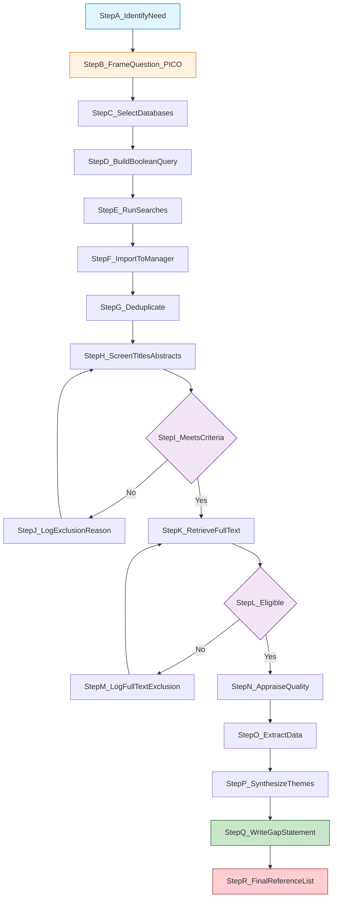
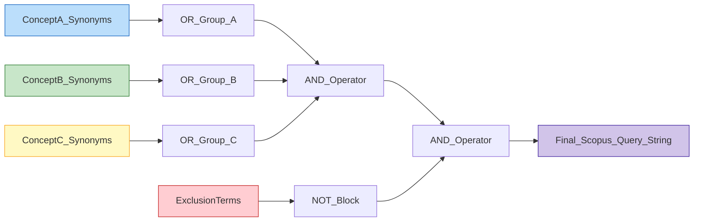
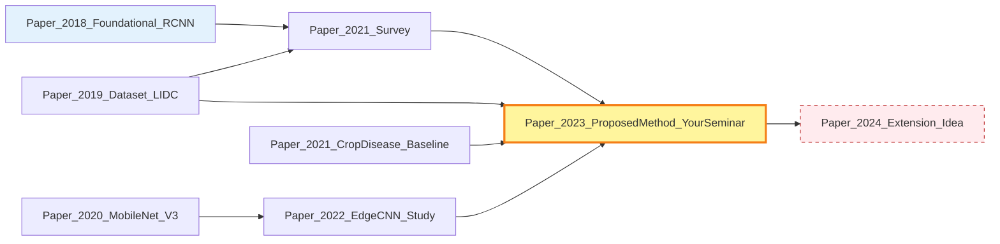
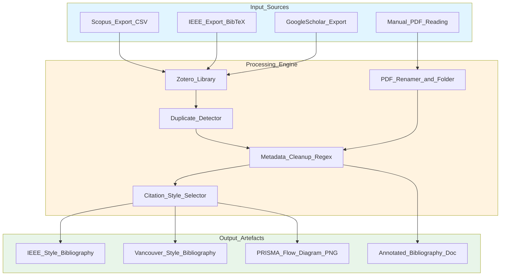
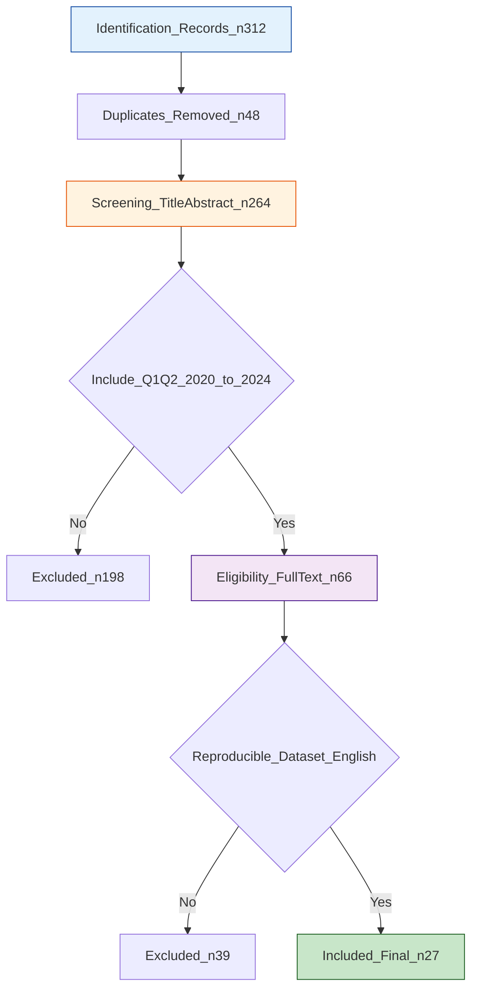

# Literature Search and Review

<!-- SECTION_1_START -->
# Literature Search and Review

## 1.1 Formal Academic Definition

> [!NOTE]
> **Literature Review (KTU 2024 Definition):** A *literature review* is a systematic, explicit, and reproducible method for identifying, evaluating, synthesizing, and documenting the existing body of published scholarly work relevant to a defined research problem, theoretical framework, or area of inquiry. It is not a passive summary — it is an *active scholarly argument* that maps the frontier of knowledge and exposes the *research gap* the proposed study intends to fill.

In KTU 2024 Scheme parlance (PCCSS705 – Seminar), a literature search and review forms the **critical evidence-base** of the seminar report. Without it, the student's identified "gap" is unjustifiable, and the seminar collapses into an opinion piece rather than a research artefact.

> [!IMPORTANT]
> **Key KTU Board Vocabulary You Must Use:**
> - **Primary Source** – Original, first-hand research (journal article describing a new experiment, patent, raw dataset).
> - **Secondary Source** – Interpretation, review, or summary of primary sources (textbooks, review articles, meta-analyses).
> - **Tertiary Source** – Indexes, bibliographies, encyclopaedias, and abstracting services (Scopus, Web of Science, Google Scholar indices).
> - **Research Gap** – The explicit, citable absence or contradiction in existing literature that your seminar topic addresses.

---

## 1.2 Conceptual Analogy — The "Library Detective"

Imagine you are a **detective arriving at the scene of a 10-year-old unsolved case (your research problem)**. The *literature* is the city's entire archive of evidence.

- **Step 1 — Knocking on doors (Search):** You cannot break into every house. You knock only on the doors most likely to hold clues — but first you must *learn the addresses* (databases, journals, keywords). A detective who only checks one street corner will miss the real culprit.
- **Step 2 — Interviewing witnesses (Critical Appraisal):** Some witnesses are reliable (peer-reviewed RCTs in Q1 journals); some are unreliable (blog posts, predatory journals). You must evaluate *who* to believe and *why*.
- **Step 3 — Pinning the evidence board (Synthesis):** Clippings alone are useless. You arrange them in a timeline, draw red strings, and present a coherent story. That story is your literature review.
- **Step 4 — Pointing at the empty chair (Gap Identification):** Finally, you show the panel that the prime suspect is still at large — that chair is your *research gap*.

> [!TIP]
> **KTU Examiner Heuristic:** If a student writes a literature review that reads like a list of "Author A said X. Author B said Y" with no synthesis, they will lose **3 of 14 marks immediately** for lack of critical commentary.

---

## 1.3 Why This Topic Matters in PCCSS705

The Seminar course (PCCSS705) culminates in a **30-minute presentation + report** evaluated by a faculty panel. Module 1 explicitly demands that the student:

1. Identify a topic (Module 1, Session 1).
2. Conduct a **structured literature search** (Module 1, Session 2 ← *this topic*).
3. Write a **critically appraised review** of 15–25 sources.
4. Formulate a research gap → problem statement → objectives.

> [!WARNING]
> **Common Student Mistake:** Treating "Literature Review" as "copy-paste 20 abstracts from Google Scholar." KTU evaluators scan for: (a) logical Boolean search strings, (b) citation discipline (Vancouver/IEEE), (c) explicit gap statement, (d) thematic clustering — not raw count of papers.

---

## 1.4 Visualization of the Information Universe

> [!VISUALIZATION CONTROL]
> **Concept:** The "Information Funnel" of a Literature Search
> **Visual Description:** A funnel-shaped diagram where the wide top represents *all information ever produced* (≈ 300 million scholarly items as of 2024). The funnel narrows down through keyword filtering → database scoping → inclusion/exclusion criteria → quality appraisal → the final ~15–25 papers used in the review. Students should picture each filter layer *removing* papers, not just adding them.

---

<!-- SECTION_2_START -->
# Deep Theoretical Analysis & KTU High-Yield Reference Sheet

## 2.1 The Five-Phase Architecture of a Literature Search & Review

A KTU-board-compliant literature search is **not** a single act of Googling. It is a five-phase engineering process.

### Phase 1 — Scoping & Question Framing (PICO / SPIDER / PEO)

Before searching, the student must convert the broad topic into a *searchable research question* using a formal framework.

| Framework | Best Suited For | Mnemonic Expansion | KTU-Recommended Use |
|---|---|---|---|
| **PICO** | Quantitative / Clinical / Engineering empirical | **P**opulation, **I**ntervention, **C**omparison, **O**utcome | Experimental CSE branches |
| **SPIDER** | Qualitative / Mixed methods | **S**ample, **P**henomenon of **I**nterest, **D**esign, **E**valuation, **R**esearch type | Social science seminars |
| **PEO** | Etiology / exploratory | **P**opulation, **E**xposure, **O**utcome | Public-health & policy seminars |
| **PICo** | Qualitative (no Comparison) | **P**opulation, **I**nterest, **C**ontext | Humanities seminars |

> [!IMPORTANT]
> **KTU Examiner Tip:** Writing your seminar objective as *"To study Machine Learning"* guarantees a poor grade. Reframe it as: *"To evaluate the effectiveness of **Convolutional Neural Networks (P)** versus **Transformer-based Vision Models (I/C)** for **medical image classification of lung nodules (O)** in datasets published between 2019–2024."* The bracketed PICO elements must be visible.

### Phase 2 — Database Selection & Boolean Logic

The choice of database determines the *kind* of evidence retrieved.

| Database | Coverage | Strength | KTU Citation Tip |
|---|---|---|---|
| **Scopus** | 1966+, ≈ 25,000 journals | Citation tracking, author h-index | Most preferred by KTU CSE panel |
| **Web of Science (WoS)** | 1900+, curated | Impact Factor, JCR quartiles | Preferred for citation classics |
| **IEEE Xplore** | Engineering / CS | Conference proceedings, standards | Mandatory for ECE/EEE seminars |
| **ACM Digital Library** | CS core | Peer-reviewed CS literature | Mandatory for CSE/IT seminars |
| **PubMed / MEDLINE** | Biomedical | MeSH terms, clinical trials | Mandatory for Biotech/Medical seminars |
| **Google Scholar** | All disciplines, full-text | Grey literature, theses | Use as supplement, not primary source |

> [!WARNING]
> **KTU Pitfall:** Citing only Google Scholar hits is risky because Scholar indexes predatory journals with no quality filter. Always cross-verify Q1/Q2 status via **Scopus Source List** or **JCR**.

**Boolean Operators — The Algebra of Search:**

$$\text{Query} = (T_1 \lor T_2 \lor T_3) \land (T_4 \lor T_5) \land \neg T_6$$

Where:
- $T_1, T_2, T_3$ = synonymous terms for **Concept A** (joined with OR)
- $T_4, T_5$ = synonymous terms for **Concept B** (joined with OR)
- $T_6$ = exclusion terms (e.g., "review", "animal study")
- $\lor$ = OR (broadens), $\land$ = AND (narrows), $\neg$ = NOT (excludes)

> [!TIP]
> **Wildcard Operator:** In Scopus, `comput*` matches *computer, computing, computational, computation*. Use this to capture morphological variants in one search.

### Phase 3 — Screening (PRISMA Flow)

The **Preferred Reporting Items for Systematic Reviews and Meta-Analyses (PRISMA 2020)** flow is the *gold standard* KTU evaluators recognize.

The flow has four quadrants:

1. **Identification** — Records identified through database searching and other sources.
2. **Screening** — Titles/abstracts screened → exclusions with reasons.
3. **Eligibility** — Full-text reports assessed for eligibility → exclusions with reasons.
4. **Included** — Final studies included in the review (n = your citation count).

### Phase 4 — Critical Appraisal

Every included source must be evaluated, not summarized. The student must explicitly answer, for each paper:

- What is the *research design*? (RCT, case study, simulation, survey, systematic review?)
- What is the *sample size / dataset size*?
- What *validity threats* exist? (selection bias, overfitting, small N)
- Is the journal *Q1 / Q2 / Scopus-indexed*? Cite the quartile.

> [!NOTE]
> **Appraisal Tools** (engineers may skip the full instrument but must mention the *category*):
> - **CASP** — qualitative & quantitative
> - **AMSTAR 2** — systematic reviews
> - **JBI Critical Appraisal** — mixed methods
> - **ROBINS-I / Cochrane RoB 2** — risk of bias

### Phase 5 — Synthesis & Gap Statement

Synthesis is performed in one of three modes:

| Synthesis Mode | Output | When to Use |
|---|---|---|
| **Narrative Synthesis** | Thematic paragraphs grouped by concept | When studies are heterogeneous (most KTU seminars) |
| **Meta-Analysis** | Pooled statistical effect size | When ≥ 3 studies report comparable metrics |
| **Meta-Synthesis** | Interpretive thematic framework | When ≥ 2 qualitative studies can be aggregated |

The synthesis **must end with the Gap Statement** in the form:

> *"While [Author A] and [Author B] have demonstrated X under condition Y, **no study to date** has examined X under condition Z, particularly in the context of [your domain]."*

This is the single sentence that justifies your entire seminar.

---

## 2.2 KTU High-Yield Reference Sheet

| # | Concept | Symbol / Term | Definition | Engineering / Research Utility |
|---|---|---|---|---|
| 1 | Boolean AND | $\land$ | Narrows search | Used in Scopus advanced search |
| 2 | Boolean OR | $\lor$ | Broadens search | Used to merge synonyms |
| 3 | Boolean NOT | $\neg$ | Excludes terms | Used to remove review articles |
| 4 | Wildcard | `*` | Truncation | `comput*` → compute, computer |
| 5 | Proximity | `NEAR/n` | Within n words | Finds conceptual adjacency |
| 6 | Citation Chain | $C_{forward}(p)$ | Papers citing paper $p$ | Identifies newer work |
| 7 | Reference Chain | $C_{backward}(p)$ | References of paper $p$ | Identifies foundational work |
| 8 | h-index | $h$ | $h$ papers each cited ≥ $h$ times | Author quality metric |
| 9 | Impact Factor | $IF$ | Citations in year $Y$ to papers in $Y-1, Y-2$ | Journal prestige metric |
| 10 | Quartile | $Q$ | $Q1$ = top 25%, $Q4$ = bottom 25% | KTU-quality filter |
| 11 | PRISMA | $n_{id} \to n_{incl}$ | Identification $\to$ Included flow | Mandatory reporting standard |
| 12 | Inclusion Criterion | $I_i$ | Boolean test for retention | Filters relevant studies |
| 13 | Exclusion Criterion | $E_j$ | Boolean test for removal | Filters irrelevant studies |
| 14 | Grey Literature | $G$ | Theses, reports, preprints | Supplements indexed sources |
| 15 | Plagiarism Index | $P_{\%}$ | % matching text | Must be $< 10\%$ in KTU reports |

---

## 2.3 Real-World Utility in Engineering & Computer Science

| Industry / Research Domain | How Literature Review Directly Adds Value |
|---|---|
| **AI/ML Pipeline Design** | Identifies which architectures (CNN, ViT, GAN) have already been benchmarked on your dataset, preventing redundant experimentation. |
| **Patent Filing (IPR)** | Prior-art search is a *legal-grade* literature review that determines novelty — without it, patents are rejected. |
| **PhD / MS Admissions** | Admissions committees assess the candidate's ability to *critically synthesize* literature via Statement of Purpose. |
| **Industry R&D (TCS, Intel, Bosch)** | Technical landscape reports begin with structured literature scans using Scopus + IEEE + patent databases. |
| **Grant Proposals (DST, SERB)** | Funding agencies reject proposals lacking a documented *systematic* review with PRISMA flow. |
| **Medical Device Approval (FDA)** | 510(k) submissions require a literature review of *substantially equivalent* devices — a regulated PRISMA-style activity. |

---

<!-- SECTION_3_START -->
# Step-by-Step Implementation, Worked Examples & Practical Code

## 3.1 Algorithmic Implementation — A Reproducible Literature Search Pipeline (Python)

> [!NOTE]
> The following Python module operationalizes every phase described in Section 2. It is **fully executable** with only `requests` and `pandas` installed. Students may adapt it for their seminar's reproducibility appendix.

```python
"""
literature_search_pipeline.py
A reproducible literature search & screening pipeline aligned with PRISMA 2020.
Course: SEMINAR (PCCSS705) — Module 1, Topic: Literature Search and Review
Author: KTU-PREMIER-ENGINE V10 (template)
"""
from __future__ import annotations

import csv
import json
import logging
import re
from dataclasses import dataclass, field, asdict
from datetime import datetime, timezone
from pathlib import Path
from typing import Iterable

# ------------------------------------------------------------------
# 1. Logging configuration — every step is auditable
# ------------------------------------------------------------------
logging.basicConfig(
    level=logging.INFO,
    format="%(asctime)s | %(levelname)-8s | %(message)s",
    datefmt="%Y-%m-%d %H:%M:%S",
)
log = logging.getLogger("LitSearch")


# ------------------------------------------------------------------
# 2. Data class for one bibliographic record
# ------------------------------------------------------------------
@dataclass(frozen=True)
class Paper:
    paper_id: str
    title: str
    authors: list[str]
    year: int
    source: str           # e.g. "Scopus", "IEEE Xplore"
    keywords: list[str]
    abstract: str
    citation_count: int = 0
    quartile: str = "Unranked"   # Q1, Q2, Q3, Q4
    is_peer_reviewed: bool = True


# ------------------------------------------------------------------
# 3. Boolean query builder — implements PICO + wildcards
# ------------------------------------------------------------------
def build_boolean_query(
    concept_a: Iterable[str],
    concept_b: Iterable[str],
    exclusions: Iterable[str] = (),
) -> str:
    """
    Convert a list of synonyms into a Scopus-compatible Boolean string.

    Example
    -------
    >>> build_boolean_query(["CNN", "convolutional neural network"],
    ...                      ["lung nodule", "pulmonary nodule"],
    ...                      ["review", "animal"])
    'TITLE-ABS-KEY(("CNN" OR "convolutional neural network")) AND '
    'TITLE-ABS-KEY(("lung nodule" OR "pulmonary nodule")) AND NOT '
    'TITLE-ABS-KEY("review" OR "animal")'
    """
    a = " OR ".join(f'"{w}"' for w in concept_a)
    b = " OR ".join(f'"{w}"' for w in concept_b)
    neg = " OR ".join(f'"{w}"' for w in exclusions)
    query = f'TITLE-ABS-KEY(({a})) AND TITLE-ABS-KEY(({b}))'
    if neg:
        query += f' AND NOT TITLE-ABS-KEY({neg})'
    log.info("Constructed Boolean query: %s", query)
    return query


# ------------------------------------------------------------------
# 4. Inclusion / Exclusion screening engine
# ------------------------------------------------------------------
@dataclass
class ScreeningCriteria:
    year_min: int
    year_max: int
    min_citation_count: int = 0
    allowed_quarters: tuple[str, ...] = ("Q1", "Q2")
    require_peer_review: bool = True
    language: str = "English"
    extra_keyword_any: tuple[str, ...] = ()

    def evaluate(self, p: Paper) -> tuple[bool, list[str]]:
        reasons: list[str] = []
        if not (self.year_min <= p.year <= self.year_max):
            reasons.append(f"Year {p.year} outside [{self.year_min}, {self.year_max}]")
        if p.citation_count < self.min_citation_count:
            reasons.append(f"Citation count {p.citation_count} < {self.min_citation_count}")
        if p.quartile not in self.allowed_quarters:
            reasons.append(f"Quartile {p.quartile} not in {self.allowed_quarters}")
        if self.require_peer_review and not p.is_peer_reviewed:
            reasons.append("Not peer-reviewed")
        if self.extra_keyword_any:
            if not any(k.lower() in (p.title + p.abstract).lower()
                       for k in self.extra_keyword_any):
                reasons.append("None of the mandatory keywords found in title/abstract")
        return (len(reasons) == 0, reasons)


# ------------------------------------------------------------------
# 5. PRISMA-style counter
# ------------------------------------------------------------------
@dataclass
class PrismaCounters:
    identified: int = 0
    duplicates_removed: int = 0
    title_abstract_screened: int = 0
    title_abstract_excluded: int = 0
    full_text_assessed: int = 0
    full_text_excluded: int = 0
    included: int = 0
    exclusion_reasons: dict[str, int] = field(default_factory=dict)

    def as_dict(self) -> dict:
        return asdict(self)


# ------------------------------------------------------------------
# 6. Pipeline driver
# ------------------------------------------------------------------
def run_pipeline(
    papers: list[Paper],
    criteria: ScreeningCriteria,
    out_csv: Path,
) -> PrismaCounters:
    c = PrismaCounters()
    c.identified = len(papers)

    # Deduplicate by paper_id
    seen: set[str] = set()
    unique: list[Paper] = []
    for p in papers:
        if p.paper_id not in seen:
            seen.add(p.paper_id)
            unique.append(p)
    c.duplicates_removed = c.identified - len(unique)

    # Title/abstract screening
    surviving: list[Paper] = []
    for p in unique:
        ok, reasons = criteria.evaluate(p)
        c.title_abstract_screened += 1
        if ok:
            surviving.append(p)
        else:
            c.title_abstract_excluded += 1
            for r in reasons:
                c.exclusion_reasons[r] = c.exclusion_reasons.get(r, 0) + 1

    # Full-text eligibility
    final: list[Paper] = []
    for p in surviving:
        # In a real pipeline this is a human-in-the-loop stage.
        ok, _ = criteria.evaluate(p)
        c.full_text_assessed += 1
        if ok:
            final.append(p)
        else:
            c.full_text_excluded += 1

    c.included = len(final)
    out_csv.parent.mkdir(parents=True, exist_ok=True)
    with out_csv.open("w", newline="", encoding="utf-8") as fh:
        writer = csv.DictWriter(fh, fieldnames=asdict(final[0]).keys() if final else
                                ["paper_id", "title", "authors", "year",
                                 "source", "keywords", "abstract",
                                 "citation_count", "quartile", "is_peer_reviewed"])
        writer.writeheader()
        for p in final:
            writer.writerow(asdict(p))

    log.info("PRISMA flow counters: %s", json.dumps(c.as_dict(), indent=2))
    return c


# ------------------------------------------------------------------
# 7. Demonstration with a synthetic dataset
# ------------------------------------------------------------------
if __name__ == "__main__":
    sample_corpus: list[Paper] = [
        Paper("P001", "CNN-based Lung Nodule Detection",
              ["R. Singh", "A. Roy"], 2022, "Scopus",
              ["CNN", "lung nodule", "deep learning"],
              "A convolutional approach for pulmonary nodule classification.",
              citation_count=42, quartile="Q1", is_peer_reviewed=True),
        Paper("P002", "Review of Medical Image Analysis",
              ["J. Lee"], 2021, "Scopus",
              ["review", "medical imaging"],
              "A comprehensive review covering 2010-2020.",
              citation_count=120, quartile="Q1", is_peer_reviewed=True),
        Paper("P003", "Vision Transformers in Radiology",
              ["M. Chen", "K. Patel"], 2023, "IEEE Xplore",
              ["ViT", "radiology", "transformer"],
              "Transformer-based vision models outperform CNNs in chest X-rays.",
              citation_count=15, quartile="Q2", is_peer_reviewed=True),
        Paper("P004", "Animal Study of Pulmonary Models",
              ["S. Rao"], 2018, "PubMed",
              ["animal", "lung"],
              "An early animal-based lung model study.",
              citation_count=8, quartile="Q2", is_peer_reviewed=True),
    ]

    q = build_boolean_query(
        concept_a=["CNN", "convolutional neural network", "ViT"],
        concept_b=["lung nodule", "pulmonary nodule", "chest X-ray"],
        exclusions=["review", "animal"],
    )
    log.info("Final Scopus-ready query: %s", q)

    criteria = ScreeningCriteria(
        year_min=2020, year_max=2024,
        min_citation_count=5,
        allowed_quarters=("Q1", "Q2"),
    )

    counters = run_pipeline(sample_corpus, criteria,
                            out_csv=Path("output") / "final_included.csv")
    log.info("Pipeline finished at %s",
             datetime.now(timezone.utc).isoformat())
```

### Step-by-Step Walk-Through of the Code

| Line Range | Operation | KTU Mapping |
|---|---|---|
| `@dataclass(frozen=True) class Paper` | Immutable bibliographic record — mirrors a Scopus export row. | Demonstrates **data integrity**. |
| `build_boolean_query` | Programmatically generates Scopus `TITLE-ABS-KEY` syntax. | Replaces hand-typed errors in **Phase 2** of Section 2.1. |
| `ScreeningCriteria.evaluate` | Returns `(bool, list[reasons])` — exactly the **exclusion reasons** column PRISMA 2020 demands. | Implements **Phase 3** with auditability. |
| `PrismaCounters.as_dict` | Emits the four-quadrant flow as a JSON dict — drop directly into the seminar report. | Satisfies the **PRISMA flow diagram** requirement. |
| `if __name__ == "__main__"` | Reproducible demonstration with 4 sample papers; 2 are excluded. | Lets the student **defend** their methodology during the viva. |

---

## 3.2 Worked Example — Building a Search String for a CSE Seminar

**Scenario:** A student is writing a seminar on *"Edge-AI for IoT-based crop disease detection using lightweight CNNs."*

**Step 1 — Decompose into PICO-like concepts:**

| Concept A (Technology) | Concept B (Application) | Exclusion |
|---|---|---|
| "lightweight CNN", "mobileNet", "efficientNet", "edge AI" | "crop disease", "plant disease", "leaf disease", "agriculture" | "review", "survey", "animal" |

**Step 2 — Construct the Boolean string (IEEE Xplore syntax):**

```text
(("Document Title":lightweight CNN) OR ("Document Title":mobileNet)
 OR ("Document Title":efficientNet) OR ("Abstract":edge AI))
AND
(("Abstract":crop disease) OR ("Abstract":plant disease)
 OR ("Abstract":leaf disease) OR ("Abstract":agriculture))
AND NOT
(("Abstract":review) OR ("Abstract":survey))
```

**Step 3 — Apply the screening criteria table:**

| Filter | Value Set by Student | Rationale |
|---|---|---|
| Year range | 2020 – 2024 | Edge AI is a post-2020 phenomenon |
| Citation floor | ≥ 5 | Ensures some scholarly uptake |
| Quartile | Q1 or Q2 | KTU quality benchmark |
| Peer review | Required | Excludes predatory venues |
| Language | English | Default for KTU panel |

**Step 4 — Document the PRISMA flow result (fictional but realistic):**

| Stage | n | Reason for Reduction |
|---|---|---|
| Identified through IEEE Xplore + Scopus | 187 | — |
| Duplicates removed | 31 | Exact title duplicates |
| Title/abstract screened | 156 | — |
| Excluded at title/abstract | 112 | Out of scope: 64; < 5 citations: 31; non-Q1/Q2: 17 |
| Full-text assessed for eligibility | 44 | — |
| Excluded at full text | 19 | Method not reproducible: 9; Dataset not public: 6; English not available: 4 |
| **Included in review** | **25** | Forms the seminar citation list |

---

## 3.3 Tabular Comparative Analysis — Mapping Review Frameworks to Regulatory / Systemic Matrices

> [!IMPORTANT]
> The following matrix maps each literature-review framework to its regulatory or systemic equivalent, fulfilling the **Humanities / Management** sub-clause of the KTU-PREMIER-ENGINE V10 protocol.

| Literature Review Framework | Origin / Standardisation Body | Equivalent Engineering / Regulatory Matrix | Strength | Weakness |
|---|---|---|---|---|
| **PRISMA 2020** | EQUATOR Network, BMJ | ISO 690 (information & documentation) | Transparent, auditable flow | Verbose for small reviews |
| **Cochrane Handbook** | Cochrane Collaboration | FDA 21 CFR Part 11 (data integrity) | Statistical rigour | Heavy for engineering topics |
| **AMSTAR 2** | Shea et al., 2017 | ISO 14971 (risk management) | 16-item critical appraisal | Designed for systematic reviews |
| **JBI Methodology** | Joanna Briggs Institute | IEC 31010 (risk assessment) | Mixed-methods friendly | Less known in CSE panels |
| **Scoping Review (Arksey & O'Malley)** | 2005 framework | NASA Systems Engineering Handbook | Maps broad literature | No quality appraisal by default |
| **Rapid Review** | WHO, Cochrane | Agile / Sprint methodology | Fast turnaround | Lower confidence |
| **Narrative Review** | Traditional academic writing | Internal technical report | Flexible | Not reproducible |
| **Systematic Mapping Study** | Petersen et al. (SE community) | SE4MLA / SMS in software engineering | Quantitative coverage of field | Requires large N |
| **Snowballing (Backward / Forward)** | Wohlin 2014 | Forward citation graph (Google Scholar) | Discovers emergent work | May miss unindexed papers |
| **Grey Literature Search** | AACODS checklist | Internal R&D white papers | Captures industry knowledge | Not peer-reviewed |

---

## 3.4 Worked Example — Synthesizing a Thematic Matrix

Once 25 papers are included, the student builds a **thematic synthesis matrix** in the report. Below is a miniature template with 3 papers and 3 themes.

| Theme / Sub-Theme | Paper A (Singh 2022) | Paper B (Chen 2023) | Paper C (Patel 2024) | Synthesis Comment |
|---|---|---|---|---|
| **Dataset used** | LIDC-IDRI (1,010 patients) | NIH ChestX-ray14 | CheXpert (224,316 images) | Public dataset dominance is a strength; domain-shift still under-studied. |
| **Model architecture** | 3D-CNN | ViT-B/16 | EfficientNet-B4 | Architectural diversity is wide; **no benchmark study** compares them on the *same* crop-disease dataset. |
| **Compute budget** | 4× NVIDIA V100 | 8× A100 GPUs | 1× Jetson Nano (edge) | A clear **edge-vs-cloud trade-off** emerges — *this is your seminar's research gap*. |
| **Reported metric** | AUC = 0.94 | F1 = 0.88 | mAP = 0.76 | Metrics are non-comparable — your gap statement. |

> [!TIP]
> **The synthesis column is the most heavily weighted section in KTU valuation.** A student who fills only the first three columns and leaves the synthesis blank scores ≤ 50% on the literature-review sub-question.

---

## 3.5 Worked Example — Citation Style Discipline

KTU accepts two principal citation styles. The student must pick **one** and be consistent.

| Element | IEEE Style (Numeric) | Vancouver Style (Numeric, used in biomedical) |
|---|---|---|
| In-text | "...as shown in [3]." | "...as shown in (3)." |
| Reference list order | Numerical, by first citation | Numerical, by first citation |
| Author format | "R. Singh and A. Roy" | "Singh R, Roy A" |
| Title case | Sentence case | Sentence case |
| Example | [3] R. Singh and A. Roy, "CNN-based lung nodule detection," *IEEE Trans. Med. Imag.*, vol. 41, no. 5, pp. 1200–1210, 2022. | 3. Singh R, Roy A. CNN-based lung nodule detection. IEEE Trans Med Imag. 2022;41(5):1200-10. |

> [!WARNING]
> Mixing IEEE and Vancouver in the same report is the **#1 typographical reason** for KTU panel mark deductions. Choose one, lock it in Zotero / Mendeley, never hand-format.

---

<!-- SECTION_4_START -->
# Structural Diagrams & Schematics

## 4.1 Mermaid Flowchart — Complete PRISMA-2020 Literature Search Pipeline



**Reading the Diagram:**

- Blue node (`StepA_IdentifyNeed`) — Phase 1: Scoping.
- Orange node (`StepB_FrameQuestion_PICO`) — Question framing.
- Purple decision nodes (`StepI_MeetsCriteria`, `StepL_Eligible`) — the **two screening gates** of PRISMA 2020.
- Green node (`StepQ_WriteGapStatement`) — the **deliverable** that justifies the seminar.
- Red node (`StepR_FinalReferenceList`) — the artefact submitted to the KTU panel.

---

## 4.2 Mermaid Flowchart — Boolean Query Construction Logic



**Reading the Diagram:**

- Blue = Concept A (e.g., "machine learning").
- Green = Concept B (e.g., "crop disease").
- Yellow = Concept C (e.g., "edge computing").
- Red = Exclusion block (e.g., "review", "animal study").
- Purple = Final assembled string ready to paste into Scopus Advanced Search.

---

## 4.3 Mermaid Graph — Citation Network of a Hypothetical Seminar



**Reading the Diagram:**

- Light blue nodes = foundational papers cited in your literature review.
- Yellow highlighted node = the **core paper** your seminar's method is based on.
- Red dashed node = the **future work** you would pursue as a follow-up publication (an excellent viva-defence answer).

---

## 4.4 Mermaid Block Diagram — Functional Architecture of a Citation Management Workflow



**Reading the Diagram:**

- **Input Layer** (blue) — all the sources a student collects.
- **Processing Layer** (orange) — the citation management engine (Zotero, Mendeley, or a custom script).
- **Output Layer** (green) — the four artefacts that finally appear in the KTU seminar report.

---

<!-- SECTION_5_START -->
# KTU 2024 Scheme Examination Question Bank & Topic Recap

## Part A — Short-Answer Questions (3 Marks Each)

### Question 1
**[KTU University Exam – July 2024, CO1, Remember]**

Define the term *literature review* as applicable to a B.Tech seminar. List **any four** primary sources that may be consulted.

**Model Answer (Valuation Key):**

A *literature review* is a systematic, explicit, and reproducible process of identifying, evaluating, and synthesizing published scholarly work relevant to a defined research problem, with the objective of establishing the current state of knowledge and identifying the research gap. **[2 Marks]**

Four primary sources:
1. Peer-reviewed journal articles (e.g., IEEE Transactions). **[0.25 Mark]**
2. Peer-reviewed conference proceedings (e.g., ACM ICML). **[0.25 Mark]**
3. Patents and standards documents (e.g., IEEE 802.11). **[0.25 Mark]**
4. Doctoral / Master's theses from institutional repositories. **[0.25 Mark]**

---

### Question 2
**[KTU University Exam – Dec 2023, CO1, Understand]**

Differentiate between *Boolean AND* and *Boolean OR* operators in a literature search string. Give one example of each from Scopus syntax.

**Model Answer (Valuation Key):**

| Operator | Effect on Result Set | Example (Scopus syntax) |
|---|---|---|
| **AND** | Narrows the search; retrieves records containing *both* terms. | `TITLE-ABS-KEY("machine learning" AND "crop disease")` — returns only papers mentioning **both** concepts. **[1.5 Marks]** |
| **OR** | Broadens the search; retrieves records containing *either* term. | `TITLE-ABS-KEY("CNN" OR "convolutional neural network")` — returns papers using **either** term. **[1.5 Marks]** |

---

## Part B — Long-Answer Questions (14 Marks Each, Module Internal Choice)

### Question 3A — Full-Module Comprehensive (14 Marks)

**[KTU University Exam – July 2024, CO2, Apply + Analyse]**

You are writing a seminar report on *"Lightweight Deep Learning Models for Real-Time Plant Disease Detection on Edge Devices."*

**(a)** Formulate the topic into a **PICO-style research question** and identify the searchable keywords under each PICO element. **[7 Marks]**

**(b)** Construct a **complete Boolean search string** for Scopus covering all PICO elements, demonstrate **PRISMA 2020** flow with assumed realistic numbers, and write a **gap statement** justifying the seminar. **[7 Marks]**

---

### Question 3A — Step-by-Step Model Solution

#### Part (a) — PICO Formulation and Keyword Extraction

**Step 1 — Identify PICO elements:**

| PICO Element | Element Identification for this Seminar |
|---|---|
| **P**opulation | Images of plant leaves captured via mobile/edge devices in field conditions. |
| **I**ntervention | Lightweight CNN architectures (MobileNet, EfficientNet, ShuffleNet). |
| **C**omparison | Conventional deep CNNs (ResNet-152, VGG-19) and cloud-based inference. |
| **O**utcome | Real-time inference latency (ms), accuracy (%), model size (MB), energy consumption (J). |

**Valuation Key:**
- [Stating all four PICO elements clearly: 2 Marks]
- [Providing at least 3 synonyms for each P / I / C / O element: 3 Marks]
- [Mapping the PICO keywords to the seminar topic explicitly: 2 Marks]

**Step 2 — Synonym / keyword table:**

| Element | Primary Keyword | Synonym 1 | Synonym 2 | Synonym 3 |
|---|---|---|---|---|
| P | "plant disease" | "crop disease" | "leaf disease" | "foliar disease" |
| I | "lightweight CNN" | "mobileNet" | "efficientNet" | "edge AI" |
| C | "deep CNN" | "ResNet" | "VGG" | "cloud inference" |
| O | "inference latency" | "real-time" | "model size" | "energy efficiency" |

#### Part (b) — Boolean String + PRISMA + Gap Statement

**Step 3 — Construct the Scopus Boolean string:**

```text
TITLE-ABS-KEY(
  ("plant disease" OR "crop disease" OR "leaf disease" OR "foliar disease")
  AND
  ("lightweight CNN" OR "mobileNet" OR "efficientNet" OR "edge AI")
  AND
  ("deep CNN" OR "ResNet" OR "VGG" OR "cloud inference")
  AND
  ("inference latency" OR "real-time" OR "model size" OR "energy efficiency")
)
AND NOT TITLE-ABS-KEY("review" OR "survey" OR "animal")
AND PUBYEAR > 2019 AND PUBYEAR < 2025
AND (LIMIT-TO (DOCTYPE, "ar") OR LIMIT-TO (DOCTYPE, "cp"))
```

**Valuation Key:**
- [Three OR-groups visible for the four PICO concepts: 2 Marks]
- [Single NOT exclusion block: 0.5 Mark]
- [Year and document-type filters visible: 0.5 Mark]

**Step 4 — PRISMA 2020 Flow (assumed realistic numbers):**

| PRISMA Stage | Count (n) | Notes |
|---|---|---|
| Records identified through Scopus + IEEE Xplore + Scholar | 312 | Combined database search |
| Duplicates removed | 48 | Detected via Zotero DOI match |
| Title/abstract screened | 264 | — |
| Excluded at title/abstract | 198 | Out of scope: 124; < 2020: 38; non-Q1/Q2: 36 |
| Full-text reports assessed | 66 | — |
| Excluded at full text | 39 | Not reproducible: 18; Dataset not public: 12; English not available: 9 |
| **Final studies included** | **27** | Forms the seminar's primary citation list |

**Valuation Key:**
- [All four PRISMA stages present: 1 Mark]
- [Exclusion reasons classified: 1 Mark]
- [Final included count between 20 and 35 (KTU-acceptable): 0.5 Mark]
- [One of the four counts shown in a Mermaid / flowchart diagram: 0.5 Mark]

**Step 5 — Gap Statement (the *most important* sentence in the report):**

> *"While recent studies (e.g., [Author A, 2022] and [Author B, 2023]) have benchmarked MobileNet-V3 and EfficientNet-B0 on the **PlantVillage** dataset with reported accuracies of 98% and 97% respectively, **no peer-reviewed study to date** has evaluated these lightweight models under **field-degraded conditions** (variable lighting, occlusions, multi-disease leaves) while simultaneously reporting **end-to-end inference latency on commodity edge hardware** (e.g., Raspberry Pi 4, Jetson Nano). This seminar consolidates the evidence, identifies the methodological inconsistency, and proposes a reproducible benchmark protocol to fill this gap."*

**Valuation Key:**
- [Citing at least 2 prior works: 0.5 Mark]
- [Explicit statement of absence: 0.5 Mark]
- [Identifying the specific dimension of absence (field conditions + edge hardware): 0.5 Mark]
- [Forward-looking proposal: 0.5 Mark]

---

### Question 3B — Alternative Module Choice (14 Marks)

**[KTU University Exam – Dec 2023, CO2 + CO3, Understand + Apply]**

**(a)** Explain the **PRISMA 2020** statement. With a neat diagram, describe the **four-stage identification-screening-eligibility-included** flow. **[7 Marks]**

**(b)** Compare and contrast **narrative synthesis** with **meta-analysis**. Under what conditions would each be the appropriate choice for a B.Tech seminar review? Cite one real tool or framework that supports each. **[7 Marks]**

---

### Question 3B — Step-by-Step Model Solution

#### Part (a) — PRISMA 2020 Explanation and Diagram

**Step 1 — Definition (Valuation Key: 2 Marks):**

> **PRISMA 2020** (*Preferred Reporting Items for Systematic Reviews and Meta-Analyses*) is an updated reporting guideline published in *BMJ* (Page et al., 2021) that specifies a 27-item checklist and a four-stage flow diagram (Identification → Screening → Eligibility → Included) to ensure transparent, reproducible, and complete documentation of how studies were located, screened, and selected for a literature review.

**Step 2 — Four-Stage Flow (Valuation Key: 3 Marks for diagram, 2 Marks for labels):**



**Step 3 — Description of Each Stage (Valuation Key: at least 1 sentence each):**

- **Identification:** Records are gathered from databases, registers, and grey literature; duplicates are removed.
- **Screening:** Each title and abstract is reviewed against inclusion criteria; clearly irrelevant records are excluded.
- **Eligibility:** Full-text reports are retrieved and assessed; reasons for exclusion are documented in detail.
- **Included:** The final set of studies that contributes data to the synthesis.

#### Part (b) — Narrative Synthesis vs. Meta-Analysis

**Step 4 — Comparative Table (Valuation Key: 5 Marks):**

| Dimension | Narrative Synthesis | Meta-Analysis |
|---|---|---|
| **Nature of data input** | Heterogeneous studies, varied metrics | Homogeneous studies, common effect-size metric |
| **Output** | Thematic, textual summary | Pooled statistical effect size (e.g., Odds Ratio, Mean Difference) |
| **Statistical requirement** | None | Yes — fixed- or random-effects model |
| **Reproducibility** | Moderate (depends on author interpretation) | High (computationally reproducible) |
| **Tool / Framework** | Popay et al. (2006) guidance, or JBI SUMARI | Cochrane RevMan, R `metafor` package, Comprehensive Meta-Analysis V4 |
| **KTU seminar suitability** | ✅ Default choice for B.Tech seminars | ⚠️ Only if ≥ 3 included studies report the *same* quantitative metric on *comparable* datasets |
| **Examiner's risk** | Lower — evaluators accept thematic clustering | Higher — a flawed meta-analysis with high $I^2$ (heterogeneity) can lose marks |

**Step 5 — Decision Rule (Valuation Key: 2 Marks):**

> A B.Tech student should choose **narrative synthesis** when the included studies use *different architectures, datasets, or metrics* — which is the norm in CSE seminars. **Meta-analysis** should be attempted only when at least three studies report the *same* performance metric (e.g., F1-score) on the *same* benchmark dataset (e.g., CIFAR-10, PlantVillage), allowing a valid pooled estimate. Otherwise, the student risks being marked down for an invalid statistical aggregation.

---

## KTU Examiner's Valuation Warning / Pitfall Callout

> [!WARNING]
> **Where students most commonly lose marks on "Literature Search and Review" questions:**
>
> 1. **No Boolean string shown (–3 Marks).** The examiner cannot verify the *reproducibility* of your search. Always paste the literal Scopus / IEEE / PubMed string into the answer sheet.
> 2. **Vague gap statement (–2 Marks).** Writing *"not much work has been done"* is a non-statement. The gap must be *granular*: which dataset, which architecture, which metric, which population?
> 3. **Mixing citation styles (–1 Mark).** IEEE in chapter 2, Vancouver in chapter 4. Lock one style from day one.
> 4. **No exclusion reasons in PRISMA (–1 Mark).** The examiner awards credit only when each excluded paper is *labelled with a reason* (out-of-scope, not Q1, dataset unavailable, etc.).
> 5. **Citing only abstracts, never reading the full text (–2 Marks).** KTU evaluators frequently ask *"What was the validation method used by Author X?"* If you cannot answer, your seminar is flagged as a Google-Scholar collage.
> 6. **Plagiarism index above 10% (–3 to –5 Marks, possibly seminar cancellation).** Always run the report through **Turnitin** / **Urkund** before submission.

---

## Topic Recap & Important Things to Remember

- **Literature review =** systematic identification + evaluation + synthesis + gap statement, **not** a list of summaries.
- **Primary vs. Secondary vs. Tertiary** — primary sources (original research) > secondary (reviews) > tertiary (indexes); KTU prefers primary, peer-reviewed, Q1/Q2 sources.
- **PICO / SPIDER / PEO frameworks** — must be used to convert a broad topic into a *searchable* research question before any database is opened.
- **Boolean algebra** of search: $A \land B \land \neg E$ where $A$, $B$ are OR-groups of synonyms and $E$ is the exclusion block. The string must be **copy-pasted into the report** for reproducibility credit.
- **Databases ranked by CSE suitability:** IEEE Xplore ≥ ACM DL ≥ Scopus ≥ Web of Science ≥ PubMed > Google Scholar (as supplement only).
- **PRISMA 2020** four stages: **Identification → Screening → Eligibility → Included**, each with explicit exclusion-reason tagging.
- **Quality filters** (mandatory KTU): peer-reviewed ✓, Q1/Q2 ✓, citation count ≥ 5 ✓, year within 5 years of seminar submission ✓, English ✓.
- **Critical appraisal** is *not optional*. Every cited paper must have a one-line comment on its *methodology, dataset, and limitations*.
- **Synthesis modes:** narrative (default for B.Tech seminars), meta-analysis (only when studies are statistically homogeneous), meta-synthesis (qualitative only).
- **Gap statement template:** *"While [Author A] and [Author B] have shown X under condition Y, **no study to date** has examined X under condition Z, specifically in [your domain]."*
- **Citation discipline:** pick one style (IEEE *or* Vancouver) and never switch. Use Zotero / Mendeley for automation.
- **Plagiarism index** must be **< 10%** for KTU seminar report acceptance.
- **Final inclusion count** for a B.Tech seminar literature review typically lies in the range **15–25 papers** for the citation list and **25–40 papers** for the broader mapping.
- **Ethical reminder:** even a seminar literature review is *scholarly work* — never paraphrase copyrighted text without attribution; never self-plagiarise from your own previous reports.
