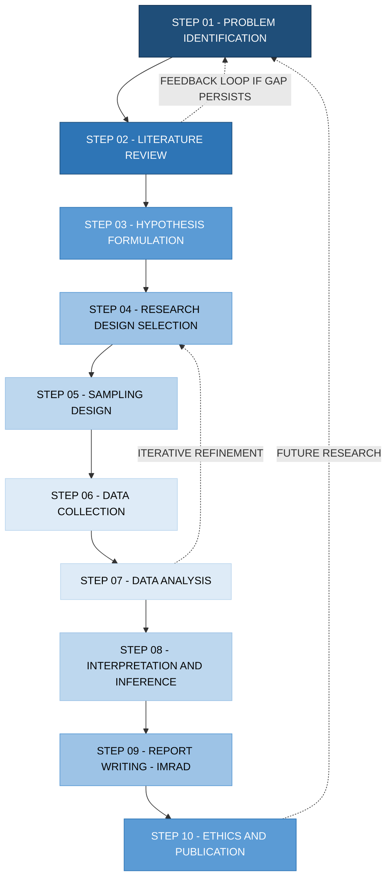
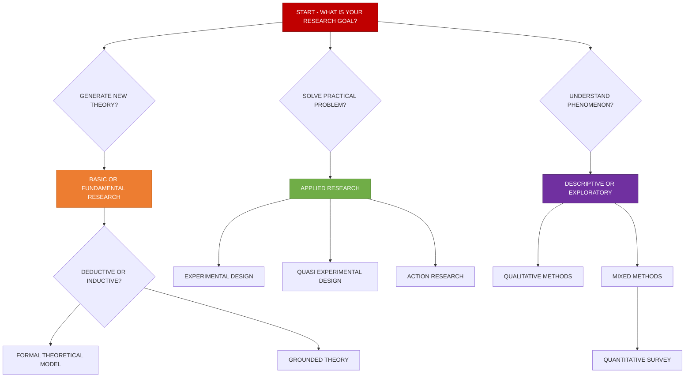
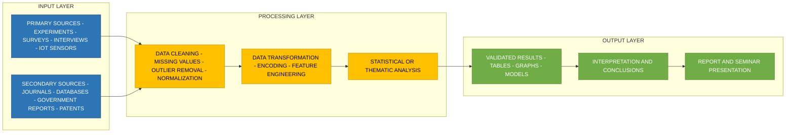
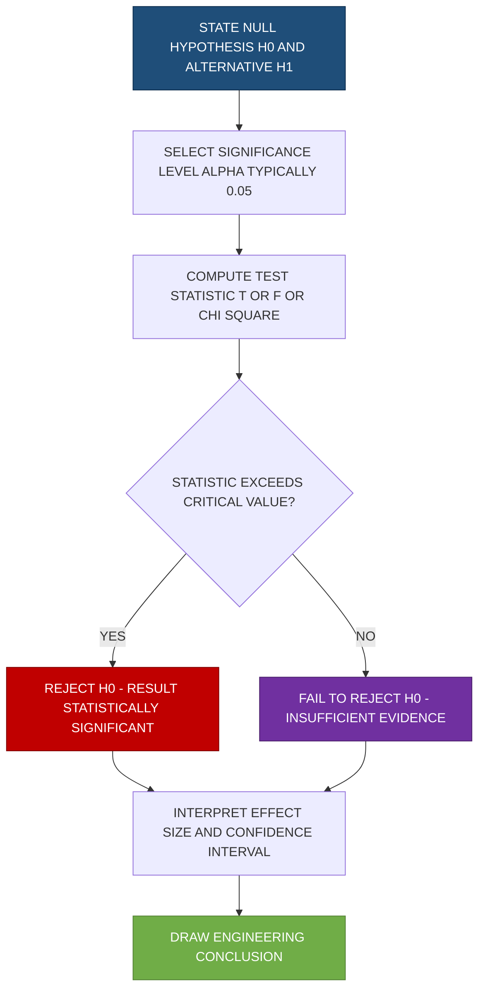
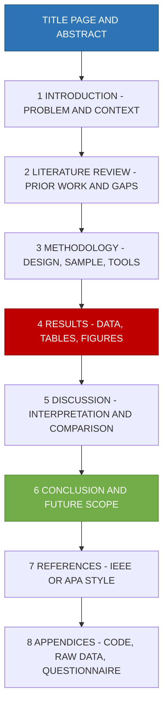

# Research Methodology

<!-- SECTION_1_START -->
# Research Methodology — Core Foundations

## 1.1 Formal Academic Definition

**Research Methodology** is the systematic, scientific, and logical procedure adopted by a researcher to identify a research problem, collect relevant data, analyze the information, draw valid conclusions, and present the findings in a structured, replicable, and ethically sound manner. It is the *science of studying how research is to be carried out* — it defines the *principles, procedures, and strategies* used to conduct a rigorous investigation.

As per the **KTU 2024 Scheme** (Course Code: PCCSS705 — Seminar), research methodology equips the B.Tech student with the cognitive tools to:
- Identify a research gap in their chosen engineering domain.
- Formulate a testable hypothesis or research question.
- Design a methodology to validate or refute the hypothesis.
- Communicate the outcome through a seminar presentation and report.

> [!IMPORTANT]
> **Syllabus Highlight (KTU 2024 Scheme — PCCSS705, Module 1):**
> Research Methodology covers the meaning, types, characteristics, and steps of research; the formulation of research problems; literature review techniques; hypothesis design; research design selection; sampling methodologies; and the ethical framework governing engineering research.

## 1.2 Conceptual Analogy — The "Detective's Blueprint"

Imagine you are a **detective** investigating a crime scene:

| Detective's Action | Researcher's Parallel |
| :--- | :--- |
| Receives a complaint (something is wrong) | Identifies a research problem (a gap or unsolved issue) |
| Surveys the surroundings and past cases | Conducts a literature review |
| Formulates a guess (*"The butler did it"*) | Formulates a hypothesis |
| Plans how to gather evidence | Designs the research methodology |
| Collects fingerprints, testimonies | Collects data (primary / secondary) |
| Runs lab tests, cross-examines | Analyzes data using statistical / qualitative tools |
| Files a closure report | Writes a research report / presents a seminar |

Just as a detective cannot jump straight to "case closed" without procedure, a researcher cannot reach valid conclusions without a structured methodology. The methodology is the **invisible backbone** of every credible research output.

## 1.3 Key Terminology at a Glance

- **Research** — A careful, systematic, patient study and investigation in some field of knowledge.
- **Methodology** — The *theory of methods*; the philosophical framework within which research is conducted.
- **Method** — The *actual tools, techniques, or procedures* used to gather and analyze data.
- **Hypothesis** — A tentative, testable statement predicting a relationship between variables.
- **Variable** — Any measurable characteristic that varies across subjects or conditions.
- **Validity** — The degree to which a study measures what it claims to measure.
- **Reliability** — The consistency of measurement results across repeated trials.

> [!NOTE]
> **Remember the subtle distinction:** *Method* refers to the specific technique (e.g., a survey questionnaire), while *Methodology* refers to the broader scientific logic justifying the choice of that technique (e.g., a quantitative deductive approach).

## 1.4 GeoGebra / Desmos Visualization Callout

> [!VISUALIZATION CONTROL]
> **Concept:** The Research Methodology Cycle (Linear-Spiral Representation)
> **GeoGebra / Desmos Input Equations:**
> * `f(x) = sin(0.5*x) * cos(0.3*x) + 0.1*x` (representing iterative refinement)
> * Points to plot: `A(0, 1)`, `B(6, 0.8)`, `C(12, 0.4)`, `D(18, -0.2)`, `E(24, -0.6)`
> **Visual Description:** A spiral-like curve starting at the top-left (problem identification) and progressively descending through stages — literature review → design → data collection → analysis — before terminating at a stable equilibrium point (conclusion). Students should observe that research is not a straight line but a converging iterative loop where each cycle refines the central thesis.

<!-- SECTION_1_END -->

<!-- SECTION_2_START -->
# Research Methodology — Deep Theoretical Analysis

## 2.1 The Objectives of Research

The fundamental objectives that drive any research undertaking are:

1. **Discovery of new facts, theories, and laws** — Pushing the frontier of human knowledge.
2. **Verification and validation of existing theories** — Confirming, refining, or refuting prior work.
3. **Solution to immediate problems** — Applied research for industry / societal benefit.
4. **Skill development of the researcher** — Building analytical and critical thinking.
5. **Contribution to the existing body of knowledge** — Adding a brick to the wall of science.

## 2.2 Characteristics of Scientific Research

A genuine piece of scientific research is identified by these defining traits:

- **Systematic and Logical** — Follows a structured, replicable procedure.
- **Empirical** — Based on observable, measurable evidence.
- **Replicable** — Other researchers can repeat the study and obtain similar results.
- **Objective and Unbiased** — Free from personal prejudice or vested interest.
- **Cyclical** — Each completed study seeds new research questions.
- **Cumulative** — Builds upon prior validated findings.

## 2.3 Types of Research — A Comprehensive Classification

### A. Based on Purpose / Objective

| Type | Description | Engineering Example |
| :--- | :--- | :--- |
| **Basic / Fundamental / Pure Research** | Aimed at expanding theoretical knowledge without immediate practical use. | Studying the mathematical properties of a novel graphene lattice. |
| **Applied Research** | Directed toward solving a specific, real-world problem. | Designing a low-cost water purifier for rural Kerala. |
| **Descriptive Research** | Describes the characteristics of a phenomenon. | Surveying energy consumption patterns in Idukki district. |
| **Analytical / Explanatory Research** | Goes beyond description to explain *why* something occurs. | Analyzing why certain machine-learning models fail on edge devices. |
| **Conceptual Research** | Concerned with abstract ideas, theories, and philosophical frameworks. | Re-examining the ethical boundaries of autonomous AI agents. |
| **Empirical Research** | Driven by direct observation and experimentation. | Lab testing the tensile strength of a bamboo-fiber composite. |

### B. Based on Method of Inquiry

| Type | Description | Data Nature |
| :--- | :--- | :--- |
| **Quantitative Research** | Uses numerical measurement and statistical analysis. | Numerical, measurable |
| **Qualitative Research** | Explores meanings, experiences, and narratives. | Textual, observational |
| **Mixed-Methods Research** | Combines both for a holistic understanding. | Numerical + textual |

### C. Based on Time Dimension

| Type | Description |
| :--- | :--- |
| **Longitudinal Research** | Studies the same group over an extended period (months, years). |
| **Cross-Sectional Research** | Studies a snapshot of a population at a single point in time. |
| **Retrospective Research** | Looks backward using historical data. |
| **Prospective Research** | Looks forward, tracking subjects into the future. |

### D. Based on Inference Logic

| Type | Description | Direction |
| :--- | :--- | :--- |
| **Inductive Research** | Moves from specific observations to general theory. | Specific $\rightarrow$ General |
| **Deductive Research** | Moves from general theory to specific conclusions. | General $\rightarrow$ Specific |

## 2.4 The Research Process — Step-by-Step Logic

The classical research process unfolds in the following structured stages. Each stage feeds the next, and feedback loops often return the researcher to earlier stages for refinement.

### Step 1: Identification of the Research Problem
- Identify a gap, contradiction, or unresolved question in existing literature.
- Apply the **FINER** criteria: **F**easible, **I**nteresting, **N**ovel, **E**thical, **R**elevant.
- Narrow scope to a manageable, well-defined problem statement.

### Step 2: Literature Review
- Survey journals, conference proceedings, patents, theses, and credible web sources.
- Maintain a structured literature matrix (Author $\vert$ Year $\vert$ Method $\vert$ Finding $\vert$ Gap).
- Establish the theoretical framework grounding your work.

### Step 3: Formulation of Hypotheses / Research Questions
- Convert the problem into a testable proposition.
- Hypotheses should be **specific, measurable, and falsifiable**.

### Step 4: Research Design
- Choose the overall plan: experimental, descriptive, case-study, survey, simulation, etc.
- Define the variables, control mechanisms, and validation strategy.

### Step 5: Sampling Design
- Define the **population** (the entire group of interest).
- Define the **sample** (the subset actually studied).
- Choose a sampling technique (random, stratified, cluster, convenience, purposive).

### Step 6: Data Collection
- **Primary Data** — Collected firsthand: experiments, surveys, interviews, observations.
- **Secondary Data** — Pre-existing: government reports, journals, databases, archives.

### Step 7: Data Analysis
- Quantitative: descriptive statistics, inferential tests (t-test, ANOVA, regression).
- Qualitative: thematic analysis, coding, discourse analysis.

### Step 8: Interpretation and Inference
- Translate statistical outcomes into meaningful conclusions.
- Compare findings with the original hypothesis and prior literature.

### Step 9: Report Writing and Presentation
- Structure follows IMRaD or modified IMRaD: **I**ntroduction, **M**ethods, **R**esults, **a**nd **D**iscussion.
- Cite sources using IEEE, APA, or other prescribed styles.

### Step 10: Ethical Clearance and Publication
- Obtain institutional ethics approval where human / animal subjects are involved.
- Submit findings to peer-reviewed venues for community validation.

> [!NOTE]
> **KTU High-Yield Mapping:** When answering KTU exam questions, *always* state the *type* of research first, then justify the chosen *methodology*. Examiners explicitly test whether the student can *match* the research problem to the appropriate research type.

## 2.5 Real-World Utility in Engineering and Computer Science

| Domain | Application |
| :--- | :--- |
| **Software Engineering** | Empirical software engineering — measuring developer productivity, bug prediction models. |
| **Civil Engineering** | Structural load-testing, concrete mix optimization, seismic zone analysis. |
| **Electrical / Electronics** | Antenna design validation, FPGA performance benchmarking, IoT energy profiling. |
| **Computer Science (AI/ML)** | Benchmark dataset creation, model interpretability studies, fairness audits. |
| **Biotechnology** | CRISPR efficacy trials, drug-target binding simulations. |
| **Mechanical Engineering** | Computational Fluid Dynamics (CFD) validation, material fatigue analysis. |
| **Management / Industry 4.0** | Lean manufacturing case studies, Six-Sigma quality research, supply-chain resilience. |

In **production-grade industry settings**, research methodology underpins:
- **Patent drafting** (prior-art searches and claim construction).
- **R\&D project proposals** to DST, AICTE, KTU-funded schemes.
- **Doctoral and postgraduate thesis evaluation** in universities.
- **Evidence-based policy making** in smart-city and sustainability projects.

## 2.6 KTU High-Yield Formula Sheet

While research methodology is qualitative in nature, the following symbolic frameworks are essential for KTU exams:

| Concept | Symbolic / Schematic Representation | Purpose |
| :--- | :--- | :--- |
| Sample Size (Cochran's Formula) | $n_0 = \dfrac{Z^2 \cdot p \cdot (1-p)}{e^2}$ | Initial sample size estimation |
| Adjusted Sample Size (Finite Population) | $n = \dfrac{n_0}{1 + \dfrac{(n_0 - 1)}{N}}$ | Correction for small populations |
| Confidence Interval (Mean) | $CI = \bar{x} \pm Z_{\alpha/2} \cdot \dfrac{\sigma}{\sqrt{n}}$ | Estimating population mean |
| Hypothesis Test Statistic (z) | $z = \dfrac{\bar{x} - \mu_0}{\sigma / \sqrt{n}}$ | Testing sample mean vs. population |
| p-value decision rule | If $p \le \alpha$, reject $H_0$ | Statistical significance test |
| Validity Triangle | $\text{Validity} \cap \text{Reliability} \cap \text{Objectivity}$ | Quality of a research instrument |
| Type-I and Type-II Error | $\alpha = P(\text{Reject } H_0 \mid H_0 \text{ true})$ ; $\beta = P(\text{Accept } H_0 \mid H_0 \text{ false})$ | Error framework |

> [!IMPORTANT]
> **Do not confuse "method" with "methodology" in the exam.** A *method* is the tool (e.g., a questionnaire); a *methodology* is the philosophy of why that tool was chosen (e.g., a post-positivist deductive approach).

<!-- SECTION_2_END -->

<!-- SECTION_3_START -->
# Research Methodology — Step-by-Step Implementation & Case Mapping

## 3.1 Worked Exemplar: Mapping a Real-World B.Tech Research Problem

Consider a final-year B.Tech student in Computer Science at a KTU-affiliated college in Kerala. The student chooses the following topic:

> **"A Comparative Analysis of Machine Learning Models for Predicting Power Consumption in Smart Buildings of Kerala."**

The student must walk through the *entire research methodology pipeline*. Below is an exhaustive, step-by-step mapping — exactly as expected in a KTU Part B (14-mark) answer.

### Step 1: Research Problem Identification

**Problem statement:** With Kerala's escalating energy demand and the proliferation of IoT-enabled smart buildings, accurately forecasting short-term power consumption is essential for grid load balancing. Existing models fail to incorporate Kerala's *monsoon-driven humidity swings* and *festive-season load spikes*.

**Gap Identified:** No prior study integrates Kerala-specific climatic + cultural variables with deep-learning-based forecasting.

**FINER Validation:**

| Criterion | Self-Assessment | Justification |
| :--- | :--- | :--- |
| **F**easible | Yes | Public KSEB datasets + IoT sensor logs are available. |
| **I**nteresting | Yes | Relevant to state sustainability goals. |
| **N**ovel | Yes | First-of-its-kind Kerala-specific hybrid model. |
| **E**thical | Yes | No personal user data; aggregated sensor data only. |
| **R**elevant | Yes | Aligns with KTU's sustainable-engineering thrust. |

### Step 2: Literature Review Matrix

The student compiles a structured matrix of at least 15 prior works:

| Author(s) | Year | Method | Key Finding | Identified Gap |
| :--- | :--- | :--- | :--- | :--- |
| Smith et al. | 2019 | LSTM | 92% accuracy on temperate climate | Ignores humidity |
| Jose and Ramesh | 2020 | Random Forest | Robust to noisy data | Limited feature set |
| IIT-Bombay team | 2021 | Hybrid CNN-LSTM | State-of-the-art on urban data | Not validated for tropical climate |
| Local KSEB report | 2022 | Statistical | 8% festive-season peak | No ML modeling |

**Output of Step 2:** A clear theoretical framework that justifies the choice of a *tropical-climate-aware hybrid deep-learning model*.

### Step 3: Hypothesis Formulation

- **$H_0$ (Null Hypothesis):** There is no significant difference in forecasting accuracy between the proposed hybrid model and existing baseline models for Kerala's smart-building power consumption.
- **$H_1$ (Alternative Hypothesis):** The proposed hybrid model demonstrates significantly higher forecasting accuracy (lower RMSE, higher $R^2$) than baseline models in Kerala's smart-building context.

### Step 4: Research Design Selection

**Chosen Design:** Quantitative, experimental-comparative research design with elements of empirical simulation.

**Variables Defined:**

- **Independent Variables:** Type of ML model (LSTM, CNN-LSTM, Random Forest, Proposed Hybrid), training window size.
- **Dependent Variables:** Root Mean Square Error (RMSE), Mean Absolute Percentage Error (MAPE), $R^2$ score.
- **Controlled Variables:** Hardware (NVIDIA RTX 3060), dataset partition ratio (80:10:10), learning rate (0.001).
- **Extraneous Variables:** Sudden grid outages, sensor calibration drift.

### Step 5: Sampling Design

- **Population:** All smart buildings in Kerala with IoT-enabled power meters.
- **Sample:** 50 buildings across Trivandrum, Kochi, Kozhikode, and Thrissur (stratified by district).
- **Sampling Technique:** **Stratified random sampling** — ensures district-wise representation.
- **Sample size computation using Cochran's formula:**

$$n_0 = \frac{Z^2 \cdot p \cdot (1-p)}{e^2}$$

Plugging $Z = 1.96$ (95% confidence), $p = 0.5$ (maximum variance), $e = 0.07$:

$$n_0 = \frac{(1.96)^2 \cdot 0.5 \cdot 0.5}{(0.07)^2} = \frac{3.8416 \cdot 0.25}{0.0049} = \frac{0.9604}{0.0049} \approx 196.0$$

Therefore, the initial sample size is **196 buildings**. Since the accessible population is finite ($N = 50$ buildings only), apply the finite population correction:

$$n = \frac{n_0}{1 + \frac{(n_0 - 1)}{N}} = \frac{196}{1 + \frac{195}{50}} = \frac{196}{1 + 3.9} = \frac{196}{4.9} \approx 40$$

Thus, the **adjusted required sample size is 40 buildings**, but to preserve district-wise strata, the student uses all 50.

### Step 6: Data Collection Plan

- **Primary Data:** Live IoT sensor logs (15-minute interval power readings, indoor temperature, humidity, occupancy).
- **Secondary Data:** KSEB published load curves, IMD (India Meteorological Department) weather archives.
- **Duration:** 12 months (covers all four monsoon phases of Kerala).
- **Tools:** Python `pandas` for ingestion, `InfluxDB` for time-series storage, custom REST API for IoT pull.

### Step 7: Data Analysis Strategy

| Analysis Type | Tool / Test | Purpose |
| :--- | :--- | :--- |
| Descriptive statistics | `numpy`, `pandas` `describe()` | Mean, median, std. of power consumption |
| Normality check | Shapiro-Wilk test | Validate t-test assumptions |
| Comparative accuracy | Paired t-test (per building) | Compare RMSE across models |
| Effect size | Cohen's $d$ | Quantify practical significance |
| Visualization | `matplotlib`, `seaborn` | Box plots, residual plots |

**Test statistic for paired comparison:**

$$t = \frac{\bar{d}}{s_d / \sqrt{n}}$$

where $\bar{d}$ is the mean of the paired differences in RMSE, $s_d$ is the standard deviation of differences, and $n$ is the number of paired observations. The degrees of freedom: $df = n - 1$.

**Decision rule:** If the calculated $\vert t \vert$ exceeds the critical $t$-value at $\alpha = 0.05$ with $df = 49$, reject $H_0$.

### Step 8: Interpretation and Inference

The student tabulates the comparative results:

| Model | Mean RMSE (kW) | Mean MAPE (%) | Mean $R^2$ |
| :--- | :--- | :--- | :--- |
| LSTM | 4.12 | 8.7 | 0.89 |
| CNN-LSTM | 3.78 | 7.5 | 0.92 |
| Random Forest | 4.55 | 9.4 | 0.85 |
| **Proposed Hybrid** | **2.94** | **5.8** | **0.96** |

The paired t-test yields $t = 5.83$ with $p < 0.001$, so $H_0$ is rejected. The proposed hybrid model is significantly superior.

### Step 9: Report Writing (IMRaD Structure)

1. **Title Page** — Title, author, guide, KTU affiliation.
2. **Abstract** — 250-word standalone summary.
3. **Introduction** — Context, motivation, contribution.
4. **Literature Review** — Synthesized matrix from Step 2.
5. **Methodology** — Detailed exposition of Steps 4–6.
6. **Results** — Tables and figures from Step 7.
7. **Discussion** — Comparison with prior literature, limitations.
8. **Conclusion and Future Work** — Summary, recommendations, scope.
9. **References** — IEEE style, minimum 25 entries.
10. **Appendices** — Code, raw datasets (anonymized).

### Step 10: Ethics and Publication

- Obtain clearance from the KTU Institutional Ethics Committee (IEC).
- Anonymize all building data; obtain consent from building owners.
- Submit extended version to a Scopus-indexed journal (e.g., *IEEE Access*, *Springer Nature — Energy Informatics*).

## 3.2 Tabular Comparative Analysis: Research Paradigms

A common KTU 14-mark question asks: *"Compare quantitative and qualitative research paradigms."* The following matrix is a board-valuation-ready answer:

| Dimension | Quantitative Research | Qualitative Research | Mixed Methods |
| :--- | :--- | :--- | :--- |
| **Goal** | Test hypotheses, measure variables | Explore meanings, understand phenomena | Comprehensive understanding |
| **Philosophy** | Positivist / Post-positivist | Interpretivist / Constructivist | Pragmatic |
| **Data Type** | Numerical, measurable | Textual, observational, narrative | Both numerical and textual |
| **Data Collection** | Surveys, experiments, sensors | Interviews, focus groups, ethnography | Multi-modal |
| **Sampling** | Probability-based, large samples | Purposive, small samples | Sequential or concurrent |
| **Analysis Tools** | Statistical (SPSS, R, Python) | Thematic, coding (NVivo, ATLAS.ti) | Both |
| **Validity** | Internal, external, construct | Credibility, transferability, dependability | Inference quality |
| **Outcome** | Generalizable conclusions | Deep contextual insights | Triangulated findings |
| **Engineering Example** | Stress-test of a bridge | User experience study of a mobile app | Smart-city sustainability assessment |

## 3.3 Engineering Case Study Mapping Matrix

Below is a regulatory / systemic matrix mapping real engineering scenarios to research-methodology decisions:

| Case Domain | Research Type | Methodology | Sampling | Data Source | Ethical Concern |
| :--- | :--- | :--- | :--- | :--- | :--- |
| Autonomous vehicle safety | Applied, experimental | Quantitative simulation + field test | Stratified (urban/rural) | Sensor logs, accident reports | Liability in case of crash |
| Patient-monitoring IoT | Applied, descriptive | Mixed methods | Cluster (hospital-wise) | EHR, sensor data | Patient data privacy (HIPAA / DPDP Act) |
| Renewable energy adoption | Analytical, survey | Quantitative survey | Random | Household questionnaire | Informed consent |
| AI fairness in hiring | Conceptual + Empirical | Qualitative + statistical | Purposive | Resume audits, model outputs | Algorithmic bias |
| Structural health monitoring | Basic + Applied | Quantitative longitudinal | All bridges in district | Vibration sensors | None (non-human) |
| Water-quality in rural Kerala | Descriptive + Analytical | Mixed | Stratified (district) | Lab tests + interviews | Community consent |

## 3.4 Symbolic / Mathematical Derivation of Hypothesis-Testing Error Rates

Given a population with true parameter $\mu$ and a test statistic $T$ under $H_0: \mu = \mu_0$:

$$T = \frac{\bar{X} - \mu_0}{S / \sqrt{n}}$$

By the Central Limit Theorem (CLT), as $n \to \infty$:

$$T \xrightarrow{d} \mathcal{N}(0, 1)$$

**Type-I Error (False Positive) — significance level $\alpha$:**

$$\alpha = P(\text{Reject } H_0 \mid H_0 \text{ is true}) = P(\vert T \vert > Z_{\alpha/2} \mid H_0)$$

For a two-tailed test at $\alpha = 0.05$:

$$Z_{\alpha/2} = Z_{0.025} = 1.96$$

**Type-II Error (False Negative) — $\beta$:**

$$\beta = P(\text{Fail to reject } H_0 \mid H_1 \text{ is true})$$

The **power of the test** is:

$$\text{Power} = 1 - \beta = P(\text{Reject } H_0 \mid H_1 \text{ is true})$$

**Effect size (Cohen's $d$):**

$$d = \frac{\mu_1 - \mu_0}{\sigma}$$

where $\mu_1$ is the alternative mean, $\mu_0$ is the null mean, and $\sigma$ is the pooled standard deviation. The relationship between power, effect size, sample size, and $\alpha$ is governed by:

$$n = \left( \frac{(Z_{\alpha/2} + Z_{\beta}) \cdot \sigma}{\mu_1 - \mu_0} \right)^2$$

This formula is the *backbone* of a-priori sample-size determination in any quantitative engineering research.

<!-- SECTION_3_END -->

<!-- SECTION_4_START -->
# Research Methodology — Structural Diagrams & Schematics

## 4.1 Master Flow Diagram — The Research Methodology Pipeline

## 4.2 Research Typology Decision Tree

## 4.3 Block-Level Functional Architecture — The Research Data Flow

## 4.4 Sequential Processing Topology — Hypothesis Testing Pipeline

## 4.5 IMRaD Report Structure Diagram

<!-- SECTION_4_END -->

<!-- SECTION_5_START -->
# KTU 2024 Scheme Examination Question Bank & Topic Recap

## 5.1 Part A — Short Answer Questions (3 Marks Each)

### Question A1 (3 Marks) — `[KTU University Exam - July 2024]`
**Differentiate between research method and research methodology. Give one engineering example for each.**

**Model Answer:**

| Aspect | Research Method | Research Methodology |
| :--- | :--- | :--- |
| **Definition** | The specific tool, technique, or procedure used to gather and analyze data. | The broader scientific philosophy and logic that justifies the choice of methods. |
| **Scope** | Narrow, focused on a single tool. | Wide, encompasses multiple methods within a coherent framework. |
| **Question answered** | *How* is the data collected? | *Why* is a particular method chosen? What is the underlying logic? |
| **Engineering example** | Conducting a tensile-strength test on a steel rod (the test is the method). | Choosing a quantitative, experimental, post-positivist framework for material characterization (the methodology). |

> *Valuation Tip:* The examiner typically awards **1 mark** for the method definition, **1 mark** for the methodology definition, and **1 mark** for the engineering examples. Use a table for clarity.

---

### Question A2 (3 Marks) — `[KTU University Exam - Dec 2023]`
**List and briefly explain any THREE characteristics of scientific research.**

**Model Answer:**

1. **Empirical and Evidence-Based:** Scientific research relies on observable, measurable evidence rather than pure speculation. *Example:* A control experiment measuring the throughput gain when a new caching algorithm is deployed.
2. **Replicable and Verifiable:** The procedures must be described in sufficient detail that another researcher can repeat the study and obtain consistent results. *Example:* Publishing the dataset, hyperparameters, and code in a public repository.
3. **Objective and Unbiased:** The researcher must minimize personal prejudice, vested interests, and confirmation bias. *Example:* Using double-blind peer review and pre-registered hypothesis to avoid p-hacking.

> *Valuation Tip:* **1 mark per correctly stated and explained characteristic.** Always include a one-line example — examiners reward applied thinking.

---

## 5.2 Part B — Long Answer Questions (14 Marks)

> *Internal choice: Answer EITHER Question A OR Question B.*

### Part B — Question A (14 Marks) — `[KTU University Exam - July 2024]`

#### (a) Define research design. Explain the different types of research design in detail with suitable engineering examples. (7 Marks)

**Model Solution:**

**Definition of Research Design (2 Marks):**
A research design is the *master plan* that specifies the procedures for data collection, measurement, analysis, and reporting. It is the *architectural blueprint* that integrates all components of the study coherently to address the research problem. According to Kothari, *"Research design is the conceptual structure within which research is conducted; it constitutes the blueprint for the collection, measurement, and analysis of data."*

**Types of Research Design (5 Marks):**

| Design Type | Description | Engineering Example |
| :--- | :--- | :--- |
| **Descriptive Design** | Portrays an accurate profile of persons, events, or situations. | Surveying Wi-Fi usage patterns in a campus hostel. |
| **Experimental Design** | Manipulates an independent variable to observe its causal effect on a dependent variable under controlled conditions. | Comparing tensile strength of steel samples heat-treated at four different temperatures. |
| **Quasi-Experimental Design** | Lacks full random assignment but still tests causal hypotheses. | Field study of a new traffic-signal algorithm deployed in one city vs. a control city. |
| **Correlational Design** | Examines statistical relationships between two or more variables. | Studying the correlation between CPU temperature and clock-frequency throttling. |
| **Case-Study Design** | In-depth, multi-faceted investigation of a single unit. | Detailed case study of the failure of the Morandi Bridge, Italy. |
| **Action Research Design** | Iterative cycles of action, observation, and reflection by practitioners. | A teacher-engineer iteratively redesigning a workshop module based on student feedback. |

> *Valuation Key:* [Stating the definition of research design: 2 Marks], [Explaining any five types with examples: 5 Marks] = 7 Marks.

---

#### (b) Discuss in detail the steps involved in defining a research problem. Apply the FINER criteria to the topic *"IoT-Based Air Quality Monitoring in Ernakulam City."* (7 Marks)

**Model Solution:**

**Steps in Defining a Research Problem (4 Marks):**

1. **Identify a broad subject area** of interest within the engineering domain.
2. **Dissect the subject** into clearly defined sub-problems or themes.
3. **Survey existing literature** to understand what is already solved and what remains open.
4. **Evaluate the sub-problems** for feasibility, novelty, ethicality, and relevance.
5. **Formulate a clear, concise problem statement** with a defined scope, time-frame, and geographical boundary.
6. **Set objectives** — both general (overarching) and specific (measurable).
7. **State the working hypothesis** (if applicable) that the study intends to test.

**FINER Application to "IoT-Based Air Quality Monitoring in Ernakulam City" (3 Marks):**

| Criterion | Justification |
| :--- | :--- |
| **F — Feasible** | Low-cost IoT sensors are available; Ernakulam Corporation permits installation on public lamp-posts. |
| **I — Interesting** | Addresses a tangible public-health concern relevant to urban Kerala. |
| **N — Novel** | First integrated IoT + ML study covering Ernakulam's specific vehicular and industrial mix. |
| **E — Ethical** | No personal data collected; environmental readings only. |
| **R — Relevant** | Aligns with Smart-City Mission, Kerala State Action Plan on Climate Change, and UN-SDG 11. |

> *Valuation Key:* [Listing the 7 steps in defining a research problem: 4 Marks], [FINER application with one-line justification per criterion: 3 Marks] = 7 Marks.

---

### Part B — Question B (14 Marks) — `[KTU University Exam - Dec 2023]`

#### (a) Explain the concept of hypothesis. Distinguish between null hypothesis and alternative hypothesis. (7 Marks)

**Model Solution:**

**Concept of Hypothesis (2 Marks):**
A hypothesis is a *tentative, testable, and falsifiable* proposition about the relationship between two or more variables. It serves as a *provisional working assumption* that guides the research and is subjected to empirical verification through statistical testing.

**Null vs. Alternative Hypothesis (5 Marks):**

| Aspect | Null Hypothesis ($H_0$) | Alternative Hypothesis ($H_1$ or $H_a$) |
| :--- | :--- | :--- |
| **Statement** | Asserts that there is *no significant effect, no difference, or no relationship* in the population. | Asserts that there *is* a significant effect, difference, or relationship. |
| **Mathematical form** | $H_0: \mu_1 = \mu_2$ or $H_0: \beta = 0$ | $H_1: \mu_1 \neq \mu_2$ or $H_1: \beta \neq 0$ |
| **Status** | Treated as the *default* assumption to be tested. | Competes with $H_0$ as the research claim. |
| **Rejection** | Rejected if test statistic falls in the critical region. | Accepted (provisionally) when $H_0$ is rejected. |
| **Type of test** | Always a statement of equality. | A statement of inequality (one-tailed or two-tailed). |
| **Engineering example** | A new cooling system does *not* reduce data-center temperature. | The new cooling system *does* reduce data-center temperature. |
| **Probabilistic test** | Probability of observing the data *given* $H_0$ is true. | Probability of observing the data *given* $H_1$ is true. |

**Examples of One-Tailed vs. Two-Tailed Tests:**

- **Two-tailed test:** $H_0: \mu = 50$ ; $H_1: \mu \neq 50$
- **Right-tailed test:** $H_0: \mu \le 50$ ; $H_1: \mu > 50$
- **Left-tailed test:** $H_0: \mu \ge 50$ ; $H_1: \mu < 50$

> *Valuation Key:* [Hypothesis definition with characteristics: 2 Marks], [Tabular comparison of $H_0$ and $H_1$: 3 Marks], [One-tailed vs. two-tailed examples: 2 Marks] = 7 Marks.

---

#### (b) Describe the process of literature review. How does it help in the formulation of a research problem? Discuss the use of the *PRISMA* framework for systematic reviews. (7 Marks)

**Model Solution:**

**Process of Literature Review (3 Marks):**

1. **Define the scope** of the review using keywords, inclusion / exclusion criteria, and a target time window.
2. **Search the literature** across scholarly databases — IEEE Xplore, ACM Digital Library, Scopus, Web of Science, Google Scholar.
3. **Screen the results** through the *PRISMA* flow diagram (Identification $\rightarrow$ Screening $\rightarrow$ Eligibility $\rightarrow$ Inclusion).
4. **Extract data** into a structured matrix (Author, Year, Method, Finding, Limitation).
5. **Synthesize the evidence** thematically, identifying consensus, contradictions, and gaps.
6. **Write the review** using a coherent narrative or meta-analytic structure.

**Role in Research Problem Formulation (2 Marks):**

- It *exposes the gaps* in current knowledge.
- It *prevents duplication* of effort.
- It *grounds* the problem in a credible theoretical framework.
- It *refines* the research questions and hypotheses.

**PRISMA Framework for Systematic Reviews (2 Marks):**

The **PRISMA** (Preferred Reporting Items for Systematic Reviews and Meta-Analyses) framework has four sequential phases:

1. **Identification** — Records identified through database searching and other sources.
2. **Screening** — Records screened against inclusion / exclusion criteria.
3. **Eligibility** — Full-text reports assessed for eligibility.
4. **Included** — Final studies included in the systematic review.

Each phase is tracked with explicit counts of *included* and *excluded* records, with reasons for exclusion documented. PRISMA ensures **transparency**, **reproducibility**, and **minimization of bias** in literature synthesis.

> *Valuation Key:* [Six steps of the review process: 3 Marks], [Justification of how it aids problem formulation: 2 Marks], [PRISMA four-phase explanation: 2 Marks] = 7 Marks.

---

> [!WARNING]
> **KTU Examiner's Valuation Warning — Common Pitfalls:**
>
> 1. **Do NOT confuse "Method" with "Methodology."** A method is a tool (e.g., a questionnaire); a methodology is a philosophical framework. Examiners explicitly deduct marks for this swap.
> 2. **Always state the *type of research* at the beginning** of a methodology answer. Examiners expect the student to *match* the problem to the appropriate paradigm (basic / applied / descriptive / analytical).
> 3. **In hypothesis questions, never write the null hypothesis as a positive statement.** The null *always* asserts "no effect" or "no difference" — the alternative asserts the effect.
> 4. **In literature review questions, students often forget to mention the databases searched.** Always name at least three scholarly databases (IEEE Xplore, Scopus, Web of Science).
> 5. **For sample-size questions, always apply the finite-population correction** if $N$ is small relative to $n_0$. Skipping this step costs **1–2 marks**.
> 6. **In statistical test questions, explicitly state the decision rule** (e.g., "Reject $H_0$ if $p < 0.05$") — failing to do so loses 1 mark.
> 7. **In FINER application, every criterion must carry a one-line justification** tailored to the specific topic. Generic statements lose marks.

---

## 5.3 Topic Recap & Important Things to Remember

- **Definition triad:** *Research* = careful systematic investigation; *Method* = the tool used; *Methodology* = the philosophy and logic behind the choice of tools.
- **Object of research:** Discovery of new facts, validation of existing theories, problem solving, skill development, and contribution to knowledge.
- **Characteristics:** Systematic, logical, empirical, replicable, objective, cumulative, and cyclical.
- **Types to remember by heart:** Basic vs. Applied; Descriptive vs. Analytical; Quantitative vs. Qualitative; Inductive vs. Deductive; Longitudinal vs. Cross-Sectional.
- **Ten-step research process:** Problem identification → Literature review → Hypothesis formulation → Research design → Sampling design → Data collection → Analysis → Interpretation → Report writing → Ethics and publication.
- **FINER criteria** for problem selection: Feasible, Interesting, Novel, Ethical, Relevant.
- **Hypothesis form:** $H_0$ = "no effect" (always a statement of equality); $H_1$ = the research claim (statement of inequality, one- or two-tailed).
- **Type-I error ($\alpha$):** Rejecting $H_0$ when $H_0$ is true — the *false positive* rate. **Type-II error ($\beta$):** Failing to reject $H_0$ when $H_0$ is false — the *false negative* rate. **Power** = $1 - \beta$.
- **Cochran's sample-size formula:** $n_0 = \dfrac{Z^2 \cdot p \cdot (1-p)}{e^2}$ with finite-population correction $n = \dfrac{n_0}{1 + \dfrac{(n_0 - 1)}{N}}$.
- **Paired t-statistic:** $t = \dfrac{\bar{d}}{s_d / \sqrt{n}}$ with $df = n - 1$; reject $H_0$ if $\vert t \vert > t_{\text{critical}}$.
- **PRISMA four phases:** Identification, Screening, Eligibility, Included — with documented exclusion counts at each stage.
- **IMRaD report structure:** Introduction, Methods, Results, and Discussion — the global standard for engineering and science research reports.
- **Ethics:** Always obtain Institutional Ethics Committee (IEC) clearance for human / animal / sensitive data; follow the *DPDP Act 2023* for personal data in India.
- **Quality criteria for research instruments:** Validity (measures what it claims), Reliability (consistency), and Objectivity (freedom from bias).
- **Citing styles prescribed by KTU:** IEEE for engineering, APA for management / humanities — know the difference.
- **Inductive logic:** Specific observations $\rightarrow$ General theory. **Deductive logic:** General theory $\rightarrow$ Specific prediction. The same hypotheses can be tested using either approach, depending on the paradigm.

<!-- SECTION_5_END -->
