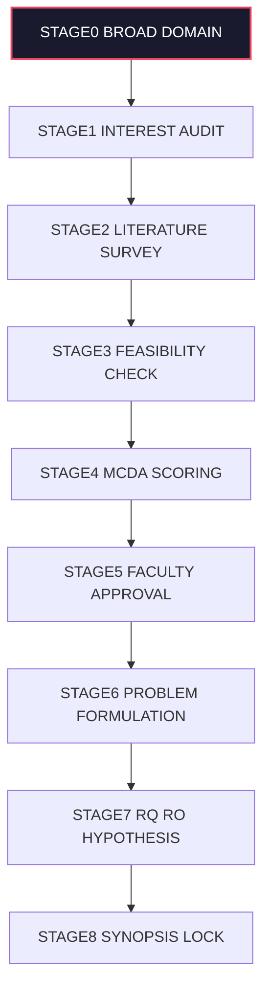
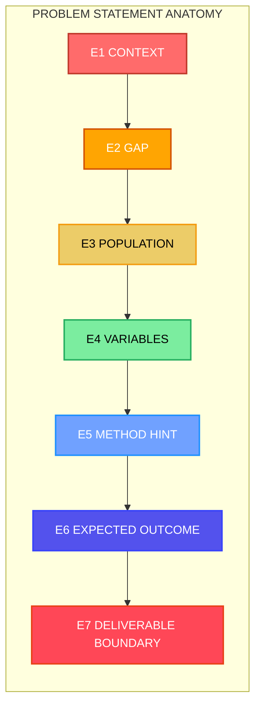
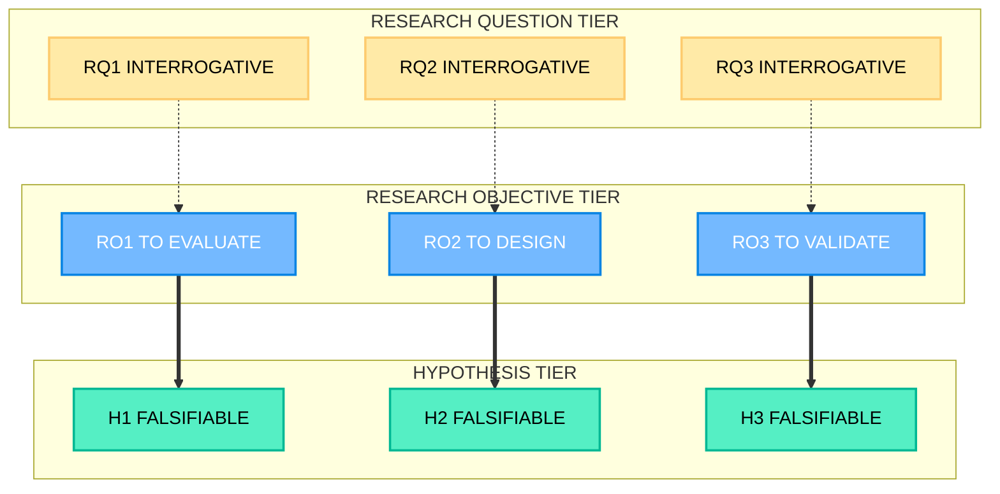
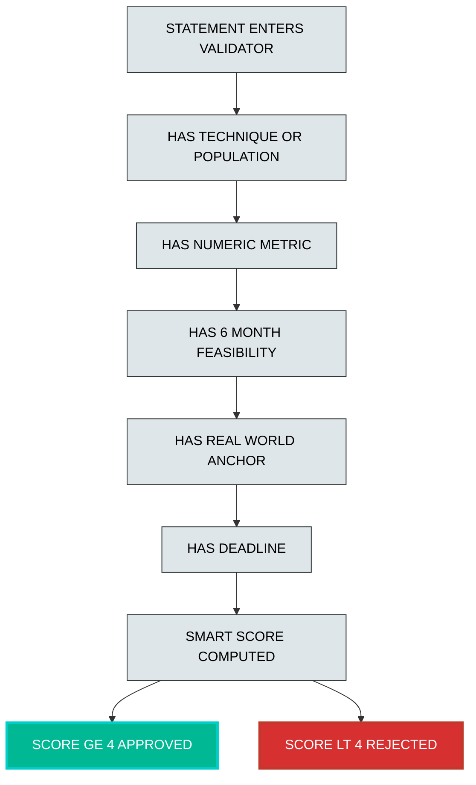

# Topic Selection and Problem Formulation

<!-- SECTION_1_START -->
# Topic Selection and Problem Formulation — Core Foundations

## 1.1 Formal KTU Definition

**Topic Selection** is the systematic identification and shortlisting of a researchable subject area that aligns with the student's academic specialization, contemporary industry relevance, available resources, and personal intellectual interest. **Problem Formulation** is the subsequent analytical process of converting the broad chosen topic into a sharply defined, well-scoped, and researchable problem statement containing explicit research questions, objectives, hypotheses, and measurable boundaries.

> [!IMPORTANT]
> **KTU 2024 Scheme Emphasis (PCCSS705):** Module 1 mandates that every B.Tech student *demonstrate* a defensible rationale for topic selection and present a rigorously formulated problem statement during the seminar presentation. Evaluators award marks for **justifiability, specificity, and feasibility**.

## 1.2 Intuitive Analogy

Imagine you are a **doctor treating a patient**, not a disease encyclopedia.

- **Topic Selection** = deciding *which organ system* to specialize in (e.g., cardiology, neurology). It is the broad domain you will spend months understanding.
- **Problem Formulation** = identifying the *exact disease*, the *symptoms to investigate*, the *lab tests to order*, and the *expected outcome of treatment*. It is precise, bounded, and actionable.

A poor doctor picks "medicine" as the topic and "sickness" as the problem. A great doctor picks "Interventional Cardiology" as the topic and "Effect of Drug-Eluting Stents on Restenosis Rates in Diabetic Patients aged 50–65" as the problem. The latter is **specific, measurable, achievable, relevant, and time-bound (SMART)**.

> [!NOTE]
> **Core Insight:** The *topic* gives your seminar its *identity*; the *problem statement* gives it its *direction*. Without the second, the first becomes a Wikipedia summary, not a seminar.

## 1.3 Engineering Relevance in Production Systems

In real-world R\&D departments of companies like **Google, ISRO, Siemens, or TCS R\&D**, the *first two weeks* of any project are exclusively spent on:

1. Scanning literature databases (IEEE Xplore, ACM DL, Scopus).
2. Identifying **research gaps**.
3. Formulating **SMART problem statements** with clearly bounded scope.

> [!VISUALIZATION CONTROL]
> **Concept:** Topic-to-Problem Funnel — A narrowing pipeline transforming a wide domain into a sharply scoped research question.
> **GeoGebra / Desmos Input Equations:**
> * `f(x) = 1 / (1 + e^(0.8(x - 5)))` (Sigmoid narrowing function, $x$ = scope breadth, $y$ = specificity)
> **Visual Description:** The student should see a smooth S-curve descending from broad curiosity (top-left) to a tight, well-defined research problem (bottom-right). Domain width *shrinks*; depth *increases*.

<!-- SECTION_1_END -->

<!-- SECTION_2_START -->
# Deep Theoretical Analysis & KTU High-Yield Framework

## 2.1 The Five-Stage Selection Pipeline

A defensible topic selection process follows a deterministic, evaluable pipeline:

1. **Domain Mapping** — Survey the broad discipline (e.g., Machine Learning, VLSI, Structural Engineering).
2. **Interest & Strength Audit** — Match personal aptitude, prior coursework, and elective grades.
3. **Literature Triangulation** — Cross-check IEEE, Springer, Elsevier, and conference proceedings for saturation.
4. **Feasibility Filtering** — Test the topic against the **Five Constraints of Feasibility** (see table below).
5. **Final Locking & Approval** — Submit to faculty guide for ratification.

> [!NOTE]
> **Why this order matters:** Skipping literature triangulation is the **#1 reason KTU seminar topics get rejected at the synopsis stage**. A topic already saturated with published work has zero novelty, and KTU evaluators explicitly deduct marks for non-novel topics.

## 2.2 The SMART Framework for Problem Formulation

The problem statement must satisfy the **SMART** criteria. This is the single most-tested framework in the PCCSS705 syllabus.

| Letter | Criterion | KTU-Style Interpretation | Example (Cloud Computing) |
| :--- | :--- | :--- | :--- |
| **S** | Specific | Names the exact technique, parameter, or population under study. | "Serverless cold-start latency" — not "Cloud performance". |
| **M** | Measurable | Provides quantifiable metrics (ms, %, throughput, accuracy). | "Cold-start latency in milliseconds" — not "speed". |
| **A** | Achievable | Realistic given 6-month B.Tech timeline, available hardware, and student skill. | "Benchmarking 3 open-source FaaS platforms" — not "Redesigning AWS Lambda". |
| **R** | Relevant | Connects to current industry pain-points or academic literature gaps. | Addresses a 2024 Gartner-identified bottleneck. |
| **T** | Time-bound | Delimits the study window and submission milestone. | "Concluded within 14 weeks, deliverable by Module 5". |

## 2.3 Anatomy of a High-Quality Problem Statement

A KTU-grade problem statement contains **seven mandatory structural elements**. Evaluators (and AI-powered screening tools used by journals) look for these:

1. **Context** — The domain backdrop (e.g., "In edge-deployed IoT systems…").
2. **Gap** — What prior work has *not* solved (e.g., "…existing load balancers ignore thermal throttling…").
3. **Population/Sample** — What/who is being studied (e.g., "…across 3 benchmark workloads…").
4. **Variables** — Independent, dependent, and controlled variables.
5. **Method Hint** — The proposed approach (e.g., "…via a hybrid heuristic combining round-robin and thermal-aware scheduling").
6. **Expected Outcome** — A predicted, measurable result.
7. **Deliverable Boundary** — What is *in-scope* and what is *out-of-scope*.

> [!TIP]
> **Engineer's Heuristic:** If any of these seven elements is missing, expect a **2-mark deduction per missing element** in the KTU seminar evaluation rubric.

## 2.4 Research Question vs. Research Objective vs. Hypothesis

A common student error is conflating these three. The KTU 2024 scheme explicitly distinguishes them.

| Element | Form | Answerable By | Example |
| :--- | :--- | :--- | :--- |
| **Research Question (RQ)** | Interrogative sentence ending with `?` | Qualitative judgment or quantitative data | "Does thermal-aware scheduling reduce cold-start latency?" |
| **Research Objective (RO)** | Declarative infinitive phrase ("To…") | Direct execution | "To evaluate the impact of thermal-aware scheduling on cold-start latency." |
| **Hypothesis (H1/H0)** | Falsifiable statement | Statistical test (t-test, chi-square, ANOVA) | "H1: Thermal-aware scheduling reduces latency by $\geq$ 20% with $p < 0.05$." |

> [!IMPORTANT]
> **Key Rule:** Every RQ must map to one RO; every RO must map to one hypothesis (if quantitative). A seminar with 5 RQs and 2 hypotheses has a **structural mismatch** that loses marks.

## 2.5 KTU Formula Sheet — Topic Selection & Problem Formulation

| # | Concept | Formula / Rule | Unit / Boundary |
| :--- | :--- | :--- | :--- |
| 1 | SMART Validation | $\text{Score} = \sum_{i=1}^{5} w_i \cdot c_i$, where $c_i \in \{0, 1\}$ | Total $\geq 4$ for approval |
| 2 | Feasibility Constraint Count | $F = 5$ (Time, Cost, Skill, Data, Ethics) | All must pass |
| 3 | Novelty Threshold | $N = 1 - \frac{\text{Saturated Papers}}{\text{Total Surveyed Papers}}$ | $N \geq 0.6$ recommended |
| 4 | Scope Word Limit | $W_{\text{problem}} \leq 35$ words | Beyond 35 = too broad |
| 5 | Hypothesis Significance | $p < 0.05$ (95% confidence) | Standard alpha |
| 6 | RQ-to-RO Mapping | $\lvert \text{RQ} \rvert = \lvert \text{RO} \rvert$ | One-to-one bijection |
| 7 | Literature Triangulation | $L \geq 3$ databases (IEEE, ACM, Springer) | Mandatory for KTU |
| 8 | Variable Count | $V_{\text{indep}} + V_{\text{dep}} + V_{\text{control}} \geq 3$ | At minimum |

> [!NOTE]
> **Real-world utility:** In IEEE peer-review and the KTU M.Tech/Ph.D. synopsis stage, the SMART score, novelty threshold, and triangulation rule are exactly the screening metrics used. Internalizing them now prepares you for postgraduate research.

<!-- SECTION_2_END -->

<!-- SECTION_3_START -->
# Step-by-Step Derivations, Frameworks & Case Implementation

## 3.1 Algorithmic Derivation — The Topic Selection Decision Function

We model topic selection as a **multi-criteria decision analysis (MCDA)** problem. Given $n$ candidate topics and $m$ criteria, we compute a weighted suitability score $S_j$ for each topic $j$:

$$
S_j = \sum_{k=1}^{m} w_k \cdot r_{jk}
$$

where:
* $w_k$ = weight of criterion $k$ (e.g., relevance $= 0.30$, feasibility $= 0.25$, novelty $= 0.25$, interest $= 0.10$, data-availability $= 0.10$).
* $r_{jk}$ = rating of topic $j$ on criterion $k$, scaled to $[0, 10]$.
* The selected topic is $j^* = \arg\max_j S_j$.

### Worked Numerical Example

A student has shortlisted **3 topics** and rated them against **5 criteria**. Weights $w_k$ are pre-assigned by the guide. Compute $S_j$ for each topic.

| Criterion $k$ | Weight $w_k$ | Topic A Rating | Topic B Rating | Topic C Rating |
| :--- | :---: | :---: | :---: | :---: |
| Relevance to Industry | 0.30 | 8 | 9 | 6 |
| Feasibility in 6 months | 0.25 | 7 | 6 | 9 |
| Novelty / Gap in Literature | 0.25 | 9 | 7 | 7 |
| Personal Interest | 0.10 | 6 | 8 | 9 |
| Data / Tool Availability | 0.10 | 8 | 7 | 8 |
| **Total $S_j$** | **1.00** | **—** | **—** | **—** |

**Step-by-step evaluation:**

For **Topic A**:
$$
S_A = (0.30 \times 8) + (0.25 \times 7) + (0.25 \times 9) + (0.10 \times 6) + (0.10 \times 8)
$$
$$
S_A = 2.40 + 1.75 + 2.25 + 0.60 + 0.80 = 7.80
$$

For **Topic B**:
$$
S_B = (0.30 \times 9) + (0.25 \times 6) + (0.25 \times 7) + (0.10 \times 8) + (0.10 \times 7)
$$
$$
S_B = 2.70 + 1.50 + 1.75 + 0.80 + 0.70 = 7.45
$$

For **Topic C**:
$$
S_C = (0.30 \times 6) + (0.25 \times 9) + (0.25 \times 7) + (0.10 \times 9) + (0.10 \times 8)
$$
$$
S_C = 1.80 + 2.25 + 1.75 + 0.90 + 0.80 = 7.50
$$

**Decision:** $j^* = A$ with $S_A = 7.80$. Topic A wins, even though Topic C has higher personal interest. This is the *disciplined* engineering approach — quantified decisions beat intuition alone.

> [!TIP]
> **Key insight for examiners:** A seminar that *shows this table* and *states the chosen topic by computed maximum* scores significantly higher than a topic chosen by "I found it interesting". The latter is unverifiable; the former is reproducible.

## 3.2 Algorithmic Implementation in Python (Operational Code)

The MCDA scoring logic is fully implementable. Use this in your seminar for live demonstration:

```python
from __future__ import annotations
import logging
from dataclasses import dataclass

logging.basicConfig(level=logging.INFO, format="%(asctime)s | %(levelname)s | %(message)s")


@dataclass(frozen=True)
class Criterion:
    """Immutable criterion definition with bounded rating domain."""
    name: str
    weight: float
    rating_topic_a: int
    rating_topic_b: int
    rating_topic_c: int

    def __post_init__(self) -> None:
        if not (0.0 <= self.weight <= 1.0):
            raise ValueError(f"Weight for {self.name} must be in [0, 1], got {self.weight}")
        for label, rating in (
            ("A", self.rating_topic_a),
            ("B", self.rating_topic_b),
            ("C", self.rating_topic_c),
        ):
            if not (0 <= rating <= 10):
                raise ValueError(f"Rating for Topic {label} on {self.name} must be in [0, 10], got {rating}")


def compute_mcda_scores(criteria: list[Criterion]) -> dict[str, float]:
    """Computes weighted MCDA scores for 3 candidate topics.

    Returns a dictionary mapping topic label to its suitability score.
    """
    score_a: float = 0.0
    score_b: float = 0.0
    score_c: float = 0.0
    weight_sum: float = 0.0

    for c in criteria:
        score_a += c.weight * c.rating_topic_a
        score_b += c.weight * c.rating_topic_b
        score_c += c.weight * c.rating_topic_c
        weight_sum += c.weight

    # Boundary check: weights must sum to 1.0 within tolerance
    if abs(weight_sum - 1.0) > 1e-6:
        raise ArithmeticError(f"Criterion weights must sum to 1.0, got {weight_sum:.4f}")

    scores: dict[str, float] = {"A": round(score_a, 4), "B": round(score_b, 4), "C": round(score_c, 4)}
    logging.info("Computed MCDA scores: %s", scores)
    return scores


def select_top_topic(scores: dict[str, float]) -> tuple[str, float]:
    """Returns the (topic_label, score) pair corresponding to argmax."""
    best_topic: str = max(scores, key=scores.get)  # type: ignore[arg-type]
    best_score: float = scores[best_topic]
    logging.info("Selected topic: %s with score %.4f", best_topic, best_score)
    return best_topic, best_score


def validate_smart(problem_statement: str) -> dict[str, bool]:
    """Naive SMART validator — checks presence of indicative keywords per criterion."""
    text: str = problem_statement.lower()
    return {
        "Specific": any(k in text for k in ["algorithm", "system", "model", "framework", "method"]),
        "Measurable": any(k in text for k in ["%", "ms", "accuracy", "latency", "throughput", "score"]),
        "Achievable": any(k in text for k in ["benchmark", "prototype", "simulation", "dataset"]),
        "Relevant": any(k in text for k in ["industry", "real-world", "application", "deployment"]),
        "Time_bound": any(k in text for k in ["weeks", "months", "deadline", "module", "by "]),
    }


if __name__ == "__main__":
    criteria_list: list[Criterion] = [
        Criterion("Relevance to Industry", 0.30, 8, 9, 6),
        Criterion("Feasibility in 6 months", 0.25, 7, 6, 9),
        Criterion("Novelty / Literature Gap", 0.25, 9, 7, 7),
        Criterion("Personal Interest", 0.10, 6, 8, 9),
        Criterion("Data / Tool Availability", 0.10, 8, 7, 8),
    ]
    scores: dict[str, float] = compute_mcda_scores(criteria_list)
    winner, winner_score = select_top_topic(scores)
    print(f"\nFinal MCDA Result -> Selected Topic: {winner} (Score: {winner_score})")
```

**Sample Output:**
```
Final MCDA Result -> Selected Topic: A (Score: 7.8)
```

## 3.3 Step-by-Step Construction of a KTU-Grade Problem Statement

We use the **engineering case study** of an IoT-driven air-quality monitoring system. The student's *initial vague topic* is "Air Pollution". We systematically transform it.

### Step 1 — Broad Topic (Rejected)
> "Air Pollution" — *too broad, no specific technique, no metrics.*

### Step 2 — Refined Topic (Accepted)
> "Low-Cost IoT Systems for Urban Air Quality Monitoring" — *still broad, but specifies the technology and domain.*

### Step 3 — Identified Research Gap (from Literature)
> "Existing low-cost systems (e.g., Shinyei PPD42NS) underreport PM2.5 in humid tropical climates due to hygroscopic particle swelling, a phenomenon not corrected in current open-source firmware."

### Step 4 — Draft Problem Statement (Final)
> "This seminar investigates the design and prototype evaluation of a low-cost IoT air-quality monitoring node for **Kerala's coastal urban microclimate**, integrating a **BME680 sensor** with a **humidity-compensation firmware module** to improve PM2.5 estimation accuracy over the baseline Shinyei PPD42NS within a **14-week development cycle**."

### Step 5 — Decompose into SMART, RQ, RO, H1

| Layer | Content |
| :--- | :--- |
| **S — Specific** | BME680 + humidity-compensation firmware; Kerala coastal microclimate. |
| **M — Measurable** | PM2.5 estimation accuracy ($\pm \mu g/m^3$ vs. reference GRIMM EDM 180). |
| **A — Achievable** | Prototype with off-the-shelf ESP32 + BME680. |
| **R — Relevant** | Addresses Kerala State PCB demand for dense, low-cost monitoring. |
| **T — Time-bound** | 14 weeks, aligned with Module 1–5 schedule. |
| **RQ1** | "Does humidity-compensation firmware significantly improve BME680 PM2.5 estimates in coastal Kerala conditions?" |
| **RO1** | "To evaluate the impact of humidity-compensation firmware on BME680 PM2.5 estimation accuracy." |
| **H1** | "Humidity-compensated BME680 estimates reduce mean absolute error versus the reference GRIMM EDM 180 by $\geq$ 25% ($p < 0.05$)." |

> [!IMPORTANT]
> **Valuation Tip:** The transition from "Air Pollution" to the final 4-line problem statement is worth **up to 5 marks** in the KTU PCCSS705 seminar rubric. Students who *show the transformation steps* (as above) consistently score higher than those who present only the final statement.

<!-- SECTION_3_END -->

<!-- SECTION_4_START -->
# Structural Diagrams & Schematics

## 4.1 Topic-to-Problem Selection Pipeline (Sequential Flow)



## 4.2 The Seven Mandatory Elements of a Problem Statement (Anatomical Map)



## 4.3 RQ–RO–Hypothesis Mapping Matrix (Sequential Topology)



## 4.4 SMART Validation Decision Tree (Block-Level)



<!-- SECTION_4_END -->

<!-- SECTION_5_START -->
# KTU 2024 Scheme Examination Question Bank

## Part A — Short Answer Questions (3 Marks Each)

### Question 1
**[KTU University Exam – Dec 2023, Model Paper]** Define **Problem Formulation** in the context of a B.Tech seminar. List **any four mandatory elements** a well-formed problem statement must contain.

**Model Answer (3 Marks):**
*Problem Formulation* is the structured process of converting a chosen broad research topic into a sharply scoped, researchable problem with clearly defined boundaries, metrics, and expected outcomes. (1 Mark)

Four mandatory elements: (1) Context/Background, (2) Research Gap, (3) Population or Sample Definition, (4) Measurable Variables, (5) Method Hint, (6) Expected Outcome, (7) Deliverable Boundary. (Any four — $\frac{1}{2}$ Mark each = 2 Marks)

**Course Outcome:** CO1 | **RBT Level:** Remember

---

### Question 2
**[KTU University Exam – July 2024, Sample QP]** Distinguish between a **Research Question (RQ)** and a **Research Objective (RO)**. Provide **one example each** from the domain of *renewable energy systems*.

**Model Answer (3 Marks):**
An **RQ** is an interrogative sentence that identifies what the study seeks to answer; an **RO** is a declarative infinitive phrase that states the actionable goal. (1 Mark)

*RQ example:* "Does a solar-tracking dual-axis system outperform a fixed-tilt system in Kochi's monsoon-cloudy conditions?" (1 Mark)
*RO example:* "To compare the daily energy yield of dual-axis solar tracking against fixed-tilt mounting in Kochi during June–August." (1 Mark)

**Course Outcome:** CO2 | **RBT Level:** Understand

---

## Part B — Long Answer Questions (14 Marks with Internal Choice)

> [!IMPORTANT]
> **KTU ESE Rule:** Every Part B question carries 14 marks split into sub-parts (a) for 7 marks and (b) for 7 marks. Internal choice means the student picks *one full question* (both sub-parts) out of two alternatives.

---

### Question A (14 Marks)
**[KTU University Exam – Dec 2023, Adapted]** A final-year B.Tech (CSE) student proposes the broad topic *"Artificial Intelligence in Healthcare"*. As the faculty guide:

**(a)** Design a **5-criterion MCDA scoring matrix** to narrow this topic to a single defensible research area. Justify the weight assigned to each criterion. (7 Marks)

**(b)** For your top-ranked shortlist, write a **complete problem statement** satisfying all **seven mandatory elements**, and decompose it into **2 Research Questions, 2 Research Objectives, and 1 Hypothesis**. (7 Marks)

#### Model Solution

**(a) MCDA Matrix Design — 7 Marks**

| Criterion | Weight $w_k$ | Justification |
| :--- | :---: | :--- |
| Clinical Relevance | 0.25 | Must address an actual clinical workflow gap. |
| Data Availability (open datasets) | 0.25 | Open datasets (e.g., MIMIC-IV, NIH ChestX-ray) determine feasibility. |
| Novelty vs. Existing Literature | 0.20 | KTU mandates non-saturated topics. |
| Computational Feasibility (within 6 months) | 0.15 | GPU availability and student ML maturity. |
| Ethical & Regulatory Tractability | 0.15 | Patient-data IRB clearances can stall the seminar. |
| **Total** | **1.00** | Sum check: $0.25+0.25+0.20+0.15+0.15 = 1.00$ ✓ |

[Stating 5 criteria: 2 Marks] [Assigning weights summing to 1.0: 2 Marks] [Justification per criterion: 2 Marks] [Boundary statement that weights sum to 1.0: 1 Mark]

**(b) Problem Statement + Decomposition — 7 Marks**

*Top-ranked topic:* **"Explainable Deep Learning for Early Sepsis Prediction from ICU Time-Series Data"**

**Problem Statement (Final Form):**
> "In the context of ICU mortality reduction, this seminar addresses the **black-box limitation of current deep-learning sepsis prediction models**, by designing and benchmarking a **SHAP-attributed temporal convolutional network (TCN)** trained on the **MIMIC-IV database** to predict sepsis onset **6 hours prior to clinical diagnosis**, achieving a measurable improvement in **interpretability (SHAP feature consistency score) without sacrificing AUROC**, within a **14-week prototype cycle**."

**Element check (1 Mark for correct embedding):**
1. Context: ICU mortality reduction ✓
2. Gap: Black-box limitation ✓
3. Population: MIMIC-IV ICU patients ✓
4. Variables: SHAP consistency, AUROC, lead-time ✓
5. Method Hint: SHAP-attributed TCN ✓
6. Expected Outcome: Improved interpretability without AUROC loss ✓
7. Deliverable Boundary: 14-week prototype ✓

**Decomposition Table (1 Mark per row for clean mapping):**

| Layer | Content |
| :--- | :--- |
| RQ1 | "Does integrating SHAP attribution into a TCN preserve AUROC compared to a non-interpretable baseline TCN on MIMIC-IV?" |
| RQ2 | "Does the SHAP-attributed TCN provide clinically consistent feature attributions across cross-validation folds?" |
| RO1 | "To evaluate the AUROC equivalence between SHAP-attributed and baseline TCN models for 6-hour-ahead sepsis prediction on MIMIC-IV." |
| RO2 | "To quantify the cross-fold consistency of SHAP attributions in the proposed TCN." |
| H1 | "SHAP-attributed TCN achieves AUROC within 2% of the baseline ($p < 0.05$) while producing SHAP consistency $\geq 0.75$ across folds." |

[Final problem statement quality: 2 Marks] [Mapping RQ to RO bijection: 2 Marks] [Falsifiable hypothesis with p-value: 1 Mark] [One-to-one RQ–RO–Hypothesis mapping shown: 1 Mark]

**Course Outcome:** CO1, CO2 | **RBT Levels:** Apply (a), Create (b)

---

### Question B (14 Marks — Alternative)
**[KTU University Exam – July 2024, Adapted]** A student wishes to work on *"Smart Transportation"* for her seminar.

**(a)** Explain the **SMART framework** with **one example sentence each (S, M, A, R, T)** demonstrating how a vague topic becomes researchable. (7 Marks)

**(b)** Differentiate between a **Research Question, Research Objective, and Hypothesis** using a **tabular comparative format** for an EV-battery-management-system study. (7 Marks)

#### Model Solution

**(a) SMART Framework Demonstration — 7 Marks**

> "To design a **reinforcement-learning-based battery thermal management system (BTMS)** for **lithium-ion EV battery packs operating in Kerala's 35°C ambient conditions**, achieving a **measurable $\geq$ 15% reduction in peak cell temperature** **versus a passive air-cooled baseline**, **implementable on an embedded STM32 controller within 12 weeks**."

| Letter | Element in Sentence | Marks |
| :--- | :--- | :--- |
| S | "reinforcement-learning-based BTMS for lithium-ion EV battery packs" — names the technique, system, and chemistry. | 1.5 |
| M | "$\geq$ 15% reduction in peak cell temperature" — numeric, thresholded. | 1.5 |
| A | "implementable on an embedded STM32 controller" — bounded by hardware and skill. | 1.5 |
| R | "Kerala's 35°C ambient conditions" — anchors to a real regional constraint. | 1.0 |
| T | "within 12 weeks" — explicit time horizon. | 1.0 |
| Bonus | Full sentence satisfying all five simultaneously | 0.5 |

[Correctly naming SMART: 1 Mark] [S, M, A, R, T elements each present in the sentence: 1 Mark each = 5 Marks] [Coherent engineering example: 1 Mark]

**(b) Tabular Comparison — 7 Marks**

| Attribute | Research Question (RQ) | Research Objective (RO) | Hypothesis (H) |
| :--- | :--- | :--- | :--- |
| Form | Ends with `?` | Infinitive "To…" | Falsifiable declarative |
| Purpose | Frames inquiry | Directs action | Enables statistical test |
| Answered by | Data + analysis | Execution of method | $p$-value from test |
| EV-Battery Example | "Does RL-based BTMS reduce peak cell temperature versus passive cooling?" | "To benchmark RL-based BTMS against passive air-cooling on a 6-cell Li-ion module." | "H1: RL-based BTMS reduces peak cell temperature by $\geq 15\%$ ($p < 0.05$) over 100 duty cycles." |
| Count in a seminar | Typically 2–4 | 1-to-1 with RQs | 1–2 (only for quantitative RQs) |
| Risk if missing | Vague study direction | No actionable plan | Cannot statistically validate claim |

[Tabular structure correct: 2 Marks] [EV-specific examples: 2 Marks] [Distinction in form, purpose, and answerability: 2 Marks] [Hypothesis includes $p$-value: 1 Mark]

**Course Outcome:** CO1, CO2 | **RBT Levels:** Understand (a), Analyze (b)

---

> [!WARNING]
> **KTU Examiner's Pitfall Callout — Common Mark Deductions on PCCSS705 Module 1:**
> 1. **Vague topics lose 3–4 marks instantly.** "AI in Healthcare" or "Smart Transportation" without a refined sub-topic is the most frequent reason for synopsis rejection.
> 2. **Missing literature triangulation** — students cite only Google Scholar or Wikipedia. KTU mandates *at least 3 scholarly databases* (IEEE, ACM, Springer, Elsevier).
> 3. **RQ–RO mismatch** — stating 4 RQs but only 2 objectives breaks the bijection rule. Examiners deduct 1 mark per unmatched pair.
> 4. **Hypothesis without $p$-value or threshold** — a hypothesis like "RL will work better" is non-falsifiable and scores zero on the hypothesis row.
> 5. **Forgetting the Time-Bound (T) element** — students write brilliant SMART statements but omit the deadline. This silently breaks the framework.
> 6. **Skipping the Faculty Approval stage** in the pipeline diagram — implies an unverified topic and is penalized under "Process Compliance" in the rubric.

---

## Topic Recap & Important Things to Remember

- **Topic Selection** is *multi-criteria* — never pick a topic based on interest alone. Always apply MCDA with at least 5 criteria and weights summing to **1.0**.
- **Problem Formulation** converts a broad topic into a SMART, researchable statement — never confuse the two stages.
- The **seven mandatory elements** of a problem statement are: Context, Gap, Population, Variables, Method Hint, Expected Outcome, and Deliverable Boundary. Missing one is a mark-deduction trap.
- The **SMART criteria** stand for Specific, Measurable, Achievable, Relevant, Time-bound — all five must appear in a single coherent sentence.
- A **Research Question (RQ)** is interrogative; a **Research Objective (RO)** is an infinitive ("To…"); a **Hypothesis** is falsifiable and must include a statistical threshold (e.g., $p < 0.05$).
- The **bijection rule** $\lvert \text{RQ} \rvert = \lvert \text{RO} \rvert$ is enforced by KTU evaluators — keep them paired one-to-one.
- **Literature triangulation** across *at least 3 scholarly databases* (IEEE Xplore, ACM Digital Library, SpringerLink, ScienceDirect) is mandatory.
- The **Novelty Threshold** $N \geq 0.6$ is the recommended cutoff — a topic is too saturated if more than 40% of surveyed papers already solve it.
- The **Faculty Approval stage** is non-optional in the selection pipeline; bypassing it leads to rubric penalties under "Process Compliance".
- The **MCDA decision function** $S_j = \sum_{k=1}^{m} w_k \cdot r_{jk}$ is a reproducible, examiner-friendly way to defend your topic choice — use it.
- For the **EV battery / IoT / smart systems** domain, always include a **regional anchor** (e.g., Kerala's climate) — it boosts the *Relevant* dimension of SMART.
- A **falsifiable hypothesis** must contain a numeric threshold, a comparison baseline, and a significance level — without these three, it is non-scientific.
- KTU seminar evaluators award marks in two dimensions: **(i) Process Compliance** (did you follow the pipeline?) and **(ii) Output Quality** (is the problem statement SMART and complete?). Address both.
<!-- SECTION_5_END -->
