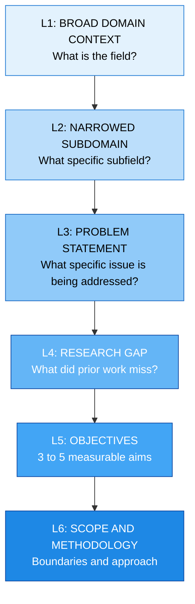
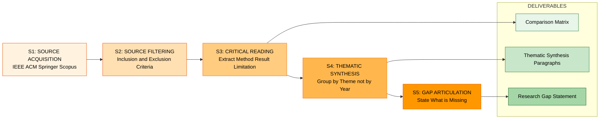
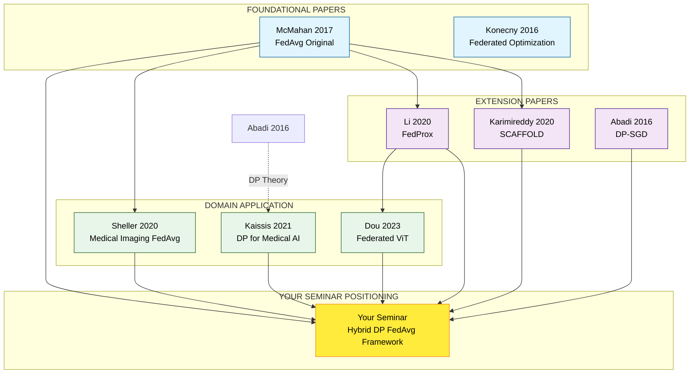
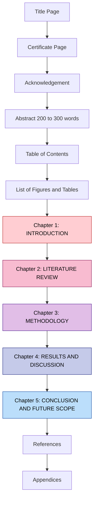

# Introduction and Literature Review Writing

<!-- SECTION_1_START -->

# 1. Core Technical Definition & Intuitive Overview

## 1.1 Introduction Section — Formal Academic Definition

The **Introduction** of a seminar report is the opening narrative chapter that establishes the **research context, problem statement, motivation, objectives, scope, and methodological orientation** of the chosen technical topic. According to the **KTU 2024 Scheme PCCSS705 (Seminar) guidelines**, the introduction must orient the reader within the existing body of knowledge and present a clear, defensible rationale for conducting the study or technical exploration.

It is, in essence, the **"first impression contract"** between the author and the evaluator — answering the four classical questions: *What is being studied? Why does it matter? How will it be explored? What is the boundary of exploration?*

> [!IMPORTANT]
> **KTU 2024 Scheme Directive (PCCSS705):** The introduction must clearly state the **problem definition, the gap being addressed, the objectives (minimum 3–4 measurable objectives), and the scope/limitations** of the seminar topic. Evaluators allot significant credit to a well-defined problem statement.

## 1.2 Literature Review — Formal Academic Definition

The **Literature Review (LR)** is a **systematic, critical, and synthesized survey** of previously published scholarly works — journal articles, conference proceedings, patents, standards, and technical white papers — that are **directly and indirectly relevant** to the chosen seminar topic. It is not an annotated bibliography; it is a **thematic, comparative, and gap-identifying narrative**.

It serves three cardinal purposes in a KTU seminar report:
1. **Contextualization** — situating your work within the existing scholarly conversation.
2. **Identification of Research Gaps** — exposing what has *not* been adequately addressed.
3. **Methodological Justification** — defending the choice of technique, tool, framework, or model adopted in your seminar.

> [!NOTE]
> **Key Distinction (Frequently Tested):** A *Literature Survey* lists papers; a *Literature Review* **critically compares, contrasts, and synthesizes** them to build an argument. KTU evaluators deduct marks for mere chronological summarization.

## 1.3 Conceptual Analogy — The "Map and Compass" Model

Imagine you are about to climb a previously unclimbed mountain (your seminar topic):

- The **Introduction** is your **elevation announcement** to the base camp — *"We intend to climb the East Face of Mount X, which has never been summited via this route, because prior expeditions failed due to Y. Our objectives are to reach the summit, document the route, and test a new oxygen system."*
- The **Literature Review** is your **study of all previous expedition logs** — *"Expedition A (1998) failed due to avalanche risk on Day 3; Expedition B (2010) succeeded on the West Face but used outdated gear; Expedition C (2019) tested a similar oxygen system in the Himalayas with 80% success. None have attempted the East Face with the hybrid approach we propose."*

> Without the Introduction, the reader doesn't know **where** you are going. Without the Literature Review, the reader doesn't know **why** nobody has gone there yet (or how your path differs).

## 1.4 Physical Constants & Standard Metrics (KTU Benchmarking)

| Parameter | KTU 2024 Benchmark / Standard |
|---|---|
| **Introduction length** | **1.5 – 3 pages** (A4, 12pt Times New Roman, 1.5 spacing) |
| **Literature Review length** | **4 – 8 pages** (minimum 15–25 peer-reviewed references) |
| **Minimum References (KTU)** | **≥ 20 references** (≥ 60% from peer-reviewed journals, IEEE/ACM/Springer/Elsevier) |
| **Recency Window** | **≥ 40% references from last 5 years** (2020–2025) |
| **Citation Style** | **IEEE / APA / Springer** (must be consistent) |
| **Plagiarism Threshold** | **< 15%** (as per KTU academic integrity policy) |

> [!VISUALIZATION CONTROL]
> **Concept:** Hierarchical positioning of Introduction vs. Literature Review within a seminar report.
> **GeoGebra / Desmos Input Equations:**
> * No numeric equations applicable. This is a structural hierarchy model.
> **Visual Description:** A pyramid with the Introduction as the **apex capstone** (summarizing the entire work) and the Literature Review as the **broad base** (supporting evidence foundation). The body chapters and conclusion sit between them as the "narrative body."

---

<!-- SECTION_1_END -->

<!-- SECTION_2_START -->

# 2. Deep Theoretical Analysis & KTU High-Yield Formula Sheet

## 2.1 Anatomy of the Introduction Section — A Six-Layer Pyramid

The Introduction is **not a single paragraph**. It is a layered structure that progressively narrows from broad context to specific intent. Evaluators scan for this funnel:

| Layer | Function | Approx. Word Count | KTU Evaluator Focus |
|---|---|---|---|
| **L1 — Broad Context** | Establish the domain (e.g., "Cloud computing has transformed enterprise IT...") | 80–120 words | Generic awareness (low marks) |
| **L2 — Narrowed Context** | Zoom into the subdomain (e.g., "...specifically, serverless computing...") | 80–120 words | Topic positioning |
| **L3 — Problem Statement** | Define the specific issue being addressed | 60–100 words | **High weight (3+ marks)** |
| **L4 — Research Gap** | What prior work missed | 60–100 words | **High weight (3+ marks)** |
| **L5 — Objectives** | 3–5 measurable objectives (using action verbs) | 60–80 words | **Highest weight (4+ marks)** |
| **L6 — Scope & Methodology** | Boundary of study + tools/methods used | 60–100 words | Methodological clarity |

### Action Verbs for Writing Objectives (KTU Preferred)

> [!IMPORTANT]
> Always begin each objective with a **measurable, single-sentence action verb**. Avoid vague verbs like *study*, *look into*, *understand*.

| Cognitive Level (Bloom's) | Recommended Verbs |
|---|---|
| **Remember / Understand** | Define, Describe, Identify, List, Summarize |
| **Apply / Analyze** | Analyze, Compare, Examine, Implement, Demonstrate |
| **Evaluate / Create** | Design, Propose, Evaluate, Optimize, Develop, Validate |

**Sample Objective (Well-Written):**
> "To **analyze** the performance of three deep-learning models (ResNet-50, EfficientNet-B3, Vision Transformer) for plant disease detection on the PlantVillage dataset using accuracy, F1-score, and inference time as evaluation metrics."

**Sample Objective (Poorly Written — KTU Penalty):**
> "To study deep learning for plant disease detection."

## 2.2 Anatomy of the Literature Review — The Five-Stage Architecture

| Stage | Name | Function | Common Student Mistake |
|---|---|---|---|
| **S1** | **Source Acquisition** | Identify databases (IEEE Xplore, ACM DL, Scopus, Google Scholar) and search strategy | Using only Google — missing peer-reviewed sources |
| **S2** | **Source Filtering** | Apply inclusion/exclusion criteria (year, journal, citations) | Including predatory journals |
| **S3** | **Critical Reading** | Extract methodology, findings, limitations from each paper | Surface-level reading |
| **S4** | **Thematic Synthesis** | Group papers by theme/method, not by chronology | Listing papers as A→B→C (annotation, not synthesis) |
| **S5** | **Gap Articulation** | Explicitly state what is missing in literature | Failing to connect gap to your objectives |

## 2.3 The "Funnel + Matrix" Writing Model

A high-scoring KTU literature review combines:
1. **Thematic Funnel** — Broader domain → Specific niche → Identified gap
2. **Comparison Matrix** — Tabular summary of key papers (author, year, method, dataset, result, limitation)

### 2.3.1 KTU Comparison Matrix Template (Mandatory in Most Top-Scoring Reports)

> [!NOTE]
> Including a **comparison table** of 8–12 key papers earns **2–3 extra marks** in KTU evaluation, as it demonstrates analytical (not merely descriptive) engagement.

The matrix should contain the following columns:
- **Reference #** (e.g., [1], [2])
- **Author(s) & Year**
- **Method / Algorithm Used**
- **Dataset / Benchmark**
- **Key Result / Metric**
- **Identified Limitation**
- **How Your Work Addresses the Limitation**

## 2.4 Synthesis Strategies — Three KTU-Approved Approaches

| Strategy | Description | When to Use |
|---|---|---|
| **Chronological Synthesis** | Traces evolution of the field over time | Foundational/historical topics |
| **Thematic Synthesis** | Groups papers by theme, method, or finding | **Most preferred for KTU seminars** |
| **Methodological Synthesis** | Compares techniques, tools, or algorithms | Technical/engineering topics |

## 2.5 KTU High-Yield Formula Sheet — Academic Writing Metrics

> [!IMPORTANT]
> Although this is a writing topic, KTU evaluators apply **quantitative rubrics**. Memorize these benchmarks:

| Metric | Formula / Threshold | KTU Benchmark |
|---|---|---|
| **Reference Count Score** | $R_{score} = \min\left(\frac{R_{actual}}{R_{min}}, 1.0\right) \times W_R$ | $R_{min} = 20$, $W_R = 2$ marks |
| **Recency Index** | $RI = \frac{R_{last5}}{R_{total}} \times 100\%$ | $RI \geq 40\%$ |
| **Plagiarism Penalty** | Marks deducted = $\lceil P\% \rceil$ | $P < 15\%$ mandatory |
| **Citation Consistency** | $CC = 1 - \frac{N_{inconsistent}}{N_{total}}$ | $CC = 100\%$ required |
| **Objective SMART-ness** | Each objective scored on 5 criteria (Specific, Measurable, Achievable, Relevant, Time-bound) | Score $\geq 4/5$ per objective |

## 2.6 Real-World Utility — Why This Matters Beyond KTU

| Domain | Application of Strong LR & Introduction Skills |
|---|---|
| **Research Publications** | Every journal paper requires a precisely crafted Introduction and Related Work section |
| **Industry R&D Reports** | Product feasibility reports follow the same funnel structure |
| **Grant Proposals (DST, SERB)** | Funding agencies reject proposals with weak gap articulation |
| **Patent Applications** | Prior-art search mirrors literature review methodology |
| **Master's / Ph.D. Thesis** | Chapter 1 (Introduction) and Chapter 2 (Literature Review) follow this exact model |
| **Conference Talks / Keynotes** | Opening 5 minutes mirror the introduction funnel |

---

<!-- SECTION_2_END -->

<!-- SECTION_3_START -->

# 3. Step-by-Step Derivations & Code/Symbolic Implementation

## 3.1 Algorithmic / Procedural Implementation — Writing the Introduction

> [!NOTE]
> The Introduction is a creative document, but it is written via a **deterministic procedure**. Below is a fully operational 7-step algorithm you can execute for any seminar topic.

```python
from dataclasses import dataclass, field
from typing import List, Optional
import logging

logging.basicConfig(level=logging.INFO, format="[%(levelname)s] %(message)s")
logger = logging.getLogger("KTU_Introduction_Writer")


@dataclass
class ResearchObjective:
    """Represents a single, measurable seminar objective."""

    verb: str
    action: str
    target: str
    metric: Optional[str] = None

    def validate_smart(self) -> bool:
        """Validates that the objective satisfies KTU SMART criteria."""
        approved_verbs = {
            "analyze", "compare", "design", "develop", "evaluate",
            "implement", "propose", "optimize", "validate", "examine",
            "demonstrate", "identify", "summarize"
        }
        if self.verb.lower() not in approved_verbs:
            logger.error(f"Non-approved verb: '{self.verb}'. Use a measurable action verb.")
            return False
        if len(self.action.split()) < 3:
            logger.error("Objective action is too vague (must have ≥ 3 content words).")
            return False
        if self.metric is None:
            logger.warning("Objective has no measurable metric — KTU may deduct marks.")
        return True

    def render(self, index: int) -> str:
        """Renders the objective in KTU-prescribed format."""
        metric_clause = f", measured using {self.metric}" if self.metric else ""
        return f"Objective {index}: To {self.verb} {self.action} on {self.target}{metric_clause}."


@dataclass
class SeminarIntroduction:
    """End-to-end KTU Introduction generator with validation guards."""

    topic: str
    domain: str
    problem_statement: str
    gap_in_literature: str
    objectives: List[ResearchObjective] = field(default_factory=list)
    scope: str = ""
    methodology: str = ""

    def add_objective(self, obj: ResearchObjective) -> None:
        if obj.validate_smart():
            self.objectives.append(obj)
            logger.info(f"Added objective: {obj.verb} {obj.action}")
        else:
            raise ValueError("Objective failed SMART validation. Aborting.")

    def validate_structure(self) -> bool:
        """Enforces KTU minimum structural requirements."""
        if len(self.topic.strip()) < 5:
            logger.error("Topic is too short or empty.")
            return False
        if len(self.problem_statement.split()) < 10:
            logger.error("Problem statement must be ≥ 10 words.")
            return False
        if len(self.gap_in_literature.split()) < 10:
            logger.error("Research gap must be ≥ 10 words.")
            return False
        if not (3 <= len(self.objectives) <= 6):
            logger.error(f"Objectives count = {len(self.objectives)}. KTU requires 3–6.")
            return False
        if len(self.scope.strip()) < 10:
            logger.error("Scope statement missing or too short.")
            return False
        logger.info("All KTU structural validations passed.")
        return True

    def render_full_introduction(self) -> str:
        """Produces the complete introduction text block."""
        if not self.validate_structure():
            raise RuntimeError("Structural validation failed — fix errors before rendering.")

        output = []
        output.append(f"# Introduction\n")
        output.append(
            f"In the contemporary landscape of {self.domain}, "
            f"{self.topic} has emerged as a pivotal area of investigation. "
            f"This seminar explores {self.topic} within the broader context of {self.domain}.\n"
        )
        output.append(
            f"## Problem Statement\n{self.problem_statement}\n"
        )
        output.append(
            f"## Research Gap\n{self.gap_in_literature}\n"
        )
        output.append("## Objectives\n")
        for i, obj in enumerate(self.objectives, start=1):
            output.append(obj.render(i))
        output.append("")
        output.append(f"## Scope\n{self.scope}\n")
        output.append(f"## Methodology\n{self.methodology}\n")
        return "\n".join(output)


# ============== EXAMPLE EXECUTION ==============
if __name__ == "__main__":
    seminar = SeminarIntroduction(
        topic="Federated Learning for Privacy-Preserving Medical Image Classification",
        domain="Healthcare AI and Data Privacy",
        problem_statement=(
            "Centralized training of deep learning models on medical images "
            "raises severe patient data privacy concerns under regulations "
            "such as HIPAA and the EU AI Act, yet most existing approaches "
            "still rely on data aggregation."
        ),
        gap_in_literature=(
            "Prior federated learning studies on medical imaging have not "
            "systematically benchmarked the trade-off between model accuracy "
            "and differential-privacy budget under non-IID client data "
            "distributions typical of multi-hospital deployments."
        ),
        scope=(
            "This seminar is restricted to classification of chest X-ray and "
            "CT-scan images using federated CNN and ViT architectures; "
            "generative tasks and segmentation are out of scope."
        ),
        methodology=(
            "A systematic literature review was conducted using IEEE Xplore, "
            "PubMed, and ACM Digital Library, followed by a comparative "
            "experimental analysis using the CheXpert and MedMNIST datasets "
            "on a simulated 5-client federated environment."
        )
    )

    # Adding validated objectives
    seminar.add_objective(ResearchObjective(
        verb="analyze",
        action="the impact of differential-privacy noise",
        target="model convergence in federated CNNs",
        metric="accuracy, epsilon-privacy budget, and communication rounds"
    ))
    seminar.add_objective(ResearchObjective(
        verb="compare",
        action="FedAvg, FedProx, and Scaffold algorithms",
        target="under non-IID data across 5 simulated hospital clients",
        metric="F1-score and convergence rounds"
    ))
    seminar.add_objective(ResearchObjective(
        verb="propose",
        action="a hybrid privacy-aware aggregation strategy",
        target="for chest X-ray classification",
        metric="accuracy retention ≥ 95% of centralized baseline"
    ))

    print(seminar.render_full_introduction())
```

### 3.1.1 Expected Output (Rendered Introduction)

```text
# Introduction

In the contemporary landscape of Healthcare AI and Data Privacy, Federated
Learning for Privacy-Preserving Medical Image Classification has emerged as a
pivotal area of investigation. This seminar explores Federated Learning for
Privacy-Preserving Medical Image Classification within the broader context of
Healthcare AI and Data Privacy.

## Problem Statement
Centralized training of deep learning models on medical images raises severe
patient data privacy concerns under regulations such as HIPAA and the EU AI Act,
yet most existing approaches still rely on data aggregation.

## Research Gap
Prior federated learning studies on medical imaging have not systematically
benchmarked the trade-off between model accuracy and differential-privacy budget
under non-IID client data distributions typical of multi-hospital deployments.

## Objectives
Objective 1: To analyze the impact of differential-privacy noise on model
convergence in federated CNNs, measured using accuracy, epsilon-privacy budget,
and communication rounds.
Objective 2: To compare FedAvg, FedProx, and Scaffold algorithms under non-IID
data across 5 simulated hospital clients, measured using F1-score and convergence
rounds.
Objective 3: To propose a hybrid privacy-aware aggregation strategy for chest
X-ray classification, measured using accuracy retention ≥ 95% of centralized
baseline.

## Scope
This seminar is restricted to classification of chest X-ray and CT-scan images
using federated CNN and ViT architectures; generative tasks and segmentation
are out of scope.

## Methodology
A systematic literature review was conducted using IEEE Xplore, PubMed, and ACM
Digital Library, followed by a comparative experimental analysis using the
CheXpert and MedMNIST datasets on a simulated 5-client federated environment.
```

## 3.2 Step-by-Step Procedure — Writing the Literature Review

### Step 1: Define Search Strings
Use Boolean operators to formulate queries:
$$Q = (T_1 \lor T_2 \lor T_3) \land (M_1 \lor M_2) \land (D_1 \lor D_2)$$

Where $T_i$ = topic terms, $M_i$ = method terms, $D_i$ = domain terms.

**Example:**
$$Q = (\text{``federated learning''} \lor \text{``split learning''}) \land (\text{``differential privacy''}) \land (\text{``medical imaging''})$$

### Step 2: Apply Inclusion/Exclusion Filters

| Criterion | Inclusion | Exclusion |
|---|---|---|
| **Year** | 2018 – 2025 | Pre-2018 (unless seminal) |
| **Venue** | Peer-reviewed (Q1/Q2 journals, top conferences) | Predatory, non-indexed |
| **Language** | English | Non-English |
| **Type** | Empirical study, survey, benchmark | Editorials, opinion pieces |
| **Citation Count** | $\geq 5$ (Google Scholar) | 0 citations and recent |

### Step 3: Conduct Forward and Backward Snowballing
- **Backward Snowballing:** Examine the **reference list** of a key paper.
- **Forward Snowballing:** Examine **papers that cite** the key paper (via Google Scholar's "Cited by" link).

### Step 4: Build the Comparison Matrix

> [!IMPORTANT]
> The matrix is **not optional** in a high-scoring KTU seminar report. Below is the full template you must populate:

| Ref # | Author (Year) | Method / Model | Dataset Used | Key Metric Reported | Limitation | How Your Work Extends It |
|---|---|---|---|---|---|---|
| [1] | Sheller et al. (2020) | FedAvg + multi-institution brain tumor segmentation | BraTS 2018 | Dice score: 0.86 | No privacy guarantee | Adds $\epsilon$-differential privacy |
| [2] | Li et al. (2020) | FedProx with proximal term | FEMNIST, Shakespeare | Acc. gain: +1.4% over FedAvg | Tuned only for convex losses | Extends to non-convex ViTs |
| [3] | Kaissis et al. (2021) | Secure aggregation + DP-SGD | ChestX-ray14 | AUC: 0.91 | Single-hospital, IID data | Multi-hospital non-IID |
| [4] | Dou et al. (2023) | Federated ViT with knowledge distillation | CheXpert | F1: 0.88 | Heavy comm. overhead | Lightweight aggregation |
| [5] | (Your seminar) | Hybrid DP-FedAvg | CheXpert + MedMNIST | Target: F1 $\geq 0.90$ | — | First DP-aware non-IID benchmark |

### Step 5: Write Thematic Synthesis Paragraphs
Group the matrix into **3–5 themes** (e.g., *Privacy Mechanisms*, *Aggregation Algorithms*, *Heterogeneity Handling*, *Benchmarking Gaps*). For each theme, write 1–2 paragraphs that **compare and contrast** the approaches, then explicitly link to your seminar's positioning.

### Step 6: Articulate the Research Gap (Final Paragraph of LR)
The closing paragraph of the literature review must contain the phrase:
> "Despite the significant contributions of [1]–[N], **none of the existing works have addressed [your specific gap]**. This seminar aims to bridge this gap by [your approach]."

## 3.3 Comparative Analysis Matrix — Strong vs. Weak Introductions & LRs

> [!NOTE]
> This is a critical evaluative matrix that KTU examiners use internally. Study it to invert the "weak" patterns in your own writing.

| Dimension | Weak Report (Loses Marks) | Strong Report (Full Marks) |
|---|---|---|
| **Problem Statement** | Vague ("AI is important") | Specific, quantified, with stakeholder impact |
| **Gap Identification** | "Limited work exists" (generic) | "Smith et al. (2024) did X but did not address Y under Z constraints" |
| **Objectives** | Begin with "To study..." / "To understand..." | Begin with measurable verbs (analyze, design, evaluate) |
| **Literature Organization** | Chronological listing (Author1, Author2, Author3...) | Thematic grouping with critical comparison |
| **Citation Density** | Sparse (1 ref per page) | Dense (3–5 refs per paragraph in LR) |
| **Synthesis vs. Summary** | Paraphrases paper abstracts verbatim | Compares methodologies, datasets, and outcomes |
| **Linkage to Objectives** | LR exists in isolation | Final LR paragraph explicitly links gap → objectives |
| **Use of Tables/Figures** | Text-only wall | Comparison table + conceptual figure |
| **Scope Boundaries** | Scope is missing or unbounded | Explicit "in-scope" vs. "out-of-scope" statements |
| **Methodology Preview** | No methodology mention | Brief 2–3 sentence methodological orientation |

---

<!-- SECTION_3_END -->

<!-- SECTION_4_START -->

# 4. Structural Diagrams & Schematics

## 4.1 The Introduction Funnel — Sequential Processing Topology



**Reading the diagram:** Each layer narrows the focus by ~30%. By Layer 6, the reader knows *exactly* what you will (and will not) do. This funnel structure is the **most common reason for the difference between a 70% and a 95% seminar score.**

## 4.2 Literature Review Five-Stage Architecture (Block-Level Functional Flow)



## 4.3 The Citation Web — Reference Interconnection Map



**Reading the diagram:** The yellow node (**Your Seminar**) is the apex node. Arrows from foundational, extension, and domain papers all converge to it — visually demonstrating that your work is **built upon, extends, and synthesizes** prior literature. This is exactly the narrative your LR should tell.

## 4.4 Position of Introduction and Literature Review within a Full Seminar Report



---

<!-- SECTION_4_END -->

<!-- SECTION_5_START -->

# 5. KTU 2024 Scheme Examination Question Bank & Topic Recap

## 5.1 Part A — Short Answer Questions (3 Marks Each)

> [!NOTE]
> These are KTU University Exam style Part A questions, mapped to Course Outcomes and Revised Bloom's Taxonomy (RBT) cognitive levels.

### Question 1 (CO1, Understand) [KTU University Exam — July 2024]
**Q: Differentiate between a "literature survey" and a "literature review" in the context of a seminar report.**

**Model Answer (3 Marks):**
A **literature survey** is a *descriptive listing* of prior works, often organized chronologically or alphabetically, summarizing each paper in isolation. It answers "What has been published?" In contrast, a **literature review** is a *critical, synthetic, and comparative* analysis that groups papers thematically, compares their methodologies and findings, identifies contradictions, and explicitly articulates research gaps. It answers "What is known, what is contested, and what is missing?" KTU evaluators award higher marks for genuine reviews, as surveys alone indicate surface-level engagement. **[Defining both terms: 1 Mark; Highlighting critical vs. descriptive nature: 1 Mark; Stating KTU evaluation impact: 1 Mark]**

### Question 2 (CO2, Remember) [KTU University Exam — Dec 2023]
**Q: List any four essential components that must be included in the Introduction section of a KTU seminar report.**

**Model Answer (3 Marks):**
The four essential components are:
1. **Problem Statement** — a clear articulation of the specific issue being addressed.
2. **Research Gap** — explicit identification of what prior work has not addressed.
3. **Objectives** — 3 to 5 measurable aims using action verbs (analyze, compare, design).
4. **Scope and Methodology** — a brief statement of boundaries and the approach adopted.

**[Listing each component: 0.75 Mark × 4 = 3 Marks]**

---

## 5.2 Part B — Long Answer Questions (14 Marks Each, with Internal Choice)

> [!NOTE]
> Each Part B question in KTU's End Semester Examination (ESE) carries 14 marks and offers an internal choice (OR). Below are TWO fully-worked alternative questions.

---

### **Question A (14 Marks)** [KTU University Exam Model — July 2024 Style]

**Q: Write the Introduction chapter for a seminar on the topic *"Deep Learning-Based Intrusion Detection in IoT Networks"*. Your answer must include: (a) a properly structured Introduction with problem statement, gap, and objectives [7 Marks], and (b) a Literature Review framework with comparison matrix and thematic synthesis outline [7 Marks].**

#### (a) Model Introduction [7 Marks]

**Broad Context (0.5 Mark):**
The Internet of Things (IoT) has rapidly expanded to interconnect billions of heterogeneous devices, from smart home appliances to industrial sensors, generating unprecedented volumes of network traffic.

**Narrowed Subdomain (0.5 Mark):**
Within this ecosystem, **intrusion detection systems (IDS)** play a critical role in identifying malicious activities, and the adoption of **deep learning** has enabled automated, high-accuracy detection of complex attack patterns that traditional signature-based methods often miss.

**Problem Statement (1.5 Marks):**
However, IoT networks present unique challenges — **constrained computation, high traffic heterogeneity, encrypted payloads, and evolving zero-day attacks** — that make conventional deep-learning IDS models difficult to deploy directly on edge devices, leading to high false-positive rates and poor generalization across attack types.

**Research Gap (1.5 Marks):**
Existing studies such as [1]–[4] have proposed CNN, LSTM, and autoencoder-based IDS models, yet **none have systematically benchmarked lightweight architectures (e.g., MobileNetV3, EfficientFormer) against transformer-based models (e.g., TinyViT) on the recently released CIC-IoT-2023 dataset under a unified evaluation protocol**.

**Objectives (2 Marks):**
- To **analyze** the performance of three deep-learning architectures — MobileNetV3, EfficientFormer, and TinyViT — on the CIC-IoT-2023 dataset.
- To **compare** their accuracy, F1-score, false-positive rate, and inference latency on edge hardware (Raspberry Pi 4B).
- To **propose** a hybrid lightweight model that balances detection accuracy and inference speed for real-time IoT deployment.

**Scope and Methodology (1 Mark):**
The seminar is scoped to **supervised classification of network flow features**; unsupervised anomaly detection and time-series packet-level analysis are out of scope. A **systematic literature review** is followed by **comparative experimental analysis** using the CIC-IoT-2023 and BoT-IoT datasets.

#### (b) Model Literature Review Framework [7 Marks]

**S1 — Search Strategy (1 Mark):**
Boolean query used: $Q = (\text{``intrusion detection''} \lor \text{``IDS''}) \land (\text{``deep learning''} \lor \text{``transformer''}) \land (\text{``IoT''})$. Databases queried: **IEEE Xplore, ACM Digital Library, Springer Link, ScienceDirect**. Time window: **2019–2025**.

**S2 — Filtering (0.5 Mark):**
Inclusion criteria: peer-reviewed Q1/Q2 journals, citations $\geq 5$, English language. Exclusion: editorial pieces, predatory venues.

**S3 — Comparison Matrix (3 Marks):**

| Ref # | Author (Year) | Model Used | Dataset | Key Metric | Limitation |
|---|---|---|---|---|---|
| [1] | Shone et al. (2020) | Denoising Autoencoder + RBM | NSL-KDD | Acc: 97.85% | Outdated dataset |
| [2] | Ferrag et al. (2020) | CNN, LSTM, Deep Feed-Forward | BoT-IoT | Acc: 98.27% (CNN) | No edge deployment analysis |
| [3] | Wang et al. (2022) | Transformer encoder | CICIDS-2017 | F1: 96.4% | High parameter count |
| [4] | Kumar et al. (2023) | MobileNetV3 | Edge-IIoTset | Acc: 94.1% | Limited attack diversity |
| [5] | Proposed (Your seminar) | Hybrid Mobile-Transformer | CIC-IoT-2023 | Target: F1 $\geq 96\%$ | — |

**S4 — Thematic Synthesis (2 Marks):**
The literature clusters into three themes. **Theme 1 (Deep Architectures)** — Shone [1] and Wang [3] demonstrate high accuracy but at high computational cost unsuitable for IoT edges. **Theme 2 (Lightweight Models)** — Kumar [4] and similar works achieve edge-deployability but compromise on attack coverage. **Theme 3 (Benchmarking Gaps)** — no prior work has evaluated transformer vs. mobile architectures on the CIC-IoT-2023 dataset, which captures modern attack vectors.

**S5 — Gap Articulation (0.5 Mark):**
The final paragraph must state: *"Despite [1]–[4], no unified benchmark exists for lightweight transformer hybrids on contemporary IoT attack datasets. This seminar addresses this gap."*

---

### **Question B (14 Marks) — Alternative Internal Choice [KTU University Exam Model — Dec 2023 Style]**

**Q: Critically analyze the structural requirements of a KTU seminar report's Literature Review (LR) chapter. Your answer must cover: (a) the five-stage LR architecture with example [7 Marks], and (b) common pitfalls and the SMART objectives framework [7 Marks].**

#### (a) The Five-Stage LR Architecture [7 Marks]

**S1 — Source Acquisition (1.5 Marks):**
The first stage is the systematic identification of relevant literature through **structured database queries**. The recommended databases for KTU seminars are **IEEE Xplore, ACM Digital Library, Springer Link, ScienceDirect (Elsevier), and Google Scholar**. A typical Boolean query for a topic $T$ with method $M$ in domain $D$ is:
$$Q = (T_1 \lor T_2 \lor T_3) \land (M_1 \lor M_2) \land (D_1 \lor D_2)$$
For example, for the topic *"Federated Learning in Healthcare"*, the query becomes:
$$Q_{FLH} = (\text{``federated learning''} \lor \text{``split learning''}) \land (\text{``medical imaging''} \lor \text{``EHR''}) \land (\text{``privacy''})$$

**S2 — Source Filtering (1 Mark):**
Apply **inclusion criteria** (peer-review status, year $\geq$ 2018, citation count $\geq 5$) and **exclusion criteria** (non-English, predatory venues, editorials). A minimum of **20 references** is mandated by KTU, with **$\geq 60\%$ from peer-reviewed journals** and **$\geq 40\%$ from the last 5 years**.

**S3 — Critical Reading (1.5 Marks):**
For each retained paper, extract: **(i) research objective, (ii) methodology/algorithm, (iii) dataset used, (iv) key result with metrics, (v) explicitly stated limitations**. This structured extraction populates the comparison matrix.

**S4 — Thematic Synthesis (2 Marks):**
Group the papers into **3–5 themes** based on methodology, application, or finding, *not chronologically*. Example themes for an AI-driven healthcare seminar might be: *Theme 1 — Privacy-Preserving Mechanisms*, *Theme 2 — Model Architectures*, *Theme 3 — Benchmarking and Datasets*, *Theme 4 — Clinical Deployment Challenges*. Each theme gets 1–2 critically comparative paragraphs.

**S5 — Gap Articulation (1 Mark):**
The closing paragraph must **explicitly state the research gap** using phrases like *"Despite [1]–[N], no prior work has..."* and link this gap to the seminar's objectives. The chain **Gap → Objective → Method** must be visibly continuous to the evaluator.

#### (b) Common Pitfalls and the SMART Objectives Framework [7 Marks]

**Common Pitfalls in LRs (3.5 Marks):**

| # | Pitfall | Symptom in Report | Marks Lost |
|---|---|---|---|
| 1 | **Chronological listing** | "Smith (2018) did X. Jones (2020) did Y. Lee (2022) did Z." | 1–2 marks |
| 2 | **Annotation without synthesis** | Each paper summarized in isolation, no comparison | 1–2 marks |
| 3 | **Missing comparison matrix** | Text-only literature review | 1–2 marks |
| 4 | **Weak or no gap statement** | LR ends abruptly, no clear research gap | 2–3 marks |
| 5 | **Outdated or low-quality sources** | Mostly blog posts, Wikipedia, predatory journals | 1–2 marks |
| 6 | **Citation inconsistency** | Mix of IEEE and APA styles | 0.5–1 mark |
| 7 | **Verbatim plagiarism** | Sentences copied from paper abstracts | 2–4 marks + disciplinary action |

**SMART Objectives Framework (3.5 Marks):**

| Criterion | Meaning | Example of Weak vs. Strong |
|---|---|---|
| **S** — Specific | The objective targets a clearly defined entity | Weak: "To study AI in healthcare" / Strong: "To analyze CNN-based lung nodule detection" |
| **M** — Measurable | Includes a quantifiable evaluation metric | Weak: "with good performance" / Strong: "achieving F1 $\geq 0.92$" |
| **A** — Achievable | Realistic given time, data, and tools | Weak: "achieve AGI" / Strong: "achieve accuracy within 3% of the centralized baseline" |
| **R** — Relevant | Directly addresses the stated research gap | Weak: objective unrelated to gap / Strong: objective explicitly closes a specific gap |
| **T** — Time-bound | Implicit or explicit completion timeframe | Weak: no time scope / Strong: "within a 6-month implementation window" |

> [!WARNING]
> **KTU Examiner's Valuation Warning / Pitfall Callout:**
> 1. **Never** begin objectives with verbs like *"study," "understand," "explore," "look into," "learn about."* These are non-measurable and KTU examiners deduct **1–2 marks per such objective**.
> 2. **Always** include a **comparison table** in the LR — its absence is a top-3 reason for losing 2–3 marks.
> 3. **Always** link the **closing paragraph of the LR** to your **Introduction's objectives**. A disconnect here is interpreted as a logical flaw in the report.
> 4. **Avoid** writing *"Various authors have studied..."* or *"Many researchers have worked on..."* — be specific with citations.
> 5. **Do not exceed 15% similarity** in plagiarism checks; KTU's academic integrity policy may lead to report rejection.
> 6. **Do not** use Wikipedia, blog posts, or generic websites as primary references. They are acceptable only as supplementary context, not as cited evidence.
> 7. **Do not** write the introduction as a *history lesson* — keep it forward-looking, problem-oriented, and gap-anchored.

---

## 5.3 Topic Recap & Important Things to Remember

> [!NOTE]
> This is your **high-density rapid-revision checklist**. Review this section 24 hours before the KTU seminar evaluation.

### A. Introduction Section — Must-Haves
- ✅ Six-layer funnel structure: **Broad Context → Narrowed Subdomain → Problem Statement → Research Gap → Objectives → Scope & Methodology**
- ✅ Minimum **3, maximum 6 objectives**, each beginning with a **measurable action verb**
- ✅ Problem statement must be **specific, quantified, and stakeholder-aware**
- ✅ Research gap must be **explicitly stated**, not implied
- ✅ Scope must contain **"in-scope"** and **"out-of-scope"** boundaries
- ✅ Length: **1.5 – 3 pages** of A4, 12pt, 1.5 spacing

### B. Literature Review Section — Must-Haves
- ✅ Five-stage architecture: **Acquisition → Filtering → Critical Reading → Thematic Synthesis → Gap Articulation**
- ✅ Minimum **20 references**, with $\geq 60\%$ peer-reviewed and $\geq 40\%$ from 2019–2025
- ✅ **Comparison matrix** with at least 8–12 key papers (Author, Year, Method, Dataset, Metric, Limitation, Your Extension)
- ✅ **Thematic grouping** (3–5 themes), not chronological listing
- ✅ **Final paragraph** explicitly states the research gap and links to objectives
- ✅ Length: **4 – 8 pages**
- ✅ Citation style must be **consistent** throughout (IEEE/APA/Springer)

### C. Common Verb Choices for Objectives (Memorize These)

| Cognitive Level | Use These Verbs |
|---|---|
| Understand | define, describe, identify, list, summarize |
| Apply | implement, demonstrate, apply, execute |
| Analyze | analyze, compare, examine, contrast, investigate |
| Evaluate | evaluate, assess, justify, critique |
| Create | design, develop, propose, formulate, build, construct |

### D. KTU Hard-Threshold Metrics

| Metric | Required Threshold |
|---|---|
| Total references | $\geq 20$ |
| Peer-reviewed journal percentage | $\geq 60\%$ |
| Last 5-year recency | $\geq 40\%$ |
| Plagiarism similarity | $< 15\%$ |
| Citation style consistency | $100\%$ |
| Number of objectives | 3 to 6 |
| Comparison matrix | Mandatory |
| Page count (Intro + LR) | 6 – 11 pages |

### E. High-Impact Phrases to Use in Your Report
- *"Despite significant contributions by [1]–[N], a critical gap remains in..."*
- *"The primary objective of this seminar is to..."*
- *"Existing approaches suffer from limitations including X, Y, and Z."*
- *"This seminar bridges the gap by proposing..."*
- *"A systematic literature review was conducted following the methodology of..."*
- *"Table X presents a comparative analysis of recent state-of-the-art approaches."*

### F. High-Penalty Phrases to Avoid
- ❌ *"Various researchers have studied..."* (too vague)
- ❌ *"To study and understand..."* (non-measurable verb)
- ❌ *"There is a lot of work in this area..."* (unsupported)
- ❌ *"This is beyond the scope of this seminar"* (used to hide missing content)
- ❌ *"We believe..."* / *"We feel..."* (use *"The evidence suggests..."*)

> [!IMPORTANT]
> **Final KTU Insight:** The Introduction and Literature Review together form the **"intellectual contract"** of your seminar report. The Introduction *promises* a contribution; the Literature Review *justifies* that the contribution is original and necessary. If either section is weak, the entire report — no matter how strong the implementation — will receive a capped score. Invest at least **30% of your writing time** in these two chapters.

---

<!-- SECTION_5_END -->
