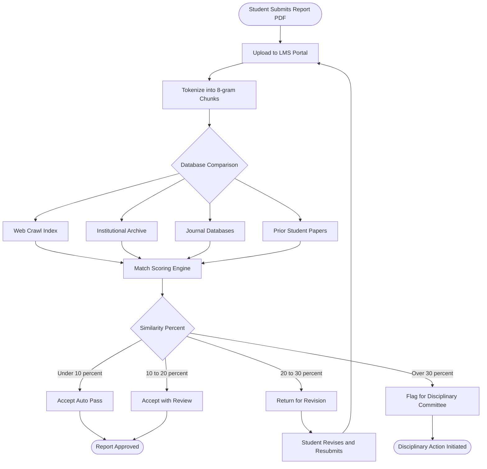
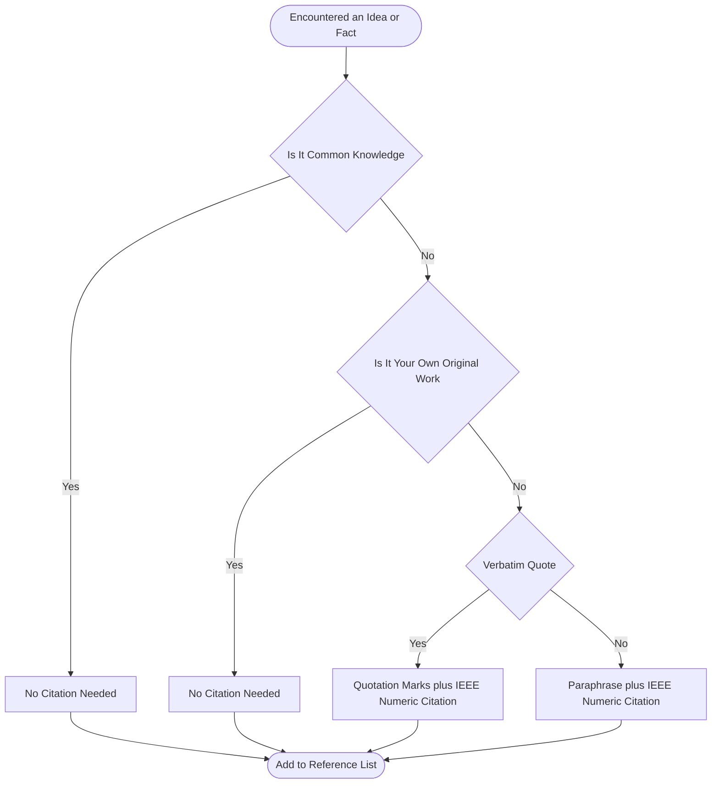
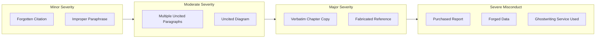

# Plagiarism and Academic Integrity

<!-- SECTION_1_START -->
# Plagiarism and Academic Integrity

## 1.1 Formal Academic Definition

> [!NOTE]
> **Plagiarism** is the act of using another person's ideas, processes, results, or words without giving them proper credit, presenting them as one's own original work. It is a direct violation of **Academic Integrity**, which is the moral code and honest scholarship that governs the production, transmission, and evaluation of knowledge in an academic setting.

According to the **KTU 2024 Scheme** guidelines (PCCSS705 — Seminar), academic integrity extends beyond simply avoiding text copying. It encompasses:

- Honest representation of authorship
- Transparent acknowledgment of prior work
- Correct citation of intellectual debts
- Truthful reporting of data and findings

## 1.2 Conceptual Analogy

> [!IMPORTANT]
> **Real-World Analogy:** Think of a research seminar as a **potluck dinner** in a large community hall. Every attendee brings a dish they cooked. If a participant arrives with a dish bought from a restaurant and serves it on their own plate without telling anyone, they have committed a form of culinary *plagiarism* — they took credit for someone else's effort. However, if they bring the same restaurant dish and **clearly label it as store-bought** and credit the chef, the act becomes **citation** — fully ethical and academically honest.

This is the heart of academic integrity: **the work is not yours, but the credit can be shared transparently**.

## 1.3 Why It Matters in Engineering Seminars

In a B.Tech seminar, the report you present is the **artifact of your learning**. It demonstrates:

1. Your ability to survey literature
2. Your critical thinking
3. Your synthesis of information
4. Your technical communication skills

Plagiarism defeats all four objectives because it presents *borrowed competence* as *original competence*.

> [!TIP]
> **Key Metric in KTU 2024:** Most universities (including KTU) accept a **similarity index of 10\%–20\%** (excluding references and common phrases) for a seminar report. Reports crossing **30\%** are typically returned for revision or face penalties under the **KTU Academic Malpractice Regulations**.

## 1.4 Core Terminology

| Term | Meaning |
|---|---|
| **Citation** | A brief in-text reference that identifies the source of an idea. |
| **Reference** | The full bibliographic entry at the end of the report. |
| **Paraphrase** | Restating a passage in one's own words while preserving meaning. |
| **Quotation** | Verbatim text from a source enclosed in quotation marks. |
| **Self-Plagiarism** | Reusing one's own previously published/submitted work without disclosure. |
| **Collusion** | Unauthorized collaboration where individual effort cannot be identified. |
| **Mosaic Plagiarism** | Stitching together phrases from multiple sources without quotation marks. |
| **Intellectual Property (IP)** | Legal ownership of intangible creations of the mind. |

---

<!-- SECTION_1_END -->

<!-- SECTION_2_START -->
# Deep Theoretical Analysis: Types, Detection, and Consequences

## 2.1 The Taxonomy of Plagiarism

Plagiarism is not a single act. KTU evaluators classify it along **two axes**: *form* and *severity*.

### 2.1.1 Based on Form

- **Direct Plagiarism:** Copying a passage word-for-word without quotation marks or citation.
- **Self-Plagiarism:** Submitting one's own prior work (e.g., a previous semester report) for a new requirement.
- **Accidental Plagiarism:** Forgetting to cite a paraphrased idea or common knowledge boundary.
- **Source-Based Plagiarism:** Citing a source that does not actually contain the claim attributed to it.
- **Data Plagiarism:** Falsifying, fabricating, or manipulating research data.

### 2.1.2 Based on Intent and Severity

> [!IMPORTANT]
> **KTU Severity Matrix (typically followed by Disciplinary Committees):**
>
> | Severity Level | Description | Typical Consequence |
> |---|---|---|
> | **Minor** | Improper citation, minor paraphrasing slip | Report returned for revision |
> | **Moderate** | Multiple uncited paragraphs, copied diagrams | Grade reduction; second submission required |
> | **Major** | Verbatim copied sections from journals or web sources | Report rejected; zero marks; disciplinary entry |
> | **Severe** | Purchased work, paid ghostwriting, forged data | Award suspension; rustication for one semester or more |

## 2.2 Plagiarism Detection Workflow

Modern plagiarism detection follows a **four-stage pipeline**:

1. **Document Submission:** The student uploads the report (commonly in **PDF** or **DOCX**) to a portal.
2. **Tokenization:** The software splits the text into smaller chunks called *n-grams* (commonly 8–10 words).
3. **Database Comparison:** Each n-gram is searched against:
   - A **local institutional database** of prior submissions
   - A **web crawl database** (e.g., Google, Bing caches)
   - **Subscription journal databases** (Elsevier, Springer, IEEE)
4. **Report Generation:** A similarity score (in **percent**) is produced, with highlighted matched regions and source links.

## 2.3 High-Yield Knowledge Sheet for KTU 2024

> [!TIP]
> **Quick Reference — KTU Plagiarism Thresholds for Seminar Reports:**
>
> | Parameter | KTU Standard |
> |---|---|
> | Acceptable similarity | $\leq 20\%$ |
> | Citation requirement | Mandatory for all non-original claims |
> | Reference style | **IEEE** (most common in engineering) or **APA** |
> | Common detection tool | **Turnitin, Urkund, PlagScan** |
> | Excluded from similarity | Bibliography, common phrases, methodology templates |
> | Mandatory sections | Abstract, Introduction, Literature Review, Conclusion, References |

## 2.4 Engineering Relevance

In a professional career beyond KTU, academic integrity translates directly to:

- **Patents and IP Law:** Mishandling prior art in patent claims can invalidate a patent.
- **Software Engineering:** Copying open-source code without respecting the **GNU GPL, MIT, or Apache 2.0** license terms constitutes license violation, a legal form of plagiarism.
- **Research Publications:** Journals like *IEEE Transactions* and *Springer Nature* run submissions through Turnitin; a similarity over **25\%** triggers desk rejection.

Thus, the seminar course is not just a graduation formality — it is a **simulation of the ethical standards** a graduate engineer must hold in industry.

---

<!-- SECTION_2_END -->

<!-- SECTION_3_START -->
# Step-by-Step Procedural Implementation

Because this topic is procedural and humanities-oriented, the implementation matrix here is a **comparative analytical framework** rather than algebraic or code-based.

## 3.1 Building a Proper Citation: Step-by-Step Method

When you read a claim in a paper, follow this **six-step discipline** before writing it in your report:

1. **Identify the Claim Type**
   - Is it a *definition*? a *result*? a *method*? a *figure*?
2. **Decide the Citation Strength**
   - Direct quotation → quotation marks + page number
   - Paraphrased idea → in-text citation only
   - Common knowledge → no citation needed
3. **Choose the Source Document**
   - The *primary* source (original paper) is preferred over secondary references.
4. **Apply the Correct In-Text Format (IEEE Style)**
   - Single author: `Razavi [1] showed that...`
   - Two authors: `Razavi and Smith [2] reported...`
   - More than two authors: `Chen et al. [3] proposed...`
5. **Build the Full Reference Entry**
   - Author(s), "Title of Article," *Journal Name*, vol. x, no. y, pp. zz–zz, Month, Year.
6. **Cross-Verify**
   - Open the bibliography. The cited number `[1]` in the body MUST match reference `[1]` at the end.

## 3.2 Comparative Analysis: IEEE vs. APA vs. MLA vs. Chicago

| Feature | IEEE | APA | MLA | Chicago |
|---|---|---|---|---|
| **Field of Origin** | Engineering, CS | Psychology, Education | Humanities, Literature | History, Arts |
| **In-text citation** | `[1]` numeric | `(Author, Year)` | `(Author Page)` | Footnote or Author-Date |
| **Year placement** | End of reference | Right after author | End of reference | Flexible |
| **Quotation format** | `["text" p. 12]` | `(Author, Year, p. 12)` | `(Author 12)` | Footnote |
| **Reference list title** | References | References | Works Cited | Bibliography |
| **Best for KTU Seminar** | Yes (preferred) | Acceptable | Not typical | Not typical |
| **Title case style** | Sentence case | Sentence case | Title case | Title case |

## 3.3 Tool Comparison: Plagiarism Detection Software

| Tool | Database Size | Real-time Web Check | Best Feature | KTU Suitability |
|---|---|---|---|---|
| **Turnitin** | Billions of pages, student papers | Yes | Originality Report with color highlights | High (used by most KTU colleges) |
| **Urkund (Ouriginal)** | Large web + academic | Yes | Multi-language support | High |
| **Grammarly Plagiarism** | Web + ProQuest | Limited | Integrated writing check | Moderate |
| **PlagScan** | Web + user uploads | Yes | Privacy-friendly (no archival) | Moderate |
| **DupliChecker** | Web only | Yes | Free, no signup | Low (not for final submission) |
| **iThenticate** | Largest scholarly database | Yes | Used by IEEE, Springer, Elsevier | High (industry) |

## 3.4 Algorithmic Equivalent — The Detection Logic

While no source code is required, conceptualizing detection as an algorithm is a useful KTU exercise:

```
ALGORITHM: SimilarityScore(report)
INPUT: report as a string of paragraphs P[1..n]
OUTPUT: similarity_percentage (float)

1.  corpus ← fetchAllSources(web_db, journal_db, prior_db)
2.  total_words ← 0
3.  matched_words ← 0
4.  FOR i ← 1 TO n DO
5.      tokens ← tokenize(P[i], window = 8)
6.      FOR each token IN tokens DO
7.          IF exists(token, corpus) THEN
8.              matched_words ← matched_words + length(token)
9.          END IF
10.         total_words ← total_words + length(token)
11.     END FOR
12. END FOR
13. similarity ← (matched_words / total_words) × 100
14. RETURN similarity
```

> [!NOTE]
> **Engineering Note:** This logic closely mirrors the **Rabin-Karp string matching** and **shingling** algorithms used in production plagiarism engines. The semantic similarity is computed using cosine similarity over TF-IDF vectors when paraphrasing (not exact copying) is suspected.

## 3.5 Decision Matrix: When to Cite

| Situation | Cite? | How? |
|---|---|---|
| A famous equation (e.g., $E = mc^2$) | Optional | Common knowledge |
| A specific numerical result from a paper | **Yes** | Direct citation `[5]` |
| A diagram copied from a journal | **Yes** | Citation + "Reprinted with permission" |
| Your own experimental observation | No | Not needed |
| A definition from a textbook | **Yes** | Citation `[2]` |
| A standard methodology (e.g., Agile) | Optional | Mention as "standard practice" |

---

<!-- SECTION_3_END -->

<!-- SECTION_4_START -->
# Structural Diagrams: Detection Flow and Severity Mapping

## 4.1 The Plagiarism Detection Pipeline



## 4.2 Citation Decision Flow



## 4.3 Severity Escalation Architecture



## 4.4 Authorship Responsibility Matrix

| Actor | Responsibility | Consequence of Failure |
|---|---|---|
| **Student Author** | Honest research, correct citation, original writing | Grade penalty to rustication |
| **Seminar Guide** | Verify sources, check similarity report, mentor ethics | Departmental inquiry |
| **Department Committee** | Audit submissions randomly, enforce policy | Institutional reputation risk |
| **KTU University** | Define policy, provide detection tools, train students | Accreditation review |

---

<!-- SECTION_4_END -->

<!-- SECTION_5_START -->
# KTU 2024 Scheme Examination Question Bank

## 5.1 Part A — Short Answer Questions (3 Marks Each)

### Question 1
**[KTU University Exam — July 2024]** Define **plagiarism** and list any **four common forms** of plagiarism observed in engineering seminar reports.

**Model Answer (3 Marks):**
- **Plagiarism (1 Mark):** Plagiarism is the act of using another person's ideas, words, results, or expressions without proper acknowledgment, thereby presenting them as one's own original work.
- **Four Common Forms (2 Marks — half mark each):**
  1. **Direct Plagiarism** — verbatim copying without quotation marks or citation.
  2. **Self-Plagiarism** — submitting one's own prior work for a new requirement without disclosure.
  3. **Mosaic Plagiarism** — stitching together phrases from multiple sources without quotation.
  4. **Accidental Plagiarism** — paraphrasing or summarizing while forgetting to cite the original.

> [!WARNING]
> **Examiner's Pitfall:** Students often list only 2–3 types and lose marks. Ensure you name **at least four** to secure the full 2 marks for the list portion.

---

### Question 2
**[KTU University Exam — Dec 2023]** What is **academic integrity**? State any **two practices** that demonstrate academic integrity in seminar report writing.

**Model Answer (3 Marks):**
- **Academic Integrity (1 Mark):** Academic integrity is the commitment to honest, ethical, and transparent conduct in all academic work, encompassing honest authorship, truthful data reporting, and proper acknowledgment of intellectual contributions.
- **Two Practices (2 Marks — 1 mark each):**
  1. **Citing every non-original claim** in the prescribed format (IEEE) and providing a complete reference list.
  2. **Submitting one's own original work** without unauthorized collaboration, and using plagiarism detection tools voluntarily to self-audit before submission.

> [!WARNING]
> **Examiner's Pitfall:** Do not write vague answers like "be honest" — examiners award marks only for **specific, actionable practices** like citing, paraphrasing correctly, or self-auditing.

---

## 5.2 Part B — Long Answer Questions (14 Marks Each, Internal Choice)

> **[CO1, CO2 / Understand, Apply — Module 2 Mapping]**

---

### Question A (14 Marks)
**[KTU University Exam — July 2024]** *(a)* Explain in detail the **different types of plagiarism** with suitable engineering-domain examples. *(7 Marks)*

*(b)* Describe the **plagiarism detection process** used by tools like Turnitin. How is a **similarity index** calculated and interpreted in the context of a KTU seminar report? *(7 Marks)*

**Model Solution:**

#### Part (a) — Types of Plagiarism (7 Marks)

**[Defining plagiarism: 1 Mark]**
Plagiarism is the unethical use of another's intellectual work — ideas, words, data, or creative expressions — without proper attribution, presented as one's own.

**[Classification with engineering examples — 6 Marks, distributed as follows:]**

1. **Direct Plagiarism (1.5 Marks):** Copying a paragraph verbatim from an IEEE journal article on 5G beamforming into a seminar report without quotation marks or citation.
   *Example:* `Lifting the entire abstract of a research paper and rewriting only the title.` — *Valuation Key Point: clear example earns full marks.*

2. **Self-Plagiarism (1 Mark):** Submitting the same seminar report submitted in a previous semester for a different course.
   *Example:* `Reusing a literature review section from a prior B.Tech project report in the new seminar.` — *Valuation Key Point: mention prior submission.*

3. **Mosaic / Patchwork Plagiarism (1 Mark):** Combining sentences from five different sources into a single paragraph without quotation marks.
   *Example:* `Stitching lines from three different machine learning papers into one methodology section.` — *Valuation Key Point: name the source variation.*

4. **Accidental Plagiarism (1 Mark):** Forgetting to include a citation for a paraphrased idea or including uncited common-knowledge boundaries.
   *Example:* `Writing "Deep learning improves accuracy" without citing the original paper that demonstrated this gain.` — *Valuation Key Point: mention paraphrasing.*

5. **Source-Based Plagiarism (0.75 Mark):** Citing a review paper that does not contain the specific data, while the actual primary source is misrepresented.
   *Example:* `Citing a survey paper for a specific numerical result that is actually in the original experimental study.` — *Valuation Key Point: identify the source confusion.*

6. **Data Fabrication (0.75 Mark):** Inventing experimental results or modifying graphs to support a hypothesis.
   *Example:* `Reporting a fabricated accuracy of 99.7 percent on a benchmark that was never tested.` — *Valuation Key Point: data falsification as plagiarism.*

**[Final synthesized statement: 0 Marks — implicit in part (a) completion.]**

#### Part (b) — Detection Process and Similarity Index (7 Marks)

**[Stating the purpose of detection tools: 1 Mark]**
Tools like Turnitin are software systems that compare a submitted document against vast databases of web pages, academic journals, and prior student submissions to identify matching or near-matching text.

**[Detection Process — 4 Marks, distributed as:]**

1. **Document Upload (0.5 Mark):** The seminar coordinator uploads the student's PDF or DOCX to the Turnitin portal.

2. **Text Extraction and Tokenization (1 Mark):** The document is parsed, and the text is broken into overlapping sequences of words called **n-grams** (typically 8 words long). For example, the sentence *"Deep learning models require large datasets for effective training"* is split into sliding 8-word windows.

3. **Database Comparison (1.5 Marks):** Each n-gram is hashed and searched against:
   - The **current and archived web index** (billions of web pages)
   - **Subscription journal databases** (IEEE, Springer, Elsevier)
   - **Prior student papers** stored in the institutional repository

4. **Match Highlighting and Report Generation (1 Mark):** All matched n-grams are color-coded in the originality report. Each match is hyperlinked to its source, with a percentage score per source.

**[Similarity Index Calculation and Interpretation — 2 Marks]**

The **similarity index** is calculated as:

$$
\text{Similarity Index} = \frac{\text{Total matched words}}{\text{Total words in document}} \times 100
$$

For a KTU seminar report:

| Similarity Range | Interpretation | KTU Action |
|---|---|---|
| $0\% \leq S \leq 10\%$ | Highly original | Direct acceptance |
| $10\% < S \leq 20\%$ | Acceptable with minor review | Acceptance after guide verification |
| $20\% < S \leq 30\%$ | Borderline | Returned for revision |
| $S > 30\%$ | High similarity | Subjected to disciplinary review |

> [!WARNING]
> **Examiner's Pitfall:** Students often forget to **exclude references and common phrases** from the similarity count. If you state "excluding references and common phrases" in the model answer, you earn **valuation credit** for nuance. Also, do not present a bare formula — always explain **what the numerator and denominator represent**.

---

### Question B (14 Marks) — Alternative Choice
**[KTU University Exam — Dec 2023]** *(a)* Discuss the **consequences of plagiarism** for a B.Tech student under KTU regulations. Include a severity-based classification. *(7 Marks)*

*(b)* Compare and contrast the **IEEE, APA, and MLA** citation styles with appropriate examples. Why is **IEEE preferred** for engineering seminar reports? *(7 Marks)*

**Model Solution:**

#### Part (a) — Consequences of Plagiarism (7 Marks)

**[Stating the importance of integrity: 1 Mark]**
Plagiarism undermines the credibility of academic work, and KTU enforces strict consequences to preserve the integrity of its degrees.

**[Severity Classification — 4 Marks, distributed as:]**

1. **Minor Offence (1 Mark):** Missing one or two citations, improper paraphrasing. **Consequence:** Report returned for correction; warning recorded in the departmental file.

2. **Moderate Offence (1 Mark):** Multiple uncited paragraphs or copied diagrams without source credit. **Consequence:** Marks reduced (typically to zero for the report component); mandatory resubmission within a deadline.

3. **Major Offence (1 Mark):** Verbatim copied sections exceeding 30\% similarity. **Consequence:** Report rejected outright; mark of zero in the seminar course; entry in the student's disciplinary record.

4. **Severe Misconduct (1 Mark):** Engaging paid ghostwriting services, forging supervisor signatures, fabricating experimental data. **Consequence:** Rustication for one or more semesters, degree revocation if discovered post-graduation, and permanent notation in the KTU central database.

**[Institutional Mechanisms — 2 Marks]**
- **Departmental Disciplinary Committee (DDC):** Conducts preliminary inquiry.
- **University Disciplinary Committee (UDC):** Handles severe cases and recommends rustication.
- **Software Audits:** Mandatory submission through Turnitin or equivalent.
- **Guide Verification:** Faculty guide physically verifies the similarity report and signs off.

#### Part (b) — Citation Style Comparison (7 Marks)

**[Defining citation styles: 1 Mark]**
A citation style is a standardized system for acknowledging sources in academic writing. Each style defines how in-text references appear and how the reference list is structured.

**[Comparison Table — 4 Marks, distributed as:]**

| Feature | IEEE | APA | MLA |
|---|---|---|---|
| **In-text format** | `[1]` numeric | `(Smith, 2020)` | `(Smith 42)` |
| **Reference order** | Order of appearance | Alphabetical | Alphabetical |
| **Year placement** | End of entry | After author | End of entry |
| **Common field** | Engineering, CS | Social Sciences | Humanities |
| **Title style** | Sentence case | Sentence case | Title case |
| **Example** | `[1] A. Smith, "Title," *Journal*, vol. 10, no. 2, pp. 12–20, 2020.` | `Smith, A. (2020). Title. Journal, 10(2), 12–20.` | `Smith, Andrew. "Title." Journal, vol. 10, no. 2, 2020, pp. 12–20.` |

**[Why IEEE is Preferred for Engineering — 2 Marks, distributed as:]**
1. **Numeric simplicity:** Engineering reports reference many technical papers; `[1]`, `[2]` is faster to read than `(Smith, 2020)`.
2. **Standard adopted by IEEE journals:** Consistency with the publication standard of the field.
3. **Unambiguous ordering:** Numeric order reflects order of appearance, making the report easier to compile.
4. **Compactness:** Saves space in densely technical documents.

> [!WARNING]
> **Examiner's Pitfall:** When comparing citation styles, students often give a **bare table without examples**. Always include **at least one concrete bibliographic example** per style. Also, ensure the IEEE example is in **proper sentence case** (only first word and proper nouns capitalized) — capitalization errors are a common mark-deduction point.

---

## 5.3 KTU Examiner's General Valuation Warnings

> [!WARNING]
> **Common Reasons for Losing Marks in This Topic:**
> 1. **Vague Definitions:** Writing "plagiarism is copying" without naming the **act, the victim, and the deception** loses the 1-mark definition credit.
> 2. **Missing the IEEE/APA/MLA Distinction:** Examiners specifically test if the student knows that **numeric vs. author-date vs. author-page** is the fundamental axis of difference.
> 3. **Skipping the Severity Matrix:** For consequences, students often write only "marks will be reduced" without recognizing the **four-tier severity ladder** expected by KTU.
> 4. **Forgetting Self-Plagiarism:** Self-plagiarism is a frequently missed concept that examiners love to test.
> 5. **Not Mentioning Tools:** Naming Turnitin or Urkund earns a +1 valuation bonus in many KTU answer sheets.

---

## 5.4 Topic Recap & Important Things to Remember

- **Plagiarism is a spectrum, not a binary.** It ranges from a forgotten citation to purchased reports, and KTU evaluates intent and severity.
- **Academic integrity is proactive.** It is not just avoiding plagiarism; it is about honest authorship, transparent acknowledgment, and truthful reporting.
- **The IEEE style is the default for KTU engineering seminars** — use numeric `[1]` citations and sentence-case titles in the reference list.
- **Acceptable similarity is 10\%–20\%**, exclusive of references and standard phrases.
- **Self-plagiarism counts.** Reusing your own prior work without disclosure is a recognized offence.
- **The detection pipeline** is *Upload → Tokenize → Compare → Score → Decide*, mirroring classical string-matching algorithms.
- **Always use a plagiarism tool** (Turnitin, Urkund) for self-auditing before final submission.
- **Consequences escalate** from revision (minor) to rustication (severe), with the DDC and UDC as enforcement bodies.
- **Cite every non-original claim**, every paraphrased idea, every copied figure, and every quoted passage — quoting verbatim requires quotation marks plus a citation.
- **Be original in your seminar's synthesis and conclusion** — that is the section where plagiarism is least tolerated, since it represents your personal intellectual contribution.

<!-- SECTION_5_END -->
