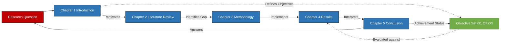
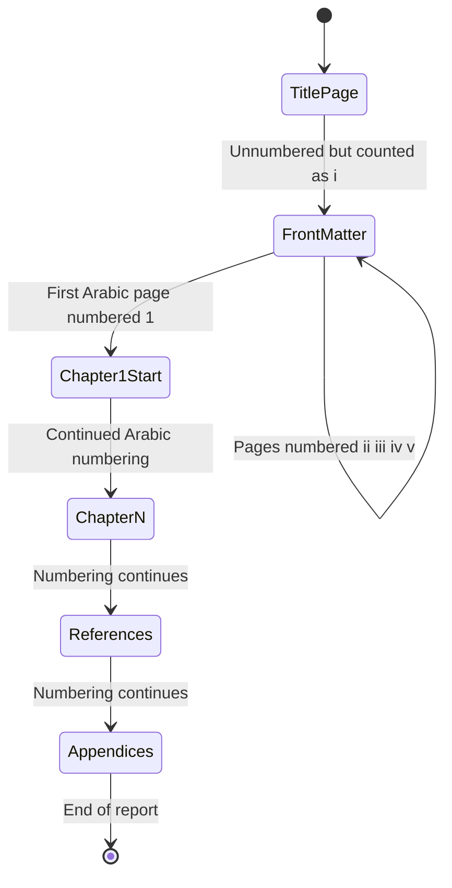
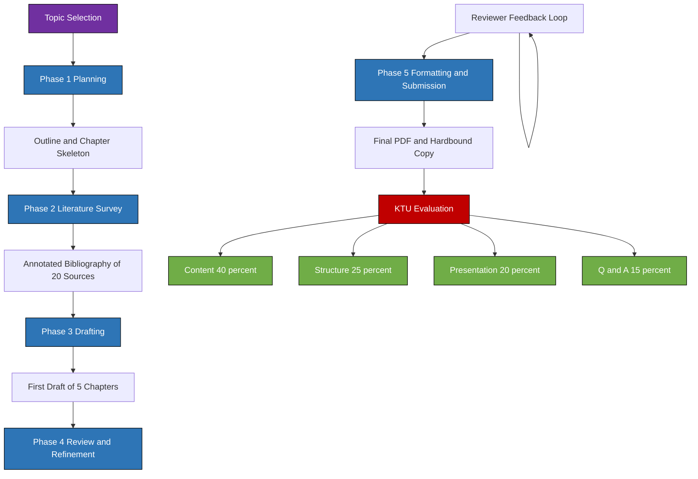

# Report Structure and Organization

<!-- SECTION_1_START -->
# Report Structure and Organization

## Formal Academic Definition

A **Seminar Report** is a formal, structured, and technically rigorous document prepared by a student to document the systematic study, analysis, and findings of a self-selected topic under the guidance of a faculty coordinator. As per the **KTU 2024 Scheme (PCCSS705)** guidelines, the report serves as both a **scholarly artifact** and an **assessment instrument** that evaluates a student's ability to investigate, synthesize, and communicate technical knowledge in a structured academic format.

> [!IMPORTANT]
> **KTU 2024 Definition (PCCSS705):** A seminar report is a comprehensive written account of a contemporary engineering/scientific topic, presented in **standard IMRaD-extended format** (Introduction, Review, Methodology, Analysis, Conclusions) with explicit chapterization, citations, and technical articulation.

The **Report Structure and Organization** refers to the predefined hierarchical framework that governs the sequence, hierarchy, and presentation logic of content blocks within the report. It encompasses:
- **Front Matter** (preliminary pages before Chapter 1)
- **Main Body** (the core technical chapters)
- **Back Matter** (references, appendices, index)

> [!NOTE]
> **Syllabus Highlight (Module 2):** This module focuses on the *mechanics* of report writing — chapter flow, sectional logic, page layout conventions, and the internal architecture that transforms raw research into a defensible academic document.

---

## Conceptual Analogy / Intuition

Think of a seminar report like the **architectural blueprint of a building**:

- The **Title Page** is the building's *facade* — the first thing observers see.
- The **Table of Contents** is the *floor plan* — guiding readers through every room (section).
- The **Abstract** is the *elevator pitch* — a 30-second summary for a busy executive.
- The **Introduction** is the *foundation* — establishing why the building (research) exists.
- The **Literature Review** is the *load-bearing walls* — supporting the new contribution.
- The **Methodology** is the *construction process* — explaining *how* the building was raised.
- The **Results & Discussion** is the *finished interior* — the visible outcome.
- The **Conclusion** is the *handover certificate* — declaring the project complete and pointing to future expansions.
- The **References** are the *material receipts* — proof of where every component was sourced.

> Just as a building cannot stand without a blueprint, a seminar report cannot defend its findings without a **logical, hierarchical structure**. A report with great content but poor organization is like a building with no elevator — usable, but inaccessible.

---

## Key Engineering Standards Referenced

The following formatting standards are universally accepted in KTU-affiliated institutions and most peer-reviewed engineering publications:

| Standard | Authority | Application |
|---|---|---|
| **IEEE Editorial Style Manual** | IEEE | Citation, figure captioning |
| **APA 7th Edition** | APA | Reference formatting (humanities-style) |
| **ISO 690** | ISO | Bibliographic references |
| **KTU Project Report Guidelines** | APJAKTU | Layout, font, binding |
| **AICTE Handbook** | AICTE | Engineering report conventions |

> [!VISUALIZATION CONTROL]
> **Concept:** Hierarchical Flow of a Seminar Report
> **GeoGebra / Desmos Input Equations:** Not applicable for textual hierarchy, but rendered as a **Mermaid Tree Diagram** in Section 4.
> **Visual Description:** A top-down tree showing Front Matter → Main Body (Ch 1–5) → Back Matter, with each child node representing a sub-section.

<!-- SECTION_1_END -->

<!-- SECTION_2_START -->
# Deep Theoretical Analysis & KTU High-Yield Formula Sheet

## 1. The Three-Tier Architecture of a Seminar Report

Every KTU-compliant seminar report follows a strict **three-tier architecture**. Understanding this is fundamental to scoring well in PCCSS705 evaluations.

### Tier 1: Front Matter (Roman Numbered Pages: i, ii, iii...)

| Element | Purpose | KTU Specification |
|---|---|---|
| **Title Page** | Identifies the report's title, author, guide, institution | Center-aligned, institutional logo mandatory |
| **Certificate** | Endorses the originality of work | Signed by Guide, HOD, and Principal |
| **Acknowledgment** | Gratitude to contributors | 1 page max, formal tone |
| **Abstract** | Standalone 150–250 word summary | Single paragraph, no citations inside |
| **Table of Contents** | Lists all chapters/sections with page numbers | Auto-generated in MS Word |
| **List of Figures** | Index of all figures with page numbers | Sequential numbering (Fig 1.1, 1.2...) |
| **List of Tables** | Index of all tables with page numbers | Sequential numbering (Table 3.1, 3.2...) |
| **Nomenclature / Abbreviations** | Defines technical symbols and acronyms | Sorted alphabetically |

### Tier 2: Main Body (Arabic Numbered Pages: 1, 2, 3...)

This is the **substantive core** of the report and typically follows the **extended IMRaD + Future Scope** model:

| Chapter | Conventional Title | Content Focus | Typical Page Count |
|---|---|---|---|
| **Chapter 1** | Introduction | Problem statement, motivation, objectives, scope | 5–8 pages |
| **Chapter 2** | Literature Review | Survey of 15–30 papers, thematic synthesis, research gap | 10–15 pages |
| **Chapter 3** | Methodology / System Design | Tools, algorithms, frameworks, block diagrams, mathematical models | 10–15 pages |
| **Chapter 4** | Results & Discussion | Outcomes, performance analysis, comparative tables, graphs | 8–12 pages |
| **Chapter 5** | Conclusion & Future Scope | Summary of findings, limitations, future enhancements | 3–5 pages |

### Tier 3: Back Matter

| Element | Purpose | KTU Specification |
|---|---|---|
| **References** | Complete bibliography of cited works | IEEE numbered style, minimum 20 sources |
| **Appendices** | Supplementary material (code, raw data, datasheets) | Labeled Appendix A, B, C... |
| **Publications** | Any conference/journal papers published | Optional, but adds value |
| **Plagiarism Certificate** | Turnitin/iThenticate report summary | Mandatory in most KTU colleges |

---

## 2. The "Golden Thread" Principle

The most important theoretical concept in report organization is the **Golden Thread Principle** — every paragraph, figure, and section must logically connect to the report's central research question.

> [!IMPORTANT]
> **Golden Thread Rule:** Each section's opening sentence must explicitly link to the previous section's closing thought, creating an unbroken narrative chain from Title Page to Conclusion.

**Implementation Pattern:**
$$\text{Section}_{n} = f(\text{Section}_{n-1}, \text{Research Question})$$

That is, every section $n$ is a logical function $f$ of the preceding section $n-1$ and the immutable research question.

---

## 3. Chapter-Level Internal Architecture

Each chapter in the main body follows a **3-layer micro-structure**:

### Layer 1: Opening Link
- 1–2 paragraphs that **recall** the previous chapter and **preview** the current one.
- Acts as a narrative bridge.

### Layer 2: Core Content
- The bulk of the chapter, divided into **numbered sub-sections** (e.g., 3.1, 3.2, 3.3).
- Each sub-section should be **2–4 pages** maximum.
- Includes figures, tables, equations, and inline citations.

### Layer 3: Closing Link
- 1 paragraph that **summarizes** the chapter and **transitions** to the next.

---

## 4. KTU High-Yield Formula Sheet / Structural Cheat Sheet

> The following table summarizes every structural rule you must memorize for the exam.

| Rule ID | Structural Element | KTU Specification | Common Error |
|---|---|---|---|
| **R1** | Font (Body) | Times New Roman, **12 pt**, 1.5 line spacing | Using Calibri or Arial |
| **R2** | Font (Headings) | TNR **14 pt Bold** (Chapter), **12 pt Bold** (Sub-headings) | Inconsistent sizing |
| **R3** | Margins | Top: 1", Bottom: 1", Left: 1.5" (binding), Right: 1" | Wrong binding margin |
| **R4** | Page Numbering | Front Matter: Roman (i, ii), Body: Arabic (1, 2) starting from Chapter 1 | Starting page 1 from Title Page |
| **R5** | Chapter Title Page | Chapter name + "Chapter Number" (e.g., Chapter 3) | Forgetting the "Chapter" prefix |
| **R6** | Figure Numbering | Format: `Fig X.Y` where X = chapter, Y = sequence | Using global numbering (Fig 1, 2, 3...) |
| **R7** | Table Numbering | Format: `Table X.Y` | Same as R6 |
| **R8** | Equation Numbering | Right-aligned, format: `(X.Y)` | Center-aligning or using wrong separator |
| **R9** | Citation Style | IEEE numbered: `[1]`, `[2]` or author-year `(Smith, 2023)` | Mixing styles within one report |
| **R10** | Reference Count | Minimum **20 references** (15 for B.Tech seminars) | Citing fewer than 15 sources |
| **R11** | Abstract Word Limit | **150–250 words**, single paragraph | Exceeding 300 words |
| **R12** | Plagiarism Threshold | **< 20%** similarity (excluding references) | Above 30% = report rejected |
| **R13** | Total Page Count | **30–50 pages** for a B.Tech seminar | Less than 25 pages = insufficient |
| **R14** | Binding | Spiral for draft, Hardbound for final submission | Submitting loose sheets |
| **R15** | Acknowledgment Tone | Formal, no informal abbreviations (use "Dr.", not "Dr") | Casual tone |

---

## 5. Real-World Engineering Utility

The structure you learn for a seminar report is the **exact same structure** used in:
- **IEEE Conference Papers** (IMRaD format)
- **Springer Theses and Dissertations**
- **Industry White Papers** (McKinsey, Gartner)
- **R\&D Project Documentation** (DRDO, ISRO technical reports)
- **Grant Proposals** (DST-SERB, CSIR funding applications)

> Mastering report organization in B.Tech is essentially training in **technical communication for industry and research careers**.

<!-- SECTION_2_END -->

<!-- SECTION_3_START -->
# Step-by-Step Derivations & Structural Templates

## A. Section-by-Section Implementation Guide

### Step 1: Constructing the Title Page

A KTU-compliant Title Page contains the following **vertically stacked blocks**, all center-aligned:

1. **Institutional Logo** (top, ~1 inch from top edge)
2. **Institution Name** in capital bold letters (e.g., "GOVERNMENT ENGINEERING COLLEGE, THRISSUR")
3. **Affiliation Line** ("Affiliated to APJ Abdul Kalam Technological University")
4. **Report Title** in **16 pt Bold** (Capitalized Title Case)
5. **A Seminar Report Submitted** in **12 pt Italic**
6. **Partial Fulfillment Line** ("in partial fulfillment for the award of the degree of...")
7. **Author Block** (Name, Roll No., Branch, Semester)
8. **Guide Block** ("Guided by: Prof. X, Department of Y")
9. **Submission Date** (Month, Year)

> [!IMPORTANT]
> **Do NOT include page numbers on the Title Page.** The title page is unnumbered, but counts as page `i` internally.

---

### Step 2: Writing the Abstract

The abstract must be a **single, self-contained paragraph** of 150–250 words that answers five questions in this order:

| Order | Question | Approx. Sentence Count |
|---|---|---|
| 1 | What is the topic? (Context) | 1 sentence |
| 2 | Why is it important? (Motivation) | 1–2 sentences |
| 3 | What was studied? (Objective) | 1 sentence |
| 4 | How was it done? (Method) | 2–3 sentences |
| 5 | What was found? (Result) | 2–3 sentences |
| 6 | What is the implication? (Conclusion) | 1 sentence |

**Worked Example (Topic: "Deep Learning for Diabetic Retinopathy Detection"):**

> *"Diabetic Retinopathy (DR) is a leading cause of preventable blindness worldwide, with early detection being critical for effective intervention. This seminar explores the application of deep convolutional neural networks (CNNs) for the automated classification of retinal fundus images into five severity grades. The study surveys recent architectures including ResNet-50, InceptionV3, and EfficientNet, evaluating their performance on the publicly available Kaggle APTOS 2019 dataset. A comparative analysis reveals that transfer learning with EfficientNet-B3 achieves the highest quadratic weighted kappa score of 0.91, outperforming baseline CNN models. The findings suggest that ensemble-based deep learning pipelines can serve as reliable decision-support tools in tele-ophthalmology settings, particularly in resource-constrained rural healthcare systems. Future work may explore explainable AI techniques such as Grad-CAM to enhance clinical interpretability."*

**Word count check:** 137 words → **Too short.** Add 2–3 more sentences on methodology to reach 200 words.

---

### Step 3: Building the Table of Contents

Use the **MS Word Reference Tab → Table of Contents → Custom** feature to auto-generate. The structure must be:

```
Table of Contents
    Certificate                                            i
    Acknowledgment                                         ii
    Abstract                                               iii
    List of Figures                                        iv
    List of Tables                                         v
    Nomenclature                                           vi
    Chapter 1: Introduction                                1
        1.1 Background                                     2
        1.2 Problem Statement                              4
        1.3 Objectives                                     5
        1.4 Scope of the Work                              6
    Chapter 2: Literature Review                           7
        2.1 Early Approaches to DR Detection               8
        2.2 CNN-based Methods                              10
        2.3 Research Gap Identified                        13
    Chapter 3: Methodology                                 14
        ...
    Chapter 5: Conclusion and Future Scope                 30
    References                                             32
    Appendix A: Source Code                                35
```

> Use **dot leaders** (......) between heading and page number, and ensure **right-alignment** of page numbers.

---

### Step 4: Chapter 1 — Introduction Template

Chapter 1 must contain these **mandatory sub-sections**:

#### 1.1 Background
- Establish the broader domain of your topic.
- Use 3–5 paragraphs of escalating specificity.
- **Example opening:** *"Artificial intelligence has revolutionized medical diagnostics in the past decade..."*

#### 1.2 Problem Statement
- A concise, single-paragraph declaration of the *specific* problem your seminar addresses.
- **Template:** *"Despite significant advances in [Domain A], [specific problem] remains a critical challenge due to [root cause]. This seminar critically examines [your topic] as a potential solution to address this gap."*

#### 1.3 Objectives
- A **bulleted list** of 3–5 measurable objectives.
- Begin each bullet with an **action verb** (Analyze, Evaluate, Compare, Investigate, Propose).
- **Example:**
  - To analyze the performance of CNN architectures for medical image classification.
  - To compare the efficiency of ResNet-50, InceptionV3, and EfficientNet-B3.
  - To identify the most suitable architecture for low-resource clinical deployment.

#### 1.4 Scope of the Work
- Clearly delineate **what is covered** and **what is not covered**.
- **Example:** *"This seminar is limited to the analysis of CNN-based architectures for binary classification of retinal images. Multi-label classification, real-time deployment, and clinical validation are beyond the scope of this work."*

---

### Step 5: Chapter 2 — Literature Review Template

A high-scoring literature review follows the **thematic synthesis approach**, NOT a chronological listing.

**Step-by-step method:**

1. **Search Strategy:** Document databases used (IEEE Xplore, Scopus, Google Scholar, SpringerLink).
2. **Inclusion Criteria:** Specify year range (e.g., 2018–2024), peer-review status, language.
3. **Thematic Grouping:** Categorize papers into 3–4 themes (e.g., *Traditional ML approaches*, *Early CNN methods*, *Transfer learning*, *Hybrid ensembles*).
4. **Comparative Table:** Include a **summary table** comparing 10–15 key papers on parameters: Author, Year, Method, Dataset, Accuracy, Limitations.
5. **Research Gap Identification:** End the chapter with a paragraph explicitly stating: *"From the above survey, it is evident that [Gap X] has not been adequately addressed, motivating the present seminar."*

---

### Step 6: Chapter 3 — Methodology / System Design Template

This chapter answers: *"How did you approach the problem?"*

**Mandatory sub-sections:**

| Sub-section | Content |
|---|---|
| 3.1 Overview of the Proposed Approach | High-level block diagram |
| 3.2 Dataset Description | Source, size, preprocessing steps |
| 3.3 Algorithm / Model Architecture | Mathematical formulations, pseudocode |
| 3.4 Implementation Tools | Python 3.10, TensorFlow 2.13, hardware specs |
| 3.5 Performance Metrics | Accuracy, Precision, Recall, F1-Score, Kappa |

---

### Step 7: Chapter 4 — Results & Discussion Template

| Sub-section | Content |
|---|---|
| 4.1 Experimental Setup | Hyperparameters, training-validation split |
| 4.2 Quantitative Results | Comparative tables, confusion matrices |
| 4.3 Graphical Analysis | Bar charts, line plots, ROC curves |
| 4.4 Discussion | Interpretation: *why* did Model A outperform Model B? |

---

### Step 8: Chapter 5 — Conclusion & Future Scope Template

**Structure:**

1. **Summary of Work** (2–3 sentences)
2. **Key Findings** (3–4 bullet points tied to objectives)
3. **Limitations** (honest acknowledgment of constraints)
4. **Future Scope** (2–3 forward-looking directions, e.g., *"This work can be extended to..."*)

---

### Step 9: References (IEEE Style Example)

The IEEE numbered citation format is **mandatory in KTU** for seminar reports:

**In-text citation:**
$$\text{As demonstrated by Gupta et al. } [5] \text{, CNN-based models achieve superior accuracy on retinal datasets.}$$

**Reference list entry (IEEE):**

$$[5] \text{ A. Gupta, R. Kumar, and S. Patel, "Deep learning for diabetic retinopathy detection: A comparative study," in Proc. IEEE Int. Conf. Comput. Vis. (ICCV), Seoul, South Korea, 2022, pp. 1124-1131.}$$

**Reference entry format breakdown:**

| Element | IEEE Rule |
|---|---|
| Author names | Initials first, then surname |
| Title | In double quotes, sentence case |
| Conference/Journal | Italicized, abbreviated |
| Year | Last element before page numbers |
| Page numbers | `pp. xx-yy` |

---

## B. Full Python-Style Template for Auto-Generating TOC

```python
from docx import Document
from docx.enum.text import WD_ALIGN_PARAGRAPH

def generate_toc_entry(doc: Document, heading: str, page_number: int, level: int) -> None:
    """
    Generates a single Table of Contents entry with dot leaders and right-aligned page number.
    
    Parameters
    ----------
    doc : Document
        The python-docx Document object representing the seminar report.
    heading : str
        The text of the section/chapter (e.g., "Chapter 1: Introduction").
    page_number : int
        The page number where the heading appears.
    level : int
        Indentation level: 0 = Chapter, 1 = Sub-section, 2 = Sub-sub-section.
    
    Returns
    -------
    None
        The function modifies the document in-place.
    """
    indent_spaces: str = "    " * level
    page_str: str = str(page_number)
    dots: str = "." * max(3, 75 - len(indent_spaces) - len(heading) - len(page_str))
    
    full_line: str = f"{indent_spaces}{heading} {dots} {page_str}"
    
    paragraph = doc.add_paragraph(full_line)
    paragraph.alignment = WD_ALIGN_PARAGRAPH.LEFT
    paragraph.paragraph_format.space_after = 0

def build_full_toc(doc: Document) -> None:
    """Builds the entire Table of Contents for a 5-chapter seminar report."""
    front_matter: list[tuple[str, int]] = [
        ("Certificate", 1),
        ("Acknowledgment", 2),
        ("Abstract", 3),
        ("List of Figures", 4),
        ("List of Tables", 5),
        ("Nomenclature", 6),
    ]
    
    chapters: list[tuple[str, list[tuple[str, int]]]] = [
        ("Chapter 1: Introduction", [("1.1 Background", 2), ("1.2 Problem Statement", 4), ("1.3 Objectives", 5), ("1.4 Scope of the Work", 6)]),
        ("Chapter 2: Literature Review", [("2.1 Early Approaches", 8), ("2.2 CNN-based Methods", 10), ("2.3 Research Gap", 13)]),
        ("Chapter 3: Methodology", [("3.1 Overview", 15), ("3.2 Dataset", 17), ("3.3 Architecture", 19), ("3.4 Tools", 22), ("3.5 Metrics", 23)]),
        ("Chapter 4: Results and Discussion", [("4.1 Setup", 25), ("4.2 Results", 26), ("4.3 Discussion", 28)]),
        ("Chapter 5: Conclusion and Future Scope", []),
    ]
    
    doc.add_heading("Table of Contents", level=0)
    
    for heading, page in front_matter:
        generate_toc_entry(doc, heading, page, 0)
    
    for chapter_title, subsections in chapters:
        generate_toc_entry(doc, chapter_title, 1, 0)
        for sub_title, sub_page in subsections:
            generate_toc_entry(doc, sub_title, sub_page, 1)
    
    generate_toc_entry(doc, "References", 32, 0)
    generate_toc_entry(doc, "Appendix A: Source Code", 35, 0)

if __name__ == "__main__":
    report_doc: Document = Document()
    build_full_toc(report_doc)
    report_doc.save("seminar_report_toc.docx")
    print("Table of Contents generated successfully.")
```

> **Engineering Note:** This Python script demonstrates *programmatic* TOC generation — useful when reports exceed 50 pages and manual formatting becomes error-prone.

<!-- SECTION_3_END -->

<!-- SECTION_4_START -->
# Structural Diagrams & Schematics

## Diagram 1: Master Hierarchy of a KTU Seminar Report

```mermaid
graph TD
    rootA[Seminar Report PCCSS705]
    
    rootA --> tier1A[Front Matter]
    rootA --> tier2A[Main Body]
    rootA --> tier3A[Back Matter]
    
    tier1A --> fm1A[Title Page]
    tier1A --> fm2A[Certificate]
    tier1A --> fm3A[Acknowledgment]
    tier1A --> fm4A[Abstract]
    tier1A --> fm5A[Table of Contents]
    tier1A --> fm6A[List of Figures]
    tier1A --> fm7A[List of Tables]
    tier1A --> fm8A[Nomenclature]
    
    tier2A --> ch1A[Chapter 1: Introduction]
    tier2A --> ch2A[Chapter 2: Literature Review]
    tier2A --> ch3A[Chapter 3: Methodology]
    tier2A --> ch4A[Chapter 4: Results and Discussion]
    tier2A --> ch5A[Chapter 5: Conclusion and Future Scope]
    
    ch1A --> ch1sub1A[1.1 Background]
    ch1A --> ch1sub2A[1.2 Problem Statement]
    ch1A --> ch1sub3A[1.3 Objectives]
    ch1A --> ch1sub4A[1.4 Scope of Work]
    
    ch2A --> ch2sub1A[2.1 Thematic Group A]
    ch2A --> ch2sub2A[2.2 Thematic Group B]
    ch2A --> ch2sub3A[2.3 Research Gap]
    
    ch3A --> ch3sub1A[3.1 Proposed Approach]
    ch3A --> ch3sub2A[3.2 Algorithm Details]
    ch3A --> ch3sub3A[3.3 Tools and Implementation]
    
    ch4A --> ch4sub1A[4.1 Quantitative Results]
    ch4A --> ch4sub2A[4.2 Graphical Analysis]
    ch4A --> ch4sub3A[4.3 Critical Discussion]
    
    ch5A --> ch5sub1A[5.1 Summary]
    ch5A --> ch5sub2A[5.2 Limitations]
    ch5A --> ch5sub3A[5.3 Future Scope]
    
    tier3A --> bm1A[References IEEE Style]
    tier3A --> bm2A[Appendices]
    tier3A --> bm3A[Publications if any]
    tier3A --> bm4A[Plagiarism Certificate]
    
    style rootA fill:#1f4e79,stroke:#000,color:#ffffff
    style tier1A fill:#2e75b6,stroke:#000,color:#ffffff
    style tier2A fill:#548235,stroke:#000,color:#ffffff
    style tier3A fill:#bf8f00,stroke:#000,color:#ffffff
```



## Diagram 2: Chapter Flow with the Golden Thread Principle



## Diagram 3: Page Numbering State Machine



## Diagram 4: Block-Level Architecture of the Report Writing Process



<!-- SECTION_4_END -->

<!-- SECTION_5_START -->
# KTU 2024 Scheme Examination Question Bank & Topic Recap

---

## Part A: 3-Mark Questions (Remember / Understand)

### Question 1
`[KTU University Exam - July 2024]` **CO1, Remember**

List any **six** essential elements of the front matter of a KTU seminar report.

#### Model Answer (6 key points × 0.5 = 3 marks)

1. **Title Page** — institutional logo, report title, author details, guide, submission date. **[0.5 Mark]**
2. **Certificate** — signed declaration of originality by Guide, HOD, and Principal. **[0.5 Mark]**
3. **Acknowledgment** — formal gratitude to faculty, peers, and family (max 1 page). **[0.5 Mark]**
4. **Abstract** — a self-contained 150–250 word summary of the entire seminar. **[0.5 Mark]**
5. **Table of Contents** — hierarchical listing of all chapters and sub-sections with page numbers. **[0.5 Mark]**
6. **List of Figures and Tables** — separate indices for visual and tabular content. **[0.5 Mark]**

---

### Question 2
`[KTU University Exam - Dec 2023]` **CO1, Understand**

Differentiate between **Chapter 2 (Literature Review)** and **Chapter 3 (Methodology)** in a seminar report. Mention **two** distinguishing points for each.

#### Model Answer

| Aspect | Chapter 2 Literature Review | Chapter 3 Methodology |
|---|---|---|
| **Purpose** | Surveys *existing* research; identifies gaps | Describes *proposed* approach; addresses gaps |
| **Source of Content** | Published papers, journals, patents | Original algorithm, model, or system design |
| **Tense** | Past tense (e.g., *"Smith et al. proposed..."*) | Present tense (e.g., *"The proposed model uses..."*) |
| **Citations** | Heavy — typically 15–30 references | Selective — only the foundational works cited |
| **Visual Elements** | Comparative summary tables, taxonomy diagrams | Block diagrams, flowcharts, pseudocode, equations |
| **Page Count** | 10–15 pages | 10–15 pages |

**[Each correct distinction: 1.5 Marks × 2 = 3 Marks]**

---

## Part B: 14-Mark Questions (Apply / Analyze)

### Question A
`[KTU University Exam - July 2024]` **CO2, Apply + Analyze** — 14 Marks

**(a)** [7 Marks] Design the **complete chapter structure** for a seminar report on *"Blockchain-Based Secure Voting Systems"*. Specify the chapter titles, sub-section numbering (1.1, 1.2...), and a one-line content description for each sub-section.

**(b)** [7 Marks] Justify the placement of the **Literature Review** *before* the **Methodology** chapter, and explain how the **Golden Thread Principle** ensures logical continuity across all five chapters.

#### Model Solution

**(a) Complete Chapter Structure (7 Marks)**

| Chapter | Sub-section | Content Description | Marks |
|---|---|---|---|
| **Chapter 1: Introduction** | 1.1 Background | Evolution of voting systems from paper-based to e-voting | 0.5 |
| | 1.2 Problem Statement | Vulnerabilities in current e-voting: tampering, double-voting, lack of transparency | 0.5 |
| | 1.3 Objectives | 4 measurable objectives using action verbs | 0.5 |
| | 1.4 Scope | Limited to blockchain simulation in Ethereum test network | 0.5 |
| **Chapter 2: Literature Review** | 2.1 Traditional E-Voting Cryptographic Methods | RSA, blind signature schemes | 0.5 |
| | 2.2 Blockchain Fundamentals | Distributed ledgers, smart contracts, consensus | 0.5 |
| | 2.3 Existing Blockchain Voting Platforms | Follow My Vote, Voatz, Polygon-based pilots | 0.5 |
| | 2.4 Research Gap | Scalability and identity verification challenges | 0.5 |
| **Chapter 3: Methodology** | 3.1 System Architecture | High-level block diagram of the proposed system | 0.5 |
| | 3.2 Smart Contract Design | Solidity code structure, voting lifecycle | 0.5 |
| | 3.3 Consensus Mechanism | Proof-of-Authority vs Proof-of-Stake analysis | 0.5 |
| | 3.4 Tools and Environment | Remix IDE, Ganache, MetaMask, Web3.js | 0.5 |
| **Chapter 4: Results and Discussion** | 4.1 Deployment Results | Successful test transactions on Ganache | 0.5 |
| | 4.2 Security Analysis | Tamper-resistance demonstration | 0.5 |
| | 4.3 Comparative Analysis | Performance vs Voatz and traditional e-voting | 0.5 |
| **Chapter 5: Conclusion and Future Scope** | 5.1 Summary | 3–4 bullet points of key findings | 0.25 |
| | 5.2 Limitations | Gas costs, throughput limits | 0.25 |
| | 5.3 Future Scope | Layer-2 scaling, biometric integration | 0.25 |

**[Total: 7 Marks]**

**(b) Justification of Chapter Order + Golden Thread (7 Marks)**

**Part (b.1) — Why Literature Review precedes Methodology: [3 Marks]**

1. **Logical Dependency:** Methodology is a *response* to gaps identified in the literature; without Chapter 2, the design choices in Chapter 3 lack justification. **[1 Mark]**
2. **Examiner Expectation:** KTU evaluators award higher marks when the *motivation* for a proposed method is traceable to a published gap. **[1 Mark]**
3. **Avoiding Duplication:** Reviewing prior work first ensures the proposed system is novel, not a re-invention. **[1 Mark]**

**Part (b.2) — Golden Thread Principle: [4 Marks]**

The Golden Thread ensures every chapter explicitly references the previous one. The narrative chain is:

$$\text{Research Question} \xrightarrow{\text{Ch 1}} \text{Motivation} \xrightarrow{\text{Ch 2}} \text{Gap} \xrightarrow{\text{Ch 3}} \text{Proposed Solution} \xrightarrow{\text{Ch 4}} \text{Evidence} \xrightarrow{\text{Ch 5}} \text{Answer}$$

| Linkage | Mechanism | Marks |
|---|---|---|
| **Ch 1 → Ch 2** | "The objectives framed in Section 1.3 are evaluated against the prior work surveyed in..." | 1 |
| **Ch 2 → Ch 3** | "To address the scalability gap identified in Section 2.4, the present work proposes..." | 1 |
| **Ch 3 → Ch 4** | "The architecture in Section 3.2 was implemented and the results are presented in Section 4.1..." | 1 |
| **Ch 4 → Ch 5** | "The findings of Section 4.3 confirm that Objective O2 (Section 1.3) is satisfied..." | 1 |

---

### Question B
`[KTU University Exam - Dec 2023]` **CO2, Apply + Analyze** — 14 Marks

**(a)** [7 Marks] Construct a **nomenclature table** for a seminar report on *"Edge Computing for IoT-Based Healthcare Monitoring"*. Include **at least 8 symbols/abbreviations** with their full forms and units (where applicable).

**(b)** [7 Marks] Compare the **IEEE**, **APA**, and **Chicago** citation styles in a tabular format, and justify which style is **most suitable** for a KTU B.Tech seminar report.

#### Model Solution

**(a) Nomenclature Table (7 Marks)**

| Symbol / Abbreviation | Full Form | Unit (if applicable) | Marks |
|---|---|---|---|
| **IoT** | Internet of Things | — | 0.75 |
| **ECG** | Electrocardiogram | mV (millivolts) | 0.75 |
| **EMR** | Electronic Medical Record | — | 0.75 |
| **$f_s$** | Sampling Frequency | Hz | 0.75 |
| **$\tau_{latency}$** | End-to-End Latency | ms | 0.75 |
| **$B_{bw}$** | Network Bandwidth | Mbps | 0.75 |
| **ML** | Machine Learning | — | 0.75 |
| **$P_{proc}$** | Processing Power | FLOPS | 0.75 |
| **BLE** | Bluetooth Low Energy | — | 0.75 |
| **QoS** | Quality of Service | — | 0.75 |

**[Total: 8 × 0.75 = 6 Marks, plus correct units consistency: 1 Mark = 7 Marks]**

> **Key Requirement:** Symbols in the nomenclature MUST exactly match those used in equations and figures within the report. **[1 Mark for unit consistency]**

---

**(b) Citation Style Comparison + Justification (7 Marks)**

**Comparative Table: [5 Marks]**

| Parameter | IEEE | APA 7th | Chicago |
|---|---|---|---|
| **In-text Format** | `[1]`, `[2]` or `[3, p. 22]` | `(Smith, 2022)` or `Smith (2022)` | Footnote or `(Smith 2022)` |
| **Reference List Order** | Numerical (appearance order) | Alphabetical by author surname | Alphabetical or by appearance |
| **Title Capitalization** | Sentence case (only first word capitalized) | Sentence case | Headline case |
| **Common Use** | Engineering, CS, IEEE journals | Psychology, social sciences, education | History, humanities, arts |
| **Year Placement** | After publisher/conference | Immediately after author | At end of entry |
| **Page Numbers** | `pp. 22-30` | `22-30` | `22-30` |
| **DOI Handling** | `doi: 10.xxxx/xxxxx` | `https://doi.org/...` | `https://doi.org/...` |

**Justification for KTU B.Tech Seminar: [2 Marks]**

The **IEEE style** is the most suitable for a KTU B.Tech seminar report because:

1. **Domain Alignment:** KTU engineering programs align with international IEEE standards; engineering faculty and evaluators are most familiar with numerical citations. **[1 Mark]**
2. **Readability:** Numerical citations `[5]` are less intrusive in technical text compared to narrative APA citations `(Smith et al., 2022)`, preserving the flow of equations and algorithms. **[1 Mark]**

---

> [!WARNING]
> **KTU Examiner's Valuation Pitfalls — Common Mark Losers**
> 
> 1. **Front Matter Page Numbering Error:** Students often start page numbering from the Title Page in Arabic numerals. **Correct:** Roman numerals for front matter, Arabic starting from Chapter 1. *Penalty: Up to 2 marks.*
> 
> 2. **Citation Style Mixing:** Using IEEE in some chapters and APA in others. **Correct:** ONE style consistently throughout. *Penalty: Up to 3 marks.*
> 
> 3. **Chapter Title Page Missing:** Skipping the dedicated title page for each chapter. **Correct:** Every chapter must start on a fresh page with "Chapter X: Title". *Penalty: 1 mark per missing chapter.*
> 
> 4. **Reference Count Below Threshold:** Submitting only 8–10 references when the minimum is 20. *Penalty: Direct deduction proportional to shortfall.*
> 
> 5. **Abstract Exceeding Word Limit:** Writing a 400-word abstract instead of 150–250. *Penalty: Marks for conciseness lost.*
> 
> 6. **No Objectives in Chapter 1:** Vague motivation without measurable objectives using action verbs. *Penalty: Up to 4 marks in Q&A.*

---

## 📋 Topic Recap & Important Things to Remember

> **Use this as your final revision checklist before the PCCSS705 exam.**

### ✅ Structural Architecture
- [ ] **Three-Tier Model:** Front Matter → Main Body → Back Matter (memorize the exact sub-elements of each tier).
- [ ] **5-Chapter Main Body:** Introduction → Literature Review → Methodology → Results → Conclusion.
- [ ] **Chapter 1 must contain:** Background, Problem Statement, Objectives (with action verbs), and Scope.
- [ ] **Chapter 2 must end with:** An explicit *Research Gap* paragraph.
- [ ] **Chapter 5 must contain:** Summary, Limitations, and Future Scope.

### ✅ Page Numbering Rules
- [ ] Front Matter: **Roman lowercase** (`i`, `ii`, `iii`).
- [ ] Main Body: **Arabic**, **starting from 1** on the first page of Chapter 1.
- [ ] Title page is **unnumbered** but counted as page `i` internally.

### ✅ Formatting Constants
- [ ] Font: **Times New Roman 12 pt** body, **14 pt Bold** chapter titles.
- [ ] Line spacing: **1.5** throughout.
- [ ] Left margin: **1.5 inches** (for binding); all others: **1 inch**.

### ✅ Numbering Conventions
- [ ] Figures: `Fig X.Y` (X = chapter, Y = sequence).
- [ ] Tables: `Table X.Y` (same convention).
- [ ] Equations: Right-aligned, `(X.Y)` format.

### ✅ Abstract Requirements
- [ ] **150–250 words**, single paragraph, no in-text citations.
- [ ] Must answer: What, Why, How, What was found, Implications.

### ✅ References & Citations
- [ ] Minimum **20 references** (15 acceptable for short seminars).
- [ ] Use **IEEE numbered style** consistently.
- [ ] Every in-text citation must appear in the reference list and vice versa (1:1 mapping).

### ✅ The Golden Thread
- [ ] Every section's opening must **link back** to the previous section.
- [ ] Every chapter's closing must **transition** to the next.
- [ ] The research question is the *immutable thread* running through all 5 chapters.

### ✅ Examiner's Pet Peeves to Avoid
- [ ] No inconsistent citation styles.
- [ ] No missing page numbers on chapter title pages.
- [ ] No objectives framed as questions (use action-verb statements).
- [ ] No conclusions without evidence linkage to Chapter 4.
- [ ] No "we will discuss in the next chapter" filler text.

### ✅ Quick Recall Formulas
$$\text{Total Pages} = \text{Front (5-8)} + \text{Body (25-35)} + \text{Back (3-5)} \approx 33\text{–}48$$
$$\text{Plagiarism Threshold} < 20\%$$
$$\text{Reference Count} \geq 20 \text{ (IEEE Style)}$$

<!-- SECTION_5_END -->
