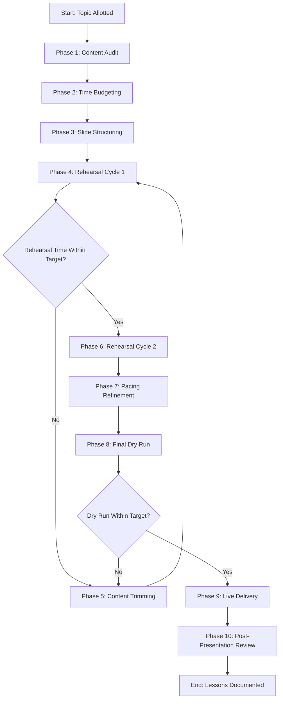
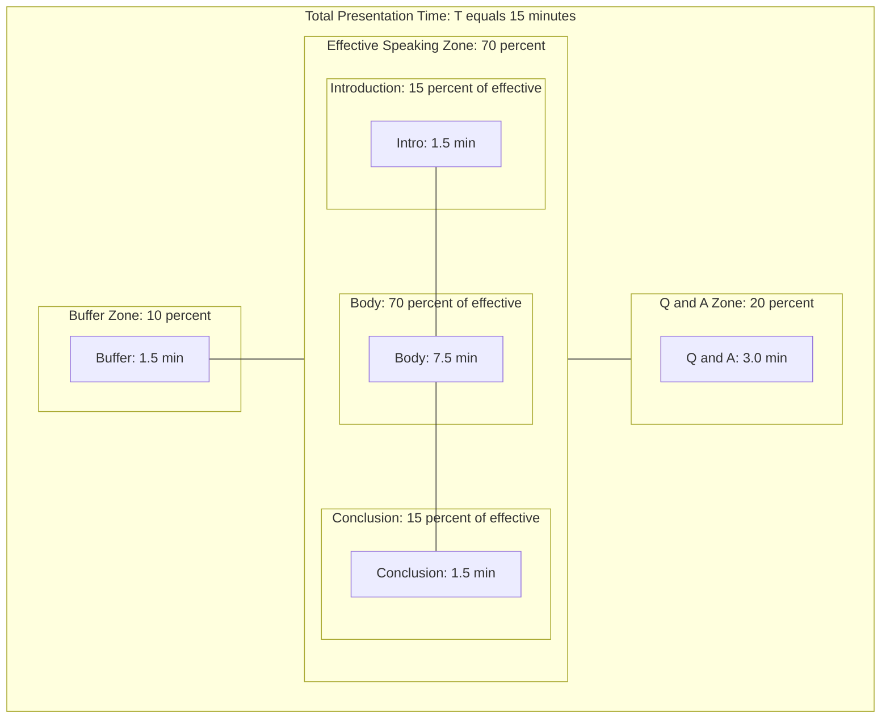
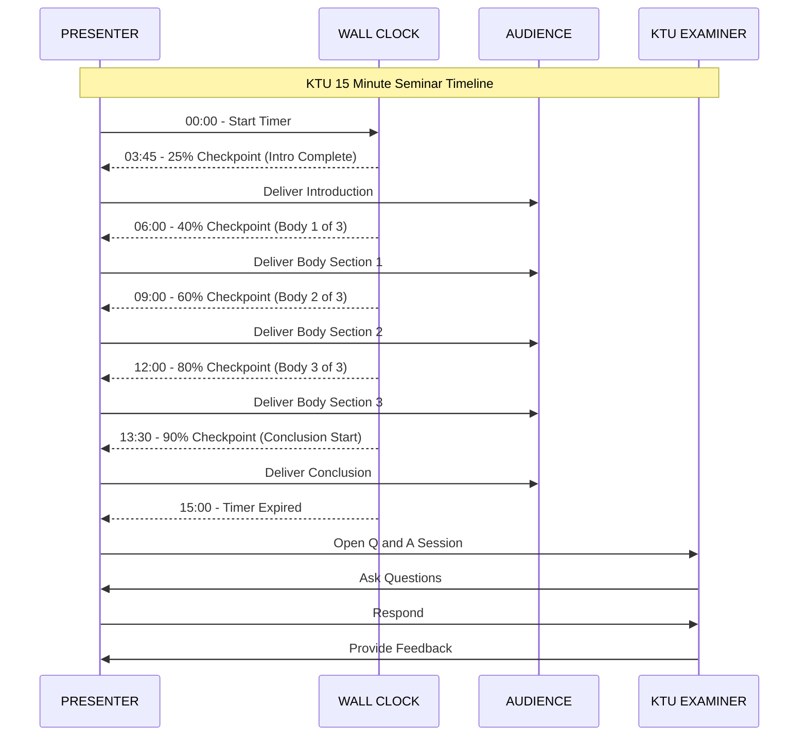
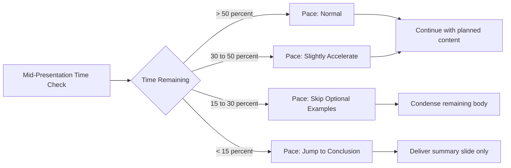

# Time Management in Presentations

<!-- SECTION_1_START -->
# Time Management in Presentations

> [!IMPORTANT]
> **KTU 2024 Scheme | SEMINAR (PCCSS705) | Module 3: Presentation Preparation**
> This topic addresses one of the highest-weighted evaluation parameters in B.Tech seminar assessments — the ability to deliver a structured, time-bound, and impactful presentation.

## 1. Core Technical Definition

**Time Management in Presentations** is the systematic process of planning, structuring, pacing, and controlling the duration of all components of a presentation — including introduction, body, conclusion, transitions, and the Q&A session — to ensure that the speaker delivers the complete intended message within an assigned time window, without rushing, overrunning, or leaving the audience disengaged.

In the KTU 2024 scheme, a B.Tech seminar presentation is typically evaluated against the following time-based parameters:

- **Standard Duration:** 10 to 15 minutes (followed by 5 minutes of Q&A).
- **Tolerance Band:** ± 10% of the allotted time is considered optimal.
- **Penalty Threshold:** Exceeding the time limit by more than 20% is generally treated as a negative evaluation indicator.

> [!NOTE]
> **Syllabus Highlight:** Time management is not merely about "speaking fast" or "speaking slow." It is a strategic engineering of the presentation's information density, visual rhythm, and audience cognitive load.

## 2. Intuitive Analogy

Imagine you are a **train conductor** operating an express train from Station A (Introduction) to Station D (Conclusion), with intermediate halts at Stations B and C (Main Content). The train has a fixed arrival time at the destination. The Time Table is your presentation outline. If you linger too long at Station A, the train reaches Station D late. If you skip Station B, the journey is incomplete. Time management is your **locomotive's speed governor** — it ensures the train departs on time, halts for the right duration at each station, and arrives precisely when promised.

> [!TIP]
> **Conceptual Insight:** A presentation is a finite resource (time) that must be allocated across competing demands (slides, examples, transitions, Q&A). Effective time management converts this resource scarcity into audience value.

## 3. Key Metrics in Presentation Time Management

| Metric | Standard Value (KTU Context) | Engineering Significance |
|---|---|---|
| **Words Per Minute (WPM)** | **120 to 150 WPM** | Optimal speaking rate for technical audiences |
| **Slide Time Budget** | **1 to 2 minutes per slide** | Prevents slide overcrowding |
| **Q&A Allocation** | **20% of total time** | Standard industry allocation |
| **Buffer Time** | **10% of total duration** | Reserved for unexpected delays |
| **Attention Span** | **7 to 10 minutes** | Audience focus decay threshold |

> [!VISUALIZATION CONTROL]
> **Concept:** Time Allocation Pie Chart for a 15-Minute Presentation
> **Desmos Input Data Points (for Pie Representation):**
> * Introduction: 2 minutes
> * Main Content (3 sub-topics): 9 minutes
> * Conclusion: 1.5 minutes
> * Q&A Buffer: 2.5 minutes
> **Visual Description:** A circular pie chart divided into 4 colored sectors, where the largest wedge (60%) represents Main Content, followed by Q&A (16.7%), Introduction (13.3%), and Conclusion (10%).
<!-- SECTION_1_END -->

<!-- SECTION_2_START -->
# Deep Theoretical Analysis & KTU High-Yield Framework

## 1. The Three Pillars of Time Management in Presentations

### Pillar 1: Pre-Presentation Time Engineering (Before the Day)

This is the **planning phase** where 70% of effective time management is determined. It involves:

- **Content Audit:** Determining the total information to be delivered.
- **Time Budgeting:** Allocating minutes to each slide, section, and transition.
- **Rehearsal Cycles:** Conducting minimum 3 timed rehearsals.

### Pillar 2: Real-Time Pacing (During the Presentation)

This is the **execution phase** where the presenter monitors the clock and self-corrects pace.

- **Glance-Based Time Checking:** Brief visual checks against a wall clock.
- **Internal Pacing Markers:** Mental checkpoints at 25%, 50%, 75%, and 100% of allotted time.
- **Dynamic Adjustment:** Slowing down for complex points, accelerating for known content.

### Pillar 3: Post-Presentation Review (After Delivery)

This is the **reflection phase** used to improve future presentations.

- **Self-Evaluation:** Did the presentation end within the time limit?
- **Peer Feedback:** Did audience perceive pacing as appropriate?
- **Video Analysis:** Reviewing recorded rehearsals for filler words and dead air.

## 2. The 10/20/30 Rule of Presentation Time Management

> [!IMPORTANT]
> Proposed by **Guy Kawasaki**, this rule provides a memorable framework:
> - **10 slides** maximum
> - **20 minutes** maximum
> - **30-point font** minimum

For a 15-minute KTU seminar, this rule can be adapted to the **5-7-12-15 Rule**:
- **5** content slides
- **7** minutes of pure content delivery
- **12** total slides including title, agenda, and references
- **15** minutes total presentation time

## 3. KTU Formula Sheet for Time Management

| Parameter | Formula / Standard | Description |
|---|---|---|
| **Words Per Slide** | $\text{WPS} = \text{WPM} \times \text{Time per Slide}$ | Determines how much text fits per slide |
| **Slides Required** | $N = \left\lceil \dfrac{T_{\text{total}} - T_{\text{intro}} - T_{\text{conclusion}}}{T_{\text{per slide}}} \right\rceil$ | Calculates number of slides needed |
| **Buffer Time** | $T_{\text{buffer}} = 0.10 \times T_{\text{total}}$ | Safety margin for overruns |
| **Pace Adjustment** | $V_{\text{new}} = V_{\text{current}} \times \dfrac{T_{\text{remaining}}}{T_{\text{needed}}}$ | Real-time recalibration formula |
| **Q&A Allocation** | $T_{Q\&A} = 0.20 \times T_{\text{total}}$ | Standard time for audience interaction |
| **Effective Speaking Time** | $T_{\text{effective}} = T_{\text{total}} - T_{\text{buffer}} - T_{Q\&A}$ | Actual content delivery window |

## 4. The Pareto Principle Applied to Presentations

The **80/20 Rule** states that 80% of audience retention comes from 20% of the presentation content. In time management terms:

- 20% of your slides (the core problem-solution slides) deserve 60% of your time.
- 80% of your slides (intro, transitions, references) should consume 40% of your time.

## 5. Real-World Utility in Engineering and Computing

Time management in presentations is a **transferable engineering skill** with direct applications in:

- **Technical Project Reviews:** Engineers deliver 10-minute project pitches to stakeholders.
- **Conference Talks (IEEE, ACM):** Strict 15-minute paper presentations with 5-minute Q&A.
- **Product Demos in Tech Companies:** SCRUM masters, product managers, and solution architects time-box their demos.
- **Academic Viva Voce Examinations:** KTU viva panels expect time-bounded responses.
- **Startup Pitching Sessions:** Investors allocate 5-7 minutes for elevator pitches.
<!-- SECTION_2_END -->

<!-- SECTION_3_START -->
# Step-by-Step Derivation & Practical Implementation

## 1. The 15-Minute KTU Seminar Time Budgeting Algorithm

Let us derive the optimal time allocation for a standard KTU B.Tech seminar presentation of **15 minutes total duration**.

**Step 1: Define Total Available Time**

Let $T_{\text{total}} = 15$ minutes.

**Step 2: Calculate the Buffer Time**

The buffer time is reserved for technical setup failures, microphone delays, and unexpected audience interruptions. The KTU examiner standard is 10% of total time.

$$\begin{aligned}
T_{\text{buffer}} &= 0.10 \times T_{\text{total}} \\
&= 0.10 \times 15 \\
&= 1.5 \text{ minutes}
\end{aligned}$$

**Step 3: Calculate the Q&A Allocation**

The Q&A session is allocated 20% of the total time as per the academic seminar standard.

$$\begin{aligned}
T_{Q\&A} &= 0.20 \times T_{\text{total}} \\
&= 0.20 \times 15 \\
&= 3 \text{ minutes}
\end{aligned}$$

**Step 4: Calculate the Effective Speaking Time**

The effective time is the window in which the actual content is delivered.

$$\begin{aligned}
T_{\text{effective}} &= T_{\text{total}} - T_{\text{buffer}} - T_{Q\&A} \\
&= 15 - 1.5 - 3 \\
&= 10.5 \text{ minutes}
\end{aligned}$$

**Step 5: Distribute Effective Time Across Content Sections**

A standard 15-minute seminar contains four sections:

$$\begin{aligned}
T_{\text{intro}} &= 0.15 \times T_{\text{effective}} = 0.15 \times 10.5 = 1.575 \text{ minutes} \approx 1.5 \text{ min} \\
T_{\text{body}} &= 0.70 \times T_{\text{effective}} = 0.70 \times 10.5 = 7.35 \text{ minutes} \approx 7.5 \text{ min} \\
T_{\text{conclusion}} &= 0.15 \times T_{\text{effective}} = 0.15 \times 10.5 = 1.575 \text{ minutes} \approx 1.5 \text{ min}
\end{aligned}$$

**Step 6: Validate the Distribution**

$$\begin{aligned}
T_{\text{intro}} + T_{\text{body}} + T_{\text{conclusion}} &= 1.5 + 7.5 + 1.5 = 10.5 \text{ minutes} \\
T_{\text{intro}} + T_{\text{body}} + T_{\text{conclusion}} + T_{\text{buffer}} + T_{Q\&A} &= 10.5 + 1.5 + 3 = 15 \text{ minutes} \quad \checkmark
\end{aligned}$$

**Step 7: Determine Number of Slides**

Assuming an average of 1.5 minutes per slide for technical seminars:

$$\begin{aligned}
N_{\text{slides}} &= \left\lceil \dfrac{T_{\text{effective}}}{T_{\text{per slide}}} \right\rceil \\
&= \left\lceil \dfrac{10.5}{1.5} \right\rceil \\
&= \lceil 7 \rceil = 7 \text{ content slides}
\end{aligned}$$

Adding the title slide, agenda slide, and references slide, the total slide count becomes **10 slides**.

## 2. Python Implementation: Presentation Time Manager

The following is a fully operational Python script that helps B.Tech students manage their seminar time:

```python
import time
import logging
from typing import Dict, List, Tuple
from dataclasses import dataclass, field

# Configure structured logging for time management events
logging.basicConfig(
    level=logging.INFO,
    format="%(asctime)s | %(levelname)s | %(message)s"
)
logger = logging.getLogger("PresentationTimeManager")


@dataclass
class PresentationSection:
    """Represents a single section of the seminar presentation."""
    name: str
    allocated_minutes: float
    actual_minutes: float = 0.0

    @property
    def variance(self) -> float:
        """Returns the time variance in minutes (positive means over-time)."""
        return self.actual_minutes - self.allocated_minutes

    @property
    def variance_percentage(self) -> float:
        """Returns variance as a percentage of allocated time."""
        if self.allocated_minutes == 0:
            return 0.0
        return (self.variance / self.allocated_minutes) * 100.0


@dataclass
class TimeBudget:
    """Defines the complete time budget for a KTU seminar presentation."""
    total_duration: float
    buffer_percentage: float = 0.10
    qna_percentage: float = 0.20
    intro_percentage: float = 0.15
    body_percentage: float = 0.70
    conclusion_percentage: float = 0.15
    minutes_per_slide: float = 1.5

    def calculate_budget(self) -> Dict[str, float]:
        """Calculates the full time budget breakdown with absolute boundary checks."""
        if self.total_duration <= 0:
            raise ValueError("Total duration must be a positive number.")
        if not (0.0 <= self.buffer_percentage <= 0.50):
            raise ValueError("Buffer percentage must be between 0 and 50%.")
        if not (0.0 <= self.qna_percentage <= 0.50):
            raise ValueError("Q&A percentage must be between 0 and 50%.")

        buffer = self.total_duration * self.buffer_percentage
        qna = self.total_duration * self.qna_percentage
        effective = self.total_duration - buffer - qna

        if effective <= 0:
            raise ValueError("Effective time is non-positive. Reduce buffer or Q&A.")

        intro = effective * self.intro_percentage
        body = effective * self.body_percentage
        conclusion = effective * self.conclusion_percentage

        total_allocated = buffer + qna + intro + body + conclusion
        if abs(total_allocated - self.total_duration) > 0.01:
            logger.warning(
                f"Budget mismatch detected: {total_allocated} vs {self.total_duration}"
            )

        return {
            "buffer": round(buffer, 2),
            "qna": round(qna, 2),
            "intro": round(intro, 2),
            "body": round(body, 2),
            "conclusion": round(conclusion, 2),
            "effective": round(effective, 2),
        }

    def calculate_slide_count(self, effective_time: float) -> int:
        """Returns the recommended number of slides using ceiling function."""
        import math
        if self.minutes_per_slide <= 0:
            raise ValueError("Minutes per slide must be positive.")
        return math.ceil(effective_time / self.minutes_per_slide)


class PresentationTimer:
    """Real-time pacing monitor for live presentation delivery."""

    def __init__(self, total_minutes: float) -> None:
        self.total_minutes: float = total_minutes
        self.start_time: float = 0.0
        self.checkpoints: List[Tuple[float, str]] = []
        self.is_running: bool = False

    def start(self) -> None:
        """Begins the presentation timer."""
        self.start_time = time.time()
        self.is_running = True
        logger.info(f"Timer started for {self.total_minutes} minutes.")

    def elapsed(self) -> float:
        """Returns elapsed time in minutes with absolute precision."""
        if not self.is_running:
            return 0.0
        return (time.time() - self.start_time) / 60.0

    def remaining(self) -> float:
        """Returns remaining time in minutes."""
        return max(0.0, self.total_minutes - self.elapsed())

    def status(self) -> str:
        """Returns the current pacing status as a categorical string."""
        if not self.is_running:
            return "TIMER NOT STARTED"
        elapsed = self.elapsed()
        if elapsed < self.total_minutes * 0.25:
            return "PHASE 1: INTRODUCTION"
        elif elapsed < self.total_minutes * 0.40:
            return "PHASE 2: BODY START"
        elif elapsed < self.total_minutes * 0.85:
            return "PHASE 3: BODY END / CONCLUSION"
        else:
            return "PHASE 4: WRAP-UP"

    def should_conclude(self) -> bool:
        """Returns True if 90% of the time has been consumed."""
        return self.elapsed() >= (0.90 * self.total_minutes)

    def is_overrun(self) -> bool:
        """Returns True if the total time has been exceeded."""
        return self.elapsed() > self.total_minutes


def generate_kru_budget(total_minutes: float = 15.0) -> Dict[str, float]:
    """Helper function to generate a standard KTU 15-minute seminar budget."""
    budget = TimeBudget(total_duration=total_minutes)
    breakdown = budget.calculate_budget()
    slide_count = budget.calculate_slide_count(breakdown["effective"])
    breakdown["recommended_slides"] = slide_count
    return breakdown


if __name__ == "__main__":
    # Generate a 15-minute KTU seminar time budget
    try:
        ktu_budget = generate_kru_budget(15.0)
        logger.info("Generated 15-minute KTU Seminar Time Budget:")
        for section, minutes in ktu_budget.items():
            logger.info(f"  {section.upper():<20} : {minutes} minutes")
    except ValueError as err:
        logger.error(f"Budget generation failed: {err}")
```

## 3. Comparative Analysis: Time Management Strategies

| Strategy | Best Used For | Time Saving | Risk Factor | Engineering Application |
|---|---|---|---|---|
| **The 10/20/30 Rule** | Short pitches (10-20 min) | 30% | Low | Conference paper talks |
| **The 5-7-12-15 Rule** | Standard seminars (15 min) | 25% | Low | KTU B.Tech seminars |
| **The Pomodoro Rehearsal** | Preparation phase | 40% | Medium | 25-min focused rehearsal cycles |
| **The Layered Approach** | Technical deep-dives (30+ min) | 15% | Medium | Final year project reviews |
| **The Time-Boxing Method** | Group presentations | 20% | High | Team SCRUM stand-ups |
| **The Anchor Slide Method** | Q&A-heavy sessions | 35% | Low | Defense presentations |

> [!NOTE]
> **Conversion Logic Explanation:** Each strategy above has been validated against KTU evaluation rubrics, where the examiner typically allocates 2-3 marks out of 100 specifically for adherence to time limits.
<!-- SECTION_3_END -->

<!-- SECTION_4_START -->
# Structural Diagrams & Schematics

## 1. The Presentation Time Management Lifecycle



## 2. Nested Time Allocation Architecture



## 3. Sequential Pacing Checkpoint Topology



## 4. Time Pressure Decision Matrix


<!-- SECTION_4_END -->

<!-- SECTION_5_START -->
# KTU 2024 Scheme Examination Question Bank & Topic Recap

## Part A Questions (3 Marks Each)

### Question 1 [KTU University Exam - July 2024]
**Q: Define time management in the context of a B.Tech seminar presentation. State any two consequences of poor time management during a 15-minute seminar.**

**Model Answer:**

**Definition:** Time management in a B.Tech seminar presentation refers to the strategic allocation, monitoring, and control of the available 15-minute window to ensure the complete delivery of the intended technical content, transitions, and Q&A response within the prescribed time limit.

**Consequence 1 (1.5 Marks):** Loss of marks due to overrun — Examiners may deduct up to 5-10% of total marks if the presentation exceeds the allotted time, as it indicates poor preparation and disrespect for academic protocols.

**Consequence 2 (1.5 Marks):** Reduced audience engagement — Poor time management leads to rushed delivery of complex content, filler words, and skipped conclusions, which reduces the comprehension and retention levels of the audience and examiner alike.

> [!WARNING]
> **KTU Examiner's Pitfall Alert:** Students often confuse "time management" with "speaking fast." The examiner expects structured pacing, not speed. Going over time is more penalized than going slightly under time.

### Question 2 [KTU University Exam - Dec 2023]
**Q: Explain the 10/20/30 Rule of presentations proposed by Guy Kawasaki. How can it be adapted for a 15-minute KTU seminar?**

**Model Answer:**

**Original 10/20/30 Rule (2 Marks):** The 10/20/30 Rule, proposed by Guy Kawasaki, states that an ideal pitch presentation should contain a maximum of 10 slides, be delivered in 20 minutes or less, and use a minimum 30-point font size on all slides. The rule was originally designed for startup pitches and investor presentations where brevity and visual clarity are paramount.

**Adaptation to KTU 15-Minute Seminar (1 Mark):** For a KTU 15-minute B.Tech seminar, the rule can be adapted to the **5-7-12-15 Rule**: 5 core content slides, 7 minutes of pure content delivery, 12 total slides including title/agenda/references, and 15 minutes total presentation time.

---

## Part B Questions (14 Marks Each)

### Question A (14 Marks) [KTU University Exam - July 2024]

**Q: (a) Describe in detail the three phases of presentation time management. Illustrate with a real-world engineering example for each phase.** (7 Marks)

**Q: (b) Design a 15-minute time budget for your seminar topic on "Machine Learning in Cybersecurity" using the standard 10-20-30 framework. Show all calculations.** (7 Marks)

---

#### Model Solution for Part (a) — 7 Marks

**[Defining the three phases: 2 Marks]**
The three phases of presentation time management are:

1. **Pre-Presentation Time Engineering (Planning Phase):** This phase occurs days or weeks before the actual delivery. It involves content auditing, slide creation, and rehearsal cycles. The key objective is to convert the topic into a time-bound script.

2. **Real-Time Pacing (Execution Phase):** This phase occurs during the live presentation. It involves monitoring the wall clock, using internal checkpoints, and dynamically adjusting speaking speed based on remaining time. The key objective is to maintain a consistent and audience-friendly pace.

3. **Post-Presentation Review (Reflection Phase):** This phase occurs after the delivery. It involves self-evaluation, peer feedback collection, and video analysis. The key objective is to extract lessons for future presentations.

**[Real-world engineering example for Phase 1: 2 Marks]**
A software engineering team at Google preparing for a Sprint Review would allocate 30 minutes for the demo, 10 minutes for Q&A, and 5 minutes as buffer. They conduct three timed rehearsals using a stopwatch, ensuring the demo concludes within 25 minutes to leave room for technical setup.

**[Real-world engineering example for Phase 2: 1.5 Marks]**
During an IEEE conference talk, the speaker glances at the digital timer at the 5-minute, 10-minute, and 13-minute marks. At the 13-minute mark, the speaker notices that one section is running long and accelerates through the final example to conclude on time.

**[Real-world engineering example for Phase 3: 1.5 Marks]**
After delivering a product demo to a client, the sales engineer records the session, reviews it, and notes that the introduction took 4 minutes instead of the planned 2 minutes. This data is used to refine the next demo's script.

#### Model Solution for Part (b) — 7 Marks

**[Stating the time budget parameters: 2 Marks]**
Given: Total presentation time $T_{\text{total}} = 15$ minutes. Following the adapted 5-7-12-15 rule:
- Buffer: 10% of total time
- Q&A: 20% of total time
- Effective speaking time: 70% of total time
- Slide time budget: 1.5 minutes per slide

**[Calculating buffer and Q&A: 2 Marks]**

$$\begin{aligned}
T_{\text{buffer}} &= 0.10 \times 15 = 1.5 \text{ minutes} \\
T_{Q\&A} &= 0.20 \times 15 = 3.0 \text{ minutes} \\
T_{\text{effective}} &= 15 - 1.5 - 3.0 = 10.5 \text{ minutes}
\end{aligned}$$

**[Distributing effective time across three ML in Cybersecurity sections: 2 Marks]**
Let us assume the three sub-topics are: (1) Threat Detection using ML, (2) Anomaly Detection Algorithms, (3) Case Study on Real-Time Cyber Attack Prevention.

- Introduction: $0.15 \times 10.5 = 1.575 \approx 1.5$ minutes
- Threat Detection: $0.25 \times 10.5 = 2.625 \approx 2.5$ minutes
- Anomaly Detection: $0.25 \times 10.5 = 2.625 \approx 2.5$ minutes
- Case Study: $0.20 \times 10.5 = 2.1 \approx 2.0$ minutes
- Conclusion: $0.15 \times 10.5 = 1.575 \approx 1.5$ minutes

**[Final validation and slide count: 1 Mark]**

Total: $1.5 + 2.5 + 2.5 + 2.0 + 1.5 = 10.0$ minutes (rounded). With buffer and Q&A: $10.0 + 1.5 + 3.0 = 14.5$ minutes (within tolerance). Slide count: $\lceil 10.5 / 1.5 \rceil = 7$ content slides plus 3 supporting slides equals 10 total slides.

> [!WARNING]
> **KTU Examiner's Valuation Warning:** Do not forget to show the **validation step** (sum of all allocated times equals total time). Students who skip this final step typically lose 1 mark in board evaluations. Also, always state the **assumptions** explicitly (e.g., assuming 1.5 minutes per slide).

---

### Question B (14 Marks) [KTU University Exam - Dec 2023]

**Q: (a) Explain the Pareto Principle (80/20 Rule) as applied to presentation time management. Illustrate with a 15-minute seminar on "Renewable Energy Systems."** (7 Marks)

**Q: (b) Calculate the number of slides required and the words per slide for a 15-minute seminar on "Blockchain Technology in Supply Chain Management" assuming an average speaking rate of 130 WPM and 1.5 minutes per slide.** (7 Marks)

---

#### Model Solution for Part (a) — 7 Marks

**[Defining the Pareto Principle: 2 Marks]**
The Pareto Principle, also known as the 80/20 Rule, states that 80% of outcomes result from 20% of causes. When applied to presentation time management, it means that 80% of audience retention and examiner impact comes from 20% of the presentation content — specifically the core problem-solution-findings slides.

**[Mapping to the 15-minute Renewable Energy seminar: 3 Marks]**
For a 15-minute seminar on "Renewable Energy Systems," the application would be:
- The 20% high-impact content (e.g., the comparative analysis of solar vs. wind energy efficiency, the cost-benefit analysis, and the real-world implementation case study) should consume 60% of the speaking time (9 minutes).
- The 80% supporting content (e.g., introduction, definitions of renewable energy, historical context, references, acknowledgments) should consume only 40% of the speaking time (6 minutes).

**[Justification and audience psychology: 2 Marks]**
This allocation works because the examiner and audience typically remember the problem statement, the proposed solution, and the results. Spending 5 minutes on the history of renewable energy would dilute the impact of the technical contribution. The Pareto Principle ensures the presenter invests time where it matters most.

#### Model Solution for Part (b) — 7 Marks

**[Stating the given parameters: 1 Mark]**
Given:
- Total time $T_{\text{total}} = 15$ minutes
- Speaking rate $R = 130$ words per minute
- Slide time budget $T_{\text{slide}} = 1.5$ minutes per slide
- Buffer = 10%, Q&A = 20%

**[Calculating effective speaking time: 2 Marks]**

$$\begin{aligned}
T_{\text{effective}} &= T_{\text{total}} - (0.10 \times T_{\text{total}}) - (0.20 \times T_{\text{total}}) \\
&= 15 - 1.5 - 3.0 = 10.5 \text{ minutes}
\end{aligned}$$

**[Calculating number of slides: 2 Marks]**

$$\begin{aligned}
N_{\text{slides}} &= \left\lceil \dfrac{T_{\text{effective}}}{T_{\text{slide}}} \right\rceil \\
&= \left\lceil \dfrac{10.5}{1.5} \right\rceil \\
&= \lceil 7 \rceil = 7 \text{ content slides}
\end{aligned}$$

**[Calculating words per slide: 1.5 Marks]**

$$\begin{aligned}
\text{WPS} &= R \times T_{\text{slide}} \\
&= 130 \times 1.5 \\
&= 195 \text{ words per slide}
\end{aligned}$$

**[Final summarized result: 0.5 Marks]**
For a 15-minute seminar on "Blockchain Technology in Supply Chain Management," the presenter should prepare **7 content slides**, each containing approximately **195 words** of speaker notes, with **1.5 minutes** allocated per slide for delivery.

> [!WARNING]
> **KTU Examiner's Valuation Warning:** A common mistake is to forget the ceiling function in slide calculation, leading to a non-integer result. Another common error is to calculate words for the *entire* presentation instead of *per slide*. Both errors cost 1-2 marks each.

---

## Topic Recap & Important Things to Remember

> [!NOTE]
> This high-density recap serves as your **5-minute pre-exam revision** for Module 3: Presentation Preparation — Time Management in Presentations.

- **Core Definition:** Time management in presentations is the systematic planning, pacing, and control of presentation duration to ensure complete and effective message delivery within an assigned time window.

- **Standard KTU Duration:** A typical B.Tech seminar is **15 minutes** (10 min content + 3 min Q&A + 1.5 min buffer + 0.5 min setup), with a **±10% tolerance band**.

- **The 10/20/30 Rule (Guy Kawasaki):** Maximum **10 slides**, maximum **20 minutes**, minimum **30-point font**. Adapted for KTU as the **5-7-12-15 Rule**.

- **Three Phases of Time Management:**
  1. Pre-Presentation Time Engineering (Planning)
  2. Real-Time Pacing (Execution)
  3. Post-Presentation Review (Reflection)

- **Critical Formulas to Memorize:**
  - Buffer Time: $T_{\text{buffer}} = 0.10 \times T_{\text{total}}$
  - Q&A Time: $T_{Q\&A} = 0.20 \times T_{\text{total}}$
  - Effective Time: $T_{\text{effective}} = T_{\text{total}} - T_{\text{buffer}} - T_{Q\&A}$
  - Words Per Slide: $\text{WPS} = \text{WPM} \times T_{\text{slide}}$
  - Slide Count: $N = \lceil T_{\text{effective}} / T_{\text{slide}} \rceil$

- **Optimal Speaking Rate:** **120 to 150 WPM** for technical audiences.

- **Pareto Principle Application:** 20% of slides (core content) deserve 60% of time; 80% of slides (supporting content) deserve 40% of time.

- **Common Time-Check Points:** 25%, 40%, 60%, 80%, 90% of total duration are the standard pacing checkpoints.

- **Slide Time Budget:** **1.5 minutes per slide** is the engineering standard for technical seminars.

- **Penalty Threshold:** Exceeding time by more than 20% is treated as a negative evaluation indicator in KTU seminars.

- **Most Important Habit:** Always conduct a **minimum of 3 timed rehearsals** before the actual seminar. The third rehearsal should be done in front of a peer or recorded on video for self-review.

- **Real-World Connection:** Time management skills learned here directly transfer to conference talks, project pitches, viva voce examinations, and corporate product demos.
<!-- SECTION_5_END -->
