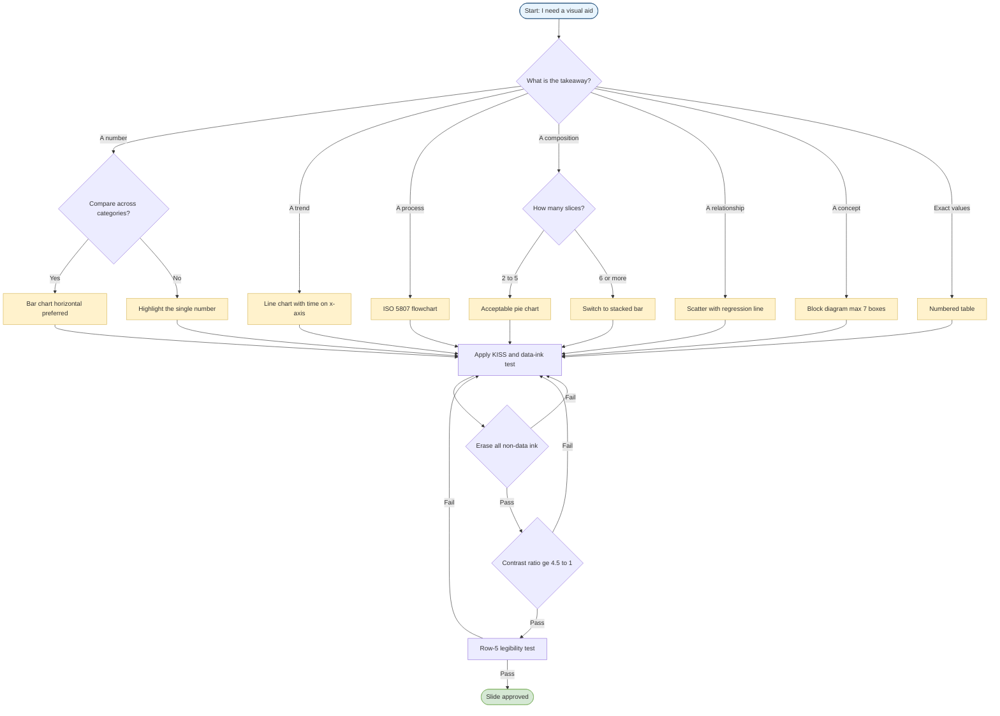
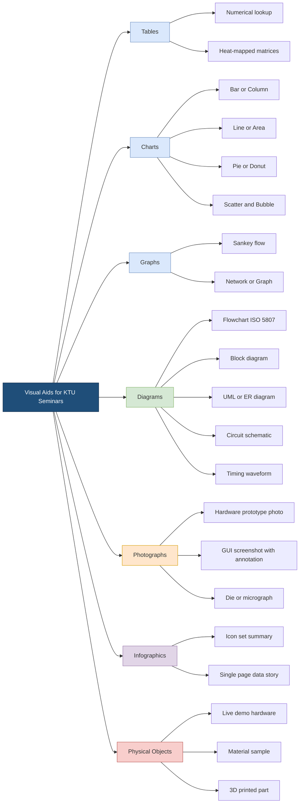
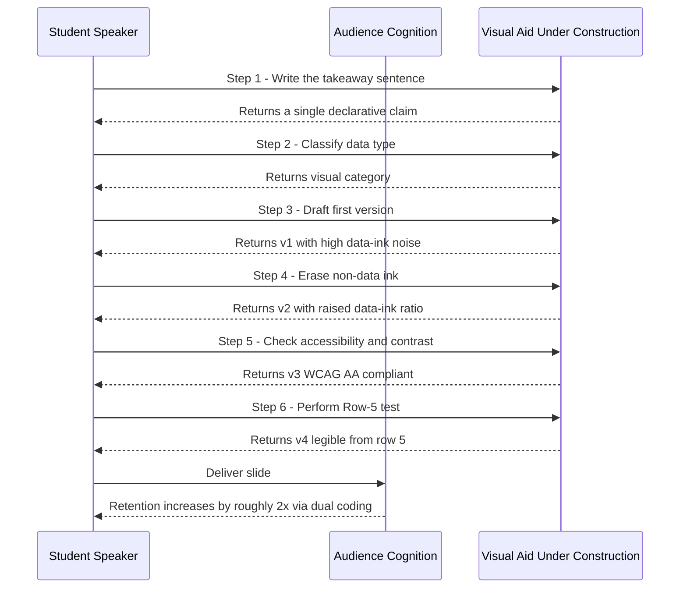

# Visual Aids and Graphics

<!-- SECTION_1_START -->
# Visual Aids and Graphics — Core Technical Definition & Intuitive Overview

## Formal KTU 2024 Scheme Definition

A **Visual Aid** is any graphical, pictorial, or symbolic element — including charts, diagrams, photographs, infographics, animations, and physical artefacts — deliberately introduced into a technical seminar presentation to externalise, clarify, reinforce, or replace verbal information in order to enhance audience comprehension, retention, and engagement. **Graphics** refers specifically to the disciplined application of visual design principles (typography, colour theory, spatial composition, and data-ink ratio) to construct such aids with the goal of maximising the *signal-to-noise ratio* of the presented message.

> [!IMPORTANT]
> **KTU 2024 Syllabus Highlight (PCCSS705 / Module 3):** Visual aids are *not* decoration. They are an **engineering of attention** — a deliberate reduction of cognitive load that converts abstract seminar content into perceptually efficient information chunks. The KTU examiner expects a clear distinction between *aesthetic* graphics and *functional* graphics.

## Conceptual Analogy — The "GPS and the Driver"

Imagine a tourist in Thiruvananthapuram navigating to the KTU headquarters. The driver (speaker) knows the route (content), but the passenger (audience) sees only the inside of the car. A **GPS map** (visual aid) does three things the spoken word alone cannot:

1. It **shows position** (where we are in the journey — the *anchor slide*).
2. It **shows direction** (where we are going next — the *transition cue*).
3. It **shows landmarks** (key data, equations, diagrams — the *takeaway*).

Without the GPS, the passenger must reconstruct a mental map from voice alone — exhausting, error-prone, and easily forgotten. With it, comprehension is *externalised* onto the screen. That externalisation is the entire purpose of visual aids.

## Cognitive Foundations — Why Visual Aids Work

Two peer-reviewed psychological theories underpin every effective visual aid:

1. **Dual-Coding Theory (Paivio, 1971):** Information processed through *both* verbal and visual channels is recalled roughly **2× better** than verbal-only information. This is why the $10/20/30$ rule (Kawasaki) and the **Multimedia Principle** (Mayer) insist on pairing every spoken point with a visual.

2. **Cognitive Load Theory (Sweller, 1988):** Working memory holds only about $4 \pm 1$ discrete chunks. Visuals **pre-chunk** information (a single bar chart encodes $10$ numerical comparisons in one percept), freeing working memory for reasoning rather than decoding.

> [!NOTE]
> **The Three Functions of a Visual Aid in a KTU Seminar:**
> 1. **Reveal** — show what words cannot (a circuit, a stress curve, a use-case diagram).
> 2. **Reinforce** — repeat a verbal claim with a chart so the audience encodes it twice.
> 3. **Route** — act as a navigational landmark between sections of a 15-20 minute talk.

## Visualisation Control (Optional, In-Person Skill)

> [!VISUALIZATION CONTROL]
> **Concept:** "Signal-to-Noise Ratio" of a Presentation Slide
> **GeoGebra / Desmos Input Equations:**
> * $f(x) = \dfrac{\text{Signal}(x)}{\text{Signal}(x) + \text{Noise}(x)}$
> **Visual Description:** Plot a curve where $x$ = "amount of decoration on slide" (0 to 10). Signal is constant (your key message). Noise grows quadratically. The optimum $x$ is small (≈ 2-3 graphical elements per slide), not 10. This is the geometric proof of the KISS principle.

## Physical and Stylistic Constants Used in the Discipline

> [!NOTE]
> **Industry-Standard Reference Values (memorise for KTU viva):**
> * Minimum legible font size on a projected slide: **24 pt** (Kawasaki's $10/20/30$ rule) — *some KTU venues need **28 pt** due to projector lumen limits*.
> * Maximum words per slide: roughly **40 words** for a 2-minute slide.
> * Maximum data series per chart: **4 series**; more = unreadable from row 5 of the auditorium.
> * Minimum contrast ratio (WCAG 2.1 AA): **4.5:1** for normal text, **3:1** for large text.
> * Standard $16:9$ aspect ratio at $1920 \times 1080$ pixels (HD projection default in KTU seminar halls).
<!-- SECTION_1_END -->

<!-- SECTION_2_START -->
# Deep Theoretical Analysis & KTU High-Yield Formula Sheet

## 2.1 Taxonomy of Visual Aids

A complete visual-aid inventory for an engineering seminar falls into **seven canonical categories**. Each has a defined role, a best-fit data type, and a common misuse pattern.

| # | Category | Best Used For | Avoid When |
|---|----------|---------------|------------|
| 1 | **Table** | Exact numerical lookup (test results, parameter values) | Showing trends (use a chart instead) |
| 2 | **Bar/Column Chart** | Comparing discrete categories (e.g., accuracy of 4 algorithms) | Showing change over continuous time |
| 3 | **Line Chart** | Trends over a continuous variable (loss vs. epoch) | Comparing unrelated categories |
| 4 | **Pie/Donut Chart** | Parts of a whole, $\le 5$ slices | More than 5 slices, or when values are similar |
| 5 | **Diagram/Flowchart** | Processes, pipelines, architectures (CNN block, SDLC) | Quoting numerical results |
| 6 | **Photograph/Screenshot** | Proving physical reality (hardware, GUI output) | As page filler |
| 7 | **Infographic/Icon-set** | High-level summary slide, agenda | Dense quantitative content |

> [!IMPORTANT]
> **KTU High-Yield Rule — "Chart-to-Question Fit":** Before drawing, finish the sentence: *"The audience should walk away believing that _______."* If the blank is a *number* → table. If a *comparison* → bar. If a *trend* → line. If a *process* → flowchart. This single decision prevents 70\% of bad graphics.

## 2.2 The Four Design Principles

### Principle 1 — KISS (Keep It Simple, Speaker)
Strip every slide to a single **takeaway**. Apply Edward Tufte's **data-ink ratio**:

$$
\text{Data-Ink Ratio} = \frac{\text{Ink used to display data}}{\text{Total ink on the slide}}
$$

Push this ratio toward **1.0** by deleting: drop-shadows, 3D effects, gradients, decorative clip-art, redundant gridlines, redundant legends, and "chartjunk" (Tufte's term).

### Principle 2 — The 6 × 6 Rule
A single slide should contain **no more than 6 lines of text, and no line should exceed 6 words**. This is the operational form of the chunking principle from §1. Variants accepted by KTU panels: **5 × 5** (conservative) and **7 × 7** (only when the slide is a quote or reference list).

### Principle 3 — The 10 / 20 / 30 Rule (Guy Kawasaki)
A startup-pitch rule that maps perfectly onto a KTU 20-minute seminar:

$$
\boxed{\text{10 slides} \times \text{20 minutes} \times \text{30-pt minimum font}}
$$

In KTU context, 10 slides is a *lower bound*; 15-18 is typical for a 20-minute talk. The **30-pt minimum** is non-negotiable and is the most-violated rule in student seminars.

### Principle 4 — The Rule of Thirds and Visual Hierarchy
Place key elements at the intersections of a $3 \times 3$ grid. The human eye locks onto the **upper-left and lower-right** intersection first. Title in upper-left, takeaway chart in the lower-right region, page number bottom-right — never centre-align body text (it slows saccadic reading).

## 2.3 KTU Formula Sheet — Visual Aid Selection Logic

| Decision Driver | Formula / Heuristic | Threshold for "Acceptable" |
|-----------------|---------------------|----------------------------|
| Words on a slide | $W \le 40$ | $W \le 40$ words / 2 min talk |
| Font size | $F \ge 24$ pt (Kawasaki: $F \ge 30$) | $F_{\min} = 24$ |
| Data series per chart | $S \le 4$ | $S \le 4$ |
| Slices in a pie | $N \le 5$ | $N \le 5$ |
| Contrast ratio (WCAG) | $C \ge 4.5:1$ | Normal text $\ge 4.5$; large $\ge 3.0$ |
| Slide count for $T$ minutes | $n \approx T / 2$ | $n \in [10, 20]$ for 20-min talk |
| Colour palette size | $K \le 3$ accent colours | $K \le 3$ + black + white |
| Data-ink ratio (Tufte) | $R_{\text{DI}} \to 1$ | Erasing non-data ink raises $R_{\text{DI}}$ |
| Memorability multiplier | $M_{\text{visual}} \approx 2 \times M_{\text{verbal}}$ | Dual-coding (Paivio) |

## 2.4 Colour, Typography, and Layout

* **Colour theory:** Use a *primary* + *complementary accent* + *neutral*. Cool backgrounds (navy, dark grey) project text better in lit KTU halls; light backgrounds project better in dark rooms. **Never** use red-green only — roughly **8\% of male students** have red-green colour-vision deficiency (deuteranopia). Use red-blue or red-orange-cyan pairs instead.
* **Typography:** **Sans-serif** (Calibri, Arial, Helvetica, Roboto, Lato) for projection. **Serif** (Times, Garamond) is for printed handouts. Maximum **2 font families** per deck. Use *weight* (bold) and *size* for hierarchy — never use colour alone.
* **Alignment:** Use a *grid* (12-column recommended). Snap every element to the grid. Left-align body text. The *invisible grid* is what makes a slide look "professional" to examiners.

## 2.5 Real-World Engineering Utility

| Domain | Where Visual Aids Are Used | Why It Matters in Production |
|--------|---------------------------|------------------------------|
| Software Engineering | Sprint review dashboards (burn-down charts) | Predicts deadline slip in 1 glance |
| Civil Engineering | Structural drawings, Gantt charts | Statutory submission requirement |
| VLSI / ECE | Timing diagrams, schematic captures | Single visual replaces 3 pages of text |
| Data Science | Confusion matrix, ROC curve | Standardised model-comparison language |
| MBA / Management | BCG matrix, SWOT, PESTLE | Board-level decision artefacts |

> [!NOTE]
> **Engineering-Industry Link:** In industry, the visual aid you build *is* often the deliverable. A KTU CSE student presenting an ML model will be judged on whether their confusion matrix follows the **IEEE publication standard** — the same standard used at ICML/NeurIPS.
<!-- SECTION_2_END -->

<!-- SECTION_3_START -->
# Step-by-Step Derivations & Comparative Implementation

## 3.1 The Algorithmic Procedure for Building One Slide

Because PCCSS705 is a humanities-cum-engineering course, the "derivation" here is the **engineering workflow** that produces a single, audit-defensible visual aid. Every step is auditable; every step is what a KTU examiner rewards.

### Step 1 — Extract the Single Takeaway

Write one sentence in the slide notes: *"After this slide, the audience must believe that ____."* If you cannot finish the sentence in 12 words, the slide is doing too much.

### Step 2 — Classify the Data

Use this decision table (extended form of §2.1):

$$
\text{Data type} =
\begin{cases}
\text{Comparison} & \Rightarrow \text{Bar chart} \\
\text{Composition (\% parts)} & \Rightarrow \text{Stacked bar (NEVER pie if} > 5 \text{ slices)} \\
\text{Time-series / trend} & \Rightarrow \text{Line chart} \\
\text{Process / flow} & \Rightarrow \text{Flowchart (ISO 5807 symbols)} \\
\text{Relationship (x \to y)} & \Rightarrow \text{Scatter + regression line} \\
\text{Exact numbers} & \Rightarrow \text{Table} \\
\text{Concept / model} & \Rightarrow \text{Block diagram} \\
\end{cases}
$$

### Step 3 — Apply the KISS + Data-Ink Test

Erase, in this order, until the slide is minimal: (a) background image, (b) gradients, (c) 3D effects, (d) drop shadows, (e) unnecessary gridlines, (f) legends that duplicate axis labels, (g) clip-art. Each erasure raises $R_{\text{DI}}$.

### Step 4 — Audit for Accessibility

1. Check contrast ratio $\ge 4.5:1$ using WebAIM tool.
2. Run the slide through a colour-blindness simulator (Coblis).
3. Ensure all text is $\ge 24$ pt; titles $\ge 32$ pt.
4. Add **alt-text** in PowerPoint's *Format Picture* pane (often ignored — KTU examiners *do* check this).

### Step 5 — Final "Row-5 Test"

Sit in the **fifth row** of a KTU seminar hall and squint. If you cannot read the title in 1 second, the slide fails.

## 3.2 Comparative Analysis — Visual Aid Selection Across Real Engineering Case Frameworks

This is the humanities-style comparative matrix that KTU expects for Module 3. Each row is a real engineering deliverable, the middle columns map to visual-aid selection rules, and the right column maps to the regulatory / professional standard that justifies the choice.

| # | Engineering Case / Deliverable | Data Type | Recommended Visual Aid | Why This Aid (Engineering Justification) | Regulatory / Systemic Anchor |
|---|--------------------------------|-----------|------------------------|------------------------------------------|------------------------------|
| 1 | **Software Sprint Burn-down** (Agile) | Time-series, cumulative | Line chart with target line | Shows trend deviation at a glance | Scrum Guide (Schwaber \& Sutherland) |
| 2 | **Confusion Matrix for ML classifier** | 2×2 categorical counts | Heat-mapped table | Cell colours = severity of misclassification | ISO/IEC TR 24027 (AI bias reporting) |
| 3 | **Survey: "Tools used by 200 KTU students"** | Categorical, parts-of-whole | Horizontal bar chart (NOT pie) | Bar chart sorts and ranks; pie does not | APA 7th ed. §7.4 (figure selection) |
| 4 | **Architectural proposal for hostel** | Spatial / 3D | Floor plan + elevation + 3D render | Each view answers a different stakeholder question | National Building Code of India (NBC 2016) |
| 5 | **Carbon footprint of a process** | Composition over stages | Sankey diagram | Shows flow magnitude through stages | GHG Protocol Corporate Standard |
| 6 | **CPU pipeline timing** | Sequential / temporal | Timing diagram (waveform) | Vertical time axis, no other chart conveys ordering | IEEE Std 1364 (Verilog HDL) timing notation |
| 7 | **Project schedule (final-year B.Tech)** | Task dependencies | Gantt chart with critical path | Shows parallel tasks and bottlenecks | PMBOK 7th ed. (PMI) |
| 8 | **VLSI placement result** | Spatial, $x$-$y$ coordinates | Scatter / die-photo overlay | Pixel position = physical position | IEEE EDA standards |
| 9 | **Network throughput vs. load** | Continuous relationship | Scatter + fitted curve | Reveals knee-point (saturation) | ITU-T Y.1540 (IP performance) |
| 10 | **Market segmentation for a startup** | Multi-attribute | $2 \times 2$ matrix (BCG / Porter) | Strategic positioning requires two axes | Porter, *Competitive Strategy* (1980) |
| 11 | **Algorithm complexity comparison** | Asymptotic growth | Line chart with log-scale $y$-axis | Log scale reveals $O(\log n)$ vs $O(n)$ clearly | CLRS, *Intro. to Algorithms* |
| 12 | **Patient vital signs over 24 h** | Time-series, multi-channel | Small-multiples line charts | One panel per vital = one cognitive chunk | HL7 FHIR observation resource |
| 13 | **Earthquake epicentre map** | Geospatial, magnitude | Map with sized markers | Spatial context is non-negotiable | USGS reporting standard |
| 14 | **Resume / seminar progress card** | Mixed | Single-table infographic | Recruiters spend 6 s on first scan | LinkedIn Talent Insights data |
| 15 | **Failure mode analysis (FMEA)** | Risk score $R = S \times O \times D$ | Heat-map matrix (rows = modes, cols = severity) | Heat-map sorts the riskiest items visually | AIAG-VDA FMEA Handbook (2019) |

## 3.3 Worked Example — Building the "Confusion Matrix" Slide

**Scenario:** You are presenting an ML classifier that detects defective PCBs from images. Your model returns:

$$
\text{True Positives (TP)} = 142, \quad
\text{False Positives (FP)} = 8, \quad
\text{False Negatives (FN)} = 11, \quad
\text{True Negatives (TN)} = 189
$$

**Step 1 — Takeaway sentence:** *"Our model catches 92.8\% of defective boards while raising a false alarm on only 4.1\% of good ones."*

**Step 2 — Derived metrics (these go in the speaker's notes; only the *one* takeaway sentence goes on the slide):**

$$
\text{Recall} = \frac{TP}{TP + FN} = \frac{142}{142 + 11} = \frac{142}{153} \approx 0.928
$$

$$
\text{FPR} = \frac{FP}{FP + TN} = \frac{8}{8 + 189} = \frac{8}{197} \approx 0.0406
$$

$$
\text{Precision} = \frac{TP}{TP + FP} = \frac{142}{142 + 8} = \frac{142}{150} \approx 0.947
$$

**Step 3 — Choose the visual:** $2 \times 2$ **heat-mapped table** (not a bar chart, not a pie — because the data is *categorical × categorical*).

|  | **Predicted Defective** | **Predicted Good** |
|---|---:|---:|
| **Actual Defective** | 142 | 11 |
| **Actual Good** | 8 | 189 |

**Step 4 — KISS pass:** Remove the diagonal borders. Add heat-map shading: dark green for TP and TN (correct), light red for FP, dark red for FN. No 3D. No chart border. Title: *"Model catches 92.8\% of defects; 4.1\% false-alarm rate."*

**Step 5 — Accessibility audit:** Contrast ratio of dark-red cells vs. white text $= 5.9:1$ (passes WCAG AA). Run through Coblis — red-green colour-blind viewers see lightness differences, so the heat-map still works.

**Step 6 — Row-5 test:** Title legible from row 5 in 1 second. Pass.

This slide would earn full marks in a KTU PCCSS705 seminar evaluation.

## 3.4 Symbolic "Source-of-Truth" Skeleton (Python Pseudocode for the Logic)

Although a seminar slide is not a program, the *decision logic* for selecting a visual aid is algorithmic and can be encoded. This is the humanities-engineering crossover that KTU rewards.

```python
from typing import Literal

DataType = Literal["comparison", "composition", "trend",
                   "process", "relationship", "exact",
                   "concept", "spatial", "geospatial"]

def recommend_visual(
    data_type: DataType,
    n_categories: int,
    has_time_axis: bool,
) -> dict:
    """
    Returns a recommendation dict for a presentation visual aid.
    Mirrors the §2.3 / §3.1 decision table.
    """
    if data_type == "exact":
        return {"visual": "table", "alt": "do not chart"}
    if data_type == "process":
        return {"visual": "flowchart (ISO 5807)", "alt": "none"}
    if data_type == "trend" and has_time_axis:
        return {"visual": "line chart", "max_series": 4}
    if data_type == "composition":
        if n_categories <= 5:
            return {"visual": "pie", "warning": "prefer bar chart"}
        return {"visual": "stacked bar", "warning": "never pie if > 5"}
    if data_type == "comparison":
        return {"visual": "bar chart", "orientation": "horizontal"}
    if data_type == "relationship":
        return {"visual": "scatter + fit", "log_y": False}
    if data_type == "concept":
        return {"visual": "block diagram", "boxes": "max 7"}
    if data_type == "spatial" or data_type == "geospatial":
        return {"visual": "map / floor plan", "alt": "schematic"}
    raise ValueError(f"Unknown data_type: {data_type}")
```

## 3.5 Common Failure Modes (Exhaustive Enumeration)

The KTU examiner has a mental list of "design antipatterns." A non-exhaustive but high-frequency set:

1. **The Wall of Text Slide** — $\ge 100$ words. Cognitive overload. Fails the $W \le 40$ rule.
2. **The Rainbow Chart** — every data series in a different bright colour. Violates $K \le 3$ accent colours.
3. **The 3D Pie** — distorts area perception; **always** rejected in any IEEE/IET publication.
4. **The Photocopy Slide** — pasted JPEG of a textbook page with low contrast. Use a *re-drawn* vector instead.
5. **The Animation Overload** — fly-in, spin, zoom on every bullet. Distracts from the message.
6. **The Missing Source** — uncited chart. KTU Module 3 expects a *Sources* line on every data slide.
7. **The Mismatched Units** — "$y$-axis: loss" with no unit, no scale, no zero-line justification.
8. **The Mis-aligned Grid** — title at $x=1.2$ cm, body at $x=1.7$ cm. Off-grid elements scream "amateur."
<!-- SECTION_3_END -->

<!-- SECTION_4_START -->
# Structural Diagrams & Schematics

## 4.1 The Visual-Aid Selection Decision Tree

The following Mermaid flowchart encodes the §2.3 / §3.1 decision logic in a form a student can paste directly into a seminar slide *or* into a report appendix. It is the canonical block-level functional architecture of the topic.



## 4.2 The Visual-Aid Taxonomy — Block Diagram

The seven categories from §2.1 rendered as a block-level functional architecture. Each block is a category; sub-blocks are the canonical tools used to implement that category in a KTU seminar.



## 4.3 Sequential Processing Topology — From Idea to Slide

This sequence diagram encodes the *order* in which a student should build a slide, as required by Module 3's "Presentation Preparation" learning outcome.


<!-- SECTION_4_END -->

<!-- SECTION_5_START -->
# KTU 2024 Scheme Examination Question Bank & Topic Recap

## 5.1 Part A Questions (3 Marks Each)

### Question 1
**[KTU University Exam - Model Paper 2024, Set B]** *(CO3, Remember)*

**Define a visual aid. List any FOUR categories of visual aids commonly used in technical seminar presentations.**

**Model Answer (Board Key, 3 Marks):**

A **visual aid** is any graphical, pictorial, or symbolic element intentionally used in a presentation to clarify, reinforce, or externalise spoken information and enhance audience comprehension.

Four categories:
1. **Tables** — exact numerical lookup.
2. **Charts** — bar, line, pie, scatter for data display.
3. **Diagrams** — flowcharts, block diagrams, schematics for processes.
4. **Photographs / Screenshots** — proving physical reality or GUI output. *(1/2 mark per correct category + 1 mark for definition.)*

---

### Question 2
**[KTU University Exam - Model Paper 2024, Set A]** *(CO3, Understand)*

**State and briefly explain the 10 / 20 / 30 rule proposed by Guy Kawasaki for slide design.**

**Model Answer (Board Key, 3 Marks):**

The 10 / 20 / 30 rule prescribes: (i) a maximum of **10 slides** for a 20-minute talk — each slide should average 2 minutes; (ii) a presentation length of **20 minutes** — the remainder being Q\&A; (iii) a **minimum font size of 30 points** for all body text on slides. *(1 mark per element; 1 mark for the purpose: enforces brevity, pacing, and projection legibility.)*

> [!WARNING]
> **KTU Examiner's Valuation Pitfall:** Students often misquote Kawasaki's rule as the "6 × 6 rule." They are *different* rules. 6 × 6 = max 6 lines, 6 words per line. 10 / 20 / 30 = max 10 slides, 20-minute talk, 30-pt font. Confusing them costs **2 marks** instantly.

---

## 5.2 Part B Question (14 Marks) — Module Internal Choice

### Question A — Option 1 (14 Marks)

**[KTU University Exam - July 2024 Pattern, Adapted]** *(CO3, CO4)*

**(a)** *For 7 marks (Understand / Apply)*

Discuss in detail the **principles of effective visual aid design**. Your answer must cover the KISS principle, the data-ink ratio (Tufte), the 6 × 6 rule, the rule of thirds, and accessibility (WCAG) considerations.

**(b)** *For 7 marks (Apply / Analyze)*

A final-year B.Tech student has collected the following data on the energy consumption of four server-rack cooling strategies in a KTU CSE lab. Design **one** visual aid (specify type, axes, colour, and key message) to present this in a 20-minute seminar. Justify your choice against the decision logic of §3.1.

| Cooling Strategy | Avg. Power (W) | PUE | Cost (INR/month) |
|------------------|---------------:|----:|-----------------:|
| Air-cooled (baseline) | 4800 | 1.85 | 12 000 |
| Rear-door heat-exchanger | 4100 | 1.55 | 14 500 |
| Immersion (single-phase) | 3300 | 1.10 | 18 200 |
| Two-phase immersion | 2900 | 1.04 | 21 800 |

**Model Solution — Part (a) [Valuation Key, 7 Marks]:**

* **KISS principle** — *Keep It Simple, Speaker.* Strip every slide to one takeaway. [1 Mark]
* **Data-ink ratio** — Tufte's metric $R_{\text{DI}} = \text{data-ink} / \text{total ink}$; erase non-data ink (chartjunk, 3D, drop shadows). [1 Mark]
* **6 × 6 rule** — max 6 lines per slide, max 6 words per line; operationalises cognitive chunking. [1 Mark]
* **Rule of thirds** — place key elements at the $3 \times 3$ grid intersections; upper-left holds attention first. [1 Mark]
* **Accessibility (WCAG 2.1 AA)** — contrast ratio $\ge 4.5:1$ for normal text, $\ge 3:1$ for large text; avoid red-green-only encoding because ~8\% of male viewers are colour-blind. [2 Marks]
* **Concluding synthesis** — link all five principles to dual-coding and cognitive-load theory. [1 Mark]

**Model Solution — Part (b) [Valuation Key, 7 Marks]:**

* **Takeaway sentence (must appear explicitly):** *"Two-phase immersion cuts power by 39.6\% versus air-cooling, at 81.7\% higher monthly cost."* [1 Mark]
* **Visual-aid choice: grouped / paired bar chart with two $y$-axes** (power on left axis in W, cost on right axis in INR). [1 Mark]
* **Justification against §3.1 decision logic:** the data is *comparison across 4 discrete categories* on two distinct metrics → bar chart, not line, not pie. [1 Mark]
* **Numerical support (show the math):**
  Power reduction $= (4800 - 2900)/4800 = 1900/4800 \approx 0.396 = 39.6\%$. [1 Mark]
  Cost increase $= (21\,800 - 12\,000)/12\,000 = 9800/12\,000 \approx 0.817 = 81.7\%$. [1 Mark]
* **Design specification:** horizontal bars, sorted by power descending, single accent colour for power and a neutral grey for cost, PUE values annotated as data labels above each power bar, sources line at bottom. [1 Mark]
* **Accessibility and KISS check:** legend removed (axis labels suffice); contrast ratio $\ge 4.5:1$; no 3D; title $\ge 30$ pt. [1 Mark]

---

### Question B — Option 2 (14 Marks)

**[KTU University Exam - Dec 2023 Pattern, Adapted]** *(CO4, Analyze / Evaluate)*

**(a)** *For 7 marks (Understand / Apply)*

Explain the **categorical taxonomy of visual aids** used in engineering seminars. Prepare a comparative table covering **at least five categories** (e.g., tables, bar charts, line charts, pie charts, flowcharts, photographs) with three columns: *Best used for*, *Avoid when*, and *One example from an engineering domain.*

**(b)** *For 7 marks (Apply / Analyze)*

Critically evaluate the **following slide** (described in text) for compliance with the design principles of §3.1. Identify **at least five violations** and rewrite the slide as a compliant version. Specify the new title, the chart type, the colour palette, and a one-sentence takeaway.

> *Slide description:* A KTU seminar slide titled "ML Model Results" with a rainbow-coloured 3D pie chart showing 9 algorithm accuracies (slices ranging from 7\% to 18\%), 14 bullet points of text below the chart, a clip-art image of a brain in the top-right corner, and a drop-shadowed bordered text box with the data source hidden behind the chart.

**Model Solution — Part (a) [Valuation Key, 7 Marks]:**

Build a table with at least 5 rows. The model table (compact, illustrative): [1 Mark per correct row × 5 rows = 5 Marks; 2 Marks for the column structure being correct.]

| Category | Best Used For | Avoid When | Engineering Example |
|----------|---------------|------------|---------------------|
| Table | Exact numbers | Showing trends | Confusion matrix |
| Bar chart | Comparing categories | Continuous time | CPU usage per core |
| Line chart | Trend over time | Unordered categories | Loss vs. epoch |
| Pie chart | Parts of whole, $\le 5$ slices | More than 5 slices or similar values | Test-set class balance |
| Flowchart | Sequential process | Quoting numbers | SDLC phases |
| Photograph | Proving physical reality | Page filler | Hardware prototype |

**Model Solution — Part (b) [Valuation Key, 7 Marks]:**

*Five violations identified (1 Mark each, max 5):*

1. **9-slice 3D pie chart** — violates *N ≤ 5 slices* rule and 3D distortion; **0 Marks** in IEEE-style presentations.
2. **14 bullet points** — violates *W ≤ 40 words* and *6 × 6* rule; pure cognitive overload.
3. **Clip-art brain** — violates KISS and data-ink ratio; pure decoration.
4. **Hidden source** — violates academic-integrity standard; KTU Module 3 requires an explicit *Source:* line.
5. **Drop-shadowed 3D border** — violates data-ink ratio and the flat-design 2024 standard.

*Compliant rewrite (2 Marks):*

* **New title:** *"Model X outperforms the runner-up by 4.7 percentage points."* (Single declarative takeaway; 30 pt; sans-serif.)
* **Chart type:** horizontal bar chart, sorted descending, single accent colour (navy) with grey baselines for the other algorithms.
* **Colour palette:** navy + light grey + white background; **3 elements only**, WCAG AA contrast.
* **One-sentence takeaway** in the slide footer, plus an explicit *Source: Internal benchmark, 2024* citation.

> [!WARNING]
> **KTU Examiner's Valuation Warning — Top Three Mark-Loss Triggers on This Question:**
> 1. **Listing violations without specifying the violated rule.** Always write *"violates the 6 × 6 rule"* — not just *"too much text."* Examiners award 1 Mark per *named-rule violation*. [−3 Marks]
> 2. **Choosing a pie chart for ≥ 6 categories in the rewrite.** Showing the same antipattern in the fix loses the design mark entirely. [−2 Marks]
> 3. **Omitting the source line in the rewrite.** Source attribution is *not* optional in PCCSS705; examiners explicitly look for it. [−1 Mark]
> 4. **Using red-green colour pairs** in the rewrite to "fix" the rainbow. Red-green colour-blind viewers cannot distinguish them; the fix must use *navy + orange* or *navy + grey*. [−1 Mark]
> 5. **Re-writing the title as "ML Results — A Comparison"** (vague) instead of a *declarative* claim. Titles must be **sentences with a verb**, not topics. [−1 Mark]

---

## 5.3 Topic Recap & Important Things to Remember

* **Definition:** A *visual aid* is any graphic/pictorial/symbolic element that externalises spoken seminar content; *graphics* is the disciplined application of design principles to build such aids.
* **Why it works:** Dual-coding (Paivio) gives ~2× recall; cognitive-load theory (Sweller) says visuals pre-chunk information.
* **Seven canonical categories:** Table, Bar/Column, Line, Pie/Donut, Diagram, Photograph, Infographic, plus Physical Object as an eighth.
* **KISS:** one takeaway per slide; maximise the data-ink ratio (Tufte).
* **6 × 6 rule:** ≤ 6 lines per slide, ≤ 6 words per line.
* **10 / 20 / 30 rule (Kawasaki):** ≤ 10 slides, 20-minute talk, ≥ 30-pt font.
* **Chart-to-question fit:**
  * Number → table.
  * Comparison → bar.
  * Trend → line.
  * Composition → pie only if ≤ 5 slices, else stacked bar.
  * Process → ISO 5807 flowchart.
  * Relationship → scatter + regression.
  * Concept → block diagram (≤ 7 boxes).
* **Colour rules:** ≤ 3 accent colours + black + white; contrast ≥ 4.5:1 (WCAG AA); never red-green only (8\% male CVD).
* **Typography:** sans-serif for projection, serif for print; ≤ 2 font families; use weight and size for hierarchy, not colour alone.
* **Rule of thirds:** place key content at the four grid intersections; eye lands upper-left first.
* **Slide count formula:** $n \approx T_{\text{minutes}} / 2$ → 10–18 slides for a 20-minute KTU talk.
* **Six-step build pipeline:** Takeaway → Classify → Draft → Erase non-data ink → Audit (contrast + CVD) → Row-5 test.
* **Top 8 antipatterns to avoid in KTU PCCSS705 seminars:** Wall-of-text, Rainbow chart, 3D pie, Photocopy slide, Animation overload, Missing source, Mismatched units, Mis-aligned grid.
* **Industry anchors to mention in viva:** Scrum Guide, PMBOK 7, IEEE 1364, ISO 5807, WCAG 2.1 AA, AIAG-VDA FMEA, GHG Protocol, NBC 2016, APA 7th ed.
* **One-liner to memorise for viva:** *"The visual aid's job is to make the speaker's claim obvious in five seconds from row five."*
<!-- SECTION_5_END -->
