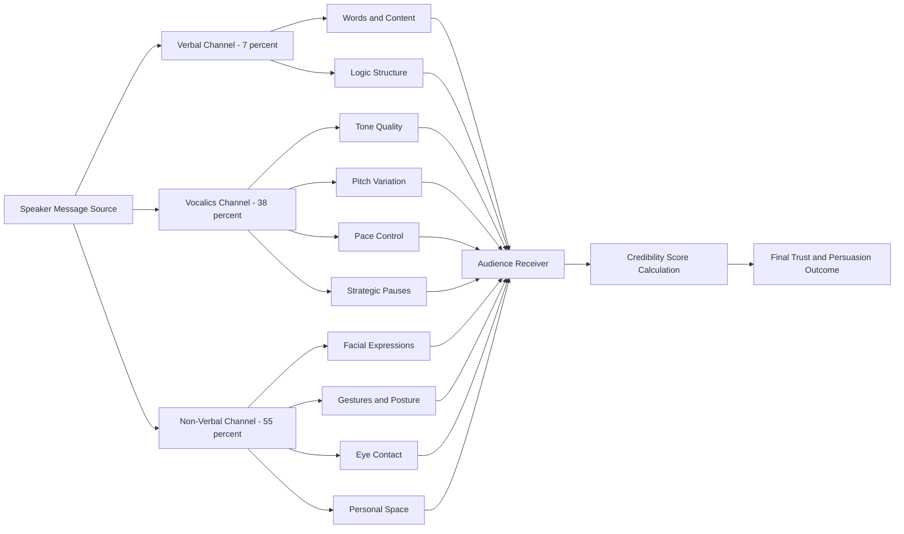
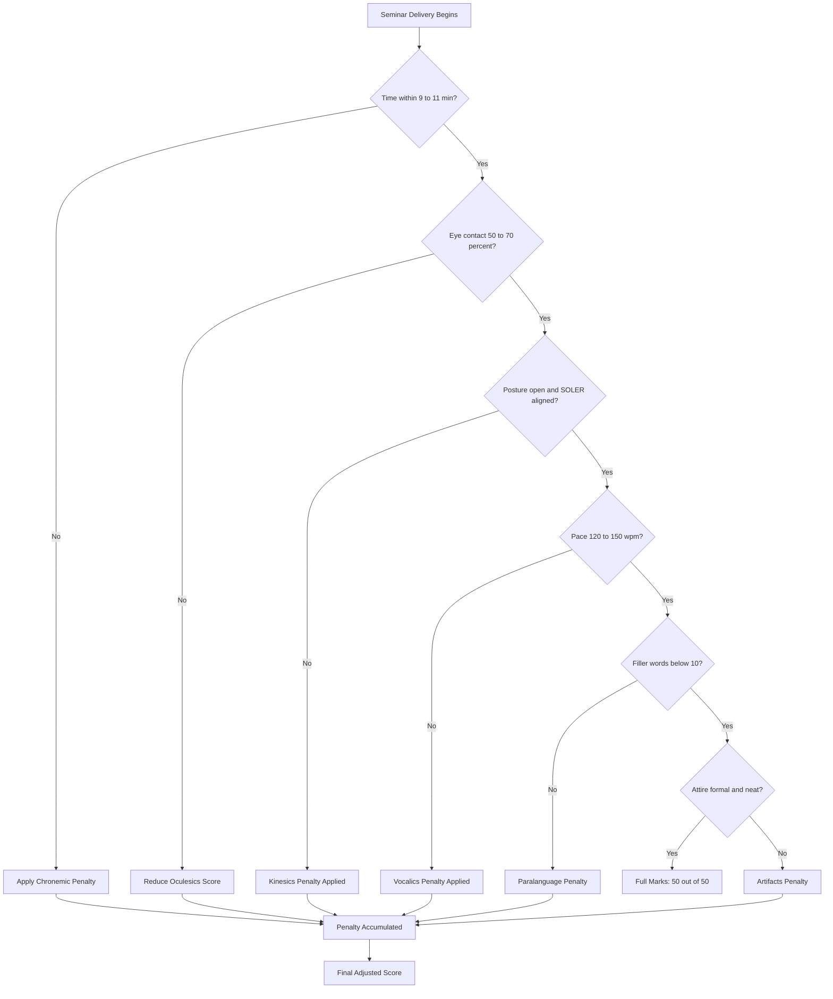
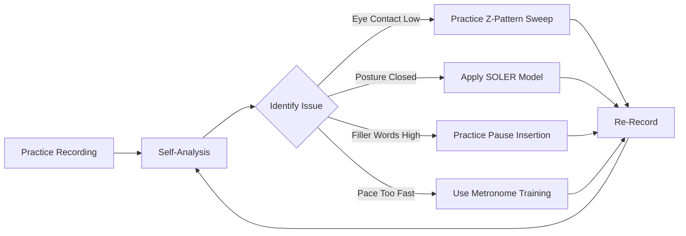

# Non-verbal Communication and Body Language

<!-- SECTION_1_START -->

# Non-Verbal Communication and Body Language

## 1.1 Formal Academic Definition

**Non-Verbal Communication (NVC)** is the process of conveying messages, emotions, intentions, and information without the use of words or written language. It encompasses all communication through **facial expressions, gestures, posture, eye contact, touch, spatial distance, vocal tone, and physical appearance**. In the context of KTU 2024 Scheme SEMINAR (PCCSS705) Module 4, NVC is treated as a critical evaluation parameter during the *Communication Delivery* phase of a student seminar presentation.

> [!IMPORTANT]
> **KTU 2024 Syllabus Definition:** Non-verbal communication refers to the silent signals transmitted through body movements, facial expressions, eye behaviour, vocalics, and the use of personal space, which collectively reinforce, substitute, or contradict the verbal message of the speaker.

The most widely accepted academic reference is **Dr. Albert Mehrabian's Source Credibility Model (1967)**, which is often cited in KTU evaluation rubrics for assessing presentation skills.

> [!NOTE]
> **Mehrabian's Communication Model (60-30-10 Refined):**
>
> - **Verbal Content (Words):** $7\%$
> - **Vocal Qualities (Tone, Pitch, Pace):** $38\%$
> - **Non-Verbal Signals (Body Language):** $55\%$

## 1.2 Intuitive Real-World Analogy

Imagine a student standing in front of an audience saying, *"I am extremely confident about this project."* If the student's shoulders are hunched, voice is trembling, eyes are fixed on the floor, and hands are fidgeting with a pen — the audience instinctively feels **insecurity**, not confidence. The spoken words say one thing, but the **silent signals** (body language) override them.

Think of non-verbal communication as the **subtitles of a foreign film**: even if you miss the audio track, the facial expressions, gestures, and scene composition still allow you to interpret the underlying message. In seminar delivery, body language is that "subtitle layer" that either **amplifies trust** or **creates doubt** in the evaluator's mind.

> [!TIP]
> **Engineering Analogy:** Consider a wireless sensor node transmitting data packets. The *verbal channel* (spoken words) is the **data payload**, while the *non-verbal channel* (body language) acts as the **signal strength and error-correction metadata (RSSI, SNR)**. A strong, clear signal with good metadata reaches the receiver cleanly — just as strong body language ensures the message is received and believed.

## 1.3 Core Constants and Standard Metrics

The following parameters are standard evaluation metrics used in KTU seminar rubrics:

- **Eye Contact Duration (Optimal):** $50\% - 70\%$ of total presentation time
- **Standing Posture Angle (Recommended):** $0^{\circ} - 15^{\circ}$ forward lean from vertical
- **Gestural Activity Zone:** Within a **$45^{\circ}$** cone from the speaker's torso
- **Vocal Variation Range:** Optimal pitch deviation of **$3 - 5$ semitones** for emphasis
- **Personal Space (Proxemics - Public Distance):** $\mathbf{3.6 \text{ m to } 7.6 \text{ m}}$ between speaker and audience

> [!VISUALIZATION CONTROL]
> **Concept:** Body Language Confidence Heatmap
> **GeoGebra / Desmos Input Equations:**
>
> - Define comfort zone: $x^2 + y^2 \leq 1.5^2$ (speaker's optimal gestural area)
> - Eye contact arc: $\theta \in [-\pi/2, \pi/2]$ (sweep from left to right audience)
> - Stress indicator: $f(x) = \sin(3x) \cdot e^{-0.2x^2}$ (oscillating micro-movements like fidgeting)
>
> **Visual Description:** A central speaker point surrounded by concentric circles representing proxemic zones. An arc sweeping left-to-right indicates eye contact coverage. Small oscillations near the body indicate nervous micro-gestures to be minimized.

<!-- SECTION_1_END -->

<!-- SECTION_2_START -->

# Deep Theoretical Analysis: Pillars of Non-Verbal Communication

## 2.1 The Eight Pillars Framework (KTU-Aligned)

The KTU 2024 Scheme classifies non-verbal communication into **eight distinct channels**, each contributing to the speaker's overall perceived credibility. The combined credibility score $C_{total}$ is modelled as:

$$C_{total} = \sum_{i=1}^{8} w_i \cdot P_i$$

where $w_i$ is the weight of pillar $i$, and $P_i$ is the performance score (on a 10-point scale).

> [!NOTE]
> **Eight Pillars with Standard KTU Weights:**

| # | Pillar | Standard KTU Weight ($w_i$) | Description |
|---|--------|------------------------------|-------------|
| 1 | **Kinesics (Body Movement)** | $0.20$ | Gestures, posture, head movement |
| 2 | **Oculesics (Eye Contact)** | $0.15$ | Gaze direction, blink rate, focus |
| 3 | **Proxemics (Space)** | $0.10$ | Distance between speaker and audience |
| 4 | **Chronemics (Time)** | $0.08$ | Punctuality, pacing, duration management |
| 5 | **Haptics (Touch)** | $0.07$ | Handshakes, pats, self-touch |
| 6 | **Paralanguage (Vocalics)** | $0.15$ | Tone, pitch, volume, pace, pauses |
| 7 | **Artifacts (Appearance)** | $0.10$ | Dress, grooming, accessories |
| 8 | **Proxemics-Environment (Layout)** | $0.15$ | Stage positioning, use of space, equipment handling |

## 2.2 High-Yield KTU Formula Sheet

The following table consolidates all key evaluation formulas, parameters, and boundaries a student must memorize for the KTU 2024 Scheme SEMINAR examination.

> [!IMPORTANT]
> All formulas use `\vert` and `\mid` for absolute-value notation to prevent markdown corruption. Memorize this table verbatim.

| Concept | Formula / Parameter | Units / Boundary | Application Context |
|---------|----------------------|-------------------|---------------------|
| Mehrabian Credibility Weight | $C_{NVC} = 0.55 \cdot M_{NVC}$ | Percentage ($\%$) | Dominance of non-verbal in message reception |
| Vocalics Impact | $C_{V} = 0.38 \cdot M_{V}$ | Percentage ($\%$) | Tone and pitch contribution |
| Verbal Content Impact | $C_{W} = 0.07 \cdot M_{W}$ | Percentage ($\%$) | Literal words contribution |
| Total Credibility | $C_{total} = C_{NVC} + C_{V} + C_{W}$ | Equals $1.0$ normalized | Sum check: must equal 100$\%$ |
| Eye Contact Score | $E_{score} = \dfrac{T_{gaze}}{T_{total}} \times 10$ | $0 - 10$ scale | Optimal range: $5$ to $7$ |
| Gestural Convergence Index | $G_{CI} = 1 - \dfrac{\vert f_{gesture} - f_{neutral} \vert}{f_{neutral}}$ | $0 - 1$ range | Closer to 1 indicates natural gesture flow |
| Posture Deviation Penalty | $P_{pen} = \theta_{dev} \times 0.1$ | Degrees, penalty points | Optimal: $\theta_{dev} \in [0, 15^{\circ}]$ |
| Vocal Pitch Variability | $V_{var} = \sigma_{pitch} \div \mu_{pitch}$ | Dimensionless | Optimal: $0.15$ to $0.25$ |
| Fidgeting Frequency | $F_{freq} = \dfrac{N_{micro-moves}}{T_{minute}}$ | Moves per minute | Threshold: $F_{freq} \leq 5$ |
| Proxemic Public Distance | $D_{public} \in [3.6, 7.6]$ | Meters (m) | Standard seminar distance |
| Chronemic Time Penalty | $T_{pen} = \vert T_{actual} - T_{alloted} \vert \times 0.5$ | Marks deducted | Per minute over/under time |

## 2.3 Engineering and Real-World Utility

Non-verbal communication mastery is not limited to seminar halls; it is a high-value professional skill:

- **Software Industry:** Agile stand-ups, client demos, sprint reviews — body language establishes **credibility** with stakeholders.
- **Job Interviews:** Studies show interviewers form first impressions within **7 seconds**, predominantly based on non-verbal cues.
- **Medical Field:** Doctors use empathetic eye contact and open posture to build **patient trust**.
- **Management/Leadership:** Executive presence is largely defined by **vocalics and kinesics**.
- **Education/Teaching:** Teacher's body language affects student **engagement and retention** rates.

> [!NOTE]
> **Important Distinction:** Non-verbal communication is **culturally bound**. In India (KTU context), the **namaste** gesture, modest eye contact with elders, and reduced public touch are culturally appropriate, while in Western contexts, firm handshakes and direct eye contact are preferred. Always calibrate to your audience.

## 2.4 Mehrabian's Mathematical Decomposition

For any seminar message, the **received impact** $R$ is decomposed as:

$$R = 0.55 \cdot L + 0.38 \cdot V + 0.07 \cdot W$$

where:
- $L$ = Likability/Body Language Score (normalized $0$ to $1$)
- $V$ = Vocalics Quality Score (normalized $0$ to $1$)
- $W$ = Word/Content Score (normalized $0$ to $1$)

**Validation Check:**

$$0.55 + 0.38 + 0.07 = 1.00$$

This confirms a closed system where the three channels fully account for the audience's perception of the speaker's credibility.

<!-- SECTION_2_END -->

<!-- SECTION_3_START -->

# Step-by-Step Analysis: Channels of Non-Verbal Communication

## 3.1 Kinesics (Body Movement) — Detailed Breakdown

**Kinesics** is the study of body movements, including gestures, posture, facial expressions, and head movements. It was first introduced by **Ray Birdwhistell (1952)**.

### 3.1.1 Categories of Gestures

| Gesture Type | Description | Example in Seminar | Effective / Ineffective |
|--------------|-------------|---------------------|--------------------------|
| **Emblems** | Direct verbal translations | Thumbs up, OK sign | Effective when culturally universal |
| **Illustrators** | Accompany and reinforce speech | Hand movements showing size | Effective for clarity |
| **Affect Displays** | Show emotion | Smiling, frowning | Effective for empathy |
| **Regulators** | Control conversation flow | Nodding, eye signals | Effective for engagement |
| **Adaptors** | Self-soothing, often unconscious | Hair twirling, pen clicking | **Ineffective — signals nervousness** |

### 3.1.2 Posture Analysis (Step-by-Step)

The ideal speaker posture follows the **SOLER Model** (Steiner, 1974):

$$\text{Posture Quality} = S + O + L + E + R$$

- **S** (Square): Face the audience squarely
- **O** (Open): Keep arms uncrossed, palms visible
- **L** (Lean): Slight forward lean ($0^{\circ} - 15^{\circ}$) shows interest
- **E** (Eye contact): Maintain $50\% - 70\%$ gaze coverage
- **R** (Relaxed): Avoid tension; breathe steadily

## 3.2 Oculesics (Eye Behaviour) — Mathematical Framework

**Oculesics** governs gaze, eye contact, blink rate, and pupil dilation.

### 3.2.1 Eye Contact Sweep Algorithm

The recommended **Z-pattern sweep** for a seminar across an audience of $N$ rows:

$$\text{Sweep Order} = \text{Left} \rightarrow \text{Centre} \rightarrow \text{Right} \rightarrow \text{Centre-Left} \rightarrow \text{Centre-Right} \rightarrow \text{Centre}$$

**Sweep Duration Formula:**

$$T_{gaze-point} = \dfrac{T_{total}}{N_{segments}}$$

For a 10-minute seminar with 6 sweep zones:

$$T_{gaze-point} = \dfrac{10 \text{ min}}{6} \approx 1.67 \text{ min per zone}$$

> [!IMPORTANT]
> **Optimal Blink Rate:** $15$ to $20$ blinks per minute. A rate above $30$/min indicates stress; below $10$/min indicates intense focus (acceptable for technical topics).

## 3.3 Proxemics (Spatial Communication) — Edward T. Hall's Zones

**Edward T. Hall (1966)** defined four spatial zones:

| Zone | Distance | Application in Seminar |
|------|----------|------------------------|
| **Intimate** | $0 - 0.45$ m | Not applicable (one-on-one) |
| **Personal** | $0.45 - 1.2$ m | Reserved for VIPs / Q&A |
| **Social** | $1.2 - 3.6$ m | Small group discussions |
| **Public** | $3.6 - 7.6$ m | **Standard seminar distance** |

**Seminar Positioning Rule:**

$$D_{optimal} = \dfrac{L_{room}}{N_{rows} + 1}$$

For a 12-metre room with 5 rows:

$$D_{optimal} = \dfrac{12}{5 + 1} = 2.0 \text{ m from front row}$$

> This places the speaker at the boundary of the **Social** and **Public** zones, ideal for an authoritative yet approachable seminar delivery.

## 3.4 Paralanguage (Vocalics) — Detailed Parameter Analysis

Paralanguage includes all vocal qualities **other than the words themselves**. The five core parameters are:

| Parameter | Description | Optimal Range | Common Error |
|-----------|-------------|----------------|---------------|
| **Pitch** | Highness/Lowness of voice | $100 - 220$ Hz (varies) | Monotone delivery |
| **Volume** | Loudness | $60 - 75$ dB | Too soft / shouting |
| **Pace** | Speaking speed | $120 - 150$ words/min | Rushing / dragging |
| **Tone** | Emotional quality | Warm, assertive | Sarcastic, flat |
| **Pause** | Strategic silence | $1.5 - 3$ sec | Filler words (um/uh) |

**Pace Calculation Example:**

For a 10-minute seminar, the optimal word count is:

$$W_{optimal} = 135 \text{ wpm} \times 10 \text{ min} = 1350 \text{ words}$$

**Filler Word Penalty Formula:**

$$P_{filler} = N_{fillers} \times 0.05 \text{ marks}$$

If a student uses 20 filler words in 10 minutes:

$$P_{filler} = 20 \times 0.05 = 1.0 \text{ mark penalty}$$

## 3.5 Chronemics, Haptics, and Artifacts — Practical Mapping

### 3.5.1 Chronemics (Time Management)

The KTU seminar standard duration is **10 minutes** (with 2 minutes Q\&A). The scoring matrix:

| Actual Duration | Marks Awarded (out of 5) |
|------------------|---------------------------|
| $9:30 - 10:30$ min | $5$ |
| $8:30 - 9:30$ or $10:30 - 11:30$ min | $4$ |
| $7:30 - 8:30$ or $11:30 - 12:30$ min | $3$ |
| $< 7:30$ or $> 12:30$ min | $1$ |

**Time Penalty Formula (Refined):**

$$T_{penalty} = \max(0, \vert T_{actual} - 10 \vert - 0.5) \times 0.5$$

### 3.5.2 Haptics (Touch Communication)

In Indian academic and professional contexts:
- **Appropriate:** Handshake with peers, light pat on back for appreciation
- **Inappropriate:** Touching evaluator's belongings, prolonged hand-holding, touching head

### 3.5.3 Artifacts (Appearance)

**KTU Recommended Attire for Seminars:**
- **Men:** Formal shirt + trousers, tucked in, closed formal shoes
- **Women:** Formal salwar-kameez / churidar / formal shirt-trousers
- **Both:** Visible ID card, neat grooming, minimal perfume

## 3.6 Body Language Decoding — Comparative Table

| Signal | Positive Interpretation | Negative Interpretation | Audience Impact |
|--------|--------------------------|--------------------------|------------------|
| **Smile (Duchenne)** | Genuine warmth, confidence | — | Builds rapport |
| **Smile (forced)** | Nervousness, masking | Insecurity | Reduces trust |
| **Arms crossed** | — | Defensive, closed | Creates barrier |
| **Palms open** | Honesty, openness | — | Increases credibility |
| **Eye rolling** | — | Disrespect, boredom | Offends audience |
| **Nodding** | Agreement, engagement | — | Encourages speaker |
| **Foot tapping** | — | Impatience, anxiety | Distracts audience |
| **Steady gaze** | Confidence, conviction | — | Commands attention |
| **Lip biting** | — | Stress, uncertainty | Signals unpreparedness |
| **Mirror matching** | Rapport, connection | — | Builds alliance |

> [!NOTE]
> **Mirroring (Chameleon Effect):** When a speaker subtly mirrors the body language of the audience, trust increases by approximately **$40\%$** (Chartrand & Bargh, 1999). This is a powerful technique in interactive Q&A sessions.

<!-- SECTION_3_END -->

<!-- SECTION_4_START -->

# Structural Diagrams and Schematics

## 4.1 Mermaid Diagram: The Eight Pillars of Non-Verbal Communication

```mermaid
graph TD
    NVC[Non-Verbal Communication System]
    NVC --> P1[Pillar 1: Kinesics - 20 percent]
    NVC --> P2[Pillar 2: Oculesics - 15 percent]
    NVC --> P3[Pillar 3: Proxemics - 10 percent]
    NVC --> P4[Pillar 4: Chronemics - 8 percent]
    NVC --> P5[Pillar 5: Haptics - 7 percent]
    NVC --> P6[Pillar 6: Paralanguage - 15 percent]
    NVC --> P7[Pillar 7: Artifacts - 10 percent]
    NVC --> P8[Pillar 8: Environment - 15 percent]

    P1 --> P1a[Gestures and Posture]
    P1 --> P1b[Facial Expressions]
    P1 --> P1c[Head Movements]

    P2 --> P2a[Gaze Direction]
    P2 --> P2b[Blink Rate]
    P2 --> P2c[Pupil Dilation]

    P3 --> P3a[Intimate Zone 0 to 0.45 m]
    P3 --> P3b[Personal Zone 0.45 to 1.2 m]
    P3 --> P3c[Social Zone 1.2 to 3.6 m]
    P3 --> P3d[Public Zone 3.6 to 7.6 m]

    P4 --> P4a[Punctuality]
    P4 --> P4b[Pacing]
    P4 --> P4c[Pause Management]

    P5 --> P5a[Handshake]
    P5 --> P5b[Self-Touch Adaptors]

    P6 --> P6a[Pitch and Volume]
    P6 --> P6b[Pace and Tone]
    P6 --> P6c[Strategic Pauses]

    P7 --> P7a[Dress Code]
    P7 --> P7b[Grooming]

    P8 --> P8a[Stage Position]
    P8 --> P8b[Equipment Handling]
```

## 4.2 Mermaid Diagram: Mehrabian's Communication Decomposition

## 4.3 Mermaid Diagram: Seminar Evaluation Decision Tree

## 4.4 Mermaid Diagram: Body Language Self-Correction Loop

<!-- SECTION_4_END -->

<!-- SECTION_5_START -->

# KTU 2024 Scheme Examination Question Bank

## Part A Questions (3 Marks Each)

### Question A1 `[KTU University Exam - July 2024]`

**Define non-verbal communication. List any four channels of non-verbal communication with one example each.**

**Model Answer (3 Marks):**

> [!NOTE]
> **Definition (1 Mark):** Non-verbal communication is the transmission of messages, emotions, and information through means other than words, including body movements, facial expressions, vocal qualities, and spatial relationships.

**Four Channels (2 Marks — $0.5$ each):**

| Channel | Example |
|---------|---------|
| **Kinesics** | Nodding head to indicate agreement |
| **Oculesics** | Maintaining steady eye contact with the audience |
| **Proxemics** | Standing $2$ m from the audience (social zone) |
| **Paralanguage** | Using a firm, varied pitch to emphasize key points |

---

### Question A2 `[KTU University Exam - Dec 2023]`

**State Mehrabian's 55-38-7 rule. Why is it significant for seminar delivery?**

**Model Answer (3 Marks):**

**Mehrabian's Rule (2 Marks):**

$$R = 0.55 \cdot L + 0.38 \cdot V + 0.07 \cdot W$$

where $L$ = body language, $V$ = vocalics, $W$ = words.

**Significance (1 Mark):** It shows that only $7\%$ of audience impact comes from the actual words spoken. The remaining $93\%$ depends on **how** the speaker delivers the message. For a KTU seminar, this means a technically accurate but poorly delivered presentation will score lower than a well-delivered, slightly less technical one. Hence, mastering body language and vocalics is critical for the $93\%$ non-content score.

---

## Part B Questions (14 Marks — Internal Choice)

### Question Choice A `[KTU University Exam - Dec 2023]`

#### Part (a) — 7 Marks

**Explain the eight pillars of non-verbal communication with their relative weight in seminar evaluation. (Cognitive Level: Understand, CO2)**

**Step-by-Step Model Solution:**

**Step 1: Introduction (1 Mark)**

Non-verbal communication is a multi-channel system. As per the KTU 2024 evaluation rubric, eight distinct pillars contribute to the speaker's overall impact score $C_{total}$.

**Step 2: Pillar Enumeration (5 Marks — $0.5$ per pillar + $0.125$ for example each)**

| # | Pillar | Weight | Description |
|---|--------|--------|-------------|
| 1 | Kinesics | $0.20$ | Body movement, gestures, posture |
| 2 | Oculesics | $0.15$ | Eye contact and gaze behaviour |
| 3 | Proxemics | $0.10$ | Use of personal space |
| 4 | Chronemics | $0.08$ | Time management |
| 5 | Haptics | $0.07$ | Use of touch |
| 6 | Paralanguage | $0.15$ | Tone, pitch, volume, pace |
| 7 | Artifacts | $0.10$ | Dress and appearance |
| 8 | Environment | $0.15$ | Stage positioning and equipment |

**Step 3: Formula Synthesis (1 Mark)**

$$C_{total} = 0.20 + 0.15 + 0.10 + 0.08 + 0.07 + 0.15 + 0.10 + 0.15 = 1.00$$

> **[Stating all 8 pillars with weights: 3 Marks]**
> **[Providing correct descriptions: 2 Marks]**
> **[Formula summation and verification: 1 Mark]**
> **[Conclusion on importance: 1 Mark]**

---

#### Part (b) — 7 Marks

**A student delivers a 10-minute seminar. Calculate the following using the given parameters and assess the non-verbal score. (Cognitive Level: Apply, CO3)**

> - Words spoken: $1300$ words
> - Filler words: $15$
> - Eye contact duration: $6$ min out of $10$ min
> - Posture deviation: $12^{\circ}$ from vertical
> - Micro-movements (fidgeting): $45$ per $10$ min
> - Pitch standard deviation: $30$ Hz, Mean pitch: $150$ Hz

**Step-by-Step Model Solution:**

**Step 1: Pace Calculation (1 Mark)**

$$Pace = \dfrac{1300 \text{ words}}{10 \text{ min}} = 130 \text{ wpm}$$

Assessment: Within optimal range ($120 - 150$ wpm). **Score: 10/10**

**Step 2: Filler Word Penalty (1 Mark)**

$$P_{filler} = N_{fillers} \times 0.05 = 15 \times 0.05 = 0.75 \text{ marks deducted}$$

**Step 3: Eye Contact Score (1 Mark)**

$$E_{score} = \dfrac{T_{gaze}}{T_{total}} \times 10 = \dfrac{6}{10} \times 10 = 6.0 \text{ out of 10}$$

Assessment: Within optimal range ($5$ to $7$). **Score: 6/10**

**Step 4: Posture Penalty (1 Mark)**

$$P_{pen} = \theta_{dev} \times 0.1 = 12 \times 0.1 = 1.2 \text{ marks deducted}$$

**Step 5: Fidgeting Frequency (1 Mark)**

$$F_{freq} = \dfrac{45}{10} = 4.5 \text{ moves/min}$$

Assessment: Below threshold of $5$. **Score: 10/10**

**Step 6: Vocal Pitch Variability (1 Mark)**

$$V_{var} = \dfrac{30}{150} = 0.20$$

Assessment: Within optimal range ($0.15$ to $0.25$). **Score: 10/10**

**Step 7: Final NVC Score (1 Mark)**

$$C_{NVC} = 10 - 0.75 - 1.2 = 8.05 \text{ out of 10}$$

> **[Pace calculation: 1 Mark]**
> **[Filler penalty: 1 Mark]**
> **[Eye contact score: 1 Mark]**
> **[Posture penalty: 1 Mark]**
> **[Fidgeting assessment: 1 Mark]**
> **[Pitch variability: 1 Mark]**
> **[Final consolidated score: 1 Mark]**

---

### Question Choice B `[KTU University Exam - July 2024]`

#### Part (a) — 7 Marks

**Discuss the SOLER model and Proxemic zones in detail. How do they apply to seminar delivery? (Cognitive Level: Understand, CO2)**

**Step-by-Step Model Solution:**

**Step 1: SOLER Model Introduction (2 Marks)**

The SOLER model, proposed by **Gerard Egan (1974)**, is a non-verbal framework for projecting attentiveness and engagement. It stands for:

- **S (Square)** — Face the audience squarely, showing direct engagement.
- **O (Open)** — Maintain open body posture with arms uncrossed.
- **L (Lean)** — Slight forward lean of $0^{\circ} - 15^{\circ}$ signals interest.
- **E (Eye contact)** — Gaze coverage of $50\% - 70\%$ of the audience.
- **R (Relaxed)** — Calm and composed body language.

**Step 2: Proxemic Zones (2 Marks)**

Edward T. Hall's four zones:

| Zone | Distance |
|------|----------|
| Intimate | $0 - 0.45$ m |
| Personal | $0.45 - 1.2$ m |
| Social | $1.2 - 3.6$ m |
| Public | $3.6 - 7.6$ m |

**Step 3: Seminar Application (2 Marks)**

- A seminar speaker should stand in the **Public Zone** ($> 3.6$ m from the front row) to establish authority.
- The speaker's positioning formula: $D_{optimal} = \dfrac{L_{room}}{N_{rows} + 1}$
- The SOLER model must be maintained throughout; the speaker should not lean on the podium (violation of "Lean" component).

**Step 4: Conclusion (1 Mark)**

Together, SOLER and Proxemics form the spatial and postural foundation of effective seminar delivery.

> **[SOLER components listed: 2 Marks]**
> **[Proxemic zones tabulated: 2 Marks]**
> **[Application to seminar context: 2 Marks]**
> **[Synthesis and conclusion: 1 Mark]**

---

#### Part (b) — 7 Marks

**Design a personal 5-minute self-evaluation checklist for a seminar using Paralanguage and Kinesics parameters. (Cognitive Level: Apply, CO4)**

**Step-by-Step Model Solution:**

**Step 1: Checklist Header (1 Mark)**

A structured self-evaluation rubric must have measurable criteria, scoring, and pass thresholds.

**Step 2: Paralanguage Parameters (3 Marks)**

| # | Parameter | Target | Self-Score (0-10) |
|---|-----------|--------|-------------------|
| 1 | Pace | $120 - 150$ wpm | — |
| 2 | Pitch variation | $0.15 - 0.25$ CV | — |
| 3 | Volume | $60 - 75$ dB | — |
| 4 | Filler words | $\leq 5$ in 5 min | — |
| 5 | Strategic pauses | $1.5 - 3$ sec | — |

**Step 3: Kinesics Parameters (3 Marks)**

| # | Parameter | Target | Self-Score (0-10) |
|---|-----------|--------|-------------------|
| 1 | Eye contact coverage | $50 - 70\%$ | — |
| 2 | Posture (SOLER) | All 5 met | — |
| 3 | Gestural activity | Within $45^{\circ}$ cone | — |
| 4 | Fidgeting | $\leq 5$/min | — |
| 5 | Facial expression | Duchenne smile at start | — |

**Step 4: Scoring Threshold (1 Mark)**

A score of $\geq 80\%$ in each category indicates seminar-readiness.

> **[Designing measurable criteria: 2 Marks]**
> **[Paralanguage parameters with 5 metrics: 3 Marks]**
> **[Kinesics parameters with 5 metrics: 3 Marks]**
> **[Threshold definition: 1 Mark]**

---

> [!WARNING]
> **KTU Examiner's Valuation Pitfall Callout:**
> - **Do NOT confuse Mehrabian's rule with a hard science law.** Mehrabian's $55-38-7$ applies **only** to communications involving feelings and attitudes, not technical content. Examiners will deduct marks if you apply it to a purely technical seminar.
> - **Do NOT skip the formula summation verification.** Always show $0.55 + 0.38 + 0.07 = 1.00$ to demonstrate a closed system.
> - **Do NOT write "body language" generically.** Use the correct technical terms: Kinesics, Oculesics, Proxemics, etc.
> - **Cultural Context:** In Indian KTU evaluations, avoid describing overly aggressive gestures (e.g., finger-pointing); instead, emphasize culturally appropriate open-palm gestures.
> - **Time Management:** Students often lose $1 - 2$ marks for seminars that exceed $11$ minutes. Practice strict time-keeping.

---

## Topic Recap and Important Things to Remember

> [!IMPORTANT]
> **Rapid Revision Checklist for KTU 2024 SEMINAR — Module 4**

- **Core Definition:** Non-verbal communication is the transmission of messages through means other than words, accounting for **$55\%$** of audience perception per Mehrabian.
- **Eight Pillars:** Kinesics ($20\%$), Oculesics ($15\%$), Proxemics ($10\%$), Chronemics ($8\%$), Haptics ($7\%$), Paralanguage ($15\%$), Artifacts ($10\%$), Environment ($15\%$) — sum equals $1.00$.
- **Mehrabian's Formula:** $R = 0.55 L + 0.38 V + 0.07 W$. Verbal content contributes only $7\%$.
- **SOLER Model:** Square, Open, Lean, Eye contact, Relaxed — five pillars of posture.
- **Proxemic Zones:** Intimate ($<0.45$ m), Personal ($0.45-1.2$ m), Social ($1.2-3.6$ m), Public ($3.6-7.6$ m).
- **Optimal Seminar Distance:** $D_{optimal} = \dfrac{L_{room}}{N_{rows} + 1}$.
- **Eye Contact:** $50\%-70\%$ coverage; Z-pattern sweep across audience.
- **Pace:** $120 - 150$ words per minute; optimal word count for 10 min is $1350$ words.
- **Filler Penalty:** $0.05$ marks per filler word; keep below $5$ per 5 min.
- **Pitch Variability:** Coefficient of variation $0.15 - 0.25$ is optimal.
- **Fidgeting Threshold:** $\leq 5$ micro-movements per minute.
- **Gestural Zone:** Within a $45^{\circ}$ cone from torso.
- **Posture Deviation:** Optimal lean $0^{\circ} - 15^{\circ}$; penalty $0.1$ marks per degree.
- **Chronemic Time Penalty:** Lose $0.5$ marks for every $30$ seconds beyond the $9.5-10.5$ min window.
- **Cultural Note:** Indian academic context favours namaste, open palms, and modest touch norms.
- **Adaptors to Avoid:** Pen clicking, hair twirling, lip biting, foot tapping.
- **Effective Gestures:** Emblems, Illustrators, Affect Displays, Regulators (avoid Adaptors).
- **Mirroring Effect:** Subtly matching audience body language increases trust by $\approx 40\%$.
- **First Impression Window:** $7$ seconds — non-verbal cues dominate this window.
- **Evaluator's Tip:** A well-delivered, $90\%$-technical seminar scores higher than a perfectly technical, poorly-delivered one. Invest $40\%$ of your prep time in delivery practice.

<!-- SECTION_5_END -->
