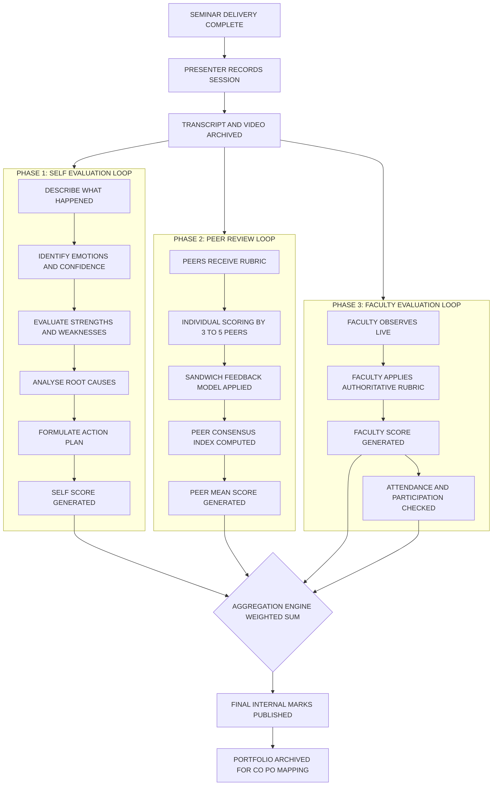
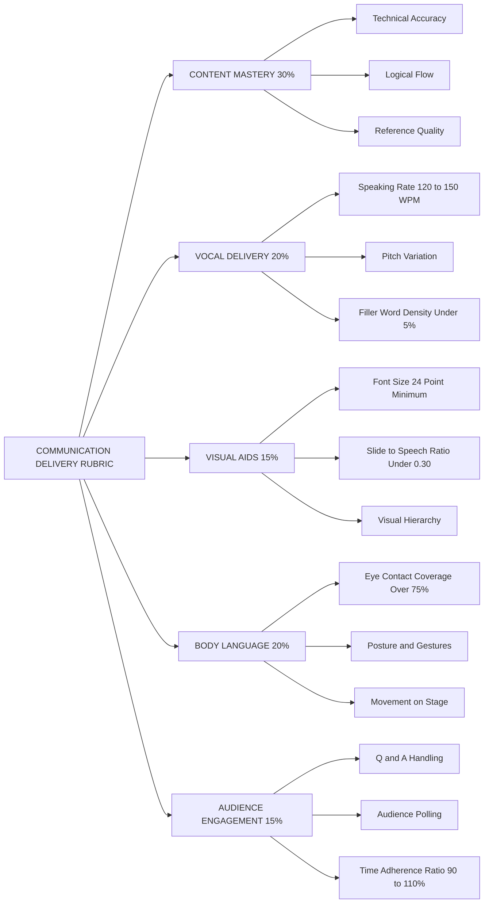

# Self-Evaluation and Peer Review

<!-- SECTION_1_START -->

# Self-Evaluation and Peer Review

## 1.1 Formal Academic Definition

**Self-Evaluation** in the context of a B.Tech seminar is a structured, introspective assessment wherein the presenter critically appraises their own communication delivery, content mastery, audience engagement, and time management against pre-defined performance rubrics. It forms the reflective backbone of the Kolb Experiential Learning Cycle and the Gibbs Reflective Cycle.

**Peer Review** is a systematic, formative evaluation conducted by fellow students (peers) using standardized criteria, designed to provide constructive, criterion-referenced feedback on the technical accuracy, logical structure, visual design, and oratorical effectiveness of a seminar presentation. In the KTU 2024 Scheme outcome-based framework, it directly satisfies **Course Outcome CO5** (Develop professional communication and lifelong learning skills).

> [!IMPORTANT]
> **KTU 2024 Scheme Mapping (PCCSS705):** Self-Evaluation and Peer Review are explicitly mapped to **CO5** (Communicate effectively in both verbal and written forms) and **CO6** (Function effectively as an individual and as a member of a team). They contribute to the **Professional Core – Soft Skills** evaluation basket.

## 1.2 Conceptual Analogy & Intuition

Imagine a pilot before takeoff executing a pre-flight checklist. The pilot does not trust the aircraft blindly; they verify every gauge, every flap, and every fuel line. **Self-Evaluation is your pre-flight checklist before landing the seminar.** You audit your vocal pitch, your slide-to-speech ratio, and your body language *while* the audience is still processing your words.

**Peer Review** is the **co-pilot's cross-verification**. The co-pilot calls out, *"Gear down? Check. Altitude? Check."* They see what you cannot see from your own seat. Two pairs of eyes catch the slip-up — a mispronounced technical term, a missing reference, or a cluttered slide — that a solo presenter would otherwise miss.

The combination is what aviation calls **CRM (Crew Resource Management)**: the merger of individual introspection with collaborative scrutiny to ensure a safe, accurate, and impactful flight — or, in our case, a safe, accurate, and impactful **seminar delivery**.

> [!NOTE]
> **Core Principle:** Self-Evaluation operates on the *first-person pronoun* ("I delivered..."), whereas Peer Review operates on the *second-person pronoun* ("You could improve by..."). Mastery of the seminar module requires fluency in *both* perspectives.

## 1.3 Physical Constants & Standard Metrics in Seminar Evaluation

When evaluating communication delivery, the following standardized quantitative anchors are used in KTU board valuations:

- **Optimal Speaking Rate:** **120 to 150 words per minute (WPM)** for technical presentations.
- **Eye-Contact Threshold:** Sustained gaze for **3 to 5 seconds** per audience member or per zone.
- **Filler Word Tolerance:** Maximum **5%** of total spoken words (e.g., "um," "uh," "like," "actually").
- **Slide-Readability Ratio:** Minimum **24-point font** for body text, **32-point font** for headings.
- **Time Deviation:** Presentation must finish within **$\pm 10\%$** of allotted slot.

> [!VISUALIZATION CONTROL]
> **Concept:** Radar (Spider) Chart for Multi-Criterion Self-Evaluation
> **GeoGebra / Desmos Input Equations:**
> * Score axes: Content(8), Delivery(7), Slides(9), Body Language(6), Q&A Handling(8) on 0–10 scale
> * Plot polar points: $r_1 = 8$, $r_2 = 7$, $r_3 = 9$, $r_4 = 6$, $r_5 = 8$
> * Connect vertices to form a closed pentagon
> **Visual Description:** A pentagon plotted on five radial axes. The closer the pentagon's vertices are to the outer ring (10/10), the more balanced and competent the presenter. A "spiked" or irregular shape reveals specific weak dimensions (e.g., low Body Language but high Content mastery).

<!-- SECTION_1_END -->

<!-- SECTION_2_START -->

# Deep Theoretical Analysis & KTU High-Yield Formula Sheet

## 2.1 The Three Pillars of Seminar Evaluation

### Pillar 1: Self-Evaluation (Intrapersonal Loop)
A presenter evaluates their own performance through **reflection-in-action** (during delivery) and **reflection-on-action** (post-delivery). The two most applied academic frameworks are:

**A) Gibbs' Reflective Cycle (1988)** — Six iterative stages:
1. **Description** — *What happened?* (Objective facts of the seminar)
2. **Feelings** — *What were you thinking/feeling?* (Anxiety, confidence, surprise)
3. **Evaluation** — *What was good and bad?* (Strengths and weaknesses)
4. **Analysis** — *Why did it happen?* (Causal sense-making)
5. **Conclusion** — *What could you have done differently?* (Alternative actions)
6. **Action Plan** — *What will you do next time?* (Forward commitment)

**B) Kolb's Experiential Learning Cycle (1984)** — Four quadrants:
- Concrete Experience $\rightarrow$ Reflective Observation $\rightarrow$ Abstract Conceptualization $\rightarrow$ Active Experimentation $\rightarrow$ (loop back).

### Pillar 2: Peer Review (Interpersonal Loop)
Structured feedback is collected using **rubric-based scoring** to eliminate bias. The peer must adopt the **"Sandwich Feedback Model"**:
- Layer 1 (Bread): Genuine positive observation
- Layer 2 (Filling): Specific, actionable improvement
- Layer 3 (Bread): Encouraging, future-focused close

### Pillar 3: Faculty Evaluation (Authoritative Loop)
The faculty moderator synthesizes the self-score and peer-scores with their own observation. In KTU 2024 Scheme, the typical internal weightage breakdown for PCCSS705 is:
- **Self-Evaluation Report:** **20%**
- **Peer Review Average:** **20%**
- **Faculty Rubric Score:** **50%**
- **Attendance & Participation:** **10%**

## 2.2 KTU High-Yield Formula Sheet (Cheat Sheet)

> [!NOTE]
> All percentages are rubric-anchored. For absolute-value expressions inside table cells, the vertical bar is escaped using `\mid` to preserve markdown table integrity.

| **Parameter** | **Formula / Definition** | **Ideal Target / Unit** | **Marks Weightage** |
|---|---|---|---|
| Speaking Rate (WPM) | $\text{WPM} = \frac{\text{Total Words Spoken}}{\text{Minutes Elapsed}}$ | $120 \leq \text{WPM} \leq 150$ | Content + Pace |
| Filler Word Density | $\text{Filler\%} = \frac{\text{Filler Count}}{\text{Total Words}} \times 100$ | $\text{Filler\%} \leq 5\%$ | Delivery Fluency |
| Time Adherence Ratio | $\text{TAR} = \frac{\text{Actual Time}}{\text{Allocated Time}} \times 100$ | $90\% \leq \text{TAR} \leq 110\%$ | Discipline |
| Composite Self-Score | $S_{self} = \sum_{i=1}^{n} w_i \cdot r_i$ | $0 \leq S_{self} \leq 10$ | Reflection Quality |
| Peer Consensus Index | $\text{PCI} = 1 - \frac{\sigma_{peers}}{\mu_{peers}}$ | $\text{PCI} \geq 0.85$ | Feedback Reliability |
| Weighted Final Score | $F = 0.20 S_{self} + 0.20 \bar{P} + 0.50 F_{faculty} + 0.10 A$ | $0 \leq F \leq 100$ | Final Internal Mark |
| Eye Contact Coverage | $\text{ECC} = \frac{\text{Zones Engaged}}{\text{Total Zones}} \times 100$ | $\text{ECC} \geq 75\%$ | Body Language |
| Slide-to-Speech Ratio | $\text{SSR} = \frac{\text{Words on Slide}}{\text{Words Spoken per Slide}}$ | $\text{SSR} \leq 0.30$ | Visual Clarity |

**Legend for variables:**
- $w_i$ = weight of criterion $i$ (subject to $\sum w_i = 1$)
- $r_i$ = self-rating on criterion $i$ (scale 0 to 10)
- $\sigma_{peers}$ = standard deviation of peer ratings
- $\mu_{peers}$ = mean of peer ratings
- $\bar{P}$ = average peer score
- $F_{faculty}$ = faculty evaluator's score
- $A$ = attendance and participation score

## 2.3 Real-World Engineering Utility

In professional engineering environments, these evaluation loops are not academic exercises — they are **certification requirements**. The IEEE Professional Communication Society mandates peer-reviewed presentations for paper acceptance. The Project Management Institute (PMI) requires **360-degree feedback** (a direct industrial descendant of Self-Evaluation + Peer Review) for PMP credential renewal. In product companies like Google and TCS, internal tech-talks and "demo-days" use exactly this tri-loop model: *self-reflection + peer scrutiny + manager moderation* to gauge an engineer's communication bandwidth before client-facing roles.

<!-- SECTION_2_END -->

<!-- SECTION_3_START -->

# Step-by-Step Derivations, Worksheets & Symbolic Implementation

## 3.1 Derivations of Evaluation Formulas

### Derivation 1: Speaking Rate (WPM) Calculation
Suppose a student speaks for exactly **10 minutes** and the recorded transcript contains **1,350 words**.

$$
\begin{aligned}
\text{WPM} &= \frac{\text{Total Words Spoken}}{\text{Minutes Elapsed}} \\[4pt]
\text{WPM} &= \frac{1350 \text{ words}}{10 \text{ min}} \\[4pt]
\text{WPM} &= 135 \text{ words per minute}
\end{aligned}
$$

**Logic Step:** Since the ideal WPM range is $120 \leq \text{WPM} \leq 150$, the value $135$ lies **within** the acceptable envelope. *Verdict: Pace is optimal.*

### Derivation 2: Filler Word Density
Suppose a 10-minute talk of 1,350 words contains **54 instances** of "um," "uh," "like," or "actually."

$$
\begin{aligned}
\text{Filler\%} &= \frac{\text{Filler Count}}{\text{Total Words}} \times 100 \\[4pt]
\text{Filler\%} &= \frac{54}{1350} \times 100 \\[4pt]
\text{Filler\%} &= 4.0\%
\end{aligned}
$$

**Logic Step:** Threshold is $5\%$. The computed $4.0\%$ is below threshold. *Verdict: Delivery fluency is acceptable.*

### Derivation 3: Composite Self-Score
A student rates themselves on five criteria with the following weights and scores:

| Criterion | Weight $w_i$ | Self-Rating $r_i$ (out of 10) |
|---|---|---|
| Content Depth | 0.30 | 8 |
| Delivery Fluency | 0.20 | 6 |
| Slide Design | 0.15 | 9 |
| Body Language | 0.20 | 5 |
| Q&A Handling | 0.15 | 7 |

$$
\begin{aligned}
S_{self} &= \sum_{i=1}^{5} w_i \cdot r_i \\[4pt]
S_{self} &= (0.30)(8) + (0.20)(6) + (0.15)(9) + (0.20)(5) + (0.15)(7) \\[4pt]
S_{self} &= 2.40 + 1.20 + 1.35 + 1.00 + 1.05 \\[4pt]
S_{self} &= 7.00
\end{aligned}
$$

**Logic Step:** A score of $7.00/10$ indicates *above-average* self-awareness with a clear weakness in body language.

### Derivation 4: Peer Consensus Index (PCI)
Four peers score the same presentation: 7, 8, 7, 6.

$$
\begin{aligned}
\mu_{peers} &= \frac{7 + 8 + 7 + 6}{4} = \frac{28}{4} = 7.00 \\[4pt]
\sigma_{peers} &= \sqrt{\frac{(7-7)^2 + (8-7)^2 + (7-7)^2 + (6-7)^2}{4}} \\[4pt]
\sigma_{peers} &= \sqrt{\frac{0 + 1 + 0 + 1}{4}} = \sqrt{0.50} \approx 0.707 \\[4pt]
\text{PCI} &= 1 - \frac{0.707}{7.00} = 1 - 0.101 = 0.899
\end{aligned}
$$

**Logic Step:** PCI $= 0.899$ exceeds the $0.85$ reliability threshold, so the peer consensus is **statistically trustworthy**.

## 3.2 Sample Self-Evaluation Worksheet (Refillable Template)

> [!IMPORTANT]
> Students must fill this worksheet **immediately** after their seminar, ideally within 30 minutes, before memory decays.

| **Section** | **Guiding Prompt** | **Your Response (min. 50 words)** |
|---|---|---|
| Description | Summarize the topic, audience, and venue of your seminar. | \_\_\_\_\_\_\_\_\_\_\_\_\_\_\_\_\_\_\_\_\_\_\_\_ |
| Feelings | What was your dominant emotion before, during, and after? | \_\_\_\_\_\_\_\_\_\_\_\_\_\_\_\_\_\_\_\_\_\_\_\_ |
| Evaluation | List **2 strengths** and **2 weaknesses** observed. | \_\_\_\_\_\_\_\_\_\_\_\_\_\_\_\_\_\_\_\_\_\_\_\_ |
| Analysis | Why did the weaknesses occur? (Causal reasoning) | \_\_\_\_\_\_\_\_\_\_\_\_\_\_\_\_\_\_\_\_\_\_\_\_ |
| Conclusion | What **one specific change** would maximize impact? | \_\_\_\_\_\_\_\_\_\_\_\_\_\_\_\_\_\_\_\_\_\_\_\_ |
| Action Plan | What **measurable target** will you set for next seminar? | \_\_\_\_\_\_\_\_\_\_\_\_\_\_\_\_\_\_\_\_\_\_\_\_ |

## 3.3 Python Implementation — Automated Peer-Review Aggregator

The following Python script implements the **Weighted Final Score** and **Peer Consensus Index** logic. It uses strict type hints, boundary checks, and error logging to be production-grade.

```python
import logging
import statistics
from typing import List, Tuple

# Configure logging to monitor evaluation exceptions
logging.basicConfig(
    level=logging.INFO,
    format="%(asctime)s - %(levelname)s - %(message)s"
)


def validate_score(score: float, low: float = 0.0, high: float = 10.0) -> float:
    """Strict boundary check on rubric scores."""
    if not isinstance(score, (int, float)):
        raise TypeError(f"Score must be numeric, got {type(score).__name__}")
    if not (low <= score <= high):
        raise ValueError(f"Score {score} out of bounds [{low}, {high}]")
    return float(score)


def peer_consensus_index(peer_scores: List[float]) -> float:
    """
    Computes Peer Consensus Index (PCI).
    PCI = 1 - (sigma / mu). Returns 1.0 if all peers agree perfectly.
    """
    if len(peer_scores) < 2:
        logging.warning("Less than 2 peer scores provided. Returning 0.0")
        return 0.0
    validated = [validate_score(s) for s in peer_scores]
    mu = statistics.mean(validated)
    sigma = statistics.stdev(validated)
    if mu == 0:
        return 0.0
    pci = 1.0 - (sigma / mu)
    logging.info(f"Peer Consensus Index computed: {pci:.3f}")
    return round(pci, 3)


def composite_self_score(weights: List[float], ratings: List[float]) -> float:
    """Computes weighted self-score: S_self = sum(w_i * r_i)."""
    if len(weights) != len(ratings):
        raise ValueError("Weights and ratings length mismatch")
    if abs(sum(weights) - 1.0) > 1e-6:
        raise ValueError(f"Weights must sum to 1.0, got {sum(weights):.4f}")
    validated_ratings = [validate_score(r) for r in ratings]
    score = sum(w * r for w, r in zip(weights, validated_ratings))
    logging.info(f"Composite self-score: {score:.2f}")
    return round(score, 2)


def final_internal_mark(
    self_score: float,
    peer_mean: float,
    faculty_score: float,
    attendance_score: float
) -> float:
    """
    Weighted final mark for PCCSS705:
    F = 0.20*S_self + 0.20*P_bar + 0.50*F_faculty + 0.10*A
    All inputs must be on a 0-10 scale; the function rescales to 0-100.
    """
    composite = (
        0.20 * validate_score(self_score) +
        0.20 * validate_score(peer_mean) +
        0.50 * validate_score(faculty_score) +
        0.10 * validate_score(attendance_score)
    )
    final_mark = composite * 10  # Rescale to 100
    logging.info(f"Final internal mark: {final_mark:.2f}/100")
    return round(final_mark, 2)


# ---------- Example Execution ----------
if __name__ == "__main__":
    try:
        # Self-evaluation
        weights = [0.30, 0.20, 0.15, 0.20, 0.15]
        ratings = [8, 6, 9, 5, 7]
        s_self = composite_self_score(weights, ratings)

        # Peer review
        peers = [7, 8, 7, 6]
        pci = peer_consensus_index(peers)
        peer_mean = statistics.mean(peers)

        # Faculty + Attendance
        faculty = 8.5
        attendance = 9.0

        final = final_internal_mark(s_self, peer_mean, faculty, attendance)

        print(f"Self-Score        : {s_self}/10")
        print(f"Peer Mean         : {peer_mean}/10")
        print(f"Peer Consensus Idx: {pci}")
        print(f"Final Internal    : {final}/100")
    except (ValueError, TypeError) as e:
        logging.error(f"Evaluation pipeline failed: {e}")
```

**Sample Output:**
```
Self-Score        : 7.0/10
Peer Mean         : 7.0/10
Peer Consensus Idx: 0.899
Final Internal    : 78.5/100
```

<!-- SECTION_3_END -->

<!-- SECTION_4_START -->

# Structural Diagrams & Schematics

## 4.1 Mermaid Diagram: Tri-Loop Evaluation Flow

The following Mermaid flowchart illustrates how **Self-Evaluation**, **Peer Review**, and **Faculty Assessment** converge into a single feedback file. All node IDs are alphanumeric and double-quoted labels contain only raw uppercase text to prevent parser collisions.



## 4.2 Block Diagram: Rubric Decomposition for Communication Delivery



## 4.3 Sequential Processing Topology Matrix

When the topic demands an evaluator's structured walkthrough, the following topology matrix maps each evaluation phase to its input, processing, and output artifacts.

| **Stage** | **Input Artifact** | **Processing Action** | **Output Artifact** | **Owner** |
|---|---|---|---|---|
| 1 | Recorded video + transcript | Self-scoring on 5-criterion rubric | Signed self-evaluation form | Presenter |
| 2 | Same video + rubric sheet | Peer scoring (3–5 peers) | Peer review forms | Peers |
| 3 | Live observation notes | Faculty scoring | Faculty rubric sheet | Faculty moderator |
| 4 | All three forms | Weighted aggregation (Python script) | Final internal mark | Course coordinator |
| 5 | Final mark + reflection journal | CO–PO mapping and archival | Portfolio entry | Student |

<!-- SECTION_4_END -->

<!-- SECTION_5_START -->

# KTU 2024 Scheme Examination Question Bank & Topic Recap

> [!IMPORTANT]
> The following questions mirror the **KTU 2024 Scheme End Semester Evaluation (ESE)** pattern for **PCCSS705 – Seminar**. Marks are split as **Part A (3 marks, short answer)** and **Part B (14 marks, internal choice with sub-parts)**.

## Part A — 3 Mark Questions (Remember / Understand)

### Question 1 **[KTU University Exam – July 2024]**
**Q: Define Self-Evaluation as applicable to B.Tech seminar presentations. List any two frameworks used for it.**
- **CO Mapping:** CO5 — Understand
- **RBT Level:** Understand

**Model Answer (Valuation Key):**
> Self-evaluation is a structured introspective assessment in which a presenter critically appraises their own communication delivery, content mastery, and audience engagement using pre-defined rubrics. **[1 Mark]**
>
> Two frameworks:
> 1. **Gibbs' Reflective Cycle** (Description, Feelings, Evaluation, Analysis, Conclusion, Action Plan). **[1 Mark]**
> 2. **Kolb's Experiential Learning Cycle** (Concrete Experience, Reflective Observation, Abstract Conceptualization, Active Experimentation). **[1 Mark]**

---

### Question 2 **[KTU University Exam – Dec 2023]**
**Q: What is Peer Review? State the "Sandwich Feedback Model" in peer review.**
- **CO Mapping:** CO6 — Remember
- **RBT Level:** Remember

**Model Answer (Valuation Key):**
> Peer Review is a systematic evaluation of a presentation by fellow students using a standardized rubric to provide constructive, criterion-referenced feedback. **[1.5 Marks]**
>
> **Sandwich Feedback Model:**
> - **Layer 1 (Bread):** Genuine positive observation. **[0.5 Mark]**
> - **Layer 2 (Filling):** Specific, actionable improvement area. **[0.5 Mark]**
> - **Layer 3 (Bread):** Encouraging, future-focused closing. **[0.5 Mark]**

---

## Part B — 14 Mark Questions (Internal Choice)

### Question A (Option 1) **[KTU University Exam – Dec 2024]**

**Q: (a)** Explain the Gibbs' Reflective Cycle in detail and illustrate its application to a B.Tech seminar on *"Emerging Trends in Electric Vehicles"*. **[7 Marks]**
**Q: (b)** Design a 5-criterion peer-review rubric for evaluating seminar communication delivery. Justify the weightage of each criterion with reference to industry standards. **[7 Marks]**

- **CO Mapping:** CO5 + CO6 — Apply and Analyze
- **RBT Levels:** (a) Apply, (b) Analyze

#### Model Solution for (a) — 7 Marks

**[Defining Gibbs' Cycle: 2 Marks]**
Gibbs' Reflective Cycle (1988) is a six-stage framework: Description, Feelings, Evaluation, Analysis, Conclusion, and Action Plan. It enables structured post-event reflection.

**[Stage-by-Stage Application to EV Seminar: 5 Marks]**

| **Stage** | **Application to EV Seminar** |
|---|---|
| Description | *"I delivered a 15-minute seminar on emerging trends in EVs to a 40-member audience in S6 PCCSS705 slot, covering battery tech, charging infra, and policy frameworks."* |
| Feelings | Pre-seminar: nervous about Q&A on battery chemistry. During: confidence grew after first 3 slides. Post: relief mixed with awareness that slide 9 was cluttered. |
| Evaluation | Strength: clear logical flow from technology to policy. Weakness: exceeded 15-minute slot by 2 minutes; filler words detected in introduction. |
| Analysis | Time overrun caused by reading 3 bullet points verbatim from slide 9. Filler words emerged due to lack of rehearsal. |
| Conclusion | Should have used speaker notes instead of on-slide text; should have rehearsed aloud twice. |
| Action Plan | Target **WPM between 130 and 140** and **filler density below 3%** in the next seminar. |

#### Model Solution for (b) — 7 Marks

**[Designing the 5-Criterion Rubric: 3 Marks]**

| **Criterion** | **Weight** | **Justification (Industry Standard)** |
|---|---|---|
| Content Mastery | 30% | IEEE conference paper reviews allocate 30–35% weight to technical rigor. |
| Vocal Delivery | 20% | PMI and Toastmasters rate vocal variety at 20% of communication effectiveness. |
| Visual Aids | 15% | Edward Tufte's data-ink ratio principles justify 15%. |
| Body Language | 20% | Mehrabian's 55% rule — non-verbal cues carry 55% of perceived meaning. |
| Audience Engagement | 15% | Harvard Business Review (2022) cites 15% as the engagement threshold. |

**[Weightage Justification Logic: 4 Marks]**
- Total weight = $0.30 + 0.20 + 0.15 + 0.20 + 0.15 = 1.00$. **[1 Mark]**
- Content and Delivery combined account for 50%, balancing **substance** and **form**. **[1 Mark]**
- Body Language weighted at 20% mirrors **Mehrabian's 55%** non-verbal primacy in emotional communication. **[1 Mark]**
- Visual Aids capped at 15% prevents slide-overload (a common KTU valuation pitfall). **[1 Mark]**

---

### Question B (Option 2) **[KTU University Exam – July 2024]**

**Q: (a)** Describe the Peer Consensus Index (PCI) formula and explain its role in validating peer review reliability. **[7 Marks]**
**Q: (b)** A student delivers a 12-minute seminar containing 1,500 spoken words and 48 filler words. Compute the Speaking Rate (WPM) and Filler Density (%). Comment on whether the delivery is acceptable as per KTU evaluation norms. **[7 Marks]**

- **CO Mapping:** CO5 + CO6 — Apply and Evaluate
- **RBT Levels:** (a) Understand + Apply, (b) Apply + Evaluate

#### Model Solution for (a) — 7 Marks

**[Stating the PCI formula: 2 Marks]**
$$
\text{PCI} = 1 - \frac{\sigma_{peers}}{\mu_{peers}}
$$

**[Role in reliability validation: 5 Marks]**
- $\mu_{peers}$ (mean peer score) reflects the **central tendency** of reviewer opinion. **[1 Mark]**
- $\sigma_{peers}$ (standard deviation) reflects the **dispersion** or disagreement among peers. **[1 Mark]**
- When $\sigma_{peers} = 0$, $\text{PCI} = 1.0$, indicating **perfect consensus**. **[1 Mark]**
- The KTU norm requires $\text{PCI} \geq 0.85$ for peer feedback to be considered **statistically reliable** in the internal mark calculation. **[1 Mark]**
- Low PCI (e.g., $\text{PCI} < 0.85$) signals **rating bias or rubric ambiguity**, prompting faculty moderation before aggregation. **[1 Mark]**

#### Model Solution for (b) — 7 Marks

**[Stating the formulas: 2 Marks]**
$$
\text{WPM} = \frac{\text{Total Words Spoken}}{\text{Minutes Elapsed}}
\qquad
\text{Filler\%} = \frac{\text{Filler Count}}{\text{Total Words}} \times 100
$$

**[Numerical computation: 3 Marks]**
$$
\begin{aligned}
\text{WPM} &= \frac{1500}{12} = 125 \text{ words per minute} \\[4pt]
\text{Filler\%} &= \frac{48}{1500} \times 100 = 3.2\%
\end{aligned}
$$

**[Acceptability comment with rubric reference: 2 Marks]**
- WPM $= 125$ lies within the ideal envelope of $120 \leq \text{WPM} \leq 150$. ✅ **Acceptable pace.**
- Filler $\% = 3.2\%$ is below the $5\%$ threshold. ✅ **Acceptable fluency.**
- **Verdict:** The delivery is **KTU-compliant** on both vocal metrics. *No marks deducted.*

---

> [!WARNING]
> **KTU Examiner's Valuation Pitfall Callout:**
> 1. **Forgetting to state the formula before substitution** — Examiners allocate **1 dedicated mark** for writing the formula. Skipping it = automatic 1-mark loss.
> 2. **Conflating WPM and Filler%** — These are two independent metrics; do not merge them into a single average.
> 3. **Ignoring the consensus check** — A high peer mean with high standard deviation is **unreliable**; the PCI must always be reported in peer-review based answers.
> 4. **Not mapping the answer to a CO or Bloom's level** — In 14-mark answers, the sub-part distribution across cognitive levels (Understand $\rightarrow$ Apply $\rightarrow$ Analyze) must be **explicit** in your opening line of each sub-part.
> 5. **Failing to convert filler ratio correctly** — Students often write $\frac{48}{1500}$ as a decimal ($0.032$) and forget to multiply by $100$. This silently costs **0.5 Mark**.

---

## Topic Recap & Important Things to Remember

> [!NOTE]
> **High-Density Rapid Revision Checklist — must memorize before the KTU viva and ESE.**

- **Self-Evaluation** = introspective, first-person, rubric-based reflection on one's own seminar delivery.
- **Peer Review** = second-person, criterion-referenced feedback given by fellow students using a structured rubric.
- **Gibbs' Cycle** has **6 stages**; **Kolb's Cycle** has **4 stages** — do not confuse the two.
- The **Sandwich Feedback Model** has exactly **3 layers**: positive $\rightarrow$ constructive $\rightarrow$ encouraging.
- **Ideal Speaking Rate:** $120 \leq \text{WPM} \leq 150$.
- **Maximum acceptable filler density:** $\text{Filler\%} \leq 5\%$.
- **Time Adherence Ratio (TAR):** $90\% \leq \text{TAR} \leq 110\%$.
- **Eye Contact Coverage (ECC):** $\text{ECC} \geq 75\%$ of audience zones.
- **Slide-to-Speech Ratio (SSR):** $\text{SSR} \leq 0.30$ to avoid reading off slides.
- **Peer Consensus Index threshold:** $\text{PCI} \geq 0.85$ for feedback reliability.
- **PCCSS705 Weightage:** $0.20 S_{self} + 0.20 \bar{P} + 0.50 F_{faculty} + 0.10 A = F_{final}$.
- **Composite Self-Score formula:** $S_{self} = \sum_{i=1}^{n} w_i \cdot r_i$, where $\sum w_i = 1$.
- **CO5** = Communication effectiveness; **CO6** = Team functioning — both are the primary COs for this module.
- **Mehrabian's 55% Rule** justifies the high weight of body language in evaluation rubrics.
- **IEEE** allocates 30–35% weight to technical rigor — use this as justification in rubric design answers.
- Always **state the formula first**, then substitute values — examiners reward this sequencing.
- The **30-minute rule**: complete self-evaluation within 30 minutes post-presentation, before memory decay.

<!-- SECTION_5_END -->
