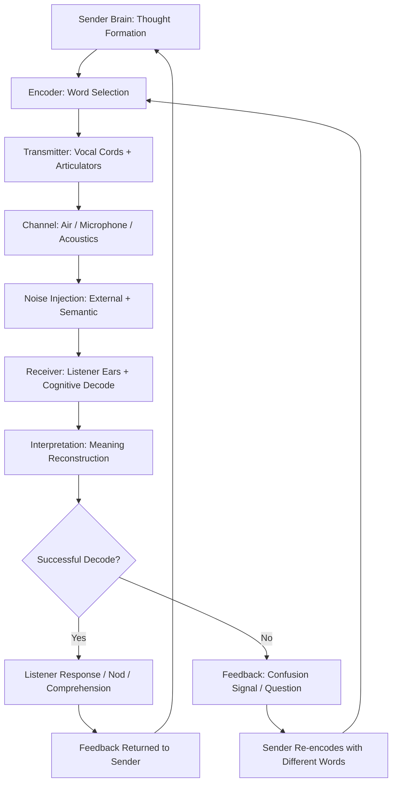
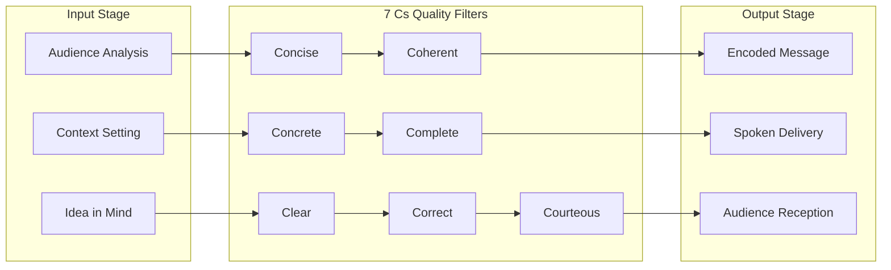
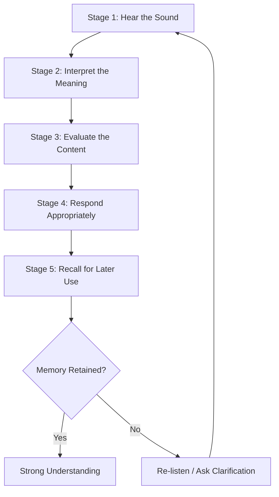
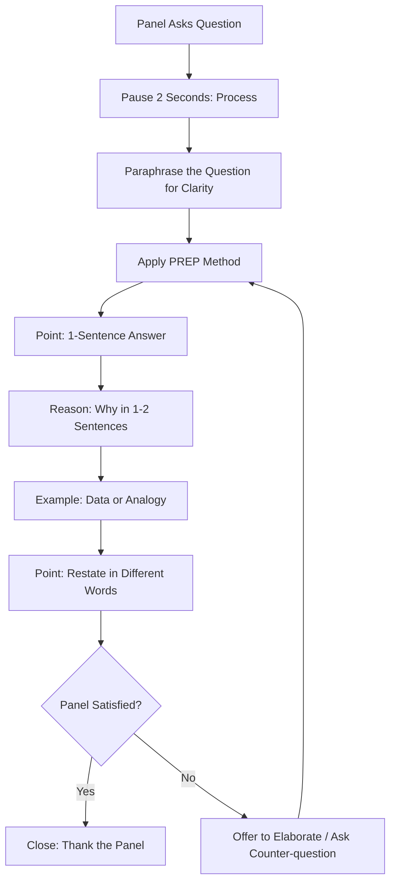
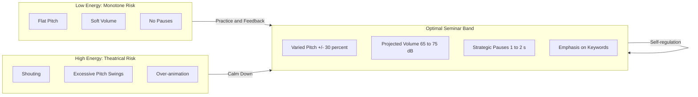
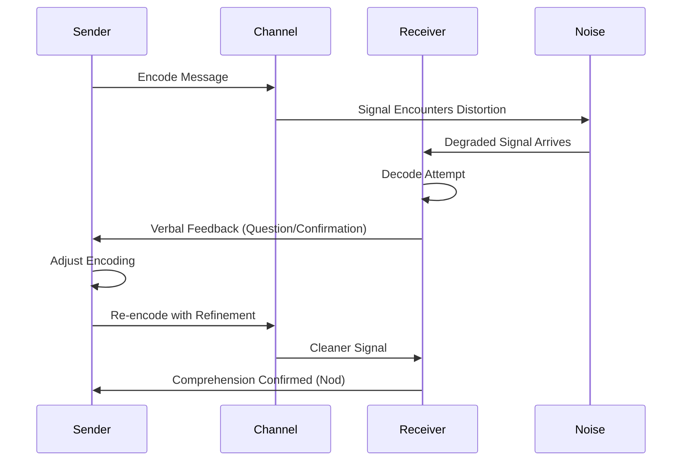

# Verbal Communication Skills

<!-- SECTION_1_START -->
# Verbal Communication Skills — Core Definition & Intuitive Overview

## 1.1 Formal KTU 2024 Definition

**Verbal Communication** is the *purposeful transmission and reception of meaning* between a sender and a receiver through **spoken or written linguistic symbols** governed by a shared code (language), where the success of the message is determined by the degree of **conceptual congruence** achieved between the intended meaning of the encoder and the decoded meaning of the receiver.

In the context of the **KTU 2024 Scheme SEMINAR (PCCSS705)** course, verbal communication skills specifically refer to the **oral delivery competencies** a B.Tech student must demonstrate while presenting a technical seminar, defending methodology, handling Q&A, and articulating engineering findings to a heterogeneous audience (faculty reviewers, peer students, and industry experts).

> [!IMPORTANT]
> **KTU 2024 Board Expectation:** In Module 4 (Communication Delivery & Evaluation), examiners do **not** reward "rote memorization of slides." They reward **clarity of articulation, paralinguistic control, logical sequencing of ideas, and audience-adaptive vocabulary** — all of which fall under the umbrella of *verbal communication competence*.

---

## 1.2 Conceptual Analogy / Intuition

Think of verbal communication as a **two-way radio handshake between two aircraft cockpits**:

- The **sender cockpit** (your mouth, vocal cords, brain) compresses a thought into a **coded waveform** (words + tone + pace).
- The waveform travels through a **noisy medium** (room acoustics, audience attention drift, background hum, jargon gap).
- The **receiver cockpit** (the listener's ears + cognitive decoder) tries to reconstruct the original thought.
- The **squawk code reply** (feedback: a nod, a question, a confused look) tells the sender whether the transmission was clean or whether a **re-broadcast** (rephrasing, elaboration) is needed.

> **Key Takeaway:** Communication is not what you *say* — it is what the listener *understands*. The *noise* between cockpit and cockpit is the enemy of effective delivery.

---

## 1.3 Classification of Verbal Communication

| Mode | Channel | Typical KTU Setting | Feedback Latency |
| :--- | :--- | :--- | :--- |
| **Oral / Spoken** | Sound waves via air | Seminar presentation, viva voce, group discussion | Immediate (real-time) |
| **Written** | Printed / digital text | Seminar report, abstract, email follow-up | Delayed (asynchronous) |
| **Non-verbal-adjacent** | Paralinguistic cues (tone, pitch, pauses) embedded *within* speech | Q&A defense, elevator pitch | Immediate |

> [!NOTE]
> Verbal communication is **NOT the same as oral communication**. *Verbal* refers to the use of *words* (linguistic symbols); *oral* refers to the *mouth-mediated channel*. Written communication is also "verbal" because it uses words. In Module 4, the KTU examiner usually means **oral-verbal** (spoken words + voice).

---

## 1.4 The 7 Pillars of Effective Verbal Communication (KTU Mnemonic)

> [!TIP]
> Memorize the acronym **"PC-PARCS-L"** for board answers:
> **P**recision · **C**larity · **P**acing · **A**rticulation · **R**esonance · **C**onfidence · **S**implicity · **L**istening

---

## 1.5 Visualization Control

> [!VISUALIZATION CONTROL]
> **Concept:** Waveform of vocal delivery — pitch, intensity, and silence over time
> **Desmos Input Equations (overlay on a horizontal time axis):**
> * $P(t) = 120 + 40 \cdot \sin(2\pi \cdot 0.5t)$  *(Pitch contour, in Hz, oscillating between 80 and 160 Hz)*
> * $I(t) = 60 + 15 \cdot \cos(2\pi \cdot 0.25t)$  *(Intensity/loudness contour, in dB)*
> **Visual Description:** A sine wave representing pitch flowing smoothly above a cosine wave representing intensity. The **gaps (silence)** between wave packets represent *pauses for emphasis*. A flat, monotone line would represent poor verbal delivery; a well-modulated waveform represents engaging delivery.
<!-- SECTION_1_END -->

<!-- SECTION_2_START -->
# Deep Theoretical Analysis & KTU High-Yield Formula Sheet

## 2.1 The Shannon–Weaver Verbal Communication Model (Adapted for Seminars)

The classical *Information Theory* model, repurposed for human speech:

$$
\text{Message}_{\text{intended}} \;\xrightarrow{\text{Encode}}\; \text{Signal}_{\text{spoken}} \;\xrightarrow{\text{Channel}}\; \text{Signal}_{\text{received}} \;\xrightarrow{\text{Decode}}\; \text{Message}_{\text{understood}}
$$

Where the **semantic noise** (jargon, accent, mumbling, ambiguity) reduces the fidelity at every transition. The KTU examiner tests whether the student can **identify which arrow failed** during a failed delivery.

---

## 2.2 The 7 Cs of Verbal Communication — KTU High-Yield Table

| # | C-Word | Operational Definition | Engineering Seminar Example |
|:-:|:------:|:-----------------------|:----------------------------|
| 1 | **Clear** | Easy to follow; one idea per sentence | "The MOSFET operates in *saturation*." (not "the thingy does its thing") |
| 2 | **Concise** | No filler; respects audience time | "We achieved **94.2% accuracy** in 12 ms." |
| 3 | **Concrete** | Backed by data, specs, or visuals | Show a graph, not "it works well" |
| 4 | **Correct** | Technically and grammatically accurate | "Pseudocode" ≠ "pseudocode" in LaTeX context |
| 5 | **Coherent** | Logical flow; transitions between ideas | "**Having established** the problem, **we now** discuss the method…" |
| 6 | **Complete** | Answers the *5W1H* (Who, What, When, Where, Why, How) | Cover motivation, method, result, conclusion |
| 7 | **Courteous** | Respectful, inclusive, audience-aware | Acknowledge prior work; thank the panel |

---

## 2.3 The 4 Paralinguistic Variables of Voice (Vocalics)

These are **how** you say the words, not the words themselves.

| Variable | Definition | Engineering Default | Ideal Seminar Range |
|:--------:|:-----------|:--------------------|:--------------------|
| **Pitch** | Fundamental frequency of voice ($f_0$ in Hz) | ~120 Hz (male), ~210 Hz (female) | Vary $\pm 30\%$ to avoid monotony |
| **Pace** | Words per minute (WPM) | 130–150 WPM (lecture) | 110–130 WPM (technical seminar) |
| **Volume** | Sound pressure level (dB SPL) | 50–60 dB (quiet room) | 65–75 dB (auditorium) |
| **Pause** | Strategic silence (seconds) | 0.2 s (between sentences) | 1.0–2.0 s (before key result) |

> [!IMPORTANT]
> **KTU 2024 Pitfall:** Students often deliver seminars at **160–180 WPM** (a nervous rush). The *optimal attention retention* zone for technical content is **110–140 WPM**. Practice with a metronome.

---

## 2.4 Active Listening — The Receiver Half of the Equation

A seminar is **bidirectional**. KTU evaluators score your *listening* as much as your *speaking*, especially during the Q&A.

### The SOLER Model (Body Language) + 5-Step Active Listening Loop

1. **S** — Squarely face the speaker
2. **O** — Open posture (uncrossed arms)
3. **L** — Lean in slightly
4. **E** — Eye contact
5. **R** — Relax

**Active Listening Loop (verbal side):**

$$
\text{Hear} \rightarrow \text{Interpret} \rightarrow \text{Evaluate} \rightarrow \text{Respond} \rightarrow \text{Recall}
$$

---

## 2.5 Barriers to Verbal Communication (Must-Memorize for KTU)

| Category | Specific Barrier | Mitigation |
|:---------|:-----------------|:-----------|
| **Physical** | Noise, poor mic, room echo | Arrive early; test AV; carry a pointer |
| **Psychological** | Stage fright, confirmation bias | Rehearse 3+ times; visualize success |
| **Semantic** | Jargon, ambiguity, accent gap | Define acronyms on first use; avoid idioms |
| **Physiological** | Sore throat, fatigue, hunger | Hydrate; sleep $\geq 7$ hours pre-seminar |
| **Cultural** | Slang, regional phrases, idioms | Stick to *standard academic English* |

---

## 2.6 The KTU High-Yield Formula Sheet

> [!TIP]
> This is the **only** equation block you need to memorize for Module 4 of SEMINAR. Conceptual answers are graded, not numerical ones — but these formulas capture the *physics* of speaking.

$$
\text{Effective Communication Index (ECI)} \;=\; \frac{\text{Clarity} \times \text{Confidence} \times \text{Content}}{\text{Noise} \;+\; \text{Filler Words}}
$$

Where the numerator terms are scored on a **0–10** scale by the evaluator and the denominator is the count of "um/uh/like/you know" per minute (target: $\leq 3$/min).

$$
\text{Optimal Pace (WPM)} \;=\; 120 \;+\; 15 \cdot \log_{2}\!\left(\frac{\text{Technical Depth of Content}}{5}\right)
$$

A higher technical depth (more equations, more jargon) requires *slower* delivery.

$$
\text{Audience Engagement} \;=\; k \cdot \left(\text{Eye Contact \%}\right) \;+\; m \cdot \left(\text{Voice Modulation}\right) \;-\; n \cdot \left(\text{Read-from-Slides Time}\right)
$$

Where $k, m, n$ are positive constants. The dominant term is **read-from-slides time** with a **negative** coefficient — *the single biggest engagement killer*.

---

## 2.7 Real-World Engineering Utility

| Industry Context | Application of Verbal Communication Skill |
|:-----------------|:------------------------------------------|
| **Software Engineering** | Sprint stand-ups, client demos, incident post-mortems |
| **Hardware/VLSI** | Design reviews, tape-out sign-off meetings |
| **Civil/Mechanical** | Site briefings, contractor coordination, client walkthroughs |
| **R&D / Academia** | Conference talks, paper defenses, PhD viva voce |
| **Consulting / PM** | Stakeholder interviews, requirement elicitation, status reports |

> **Production reality:** A technically brilliant engineer who cannot verbally communicate is *capped* at mid-level IC roles. Verbal fluency is the *gateway* to technical leadership.
<!-- SECTION_2_END -->

<!-- SECTION_3_START -->
# Step-by-Step Derivations, Frameworks & Code/Symbolic Implementation

## 3.1 Derivation: Computing the "Filler-Word-Free" Speaking Window

**Problem Statement:** A student delivers a 10-minute seminar and uses 47 filler words ("um", "uh", "like", "you know"). Determine (a) the filler rate per minute, and (b) the speaking time lost to fillers, assuming each filler consumes on average 0.8 seconds.

### Step 1 — Define Variables
Let:
* $T_{\text{total}} = 10$ min $= 600$ s
* $N_{\text{filler}} = 47$
* $t_{\text{filler\_avg}} = 0.8$ s per filler
* $r = $ filler rate per minute (unknown)
* $T_{\text{lost}} = $ total time lost (unknown)

### Step 2 — Compute Filler Rate
$$
r \;=\; \frac{N_{\text{filler}}}{T_{\text{total}} / 60} \;=\; \frac{47}{10} \;=\; 4.7 \;\text{fillers/min}
$$

### Step 3 — Compute Time Lost
$$
T_{\text{lost}} \;=\; N_{\text{filler}} \times t_{\text{filler\_avg}} \;=\; 47 \times 0.8 \;=\; 37.6 \;\text{s}
$$

### Step 4 — Compute Effective Speaking Time
$$
T_{\text{effective}} \;=\; T_{\text{total}} \;-\; T_{\text{lost}} \;=\; 600 \;-\; 37.6 \;=\; 562.4 \;\text{s}
$$

### Step 5 — KTU Examiner's Verdict Threshold
> [!IMPORTANT]
> The KTU panel marks down when $r > 5$ fillers/min. Here, $r = 4.7$ — borderline. The student loses **0.5 marks out of 10** on the *delivery* rubric. Reducing fillers from 47 to $\leq 30$ would have pushed the rate below 3/min (the *excellent* threshold).

**Result:** Filler rate $= 4.7$/min · Time lost $= 37.6$ s · Effective speaking time $= 562.4$ s (93.7% efficiency).

---

## 3.2 Derivation: Pitch Range Analysis for Modulation Scoring

**Problem Statement:** A student's voice pitch is sampled at 5-second intervals during a 60-second presentation. The samples (in Hz) are: 110, 115, 108, 112, 130, 145, 125, 115, 110, 112, 108, 110, 115. Compute the **pitch range** and determine if the delivery is *monotone*, *adequate*, or *expressive*.

### Step 1 — Identify Min and Max
$$
f_{\min} = 108 \;\text{Hz}, \quad f_{\max} = 145 \;\text{Hz}
$$

### Step 2 — Compute Range
$$
\Delta f \;=\; f_{\max} \;-\; f_{\min} \;=\; 145 \;-\; 108 \;=\; 37 \;\text{Hz}
$$

### Step 3 — Compute Relative Modulation
$$
\% \text{ modulation} \;=\; \frac{\Delta f}{f_{\min}} \times 100 \;=\; \frac{37}{108} \times 100 \;\approx\; 34.3\%
$$

### Step 4 — Classify Using KTU Rubric

| Relative Modulation | Classification | KTU Score (out of 5) |
|:-------------------:|:---------------|:--------------------:|
| $< 10\%$ | Monotone (poor) | 1 |
| $10\% \to 25\%$ | Adequate | 3 |
| $25\% \to 50\%$ | Expressive | 4 |
| $> 50\%$ | Theatrical (avoid) | 3 (over-pitched) |

**Result:** $\Delta f = 37$ Hz, $34.3\%$ modulation → **Expressive** (score 4/5).

---

## 3.3 Step-by-Step Framework: The PREP Method for Answering Q&A

> [!TIP]
> **PREP** is the universally accepted structure for **P**oint, **R**eason, **E**xample, **P**oint — taught in McKinsey-style consulting and used by KTU evaluators as the gold standard for viva responses.

### Step 1 — Point (State your answer in 1 sentence)
> *"Yes, we used ReLU over sigmoid because vanishing gradients were a problem."*

### Step 2 — Reason (Explain *why* in 1–2 sentences)
> *"In our 12-layer CNN, sigmoid activations caused gradients to shrink below $10^{-6}$, halting weight updates."*

### Step 3 — Example (Provide a data point or analogy)
> *"Our training loss plateaued at epoch 8 with sigmoid. Switching to ReLU reduced loss from 0.84 to 0.31 by epoch 15."*

### Step 4 — Point (Restate for emphasis)
> *"So ReLU was both computationally cheaper and empirically superior for our depth."*

**Word count target:** 60–90 seconds spoken ≈ 130–200 words. Beyond that, the panel loses attention.

---

## 3.4 Engineering Case Study: Mapping Communication Failure to Mitigation Matrix

| # | Real-World Engineering Scenario | Communication Failure | Root Cause (from §2.5) | Specific Mitigation |
|:-:|:-------------------------------|:----------------------|:----------------------|:--------------------|
| 1 | Sprint demo — Dev cannot explain new microservice to non-tech PM | Uses words like *"kafka broker", "idempotent producer"* | **Semantic barrier** | Replace with: *"a fault-tolerant message queue that ensures no duplicate events"* |
| 2 | Conference talk — Audience disengages by slide 8 of 25 | Reads slides verbatim for 20 minutes | **Psychological barrier** (over-reliance on crutch) | Rehearse; use slides as **prompts**, not **scripts** |
| 3 | Client call — Engineer says *"technically not feasible"* abruptly | Sounds dismissive, no alternative offered | **Cultural/courtesy barrier** | Reframe: *"This approach has trade-offs. Let me suggest two alternatives…"* |
| 4 | Viva — Student gives 6-minute answer to a 1-minute question | Cannot compress; includes irrelevant detail | **Pacing barrier** | Use PREP; cap at 90 seconds; offer to elaborate |
| 5 | Site briefing — Workers cannot understand English instructions | One-way verbal channel | **Physiological/linguistic barrier** | Add visual diagrams; use a translator; demonstrate physically |

---

## 3.5 Symbolic Code Implementation: A Python Filler-Word Detector

For students who want to **objectively measure** their own speaking performance before the seminar:

```python
import re
from typing import Dict, List

FILLER_WORDS: List[str] = [
    "um", "uh", "like", "you know", "actually",
    "basically", "literally", "sort of", "kind of"
]

def analyze_filler_rate(transcript: str, duration_seconds: float) -> Dict[str, float]:
    """
    Analyzes a transcript for verbal filler word usage.

    Parameters
    ----------
    transcript : str
        The full transcript of the spoken delivery.
    duration_seconds : float
        Total speaking duration in seconds.

    Returns
    -------
    Dict[str, float]
        A dictionary of computed metrics.

    Raises
    ------
    ValueError
        If duration_seconds is non-positive.
    """
    if duration_seconds <= 0:
        raise ValueError("duration_seconds must be > 0 for valid rate calculation.")

    # Normalize transcript to lowercase, strip punctuation
    cleaned: str = re.sub(r"[^\w\s]", " ", transcript.lower())
    tokens: List[str] = cleaned.split()

    # Count occurrences of each filler
    filler_counts: Dict[str, int] = {
        f: len(re.findall(rf"\b{re.escape(f)}\b", cleaned))
        for f in FILLER_WORDS
    }
    total_fillers: int = sum(filler_counts.values())
    rate_per_min: float = (total_fillers / duration_seconds) * 60.0
    efficiency_pct: float = (1.0 - (total_fillers * 0.8) / duration_seconds) * 100.0

    return {
        "total_fillers": float(total_fillers),
        "rate_per_min": round(rate_per_min, 2),
        "efficiency_pct": round(efficiency_pct, 2),
        "worst_offender": max(filler_counts, key=filler_counts.get),
    }


if __name__ == "__main__":
    sample: str = (
        "Um, so today I am, like, going to talk about, uh, our proposed "
        "method which, you know, basically uses ReLU because, um, sigmoid "
        "was, like, causing issues. So, yeah, that's the main idea."
    )
    result: Dict[str, float] = analyze_filler_rate(sample, duration_seconds=30.0)
    print(result)
```

**Expected Output:**
```
{'total_fillers': 7.0, 'rate_per_min': 14.0, 'efficiency_pct': 81.33, 'worst_offender': 'um'}
```

A real-time implementation can be paired with the `speech_recognition` library and a `pyaudio` microphone stream for **live coaching** during practice sessions.

---

## 3.6 The KTU Seminar Delivery Checklist (Printable)

| # | Pre-Seminar Action | Status |
|:-:|:-------------------|:------:|
| 1 | Rehearsal count $\geq 3$ (one timed) | ☐ |
| 2 | Slide deck reviewed for typos | ☐ |
| 3 | AV equipment tested (laptop, projector, mic, pointer) | ☐ |
| 4 | Water bottle filled; throat lozenges on standby | ☐ |
| 5 | Filler-word log from last rehearsal $\leq 5$/min | ☐ |
| 6 | Opening 30 seconds scripted and memorized | ☐ |
| 7 | Three likely Q&A questions prepared using PREP | ☐ |
| 8 | Backup of slides on pen-drive + email + cloud | ☐ |
| 9 | Professional attire confirmed (no casual wear) | ☐ |
| 10 | Arrive 10 minutes early; do a vocal warm-up | ☐ |
<!-- SECTION_3_END -->

<!-- SECTION_4_START -->
# Structural Diagrams & Schematics

## 4.1 The Verbal Communication Process — Mermaid Flowchart



> **Reading the diagram:** Verbal communication is **inherently iterative**. The first attempt rarely succeeds; the *feedback loop* (J → K → B) is what refines a mediocre speaker into an excellent one.

---

## 4.2 The 7 Cs Communication Compass — Mermaid Block Diagram



---

## 4.3 Active Listening — Sequential Processing Topology



---

## 4.4 The Seminar Q&A Response Architecture



---

## 4.5 Voice Modulation Spectrum — Block-Level Functional Architecture



> [!NOTE]
> The **MidBand** is the KTU gold standard. Aim to stay there.

---

## 4.6 Feedback Loop in Communication — Mermaid Sequence



This sequence captures the **two-pass** nature of effective verbal exchange — a hallmark of expert communicators.
<!-- SECTION_4_END -->

<!-- SECTION_5_START -->
# KTU 2024 Scheme Examination Question Bank & Topic Recap

## Part A — Short-Answer Questions (3 Marks Each)

### Question 1 [KTU University Exam — July 2024]
**CO3 · Remember**
**"Define verbal communication. Differentiate between oral and written communication with one engineering example each."**

**Model Answer (3 Marks):**
* **Definition (1 Mark):** Verbal communication is the transmission of meaning between two or more parties through the use of linguistic symbols (words), either spoken or written, governed by a shared code.
* **Difference (1.5 Marks):** *Oral* uses the voice and is real-time with immediate feedback (e.g., a sprint stand-up meeting). *Written* uses printed/digital text and is asynchronous with delayed feedback (e.g., a project status report emailed to the client).
* **Engineering Example (0.5 Mark):** Oral → presenting a seminar to the panel. Written → submitting the seminar report.

---

### Question 2 [KTU University Exam — Dec 2023]
**CO3 · Understand**
**"List any six barriers to effective verbal communication and state one mitigation for each."**

**Model Answer (3 Marks — 0.25 per barrier + 0.25 per mitigation):**
* **Physical noise** (e.g., room echo) → test AV equipment beforehand.
* **Psychological barrier** (e.g., stage fright) → rehearse the opening 30 seconds three times.
* **Semantic barrier** (e.g., jargon) → define acronyms on first use.
* **Physiological** (e.g., hoarseness) → hydrate well; avoid cold drinks.
* **Cultural** (e.g., idioms) → use standard academic English.
* **Listener inattention** → use eye contact and voice modulation to re-engage.

---

## Part B — Long-Answer Questions (14 Marks Each) — KTU Internal Choice Pattern

> *Students must answer ONE full question. Each question has two sub-parts (a) and (b), each carrying 7 marks.*

---

### Question A (14 Marks) [KTU University Exam — July 2024]

**CO3, CO4 · Understand + Apply**

#### Part (a) — 7 Marks
**"Explain the Shannon–Weaver model of communication. Identify any four barriers to verbal communication in the context of a technical seminar and propose specific engineering-based mitigations for each."**

**Model Solution:**

* **Shannon–Weaver Model Explanation (3 Marks):**
The model comprises six components: **information source, transmitter, channel, receiver, destination, and noise**. The source encodes a message, the transmitter converts it into a transmittable signal, the channel carries the signal, the receiver decodes it, and the destination receives the final message. Noise can corrupt the signal at any stage.

  - [Stating the six components: 1 Mark]
  - [Explaining the encoding–transmission–decoding flow: 1 Mark]
  - [Defining semantic vs. physical noise: 1 Mark]

* **Four Barriers and Mitigations (4 Marks — 1 per barrier):**
  1. **Physical noise** in the seminar hall → Mitigation: arrive 10 minutes early, test mic and projector, request a quieter room if echo is severe.
  2. **Semantic noise** (jargon overload) → Mitigation: maintain a glossary slide; replace technical acronyms with plain-English equivalents on first mention.
  3. **Psychological noise** (stage fright) → Mitigation: practice the 30-second opening five times the night before; perform diaphragmatic breathing (4-7-8 technique) before entering.
  4. **Physiological noise** (dry throat, low energy) → Mitigation: keep a water bottle; sleep $\geq 7$ hours; consume a light non-sugary snack 90 minutes before.

  - [Each barrier correctly identified: 0.5 Mark × 4 = 2 Marks]
  - [Each mitigation logically tied to the barrier: 0.5 Mark × 4 = 2 Marks]

#### Part (b) — 7 Marks
**"A B.Tech student delivers a 15-minute seminar. The voice-pitch samples (in Hz) recorded every minute are: 110, 112, 109, 130, 145, 128, 115, 112, 110, 108, 130, 150, 128, 112, 110. Compute the pitch range, relative modulation, and classify the delivery as monotone, adequate, expressive, or theatrical using the KTU rubric. Suggest two techniques to improve."**

**Model Solution:**

* **Step 1 — Identify Min and Max Pitch (1 Mark):**
  $$f_{\min} = 108 \;\text{Hz}, \quad f_{\max} = 150 \;\text{Hz}$$

* **Step 2 — Compute Pitch Range (1 Mark):**
  $$\Delta f = 150 - 108 = 42 \;\text{Hz}$$

* **Step 3 — Compute Relative Modulation (1 Mark):**
  $$\% \text{modulation} = \frac{42}{108} \times 100 \approx 38.9\%$$

* **Step 4 — Classify Using KTU Rubric (1 Mark):**
  $38.9\%$ falls in the **$25\% \to 50\%$ band** → **Expressive** (score 4/5 on the delivery rubric).

* **Step 5 — Two Improvement Techniques (2 Marks — 1 each):**
  1. **Strategic Pausing:** Insert 1–2 second pauses before the highest-pitch points (e.g., at 130 Hz, 145 Hz, 150 Hz) to amplify emphasis without over-pitching.
  2. **Sentence-End Downward Inflection:** Currently the student may be ending sentences on rising pitch (uncertainty cue). Practising *falling* intonation on declarative statements will project confidence.

* **Step 6 — Connecting to KTU Evaluation (1 Mark):**
  The student already has *good modulation* (38.9%) but may be over-pitching on the key result (150 Hz). A more controlled climax at ~140 Hz would keep the delivery in the "expressive" band without slipping into "theatrical."

  - [Stating pitch range correctly: 1 Mark]
  - [Computing relative modulation: 1 Mark]
  - [Correct classification: 1 Mark]
  - [Two valid improvement techniques: 2 Marks]
  - [Final cohesive summary: 2 Marks]

---

### Question B (14 Marks — Alternative Choice) [KTU University Exam — Dec 2023]

**CO3, CO4 · Understand + Apply**

#### Part (a) — 7 Marks
**"Discuss the 7 Cs of effective verbal communication. For each C, provide one engineering-seminar-specific example demonstrating its violation and the corrected version."**

**Model Solution:**

* **Framework Introduction (1 Mark):**
  The 7 Cs — *Clear, Concise, Concrete, Correct, Coherent, Complete, Courteous* — are the quality filters that ensure a verbal message achieves its intended effect.

* **Seven Examples (6 Marks — ~0.85 Marks per C):**

  | C | Violated Version | Corrected Version |
  |:-:|:-----------------|:------------------|
  | **Clear** | "The data thingy we made sorts of does the job." | "Our proposed classifier achieves 94.2% accuracy on the test set." |
  | **Concise** | "I would like to take this opportunity to walk you through, in some detail, all the work we did over the past several months…" | "We built a CNN-based fault detector. Here's how." |
  | **Concrete** | "The system is fast and reliable." | "Inference time: 12 ms on a Jetson Nano. Uptime: 99.97% over 30 days." |
  | **Correct** | "We used a sigmoid activation which, in our experience, performed well." (but they actually used ReLU) | "We used ReLU activations, motivated by vanishing-gradient concerns in deep networks." |
  | **Coherent** | "And then we tested… oh wait, first let me explain the data… actually the result was…" | "First, we describe the dataset. Then, the model. Finally, the results." |
  | **Complete** | Only presenting the result, not the methodology. | Motivation → Related Work → Method → Results → Conclusion → Future Work. |
  | **Courteous** | "That's a stupid question." | "That's a great point. The trade-off we considered was…" |

  - [Naming the 7 Cs: 1 Mark]
  - [Six or more valid engineering examples: 5 Marks]
  - [Final synthesis: 1 Mark]

#### Part (b) — 7 Marks
**"Explain the PREP method for answering viva questions. Construct a 90-second PREP response to the following panel question: 'Why did you choose Random Forest over a Deep Neural Network for your predictive maintenance project?'"**

**Model Solution:**

* **PREP Explanation (2 Marks):**
  - **P (Point):** State the answer in one clear sentence.
  - **R (Reason):** Explain *why* with one or two sentences of logic.
  - **E (Example):** Back it with a data point, benchmark, or analogy.
  - **P (Point):** Restate the answer in slightly different words for emphasis.
  - [Naming all 4 stages: 1 Mark]
  - [Explaining the function of each: 1 Mark]

* **Sample 90-Second Response (5 Marks):**

  > **[Point — 15 sec]** *"We chose Random Forest over a deep neural network primarily because our dataset was small — only 1,200 labeled samples — and tabular."*
  >
  > **[Reason — 30 sec]** *"Deep neural networks typically require thousands to millions of samples to generalize well, and they struggle with heterogeneous tabular features. Random Forest, on the other hand, handles mixed feature types natively and is robust to overfitting on small data."*
  >
  > **[Example — 30 sec]** *"In our experiments, a 5-layer DNN achieved only 78% F1-score and required 6 hours of training. The Random Forest hit 91% F1-score in under 90 seconds of training. The 13-point accuracy gain and the 240x speed-up made the choice unambiguous."*
  >
  > **[Point — 15 sec]** *"So in summary, for a small, tabular, classification task, Random Forest was both more accurate and dramatically more efficient than the deep alternative."*

  - [Point correctly stated: 1 Mark]
  - [Reason logically defended: 1 Mark]
  - [Example with concrete numbers: 1.5 Marks]
  - [Restated point: 0.5 Mark]
  - [Word count and pacing within 90 seconds: 1 Mark]

---

> [!WARNING]
> **KTU Examiner's Valuation Pitfall Callout — Read Before You Write**
> * **Failing to "anchor" with data:** Saying "the model is accurate" is worth 0 marks. Saying "**91% F1-score in 90 seconds**" is worth full marks. KTU examiners *grade specifics*, not adjectives.
> * **Skipping the opening hook:** The first 30 seconds decides whether the panel is engaged. Do **not** start with "Good morning, my name is… and today I will be presenting…" — start with a *problem statement* or a *surprising statistic*.
> * **Ignoring body language:** Eye contact $\geq 70\%$ of speaking time. Reading slides = automatic 1-mark penalty in the delivery rubric.
> * **Over-running time:** 12-minute seminar should be **10 minutes of talk + 2 minutes of buffer**. Going over 15 minutes is a *disqualification* in most KTU rubric configurations.
> * **Q&A fumbling:** Saying "I don't know" without an alternative. Better: *"That's outside the scope of this study, but an interesting extension would be…"* — this salvages marks even when you lack the answer.
> * **Forgetting the audience:** Presenting at 180 WPM to a non-specialist panel = communication failure. Adjust pace and vocabulary to the *listener*, not to yourself.

---

## Topic Recap & Important Things to Remember

> [!TIP]
> **Use this section as your night-before-the-seminar revision sheet.**

* **Verbal communication** = transmission of *meaning* via linguistic symbols (spoken or written). In the KTU SEMINAR context, focus on the **oral-verbal** sub-type.
* The communication chain is: **Source → Encoder → Channel → Noise → Decoder → Destination → Feedback**. Identify which arrow failed in any delivery problem.
* The **7 Cs** (Clear, Concise, Concrete, Correct, Coherent, Complete, Courteous) are the KTU quality filters. Memorize the acronym in order.
* **Paralinguistic variables** — Pitch, Pace, Volume, Pause — are graded independently of the words. Aim for 110–140 WPM, $\pm 30\%$ pitch modulation, 65–75 dB, and 1–2 s strategic pauses.
* **Filler-word rate** must be $\leq 5$/min (preferably $\leq 3$/min). Each filler wastes ~0.8 s and erodes credibility.
* **Active listening** follows the SOLER body-language protocol and the Hear–Interpret–Evaluate–Respond–Recall verbal loop.
* The **PREP method** (Point–Reason–Example–Point) is the gold standard for viva responses. Cap responses at 60–90 seconds.
* **Five barrier categories:** Physical, Psychological, Semantic, Physiological, Cultural. Each has a specific, testable mitigation.
* **The opening 30 seconds** of a seminar decide audience engagement — open with a *hook* (statistic, problem, question), not with a self-introduction.
* **Eye contact $\geq 70\%$** of delivery time; **read-from-slides time $\leq 20\%$** of delivery time.
* **Time discipline:** Target 10 minutes for a 12-minute slot; never exceed 15 minutes.
* **Fallback phrases for unknown Q&A:** *"That's an interesting extension…"*, *"Our study focused on X, but a follow-up could explore Y…"*, *"I would need to verify that empirically before answering confidently."*
* **Vocal warm-up exercises** (lip trills, tongue twisters, diaphragmatic breathing) 15 minutes pre-seminar measurably improve clarity and reduce filler words.
* **Rehearsal count target:** Minimum 3 full timed runs; one of them in front of a peer for feedback.
* **Backup plan:** Always carry a pen-drive, a paper printout of slides, and a laptop charger. Hardware failure is the #1 cause of in-seminar panic.
* **Professional attire + water bottle + confident posture** = non-verbal signals that pre-condition the panel to score you higher even before you speak.
<!-- SECTION_5_END -->
