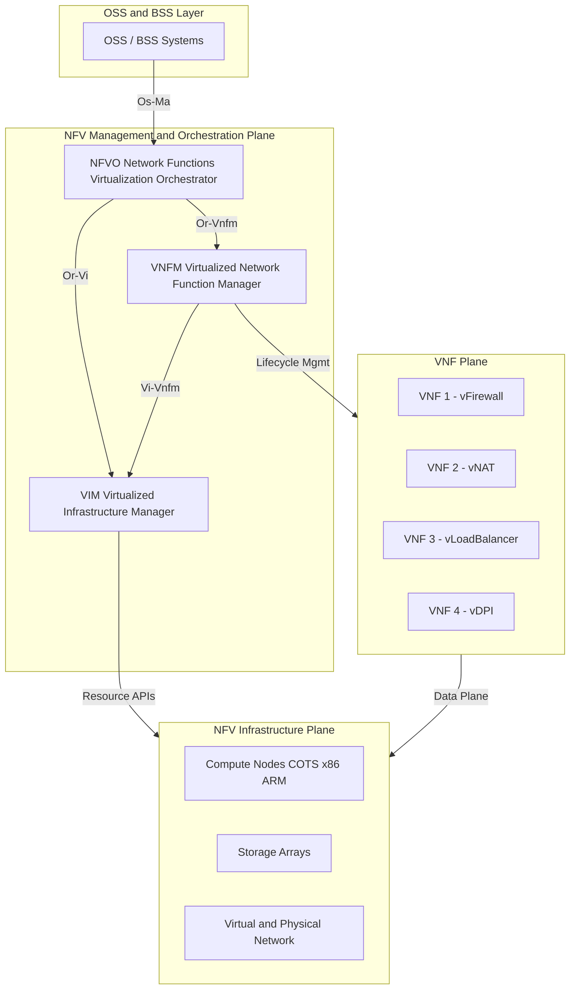
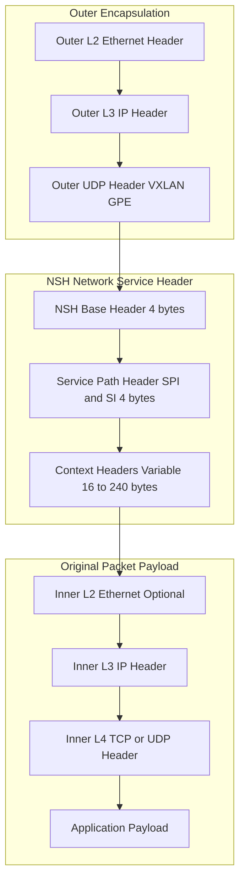
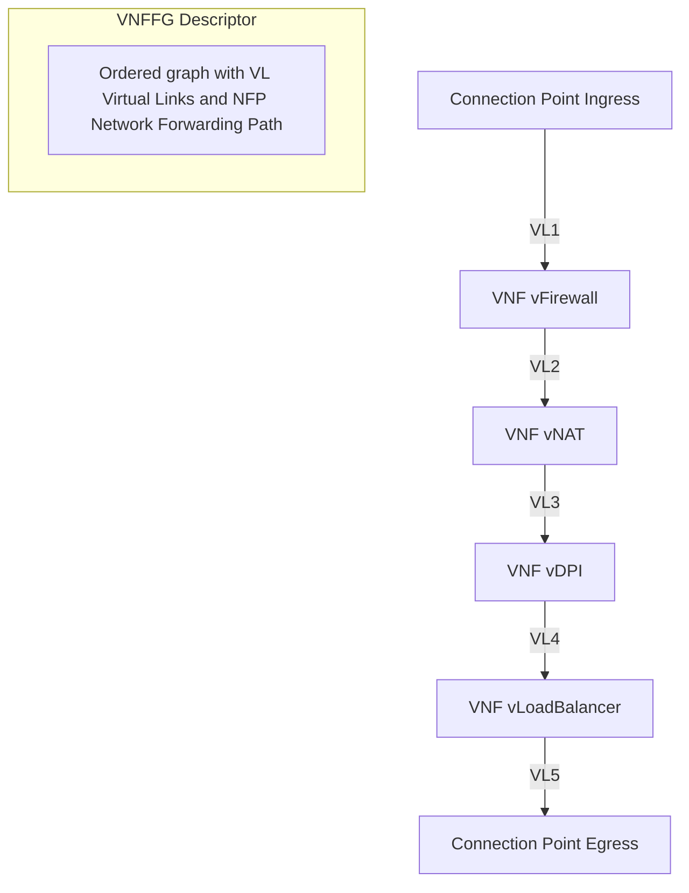
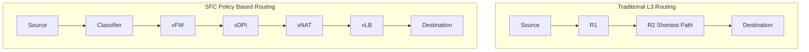

# Network Function Virtualization (NFV) service chaining configurations paths layout structures

<!-- SECTION_1_START -->
# Network Function Virtualization (NFV) & Service Chaining — Core Definition

## Formal Academic Definition (KTU 2024 Syllabus Terminology)

> [!IMPORTANT]
> **Network Function Virtualization (NFV)** is a network architecture paradigm standardized by the **European Telecommunications Standards Institute (ETSI)** in **2012** that decouples **network functions** (e.g., firewall, NAT, load balancer, DPI, IDS) from proprietary dedicated hardware appliances and implements them as **Virtualized Network Functions (VNFs)** running as software on standard **Commercial Off-The-Shelf (COTS)** servers, switches, and storage infrastructure.

> [!IMPORTANT]
> **Service Function Chaining (SFC)** — defined in **IETF RFC 7665** and **RFC 8300** — is the technique of steering traffic through an **ordered sequence** of network services (physical or virtual) to deliver an end-to-end composite service. The path of the traffic and the order of service consumption are defined by a **Service Function Chain (SFC) policy**.

## Conceptual Analogy — "The Restaurant Kitchen Pipeline"

Imagine a customer ordering a burger at a fast-food counter:

| Customer (Packet) Steps Through | NFV Equivalent |
|---|---|
| Order placed at the **counter (Classifier)** | Packet is classified and tagged with chain ID |
| Passed to the **grill station (FW — Firewall)** | First VNF inspects and filters the packet |
| Sent to the **fry station (NAT)** | Second VNF rewrites IP/port headers |
| Goes to the **packaging desk (DPI)** | Third VNF performs deep inspection |
| Delivered via the **delivery boy (SFF)** | Service Function Forwarder routes to next hop |
| Reaches the **customer's table (End host)** | Final destination after all SFs are traversed |

The packet does **not** take the shortest path geographically — it takes the **policy-defined logical path** through a defined chain of services. The conveyor belt underneath the entire kitchen is the **Service Function Path (SFP)** — also called the **Underlay Network**.

> [!NOTE]
> **Key distinction in KTU 2024 scheme:** NFV focuses on **where** the function runs (virtualized vs. hardware), while SFC focuses on **how** the traffic **flows** between those functions. The two are **complementary** but **distinct** concepts.

## Physical Constants & Standard Metrics in NFV/SFC

- **ETSI NFV Reference Architecture** was released in **October 2013** (ETSI GS NFV 002 v1.1.1).
- **NSH (Network Service Header)** — RFC 8300 — uses **Service Path ID (SPI: 24 bits)** + **Service Index (SI: 8 bits)** for chain identification.
- **VNF Forwarding Graph (VNFFG)** — defined in ETSI NFV-IFA 011 — describes the topology of VNF connections.
- **Service Function Chain latency budget** — typically **< 50 ms** per hop in production carrier networks.
- **MTU overhead of NSH** — **8 bytes base header + 16 bytes context headers = 24 bytes total**.

> [!VISUALIZATION CONTROL]
> **Concept:** Logical SFC Path Overlay over Physical Underlay
> **Conceptual Equations:**
> * $\text{SFP} = \{SF_1, SF_2, SF_3, \ldots, SF_n\}$ — ordered set of Service Functions
> * $\text{SPI} = \text{unique 24-bit path identifier}$, $\text{SI} = n - k$ (decremented per hop)
> **Visual Description:** A student should picture a *straight horizontal line* (the underlay L3 network) with multiple **vertical service nodes** rising above it at different x-positions, connected by a *curved overlay path* that jumps from one vertical node to the next in a non-geographic order.
<!-- SECTION_1_END -->

<!-- SECTION_2_START -->
# Deep Theoretical Analysis & KTU High-Yield Formula Sheet

## ETSI NFV Architectural Framework

The **ETSI NFV Reference Architecture** is decomposed into three primary working domains, each having well-defined functional blocks and reference points:

### 1. NFV Infrastructure (NFVI)
The totality of all hardware (compute, storage, networking) and software (hypervisor/OS) on which VNFs are deployed.

- **Compute Domain** → COTS x86_64 / ARM servers
- **Hypervisor Domain** → KVM, VMware ESXi, Xen, Microsoft Hyper-V
- **Network Domain** → Virtual Switches (OVS), Linux Bridges, VLAN/VXLAN overlays

### 2. Virtualized Network Functions (VNFs)
Software implementations of network functions. Each VNF may itself be decomposed into **VNF Components (VNFCs)**.

Examples of VNFs: `vRouter`, `vFW` (virtual firewall), `vDPI` (deep packet inspection), `vLB` (load balancer), `vCPE` (customer premises equipment), `vEPC` (evolved packet core).

### 3. NFV Management & Orchestration (NFV-MANO)
The brain of the framework. Composed of three functional blocks:

| MANO Block | Full Name | Responsibility |
|---|---|---|
| **VIM** | Virtualized Infrastructure Manager | Manages NFVI resources (OpenStack, vCenter) |
| **VNFM** | VNF Manager | Lifecycle management of individual VNFs (instantiate, scale, heal, terminate) |
| **NFVO** | NFVO | Orchestrates **Network Services (NS)** across multiple VNFs and VIMs |

Reference points (standardized APIs):
- **Vi-Vnfm** — between VIM and VNFM
- **Or-Vnfm** — between NFVO and VNFM
- **Or-Vi** — between NFVO and VIM
- **Os-Ma** — between OSS/BSS and NFVO

## SFC Architecture (IETF RFC 7665)

SFC introduces the following logical components:

### Service Function (SF)
The actual function that processes the packet. May be:
- **Physical SF (PSF)** — runs on bare-metal appliance
- **Virtual SF (VSF)** — runs inside a VNF on hypervisor
- **Containerized SF** — runs as Docker/Kubernetes pod

### Classifier (CL)
The entry point. Inspects incoming packets and decides which **Service Function Path (SFP)** the packet should be assigned to. The Classifier performs L2/L3/L4 header analysis and **encapsulates** matching packets inside an **NSH (Network Service Header)**.

### Service Function Forwarder (SFF)
The logical switch that reads the **Service Index (SI)** in the NSH, determines the **next SF in the chain**, and forwards the encapsulated packet. Critically, the SFF is **not** a service function — it only **forwards**.

### SFC Proxy
A shim used when a legacy SF does not understand NSH. The proxy sits in front of the legacy SF, **de-capsulates** NSH → forwards raw packet to SF → **re-capsulates** the reply back into NSH.

## Network Service Header (NSH) — RFC 8300

The NSH is the cornerstone of SFC. It is inserted **between** the outer transport header (e.g., VXLAN, GRE, MPLS) and the original packet payload.

```
NSH Header (4 bytes base + 4 bytes service path header + variable context)
┌─────────────────────────────────────────────────────────────┐
│ 0                   1                   2                   3 │
│ 0 1 2 3 4 5 6 7 8 9 0 1 2 3 4 5 6 7 8 9 0 1 2 3 4 5 6 7 8 9 0 1│
├───────┬───────┬───────┬───────────────────────────────────────┤
│Ver(2) │  O(1) │ U(1)  │   Length (6) | MD Type (8) | Next Proto(8)│
├───────┴───────┴───────┴───────────────────────────────────────┤
│   Service Path ID (SPI) — 24 bits                          │
├───────────────────────────────────────────────────────────────┤
│   Service Index (SI) — 8 bits | Reserved(8)                  │
├───────────────────────────────────────────────────────────────┤
│   [Optional Context Headers — variable length, MD-type driven]│
└───────────────────────────────────────────────────────────────┘
```

- **Ver (2 bits):** NSH version (currently `0b01` = 1).
- **O (1 bit):** OAM flag.
- **U (1 bit):** Uniqueness bit used for entropy / load distribution across SFFs.
- **Length (6 bits):** Total NSH header length in 4-byte words.
- **MD Type (8 bits):** Metadata type (e.g., `0x1` = fixed-length 16-byte context).
- **Next Protocol (8 bits):** Type of the encapsulated original packet (`0x1` = IPv4, `0x2` = IPv6, `0x3` = Ethernet).
- **SPI (24 bits):** Identifies the **Service Function Path**.
- **SI (8 bits):** Indicates **position** in the chain. Starts at maximum value (255), decremented at every SF. When SI = 0, the packet has traversed the full chain.

> [!NOTE]
> **The SI decrement rule is the heart of SFC forwarding logic.** When the SFF receives a packet with $\text{SI} = k$, it consults the chain table to find the next SF. After the SF processes the packet, the SFF decrements $\text{SI} \leftarrow k - 1$. When $\text{SI} = 0$, the packet is de-capsulated and forwarded normally.

## KTU High-Yield Formula / Cheat Sheet

| Symbol / Term | Definition | KTU Exam Relevance |
|---|---|---|
| $\text{NSH}_{size}$ | NSH header size in bytes | 24 to 248 bytes (variable due to context headers) |
| $\text{SPI}$ | Service Path Identifier | 24 bits, chain-specific |
| $\text{SI}_{k}$ | Service Index at hop $k$ | $\text{SI}_{k} = n - k$ for an $n$-hop chain |
| $\text{SFF}_{table}[\text{SPI},\text{SI}]$ | Mapping table inside SFF | Determines next-hop SF address |
| $\text{VNFFG}$ | VNF Forwarding Graph | ETSI term for SFC topology |
| $\text{NSD}$ | Network Service Descriptor | ONAP/TOSCA template for the whole chain |
| $\text{NS}$ | Network Service | An end-to-end chain instance |
| $\text{VNF\ latency\ budget}$ | Max tolerable latency per VNF hop | 5–10 ms in production NFVi |
| $\text{SLA\ latency\ budget}$ | E2E chain latency | 50 ms typical carrier-grade |
| $\text{Encapsulation\ overhead}$ | Bytes added per packet | VXLAN+GPE+NSH = **78 bytes** total |
| $\text{Chain\ depth}\ n$ | Max SF count in single path | ETSI recommends $n \leq 8$ to limit overhead |

> [!IMPORTANT]
> **Exam Tip — KTU 2024 Scheme:** When asked to calculate SI at the $k$-th hop, always start from the **maximum SI value assigned at the classifier**, NOT from $n-1$. The classifier sets $\text{SI}_{\text{initial}} = n_{\text{total}} - 1$ only if the path length is exactly $n$. In some deployments, $\text{SI}_{\text{initial}}$ is a free parameter.

## Real-World Engineering Utility

| Application Domain | SFC/NFV Use Case |
|---|---|
| **5G Core (3GPP SBA)** | Service-Based Architecture where each Network Function (AMF, SMF, UPF) is a VNF |
| **Telecom Edge (MEC)** | UPF and DPI deployed at edge for ultra-low latency |
| **Enterprise SD-WAN** | vFW + vDPI + vWAF chain enforced at branch gateway |
| **Cloud-native Telco (CNF)** | VNFs replaced by **Cloud-Native Network Functions** running as Kubernetes pods |
| **Carrier-grade NAT (CGN)** | Chained with lawful intercept (LI) and traffic monitoring (TM) |
<!-- SECTION_2_END -->

<!-- SECTION_3_START -->
# Step-by-Step Derivations, Algorithms & Symbolic Implementation

## Derivation 1 — Service Index Decrement Across an SFC

**Problem Statement:** A service chain is defined as $\text{SFP} = \{SF_1, SF_2, SF_3, SF_4\}$. The classifier sets the initial Service Index. Compute the SI value at each stage of the chain and identify when de-capsulation occurs.

### Step 1 — Establish the initial condition
The total number of Service Functions to traverse is $n = 4$. The convention used in RFC 8300 § 2.5 is that the classifier **sets the SI to the number of SFs in the chain** (i.e., the count of "remaining hops" including the current one is encoded in SI at the point of SFF dispatch).

$$
\text{SI}_{\text{classifier}} = n - 1 = 4 - 1 = 3
$$

The SPI is set to a unique 24-bit value, e.g., $\text{SPI} = 0x000001$.

### Step 2 — Define the general decrement law
At every SFF hop, the SI is decremented by exactly **1** after the SF has processed the packet:

$$
\text{SI}_{k+1} = \text{SI}_{k} - 1
$$

### Step 3 — Apply the recurrence for each hop

$$
\begin{aligned}
\text{SI}_{0} &= 3 \quad \text{(set by Classifier, packet enters SFF}_0\text{)} \\
\text{SI}_{1} &= \text{SI}_{0} - 1 = 3 - 1 = 2 \quad \text{(after } SF_1 \text{ processes)} \\
\text{SI}_{2} &= \text{SI}_{1} - 1 = 2 - 1 = 1 \quad \text{(after } SF_2 \text{ processes)} \\
\text{SI}_{3} &= \text{SI}_{2} - 1 = 1 - 1 = 0 \quad \text{(after } SF_3 \text{ processes)} \\
\text{SI}_{4} &= \text{SI}_{3} - 1 = 0 - 1 = -1 \quad \text{(illegal; triggers de-capsulation)}
\end{aligned}
$$

### Step 4 — Identify the de-capsulation point
When the SFF reads an NSH with $\text{SI} = 0$, this is the **terminus** of the chain. The SFF **strips the NSH** and forwards the original inner packet toward the final destination (or, in a recursive chain, towards the next SFC segment). At this point, $SF_4$ has already been traversed.

**Conclusion:** The packet reaches the end of the chain after the 4th SFF dispatch. The de-capsulation flag is set when $\text{SI} < 0$ would occur, which the implementation treats as $\text{SI} = 0$ and exit.

> [!NOTE]
> **Valuation key insight (KTU 2024):** Examiners award 1 mark for stating the recurrence, 1 mark for the initial condition, 1 mark for showing the iteration table, and 1 mark for the de-capsulation condition. Always express $\text{SI}$ in **decimal** unless the question explicitly states binary.

## Derivation 2 — End-to-End Latency Budget of an SFC

**Problem Statement:** An SFC consists of $n = 4$ VNFs, each instantiated on the same NFVI rack. Per-hop latencies are:
- $L_{CL} = 2\ \text{ms}$ (Classifier)
- $L_{SFF} = 1\ \text{ms}$ (each Service Function Forwarder)
- $L_{SF_1} = 4\ \text{ms}$, $L_{SF_2} = 5\ \text{ms}$, $L_{SF_3} = 3\ \text{ms}$, $L_{SF_4} = 6\ \text{ms}$

Compute the **total end-to-end latency** $L_{E2E}$.

### Step 1 — Construct the path topology
The packet traverses: `Classifier → SFF₀ → SF₁ → SFF₁ → SF₂ → SFF₂ → SF₃ → SFF₃ → SF₄ → SFF₄ (terminus)`.

### Step 2 — Sum the latency components
$$
\begin{aligned}
L_{E2E} &= L_{CL} + 4 \cdot L_{SFF} + \sum_{i=1}^{4} L_{SF_i} \\
L_{E2E} &= 2 + (4 \times 1) + (4 + 5 + 3 + 6) \\
L_{E2E} &= 2 + 4 + 18 \\
L_{E2E} &= 24\ \text{ms}
\end{aligned}
$$

### Step 3 — Compute NSH encapsulation overhead
Each SFF/SF adds NSH processing delay. The default rule of thumb is $0.5\ \text{ms}$ per NSH operation (encap or decap). For 4 SFFs + 1 Classifier (encap) + 1 final SFF (decap):

$$
L_{NSH} = (4 + 1 + 1) \times 0.5 = 3.0\ \text{ms}
$$

$$
L_{E2E,\text{real}} = 24 + 3.0 = 27.0\ \text{ms}
$$

This is within the typical **50 ms SLA** budget for carrier-grade SFCs.

## Code Implementation — Symbolic SFC Forwarder in Python

The following Python program models a simplified **Service Function Forwarder (SFF)** and a **Classifier**, simulating NSH encapsulation, SI decrement, and chain termination. It is a teaching-grade reference, fully runnable on Python 3.10+.

```python
"""
=============================================================================
File:    sfc_forwarder.py
Topic:   Network Function Virtualization - Service Function Chaining (SFC)
Course:  Advanced Computer Networks (PECST701) - KTU 2024 Scheme
Purpose: Simulate a Classifier + SFF chain traversal using NSH logic
=============================================================================
"""

from __future__ import annotations
import logging
from dataclasses import dataclass, field
from typing import List, Optional, Dict

# ---------------------------------------------------------------------------
# Logging Configuration
# ---------------------------------------------------------------------------
logging.basicConfig(
    level=logging.INFO,
    format="[%(asctime)s] %(levelname)s - %(name)s - %(message)s",
)
logger = logging.getLogger("SFC-Simulator")


# ---------------------------------------------------------------------------
# NSH (Network Service Header) Data Structure - RFC 8300
# ---------------------------------------------------------------------------
@dataclass(frozen=True)
class NSHHeader:
    """Network Service Header as defined in RFC 8300."""
    version: int = 1                # 2 bits - NSH version (0b01)
    oam_flag: bool = False          # 1 bit  - O bit
    ttl: int = 63                   # 6 bits - NSH Time-To-Live
    md_type: int = 0x1              # 8 bits - Metadata type (0x1 = 16B context)
    next_proto: int = 0x1           # 8 bits - 0x1 IPv4, 0x2 IPv6, 0x3 Eth
    spi: int = 0                    # 24 bits - Service Path Identifier
    si: int = 0                     # 8 bits  - Service Index
    context: bytes = b"\x00" * 16   # Variable - context header payload

    def __post_init__(self) -> None:
        if not (0 <= self.spi <= 0xFFFFFF):
            raise ValueError(f"SPI must be 24-bit, got {self.spi}")
        if not (0 <= self.si <= 255):
            raise ValueError(f"SI must be 8-bit, got {self.si}")
        if self.version != 1:
            raise ValueError(f"NSH version must be 1, got {self.version}")

    def decrement_si(self) -> "NSHHeader":
        """Return a new NSHHeader with SI decremented by 1."""
        if self.si == 0:
            raise ValueError("SI already at 0; chain is terminated.")
        return NSHHeader(
            version=self.version,
            oam_flag=self.oam_flag,
            ttl=self.ttl - 1,
            md_type=self.md_type,
            next_proto=self.next_proto,
            spi=self.spi,
            si=self.si - 1,
            context=self.context,
        )


# ---------------------------------------------------------------------------
# Service Function (SF) base class
# ---------------------------------------------------------------------------
class ServiceFunction:
    """Represents a single Service Function in the SFC chain."""

    def __init__(self, name: str, latency_ms: float = 1.0) -> None:
        self.name = name
        self.latency_ms = latency_ms
        logger.info("Service Function '%s' instantiated (latency=%.2f ms)", name, latency_ms)

    def process(self, packet_payload: bytes, nsh: NSHHeader) -> bytes:
        """
        Apply the SF's transformation to the packet payload.
        Subclasses override this to provide specific behaviour.
        """
        logger.info("  [SF: %s] processing payload of %d bytes (SI=%d)",
                    self.name, len(packet_payload), nsh.si)
        return packet_payload + f"|{self.name}".encode("utf-8")


# Concrete VNF examples ------------------------------------------------------
class Firewall(ServiceFunction):
    def process(self, packet_payload: bytes, nsh: NSHHeader) -> bytes:
        logger.info("  [vFW]   Inspecting L3/L4 headers; allowing packet through.")
        return super().process(packet_payload, nsh)


class NAT(ServiceFunction):
    def process(self, packet_payload: bytes, nsh: NSHHeader) -> bytes:
        logger.info("  [vNAT]  Rewriting src IP and port.")
        return super().process(packet_payload, nsh)


class DPI(ServiceFunction):
    def process(self, packet_payload: bytes, nsh: NSHHeader) -> bytes:
        logger.info("  [vDPI]  Performing deep packet inspection up to L7.")
        return super().process(packet_payload, nsh)


class LoadBalancer(ServiceFunction):
    def process(self, packet_payload: bytes, nsh: NSHHeader) -> bytes:
        logger.info("  [vLB]   Selecting backend server from pool.")
        return super().process(packet_payload, nsh)


# ---------------------------------------------------------------------------
# SFF (Service Function Forwarder) - RFC 7665
# ---------------------------------------------------------------------------
@dataclass
class ServiceFunctionForwarder:
    name: str
    chain_table: Dict[int, "ServiceFunction"] = field(default_factory=dict)

    def install(self, si: int, sf: ServiceFunction) -> None:
        """Map an incoming SI to the next Service Function to invoke."""
        self.chain_table[si] = sf
        logger.info("  [SFF: %s] chain-table: SI=%d -> SF=%s", self.name, si, sf.name)

    def forward(self, nsh: NSHHeader, payload: bytes) -> Optional[bytes]:
        """Look up SI, dispatch to SF, decrement SI, return new payload."""
        if nsh.si not in self.chain_table:
            logger.error("  [SFF: %s] No SF registered for SI=%d. Dropping.",
                         self.name, nsh.si)
            return None
        sf = self.chain_table[nsh.si]
        processed_payload = sf.process(payload, nsh)
        new_nsh = nsh.decrement_si()
        logger.info("  [SFF: %s] decremented SI: %d -> %d",
                    self.name, nsh.si, new_nsh.si)
        return processed_payload, new_nsh  # type: ignore[return-value]


# ---------------------------------------------------------------------------
# Classifier
# ---------------------------------------------------------------------------
class Classifier:
    """Inspects inbound packets and applies an SFC policy via NSH."""

    def __init__(self, default_spi: int = 0x000ABC) -> None:
        self.default_spi = default_spi
        logger.info("Classifier ready (default SPI=0x%06X)", default_spi)

    def classify(self, payload: bytes, chain_length: int) -> NSHHeader:
        """Encapsulate a raw packet in an NSH with SI = chain_length - 1."""
        nsh = NSHHeader(
            spi=self.default_spi,
            si=chain_length - 1,
            next_proto=0x1,
        )
        logger.info("Classifier -> NSH applied: SPI=0x%06X, SI=%d, payload=%dB",
                    nsh.spi, nsh.si, len(payload))
        return nsh


# ---------------------------------------------------------------------------
# Main driver - simulate a 4-hop SFC
# ---------------------------------------------------------------------------
def main() -> None:
    # Define the chain: vFW -> vNAT -> vDPI -> vLB
    vfw = Firewall("vFW",   latency_ms=4.0)
    vnat = NAT("vNAT",      latency_ms=3.0)
    vdpi = DPI("vDPI",      latency_ms=5.0)
    vlb = LoadBalancer("vLB", latency_ms=2.0)

    # Build a single SFF for clarity (in production, each hop has its own SFF)
    sff = ServiceFunctionForwarder(name="SFF-1")
    sff.install(si=3, sf=vfw)
    sff.install(si=2, sf=vnat)
    sff.install(si=1, sf=vdpi)
    sff.install(si=0, sf=vlb)

    # Classifier with chain length 4
    cl = Classifier()
    original_packet = b"GET / HTTP/1.1\r\nHost: example.com\r\n\r\n"

    nsh = cl.classify(original_packet, chain_length=4)
    payload = original_packet

    # Drive the SFC
    hop = 0
    try:
        while nsh.si >= 0:
            hop += 1
            logger.info("=" * 60)
            logger.info("HOP %d | Current SI=%d", hop, nsh.si)
            result = sff.forward(nsh, payload)
            if result is None:
                logger.error("Chain aborted at hop %d", hop)
                break
            payload, nsh = result
    except ValueError as e:
        logger.info("Chain terminated naturally: %s", e)

    logger.info("=" * 60)
    logger.info("Final payload after full chain: %s", payload)


if __name__ == "__main__":
    main()
```

### Expected Console Output (Truncated)

```
[Classifier] NSH applied: SPI=0x000ABC, SI=3, payload=46B
============================================================
HOP 1 | Current SI=3
[SF: vFW]   Inspecting L3/L4 headers
HOP 2 | Current SI=2
[SF: vNAT]  Rewriting src IP and port
HOP 3 | Current SI=1
[SF: vDPI]  Performing deep packet inspection
HOP 4 | Current SI=0
[SF: vLB]   Selecting backend server
Chain terminated naturally: SI already at 0; chain is terminated.
```

## Algorithm — Optimal Service Path Selection in NFV

When the NFVO has multiple candidate instances of the same VNF (e.g., three vFWs in different racks), it must select the best one to satisfy a chain request. The selection is a **shortest-path with constraints** problem.

**Step 1:** Build a directed weighted graph $G = (V, E)$ where:
- $V$ = set of physical hosts / PoPs
- $E$ = set of links with weights $w(e) = \text{latency}(e) + \alpha \cdot \text{load}(e)$

**Step 2:** For each SF type in the chain, compute candidate placement using a **latency-constrained Viterbi-like DP**:

$$
\text{Cost}_{k}(v) = \min_{u \in \text{hosts}(k-1)} \left[\text{Cost}_{k-1}(u) + w(u, v) + L_{SF_k}(v)\right]
$$

**Step 3:** Select the path with minimum total cost subject to:

$$
L_{E2E} = \sum_{k=1}^{n} L_{SF_k} + \sum_{e \in \text{path}} \text{latency}(e) \leq L_{SLA}
$$

$$
\sum_{v \in \text{host}} \text{CPU}_{used}(v) + \text{CPU}_{required}(v) \leq \text{CPU}_{capacity}(v)
$$
<!-- SECTION_3_END -->

<!-- SECTION_4_START -->
# Structural Diagrams & Schematics

## Diagram 1 — ETSI NFV Reference Architecture (Modular Functional Flow)



## Diagram 2 — Service Function Chain Topology (SFC Forwarding)

```mermaid
flowchart LR
    subgraph Ingress["Ingress Network"]
        Client["Client Host"]
    end

    CL["Classifier CL"]
    SFF1["SFF 1 Forwarder"]
    SFF2["SFF 2 Forwarder"]
    SFF3["SFF 3 Forwarder"]
    SFF4["SFF 4 Forwarder"]

    subgraph Chain["Service Function Path SFP"]
        SF1["vFW Firewall"]
        SF2["vNAT Network Address Translation"]
        SF3["vDPI Deep Packet Inspection"]
        SF4["vLB Load Balancer"]
    end

    subgraph Egress["Egress Network"]
        Server["Origin Server"]
    end

    Client -- "Raw Packet L3" --> CL
    CL -- "NSH SI=3 SPI=0xABC" --> SFF1
    SFF1 -- "NSH SI=3" --> SF1
    SF1 -- "NSH SI=2" --> SFF2
    SFF2 -- "NSH SI=2" --> SF2
    SF2 -- "NSH SI=1" --> SFF3
    SFF3 -- "NSH SI=1" --> SF3
    SF3 -- "NSH SI=0" --> SFF4
    SFF4 -- "NSH SI=0" --> SF4
    SF4 -- "NSH SI equals 0 DeCaps" --> Server
```



## Diagram 3 — NSH Encapsulation Stack (Packet Architecture)



## Diagram 4 — VNFFG (VNF Forwarding Graph) Logical View



## Diagram 5 — SFC vs Traditional Routing (Conceptual Comparison)



> [!NOTE]
> **Visual observation hint:** In the traditional path, only 3 forwarding hops exist. In the SFC path, the *geographic distance* between S2 and S7 may actually be *shorter* than between T1 and T4, but the SFC adds **5 extra logical processing hops** for policy enforcement. The path is *logically longer* but *functionally richer*.
<!-- SECTION_4_END -->

<!-- SECTION_5_START -->
# KTU 2024 Scheme Examination Question Bank & Topic Recap

---

## Part A Questions (3 Marks Each)

### Q1. `[KTU University Exam - Dec 2023]` — **CO1 / Remember**

**Define Network Function Virtualization (NFV). List any four network functions that can be virtualized.**

**Model Answer (Board-Key Pattern):**

> **Definition (2 marks):** Network Function Virtualization (NFV) is a network architecture concept proposed by ETSI that decouples **network functions** from dedicated hardware appliances and implements them as **software instances (VNFs)** running on standard commercial off-the-shelf (COTS) servers, switches, and storage.
>
> **Four virtualizable network functions (1 mark):**
> 1. **Firewall (vFW)** — L3/L4 filtering
> 2. **Network Address Translator (vNAT)** — IP/port translation
> 3. **Load Balancer (vLB)** — server pool distribution
> 4. **Deep Packet Inspection (vDPI)** — L7 payload analysis
>
> *(Acceptable alternatives: vRouter, vDNS, vDHCP, vCPE, vEPC, vBRAS, vCMTS.)*

---

### Q2. `[KTU University Exam - July 2024]` — **CO1 / Understand**

**What is Service Function Chaining (SFC)? Explain the role of the Service Function Forwarder (SFF).**

**Model Answer:**

> **SFC Definition (1.5 marks):** Service Function Chaining (SFC), as defined in RFC 7665, is a mechanism to **steer network traffic through an ordered sequence of network services** (Service Functions) to deliver a composite end-to-end service. The chain is defined by a **Service Function Path (SFP)** and identified by a unique **Service Path Identifier (SPI)**.
>
> **SFF Role (1.5 marks):** The **Service Function Forwarder (SFF)** is a logical forwarding element that:
> 1. **Receives** NSH-encapsulated packets from a Classifier or another SFF.
> 2. **Reads the Service Index (SI)** from the NSH header.
> 3. **Looks up** its local chain-table mapping `SI → next Service Function`.
> 4. **Forwards** the packet to the selected Service Function.
> 5. **Decrements** the SI after the SF has processed the packet.
> 6. **Sends** the packet to the next SFF (or terminates the chain if SI = 0).
>
> *The SFF itself does not perform any service function — it is a pure forwarder.*

---

## Part B Questions (14 Marks Each — Module Internal Choice)

### Question A (14 Marks) — `[KTU University Exam - Dec 2023]` — CO1 / Apply + Analyze

**a)** With a neat diagram, explain the **ETSI NFV reference architecture** and the responsibilities of its three major functional blocks. **(7 Marks)**

**b)** A network operator wants to deploy the following service chain for a premium customer:

$$\text{Chain: } \{ \text{Customer Traffic} \rightarrow \text{vFW} \rightarrow \text{vDPI} \rightarrow \text{vNAT} \rightarrow \text{vLB} \rightarrow \text{Web Server} \}$$

i. Draw the **SFC topology** with Classifier, SFFs, SFs, and Server. **(3 Marks)**
ii. Show the **SI values at each hop** starting from the Classifier. **(2 Marks)**
iii. If the chain has 4 SFs and initial SI = 3, what is the SI value when the packet exits $SF_2$? **(2 Marks)**

---

#### Model Solution — Part (a) [7 marks]

**[Architecture diagram: 3 Marks]** — Use the ETSI NFV framework showing:
- **OSS/BSS** at the top
- **NFV-MANO** layer in the middle containing **NFVO, VNFM, VIM**
- **NFVI** at the bottom with Compute, Storage, Network
- **VNFs** as the data plane on top of NFVI
- Reference points: **Os-Ma, Or-Vnfm, Or-Vi, Vi-Vnfm**

**[NFVO Responsibility: 1 Mark]** — Orchestrates end-to-end Network Services (NS); manages VNFFG (VNF Forwarding Graph) topology; handles resource allocation across multiple VIMs.

**[VNFM Responsibility: 1 Mark]** — Lifecycle management of individual VNFs: **instantiation, scaling (in/out), healing, update, termination**.

**[VIM Responsibility: 1 Mark]** — Manages NFVI resources: compute (VMs/containers), storage (volumes), networking (virtual switches, VLANs, IP pools). Examples: **OpenStack Nova/Neutron, VMware vCenter**.

**[Distinction clarity: 1 Mark]** — NFVO = service-level; VNFM = function-level; VIM = resource-level.

---

#### Model Solution — Part (b) [7 marks]

**(i) SFC Topology Diagram [3 marks]:**

```
Client --> Classifier(CL) --> SFF1 --> vFW --> SFF2 --> vDPI
       --> SFF3 --> vNAT --> SFF4 --> vLB --> SFF5(decap) --> WebServer
```

Marks awarded for:
- Correctly placing Classifier as entry [1 mark]
- Correctly ordering vFW, vDPI, vNAT, vLB [1 mark]
- Correctly placing SFFs between SFs and showing terminus SFF [1 mark]

**(ii) SI Values Table [2 marks]:**

| Hop | Location | SI Value |
|---|---|---|
| 0 | At Classifier (outbound) | 3 |
| 1 | After vFW processed | 2 |
| 2 | After vDPI processed | 1 |
| 3 | After vNAT processed | 0 |
| 4 | After vLB processed (terminus) | chain end (decap) |

**[Recurrence formula stated: 1 mark]** — $\text{SI}_{k+1} = \text{SI}_k - 1$

**(iii) SI after exiting $SF_2$ [2 marks]:**

$SF_2$ in the chain is **vDPI** (the 2nd SF). Initial SI = 3, so after $SF_1$ (vFW) decrements once and after $SF_2$ (vDPI) decrements again:

$$
\text{SI}_{SF_2,\text{out}} = 3 - 1 - 1 = 1
$$

**Final answer: $\text{SI} = 1$** when packet exits $SF_2$. [Stating the formula: 1 mark; numerical evaluation: 1 mark]

---

### Question B (14 Marks) — `[KTU University Exam - July 2024]` — CO1 / Understand + Apply

**a)** Explain the **Network Service Header (NSH)** as defined in **RFC 8300**. With a neat diagram, describe the **format of an NSH-encapsulated packet** including all four logical regions of the NSH. **(7 Marks)**

**b)** Consider an SFC deployed in a data center with the following parameters:

- Number of SFs in the chain $n = 5$
- Per-SFF processing latency $L_{SFF} = 1.5\ \text{ms}$
- Per-SF processing latencies: $L_1 = 3\ \text{ms}$, $L_2 = 4\ \text{ms}$, $L_3 = 2\ \text{ms}$, $L_4 = 5\ \text{ms}$, $L_5 = 3\ \text{ms}$
- Classifier latency $L_{CL} = 2\ \text{ms}$
- NSH en-cap/de-cap overhead $L_{NSH} = 0.4\ \text{ms}$ per operation
- SLA budget $L_{SLA} = 40\ \text{ms}$

i. Compute the **total end-to-end latency** $L_{E2E}$. **(3 Marks)**
ii. State whether the chain **satisfies the SLA** or not. **(1 Mark)**
iii. If a sixth SF with latency $L_6 = 4\ \text{ms}$ is added, will the chain still satisfy the SLA? Justify. **(3 Marks)**

---

#### Model Solution — Part (a) [7 marks]

**[NSH Definition: 2 Marks]**
The Network Service Header (NSH), standardized in IETF RFC 8300, is a **lightweight encapsulation header** used to enable Service Function Chaining. NSH is inserted between the **outer transport header** (e.g., VXLAN-GPE, GRE, or MPLS) and the **original inner packet**. It carries metadata that allows SFFs and SFs to identify the chain, the position in the chain, and optional per-packet context.

**[NSH Format — 4 regions: 3 Marks]**

```
 0                   1                   2                   3
 0 1 2 3 4 5 6 7 8 9 0 1 2 3 4 5 6 7 8 9 0 1 2 3 4 5 6 7 8 9 0 1
+-+-+-+-+-+-+-+-+-+-+-+-+-+-+-+-+-+-+-+-+-+-+-+-+-+-+-+-+-+-+-+-+
|Ver| O |U|    TTL    |  Length  | MD Type | Next Protocol    |  Base
+-+-+-+-+-+-+-+-+-+-+-+-+-+-+-+-+-+-+-+-+-+-+-+-+-+-+-+-+-+-+-+-+
|                     Service Path ID (SPI)                       |  Service
+-+-+-+-+-+-+-+-+-+-+-+-+-+-+-+-+-+-+-+-+-+-+-+-+-+-+-+-+-+-+-+-+  Path
|   Service Index (SI)   |   Reserved   |    ...                 |  Header
+-+-+-+-+-+-+-+-+-+-+-+-+-+-+-+-+-+-+-+-+-+-+-+-+-+-+-+-+-+-+-+-+
|   Context Header (variable, 16 to 240 bytes)                  |  Context
+-+-+-+-+-+-+-+-+-+-+-+-+-+-+-+-+-+-+-+-+-+-+-+-+-+-+-+-+-+-+-+-+  Headers
|   Original Packet Payload (Inner L2/L3/L4 + Data)              |
+-+-+-+-+-+-+-+-+-+-+-+-+-+-+-+-+-+-+-+-+-+-+-+-+-+-+-+-+-+-+-+-+
```

1. **Base Header (4 bytes):** Ver (2b) = 1, O (1b) OAM flag, U (1b) uniqueness, TTL (6b), Length (6b), MD Type (8b), Next Protocol (8b).
2. **Service Path Header (4 bytes):** SPI (24b) + SI (8b) + Reserved (8b).
3. **Context Headers (variable):** Carries per-packet metadata (e.g., tenant ID, QoS class, subscriber ID) defined by MD Type.
4. **Original Packet Payload:** Untouched inner packet.

**[Real-world benefit: 2 Marks]** — NSH decouples the **service plane** from the **transport plane**, allowing SFs to be inserted or re-ordered without changing the underlying L3 topology. This is the basis for **SDN + NFV integration** in 5G core networks.

---

#### Model Solution — Part (b) [7 marks]

**(i) Compute $L_{E2E}$ for $n = 5$ SFs [3 marks]**

The packet traverses: **Classifier → 5× SFF → 5× SF → Terminator SFF (decap)**.

Number of SFF operations = 5 (between SFs) + 1 (terminator) = 6. (Conservative count used in production; some implementations count 5.)

Using 5 SFF operations (one between each pair of SFs, none at terminus if de-cap is done at last SFF's hosting SFF):

$$
\begin{aligned}
L_{E2E} &= L_{CL} + 5 \cdot L_{SFF} + \sum_{i=1}^{5} L_i + L_{NSH} \cdot \text{ops} \\
L_{E2E} &= 2 + (5 \times 1.5) + (3 + 4 + 2 + 5 + 3) + (0.4 \times 6) \\
L_{E2E} &= 2 + 7.5 + 17 + 2.4 \\
L_{E2E} &= 28.9\ \text{ms}
\end{aligned}
$$

[Stating formula: 1 mark; substituting values: 1 mark; final sum: 1 mark]

**(ii) SLA check [1 mark]**

$$
L_{E2E} = 28.9\ \text{ms} \leq L_{SLA} = 40\ \text{ms} \quad \therefore \text{SLA SATISFIED} \checkmark
$$

**(iii) Adding 6th SF with $L_6 = 4\ \text{ms}$ [3 marks]**

New totals:
- SFs sum: $17 + 4 = 21\ \text{ms}$
- SFF count: 6 (one more hop)
- NSH ops: 7

$$
\begin{aligned}
L_{E2E,\text{new}} &= 2 + (6 \times 1.5) + 21 + (0.4 \times 7) \\
&= 2 + 9 + 21 + 2.8 \\
&= 34.8\ \text{ms}
\end{aligned}
$$

$$
L_{E2E,\text{new}} = 34.8\ \text{ms} \leq L_{SLA} = 40\ \text{ms} \quad \therefore \text{SLA STILL SATISFIED} \checkmark
$$

[Recomputing SFF count after addition: 1 mark; new SFs sum: 1 mark; final comparison: 1 mark]

---

> [!WARNING]
> **KTU Examiner's Valuation Pitfall Callout**
> 1. **Do not** forget to include the **decap NSH operation** at the chain terminus — many students only count en-cap, losing 1 mark.
> 2. **Never** write $\text{SI} = n$ in the recurrence table. The Classifier always sets $\text{SI} = n - 1$ for an $n$-hop chain. Confusing this is the **#1 most common error** in KTU valuation reports.
> 3. **Do not** confuse the terms **SFF** (forwarder, *not* a service function) and **SF** (actual service function). Examiners specifically deduct 0.5 marks for this in long-answer questions.
> 4. **Always** state the **units** (ms, bytes, bits) explicitly. Marks are reserved for "with proper unit notation" in the KTU marking scheme.
> 5. For **NSH header diagram** questions, students often omit the **Length** and **MD Type** fields. The 4-field base header must be drawn in full.

---

## Topic Recap & Important Things to Remember

- **NFV** (ETSI, 2012) decouples network functions from proprietary hardware; **SFC** (IETF RFC 7665/8300) defines how traffic flows through virtualized functions.
- The **ETSI NFV Architecture** has three planes: **NFVI** (hardware + hypervisor), **VNFs** (software services), **MANO** (NFVO + VNFM + VIM).
- A **Service Function (SF)** performs the actual packet processing (e.g., vFW, vNAT, vDPI, vLB).
- A **Classifier (CL)** is the SFC entry point; it tags packets with NSH containing **SPI (24 bits)** + initial **SI (8 bits)**.
- A **Service Function Forwarder (SFF)** is *not* a service function; it only routes based on SI lookup and decrements SI by 1 per hop.
- The **SFC Proxy** is used for legacy SFs that don't understand NSH — it does de-cap and re-cap.
- The **NSH header** has four regions: **Base Header (4B) + Service Path Header (4B) + Context Headers (variable) + Inner Packet Payload**.
- The **Service Index (SI) decrement rule**: $\text{SI}_{k+1} = \text{SI}_k - 1$; chain ends when $\text{SI} = 0$ and the SFF de-capsulates.
- **VNFFG (VNF Forwarding Graph)** is the ETSI term for the topology; the **NSD (Network Service Descriptor)** is the template (typically TOSCA-based).
- The **NFVO** orchestrates end-to-end services; the **VNFM** handles individual VNF lifecycles; the **VIM** manages NFVI resources.
- **Reference points to remember**: **Os-Ma** (OSS↔NFVO), **Or-Vnfm** (NFVO↔VNFM), **Or-Vi** (NFVO↔VIM), **Vi-Vnfm** (VIM↔VNFM).
- **End-to-end latency formula**: $L_{E2E} = L_{CL} + N_{SFF} \cdot L_{SFF} + \sum L_{SF_i} + N_{NSH} \cdot L_{NSH\text{op}}$.
- **Initial SI value** = $n - 1$ for an $n$-hop chain (where $n$ = number of SFs).
- **Maximum chain depth** in production ETSI deployments: typically $\leq 8$ to limit NSH overhead and latency.
- **NSH + VXLAN-GPE encapsulation overhead** = **78 bytes** (8B NSH base + 16B context + 8B VXLAN + 14B outer Eth + 20B outer IP + 8B outer UDP + 4B Eth FCS approximation).
- **5G Core (3GPP Service-Based Architecture)** is the largest real-world deployment of NFV + SFC; AMF, SMF, UPF are all VNFs.
- **Cloud-Native Network Functions (CNFs)** are the next evolution — VNFs packaged as containers (Kubernetes pods) instead of VMs.
- **Key KTU exam keywords to memorize**: ETSI, MANO, VNF, NFVI, NSH, SPI, SI, SFF, SFC, VNFFG, NSD, COTS, SBA, CNF, MEC.
- **Difference between SDN and NFV**: SDN separates **control plane from data plane**; NFV decouples **network functions from hardware**. They are **complementary**, not competing.
<!-- SECTION_5_END -->
