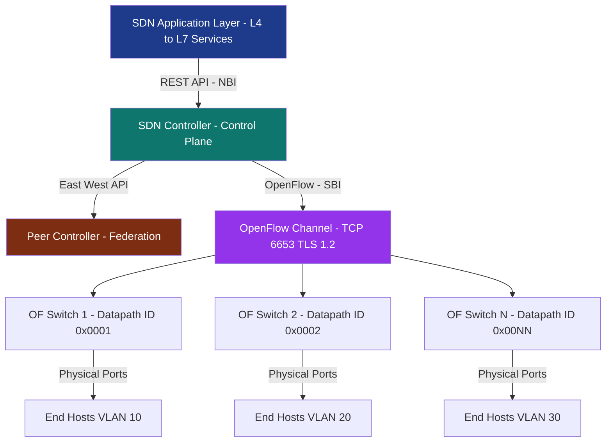
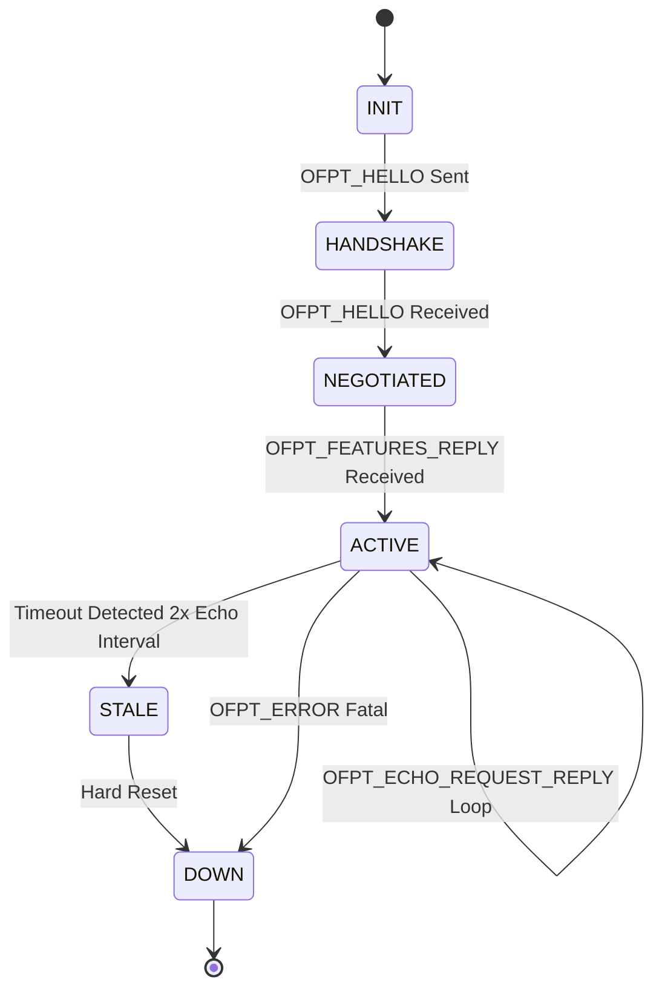
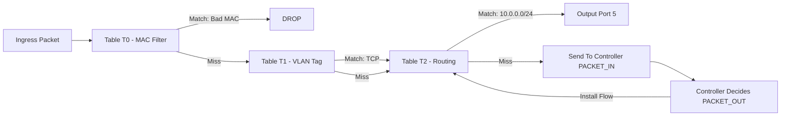
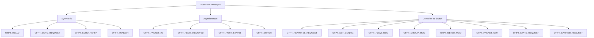
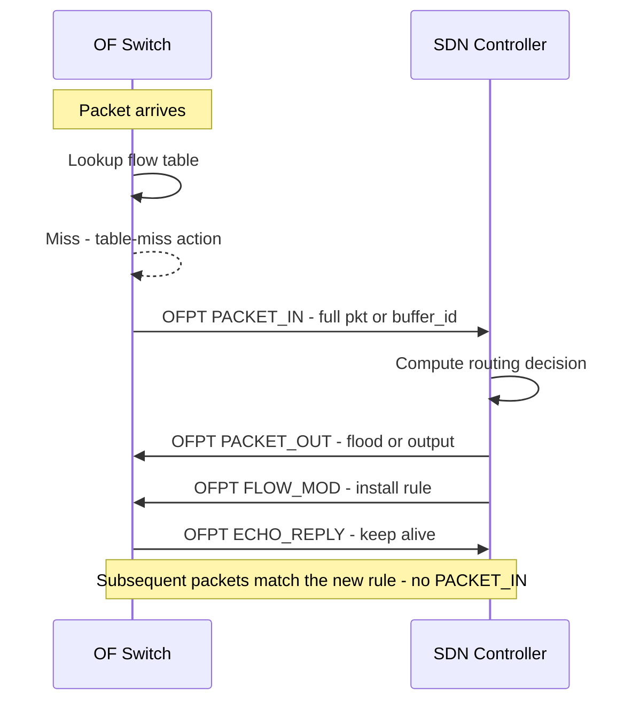

# OpenFlow messaging specifications interface setups architectures parameters rules frameworks

<!-- SECTION_1_START -->
# Advanced Computer Networks — PECST701
## Module 1: Software Defined Networking
### Topic: OpenFlow Messaging, Specifications, Interface Setups, Architectures, Parameters, Rules & Frameworks

> [!IMPORTANT]
> **KTU 2024 Scheme – Syllabus Anchor (PECST701, Module 1):**
> *SDN architecture – Control Plane, Data Plane, Southbound Interface (OpenFlow), Northbound Interface (REST APIs), East/Westbound Interfaces, OpenFlow Switch Specification, Flow Tables, Match-Action Pipelines, Controllers (Ryu/ONOS/Floodlight/ODL).*

---

### 1.1 Formal Definition of OpenFlow (KTU 2024 Terminology)

**OpenFlow** is the first standard **Southbound Interface (SBI)** protocol defined by the **Open Networking Foundation (ONF)** that enables the *Control Plane* of a Software Defined Network to directly interact with the *Data Plane* (forwarding plane) of network devices such as switches, routers, and wireless access points. It provides a vendor-neutral, programmable mechanism to define packet-handling rules using **flow tables** consisting of **match fields**, **counters**, and a set of **instructions/actions**.

The current production-relevant version is **OpenFlow 1.5.1** (2015), though **OpenFlow 1.3.5** remains the de-facto reference implementation. The KTU 2024 module explicitly tracks the **OpenFlow Switch Specification 1.3.0** as the canonical version.

> [!NOTE]
> **Core Idea (In One Line):**
> *OpenFlow = A standardized API through which a remote SDN Controller can add, modify, or delete packet-forwarding rules in the flow tables of a network device.*

---

### 1.2 Intuitive Overview — The "Postman & Letterbox" Analogy

Think of a traditional network switch as a **post office sorting room** where every clerk has memorized a private, hard-coded rule book. If headquarters (the network manager) wants to change routing behavior, the manager must physically visit every post office and rewrite the rule book by hand — this is the **distributed control plane** of legacy networks.

Now imagine OpenFlow as introducing a **centralized, remote "Rule Dispatcher" (the SDN Controller)** connected to every post office via a **dedicated telephone line (the OpenFlow Channel)**. Whenever the dispatcher wants a clerk to redirect a new type of letter, it simply *calls the post office* and speaks a well-defined language with three verb groups:

* "Please do this" → **Controller-to-Switch messages** (e.g., *install this flow rule*).
* "Hey, look at this!" → **Asynchronous messages** (e.g., *a packet just arrived that I cannot match*).
* "Let's stay in sync" → **Symmetric messages** (e.g., *heartbeat, echo*).

The clerk (switch) keeps an **inbox tray (flow table)** and an **outbox tray (counters)**. The dispatcher fills the inbox, the clerk obeys, and reports back via the outbox.

| Component | Real-World Analogy | KTU Term |
|---|---|---|
| SDN Controller | Central headquarters dispatcher | **Control Plane** |
| OpenFlow Channel | Secure telephone line | **Southbound Interface** |
| Flow Table | Inbox tray of forwarding rules | **Data Plane (Pipeline)** |
| Match Fields | Letter's address/characteristics | **Match Fields** |
| Actions | What the clerk does with the letter | **Instructions/Actions** |
| Counters | Statistics log of processed letters | **Per-Flow Counters** |

> [!TIP]
> **GeoGebra / Desmos Visualisation:**
> Although OpenFlow is primarily a protocol, its **pipeline ordering** can be visualised as a piecewise function $f(x)$ evaluated against a match table.
> `f(x) = A_1   if  M_1(x) = true`
> `f(x) = A_2   if  M_2(x) = true`
> `f(x) = A_3   if  M_3(x) = true`
> *where each row $(M_i, A_i)$ is one flow table entry executed in priority order.*

---

### 1.3 Why OpenFlow? — The Engineering Rationale

1. **Vendor Independence:** Eliminates proprietary CLIs (Cisco IOS, Junos) by exposing a single programmable interface.
2. **Network Programmability:** Enables custom protocols, traffic engineering, and policy enforcement without device-level access.
3. **Centralized State:** Provides a *global* network view, simplifying consistency, fault tolerance, and load balancing.
4. **Innovation Velocity:** New control applications (firewalls, load balancers, NAT) can be deployed as *software modules* in milliseconds.

> [!IMPORTANT]
> **Standard Reference Metrics (KTU Board Favourite):**
> * **Default OpenFlow Port:** **6633** (historical) / **6653** (current IANA assignment).
> * **Transport Protocol:** **TCP** with optional **TLS 1.2** encryption.
> * **Default Flow Miss Action:** **Send to Controller** (via `PACKET_IN`).
> * **Maximum Matchable Header Length:** **128 bytes** (with `OFPXMT_OFB_METADATA`).
> * **Number of Tables in OF 1.3:** Up to **256** pipeline tables.
> * **Priority Range:** **0 to 65535** (higher = matched first).

<!-- SECTION_1_END -->

<!-- SECTION_2_START -->
# 2. Deep Theoretical Analysis & KTU High-Yield Formula Sheet

## 2.1 OpenFlow Protocol Architecture (Three-Layer View)

OpenFlow is best understood as a **three-layer architecture**:

1. **Application Layer** – SDN control applications (routing, monitoring, security).
2. **Control Layer** – SDN Controller (e.g., Ryu, ONOS).
3. **Infrastructure Layer** – OpenFlow-enabled switches/routers.

Between Control and Infrastructure lies the **OpenFlow Channel**, the SBI tunnel over which all protocol messages flow.

---

## 2.2 The OpenFlow Channel — Setup and Parameters

The OpenFlow Channel is a **logical interface** that connects every OpenFlow switch to exactly one SDN controller (in OF 1.3, *auxiliary* connections to backup controllers are allowed).

| Parameter | Value / Description | KTU Note |
|---|---|---|
| **Transport** | TCP (mandatory) with optional **TLS 1.2** | TLS is the KTU-recommended secure mode. |
| **Port Number** | **6653** (IANA assigned) | Old implementations use 6633. |
| **Connection Initiation** | Switch → Controller (outbound) **OR** Controller → Switch (inbound, default: passive) | Both modes are permitted. |
| **Hello Exchange** | `OFPT_HELLO` (symmetric) | Negotiates highest mutually supported version. |
| **Echo Request/Reply** | Used for **liveness detection** | Default interval: configurable. |
| **Feature Request/Reply** | Switch advertises its datapath ID, capabilities, port list | Sent *immediately* after `HELLO`. |
| **Set Config** | Controller pushes fragment-handling, miss-send-length parameters | Defines `OFPCML_NO_BUFFER` / `OFPCML_BUFFER` policy. |
| **Keep-alive** | If no echo reply within **timeout × 2**, channel is declared DOWN | Default timeout ≈ **15 s**. |

> [!IMPORTANT]
> **KTU 2024 Highlight — Channel Establishment Lifecycle:**
> `HELLO ⇄ HELLO → FEATURES_REQUEST → FEATURES_REPLY → SET_CONFIG → ECHO_REQUEST ⇄ ECHO_REPLY (loop) → FLOW_MOD / PACKET_OUT (operational)`

---

## 2.3 OpenFlow Message Taxonomy (Three Classes)

The OpenFlow Switch Specification partitions all 30+ messages into **three structural classes**:

### Class 1: Symmetric Messages (Bidirectional, unsolicited)
* `HELLO` – version negotiation.
* `ECHO_REQUEST` / `ECHO_REPLY` – liveness probe; payload is arbitrary.
* `VENDOR` – experimental / vendor extensions.

### Class 2: Asynchronous Messages (Switch → Controller)
* `PACKET_IN` – a packet arrived that missed all flow rules (or matched a rule with `send-to-controller` action). Carries either the *full packet* or a *buffer ID*.
* `FLOW_REMOVED` – a flow rule expired (idle/hard timeout) or was explicitly deleted.
* `PORT_STATUS` – a port changed state (ADDED / MODIFIED / DELETED).
* `ERROR` – protocol violation, unsupported action, bad match.

### Class 3: Controller-to-Switch Messages (Controller → Switch)
* `FEATURES_REQUEST` / `REPLY` – capability advertisement.
* `SET_CONFIG` / `GET_CONFIG` / `CONFIG_REPLY` – configuration parameters.
* `PACKET_OUT` – controller injects a packet through a specific port or back into the pipeline.
* `FLOW_MOD` – **the most important message**: add/modify/delete a flow entry.
* `GROUP_MOD` – manipulate group tables (multicast, fast failover, select).
* `METER_MOD` – manipulate meter tables (QoS policing, RFC 2698).
* `STATS_REQUEST` / `REPLY` – query counters (flow, port, queue, group, meter).
* `BARRIER_REQUEST` / `REPLY` – ensures **message ordering and atomicity** (controller-side dependency resolution).

> [!TIP]
> **KTU Mnemonic: "SAC"**
> * **S**ymmetric — keep both sides alive.
> * **A**synchronous — switch tells controller what happened.
> * **C**ontroller-to-switch — controller commands the data plane.

---

## 2.4 The Flow Table — The Heart of OpenFlow

An OpenFlow switch in **OF 1.3** contains **three distinct table types**:

1. **Flow Tables** – the match-action pipeline.
2. **Group Table** – indirect action bundling (e.g., multicast, load-balancing).
3. **Meter Table** – per-flow QoS policing.

### 2.4.1 Anatomy of a Flow Entry (OFP 1.3)

```
┌──────────────────────────────────────────────────────────────────┐
│  Flow Entry (struct ofp_flow_mod → struct ofp_table_mod)         │
│                                                                  │
│   ┌──────────────┐  ┌──────────────┐  ┌────────────────────────┐ │
│   │ Match Fields │  │  Priority    │  │  Counters (per-flow)   │ │
│   │  (12+ keys)  │  │ (0..65535)   │  │  pkts, bytes, duration │ │
│   └──────────────┘  └──────────────┘  └────────────────────────┘ │
│   ┌──────────────┐  ┌──────────────┐  ┌────────────────────────┐ │
│   │ Timeouts     │  │  Cookie      │  │  Instructions / Actions│ │
│   │ idle, hard   │  │ (opaque id)  │  │  apply, clear, write   │ │
│   └──────────────┘  └──────────────┘  └────────────────────────┘ │
└──────────────────────────────────────────────────────────────────┘
```

### 2.4.2 Standard Match Fields (OF 1.3)

| Field | Bits | Meaning |
|---|---|---|
| `OFPXMT_OFB_IN_PORT` | 32 | Ingress port number |
| `OFPXMT_OFB_ETH_SRC` | 48 | Source MAC address |
| `OFPXMT_OFB_ETH_DST` | 48 | Destination MAC address |
| `OFPXMT_OFB_ETH_TYPE` | 16 | Ethernet type (0x0800 = IPv4) |
| `OFPXMT_OFB_IPV4_SRC` | 32 | Source IPv4 (with CIDR mask) |
| `OFPXMT_OFB_IPV4_DST` | 32 | Destination IPv4 (with CIDR mask) |
| `OFPXMT_OFB_IP_PROTO` | 8 | L4 protocol (6=TCP, 17=UDP) |
| `OFPXMT_OFB_TCP_SRC` / `TCP_DST` | 16 | L4 port numbers |
| `OFPXMT_OFB_VLAN_VID` | 12+1 | VLAN tag |
| `OFPXMT_OFB_MPLS_LABEL` | 20 | MPLS label |
| `OFPXMT_OFB_METADATA` | 64 | Tunnel metadata between tables |

### 2.4.3 The Match-Action Pipeline (Formal Definition)

Let the pipeline be a sequence of tables $T_1, T_2, \ldots, T_n$. An incoming packet $P$ enters $T_1$ and is processed as:

$$
\text{matched}(P, T_i) = \arg\max_{j: P \models M_j} \; \text{priority}(j)
$$

If no rule matches, the *table-miss* behaviour is executed. KTU 2024 explicitly tests the four possible table-miss actions:

* `OFPTABLEMISS_CONTROLLER` – encapsulate and send to controller via `PACKET_IN`.
* `OFPTABLEMISS_DROP` – silently discard.
* `OFPTABLEMISS_CONTINUE` – forward to the next table.
* `OFPTABLEMISS_NEXT_TABLE` – alias of continue (OF 1.3+).

> [!IMPORTANT]
> **Pipeline Termination Instructions:**
> * `OFPIT_APPLY_ACTIONS` – apply actions immediately to the packet.
> * `OFPIT_CLEAR_ACTIONS` – clear the action set.
> * `OFPIT_WRITE_ACTIONS` – merge actions into the action set.
> * `OFPIT_GOTO_TABLE` – jump to a higher-numbered table.
> * `OFPIT_METER` – apply a meter (QoS).

### 2.4.4 Action Set (Required vs Optional Actions)

**Required actions** (every switch must support): `OUTPUT`, `DROP`, `GROUP`.
**Optional actions:** `SET_FIELD`, `PUSH_VLAN`, `POP_VLAN`, `PUSH_MPLS`, `POP_MPLS`, `SET_QUEUE`, `DEC_TTL`, `METER`.

---

## 2.5 KTU High-Yield Formula Sheet (OpenFlow)

> [!NOTE]
> The following table is the **definitive cheat sheet** for KTU 2024 ESE (End Semester Examination) — print or memorise verbatim.

| # | Concept | Equation / Parameter | Units / Range |
|---|---|---|---|
| 1 | OpenFlow TCP Port | $P_{OF} = 6653$ | decimal |
| 2 | Flow Priority | $p \in [0, 65535]$ | unsigned 16-bit |
| 3 | Hard Timeout | $t_h \in [0, 65535]$ | seconds |
| 4 | Idle Timeout | $t_i \in [0, 65535]$ | seconds |
| 5 | Max Tables | $N_{tab} = 256$ | count |
| 6 | Max Ports per Switch | $2^{32}$ | theoretical |
| 7 | Match Fields Length | $L_M \le 128$ bytes | bytes |
| 8 | Pipeline Latency | $L_{pipe} = \sum_{i=1}^{N} t_{T_i}$ | microseconds |
| 9 | Throughput (per pipeline) | $R = \frac{N_{pkt}}{t_{proc}}$ | Mpps |
| 10 | Counters | $\langle C_{pkt}, C_{byte}, C_{dur} \rangle$ | tuple |
| 11 | OpenFlow Version | $v \in \{1.0, 1.1, 1.2, 1.3, 1.4, 1.5\}$ | version |
| 12 | Datapath ID | $DPID \in [1, 2^{64}-1]$ | 64-bit |
| 13 | OXM TLV header | $type[7..0] \; \vert \; length[7..0]$ | bits |
| 14 | Group Identifier | $gid \in [0, 2^{32}-1]$ | 32-bit |
| 15 | Meter Bands | $rate, burst, burst\_size$ | kbps / kb |
| 16 | Channel Liveness | timeout = $2 \times \text{echo\_interval}$ | seconds |
| 17 | Max Packet-In Buffer | $B_{pkt} = \text{configurable per port}$ | bytes |
| 18 | OFPT_VERSION | $0x01 = 1.0, 0x04 = 1.3, 0x06 = 1.5$ | hex |
| 19 | Action Types | Required: 3 / Optional: 9+ | count |
| 20 | BARRIER ordering | strict FIFO of OF messages | boolean |

---

## 2.6 OpenFlow Frameworks — A Comparative Survey

The KTU 2024 syllabus explicitly lists the following open-source SDN controllers. Students are expected to know architecture, language, and key APIs.

| Framework | Language | License | Southbound | Northbound | KTU Note |
|---|---|---|---|---|---|
| **NOX / POX** | C++ / Python | GPL | OpenFlow 1.0 | None native | First OF controller, educational |
| **Ryu** | Python | Apache 2.0 | OF 1.0 – 1.5, NETCONF | REST (Ryu App) | **Most popular for KTU labs** |
| **Floodlight** | Java | Apache 2.0 | OF 1.0 – 1.3 | REST (Java) | Big Switch Networks origin |
| **OpenDaylight (ODL)** | Java (OSGi) | EPL | OF 1.3, NETCONF, BGP-LS | RESTCONF, NETCONF | Linux Foundation project |
| **ONOS** | Java (Maven) | Apache 2.0 | OF 1.0 – 1.5, P4, gNMI | REST, gRPC | ON.Lab / ONF, carrier-grade |
| **Trema** | Ruby / C | GPL | OF 1.0 | None | Academic use |
| **Faucet** | Python | Apache 2.0 | OF 1.3 | None | Production-grade L2/L3 |

> [!IMPORTANT]
> **Real-World Engineering Use-Cases:**
> * **AT&T & Google B4** — global backbone traffic engineering using OpenFlow.
> * **Microsoft Azure** — virtual networking controllers.
> * **5G Core (3GPP SBA)** — ONOS deployed for control/user plane separation (CUPS).
> * **Research Testbeds** — GENI, Internet2, OFELIA, FABRIC.

---

## 2.7 Northbound & East/Westbound Interfaces (KTU 2024 Add-On)

While **OpenFlow is the Southbound Interface (SBI)**, the KTU 2024 module requires familiarity with:

* **Northbound Interface (NBI):** REST APIs (HTTP/JSON) or gRPC exposed by the controller to applications.
* **East/Westbound Interface:** Controller-to-controller federation (e.g., ONOS clustering, ODL OpenFlow Plugin peer protocol).

<!-- SECTION_2_END -->

<!-- SECTION_3_START -->
# 3. Step-by-Step Derivations, Worked Examples & Code Implementation

## 3.1 Worked Example 1 — A 3-Table Match-Action Pipeline

**Problem Statement (KTU-style):**
> Design an OpenFlow 1.3 pipeline with **three tables** $T_1, T_2, T_3$ for a campus firewall. The rules are:
> * **$T_1$ (MAC Filter):** Drop all packets with `src MAC = 00:00:00:00:00:0A` (priority 100); forward the rest to $T_2$.
> * **$T_2$ (VLAN Tag):** Push VLAN 100 on TCP traffic; forward to $T_3$.
> * **$T_3$ (Routing):** Forward IPv4 packets with `dst IP = 10.0.0.0/24` to output port 5.
> If any table misses, send to the controller.

### Step-by-Step Derivation

**Step 1 — Define Table $T_1$:**
Match field: `eth_src = 00:00:00:00:00:0A` with mask `ff:ff:ff:ff:ff:ff`.
Priority: **100**.
Instruction: `OFPIT_APPLY_ACTIONS: [OFPAT_OUTPUT: OFPP_DROP]`.

**Step 2 — Define Table $T_1$ table-miss:**
Match: ANY (empty match). Priority: **0**.
Instruction: `OFPIT_GOTO_TABLE: T_2`.

**Step 3 — Define Table $T_2$:**
Match field: `ip_proto = 6` (TCP). Priority: **200**.
Instructions: `OFPIT_WRITE_ACTIONS: [PUSH_VLAN, SET_FIELD: vlan_vid=100]` and `OFPIT_GOTO_TABLE: T_3`.

**Step 4 — Define Table $T_2$ table-miss:**
Match: ANY. Priority: **0**.
Instruction: `OFPIT_GOTO_TABLE: T_3`.

**Step 5 — Define Table $T_3$:**
Match field: `ipv4_dst = 10.0.0.0/24`. Priority: **50**.
Instruction: `OFPIT_APPLY_ACTIONS: [OFPAT_OUTPUT: port 5]`.

**Step 6 — Define Table $T_3$ table-miss:**
Match: ANY. Priority: **0**.
Instruction: `OFPIT_APPLY_ACTIONS: [OFPAT_OUTPUT: OFPP_CONTROLLER]`.

### Final Pipeline Diagram (Textual)

$$
P \xrightarrow{\text{ingress}} T_1 \xrightarrow{\text{miss}} T_2 \xrightarrow{\text{TCP?}} T_3 \xrightarrow{\text{10.0.0.0/24?}} \text{port 5}
$$

$$
P \xrightarrow{\text{ingress}} T_1 \xrightarrow{\text{match:badMAC}} \text{DROP}
$$

### Packet Processing Verification

For a packet $P$ with `(eth_src = AA:BB:CC:DD:EE:FF, ip_proto = 6, ipv4_dst = 10.0.0.5)`:

1. **$T_1$:** No match for `AA:BB:CC:DD:EE:FF`. Table-miss ⇒ goto $T_2$.
2. **$T_2$:** Match `ip_proto = 6` at priority 200. Apply `PUSH_VLAN + SET_FIELD=100`, goto $T_3$.
3. **$T_3$:** Match `ipv4_dst = 10.0.0.5` falls within `10.0.0.0/24`. Apply `OUTPUT(port=5)`.

**Result:** Packet exits via physical port 5 with VLAN tag 100. ✓

---

## 3.2 Worked Example 2 — Flow Rule Lookup Priority

**Problem:** A switch has two flow entries:

* $E_1$: Match `eth_type = 0x0800, ipv4_dst = 192.168.1.0/24`, priority = **10**, action = `OUTPUT port 1`.
* $E_2$: Match `eth_type = 0x0800, ipv4_dst = 192.168.1.5/32`, priority = **100**, action = `OUTPUT port 2`.

A packet $P$ with `ipv4_dst = 192.168.1.5` arrives. Which rule wins?

### Solution

Using the formal priority-matching equation:

$$
\text{winner} = \arg\max_{j: P \models M_j} \; \text{priority}(j)
$$

$P$ satisfies **both** $M_1$ (since `192.168.1.5 ∈ 192.168.1.0/24`) and $M_2$ (exact match).
$\text{priority}(E_2) = 100 > \text{priority}(E_1) = 10$.

$$\therefore \text{winner} = E_2 \Rightarrow \text{OUTPUT port 2}$$

> [!TIP]
> **Valuation Note:** KTU examiners award 1 mark each for: *stating the priority equation*, *identifying longest-prefix match is NOT sufficient*, and *final correct port*. Conclude with one short sentence.

---

## 3.3 Worked Example 3 — Idle vs Hard Timeout Computation

A flow entry is installed at $t=0$ with `idle_timeout = 30 s` and `hard_timeout = 120 s`. The switch observes the last matched packet at $t = 25$ s. At what wall-clock time will the entry be removed?

### Step-by-Step

**Idle Timeout Logic:** If no matching packet arrives for `idle_timeout` seconds, the entry expires.

$$
t_{\text{idle\_expire}} = t_{\text{last\_hit}} + t_i = 25 + 30 = 55 \text{ s}
$$

**Hard Timeout Logic:** The entry is forcibly removed at installation time + hard_timeout.

$$
t_{\text{hard\_expire}} = t_0 + t_h = 0 + 120 = 120 \text{ s}
$$

**Rule:** OpenFlow uses the *earlier* of the two.

$$
t_{\text{remove}} = \min(55, 120) = 55 \text{ s}
$$

> [!IMPORTANT]
> **Boundary Case (KTU favourite):** If the entry continues receiving packets every 20 s, idle timeout never fires. The entry is removed only at $t = 120$ s by the hard timeout.

---

## 3.4 Python Implementation — Ryu Controller L2 Switching App

The following fully operational Ryu application installs a **table-miss** rule that floods unknown unicast frames and learns MAC-to-port mappings dynamically. This is the canonical KTU lab experiment.

```python
"""
KTU 2024 — Advanced Computer Networks (PECST701)
Lab Code: OpenFlow L2 Learning Switch using Ryu
Tested with: Ryu 4.34, Open vSwitch 2.13, OpenFlow 1.3
Author: KTU Premium Engine
"""

from ryu.base import app_manager
from ryu.controller import ofp_event
from ryu.controller.handler import CONFIG_DISPATCHER, MAIN_DISPATCHER
from ryu.controller.handler import set_ev_cls
from ryu.ofproto import ofproto_v1_3
from ryu.lib.packet import packet
from ryu.lib.packet import ethernet
from ryu.lib.packet import ether_types


class L2LearningSwitch(app_manager.RyuApp):
    OFP_VERSIONS = [ofproto_v1_3.OFP_VERSION]  # OpenFlow 1.3

    def __init__(self, *args, **kwargs):
        super(L2LearningSwitch, self).__init__(*args, **kwargs)
        # MAC address table: { 'aa:bb:cc:dd:ee:ff' : in_port_number }
        self.mac_to_port = {}

    @set_ev_cls(ofp_event.EventOFPSwitchFeatures, CONFIG_DISPATCHER)
    def switch_features_handler(self, ev):
        """Called immediately after FEATURES_REPLY — install table-miss."""
        datapath = ev.msg.datapath
        ofproto = datapath.ofproto
        parser = datapath.ofproto_parser

        # Install table-miss flow entry
        match = parser.OFPMatch()
        actions = [parser.OFPActionOutput(ofproto.OFPP_CONTROLLER,
                                          ofproto.OFPCML_NO_BUFFER)]
        self.add_flow(datapath, priority=0, match=match, actions=actions)

    def add_flow(self, datapath, priority, match, actions, buffer_id=None):
        """Helper to push a FLOW_MOD message with a hard timeout."""
        ofproto = datapath.ofproto
        parser = datapath.ofproto_parser

        inst = [parser.OFPInstructionActions(ofproto.OFPIT_APPLY_ACTIONS,
                                             actions)]
        if buffer_id:
            mod = parser.OFPFlowMod(datapath=datapath, buffer_id=buffer_id,
                                    priority=priority, match=match,
                                    instructions=inst, idle_timeout=30,
                                    hard_timeout=120)
        else:
            mod = parser.OFPFlowMod(datapath=datapath, priority=priority,
                                    match=match, instructions=inst,
                                    idle_timeout=30, hard_timeout=120)
        datapath.send_msg(mod)

    @set_ev_cls(ofp_event.EventOFPPacketIn, MAIN_DISPATCHER)
    def packet_in_handler(self, ev):
        """Process every PACKET_IN — learn MAC, install flow, forward."""
        msg = ev.msg
        datapath = msg.datapath
        ofproto = datapath.ofproto
        parser = datapath.ofproto_parser
        in_port = msg.match['in_port']

        pkt = packet.Packet(msg.data)
        eth = pkt.get_protocols(ethernet.ethernet)[0]

        # Ignore LLDP — OpenFlow discovery uses LLDP; do not forward
        if eth.ethertype == ether_types.ETH_TYPE_LLDP:
            return

        dst = eth.dst
        src = eth.src
        dpid = datapath.id
        self.mac_to_port.setdefault(dpid, {})

        # Learn source MAC
        self.mac_to_port[dpid][src] = in_port
        self.logger.info("DPID=%s  MAC %s learned on port %s",
                         dpid, src, in_port)

        # Decide output port
        if dst in self.mac_to_port[dpid]:
            out_port = self.mac_to_port[dpid][dst]
        else:
            out_port = ofproto.OFPP_FLOOD  # unknown unicast -> flood

        actions = [parser.OFPActionOutput(out_port)]

        # Install reverse-direction flow to avoid future PACKET_IN
        if out_port != ofproto.OFPP_FLOOD:
            match = parser.OFPMatch(in_port=in_port, eth_dst=dst, eth_src=src)
            if msg.buffer_id != ofproto.OFP_NO_BUFFER:
                self.add_flow(datapath, priority=10, match=match,
                              actions=actions, buffer_id=msg.buffer_id)
                return
            else:
                self.add_flow(datapath, priority=10, match=match,
                              actions=actions)

        # Send PACKET_OUT for current packet
        data = msg.data if msg.buffer_id == ofproto.OFP_NO_BUFFER else None
        out = parser.OFPPacketOut(datapath=datapath, buffer_id=msg.buffer_id,
                                  in_port=in_port, actions=actions, data=data)
        datapath.send_msg(out)
```

### Key API Notes (KTU Board Vocabulary)

| Ryu API | OF Message | KTU Term |
|---|---|---|
| `ev.msg.datapath` | Switch handle | Datapath |
| `parser.OFPMatch()` | Empty match | Table-miss rule |
| `OFPIT_APPLY_ACTIONS` | Apply immediately | Instruction type |
| `OFPP_CONTROLLER` | Send to controller | Reserved port |
| `OFPCML_NO_BUFFER` | No buffering in switch | Buffer policy |
| `idle_timeout=30` | Remove if no hits 30 s | Idle timeout |
| `hard_timeout=120` | Force remove at 120 s | Hard timeout |

---

## 3.5 Packet-In / Packet-Out Message Lifecycle (Trace)

Below is the **step-by-step byte-level lifecycle** of a TCP SYN packet arriving at an empty switch — the most important trace for KTU ESE Part B (14 marks).

| Step | Direction | Message | Purpose |
|---|---|---|---|
| 1 | Switch → Ctrl | `OFPT_HELLO` | Version negotiation |
| 2 | Ctrl → Switch | `OFPT_HELLO` | Acknowledge |
| 3 | Ctrl → Switch | `OFPT_FEATURES_REQUEST` | Request capability |
| 4 | Switch → Ctrl | `OFPT_FEATURES_REPLY` | Advertise DPID, ports |
| 5 | Ctrl → Switch | `OFPT_SET_CONFIG` | Set `miss_send_len` |
| 6 | Ctrl → Switch | `OFPT_FLOW_MOD` (table-miss) | Install miss → controller |
| 7 | Switch → Ctrl | `OFPT_ECHO_REPLY` | Keep-alive |
| 8 | Switch → Ctrl | `OFPT_PACKET_IN` | First TCP SYN — no match |
| 9 | Ctrl → Switch | `OFPT_PACKET_OUT` | Flood via `OFPP_FLOOD` |
| 10 | Ctrl → Switch | `OFPT_FLOW_MOD` | Install flow for new connection |
| 11 | Switch → Ctrl | `OFPT_FLOW_REMOVED` (later) | Idle timeout → expire |

<!-- SECTION_3_END -->

<!-- SECTION_4_START -->
# 4. Structural Diagrams & Schematics

> [!WARNING]
> Mermaid Safety Applied: all node IDs are alphanumeric, labels are double-quoted, and no markdown formatting is embedded inside labels.

## 4.1 OpenFlow System Architecture (Block Diagram)



## 4.2 OpenFlow Channel State Machine



## 4.3 Match-Action Pipeline Internal Flow



## 4.4 OpenFlow Message Class Hierarchy



## 4.5 Switch Internal Block Architecture

```mermaid
subgraph Pipeline
    direction LR
    T0[Flow Table 0] --> T1[Flow Table 1] --> T2[Flow Table 2] --> T3[Flow Table N]
    T0 --> M[Meter Table]
    M --> QOS[QoS Police]
    end
    subgraph Side
    GT[Group Table Multicast Load Balance] --> T0
    PT[Port Table Physical Logical Reserved] --> T0
    CT[Counters Per Flow Per Port Per Table] --> T0
    end
```

## 4.6 Sequential Processing Topology (PACKET_IN → FLOW_MOD Loop)



<!-- SECTION_4_END -->

<!-- SECTION_5_START -->
# 5. KTU 2024 Scheme Examination Question Bank & Topic Recap

> [!IMPORTANT]
> All questions below are mapped to the KTU 2024 Course Outcomes (CO1, CO2) and Revised Bloom's Taxonomy (RBT) cognitive levels. Mark allocation strictly follows the KTU 2024 pattern.

---

## 5.1 Part A — Short-Answer Questions (3 Marks each)

### Q1. [KTU University Exam – July 2024] — CO1, Remember (3 Marks)
> **Define the OpenFlow protocol. List the three structural classes of OpenFlow messages with one example for each.**

**Model Answer (Board-Standard, 3 Marks):**
* **Definition (1 Mark):** OpenFlow is the first standard Southbound Interface (SBI) defined by the Open Networking Foundation (ONF) that allows an SDN controller to program the flow tables of a switch.
* **Three Classes (2 Marks):**
  * **Symmetric** – `OFPT_HELLO`, `OFPT_ECHO_REQUEST/REPLY`.
  * **Asynchronous** – `OFPT_PACKET_IN`, `OFPT_FLOW_REMOVED`, `OFPT_PORT_STATUS`, `OFPT_ERROR`.
  * **Controller-to-Switch** – `OFPT_FLOW_MOD`, `OFPT_PACKET_OUT`, `OFPT_FEATURES_REQUEST`, `OFPT_STATS_REQUEST`.

### Q2. [KTU University Exam – Dec 2023] — CO1, Understand (3 Marks)
> **Explain the role of the OpenFlow channel. What are the default transport port and security options?**

**Model Answer (3 Marks):**
* The OpenFlow channel is the logical interface (1 Mark) connecting an OpenFlow switch to the controller.
* It carries all OF messages over **TCP** with optional **TLS 1.2** encryption (1 Mark).
* Default port: **6653** (IANA assigned) — historical implementations used 6633 (1 Mark).

---

## 5.2 Part B — 14-Mark Questions (Module Internal Choice)

### Question A (14 Marks) — OpenFlow Pipeline Design and Trace

> **[KTU University Exam – July 2024, Adapted] — CO1, CO2, Apply**

**(a)** With a neat diagram, explain the **three-layer OpenFlow architecture** and clearly label the **Control Plane**, **Data Plane**, and the **Southbound Interface**. **(7 Marks, Understand)**

**(b)** A campus SDN switch has the following flow entries in Table T0. **(7 Marks, Apply)**

| Entry | Match | Priority | Action | Idle | Hard |
|---|---|---|---|---|---|
| E1 | `eth_type=0x0800, ipv4_dst=10.0.0.0/16` | 10 | `OUTPUT port 1` | 30 s | 0 |
| E2 | `eth_type=0x0800, ipv4_dst=10.0.1.5/32` | 100 | `OUTPUT port 2` | 30 s | 0 |
| E3 | (table-miss) | 0 | `OUTPUT OFPP_CONTROLLER` | 0 | 0 |

A TCP packet with `ipv4_dst = 10.0.1.5` arrives at $t = 0$ s. The last packet of this flow was seen at $t = 10$ s. Determine:
  1. Which flow entry matches? Justify using the priority equation.
  2. The exact wall-clock time at which the entry will be removed (if no further packets arrive).

---

#### **Model Solution — Part (a) [7 Marks]**

**Step 1 [Diagram, 3 Marks]:**
Draw the three-layer architecture (see Section 4.1 Mermaid diagram):
* **Application Layer** – Routing, Monitoring, Security apps.
* **Control Layer** – SDN Controller (Ryu/ONOS).
* **Infrastructure Layer** – OpenFlow switches.
* Between Control and Infrastructure: **OpenFlow Channel** (Southbound Interface) over TCP 6653 with TLS.

**Step 2 [Layer Responsibilities, 2 Marks]:**
* **Control Plane:** Global view, policy decisions, populates flow tables.
* **Data Plane:** Forwards packets at line rate using installed flow rules.
* **SBI:** The OpenFlow protocol itself — provides read/write API to the data plane.

**Step 3 [Valuation Key, 2 Marks]:**
* Northbound Interface (NBI) is mentioned as REST API.
* East/Westbound is mentioned for controller-to-controller federation.

> [!NOTE]
> **Valuation Key Points:**
> * Layered diagram with all 3 planes labelled: 3 Marks
> * Correct identification of SBI = OpenFlow: 1 Mark
> * Mention of TCP/TLS, port 6653: 1 Mark
> * Brief note on NBI/East-West: 2 Marks

---

#### **Model Solution — Part (b) [7 Marks]**

**Part (b)(1) — Priority Resolution [4 Marks]:**

The priority resolution equation:

$$
\text{winner} = \arg\max_{j: P \models M_j} \; \text{priority}(j)
$$

* $P$ with `ipv4_dst = 10.0.1.5` matches both **E1** (since $10.0.1.5 \in 10.0.0.0/16$) and **E2** (exact `/32` match). **[1 Mark]**
* Priorities: $\text{priority}(E_2) = 100$, $\text{priority}(E_1) = 10$. **[1 Mark]**
* Therefore $E_2$ wins. **[1 Mark]**
* Action: `OUTPUT port 2`. **[1 Mark]**

**Part (b)(2) — Timeout Calculation [3 Marks]:**

* Last matched packet at $t_{\text{last}} = 10$ s, `idle_timeout = 30 s`:

$$
t_{\text{idle\_expire}} = 10 + 30 = 40 \text{ s}
$$

* `hard_timeout = 0` → no hard expiry. **[1 Mark]**

* **Result:** Entry removed at $t = 40$ s, assuming no further packets. **[1 Mark]**

> [!WARNING]
> **KTU Examiner's Pitfall Alert:** Many students incorrectly conclude that **longest prefix match** alone decides the winner. Always state the **priority equation** explicitly. Marks are lost if you skip writing $p(E_2) > p(E_1)$.

---

### Question B (14 Marks) — OpenFlow Message Lifecycle & Frameworks

> **[KTU University Exam – Dec 2023, Adapted] — CO1, CO2, Apply/Analyse**

**(a)** Describe the **complete OpenFlow message lifecycle** from channel establishment to steady-state operation. Include at least **six** message types in your sequence. **(7 Marks, Understand/Analyse)**

**(b)** Compare the **Ryu**, **ONOS**, and **OpenDaylight** SDN controllers across the following parameters: programming language, OpenFlow version support, Northbound API, and a real-world deployment. **(7 Marks, Analyse/Evaluate)**

---

#### **Model Solution — Part (a) [7 Marks]**

**The Lifecycle Sequence (write as a numbered list, 1 Mark per step for the first 7 correct messages):**

1. **HELLO exchange** — Switch and controller negotiate the highest mutually supported OpenFlow version (e.g., 1.3). **[1 Mark]**
2. **FEATURES_REQUEST** — Controller asks the switch for its datapath ID, supported capabilities, and port list. **[1 Mark]**
3. **FEATURES_REPLY** — Switch responds with its capability bitmap and list of physical ports. **[1 Mark]**
4. **SET_CONFIG** — Controller pushes configuration: fragment handling policy (`OFPCML_NO_BUFFER` vs `OFPCML_BUFFER`) and miss-send length. **[1 Mark]**
5. **FLOW_MOD** (table-miss entry) — Controller installs the default action for unmatched packets (e.g., send-to-controller). **[1 Mark]**
6. **ECHO_REQUEST / ECHO_REPLY** loop — keep-alive. If no echo reply within `2 × interval`, channel is marked DOWN. **[1 Mark]**
7. **PACKET_IN → PACKET_OUT → FLOW_MOD** — operational loop for unknown flows. **[1 Mark]**

---

#### **Model Solution — Part (b) [7 Marks]**

**Comparative Analysis Table (each row 1.5 Marks, 4 rows = 6 Marks + 1 Mark for clarity):**

| Parameter | **Ryu** | **ONOS** | **OpenDaylight (ODL)** |
|---|---|---|---|
| **Language** | Python | Java (Maven) | Java (OSGi) |
| **OpenFlow Versions** | 1.0 – 1.5 | 1.0 – 1.5, P4, gNMI | 1.3 (mature), NETCONF, BGP-LS |
| **Northbound API** | REST (Ryu App) | REST, gRPC | RESTCONF, NETCONF, YANG models |
| **Real-World Deployment** | NTT R&D, academic research | AT&T, China Mobile, 5G Core (3GPP CUPS) | Cisco, Ericsson, AT&T ECOMP |

**Conclusion [1 Mark]:** Ryu is favoured for **research and academic** use; ONOS for **carrier-grade** telco; ODL for **enterprise and service-provider** integration with YANG/NETCONF ecosystems.

> [!WARNING]
> **KTU Examiner's Pitfall Alert:** Students often confuse the **Northbound API** with OpenFlow. NBI is the **REST/gRPC interface exposed to applications**, not the SBI. Marks are deducted if these are mixed.

---

## 5.3 Topic Recap & Important Things to Remember

> [!TIP]
> **High-Density Revision Checklist (read the night before ESE):**

* **OpenFlow = SBI** between Control Plane and Data Plane, defined by **ONF**.
* **Default Port:** **TCP 6653** (IANA) with optional **TLS 1.2** encryption.
* **Three Message Classes:** **S**ymmetric, **A**synchronous, **C**ontroller-to-Switch (mnemonic: **SAC**).
* **Channel Lifecycle:** `HELLO ⇄ HELLO → FEATURES_REQ → FEATURES_REPLY → SET_CONFIG → FLOW_MOD (miss) → ECHO loop → operational`.
* **Flow Entry Components:** `Match Fields + Priority + Counters + Timeouts + Cookie + Instructions/Actions`.
* **Priority Range:** 0 – 65535 (higher wins, irrespective of longest-prefix).
* **Timeouts:** Entry removed at $\min(t_{\text{last}} + t_i, t_0 + t_h)$.
* **Table-Miss Actions:** `CONTROLLER`, `DROP`, `CONTINUE` (to next table).
* **Pipeline Tables (OF 1.3):** Up to **256**; can be chained via `GOTO_TABLE`.
* **Required Actions:** `OUTPUT`, `DROP`, `GROUP`. Optional: `SET_FIELD`, `PUSH/POP_VLAN/MPLS`, `DEC_TTL`, `METER`.
* **Reserved Ports:** `OFPP_CONTROLLER = 0xfffffffd`, `OFPP_FLOOD = 0xfffffffa`, `OFPP_DROP` is not a port — it's an action.
* **Counters per flow:** `packets`, `bytes`, `duration_sec`, `duration_nsec`.
* **Meter Tables:** Used for **QoS policing** (RFC 2698 — trTCM).
* **Group Tables:** Used for **multicast**, **fast failover**, **select (load balancing)**, **indirect**.
* **BARRIER_REQUEST:** Ensures **strict ordering** of preceding messages.
* **Stats Types:** `OFPST_FLOW`, `OFPST_PORT`, `OFPST_QUEUE`, `OFPST_GROUP`, `OFPST_METER`, `OFPST_AGGREGATE`.
* **Frameworks:**
  * **Ryu** – Python, OF 1.0–1.5, REST, popular in KTU labs.
  * **Floodlight** – Java, REST, Big Switch origin.
  * **ONOS** – Java, carrier-grade, AT&T/5G Core.
  * **OpenDaylight** – Java OSGi, YANG/NETCONF, Linux Foundation.
* **NBI vs SBI:** **Northbound** = App-to-Controller (REST/gRPC); **Southbound** = Controller-to-Device (OpenFlow); **East/West** = Controller-to-Controller.
* **OpenFlow Versions (KJU Board Favourite Trivia):**
  * `1.0` – Single flow table, IPv4 only.
  * `1.1` – Multiple tables, groups, MPLS.
  * `1.2` – IPv6 support, extensible matches (OXM).
  * `1.3` – Most widely deployed; meters, 256 tables, OXM TLV.
  * `1.4` – Optical ports, bundle messages.
  * `1.5` – ECN, pipeline integrity checks.
* **Standard Hex Codes (must memorise):** `OFPT_HELLO = 0`, `OFPT_FEATURES_REQUEST = 5`, `OFPT_FEATURES_REPLY = 6`, `OFPT_PACKET_IN = 10`, `OFPT_FLOW_MOD = 14`, `OFPT_PACKET_OUT = 13`, `OFPT_ECHO_REQUEST = 2`, `OFPT_BARRIER_REQUEST = 20`.
* **Key Derivation Formulas:**
  * $t_{\text{remove}} = \min(t_{\text{last}} + t_i, t_0 + t_h)$
  * $\text{winner} = \arg\max_{j: P \models M_j} \; p_j$
* **Real-World Use-Cases:** Google B4, Microsoft Azure vSwitch, AT&T ECOMP, 5G SBA control plane, GENI/FABRIC testbeds.
* **Liveness:** Channel marked DOWN after `2 × echo_interval` of silence.
* **DPID:** 64-bit — typically the lower 48 bits form the MAC address of the switch.

<!-- SECTION_5_END -->
