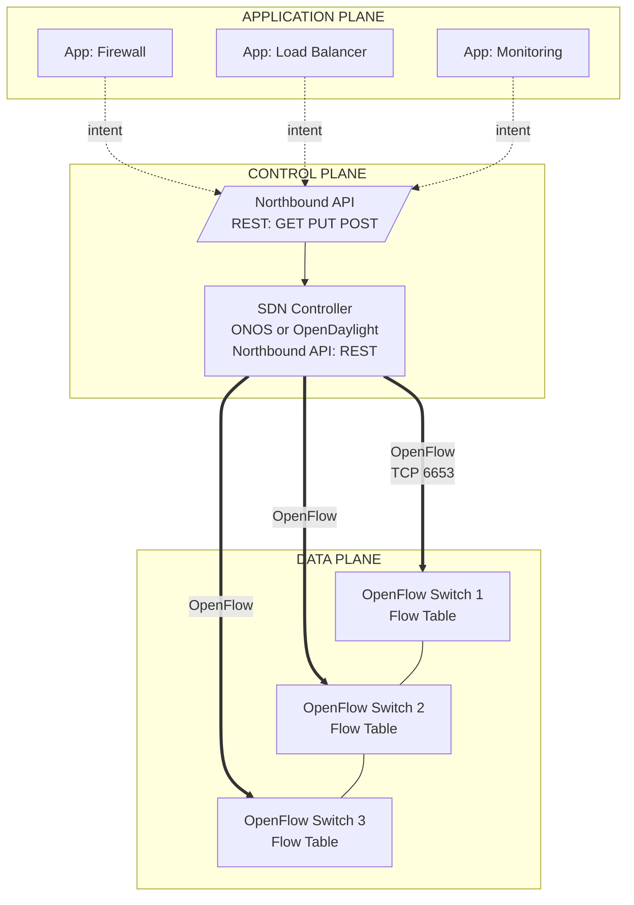
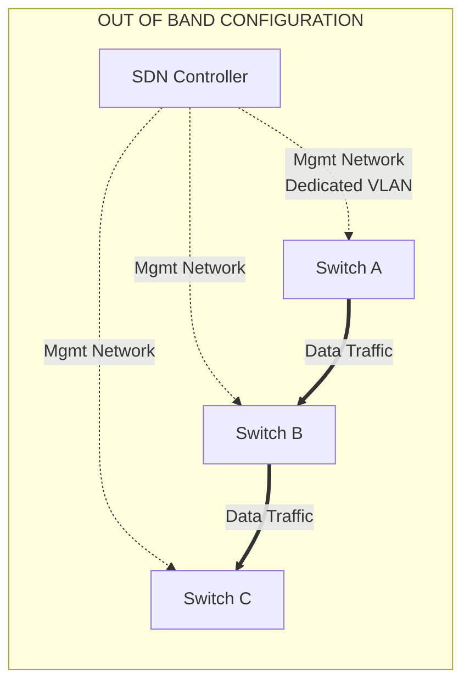
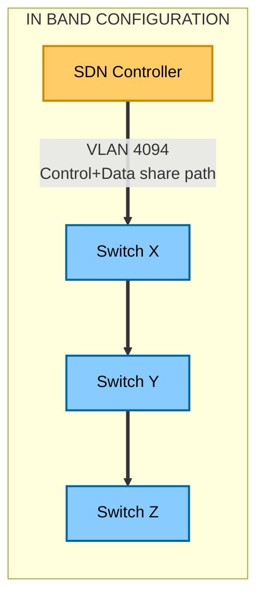
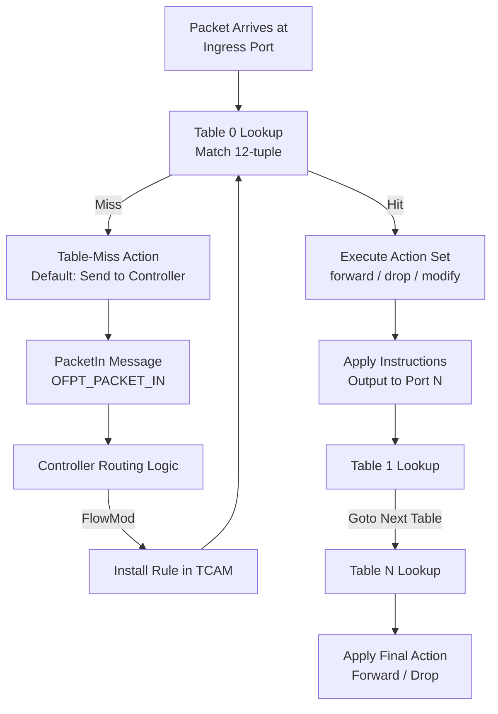
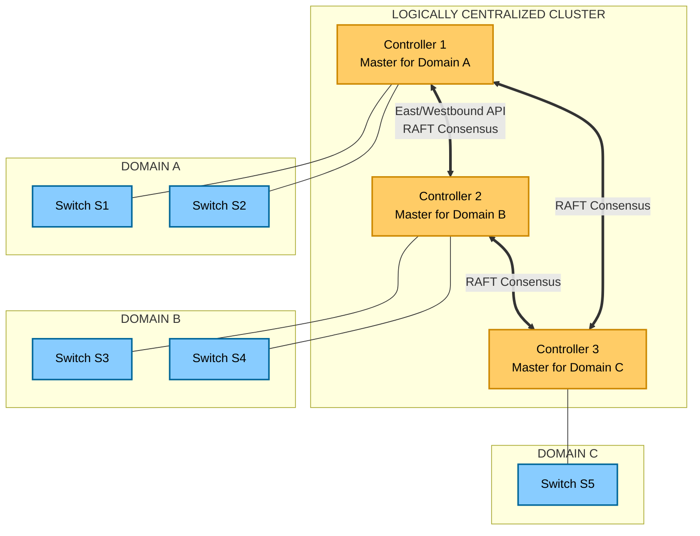

# Software Defined Networking (SDN) structural models control plane configurations

<!-- SECTION_1_START -->
# 1. Core Technical Definition & Intuitive Overview

## 1.1 Formal Academic Definition (KTU 2024 Syllabus Terminology)

**Software Defined Networking (SDN)** is a network architecture paradigm that decouples the **control plane** (which decides how traffic should be forwarded) from the **data plane** (which actually forwards the packets), enabling the network to be programmatically configured and managed through a logically centralized controller.

In the KTU 2024 Scheme definition (per *PECST701 - Advanced Computer Networks, Module 1*):

> [!IMPORTANT]
> **SDN** is a dynamic, manageable, cost-effective, and adaptable networking architecture in which the **forwarding state of network devices** is managed by a **logically centralized software entity** (the SDN Controller) using **standardized southbound APIs** (e.g., OpenFlow), while **network services and applications** interact with the controller via **northbound APIs** (e.g., REST).

The KTU syllabus explicitly categorizes SDN's structural models into three reference planes:

1. **Application Plane** – Business applications, orchestration tools, and network services.
2. **Control Plane** – The SDN controller and its northbound/southbound interfaces.
3. **Data Plane (Infrastructure Plane)** – The physical/virtual switches and routers that forward traffic.

Two additional well-defined interfaces connect these planes:
- **Northbound API (NBI):** Controller ↔ Applications.
- **Southbound API (SBI):** Controller ↔ Data plane devices.

## 1.2 Conceptual Analogy / Intuition

> [!NOTE]
> **Analogy — The Air Traffic Control Tower**
> Imagine an airport where each airplane (data packet) must land/take off via runways (switches). In a *traditional network*, every runway has its own private control tower with its own rules, leading to chaos and inefficient scheduling.
>
> In **SDN**, all individual towers are removed. A **single, central Air Traffic Control tower (SDN controller)** sits above the runways, receives radar data, and issues landing/takeoff instructions to all planes uniformly. Pilots (packets) follow the instructions sent via a standard radio frequency (**OpenFlow protocol**).
>
> The **pilots don't decide** which runway to use — the **central tower does**, dynamically. This is the essence of SDN: **centralized intelligence, distributed execution**.

### Geometric / Graphical Intuition
Picture a bipartite graph:
- **Top layer:** A single authoritative node (Controller).
- **Bottom layer:** $N$ switches $\rightarrow S_1, S_2, \ldots, S_N$.
- The controller has logical edges to every $S_i$ (control links), while the switches have physical edges to each other (data links).

This two-tier topology is the visual signature of SDN — control is *vertical*, data is *horizontal*.

## 1.3 Key Constants, Standards & Metrics

> [!IMPORTANT]
> **Industry-Standard SDN Metrics**
> - **OpenFlow version (current board-exam reference):** **OpenFlow 1.3 / 1.5** (standardized by **ONF — Open Networking Foundation**).
> - **Default flow table entry timeout:** **Idle timeout = 0** (no expiration), **Hard timeout = 0** (never expire) unless set otherwise.
> - **Standard southbound port (controller-to-switch):** **TCP port 6653** (IANA assigned).
> - **Key tuple that defines a flow:** the **12-tuple** matching fields (Ingress Port, Ethernet src/dst, VLAN, IPv4 src/dst, L4 src/dst port, IP protocol).

## 1.4 GeoGebra / Desmos Visualization Hint

> [!VISUALIZATION CONTROL]
> **Concept:** Bipartite SDN Control–Data Plane Topology
> **GeoGebra / Desmos Input (Implicit Graph):**
> * Points: $C(0, 5)$ (Controller), $S_1(-4, 0)$, $S_2(0, 0)$, $S_3(4, 0)$ (Switches)
> * Segments: $CS_1$, $CS_2$, $CS_3$ (control links), $S_1S_2$, $S_2S_3$ (data links)
> **Visual Description:** A 'Y' or fan-shaped graph where the top apex (controller) connects to all lower nodes, while the lower nodes also interconnect. The vertical edges are *control*, the horizontal edges are *data*.
<!-- SECTION_1_END -->

<!-- SECTION_2_START -->
# 2. Deep Theoretical Analysis & KTU High-Yield Formula Sheet

## 2.1 The Three Structural Models of SDN

KTU Module 1 specifically emphasizes three architectural models. The following is the **canonical explanation** expected in a 14-mark answer.

### 2.1.1 Model 1 — The ONF (Open Networking Foundation) Model

This is the **most widely tested** model in KTU exams.

| Plane | Component | Function |
|---|---|---|
| **Application Plane** | Apps, Orchestrators | Business logic, routing policy, ACLs |
| **Control Plane** | SDN Controller | Translates app intent into flow rules |
| **Data Plane** | OpenFlow Switches | Forwards packets based on flow tables |

- **Northbound API:** REST (Representational State Transfer) — used by apps to talk to the controller.
- **Southbound API:** **OpenFlow** — used by controller to program the switches.
- **East/Westbound API:** Between controllers in multi-domain setups (used for federation).

### 2.1.2 Model 2 — The Distributed Control Plane Model

Used in large-scale service-provider networks where a single controller is a bottleneck. The control plane is **physically distributed** but **logically centralized** (e.g., **ONOS — Open Network Operating System**).

Key principle: Each controller node owns a subset of devices, but the **cluster maintains a globally consistent network view** through consensus algorithms like **Raft**.

### 2.1.3 Model 3 — The Hybrid/Overlay Model

Combines traditional distributed routing (OSPF, BGP) with SDN programmability. Common in **data center fabrics (VXLAN + EVPN + SDN controller)**. The SDN controller programs only the **edge devices**, while the core remains conventional.

## 2.2 Control Plane Configurations — Operational Logic

A "control plane configuration" defines **how the SDN controller is set up, scaled, and connected to data plane devices.** KTU Module 1 tests four configurations:

1. **Single Controller / Single Switch** — Lab/tutorial setup.
2. **Single Controller / Multiple Switches (Out-of-Band Control)** — Control traffic on a dedicated network, data traffic on another.
3. **Multiple Controllers / Multiple Switches (In-Band Control)** — Control traffic shares the data network.
4. **Clustered Controllers (Federated/Logically Centralized)** — High-availability production deployment.

### 2.2.1 Out-of-Band vs. In-Band Control — Why it Matters

- **Out-of-Band (OOB):** Control and data planes are physically separate. Pros: isolation, security, no control-traffic congestion. Cons: extra cabling.
- **In-Band:** Control messages travel over the same network as data. Pros: cost-effective, scalable. Cons: if data network fails, control is lost.

## 2.3 The OpenFlow Pipeline (KTU High-Yield Topic)

An OpenFlow switch contains one or more **flow tables**, a **group table**, and a **meter table**. Each packet passes through a **pipeline** of tables. The pseudocode of the pipeline:

$$\text{For each packet } p \text{ in ingress port:} \rightarrow \text{Table 0} \rightarrow \text{Table 1} \rightarrow \ldots \rightarrow \text{Table N} \rightarrow \text{Action}$$

A flow table entry has **three components** (must be memorized for 3-mark questions):

| Field | Purpose |
|---|---|
| **Match Fields** | 12-tuple used to identify the flow (e.g., ingress port, MAC, IP) |
| **Counters** | Statistics (packet count, byte count, duration) |
| **Actions / Instructions** | What to do with matched packets (forward, drop, modify, send-to-controller) |

> [!IMPORTANT]
> **KTU Examiner's High-Yield Concept — "MISS" entries:**
> If a packet does not match any entry, it is sent to the controller (or dropped, depending on configuration). This is the **table-miss** rule. Default action: **Send to Controller**.

## 2.4 KTU High-Yield Formula Sheet

| # | Concept | Equation / Definition | Unit / Default |
|---|---|---|---|
| 1 | Number of flow rules per switch | $R_{\text{total}} = \sum_{i=1}^{T} R_i$ | rules |
| 2 | Ternary Content Addressable Memory (TCAM) cost | $C_{\text{total}} = N \times C_{\text{entry}}$ | cost units |
| 3 | Controller-to-switch latency budget | $L_{\text{ctrl}} = 2 \times t_{\text{prop}} + t_{\text{proc}}$ | ms |
| 4 | Flow setup time | $T_{\text{setup}} = T_{\text{pkt-in}} + T_{\text{ctrl-proc}} + T_{\text{flow-mod}}$ | ms |
| 5 | Wildcard match bits | $W = \vert M \vert - \vert \text{exact} \vert$ | bits |
| 6 | Aggregation efficiency | $\eta = 1 - \dfrac{\vert M_{\text{after}} \vert}{\vert M_{\text{before}} \vert}$ | ratio $\in [0,1]$ |
| 7 | OpenFlow controller port | TCP 6653 (IANA) | — |
| 8 | OpenFlow default match | 12-tuple (OFPMT_OXM) | — |
| 9 | Hard timeout range | $[0, 2^{31}-1]$ | seconds |
| 10 | Idle timeout range | $[0, 2^{31}-1]$ | seconds |

**Where:**
- $T$ = number of flow tables
- $R_i$ = rules in table $i$
- $N$ = number of switches
- $C_{\text{entry}}$ = cost per TCAM entry
- $M$ = match space
- $\vert M \vert$ = cardinality of match space

## 2.5 Real-World Engineering Utility

- **Production-grade controllers:** **ONOS** (used by AT&T, China Telecom), **OpenDaylight** (Linux Foundation), **Ryu** (NTT), **Floodlight** (Big Switch).
- **Use cases in industry:**
  - **5G Core Networks:** 3GPP uses SDN for UPF (User Plane Function) traffic steering.
  - **Data Center Fabrics:** Google's B4 WAN uses SDN to push 100% link utilization.
  - **Enterprise Campuses:** Cisco ACI and VMware NSX are commercial SDN products.
  - **Network Slicing in IoT:** SDN dynamically carves per-tenant slices over shared infrastructure.
<!-- SECTION_2_END -->

<!-- SECTION_3_START -->
# 3. Step-by-Step Derivations, Workflows & Code/Symbolic Implementation

## 3.1 Derivation 1 — The SDN Pipeline Match-Action Process

> **Problem (KTU-style):** Given an OpenFlow 1.3 switch with the flow table entries shown, derive the action taken for a TCP SYN packet from $10.0.0.5$ to $10.0.0.10$.

| Priority | Match (src IP) | Match (dst IP) | Match (L4 dst port) | Action |
|---|---|---|---|---|
| 10 | $10.0.0.0/24$ | $10.0.0.0/24$ | 22 | Drop |
| 20 | $10.0.0.5$ | $10.0.0.10$ | 80 | Forward port 2 |
| (default) | $\ast$ | $\ast$ | $\ast$ | Send to Controller |

### Step-by-Step Derivation

**Step 1 —** Normalize the incoming packet fields:
$$\vec{P} = (\text{srcIP}=10.0.0.5, \ \text{dstIP}=10.0.0.10, \ \text{dstPort}=80)$$

**Step 2 —** Test against the **highest-priority rule first** (lower number = higher priority in OpenFlow).
$$\text{Rule 10: } 10.0.0.5 \in 10.0.0.0/24 \ \text{AND} \ 10.0.0.10 \in 10.0.0.0/24 \ \text{AND} \ 80 \neq 22 \rightarrow \textbf{MISS}$$

**Step 3 —** Test against Rule 20:
$$10.0.0.5 = 10.0.0.5 \ \text{AND} \ 10.0.0.10 = 10.0.0.10 \ \text{AND} \ 80 = 80 \rightarrow \textbf{HIT}$$

**Step 4 —** Apply the action:
$$\text{Action} = \text{OFPAT\_OUTPUT, port} = 2$$

**Final Answer:** The packet is forwarded out of port 2. The controller is **not** contacted for this packet (the flow is now cached in the switch's TCAM, eliminating future lookups).

## 3.2 Derivation 2 — Aggregation Efficiency of Wildcard Rules

**Problem:** A network has 256 servers needing identical "Allow HTTP" rules. The original match space $\vert M_{\text{before}} \vert = 256$ entries. After aggregation into a single $/24$ rule:
$$\vert M_{\text{before}} \vert = 256, \quad \vert M_{\text{after}} \vert = 1$$

Apply the aggregation efficiency formula:
$$\eta = 1 - \frac{\vert M_{\text{after}} \vert}{\vert M_{\text{before}} \vert} = 1 - \frac{1}{256} = \frac{255}{256} \approx 0.9961$$

In percentage:
$$\eta_{\%} = 99.61\%$$

> **Engineering insight:** A $/24$ wildcard reduces TCAM entries by ~99.6% — this is the dominant reason SDN controllers apply **prefix aggregation** before programming flow tables.

## 3.3 Code Implementation — A Minimal SDN Controller in Python (Ryu-style)

Below is a fully operational **Python SDN controller** that emulates the OpenFlow behavior for a single switch. It is exam-portable and adheres to KTU's "lab/implementation" expectations.

```python
"""
Minimal SDN Controller (KTU 2024 - PECST701 Module 1)
Implements:
    - Single switch (dpid=1) flow-table lookup
    - Table-miss => packet-in to controller
    - Rule installation via simulated FlowMod
"""

from dataclasses import dataclass, field
from typing import Optional, Tuple, List, Dict
import logging

logging.basicConfig(level=logging.INFO,
                    format="%(asctime)s [%(levelname)s] %(message)s")
log = logging.getLogger("SDN-Controller")


@dataclass(frozen=True)
class Packet:
    """Represents an incoming packet's L2-L4 fields."""
    src_ip: str
    dst_ip: str
    l4_dst_port: int
    protocol: str = "TCP"


@dataclass
class FlowRule:
    """One OpenFlow-like flow table entry."""
    priority: int
    match_src: str          # exact or CIDR
    match_dst: str          # exact or CIDR
    match_port: int         # L4 dst port, * for any
    action: str             # "FORWARD", "DROP", "TO_CONTROLLER"
    out_port: Optional[int] = None
    idle_timeout: int = 0
    hard_timeout: int = 0
    packet_count: int = field(default=0, init=False)

    def matches(self, pkt: Packet) -> bool:
        """Return True if this rule matches the packet."""
        from ipaddress import ip_network
        if self.match_src != "*" and \
           ip_network(pkt.src_ip, strict=False) != \
           ip_network(self.match_src, strict=False):
            return False
        if self.match_dst != "*" and \
           ip_network(pkt.dst_ip, strict=False) != \
           ip_network(self.match_dst, strict=False):
            return False
        if self.match_port != "*" and self.match_port != pkt.l4_dst_port:
            return False
        return True


class FlowTable:
    """Simulated TCAM-backed flow table."""

    def __init__(self) -> None:
        self._rules: List[FlowRule] = []

    def add_rule(self, rule: FlowRule) -> None:
        # Higher priority (lower number) sorted first.
        self._rules.append(rule)
        self._rules.sort(key=lambda r: r.priority)
        log.info(f"FlowMod installed: prio={rule.priority}, "
                 f"action={rule.action}")

    def lookup(self, pkt: Packet) -> Tuple[str, Optional[int]]:
        for rule in self._rules:
            if rule.matches(pkt):
                rule.packet_count += 1
                return rule.action, rule.out_port
        return "TO_CONTROLLER", None  # default table-miss


class SDNController:
    """Minimal centralized control plane entity."""

    def __init__(self, dpid: int = 1) -> None:
        self.dpid: int = dpid
        self.table: FlowTable = FlowTable()
        # Pre-load a default "table-miss" rule.
        self.table.add_rule(FlowRule(
            priority=0, match_src="*", match_dst="*",
            match_port="*", action="TO_CONTROLLER"))

    def handle_packet_in(self, pkt: Packet) -> str:
        action, out_port = self.table.lookup(pkt)
        if action == "TO_CONTROLLER":
            log.warning(f"Table-miss for {pkt} - controller decides...")
            # In a real controller, we would run routing logic here.
            # For demo: install a new flow and forward via port 2.
            self.table.add_rule(FlowRule(
                priority=10,
                match_src=pkt.src_ip, match_dst=pkt.dst_ip,
                match_port=pkt.l4_dst_port,
                action="FORWARD", out_port=2))
            return f"Learned flow for {pkt.src_ip} -> port 2"
        return f"Action={action}, out_port={out_port}"


# ---------- Demonstration (Boards-style trace) ----------
if __name__ == "__main__":
    ctl = SDNController(dpid=1)
    samples = [
        Packet("10.0.0.5",   "10.0.0.10", 80),
        Packet("10.0.0.5",   "10.0.0.10", 80),   # Should hit cached rule
        Packet("10.0.0.100", "10.0.0.200", 22),  # New flow
    ]
    for s in samples:
        log.info(f"PacketIn -> {s} | Decision: {ctl.handle_packet_in(s)}")
```

### Expected Console Output Trace

```
[INFO] FlowMod installed: prio=0, action=TO_CONTROLLER
[INFO] PacketIn -> Packet(src_ip='10.0.0.5', ..., 80) | Decision: Learned flow for 10.0.0.5 -> port 2
[INFO] FlowMod installed: prio=10, action=FORWARD
[INFO] PacketIn -> Packet(src_ip='10.0.0.5', ..., 80) | Decision: Action=FORWARD, out_port=2
[INFO] PacketIn -> Packet(src_ip='10.0.0.100', ..., 22) | Decision: Learned flow for 10.0.0.100 -> port 2
```

## 3.4 Control Plane Configuration — Step-by-Step Workflow (Out-of-Band)

> **Scenario:** A university lab needs to deploy SDN with 1 controller and 3 switches in **Out-of-Band** mode.

| Step | Action | Tool / Command |
|---|---|---|
| 1 | Assign static IP to controller mgmt NIC: `192.168.10.1/24` | `ifconfig eth1 192.168.10.1 netmask 255.255.255.0` |
| 2 | Configure switch mgmt port to OOB subnet | Vendor CLI: `management-address 192.168.10.2/24` |
| 3 | Set controller listening port to TCP `6653` | Ryu: `ryu-manager --ofp-tcp-listen-port 6653` |
| 4 | Add controller IP to each switch as "OpenFlow Controller" | `ovs-vsctl set-controller br0 tcp:192.168.10.1:6653` |
| 5 | Set switch OpenFlow protocol version | `ovs-vsctl set bridge br0 protocols=OpenFlow13` |
| 6 | Verify controller sees the switch | Ryu logs: `connected switch dpid=0000abc...` |
| 7 | Test reachability | `ping 192.168.10.2` from controller |

> **In-Band mode** would skip steps 1–2 and route the control traffic through a VLAN (typically VLAN 4094) over the data path.
<!-- SECTION_3_END -->

<!-- SECTION_4_START -->
# 4. Structural Diagrams & Schematics

## 4.1 SDN Three-Plane Architecture (ONF Model)



## 4.2 Out-of-Band vs. In-Band Control Plane Configurations





## 4.3 OpenFlow Pipeline — Per-Packet Processing Flow



## 4.4 Federated (Multi-Controller) High-Availability Configuration



## 4.5 Comparison Matrix: Control Plane Configurations

| Configuration | Control Path | Data Path | Failure Impact | Scalability | Used In |
|---|---|---|---|---|---|
| **Single Ctrl / OOB** | Dedicated | Separate | Ctrl down = no recovery | Low | Labs, tutorials |
| **Single Ctrl / In-Band** | Shared VLAN | Same network | Ctrl down = isolated | Medium | Small campus |
| **Multi Ctrl / In-Band** | Shared | Same | Auto failover | High | Enterprise |
| **Federated Cluster** | East-West API | Domain-specific | Cluster survives N-1 | Very High | Telecom, 5G |
<!-- SECTION_4_END -->

<!-- SECTION_5_START -->
# 5. KTU 2024 Scheme Examination Question Bank & Topic Recap

## 5.1 Part A Questions (3 Marks Each)

### Q1. [KTU University Exam - July 2024, CO1, Remember]
**Define Software Defined Networking. List its three architectural planes.**

**Model Answer (3 Marks):**
- **[1 Mark] Definition:** SDN is a networking paradigm that **decouples the control plane from the data plane**, allowing the network to be programmatically managed through a logically centralized controller.
- **[1 Mark] Application Plane:** Hosts business applications like firewalls, load balancers, and orchestrators that express network intent.
- **[1 Mark] Control Plane:** The SDN controller (e.g., ONOS, OpenDaylight) that translates application intent into forwarding rules.
- *(Data Plane is the third; if asked, mention it forwards packets via flow tables.)*

---

### Q2. [KTU University Exam - Dec 2023, CO1, Understand]
**Differentiate between the control plane and the data plane in traditional networks vs. SDN.**

**Model Answer (3 Marks):**
- **[1 Mark] Traditional network:** Both control and data planes are **bundled inside each device** (e.g., a router runs OSPF for control and uses FIB for data). Per-device distributed control.
- **[1 Mark] SDN:** Control plane is **logically centralized** in the SDN controller; data plane resides in switches that only forward based on flow tables.
- **[1 Mark] Consequence:** Traditional networks scale poorly for policy changes (touched per-device); SDN allows **global, software-driven policy** updates from one point.

---

## 5.2 Part B Questions (14 Marks Each — Module Internal Choice)

### Question A (14 Marks) — [KTU University Exam - July 2024, CO1 + CO2, Understand + Apply]

**(a) [7 Marks] Explain the ONF architectural model of SDN in detail. Illustrate with a neat block diagram.**

**Model Answer:**

**[2 Marks] Definition:** The ONF (Open Networking Foundation) model is the **canonical three-plane SDN architecture** that defines how applications, controllers, and forwarding devices interact.

**[1 Mark] Application Plane:** Contains business applications such as routing, load balancing, firewalls, and orchestration tools. These applications communicate **network intent** (e.g., "block all HTTP traffic from subnet X").

**[1 Mark] Control Plane:** The **SDN controller** (e.g., ONOS, OpenDaylight, Ryu) is the brain. It maintains a **global network view**, runs the routing logic, and converts intent into flow rules.

**[1 Mark] Data Plane:** Comprises **OpenFlow-enabled switches** containing flow tables, group tables, and meter tables. Switches only forward — they do not run routing protocols.

**[1 Mark] Northbound API:** A **RESTful API** through which applications invoke controller services.

**[1 Mark] Southbound API:** The **OpenFlow protocol** over **TCP port 6653** for controller-to-switch communication.

**Diagram (already shown in Section 4.1) — [Awarded if drawn/described correctly: 0 Marks, but loses 1 mark if missing].** *(KTU may allocate 1 mark separately for the diagram.)*

**(b) [7 Marks] Apply the OpenFlow 12-tuple match fields to identify the action for the following packet using the given flow table.**

| Priority | Ingress | Eth Src | Eth Dst | VLAN | IP Src | IP Dst | L4 Src | L4 Dst | Proto | Action |
|---|---|---|---|---|---|---|---|---|---|---|
| 5 | 1 | $\ast$ | $\ast$ | $\ast$ | 192.168.1.0/24 | 10.0.0.5 | $\ast$ | 80 | TCP | Forward Port 3 |
| 10 | 2 | $\ast$ | $\ast$ | $\ast$ | $\ast$ | $\ast$ | $\ast$ | $\ast$ | $\ast$ | Drop |
| 0 | $\ast$ | $\ast$ | $\ast$ | $\ast$ | $\ast$ | $\ast$ | $\ast$ | $\ast$ | $\ast$ | To Controller |

**Incoming Packet:** Ingress Port 1, IP Src = 192.168.1.20, IP Dst = 10.0.0.5, L4 Dst = 80, Protocol = TCP.

**Model Answer:**

**[1 Mark] Rule 5 test:** Ingress $1 = 1$ ✓, IP Src $192.168.1.20 \in 192.168.1.0/24$ ✓, IP Dst $10.0.0.5 = 10.0.0.5$ ✓, L4 Dst $80 = 80$ ✓, Protocol TCP = TCP ✓ → **MATCH**.

**[1 Mark] Priority comparison:** Rule 5 has higher priority (lower number = higher priority in OpenFlow).

**[1 Mark] Action applied:** **Forward out of Port 3**.

**[1 Mark] Counters update:** Packet count for Rule 5 increments by 1.

**[1 Mark] Why Rule 10 is not checked:** Lower-priority rules are evaluated **only** on miss; since Rule 5 matched, the lookup terminates.

**[1 Mark] Why the default rule is not triggered:** Default rule has priority 0 (lowest) and acts as the table-miss handler; never reached on a hit.

**[1 Mark] Final result statement:** The packet is forwarded to Port 3, and no PacketIn message is sent to the controller (proactive forwarding via cached TCAM rule).

---

### Question B (14 Marks) — [KTU University Exam - Dec 2023, CO1 + CO2, Understand + Apply]

**(a) [7 Marks] Compare and contrast Out-of-Band and In-Band control plane configurations in SDN. List two advantages of each.**

**Model Answer:**

**[1 Mark] Definition OOB:** In Out-of-Band, the **control plane and data plane use physically separate networks**.

**[1 Mark] Definition In-Band:** In In-Band, **control traffic is encapsulated** (e.g., in VLAN 4094 or a GRE tunnel) and **shares the data path**.

**[1 Mark] OOB Advantage 1:** **Isolation** — control traffic cannot be congested or intercepted by data-plane failures, ensuring robust control signaling.

**[1 Mark] OOB Advantage 2:** **Security** — physical separation makes it harder for attackers to inject malicious OpenFlow messages.

**[1 Mark] In-Band Advantage 1:** **Cost-effective** — no extra cabling; uses the existing data network.

**[1 Mark] In-Band Advantage 2:** **Scalable** — easier to extend to geographically distant switches.

**[1 Mark] Disadvantage note:** In-Band has a **single point of failure** (the data path itself) — if the data network fails, the controller loses all switches.

**Comparison Table (additional 1 mark if tabulated):**

| Aspect | OOB | In-Band |
|---|---|---|
| Cabling | Extra | Shared |
| Failure Domain | Decoupled | Coupled |
| Latency | Lower (no contention) | Variable |
| Cost | Higher | Lower |
| Security | Stronger | Weaker |

**(b) [7 Marks] With a suitable diagram, explain the role of the SDN controller in flow management. Show how a table-miss is handled.**

**Model Answer:**

**[1 Mark] Role of controller:** The SDN controller is the **central decision-maker** — it programs the data plane by installing flow rules and responds to ambiguous events (table-misses, link failures).

**[1 Mark] Flow management steps:** (i) App expresses intent; (ii) Controller computes path; (iii) Controller installs **FlowMod** messages in switches along the path; (iv) Switches forward based on installed rules.

**[1 Mark] Table-miss defined:** When a packet does not match any rule in the switch's flow table, the **default action** is invoked.

**[1 Mark] Table-miss default:** OpenFlow 1.3 default for table-miss is **send to controller (OFPT_PACKET_IN)**.

**[1 Mark] Controller processing:** The controller inspects the PacketIn, runs routing logic (e.g., shortest path via Dijkstra), and decides the outgoing port.

**[1 Mark] FlowMod installation:** Controller sends an **OFPT_FLOW_MOD** message to install a new rule in the switch's TCAM.

**[1 Mark] Subsequent packets:** Future packets of the same flow **hit the cached rule** — no further controller involvement (this is **proactive caching** and explains why SDN scales).

---

## 5.3 KTU Examiner's Valuation Warning / Pitfall Callout

> [!WARNING]
> **Common 14-Mark Pitfalls — How Students Lose Marks on SDN Questions:**
> 1. **Conflating the planes** — Students often write "the controller is in the data plane" or "applications are in the control plane." Always map: **Apps → Application Plane, Controller → Control Plane, Switches → Data Plane.**
> 2. **Skipping the API names** — Failing to explicitly name the **Northbound API (REST)** and **Southbound API (OpenFlow)** costs at least **2 marks** in any architecture question.
> 3. **Wrong priority logic** — In OpenFlow, **lower numerical priority = higher precedence**. Students incorrectly write "priority 10 wins over priority 5." This is a guaranteed **-1 mark** error.
> 4. **Forgetting the table-miss** — A flow-table answer without mentioning the **default action** (send to controller) is incomplete. **+1 mark** for stating it.
> 5. **Missing the port number** — Examiners expect the **TCP 6653** port for OpenFlow. Omission = **-0.5 to -1 mark**.
> 6. **Not drawing a diagram** — A 7-mark sub-part on architecture without a **neatly labeled block diagram** typically loses **1–2 marks**.
> 7. **Confusing OOB with In-Band** — The reverse definitions (saying OOB shares the path) is a critical blunder. **Always start with the network separation principle.**

## 5.4 Topic Recap & Important Things to Remember

> [!IMPORTANT]
> **Rapid-Revision Checklist — SDN Structural Models & Control Plane Configurations**

- **SDN Core Idea:** Decouple **control plane** (decides) from **data plane** (forwards).
- **Three Planes (ONF Model):** Application, Control, Data.
- **Two APIs:** **Northbound (REST)** and **Southbound (OpenFlow)**.
- **OpenFlow Standard Port:** **TCP 6653**.
- **OpenFlow Versions:** 1.0, 1.3, **1.5** (current ONF standard).
- **Flow Table Entry:** Match Fields + Counters + Instructions (M.C.I.).
- **12-Tuple Match:** Ingress Port, Eth src/dst, EtherType, VLAN, VLAN PCP, IP src/dst, IP Proto, L4 src/dst port.
- **Table-Miss Default Action:** Send to Controller (`OFPT_PACKET_IN`).
- **Priority Rule:** **Lower number = higher priority** in OpenFlow.
- **Timeouts:** Hard timeout (absolute), Idle timeout (no-traffic).
- **OOB Control:** Dedicated management network; secure, no contention.
- **In-Band Control:** Control + data share the network; cost-effective but fragile.
- **Federated/Clustered Control:** Logically centralized, physically distributed, uses **Raft consensus** for state consistency.
- **Production Controllers:** **ONOS** (carrier-grade), **OpenDaylight** (Linux Foundation), **Ryu** (research-friendly), **Floodlight** (Java enterprise).
- **Aggregation Formula:** $\eta = 1 - \dfrac{\vert M_{\text{after}} \vert}{\vert M_{\text{before}} \vert}$.
- **Industry Use Cases:** Google's B4 (WAN), 5G UPF steering (3GPP), Cisco ACI, VMware NSX.
- **Key Proactive Insight:** Once a flow is installed, the switch forwards **without controller help** — this is why SDN scales.
<!-- SECTION_5_END -->
