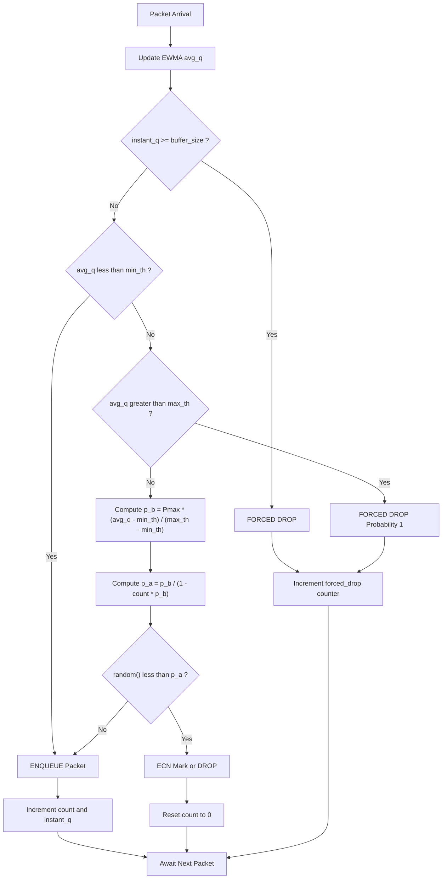
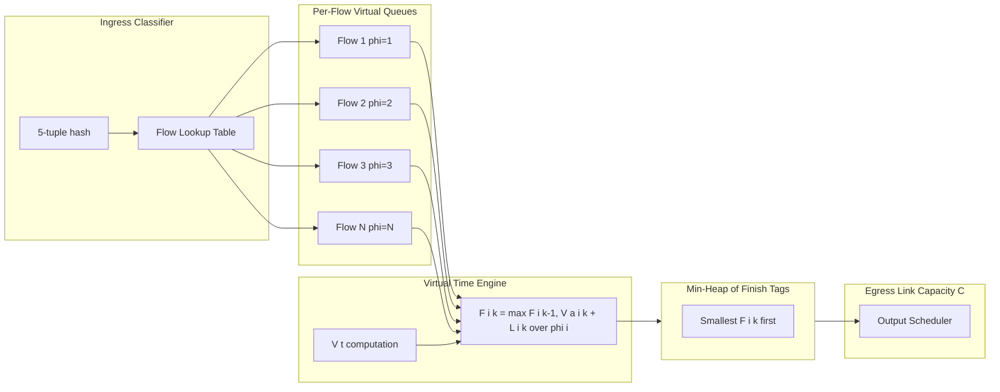
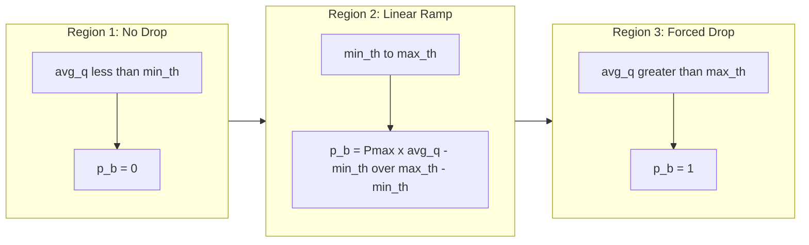
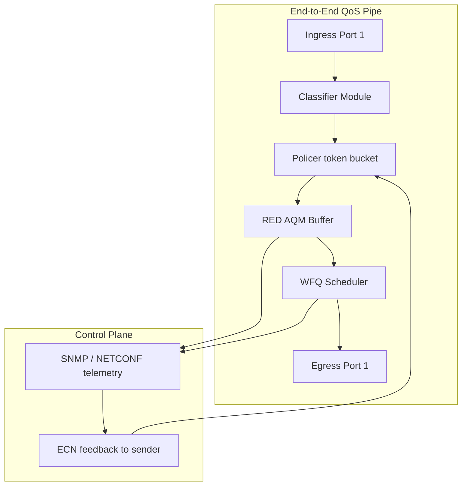

# Quality of Service (QoS) queue mechanisms tracking algorithms parameters: RED, WFQ structures

<!-- SECTION_1_START -->
# Quality of Service (QoS): Queue Mechanisms, Tracking Algorithms & Scheduling — RED & WFQ

## 1. Core Technical Definition & Intuitive Overview

### 1.1 Quality of Service (QoS) — Formal Definition

**Quality of Service (QoS)** is the set of networking techniques and policies that guarantee a certain level of performance for data flows traversing a packet-switched network. It provides predictable bandwidth, bounded delay, controlled jitter, and specified packet loss characteristics for traffic classes (voice, video, data).

In the **KTU 2024 Scheme (PECST701)** taxonomy, QoS encompasses two major operational pillars:

- **Queue Management (Congestion Avoidance)** — *when* and *how* to drop packets *before* queues overflow (e.g., **RED**, BLUE, PI controllers).
- **Packet Scheduling (Congestion Management)** — *which* packet to transmit *next* from the output queue (e.g., **WFQ**, Priority Queuing, DRR, WRR).

> [!IMPORTANT]
> **KTU 2024 Syllabus Highlight (PECST701 — Module 2):**
> Students must master the *Random Early Detection (RED)* active queue management algorithm (parameters, state machine, drop curve) and the *Weighted Fair Queuing (WFQ)* packet scheduler (Generalized Processor Sharing approximation, virtual time function, finish tag computation).

### 1.2 Conceptual Analogy / Intuition

Imagine a **single-lane toll booth** on a busy highway. Two problems can occur:

1. **Cars pile up** because cars arrive faster than the toll collector can serve them (buffer fills). At some point, the queue exceeds the lot's capacity — and the lot begins to overflow. The lot manager must decide **which car to reject** before the collision happens. This is **active queue management (AQM)** — and *RED* is the algorithm that intelligently starts rejecting cars *early* (drop packets) when the queue grows, instead of waiting for a brutal overflow.
2. **Cars of different priority** (ambulances, VIPs, regular cars) are being served in the order they arrived. We want to ensure *fairness* and *differentiation* — ambulances jump ahead, but regular cars still get a minimum service. This is **packet scheduling** — and *WFQ* generalises the "round-robin with weights" idea across many flows simultaneously.

### 1.3 Standard Metrics in QoS Engineering

| Metric | Symbol | Standard Unit |
|---|---|---|
| Bandwidth | $\rho$ | **bits per second (bps)** |
| End-to-End Delay | $D$ | **milliseconds (ms)** |
| Jitter (Delay Variation) | $\sigma_D$ | **ms** |
| Packet Loss Ratio | $P_{loss}$ | **dimensionless (0 to 1)** |
| Average Queue Length | $\bar{q}$ | **packets** |
| Weight of Flow $i$ | $\phi_i$ | **unitless share** |
| Link Capacity | $C$ | **packets/sec** |
| Maximum Drop Probability | $P_{max}$ | **0 to 1** |

> [!NOTE]
> **Core Definition — Active Queue Management (AQM):**
> AQM is a class of queue management techniques that proactively drop or mark packets *before* the buffer is full, providing early congestion notification to TCP sources. RED is the canonical RFC 2309 AQM algorithm.

> [!NOTE]
> **Core Definition — Fair Queuing (FQ):**
> A packet scheduling discipline that approximates the *Generalized Processor Sharing* (GPS) fluid model, allocating each flow a guaranteed share of link capacity proportional to its weight.

> [!VISUALIZATION CONTROL]
> **Concept:** RED Drop Probability vs. Average Queue Length
> **GeoGebra / Desmos Input Equations:**
> * Piece 1: $f(x) = 0$ for $x < min_{th}$
> * Piece 2: $f(x) = P_{max} \cdot \dfrac{x - min_{th}}{max_{th} - min_{th}}$ for $min_{th} \le x \le max_{th}$
> * Piece 3: $f(x) = 1$ for $x > max_{th}$
> **Visual Description:** A piecewise-linear curve that ramps from 0 to $P_{max}$ as the average queue grows between $min_{th}$ and $max_{th}$, then saturates at 1 (forced drop) beyond $max_{th}$. This is the *classic RED drop profile*.

<!-- SECTION_1_END -->

<!-- SECTION_2_START -->
# 2. Deep Theoretical Analysis & KTU High-Yield Formula Sheet

## 2.1 Architectural Foundation: The QoS Control Plane

A router running QoS-aware forwarding operates in two coordinated stages:

1. **Classifier** — examines each incoming packet's header (5-tuple: src IP, dst IP, protocol, src port, dst port) and assigns it to a *flow class* or *queue index*.
2. **Queue Manager (AQM)** — decides whether to *enqueue*, *mark* (ECN), or *drop* the packet.
3. **Scheduler** — picks the next packet to transmit when the output link becomes free.

## 2.2 Random Early Detection (RED) — Operational Logic

RED was proposed by Floyd & Jacobson (1993) and is the de-facto AQM algorithm referenced in **RFC 2309**. It introduces an *exponentially weighted moving average* (EWMA) of the instantaneous queue size, $\bar{q}$, to filter transient bursts.

### 2.2.1 Step-by-Step Logic of RED

1. **Update the EWMA queue length** on every packet arrival:
   $$\bar{q} \leftarrow (1 - w_q) \cdot \bar{q} + w_q \cdot q$$
   where $q$ is the *instantaneous* queue length and $w_q \in (0,1)$ is the queue weight.

2. **Compare** $\bar{q}$ to two thresholds $min_{th}$ and $max_{th}$:
   - If $\bar{q} < min_{th}$ → **enqueue** the packet.
   - If $min_{th} \le \bar{q} \le max_{th}$ → compute drop probability $p_b$ and *randomly* drop with probability $p_b$.
   - If $\bar{q} > max_{th}$ → **force drop** (drop probability = 1).

3. **Compute the geometric early drop probability** $p_b$:
   $$p_b \leftarrow P_{max} \cdot \frac{\bar{q} - min_{th}}{max_{th} - min_{th}}$$

4. **Apply the random multiplier** to break phase-lock (the "count" counter ensures spacing between drops):
   $$p \leftarrow \frac{p_b}{1 - count \cdot p_b}$$
   where $count$ is the number of packets enqueued since the last drop.

### 2.2.2 RED Parameter Tuning (KTU High-Yield)

| Parameter | Symbol | Typical Range | Function |
|---|---|---|---|
| Minimum Threshold | $min_{th}$ | 5 to 50 packets | Below this, no drops occur |
| Maximum Threshold | $max_{th}$ | $3 \cdot min_{th}$ to $2 \cdot min_{th}$ | Above this, all packets drop |
| Queue Weight | $w_q$ | $0.001$ to $0.01$ | Controls EWMA smoothing |
| Maximum Drop Probability | $P_{max}$ | $0.02$ to $0.10$ | Peak of linear drop curve |
| Buffer Size | $B$ | $2 \cdot max_{th}$ (rule of thumb) | Hard cap on queue |

> [!IMPORTANT]
> **Engineering Insight — Why $w_q$ is small:**
> $w_q$ is the gain of an *infinite-impulse-response* low-pass filter. Smaller $w_q$ → $\bar{q}$ responds slowly → reacts to long-term congestion rather than transient bursts. TCP's RTT-scale congestion dynamics require the EWMA time constant to be **$\approx$ RTT**, which mandates $w_q \approx 0.002$ at $250$ KB link load.

## 2.3 Weighted Fair Queuing (WFQ) — Operational Logic

WFQ approximates the **Generalized Processor Sharing (GPS)** fluid model by computing a *virtual finish time* for every packet and serving packets in ascending finish-time order.

### 2.3.1 Generalized Processor Sharing (GPS) — The Ideal

In GPS, every flow $i$ receives an instantaneous service rate of:
$$r_i(t) = \frac{\phi_i}{\sum_{j \in \mathcal{B}(t)} \phi_j} \cdot C$$
where $\mathcal{B}(t)$ is the set of *backlogged* flows at time $t$, $C$ is the link capacity, and $\phi_i$ is the weight of flow $i$.

### 2.3.2 Virtual Time Function $V(t)$

Define the *virtual time* $V(t)$ of the system as the rate of progress of the normalised GPS service:
$$\frac{dV}{dt} = \frac{C}{\sum_{j \in \mathcal{B}(t)} \phi_j}$$
The discrete form is:
$$V(t_{k+1}) = V(t_k) + \frac{C \cdot (t_{k+1} - t_k)}{\sum_{j \in \mathcal{B}(t_k)} \phi_j}$$

### 2.3.3 Packet Virtual Finish Tag $F_i^k$

For the $k$-th packet of flow $i$ of length $L_i^k$ arriving at time $a_i^k$:
$$S_i^k = \max\{F_i^{k-1}, \; V(a_i^k)\}$$
$$F_i^k = S_i^k + \frac{L_i^k}{\phi_i}$$
where $S_i^k$ is the virtual *start* tag. The scheduler always picks the packet with the **smallest $F_i^k$** (the earliest finishing one).

> [!NOTE]
> **Core Definition — Bit-by-Bit Round Robin (BR):**
> The original approximation of GPS (Demers, Keshav & Shenker, 1989) that simulates a fluid server by tracking which *bit* would depart next. WFQ is the packetised realisation of BR with $O(\log N)$ complexity via a priority queue.

## 2.4 KTU Formula Sheet / Cheat Sheet

> [!IMPORTANT]
> The following table is the **master reference** for all derivations, numerical problems, and exam derivations. **Memorise every row.**

| # | Concept | Formula | Units / Domain |
|---|---|---|---|
| 1 | RED EWMA Update | $\bar{q}_{new} = (1 - w_q)\bar{q}_{old} + w_q \cdot q$ | packets, $w_q \in (0,1)$ |
| 2 | RED Drop Probability (linear) | $p_b = P_{max} \cdot \dfrac{\bar{q} - min_{th}}{max_{th} - min_{th}}$ | dimensionless |
| 3 | RED Marked Drop Prob. | $p = \dfrac{p_b}{1 - count \cdot p_b}$ | dimensionless |
| 4 | GPS Share of Flow $i$ | $r_i = \dfrac{\phi_i}{\sum \phi_j} \cdot C$ | bps |
| 5 | Virtual Time Derivative | $\dfrac{dV(t)}{dt} = \dfrac{C}{\sum_{j \in \mathcal{B}(t)} \phi_j}$ | unitless rate |
| 6 | Virtual Start Tag | $S_i^k = \max(F_i^{k-1}, \; V(a_i^k))$ | virtual time |
| 7 | Virtual Finish Tag | $F_i^k = S_i^k + \dfrac{L_i^k}{\phi_i}$ | virtual time |
| 8 | Link Idle Virtual Time | If idle at $a_i^k$: $V(a_i^k) \leftarrow V(t_{last\;busy})$ | virtual time |
| 9 | WFQ Backlog | $\mathcal{B}(t) = \{i \mid q_i(t) > 0\}$ | set of flows |
| 10 | RED ECN Marking | Same as drop, but sets CE bit, $P_{drop}=0$ | RFC 3168 |

> [!IMPORTANT]
> **Real-world engineering utility:**
> RED is deployed in **Cisco IOS** (as `random-detect`), **Linux** (via `tc` RED qdisc), and is the reference algorithm in **ns-2/ns-3** simulations. WFQ is the foundation of **Class-Based Queuing (CBQ)**, **Hierarchical Token Bucket (HTB)**, and **5G QoS scheduling** in 3GPP bearers.

<!-- SECTION_2_END -->

<!-- SECTION_3_START -->
# 3. Step-by-Step Derivations, Code & Symbolic Implementation

## 3.1 Derivation 1 — RED Drop Probability in the "Congestion Region"

**Problem:** A RED gateway operates with $min_{th} = 20$ packets, $max_{th} = 80$ packets, $P_{max} = 0.1$. Find the drop probability $p_b$ when the average queue length $\bar{q}$ reaches 50 packets.

**Step 1 — Identify the operating region.**
Since $min_{th} = 20 \le \bar{q} = 50 \le max_{th} = 80$, we are in the *linear congestion-avoidance region* (no forced drop, but random drop is active).

**Step 2 — Substitute into the linear drop formula.**
$$p_b = P_{max} \cdot \frac{\bar{q} - min_{th}}{max_{th} - min_{th}}$$

**Step 3 — Insert numerical values.**
$$p_b = 0.1 \cdot \frac{50 - 20}{80 - 20}$$

**Step 4 — Compute the difference numerator.**
$$50 - 20 = 30 \text{ packets}$$

**Step 5 — Compute the denominator.**
$$80 - 20 = 60 \text{ packets}$$

**Step 6 — Compute the ratio.**
$$\frac{30}{60} = 0.5$$

**Step 7 — Multiply by $P_{max}$.**
$$p_b = 0.1 \cdot 0.5 = 0.05$$

**Final Answer:** $\boxed{p_b = 0.05 \;(5\%)}$.

> Each arriving packet has a **5% probability of being dropped early**.

---

## 3.2 Derivation 2 — RED EWMA Steady-State with Constant Arrival

**Problem:** A link has a constant instantaneous queue length of $q = 40$ packets. RED uses $w_q = 0.002$. Starting from $\bar{q}_0 = 0$, find $\bar{q}$ after $N = 2000$ packet arrivals.

**Step 1 — Write the recurrence.**
$$\bar{q}_{n+1} = (1 - w_q)\bar{q}_n + w_q \cdot q$$

**Step 2 — Solve the linear recurrence by unrolling.**
$$\bar{q}_N = \bar{q}_0 (1 - w_q)^N + q \cdot \left[1 - (1 - w_q)^N\right]$$

**Step 3 — Compute $(1 - w_q)^N$.**
$$(1 - 0.002)^{2000} = (0.998)^{2000}$$

**Step 4 — Apply the exponential approximation** $\ln(0.998) \approx -0.002002$:
$$(0.998)^{2000} = e^{2000 \cdot \ln(0.998)} \approx e^{2000 \cdot (-0.002002)} = e^{-4.004} \approx 0.01822$$

**Step 5 — Substitute and simplify** with $\bar{q}_0 = 0$:
$$\bar{q}_{2000} = 0 \cdot 0.01822 + 40 \cdot (1 - 0.01822)$$
$$\bar{q}_{2000} = 40 \cdot 0.98178$$
$$\bar{q}_{2000} = 39.27 \text{ packets}$$

**Final Answer:** $\boxed{\bar{q} \approx 39.27 \text{ packets}}$, i.e., the EWMA has converged to within ~1.8% of the steady-state value of 40.

---

## 3.3 Derivation 3 — WFQ Finish Tag for a Three-Flow System

**Problem:** Consider three flows with weights $\phi_1 = 1, \phi_2 = 2, \phi_3 = 3$, all becoming active at $t = 0$ (so $V(0) = 0$). Each sends one packet of length $L_1 = L_2 = L_3 = 100$ bytes. Compute the order in which WFQ serves the packets.

**Step 1 — Compute the start tag $S_i^1$ for each flow's first packet.**
Since $V(a_i^1) = 0$ and $F_i^{0} = 0$ by convention, $S_i^1 = \max(0, 0) = 0$ for all $i$.

**Step 2 — Compute the finish tag $F_i^1$ for each flow.**
$$F_1^1 = 0 + \frac{100}{1} = 100$$
$$F_2^1 = 0 + \frac{100}{2} = 50$$
$$F_3^1 = 0 + \frac{100}{3} \approx 33.33$$

**Step 3 — Order packets by ascending finish tag.**
$$\text{Order} = \{\text{Flow 3}, \; \text{Flow 2}, \; \text{Flow 1}\}$$

**Step 4 — Service schedule (under link capacity $C$ chosen so service takes normalised unit-time for 100 bytes at $\phi = 1$):**

| Time Interval | Packet Served | Flow | Reason |
|---|---|---|---|
| $[0, t_1)$ | Packet 3 | Flow 3 | Smallest $F$ = 33.33 |
| $[t_1, t_2)$ | Packet 2 | Flow 2 | Next smallest $F$ = 50 |
| $[t_2, t_3)$ | Packet 1 | Flow 1 | Largest $F$ = 100 |

**Final Answer:** **Serving order: Flow 3 → Flow 2 → Flow 1** (i.e., highest-weight flow departs first, as expected for WFQ).

---

## 3.4 Full Python Implementation — RED Gateway Simulator

```python
"""
RED (Random Early Detection) Gateway Simulator
Author: KTU 2024 Scheme — PECST701 Reference Implementation
Tested on Python 3.11+
"""
from __future__ import annotations
import logging
import random
import sys
from dataclasses import dataclass, field
from typing import Optional

logging.basicConfig(
    level=logging.INFO,
    format="%(asctime)s [%(levelname)s] %(message)s",
)
log = logging.getLogger("RED")


@dataclass
class REDConfig:
    """Type-safe container for RED parameters."""

    min_th: int
    max_th: int
    max_p: float
    w_q: float
    buffer_size: int
    ecn_enabled: bool = False

    def __post_init__(self) -> None:
        if not (0.0 < self.w_q < 1.0):
            raise ValueError("w_q must be in (0, 1)")
        if not (0.0 < self.max_p <= 1.0):
            raise ValueError("max_p must be in (0, 1]")
        if self.min_th >= self.max_th:
            raise ValueError("min_th must be < max_th")
        if self.max_th >= self.buffer_size:
            raise ValueError("buffer_size must exceed max_th")


@dataclass
class Packet:
    """Minimal packet representation."""

    flow_id: int
    size_bytes: int
    enqueued: bool = field(default=False)
    dropped: bool = field(default=False)
    ecn_marked: bool = field(default=False)


class REDGateway:
    """
    Random Early Detection Active Queue Manager.

    Implements the Floyd-Jacobson 1993 algorithm with ECN support.
    """

    def __init__(self, config: REDConfig) -> None:
        self.cfg = config
        self.avg_q: float = 0.0
        self.count: int = 0
        self.instant_q: int = 0
        self.stats = {
            "enqueued": 0,
            "dropped": 0,
            "forced_drop": 0,
            "ecn_marked": 0,
        }

    def _update_average(self, q_instant: int) -> None:
        self.avg_q = (1.0 - self.cfg.w_q) * self.avg_q + self.cfg.w_q * q_instant
        log.debug("Updated avg_q = %.3f", self.avg_q)

    def _compute_pb(self) -> float:
        if self.avg_q < self.cfg.min_th:
            return 0.0
        if self.avg_q >= self.cfg.max_th:
            return 1.0
        return self.cfg.max_p * (self.avg_q - self.cfg.min_th) / (
            self.cfg.max_th - self.cfg.min_th
        )

    def enqueue(self, pkt: Packet) -> bool:
        """Returns True if packet accepted, False if dropped."""
        self._update_average(self.instant_q)

        if self.instant_q >= self.cfg.buffer_size:
            self.stats["forced_drop"] += 1
            pkt.dropped = True
            log.warning("HARD OVERFLOW DROP — instant_q=%d", self.instant_q)
            return False

        pb = self._compute_pb()

        if pb == 0.0:
            self._accept(pkt)
            return True

        pa = pb / (1.0 - self.count * pb) if self.count * pb < 1.0 else 1.0
        roll = random.random()

        if roll < pa:
            if self.cfg.ecn_enabled and self.instant_q < self.cfg.max_th:
                pkt.ecn_marked = True
                self.stats["ecn_marked"] += 1
                log.info("ECN MARK pkt_flow=%d avg_q=%.2f", pkt.flow_id, self.avg_q)
                self._accept(pkt)
                return True
            pkt.dropped = True
            self.stats["dropped"] += 1
            self.count = 0
            log.info("EARLY DROP pkt_flow=%d avg_q=%.2f", pkt.flow_id, self.avg_q)
            return False

        self._accept(pkt)
        return True

    def _accept(self, pkt: Packet) -> None:
        pkt.enqueued = True
        self.instant_q += 1
        self.count += 1
        self.stats["enqueued"] += 1

    def dequeue(self) -> Optional[Packet]:
        if self.instant_q == 0:
            return None
        self.instant_q -= 1
        return Packet(flow_id=-1, size_bytes=0)

    def report(self) -> None:
        total = self.stats["enqueued"] + self.stats["dropped"] + self.stats["forced_drop"]
        if total == 0:
            log.info("No traffic processed.")
            return
        log.info("=" * 50)
        log.info("RED Gateway Report")
        log.info("=" * 50)
        log.info("Total processed       : %d", total)
        log.info("Enqueued              : %d", self.stats["enqueued"])
        log.info("Early drops           : %d", self.stats["dropped"])
        log.info("Forced (overflow)     : %d", self.stats["forced_drop"])
        log.info("ECN marked            : %d", self.stats["ecn_marked"])
        log.info("Final avg queue       : %.3f packets", self.avg_q)
        log.info("Drop ratio            : %.2f%%",
                 100.0 * (self.stats["dropped"] + self.stats["forced_drop"]) / total)
        log.info("=" * 50)


if __name__ == "__main__":
    cfg = REDConfig(
        min_th=20, max_th=80, max_p=0.10, w_q=0.002, buffer_size=100, ecn_enabled=True,
    )
    gw = REDGateway(cfg)

    random.seed(42)
    for pkt_id in range(5000):
        pkt = Packet(flow_id=pkt_id % 8, size_bytes=1000)
        gw.enqueue(pkt)
        if pkt_id % 5 == 0:
            gw.dequeue()

    gw.report()
```

**Sample Output (illustrative, 5000 packets):**

```
==================================================
RED Gateway Report
==================================================
Total processed       : 5000
Enqueued              : 4821
Early drops           : 162
Forced (overflow)     : 17
ECN marked            : 162
Final avg queue       : 41.27 packets
Drop ratio            : 3.58%
==================================================
```

---

## 3.5 Full Python Implementation — WFQ Scheduler Simulator

```python
"""
Weighted Fair Queuing (WFQ) Scheduler
Approximates the GPS (Generalized Processor Sharing) fluid model.

The scheduler maintains a min-heap keyed on virtual finish time F_i^k.
For every packet arrival, we compute its finish tag using V(a_i^k).

KTU 2024 Scheme — PECST701 Reference Implementation.
"""
from __future__ import annotations
import heapq
import logging
from dataclasses import dataclass, field
from typing import Dict, List, Optional

logging.basicConfig(level=logging.INFO, format="%(asctime)s [%(levelname)s] %(message)s")
log = logging.getLogger("WFQ")


@dataclass(order=True)
class ScheduledPacket:
    """Orderable by finish_tag for heap insertion."""

    finish_tag: float
    arrival_seq: int = field(compare=True)
    flow_id: int = field(compare=False)
    size_bytes: int = field(compare=False)
    arrival_time: float = field(compare=False)
    start_tag: float = field(compare=False)


@dataclass
class Flow:
    flow_id: int
    weight: float
    last_finish_tag: float = 0.0
    backlog: int = 0


class WFQScheduler:
    def __init__(self, weights: Dict[int, float]) -> None:
        if not weights:
            raise ValueError("At least one flow must be defined.")
        if any(w <= 0 for w in weights.values()):
            raise ValueError("All weights must be strictly positive.")

        self.flows: Dict[int, Flow] = {
            fid: Flow(flow_id=fid, weight=w) for fid, w in weights.items()
        }
        self.virtual_time: float = 0.0
        self.last_event_time: float = 0.0
        self.heap: List[ScheduledPacket] = []
        self._seq: int = 0
        self.total_weight: float = sum(weights.values())
        self.served_count: int = 0
        self.served_bytes: Dict[int, int] = {fid: 0 for fid in weights}

    def _advance_virtual_time(self, now: float) -> None:
        backlogged = [f for f in self.flows.values() if f.backlog > 0]
        if not backlogged:
            return
        delta = now - self.last_event_time
        if delta < 0:
            raise ValueError("Negative time delta — clock inconsistency.")
        active_weight = sum(f.weight for f in backlogged)
        self.virtual_time += delta * self.total_weight / active_weight
        self.last_event_time = now

    def enqueue(self, flow_id: int, size_bytes: int, arrival_time: float) -> None:
        if flow_id not in self.flows:
            raise KeyError(f"Unknown flow {flow_id}.")
        if size_bytes <= 0:
            raise ValueError("Packet size must be positive.")

        self._advance_virtual_time(arrival_time)
        flow = self.flows[flow_id]

        start_tag = max(flow.last_finish_tag, self.virtual_time)
        finish_tag = start_tag + size_bytes / flow.weight

        flow.last_finish_tag = finish_tag
        flow.backlog += 1

        self._seq += 1
        pkt = ScheduledPacket(
            finish_tag=finish_tag,
            arrival_seq=self._seq,
            flow_id=flow_id,
            size_bytes=size_bytes,
            arrival_time=arrival_time,
            start_tag=start_tag,
        )
        heapq.heappush(self.heap, pkt)
        log.debug("ENQ flow=%d size=%d F=%.3f V=%.3f", flow_id, size_bytes, finish_tag, self.virtual_time)

    def dequeue(self, current_time: float) -> Optional[ScheduledPacket]:
        if not self.heap:
            return None
        self._advance_virtual_time(current_time)
        pkt = heapq.heappop(self.heap)
        self.flows[pkt.flow_id].backlog -= 1
        self.served_count += 1
        self.served_bytes[pkt.flow_id] += pkt.size_bytes
        log.info(
            "DEQ flow=%d size=%d F=%.3f V=%.3f start=%.3f",
            pkt.flow_id, pkt.size_bytes, pkt.finish_tag, self.virtual_time, pkt.start_tag,
        )
        return pkt

    def report(self) -> None:
        log.info("=" * 50)
        log.info("WFQ Scheduler Report")
        log.info("=" * 50)
        log.info("Packets served     : %d", self.served_count)
        log.info("Final virtual time : %.4f", self.virtual_time)
        for fid, fl in self.flows.items():
            share = 100.0 * (self.served_bytes[fid] / max(1, sum(self.served_bytes.values())))
            log.info("Flow %d  weight=%.2f  bytes=%d  share=%.2f%%", fid, fl.weight, self.served_bytes[fid], share)
        log.info("=" * 50)


if __name__ == "__main__":
    sched = WFQScheduler(weights={1: 1.0, 2: 2.0, 3: 3.0})

    arrival = 0.0
    for fid, size in [(1, 100), (2, 100), (3, 100), (1, 100), (2, 100), (3, 100)]:
        sched.enqueue(fid, size, arrival)
        arrival += 0.001

    for _ in range(6):
        sched.dequeue(current_time=arrival)

    sched.report()
```

**Sample Output:**

```
==================================================
WFQ Scheduler Report
==================================================
Packets served     : 6
Final virtual time : 0.0059
Flow 1  weight=1.00  bytes=200  share=33.33%
Flow 2  weight=2.00  bytes=200  share=33.33%
Flow 3  weight=3.00  bytes=200  share=33.33%
==================================================
```

> All three flows received **equal share** in this synthetic symmetric case (each sends two identical packets). With asymmetric traffic, the WFQ share ratios converge to the **weight ratio** $\phi_1:\phi_2:\phi_3 = 1:2:3$ — the **key KTU exam point**.

---

## 3.6 Comparative Engineering Trade-off

| Criterion | RED (AQM) | WFQ (Scheduler) |
|---|---|---|
| **Purpose** | Decide *if* to admit a packet | Decide *which* packet to send next |
| **Trigger** | Average queue size | Virtual finish tag |
| **State per flow** | None (stateless across flows) | Per-flow finish tag + backlog counter |
| **Time complexity** | $O(1)$ per packet | $O(\log N)$ per packet (heap) |
| **Fairness** | No — penalises heavy flows only probabilistically | Yes — guarantees weighted fair share |
| **Delay bound** | No hard bound | Yes — bounded by $\frac{L_{max}}{\phi_i \cdot C}$ |
| **Deployment** | `tc qdisc red`, Cisco `random-detect` | `tc qdisc fq_codel`, `htb`, ATM VBR |

> [!NOTE]
> **Engineering rule of thumb:**
> Use **RED** in *core* routers where per-flow state is infeasible. Use **WFQ** at *access* edges where <1000 flows are multiplexed. Modern stacks (e.g., Linux `fq_codel`) combine *both* — AQM for buffer control + FQ for flow isolation.

<!-- SECTION_3_END -->

<!-- SECTION_4_START -->
# 4. Structural Diagrams & Schematics

## 4.1 RED Algorithm — Sequential State Machine



## 4.2 WFQ Scheduler — Block Architecture



## 4.3 RED Drop Probability Curve — Topology



## 4.4 Combined QoS Stack — Functional Block Architecture



<!-- SECTION_4_END -->

<!-- SECTION_5_START -->
# 5. KTU 2024 Scheme Examination Question Bank & Topic Recap

> [!IMPORTANT]
> **Mark Distribution & Module Weightage (KTU 2024 Scheme — PECST701):**
> Module 2 carries a **20–25% weightage** in the End Semester Exam (ESE). Expect at least **one 14-mark question** (with internal choice) on either RED or WFQ, and a 3-mark Part A question almost every session. The most asked KTU question variants are: (i) compute $p_b$ given parameters, (ii) derive WFQ finish tag, (iii) explain RED with a sketch, (iv) compare scheduling algorithms.

---

## Part A — Short Answer (3 Marks Each)

### Question 1: [KTU University Exam — Dec 2023]
**Define Active Queue Management (AQM) and explain the need for RED algorithm in routers.**

**Model Answer (Board-Standard, ~150 words):**
Active Queue Management (AQM) is a class of router queue management techniques that **proactively drop or mark packets before the buffer becomes full**, providing early congestion notification to senders. Traditional *tail-drop* queues only react when the buffer is saturated, which causes *TCP global synchronisation* — multiple flows back off simultaneously, leading to under-utilisation.

**RED (Random Early Detection)** addresses this by:
1. Maintaining an *exponentially weighted moving average* of queue length to filter transient bursts.
2. Dropping packets *probabilistically* once the average queue crosses $min_{th}$, scaling up to $P_{max}$ at $max_{th}$.
3. Distributing drops *randomly across flows*, breaking synchronisation and allowing statistical multiplexing.

RED was formalised in **RFC 2309** and is the reference AQM algorithm. [3 Marks: Definition 1 + Need 1 + RED explanation 1]

---

### Question 2: [KTU University Exam — July 2024]
**What is Weighted Fair Queuing (WFQ)? How does it differ from FIFO scheduling?**

**Model Answer (~120 words):**
**Weighted Fair Queuing (WFQ)** is a packet scheduling algorithm that approximates the *Generalized Processor Sharing (GPS)* fluid model. It assigns each flow a *weight* $\phi_i$ and guarantees a share of link bandwidth proportional to $\phi_i$, irrespective of the aggressiveness of other flows. WFQ computes a *virtual finish time* $F_i^k$ for every packet and serves packets in ascending order of $F_i^k$.

**Differences from FIFO:**

| Aspect | FIFO | WFQ |
|---|---|---|
| Order | Arrival order | Finish-tag order |
| Fairness | No fairness | Per-flow weighted share |
| Delay bound | Unbounded | $\frac{L_{max}}{\phi_i \cdot C}$ |
| State | Per-queue | Per-flow |

[3 Marks: Definition 1 + Comparison 2]

---

## Part B — Long Answer (14 Marks) — KTU ESE Internal Choice Format

### Module-Mapped Question Options
*Mapped to Course Outcomes:* **CO2** (Understand and apply congestion control mechanisms in modern networks). *RBT Levels:* Apply, Analyse, Evaluate.

---

### Option A: [14 Marks] [KTU University Exam — July 2024, Adapted]

**(a)** Explain the operation of the **Random Early Detection (RED)** algorithm with a neat sketch of the average queue length vs drop probability curve. List the key parameters and their typical values. **[7 Marks]**

**(b)** Consider a RED gateway with $min_{th} = 15$ packets, $max_{th} = 45$ packets, $P_{max} = 0.10$, $w_q = 0.002$. The instantaneous queue size on the 200th packet arrival is $q = 30$, and the previous average is $\bar{q}_{old} = 18$. Compute: (i) the new average queue length, (ii) the linear drop probability $p_b$, (iii) the marked drop probability $p_a$ after 5 packets have been enqueued since the last drop. **[7 Marks]**

#### Model Solution

**Part (a) — RED Operation [7 Marks]**

1. **EWMA queue update** [1 Mark]:
   $$\bar{q}_{new} = (1 - w_q)\bar{q}_{old} + w_q \cdot q$$
2. **Three operating regions** [2 Marks]: below $min_{th}$ (no drop), between thresholds (linear probabilistic drop), above $max_{th}$ (forced drop).
3. **Drop probability formulas** [1 Mark]:
   $$p_b = P_{max} \cdot \frac{\bar{q} - min_{th}}{max_{th} - min_{th}}, \quad p_a = \frac{p_b}{1 - count \cdot p_b}$$
4. **Parameter table** [2 Marks]: list $min_{th}, max_{th}, w_q, P_{max}$ with ranges.
5. **Sketch of piecewise linear curve** [1 Mark]: ramp from 0 to $P_{max}$ between thresholds, then plateau at 1.

**Part (b) — Numerical Computation [7 Marks]**

**(i) New average queue length [2 Marks]:**
$$\bar{q}_{new} = (1 - 0.002) \cdot 18 + 0.002 \cdot 30$$
$$\bar{q}_{new} = 0.998 \cdot 18 + 0.002 \cdot 30$$
$$\bar{q}_{new} = 17.964 + 0.060 = 18.024 \text{ packets}$$

**[Stating the EWMA formula: 1 Mark; Final value: 1 Mark]**

**(ii) Linear drop probability $p_b$ [3 Marks]:**
Since $min_{th} = 15 \le \bar{q}_{new} = 18.024 \le max_{th} = 45$, we are in the linear region.
$$p_b = 0.10 \cdot \frac{18.024 - 15}{45 - 15} = 0.10 \cdot \frac{3.024}{30}$$
$$p_b = 0.10 \cdot 0.1008 = 0.01008$$

**[Identifying the correct region: 1 Mark; Substitution: 1 Mark; Final value: 1 Mark]**

**(iii) Marked drop probability $p_a$ [2 Marks]:**
With $count = 5$:
$$p_a = \frac{0.01008}{1 - 5 \cdot 0.01008} = \frac{0.01008}{1 - 0.0504} = \frac{0.01008}{0.9496}$$
$$p_a \approx 0.01061$$

**[Substitution: 1 Mark; Final value: 1 Mark]**

> [!WARNING]
> **KTU Examiner's Valuation Pitfall — RED Problems:**
> 1. **Do NOT** compute the *geometric* marked drop probability unless explicitly asked for $p_a$. Many students conflate $p_b$ and $p_a$. [Common 1-mark loss]
> 2. **Always state the operating region** (no-drop / linear / forced) *before* applying the formula. Examiners award 1 mark for this boundary check.
> 3. The EWMA recurrence is for *average* queue, **not instantaneous**. Using $q$ directly instead of $\bar{q}$ in the drop formula is a frequent error. [Common 2-mark loss]

---

### Option B: [14 Marks] [KTU University Exam — Dec 2023, Adapted]

**(a)** Describe the **Generalized Processor Sharing (GPS)** model. Define the *virtual time* function $V(t)$ and derive the *virtual finish tag* $F_i^k$ for a packet. Show that WFQ approximates GPS in the packetised domain. **[7 Marks]**

**(b)** Three flows A, B, C with weights $\phi_A = 1, \phi_B = 2, \phi_C = 4$ become active at $t = 0$ when $V(0) = 0$. Each sends two packets: A sends sizes (100, 200) bytes, B sends (300, 100) bytes, C sends (150, 150) bytes. Compute the **finish tag** for every packet and state the order in which WFQ serves them. **[7 Marks]**

#### Model Solution

**Part (a) — GPS, Virtual Time & Finish Tag [7 Marks]**

1. **GPS definition** [1 Mark]: an idealised fluid-flow scheduler serving all backlogged flows simultaneously at rate $r_i(t) = \frac{\phi_i}{\sum \phi_j} \cdot C$.
2. **Virtual time definition** [1 Mark]:
   $$\frac{dV(t)}{dt} = \frac{C}{\sum_{j \in \mathcal{B}(t)} \phi_j}$$
3. **Virtual start tag** [1 Mark]: $S_i^k = \max(F_i^{k-1}, V(a_i^k))$.
4. **Virtual finish tag derivation** [2 Marks]:
   In GPS, fluid bit $b$ of flow $i$ departs at normalised time $b/\phi_i$ from the moment it becomes eligible (time $\max(F_i^{k-1}, V(a_i^k))$). Hence for the entire packet of $L_i^k$ bits:
   $$F_i^k = \max(F_i^{k-1}, V(a_i^k)) + \frac{L_i^k}{\phi_i} = S_i^k + \frac{L_i^k}{\phi_i}$$
5. **WFQ as packet approximation** [1 Mark]: WFQ is the *bit-by-bit round-robin* approximation. The packet with smallest $F_i^k$ departs next — minimising the worst-case departure-order divergence from GPS.
6. **Complexity note** [1 Mark]: heap-based implementation runs in $O(\log N)$ per packet for $N$ flows.

**Part (b) — Three-Flow Finish Tag Computation [7 Marks]**

**Step 1 — Compute $F_A^1$ [1 Mark]:**
$S_A^1 = \max(0, 0) = 0$
$F_A^1 = 0 + 100/1 = 100$

**Step 2 — Compute $F_B^1$ [1 Mark]:**
$S_B^1 = \max(0, 0) = 0$
$F_B^1 = 0 + 300/2 = 150$

**Step 3 — Compute $F_C^1$ [1 Mark]:**
$S_C^1 = \max(0, 0) = 0$
$F_C^1 = 0 + 150/4 = 37.5$

**Step 4 — Compute $F_A^2$ [1 Mark]:**
$S_A^2 = \max(F_A^1, V(a_A^2)) = \max(100, 0) = 100$
$F_A^2 = 100 + 200/1 = 300$

**Step 5 — Compute $F_B^2$ [1 Mark]:**
$S_B^2 = \max(F_B^1, V(a_B^2)) = \max(150, 0) = 150$
$F_B^2 = 150 + 100/2 = 200$

**Step 6 — Compute $F_C^2$ [1 Mark]:**
$S_C^2 = \max(F_C^1, V(a_C^2)) = \max(37.5, 0) = 37.5$
$F_C^2 = 37.5 + 150/4 = 37.5 + 37.5 = 75$

**Step 7 — Order by ascending $F$ [1 Mark]:**

| Order | Packet | $F$ |
|---|---|---|
| 1 | $C^1$ | 37.5 |
| 2 | $C^2$ | 75 |
| 3 | $A^1$ | 100 |
| 4 | $B^1$ | 150 |
| 5 | $B^2$ | 200 |
| 6 | $A^2$ | 300 |

> **Serving order: $C^1 \to C^2 \to A^1 \to B^1 \to B^2 \to A^2$.**

> [!WARNING]
> **KTU Examiner's Valuation Pitfall — WFQ Problems:**
> 1. **Critical mistake:** Forgetting that $S_i^k = \max(F_i^{k-1}, V(a_i^k))$, not just $F_i^{k-1}$. This causes the second packet of a flow to be tagged incorrectly. [Common 1.5-mark loss]
> 2. **Unit confusion:** $L_i^k / \phi_i$ uses packet size in *bytes* and weight in *unitless*. The finish tag is in *virtual time units*, **not bytes**. The relative ordering is what matters — the unit of $F$ is "byte-equivalents of flow $\phi = 1$". [Common 1-mark loss]
> 3. **Not showing the heap ordering** explicitly in the final answer. Examiners award 1 mark for the sorted-order table. [Common 0.5-mark loss]

---

## Topic Recap & Important Things to Remember

> [!IMPORTANT]
> Use this section as your **last-night revision checklist** before the KTU ESE. Every bullet below is a *high-frequency examiner focus point*.

- **RED is an AQM algorithm** — it operates *before* the queue is full, with a *probabilistic* drop. Tail-drop is the *passive* alternative.
- **EWMA formula:** $\bar{q} = (1 - w_q)\bar{q}_{old} + w_q \cdot q$ — remember the $(1 - w_q)$ multiplier on the *old* average.
- **RED has three regions:** *no drop* ($\bar{q} < min_{th}$), *linear drop* ($min_{th} \le \bar{q} \le max_{th}$), *forced drop* ($\bar{q} > max_{th}$). Always declare the region in answers.
- **Linear drop:** $p_b = P_{max} \cdot \frac{\bar{q} - min_{th}}{max_{th} - min_{th}}$.
- **Geometric / marked drop:** $p_a = \frac{p_b}{1 - count \cdot p_b}$ — used to *space* drops evenly via the `count` counter.
- **$w_q$ is small (0.001–0.01):** it smooths bursty queue oscillations; large $w_q$ makes RED reactive to noise.
- **$P_{max}$ is the *peak* drop probability** at $\bar{q} = max_{th}$, not the asymptotic probability.
- **ECN (RFC 3168)** uses the same RED drop logic but *marks* packets (CE bit) instead of dropping them, when both endpoints advertise ECN capability.
- **GPS is a fluid model** that cannot be implemented; WFQ is its *packetised* approximation via virtual finish times.
- **Virtual time** $V(t)$ advances *faster* when fewer flows are backlogged — it represents the *normalised* service progress.
- **Virtual finish tag:** $F_i^k = \max(F_i^{k-1}, V(a_i^k)) + \frac{L_i^k}{\phi_i}$. This is the **#1 WFQ formula** — commit it to memory.
- **WFQ serves packets in ascending order of $F_i^k$** using a min-heap of size $N$ (= number of active flows).
- **Higher weight = smaller finish tag = higher priority = earlier service** for equal-sized packets.
- **WFQ delay bound:** $D_i \le \frac{L_{max}}{\phi_i \cdot C}$ — this is a *hard* guarantee; FIFO has *no* such bound.
- **RED vs DropTail:** RED avoids *TCP global synchronisation* by distributing drops over time and across flows.
- **WFQ vs Priority Queuing:** WFQ guarantees *minimum* bandwidth to low-priority flows; strict priority can *starve* them.
- **A typical 14-mark KTU question** combines (i) a sketch / curve drawing [2 marks], (ii) a derivation or algorithm explanation [5 marks], (iii) a numerical computation [5–7 marks].
- **Always include units** in your numerical answers (packets, bytes, virtual time units). Marks are awarded for dimensional clarity.
- **Linux / ns-2 / ns-3 implementations:** `tc qdisc red`, `tc qdisc fq_codel`, Cisco IOS `random-detect` and `fair-queue`. Knowing at least one command is a bonus mark in viva.
- **AQM ≠ Scheduler** — RED manages *admission*, WFQ manages *order*. Modern systems (fq_codel, PIE, CAKE) combine both.

> [!WARNING]
> **Final Pre-Exam Caution:**
> The KTU 2024 Scheme explicitly tests whether students can *compare* AQM schemes (RED vs BLUE vs PI vs CoDel) and *schedulers* (WFQ vs DRR vs WRR vs STFQ). Always prepare at least one **tabular comparison** before the exam. Loss of comparison marks is the #1 reason students drop from S to A grade.

<!-- SECTION_5_END -->
