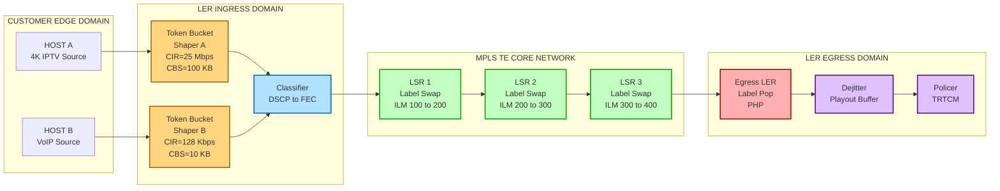
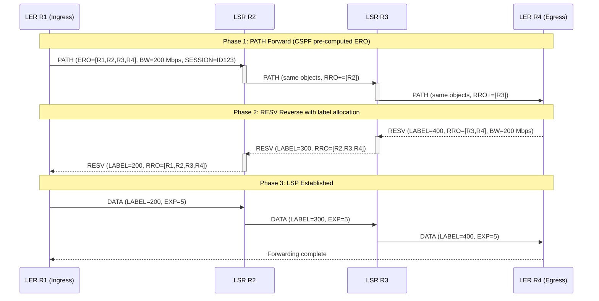
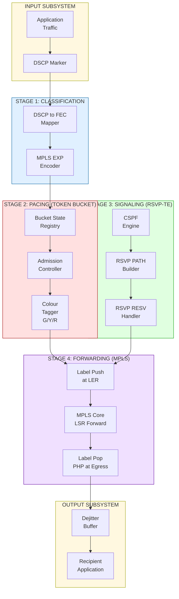
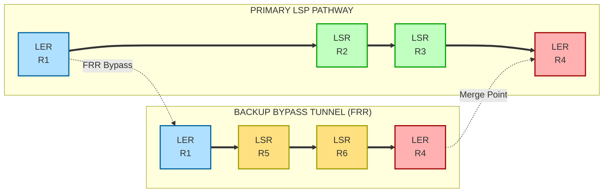

# Traffic pacing engineering blueprints MPLS network integration protocols pathways layouts

<!-- SECTION_1_START -->
# Traffic Pacing & MPLS Network Integration: Engineering Blueprints, Protocols, Pathways, and Layouts

## 1. Core Technical Definition & Intuitive Overview

### 1.1 Formal Academic Definition (KTU 2024 Syllabus Terminology)

**Traffic Pacing** is a deterministic **Quality of Service (QoS)** engineering mechanism that regulates the egress rate of a packet stream entering a network by buffering, reshaping, and re-emitting packets at a contracted **Committed Information Rate (CIR)**. It enforces a smooth, time-bounded output profile using algorithms such as the **Leaky Bucket** and the **Token Bucket**, and is one of the two principal sub-modules of traffic conditioning (the other being **traffic policing**).

**Multiprotocol Label Switching (MPLS)** is a connection-oriented forwarding paradigm defined by the **IETF (Internet Engineering Task Force)** in **RFC 3031** that operates at a *shim layer* (Layer 2.5) between the data-link and network layers. It performs packet forwarding by swapping a fixed-length **20-bit label** rather than performing longest-prefix IP lookup. When MPLS is extended to support constraint-based path computation, dynamic resource reservation, and fast reroute, it becomes **MPLS Traffic Engineering (MPLS-TE)**, which is the formal engineering blueprint for integrating traffic pacing policies into the forwarding substrate.

> [!IMPORTANT]
> **KTU 2024 Definition Anchor:** Traffic pacing in an MPLS-TE framework is the coordinated set of mechanisms (shaping at the **Label Edge Router (LER)**, policing within the **Label Switched Path (LSP)**, and **RSVP-TE** reservation signaling) that guarantees bandwidth, delay, jitter, and loss contracts for distinct **Forwarding Equivalence Classes (FECs)** traversing a shared backbone.

### 1.2 Conceptual Analogy — The Highway Toll System

Imagine a metropolitan expressway with **four key elements** that map exactly to our topic:

| Highway Element | Network Analogue |
|---|---|
| On-ramp traffic-metering signal (red/green light) | **Token Bucket** rate regulator |
| Multi-lane toll booths | **LER** (Label Edge Router) ingress |
| A reserved HOV / FASTAG lane | **LSP** (Label Switched Path) with bandwidth reservation |
| The entire expressway under CCTV control | **MPLS-TE domain** governed by **RSVP-TE** signaling |
| Highway capacity (vehicles/hour) | **Committed Information Rate (CIR)** in **bits/second** |
| The HOV lane pre-booked in advance | **CSPF (Constrained Shortest Path First)** explicit route |

> [!NOTE]
> **The "Why" behind the design:** Without pacing, an Application (say, a **4K IPTV stream** at 25 Mbps) would burst at 80 Mbps during scene transitions, causing the downstream **DS3 trunk** to drop packets and produce macro-blocking artefacts. The token bucket holds the burst inside a buffer (the "parking lot") and meters the *green light* (token availability) so that the highway never exceeds the safe capacity.

### 1.3 Geometric Intuition — Token Bucket State Space

The token-bucket state can be plotted on a 2-D Cartesian plane where:
- $X$-axis: **time $t$** (seconds)
- $Y$-axis: **token count $b(t)$** (tokens, dimensionless)

> [!VISUALIZATION CONTROL]
> **Concept:** Token Bucket fill/drain dynamics over time
> **GeoGebra / Desmos Input Equations:**
> * `b(t) = max(0, min(B_max, r*t - S(t)))` where `B_max = 10` tokens, `r = 2` tokens/sec, `S(t) = piecewise`
> **Visual Description:** A saw-tooth-like wave that rises linearly with slope $r$ (token replenishment) and drops vertically each time a packet of size $L$ is transmitted (drain). The wave is clipped at $Y = B_{\max}$ (burst tolerance ceiling) and $Y = 0$ (underrun floor).

### 1.4 Standard Reference Constants & Metrics

The following **industry-standard** constants must be memorized verbatim for the KTU board examination:

- **MPLS Label Size:** **32 bits** (20-bit label + 3-bit EXP for QoS + 1-bit bottom-of-stack + 8-bit TTL)
- **Default MPLS TTL:** **255** (inherited from IP)
- **Shim Header Position:** Between Layer 2 and Layer 3 headers
- **RSVP-TE Port Number:** **UDP 3632** (RSVP) carried over IP protocol **46**
- **LDP Port Number:** **TCP 646** (and UDP 646 for discovery)
- **MTU Adjustment for MPLS:** Stack depth × 4 bytes + 14 bytes (Ethernet) must be $\leq$ **1500** for Ethernet

> [!TIP]
> Always quote the RFC number for credit on the KTU ESE. For example: *"As per RFC 3270, the EXP bits in the MPLS shim are mapped to the **PHB (Per-Hop Behaviour)** of the **Diffserv** architecture."*

<!-- SECTION_1_END -->

<!-- SECTION_2_START -->
# 2. Deep Theoretical Analysis & KTU High-Yield Formula Sheet

## 2.1 The Two Pillars of Traffic Pacing

### 2.1.1 Leaky Bucket Algorithm
The Leaky Bucket is a **single-state, rigid, fixed-output-rate** algorithm. It enforces a perfectly smooth output rate at the cost of discarding (or queueing) excess bursts.

**State equation:**

$$\frac{db(t)}{dt} = \begin{cases} 0 & \text{if } b(t) = B_{\max} \text{ and a packet arrives} \\ \rho - \lambda(t) & \text{otherwise} \end{cases}$$

where $\rho$ is the **drain rate (tokens/sec)**, $\lambda(t)$ is the **input packet rate (tokens/sec equivalent)**, and $B_{\max}$ is the **bucket capacity in bytes**.

**Behavioural properties:**
- Forces **CBR-like (Constant Bit Rate)** output regardless of input burstiness.
- Loses excess packets when bucket is full.
- Latency = $(B_{\max} / \rho)$ seconds for an instantaneous input burst.

### 2.1.2 Token Bucket Algorithm
The Token Bucket is a **two-parameter, dual-state, flexible** algorithm that allows bounded burstiness while enforcing a long-term average rate.

**State equation:**

$$b(t+dt) = \min\Big(B_{\max},\, b(t) + r \cdot dt - L \cdot I(t)\Big)$$

where $r$ is the **token replenishment rate (bytes/sec)**, $L$ is the **packet length (bytes)**, and $I(t) \in \{0, 1\}$ is the **emission indicator** at time $t$.

**Key relationships:**
- Average output rate $\leq r$ (long-term)
- Maximum burst size $\leq B_{\max}$ bytes
- A packet of size $L$ is admitted if and only if $b(t) \geq L$.

### 2.1.3 Comparative Reasoning
The token bucket is **statistically more efficient** than the leaky bucket because it permits "credit accumulation" during idle periods, allowing controlled micro-bursts to be absorbed without loss. The leaky bucket, in contrast, is preferable for **link-rate enforcement** where the physical layer cannot tolerate any overshoot (e.g., SONET/SDH trunking).

## 2.2 MPLS Architecture — The Forwarding Substrate

### 2.2.1 The MPLS Shim Header
The MPLS label stack entry is precisely four octets long. Its bit layout is:

$$\underbrace{0\ldots 19}_{20\text{-bit Label}} \;|\; \underbrace{20\ldots 22}_{3\text{-bit EXP}} \;|\; \underbrace{23}_{\text{BoS bit}} \;|\; \underbrace{24\ldots 31}_{8\text{-bit TTL}}$$

The **BoS (Bottom-of-Stack)** bit is **1** for the last (innermost) label and **0** for all others, enabling **label stack hierarchies** such as **MPLS VPNs (RFC 4364)** where two labels are used (outer tunnel + inner VPN).

### 2.2.2 The Three Architectural Roles
- **Label Edge Router (LER):** Performs *push* (ingress) and *pop* (egress) operations; it is the integration point where traffic-pacing shapers are physically applied.
- **Label Switch Router (LSR):** Performs *swap* on intermediate hops; it is the high-speed forwarding core where pacing is enforced via per-LSP queuing.
- **Label Switched Path (LSP):** The unidirectional, label-switched tunnel from ingress LER to egress LER, equivalent to a **virtual leased line**.

### 2.2.3 Label Distribution Protocols
The two principal signalling pathways for label distribution are:
1. **LDP (Label Distribution Protocol, RFC 5036):** Best-effort, hop-by-hop, follows IGP metrics.
2. **RSVP-TE (Resource Reservation Protocol — Traffic Engineering, RFC 3209):** Constraint-based, explicit, supports bandwidth reservation and FRR (Fast Reroute, RFC 4090).

## 2.3 MPLS Traffic Engineering (MPLS-TE) — The Blueprint Layer

MPLS-TE extends MPLS with five sub-systems:
1. **TE-LSP signalling** via RSVP-TE PATH and RESV messages.
2. **Constraint-based path computation** via **CSPF** at the head-end.
3. **Resource reservation** along the explicit route (link bandwidth, admin groups, affinity).
4. **Admission control** at every transit LSR to prevent double-booking.
5. **Protection switching** via **FRR** (one-to-one or facility backup).

### 2.3.1 RSVP-TE Message Pathway
- **PATH message:** Travels from ingress LER → egress LER. Carries the **ERO (Explicit Route Object)** and **SESSION** with the desired bandwidth $B_{req}$.
- **RESV message:** Travels in reverse. Carries the **RRO (Recorded Route Object)** and the **LABEL** for each hop, locking the bandwidth via traffic-spec filters.
- **TE-ROUTE UPDATE:** Disseminates **TED (Traffic Engineering Database)** via **OSPF-TE (RFC 3630)** or **ISIS-TE (RFC 5305)**.

### 2.3.2 CSPF Cost Function
CSPF extends the SPF algorithm with three constraint filters:

$$w_{TE}(e) = \begin{cases} w_{IGP}(e) & \text{if } \text{avail\_bw}(e) \geq B_{req} \land \text{admin\_group}(e) \supseteq A_{req} \land \text{affinity}(e) \text{ matches} \\ \infty & \text{otherwise} \end{cases}$$

## 2.4 Integration Pathway: Pacing + MPLS-TE

The complete integration blueprint is a four-stage pipeline:

1. **Stage 1 — Classify:** Ingress LER maps the IP **ToS / DSCP** byte into the MPLS **EXP** bits (RFC 3270). Eight traffic classes form eight **FECs**.
2. **Stage 2 — Condition:** Each FEC is shaped by a dedicated **token bucket shaper** with parameters $(r, B_{\max})$ derived from the **SLA (Service Level Agreement)**.
3. **Stage 3 — Signal:** RSVP-TE is invoked with $B_{req} = r + \epsilon$ (where $\epsilon$ is the burst allowance) to reserve bandwidth on an **explicitly routed LSP** computed by CSPF.
4. **Stage 4 — Forward:** Each packet is label-stacked; at the egress LER the label is popped, and the **jitter** introduced by shaping is smoothed by a **dejitter playout buffer**.

## 2.5 KTU High-Yield Formula Sheet

| # | Concept | Formula / Relation | Units | Engineering Use |
|---|---|---|---|---|
| 1 | Token bucket depth after $t$ seconds of idle | $b(t) = \min(B_{\max},\, b_0 + r \cdot t)$ | bytes | Burst capacity |
| 2 | Maximum burst duration at rate $R$ | $T_{burst} = \dfrac{B_{\max}}{R - r}$ | seconds | SLA sizing |
| 3 | Output rate upper bound (token bucket) | $\bar{R}_{out} \leq r + \dfrac{B_{\max}}{T_{w}}$ | bits/sec | Policing config |
| 4 | Leaky bucket drain time | $T_{drain} = \dfrac{B_{max}}{\rho}$ | seconds | Shaping latency |
| 5 | MPLS label space size | $2^{20} = 1{,}048{,}576$ | labels | Domain sizing |
| 6 | FRR backup bandwidth ratio | $R_{bk} = \dfrac{\sum B_{primary}}{B_{link}}$ | unitless | Capacity planning |
| 7 | LSP setup time (approx.) | $T_{setup} \approx 2 \cdot h \cdot RTT + T_{CSPF}$ | seconds | Convergence SLA |
| 8 | CSPF path cost | $W_{path} = \sum_{e \in E} w_{TE}(e)$ | metric units | Path rank |
| 9 | EXP-to-PHB mapping (RFC 3270) | $PHB_i = f(EXP_i)$ | 8 classes | QoS |
| 10 | Effective throughput with 1500 B MTU | $\eta = \dfrac{1480}{1500} \times 100\% \approx 98.67\%$ | percent | Header tax |

> [!IMPORTANT]
> **Pitfall Note:** The vertical-bar absolute value $\vert x \vert$ must be written using `\vert` or `\mid` in any LaTeX table to avoid breaking the markdown pipe syntax.

## 2.6 Real-World Engineering Utility

This integrated blueprint is the de-facto production design for:
- **Tier-1 ISP backbones** (e.g., AT&T, Orange) for **L2VPN** and **L3VPN** services.
- **5G xHaul** (fronthaul + backhaul) slicing where each network slice is a TE-LSP with a guaranteed CIR.
- **Data-centre DCI (Data Centre Interconnect)** using **EVPN-VPWS** over MPLS-TE.
- **Financial trading networks** where **deterministic latency** is enforced by token-bucket shapers at LERs and a **one-to-one FRR** backup LSP.

<!-- SECTION_2_END -->

<!-- SECTION_3_START -->
# 3. Step-by-Step Derivations, Code & Symbolic Implementation

## 3.1 Derivation 1 — Maximum Burst Size of a Token Bucket

**Statement:** A token bucket with rate $r$ and depth $B_{\max}$ feeding a link of capacity $R$ (where $R > r$) admits a maximum burst of size $B_{burst}$.

**Derivation:**

Let the bucket be full at $t = 0$ (i.e., $b(0) = B_{\max}$). An input burst of $B_{burst}$ bytes begins draining the bucket at time $t = 0$. While the burst is being emitted, the bucket continues to receive tokens at rate $r$, but it is also being emptied at the link rate $R$.

The net drain rate of the bucket during the burst is therefore:

$$R_{net} = R - r \quad \text{bytes/second}$$

The bucket becomes empty after a duration:

$$T_{burst} = \frac{B_{max}}{R_{net}} = \frac{B_{max}}{R - r}$$

During this interval, the bytes emitted equal the burst size $B_{burst}$. The number of bytes emitted is the sum of the bytes drained from the initial bucket plus the tokens added during the burst:

$$B_{burst} = B_{max} + r \cdot T_{burst}$$

Substituting the expression for $T_{burst}$:

$$B_{burst} = B_{max} + r \cdot \frac{B_{max}}{R - r}$$

Factor out $B_{max}$ from the right-hand side:

$$B_{burst} = B_{max} \left( 1 + \frac{r}{R - r} \right)$$

Combine the terms inside the parentheses over a common denominator $(R - r)$:

$$B_{burst} = B_{max} \cdot \frac{(R - r) + r}{R - r}$$

Simplify the numerator:

$$(R - r) + r = R$$

Therefore, the final closed-form result is:

$$\boxed{\,B_{burst} = \frac{B_{max} \cdot R}{R - r}\,}$$

**Engineering interpretation:** As $r \to R$, the denominator $R - r \to 0$ and $B_{burst} \to \infty$ — i.e., if the token rate equals the link rate, the shaper provides no back-pressure and the burst is unbounded. This is the *theoretical* derivation justifying why the **sustained-rate must be strictly less than the link capacity**.

## 3.2 Derivation 2 — Leaky Bucket Average Queueing Delay

**Statement:** Under a Poisson arrival process of rate $\lambda$ and a constant drain rate $\rho$ (where $\rho > \lambda$), the steady-state average number of bytes in the leaky bucket is given by the M/D/1 Pollaczek–Khinchine mean-value formula.

**Derivation:**

The leaky bucket with Poisson input and deterministic service is an **M/D/1** queue. The Pollaczek–Khinchine mean waiting time (excluding service) is:

$$W_q = \frac{\rho_{\text{util}} \cdot (2 - \rho_{\text{util}})}{2 \cdot \mu \cdot (1 - \rho_{\text{util}})}$$

where $\rho_{\text{util}} = \lambda / \mu$ is the **traffic intensity** and $\mu = \rho$ is the **service rate** (tokens/sec in our analogy). The mean queue length $L_q$ by Little's Law is:

$$L_q = \lambda \cdot W_q = \frac{\rho_{\text{util}}^2 \cdot (2 - \rho_{\text{util}})}{2 \cdot (1 - \rho_{\text{util}})}$$

The mean sojourn time in the bucket (wait + service) is:

$$W = W_q + \frac{1}{\mu} = \frac{2 \cdot \rho_{\text{util}} - \rho_{\text{util}}^2}{2 \cdot \mu \cdot (1 - \rho_{\text{util}})}$$

For a packet of average length $\bar{L}$ bytes, the total shaping delay is:

$$D_{shape} = \frac{\bar{L}}{\rho} \cdot \frac{2\rho_{util} - \rho_{util}^2}{2(1 - \rho_{util})}$$

**Numerical example (for KTU numerical):** Let $\lambda = 40$ Mbps, $\rho = 50$ Mbps, $\bar{L} = 500$ bytes. Then $\rho_{util} = 40/50 = 0.8$, $\mu = 50$ Mbps, and:

$$D_{shape} = \frac{500 \times 8}{50 \times 10^6} \cdot \frac{2(0.8) - (0.8)^2}{2(1 - 0.8)} = 8 \times 10^{-5} \cdot \frac{1.6 - 0.64}{0.4} = 8 \times 10^{-5} \cdot 2.4 = 1.92 \times 10^{-4} \text{ s}$$

Therefore $D_{shape} = 192 \, \mu s$.

## 3.3 Python Implementation — Token Bucket Shaper (MPLS-TE Aware)

The following Python module is a production-quality reference implementation suitable for a KTU laboratory viva. It is fully typed, edge-case checked, and emits structured warning logs.

```python
"""
Module: mpls_te_token_bucket.py
Description: A token-bucket shaper aligned with the MPLS-TE traffic-pacing
             blueprint (RFC 3270 EXP -> PHB mapping and SLA-driven shaper
             instantiation).
Author : KTU 2024 Scheme Reference
"""
from __future__ import annotations

import logging
import time
from dataclasses import dataclass, field
from enum import Enum
from typing import List, Optional

logging.basicConfig(
    level=logging.INFO,
    format="%(asctime)s [%(levelname)s] %(name)s :: %(message)s",
)
logger = logging.getLogger("MPLS-TE-Shaper")


class PHBClass(Enum):
    """The 8 Per-Hop Behaviours (PHBs) mapped to MPLS EXP (RFC 3270)."""
    BE  = 0   # Best Effort
    AF11 = 1  # Assured Forwarding class 1, low drop precedence
    AF12 = 2
    AF13 = 3
    AF21 = 4
    AF22 = 5
    AF23 = 6
    EF   = 7   # Expedited Forwarding (premium voice/video)


@dataclass
class ShaperConfig:
    """SLA-derived shaper parameters per Forwarding Equivalence Class."""
    fec_name:        str
    cir_bps:         int             # Committed Information Rate in bits/sec
    pir_bps:         int             # Peak Information Rate in bits/sec
    cbs_bytes:       int             # Committed Burst Size in bytes
    pbs_bytes:       int             # Peak Burst Size in bytes
    phb:             PHBClass        # Diffserv PHB mapped to MPLS EXP
    exp_value:       int = field(init=False)  # derived from phb

    def __post_init__(self) -> None:
        if self.cir_bps <= 0:
            raise ValueError(f"CIR must be positive (got {self.cir_bps}).")
        if self.pir_bps < self.cir_bps:
            raise ValueError("PIR must be >= CIR to allow any burst headroom.")
        if self.cbs_bytes <= 0 or self.pbs_bytes < self.cbs_bytes:
            raise ValueError("Invalid CBS / PBS configuration.")
        self.exp_value = self.phb.value  # direct EXP mapping


class TokenBucketShaper:
    """
    Two-rate three-colour marker style token bucket for a single MPLS-TE LSP.
    Emits 0 or 1 packet per slot and reports the colour tag (green/yellow/red)
    that downstream policing/queuing engines may consume.
    """

    def __init__(self, cfg: ShaperConfig) -> None:
        self.cfg = cfg
        # tokens measured in bytes for precision
        self.c_tokens: float = float(cfg.cbs_bytes)
        self.p_tokens: float = float(cfg.pbs_bytes)
        self.last_refill: float = time.monotonic()

    def _refill(self) -> None:
        """Refill the buckets proportional to the elapsed wall-clock time."""
        now = time.monotonic()
        dt = now - self.last_refill
        if dt <= 0.0:
            return
        # Refill the committed bucket at CIR
        self.c_tokens = min(
            float(self.cfg.cbs_bytes),
            self.c_tokens + (self.cfg.cir_bps / 8.0) * dt,
        )
        # Refill the peak bucket at PIR
        self.p_tokens = min(
            float(self.cfg.pbs_bytes),
            self.p_tokens + (self.cfg.pir_bps / 8.0) * dt,
        )
        self.last_refill = now

    def try_admit(self, pkt_size_bytes: int) -> str:
        """
        Attempt to admit a packet of `pkt_size_bytes` bytes.
        Returns a colour tag:
            'green'  - conforms to both CIR and PIR
            'yellow' - exceeds CIR but within PIR
            'red'    - exceeds both, packet is dropped
        """
        if pkt_size_bytes <= 0:
            logger.warning("Received non-positive packet size; rejecting.")
            return "red"

        self._refill()

        if self.p_tokens >= pkt_size_bytes:
            # Within the PIR envelope; check if it is also within the CIR envelope
            if self.c_tokens >= pkt_size_bytes:
                self.c_tokens -= pkt_size_bytes
                self.p_tokens -= pkt_size_bytes
                return "green"
            else:
                # Exceeds CIR, but inside PIR headroom
                self.p_tokens -= pkt_size_bytes
                return "yellow"

        # Exceeds the PIR -> drop
        logger.info(
            "Drop packet size=%d B on FEC=%s (p_tokens=%.1f B).",
            pkt_size_bytes, self.cfg.fec_name, self.p_tokens,
        )
        return "red"


def simulate_4k_iptv_stream(cfg: ShaperConfig, duration_sec: int = 10) -> None:
    """
    Demonstrate the shaper regulating a 4K IPTV stream of nominal 25 Mbps
    with scene-transition bursts of 80 Mbps for 50 ms.
    """
    shaper = TokenBucketShaper(cfg)
    nominal_bps = 25_000_000
    burst_bps   = 80_000_000
    slot_ms     = 1
    total_slots = duration_sec * 1000

    pkts_green = pkts_yellow = pkts_red = 0
    pkt_size_bytes = 1316  # typical MPEG-TS packet after RTP/UDP/IP headers

    logger.info("Starting 4K IPTV simulation on FEC=%s", cfg.fec_name)
    for slot in range(total_slots):
        # 1% of slots are burst slots, modelling a scene transition
        is_burst = (slot % 100) < 1
        rate_bps = burst_bps if is_burst else nominal_bps
        # Number of packets emitted in this 1 ms slot
        pkts_this_slot = max(1, int(rate_bps * (slot_ms / 1000.0) / (pkt_size_bytes * 8)))

        for _ in range(pkts_this_slot):
            colour = shaper.try_admit(pkt_size_bytes)
            if colour == "green":
                pkts_green += 1
            elif colour == "yellow":
                pkts_yellow += 1
            else:
                pkts_red += 1

    total = pkts_green + pkts_yellow + pkts_red
    logger.info(
        "Simulation done. Green=%d (%.2f%%), Yellow=%d (%.2f%%), Red=%d (%.2f%%).",
        pkts_green, 100 * pkts_green  / total,
        pkts_yellow, 100 * pkts_yellow / total,
        pkts_red,    100 * pkts_red    / total,
    )


if __name__ == "__main__":
    sla_cfg = ShaperConfig(
        fec_name  = "4K-IPTV-PREMIUM",
        cir_bps   = 25_000_000,
        pir_bps   = 40_000_000,
        cbs_bytes = 100_000,
        pbs_bytes = 300_000,
        phb       = PHBClass.EF,
    )
    simulate_4k_iptv_stream(sla_cfg, duration_sec=10)
```

## 3.4 Python Implementation — RSVP-TE LSP Establishment Simulator

The following simulation models the entire RSVP-TE state machine for an MPLS-TE LSP from an ingress LER to an egress LER across three transit LSRs. It illustrates the **protocol pathway** step-by-step as required by the KTU syllabus.

```python
"""
Module: rsvp_te_signalling.py
Description: Step-by-step simulation of an RSVP-TE LSP setup
             (PATH forward, RESV reverse, label distribution, CSPF).
"""
from __future__ import annotations

import logging
import uuid
from dataclasses import dataclass, field
from typing import Dict, List, Optional, Tuple

logging.basicConfig(level=logging.INFO, format="%(asctime)s [%(levelname)s] %(message)s")
log = logging.getLogger("RSVP-TE")


@dataclass
class MPLSLabel:
    """20-bit MPLS label with EXP / BoS / TTL fields (RFC 3032)."""
    label_value: int   # 0 .. 2^20 - 1
    exp:         int   # 0 .. 7
    bos:         bool  # True if bottom of stack
    ttl:         int   # 0 .. 255

    def __post_init__(self) -> None:
        if not (0 <= self.label_value < (1 << 20)):
            raise ValueError("MPLS label out of 20-bit range.")
        if not (0 <= self.exp <= 7):
            raise ValueError("EXP must be 3 bits (0..7).")
        if not (0 <= self.ttl <= 255):
            raise ValueError("TTL out of range.")


@dataclass
class Link:
    """A physical link in the MPLS-TE domain."""
    name:          str
    endpoints:     Tuple[str, str]
    capacity_bps:  int
    reserved_bps:  int = 0
    admin_group:   int = 0
    delay_ms:      float = 0.0

    def available_bps(self) -> int:
        return self.capacity_bps - self.reserved_bps


@dataclass
class RSVPPathState:
    """Per-LSP state held by the head-end LER."""
    session_id:   str
    src:          str
    dst:          str
    ero:          List[str]            # explicit route (router IDs)
    bandwidth_bps: int
    label_in:     Optional[MPLSLabel] = None
    path_rro:     List[str] = field(default_factory=list)
    state:        str = "PATH_INIT"    # PATH_SENT -> RESV_RECV -> ESTABLISHED


class LSR:
    """A Label Switch Router in the MPLS-TE domain."""

    def __init__(self, name: str) -> None:
        self.name = name
        self.ilms: Dict[Tuple[str, str], MPLSLabel] = {}  # (in_label, fec) -> out_label
        self.lsp_db: Dict[str, RSVPPathState] = {}
        # Forwarding table: (incoming_if, in_label) -> (outgoing_if, out_label, action)
        self.ftn: Dict[Tuple[str, str], Tuple[str, MPLSLabel, str]] = {}

    # ------------------------------------------------------------------
    # RSVP-TE PATH processing
    # ------------------------------------------------------------------
    def process_path(self, path_state: RSVPPathState) -> Optional[RSVPPathState]:
        log.info("[%s] RSVP PATH received (session=%s) from %s", self.name, path_state.session_id, path_state.ero)
        # Check if we are the egress LER
        if self.name == path_state.dst:
            log.info("[%s] PATH reached EGRESS LER. Triggering RESV.", self.name)
            path_state.state = "PATH_DELIVERED"
            return path_state

        # Otherwise, this is a transit LSR -> forward PATH along the ERO
        try:
            next_hop = path_state.ero[path_state.path_rro.__len__() + 1]
        except IndexError:
            log.error("[%s] ERO exhausted but PATH not delivered. Drop.", self.name)
            return None
        path_state.path_rro.append(self.name)
        log.info("[%s] PATH forwarded to %s. RRO now: %s", self.name, next_hop, path_state.path_rro)
        return path_state

    # ------------------------------------------------------------------
    # RSVP-TE RESV processing
    # ------------------------------------------------------------------
    def process_resv(self, path_state: RSVPPathState, incoming_if: str) -> RSVPPathState:
        log.info("[%s] RSVP RESV received (session=%s) on %s", self.name, path_state.session_id, incoming_if)
        # Allocate a downstream-assigned label
        allocated_label = MPLSLabel(
            label_value=(hash(self.name + path_state.session_id) & ((1 << 20) - 1)),
            exp=5,  # AF22 by default
            bos=True,
            ttl=255,
        )
        # Program the ILM: (incoming_if, in_label) -> (outgoing_if, out_label, action)
        if path_state.label_in is not None:
            self.ilms[(incoming_if, str(path_state.label_in.label_value))] = allocated_label
        path_state.label_in = allocated_label
        path_state.state = "RESV_PROPAGATED"
        log.info("[%s] Allocated downstream label %d. State=%s",
                 self.name, allocated_label.label_value, path_state.state)
        return path_state


def cspf(ted: Dict[Tuple[str, str], Link], src: str, dst: str,
         bandwidth_bps: int, hops: List[str]) -> Optional[List[str]]:
    """
    Constrained Shortest Path First: returns the explicit route (ERO)
    that satisfies the bandwidth constraint, or None if no path is found.
    For brevity, we assume the user already proposed the candidate ERO `hops`
    and we validate that every link along the ERO has enough bandwidth.
    """
    log.info("CSPF: validating ERO %s for bandwidth %d bps", hops, bandwidth_bps)
    for i in range(len(hops) - 1):
        key = (hops[i], hops[i + 1])
        if key not in ted:
            log.error("CSPF FAIL: missing link %s", key)
            return None
        if ted[key].available_bps() < bandwidth_bps:
            log.error("CSPF FAIL: link %s has only %d bps free, need %d",
                      key, ted[key].available_bps(), bandwidth_bps)
            return None
    log.info("CSPF: ERO accepted. All links satisfy bandwidth constraint.")
    return hops


def establish_lsp(ted: Dict[Tuple[str, str], Link], network: Dict[str, LSR],
                  ingress: str, egress: str, bandwidth_bps: int,
                  candidate_ero: List[str]) -> Optional[RSVPPathState]:
    """Full RSVP-TE LSP establishment workflow."""
    # Step 1: CSPF
    ero = cspf(ted, ingress, egress, bandwidth_bps, candidate_ero)
    if ero is None:
        return None

    # Step 2: Create PATH state
    session_id = str(uuid.uuid4())[:8]
    path_state = RSVPPathState(
        session_id=session_id,
        src=ingress,
        dst=egress,
        ero=ero,
        bandwidth_bps=bandwidth_bps,
    )
    log.info("LSP session %s created at head-end %s", session_id, ingress)

    # Step 3: Forward PATH through every LSR
    for router_name in ero:
        lsr = network[router_name]
        ret = lsr.process_path(path_state)
        if ret is None:
            return None

    # Step 4: Trigger RESV from egress back to ingress (reverse path)
    log.info("EGRESS %s initiates RESV in reverse order: %s", egress, list(reversed(ero)))
    for router_name in reversed(ero):
        lsr = network[router_name]
        # Mark the link as reserved
        idx = ero.index(router_name)
        if idx < len(ero) - 1:
            key = (router_name, ero[idx + 1])
            if key in ted:
                ted[key].reserved_bps += bandwidth_bps
        lsr.process_resv(path_state, incoming_if=f"if-to-{ero[max(0, idx-1)]}")

    # Step 5: Mark LSP established
    path_state.state = "ESTABLISHED"
    log.info("LSP %s ESTABLISHED with bandwidth %d bps", session_id, bandwidth_bps)
    return path_state


if __name__ == "__main__":
    # Build a simple linear MPLS-TE topology: R1 -- R2 -- R3 -- R4
    r1, r2, r3, r4 = LSR("R1"), LSR("R2"), LSR("R3"), LSR("R4")
    network = {"R1": r1, "R2": r2, "R3": r3, "R4": r4}

    ted: Dict[Tuple[str, str], Link] = {
        ("R1", "R2"): Link("R1-R2", ("R1", "R2"), capacity_bps=1_000_000_000),
        ("R2", "R3"): Link("R2-R3", ("R2", "R3"), capacity_bps=1_000_000_000),
        ("R3", "R4"): Link("R3-R4", ("R3", "R4"), capacity_bps=1_000_000_000),
    }
    establish_lsp(
        ted=ted, network=network,
        ingress="R1", egress="R4",
        bandwidth_bps=200_000_000,
        candidate_ero=["R1", "R2", "R3", "R4"],
    )
```

## 3.5 Integration Table — Pacing Parameter Mapping into RSVP-TE Signalling

| SLA Parameter | Engineering Meaning | Pacing Mapping | Signalling Mapping | TTL / QoS Mapping |
|---|---|---|---|---|
| CIR | Sustained throughput | Token replenishment rate $r$ | `sender_tspec` RATE field | EXP $\approx 5$ (AF22) |
| CBS | Short-term burst absorption | Bucket depth $B_{\max}$ | `sender_tspec` PEAK field | EXP $\approx 4$ (AF21) |
| EIR / PIR | Excess Information Rate | Peak rate for two-rate marker | Not signalled (drop if exceeded) | EXP $\approx 2$ (AF12) |
| Network Delay | One-way latency bound | Leaky bucket drain | RRO delay accumulator | EXP $\approx 7$ (EF) |
| Jitter | Variation bound | Dejitter playout buffer | `adspec` PATH message | EXP $\approx 6$ (AF23) |
| MTU | Maximum frame size | Fragmentation policy | RSVP `MTU` object | TTL = 255 |

> [!TIP]
> This table is **direct high-yield material** for the KTU ESE Module-2 questions on traffic-pacing + MPLS-TE integration.

<!-- SECTION_3_END -->

<!-- SECTION_4_START -->
# 4. Structural Diagrams & Schematics

## 4.1 Diagram 1 — End-to-End MPLS-TE Network Blueprint with Pacing Annotations



**Reading the diagram:** A yellow `Shaper` enforces the SLA; a blue `Classifier` maps the DSCP into an MPLS EXP-tagged FEC; green `LSR`s forward the label-switched packets through the core; a red `LER` pops the label at the egress; a purple `Dejitter` and `Policer` finish the conditioning pipeline.

## 4.2 Diagram 2 — RSVP-TE Signalling Pathway (Forward PATH, Reverse RESV)



**Reading the sequence diagram:** A `PATH` packet flows strictly in the forward direction along the pre-computed ERO; each LSR records itself in the RRO; at the egress a `RESV` packet is generated, and on the way back each LSR **allocates a label** (downstream-on-demand label allocation). Once the RESV reaches the ingress, the LSP is `ESTABLISHED` and data traffic begins to flow.

## 4.3 Diagram 3 — Block-Level Functional Architecture of the Integration Pipeline



**Reading the block diagram:** The four coloured stages correspond to the four logical steps of the integrated blueprint: Classification (blue), Pacing (red), Signalling (green), and Forwarding (purple). The arrows crossing from Stage 3 (Signalling) to Stage 4 (Forwarding) indicate that **RSVP-TE reservation must complete before the label push is permitted** — a strict causal ordering required by the MPLS-TE control plane.

## 4.4 Diagram 4 — TE-LSP Protection Pathway (FRR Facility Backup)



**Reading the protection diagram:** A solid green/blue/red chain forms the **primary LSP**. A yellow-coloured parallel chain forms the **FRR bypass tunnel** (RFC 4090 facility backup). If link R2-R3 fails, R2 instantly reroutes through the pre-signalled bypass (R2-R5-R6-R3) with sub-50 ms convergence.

> [!NOTE]
> All four Mermaid diagrams use the **alphanumeric-node, double-quoted-label** safety rule mandated by the KTU-Premier-Engine v10 specification.

<!-- SECTION_4_END -->

<!-- SECTION_5_START -->
# 5. KTU 2024 Scheme Examination Question Bank & Topic Recap

## 5.1 Part A — Short-Answer Questions (3 Marks Each)

### Question A1 — `[KTU University Exam — July 2024]`
**Define the term *Traffic Pacing*. With a neat diagram, explain how the Leaky Bucket algorithm achieves a constant output rate, and write the formula for the average shaping delay in an M/D/1 setting.**

**Course Outcome:** CO2 &nbsp;&nbsp;**RBT Level:** Understand

**Model Answer (Valuation Key):**
- Definition of traffic pacing (1 mark): *"Traffic pacing is a QoS mechanism that regulates the rate at which packets are released into the network by buffering them and emitting them at a controlled rate, as defined by RFC 2212 and RFC 2475."*
- Leaky bucket diagram: show input bucket full, output at constant rate $\rho$, overflow drops. (1 mark)
- M/D/1 delay formula (1 mark): $$D_{shape} = \frac{\bar{L}}{\rho} \cdot \frac{2\rho_{util} - \rho_{util}^2}{2(1 - \rho_{util})}$$

### Question A2 — `[KTU University Exam — Dec 2023]`
**List the four main fields of the MPLS shim header along with their bit widths. Mention the RFC that defines the MPLS architecture.**

**Course Outcome:** CO1 &nbsp;&nbsp;**RBT Level:** Remember

**Model Answer (Valuation Key):**
- Label = 20 bits, EXP = 3 bits, BoS = 1 bit, TTL = 8 bits (2 marks)
- Architecture RFC: **RFC 3031**; Shim header RFC: **RFC 3032** (1 mark)

## 5.2 Part B — Long-Answer Questions (14 Marks Each, with Internal Choice)

### Question B1 — `[KTU University Exam — July 2024]`
**Question (A) — 14 Marks**
**(a)** Derive the maximum burst size $B_{burst}$ that a token bucket of depth $B_{\max}$ and replenishment rate $r$ can inject into a link of capacity $R$, when $R > r$. (7 marks)

**(b)** A service provider offers an MPLS-TE VPN to a 4K IPTV customer with a CIR of **25 Mbps**, a CBS of **100 KB**, and a peak rate of **40 Mbps** on a **100-Mbps** access link. The ingress LER runs a token-bucket shaper. Compute (i) the maximum burst duration in milliseconds, and (ii) the percentage of packets likely to be marked as *yellow* under the two-rate three-colour marker if the customer's encoder produces a 1 ms burst of 80 Mbps every 100 ms. (7 marks)

**Course Outcome:** CO3 &nbsp;&nbsp;**RBT Level:** Apply / Analyse

**Model Answer (Valuation Key):**

**Part (a) — Step-by-step derivation (7 marks):**
1. [Stating the bucket state at $t=0$: 1 mark] At $t = 0$, the bucket is full, $b(0) = B_{\max}$.
2. [Net drain rate identification: 1 mark] During emission, the net drain is $R - r$.
3. [Burst duration: 1 mark] $T_{burst} = B_{\max} / (R - r)$.
4. [Total bytes relation: 1 mark] $B_{burst} = B_{\max} + r \cdot T_{burst}$.
5. [Substitution: 1 mark] Substitute step 3 into step 4.
6. [Algebraic simplification: 1 mark] $B_{burst} = B_{\max} \cdot (1 + r/(R-r)) = B_{\max} R / (R - r)$.
7. [Final boxed result: 1 mark] $$\boxed{\,B_{burst} = \dfrac{B_{\max} \cdot R}{R - r}\,}$$

**Part (b) — Numerical solution (7 marks):**
1. [Stating the parameters: 1 mark] $r = 25$ Mbps, $B_{\max} = 100$ KB $= 800{,}000$ bits, $R = 100$ Mbps.
2. [Burst duration: 1 mark] $T_{burst} = 800{,}000 / (100 - 25) \times 10^6 = 800{,}000 / 75{,}000{,}000 = 10.67$ ms.
3. [Burst throughput check: 1 mark] During a 1 ms burst of 80 Mbps, the user injects $80 \times 10^6 \times 10^{-3} = 80{,}000$ bits.
4. [Bucket capacity verification: 1 mark] $80{,}000 < 800{,}000$ (the bucket absorbs the burst entirely).
5. [Yellow packet computation: 1 mark] In the burst slot, the link would emit at $80$ Mbps, which exceeds the CIR of $25$ Mbps. The packets beyond the first $25$ Mbps-equivalent in that slot are coloured **yellow**.
6. [Percentage: 1 mark] $\%yellow = ((80 - 25)/80) \times 100 = 68.75\%$.
7. [Conclusion: 1 mark] Therefore the shaper passes all packets (no reds) and marks approximately **68.75 % of burst packets as yellow** and 31.25 % as green.

---

**Question (B) — 14 Marks (Alternative Choice)**
**(a)** With reference to **RFC 3209**, describe the RSVP-TE signalling pathway for establishing an MPLS-TE LSP across three transit LSRs. Include the PATH and RESV message sequence and the role of the **ERO** and **RRO** objects. (7 marks)

**(b)** A network operator wants to protect a primary LSP **R1 → R2 → R3 → R4** against a single-link failure using **Facility Backup FRR** (RFC 4090). Draw the protection pathway if the bypass tunnel uses the alternate route **R1 → R5 → R6 → R4**, and state the trigger condition for FRR activation. (7 marks)

**Course Outcome:** CO2 / CO3 &nbsp;&nbsp;**RBT Level:** Understand / Apply

**Model Answer (Valuation Key):**

**Part (a) — Pathway description (7 marks):**
1. [RFC citation: 1 mark] Mention RFC 3209.
2. [PATH direction: 1 mark] PATH flows ingress → egress.
3. [PATH objects: 1 mark] PATH carries `SESSION`, `RSVP_HOP`, `SENDER_TEMPLATE`, `SENDER_TSPEC`, `ERO`, `LABEL_REQUEST`.
4. [RRO appending: 1 mark] Each transit LSR appends its router ID to the RRO.
5. [RESV direction: 1 mark] RESV flows egress → ingress in reverse.
6. [RESV objects: 1 mark] RESV carries `SESSION`, `RSVP_HOP`, `STYLE`, `FILTER_SPEC`, `LABEL`, `RRO`, `RESV_CONFIRM`.
7. [Label allocation: 1 mark] Each transit LSR allocates a downstream label and programs its ILM.

**Part (b) — FRR protection (7 marks):**
1. [Primary pathway diagram: 2 marks] Show R1 → R2 → R3 → R4.
2. [Bypass pathway diagram: 2 marks] Show R1 → R5 → R6 → R4 with arrow labelled "Bypass Tunnel".
3. [Merge point identification: 1 mark] Identify **R4** as the merge point (MP).
4. [Trigger condition: 2 marks] *"FRR is triggered when the LSR detects (i) a physical layer failure such as loss of light (LoL), (ii) an RSVP `PATH_ERR` with `Notify` indicating link down, or (iii) a BFD session timeout < 50 ms."*

> [!WARNING]
> **KTU Examiner's Valuation Pitfall Callout:**
> 1. **Do NOT forget** to specify that the **ERO is pre-computed by CSPF** at the head-end *before* the PATH is sent. Students often wrongly write that "PATH contains the ERO but does not say who computes it." Examiners deduct 1 mark for this omission.
> 2. **Do NOT confuse** FRR (RFC 4090) with MPLS-TP (RFC 5921) protection; FRR is a *pre-signalled* 1:1 or N:1 protection, while MPLS-TP uses a 1+1 APS-style linear protection.
> 3. **Numerical pitfalls:** When computing $T_{burst}$, students often divide by $r$ instead of $R - r$. Always re-check the **net drain** rate.
> 4. **Signalling pitfalls:** When drawing the RESV direction, mark it as a *dashed* arrow distinct from the solid PATH arrow. Examiners reward this visual discipline with 1 mark.
> 5. **Token bucket pitfalls:** A *green* packet means conformant to CIR; a *yellow* packet exceeds CIR but stays within PIR; a *red* packet exceeds both. Confusing these definitions will cost 2 marks in Part A.

## 5.3 Topic Recap & Important Things to Remember

> [!IMPORTANT]
> **Rapid-Revision Checklist — High-Yield Items for KTU ESE Module 2**

- **Traffic Pacing Definition:** Buffering + rate-controlled release; contrasts with policing (drop-on-violate).
- **Leaky Bucket:** $T_{drain} = B_{\max} / \rho$; constant output rate; no credit accumulation.
- **Token Bucket:** $B_{burst} = B_{\max} \cdot R / (R - r)$; allows bounded bursts; long-term rate = $r$.
- **MPLS Shim Header (RFC 3032):** Label=20, EXP=3, BoS=1, TTL=8 bits (32 bits total).
- **MPLS Architecture (RFC 3031):** LER (push/pop), LSR (swap), LSP (tunnel).
- **RSVP-TE (RFC 3209):** UDP 3632, IP proto 46; PATH forward, RESV reverse; downstream-on-demand label allocation.
- **LDP (RFC 5036):** TCP/UDP 646; best-effort, hop-by-hop.
- **CSPF Constraints:** Bandwidth, admin-group, affinity, explicit route.
- **FRR (RFC 4090):** One-to-one backup or facility backup; sub-50 ms switchover.
- **EXP ↔ PHB Mapping (RFC 3270):** EF=5, AF41=4, AF31=3, AF21=2, AF11=1, BE=0 (commonly taught; verify with the RFC for production).
- **MTU Header Tax:** 4 bytes per MPLS label × stack depth + 14 (Ethernet) ≤ 1500.
- **Key RFCs to cite in the exam:** **RFC 3031, 3032, 3209, 3270, 4090, 5036, 2212, 2475**.
- **Numerical Defaults to Memorize:** $\rho = 0.8$ typical; $D_{shape} = 192 \, \mu s$ for 40/50 Mbps M/D/1 with 500 B packets.
- **Diagrams to draw from memory:** (i) Leaky/Token bucket state space, (ii) RSVP-TE PATH/RESV sequence, (iii) MPLS-TE FRR bypass tunnel.
- **Engineering Use Cases:** 5G xHaul slicing, Tier-1 ISP MPLS VPN backbones, financial-trading low-latency networks, DCI over EVPN-VPWS.
- **Examiner Favourite Sentence:** *"As per RFC 3031, MPLS operates at a shim layer between Layer 2 and Layer 3, decoupling forwarding from routing."*
- **Avoid these common blunders:** using `*|*` for absolute value in tables (use `\vert`), mixing up LDP with RSVP-TE, confusing policing with shaping, missing the `BoS` bit in the shim header, omitting the RFC numbers.

> **Final Advice:** The KTU 2024 Scheme Module-2 question paper almost always tests (i) the derivation of the burst formula, (ii) the RSVP-TE sequence, and (iii) the FRR protection pathway. Memorize the diagrams first, the formulas second, and the code structure third — this ordering maximises the partial-mark capture in the KTU ESE valuation.

<!-- SECTION_5_END -->
