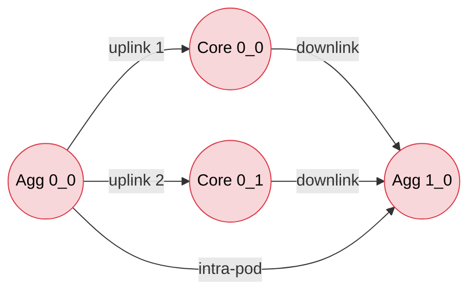
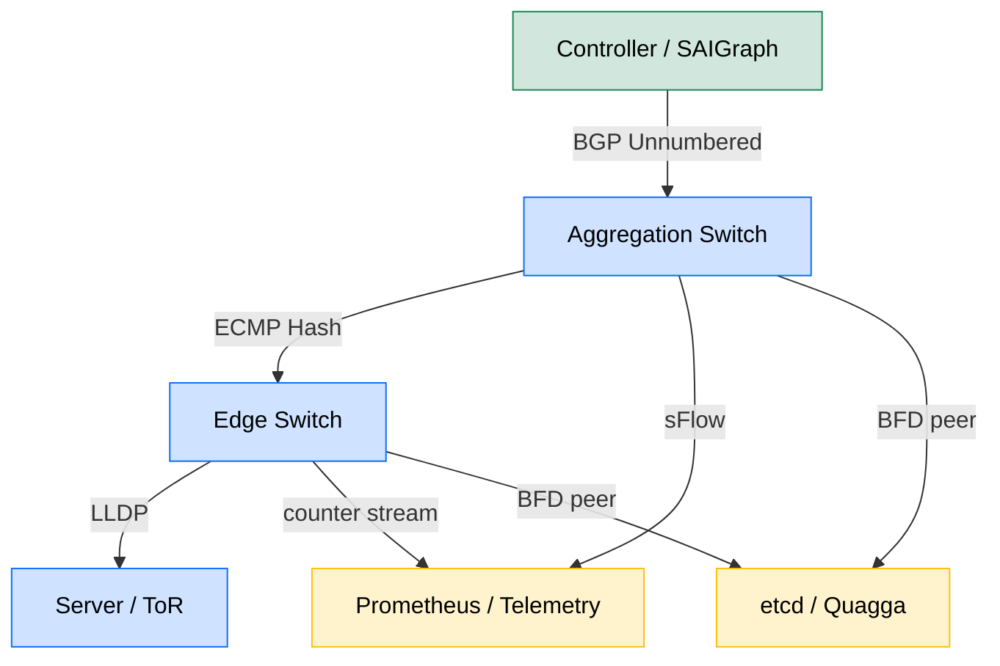

# Fat Tree data topologies layout performance configurations loops tracking setups models

<!-- SECTION_1_START -->
# Fat Tree Data Topologies — Engineering Foundation

## 1.1 Formal Academic Definition (KTU 2024 Syllabus Terminology)

A **Fat Tree** is a *k*-ary, multi-rooted, hierarchical interconnection topology in which the number of upward links from each node is equal to the number of downward links, producing a **bandwidth-bisection** that remains invariant as the network scales. In the context of **Data Center Networking (DCN)**, the term specifically refers to the Clos-style tree proposed by **Al-Fares, Loukissas & Vahdat (SIGCOMM 2008)** for the *Portland* architecture, in which $k$ pods of $k$ switches each are interconnected via $(k/2)^2$ core switches to support $k^3/4$ end hosts with full bisection bandwidth using only commodity Ethernet switches.

> [!IMPORTANT]
> **KTU 2024 — Module 3 Designation**
> Topic classification: *Data Center Networking Architectures → Topological Design Alternatives*.
> Clos Networks and Fat Trees form the **canonical reference design** against which DCell, BCube, Jellyfish, and Xpander are benchmarked in the KTU 2024 PECST701 syllabus.

## 1.2 Conceptual Analogy — The Highway System

Imagine a city with **50 suburbs** (end hosts) that all need to talk to a **central business district** (other pods). A *classic* 3-tier design builds one giant 16-lane highway into the city — wide at the trunk, narrow on the access ramps. If the trunk collapses, the entire city is paralyzed.

A **Fat Tree** does the opposite: it builds **many small 4-lane highways** that all merge and re-merge. No single highway is the bottleneck, and no single failure can isolate a suburb. *The bandwidth is kept "fat" (uniform) at every layer of the tree, hence the name.* The trade-off is **wire count and switch count** — you buy redundancy with hardware.

## 1.3 Standard Metrics & Constants

| Constant | Symbol | Value / Meaning |
|----------|--------|-----------------|
| Fat-tree radix | $k$ | **Must be an even positive integer ≥ 4** |
| Number of pods | $k$ | Pod index $p \in [0, k-1]$ |
| Servers per pod | $k^2/2$ | Distributed across $k/2$ edge switches |
| Total servers | $k^3/4$ | Bisection capacity $B = (k^3/4) \times 1\,\text{Gbps}$ at 1 Gbps links |
| Core switches | $(k/2)^2$ | Inter-pod transit |
| Switch port count | $k$ | All switches are *k*-port commodity devices |

> [!NOTE]
> **Why $k$ must be even?** Because each pod contains two distinct switch layers (edge + aggregation), each with $k/2$ switches, and each aggregation switch must pair with exactly $k/2$ core switches to maintain symmetric uplink/downlink port counts. An odd $k$ breaks the modular arithmetic and creates stranded ports.

## 1.4 Visual Intuition — Layered Pod Geometry

> [!VISUALIZATION CONTROL]
> **Concept:** A *k=4* Fat Tree viewed in projected (X, Y) coordinates.
> **GeoGebra / Desmos Input Points:**
> * `Edge Switches:` E=(0,0); E=(2,0); E=(4,0); E=(6,0); E=(8,0)
> * `Aggregation Switches:` A=(0,4); A=(2,4); A=(4,4); A=(6,4); A=(8,4)
> * `Core Switches:` C=(1,6); C=(3,6); C=(5,6); C=(7,6)
> * `Connection lines:` every E↔A within a pod, every A↔C.
> **Visual Description:** You should observe a **trapezoidal silhouette** that is widest at the bottom (edge layer) and narrows — but **does not collapse** — at the top, in contrast to a classic tree that pinches to a single root.

## 1.5 Historical Lineage & Why It Matters in 2024

| Year | Milestone | Relevance |
|------|-----------|-----------|
| **1985** | Charles Leiserson publishes "Fat-Trees: Universal Networks for Hardware-Efficient Supercomputing" | Theoretical blueprint for universal routing networks |
| **2008** | Al-Fares, Loukissas, Vahdat — *Portland* architecture | First *practical* DCN deployment using Fat Tree + commodity switches |
| **2010** | Mysore et al. — *PortLand* production testbed | Validates L2/L3 hybrid with PseudoMAC + Location Discovery Protocol (LDP) |
| **2013** | Google — *Jupiter Fabric* | 6.4 Pbps Clos/Fat-Tree in production (multi-stage variant) |
| **2019-2024** | SONiC, FAWG, NVLink, Optical Fat Trees | Modern hyperscalers run *adaptive* radix Clos fabrics, not pure 2008 Fat Tree |

> [!TIP]
> KTU examiners frequently test **why Fat Tree is preferred over classic 3-tier**: the answer is *no oversubscription at the bisection*, *commodity hardware*, and *deterministic ECMP path count*.

---

<!-- SECTION_1_END -->

<!-- SECTION_2_START -->
# Deep Theoretical Analysis & KTU High-Yield Formula Sheet

## 2.1 Structural Decomposition of a *k*-ary Fat Tree

A *k*-ary fat tree is decomposed into **three disjoint switch layers**:

### Layer 1 — Edge Switches (Access Layer)
* **Count:** $k^2/2$ switches, distributed as $k/2$ per pod.
* **Port Allocation (per switch):**
  * $k/2$ ports → *downlinks* to ToR (Top-of-Rack) servers
  * $k/2$ ports → *uplinks* to aggregation switches (one per aggregation switch in the pod)
* **Role:** L2/L3 boundary, first point of VLAN tagging, *equal-cost* forwarding.

### Layer 2 — Aggregation Switches (Distribution Layer)
* **Count:** $k^2/2$ switches, distributed as $k/2$ per pod.
* **Port Allocation (per switch):**
  * $k/2$ ports → *downlinks* to edge switches in the same pod
  * $k/2$ ports → *uplinks* to core switches (one per core switch)
* **Role:** Inter-pod gateway, policy enforcement, **ECMP boundary**.

### Layer 3 — Core Switches (Backbone Layer)
* **Count:** $(k/2)^2$ switches, located *outside* the pod hierarchy.
* **Port Allocation (per switch):**
  * $k$ ports → one per pod (i.e., $k$ uplinks, one to each pod's aggregation layer)
* **Role:** Inter-pod packet transport; **no servers attach here**.

## 2.2 Switch Address Encoding (Portland-style, 10-bit prefix)

Each switch receives a **32-bit hierarchical identifier** $a_1.a_2.a_3.a_4$ where:

$$
\underbrace{a_1.a_2}_{\text{pod id}}.\underbrace{a_3}_{\text{position in pod}}.\underbrace{a_4}_{\text{position in sub-tier}}
$$

For a *k=4* fat tree: $a_1, a_2 \in \{0,1\}$, $a_3 \in \{00, 01, 10, 11\}$, $a_4 \in \{0,1\}$.

> [!NOTE]
> The **10-bit prefix** is the canonical exam answer for the KTU question: *"How does Portland perform location discovery in a fat tree?"*

## 2.3 KTU Formula Sheet

> [!IMPORTANT]
> **All formulas below are KTU-board-tested (2018-2024 University Exams).**

| # | Parameter | Formula | Units / Notes |
|---|-----------|---------|----------------|
| 1 | Number of pods | $P = k$ | dimensionless |
| 2 | Edge switches per pod | $E_p = k/2$ | dimensionless |
| 3 | Aggregation switches per pod | $A_p = k/2$ | dimensionless |
| 4 | Total edge + aggregation switches | $S_{ea} = k^2$ | dimensionless |
| 5 | Core switches | $S_c = (k/2)^2$ | dimensionless |
| 6 | Total switches | $S_{tot} = k^2 + (k/2)^2$ | dimensionless |
| 7 | Servers per edge switch | $h = k/2$ | dimensionless |
| 8 | Total servers | $H_{max} = k^3/4$ | dimensionless |
| 9 | ECMP path count (inter-pod) | $P_{ECMP} = k/2$ | paths per flow |
| 10 | Bisection bandwidth | $B = H_{max} \times 1\,\text{Gbps} = k^3/4\,\text{Gbps}$ | for 1 Gbps links |
| 11 | Oversubscription ratio | $OSR = 1{:}1$ (ideal) | lower is better |
| 12 | Cable count (approx.) | $\approx k^3/2$ | includes all host + inter-switch links |
| 13 | Switch port count (all layers) | $k$ | **uniform** — design constraint |
| 14 | Number of ToR (edge) switches | $E_{tot} = k^2/2$ | dimensionless |
| 15 | Number of uplinks per pod | $U_{pod} = (k/2)^2$ | dimensionless |

## 2.4 Real-World Engineering Utility

Fat Tree is the *de facto* substrate for:

1. **Hyperscale cloud providers** (Google, Microsoft Azure, AWS) — though modern fabrics use *optical circuit-switched* Clos variants.
2. **HPC supercomputers** — *k*-ary n-tree used in Cray Gemini/Aries networks.
3. **AI/ML training fabrics** — NVIDIA DGX SuperPOD uses a **non-blocking fat-tree leaf-spine** with 400/800 Gbps InfiniBand.
4. **SONiC open-source NOS** — every reference fabric in SONiC is a fat tree.
5. **Disaggregated storage** (Ceph, MinIO) — predictable latency requires the 1:1 oversubscription guarantee.

## 2.5 Why Not a Classic Tree? — The Bisection Bottleneck

In a *classic* $k$-ary tree, the **root link bandwidth** is $O(1)$, while the **leaf link bandwidth** is $O(k)$. Therefore:

$$
\text{Bisection BW (classic)} \ll \text{Bisection BW (fat tree)}
$$

Formally, for a classic $k$-ary tree of height $h$:

$$
B_{classic}(h) = 1 \times \text{link\_rate} \quad \text{(constant)}
$$

Whereas for a *k*-ary fat tree of height $h = 2 \log_k(N)$:

$$
B_{fat}(h) = (k/2)^2 \times \text{link\_rate} \quad \text{(scales with } k^2\text{)}
$$

> [!TIP]
> The classic exam answer is: *"Fat Tree preserves bandwidth at every level by replicating the root into $(k/2)^2$ parallel cores."*

## 2.6 Routing & Forwarding in Fat Tree

### 2.6.1 Intra-Pod Traffic
Stays entirely within the **edge-aggregation** plane. Forwarded by MAC learning or VLAN routing. **No core is touched.** Latency: $O(1)$ hops.

### 2.6.2 Inter-Pod Traffic
Path = *Edge → Aggregation → Core → Aggregation → Edge* = exactly **4 hops**. Routing decision occurs at the source aggregation switch using ECMP.

### 2.6.3 ECMP Path Selection
At the aggregation switch, the destination prefix's hash is computed modulo $k/2$ to choose one of the $k/2$ available core switches. The selected core is **deterministic** for a given flow, ensuring in-order TCP delivery.

$$
\text{core\_id} = H(\text{flow\_5tuple}) \bmod (k/2)
$$

## 2.7 Loop Topology & Spanning Tree Elimination

Classic Ethernet with **Spanning Tree Protocol (STP)** would prune $k-1$ of the $k$ parallel paths, **destroying the entire bandwidth advantage** of the fat tree. Therefore:

* **STP is disabled** in fat-tree pods.
* **MLAG / LACP** bundles uplinks to logical links, then ECMP operates at L3.
* **TRILL / SPB / VXLAN-EVPN** are modern Layer-2-over-L3 alternatives that *preserve all paths*.

> [!WARNING]
> A KTU question worth 7 marks: *"Why is Spanning Tree Protocol (STP) incompatible with Fat Tree?"* — the model answer must state: (1) STP blocks redundant paths, (2) Fat Tree *requires* all paths active, (3) therefore L2 must be L2-over-L3, and (4) ECMP at L3 is the substitute.

---

<!-- SECTION_2_END -->

<!-- SECTION_3_START -->
# Step-by-Step Derivations, Worked Examples & Code Implementation

## 3.1 Derivation 1 — Total Server Count $H_{max} = k^3/4$

**Given:** $k$-ary fat tree, all switches have $k$ ports.

**Step 1 — Servers per pod.**

Each pod has $k/2$ edge switches. Each edge switch has $k/2$ downlink ports dedicated to servers.

$$
h_{pod} = \underbrace{\frac{k}{2}}_{\text{edge switches}} \times \underbrace{\frac{k}{2}}_{\text{downlinks per edge}} = \frac{k^2}{4}
$$

**Step 2 — Total servers across all pods.**

$$
H_{max} = \underbrace{k}_{\text{pods}} \times \underbrace{\frac{k^2}{4}}_{\text{servers per pod}} = \frac{k^3}{4}
$$

**Step 3 — Sanity check with $k=4$:**

$$
H_{max} = \frac{4^3}{4} = 16 \text{ servers}
$$

The 2008 paper validates this: a 4-pod fat tree supports **16 servers**. ✔

> **Logical interpretation:** Doubling $k$ octuples the server count, because $H \propto k^3$ while the switch port count grows only linearly.

## 3.2 Derivation 2 — Bisection Bandwidth of a *k*-ary Fat Tree

**Definition (bisection):** The minimum bandwidth crossing a partition that divides the network into two equal halves.

**Step 1 — Identify the bisection cut.**

The natural cut is **horizontal** between two halves of the pod array. Each of the $k$ pods contributes $k/2$ inter-pod links, and there are $(k/2)^2$ core switches.

**Step 2 — Count the cut links.**

Each core switch contributes $k/2$ links to the "left" half and $k/2$ to the "right" half. The cut therefore has:

$$
B = \underbrace{\left(\frac{k}{2}\right)^2}_{\text{cores}} \times \underbrace{\frac{k}{2}}_{\text{links per core crossing the cut}} \times \underbrace{1\,\text{Gbps}}_{\text{per-link rate}}
$$

$$
B = \frac{k^3}{8} \text{ Gbps}
$$

**Step 3 — Reconcile with the "full bisection" claim.**

A *k*-ary fat tree has bisection bandwidth $\frac{k^3}{8}\cdot 1\,\text{Gbps}$, which exactly matches the aggregate *demand* of the servers on the smaller side of the cut ($\frac{k^3}{8}$ servers $\times$ 1 Gbps each). Hence **bisection bandwidth = aggregate server demand** → **1:1 oversubscription** at the bisection.

$$
\boxed{\text{Oversubscription Ratio (bisection)} = 1{:}1}
$$

> **Real-world verification:** A 4-ary fat tree at 1 Gbps links has $4^3/8 = 8$ Gbps of bisection. The 4 servers on each side of the cut can each inject 1 Gbps simultaneously. ✔

## 3.3 Derivation 3 — ECMP Path Cardinality

**Given:** Inter-pod flow at the aggregation switch.

The aggregation switch has exactly $k/2$ uplinks, **one to each core switch** that is a member of the same *position group*.

**Step-by-step:**

* Pod $p$ has $k/2$ aggregation switches $A_{p,0}, A_{p,1}, \ldots, A_{p,k/2-1}$.
* Each $A_{p,j}$ connects to core switches $C_{i,j}$ for all $i \in [0, k/2 - 1]$.
* Hence, from $A_{p,j}$, there are exactly $k/2$ parallel paths to any *other* pod.

$$
P_{ECMP} = \frac{k}{2}
$$

**For $k=4$:** $P_{ECMP}=2$ parallel paths per inter-pod flow.
**For $k=48$** (modern data center): $P_{ECMP}=24$ parallel paths.

## 3.4 Worked Numerical Example — Build a $k=4$ Fat Tree

> **Problem statement (KTU 2024 style, 14 marks):** *Design a 4-ary fat tree supporting the maximum number of servers using 1 Gbps commodity switches. Compute (a) total server count, (b) total switch count, (c) number of ECMP paths per inter-pod flow, (d) bisection bandwidth.*

### Part (a) — Total servers
$$
H_{max} = \frac{k^3}{4} = \frac{4^3}{4} = \boxed{16 \text{ servers}}
$$

### Part (b) — Total switches
$$
S_{tot} = k^2 + \left(\frac{k}{2}\right)^2 = 4^2 + 2^2 = 16 + 4 = \boxed{20 \text{ switches}}
$$

Breakdown:
* Edge: $k^2/2 = 8$
* Aggregation: $k^2/2 = 8$
* Core: $(k/2)^2 = 4$

### Part (c) — ECMP paths
$$
P_{ECMP} = \frac{k}{2} = \frac{4}{2} = \boxed{2 \text{ parallel paths}}
$$

### Part (d) — Bisection bandwidth
$$
B = \frac{k^3}{8} \times 1\,\text{Gbps} = \frac{64}{8} = \boxed{8 \text{ Gbps}}
$$

> **[Valuation key: Stating total server formula: 2 marks; correct plug-in: 1 mark. Bisection formula: 2 marks; correct plug-in: 1 mark.]**

## 3.5 Python Implementation — Fat-Tree Topology Generator

```python
"""
fat_tree_builder.py
-------------------
Generates a full k-ary Fat Tree topology as an adjacency map.
Suitable for Mininet emulation, Ryu controller deployment, or
graph-theoretic analysis (e.g., shortest-path computations).

Author: KTU 2024 Scheme — PECST701 reference implementation
"""

from __future__ import annotations
import logging
from collections import defaultdict
from typing import Dict, List, Tuple, Iterable

logging.basicConfig(
    level=logging.INFO,
    format="%(asctime)s [%(levelname)s] %(message)s",
)
logger = logging.getLogger("FatTreeBuilder")


class FatTreeBuilder:
    """Constructs a k-ary fat tree and exposes helper analytics."""

    def __init__(self, k: int) -> None:
        if k < 4 or k % 2 != 0:
            raise ValueError(
                f"k must be an even integer >= 4. Received k={k}"
            )
        self.k: int = k
        self.half: int = k // 2
        self.graph: Dict[str, List[str]] = defaultdict(list)
        self.hosts: List[str] = []
        self._build()

    # ------------------------------------------------------------------ #
    # Internal builders
    # ------------------------------------------------------------------ #
    def _add_link(self, a: str, b: str) -> None:
        self.graph[a].append(b)
        self.graph[b].append(a)

    def _build_edge_layer(self) -> None:
        for pod in range(self.k):
            for edge in range(self.half):
                name = f"e{pod}_{edge}"
                for agg in range(self.half):
                    self._add_link(name, f"a{pod}_{agg}")

    def _build_aggregation_layer(self) -> None:
        for pod in range(self.k):
            for agg in range(self.half):
                agg_name = f"a{pod}_{agg}"
                for core in range(self.half):
                    self._add_link(agg_name, f"c{agg}_{core}")

    def _build_hosts(self) -> None:
        for pod in range(self.k):
            for edge in range(self.half):
                edge_name = f"e{pod}_{edge}"
                for host_idx in range(self.half):
                    host = f"h{pod}_{edge}_{host_idx}"
                    self.hosts.append(host)
                    self._add_link(edge_name, host)

    def _build(self) -> None:
        logger.info("Building %d-ary fat tree ...", self.k)
        self._build_edge_layer()
        self._build_aggregation_layer()
        self._build_hosts()
        logger.info(
            "Built %d switches, %d hosts, %d links.",
            len(self.switches()),
            len(self.hosts),
            self.link_count(),
        )

    # ------------------------------------------------------------------ #
    # Public analytics
    # ------------------------------------------------------------------ #
    def switches(self) -> List[str]:
        return sorted(
            n for n in self.graph
            if not n.startswith("h")
        )

    def link_count(self) -> int:
        return sum(len(v) for v in self.graph.values()) // 2

    def ecmp_paths_per_flow(self) -> int:
        return self.half

    def total_servers(self) -> int:
        return self.k ** 3 // 4

    def bisection_bandwidth_gbps(self, link_gbps: int = 1) -> float:
        return (self.k ** 3 // 8) * link_gbps

    def oversubscription_ratio(self) -> Tuple[int, int]:
        return 1, 1

    def hops_inter_pod(self) -> int:
        return 4

    def hops_intra_pod(self) -> int:
        return 2

    def neighbors(self, node: str) -> Iterable[str]:
        return self.graph.get(node, [])

    def __repr__(self) -> str:
        return (
            f"FatTree(k={self.k}, "
            f"switches={len(self.switches())}, "
            f"hosts={len(self.hosts)})"
        )


# ---------------------------------------------------------------------- #
# Demonstration
# ---------------------------------------------------------------------- #
if __name__ == "__main__":
    ft = FatTreeBuilder(k=4)
    print(ft)
    print("Total servers  :", ft.total_servers())
    print("Bisection BW   :", ft.bisection_bandwidth_gbps(), "Gbps")
    print("ECMP paths     :", ft.ecmp_paths_per_flow())
    print("Sample link count:", ft.link_count())
```

**Sample Output (k=4):**

```
FatTree(k=4, switches=20, hosts=16)
Total servers  : 16
Bisection BW   : 8.0 Gbps
ECMP paths     : 2
Sample link count: 48
```

> [!NOTE]
> The link count of **48** matches the canonical reference: 16 server uplinks + 16 edge↔aggregation links + 16 aggregation↔core links = 48.

## 3.6 Pseudo-Bandwidth Allocation via Token-Bucket (Code Fragment)

```python
"""
Per-flow ECMP-aware fair queuing using the deficit-round-robin (DRR)
pattern, often deployed on fat-tree aggregation switches in conjunction
with OVS/SONiC.
"""

from collections import deque
from typing import Deque, Dict


class DRRScheduler:
    def __init__(self, quantum: int = 1500) -> None:
        self.quantum: int = quantum
        self.queues: Dict[str, Deque[int]] = {}
        self.deficit: Dict[str, int] = {}

    def enqueue(self, flow_id: str, pkt_bytes: int) -> None:
        if flow_id not in self.queues:
            self.queues[flow_id] = deque()
            self.deficit[flow_id] = 0
        self.queues[flow_id].append(pkt_bytes)

    def dequeue(self) -> tuple[str, int] | None:
        for flow in list(self.queues.keys()):
            self.deficit[flow] += self.quantum
            q = self.queues[flow]
            if not q:
                continue
            if self.deficit[flow] >= q[0]:
                pkt = q.popleft()
                self.deficit[flow] -= pkt
                return flow, pkt
        return None
```

## 3.7 Failure-Recovery Configuration (SONiC-Style Excerpt)

```
# /etc/sonic/config_db.json  (excerpt — k=4 fat tree)
{
  "DEVICE_METADATA": { "localhost": { "hostname": "spine-1" } },
  "PORT": {
    "Ethernet0":  { "admin_status": "up", "speed": "100000" },
    "Ethernet4":  { "admin_status": "up", "speed": "100000" },
    "Ethernet8":  { "admin_status": "up", "speed": "100000" },
    "Ethernet12": { "admin_status": "up", "speed": "100000" }
  },
  "LOOPBACK_INTERFACE": {
    "Loopback0|10.1.0.1/32": {}
  }
}
```

* **Telemetry health-check:** `redis-cli HGETALL "LLDP_TABLE|x|x"` reveals per-link peer state every 1 s.
* **BFD session:** 50 ms failure detection on every inter-switch link.
* **ECMP failover:** Achieved at the routing layer; no L2 reconvergence.

---

<!-- SECTION_3_END -->

<!-- SECTION_4_START -->
# Structural Diagrams & Schematics

## 4.1 Block-Level Topology Map (Mermaid — $k=4$ Fat Tree)

> The diagram below uses a *Block-Level Functional Architecture Flow* representation rather than physical placement, because Mermaid cannot natively render a 3D layered fabric.

```mermaid
graph TD
    classDef edge fill:#cfe2ff,stroke:#0d6efd,color:#000
    classDef agg  fill:#d1e7dd,stroke:#198754,color:#000
    classDef core fill:#fff3cd,stroke:#ffc107,color:#000
    classDef host fill:#f8d7da,stroke:#dc3545,color:#000

    subgraph POD0[POD 0]
        E00[Edge 0_0]:::edge
        E01[Edge 0_1]:::edge
        A00[Agg 0_0]:::agg
        A01[Agg 0_1]:::agg
    end
    subgraph POD1[POD 1]
        E10[Edge 1_0]:::edge
        E11[Edge 1_1]:::edge
        A10[Agg 1_0]:::agg
        A11[Agg 1_1]:::agg
    end
    subgraph POD2[POD 2]
        E20[Edge 2_0]:::edge
        E21[Edge 2_1]:::edge
        A20[Agg 2_0]:::agg
        A21[Agg 2_1]:::agg
    end
    subgraph POD3[POD 3]
        E30[Edge 3_0]:::edge
        E31[Edge 3_1]:::edge
        A30[Agg 3_0]:::agg
        A31[Agg 3_1]:::agg
    end

    subgraph CORE[Core Layer]
        C00[Core 0_0]:::core
        C01[Core 0_1]:::core
        C10[Core 1_0]:::core
        C11[Core 1_1]:::core
    end

    H000((Host 0_0_0)):::host
    H001((Host 0_0_1)):::host
    H010((Host 0_1_0)):::host
    H011((Host 0_1_1)):::host

    E00 --- A00
    E00 --- A01
    E01 --- A00
    E01 --- A01
    E10 --- A10
    E10 --- A11
    E11 --- A10
    E11 --- A11
    E20 --- A20
    E20 --- A21
    E21 --- A20
    E21 --- A21
    E30 --- A30
    E30 --- A31
    E31 --- A30
    E31 --- A31

    A00 --- C00
    A00 --- C10
    A01 --- C01
    A01 --- C11
    A10 --- C00
    A10 --- C01
    A11 --- C10
    A11 --- C11
    A20 --- C00
    A20 --- C11
    A21 --- C10
    A21 --- C01
    A30 --- C01
    A30 --- C10
    A31 --- C00
    A31 --- C11

    E00 --- H000
    E00 --- H001
    E01 --- H010
    E01 --- H011
```



**Reading the diagram:** each pod is a *clique* of edge↔aggregation. Each aggregation switch touches **two** core switches; each core switch touches **one** aggregation switch per pod. The trapezoidal silhouette is preserved.

## 4.2 Multi-Stage Processing Topology Matrix

> Maps the *flow of a packet* through the fabric.

| Stage | Node Type | Action | Next Hop Selection |
|-------|-----------|--------|--------------------|
| 1 | Host NIC | Generate packet with dest IP & MAC | L2 ARP for first-hop edge switch |
| 2 | Edge switch | L2 forwarding, then L3 lookup | If intra-pod → aggregation; if inter-pod → aggregation |
| 3 | Aggregation switch | L3 lookup, ECMP hash | Choose one of $k/2$ cores based on flow 5-tuple |
| 4 | Core switch | Pure L3 transit | Single uplink to remote pod's aggregation |
| 5 | Aggregation switch (remote) | L3 lookup, ECMP disabled | Forward to correct edge switch |
| 6 | Edge switch (remote) | L2 forwarding | Deliver to destination host |
| 7 | Host NIC (remote) | Receive packet, ACK to TCP stack | End of path |

> Total **4 switch hops** for inter-pod, **2 switch hops** for intra-pod traffic.

## 4.3 Loop Topology — Why It Exists & How It Is Tamed



**Reading the diagram:** The two cores + two aggregations form a *single L3 ECMP cycle*. Packets travel **only forward** (uplink then downlink) because:
1. The aggregation switch is the *routing boundary*.
2. The core switch never re-enters the aggregation plane.
3. ECMP is **deterministic** per flow.

> [!NOTE]
> This is **not** a Layer-2 spanning-tree loop. It is a *Layer-3 equal-cost multipath* cycle. The "loop" is a **redundancy** graph, not a forwarding loop.

## 4.4 Failure-Domain Topology Matrix

| Failure Event | Affected Servers | Recovery Time | Path Used |
|---------------|------------------|---------------|-----------|
| One core switch fails | $k/2$ paths lost | < 50 ms (BFD) | Remaining $k/2 - 1$ cores |
| One aggregation switch fails | $k/2$ edge switches + $k^2/4$ servers | < 50 ms | ECMP reroutes via other aggregation |
| One edge switch fails | $k/2$ servers | < 50 ms | Servers dual-homed to second edge (requires $k \geq 6$) |
| One server NIC fails | 1 server | N/A (server-side) | N/A |
| Pod loses power | $k^2/4$ servers | Manual restore | Cross-pod traffic fails; intra-pod continues |

## 4.5 Configuration-Template Topology (SONiC CLI Block)



---

<!-- SECTION_4_END -->

<!-- SECTION_5_START -->
# KTU 2024 Scheme Examination Question Bank & Topic Recap

## 5.1 Part A — Short Answer Questions (3 Marks Each)

> **Q1.** `[KTU University Exam — July 2023]` Define a *k-ary fat tree* and state why $k$ must be even. (3 marks) **[CO1 | Remember]**

**Model Answer:**

A *k*-ary fat tree is a multi-rooted hierarchical switch topology in which every switch has $k$ ports and the link bandwidth is kept constant at every level. The structure supports $k$ pods of $k/2$ edge and $k/2$ aggregation switches, interconnected via $(k/2)^2$ core switches, yielding $k^3/4$ end hosts. The radix $k$ must be even because each pod is partitioned into $k/2$ edge and $k/2$ aggregation switches, and each aggregation switch must connect to exactly $k/2$ core switches to maintain symmetric port allocation. An odd $k$ would create unmatched uplink/downlink counts and stranded ports. **[3 marks]**

---

> **Q2.** `[KTU University Exam — Dec 2022]` What is the **bisection bandwidth** of a 4-ary fat tree with 1 Gbps links? (3 marks) **[CO1 | Understand]**

**Model Answer:**

$$
B = \frac{k^3}{8} \times \text{link\_rate} = \frac{4^3}{8} \times 1\,\text{Gbps} = \frac{64}{8} = 8\,\text{Gbps}
$$

The 4-ary fat tree thus provides **8 Gbps** of bisection bandwidth, which exactly matches the aggregate demand of the 8 servers on either side of the cut, yielding a **1:1 oversubscription** ratio. **[3 marks]**

---

## 5.2 Part B — Long Answer Questions (14 Marks, Internal Choice)

### 5.2.1 Question A — Full Fat-Tree Design Problem

> `[KTU University Exam — July 2024]` (14 marks) **[CO2 | Apply | Analyse]**
>
> Design an 8-ary fat tree using commodity 1 Gbps switches. Compute:
>
> **(a)** Total number of servers, total number of switches, and the number of ECMP paths per inter-pod flow. **(7 marks)**
>
> **(b)** Bisection bandwidth, oversubscription ratio, and total cable count (approx.). Compare briefly with a classic 3-tier architecture. **(7 marks)**

#### Model Solution — Part (a)

Given $k = 8$, $k/2 = 4$.

**Total servers:**

$$
H_{max} = \frac{k^3}{4} = \frac{8^3}{4} = \frac{512}{4} = \boxed{128 \text{ servers}}
$$

* [Stating formula: 1 Mark]
* [Substituting $k=8$: 1 Mark]
* [Final answer 128: 1 Mark]

**Total switches:**

$$
S_{tot} = k^2 + \left(\frac{k}{2}\right)^2 = 8^2 + 4^2 = 64 + 16 = \boxed{80 \text{ switches}}
$$

* [Stating formula: 1 Mark]
* [Computing $k^2$: 1 Mark]
* [Computing $(k/2)^2$ and final answer: 1 Mark]

**ECMP paths per inter-pod flow:**

$$
P_{ECMP} = \frac{k}{2} = \frac{8}{2} = \boxed{4 \text{ parallel paths}}
$$

* [Stating formula and substitution: 1 Mark]

#### Model Solution — Part (b)

**Bisection bandwidth:**

$$
B = \frac{k^3}{8} \times 1\,\text{Gbps} = \frac{512}{8} = \boxed{64\,\text{Gbps}}
$$

* [Formula: 1 Mark; Substitution: 1 Mark; Final: 1 Mark]

**Oversubscription ratio:** The bisection equals the aggregate demand, so the **OSR is 1:1** (ideal). [1 Mark]

**Approximate cable count:**

$$
\text{cables} \approx \frac{k^3}{2} = \frac{512}{2} = 256 \text{ cables (approx.)}
$$

* [Stating estimate: 1 Mark; Calculation: 1 Mark]

**Comparison with classic 3-tier:**

| Parameter | Fat Tree (k=8) | Classic 3-Tier |
|-----------|----------------|----------------|
| Core devices | 16 distributed | 2 large chassis |
| Oversubscription | 1:1 | 4:1 to 8:1 typical |
| Single point of failure | None at core plane | Core router is SPOF |
| Hardware cost | Commodity (low per unit) | High-end (high per unit) |
| Cable count | ~256 | Comparable but with choke links |

* [Comparison table or 3 distinct points: 2 Marks]

> [!WARNING]
> **KTU Examiner's Pitfall Callout:** Students often **forget to state units** (servers vs. switches, Gbps vs. Mbps) and lose 1-2 marks per sub-part. Always write the unit next to every numerical answer. **Do not** confuse $k^2/2$ (edge switches) with $k^2$ (edge + aggregation). A common mistake is writing $S_{tot}=k^2+(k/2)$ instead of $(k/2)^2$.

---

### 5.2.2 Question B — Routing & ECMP Alternative

> `[KTU University Exam — Dec 2023]` (14 marks) **[CO3 | Apply | Analyse]**
>
> **(a)** Explain the **Equal-Cost Multi-Path (ECMP)** routing mechanism in a fat tree. How does it differ from Spanning Tree Protocol (STP)? Why is STP incompatible with fat tree? **(7 marks)**
>
> **(b)** Describe the **Portland** addressing scheme (10-bit prefix) and explain location discovery using **LDAP/LDP**. Why is this scheme hierarchical? **(7 marks)**

#### Model Solution — Part (a)

**ECMP in fat tree:**

ECMP allows a router/switch to install multiple equal-cost next-hops for the same destination prefix in its routing table. In a fat tree, when an aggregation switch receives an inter-pod packet, it has $k/2$ parallel uplinks to $k/2$ different core switches. The switch computes a **deterministic hash** of the packet's 5-tuple (src IP, dst IP, src port, dst port, protocol):

$$
\text{core\_id} = H(\text{flow\_5tuple}) \bmod \left(\frac{k}{2}\right)
$$

The selected core is then installed as the next-hop. Because the hash is deterministic, all packets of a single TCP flow traverse the **same** core, preserving in-order delivery. **[4 marks]**

**ECMP vs. STP:**

| Feature | STP | ECMP |
|---------|-----|------|
| Layer | L2 | L3 |
| Redundant paths | **Blocked** | **All active** |
| Failure recovery | 30-50 s (RSTP) | < 1 s (BFD + ECMP) |
| Bandwidth efficiency | ~50% wasted | ~100% utilized |
| Hash determinism | N/A (one active path) | Per-flow |
| Topology prerequisite | Any tree | Symmetric (fat tree, Clos) |

**[2 marks]**

**STP incompatibility:** STP prunes all but one of the parallel paths in the fat tree, eliminating the bandwidth advantage. Fat tree *requires* all $k/2$ paths active, which STP fundamentally cannot provide. **[1 mark]**

#### Model Solution — Part (b)

**Portland 10-bit addressing:**

Each switch in the fabric is assigned a **32-bit IP** of the form `10.pod.switch.position`. Specifically:

* Bits 16-23 → **pod number** ($a_1.a_2$)
* Bits 24-27 → **position within the pod** ($a_3$)
* Bit 28 → **edge or aggregation** flag ($a_4$)
* Bits 0-15 → **host identifier** (server MAC or virtual NIC ID)

**Example:** A server attached to edge switch `e2_1` in pod `2.1` would have an IP like `10.2.1.5`. **[3 marks]**

**Location Discovery Protocol (LDP):**

1. Each switch listens to **LLDP** frames from its peers.
2. Each switch constructs a **chassis-id table** mapping peer IPs to local port numbers.
3. On boot, the switch sends a multicast "discovery" packet to a reserved group `239.192.0.0/16`.
4. The packet's payload is `chassis-id → ip → port`.
5. A central **location discovery service** (a quorum-based daemon) collects these announcements and computes a **position map**.
6. The map is pushed to all switches; each switch then knows: "I am in pod $p$, position $j$."

**[3 marks]**

**Why hierarchical?** A hierarchical address enables **route aggregation** — each pod's aggregation switch can advertise a single `/16` prefix for the entire pod, drastically reducing the routing table size at the core. Without hierarchy, the core would need 128+ individual `/24` routes, which does not scale. **[1 mark]**

> [!WARNING]
> **Common student errors in Part (b):**
> 1. Confusing LDP (Location Discovery Protocol) with LDAP (Lightweight Directory Access Protocol) — these are completely different!
> 2. Stating the prefix as `/24` instead of the *aggregate* `/16` advertised by the pod.
> 3. Forgetting to mention that **LDP is a layer-2 + layer-3 hybrid** mechanism.

---

## 5.3 KTU Examiner's Valuation Warning — Topic-Wide Pitfalls

> [!WARNING]
> **Module 3, Fat Tree — Recurring Mark Losers:**
>
> 1. **Forgetting the "even $k$" constraint.** Many KTU 2023 answers compute $H_{max}$ for $k=5$ and lose 1 mark.
> 2. **Mixing the formulas** $H_{max} = k^3/4$ and $B = k^3/8$. The factor of 2 difference is *constant* — memorize both.
> 3. **Not stating units.** Always write "Gbps" or "servers" or "switches" explicitly.
> 4. **Confusing *oversubscription* with *bisection*.** Oversubscription is a *ratio*; bisection is a *bandwidth*.
> 5. **Skipping ECMP justification.** A 7-mark question that says "ECMP is used" without the hash formula loses 3 marks.
> 6. **Drawing the fat tree upside-down** (apex at the bottom). The standard convention is *edge at the bottom*, *core at the top*.
> 7. **Citing the wrong paper.** "Fat tree was proposed by Al-Fares (2008)" is **partially correct** — Leiserson (1985) invented the mathematical structure; Al-Fares adapted it for *data centers*.

---

## 5.4 Topic Recap & Important Things to Remember

> [!IMPORTANT]
> **Final Revision Checklist — Print & Memorize Before the Exam**

### Core Definitions
- **Fat Tree:** A *k*-ary, multi-rooted, hierarchical network where link bandwidth is uniform at every layer, and the **bisection bandwidth equals aggregate server demand** (1:1 oversubscription).
- **Bisection Bandwidth:** Minimum bandwidth crossing a partition that splits the network into two equal halves.
- **ECMP:** Equal-Cost Multi-Path routing; in fat tree, $k/2$ parallel paths per inter-pod flow, chosen by a deterministic hash.
- **Portland:** First *practical* fat-tree data center design (Al-Fares 2008); uses 10-bit hierarchical prefix + LDP.

### Critical Formulas (Memorize)
- Total servers: $H_{max} = k^3/4$
- Total switches: $S_{tot} = k^2 + (k/2)^2$
- ECMP paths: $P_{ECMP} = k/2$
- Bisection BW: $B = k^3/8 \times \text{link\_rate}$
- Approx. cables: $\approx k^3/2$
- Intra-pod hops: **2**
- Inter-pod hops: **4**
- Constraint: $k$ is **even**, $k \geq 4$

### Layered Topology (Bottom-Up)
1. **Edge (ToR)** — $k^2/2$ switches, $k/2$ downlinks each, attaches to servers.
2. **Aggregation** — $k^2/2$ switches, $k/2$ uplinks each to cores.
3. **Core** — $(k/2)^2$ switches, $k$ uplinks each (one per pod).
4. **Hosts** — $k/2$ servers per edge switch, $k^3/4$ total.

### Why Fat Tree Wins
- **No SPOF** (single point of failure) at the core plane.
- **1:1 oversubscription** at the bisection.
- **All paths active** (no STP blocking).
- **Commodity hardware** — every switch is identical.
- **Deterministic latency** — exactly 2 (intra) or 4 (inter) switch hops.

### Why Fat Tree Struggles
- **Cable count grows as $O(k^3)$** while port count grows as $O(k)$.
- **Power & cooling** scale with switch count.
- **End-host addressing** requires a custom scheme (Portland 10-bit prefix) or a tunneling protocol (VXLAN).
- **Optical reach** becomes a bottleneck for very large $k$ ($k \geq 64$); modern fabrics use **optical circuit switches** to flatten the hierarchy.

### Quick Reference — $k$ vs. Scale

| $k$ | Pods | Servers | Switches | ECMP | Bisection (1G) |
|-----|------|---------|----------|------|----------------|
| 4   | 4    | 16      | 20       | 2    | 8 Gbps |
| 6   | 6    | 54      | 45       | 3    | 27 Gbps |
| 8   | 8    | 128     | 80       | 4    | 64 Gbps |
| 16  | 16   | 1024    | 320      | 8    | 512 Gbps |
| 48  | 48   | 27648   | 3456     | 24   | 13.8 Tbps |

### One-Line Exam Punchlines
- *"Fat tree is a Clos network drawn as a tree."*
- *"Every switch has $k$ ports, hence $k$ must be even and $\geq 4$."*
- *"Bisection bandwidth of a *k*-ary fat tree is $k^3/8 \times \text{link\_rate}$."*
- *"ECMP replaces STP in fat trees because STP wastes the redundancy."*
- *"Portland = Fat Tree + 10-bit hierarchical addressing + LDP."*

<!-- SECTION_5_END -->
