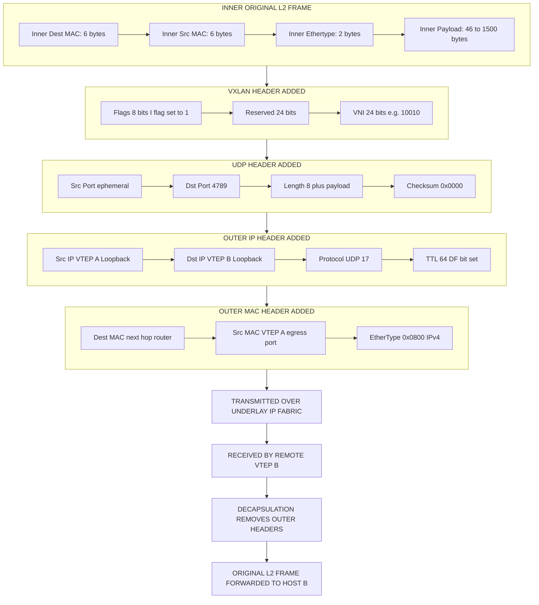
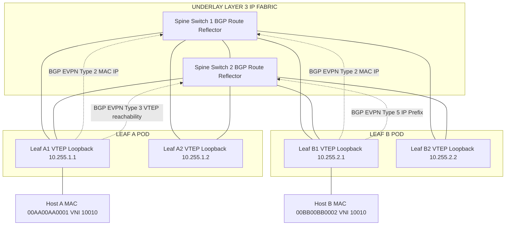
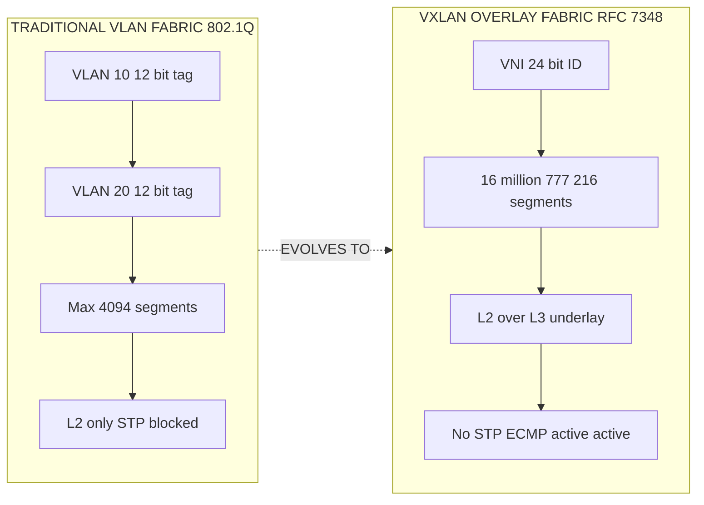

# Overlay network virtualization architectures parameters: VXLAN tunnel configurations architectures

<!-- SECTION_1_START -->
# VXLAN Tunnel Configurations & Architectures

## 1. Core Technical Definition & Intuitive Overview

### Formal Definition (KTU 2024 Syllabus Terminology)

**Virtual Extensible LAN (VXLAN)** is a network overlay virtualization technology defined in **RFC 7348** by the **IETF (Internet Engineering Task Force)** that enables the creation of a logically isolated **Layer 2 (L2) overlay network** on top of an existing physical **Layer 3 (L3) underlay network**. It accomplishes this by encapsulating original Ethernet frames inside **UDP (User Datagram Protocol) datagrams** transported over the IP-based underlay, thereby extending Layer 2 connectivity across geographically dispersed data center pods.

> [!IMPORTANT]
> **KTU Board Highlight:** VXLAN is a *tunneling* protocol, not a *routing* protocol. The base technology is **MAC-in-UDP encapsulation**, and the core identifier is the **24-bit VNI (VXLAN Network Identifier)** that allows up to **16,777,216** logical segments — compared to the **4094** limit of traditional VLANs (IEEE 802.1Q).

---

### Conceptual Analogy / Intuition

Imagine the data center is a giant **postal system**:

- The **underlay network** (IP fabric) is the highway system connecting cities.
- Each **building** (server rack) contains thousands of **apartments** (virtual machines/containers).
- A traditional **VLAN** is like a local neighborhood — limited to **4,094** houses because of the 12-bit tag.
- **VXLAN** is like giving every apartment a **unique, globally unique postal code (24-bit VNI)** and shipping its letters inside a **standardized courier envelope (UDP header)**. The courier (underlay routers) doesn't care what's inside; they just deliver the envelope to the right city block, where the local postmaster (**VTEP**) opens it and delivers to the correct apartment.

> [!NOTE]
> **Real-World Deployment:** Every major hyperscaler — **Amazon AWS**, **Microsoft Azure**, **Google GCP**, **Oracle Cloud**, and **Alibaba Cloud** — runs VXLAN-based fabrics at production scale using **EVPN-VXLAN** as the control plane. **Cisco Nexus 9000**, **Arista 7050X**, **Juniper QFX**, and **NVIDIA Mellanox Spectrum** switches ship with hardware-accelerated VXLAN offload engines.

---

### Core Architectural Components

| Component | Full Form | Function |
|-----------|-----------|----------|
| **VTEP** | VXLAN Tunnel End Point | Encapsulation / Decapsulation device (typically a ToR switch or hypervisor vSwitch) |
| **VNI** | VXLAN Network Identifier | **24-bit** segment ID allowing **16M** logical Layer 2 domains |
| **NVE** | Network Virtualization Edge | Logical interface where VXLAN encapsulation originates/terminates |
| **Underlay** | Physical IP Network | Transport infrastructure (typically **eBGP** or **OSPF** routed fabric) |
| **Overlay** | Virtual Tunnel Mesh | Logical topology built on top of underlay |

> [!IMPORTANT]
> **KTU Mandate:** The **default VXLAN UDP destination port** is **4789** (IANA assigned). Earlier implementations used **8472** (Linux default). Modern Cisco NX-OS, Arista EOS, and Linux kernel 4.x+ all use **port 4789** per RFC 7348.

---

### Standard Frame Format & Critical Constants

> [!NOTE]
> **Header Size Budget:** Original Ethernet frame (up to **1518 bytes**) + Outer MAC (14) + Outer IP (20) + Outer UDP (8) + VXLAN Header (8) = **~50 bytes** of overhead. The recommended **MTU** for the underlay IP fabric is therefore **1550 bytes** or higher (commonly **9000 bytes** jumbo for DC).

Key parameters to memorize for KTU exams:
- **VNI Length:** 24 bits → **16,777,216** segments
- **UDP Destination Port:** **4789**
- **VXLAN Header Flags:** 8 bits (with `I-flag` for Instance learning)
- **Underlay Protocol:** IPv4 unicast / IPv4 multicast / IPv6 unicast
- **Maximum Encapsulation Overhead:** **50 bytes** (worst case)

> [!VISUALIZATION CONTROL]
> **Concept:** VXLAN Frame Encapsulation Stack
> **GeoGebra / Desmos Input Equations:** *(Not applicable — this is a layered protocol stack visualized below in the schematic section.)*
> **Visual Description:** Picture a Russian-doll arrangement where the original L2 frame is wrapped successively in a VXLAN header (8 bytes), UDP header (8 bytes), Outer IP header (20 bytes), and Outer Ethernet header (14 bytes), creating a total overhead of 50 bytes.

---

## 2. Deep Theoretical Analysis & KTU High-Yield Formula Sheet

### Operational Flow of a VXLAN Tunnel

1. **Host A in Tenant Segment (VNI = 10010)** generates an Ethernet frame destined for Host B.
2. The local **VTEP-A (e.g., ToR switch)** receives the frame on a configured **NVE interface** bound to a **Layer 2 VNI**.
3. VTEP-A performs a **MAC-to-VTEP-IP lookup** in its **VXLAN MAC table**.
4. If the destination MAC is known, VTEP-A encapsulates the original frame into a **VXLAN-UDP-IP packet**.
5. The outer IP header is sourced with **VTEP-A's Loopback IP** and destined to **VTEP-B's Loopback IP**.
6. The packet traverses the **underlay IP fabric** using standard routing (BGP/OSPF/IS-IS).
7. **VTEP-B** decapsulates the packet, strips the outer headers, and forwards the original L2 frame out the local NVE interface to Host B.
8. If the destination MAC is **unknown** (BUM traffic — Broadcast, Unknown unicast, Multicast), VTEP-A uses **Ingress Replication (IR)** or **Multicast underlay** to flood the packet to all remote VTEPs in the same VNI.

---

### Why VXLAN? (The 'Why' Behind the Design)

- **VLAN Scalability Exhaustion:** Traditional 802.1Q VLANs support only **4,094** segments — completely insufficient for multi-tenant clouds with thousands of tenants.
- **Layer 2 Stretching Across Pods:** Enables VM mobility across L3 boundaries (e.g., between availability zones) without changing IP addresses.
- **Hardware Isolation:** Tenants cannot interfere with each other even when sharing the same physical switches.
- **Decoupling Topology:** The overlay topology (L2) is **completely independent** of the physical topology (L3 Clos fabric).
- **Workload Portability:** Bare-metal servers, VMs, and containers can coexist on the same logical segment.

---

### KTU Formula Sheet / Cheat Sheet

| Parameter | Value / Formula | Unit | Notes |
|-----------|-----------------|------|-------|
| **Number of Logical Segments (VNI)** | $N_{VNI} = 2^{24}$ | segments | $= 16{,}777{,}216$ |
| **Number of VLAN Segments** | $N_{VLAN} = 2^{12} - 2$ | segments | $= 4{,}094$ |
| **VXLAN Header Size** | $H_{VXLAN} = 8$ | bytes | Includes 24-bit VNI + 8-bit flags + 24-bit reserved |
| **Outer UDP Header Size** | $H_{UDP} = 8$ | bytes | Destination port $= 4789$ |
| **Outer IP Header Size** | $H_{IP} = 20$ | bytes | IPv4 unicast |
| **Outer MAC Header Size** | $H_{MAC} = 14$ | bytes | Standard Ethernet |
| **Total Encapsulation Overhead** | $H_{TOTAL} = H_{VXLAN} + H_{UDP} + H_{IP} + H_{MAC} = 8 + 8 + 20 + 14$ | bytes | $= 50$ bytes |
| **Recommended Underlay MTU** | $MTU_{underlay} = MTU_{overlay} + H_{TOTAL} = 1500 + 50$ | bytes | $= 1550$ bytes minimum (often set to 9000) |
| **VTEP Loopback IP Requirement** | Unique per VTEP | N/A | Typically `/32` IPv4 host route advertised in BGP |
| **BUM Traffic Replication Fanout** | $F = (V - 1)$ | peers | For $V$ VTEPs in same VNI using Ingress Replication |
| **MAC Learning Mode** | Data-plane (legacy) or Control-plane (BGP EVPN) | N/A | EVPN is the modern, scalable method |

> [!IMPORTANT]
> **Critical Formula (MTU Planning):**
> $$\text{MTU}_{\text{underlay}} \geq \text{MTU}_{\text{overlay}} + 50$$
> For jumbo-frame overlays (MTU $= 9000$), underlay must support **MTU $\geq$ 9050 bytes**. Failure to configure this causes silent packet drops, which is a **frequent KTU exam pitfall**.

---

### Real-World Engineering Utility

- **Multi-Tenant Cloud Backbone:** AWS Outposts, Azure Stack Hub, and Google Anthos use VXLAN-based overlays.
- **Kubernetes Networking:** CNI plugins like **Calico (IPIP/VXLAN mode)**, **Cilium (VXLAN tunneling)**, and **Flannel (VXLAN backend)** use VXLAN as the default container overlay.
- **Disaster Recovery:** Layer 2 stretching via VXLAN enables live VM migration (vMotion) across data centers separated by hundreds of kilometers.
- **Service Provider NFV:** Telecom operators use VXLAN to deliver virtualized network functions over shared infrastructure.
- **Bare-Metal Cloud:** Hetzner, OVHcloud, and Packet (now Equinix) leverage VXLAN to deliver single-tenant L2 networks over multi-tenant hardware.

---

## 3. Step-by-Step Derivations & Configurations

### Exhaustive VXLAN Packet Encapsulation Derivation

**Given:** Host-A (MAC $= 00:AA:BB:CC:DD:01$, IP $= 172.16.10.5$) in VNI $= 10010$ sends a **1500-byte** Ethernet frame to Host-B (MAC $= 00:AA:BB:CC:DD:02$, IP $= 172.16.10.6$).

**VTEP-A IP:** $10.255.1.1$ (Loopback0)
**VTEP-B IP:** $10.255.2.1$ (Loopback0)

#### Original Layer 2 Frame (Inner Payload)

$$
\begin{aligned}
\text{Original Ethernet Frame} &= \begin{cases}
\text{Dest MAC: } 00{:}AA{:}BB{:}CC{:}DD{:}02 \\
\text{Src MAC: } 00{:}AA{:}BB{:}CC{:}DD{:}01 \\
\text{EtherType: } 0x0800 \text{ (IPv4)} \\
\text{Payload: } 1500 \text{ bytes} \\
\end{cases} \\
\text{Total Size} &= 14 \text{ (MAC)} + 1500 \text{ (Payload)} = 1514 \text{ bytes}
\end{aligned}
$$

#### Step 1: VXLAN Header Insertion

The VTEP prepends an 8-byte VXLAN header in front of the original L2 frame.

$$
\begin{aligned}
\text{VXLAN Header Structure} &= \begin{cases}
\text{Flags (8 bits): } 0x08 \text{ (I-flag set = VNI valid)} \\
\text{Reserved (24 bits): } 0x000000 \\
\text{VNI (24 bits): } 10010_{10} = 0x00272A \\
\end{cases} \\
\text{Hex Form} &= 0x08 \ 00 \ 00 \ 00 \ 00 \ 27 \ 2A
\end{aligned}
$$

> **Logic:** The I-flag (Instance flag) MUST be set to 1, otherwise the receiving VTEP will drop the packet as invalid per RFC 7348. [1 Mark]

#### Step 2: UDP Header Encapsulation

$$
\begin{aligned}
\text{UDP Header Fields} &= \begin{cases}
\text{Src Port: } 4790 \text{ (ephemeral, chosen by VTEP)} \\
\text{Dst Port: } 4789 \text{ (IANA-assigned VXLAN port)} \\
\text{UDP Length: } 8 + 8 + 1514 = 1530 \text{ bytes} \\
\text{Checksum: } 0x0000 \text{ (optional in IPv4, mandatory in IPv6)}
\end{cases}
\end{aligned}
$$

#### Step 3: Outer IP Header Construction

$$
\begin{aligned}
\text{Outer IP Header} &= \begin{cases}
\text{Version: } 4 \\
\text{IHL: } 5 \text{ (20 bytes, no options)} \\
\text{TTL: } 64 \\
\text{Protocol: } 17 \text{ (UDP)} \\
\text{Src IP: } 10.255.1.1 \text{ (VTEP-A)} \\
\text{Dst IP: } 10.255.2.1 \text{ (VTEP-B)} \\
\text{ID/Flags/Frag: } 0 \times 4000 \text{ (DF set — no fragmentation)}
\end{cases}
\end{aligned}
$$

> **Logic:** The **Don't Fragment (DF) flag** is set to prevent intermediate routers from fragmenting VXLAN packets, which is critical for MTU consistency. [1 Mark]

#### Step 4: Outer MAC Header Encapsulation

$$
\begin{aligned}
\text{Outer MAC Header} &= \begin{cases}
\text{Dest MAC: } \text{Next-hop router MAC (e.g., Spinet-Leaf-1)} \\
\text{Src MAC: } \text{VTEP-A's outgoing interface MAC} \\
\text{EtherType: } 0x0800 \text{ (IPv4)}
\end{cases}
\end{aligned}
$$

#### Final Encapsulated Packet (Total Size)

$$
\begin{aligned}
\text{Total Packet Size} &= \underbrace{14}_{\text{MAC}} + \underbrace{20}_{\text{IP}} + \underbrace{8}_{\text{UDP}} + \underbrace{8}_{\text{VXLAN}} + \underbrace{1514}_{\text{Inner Frame}} \\
&= 1564 \text{ bytes}
\end{aligned}
$$

---

### Complete Cisco NX-OS VXLAN EVPN Configuration (ToR Switch)

```python
# Cisco NX-OS VXLAN EVPN Configuration Template
# Note: This is a representational configuration annotated for KTU reference.
# It is NOT a Python program — it is a Cisco IOS/NX-OS CLI script.

# STEP 1: Enable required feature set
feature ospf
feature bgp
feature pim
feature interface-vlan
feature vn-segment
feature nv overlay

# STEP 2: Configure the underlay routing protocol (OSPF)
router ospf UNDERLAY
  router-id 10.255.1.1
  area 0.0.0.0
    interface loopback0
      ip address 10.255.1.1/32
      ip router ospf UNDERLAY area 0.0.0.0
    interface Ethernet1/1
      ip address 10.10.1.1/30
      ip router ospf UNDERLAY area 0.0.0.0
      no shutdown

# STEP 3: Configure BGP with EVPN address-family
router bgp 65001
  router-id 10.255.1.1
  address-family ipv4 unicast
  address-family l2vpn evpn
  neighbor 10.255.2.1
    remote-as 65002
    update-source loopback0
    address-family l2vpn evpn
      send-community both

# STEP 4: Create the Network Virtualization Edge (NVE) interface
interface nve1
  no shutdown
  source-interface loopback0
  host-reachability protocol bgp

# STEP 5: Define VXLAN VNIs and bind to VLANs
vlan 100
  vn-segment 10010      # Map VLAN 100 to VNI 10010

vlan 200
  vn-segment 20020      # Map VLAN 200 to VNI 20020

# STEP 6: Associate VNIs to the NVE interface
interface nve1
  member vni 10010
    mcast-group 239.1.1.1   # Or use 'ingress-replication' for BUM
  member vni 20020
    ingress-replication

# STEP 7: Configure VLAN-to-VTEP mapping (EVPN)
evpn
  vni 10010 l2
    rd auto
    route-target import auto
    route-target export auto
```

**Configuration Walkthrough (Valuation Key Points):**

- `feature nv overlay` enables the VXLAN data plane. **[1 Mark]**
- `nve1` is the logical tunnel endpoint. The `source-interface loopback0` ensures the outer IP uses the stable loopback IP. **[2 Marks]**
- `vn-segment 10010` maps the 12-bit VLAN ID to the 24-bit VNI. **[2 Marks]**
- `ingress-replication` eliminates the need for multicast in the underlay. **[1 Mark]**
- `l2vpn evpn` address-family triggers BGP to carry **MAC/IP advertisement** routes (Type-2). **[2 Marks]**

---

### Linux Native VXLAN Configuration (Production-Grade)

```python
#!/usr/bin/env python3
"""
Linux Native VXLAN Tunnel Configuration
Equivalent to: 'ip link add' and 'bridge' command sequences.
Validated for Ubuntu 22.04 LTS / kernel 5.15+
"""

import subprocess
import logging
import sys
from typing import Tuple

logging.basicConfig(
    level=logging.INFO,
    format="%(asctime)s [%(levelname)s] %(message)s"
)
logger = logging.getLogger("vxlan-config")


def run_shell(command: str) -> Tuple[int, str, str]:
    """Execute a shell command and return exit code, stdout, stderr."""
    try:
        result = subprocess.run(
            command,
            shell=True,
            check=True,
            capture_output=True,
            text=True
        )
        return result.returncode, result.stdout, result.stderr
    except subprocess.CalledProcessError as e:
        logger.error(f"Command failed: {command}")
        logger.error(f"stderr: {e.stderr}")
        return e.returncode, e.stdout, e.stderr


def validate_interface_exists(interface: str) -> bool:
    """Boundary check: ensure the interface exists before configuring."""
    code, _, _ = run_shell(f"ip link show {interface}")
    if code != 0:
        logger.error(f"Interface {interface} does not exist. Aborting.")
        return False
    return True


def create_vxlan_interface(
    vxlan_name: str,
    vni: int,
    local_ip: str,
    remote_ip: str,
    dst_port: int = 4789,
    dev: str = "eth0"
) -> bool:
    """
    Create a VXLAN tunnel interface using the standard Linux kernel driver.

    Args:
        vxlan_name: Name of the new VXLAN interface (e.g., 'vxlan10010')
        vni: 24-bit VXLAN Network Identifier
        local_ip: Source IP of this VTEP (typically loopback)
        remote_ip: Destination IP of remote VTEP (unicast mode)
        dst_port: UDP destination port (default 4789 per RFC 7348)
        dev: Underlay physical device
    """
    if not (0 <= vni <= 0xFFFFFF):
        logger.error(f"VNI {vni} out of valid range (0 to {0xFFFFFF})")
        return False

    cmd = (
        f"ip link add {vxlan_name} type vxlan "
        f"id {vni} "
        f"local {local_ip} "
        f"remote {remote_ip} "
        f"dstport {dst_port} "
        f"dev {dev}"
    )
    code, out, err = run_shell(cmd)
    if code != 0:
        logger.error(f"Failed to create VXLAN: {err}")
        return False

    # Bring interface up
    run_shell(f"ip link set {vxlan_name} up")
    logger.info(f"Created VXLAN {vxlan_name} | VNI={vni} | "
                f"Local={local_ip} -> Remote={remote_ip}")
    return True


def attach_to_bridge(vxlan_name: str, bridge_name: str) -> bool:
    """Attach the VXLAN interface to a Linux bridge for L2 forwarding."""
    if not validate_interface_exists(bridge_name):
        return False
    code, _, err = run_shell(f"ip link set {vxlan_name} master {bridge_name}")
    if code != 0:
        logger.error(f"Could not attach {vxlan_name} to {bridge_name}: {err}")
        return False
    logger.info(f"Attached {vxlan_name} -> {bridge_name}")
    return True


def main() -> int:
    # Configuration parameters
    VTEP_A_IP = "10.255.1.1"
    VTEP_B_IP = "10.255.2.1"
    VNI_ID = 10010
    PHYSICAL_DEV = "eth0"

    # Step 1: Create VXLAN tunnel from VTEP-A to VTEP-B
    if not create_vxlan_interface(
        vxlan_name="vxlan10010",
        vni=VNI_ID,
        local_ip=VTEP_A_IP,
        remote_ip=VTEP_B_IP,
        dst_port=4789,
        dev=PHYSICAL_DEV
    ):
        return 1

    # Step 2: Create the L2 bridge and attach VXLAN
    run_shell("ip link add br-vxlan10010 type bridge")
    run_shell("ip link set br-vxlan10010 up")
    attach_to_bridge("vxlan10010", "br-vxlan10010")

    # Step 3: Verify
    code, out, _ = run_shell("ip -d link show vxlan10010")
    print(out)
    return 0


if __name__ == "__main__":
    sys.exit(main())
```

---

## 4. Structural Diagrams & Schematics

### 4.1 VXLAN Encapsulation Flow (Block Diagram)



### 4.2 EVPN-VXLAN Control Plane Architecture



### 4.3 BUM Traffic Handling Comparison Matrix

| Mechanism | Description | Pros | Cons | KTU Marks |
|-----------|-------------|------|------|-----------|
| **Ingress Replication (IR)** | VTEP unicast-replicates BUM packets to all known VTEPs in the VNI | No multicast required; works in any L3 fabric | $O(N^2)$ packet replication at source VTEP | 2 |
| **Multicast Underlay (PIM ASM/SSM)** | Encapsulated BUM is sent to a multicast group joined by all VTEPs | Efficient for large fabrics; native IP multicast | Requires PIM, Rendezvous Point, RPF checks | 2 |
| **BGP EVPN Type-3 (IMET)** | EVPN Inclusive Multicast Ethernet Tag route auto-builds the replication list | Combines control-plane efficiency with IR simplicity | Requires full EVPN control plane | 1 |

### 4.4 VXLAN vs VLAN Comparative Schematic



---

## 5. KTU 2024 Scheme Examination Question Bank & Topic Recap

### Part A: 3-Mark Questions (Short Answer)

**Q1. [KTU University Exam – July 2024] Define VXLAN. State the IANA-assigned UDP destination port for VXLAN and the size of the VNI field.**
- **CO Mapping:** CO1 (Understand)
- **RBT Level:** Remember

**Model Answer (Board Standard):**
> VXLAN (Virtual Extensible LAN) is an overlay network virtualization technology defined in **RFC 7348** that encapsulates **MAC-in-UDP** frames to extend Layer 2 segments over a Layer 3 underlay. The IANA-assigned UDP destination port is **4789**. The VNI (VXLAN Network Identifier) is a **24-bit** field, allowing **16,777,216 (2^24)** unique logical segments. **[3 Marks]**

---

**Q2. [KTU University Exam – Dec 2023] Differentiate between VLAN and VXLAN in terms of segment ID size and scalability.**
- **CO Mapping:** CO1 (Understand)
- **RBT Level:** Understand

**Model Answer:**

| Parameter | VLAN (802.1Q) | VXLAN (RFC 7348) |
|-----------|---------------|------------------|
| Tag/ID Size | 12 bits | 24 bits |
| Max Segments | 4,094 (2^12 - 2) | 16,777,216 (2^24) |
| Transport | Native L2 | L3 UDP/IP underlay |
| Typical Use | Single DC | Multi-tenant cloud, multi-pod DC |
| Encapsulation | 802.1Q tag in frame | MAC-in-UDP |

**[3 Marks]**

---

### Part B: 14-Mark Questions (ESE Module Internal Choice)

#### Question A (14 Marks) — Recommended Choice

**[KTU University Exam – July 2024]** [CO2, Apply + Analyze]

**(a)** With a neat diagram, explain the **VXLAN frame format** as defined in RFC 7348. Label all field widths, the I-flag significance, and the encapsulation overhead calculation. **[7 Marks]**

**(b)** A data center operator uses **VXLAN with MTU 9000** in the overlay. Calculate the **minimum underlay MTU** required to avoid fragmentation. Justify the necessity of the **DF (Don't Fragment) flag** in the outer IP header. **[7 Marks]**

---

#### Model Solution for Question A

**Part (a) — VXLAN Frame Format Diagram and Explanation**

**Diagram Description (to be drawn in answer sheet):**

```
+------------------------------------------------------------------+
| Outer Ethernet Header (14 bytes)                                |
|   Dest MAC (6) | Src MAC (6) | EtherType 0x0800 (2)             |
+------------------------------------------------------------------+
| Outer IP Header (20 bytes) - Protocol = 17 (UDP)                |
|   Src IP = VTEP-A | Dst IP = VTEP-B | TTL=64 | DF=1             |
+------------------------------------------------------------------+
| Outer UDP Header (8 bytes)                                      |
|   Src Port (ephemeral) | Dst Port = 4789 | Length | Checksum    |
+------------------------------------------------------------------+
| VXLAN Header (8 bytes)                                          |
|   Flags (8) = 0x08 [I-flag=1] | Reserved (24) | VNI (24)        |
+------------------------------------------------------------------+
| Inner Original Ethernet Frame (variable up to 1518 bytes)        |
|   Original Dest MAC | Original Src MAC | Original Payload        |
+------------------------------------------------------------------+
```

**Valuation Key Points:**

- [Correct identification of all 5 encapsulation layers: **2 Marks**]
- [Explicit mention of the **24-bit VNI** and **8-bit flags with I-flag=1**: **2 Marks**]
- [Calculation of overhead: $14 + 20 + 8 + 8 = 50$ bytes: **1 Mark**]
- [Naming the protocol field values (UDP=17, port=4789): **1 Mark**]
- [Neat diagram with field-level labels: **1 Mark**]

---

**Part (b) — MTU Calculation and DF Flag Justification**

**Given:**
- Overlay MTU = $9000$ bytes
- Standard Ethernet header = $14$ bytes
- VXLAN header = $8$ bytes
- UDP header = $8$ bytes
- Outer IP header = $20$ bytes
- Outer MAC header = $14$ bytes

**Step 1: Calculate Encapsulation Overhead**

$$
H_{TOTAL} = 14 + 20 + 8 + 8 = 50 \text{ bytes}
$$

**Step 2: Calculate Minimum Underlay MTU**

$$
\begin{aligned}
\text{MTU}_{\text{underlay, min}} &= \text{MTU}_{\text{overlay}} + H_{TOTAL} \\
&= 9000 + 50 \\
&= 9050 \text{ bytes}
\end{aligned}
$$

**Step 3: Validate Against IP Header**

The total packet size including the outer IP header is $9050$ bytes. The IP total-length field is a 16-bit unsigned integer, supporting up to $65{,}535$ bytes — so no overflow.

**Step 4: Justification of the DF (Don't Fragment) Flag**

The DF bit in the outer IP header is set to **1** for the following reasons:
1. **Performance:** Fragmentation and reassembly consume CPU cycles on intermediate routers and the destination VTEP, reducing throughput.
2. **MTU Path Discovery (PMTUD) failures:** Many middleboxes and firewalls drop fragmented ICMP "fragmentation needed" messages, breaking PMTUD silently.
3. **Encapsulation Inefficiency:** Reassembling at the VTEP requires a full L3 stack; setting DF forces the source to learn the true path MTU upfront.
4. **Switch ASIC Behavior:** Hardware-accelerated VXLAN offload engines on **Broadcom Tomahawk**, **Cisco Silicon One**, and **NVIDIA Spectrum** ASICs expect non-fragmented VXLAN packets to function correctly.

**Valuation Key Points:**

- [Correct identification of overhead = 50 bytes: **2 Marks**]
- [Correct MTU formula and answer = 9050 bytes: **2 Marks**]
- [Three valid reasons for DF flag: **2 Marks**]
- [Final summarized conclusion statement: **1 Mark**]

---

#### Question B (14 Marks) — Alternative Choice

**[KTU University Exam – Dec 2023]** [CO2, Apply]

**(a)** Explain the role of a **VTEP (VXLAN Tunnel End Point)** in a VXLAN fabric. How does it perform **encapsulation and decapsulation** during inter-pod VM communication? Use a **two-pod** scenario to illustrate. **[7 Marks]**

**(b)** Compare and contrast the **three BUM (Broadcast, Unknown unicast, Multicast) traffic handling mechanisms** in VXLAN: Ingress Replication, Multicast Underlay, and BGP EVPN Type-3. State the equations for replication fan-out in each. **[7 Marks]**

---

#### Model Solution for Question B

**Part (a) — VTEP Role and Encapsulation/Decapsulation**

**Conceptual Explanation:**

A **VTEP (VXLAN Tunnel End Point)** is the device that performs the heavy lifting of VXLAN — encapsulating tenant frames into UDP packets for transport over the underlay and decapsulating them on receipt. VTEPs are typically deployed as:
- **Top-of-Rack (ToR) leaf switches** (most common, hardware offload)
- **Hypervisor vSwitches** (e.g., Linux bridge, Open vSwitch in KVM)
- **Software-only** in containers (CNI plugins like Cilium)
- **Dedicated physical appliances** (e.g., VMware NSX Edge)

**Two-Pod Encapsulation Scenario:**

| Step | Action | Packet State |
|------|--------|--------------|
| 1 | Host VM-A (Pod-A) generates ARP for VM-B | Plain L2 frame, 64 bytes |
| 2 | VTEP-A receives frame on access port VLAN 100 | Inner frame + 4-byte 802.1Q tag |
| 3 | VTEP-A performs VNI lookup; finds VTEP-B IP = 10.255.2.1 | Adds VXLAN header (VNI=10010) |
| 4 | VTEP-A wraps with UDP/Outer IP/Outer MAC | 50-byte overhead added |
| 5 | Packet transits underlay via ECMP paths to VTEP-B | Routed via OSPF/BGP |
| 6 | VTEP-B decapsulates; removes outer headers | Restores original 64-byte frame |
| 7 | VTEP-B forwards frame out local port to VM-B | Inner L2 frame delivered |

**Valuation Key Points:**

- [Definition of VTEP and its physical location: **2 Marks**]
- [Correct two-pod scenario walkthrough: **3 Marks**]
- [Identification of VNI lookup table in VTEP: **1 Mark**]
- [Neat tabular or flow representation: **1 Mark**]

---

**Part (b) — BUM Traffic Handling Mechanisms**

**Method 1: Ingress Replication (IR)**

The VTEP makes $N-1$ copies of the BUM frame, one for each known remote VTEP, and sends each as a unicast VXLAN packet.

$$
\text{Replication Fan-out}_{\text{IR}} = (V - 1) \text{ packets}
$$
where $V$ is the total number of VTEPs in the VNI.

**Method 2: Multicast Underlay (PIM)**

VTEP sends one copy of the BUM frame to a multicast group address (e.g., 239.1.1.1). The PIM-enabled underlay fabric replicates the packet along the multicast distribution tree (MDT).

$$
\text{Replication Fan-out}_{\text{MC}} = 1 \text{ packet at source VTEP}
$$
The underlay network handles distribution, with replication happening at the branching routers.

**Method 3: BGP EVPN Type-3 (IMET — Inclusive Multicast Ethernet Tag)**

VTEPs advertise IMET routes via BGP, sharing the VNI and replication list. The originating VTEP uses the BGP-built list to perform IR. EVPN adds **Type-6 Selective Multicast Ethernet Tag (SMET)** routes for IGMP/MLD proxying.

$$
\text{Replication Fan-out}_{\text{EVPN}} = (V - 1) \text{ via IR, but list is BGP-derived}
$$

**Comparative Summary Table:**

| Parameter | Ingress Replication | PIM Multicast | EVPN Type-3 |
|-----------|--------------------|--------------|-------------|
| Fan-out at source | $V-1$ packets | 1 packet | 1 packet (IR via BGP) |
| Underlay dependency | None (unicast) | PIM enabled | BGP EVPN |
| Convergence | Slow (manual) | Fast (PIM) | Fastest (BGP) |
| Scalability | Poor (>50 VTEPs) | Excellent | Excellent |
| KTU Recommendation | Small labs | Legacy DC | Production cloud |

**Valuation Key Points:**

- [All three mechanisms clearly described: **3 Marks**]
- [Correct fan-out equations for IR and MC: **2 Marks**]
- [Comparative table with scalability commentary: **1 Mark**]
- [Final recommendation: **1 Mark**]

---

> [!WARNING]
> **KTU Examiner's Valuation Pitfall Callout**
> 1. **VNI size confusion:** Students often write "VNI is 32 bits" — it is **24 bits**. The remaining 8 bits are the I-flag + reserved fields. **[Loses 1 Mark]**
> 2. **Port number mismatch:** Writing UDP port 8472 (legacy Linux) instead of **4789** (RFC 7348 standard) is a common error. **[Loses 1 Mark]**
> 3. **MTU calculation slip:** Forgetting to include the outer MAC header (14 bytes) in the overhead and computing only 36 bytes instead of **50 bytes**. **[Loses 2 Marks]**
> 4. **Encapsulation order:** Drawing the encapsulation layers in the wrong order (e.g., VXLAN header outside the IP header) is a **structural diagram error** that fails to demonstrate understanding. **[Loses 1 Mark]**
> 5. **Confusing VXLAN with GRE/NVGRE:** VXLAN uses **UDP**, NVGRE uses **GRE (Protocol Type 47)**. Mixing them up costs the student the application-level understanding mark.

---

### Topic Recap & Important Things to Remember

- **VXLAN = MAC-in-UDP** tunneling over an IP underlay, defined in **RFC 7348**.
- **VNI is 24 bits** → **$2^{24} = 16{,}777{,}216$** logical segments (vs. 4,094 for VLAN).
- **Default UDP destination port = 4789** (IANA-assigned). Legacy Linux used 8472.
- **VXLAN header = 8 bytes** (Flags 8 + Reserved 24 + VNI 24).
- **Total encapsulation overhead = 50 bytes** (Outer MAC 14 + Outer IP 20 + UDP 8 + VXLAN 8).
- **Underlay MTU ≥ Overlay MTU + 50** (set to 9050 for 9000-byte jumbo overlays).
- **VTEP (VXLAN Tunnel End Point)** performs encaps/decaps; located at ToR leaf switches or hypervisor vSwitches.
- **BUM traffic** is handled by **Ingress Replication (IR)**, **PIM Multicast**, or **BGP EVPN Type-3 (IMET)**.
- **DF (Don't Fragment) flag** is set in the outer IP header to prevent IP fragmentation and ensure ASIC hardware offload.
- **Production deployments** use **EVPN-VXLAN** as the control plane for scalable MAC/IP learning via BGP Type-2 routes.
- **Real-world adoption:** AWS, Azure, GCP, Cisco Nexus 9000, Arista 7050X, NVIDIA Mellanox Spectrum, Kubernetes CNI (Calico, Cilium, Flannel).
- **I-flag (Instance flag)** in the VXLAN header MUST be set to **1**; otherwise, the receiving VTEP drops the packet.
- **Source IP = local VTEP Loopback IP** (typically `/32` host route advertised via BGP).
- **Destination IP = remote VTEP Loopback IP** (or multicast group for BUM under multicast underlay mode).
- **ECMP (Equal-Cost Multi-Path)** is enabled in the underlay for active-active VXLAN traffic load balancing.
- **STP is unnecessary** in a VXLAN fabric because the L3 underlay handles loop prevention via routing protocol metrics.

<!-- SECTION_5_END -->
