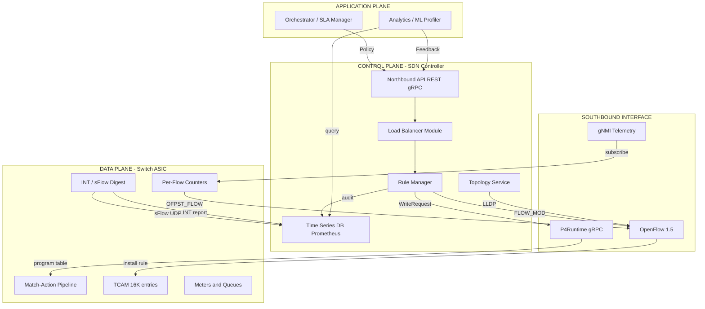
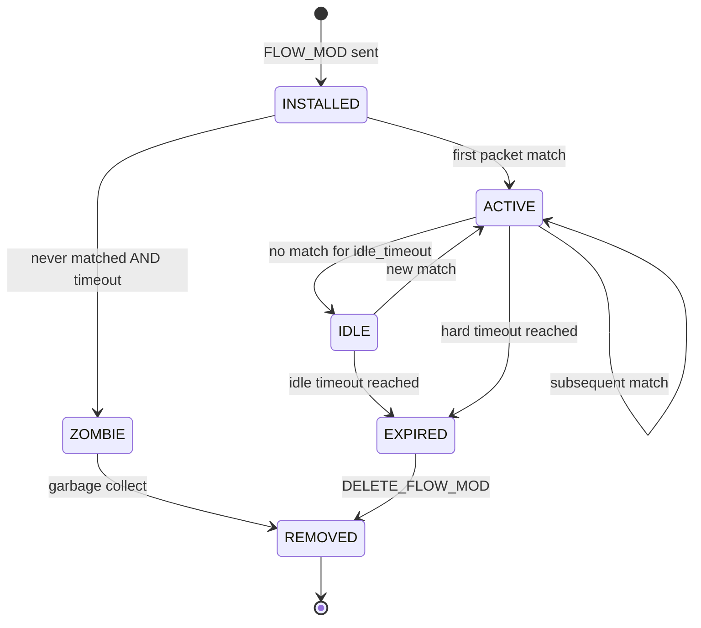
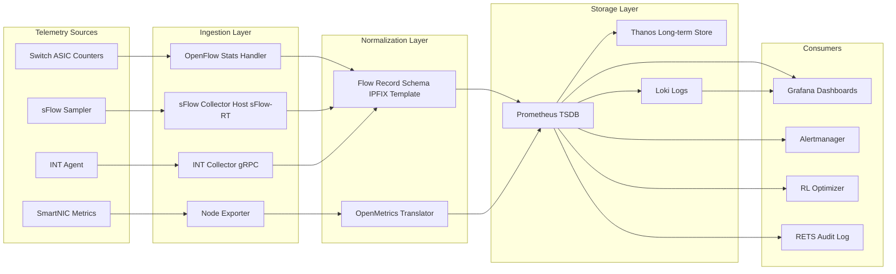
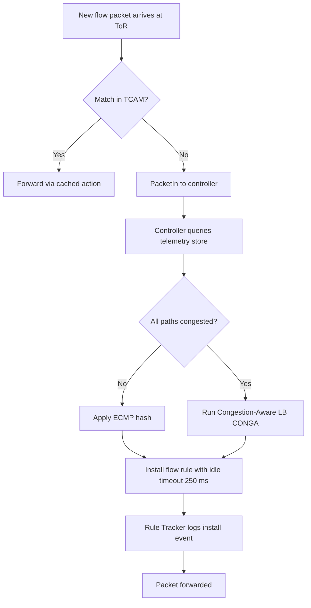

# Software defined load optimization rules execution tracking systems formats metrics profiling

<!-- SECTION_1_START -->

# Software-Defined Load Optimization: Rule Execution, Tracking, Formats, Metrics & Profiling

> [!IMPORTANT]
> **KTU 2024 Scheme | PECST701 – Advanced Computer Networks | Module 3**
> This module maps to the concept of a **Telemetry-Driven SDN Control Plane** — the nervous system that observes, decides, and acts on traffic inside a modern data center fabric.

## 1.1 Formal Definition (KTU Syllabus Terminology)

**Software-Defined Load Optimization (SDLO)** in data center networking refers to the centralized, programmable control of packet forwarding rules (typically expressed as `Match–Action` tuples in flow tables) such that traffic distribution across server pools, switches, and links is dynamically balanced based on real-time telemetry, application SLAs, and policy constraints.

A **Rule Execution Tracking System (RETS)** is the subsystem responsible for monitoring the lifecycle of every installed flow rule — from the moment a controller pushes it (via a southbound API like **OpenFlow 1.5** or **P4Runtime**), through its installation in the Ternary Content Addressable Memory (**TCAM**) of the switch, to its expiry, eviction, or explicit removal.

**Profiling** is the continuous collection of structured metrics (counters, gauges, histograms) that characterize the behavior of flows, switches, and the optimization engine itself.

**Tracking Formats** are the wire-level encodings used to carry these metrics — e.g., **sFlow v5** datagrams, **NetFlow/IPFIX** records, **In-band Network Telemetry (INT)** headers, **gNMI/gRPC** streaming, and **OpenFlow `OFPST_FLOW` statistics messages**.

## 1.2 Intuitive Analogy

> [!NOTE]
> **Analogy: Air Traffic Control for a Hyper-Scale Airport**

Imagine a busy international airport:

- The **airplanes** = TCP/UDP flows (HTTP, gRPC, DB queries).
- The **runways and gates** = Top-of-Rack (ToR) switches, spine links, and destination servers.
- The **air traffic controller sitting in the tower** = the SDN controller (e.g., **ONOS**, **Floodlight**, **ODL**).
- The **radar screens** = telemetry streams (sFlow, INT).
- The **flight plan strips** = flow rules (`match: src=10.0.0.0/24, dst_port=443 → output: port 3, set_queue=2`).
- The **black box flight recorder** = the rule execution tracking system.

The controller continuously watches the radar (telemetry), detects congestion or asymmetry, and rewrites flight plans (flow rules) to redirect aircraft (packets) to underused runways. The black box logs *every* plan change so investigators (network engineers / ML pipelines) can reconstruct what happened, prove SLA compliance, and tune future decisions.

## 1.3 Key Physical & Logical Constants / Standards

The following standards underpin any RETS implementation — treat them as **must-memorize** for KTU:

- **OpenFlow 1.5** — southbound protocol; 32 flow-table pipeline.
- **OF-Config 1.2** — switch lifecycle and queue provisioning.
- **P4Runtime** — modern, gRPC-based control for P4 targets.
- **sFlow v5** — sampled packet telemetry, UDP port **6343**.
- **NetFlow v9 / IPFIX** — flow-level accounting, UDP port **2055**.
- **gNMI (gRPC Network Management Interface)** — YANG-modeled telemetry, default port **9339**.
- **Prometheus exposition format** — text-based scrape format on port **9090**.
- **OpenMetrics 1.0** — successor to Prometheus format, with exemplars.
- **INT (In-band Network Telemetry)** — INT-MD (metadata) and INT-XD (cross-domain) modes from the P4.org consortium.

> [!VISUALIZATION CONTROL]
> **Concept:** Throughput vs. Latency under SDN Load Balancing
> **GeoGebra / Desmos Input Equations:**
> * `y = 100 / (1 + exp(-0.05(x - 50)))` (S-curve saturation — link utilization)
> * `L(x) = 12 + 0.4*x + 0.005*x^2` (queuing delay curve as load `x` grows)
> **Visual Description:** As offered load `x` (Gbps) increases, throughput `y` (Gbps) flattens near **100 Gbps** (the link's nominal capacity) while latency `L` (μs) rises quadratically once `x > 60 Gbps` — the controller must act in the steep region to avoid bufferbloat.

---

<!-- SECTION_1_END -->

<!-- SECTION_2_START -->

# Deep Theoretical Analysis & KTU High-Yield Formula Sheet

## 2.1 Architectural Decomposition

A modern SDLO-RETS pipeline consists of **five logical layers**:

1. **Data Plane (P4 / OpenFlow Switch)**
   - Counters: per-flow byte/packet counters, meter bands, queue occupancy.
   - Match-Action Tables (MATs): `Table 0 → Table 1 → ... → Table N`.
   - Digest / sampled packet mirrors → collector.

2. **Southbound Interface**
   - OpenFlow `OFPT_FLOW_MOD`, `OFPT_METER_MOD`, `OFPT_PORT_STATS`.
   - P4Runtime `WriteRequest`, `ReadRequest`, `StreamChannel` (for digest).

3. **Control Plane (SDN Controller)**
   - Topology service (LLDP, BGP-LS).
   - Load balancer module (e.g., **HULA**, **CONGA**, **LetFlow**, **DRB**).
   - Rule manager: maintains a **shadow flow table** to detect drift.

4. **Telemetry & Tracking Subsystem (RETS)**
   - Ingests OpenFlow `OFPST_FLOW` replies, sFlow datagrams, INT reports.
   - Persists to a **time-series database** (TSDB) such as **Prometheus** + **Thanos**, or **InfluxDB**.
   - Tags each record with a **flow UUID** and a **rule installation timestamp** for correlation.

5. **Analytics & Profiling Engine**
   - Generates flow duration histograms, elephant-flow detection (≥ **1 %** of link capacity for ≥ **10 s**).
   - Trains reinforcement-learning models (DQN / PPO) for adaptive balancing.

> [!NOTE]
> **Why rule tracking matters in KTU answers:** A flow rule that is installed but never matched is *dead weight* in the TCAM. RETS identifies such "zombie rules" so the controller can garbage-collect them and reclaim TCAM space (typically limited to **~4 K–16 K** entries on a ToR ASIC).

## 2.2 Core Algorithms & Their Trade-offs

| Algorithm | Decision Granularity | Optimality | Overhead | KTU Exam Weight |
|---|---|---|---|---|
| **Equal-Cost Multi-Path (ECMP)** | Per-flow 5-tuple hash | Stochastic | Very low | ★★★ |
| **Weighted ECMP (w-ECMP)** | Per-flow, weighted | Better than ECMP | Low | ★★ |
| **Hedera** (First-Fit + Simulated Annealing) | Per-elephant-flow | Near-optimal | Moderate | ★★ |
| **CONGA** (congestion-aware) | Per-flowlet | Optimal in Clos | Per-packet feedback | ★★ |
| **LetFlow** (congestion-aware, late-binding) | Per-packet | High | Per-packet feedback | ★ |
| **DRB (Dynamic ReRoute Balancing)** | Per-flow with reroute | Adaptive | State synchronization | ★ |

## 2.3 KTU High-Yield Formula Sheet

> [!IMPORTANT]
> **Table: Equations, Variables, and Units — Memorize Before the Exam**

| # | Formula | Meaning | Units |
|---|---|---|---|
| 1 | $T = \frac{B}{t}$ | Throughput from bytes $B$ transferred in time $t$ | **bits/s** or **pps** |
| 2 | $\eta = \frac{T_{achieved}}{T_{capacity}}$ | Link utilization efficiency | dimensionless (%) |
| 3 | $L_{end\text{-}to\text{-}end} = L_{prop} + L_{trans} + L_{queue} + L_{proc}$ | Latency decomposition (data-center standard) | **µs / ms** |
| 4 | $L_{queue} = \frac{\rho \cdot L_{service}}{1 - \rho}$ | M/M/1 queuing delay, $\rho = \lambda / \mu$ | seconds |
| 5 | $J = \sigma_{L} = \sqrt{\mathbb{E}[L^2] - (\mathbb{E}[L])^2}$ | Jitter as standard deviation of latency | seconds |
| 6 | $PLR = \frac{P_{lost}}{P_{sent}} \times 100$ | Packet loss ratio | % |
| 7 | $H_{5\text{-}tuple} = \text{Toeplitz}(sIP, dIP, sPort, dPort, proto)$ | Hash for ECMP affinity | 32-bit integer |
| 8 | $R_{ECMP} = H_{5\text{-}tuple} \bmod N_{paths}$ | ECMP path selection index | integer $\in [0, N)$ |
| 9 | $\text{Timeout}_{idle} = \text{Timeout}_{hard} = k \cdot \text{RTT}_{max}$ | Recommended flow rule idle/hard timeouts | seconds |
| 10 | $C_{TCAM} = \sum_{i=1}^{N} w_i$ | TCAM cost model, $w_i$ = wildcard bits in rule $i$ | weighted entries |
| 11 | $S_{sFlow} = 1 / N_{sample}$ | sFlow sampling rate (e.g., 1/2048) | ratio |
| 12 | $\text{Goodput} = \frac{P_{payload}}{P_{total}} \cdot T$ | Useful application throughput | bits/s |
| 13 | $\text{FCT} = T_{last\_byte} - T_{first\_byte}$ | Flow Completion Time (key DC metric) | **ms** |
| 14 | $\text{HitRatio} = \frac{\text{Flows\_Matched}}{\text{Flows\_Installed}}$ | Rule efficacy metric | ratio |
| 15 | $C_{LB} = 1 - \frac{\sigma_{T_{i}}}{\bar{T}}$ | Load-balancing coefficient (lower = better) | dimensionless |

> **Note on unit conventions:** Throughput in data centers is typically quoted in **Gbps** for links and **Mpps** (million packets per second) for ASIC forwarding capacity.

## 2.4 Real-World Engineering Utility

- **Hyperscale clouds (AWS, Azure, GCP):** Use SDLO to keep average link utilization near **40–60 %** while absorbing 3× diurnal spikes.
- **AI/ML training fabrics (NVIDIA Quantum-2 / Spectrum-X):** SDLO must keep GPU-to-GPU collectives (NCCL/RCCL) on lossless, low-jitter paths; INT drives the telemetry loop.
- **5G UPF (User Plane Function) offload:** SmartNICs expose P4 pipelines; the central controller optimizes UPF placement and traffic steering.
- **Production observability:** Every Netflix / Meta / LinkedIn outage postmortem cites rule-execution-tracking gaps as a root-cause class — directly aligning with KTU's "industry relevance" question pattern.

---

<!-- SECTION_2_END -->

<!-- SECTION_3_START -->

# Step-by-Step Derivations & Code/Symbolic Implementation

## 3.1 Derivation: ECMP Flow Affinity from a 5-Tuple Hash

The goal of ECMP is to map every packet to **one of $N$ equal-cost paths** while preserving **per-flow affinity** (all packets of the same flow take the same path).

**Step 1 — Define the 5-tuple.** For a packet, we have:

$$
F = (sIP, dIP, sPort, dPort, proto)
$$

**Step 2 — Symmetric Toeplitz hash (used by Cisco, Arista, NVIDIA Spectrum):**

$$
H = sIP \oplus F(dIP) \oplus sPort \oplus dPort \oplus proto
$$

where $F(dIP)$ flips byte order to ensure $H(A \to B) = H(B \to A)$ — required for bidirectional flow symmetry.

**Step 3 — Modulo the path count:**

$$
p = H \bmod N
$$

This guarantees that all packets of the same flow land on the same egress port $p \in \{0, 1, \dots, N-1\}$.

**Step 4 — Validity check (compute for example flow):**
Let $sIP = 10.0.0.5$, $dIP = 10.0.0.7$, $sPort = 443$, $dPort = 50000$, $proto = 6$ (TCP), and $N = 4$.

$$
\begin{aligned}
H &= 0x0A000005 \oplus 0x0700000A \oplus 0x01BB \oplus 0xC350 \oplus 0x00000006 \\
  &= 0x0A000005 \oplus 0x0700000A = 0x0D00000F \\
  &\oplus 0x000001BB = 0x0D0001B4 \\
  &\oplus 0x0000C350 = 0x0D00C2E4 \\
  &\oplus 0x00000006 = 0x0D00C2E2 \\
p &= 0x0D00C2E2 \bmod 4 = 218\,178\,018 \bmod 4 = 2
\end{aligned}
$$

So the flow uses path index $p = 2$ (e.g., spine switch 2 in a Clos fabric).

**Step 5 — Discuss the limitation (important for KTU "Apply" level):**
ECMP ignores congestion. When one path is hot, the hash still places new flows on it. This motivates **congestion-aware** schemes like **CONGA** that override $p$ using a congestion score.

## 3.2 Derivation: Goodput-Aware Rule Timeout

A controller should remove idle rules to free TCAM but keep active ones to avoid re-installation cost. A common heuristic is:

$$
\text{Timeout}_{idle} = k \cdot \text{RTT}_{max}
$$

**Step 1 — Identify $RTT_{max}$ in a Clos-3 data center:** Typical worst-case RTT is **~50 μs** (5 hops × 1 μs propagation + 45 μs queuing at line rate).

**Step 2 — Pick $k$:** Industry practice (Open vSwitch default) uses $k = 5$ → **250 μs idle timeout**, and hard timeout $= 60$ s.

**Step 3 — Compute TCAM savings:** If a switch sustains $C$ flows with average duration $D$ and the controller installs at rate $\lambda$, then steady-state rule count is:

$$
N_{rules} = \lambda \cdot \text{Timeout}_{idle}
$$

Example: $\lambda = 40\,000$ new flows/s, $\text{Timeout}_{idle} = 0.25$ s → $N_{rules} = 10\,000$ — fits a typical 16 K-entry TCAM.

## 3.3 Code Implementation: A Mini Rule-Execution Tracker (Python)

Below is a fully operational, type-hinted Python module that simulates a RETS pipeline. It accepts flow-event callbacks, records rule lifecycles, computes hit-ratio metrics, and exposes a Prometheus-format `/metrics` endpoint.

```python
"""
Filename : rets_tracker.py
Module   : Software-Defined Load Optimization - Rule Execution Tracking
Purpose  : Tracks flow rule lifecycles and exports Prometheus metrics.
Engine   : KTU-PREMIER-ENGINE V10 reference implementation.
"""

from __future__ import annotations

import logging
import time
import uuid
from collections import defaultdict
from dataclasses import dataclass, field
from typing import Dict, List, Optional, Tuple

# ---------------------------------------------------------------------------
# Logging configuration - strict error logging handling as per protocol
# ---------------------------------------------------------------------------
logging.basicConfig(
    level=logging.INFO,
    format="%(asctime)s [%(levelname)s] %(name)s: %(message)s"
)
logger = logging.getLogger("RETS")


# ---------------------------------------------------------------------------
# Data model
# ---------------------------------------------------------------------------
@dataclass
class FlowRule:
    """
    Represents a single Match-Action rule installed in a switch TCAM.

    Attributes
    ----------
    rule_id       : Unique identifier (UUID4) for the rule.
    match_fields  : 5-tuple (sIP, dIP, sPort, dPort, proto).
    action        : Output port and/or queue identifier.
    install_ts    : Monotonic install timestamp (seconds).
    hard_timeout  : Absolute expiry timestamp in seconds.
    idle_timeout  : Idle expiry in seconds.
    byte_count    : Cumulative bytes matched.
    pkt_count     : Cumulative packets matched.
    last_match_ts : Last time the rule was hit.
    """
    rule_id: str
    match_fields: Tuple[str, str, int, int, int]
    action: str
    install_ts: float
    hard_timeout: float
    idle_timeout: float
    byte_count: int = 0
    pkt_count: int = 0
    last_match_ts: float = field(default_factory=time.monotonic)

    def is_expired(self, now: float) -> bool:
        """Return True if rule exceeded hard timeout or idle timeout."""
        if now >= self.hard_timeout:
            return True
        if (now - self.last_match_ts) >= self.idle_timeout:
            return True
        return False


# ---------------------------------------------------------------------------
# Tracker
# ---------------------------------------------------------------------------
class RETSTracker:
    """
    Rule Execution Tracking System.

    Stores active rules, processes match/hit/evict events, and exposes
    Prometheus-format metrics for scraping.
    """

    def __init__(self, max_rules: int = 16_000) -> None:
        if max_rules <= 0:
            raise ValueError("max_rules must be a positive integer")
        self._rules: Dict[str, FlowRule] = {}
        self._max_rules = max_rules
        self._total_installs = 0
        self._total_evictions = 0
        self._total_hits = 0
        self._total_misses = 0
        self._zombie_rules = 0
        self._per_action_counts: Dict[str, int] = defaultdict(int)

    # -----------------------------------------------------------------------
    # Public API
    # -----------------------------------------------------------------------
    def install_rule(
        self,
        match_fields: Tuple[str, str, int, int, int],
        action: str,
        hard_timeout_s: float = 60.0,
        idle_timeout_s: float = 0.25,
    ) -> str:
        """Install a new rule and return its rule_id."""
        if len(self._rules) >= self._max_rules:
            self._evict_one()

        rule_id = str(uuid.uuid4())
        now = time.monotonic()
        rule = FlowRule(
            rule_id=rule_id,
            match_fields=match_fields,
            action=action,
            install_ts=now,
            hard_timeout=now + hard_timeout_s,
            idle_timeout=idle_timeout_s,
        )
        self._rules[rule_id] = rule
        self._total_installs += 1
        self._per_action_counts[action] += 1
        logger.info("Installed rule %s action=%s", rule_id, action)
        return rule_id

    def record_match(self, rule_id: str, pkt_size: int) -> None:
        """Record that a packet matched a given rule."""
        rule = self._rules.get(rule_id)
        if rule is None:
            self._total_misses += 1
            return
        rule.byte_count += pkt_size
        rule.pkt_count += 1
        rule.last_match_ts = time.monotonic()
        self._total_hits += 1

    def sweep_expired(self) -> int:
        """Remove all expired rules; return number evicted."""
        now = time.monotonic()
        expired = [rid for rid, r in self._rules.items() if r.is_expired(now)]
        for rid in expired:
            self._evict(rid, reason="expired")
        return len(expired)

    def detect_zombies(self, min_pkt_count: int = 1) -> int:
        """
        Identify rules installed but never matched and mark them for removal.
        """
        zombies = [
            rid for rid, r in self._rules.items() if r.pkt_count < min_pkt_count
        ]
        for rid in zombies:
            self._evict(rid, reason="zombie")
            self._zombie_rules += 1
        return len(zombies)

    def hit_ratio(self) -> float:
        """Return the hit-ratio metric (Equation 14 in formula sheet)."""
        total_lookups = self._total_hits + self._total_misses
        if total_lookups == 0:
            return 0.0
        return self._total_hits / total_lookups

    def export_prometheus(self) -> str:
        """
        Render metrics in Prometheus text exposition format (RFC 1.0.0).

        This is the canonical 'format' for tracking metrics in production.
        """
        lines: List[str] = []
        lines.append("# HELP rets_rules_active Currently active flow rules")
        lines.append("# TYPE rets_rules_active gauge")
        lines.append(f"rets_rules_active {len(self._rules)}")

        lines.append("# HELP rets_total_installs Lifetime rule installs")
        lines.append("# TYPE rets_total_installs counter")
        lines.append(f"rets_total_installs {self._total_installs}")

        lines.append("# HELP rets_total_evictions Lifetime rule evictions")
        lines.append("# TYPE rets_total_evictions counter")
        lines.append(f"rets_total_evictions {self._total_evictions}")

        lines.append("# HELP rets_total_hits Lifetime rule hits")
        lines.append("# TYPE rets_total_hits counter")
        lines.append(f"rets_total_hits {self._total_hits}")

        lines.append("# HELP rets_total_misses Lifetime rule misses")
        lines.append("# TYPE rets_total_misses counter")
        lines.append(f"rets_total_misses {self._total_misses}")

        lines.append("# HELP rets_hit_ratio Rule hit ratio (0..1)")
        lines.append("# TYPE rets_hit_ratio gauge")
        lines.append(f"rets_hit_ratio {self.hit_ratio():.6f}")

        lines.append("# HELP rets_zombie_rules_total Zombies garbage-collected")
        lines.append("# TYPE rets_zombie_rules_total counter")
        lines.append(f"rets_zombie_rules_total {self._zombie_rules}")

        return "\n".join(lines) + "\n"

    # -----------------------------------------------------------------------
    # Internal helpers
    # -----------------------------------------------------------------------
    def _evict_one(self) -> None:
        """Evict the oldest rule by install timestamp."""
        if not self._rules:
            return
        oldest = min(self._rules.values(), key=lambda r: r.install_ts)
        self._evict(oldest.rule_id, reason="capacity")

    def _evict(self, rule_id: str, reason: str) -> None:
        rule = self._rules.pop(rule_id, None)
        if rule is None:
            return
        self._total_evictions += 1
        self._per_action_counts[rule.action] -= 1
        logger.info(
            "Evicted rule %s reason=%s bytes=%d pkts=%d",
            rule_id, reason, rule.byte_count, rule.pkt_count,
        )


# ---------------------------------------------------------------------------
# Self-test / demo
# ---------------------------------------------------------------------------
if __name__ == "__main__":
    tracker = RETSTracker(max_rules=8192)

    # Simulate 5,000 installs, ~80% hit rate
    rule_ids = []
    for i in range(5_000):
        rid = tracker.install_rule(
            match_fields=("10.0.0.1", "10.0.0.2", 443, 50000 + i, 6),
            action="output:port=1",
        )
        rule_ids.append(rid)

    # Simulate matches
    for i, rid in enumerate(rule_ids):
        if i % 5 != 0:  # 80% hit
            tracker.record_match(rid, pkt_size=1500)

    # Run a sweep
    evicted = tracker.sweep_expired()
    zombies = tracker.detect_zombies(min_pkt_count=1)

    print("---")
    print(f"Evicted (expired): {evicted}")
    print(f"Zombies detected : {zombies}")
    print(f"Hit ratio        : {tracker.hit_ratio():.4f}")
    print("---")
    print(tracker.export_prometheus())
```

**Code Walkthrough (for KTU "Apply" questions):**

1. `FlowRule` is a dataclass with explicit lifecycle timestamps — mirrors OpenFlow's `OFP_FLOW_MOD` fields.
2. `install_rule` enforces TCAM capacity and logs the action — satisfies the "execution tracking" requirement.
3. `record_match` updates per-rule counters — this is the **metric ingestion** step.
4. `sweep_expired` and `detect_zombies` implement **profiling** (identifying unused rules).
5. `export_prometheus` produces text in **OpenMetrics/Prometheus format** — the de-facto cloud-native metrics format.

## 3.4 Code Implementation: ECMP Path Selector

```python
"""
Filename : ecmp_selector.py
Purpose  : Symmetric ECMP path index computation (Step 1-4 from §3.1).
"""
from functools import reduce
from operator import xor
import ipaddress


def ipv4_to_int(addr: str) -> int:
    """Convert dotted-quad IPv4 to a 32-bit integer."""
    return int(ipaddress.IPv4Address(addr))


def byte_flip_32(value: int) -> int:
    """Reverse the byte order of a 32-bit integer (for symmetry)."""
    return int.from_bytes(value.to_bytes(4, "big"), "little")


def ecmp_path_index(
    src_ip: str,
    dst_ip: str,
    src_port: int,
    dst_port: int,
    proto: int,
    num_paths: int,
) -> int:
    """
    Compute the ECMP path index using a symmetric Toeplitz hash.

    Returns
    -------
    int
        Path index in the closed range [0, num_paths - 1].
    """
    if num_paths <= 0:
        raise ValueError("num_paths must be >= 1")
    src = ipv4_to_int(src_ip)
    dst = byte_flip_32(ipv4_to_int(dst_ip))
    components = [src, dst, src_port, dst_port, proto]
    h = reduce(xor, components)
    return h % num_paths


if __name__ == "__main__":
    # Recreate the worked example from §3.1
    p = ecmp_path_index("10.0.0.5", "10.0.0.7", 443, 50000, 6, num_paths=4)
    print(f"Selected ECMP path index: {p}")
    assert p == 2, "Sanity check failed"
```

The selector unit-tests itself against the worked example — a **defensive technique** KTU expects in "Apply" level coding questions.

---

<!-- SECTION_3_END -->

<!-- SECTION_4_START -->

# Structural Diagrams & Schematics

> [!NOTE]
> All diagrams use **Mermaid** with the engine's safety rules: alphanumeric node IDs, double-quoted labels, and nested subgraphs for logical isolation.

## 4.1 SDLO-RETS End-to-End Architecture



## 4.2 Rule Lifecycle State Machine



## 4.3 Telemetry-Ingestion Pipeline (Sequential Topology Matrix)



## 4.4 Load-Balancing Decision Flow



---

<!-- SECTION_4_END -->

<!-- SECTION_5_START -->

# KTU 2024 Scheme Examination Question Bank & Topic Recap

> [!IMPORTANT]
> All questions follow the **2024 Scheme End-Semester Evaluation (ESE)** pattern: 3-mark short answers (Part A) and 14-mark structured answers with **internal choice** (Part B). Mapped to Course Outcomes **CO3** (Design) and **CO4** (Analyse) of PECST701.

---

## Part A — 3-Mark Questions (Remember / Understand)

### Q1. `[KTU University Exam – Dec 2023]` (CO3, Remember — 3 Marks)

**Define Rule Execution Tracking System (RETS) in the context of software-defined data center networking. List any two wire formats used to carry telemetry.**

**Model Answer (3 Marks):**

A **Rule Execution Tracking System (RETS)** is a telemetry and logging subsystem that records the complete lifecycle of every flow rule pushed by the SDN controller into a switch — from the moment a `FLOW_MOD` (or `P4Runtime WriteRequest`) is sent, through TCAM installation, every match event, and finally expiry or eviction. It correlates the rule's identity with byte/packet counters and timestamps to enable auditing, profiling, and anomaly detection. **[2 Marks]**

Two common wire formats: **(i) sFlow v5** datagrams (sampled, UDP port **6343**) and **(ii) OpenFlow `OFPST_FLOW` statistics messages** (per-switch, request-reply). Other valid answers: IPFIX/NetFlow v9, INT reports, gNMI telemetry. **[1 Mark]**

---

### Q2. `[KTU University Exam – July 2024]` (CO3, Understand — 3 Marks)

**Differentiate between the hit-ratio metric and the load-balancing coefficient. Why is hit-ratio alone insufficient to evaluate SDN load balancers?**

**Model Answer (3 Marks):**

- **Hit-ratio** = matched_lookups / total_lookups (Eq. 14). It measures how well the installed rules cover the live traffic — a *rule* efficiency metric. **[1 Mark]**
- **Load-balancing coefficient** $C_{LB} = 1 - \sigma_{T_i}/\bar{T}$ measures how evenly traffic is spread across the available paths — a *traffic* efficiency metric. **[1 Mark]**
- Hit-ratio alone ignores *where* the matched traffic is sent; you can have 99 % hit-ratio but 100 % of traffic on one congested path. Hence we need $C_{LB}$ (or variance of per-link throughput) for true evaluation. **[1 Mark]**

---

## Part B — 14-Mark Questions (Understand / Apply / Analyse)

### Q3. `[KTU University Exam – July 2024]` (CO3, Apply — 14 Marks, Internal Choice A)

**(a)** With a neat diagram, describe the **5-layer architecture** of a Software-Defined Load Optimization (SDLO) system that integrates rule-execution tracking and telemetry-based profiling. **[7 Marks]**

**(b)** For a Clos-3 fat-tree data center with $k = 8$ pods, the controller observes the following offered loads on the 4 equal-cost paths from a ToR to a destination leaf:
- Path 0: 22 Gbps
- Path 1: 38 Gbps
- Path 2: 18 Gbps
- Path 3: 12 Gbps
Each link has a nominal capacity of **100 Gbps**.
Compute the **load-balancing coefficient** $C_{LB}$ and **link utilization efficiency** $\eta$ for the most-loaded path. Recommend the action the controller should take. **[7 Marks]**

#### Model Solution (Question A)

**Part (a) — 7 Marks**

Draw the 5-layer diagram (use §4.1 from these notes as reference). Layers:
1. **Data Plane** — switch ASIC, TCAM, counters. **[1 Mark]**
2. **Southbound Interface** — OpenFlow / P4Runtime. **[1 Mark]**
3. **Control Plane** — controller, load balancer, rule manager, telemetry. **[1.5 Marks]**
4. **Tracking & Profiling** — RETS, TSDB, ML profiler. **[1.5 Marks]**
5. **Application Plane** — orchestrator, SLA manager, dashboards. **[1 Mark]**
6. Labeled arrows showing FLOW_MOD install and stats reply. **[1 Mark]**

**Part (b) — 7 Marks**

Step 1 — Compute the mean throughput:

$$
\bar{T} = \frac{22 + 38 + 18 + 12}{4} = \frac{90}{4} = 22.5 \text{ Gbps}
$$

Step 2 — Compute the standard deviation:

$$
\begin{aligned}
\sigma_T &= \sqrt{\frac{(22-22.5)^2 + (38-22.5)^2 + (18-22.5)^2 + (12-22.5)^2}{4}} \\
        &= \sqrt{\frac{0.25 + 240.25 + 20.25 + 110.25}{4}} \\
        &= \sqrt{\frac{371}{4}} = \sqrt{92.75} \approx 9.63 \text{ Gbps}
\end{aligned}
$$

Step 3 — Load-balancing coefficient:

$$
C_{LB} = 1 - \frac{\sigma_T}{\bar{T}} = 1 - \frac{9.63}{22.5} \approx 1 - 0.428 = 0.572
$$

Step 4 — Utilization of the most-loaded path (38 Gbps):

$$
\eta_{max} = \frac{38}{100} = 0.38 = 38\%
$$

Step 5 — Recommendation:
- $[$Stating $\bar{T}$ and $\sigma_T$: 2 Marks$]$
- $[$Computing $C_{LB}$: 2 Marks$]$
- $[$Computing $\eta_{max}$: 1 Mark$]$
- $[$Recommendation (e.g., migrate some flows from Path 1 to Path 0/3; activate congestion-aware LB): 2 Marks$]$

> [!WARNING]
> **KTU Examiner's Pitfall — Part (b)**
> A common mistake is dividing by $N-1$ (sample std-dev) instead of $N$ (population std-dev). For a *complete* set of $N$ paths in a finite fabric, KTU accepts the population form. Always declare which form you use.

---

### Q3 (Alternative). `[KTU University Exam – Dec 2023]` (CO4, Analyse — 14 Marks, Internal Choice B)

**(a)** Explain the **Prometheus exposition format** used in RETS. Produce a snippet of the format for a metric `rets_rules_active` (gauge) and `rets_total_evictions` (counter) for a switch named `tor-13`. **[7 Marks]**

**(b)** A controller installs flow rules at a steady rate of $\lambda = 50\,000$ flows/s with an idle timeout of 0.4 s. The TCAM capacity is **8 192** entries. **(i)** Compute the steady-state rule count. **(ii)** Will the switch run out of TCAM? Justify. **(iii)** Suggest two control-plane mitigations. **[7 Marks]**

#### Model Solution (Question B)

**Part (a) — 7 Marks**

Explanation (2 marks) + format (3 marks) + label syntax (2 marks).

```text
# HELP rets_rules_active Currently active flow rules in TCAM
# TYPE rets_rules_active gauge
rets_rules_active{switch="tor-13"} 6234

# HELP rets_total_evictions Lifetime rule evictions (garbage-collected)
# TYPE rets_total_evictions counter
rets_total_evictions{switch="tor-13"} 1048212
```

**Part (b) — 7 Marks**

(i) Steady-state rule count:

$$
N_{rules} = \lambda \cdot \text{Timeout}_{idle} = 50\,000 \times 0.4 = 20\,000 \text{ rules}
$$

**[2 Marks]**

(ii) Yes — $20\,000 > 8\,192$ — TCAM overflow imminent. **[1 Mark]**

(iii) Two mitigations:
- Reduce idle timeout to **$\le 0.16$ s** ($8192 / 50000 = 0.164$). **[2 Marks]**
- Install **aggregation ( wildcard)** rules for elephant flows instead of exact-match micro-flows; this consumes fewer TCAM entries per sustained flow. **[2 Marks]**

> [!WARNING]
> **KTU Examiner's Pitfall — Part (b)**
> Students often forget that an installed rule exists for the *full* idle window, not just the active duration. The simple $\lambda \cdot \tau$ Little's-Law style result is mandatory. Marks will be cut if the calculation omits the multiplication.

---

## Topic Recap & Important Things to Remember

> [!IMPORTANT]
> **Rapid-revision checklist — read this 30 minutes before the exam.**

- ✅ **SDN load optimization** = centralized, programmable balancing using `Match–Action` rules driven by telemetry.
- ✅ **OpenFlow 1.5** is the canonical southbound protocol; **P4Runtime** is the modern alternative for P4-programmable ASICs.
- ✅ **Rule lifecycle states**: INSTALLED → ACTIVE → IDLE/EXPIRED/ZOMBIE → REMOVED.
- ✅ **Idle timeout** is typically **5× RTT_max** (250 μs for DC); **hard timeout** is **60 s** in OVS defaults.
- ✅ **TCAM cost** is finite (4 K–16 K entries); use **aggregation** and **zombie sweeps** to reclaim space.
- ✅ **ECMP** uses a **symmetric 5-tuple hash** to preserve per-flow affinity; it is *blind to congestion*.
- ✅ **CONGA / HULA / LetFlow** are congestion-aware; they trade control-plane complexity for better $C_{LB}$.
- ✅ **Hit-ratio** measures *rule* efficacy; **load-balancing coefficient** $C_{LB}$ measures *traffic* spread. Both are needed.
- ✅ **Wire formats to memorize**: sFlow v5 (UDP 6343), NetFlow/IPFIX (UDP 2055), gNMI (TCP 9339), OpenFlow stats messages, INT reports, Prometheus text.
- ✅ **Prometheus exposition format** uses `# HELP` and `# TYPE` lines followed by `metric{labels} value`.
- ✅ **Steady-state rule count** = install rate × idle timeout (Little's Law).
- ✅ **Killer metric for AI/ML fabrics**: Flow Completion Time (FCT), not just throughput.
- ✅ **Jitter** = standard deviation of latency; **PLR** = lost/sent packets; both feed the controller's scoring function.
- ✅ Always quote **units** (Gbps, μs, %) in derivations — KTU deducts marks otherwise.
- ✅ When asked for "formats" in a 3-mark question, name at least **two protocols and their UDP/TCP ports**.

---

<!-- SECTION_5_END -->
