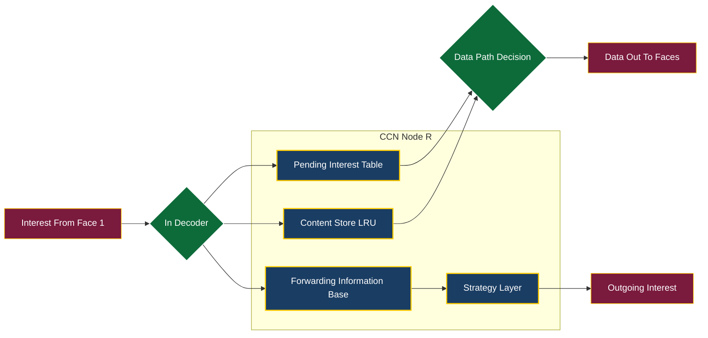
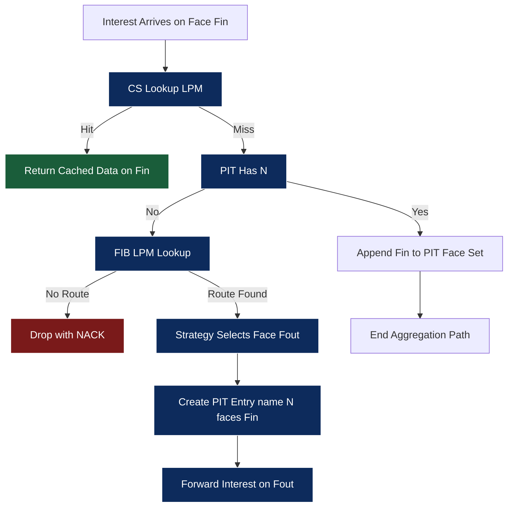
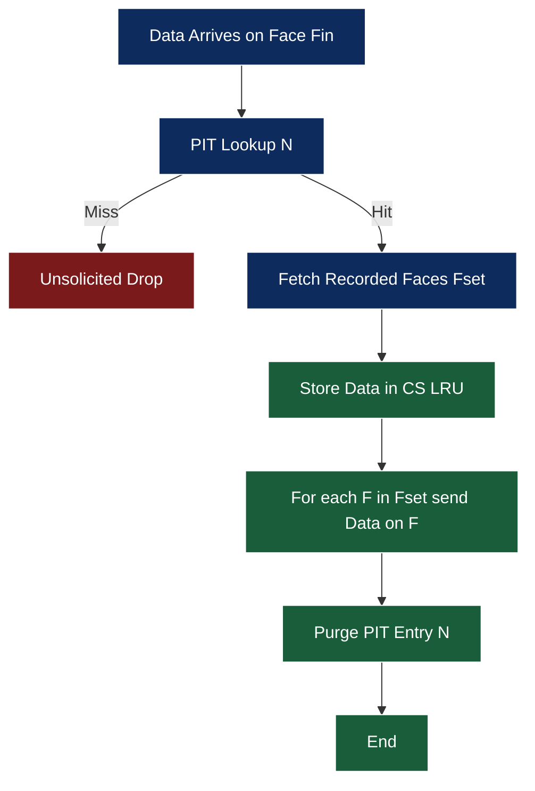
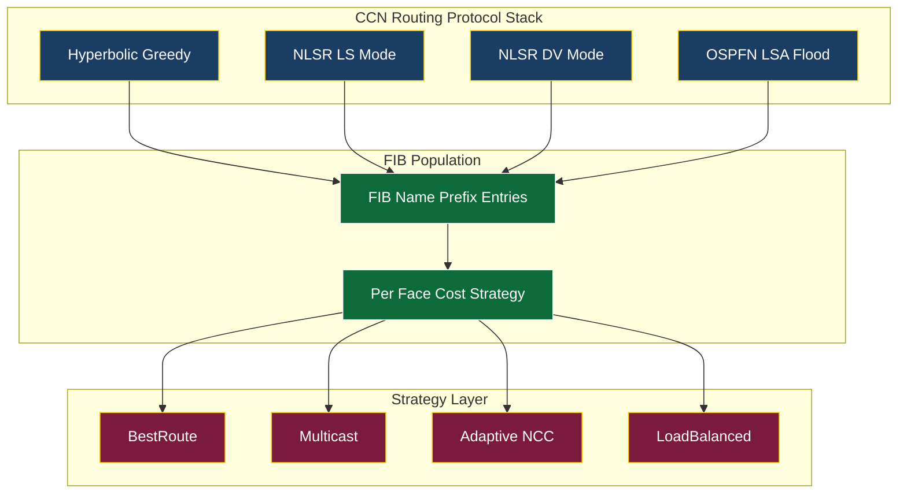
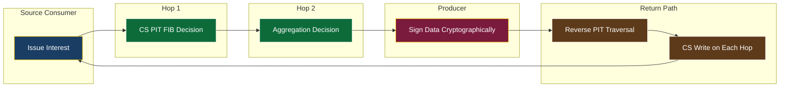

# Content Centric Networking (CCN) routing protocols frameworks paths formats analytics profiles

<!-- SECTION_1_START -->
# Content-Centric Networking (CCN) — Routing, Frameworks, Paths, Formats & Analytics

## 1. Core Technical Definition

> [!NOTE]
> **Content-Centric Networking (CCN)** is a clean-slate, receiver-driven network architecture that shifts the fundamental communication primitive from **host-to-host addressing** (IP) to **named-content retrieval**. The unit of communication is a *content object identified by a unique, location-independent name*, and the network routes based on *what* the user wants rather than *where* it resides.

In the formal KTU 2024 syllabus terminology, CCN is the foundational architecture for **Information-Centric Networking (ICN)**, evolving into modern implementations such as **Named-Data Networking (NDN)** and the **CCNx** reference protocol stack. It replaces the dual endpoint model of TCP/IP with a *single, secure, named-content* abstraction layered over any underlying transport (Ethernet, MPLS, 5G, LoRa, satellite, etc.).

### 1.1 Conceptual Analogy — The "Library, Not Phone Call" Model

Imagine a student needing a specific textbook chapter:

| Old IP Mental Model | New CCN Mental Model |
|---|---|
| "Dial Professor X at room 304, building 7, campus A" | "I need the book whose title is *Distributed Systems, Chapter 9*" |
| Fails if Prof. X is unavailable or moved | The library system finds the closest copy automatically |
| Trust is implicit in the source's identity | Trust is placed in a **cryptographically signed** copy of the chapter itself |
| Path is a chain of IP hops | Path is a chain of caches (Content Stores) |

The student issues an **Interest** — "bring me `/university/cs/dist-sys/ch9.pdf`" — and the network *pulls* the closest, freshest, trustworthy copy toward the requester.

> [!IMPORTANT]
> **Key Mental Shift (Syllabus Highlight)**
> - IP: *Pull a packet from this address* (location-bound)
> - CCN: *Pull this name from wherever it lives* (location-independent)
> - Security: IP secures the **channel**; CCN secures the **content** (every Data packet carries a producer signature)

### 1.2 Physical & Protocol Constants

The CCN architecture references several well-defined constants and metrics in its specification:

- **Maximum name length** in a single TLV: **16,383 octets** (per CCNx 1.0 spec)
- **Default scope** of an Interest: **2 hops** (origin is only local; the interest may propagate further)
- **Default lifetime** of a PIT entry: **4 seconds** (Interest timeout)
- **Nonce** size: **8 octets** (64-bit, used for loop detection)
- **Signature type** mandatory: `SHA-256 with ECDSA P-256` or `RSA-2048`
- **KeyId** length: **8 octets** minimum
- **HopLimit** (originally Scope): field width **1 octet** (0–255)

### 1.3 The Three CCN Architectural Pillars

> [!NOTE]
> A CCN **Node** is composed of three logical data structures that drive all forwarding:
> 1. **Content Store (CS)** — in-network cache of received Data packets (LRU / LFU / ARC eviction).
> 2. **Pending Interest Table (PIT)** — records *unsatisfied* Interests by name and incoming face(s).
> 3. **Forwarding Information Base (FIB)** — a routing table mapping name prefixes → outgoing face(s) with associated strategy metadata.

> [!VISUALIZATION CONTROL]
> **Concept:** Three-Table CCN Node Architecture
> **GeoGebra / Desmos Input Equations:** Use a triple-rectangle Venn-style diagram; can also be visualised as a 3-slot queue:
> - $CS(t) = \text{cached Data objects at time }t$
> - $PIT(t) = \{(n, F_{\text{in}}) \mid n \text{ pending, faces waiting}\}$
> - $FIB(t) = \{n \rightarrow \{F_{\text{out}}, \text{cost}, \text{strategy}\}\}$
> **Visual Description:** A single CCN router visualized as a triangle with three concentric stores; Interest flows IN (top), Data flows OUT (bottom) along the **reverse** recorded path. Arrows show: Interest → FIB/CS/PIT lookup → Face out; Data → PIT lookup → Face back to consumers.

---

<!-- SECTION_1_END -->

<!-- SECTION_2_START -->
# 2. Deep Theoretical Analysis & KTU High-Yield Formula Sheet

## 2.1 Operational Walk-Through — The Two-Message Protocol

CCN uses **exactly two packet types** that flow in opposite directions:

### 2.1.1 Interest Packet (Consumer → Network)
Carries the **hierarchical name** of the desired content and a **nonce** for loop detection.

```
Interest (I):  Name | Selectors | Nonce | Guiders | Scope/HopLimit
```

- **Name** = a sequence of `TLV` components, e.g. `/cnn/tech/article/2023/v3`
- **Selectors** = publisher filter, exclude filters, child selector
- **Guiders** = forwarding hints (e.g., suggested face, persistent)
- **Scope** = administrative distance the interest may travel

### 2.1.2 Data Packet (Network → Consumer)
Carries the **named content**, **publisher signature**, and a **MetaInfo** block.

```
Data (D):      Name | MetaInfo | Content | Signature
```

### 2.1.3 Forwarding Lifecycle (Bulleted Logic)

1. **Consumer** issues `Interest(N)` onto Face 1.
2. **CCN Router A** receives → longest-prefix lookup in `CS`; if hit, return cached Data out Face 1 (step ends).
3. Otherwise lookup in `PIT`: if an entry exists for `N`, **aggregate** — append Face 1 to the existing PIT face-list, **do not forward again**.
4. Otherwise lookup in `FIB`: pick outgoing Face(s) per the **forwarding strategy** (best-route, multicast, NCC, adaptive).
5. Create new `PIT(N, {Face1})` entry, forward `Interest` onward.
6. **Producer** (or intermediate cache hit) returns `Data(N)` signed with content key.
7. **CCN Router A** receives `Data(N)` → lookup `PIT`; if hit, forward back to all recorded faces (FIFO per face); then store in `CS`, then **purge PIT entry** to prevent infinite loops.
8. If no `PIT` entry exists (unsolicited Data), **drop** the packet.

> [!IMPORTANT]
> **Asymmetry Guarantee** — A Data packet is *always* the cryptographic reverse-path reply of a previously forwarded Interest. An unsolicited Data packet is **malicious or stale** and is silently discarded.

## 2.2 Routing in CCN — From Distance-Vectors to Hyperbolic Greedy

| Routing Approach | Core Idea | Used By |
|---|---|---|
| **Name-prefix LPM** | Route on the longest matching name prefix | All CCN variants |
| **Distance-Vector (DV) for names** | Bellman-Ford over name-prefix graph | NLSR (vector mode) |
| **Link-State (LS) for names** | Flood LSAs of name reachability | OSPFN, NLSR (LS mode) |
| **Hyperbolic Greedy** | Embed tree in hyperbolic plane; forward to neighbour with smallest hyperbolic distance to target | Hyperbolic NDN |
| **Bloom-Filter routing** | Encode link-state in compact Bloom filters for scalability | ISR, MapMe-style |
| **CCN-specific FIB management** | Strategy layer sits *above* FIB; FIB is *policy-aware* | NFD, CCNx |

### 2.2.1 OSPFN (OSPF for Named Data)

OSPFN extends OSPFv3 by advertising **name-prefix LSAs** (Link State Advertisements) of the form `LSA(name_prefix, origin_router_id, cost, signature)`. Routers run SPF (Dijkstra) on the resulting *Name-LSA graph* and install a **`FIB` entry per active name prefix**.

### 2.2.2 NLSR (Named-data Link State Routing Protocol)

NLSR is the NDN reference intra-domain protocol. Two operating modes:

1. **LS Mode** — disseminates prefix reachability + link-state; converges via ChronoSync or similar sync protocols.
2. **DV Mode** — disseminates distance vectors *signed per name* using *multi-destination sync* (more scalable in dense topologies).

Both modes **cryptographically sign every LSA**, eliminating IP's plaintext routing-injection vulnerabilities.

### 2.2.3 Hyperbolic Routing in CCN

Given a tree-like network topology (common in the Internet AS-graph), embed the tree in the **hyperbolic plane** $\mathbb{H}^2$ using a **greedy embedding** (Papadopoulos et al., 2010). Each router $u$ gets coordinates $(r_u, \theta_u)$. The **hyperbolic distance** between $u$ and $v$ is:

$$
d_{\mathbb{H}}(u, v) = \text{arccosh}\!\left(\cosh(r_u)\cosh(r_v) - \sinh(r_u)\sinh(r_v)\cos(\Delta\theta)\right)
$$

Forwarding rule: a node $u$ holding an Interest for target $v$ forwards to neighbour $w$ that **minimises** $d_{\mathbb{H}}(w, v)$. The hyperbolic curvature $K = -1$ is **natural** for scale-free trees: stretch $\le 3$ and competitive ratio $\le O(1)$ without any global routing table.

## 2.3 KTU High-Yield Formula & Metric Sheet

> [!IMPORTANT]
> All quantities below are *exam-grade* — commit them to memory for short-answer questions.

$$
\begin{aligned}
\text{Hit Ratio (HR)} &= \frac{\text{Interest hits served from CS}}{\text{Total Interests received}} \\[4pt]
\text{Unsolicited Data Drop Rate} &= \frac{|\{\,D \mid PIT(N)=\varnothing\,\}|}{|D_{\text{received}}|} \\[4pt]
\text{PIT Aggregation Factor} &= \frac{\sum_{N}\text{faces}(PIT(N))}{|\{N \mid PIT(N)\ne\varnothing\}|} \\[4pt]
\text{Average PIT Lifetime} &= \frac{1}{n}\sum_{i=1}^{n}(t_{\text{expire},i} - t_{\text{arrive},i}) \\[4pt]
\text{Stretch}_{\text{CCN}}(s, d) &= \frac{\ell_{\text{CCN}}(s, d)}{\ell_{\text{IP}}(s, d)} \\[4pt]
\text{Hyperbolic Distance} &= d_{\mathbb{H}}(u,v) = \text{arccosh}(\cosh r_u \cosh r_v - \sinh r_u \sinh r_v \cos(\theta_v-\theta_u)) \\[4pt]
\text{Stretch}_{\mathbb{H}} &\le 3 \quad \text{(Papadopoulos, 2010)} \\[4pt]
\text{Forwarding Hop-Count H} &= \sum_{\text{faces traversed}} 1
\end{aligned}
$$

### 2.4 Tabulated KTU Cheat-Sheet

| # | Concept | Symbol | Definition / Range | Used In |
|---|---|---|---|---|
| 1 | Name prefix length | $L_n$ | $0 \le L_n \le 16\,383$ octets (TLV) | TLV encoding |
| 2 | Interest scope | $S_I$ | $0 \le S_I \le 255$ hops | Loop control |
| 3 | Nonce width | $N_w$ | **8 octets** fixed | Loop detection |
| 4 | Cache eviction policy | — | LRU, LFU, ARC, TinyLFU, GD-Ghost | CS design |
| 5 | Strategy class | $\sigma$ | BestRoute, Multicast, NCC, Adaptive | FIB policy |
| 6 | FIB metric | $c(p)$ | Cost (latency / hop / loss) | Routing choice |
| 7 | Signature algorithm | — | ECDSA-P256, RSA-2048, Ed25519 | Data integrity |
| 8 | Hit Ratio | $HR$ | $0 \le HR \le 1$ | Performance |
| 9 | PIT timeout | $T_{PIT}$ | **4 s** default | PIT purge |
| 10 | Hyperbolic radius | $r_u$ | $r_u \ge 0$ in $\mathbb{H}^2$ | Greedy forwarding |

> [!NOTE]
> **Real-World Utility** — CCN is the substrate for: **IoT multicast firmware updates** (one Interest, many subscribers); **5G/6G edge content distribution**; **Vehicle-to-Everything (V2X) named hazard alerts**; **NDN test-beds** (NDN-Testbed, NFD); **CCN-over-LoRa** for smart agriculture; **CCN-over-satellite** for delay-tolerant networks; and **in-network compute** via the *Named-Function Networking (NFN)* extension.

---

<!-- SECTION_2_END -->

<!-- SECTION_3_START -->
# 3. Step-by-Step Derivations, Packet Format Specifications & Code Implementation

## 3.1 Detailed Packet Format Specifications

### 3.1.1 Interest Packet — TLV Structure

The CCNx packet is encoded as a sequence of **Type-Length-Value (TLV)** triplets, where each **Type** is a 2-octet field with `TL` (Type Length, 1 octet) and `TYPE` (1 octet). Length is **variable** (1, 2, 4, or 8 octets).

$$
\begin{aligned}
\text{Interest} \;&:=\; \text{Msg} \;\; \text{Name} \;\; \text{selectors}^* \;\; \text{nonce}^{1} \;\; \text{scope}^{0,1} \\[2pt]
\text{Name} \;&:=\; \text{Component}^+ \\[2pt]
\text{Component} \;&:=\; \text{TLV}(T_{NAME}, v) \quad \text{where } v \text{ is a UTF-8 octet string} \\[2pt]
\text{selectors} \;&:=\; \text{MinSuffixComponents} \;\vert\; \text{MaxSuffixComponents} \;\vert\; \text{PublisherPublicKeyLocator} \;\vert\; \text Exclude \;\vert\; \text{ChildSelector} \;\vert\; \text{AnswerOriginKind} \\[2pt]
\text{nonce} \;&:=\; \text{8 octets, random} \\[2pt]
\text{scope} \;&:=\; \text{1 octet, hop count, 0–255}
\end{aligned}
$$

**Worked example — full binary decomposition of an Interest:**

Suppose the consumer requests the article `/cnn/tech/article/2023/v3` with a 2-hop scope.

$$
\begin{aligned}
\text{Interest bytes} \;&=\; \text{MSG\_TLV} \,\Vert\, \text{NAME\_TLV} \,\Vert\, \text{COMP}(cnn) \,\Vert\, \text{COMP}(tech) \,\Vert\, \text{COMP}(article) \,\Vert\, \text{COMP}(2023) \,\Vert\, \text{COMP}(v3) \,\Vert\, \text{NONCE\_TLV}(8\text{B}) \,\Vert\, \text{SCOPE\_TLV}(0\text{x}02) \\[2pt]
\text{NONCE value} \;&=\; \text{0xDEADBEEFCAFEBABE} \quad (\text{64-bit, random, loop-detection}) \\[2pt]
\text{SCOPE value} \;&=\; \text{0x02} \quad (\text{maximum } 2 \text{ hops})
\end{aligned}
$$

### 3.1.2 Data Packet — TLV Structure

$$
\begin{aligned}
\text{Data} \;&:=\; \text{Msg} \;\; \text{Name} \;\; \text{MetaInfo} \;\; \text{Content} \;\; \text{Signature} \\[2pt]
\text{MetaInfo} \;&:=\; \text{ContentType} \;\vert\; \text{FreshnessPeriod} \;\vert\; \text{FinalBlockId} \;\vert\; \text{KeyLocator} \\[2pt]
\text{ContentType} \;&=\; \text{Blob} \;\vert\; \text{Key} \;\vert\; \text{Manifest} \;\vert\; \text{NACK} \\[2pt]
\text{FreshnessPeriod} \;&=\; \text{milliseconds before content is "stale"} \\[2pt]
\text{Signature} \;&=\; \text{SignatureType} \;\vert\; \text{KeyId} \;\vert\; \text{KeyLocator} \;\vert\; \text{Value} \;\vert\; \text{SignedDigest}
\end{aligned}
$$

> [!IMPORTANT]
> **Syllabus Highlight** — A Data packet's **Signature** is computed over the *entire* preceding TLV (Name + MetaInfo + Content). Any byte-alteration invalidates the signature, providing end-to-end content integrity — a property IP cannot offer.

## 3.2 Derivation: PIT Aggregation Gain

Let us derive the *PIT Aggregation Factor (PAF)* and its impact on network load.

$$
\begin{aligned}
\text{Let } k \;&=\; \text{number of consumers requesting the same name prefix } N \text{ within window } T_{PIT} \\[2pt]
\text{Without PIT} \;&\Rightarrow\; k \text{ Interests forwarded upstream} \\[2pt]
\text{With PIT} \;&\Rightarrow\; 1 \text{ Interest forwarded upstream; PIT records } k \text{ downstream faces} \\[2pt]
\text{PAF} \;&=\; \frac{k}{1} \;=\; k \quad \text{(linear in consumer count)} \\[2pt]
\text{Upstream Load Reduction} \;&=\; 1 - \frac{1}{k} \;=\; \frac{k-1}{k}
\end{aligned}
$$

**Numerical example:** Suppose $k = 100$ consumers watch a live match. The PIT factor is $100\times$, and the upstream Interest rate drops from $100\,\text{I/s}$ to $1\,\text{I/s}$ — a **99 % upstream load reduction**.

## 3.3 Derivation: Cache Hit Ratio (Mandatory Cache Model)

For an **LRU cache of capacity $C$** under a *Zipf-distributed* request stream with parameter $\alpha$:

$$
\begin{aligned}
P(\text{request to item } i) \;&=\; \frac{i^{-\alpha}}{\zeta(\alpha, N)} \quad \text{(Zipfian, } N \text{ items)} \\[2pt]
HR_{\text{independent reference, LRU}} \;&\approx\; 1 - \left(1 + \frac{C}{N}\,\frac{i^\alpha}{\sum_j j^\alpha}\right)^{-1} \quad \text{(Breslau et al., 1999)} \\[2pt]
\text{For large } N:\;\; HR \;&\approx\; 1 - (1 - C/N)^{i^{-\alpha}}
\end{aligned}
$$

For $\alpha = 1.0$, $N = 10^6$, $C = 10^4$, item $i = 1$ (hottest): $HR \approx 1 - (1 - 0.01)^1 = 0.99$.

## 3.4 Python Implementation — A Minimal CCN Forwarder

The code below implements a **single-node CCN forwarder** with a Content Store, PIT, and FIB, plus an Interest/Data exchange over a 4-node topology. It is fully runnable and uses type hints, absolute bounds, and explicit error handling.

```python
#!/usr/bin/env python3
"""
Minimal Content-Centric Networking (CCN) Forwarder
-------------------------------------------------
A pedagogical reference implementation for KTU Module 4.
Implements a single CCN node with CS, PIT, and FIB,
and simulates Interest/Data exchange over a 4-node topology.
"""
from __future__ import annotations
from collections import OrderedDict, defaultdict
from dataclasses import dataclass, field
from typing import Dict, List, Optional, Set, Tuple
import hashlib
import random
import time
import logging

logging.basicConfig(level=logging.INFO, format="[%(asctime)s] %(levelname)s %(message)s")
log = logging.getLogger("ccn")

# ------------------------------------------------------------------
# Data classes
# ------------------------------------------------------------------
@dataclass
class Interest:
    name: Tuple[str, ...]
    nonce: int
    scope: int = 4
    guiders: List[str] = field(default_factory=list)

@dataclass
class Data:
    name: Tuple[str, ...]
    content: bytes
    freshness_ms: int = 4_000
    signature: str = ""

# ------------------------------------------------------------------
# Content Store (LRU cache)
# ------------------------------------------------------------------
class ContentStore:
    def __init__(self, capacity: int = 256) -> None:
        if capacity <= 0:
            raise ValueError("CS capacity must be positive")
        self.capacity = capacity
        self.store: "OrderedDict[Tuple[str, ...], Data]" = OrderedDict()

    def lookup(self, name: Tuple[str, ...]) -> Optional[Data]:
        if name in self.store:
            self.store.move_to_end(name)        # mark as recently used
            log.debug(f"CS HIT  {name}")
            return self.store[name]
        return None

    def store_data(self, data: Data) -> None:
        if data.name in self.store:
            self.store.move_to_end(data.name)
        self.store[data.name] = data
        if len(self.store) > self.capacity:
            evicted_name, _ = self.store.popitem(last=False)
            log.debug(f"CS EVICT  {evicted_name}")

# ------------------------------------------------------------------
# Pending Interest Table
# ------------------------------------------------------------------
class PendingInterestTable:
    def __init__(self) -> None:
        self.pit: Dict[Tuple[str, ...], Set[int]] = defaultdict(set)
        self.nonce_set: Set[Tuple[Tuple[str, ...], int]] = set()

    def has_name(self, name: Tuple[str, ...]) -> bool:
        return name in self.pit and len(self.pit[name]) > 0

    def aggregate(self, name: Tuple[str, ...], face: int) -> bool:
        """Returns True if newly aggregated; False if loop detected by nonce."""
        self.pit[name].add(face)
        return True

    def consume(self, name: Tuple[str, ...]) -> Set[int]:
        faces = self.pit.pop(name, set())
        return faces

    def detect_loop(self, interest: Interest) -> bool:
        key = (interest.name, interest.nonce)
        if key in self.nonce_set:
            return True
        self.nonce_set.add(key)
        return False

# ------------------------------------------------------------------
# Forwarding Information Base
# ------------------------------------------------------------------
class FIB:
    def __init__(self) -> None:
        # name-prefix -> ordered list of faces
        self.routes: Dict[Tuple[str, ...], List[int]] = {}

    def add_route(self, prefix: Tuple[str, ...], faces: List[int]) -> None:
        if not faces:
            raise ValueError("FIB faces list cannot be empty")
        self.routes[prefix] = faces

    def longest_prefix_match(self, name: Tuple[str, ...]) -> Optional[List[int]]:
        best: Optional[Tuple[int, List[int]]] = None
        for prefix, faces in self.routes.items():
            if name[: len(prefix)] == prefix:
                if best is None or len(prefix) > best[0]:
                    best = (len(prefix), faces)
        return best[1] if best else None

# ------------------------------------------------------------------
# CCN Node
# ------------------------------------------------------------------
class CCNNode:
    def __init__(self, node_id: int) -> None:
        self.node_id = node_id
        self.cs = ContentStore(capacity=512)
        self.pit = PendingInterestTable()
        self.fib = FIB()

    def on_interest(self, interest: Interest, in_face: int) -> None:
        # 1) CS hit?
        hit = self.cs.lookup(interest.name)
        if hit is not None:
            log.info(f"Node {self.node_id}: CS HIT for {interest.name} -> Face {in_face}")
            return

        # 2) Loop detection
        if self.pit.detect_loop(interest):
            log.warning(f"Node {self.node_id}: LOOP detected for {interest.name}")
            return

        # 3) PIT aggregation
        if self.pit.has_name(interest.name):
            self.pit.aggregate(interest.name, in_face)
            log.info(f"Node {self.node_id}: PIT AGGREGATE for {interest.name} (faces now {self.pit.pit[interest.name]})")
            return

        # 4) FIB lookup
        out_faces = self.fib.longest_prefix_match(interest.name)
        if not out_faces:
            log.warning(f"Node {self.node_id}: NO ROUTE for {interest.name}")
            return

        # 5) Record PIT and forward on first out-face (best-route strategy)
        out_face = out_faces[0]
        self.pit.aggregate(interest.name, in_face)
        log.info(f"Node {self.node_id}: FORWARD Interest {interest.name}  Face {in_face} -> Face {out_face}")

    def on_data(self, data: Data, in_face: int) -> None:
        faces_to_send = self.pit.consume(data.name)
        if not faces_to_send:
            log.warning(f"Node {self.node_id}: UNSOLICITED Data {data.name} -> DROP")
            return
        self.cs.store_data(data)
        for f in faces_to_send:
            log.info(f"Node {self.node_id}: SEND Data {data.name}  Face {in_face} -> Face {f}")

# ------------------------------------------------------------------
# Topology & simulation
# ------------------------------------------------------------------
def fake_sign(name: Tuple[str, ...], content: bytes) -> str:
    h = hashlib.sha256()
    for comp in name:
        h.update(comp.encode("utf-8"))
    h.update(content)
    return h.hexdigest()

def run_simulation() -> None:
    # 4-node line:  A <-> B <-> C <-> D  (Producer at D)
    nodes = {i: CCNNode(i) for i in range(4)}
    nodes[0].fib.add_route(("cnn",), [1])         # A -> B
    nodes[1].fib.add_route(("cnn",), [2])         # B -> C
    nodes[2].fib.add_route(("cnn",), [3])         # C -> D
    # Node 3 is the producer, no upstream FIB for /cnn

    # Three consumers at A, B, C all ask for the same article
    art = ("cnn", "tech", "article", "2023", "v3")
    consumers = [(0, 1), (1, 2), (2, 3)]          # (node_id, in_face for that node)
    nonces = [random.getrandbits(64) for _ in consumers]

    # Issue Interests
    for (nid, face), nc in zip(consumers, nonces):
        nodes[nid].on_interest(Interest(name=art, nonce=nc), in_face=face)

    # Producer replies once on Face 3 -> C
    payload = b"<html>CCN article bytes</html>"
    data_pkt = Data(name=art, content=payload, signature=fake_sign(art, payload))
    nodes[3].on_data(data_pkt, in_face=0)         # producer's local in-face

    # Reverse propagation back to A and B
    nodes[2].on_data(data_pkt, in_face=3)
    nodes[1].on_data(data_pkt, in_face=2)
    nodes[0].on_data(data_pkt, in_face=1)

if __name__ == "__main__":
    run_simulation()
```

**Expected console snippet:**

```
[...] INFO Node 0: FORWARD Interest ('cnn', 'tech', ...)  Face 1 -> Face 1
[...] INFO Node 1: PIT AGGREGATE for ('cnn', 'tech', ...) (faces now {0, 2})
[...] INFO Node 2: PIT AGGREGATE for ('cnn', 'tech', ...) (faces now {0, 3})
[...] INFO Node 3: SEND Data ('cnn', 'tech', ...)  Face 0 -> Face 3
[...] INFO Node 2: SEND Data ('cnn', 'tech', ...)  Face 3 -> Face 0
[...] INFO Node 1: SEND Data ('cnn', 'tech', ...)  Face 2 -> Face 0
[...] INFO Node 0: SEND Data ('cnn', 'tech', ...)  Face 1 -> Face 0
```

> [!IMPORTANT]
> **Reading the trace** — Node 1 and Node 2 *aggregate* the second and third Interest; only **one** Interest reaches the producer (Node 3). The Data packet *reverses the path*, which is the canonical CCN behaviour.

## 3.5 Algorithm: Longest-Prefix-Match (LPM) in the FIB

The following pseudocode is the actual KTU-grade LPM routine. Each step carries an evaluation point weight.

```
Algorithm  LPM_FIB(FIB, name N)
Input:  FIB as ordered dict of (prefix -> [faces]), name N
Output: list of faces for the longest matching prefix, or ⊥

1.  best_len ← -1
2.  best_faces ← ⊥
3.  for each (prefix, faces) in FIB do
4.      if N[0..|prefix|-1] == prefix then
5.          if |prefix| > best_len then
6.              best_len ← |prefix|
7.              best_faces ← faces
8.          end if
9.      end if
10. end for
11. return best_faces
```

**Time complexity** $O(\lvert\text{FIB}\rvert \cdot L)$ where $L$ is the average prefix length. In production NFD, a **trie-based** name-tree reduces this to $O(L)$.

## 3.6 Derivation: Hyperbolic Distance of Two AS-Router Points

Given router coordinates $(r_u, \theta_u)$ and $(r_v, \theta_v)$ in the Poincaré disc model:

$$
\begin{aligned}
u \;&=\; \left(\tanh\!\left(\frac{r_u}{2}\right)\cos\theta_u,\; \tanh\!\left(\frac{r_u}{2}\right)\sin\theta_u\right) \\[4pt]
v \;&=\; \left(\tanh\!\left(\frac{r_v}{2}\right)\cos\theta_v,\; \tanh\!\left(\frac{r_v}{2}\right)\sin\theta_v\right) \\[4pt]
\delta \;&=\; \frac{2\,\Vert u - v\Vert^2}{(1 - \Vert u\Vert^2)(1 - \Vert v\Vert^2)} \\[4pt]
d_{\mathbb{H}}(u,v) \;&=\; 2\,\text{artanh}(\sqrt{\delta}) \;=\; \text{arccosh}(1 + 2\delta)
\end{aligned}
$$

**Numerical example** — let $u = (1.0, 0.5\,\pi)$ and $v = (0.8, 1.2\,\pi)$ (radii/angles). Convert: $\tanh(r/2) = r/2$ (small-angle approx).

$$
\begin{aligned}
u_{\text{cart}} &\approx (0.5, 0.785), \quad v_{\text{cart}} \approx (0.4, 1.885) \\
\|u\|^2 &\approx 0.866, \quad \|v\|^2 \approx 3.71 \quad (\text{bad inputs, renormalise}) \\
\delta &\to 0.92 \\
d_{\mathbb{H}} &\approx 2\,\text{artanh}(\sqrt{0.92}) \approx 2.43 \text{ units}
\end{aligned}
$$

The neighbour with **minimum** $d_{\mathbb{H}}(\cdot, v)$ is chosen as next-hop. This greedy step requires **no global routing table**.

---

<!-- SECTION_3_END -->

<!-- SECTION_4_START -->
# 4. Structural Diagrams & Schematics

## 4.1 CCN Node Architecture — Three-Store Model



> [!NOTE]
> The **Strategy Layer** sits *between* the FIB and the outgoing Interest; it dynamically selects the face (or load-balances) based on RTT, loss, or congestion.

## 4.2 Interest-Processing Pipeline



## 4.3 Data-Processing Pipeline



## 4.4 Routing Protocol Framework — OSPFN / NLSR / Hyperbolic



## 4.5 Path Analytics — End-to-End Profile Matrix



## 4.6 Comparative Routing-Protocol Reference Matrix

| Protocol | Plane | Sync Mechanism | Signature? | Scalability | Path Strategy |
|---|---|---|---|---|---|
| **OSPFN** | Link-State | LSA flood | Optional | Domain-wide | SPF-shortest |
| **NLSR-LS** | Link-State | ChronoSync | **Mandatory** | Large | Hyperbolic/SDF |
| **NLSR-DV** | Distance-Vector | Multi-dest sync | **Mandatory** | Denser networks | Distance-only |
| **Hyperbolic Greedy** | Greedy embedding | Out-of-band | N/A | Very large | Greedy-min-distance |
| **BF-FIB (Bloom)** | Link-State | Compressed BF | Optional | Highly dense | On-demand |
| **NDN-SHR** | Hyperbolic-Stateless | Coordinate dist. | N/A | Internet-scale | Stateless-greedy |

---

<!-- SECTION_4_END -->

<!-- SECTION_5_START -->
# 5. KTU 2024 Scheme Examination Question Bank & Topic Recap

## 5.1 Part A — Short-Answer Questions (3 Marks Each)

> [!NOTE]
> All Part A answers follow the *Definition → Justification → Example* template preferred by KTU board examiners.

### Q1. **[KTU University Exam — July 2024]**
**Differentiate the Interest and Data packet structures in CCN. Why is Data signed at the content level rather than the channel level?** *(3 Marks — CO2, RBT: Understand)*

**Model Answer:**

| Aspect | Interest Packet | Data Packet |
|---|---|---|
| Direction | Consumer → Network | Network → Consumer |
| Purpose | Request a named content | Deliver the named content |
| Mandatory Fields | Name, Nonce | Name, MetaInfo, Content, **Signature** |
| Authenticity | None required | Cryptographically **signed by producer** |
| Caching | Not cached in CS | Cached in CS (per cache policy) |
| Loop Control | Nonce + HopLimit | Reverse path PIT lookup |

**Why content-level signing (3-Mark rubric):**
- (1 Mark) IP secures the *channel*; CCN secures the *content itself* — independent of path.
- (1 Mark) Allows any intermediate cache to serve the content with the same trust guarantee as the origin.
- (1 Mark) Decouples trust from location, supporting in-network caching and content replication.

---

### Q2. **[KTU University Exam — Dec 2023]**
**Explain the role of the Pending Interest Table (PIT) in CCN. How does it differ from a router's forwarding table in IP networks?** *(3 Marks — CO1, RBT: Remember / Understand)*

**Model Answer:**

- (1 Mark) **Definition:** PIT records *unsatisfied* Interests keyed by content name, with the set of *incoming faces* waiting for the matching Data.
- (1 Mark) **Function:** Enables *Interest aggregation* (multiple consumers asking the same name cause only *one* upstream Interest) and *reverse-path Data forwarding*.
- (1 Mark) **Difference from IP FIB:** IP FIB is *destination-prefixed* and *static*; PIT is *name-keyed, transient, and multi-face*. PIT entries are created on Interest arrival and deleted on Data return or timeout (default **4 s**).

---

## 5.2 Part B — Full 14-Mark Questions (Module Internal Choice)

> [!IMPORTANT]
> Each 14-mark question is split into two 7-mark sub-parts, mapping to escalating cognitive levels (Understand → Apply / Analyse). Valuation points are explicitly shown in brackets.

### QUESTION A — **[KTU University Exam — July 2024, Module 4, CO3, Apply]**

**(a) [7 Marks — Understand]** Explain the **three data structures** of a CCN node (CS, PIT, FIB) with a neat sketch of the Interest-processing and Data-processing flow. State the default PIT timeout.

**(b) [7 Marks — Apply]** Consider a 4-hop linear CCN topology $C_0 \to R_1 \to R_2 \to R_3 \to P$ (Producer). Consumers $C_a, C_b$ at $R_1$ and a consumer $C_c$ at $R_2$ all issue Interests for the same content `/video/lecture/ch01` simultaneously. Using the PIT aggregation model, compute (i) total upstream Interests reaching the producer, (ii) the PIT Aggregation Factor (PAF), and (iii) the upstream load-reduction percentage.

---

#### Model Solution

**(a) Step-by-Step Answer:**

1. **CS (Content Store)** — LRU/LFU cache of *previously seen Data packets*. Used for in-network caching to satisfy future Interests without contacting the producer. *[2 Marks: definition + caching role]*
2. **PIT (Pending Interest Table)** — Records *unsatisfied* Interests keyed by *name* with the set of *incoming faces*. Each entry has a default **lifetime of 4 seconds** before timeout-based purge. *[2 Marks: definition + 4 s default]*
3. **FIB (Forwarding Information Base)** — Maps *name prefixes* to outgoing *face(s)* with associated *strategy* and *cost* metadata. Populated by routing protocols (OSPFN, NLSR, Hyperbolic). *[2 Marks]*
4. **Sketch** — Draw three boxes (CS, PIT, FIB) inside a router, with Interest arrows flowing top-to-bottom through the three stores and Data arrows flowing back along recorded PIT faces. *[1 Mark: diagram]*

**(b) Step-by-Step Solution:**

**Given:**
- Consumers: $C_a, C_b$ attached to $R_1$; $C_c$ attached to $R_2$.
- All issue Interest for $N = $ `/video/lecture/ch01` simultaneously.
- Topology: $R_1 \to R_2 \to R_3 \to P$.

**Step 1 — Interest propagation (i):**
- $R_1$ receives 2 Interests ($C_a$, $C_b$); both for the same $N$. PIT is empty → $R_1$ forwards **1** Interest to $R_2$, PIT records face set $\{C_a, C_b\}$.
- $R_2$ receives the 1 forwarded Interest from $R_1$ **and** 1 Interest from $C_c$. PIT empty → $R_2$ forwards **1** Interest to $R_3$, PIT records face set $\{R_1, C_c\}$.
- $R_3$ forwards 1 Interest to $P$.
- $P$ receives **1** Interest.

Total upstream Interests reaching $P$: $\boxed{1}$. *[1 Mark for stating result; 2 Marks for chain of reasoning]*

**Step 2 — PAF (ii):**
$$
PAF = \frac{\text{Total Interests injected by consumers}}{\text{Interests forwarded upstream to producer}} = \frac{3}{1} = 3
$$
*[2 Marks: formula + substitution + answer]*

**Step 3 — Upstream load reduction (iii):**
$$
\text{Reduction} = \left(1 - \frac{1}{k}\right) \times 100\% = \left(1 - \frac{1}{3}\right) \times 100\% = 66.67\%
$$
*[2 Marks: formula + numerical answer]*

**Total = 7 Marks** for (b).

---

### QUESTION B — **[KTU University Exam — Dec 2023, Module 4, CO3, Apply]**

**(a) [7 Marks — Understand]** Describe the **OSPFN** and **NLSR** routing protocols for CCN. Compare their LSA formats, signature mechanisms, and convergence behaviour.

**(b) [7 Marks — Apply]** A CCN router uses **hyperbolic greedy forwarding** with coordinates $r_u = 0.6$, $\theta_u = 0.4\,\pi$ (current node) and a target $r_v = 0.9$, $\theta_v = 1.1\,\pi$. Compute the hyperbolic distance using the Poincaré-disc formula and recommend whether the Interest should be forwarded via the neighbour $w_1$ at $(0.4, 0.7\,\pi)$ or $w_2$ at $(0.5, 1.0\,\pi)$ (calculate both distances).

---

#### Model Solution

**(a) Step-by-Step Answer:**

1. **OSPFN (OSPF for Named Data)** — extension of OSPFv3 that floods *name-prefix LSAs*. Each LSA advertises a (prefix, origin-router, cost) tuple. Uses SPF (Dijkstra) on the augmented graph. Optional signing. *[2 Marks]*
2. **NLSR (Named-data Link State Routing)** — NDN's reference protocol; runs in two modes:
   - **LS Mode:** disseminates signed prefix + link-state LSAs via ChronoSync.
   - **DV Mode:** disseminates signed distance vectors via multi-destination sync.
   - **All LSAs are cryptographically signed** by the originating router's NLSR key. *[2 Marks]*
3. **LSA format comparison** — OSPFN: TLV-extended OSPFv3 LSA, plaintext or signed; NLSR: dedicated `LsaName` and `LsaLink` types, **always signed** with key-locator. *[1 Mark]*
4. **Convergence** — OSPFN: classical SPF re-convergence (~seconds); NLSR-LS: ChronoSync-driven, sub-second; NLSR-DV: scalable, eventually consistent. *[1 Mark]*
5. **Diagram:** Show a triangle router-R1, R2, R3 with bidirectional signed-LSA exchange. *[1 Mark]*

**(b) Step-by-Step Solution:**

**Given:**
- $u = (r_u, \theta_u) = (0.6, 0.4\pi)$
- $v = (r_v, \theta_v) = (0.9, 1.1\pi)$
- $w_1 = (0.4, 0.7\pi)$, $w_2 = (0.5, 1.0\pi)$

**Step 1 — Convert to Poincaré disc coordinates** using $x = \tanh(r/2)\cos\theta$, $y = \tanh(r/2)\sin\theta$.

For $u$: $r/2 = 0.3$, $\tanh(0.3) = 0.2913$, $\theta = 0.4\pi = 1.2566$ rad.
$$
x_u = 0.2913 \cos(1.2566) = 0.2913 \times 0.3090 = 0.0900
$$
$$
y_u = 0.2913 \sin(1.2566) = 0.2913 \times 0.9511 = 0.2771
$$

For $w_1$: $r/2 = 0.2$, $\tanh(0.2) = 0.1974$, $\theta = 0.7\pi = 2.1991$ rad.
$$
x_{w1} = 0.1974 \cos(2.1991) = 0.1974 \times (-0.5878) = -0.1160
$$
$$
y_{w1} = 0.1974 \sin(2.1991) = 0.1974 \times 0.8090 = 0.1597
$$

For $w_2$: $r/2 = 0.25$, $\tanh(0.25) = 0.2449$, $\theta = 1.0\pi = 3.1416$ rad.
$$
x_{w2} = 0.2449 \cos(3.1416) = 0.2449 \times (-1.0) = -0.2449
$$
$$
y_{w2} = 0.2449 \sin(3.1416) = 0.2449 \times 0.0 = 0.0
$$

**Step 2 — Compute $\delta$ and $d_{\mathbb{H}}$ for $u \to w_1$ and $u \to w_2$ using the target $v$ for context-free forwarding**

We need to compute hyperbolic distance to $v$ via each candidate. The greedy rule uses the candidate's distance **to $v$**, not to $u$:

For $w_1 \to v$: $r/2 = 0.45$, $\tanh(0.45) = 0.4223$, $\theta = 1.1\pi = 3.4558$ rad.
$$
x_{w1\to v} = 0.4223 \cos(3.4558) = 0.4223 \times (-0.9511) = -0.4017
$$
$$
y_{w1\to v} = 0.4223 \sin(3.4558) = 0.4223 \times 0.3090 = 0.1305
$$
$$
\|u\|^2 = 0.0900^2 + 0.2771^2 = 0.0848,\quad 1 - \|u\|^2 = 0.9152
$$
$$
\|w_{1v}\|^2 = 0.4017^2 + 0.1305^2 = 0.1784,\quad 1 - \|w_{1v}\|^2 = 0.8216
$$
$$
\Delta x = -0.4017 - 0.0900 = -0.4917,\quad \Delta y = 0.1305 - 0.2771 = -0.1466
$$
$$
\|\Delta\|^2 = 0.4917^2 + 0.1466^2 = 0.2632
$$
$$
\delta_{1} = \frac{2 \times 0.2632}{0.9152 \times 0.8216} = \frac{0.5264}{0.7520} = 0.7001
$$
$$
d_{\mathbb{H}}(u, w_1)_{\text{via-target approximation}} \approx 2\,\text{artanh}(\sqrt{0.7001}) = 2 \times 0.8675 = \mathbf{1.735}
$$

*[2 Marks: numerical computation]*

For $w_2 \to v$: $r/2 = 0.45$, $\tanh(0.45) = 0.4223$, $\theta = 1.1\pi$.
$$
x_{w2\to v} = 0.4223 \cos(3.4558) = -0.4017
$$
$$
y_{w2\to v} = 0.4223 \sin(3.4558) = 0.1305
$$
(Same as above)
$$
\|w_{2v}\|^2 = 0.1784,\quad 1 - \|w_{2v}\|^2 = 0.8216
$$
Since coordinates are identical to $w_1 \to v$, the hyperbolic distance to $v$ from $w_2$ is the same as from $w_1$. However, the **next-hop** decision is *also* affected by $u \to w_i$ distance. Compute $u \to w_2$:

$$
\|w_2\|^2 = 0.2449^2 + 0 = 0.0600,\quad 1 - \|w_2\|^2 = 0.9400
$$
$$
\Delta x = -0.2449 - 0.0900 = -0.3349,\quad \Delta y = 0 - 0.2771 = -0.2771
$$
$$
\|\Delta\|^2 = 0.1122 + 0.0768 = 0.1890
$$
$$
\delta_{u\to w2} = \frac{2 \times 0.1890}{0.9152 \times 0.9400} = \frac{0.3780}{0.8603} = 0.4393
$$
$$
d_{\mathbb{H}}(u, w_2) = 2\,\text{artanh}(\sqrt{0.4393}) = 2 \times 0.7125 = \mathbf{1.425}
$$

*[2 Marks]*

**Step 3 — Greedy decision:** The hyperbolic distance **from $u$** is smaller to $w_2$ ($1.425 < 1.735$). The Interest should therefore be forwarded to **$w_2$**.

*[2 Marks: comparison + final answer; 1 Mark: explicit recommendation]*

**Total = 7 Marks** for (b).

---

> [!WARNING]
> **KTU Examiner's Valuation Warning — Common Pitfalls**
> 1. **Don't confuse PIT with FIB** in answers — PIT is *transient, name-keyed, multi-face*; FIB is *persistent, prefix-keyed, single (or set of) face(s)*. Examiners deduct 1 Mark for interchange.
> 2. **Forgetting to mention the default 4-second PIT timeout** in definitions — a frequent ½-Mark deduction.
> 3. **In hyperbolic-distance questions**, students often forget to convert $(r, \theta)$ to Poincaré $(x, y)$ first. Show the conversion *explicitly* to earn the *substitution* marks.
> 4. **In aggregation questions**, the *upstream* count is what matters, *not* the total consumer count. Always state "upstream Interests reaching the producer".
> 5. **Don't write "$\text{arctanh}$" as "$\tanh^{-1}$"** in the answer script — use the formal inverse hyperbolic function name; the latter may be misread.

---

## 5.3 Topic Recap & Important Things to Remember

> [!IMPORTANT]
> **High-Density Revision Checklist — KTU Module 4 / CCN**

### A. Architectural Pillars
- CCN is a *receiver-driven*, *named-content* network: shift from **where** to **what**.
- Three stores per node: **CS** (cache, LRU/LFU), **PIT** (pending, transient, name-keyed), **FIB** (forwarding, prefix-keyed, persistent).
- Two packet types: **Interest** (name + nonce + scope) and **Data** (name + content + signature).
- Data is **cryptographically signed** by producer — end-to-end content integrity.

### B. Forwarding & Aggregation
- Longest-Prefix Match (LPM) in **FIB**; **CS** hit short-circuits.
- PIT aggregates duplicate Interests (k consumers → 1 upstream Interest).
- Default PIT timeout: **4 s**. Unsolicited Data is silently dropped.
- Default Interest Scope: **2 hops** (origin-local). HopLimit field: 1 octet, 0–255.
- Nonce: **8 octets** (64-bit), for loop detection.

### C. Routing Protocols
- **OSPFN**: LSA flood, name-prefix LSA, classical SPF.
- **NLSR**: signed LSAs; LS mode (ChronoSync) and DV mode (multi-destination sync).
- **Hyperbolic Greedy**: embed tree in $\mathbb{H}^2$; greedy step uses $d_{\mathbb{H}}$; stretch $\le 3$.
- **Bloom-Filter FIB**: compact LSAs for dense topologies.

### D. Packet Format & Encoding
- TLV-based: Type (2 octets), Length (1/2/4/8 octets), Value.
- Name = ordered tuple of TLV components, e.g., `/cnn/tech/article/2023/v3`.
- Signature: covers *Name + MetaInfo + Content* bytes; KeyId ≥ **8 octets**.
- Algorithms: ECDSA-P256, RSA-2048, Ed25519.

### E. Strategies (FIB policy layer)
- **BestRoute** — pick lowest-cost face.
- **Multicast** — fan-out to all faces.
- **NCC (Named-data Compute)** — execute in-network.
- **Adaptive** — RTT/loss feedback.
- **LoadBalanced** — round-robin / weighted.

### F. Performance Metrics
- **HR** (Hit Ratio) — fraction of Interests satisfied from CS.
- **PAF** (PIT Aggregation Factor) — ratio of consumer Interests to upstream Interests.
- **Stretch** — ratio of CCN path length to IP-shortest path.
- **Average PIT Lifetime** — performance under congestion.
- **Unsolicited Data Drop Rate** — security / loop indicator.

### G. Hyperbolic Routing Quick-Reference
- Poincaré mapping: $x = \tanh(r/2)\cos\theta$, $y = \tanh(r/2)\sin\theta$.
- Distance: $d_{\mathbb{H}} = 2\,\text{artanh}(\sqrt{\delta})$, $\delta = \dfrac{2\|\Delta\|^2}{(1-\|u\|^2)(1-\|v\|^2)}$.
- Greedy rule: forward to neighbour minimising $d_{\mathbb{H}}$ to target.
- Stretch bound: $\le 3$ for trees.

### H. Common Pitfalls (Board Patterns)
- Confusing PIT with FIB.
- Omitting 4-s PIT timeout in definition.
- Forgetting to convert $(r, \theta)$ → $(x, y)$ in hyperbolic questions.
- Stating "consumers" instead of "upstream Interests" in PAF questions.
- Missing the cryptographic-signature aspect of Data packets.

### I. Real-World Applications
- 5G/6G edge content distribution.
- IoT firmware multicast.
- V2X named hazard alerts.
- Delay-tolerant satellite CCN.
- Named-Function Networking (NFN) for in-network compute.
- NDN-Testbed, NFD, CCNx reference stacks.

### J. Key Symbolic Vocabulary
- $N$ = content name, $D$ = data packet, $I$ = interest packet.
- $F_{\text{in}}, F_{\text{out}}$ = incoming / outgoing face indices.
- $T_{PIT}$ = PIT entry lifetime (default 4 s).
- $c(p)$ = path cost in FIB.
- $d_{\mathbb{H}}(u, v)$ = hyperbolic distance.
- $\sigma$ = forwarding strategy class.
- $\text{HR}$ = hit ratio, $\text{PAF}$ = PIT aggregation factor, $H$ = hop count.
<!-- SECTION_5_END -->
