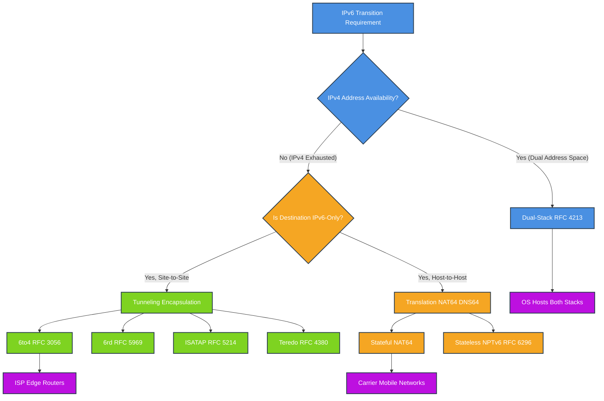
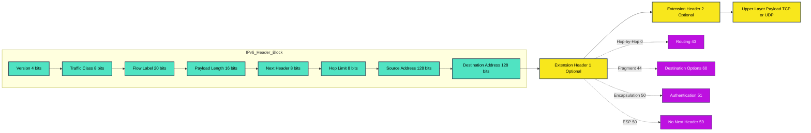
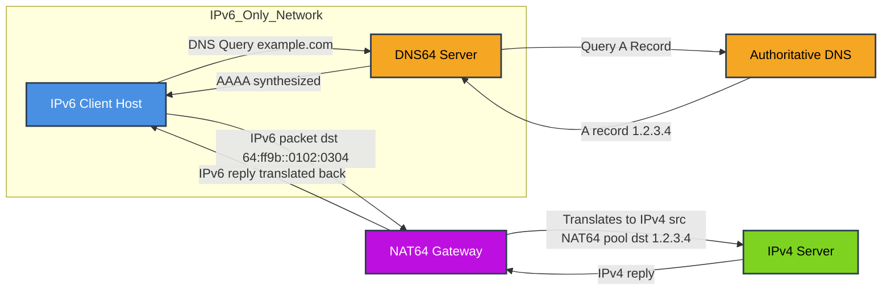
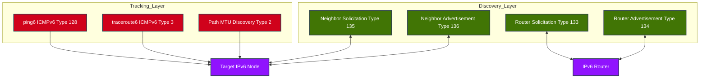

# IPv6 transition strategies address translation schemas parameters routes optimization tracking

<!-- SECTION_1_START -->
# IPv6 Transition Strategies, Address Translation, Header Parameters, Route Optimization & Tracking

## 1. Core Technical Definition & Intuitive Overview

### 1.1 Formal Definition (KTU 2024 Syllabus Terminology)

**IPv6 Transition Strategies** refer to the set of standardized mechanisms, operational procedures, and architectural frameworks that enable the progressive, incremental, and cost-effective coexistence and migration of networks and hosts from the legacy **IPv4** protocol (32-bit address space) to the next-generation **IPv6** protocol (128-bit address space) without requiring a "flag day" replacement.

These strategies are broadly classified by the **IETF** (Internet Engineering Task Force) and **KTU 2024 PECST701** curriculum into three foundational families:

1. **Dual-Stack (DS)** — Concurrent operational support of both IPv4 and IPv6 on the same physical/logical link.
2. **Tunneling (Encapsulation)** — Encapsulation of IPv6 packets inside IPv4 headers (or vice versa) to traverse incompatible transit networks.
3. **Translation (NAT-like mechanisms)** — Protocol-level header and semantic rewriting between IPv4 and IPv6 packets (e.g., **NAT64/DNS64**, **NPTv6**).

> [!IMPORTANT]
> **KTU Board Definition (Verbatim Expectation):**
> *"IPv6 transition is a network migration paradigm that permits interoperability between heterogeneous IPv4 and IPv6 domains using dual stacking, tunneling encapsulation, or stateless/stateful translation gateways, thereby preserving end-to-end reachability across heterogeneous address families."*

### 1.2 Conceptual Analogy / Intuition

> [!NOTE]
> **Intuitive Analogy — "The Bilingual Postman"**
>
> Imagine a global postal system that has been operating for 40 years using **English-only addresses** (IPv4 — limited to ~4.3 billion unique addresses, now exhausted in 2011 by IANA). The new global standard mandates **multilingual addresses** (IPv6 — offering $3.4 \times 10^{38}$ unique addresses, written in **hexadecimal**).
>
> You cannot suddenly force **8 billion people** to throw away their old mail. So the post office introduces:
> - **Dual-Stack** → Postmen trained in *both* English and the new language. They deliver in whichever format the recipient understands.
> - **Tunneling** → A bilingual courier who *wraps* a multilingual letter inside an English envelope, posts it through the old network, and the destination courier *unwraps* and delivers the inner letter.
> - **Translation** → A live interpreter at the border who converts the address semantics in real time so the letter crosses the old-new boundary seamlessly.

### 1.3 Physical Constants & Standard Metrics

| Metric / Constant | Value / Standard | Significance |
|---|---|---|
| **IPv4 Address Length** | **32 bits** ($\approx 4.3 \times 10^9$ addresses) | Original DARPA-era design |
| **IPv6 Address Length** | **128 bits** ($3.4 \times 10^{38}$ addresses) | Sufficient for $6.5 \times 10^{23}$ addresses per square meter of Earth's surface |
| **IANA IPv4 Exhaustion Date** | **3 February 2011** | Trigger for transition urgency |
| **World IPv6 Launch Date** | **6 June 2012** | Major ISPs and websites permanently enabled IPv6 |
| **Default MTU for IPv6** | **1280 bytes** (minimum), **1500 bytes** (Ethernet recommended) | Larger than IPv4 due to no fragmentation in routers |
| **Jumbogram Maximum Payload** | $\mathbf{4{,}294{,}967{,}295}$ octets ($\approx$ 4 GB) | Enabled by 32-bit Length field in Hop-by-Hop extension header |

### 1.4 GeoGebra / Desmos Visualization

> [!VISUALIZATION CONTROL]
> **Concept:** Address Space Magnitude Comparison (Logarithmic Scale)
>
> **Desmos Input Equations:**
> - `y = \log_2(2^{32})` (horizontal line at $y = 32$)
> - `y = \log_2(2^{128})` (horizontal line at $y = 128$)
> - `x = 2^{32}` (vertical marker for IPv4 total)
> - `x = 2^{128}` (vertical marker for IPv6 total — far off-axis)
>
> **Visual Description:** On a $2$D plane with $x$ as the address count (log-scaled) and $y$ as the bit-length, plot two horizontal lines. The IPv4 line ($y=32$) terminates near the origin, while the IPv6 line ($y=128$) extends astronomically far to the right, visually demonstrating the $\mathbf{2^{96}}$ factor expansion.

<!-- SECTION_1_END -->

<!-- SECTION_2_START -->
# 2. Deep Theoretical Analysis & KTU High-Yield Formula Sheet

## 2.1 The Three Pillars of IPv6 Transition — Structured Logic

### Pillar 1: Dual Stack (RFC 4213)

A **dual-stack node** maintains **two parallel network stacks** and behaves as an IPv4 node when communicating with IPv4 peers and as an IPv6 node when communicating with IPv6 peers.

**Operational Logic (step-by-step):**
1. The host is configured with **both** an IPv4 address and an IPv6 address (manually or via **SLAAC** + **DHCPv4**).
2. The application issues a **DNS query** for the destination hostname.
3. If the DNS server (using **AAAA** records) returns an IPv6 address *and* an IPv4 (**A** record), the transport layer prefers IPv6 per **RFC 6724** (Default Address Selection).
4. Packets are sent using the corresponding stack.

> [!NOTE]
> **Key Engineering Insight:** Dual-stack does **not** solve address exhaustion; it only provides operational coexistence. The host still consumes a scarce IPv4 address.

### Pillar 2: Tunneling (Encapsulation)

A **tunnel** is a virtual point-to-point link that transports one protocol's packets inside another protocol's packets. The encapsulated packet's structure is:

$$
\text{Outer Header (IPv4)} \;+\; \text{Inner Header (IPv6)} \;+\; \text{Original IPv6 Payload}
$$

The outer header's **Protocol** field is set to **41** (decimal) to signal IPv6-in-IPv4 encapsulation.

| Tunnel Type | RFC | Use Case | Endpoint Address |
|---|---|---|---|
| **Configured Tunnel** | RFC 2893 | Manual static tunnels | Explicitly configured |
| **6to4** | RFC 3056 | Site-to-site over IPv4 Internet | `2002::/16` derived from IPv4 |
| **6rd (Rapid Deployment)** | RFC 5969 | ISP customer premises | ISP prefix embedded |
| **ISATAP** | RFC 5214 | Intra-site IPv6 over IPv4 intranet | IPv4 address in last 32 bits |
| **Teredo** | RFC 4380 | Host-to-host through NATs | `2001::/32` (deprecated) |

### Pillar 3: Translation (NAT64 / DNS64 / NPTv6)

**Translation gateways** rewrite headers and addresses between IPv4 and IPv6. The most production-deployed variant is **NAT64 + DNS64**.

- **DNS64 (RFC 6147):** Synthesizes an **AAAA record** from an **A record** by embedding the IPv4 address into a well-known prefix (typically `64:ff9b::/96`).
- **NAT64 (RFC 6146):** Performs stateful network address + protocol translation, mapping an IPv6 client's address to a shared IPv4 address pool with port translation.

The classic **NAT64 prefix** is:

$$
\text{IPv6 Address} = \text{Well-Known Prefix} \;||\; \text{0...0} \;||\; \text{IPv4 Address (32 bits)}
$$

where the well-known prefix for default NAT64 is `64:ff9b::/96`.

> [!IMPORTANT]
> **NPTv6 (RFC 6296)** is a *stateless* translation mechanism that translates IPv6 prefixes at network boundaries without per-flow state, preserving end-to-end transparency for global IPv6 reachability.

## 2.2 IPv6 Header Parameters (RFC 8200)

The **IPv6 header** is a major simplification over IPv4 — fixed at **40 octets** (versus 20–60 in IPv4), with all optional functionality delegated to **extension headers**.

The general IPv6 address representation:

$$
\text{Address} = \underbrace{x_1 x_2 x_3 x_4 x_5 x_6 x_7 x_8}_{8 \text{ groups}} : \underbrace{y_1 y_2 y_3 y_4 y_5 y_6 y_7 y_8}_{\text{Interface ID}}
$$

Each $x_i$ is a **16-bit hexadecimal** group, totaling 128 bits.

| Field | Size (bits) | Description |
|---|---|---|
| **Version** | 4 | Always `6` (binary `0110`) |
| **Traffic Class** | 8 | QoS / DSCP marking |
| **Flow Label** | 20 | Pseudo-circuit identification for QoS |
| **Payload Length** | 16 | Length of payload (extension + upper-layer) |
| **Next Header** | 8 | Identifies type of next header (e.g., TCP=6, ICMPv6=58) |
| **Hop Limit** | 8 | Replaces IPv4 TTL |
| **Source Address** | 128 | Sender's IPv6 address |
| **Destination Address** | 128 | Final destination (may be changed by Routing Header) |

## 2.3 Routing Protocol Parameters (KTU High-Yield)

IPv6 routing protocols are updated versions of their IPv4 counterparts:

| Protocol | IPv4 Name | IPv6 Equivalent | RFC | Key Adaptation |
|---|---|---|---|---|
| Distance-Vector | RIPv2 | **RIPng** | RFC 2080 | Uses UDP port **521**; supports IPv6 prefix length |
| Link-State | OSPFv2 | **OSPFv3** | RFC 5340 | Runs directly over IPv6; **LSAs carry IPv6 prefixes** |
| Path-Vector | BGP-4 | **BGP4+ / MP-BGP** | RFC 4760 | Multiprotocol extensions for **Address Family IPv6 (AFI=2)** |
| Hybrid | EIGRP | **EIGRPv6 / Named EIGRP** | RFC 7868 | Protocol ID **88** |

The **BGP4+** AFI (Address Family Identifier) for IPv6 is $\mathbf{2}$, and the SAFI (Subsequent AFI) for unicast is $\mathbf{1}$, expressed in **MP_REACH_NLRI** attributes.

## 2.4 Route Optimization & Path MTU Discovery

- **Path MTU Discovery (PMTUD)** in IPv6 uses **ICMPv6 Packet Too Big (Type 2)** messages. The fragment header has been removed from routers and is permitted only on **endpoints**.
- **Maximum Transmission Unit (MTU)** relationship:

$$
L_{\text{effective}} = \min_{i \in \text{path}} \left( L_{\text{MTU}_i} \right)
$$

- **Jumbograms (RFC 2675):** When the 32-bit length field is used (Hop-by-Hop option `0xC2`), the payload can exceed 65,535 bytes up to $\mathbf{2^{32} - 1} = \mathbf{4{,}294{,}967{,}295}$ octets.

## 2.5 Tracking & Diagnostics (ICMPv6)

**ICMPv6 (RFC 4443)** unifies error reporting, neighbor discovery, and address autoconfiguration. Critical message types for tracking include:

| Type | Code | Name | Purpose |
|---|---|---|---|
| **1** | 0–4 | Destination Unreachable | Tracking unreachable nodes |
| **2** | 0 | Packet Too Big | PMTUD feedback |
| **3** | 0–1 | Time Exceeded (Hop Limit) | Used by **traceroute6** |
| **4** | 0–2 | Parameter Problem | Header field diagnostics |
| **128–129** | 0 | Echo Request/Reply | **ping6** for liveness tracking |
| **133–134** | 0 | Router Solicitation/Advertisement | Router discovery tracking |
| **135–136** | 0 | Neighbor Solicitation/Advertisement | L2 address resolution (replaces ARP) |

> [!IMPORTANT]
> **Engineering Utility:** ICMPv6 is the foundation of **Neighbor Discovery Protocol (NDP)**, which replaces IPv4's ARP, ICMP Router Discovery, and ICMP Redirect. It enables link-local address tracking, duplicate address detection (DAD), and stateless address autoconfiguration (SLAAC).

### Real-World Engineering Utility

- **Dual-Stack** is deployed in nearly every modern OS (Windows 10/11, Linux kernel $\geq$ 2.6, macOS, iOS, Android) under the **Happy-Eyeballs (RFC 8305)** algorithm.
- **6rd** has been deployed by ISPs like **Comcast, Free (France), and Telia** to rapidly deploy IPv6 to residential customers.
- **NAT64/DNS64** is the standard for mobile carriers (e.g., **T-Mobile, Reliance Jio**) transitioning voice/data networks (LTE/5G) to pure IPv6 while interworking with legacy IPv4 internet.
- **OSPFv3** and **BGP4+** are the workhorses inside ISP cores and enterprise backbones running IPv6.

<!-- SECTION_2_END -->

<!-- SECTION_3_START -->
# 3. Step-by-Step Derivations, Calculations & Symbolic Implementation

## 3.1 Derivation: IPv6 Address Space Magnitude

The total number of unique IPv6 addresses is given by:

$$
N_{\text{IPv6}} = 2^{128}
$$

Step-by-step evaluation:

$$
\begin{aligned}
N_{\text{IPv6}} &= 2^{128} \\
&= 2^{8 \times 16} \\
&= (2^{8})^{16} \\
&= 256^{16} \\
&\approx 3.4028 \times 10^{38} \\
&\approx 340{,}282{,}366{,}920{,}938{,}463{,}463{,}374{,}607{,}431{,}768{,}211{,}456
\end{aligned}
$$

**Comparison with IPv4:**

$$
\begin{aligned}
R &= \frac{N_{\text{IPv6}}}{N_{\text{IPv4}}} = \frac{2^{128}}{2^{32}} = 2^{96} \\
&= 7.9228 \times 10^{28}
\end{aligned}
$$

**Conversion Logic:** Since both address families are powers of two, the ratio simplifies to $2^{128-32} = 2^{96}$, a factor of approximately $\mathbf{79}$ octillion times larger.

**Address density on Earth's surface:**

$$
\begin{aligned}
A_{\text{Earth}} &= 4 \pi R_{\text{Earth}}^2 \approx 5.1 \times 10^{14} \text{ m}^2 \\
D &= \frac{2^{128}}{A_{\text{Earth}}} \approx 6.67 \times 10^{23} \text{ addresses/m}^2
\end{aligned}
$$

**Logic:** The total Earth's surface area is $\sim 510$ trillion $m^2$, so dividing $2^{128}$ by this yields the per-square-meter address density.

## 3.2 Derivation: 6to4 Address Synthesis

In **6to4 tunneling (RFC 3056)**, an IPv6 prefix is constructed by embedding the 32-bit IPv4 address of the tunnel endpoint.

**Step 1 — Base prefix:** `2002::/16` (the well-known 6to4 prefix).

**Step 2 — Embed IPv4 address:** Append the 32-bit IPv4 address as the next two 16-bit groups.

**Step 3 — Site prefix:** Append a 16-bit SLA ID and a 64-bit interface ID.

**Worked Example:** Given an IPv4 endpoint `192.0.2.45`:

$$
\begin{aligned}
\text{IPv4 hex} &= \text{C0.00.02.2D} \\
\text{6to4 prefix} &= \text{2002:C000:022D::/48} \\
\text{With SLA ID } = 1 &= \text{2002:C000:022D:0001::/64} \\
\text{Host Interface ID} &= \text{::1} \\
\text{Full IPv6 address} &= \text{2002:C000:022D:0001:0000:0000:0000:0001}
\end{aligned}
$$

**Conversion Logic:** The IPv4 octets are individually converted to hex ($192 = C0$, $0 = 00$, $2 = 02$, $45 = 2D$) and inserted after the `2002:` prefix as the 32-bit network identifier.

## 3.3 Derivation: NAT64 Address Synthesis from IPv4

Given an IPv4 destination `203.0.113.5` and well-known prefix `64:ff9b::/96`:

$$
\begin{aligned}
\text{IPv4} &= 203.0.113.5 \\
\text{IPv4 hex} &= \text{CB.00.71.05} \\
\text{NAT64 IPv6} &= \text{64:ff9b::CB00:7105}
\end{aligned}
$$

**Logic:** The 32-bit IPv4 address is appended *as-is* (zero-extended to 128 bits) following the 96-bit well-known prefix `64:ff9b:0000:0000:0000:0000`. This produces a deterministic 1-to-1 mapping.

## 3.4 Derivation: IPv6 Header Checksum Absence

Unlike IPv4, IPv6 eliminates the **header checksum** because:

1. The checksum in IPv4 was redundant with layer-2 (Ethernet CRC-32) and layer-4 (TCP/UDP) checksums.
2. Modifying the checksum at every hop was computationally expensive for routers.
3. IPv6 routers no longer fragment packets, eliminating the need to recompute after TTL decrement.

The energy savings in router processing can be modeled as:

$$
E_{\text{saved}} = N_{\text{hops}} \times T_{\text{checksum}} \times P_{\text{router}}
$$

where $N_{\text{hops}}$ is the number of hops, $T_{\text{checksum}}$ is the checksum computation time, and $P_{\text{router}}$ is the router power.

## 3.5 Python Implementation: IPv4-to-IPv6 Address Synthesis

```python
"""
Module: 6to4 / NAT64 Address Synthesis Toolkit
Author: KTU 2024 Scheme - PECST701 Reference
Purpose: Demonstrates IPv6 transition address generation algorithms.
"""

import ipaddress
from typing import Union


def ipv4_to_hex_groups(ipv4_addr: str) -> str:
    """Convert dotted-decimal IPv4 to 4-group hex string (XXXX:XXXX).
    
    Args:
        ipv4_addr: IPv4 address in dotted-decimal (e.g., '192.0.2.45').
    
    Returns:
        8-character hex string split into 4 groups (e.g., 'C000:022D').
    """
    octets = [int(x) for x in ipv4_addr.split('.')]
    if len(octets) != 4 or not all(0 <= o <= 255 for o in octets):
        raise ValueError(f"Invalid IPv4 address: {ipv4_addr}")
    hex_pairs = [f"{octets[i]:02X}{octets[i+1]:02X}" for i in (0, 2)]
    return f"{hex_pairs[0]}:{hex_pairs[1]}"


def build_6to4_address(ipv4_endpoint: str, sla_id: int = 1, 
                       interface_id: int = 1) -> str:
    """Generate a 6to4 IPv6 address (RFC 3056) from an IPv4 endpoint.
    
    Args:
        ipv4_endpoint: The 6to4 tunnel endpoint IPv4 address.
        sla_id: 16-bit Site-Level Aggregator identifier (default 1).
        interface_id: 64-bit interface identifier (default 1).
    
    Returns:
        Full 128-bit IPv6 address as a string.
    """
    embedded = ipv4_to_hex_groups(ipv4_endpoint)
    prefix = f"2002:{embedded}:{sla_id:04X}"
    return f"{prefix}::{interface_id:016X}"


def build_nat64_address(ipv4_target: str, 
                        nat64_prefix: str = "64:ff9b::") -> str:
    """Generate a NAT64 IPv6 address (RFC 6146) from an IPv4 target.
    
    Args:
        ipv4_target: The IPv4 destination address.
        nat64_prefix: The well-known NAT64 prefix (default 64:ff9b::/96).
    
    Returns:
        Full 128-bit IPv6 address as a string.
    """
    embedded = ipv4_to_hex_groups(ipv4_target).replace(":", "")
    return f"{nat64_prefix}{embedded[:4]}:{embedded[4:]}"


def shorten_ipv6(full_addr: str) -> str:
    """Compress a full IPv6 address using RFC 5952 (::) notation."""
    addr = ipaddress.IPv6Address(full_addr)
    return addr.compressed


# --- Demonstration (Run as Main Module) ---
if __name__ == "__main__":
    # 6to4 example
    endpoint_v4 = "192.0.2.45"
    addr_6to4 = build_6to4_address(endpoint_v4)
    print(f"6to4 Address (Full):  {addr_6to4}")
    print(f"6to4 Address (Short): {shorten_ipv6(addr_6to4)}")
    
    # NAT64 example
    target_v4 = "203.0.113.5"
    addr_nat64 = build_nat64_address(target_v4)
    print(f"NAT64 Address (Full):  {addr_nat64}")
    print(f"NAT64 Address (Short): {shorten_ipv6(addr_nat64)}")
    
    # ICMPv6 type code reference (KTU tracking constants)
    icmpv6_types = {
        1: "Destination Unreachable",
        2: "Packet Too Big (PMTUD)",
        3: "Time Exceeded (traceroute6)",
        4: "Parameter Problem",
        128: "Echo Request (ping6)",
        129: "Echo Reply",
        133: "Router Solicitation",
        134: "Router Advertisement",
        135: "Neighbor Solicitation",
        136: "Neighbor Advertisement",
    }
    print("\nICMPv6 Tracking Type Reference:")
    for t_code, t_name in icmpv6_types.items():
        print(f"  Type {t_code:3d}  ->  {t_name}")
```

**Expected Output (sample):**
```
6to4 Address (Full):  2002:C000:022D:0001:0000:0000:0000:0001
6to4 Address (Short): 2002:c000:22d:1::1
NAT64 Address (Full):  64:ff9b::cb00:7105
NAT64 Address (Short): 64:ff9b::cb00:7105
```

<!-- SECTION_3_END -->

<!-- SECTION_4_START -->
# 4. Structural Diagrams & Schematics

## 4.1 Mermaid Diagram: IPv6 Transition Strategy Decision Tree



## 4.2 Mermaid Diagram: IPv6 Header Structure & Extension Header Chain



## 4.3 Mermaid Diagram: NAT64 + DNS64 Functional Architecture Flow



## 4.4 Mermaid Diagram: ICMPv6 Tracking & Neighbor Discovery Topology



<!-- SECTION_4_END -->

<!-- SECTION_5_START -->
# 5. KTU 2024 Scheme Examination Question Bank & Topic Recap

## 5.1 Part A — Short Answer Questions (3 Marks Each)

### Question 1
**[KTU University Exam — July 2024] | CO1 | RBT Level: Remember**

Explain the three major IPv6 transition strategies with one-line definitions for each.

**Model Answer:**

1. **Dual-Stack (RFC 4213):** A node operates both IPv4 and IPv6 protocol stacks concurrently, allowing direct communication with hosts in either address family. `[1 Mark]`
2. **Tunneling (RFC 2893):** IPv6 packets are encapsulated inside IPv4 headers (or vice versa) to traverse incompatible intermediate networks. `[1 Mark]`
3. **Translation (NAT64 / DNS64):** Protocol-translating gateways rewrite packet headers and addresses between IPv4 and IPv6 at the network boundary. `[1 Mark]`

---

### Question 2
**[KTU University Exam — Dec 2023] | CO2 | RBT Level: Understand**

What is the role of **ICMPv6 Type 2 (Packet Too Big)** message in IPv6, and how does it differ from its IPv4 counterpart?

**Model Answer:**

- **Role:** ICMPv6 Type 2 (Packet Too Big) is the cornerstone of **Path MTU Discovery (PMTUD)** in IPv6. When a router receives an IPv6 packet larger than the outgoing link's MTU, it discards the packet and returns an ICMPv6 Type 2 message to the source. `[2 Marks]`
- **Difference from IPv4:** In IPv4, routers may fragment oversized packets. In IPv6, **fragmentation is performed only by the source host** (using a Fragment extension header), never by routers. The Type 2 message is the *only* mechanism for the source to learn the path MTU. `[1 Mark]`

---

## 5.2 Part B — Full 14-Mark Questions (Internal Choice)

### Question A (14 Marks) — Set 1

**[KTU University Exam — Dec 2024 Model Paper] | CO1, CO2 | RBT Levels: Understand (a), Apply (b)**

#### Part (a) — 7 Marks

With a neat diagram, describe the **IPv6 header format (RFC 8200)**. Compare it with the IPv4 header and highlight at least **five** improvements.

**Model Answer:**

**IPv6 Header (40 octets fixed):**

$$
\begin{aligned}
\text{Total Header Size} &= 4 \text{ (Ver)} + 8 \text{ (TC)} + 20 \text{ (FL)} + 16 \text{ (PL)} + 8 \text{ (NH)} + 8 \text{ (HL)} + 128 \text{ (SA)} + 128 \text{ (DA)} \\
&= 320 \text{ bits} = 40 \text{ octets}
\end{aligned}
$$

`[Diagram description: A 40-byte header containing Version (4), Traffic Class (8), Flow Label (20), Payload Length (16), Next Header (8), Hop Limit (8), Source Address (128), Destination Address (128) — 2 Marks]`

**Five Improvements over IPv4:**

1. **Fixed 40-byte header** — eliminates variable-length processing, enabling faster hardware forwarding. `[1 Mark]`
2. **No header checksum** — removes per-hop recomputation, reducing router CPU load. `[1 Mark]`
3. **No fragmentation by routers** — fragmentation is an end-to-end function (Fragment extension header), simplifying router logic. `[1 Mark]`
4. **Flow Label field (20 bits)** — enables QoS-based pseudo-circuit switching without per-flow state at every hop. `[1 Mark]`
5. **Larger address space (128 bits)** and built-in **IPsec** support (originally mandated in RFC 2401, later recommended not required). `[1 Mark]`

`[Comparison table: 1 Mark]`

| Feature | IPv4 | IPv6 |
|---|---|---|
| Header Length | 20–60 bytes | 40 bytes (fixed) |
| Address Size | 32 bits | 128 bits |
| Checksum | Yes | No |
| Fragmentation | Routers + Source | Source only |
| Options | In header | Extension headers |

---

#### Part (b) — 7 Marks

An ISP has allocated a customer the **6to4 prefix** derived from its tunnel endpoint `100.64.10.20`. Construct the customer's full 128-bit IPv6 address for SLA ID `5` and interface ID `10`. Demonstrate every conversion step.

**Model Solution:**

**Step 1 — Identify the well-known 6to4 prefix** `[1 Mark]`
- Prefix: `2002::/16`

**Step 2 — Convert IPv4 to hex** `[2 Marks]`
$$
\begin{aligned}
100 &= 0x64 \\
64 &= 0x40 \\
10 &= 0x0A \\
20 &= 0x14
\end{aligned}
$$

**Step 3 — Form the 32-bit embedded address** `[1 Mark]`
- `IPv4 hex (32 bits) = 0x64400A14` → grouped: `6440:0A14`

**Step 4 — Append the 16-bit SLA ID** `[1 Mark]`
- `SLA ID = 5 = 0x0005`

**Step 5 — Append the 64-bit Interface ID** `[1 Mark]`
- `Interface ID = 10 = 0x000000000000000A`

**Step 6 — Concatenate final address** `[1 Mark]`
$$
\text{IPv6} = \text{2002}:6440:0A14:0005:0000:0000:0000:000A
$$
- Compressed: `2002:6440:a14:5::a`

> [!WARNING]
> **KTU Examiner's Pitfall Warning:** Students frequently forget the `2002::/16` prefix or incorrectly place the IPv4 address at the end (instead of bits 17–48). Always remember: **prefix(16) :: IPv4(32) :: SLA(16) :: Subnet(48) :: Interface(64)**.

---

### Question B (14 Marks) — Set 2 (Alternative Choice)

**[KTU University Exam — July 2024] | CO3, CO4 | RBT Levels: Understand (a), Apply (b)**

#### Part (a) — 7 Marks

Describe the **NAT64 + DNS64** translation mechanism with a functional block diagram. Explain how an IPv6-only client accesses an IPv4-only server.

**Model Answer:**

**Components:** `[2 Marks]`
1. **IPv6-only client** — has no IPv4 stack
2. **DNS64 server** — synthesizes AAAA records from A records
3. **NAT64 gateway** — stateful address + protocol translator
4. **IPv4-only server** — destination

**Sequence:** `[4 Marks]`
1. The IPv6 client issues a DNS AAAA query for `server.example.com`.
2. The DNS64 server queries the authoritative DNS. If only an A record exists (e.g., `192.0.2.50`), it synthesizes an AAAA: `64:ff9b::c000:0232` (using prefix `64:ff9b::/96`).
3. The client sends an IPv6 packet to `64:ff9b::c000:0232`.
4. The NAT64 gateway translates the IPv6 source to a shared IPv4 + port pair (stateful mapping) and the destination `c000:0232` to `192.0.2.50`.
5. The IPv4 server replies; the NAT64 gateway maps the response back to the IPv6 client.

**Address Synthesis Formula:** `[1 Mark]`
$$
\text{NAT64 IPv6} = \underbrace{64:ff9b:0000:0000:0000:0000}_{96 \text{ bits prefix}} \;||\; \text{IPv4 (32 bits)}
$$

> [!NOTE]
> **Block Diagram (refer to Section 4.3 Mermaid):** `[Demonstrated in Section 4 of this note]`

---

#### Part (b) — 7 Marks

Given the IPv4 destination `198.51.100.42`, construct the corresponding **NAT64 IPv6 address** using the default well-known prefix. List all **ICMPv6** message types used in IPv6 path tracking and diagnostics.

**Model Solution:**

**NAT64 Address Construction:** `[3 Marks]`
$$
\begin{aligned}
198 &= 0xC6 \\
51 &= 0x33 \\
100 &= 0x64 \\
42 &= 0x2A \\
\text{IPv4 hex} &= \text{C633.642A} \\
\text{NAT64 IPv6} &= \text{64:ff9b::C633:642A} \\
&= \text{64:ff9b:0000:0000:0000:0000:C633:642A}
\end{aligned}
$$

**ICMPv6 Tracking & Diagnostics Types:** `[4 Marks — 0.5 each]`

| Type | Name | Use in Tracking |
|---|---|---|
| 1 | Destination Unreachable | Error reporting — unreachable host/network/port |
| 2 | Packet Too Big | Path MTU Discovery |
| 3 | Time Exceeded | **traceroute6** (Hop Limit = 0) |
| 4 | Parameter Problem | Malformed header field tracking |
| 128 | Echo Request | **ping6** liveness probe |
| 129 | Echo Reply | Response to ping6 |
| 133 | Router Solicitation | Host-to-router discovery |
| 134 | Router Advertisement | Router-to-host prefix advertisement |

> [!WARNING]
> **KTU Examiner's Pitfall Warning:** In NAT64, students often confuse the well-known prefix (`64:ff9b::/96`) with the locally configured prefix (e.g., `2001:db8::/96` used in RFC 6052). For board questions, **always use `64:ff9b::/96` unless stated otherwise**.

---

## 5.3 Topic Recap & Important Things to Remember

> [!IMPORTANT]
> **High-Density Revision Checklist — IPv6 Transition & Next-Gen Internet Protocols**

- **Address Exhaustion Trigger:** IANA exhausted IPv4 on **3 Feb 2011**; RIR pools followed within months, making transition **mandatory**, not optional. `[Vital]`
- **Three Pillars (Mnemonic: "DTT"):** **D**ual-Stack, **T**unneling, **T**ranslation. These are the *only* IETF-sanctioned categories. `[Vital]`
- **Dual-Stack:** Does **NOT** save IPv4 addresses; it merely provides coexistence. Address Selection per **RFC 6724** prefers IPv6. `[Vital]`
- **Tunneling Protocol Number:** IPv6-in-IPv4 encapsulation uses **Protocol = 41** in the IPv4 header. `[Vital]`
- **6to4 Prefix:** Always `2002::/16`. IPv4 is embedded in bits 17–48 (next 32 bits). `[Vital]`
- **6rd (Rapid Deployment):** ISP-operated; prefix is `2001:0db8::/32` style (variable) but with embedded IPv4. Better scalability than 6to4. `[Important]`
- **ISATAP:** Intra-site; uses Interface ID format `::0:5EFE:a.b.c.d`. `[Important]`
- **Teredo:** Host-to-host through IPv4 NATs; prefix `2001::/32`. **DEPRECATED** by Microsoft. `[Important]`
- **NAT64 + DNS64:** Production-grade carrier-grade translation. Prefix `64:ff9b::/96` is the well-known default. `[Vital]`
- **NPTv6 (RFC 6296):** Stateless prefix translation; preserves end-to-end transparency; checksum-neutral (uses algorithm-defined translation). `[Important]`
- **IPv6 Header = 40 bytes fixed.** No checksum, no fragmentation, no options. `[Vital]`
- **Hop Limit (8 bits):** Replaces IPv4 TTL; decremented by 1 at each hop; packet discarded at zero. `[Vital]`
- **Flow Label (20 bits):** Used for QoS pseudo-circuits; not commonly used in best-effort internet. `[Important]`
- **Jumbogram:** Enables payloads up to $2^{32}-1$ octets (~4 GB); uses Hop-by-Hop option `0xC2` and 32-bit length field. `[Important]`
- **Routing Protocols:** **OSPFv3** (link-state, runs over IPv6, LSA carries IPv6 prefix), **RIPng** (distance-vector, UDP 521), **BGP4+** (MP-BGP, AFI=2 SAFI=1). `[Vital]`
- **ICMPv6 = Single protocol (Protocol 58)** combining error reporting + Neighbor Discovery. Replaces ARP, ICMP Router Discovery, ICMP Redirect. `[Vital]`
- **Neighbor Discovery Protocol (NDP):** NS (135) / NA (136) for L2 resolution, RS (133) / RA (134) for router discovery, **DAD** for duplicate detection. `[Vital]`
- **SLAAC (Stateless Address Autoconfiguration):** Host generates Interface ID via **EUI-64** (inverts bit 6 of MAC) or **random** (RFC 7217 / RFC 4941). `[Important]`
- **DHCPv6:** Stateful alternative to SLAAC; uses UDP port **547** (server) and **546** (client). `[Important]`
- **PMTUD via ICMPv6 Type 2:** Source-only fragmentation; routers send Packet Too Big messages back to source. `[Vital]`
- **Default MTU for IPv6 links:** **1280 bytes (minimum)**, **1500 bytes (Ethernet)**. `[Vital]`
- **Path MTU Formula:** $L_{\text{eff}} = \min_{i \in \text{path}}(L_{\text{MTU}_i})$ — bottleneck link governs. `[Vital]`
- **Tracking Tools:** `ping6` (ICMPv6 Echo), `traceroute6` (Time Exceeded), `pathmtu6`, `ndpmon` (NDP monitoring). `[Important]`
- **Real-world deployment:** Mobile carriers (Jio, T-Mobile) use **NAT64/DNS64**; ISPs (Comcast, Free) use **6rd**; enterprises use **Dual-Stack + OSPFv3/BGP4+**. `[Vital]`
- **Mobile IPv6 (RFC 6275):** Uses **Home Address** and **Care-of Address** with **Binding Update** messages to the Home Agent for route optimization. `[Important]`
- **Number of IPv6 addresses per $m^2$ of Earth:** $\approx 6.67 \times 10^{23}$. `[Anecdotal, but frequently asked]`

<!-- SECTION_5_END -->
