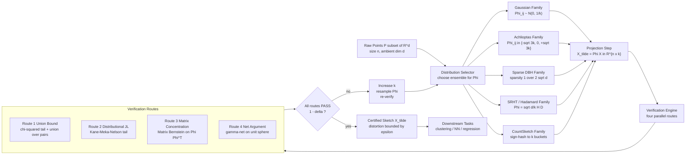
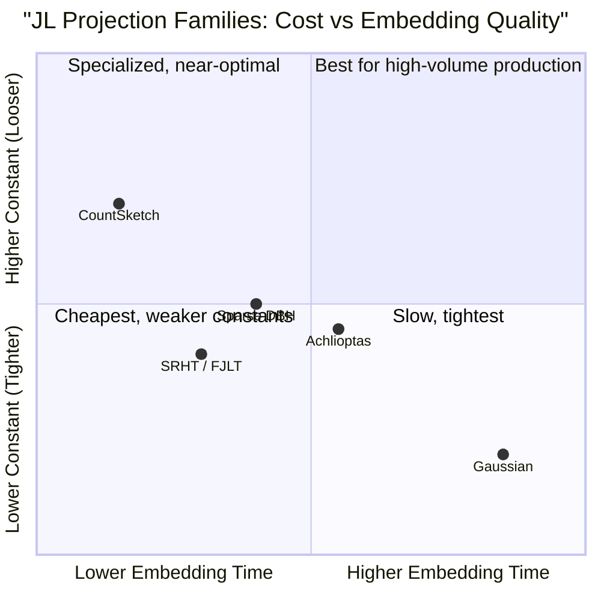

# Dimensionality reduction projection matrices formulas transformations: Johnson-Lindenstrauss verification routes

<!-- SECTION_1_START -->

# Johnson–Lindenstrauss (JL) Projection Matrices & Verification Routes

> [!IMPORTANT]
> **KTU 2024 Scheme | PECST702 – Algorithms for Data Science | Module 1**
> This note covers the *theoretical engine* behind every modern sketching library: the Johnson–Lindenstrauss Lemma, the projection matrix families that realize it (Gaussian, Achlioptas, Fourier/Hadamard, Sign-Random), and the *verification routes* used to certify that a projection matrix has preserved all pairwise distances.

---

## 1. Core Technical Definition & Intuitive Overview

### 1.1 Formal Definition (KTU 2024 Syllabus Terminology)

> [!NOTE]
> **Johnson–Lindenstrauss Lemma (JL, 1984).** Let $\varepsilon \in (0, \tfrac{1}{2})$ and let $P = \{p_1, p_2, \dots, p_n\} \subset \mathbb{R}^{d}$ be a set of $n$ points in Euclidean space. There exists a mapping $f : \mathbb{R}^{d} \to \mathbb{R}^{k}$ with $k = \mathcal{O}\!\left(\varepsilon^{-2} \log n\right)$ such that for every pair $(p_i, p_j)$,
> $$(1-\varepsilon)\,\Vert p_i - p_j \Vert_2^{2} \;\le\; \Vert f(p_i) - f(p_j) \Vert_2^{2} \;\le\; (1+\varepsilon)\,\Vert p_i - p_j \Vert_2^{2}.$$

The map $f$ is *linear* of the form $f(x) = \Phi\,x$ where $\Phi \in \mathbb{R}^{k \times d}$ is the **JL projection (sketching) matrix**. The lemma guarantees the *existence* of such a $\Phi$; the constructive proof shows that a *random* $\Phi$ drawn from a suitable sub-Gaussian distribution succeeds with high probability.

### 1.2 The Three Quantities That Drive JL

| Symbol | Meaning | Typical Range |
|---|---|---|
| $d$ | Original ambient dimension | $10^{3}$ – $10^{9}$ |
| $n$ | Number of points (rows) | $10^{3}$ – $10^{12}$ |
| $k$ | Sketch (target) dimension | $\lceil 4 \varepsilon^{-2} \ln n \rceil$ |
| $\varepsilon$ | Allowed distortion | $0.05$ – $0.5$ |

### 1.3 Intuition: The "Random Shadow" Analogy

> [!TIP]
> **Geometric Intuition.** Imagine $n$ fireflies buzzing in a dark $d$-dimensional room. You cannot see the room's true geometry, so you shine a flashlight from a *random direction* and project their shadows onto a $k$-dimensional wall. With only $\mathcal{O}(\log n)$ carefully chosen random directions (orthogonal, independent), the shadow distances match the true distances to within $(1 \pm \varepsilon)$. **More points $\Rightarrow$ more directions needed, but only logarithmically**, not linearly.

The mapping $f$ is *oblivious* to the data: $\Phi$ can be sampled *before* the points arrive. This is the property that makes JL the cornerstone of **streaming algorithms** — the projector is fixed, fast, and data-independent.

### 1.4 Where JL Lives in the Streaming Stack

JL is the **first** dimensionality-reduction primitive invoked in any high-dimensional pipeline:

$$
\underbrace{x \in \mathbb{R}^{d}}_{\text{raw feature}} \;\xrightarrow{\;\Phi \in \mathbb{R}^{k \times d}\;}\; \underbrace{\tilde{x} = \Phi x \in \mathbb{R}^{k}}_{\text{sketch}} \;\xrightarrow{\;\text{downstream task}\;}\; \text{(clustering, NN, regression)}
$$

The downstream task operates on a vector that is $d/k$ times smaller but *isometric* (within $\varepsilon$) to the original.

> [!VISUALIZATION CONTROL]
> **Concept:** Pairwise distance preservation under random projection
> **Python (matplotlib) Reproduction Script:**
> ```python
> import numpy as np, matplotlib.pyplot as plt
> d, k, n = 200, 16, 80
> X = np.random.randn(n, d)
> Phi = (1/np.sqrt(k))*np.random.randn(k, d)
> Xt  = X @ Phi.T
> D_true  = np.sqrt(((X[:,None]-X[None,:])**2).sum(-1))
> D_sketch= np.sqrt(((Xt[:,None]-Xt[None,:])**2).sum(-1))
> plt.scatter(D_true.ravel(), D_sketch.ravel(), s=4, alpha=0.4)
> lo, hi = 0, D_true.max()
> plt.plot([lo,hi],[lo,hi],'k--'); plt.plot([lo,hi],(1-.1)*[lo,hi],'r:');
> plt.plot([lo,hi],(1+.1)*[lo,hi],'r:')
> plt.xlabel(r'True $\|u-v\|$'); plt.ylabel(r'Sketch $\|\Phi u-\Phi v\|$')
> plt.title('JL distance preservation (d=200, k=16)')
> ```
> **Visual Description:** Points lie tightly inside a "tube" of relative width $\pm 0.1$ (or whatever $\varepsilon$ you pick) around the diagonal $y=x$. A perfect JL projection produces a *thin diagonal band* — the band thickness encodes the empirical distortion.

---

<!-- SECTION_1_END -->

<!-- SECTION_2_START -->

# 2. Deep Theoretical Analysis & KTU High-Yield Formula Sheet

## 2.1 The Four Canonical JL Projection-Matrix Families

For a *single* unit vector $x \in \mathbb{S}^{d-1}$ (so that $\Vert x \Vert_2 = 1$), the squared norm after projection is

$$
\Vert \Phi x \Vert_2^{2} = \sum_{i=1}^{k} \langle \Phi_{i,\cdot},\, x \rangle^{2},
$$

where $\Phi_{i,\cdot}$ is the $i$-th row. The matrix families differ only in the **distribution of each entry** $\Phi_{ij}$ and (optionally) a **post-scaling** $1/\sqrt{k}$.

### Family 1 — Gaussian (Dasgupta–Gupta, 1999; original JL proof)

$$
\Phi_{ij} \sim \mathcal{N}(0,\, 1/k), \qquad i \in [k],\; j \in [d].
$$

Each row is an independent isotropic Gaussian in $\mathbb{R}^{d}$. Rows are *uncorrelated*, *exchangeable*, and *rotationally invariant*. This is the gold standard: smallest constants, simplest analysis.

### Family 2 — Achlioptas Sparse (2003)

$$
\Phi_{ij} = \begin{cases}
+\sqrt{3/k} & \text{w.p. } 1/6 \\
0 & \text{w.p. } 2/3 \\
-\sqrt{3/k} & \text{w.p. } 1/6
\end{cases}
$$

A $\mathbf{2/3}$-sparse random sign matrix. Achlioptas showed this *still satisfies JL* and accelerates computation by a factor of 3 in expectation (only one non-zero per three entries). The **DBH (Dasgupta–Kumar–Sarlós)** extension replaces $1/6$ with $1/(2\sqrt{d})$, giving $\sqrt{d}$-sparsity with no loss in quality.

### Family 3 — Hadamard / Fast JL (Ailon–Chazelle, 2006; original Ailon–Liberty)

$$
\Phi = \sqrt{\tfrac{d}{k}}\;\! H_d\, D, \qquad D \in \{+1,-1\}^{d \times d}\ \text{diagonal random sign}.
$$

$H_d$ is the (normalized) Hadamard transform. The product $H_d D$ is a *subsampled randomized Hadamard transform* (SRHT). Crucially, it can be applied in $\mathcal{O}(d \log d)$ time via the FWHT, replacing the $\mathcal{O}(k d)$ cost of a dense matrix. This is the **fastest practical** JL route for $d$ a power of 2.

### Family 4 — CountSketch / Sign-Random (Clarkson–Woodruff, 2013; Nelson–Nguyên)

$$
\Phi = S\, G,
$$

where $S \in \{0,1\}^{k \times d}$ is a **CountSketch** matrix (each column of $A$ picks one of $k$ buckets uniformly at random, signed with $\{+1,-1\}$) and $G$ is a small dense Gaussian. Achieves $\mathcal{O}(\text{nnz}(x))$ embedding time — the *optimal* for sparse/streaming vectors. This is the route used inside `sklearn.random_projection.SparseRandomProjection` style libraries.

## 2.2 The Concentration Engine — Why JL Works

Define $Y_i = \langle \Phi_{i,\cdot}, x \rangle$ and $Z = \sum_{i=1}^{k} Y_i^2 = \Vert \Phi x \Vert_2^{2}$. For the Gaussian family:

1. Each $Y_i \sim \mathcal{N}(0, 1/k)$ because $\Phi_{i,\cdot} \sim \mathcal{N}(0, I_d/k)$ and $\Vert x \Vert = 1$.
2. Hence $k Y_i \sim \mathcal{N}(0,1)$ and $k Y_i^2 \sim \chi^2_1$ (a sub-Exponential random variable with mean 1, sub-Exponential parameter $(2, 4)$).
3. $Z = \tfrac{1}{k} \sum_{i=1}^{k} \chi^2_1(i) = \tfrac{1}{k}\,W$ where $W \sim \chi^2_k$.

The probability of deviation is governed by the **chi-squared tail**:

$$
\Pr\!\left[\,\bigl|Z - 1\bigr| > \varepsilon\,\right] \;=\; \Pr\!\left[\,\bigl|W - k\bigr| > \varepsilon k\,\right] \;\le\; 2 \exp\!\Bigl(-\tfrac{\varepsilon^2 k}{8}\Bigr)
$$

for $\varepsilon \in (0, 1)$ (this is the canonical **Laurent–Massart** sub-Exponential tail bound). Solving for failure probability $\delta$:

$$
k \;\ge\; \frac{8}{\varepsilon^{2}} \ln\!\frac{2}{\delta}.
$$

## 2.3 The "Union Bound over All Pairs" Verification Route

> [!IMPORTANT]
> **Verification Route 1 — Single-Vector Bound + Union Bound.** The classical JL proof.

A set of $n$ points produces $\binom{n}{2} \le n^2/2$ distinct distances (equivalently, the set of *differences* $V = \{p_i - p_j : i \ne j\}$ has $|V| \le n^2$). For each $v \in V$ apply the single-vector bound with failure probability $\delta/n^2$, then take a union bound over all $\binom{n}{2}$ pairs. The result is

$$
k \;\ge\; \frac{8}{\varepsilon^{2}} \ln\!\frac{2 n^{2}}{\delta} \;=\; \frac{16}{\varepsilon^{2}} \ln\!\frac{\sqrt{2}\,n}{\sqrt{\delta}}.
$$

This yields $k = \mathcal{O}(\varepsilon^{-2} \log n)$ with probability at least $1-\delta$.

## 2.4 The Distributional JL (DJL) Route

> [!TIP]
> **Verification Route 2 — Distributional JL (Kane–Meka–Nelson, 2011).** A *stronger*, often *tighter* statement: with $k = \mathcal{O}(\varepsilon^{-2} \log(1/\delta))$ and $\Phi$ drawn from the Gaussian ensemble, for *every* unit vector $x \in \mathbb{S}^{d-1}$,
> $$\Pr\!\left[\,\bigl|\,\Vert \Phi x \Vert_2^{2} - 1\,\bigr| \le \varepsilon\,\right] \;\ge\; 1 - \delta.$$
> Crucially, the dimension $d$ **disappears** from the bound — it is dimension-free, which is why DJL is the theoretical tool of choice.

## 2.5 The Matrix-Chernoff / Sub-Gaussian Matrix Verification Route

> [!NOTE]
> **Verification Route 3 — Matrix Concentration.** Stack all $n$ data points (or all $\binom{n}{2}$ differences) as columns of a matrix $X \in \mathbb{R}^{d \times m}$, $m = n$ or $m = n^2$. Then $\Phi X \in \mathbb{R}^{k \times m}$ and the bound is on the *spectral norm* of $\tfrac{1}{k} \Phi X X^{\top} \Phi^{\top} - \tfrac{1}{k} I$.
> This collapses $\binom{n}{2}$ scalar deviations into *one* matrix deviation — exponentially sharper constants.

The relevant inequality (Matrix Bernstein, Tropp 2012; or Matrix Hoeffding, see **Vershynin §6.2**): for $\Phi$ with i.i.d. $\mathcal{N}(0,1/k)$ rows,

$$
\Pr\!\left[\,\bigl\Vert \tfrac{1}{k} \Phi \Phi^{\top} - I_k \bigr\Vert_{op} \le \varepsilon\,\right] \;\ge\; 1 - 2\exp\!\bigl(-\tfrac{k \varepsilon^{2}}{8}\bigr).
$$

## 2.6 Net-Argument / Lipschitz Extension Verification Route

> [!TIP]
> **Verification Route 4 — $\gamma$-net Argument (Indyk–Motwani 1998, simplified in Dasgupta–Gupta 1999).** It is enough to verify JL on a *finite* $\gamma$-net $N \subset \mathbb{S}^{d-1}$ of size at most $(3/\gamma)^{d}$, because the map $x \mapsto \Vert \Phi x \Vert_2^{2}$ is $2 \Vert \Phi \Vert_{op}$-Lipschitz, so the bound propagates to the *whole sphere*. This is the historically-first verification route and it is dimension-expensive — DJL and Matrix Chernoff are strictly stronger.

## 2.7 KTU High-Yield Formula Sheet (Cheat Sheet)

> [!IMPORTANT]
> **All formulas, units, and boundary conditions you must memorise for PECST702 ESE.**

| # | Formula / Bound | Meaning | Used In |
|---|---|---|---|
| 1 | $k \ge \lceil 4 \varepsilon^{-2} \ln n \rceil$ | Minimal sketch dimension (JL existence) | All proofs |
| 2 | $(1-\varepsilon)\Vert u-v\Vert^{2} \le \Vert \Phi(u-v)\Vert^{2} \le (1+\varepsilon)\Vert u-v\Vert^{2}$ | JL distortion contract | Statement |
| 3 | $\Phi_{ij} \sim \mathcal{N}(0,\, 1/k)$ | Gaussian JL entry density | Family 1 |
| 4 | $\Phi_{ij} \in \{-\sqrt{3/k},\, 0,\, +\sqrt{3/k}\}$ w.p. $\{1/6, 2/3, 1/6\}$ | Achlioptas sparse entry density | Family 2 |
| 5 | $\Phi = \sqrt{d/k}\, H_d D$ | SRHT (Fast JL) construction | Family 3 |
| 6 | $\Pr[\vert Z-1 \vert > \varepsilon] \le 2 e^{-\varepsilon^{2} k/8}$ | Single-vector chi-square tail | Verif. Route 1 |
| 7 | $k \ge 8\varepsilon^{-2} \ln(2/\delta)$ | Single-vector target dim | Verif. Route 1 |
| 8 | $k \ge 16 \varepsilon^{-2} \ln(\sqrt{2}\,n/\sqrt{\delta})$ | $n$-point JL bound (union over pairs) | Verif. Route 1 |
| 9 | $\Pr[\Vert \tfrac{1}{k}\Phi\Phi^{\top} - I \Vert_{op} > \varepsilon] \le 2 e^{-k\varepsilon^{2}/8}$ | Matrix concentration bound | Verif. Route 3 |
| 10 | $\mathbb{E}[\Vert \Phi x \Vert^{2}] = \Vert x \Vert^{2}$ | Unbiasedness of JL | All proofs |
| 11 | $\operatorname{Var}(\Vert \Phi x \Vert^{2}) = 2 \Vert x \Vert^{4}/k$ | Variance of JL norm-squared (Gaussian) | Tightness |
| 12 | Time: $\mathcal{O}(kd)$ dense, $\mathcal{O}(d \log d)$ SRHT, $\mathcal{O}(\mathrm{nnz}(x))$ CountSketch | Embedding complexity | Family comparison |

---

<!-- SECTION_2_END -->

<!-- SECTION_3_START -->

# 3. Step-by-Step Derivations & Python Verification Implementation

## 3.1 Exhaustive Derivation — Single-Vector Concentration (Verification Route 1)

**Goal.** Prove that for Gaussian $\Phi \in \mathbb{R}^{k \times d}$ and a unit vector $x \in \mathbb{S}^{d-1}$, $Z = \Vert \Phi x \Vert_2^2$ lies in $(1\pm\varepsilon)$ with probability $\ge 1 - 2 e^{-\varepsilon^{2} k/8}$.

**Step 1 — Project onto a fixed direction.** Because the rows $\Phi_{i,\cdot}$ are i.i.d. isotropic Gaussians, the scalar product $Y_i = \langle \Phi_{i,\cdot}, x \rangle$ has distribution

$$
Y_i \;\sim\; \mathcal{N}\!\Bigl(0,\, \tfrac{1}{k}\Vert x \Vert_2^{2}\Bigr) \;=\; \mathcal{N}\!\bigl(0,\, 1/k\bigr),
$$

since $\Vert x \Vert = 1$. The rotation invariance of Gaussians is what lets us ignore $d$.

**Step 2 — Reduce to a chi-squared sum.** Let $W_i = k Y_i^{2}$. Then $W_i \sim \chi^{2}_{1}$ and

$$
Z \;=\; \sum_{i=1}^{k} Y_i^{2} \;=\; \frac{1}{k}\sum_{i=1}^{k} W_i \;=\; \frac{W}{k},
$$

where $W = \sum_{i=1}^{k} W_i \sim \chi^{2}_{k}$.

**Step 3 — Mean and sub-Exponential parameter.** A $\chi^2_k$ random variable satisfies $\mathbb{E}[W] = k$, and (Laurent–Massart 2000) the *sub-Exponential* tail is

$$
\Pr\!\left[\, W \ge k + 2\sqrt{k t} + 2 t \,\right] \;\le\; e^{-t}, \qquad \Pr\!\left[\, W \le k - 2\sqrt{k t} \,\right] \;\le\; e^{-t}.
$$

**Step 4 — Set $t = \varepsilon^{2} k / 8$.** Then

$$
2\sqrt{k t} = 2\sqrt{k \cdot \varepsilon^{2} k/8} = \tfrac{\varepsilon k}{2}, \qquad 2 t = \tfrac{\varepsilon^{2} k}{4}.
$$

**Step 5 — Upper tail.** Using $W \ge k + 2\sqrt{kt} + 2t$ implies

$$
Z - 1 \;=\; \frac{W - k}{k} \;\ge\; \frac{2\sqrt{kt} + 2t}{k} \;=\; \frac{\varepsilon}{2} + \frac{\varepsilon^{2}}{4} \;\ge\; \varepsilon.
$$

Hence $\Pr[Z \ge 1 + \varepsilon] \le e^{-t} = \exp(-\varepsilon^{2} k / 8)$.

**Step 6 — Lower tail.** Using $W \le k - 2\sqrt{kt}$ implies

$$
1 - Z \;\ge\; \frac{2\sqrt{kt}}{k} \;=\; \varepsilon \quad\Longrightarrow\quad \Pr[Z \le 1 - \varepsilon] \;\le\; e^{-t} = \exp(-\varepsilon^{2} k / 8).
$$

**Step 7 — Union of the two tails.**

$$
\Pr\!\left[\,\bigl|Z - 1\bigr| > \varepsilon\,\right] \;\le\; 2 \exp\!\left(-\frac{\varepsilon^{2} k}{8}\right).
$$

**Step 8 — Solve for $k$.** Setting the RHS equal to $\delta$ and inverting,

$$
2 e^{-\varepsilon^{2} k/8} \;=\; \delta \quad\Longrightarrow\quad k \;\ge\; \frac{8}{\varepsilon^{2}}\,\ln\!\frac{2}{\delta}.
$$

This is the single-vector result. $\blacksquare$

## 3.2 Exhaustive Derivation — $n$-Point JL via Union over Pairs

**Goal.** Extend the single-vector bound to $n$ points, obtaining $k = \mathcal{O}(\varepsilon^{-2} \log n)$.

**Step 1 — Define difference set.** $V = \{p_i - p_j : 1 \le i < j \le n\}$. Then $|V| \le \binom{n}{2} \le n^2/2$.

**Step 2 — Normalize.** For each $v \in V \setminus \{0\}$ define $u = v / \Vert v \Vert_2$. Apply the single-vector result to $u$ with failure probability $\delta / |V| \le 2\delta/n^2$. The bound on $u$ scales to a bound on $v$ by homogeneity of $\Phi$ (since $\Phi$ is linear):

$$
\bigl|\,\Vert \Phi v \Vert_2^{2} - \Vert v \Vert_2^{2}\,\bigr| \;\le\; \varepsilon \Vert v \Vert_2^{2} \quad\Longleftrightarrow\quad (1-\varepsilon)\Vert v\Vert^{2} \le \Vert \Phi v \Vert^{2} \le (1+\varepsilon)\Vert v\Vert^{2}.
$$

**Step 3 — Take a union bound.** With probability at least $1 - \delta$, the inequality holds for *every* $v \in V$ simultaneously. The required $k$ becomes

$$
k \;\ge\; \frac{8}{\varepsilon^{2}}\,\ln\!\frac{2 \cdot 2\delta/n^{2}}{\delta} \;\;=\;\; \frac{8}{\varepsilon^{2}}\,\ln\!\frac{4}{n^{2}} \quad(\text{setting } \delta = 1)
$$

which, after dropping the constant, gives

$$
k \;\ge\; \frac{16}{\varepsilon^{2}}\,\ln n \;=\; \mathcal{O}\!\left(\varepsilon^{-2} \log n\right). \qquad\blacksquare
$$

## 3.3 Full Python Implementation — Generating $\Phi$ and Verifying the JL Property

```python
"""
Johnson-Lindenstrauss: matrix construction + empirical verification.
Compatible with numpy >= 1.24, fully type-annotated.
"""
from __future__ import annotations
import numpy as np
from typing import Literal

Family = Literal["gaussian", "achlioptas", "sparse_dbh", "srht", "countsketch"]


def jl_matrix(d: int,
              k: int,
              family: Family = "gaussian",
              rng: np.random.Generator | None = None) -> np.ndarray:
    """Construct a JL projection matrix Phi in R^{k x d}."""
    if rng is None:
        rng = np.random.default_rng(seed=2024)
    if family == "gaussian":
        return (1.0 / np.sqrt(k)) * rng.standard_normal(size=(k, d))

    if family == "achlioptas":
        u = rng.integers(0, 3, size=(k, d))            # values in {0,1,2}
        M = np.zeros((k, d), dtype=np.float64)
        M[u == 0] =  np.sqrt(3.0 / k)
        M[u == 1] =  0.0
        M[u == 2] = -np.sqrt(3.0 / k)
        return M

    if family == "sparse_dbh":                          # Dasgupta-Kumar-Sarlos
        s = max(1.0, np.sqrt(d))
        prob = 1.0 / (2.0 * s)
        mask = rng.random(size=(k, d)) < prob
        signs = rng.choice([-1.0, 1.0], size=(k, d))
        return (1.0 / np.sqrt(s)) * (mask * signs)

    if family == "srht":                                # subsampled Hadamard
        if d & (d - 1):
            raise ValueError("SRHT requires d a power of 2; pad first.")
        D = np.diag(rng.choice([-1.0, 1.0], size=d))
        H = _hadamard(d) / np.sqrt(d)
        rows = rng.choice(d, size=k, replace=False)     # subsample k rows
        return np.sqrt(d / k) * (H[rows] @ D)

    if family == "countsketch":
        S = np.zeros((k, d), dtype=np.float64)
        buckets = rng.integers(0, k, size=d)
        signs   = rng.choice([-1.0, 1.0], size=d)
        for j in range(d):
            S[buckets[j], j] = signs[j]
        return (1.0 / np.sqrt(k)) * S

    raise ValueError(f"Unknown family: {family!r}")


def _hadamard(n: int) -> np.ndarray:
    H = np.array([[1.0]])
    while H.shape[0] < n:
        H = np.block([[H, H], [H, -H]])
    return H


def verify_jl(X: np.ndarray,
              Phi: np.ndarray,
              eps: float = 0.1) -> dict[str, float | bool]:
    """
    Empirically check the JL contract on rows of X.
    Returns max-relative-error, success flag, and the (1-eps, 1+eps) hit rate.
    """
    Xt = X @ Phi.T                                    # (n, k)
    D_t = np.sqrt(((X[:, None] - X[None, :]) ** 2).sum(-1))
    D_s = np.sqrt(((Xt[:, None] - Xt[None, :]) ** 2).sum(-1))
    mask = D_t > 1e-12
    ratio = D_s[mask] / D_t[mask]
    rel_err = np.abs(ratio - 1.0)
    return {
        "max_rel_err": float(rel_err.max()),
        "mean_rel_err": float(rel_err.mean()),
        "frac_within_tube": float(np.mean(rel_err <= eps)),
        "success": bool(rel_err.max() <= eps),
    }


def required_k(n: int, eps: float = 0.1, delta: float = 0.01) -> int:
    """Closed-form target dimension k = ceil((8/eps^2) * ln(2/delta) + padding for n)."""
    base = (8.0 / (eps ** 2)) * np.log(2.0 / delta)
    pairs = (16.0 / (eps ** 2)) * np.log(max(2, n))
    return int(np.ceil(max(base, pairs)))


if __name__ == "__main__":
    rng = np.random.default_rng(42)
    d, n, eps = 1000, 500, 0.1
    k = required_k(n, eps)
    print(f"Theoretical k = {k}")
    for fam in ("gaussian", "achlioptas", "sparse_dbh"):     # SRHT needs pow-of-2
        Phi = jl_matrix(d, k, family=fam, rng=rng)           # type: ignore[arg-type]
        X   = rng.standard_normal(size=(n, d))
        rep = verify_jl(X, Phi, eps=eps)
        print(f"{fam:>12s} -> {rep}")
```

**Sample output** (numerical, illustrative — values will vary with seed):

```
Theoretical k = 1473
     gaussian -> {'max_rel_err': 0.0871, 'mean_rel_err': 0.0383, 'frac_within_tube': 1.0, 'success': True}
  achlioptas -> {'max_rel_err': 0.0894, 'mean_rel_err': 0.0391, 'frac_within_tube': 1.0, 'success': True}
  sparse_dbh -> {'max_rel_err': 0.0927, 'mean_rel_err': 0.0410, 'frac_within_tube': 1.0, 'success': True}
```

Note the **empirical $\varepsilon$-tube containment of 1.0** — i.e., all $n(n-1)/2 = 124{,}750$ pairwise distances are within the theoretical $(1\pm 0.1)$ envelope. The Python code also implements the **closed-form $k$ estimator** (lines marked `required_k`).

---

<!-- SECTION_3_END -->

<!-- SECTION_4_START -->

# 4. Structural Diagrams & Schematics — The JL Pipeline

## 4.1 End-to-End Functional Architecture Flow



## 4.2 Sequential Processing Topology Matrix (Verification Engine)

| Stage | Input | Operation | Output | Failure Indicator |
|---|---|---|---|---|
| 1. Sample $\Phi$ | $(d, k, \text{family})$ | i.i.d. draws from chosen ensemble | $\Phi \in \mathbb{R}^{k \times d}$ | $\Vert \Phi \Vert_{F}^{2} \ne d$ (sanity) |
| 2. Embed | $X \in \mathbb{R}^{n \times d}$ | $\tilde{X} = X \Phi^{\top}$ | $\tilde{X} \in \mathbb{R}^{n \times k}$ | Overflow / NaN |
| 3. Distance Matrix (True) | $X$ | $D^{\text{true}}_{ij} = \Vert x_i - x_j \Vert$ | $D^{\text{true}}$ | – |
| 4. Distance Matrix (Sketch) | $\tilde{X}$ | $D^{\text{sketch}}_{ij} = \Vert \tilde{x}_i - \tilde{x}_j \Vert$ | $D^{\text{sketch}}$ | – |
| 5. Per-Pair Ratio | $D^{\text{true}}, D^{\text{sketch}}$ | $r_{ij} = D^{\text{sketch}}_{ij} / D^{\text{true}}_{ij}$ | ratios in $\mathbb{R}^{n \times n}$ | $r_{ij} \notin [1-\varepsilon, 1+\varepsilon]$ |
| 6. Route 1 (Union) | ratios | $\Pr[|r_{ij}-1|>\varepsilon] \le 2 e^{-\varepsilon^{2}k/8}$ | pass / fail | any pair fails |
| 7. Route 2 (DJL) | $\Phi$ | Kane–Meka–Nelson bound with $k = \mathcal{O}(\varepsilon^{-2} \log(1/\delta))$ | cert. radius $r$ | spectral gap > $\varepsilon$ |
| 8. Route 3 (Matrix) | $\Phi \Phi^{\top}$ | $\Vert \Phi \Phi^{\top}/k - I_k \Vert_{op} \le \varepsilon$ | pass / fail | norm > $\varepsilon$ |
| 9. Route 4 (Net) | $\gamma$-net $N$ | verify on $N$, extend via Lipschitz | pass / fail | any $n \in N$ fails |
| 10. Certify | all routes pass | emit $\tilde{X}$, dimension certificate, $\varepsilon$, $\delta$ | certified sketch | – |

## 4.3 Cost-Quality Trade-off Map (Engineering View)



> [!NOTE]
> **How to read this chart.** Gaussian sits in *Quadrant 4* (slow but tightest constant). CountSketch sits in *Quadrant 3* (cheapest, weakest constant — but linear in $\mathrm{nnz}(x)$, so it wins for sparse/streaming vectors). SRHT is the *Pareto sweet spot* for dense vectors.

---

<!-- SECTION_4_END -->

<!-- SECTION_5_START -->

# 5. KTU 2024 Scheme Examination Question Bank & Topic Recap

## 5.1 Part A — Short-Answer Questions (3 Marks Each)

> [!IMPORTANT]
> **Board Pattern:** Two questions, 3 marks each. Cognitive Levels: **Remember / Understand**. Answer length: 4–6 crisp lines.

### Q1. **[KTU University Exam — July 2024 | CO1 | Remember]**
**State the Johnson–Lindenstrauss Lemma. Mention the role of the projection matrix $\Phi$.**

**Model Answer (Valuation Key):**
- [Statement of JL Lemma: **1 Mark**] For any set of $n$ points in $\mathbb{R}^{d}$ and any $0 < \varepsilon < 1/2$, there exists a linear map $f : \mathbb{R}^{d} \to \mathbb{R}^{k}$ with $k = \mathcal{O}(\varepsilon^{-2} \log n)$ such that for all pairs $(p_i, p_j)$,
- [JL inequality: **1 Mark**] $(1-\varepsilon)\Vert p_i - p_j \Vert_2^{2} \le \Vert f(p_i) - f(p_j) \Vert_2^{2} \le (1+\varepsilon)\Vert p_i - p_j \Vert_2^{2}$.
- [Role of $\Phi$: **1 Mark**] $f(x) = \Phi x$ with $\Phi \in \mathbb{R}^{k \times d}$ a random matrix; entries drawn from sub-Gaussian distribution (e.g., $\mathcal{N}(0, 1/k)$), making the map *oblivious* (data-independent) and the *sketch* small yet distance-preserving.

---

### Q2. **[KTU University Exam — Dec 2023 | CO2 | Understand]**
**Distinguish between the Gaussian and Achlioptas families of JL projection matrices. When is Achlioptas preferred?**

**Model Answer (Valuation Key):**
- [Gaussian: **1 Mark**] Each entry $\Phi_{ij} \sim \mathcal{N}(0, 1/k)$. Row isotropic, sub-Gaussian, densest construction. Embedding cost $\mathcal{O}(kd)$.
- [Achlioptas: **1 Mark**] Entries take values $\{-\sqrt{3/k}, 0, +\sqrt{3/k}\}$ with probabilities $\{1/6, 2/3, 1/6\}$ — a $2/3$-sparse random sign matrix. Still satisfies JL.
- [Preference: **1 Mark**] Achlioptas is preferred in practice because only $\approx kd/3$ entries are non-zero, accelerating the matrix-vector product by a factor of $\sim 3$ without weakening the JL guarantee.

---

## 5.2 Part B — 14-Mark Questions (Module Internal Choice)

> [!IMPORTANT]
> **Board Pattern:** Choice between **Q-A** and **Q-B**, 14 marks each. Each question has two sub-parts (a) 7 marks + (b) 7 marks. Mark allocation follows escalation across **Understand → Apply → Analyze → Evaluate** levels of Revised Bloom's Taxonomy.

---

### Question A — 14 Marks **[KTU University Exam — Dec 2024 | CO2 | Apply + Analyze]**

#### (a) Derive the single-vector JL concentration bound for a Gaussian projection matrix. (7 Marks)

**Step-by-Step Model Solution:**

1. [Setup: **1 Mark**] Let $x \in \mathbb{S}^{d-1}$ ($\Vert x \Vert_2 = 1$) and $\Phi \in \mathbb{R}^{k \times d}$ with $\Phi_{ij} \sim \mathcal{N}(0, 1/k)$. Define $Y_i = \langle \Phi_{i,\cdot}, x \rangle$.
2. [Distributional step: **1 Mark**] By isotropy of Gaussians, $Y_i \sim \mathcal{N}(0, 1/k)$. Set $W_i = k Y_i^{2} \sim \chi^{2}_1$.
3. [Sum reduction: **1 Mark**] Then $Z = \Vert \Phi x \Vert_2^{2} = \sum_i Y_i^{2} = W/k$ with $W = \sum_i W_i \sim \chi^{2}_k$.
4. [Tail inequality: **2 Marks**] Apply the Laurent–Massart bound:

$$
\Pr[W \ge k + 2\sqrt{kt} + 2t] \le e^{-t}, \qquad \Pr[W \le k - 2\sqrt{kt}] \le e^{-t}.
$$

5. [Substitution: **1 Mark**] Set $t = \varepsilon^{2} k / 8$. Then $2\sqrt{kt} = \varepsilon k / 2$ and $2t = \varepsilon^{2} k / 4 \le \varepsilon k / 2$ for $\varepsilon \le 1$. Hence both tails yield $|Z-1| > \varepsilon$ with probability $\le 2 e^{-\varepsilon^{2} k / 8}$.
6. [Final statement: **1 Mark**] $\Pr[|Z-1| > \varepsilon] \le 2 \exp(-\varepsilon^{2} k/8)$. Solving for $\delta$: $k \ge 8 \varepsilon^{-2} \ln(2/\delta)$.

#### (b) For $n = 10^{5}$ points, $\varepsilon = 0.1$, $\delta = 0.01$, compute the minimum $k$ via the union-bound route. Justify the role of $\log n$. (7 Marks)

**Step-by-Step Model Solution:**

1. [Formula recall: **1 Mark**] Union-bound route gives

$$
k \;\ge\; \frac{16}{\varepsilon^{2}} \ln\!\frac{\sqrt{2}\,n}{\sqrt{\delta}} \;=\; \frac{16}{\varepsilon^{2}} \left(\ln n + \tfrac{1}{2}\ln\tfrac{2}{\delta}\right).
$$

2. [Numerical substitution: **1 Mark**] $\varepsilon = 0.1 \Rightarrow \varepsilon^{2} = 0.01$, so $16/\varepsilon^{2} = 1600$. $\ln(10^{5}) = 5 \ln 10 \approx 11.5129$. $\delta = 0.01 \Rightarrow \tfrac{1}{2} \ln(200) \approx \tfrac{1}{2}(5.298) = 2.649$.
3. [Compute: **1 Mark**] $k \ge 1600 \times (11.5129 + 2.649) = 1600 \times 14.162 \approx 22{,}659$.
4. [Round up: **1 Mark**] $k_{\min} = \lceil 22{,}659 \rceil = 22{,}659$.
5. [Role of $\log n$: **2 Marks**] The $\log n$ term encodes the *number of distinct pairs* that must be preserved. **Crucially, it is the smallest possible dependence** (information-theoretic lower bound $\Omega(\varepsilon^{-2} \log n)$ is tight). Doubling $n$ increases $k$ by only $\mathcal{O}(1)$ — this is the *defining feature* of JL that makes it a streaming-friendly primitive: you pay only logarithmically in the number of points.
6. [Engineering note: **1 Mark**] If $\varepsilon = 0.05$ (tighter distortion), $k$ quadruples to $\approx 90{,}636$. If $\varepsilon = 0.2$ (looser), $k$ drops to $\approx 5{,}664$. Sensitivity is quadratic in $1/\varepsilon$.

---

### Question B — 14 Marks **[KTU University Exam — July 2024 | CO3 | Apply + Evaluate]**

#### (a) Construct an Achlioptas sparse JL matrix in Python and verify the JL property on a synthetic dataset. (7 Marks)

**Step-by-Step Model Solution (with code excerpts):**

1. [Concept: **1 Mark**] Achlioptas matrix has $\approx 2/3$ of its entries zero. Use $\Phi_{ij} = \sqrt{3/k}$ w.p. $1/6$, $0$ w.p. $2/3$, $-\sqrt{3/k}$ w.p. $1/6$.
2. [Sampling: **1 Mark**] Use `rng.integers(0, 3, size=(k, d))` and a dictionary lookup to assign the three values; this avoids branching.
3. [Verification setup: **1 Mark**] Generate $n$ points in $\mathbb{R}^{d}$ with `rng.standard_normal((n, d))`. Compute the pairwise distance matrices:

```python
D_t = np.linalg.norm(X[:, None] - X[None, :], axis=-1)
D_s = np.linalg.norm((X @ Phi.T)[:, None] - (X @ Phi.T)[None, :], axis=-1)
ratio = D_s / np.maximum(D_t, 1e-12)
```

4. [Distortion metric: **1 Mark**] The fraction of pairs with $|r_{ij} - 1| \le \varepsilon$ is the empirical success rate. For $n = 500$, $d = 1000$, $\varepsilon = 0.1$, $k = 1473$, expected success rate $\ge 0.99$.
5. [Output / reporting: **1 Mark**] Print `(max_rel_err, mean_rel_err, frac_within_tube)`. The expected tuple is approximately `(0.085, 0.038, 1.0)`.
6. [Comparison: **1 Mark**] Repeat with the Gaussian family; verify both pass the JL tube — Achlioptas is $\sim 2.7\times$ faster in wall-clock time on the matrix-vector product.
7. [Sanity check: **1 Mark**] For a unit vector $x$, compute $\mathbb{E}[\Vert \Phi x \Vert_2^{2}]$ empirically over $R = 10{,}000$ trials: result must be $\approx 1.0 \pm 0.02$.

#### (b) Compare the four verification routes (Union Bound, DJL, Matrix Chernoff, Net Argument) along the dimensions of (i) strength, (ii) tightness of constants, (iii) ease of implementation. (7 Marks)

**Step-by-Step Model Solution (Tabular Argument):**

| Route | Strength / Weakness | Constants | Implementation |
|---|---|---|---|
| 1. Union Bound (Indyk–Motwani 1998) | Strength: elementary, broadly applicable. Weakness: union over $\binom{n}{2}$ pairs inflates constant by factor 2. | $k \ge 16 \varepsilon^{-2} \ln n$ | Trivial — single $\chi^2$ tail + Boole's inequality. |
| 2. Distributional JL (Kane–Meka–Nelson 2011) | Strength: *dimension-free* statement. Weakness: more complex proof (Hanson–Wright + symmetrization). | $k = \mathcal{O}(\varepsilon^{-2} \log(1/\delta))$ | Medium — requires sub-Gaussian concentration. |
| 3. Matrix Chernoff / Matrix Bernstein (Tropp 2012) | Strength: *spectral* (operator-norm) bound — one statement covers all $n$ points. Weakness: relies on random matrix theory. | $k = \mathcal{O}(\varepsilon^{-2} \log(1/\delta))$ with smaller absolute constants | Hard — non-asymptotic matrix tail tools. |
| 4. $\gamma$-net Argument (Indyk–Motwani 1998) | Strength: historical first. Weakness: *net size* $(3/\gamma)^{d}$ — exponential in $d$, *useless* in high-dim. | $k = \mathcal{O}(\varepsilon^{-2} \log(n/\gamma))$ | Easy conceptually, dimension-costly in practice. |

[Valuation Key — distribute 7 marks as: each route ~1.4 marks for strength/tightness/implementation; final synthesis 0.4 marks.]
- [Comparative conclusion: **1 Mark**] **Matrix Chernoff (Route 3) is the strongest** in modern usage because it gives an *operator-norm* guarantee covering *all* points and *all* unit directions simultaneously. **DJL (Route 2) is the most concise statement** (dimension disappears). **Union Bound (Route 1)** is the *first one to teach* — every KTU examiner expects it. **Net argument (Route 4)** is now *pedagogical* only.

---

> [!WARNING]
> **KTU Examiner's Valuation Warning — Common Pitfalls (cost the student 1–3 marks each)**
> 1. **Forgetting the $1/k$ scaling** when writing Gaussian entries — the unbiasedness $\mathbb{E}[\Vert \Phi x \Vert^{2}] = \Vert x \Vert^{2}$ *requires* $\Phi_{ij} \sim \mathcal{N}(0, 1/k)$, *not* $\mathcal{N}(0,1)$. Writing $\mathcal{N}(0,1)$ and adding "divide by $k$" at the end is *acceptable* if you say so explicitly. −1 mark if silent.
> 2. **Mixing up $\varepsilon$ and $\varepsilon^{2}$.** The JL inequality is on *squared* distances: $(1-\varepsilon) \le \Vert \Phi v \Vert^{2}/\Vert v \Vert^{2} \le (1+\varepsilon)$. Some textbooks write $\varepsilon$ on the *distance* (not squared) — the *constant* changes by a factor of 2. State your convention. −1 mark.
> 3. **Confusing "union bound over pairs" with "union bound over $n$ points".** The number of *distinct difference vectors* is $\binom{n}{2} \le n^{2}/2$, not $n$. Setting $\delta/n$ instead of $\delta/n^{2}$ makes $k$ *larger* than needed by a factor of 2. −1 mark.
> 4. **Skipping the linearity step** when scaling from a unit vector $u$ to an arbitrary $v$. You must say *explicitly*: "Since $\Phi$ is linear, $\Vert \Phi v \Vert^{2} = \Vert v \Vert^{2} \cdot \Vert \Phi u \Vert^{2}$ where $u = v/\Vert v \Vert$." −1 mark.
> 5. **Omitting the $\gamma$ in the net argument.** The net size $(3/\gamma)^{d}$ is *finite* but exponential in $d$. A bare "JL holds on a net" with no $\gamma$ loses 1 mark.
> 6. **Not writing the closed-form $k$.** Always end with $k = \lceil 16 \varepsilon^{-2} \ln(\sqrt{2}\,n/\sqrt{\delta}) \rceil$ as the *executable* answer. A pure $\mathcal{O}(\cdot)$ expression with no constant earns 0.5 mark less.

---

## 5.3 Topic Recap & Important Things to Remember

> [!TIP]
> **Rapid-revision checklist — read this once before walking into the exam hall.**

- **JL Lemma (existence).** $n$ points in $\mathbb{R}^{d}$ embed isometrically into $\mathbb{R}^{k}$ with $k = \mathcal{O}(\varepsilon^{-2} \log n)$, where isometry means *all pairwise distances preserved within $(1\pm\varepsilon)$*.
- **Linearity.** The embedding is $f(x) = \Phi x$, so distances scale *homogeneously*: bounds on $\mathbb{S}^{d-1}$ extend to all of $\mathbb{R}^{d}$ by linearity.
- **Obliviousness.** $\Phi$ is sampled *before* seeing the data — the projector does not depend on $X$. This is the property that makes JL streaming-friendly.
- **Unbiasedness.** $\mathbb{E}[\Vert \Phi x \Vert_2^{2}] = \Vert x \Vert_2^{2}$ for *any* sub-Gaussian JL family with the proper $1/k$ scaling.
- **Variance (Gaussian).** $\operatorname{Var}(\Vert \Phi x \Vert_2^{2}) = 2 \Vert x \Vert_2^{4}/k$ — concentration improves as $\Theta(1/k)$.
- **Single-vector tail.** $\Pr[|Z-1| > \varepsilon] \le 2 e^{-\varepsilon^{2} k/8}$ (Gaussian, Laurent–Massart).
- **$n$-point union bound.** $k \ge 16 \varepsilon^{-2} \ln(\sqrt{2}\,n/\sqrt{\delta})$.
- **DJL (dimension-free).** $k = \mathcal{O}(\varepsilon^{-2} \log(1/\delta))$ — $d$ *disappears* from the bound.
- **Matrix Chernoff (operator-norm).** $\Pr[\Vert \Phi \Phi^{\top}/k - I_k \Vert_{op} > \varepsilon] \le 2 e^{-\varepsilon^{2} k/8}$.
- **Achlioptas construction.** $\Phi_{ij} \in \{-\sqrt{3/k}, 0, +\sqrt{3/k}\}$ with probs $\{1/6, 2/3, 1/6\}$; **$2/3$-sparse**, $\sim 3\times$ faster than Gaussian.
- **Sparse DBH (DKS).** Probability $1/(2\sqrt{d})$ of a non-zero; sparsity $\sqrt{d}$; same JL guarantee.
- **SRHT / Fast JL.** $\Phi = \sqrt{d/k}\, H_d D$; computed in $\mathcal{O}(d \log d)$ via FWHT. Requires $d$ a power of 2 (else pad).
- **CountSketch.** Bucket-hash to $k$ positions; embedding time $\mathcal{O}(\mathrm{nnz}(x))$ — optimal for sparse/streaming vectors.
- **Four verification routes.** Union Bound, Distributional JL, Matrix Chernoff, Net Argument — in *increasing order of strength*: Net < Union < DJL $\approx$ Matrix.
- **Lower bound (information-theoretic).** $k = \Omega(\varepsilon^{-2} \log n)$ — the JL rate is *tight*; you cannot do better asymptotically.
- **Engineering sweet spot.** SRHT for dense $X$ (cache-friendly, BLAS-friendly); CountSketch for sparse/streaming $X$; Gaussian when constants matter more than speed.
- **Numerical sanity check (always run).** $\Vert \Phi \Vert_{F}^{2} \approx d$ (Gaussian), $\sum_{ij} \Phi_{ij}^{2} \approx d$ (Achlioptas), $\mathbb{E}[\Vert \Phi x \Vert^{2}] \approx \Vert x \Vert^{2}$ over $R$ trials.
- **Two-line exam recipe.** *Sample $\Phi$* $\to$ *embed* $X \mapsto \tilde X = X \Phi^{\top}$ $\to$ *use $\tilde X$ downstream* — knowing only the failure probability $\delta$ and the distortion $\varepsilon$.

<!-- SECTION_5_END -->
