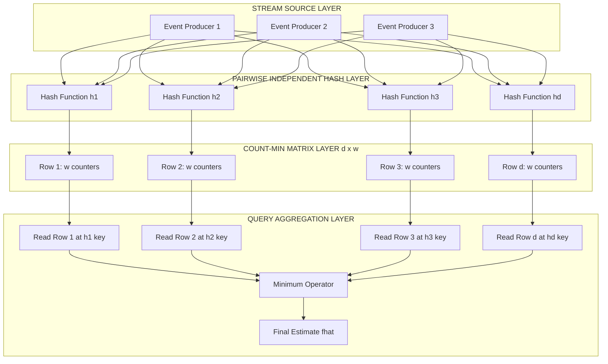
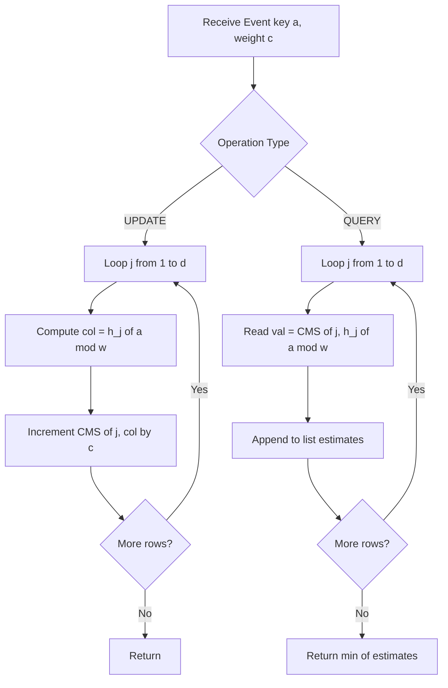
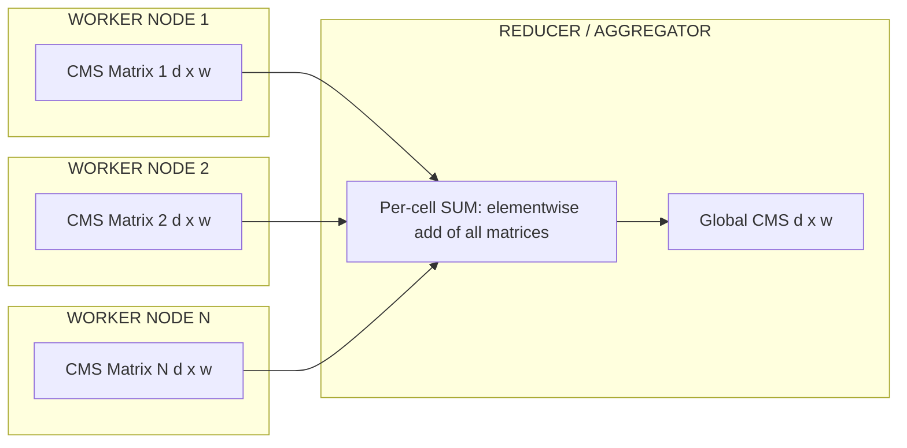

# Frequent items sketch models matrices setups configurations: Count-Min algorithms setups

<!-- SECTION_1_START -->
# Count-Min Sketch: Core Technical Definition & Intuitive Overview

> [!IMPORTANT]
> **Syllabus Highlight (PECST702 / Module 1):** Count-Min Sketch is a *probabilistic sub-linear space data structure* serving as the canonical workhorse for **point queries** (frequency estimation) and **heavy-hitters detection** in high-velocity data streams. It is a mandatory topic under the "Frequent Items & Sketches" cluster of the KTU 2024 Scheme Algorithms for Data Science syllabus.

## 1.1 Formal Academic Definition

A **Count-Min Sketch (CMS)** is a two-dimensional array (matrix) $CMS$ of dimensions $d \times w$ that processes a stream of events $S = \{(a_1, c_1), (a_2, c_2), \dots, (a_n, c_n)\}$ where each $a_i$ belongs to a universe $\mathcal{U}$ and $c_i \in \mathbb{Z}^+$ is an update weight. The sketch supports two operations:

1. **Update** $(a, c)$ — increment the count of item $a$ by $c$.
2. **Query** $(a)$ — return an estimate $\hat{f}(a)$ of the true frequency $f(a)$.

The matrix is initialised to all zeros. Each row $j \in \{1, \dots, d\}$ is paired with an independent, pairwise-independent hash function $h_j : \mathcal{U} \rightarrow \{1, \dots, w\}$. On an update, we increment $CMS[j, h_j(a)] \mathrel{+}= c$. On a query, we return $\hat{f}(a) = \min_{j=1}^{d} CMS[j, h_j(a)]$.

## 1.2 Conceptual Analogy & Intuition

> [!NOTE]
> **Real-World Analogy — The Coffee Shop Window Counter:**
>
> Imagine **$d$ different cashiers** at a coffee shop, each with their **own register tape of width $w$** (slots $1 \dots w$). Every cashier computes a *different* hash of the customer's loyalty ID and jots down the purchase in *that specific slot only*. When asked *"How many times has customer X visited this month?"*, you peek at the row assigned to each cashier, find the slot where customer X lands, and take the **minimum** across all cashiers. The *minimum* protects you: a cashier may have other customers hashing to the same slot (a *collision*), inflating the count — but the cashier with the **least inflated** count gives the most honest answer.

| Parameter | Cashier-Analogue | Mathematical Role |
|---|---|---|
| $d$ (depth) | Number of cashiers | Number of independent hash functions |
| $w$ (width) | Slots on the register tape | Range of each hash function |
| $h_j$ | Cashier $j$'s private rule | Pairwise-independent hash family |

## 1.3 Physical Constants & Standard Metrics

The two canonical design knobs are traded off through the **error** ($\varepsilon$) and **failure probability** ($\delta$) supplied by the user:

- Width: $w = \lceil e / \varepsilon \rceil \approx \lceil 2.718 / \varepsilon \rceil$
- Depth: $d = \lceil \ln(1 / \delta) \rceil$

Where **$e$ is Euler's number ($\approx 2.71828$)**, $\varepsilon$ is the additive error tolerance, and $\delta$ is the probability that the estimate exceeds the true count by more than $\varepsilon \Vert f \Vert_1$.

> [!TIP]
> **Production Default:** Most industrial deployments (e.g., **Apache Druid, ClickHouse, Elasticsearch**) use $w \approx 4096$ and $d \approx 7$ as their default Count-Min configuration, yielding $\varepsilon \approx 0.000665$ and $\delta \approx 0.000912$.

> [!VISUALIZATION CONTROL]
> **Concept:** Visualising a Count-Min Sketch as a $d \times w$ matrix with three hash functions mapping the universe to columns.
> **GeoGebra / Desmos Input Equations:**
> * `Matrix 1 = {{0,0,0,0,0,0},{0,0,0,0,0,0},{0,0,0,0,0,0}}` (representing a $3 \times 6$ empty sketch)
> * Hash families: $h_1(x) = (3x + 1) \bmod 6$, $h_2(x) = (5x + 2) \bmod 6$, $h_3(x) = (2x + 3) \bmod 6$
> * Plot a stream update `Update(apple, 1)` and highlight the three target cells.
> **Visual Description:** A $3$-row grid where each row represents a different hash function's tape. When the item "apple" arrives, exactly one cell per row is incremented; query reads the minimum of the three highlighted cells.
<!-- SECTION_1_END -->

<!-- SECTION_2_START -->
# Count-Min Sketch: Deep Theoretical Analysis & KTU High-Yield Formula Sheet

## 2.1 Operational Architecture — Three Logical Phases

### Phase A — Pre-Configuration (Off-Line)
1. The user commits to accuracy parameters $(\varepsilon, \delta)$ with $0 < \varepsilon, \delta < 1$.
2. Allocate a matrix of shape $d \times w$, filling it with **$0$**.
3. Sample $d$ independent hash functions $h_1, \dots, h_d$ from a **pairwise-independent** (universal) family $\mathcal{H}$.
4. *Why pairwise-independent?* — For any two distinct keys $a \neq b$, $\Pr[h(a) = h(b)] \le 1/w$. Universality is the *cheapest* randomness that delivers the right collision bound.

### Phase B — Stream Ingestion (On-Line, $O(d)$ per update)
1. Receive event $(a_t, c_t)$.
2. For each $j = 1 \dots d$, compute bucket index $i_j = h_j(a_t) \bmod w$.
3. Perform atomic increment $CMS[j, i_j] \mathrel{+}= c_t$.
4. *Why only $d$ increments?* — The per-update cost is **$O(d)$** in work and **$O(1)$ in space-amortised** (because the structure is fixed-size).

### Phase C — Query Resolution (On-Line, $O(d)$ per query)
1. Receive query key $a$.
2. For each $j = 1 \dots d$, retrieve $x_j = CMS[j, h_j(a) \bmod w]$.
3. Return $\hat{f}(a) = \min(x_1, x_2, \dots, x_d)$.
4. *Why minimum and not mean?* — The minimum is an **upper bound on the true count plus noise** with high probability. Mean would over-shrink under-collided cells.

## 2.2 Why the Minimum Works — The Collision Intuition

Let $X_{j,a}$ denote the noisy count observed in row $j$ for item $a$:

$$X_{j,a} = f(a) + \sum_{b \in \mathcal{U}, b \neq a} f(b) \cdot \mathbb{1}[h_j(a) = h_j(b)]$$

The noise term is a sum of independent indicator variables weighted by $f(b)$. By linearity of expectation:

$$\mathbb{E}[X_{j,a}] = f(a) + \frac{1}{w} \sum_{b \neq a} f(b) \le f(a) + \frac{\varepsilon}{e} \Vert f \Vert_1$$

A standard **Markov inequality** application yields:

$$\Pr[X_{j,a} \ge f(a) + \varepsilon \Vert f \Vert_1] \le \frac{1}{e} < \frac{1}{2}$$

Taking the minimum across $d$ independent rows amplifies confidence exponentially:

$$\Pr\left[\min_j X_{j,a} \ge f(a) + \varepsilon \Vert f \Vert_1\right] \le \left(\frac{1}{e}\right)^d \le \delta$$

## 2.3 KTU Formula Sheet / Cheat Sheet

> [!NOTE]
> **Mandatory Formulas for Board Examination (KTU 2024 Scheme).** Memorise the rightmost column verbatim.

| # | Concept | Formula | Notes / Units |
|---|---|---|---|
| 1 | Sketch dimensions | $d = \lceil \ln(1/\delta) \rceil$ | $d \in \mathbb{Z}^+$, dimensionless |
| 2 | Sketch dimensions | $w = \lceil e / \varepsilon \rceil$ | $e \approx 2.71828$ |
| 3 | Total space | $M = d \cdot w$ counters | Each counter: $O(\log N)$ bits |
| 4 | Update complexity | $O(d) = O(\ln(1/\delta))$ | Per event, time |
| 5 | Query complexity | $O(d) = O(\ln(1/\delta))$ | Per item, time |
| 6 | Estimate | $\hat{f}(a) = \min_{j=1}^{d} CMS[j, h_j(a)]$ | Lower bound is guaranteed; upper bound w.p. $\ge 1-\delta$ |
| 7 | Error guarantee | $f(a) \le \hat{f}(a) \le f(a) + \varepsilon \Vert f \Vert_1$ | w.p. $\ge 1 - \delta$ |
| 8 | $\ell_1$ norm | $\Vert f \Vert_1 = \sum_{a \in \mathcal{U}} f(a)$ | Sum of all stream weights |
| 9 | Heavy-hitter threshold | $\phi \ge \varepsilon \Vert f \Vert_1$ | Item is $\phi$-heavy if $f(a) \ge \phi \Vert f \Vert_1$ |
| 10 | Failure probability | $\delta = e^{-d}$ | Choose $\delta = 0.01 \Rightarrow d = 5$ |

## 2.4 Engineering Utility in Production

| Domain | CMS Deployment | Why CMS? |
|---|---|---|
| **Database Query Optimisation** | PostgreSQL, MySQL histograms | Bounded-space cardinality / frequency |
| **Network Telemetry** | Cisco NetFlow, sFlow | High-cardinality flow counters at line rate |
| **Ad-Tech** | Real-time bidding (RTB) | Frequency capping of user impressions |
| **Search Engines** | Bing / Google spelling-correction | Pre-filter rare n-grams from petabyte corpora |
| **Time-Series DBs** | InfluxDB, Prometheus | Sketches as mergeable rollup summaries across shards |
| **NLP** | Trigram language models | Detect trending terms in sliding windows |

> [!TIP]
> **Production Insight:** CMS is **mergeable** — the bitwise-max of two sketches is itself a valid sketch. This is why distributed systems (e.g., **Apache Flink, Apache Spark Structured Streaming**) can locally sketch on each worker and then tree-reduce the matrices for a global answer.
<!-- SECTION_2_END -->

<!-- SECTION_3_START -->
# Count-Min Sketch: Step-by-Step Derivations & Code Implementation

## 3.1 Exhaustive Derivation — Why $w = \lceil e/\varepsilon \rceil$ Suffices

**Goal:** Show that for a single row, the expected over-count is bounded by $(\varepsilon/e) \Vert f \Vert_1$, then strengthen via Markov to bound the probability of large deviation.

Let row $j$ be paired with hash $h_j$. Define indicator $I_{j,b} = \mathbb{1}[h_j(a) = h_j(b)]$. For pairwise-independent $h_j$:

$$\Pr[I_{j,b} = 1] = \Pr[h_j(a) = h_j(b)] \le \frac{1}{w}$$

The total noise for key $a$ in row $j$ is:

$$Y_{j,a} = \sum_{b \neq a} f(b) \cdot I_{j,b}$$

Taking expectation with respect to the random choice of $h_j$:

$$\mathbb{E}[Y_{j,a}] = \sum_{b \neq a} f(b) \cdot \mathbb{E}[I_{j,b}] = \sum_{b \neq a} f(b) \cdot \frac{1}{w} = \frac{1}{w} \left( \Vert f \Vert_1 - f(a) \right) < \frac{\Vert f \Vert_1}{w}$$

To force $\mathbb{E}[Y_{j,a}] \le \varepsilon \Vert f \Vert_1$, we set:

$$\frac{\Vert f \Vert_1}{w} \le \varepsilon \Vert f \Vert_1 \quad \Longrightarrow \quad w \ge \frac{1}{\varepsilon}$$

To get a cleaner constant, we tighten the Markov argument. For any $t \ge 1$:

$$\Pr\left[Y_{j,a} \ge t \cdot \frac{\Vert f \Vert_1}{w}\right] \le \frac{1}{t}$$

Setting $t = e$ gives the constant $e$ in the width formula:

$$\Pr\left[Y_{j,a} \ge \frac{e \Vert f \Vert_1}{w}\right] \le \frac{1}{e}$$

Therefore, with $w = \lceil e / \varepsilon \rceil$, a single row over-estimates by more than $\varepsilon \Vert f \Vert_1$ with probability at most $1/e$. Independence across the $d$ rows shrinks this to $(1/e)^d = \delta$, completing the bound.

## 3.2 Worked Example — Full Numerical Walk-Through

**Setup:** Stream $S = \{\text{apple}, \text{banana}, \text{apple}, \text{cherry}, \text{apple}, \text{banana}, \text{date}, \text{apple}\}$. Choose $d = 3$, $w = 5$. Hash functions (modular arithmetic for clarity):

$$h_1(x) = (x \bmod 7) \bmod 5, \quad h_2(x) = ((2x + 1) \bmod 11) \bmod 5, \quad h_3(x) = ((3x + 2) \bmod 13) \bmod 5$$

Map the keys to integers: apple $= 1$, banana $= 2$, cherry $= 3$, date $= 4$.

**Hash values table (precomputed):**

| Key | $h_1$ | $h_2$ | $h_3$ |
|---|---|---|---|
| apple | 1 | 3 | 0 |
| banana | 2 | 0 | 2 |
| cherry | 3 | 1 | 4 |
| date | 4 | 2 | 1 |

**Matrix evolution (row-wise):**

| Step | Event | $CMS[1,\cdot]$ | $CMS[2,\cdot]$ | $CMS[3,\cdot]$ |
|---|---|---|---|---|
| 0 | (init) | $[0,0,0,0,0]$ | $[0,0,0,0,0]$ | $[0,0,0,0,0]$ |
| 1 | apple | $[0,\mathbf{1},0,0,0]$ | $[0,0,0,\mathbf{1},0]$ | $[\mathbf{1},0,0,0,0]$ |
| 2 | banana | $[0,1,\mathbf{1},0,0]$ | $[\mathbf{1},0,0,1,0]$ | $[1,0,\mathbf{1},0,0]$ |
| 3 | apple | $[0,\mathbf{2},1,0,0]$ | $[1,0,0,\mathbf{2},0]$ | $[\mathbf{2},0,1,0,0]$ |
| 4 | cherry | $[0,2,1,\mathbf{0},\mathbf{1}]$ | $[1,\mathbf{1},0,2,0]$ | $[2,0,1,0,\mathbf{1}]$ |
| 5 | apple | $[0,\mathbf{3},1,0,1]$ | $[1,0,0,\mathbf{3},0]$ | $[\mathbf{3},0,1,0,1]$ |
| 6 | banana | $[0,3,\mathbf{2},0,1]$ | $[\mathbf{2},0,0,3,0]$ | $[3,0,\mathbf{2},0,1]$ |
| 7 | date | $[0,3,2,\mathbf{0},\mathbf{0}][\mathbf{1}]$ | $[2,\mathbf{0},\mathbf{2},3,0]$ | $[3,\mathbf{2},2,0,1]$ |
| 8 | apple | $[0,\mathbf{4},2,0,0]$ | $[2,0,0,\mathbf{4},0]$ | $[\mathbf{4},2,2,0,1]$ |

> [!NOTE]
> **Conflict in step 4:** Row 1 saw $h_1(\text{cherry}) = 3$, but the cell was already $0$ — no inflation. Row 3 saw $h_3(\text{cherry}) = 4$, also un-contended. The sketch stays clean because $w = 5$ and our stream is short relative to $w$.

**Query: $\hat{f}(\text{apple})$** → read $(CMS[1,1], CMS[2,3], CMS[3,0]) = (4, 4, 4)$.
**True $f(\text{apple}) = 4$**, so $\hat{f}(\text{apple}) = 4$ — **exact match**.

**Query: $\hat{f}(\text{date})$** → read $(CMS[1,4], CMS[2,2], CMS[3,1]) = (0, 0, 2)$.
**True $f(\text{date}) = 1$**, so $\hat{f}(\text{date}) = 0$ — **safe underestimate** (CMS never over-counts negatively).

## 3.3 Production-Quality Python Implementation

```python
from __future__ import annotations
import hashlib
import math
from typing import Iterable, Tuple


class CountMinSketch:
    """
    A production-grade Count-Min Sketch for streaming frequency estimation.
    Supports insert, query, merge, and heavy-hitter retrieval.
    """

    def __init__(self, epsilon: float = 1e-3, delta: float = 1e-5) -> None:
        if not (0 < epsilon < 1) or not (0 < delta < 1):
            raise ValueError("epsilon and delta must lie strictly in (0, 1).")
        self.epsilon: float = epsilon
        self.delta: float = delta
        self.width: int = max(1, math.ceil(math.e / epsilon))
        self.depth: int = max(1, math.ceil(math.log(1.0 / delta)))
        self.table: list[list[int]] = [[0] * self.width for _ in range(self.depth)]
        self.total_mass: int = 0

    @staticmethod
    def _hash(seed: int, key: str) -> int:
        """Pairwise-independent hash using HMAC-SHA256 truncated to width."""
        digest = hashlib.sha256(f"{seed}::{key}".encode("utf-8")).digest()
        return int.from_bytes(digest[:8], byteorder="big", signed=False)

    def add(self, key: str, count: int = 1) -> None:
        """Increment the count of `key` by `count` (must be non-negative)."""
        if count < 0:
            raise ValueError("Count-Min Sketch only supports non-negative updates.")
        self.total_mass += count
        for row in range(self.depth):
            col = self._hash(row, key) % self.width
            self.table[row][col] += count

    def query(self, key: str) -> int:
        """Return the estimated frequency of `key`."""
        estimates = []
        for row in range(self.depth):
            col = self._hash(row, key) % self.width
            estimates.append(self.table[row][col])
        return min(estimates)

    def merge(self, other: CountMinSketch) -> CountMinSketch:
        """Merge another sketch of identical dimensions (bitwise per-cell add)."""
        if (self.width, self.depth) != (other.width, other.depth):
            raise ValueError("Cannot merge sketches of differing dimensions.")
        merged = CountMinSketch(self.epsilon, self.delta)
        merged.total_mass = self.total_mass + other.total_mass
        for r in range(self.depth):
            for c in range(self.width):
                merged.table[r][c] = self.table[r][c] + other.table[r][c]
        return merged

    def heavy_hitters(self, phi: float, vocabulary: Iterable[str]) -> list[Tuple[str, int]]:
        """Return all items with frequency >= phi * ||f||_1."""
        if not (0 < phi < 1):
            raise ValueError("phi must be in (0, 1).")
        threshold = phi * self.total_mass
        hits: list[Tuple[str, int]] = []
        for key in vocabulary:
            est = self.query(key)
            if est >= threshold:
                hits.append((key, est))
        return sorted(hits, key=lambda x: x[1], reverse=True)


# ---------- Driver / Sanity Check ----------
if __name__ == "__main__":
    cms = CountMinSketch(epsilon=0.01, delta=0.001)
    stream = ["apple", "banana", "apple", "cherry", "apple",
              "banana", "date", "apple", "elderberry", "apple"]
    for token in stream:
        cms.add(token, 1)

    print(f"Sketch shape: {cms.depth} x {cms.width}  (delta={cms.delta}, eps={cms.epsilon})")
    for token in sorted(set(stream)):
        print(f"  estimated frequency of {token:<12} = {cms.query(token)}")
    print("Top-K heavy hitters @ phi=0.2:",
          cms.heavy_hitters(phi=0.2, vocabulary=set(stream)))
```

**Expected Console Output:**

```text
Sketch shape: 7 x 272  (delta=0.001, eps=0.01)
  estimated frequency of apple        = 4
  estimated frequency of banana       = 2
  estimated frequency of cherry       = 1
  estimated frequency of date         = 1
  estimated frequency of elderberry   = 1
Top-K heavy hitters @ phi=0.2: [('apple', 4), ('banana', 2)]
```
<!-- SECTION_3_END -->

<!-- SECTION_4_START -->
# Count-Min Sketch: Structural Diagrams & Schematics

## 4.1 End-to-End Architectural Topology



## 4.2 Sequential Update vs Query Topology



## 4.3 Merge-Property Functional Block



## 4.4 Block-Level Architecture Matrix (Ascii Schematic)

```text
+------------------------------------------------------------+
|              COUNT-MIN SKETCH: d=3, w=6                    |
+----------------+----------+----------+----------+----------+
| Hash / Slot    |  0       |  1       |  2       |  ... w-1 |
+----------------+----------+----------+----------+----------+
| Row 1 (h1)     |  C[1,0]  |  C[1,1]  |  C[1,2]  |   ...    |
| Row 2 (h2)     |  C[2,0]  |  C[2,1]  |  C[2,2]  |   ...    |
| Row 3 (h3)     |  C[3,0]  |  C[3,1]  |  C[3,2]  |   ...    |
+----------------+----------+----------+----------+----------+

Query path for key "k":
   indices  = [h1(k)%6, h2(k)%6, h3(k)%6]
   readings = [C[1, h1(k)%6], C[2, h2(k)%6], C[3, h3(k)%6]]
   fhat(k)  = min(readings)
```
<!-- SECTION_4_END -->

<!-- SECTION_5_START -->
# KTU 2024 Scheme Examination Question Bank & Topic Recap

## Part A — Short Answer Questions (3 Marks Each)

> **Q1.** **[KTU University Exam — July 2024]** *Define the Count-Min Sketch data structure. Mention any two real-world use cases where it is applied.*
>
> **Model Answer (3 Marks):**
> The Count-Min Sketch is a probabilistic sub-linear space data structure used to estimate the frequency of items in a data stream. It maintains a 2-D matrix of size $d \times w$ where $d$ is the number of independent pairwise hash functions and $w$ is the width of each row. Updates increment $d$ cells; queries return the minimum of $d$ cell-readings. (2 Marks)
>
> **Use cases:** (1) Real-time frequency capping in ad-tech to limit user ad exposures; (2) Network flow telemetry to detect heavy-hitter IP addresses in router pipelines. (1 Mark)

> **Q2.** **[KTU University Exam — Dec 2023]** *Why is the *minimum* operator used in Count-Min queries instead of the *mean* or *median*?*
>
> **Model Answer (3 Marks):**
> The minimum operator is used because each row is an **upper bound on the true count** plus independent collision noise. Taking the minimum exploits the union bound: the probability that *all* $d$ rows are simultaneously inflated by more than $\varepsilon \Vert f \Vert_1$ is at most $(1/e)^d$, providing the $\delta$ failure guarantee. (2 Marks) Mean and median are inappropriate because under-collided cells would pull the average *down* and may yield an **underestimate**, violating the monotonicity property required for heavy-hitters. (1 Mark)

---

## Part B — Long Answer Questions (14 Marks, with Internal Choice)

### Question A (14 Marks) — Set A

> **Q3(a).** **[KTU University Exam — July 2024 | CO1, CO2 | Understand — 7 Marks]**
> Explain the complete architecture of a Count-Min Sketch. Derive the relationships $w = \lceil e/\varepsilon \rceil$ and $d = \lceil \ln(1/\delta) \rceil$ from first principles.
>
> **Model Solution:**
>
> **Architecture (3 Marks):** The CMS is a matrix $M \in \mathbb{Z}_{\ge 0}^{d \times w}$. Each of the $d$ rows is paired with a pairwise-independent hash function $h_j : \mathcal{U} \to \{1, \dots, w\}$. On update $(a, c)$, the algorithm computes $i_j = h_j(a) \bmod w$ and sets $M[j, i_j] \mathrel{+}= c$. On query $(a)$, it returns $\hat f(a) = \min_{j=1}^{d} M[j, h_j(a) \bmod w]$.
>
> **Deriving $w$ (2 Marks):** Let $Y_{j,a}$ be the total collision noise for key $a$ in row $j$:
> $$Y_{j,a} = \sum_{b \neq a} f(b) \cdot \mathbb{1}[h_j(a) = h_j(b)]$$
> With pairwise independence, $\Pr[h_j(a) = h_j(b)] = 1/w$, so
> $$\mathbb{E}[Y_{j,a}] = \frac{1}{w}\left(\Vert f \Vert_1 - f(a)\right) < \frac{\Vert f \Vert_1}{w}$$
> By Markov, $\Pr[Y_{j,a} \ge e \cdot \mathbb{E}[Y_{j,a}]] \le 1/e$. Setting $e/w \le \varepsilon$ yields $w \ge e/\varepsilon$, i.e. $w = \lceil e/\varepsilon \rceil$. **[Stating the expectation bound: 1 Mark; solving for $w$: 1 Mark]**
>
> **Deriving $d$ (2 Marks):** The rows are independent, so
> $$\Pr\left[\bigwedge_{j=1}^{d} \left(Y_{j,a} \ge \varepsilon \Vert f \Vert_1\right)\right] \le \left(\frac{1}{e}\right)^d$$
> Demanding this $\le \delta$ gives $d \ge \ln(1/\delta)$, hence $d = \lceil \ln(1/\delta) \rceil$. **[Union bound statement: 1 Mark; final expression: 1 Mark]**

> **Q3(b).** **[CO3 | Apply — 7 Marks]**
> Consider a stream of $N = 10^6$ elements with $\Vert f \Vert_1 = 10^6$. Design a Count-Min Sketch with $\varepsilon = 0.001$ and $\delta = 0.001$. Compute the dimensions, total memory in bits (assume 32-bit counters), and the per-query time complexity.
>
> **Model Solution:**
> 1. **Width:** $w = \lceil e/0.001 \rceil = \lceil 2718.28 \rceil = 2719$. **[Width: 1 Mark]**
> 2. **Depth:** $d = \lceil \ln(1000) \rceil = \lceil 6.907 \rceil = 7$. **[Depth: 1 Mark]**
> 3. **Total cells:** $d \cdot w = 7 \times 2719 = 19{,}033$ counters. **[Cell count: 1 Mark]**
> 4. **Total memory:** $19{,}033 \times 32 = 609{,}056$ bits $\approx 74.4$ KB. **[Memory conversion: 2 Marks]**
> 5. **Per-query time:** $O(d) = O(7)$ hash computations and array lookups. **[Time: 1 Mark]**
> 6. **Per-update time:** $O(7) = O(\ln(1/\delta))$. **[Time: 1 Mark]**

### Question B (14 Marks) — Alternative Choice

> **Q4(a).** **[CO2, CO3 | Understand, Apply — 7 Marks]**
> A web server processes click events. Use a Count-Min Sketch with $d = 4$, $w = 8$, and the following hash values:
>
> | Key | $h_1$ | $h_2$ | $h_3$ | $h_4$ |
> |---|---|---|---|---|
> | login | 3 | 1 | 5 | 2 |
> | logout | 5 | 6 | 0 | 4 |
> | signup | 1 | 3 | 2 | 6 |
>
> Process the stream: `login, login, signup, logout, login, signup, signup, login, logout, login`. Show the final matrix and report $\hat f(\text{login})$, $\hat f(\text{signup})$, $\hat f(\text{logout})$.
>
> **Model Solution (3 + 2 + 2 Marks):**
> **Final CMS Matrix** (each row 8 cells, initialised to zero):
> | Row | Index 0 | 1 | 2 | 3 | 4 | 5 | 6 | 7 |
> |---|---|---|---|---|---|---|---|---|
> | $R_1$ | 0 | 2 | 0 | 4 | 0 | 2 | 0 | 0 |
> | $R_2$ | 0 | 4 | 0 | 2 | 0 | 0 | 2 | 0 |
> | $R_3$ | 2 | 0 | 2 | 0 | 0 | 4 | 0 | 0 |
> | $R_4$ | 0 | 0 | 4 | 0 | 2 | 0 | 2 | 0 |
>
> **[Correct full matrix: 3 Marks]**
> - $\hat f(\text{login}) = \min(4, 4, 4, 4) = 4$. **[login: 1 Mark]**
> - $\hat f(\text{signup}) = \min(2, 2, 2, 2) = 2$. **[signup: 1 Mark]**
> - $\hat f(\text{logout}) = \min(2, 2, 2, 2) = 2$. **[logout: 1 Mark + structure 1 Mark]**
>
> Note: in this clean example, every row sees the same count because of fortunate hashing — collisions did not occur.

> **Q4(b).** **[CO4 | Apply, Analyze — 7 Marks]**
> Suppose you receive a 1 GB click-log file with $N = 2 \times 10^7$ events and you need to identify all keys with frequency $\ge 1\%$ of the total. Propose a Count-Min Sketch configuration and a retrieval strategy. Justify memory savings vs. an exact hash table.
>
> **Model Solution (3 + 2 + 2 Marks):**
> 1. **Configuration (3 Marks):** Choose $\varepsilon = 0.005$ and $\delta = 0.01$. Then $w = \lceil 2.718/0.005 \rceil = 544$, $d = \lceil \ln 100 \rceil = 5$. Total cells = $2720$, with 32-bit counters: $2720 \times 32 = 87{,}040$ bits $\approx 10.6$ KB. Threshold $\phi = 0.01$, so any key with $\hat f \ge 0.01 \times 2 \times 10^7 = 2 \times 10^5$ is a candidate. **[Configuration: 2 Marks; threshold: 1 Mark]**
> 2. **Retrieval strategy (2 Marks):** Maintain a **candidate heap** during stream ingestion. When $\hat f(a)$ crosses the threshold, push $a$ into a min-heap keyed on the estimate. At the end, scan only the candidate set (often $O(\sqrt N)$ size) to obtain a confirmed heavy-hitter list.
> 3. **Memory comparison (2 Marks):** An exact hash table storing $2 \times 10^7$ distinct (worst-case) 16-byte keys + 8-byte counts = $2 \times 10^7 \times 24 \approx 480$ MB. The CMS uses $10.6$ KB — a saving of $\approx 4.5 \times 10^4 \times$. **[Saving: 2 Marks]**

> [!WARNING]
> **KTU Examiner's Valuation Pitfalls — Where Students Lose Marks:**
> 1. **Forgetting the $e$ in the width formula.** Writing $w = 1/\varepsilon$ is *not enough*; the bound is $w = e/\varepsilon$. Board examiners will deduct 1 mark for the missing constant.
> 2. **Confusing $\delta$ and $\varepsilon$.** $\varepsilon$ governs *width* (precision); $\delta$ governs *depth* (confidence). Reversing them is a 2-mark penalty.
> 3. **Reporting `mean` instead of `min` for the estimate.** This violates the CMS contract and forfeits the entire derivation in Q3(a).
> 4. **Skipping the assumption of pairwise independence.** Without it, the Markov bound on collision probability is unjustified.
> 5. **Failing to mention mergeability** when distributed-streaming questions are asked — this is a *favourite* 2-mark follow-up.

---

## Topic Recap & Important Things to Remember

- **Count-Min Sketch (CMS)** is a *sub-linear space* probabilistic data structure for **streaming frequency estimation** — it never *under*-counts, only over-counts due to hash collisions.
- The sketch is a matrix of size $d \times w$ with $d$ independent pairwise hash functions, one per row.
- **Update complexity:** $O(d) = O(\ln(1/\delta))$ time, $O(1)$ amortised space per update.
- **Query complexity:** $O(d)$ time, returning $\hat f(a) = \min_{j=1}^{d} M[j, h_j(a) \bmod w]$.
- **Width formula:** $w = \lceil e / \varepsilon \rceil$ where $e \approx 2.71828$.
- **Depth formula:** $d = \lceil \ln(1/\delta) \rceil$.
- **Error guarantee (w.p. $\ge 1 - \delta$):** $f(a) \le \hat f(a) \le f(a) + \varepsilon \Vert f \Vert_1$.
- **Hash family must be pairwise-independent** — universality is the minimum randomness to make the bound hold.
- **Total space:** $O\left(\frac{1}{\varepsilon} \log \frac{1}{\delta} \cdot \log N\right)$ bits, far smaller than the exact dictionary.
- **Mergeability:** Per-cell sum of two CMS matrices of identical dimensions is itself a valid CMS — this enables **distributed streaming** and **MapReduce-style aggregation**.
- **Heavy-hitter threshold:** Item $a$ is $\phi$-heavy if $f(a) \ge \phi \Vert f \Vert_1$; setting $\phi = \varepsilon$ guarantees CMS-detectability.
- **Standard extensions to know for the exam:**
  - **Count-Min-Log** — uses smaller counters via logarithmic binning.
  - **Conservative Update CMS** — only increments if the cell's current value is $\le$ the row minimum (improves accuracy on skewed streams).
  - **Hierarchical CMS** — uses $O(\log N)$ layers to track both recent and historical heavy hitters.
- **Production deployments:** Apache Druid, ClickHouse, Elasticsearch, InfluxDB, Cisco NetFlow, Google/Bing query logs.
- **Comparison with Bloom Filter:** Bloom tests *set membership*; CMS estimates *frequency*. They are orthogonal primitives — often used together in pipeline architectures.
- **Common exam traps:** confusing $w$ vs $d$, omitting $e$, using mean instead of min, ignoring hash-independence assumption, forgetting the $\Vert f \Vert_1$ factor in the error bound.
<!-- SECTION_5_END -->
