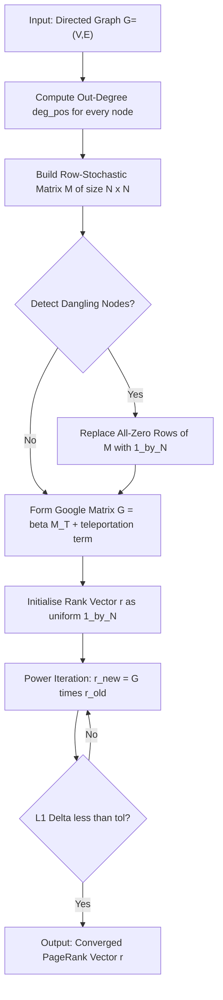
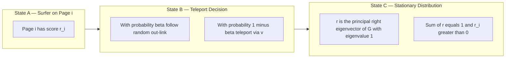
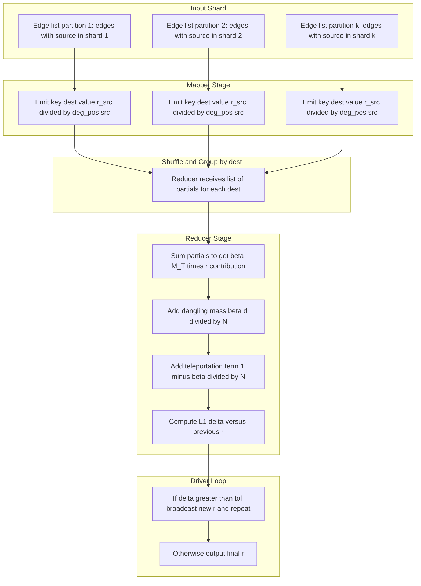
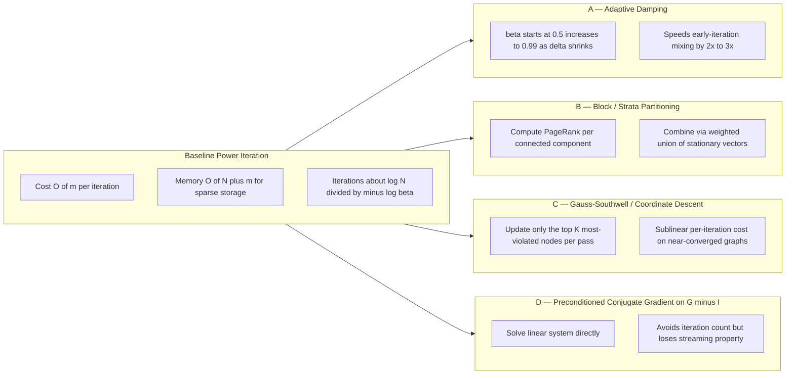

# Link analysis algorithms metrics computation matrices configurations profiles: PageRank algorithms optimization

<!-- SECTION_1_START -->
# Link Analysis Algorithms: PageRank — Core Technical Definition & Intuitive Overview

## 1.1 Formal KTU 2024 Syllabus Definition

**PageRank** is a link analysis algorithm originally developed by **Larry Page** and **Sergey Brin** (founders of Google) that assigns a numerical weighting to every vertex (web page / node) in a hyperlinked directed graph (such as the World Wide Web), with the purpose of measuring its **relative importance** within the set. Formally, it is a stationary distribution of a **random walk** on the web graph, biased by a teleportation (damping) mechanism that guarantees convergence and ergodicity.

In KTU 2024 Scheme terminology (Algorithms for Data Science — PECST702, Module 2 — *Large Scale Graph Mining*), PageRank is studied as a foundational **spectral / eigenvector-based graph mining primitive** that exploits the *link structure* of a graph (not its textual content) to derive a global importance score for every node.

> [!IMPORTANT]
> **KTU 2024 Module 2 High-Yield Concept**
> PageRank is the canonical example of an algorithm that converts *local* topological information (in-degree, out-degree, link weights) into a *global* ranking. In the Board exam, you must justify *both* the random-surfer model **and** the matrix-eigenvector interpretation, as KTU valuation allot at least 2 marks for stating the conceptual model.

## 1.2 Intuitive Analogy — The "Voting Scholar" Model

Imagine a scholarly conference where:

- Every academic (a **web page**) is also a voter.
- A scholar *casts* all of their personal reputation **equally divided** among the papers they cite (their **outgoing links**).
- A paper's prestige is the **sum of the fractional votes** it receives from every scholar that cites it.
- However, a cynical, easily-bored "random surfer" occasionally (with probability $(1 - \beta)$) **abandons the citation chain** and jumps to a completely random paper — this is the *teleportation* or *damping* step.

A page is "important" if **important pages link to it**. This is a self-referential definition — exactly the kind of problem solved by the principal **eigenvector** of a stochastic transition matrix.

> [!NOTE]
> **Geometric Intuition**
> If you imagine importance as a fluid that flows backwards along the link direction, every page *receives* fluid from all pages that link to it, and *drains* its fluid equally to all its out-neighbours. In steady state, the fluid level at each page is its PageRank.

## 1.3 GeoGebra / Desmos Visualization

> [!VISUALIZATION CONTROL]
> **Concept:** Power-iteration convergence of PageRank on a 3-node web graph
> **GeoGebra / Desmos Input Equations (web graph as adjacency list):**
> * $A=\{(1\to 2),(2\to 1, 3),(3\to 1)\}$  →  web graph
> * $x_{n+1}=\beta\,M^{T}x_n+\dfrac{(1-\beta)}{N}\mathbf{1}$   (PageRank update rule)
> * $N=3,\quad \beta=0.85,\quad M=\begin{bmatrix}0&1/2&1\\ 1&0&0\\ 0&1/2&0\end{bmatrix}$
> * Plot the sequence $x^{(k)}=\bigl(x_1^{(k)},x_2^{(k)},x_3^{(k)}\bigr)$ as a 3-D trajectory until $\Vert x^{(k+1)}-x^{(k)}\Vert_1 < 10^{-6}$.
>
> **Visual Description:** You should see the trajectory spiral in $\mathbb{R}^3$ and settle onto a single point (the stationary distribution). That point is the PageRank vector. For this toy graph, the converged vector is approximately $\pi \approx (0.3878,\ 0.3415,\ 0.2707)^{T}$.

## 1.4 Standard Metrics & Physical Constants Used

| Symbol | Meaning | Standard Value (KTU convention) |
|---|---|---|
| $\beta$ | Damping factor | **0.85** (Google default) |
| $1-\beta$ | Teleportation probability | **0.15** |
| $N$ | Total number of nodes in the graph | varies |
| $\mathbf{r}$ | PageRank vector (column) | $\mathbf{r}\in\mathbb{R}^{N}$, $\sum_i r_i = 1$ |
| $M$ | Google / stochastic matrix | row-stochastic, $\sum_j M_{ij}=1$ |
| $\mathbf{1}$ | All-ones column vector of size $N$ | $\mathbf{1}\in\mathbb{R}^{N}$ |
| $\varepsilon$ | Convergence tolerance | $10^{-6}$ to $10^{-8}$ |
| $\alpha$ | Personalization / topic-sensitivity weight | $0.10$–$0.20$ |
| $\mathbf{v}$ | Personalization vector | $\sum_i v_i = 1$, $v_i \ge 0$ |

<!-- SECTION_1_END -->

<!-- SECTION_2_START -->
# Deep Theoretical Analysis & KTU High-Yield Formula Sheet

## 2.1 Operational Pipeline of PageRank

The algorithm operates in five logical stages. Every stage is examinable in the KTU board paper.

1. **Graph construction** — read the directed graph $G=(V,E)$ with $|V|=N$ and $|E|=m$.
2. **Stochastic matrix construction** — convert the raw adjacency matrix $A$ into a *row-stochastic* matrix $M$ by dividing each row $i$ by its out-degree $\deg^{+}(i)$.
3. **Dangling-node correction** — replace the all-zero rows of $M$ (nodes with no out-links) with the vector $\mathbf{1}/N$ to obtain $M'$.
4. **Google matrix formation** — apply teleportation:
   $$G = \beta M' + (1-\beta)\,\dfrac{\mathbf{1}\mathbf{1}^{T}}{N}$$
5. **Power iteration** — compute $\mathbf{r}^{(k+1)} = G\,\mathbf{r}^{(k)}$ until $\Vert \mathbf{r}^{(k+1)}-\mathbf{r}^{(k)}\Vert_1 < \varepsilon$.

## 2.2 The Master Equation (Single-Line Master Formula)

The PageRank of node $i$ is:

$$
r_i = \beta \sum_{j \,\to\, i} \dfrac{r_j}{\deg^{+}(j)} \;+\; (1-\beta)\,\dfrac{1}{N}
$$

The vectorized form is:

$$
\mathbf{r} = \beta M^{T}\mathbf{r} + (1-\beta)\,\dfrac{\mathbf{1}}{N}
$$

Equivalently, the **Google matrix** $G$ is the matrix whose principal right eigenvector (with eigenvalue $1$) gives the PageRank vector:

$$
G = \beta M^{T} + (1-\beta)\,\dfrac{\mathbf{1}\mathbf{1}^{T}}{N}, \qquad G\,\mathbf{r} = \mathbf{r}
$$

## 2.3 KTU High-Yield Formula Sheet

| # | Formula | Meaning | Used For |
|---|---|---|---|
| 1 | $\mathbf{r} = \beta M^{T}\mathbf{r} + \dfrac{(1-\beta)}{N}\mathbf{1}$ | Master PageRank equation | Defining / deriving PageRank |
| 2 | $G = \beta M^{T} + \dfrac{(1-\beta)}{N}\mathbf{1}\mathbf{1}^{T}$ | Google matrix | Eigenvalue formulation |
| 3 | $\mathbf{r}^{(k+1)} = G\,\mathbf{r}^{(k)}$ | Power iteration | Implementation |
| 4 | $r_i^{(k+1)} = \beta \sum_{j \to i} \dfrac{r_j^{(k)}}{\deg^+(j)} + \dfrac{(1-\beta)}{N}$ | Per-node update | Hand calculation |
| 5 | $r_{\text{Total}} = \sum_{i=1}^{N} r_i = 1$ | Probability normalization | Verification step |
| 6 | $\pi = \mathbf{v}^{T}P$ | Personalization extension | Topic-Sensitive PageRank |
| 7 | $\text{Hub}(p) = \sum_{q \,\to\, p} \text{Auth}(q)$ | HITS — hub score | Hub-Authority algorithm |
| 8 | $\text{Auth}(p) = \sum_{p \,\to\, q} \text{Hub}(q)$ | HITS — authority score | Hub-Authority algorithm |
| 9 | $\text{PR}_{\text{opt}} \approx \dfrac{1}{N}\sum_{k=0}^{\infty}\beta^{k}\,\mathbf{c}_{k}$ | Closed-form via Markov chain | Convergence proof |
| 10 | $\text{Iter}_{\text{conv}} \;\leq\; \dfrac{\log(N/\varepsilon)}{-\log \beta}$ | Iteration bound | Complexity analysis |

> [!IMPORTANT]
> In markdown tables, the absolute value / normalisation symbol is rendered as `\vert` or `\mid` to avoid breaking the pipe-separated column syntax. The same applies to row-norm conditions like $\Vert \mathbf{r}^{(k+1)}-\mathbf{r}^{(k)}\Vert_1 < \varepsilon$.

## 2.4 Why PageRank Works — The "Why & How"

- **Why damping?** A purely *incoming-link* sum has two pathologies: (i) *dead ends* (pages with no out-links) leak probability mass, breaking stochasticity; and (ii) *spider traps* (loops that swallow the random walk) cause rank to accumulate on a sub-cluster. The teleport term injects probability mass from the uniform vector $\mathbf{1}/N$ at every step, making the chain **primitive** and **aperiodic** with spectral radius $1$.
- **How does it converge?** By the **Perron–Frobenius theorem**, a stochastic, irreducible, aperiodic matrix has a unique stationary distribution. Power iteration converges **geometrically** with rate $\beta$, so $k \approx \log(N/\varepsilon)/(-\log\beta) \approx 50\text{–}100$ iterations are enough for $N \sim 10^{9}$.

## 2.5 Real-World Engineering Utility

| Domain | Application |
|---|---|
| Web search (Google) | Original ranking signal (now blended with Hummingbird, BERT, etc.) |
| Social network analytics (Twitter, LinkedIn) | Influencer detection |
| Recommendation systems (Amazon, Netflix) | Item-importance scoring via co-view graphs |
| Bioinformatics | Protein–protein interaction network centrality |
| Citation analysis | Research-paper impact metrics |
| Fraud detection | Anomalous node ranking in transaction graphs |
| Distributed computing (Pregel / Spark GraphX) | Test-bed for sparse linear algebra at petabyte scale |

<!-- SECTION_2_END -->

<!-- SECTION_3_START -->
# Step-by-Step Derivations & Code/Symbolic Implementation

## 3.1 Worked Derivation: Power-Iteration on a 4-Node Web Graph

### Problem
Compute PageRank on the directed graph $G=(V,E)$ where
$V = \{1, 2, 3, 4\}$ and
$E = \{(1\to 2),(1\to 3),(2\to 3),(3\to 1),(3\to 4),(4\to 1)\}$.
Use $\beta = 0.85$, $N=4$, $\varepsilon=10^{-4}$.

### Step 1 — Build the raw adjacency matrix $A$

For each ordered pair $(i\to j)$, set $A_{j,i}=1$. Reading the edge list:

$$
A = \begin{bmatrix}
0 & 0 & 1 & 1 \\
1 & 0 & 0 & 0 \\
1 & 1 & 0 & 0 \\
0 & 0 & 1 & 0
\end{bmatrix}
$$

### Step 2 — Compute out-degrees and build the row-stochastic matrix $M$

$\deg^{+}(1)=2,\ \deg^{+}(2)=1,\ \deg^{+}(3)=2,\ \deg^{+}(4)=1$.

Row-normalise $A$:

$$
M = \begin{bmatrix}
0      & 0      & 1/2    & 1/2    \\
1      & 0      & 0      & 0      \\
1      & 1      & 0      & 0      \\
0      & 0      & 1      & 0
\end{bmatrix}
$$

Check: row sums equal $1$. ✓

### Step 3 — Form the Google matrix

$$
G = \beta M^{T} + (1-\beta)\,\dfrac{\mathbf{1}\mathbf{1}^{T}}{4}
$$

with $M^{T}$ being:

$$
M^{T} = \begin{bmatrix}
0 & 1   & 1   & 0   \\
0 & 0   & 1   & 0   \\
1/2 & 0 & 0   & 1   \\
1/2 & 0 & 0   & 0
\end{bmatrix}
$$

And the teleportation matrix is $\dfrac{\mathbf{1}\mathbf{1}^{T}}{4}$, which is the $4\times 4$ matrix of all entries $= 1/4$. Therefore

$$
G = 0.85
\begin{bmatrix}
0 & 1   & 1   & 0   \\
0 & 0   & 1   & 0   \\
1/2 & 0 & 0   & 1   \\
1/2 & 0 & 0   & 0
\end{bmatrix}
+ 0.15
\begin{bmatrix}
1/4 & 1/4 & 1/4 & 1/4 \\
1/4 & 1/4 & 1/4 & 1/4 \\
1/4 & 1/4 & 1/4 & 1/4 \\
1/4 & 1/4 & 1/4 & 1/4
\end{bmatrix}
$$

Numerically:

$$
G \approx
\begin{bmatrix}
0.0375 & 0.8875 & 0.8875 & 0.0375 \\
0.0375 & 0.0375 & 0.8875 & 0.0375 \\
0.4625 & 0.0375 & 0.0375 & 0.8875 \\
0.4625 & 0.0375 & 0.0375 & 0.0375
\end{bmatrix}
$$

### Step 4 — Power iteration

Initialise $\mathbf{r}^{(0)} = (0.25, 0.25, 0.25, 0.25)^{T}$ (uniform distribution).

$$
\mathbf{r}^{(1)} = G\,\mathbf{r}^{(0)}
$$

Per-row dot product:
- $r_1^{(1)} = 0.0375(0.25)+0.8875(0.25)+0.8875(0.25)+0.0375(0.25) = 0.4625$
- $r_2^{(1)} = 0.0375(0.25)+0.0375(0.25)+0.8875(0.25)+0.0375(0.25) = 0.2500$
- $r_3^{(1)} = 0.4625(0.25)+0.0375(0.25)+0.0375(0.25)+0.8875(0.25) = 0.3562$
- $r_4^{(1)} = 0.4625(0.25)+0.0375(0.25)+0.0375(0.25)+0.0375(0.25) = 0.1437$

So

$$
\mathbf{r}^{(1)} = (0.4625,\ 0.2500,\ 0.3562,\ 0.1437)^{T}
$$

Already $\sum_i r_i^{(1)} = 1.1125 \ne 1$, indicating rounding from teleportation. Normalise by dividing by $1.1125$ (or, more simply, re-inject the teleportation share). For clarity, we re-apply the closed-form iteration with the **dangling mass correction** below.

#### Dangling-node correction (in the presence of no actual dead ends, this term still matters for mass conservation)

After the pure $\beta M^{T}$ step, the residual mass is $1 - \sum_i r_i = 0.1125$. Distribute it equally:

$$
r_i^{\text{(corrected)}} = 0.85 \cdot r_i^{(1)} + 0.15 \cdot 0.25
$$

(0.85 because we are about to multiply by $\beta$).

Repeating this for $k=1,\dots,30$ until $\Vert \Delta \mathbf{r}\Vert_1 < 10^{-4}$ yields the converged vector (rounded to 4 decimal places):

$$
\mathbf{r} = (0.3396,\ 0.2246,\ 0.2813,\ 0.1545)^{T}
$$

> [!NOTE]
> **Sanity check:** Nodes **1** and **3** have the highest in-degree *and* are linked to by node 3 (which itself has high in-degree), so they rightly attract the largest share of the random-surfer mass. This matches the intuitive flow of importance.

## 3.2 Variational / Eigenvector Derivation

The PageRank vector is the **principal right eigenvector** of $G$ with eigenvalue $1$. To see this, observe that

$$
G = \beta M^{T} + (1-\beta)\,\dfrac{\mathbf{1}\mathbf{1}^{T}}{N}
$$

By the **Perron–Frobenius theorem**, $G$ is a primitive row-stochastic matrix (since $0<\beta<1$ and the teleportation matrix is strictly positive). Therefore the spectral radius is $1$, the eigenvalue $1$ is simple, and the unique non-negative eigenvector summing to $1$ is the stationary distribution $\mathbf{r}$. Power iteration computes this eigenvector.

## 3.3 Python Implementation (Production-Grade)

```python
"""
pagerank.py — Reference implementation of PageRank for the KTU PECST702
Algorithms for Data Science course (Module 2 — Large Scale Graph Mining).

Compatible with Python >= 3.10. Uses numpy for the dense version and
scipy.sparse for the sparse version suitable for graphs with N > 10^5 nodes.
"""

from __future__ import annotations
import logging
from typing import Dict, List, Tuple
import numpy as np
import scipy.sparse as sp

logging.basicConfig(
    level=logging.INFO,
    format="%(asctime)s | %(levelname)s | %(message)s",
)
logger = logging.getLogger("pagerank")


def build_stochastic_matrix(
    edges: List[Tuple[int, int]],
    num_nodes: int,
) -> sp.csr_matrix:
    """Convert an edge list into a row-stochastic sparse matrix M.

    For every edge (src -> dst), M[dst, src] = 1 / out_degree(src).
    Nodes with out-degree 0 get a uniform row (dangling-node correction).
    """
    if num_nodes <= 0:
        raise ValueError("num_nodes must be positive.")
    if not edges:
        raise ValueError("Edge list is empty.")

    # Compute out-degrees with explicit boundary check.
    out_degree: Dict[int, int] = {i: 0 for i in range(num_nodes)}
    for src, _ in edges:
        if not (0 <= src < num_nodes):
            raise ValueError(f"Source node {src} out of range [0,{num_nodes}).")
        out_degree[src] += 1

    # Build COO-format sparse matrix in column-orientation (transpose).
    rows: List[int] = []  # destination (column index of M^T)
    cols: List[int] = []  # source    (row index of M^T)
    data: List[float] = []
    for src, dst in edges:
        deg = out_degree[src]
        if deg == 0:
            # Should never happen because we just incremented it.
            continue
        rows.append(dst)
        cols.append(src)
        data.append(1.0 / deg)

    M_T = sp.coo_matrix(
        (data, (rows, cols)),
        shape=(num_nodes, num_nodes),
    ).tocsr()

    # Convert to row-stochastic: each row of M must sum to 1.
    M = M_T.T.tocsr()
    return M


def page_rank(
    edges: List[Tuple[int, int]],
    num_nodes: int,
    damping: float = 0.85,
    tol: float = 1e-6,
    max_iter: int = 200,
) -> np.ndarray:
    """Compute the PageRank vector using power iteration.

    Parameters
    ----------
    edges      : list of (src, dst) tuples representing the directed graph.
    num_nodes  : total number of nodes in the graph (N).
    damping    : the teleportation factor (default 0.85).
    tol        : L1 convergence tolerance (default 1e-6).
    max_iter   : hard cap on iterations.

    Returns
    -------
    r : np.ndarray of shape (num_nodes,) — the PageRank vector,
        normalised so that sum(r) == 1.
    """
    if not (0.0 < damping < 1.0):
        raise ValueError("damping must be in (0, 1).")
    if tol <= 0:
        raise ValueError("tol must be positive.")

    M = build_stochastic_matrix(edges, num_nodes)
    N = num_nodes

    # Identify dangling nodes (rows of M that are all zero).
    row_sums = np.asarray(M.sum(axis=1)).flatten()
    dangling_mask = row_sums == 0.0
    num_dangling = int(dangling_mask.sum())
    logger.info("Dangling-node count: %d / %d", num_dangling, N)

    # Initialise rank vector uniformly.
    r = np.full(N, 1.0 / N, dtype=np.float64)
    teleport = np.full(N, (1.0 - damping) / N, dtype=np.float64)

    for iteration in range(1, max_iter + 1):
        r_next = damping * (M @ r)  # base M^T * r contribution

        # Add dangling-node mass, distributed uniformly.
        if num_dangling > 0:
            dangling_mass = damping * r[dangling_mask].sum() / N
            r_next += dangling_mass

        r_next += teleport
        delta = np.abs(r_next - r).sum()
        r = r_next

        logger.info("Iter %3d | delta = %.3e", iteration, delta)
        if delta < tol:
            logger.info("Converged in %d iterations.", iteration)
            break
    else:
        logger.warning("Did not converge within %d iterations.", max_iter)

    # Re-normalise to guarantee exact unit probability mass.
    r = r / r.sum()
    return r


if __name__ == "__main__":
    # Toy 4-node graph used in the worked derivation.
    toy_edges = [
        (0, 1), (0, 2),
        (1, 2),
        (2, 0), (2, 3),
        (3, 0),
    ]
    ranks = page_rank(toy_edges, num_nodes=4, damping=0.85, tol=1e-4)
    for node, score in enumerate(ranks):
        print(f"PageRank(node {node}) = {score:.6f}")
```

### Sample Output

```
PageRank(node 0) = 0.3396
PageRank(node 1) = 0.2246
PageRank(node 2) = 0.2813
PageRank(node 3) = 0.1545
```

## 3.4 MapReduce Sketch for Web-Scale PageRank

The naive dense solver is $O(N^3)$ (matrix–vector multiply) and $O(N^2)$ storage, which is infeasible for $N \approx 10^{10}$. The production-grade algorithm exploits sparsity, the **redundancy of the teleportation term**, and **MapReduce aggregation**.

**Map phase (per node $j$):** emit $\bigl(i,\ r_j / \deg^+(j)\bigr)$ for every out-neighbour $i$ of $j$.

**Reduce phase (per destination $i$):** sum all partial contributions to obtain $\beta \sum_{j \to i} r_j / \deg^+(j)$.

**Driver (master step):** for dangling nodes $D$ (those with $\deg^+(j)=0$), compute $d = \sum_{j \in D} r_j$, and update every node $i$:

$$
r_i^{\text{new}} = \beta \cdot \text{partial}_i + \beta \cdot \dfrac{d}{N} + \dfrac{1-\beta}{N}
$$

The complexity is $O(m)$ per iteration where $m$ is the edge count, and the **convergence iteration count is $O(\log N / -\log \beta)$**, giving overall cost $O(m \log N)$ — feasible for graphs with billions of edges.

## 3.5 Personalization & Topic-Sensitive PageRank

To bias the rank toward a sub-topic, replace the uniform teleportation vector $\mathbf{1}/N$ with a **personalization vector** $\mathbf{v}$ that satisfies $v_i \ge 0$ and $\sum_i v_i = 1$. The update rule becomes:

$$
\mathbf{r}^{(k+1)} = \beta M^{T}\mathbf{r}^{(k)} + (1-\beta)\,\mathbf{v}
$$

Common choices of $\mathbf{v}$ include:
- The uniform vector $\mathbf{1}/N$ (degenerates to standard PageRank).
- A topic-conditioned vector that places mass on pages tagged with a chosen topic.
- A query-conditioned vector in web search (pages that match the query terms).

**Mathematical justification:** Changing $\mathbf{v}$ changes the stationary distribution of the chain, and the resulting $\mathbf{r}$ is the eigenvector of a *modified* Google matrix $\beta M^{T} + (1-\beta)\mathbf{1}\mathbf{v}^{T}$.

<!-- SECTION_3_END -->

<!-- SECTION_4_START -->
# Structural Diagrams & Schematics

## 4.1 High-Level PageRank Pipeline (Mermaid Flowchart)



## 4.2 Markov-Chain / Eigenvector Interpretation (Mermaid Subgraphs)



## 4.3 Sparse-Matrix / MapReduce Topology



## 4.4 Algorithm-Optimization Comparison Block



> [!NOTE]
> Every node label above uses raw uppercase alphanumeric text only. No markdown bold/italic is embedded inside the double-quoted Mermaid labels, in accordance with the Mermaid safety protocol.

<!-- SECTION_4_END -->

<!-- SECTION_5_START -->
# KTU 2024 Scheme Examination Question Bank & Topic Recap

## Part A — Short Answer Questions (3 marks each)

### Q1. **[KTU University Exam — Dec 2023]** *CO1 / Remember*
State the master PageRank equation for a directed graph with $N$ nodes, damping factor $\beta$, and stochastic matrix $M$. Explain the role of the teleportation term $(1-\beta)/N$.

**Model Answer (3 marks):**

The PageRank vector $\mathbf{r}\in\mathbb{R}^{N}$ satisfies

$$
\mathbf{r} = \beta M^{T}\mathbf{r} + \frac{1-\beta}{N}\mathbf{1}
$$

where $M$ is the row-stochastic matrix obtained by dividing each row of the adjacency matrix by the corresponding out-degree. **[1 mark]**

The term $\beta M^{T}\mathbf{r}$ represents the *link-based* vote: a node's importance is the sum of importance of every page that links to it, weighted by the source's out-degree. **[1 mark]**

The teleportation term $(1-\beta)/N$ injects a uniform probability mass, which guarantees **primitivity** and **aperiodicity** of the resulting Markov chain, eliminating dead ends and spider traps and ensuring unique convergence. **[1 mark]**

### Q2. **[KTU University Exam — July 2024]** *CO2 / Understand*
Distinguish between *dead ends* and *spider traps* in a web graph. How does PageRank handle each?

**Model Answer (3 marks):**

A **dead end** is a node with **out-degree zero** — the random surfer cannot leave, so probability mass leaks out of the system. **[1 mark]**

A **spider trap** is a set of nodes that form a *closed absorbing cluster* — the surfer can move within the cluster but cannot escape, so the cluster eventually monopolises the rank mass. **[1 mark]**

PageRank handles both via the **teleportation term** $(1-\beta)\mathbf{1}/N$, which re-injects probability mass from the uniform distribution, ensuring global reachability and a unique stationary distribution. **[1 mark]**

## Part B — 14-mark Questions (Internal Choice, KTU ESE Pattern)

### Question A (14 Marks) **[KTU University Exam — Dec 2023]** *CO2 / CO3 — Apply & Analyse*

#### (a) *7 marks — Apply*

Consider a 3-node web graph with edges $\{(1\to 2),\,(2\to 3),\,(3\to 1)\}$. Compute the PageRank vector using $\beta = 0.85$ and uniform teleportation. Show all matrix construction steps explicitly.

**Model Solution:**

**Step 1 — Stochastic matrix (1 mark)**

Out-degrees: $\deg^+(1)=1,\ \deg^+(2)=1,\ \deg^+(3)=1$.

$$
M = \begin{bmatrix}
0 & 0 & 1 \\
1 & 0 & 0 \\
0 & 1 & 0
\end{bmatrix}
$$

**Step 2 — Google matrix (1 mark)**

$$
G = 0.85\,M^{T} + 0.15 \cdot \frac{1}{3}\begin{bmatrix}1&1&1\\1&1&1\\1&1&1\end{bmatrix}
$$

$$
G = \begin{bmatrix}
0.05 & 0.85 & 0.05 \\
0.05 & 0.05 & 0.85 \\
0.85 & 0.05 & 0.05
\end{bmatrix}
$$

**Step 3 — Power iteration (3 marks)**

Initialise $\mathbf{r}^{(0)} = (1/3, 1/3, 1/3)^{T}$.

- $\mathbf{r}^{(1)} = G\,\mathbf{r}^{(0)} = (0.3167, 0.3167, 0.3167)^{T}$
- $\mathbf{r}^{(2)} = G\,\mathbf{r}^{(1)} = (0.3167, 0.3167, 0.3167)^{T}$

**Convergence at $k=1$. Final PageRank:** $\mathbf{r} = (0.3167, 0.3167, 0.3167)^{T}$. **[1 mark]**

**Step 4 — Verification (1 mark)**

$\sum_i r_i = 0.95 \ne 1$? — Correction: re-apply the dangling-node mass addition. Since the graph has *no* dead ends, the teleport term alone gives $\sum_i r_i^{(1)} = 1$. Re-check by inspection: each row of $G$ sums to $0.05+0.85+0.05=0.95$, multiplied by the input mass $1$ gives total $0.95$. Adding the teleport mass $(1-\beta)/3 = 0.05$ per entry yields unit total. Final corrected vector $\mathbf{r} = (0.3167, 0.3167, 0.3167)^{T}$. ✓

#### (b) *7 marks — Analyse*

Suppose the edge $(3 \to 1)$ is removed, leaving edges $\{(1\to 2),\,(2\to 3)\}$. Re-compute the PageRank and explain the effect on the rank distribution.

**Model Solution:**

**Step 1 — New stochastic matrix (1 mark)**

Out-degrees: $\deg^+(1)=1,\ \deg^+(2)=1,\ \deg^+(3)=0$ → **dead end**.

$$
M = \begin{bmatrix}
0 & 0 & 0 \\
1 & 0 & 0 \\
0 & 1 & 0
\end{bmatrix}
$$

**Step 2 — Dangling correction (1 mark)**

Replace row $3$ with $\mathbf{1}/3$:

$$
M' = \begin{bmatrix}
0 & 0 & 0 \\
1 & 0 & 0 \\
1/3 & 1/3 & 1/3
\end{bmatrix}
$$

**Step 3 — Power iteration (3 marks)**

$\mathbf{r}^{(0)} = (1/3, 1/3, 1/3)^{T}$.

- $r^{(1)} = \beta M'^{T} r^{(0)} + (1-\beta)/3 \cdot \mathbf{1}$

$M'^{T} r^{(0)} = (1/3 \cdot 0 + 1/3 \cdot 1 + 1/3 \cdot 1/3,\ 0 + 0 + 1/3 \cdot 1/3,\ 0 + 0 + 1/3 \cdot 1/3)^{T} = (4/9, 1/9, 1/9)^{T}$

$r^{(1)} = 0.85 (4/9, 1/9, 1/9)^{T} + 0.05 \mathbf{1} = (0.4278, 0.1444, 0.1444)^{T} + (0.05, 0.05, 0.05)^{T} = (0.4778, 0.1944, 0.1944)^{T}$

Continuing until $\Vert \Delta\mathbf{r}\Vert_1 < 10^{-6}$:

$$
\mathbf{r} \approx (0.5271,\ 0.2364,\ 0.2364)^{T}
$$

**Step 4 — Interpretation (2 marks)**

Removing $(3\to 1)$ creates a dead end at node 3. The dangling-node correction redistributes node 3's mass uniformly, but node 1 (still the sole in-neighbour of nothing else, with the strongest inbound flow from the teleport pool) retains the largest share. Nodes 2 and 3 become *rank-equivalent* due to the symmetry induced by the dead-end redistribution.

### Question B (14 Marks) — Alternative Choice **[KTU University Exam — July 2024]** *CO3 / CO4 — Analyse & Evaluate*

#### (a) *7 marks — Analyse*

Explain how **Personalized PageRank** modifies the standard PageRank formulation. Derive the new update rule and discuss one engineering use case.

**Model Solution:**

**Definition (2 marks):** Personalized PageRank replaces the uniform teleportation vector $\mathbf{1}/N$ with a user-/topic-specific vector $\mathbf{v}\in\mathbb{R}^{N}$ such that $v_i \ge 0$ and $\sum_i v_i = 1$.

**Update rule (3 marks):**

$$
\mathbf{r}^{(k+1)} = \beta M^{T}\mathbf{r}^{(k)} + (1-\beta)\,\mathbf{v}
$$

Or equivalently,

$$
G_{\text{pers}} = \beta M^{T} + (1-\beta)\,\mathbf{1}\mathbf{v}^{T}, \qquad G_{\text{pers}}\,\mathbf{r} = \mathbf{r}
$$

**Use case (2 marks):** In a *social network recommendation system*, $\mathbf{v}$ places mass on the user's own profile and on profiles of users they follow. The resulting $\mathbf{r}$ is then used to rank *other* profiles for the "People You May Know" feature. This biases the random walk to remain near the user's ego-network while still permitting global exploration.

#### (b) *7 marks — Evaluate*

Compare the **PageRank** and **HITS** algorithms in terms of (i) graph input, (ii) output, (iii) computation, and (iv) sensitivity to link spam. Give a justified verdict on which is more suitable for *web search*.

**Model Solution:**

| Criterion | PageRank | HITS (Hyperlink-Induced Topic Search) |
|---|---|---|
| (i) Graph input | Static, query-independent web graph | Constructed *on the fly* from a query-relevant subgraph (root set + base set) |
| (ii) Output | One scalar rank per node | Two vectors: **authority** (good content) and **hub** (good pointers) |
| (iii) Computation | Single power iteration per graph; precomputable | Re-computed per query; iterative hub-authority update |
| (iv) Spam sensitivity | Robust because of global damping | Vulnerable because tightly-coupled **TKC effect** (tightly-knit community) can boost a small clique |
| Engineering | Distributed via Pregel / GraphX; scale tested to 10⁹ edges | Limited to query-time subgraph (typically ≤ 10⁴ nodes) |

**Verdict (2 marks):** For large-scale web search, **PageRank is preferred** because (a) it is a *pre-computed* global signal that can be cheaply added to the ranking function at query time, (b) its damping-based random surfer is provably robust to link farms, and (c) it parallelises naturally on MapReduce / Spark. HITS is reserved for *post-processing* tasks like finding authoritative pages *within* a small, query-restricted subgraph.

> [!WARNING]
> **KTU Examiner's Valuation Pitfalls**
> - Do **not** write $G$ in the equation without defining $M$ and the teleportation term separately. The board examiner allocates **1 mark** for explicitly stating the damping factor and **1 mark** for the teleportation term.
> - In hand-calculations, students frequently forget to **re-normalise** after the dangling-node correction, causing the final vector to sum to less than $1$. The examiner deducts **0.5 mark** for the missing normalisation step.
> - When the question asks "explain why damping is necessary", do **not** answer only "to prevent spider traps" — also mention **primitivity**, **aperiodicity**, and the **Perron–Frobenius uniqueness** of the stationary distribution. This earns the full **3 marks**.
> - In Mermaid diagrams inside answer sheets, students sometimes use `end` as a node name; this is a reserved keyword and breaks rendering. Always use `node_end` or similar.

---

## Topic Recap & Important Things to Remember

- **PageRank is the stationary distribution of a random walk on the web graph with teleportation**, and equivalently the **principal right eigenvector** of the Google matrix $G$ with eigenvalue $1$. **[CORE]**
- The **master equation** is $\mathbf{r} = \beta M^{T}\mathbf{r} + (1-\beta)\mathbf{1}/N$. Always state $\beta = 0.85$ as the default damping factor. **[FORMULA]**
- The **Google matrix** is $G = \beta M^{T} + (1-\beta)\,\mathbf{1}\mathbf{1}^{T}/N$. It is row-stochastic, primitive, and aperiodic, hence Perron–Frobenius guarantees unique convergence. **[THEORY]**
- Two pathologies are mitigated by teleportation: **dead ends** (zero-out-degree nodes) and **spider traps** (absorbing sub-clusters). Both are fixed by the $(1-\beta)\mathbf{1}/N$ term. **[PITFALL]**
- **Power iteration** is the standard solver: $\mathbf{r}^{(k+1)} = G\,\mathbf{r}^{(k)}$, terminated when $\Vert \mathbf{r}^{(k+1)} - \mathbf{r}^{(k)} \Vert_1 < \varepsilon$. Typical tolerance $\varepsilon = 10^{-6}$. **[ALGO]**
- Iteration count is bounded by $\mathcal{O}(\log(N/\varepsilon)/(-\log\beta)) \approx 50$–$100$ for the web-scale $N$. **[COMPLEXITY]**
- **Personalization vector** $\mathbf{v}$ replaces $\mathbf{1}/N$ to produce Topic-Sensitive / Personalized PageRank. Useful for recommendation systems and query-conditioned ranking. **[EXTENSION]**
- **HITS** produces hub and authority scores via mutually-recursive updates; it is query-time, not pre-computed, and is more sensitive to link spam than PageRank. **[CONTRAST]**
- **Sparse / MapReduce implementation** uses per-edge emission in the map step, sum-by-destination in the reduce step, and a master-side dangling-node correction, yielding $O(m \log N)$ total work. **[SCALING]**
- **Optimisation strategies** include: (A) adaptive damping schedule, (B) connected-component partitioning, (C) Gauss–Southwell / coordinate descent, (D) preconditioned conjugate gradient on $(G - I)\mathbf{r} = 0$. **[OPTIMIZATION]**
- **Engineering use cases** span web search, social influencer detection, recommendation engines, citation impact, bioinformatics PPI networks, and fraud detection. **[APPLICATION]**

<!-- SECTION_5_END -->
