# Randomized numerical matrix processing computational loops frameworks tracking metrics validation

<!-- SECTION_1_START -->
# Randomized Numerical Linear Algebra for Data Science

> [!IMPORTANT]
> **KTU 2024 Scheme | PECST702 (Algorithms for Data Science) | Module 3 — Matrix Abstractions, Dimensions & Systems**
>
> This note unifies **randomized matrix decomposition**, **iterative numerical loops**, **framework-level implementations**, **metric tracking**, and **statistical validation** into one coherent engineering narrative. The reference algorithm treated in depth is the **Randomized Singular Value Decomposition (RSVD)** as formalized by Halko, Martinsson & Tropp (2011).

## 1.1 Formal Academic Definition

A **Randomized Numerical Linear Algebra (RandNLA)** algorithm is a class of matrix routines that uses *random sampling* to produce a low-rank sketch of a large matrix, and then applies a *deterministic* post-processing step to the small sketch. The dominant primitive is the **Randomized SVD**:

$$A \approx \hat{A} = Q\,Q^{T}\,A \quad \text{where} \quad Q \in \mathbb{R}^{m \times (k+p)},\; Q^{T}Q = I_{k+p}$$

A final deterministic SVD of the small projection $B = Q^{T}A \in \mathbb{R}^{(k+p)\times n}$ yields the triplet $(\hat{U}, \hat{\Sigma}, \hat{V})$ whose top-$k$ truncation gives a near-optimal low-rank surrogate of $A$.

> [!NOTE]
> **Key Symbols Used Throughout**
> - $A \in \mathbb{R}^{m \times n}$ : the input data matrix (rows = observations, columns = features)
> - $k$ : **target numerical rank** (the intrinsic dimension we wish to keep)
> - $p$ : **oversampling parameter** (typically $p = 5$ or $p = 10$)
> - $q$ : **number of power-iteration steps** (usually $q = 1$ to $2$)
> - $\ell = k + p$ : the *sketch dimension*
> - $q$ and $p$ are the two primary **tuning knobs** governing the accuracy–cost trade-off.

## 1.2 Intuitive Analogy — The "Speed-Sketch of a Painting"

Imagine the matrix $A$ as a **high-resolution oil painting** of size $m \times n$ pixels. Producing a *full* SVD is like photographing the painting under ideal studio lighting — it is exact but extraordinarily expensive.

A **randomized SVD** is like asking an art student to take **$\ell = k + p$ quick snapshots** of the painting from *random* angles. The student does **not** need to look at every pixel; they only need to sense the *dominant directions of variation*. From these $\ell$ rough snapshots:

1. The student extracts an orthonormal basis $Q$ of the *most informative viewing directions* (this is **Stage A — Random Projection**).
2. The student then re-projects the painting into that basis, producing a tiny matrix $B$ of size $\ell \times n$, and does an **exact** SVD of $B$ (this is **Stage B — Deterministic SVD on the Sketch**).

The two-stage split converts an $O(mn\min(m,n))$ problem into an $O(mn\ell)$ problem — a **massive** speed-up when $\ell \ll \min(m,n)$.

> [!TIP]
> **Why does it work?** Real data matrices in data science (recommender ratings, TF-IDF document-term matrices, image pixels) almost always have *rapid singular-value decay*. Once you have sensed the top-$k$ directions, the remaining energy is negligible. Random projection is *almost surely* a non-destructive compressor because Johnson–Lindenstrauss-type concentration inequalities guarantee that linear sketches preserve geometry.

## 1.3 Physical / Numerical Constants Worth Memorising

| Symbol | Typical Value | Engineering Meaning |
| :--- | :--- | :--- |
| $p$ (oversampling) | **5 to 10** | Extra columns beyond $k$ to stabilize the sketch |
| $q$ (power iterations) | **0 to 2** | Extra matrix products to crush slow singular modes |
| $\ell$ (sketch size) | $k + p$ | The effective column dimension of $Q$ |
| Convergence rate | $(1 + \sqrt{k/p})^{\,-1/(2q+1)}$ | Geometric decay of tail singular values |
| $\sigma_{k+1}$ | — | The first *truncated* singular value; sets the **irreducible error floor** |

> [!VISUALIZATION CONTROL]
> **Concept:** Singular-value spectrum of a typical data-science matrix (e.g. a Term-Document matrix).
> **GeoGebra / Desmos Input Equations (sample decay curve):**
> * `f(x) = 100 * exp(-0.3 * x)` for $x = 1, 2, 3, \dots, 50$ (rapid decay — good for RSVD)
> * `f(x) = 50 * (1/x)` for slower polynomial decay
> **Visual Description:** A steeply falling curve plotted on a semi-log axis. Students should observe that beyond $x = 10$ the curve is essentially flat. The "elbow" of the curve indicates the intrinsic rank $k$. The randomized SVD only needs to capture the steep part — the flat tail is discarded.

<!-- SECTION_1_END -->

<!-- SECTION_2_START -->
# Deep Theoretical Analysis & KTU High-Yield Formula Sheet

## 2.1 The Two-Stage Algorithmic Skeleton

The randomized SVD is best understood as a *pipeline* of three functional blocks, each of which corresponds to a **computational loop** in the host framework.

### Stage A — Random Projection (the "Sensing" Block)

This block transforms $A$ from a giant matrix into a small sketch $Y$ whose column space is statistically aligned with the top-$k$ singular space of $A$.

1. **Draw the test matrix** $\Omega \in \mathbb{R}^{n \times \ell}$ from a standard Gaussian distribution $\mathcal{N}(0,1)$.
2. **Form the sketch** $Y = A\Omega \in \mathbb{R}^{m \times \ell}$.
3. *(Optional but strongly recommended)* **Power iteration loop** — repeat $q$ times:
$$Y \;\leftarrow\; A\,(A^{T}Y)$$
This re-applies $A^{T}A$ to the sketch, *amplifying* the dominant singular directions and *suppressing* the tail. After $q$ iterations the effective decay of $\sigma_j$ behaves as $\sigma_j^{\,2q+1}$.
4. **Orthonormalize** via a reduced QR factorization $Y = QR$, taking $Q \in \mathbb{R}^{m \times \ell}$ as the orthonormal basis of the column space of $Y$.

### Stage B — Deterministic SVD on the Sketch (the "Refinement" Block)

Once $Q$ is fixed, the original matrix is *projected* into a tiny space and a standard SVD is applied.

1. **Project** $B = Q^{T}A \in \mathbb{R}^{\ell \times n}$.
2. **Compute the full SVD** of $B$: $B = \hat{U}\,\hat{\Sigma}\,V^{T}$.
3. **Lift** the left singular vectors back: $U = Q\,\hat{U}$.
4. **Truncate** to the requested rank $k$.

The output is $(U, \Sigma, V)$ with $A \approx U_{k}\,\Sigma_{k}\,V_{k}^{T}$.

### Stage C — Metric Tracking and Validation (the "Telemetry" Block)

A production-grade pipeline must quantify the approximation quality through standard error metrics and statistical validation — see §2.3.

## 2.2 Why Power Iteration Is the *Secret Sauce*

The raw sketch $Y = A\Omega$ already captures the top singular subspace *in expectation*, but the *variance* of the estimate is proportional to $\sigma_{k+1}^{2}$. Power iteration exponentially damps this variance:

$$\mathbb{E}\bigl\|A - QQ^{T}A\bigr\| \le \bigl(1 + \sqrt{k/p}\,\bigr)^{1/(2q+1)} \cdot \sigma_{k+1} \;+\; \frac{e\sqrt{k+p}}{p}\Bigl(\sum_{j>k}\sigma_{j}^{2}\Bigr)^{1/2}$$

For $q = 0$ the leading factor is $1 + \sqrt{k/p}$ (large). For $q = 2$ the same factor collapses to roughly the **cube root**, which is why even a single power iteration is a *huge* win.

> [!IMPORTANT]
> **Engineering Insight:** Increasing $q$ by 1 *doubles* the cost of Stage A (two extra matrix products per step). Increasing $p$ by 1 only adds $O(mn)$ flops. Therefore, in production, $q = 2$ with $p = 5$ is almost always the *Pareto-optimal* setting.

## 2.3 KTU Formula Sheet — The RandNLA Cheat Sheet

> [!NOTE]
> The table below is **exam-ready**. All norms use the LaTeX `\Vert` macro to keep markdown tables safe. The Frobenius and spectral norms are the two metrics the board will test.

| # | Identity / Formula | Symbol | Domain / Unit | Engineering Use |
| :--- | :--- | :--- | :--- | :--- |
| 1 | Exact SVD | $A = U\Sigma V^{T}$ | $A \in \mathbb{R}^{m\times n}$ | Ground-truth decomposition |
| 2 | Randomized sketch | $Y = A\Omega$ | $\Omega \sim \mathcal{N}(0,1)^{n\times \ell}$ | Stage A: sensing block |
| 3 | Power iteration update | $Y \leftarrow A(A^{T}Y)$ | per iteration, $q$ times | Variance damping |
| 4 | Orthonormal basis | $Y = QR$ via QR | $Q \in \mathbb{R}^{m\times \ell}$ | Stage A: stable basis |
| 5 | Sketch projection | $B = Q^{T}A$ | $B \in \mathbb{R}^{\ell \times n}$ | Stage B: dimension reduction |
| 6 | Lifted left vectors | $U = Q\hat{U}$ | $U \in \mathbb{R}^{m \times \ell}$ | Stage B: back-projection |
| 7 | Truncation | keep top-$k$ triples | $k \le \ell$ | Output control |
| 8 | Frobenius error | $\varepsilon_{F} = \Vert A - \hat{A}\Vert_{F} / \Vert A\Vert_{F}$ | dimensionless | **Primary reconstruction metric** |
| 9 | Spectral error | $\varepsilon_{2} = \Vert A - \hat{A}\Vert_{2}$ | matrix units | **Worst-case subspace error** |
| 10 | Expected error bound | $(1+\sqrt{k/p})^{1/(2q+1)}\sigma_{k+1}$ | matrix units | Probabilistic guarantee |
| 11 | Computational cost | $O(mn\ell) + O(\ell^{3})$ | flops | Total Stage A + Stage B cost |
| 12 | Standard SVD cost | $O(mn\min(m,n))$ | flops | Cost being *avoided* |
| 13 | Memory footprint | $(m + n)\ell + \ell^{2}$ | doubles | Streaming-friendly |
| 14 | Singular-value decay | $\sigma_{j}^{2q+1}$ post power-iter | matrix units | Justification for sketching |
| 15 | Cross-validation split | $A = [A_{\text{train}}\ \vert\ A_{\text{test}}]$ | index partition | **Validation** of rank choice |
| 16 | Variance of estimator | $\mathrm{Var} \propto \sigma_{k+1}^{2}$ | matrix units | Justification for $q$ |

> [!WARNING]
> **Board Pitfall:** A common valuation trap is to write the random projection as $A^{T}\Omega$ instead of $A\Omega$. The sketch must live in the *row* space of $A$ (dimension $m$), so it must be $m \times \ell$. Writing $A^{T}\Omega$ would produce an $n \times \ell$ matrix and lose the projection onto the dominant column subspace.

## 2.4 Real-World Engineering Utility

- **Recommender Systems:** Computing truncated SVDs of user–item rating matrices (millions of rows, millions of columns) to extract latent factors. Randomized SVD reduces a 30-minute job to under 60 seconds.
- **Computer Vision:** Computing PCA on image datasets; randomized SVD enables streaming PCA of videos at 30 fps.
- **Natural Language Processing:** Latent Semantic Analysis (LSA) on TF-IDF matrices; randomized SVD makes topic modelling tractable on terascale corpora.
- **Genomics / Bioinformatics:** SVD of population-genotype matrices; randomized SVD makes GWAS-scale problems interactive.
- **Scientific Computing:** Model order reduction in finite-element simulations; randomized SVD is the de-facto standard in production FEniCS and PETSc toolchains.

<!-- SECTION_2_END -->

<!-- SECTION_3_START -->
# Step-by-Step Derivations and Full Python Implementation

## 3.1 Exhaustive Derivation of the Randomized Error Bound

**Setting:** Let $A \in \mathbb{R}^{m \times n}$ have singular values $\sigma_{1} \ge \sigma_{2} \ge \dots \ge \sigma_{r} > 0$ and corresponding left singular vectors $u_{1}, \dots, u_{r}$. Fix a target rank $k$ and oversampling $p$, with $\ell = k + p$. Draw $\Omega \in \mathbb{R}^{n \times \ell}$ i.i.d. from $\mathcal{N}(0,1)$.

**Goal:** Bound $\mathbb{E}\bigl[\Vert A - QQ^{T}A\Vert\bigr]$ where $Q$ is the orthonormal basis of $\mathrm{range}(A\Omega)$.

### Step 1 — Decompose the projection error

We project $A$ onto the column space of $Q$. The complementary projection is $I - QQ^{T}$, so the error is
$$\Vert A - QQ^{T}A\Vert = \Vert (I - QQ^{T})A\Vert$$

Using the SVD $A = U\Sigma V^{T}$, write
$$(I - QQ^{T})A = (I - QQ^{T})\,U_{k}\,\Sigma_{k}\,V_{k}^{T} \;+\; (I - QQ^{T})\,U_{\perp}\,\Sigma_{\perp}\,V_{\perp}^{T}$$

**Valuation key:** *Splitting the error into the truncated (rank-$k$) and residual parts — **1 mark**.*

### Step 2 — Show that $Q$ spans a $(k + p)$-dimensional superspace of the top-$k$ subspace with high probability

The matrix $\Omega$ can be decomposed in the basis $V$ as $\Omega = V\,G$ where $G \in \mathbb{R}^{r \times \ell}$ is again Gaussian. Then
$$A\Omega = U\Sigma V^{T} V G = U\Sigma G$$

The top-$k$ block $\Sigma_{k}G_{k} \in \mathbb{R}^{k \times \ell}$ has full row rank with probability 1, so $\mathrm{range}(A\Omega)$ *contains* $\mathrm{span}(u_{1}, \dots, u_{k})$.

**Valuation key:** *Identification that $A\Omega$ contains the top-$k$ left singular subspace in expectation — **1 mark**.*

### Step 3 — Bound the contribution of the truncated part

Since $QQ^{T}$ is the *orthogonal projector* onto the column space of $A\Omega$, the rank-$k$ block of $(I - QQ^{T})U_{k}$ is *exactly zero* by Step 2. Therefore the only contribution is from the residual singular values.

### Step 4 — Apply the matrix-Bernstein inequality

The classical matrix-Bernstein inequality (Tropp 2012) gives, for $\Omega$ Gaussian,
$$\mathbb{E}\bigl[\Vert (I - QQ^{T})U_{\perp}\Sigma_{\perp}V_{\perp}^{T}\Vert\bigr] \le \biggl(1 + \sqrt{\frac{k}{p-1}}\biggr)\sigma_{k+1} + \frac{e\sqrt{k+p}}{p}\Bigl(\sum_{j>k}\sigma_{j}^{2}\Bigr)^{1/2}$$

**Valuation key:** *Quoting the matrix-Bernstein bound and explaining the role of $p$ in suppressing the second term — **2 marks**.*

### Step 5 — Generalize to $q$ power iterations

Each power iteration squares the singular values *inside* the residual tail. After $q$ iterations the effective spectrum is $\{\sigma_{j}^{2q+1}\}_{j>k}$. Substituting into the bound of Step 4:
$$\mathbb{E}\bigl[\Vert A - QQ^{T}A\Vert\bigr] \le \biggl(1 + \sqrt{\frac{k}{p-1}}\biggr)^{1/(2q+1)} \sigma_{k+1} + \text{lower order}$$

**Valuation key:** *Justification of the $1/(2q+1)$ exponent via the substitution $\sigma_{j} \to \sigma_{j}^{2q+1}$ — **1 mark**.*

### Step 6 — Final form (board-ready statement)

$$\boxed{\;\mathbb{E}\bigl[\Vert A - \hat{A}_{k}\Vert_{2}\bigr] \le \biggl(1 + \sqrt{\frac{k}{p-1}}\biggr)^{\!1/(2q+1)} \sigma_{k+1} \;+\; \frac{e\sqrt{k+p}}{p}\bigl(\sum_{j>k}\sigma_{j}^{2}\bigr)^{1/2}\;}$$

with probability exceeding $1 - 3\ell^{-p}$ (under the stated assumptions).

## 3.2 Full Python Implementation — Randomized SVD, Metric Tracker, and Cross-Validation Loop

The code below is **production-ready**, contains **type hints**, **absolute boundary checks**, and **structured logging** for every loop iteration.

```python
"""
randomized_svd_pipeline.py
Reference implementation of Randomized SVD with metric tracking and
k-fold cross-validation for the KTU 2024 Scheme PECST702 syllabus.
"""

from __future__ import annotations

import logging
import time
from dataclasses import dataclass, field
from typing import List, Optional, Tuple

import numpy as np
from numpy.typing import NDArray

# ---------------------------------------------------------------------------
# Structured logging configuration
# ---------------------------------------------------------------------------
logging.basicConfig(
    level=logging.INFO,
    format="%(asctime)s | %(levelname)-8s | %(name)s | %(message)s",
)
logger = logging.getLogger("RandSVD")


# ---------------------------------------------------------------------------
# 1. Core randomized SVD primitive
# ---------------------------------------------------------------------------
def randomized_svd(
    A: NDArray[np.float64],
    rank: int,
    n_oversampling: int = 10,
    n_power_iter: int = 2,
    random_state: Optional[int] = 42,
) -> Tuple[NDArray[np.float64], NDArray[np.float64], NDArray[np.float64]]:
    """
    Compute the randomized Singular Value Decomposition of a 2D matrix.

    Parameters
    ----------
    A : ndarray of shape (m, n)
        Input data matrix.
    rank : int
        Target numerical rank k (>= 1).
    n_oversampling : int
        Oversampling parameter p (>= 0). Default = 10.
    n_power_iter : int
        Number of power-iteration steps q (>= 0). Default = 2.
    random_state : int or None
        Seed for the NumPy generator (reproducibility).

    Returns
    -------
    U : ndarray of shape (m, rank)
        Approximate left singular vectors.
    S : ndarray of shape (rank,)
        Approximate top-k singular values.
    Vt : ndarray of shape (rank, n)
        Approximate right singular vectors (transposed).
    """
    # -------------------------------------------------------------------
    # Absolute boundary checks
    # -------------------------------------------------------------------
    if A.ndim != 2:
        raise ValueError(
            f"Input A must be a 2D matrix, got ndim = {A.ndim}"
        )
    m, n = A.shape
    max_rank = int(min(m, n))
    if not (1 <= rank <= max_rank):
        raise ValueError(
            f"rank must satisfy 1 <= rank <= {max_rank}, got rank = {rank}"
        )
    if n_oversampling < 0:
        raise ValueError(
            f"n_oversampling must be >= 0, got {n_oversampling}"
        )
    if n_power_iter < 0:
        raise ValueError(
            f"n_power_iter must be >= 0, got {n_power_iter}"
        )
    if not np.isfinite(A).all():
        raise ValueError("Input A contains non-finite values (NaN or Inf)")

    rng = np.random.default_rng(random_state)
    ell = min(rank + n_oversampling, max_rank)  # safety clamp on sketch size

    # -------------------------------------------------------------------
    # Stage A — Random Projection
    # -------------------------------------------------------------------
    logger.info("Stage A: drawing Gaussian test matrix Omega of shape (%d, %d)", n, ell)
    Omega = rng.standard_normal((n, ell))

    logger.info("Stage A: forming sketch Y = A @ Omega")
    Y = A @ Omega

    # Power iteration loop
    for step in range(n_power_iter):
        logger.info("Power iteration %d / %d: applying A^T then A", step + 1, n_power_iter)
        Y = A @ (A.T @ Y)

    # QR factorization to get orthonormal basis Q
    logger.info("Stage A: computing reduced QR factorization of Y")
    Q, _ = np.linalg.qr(Y, mode="reduced")

    # -------------------------------------------------------------------
    # Stage B — Deterministic SVD on the sketch
    # -------------------------------------------------------------------
    B = Q.T @ A
    logger.info("Stage B: small matrix B has shape %s", B.shape)

    U_hat, S, Vt = np.linalg.svd(B, full_matrices=False)
    logger.info("Stage B: deterministic SVD of B completed")

    U = Q @ U_hat

    # -------------------------------------------------------------------
    # Truncate to the requested rank
    # -------------------------------------------------------------------
    if rank > len(S):
        raise RuntimeError(
            f"Insufficient singular values: requested rank={rank}, available={len(S)}"
        )
    U = U[:, :rank]
    S = S[:rank]
    Vt = Vt[:rank, :]

    return U, S, Vt


# ---------------------------------------------------------------------------
# 2. Metric tracker
# ---------------------------------------------------------------------------
@dataclass(frozen=True)
class ReconstructionMetrics:
    frobenius_norm_A: float
    frobenius_norm_residual: float
    relative_frobenius_error: float
    spectral_norm_residual: float
    compression_ratio: float


def compute_metrics(
    A: NDArray[np.float64],
    U: NDArray[np.float64],
    S: NDArray[np.float64],
    Vt: NDArray[np.float64],
) -> ReconstructionMetrics:
    """Compute reconstruction-quality metrics for an RSVD approximation."""
    if A.ndim != 2 or U.ndim != 2 or Vt.ndim != 2:
        raise ValueError("A, U, Vt must all be 2D")
    if U.shape[0] != A.shape[0] or Vt.shape[1] != A.shape[1]:
        raise ValueError(
            f"Shape mismatch: A={A.shape}, U={U.shape}, Vt={Vt.shape}"
        )
    if S.ndim != 1 or len(S) != U.shape[1] or len(S) != Vt.shape[0]:
        raise ValueError(
            f"Shape mismatch: S must have length {U.shape[1]} = {Vt.shape[0]}"
        )

    A_approx = U @ np.diag(S) @ Vt
    residual = A - A_approx

    frob_A = float(np.linalg.norm(A, ord="fro"))
    frob_res = float(np.linalg.norm(residual, ord="fro"))
    rel_err = frob_res / frob_A if frob_A > 0.0 else 0.0
    spec_res = float(np.linalg.norm(residual, ord=2))
    compression = float(A.size) / float(U.size + S.size + Vt.size)

    return ReconstructionMetrics(
        frobenius_norm_A=frob_A,
        frobenius_norm_residual=frob_res,
        relative_frobenius_error=rel_err,
        spectral_norm_residual=spec_res,
        compression_ratio=compression,
    )


# ---------------------------------------------------------------------------
# 3. Rank-sweep benchmark loop
# ---------------------------------------------------------------------------
@dataclass
class BenchmarkRecord:
    rank: int
    mean_relative_error: float
    std_relative_error: float
    mean_runtime_sec: float
    mean_compression_ratio: float


def rank_sweep(
    A: NDArray[np.float64],
    ranks: List[int],
    n_trials: int = 3,
    n_oversampling: int = 10,
    n_power_iter: int = 2,
    random_state: int = 42,
) -> List[BenchmarkRecord]:
    """Sweep over a list of ranks and report mean +/- std metric values."""
    if n_trials < 1:
        raise ValueError(f"n_trials must be >= 1, got {n_trials}")

    records: List[BenchmarkRecord] = []
    for k in ranks:
        if not (1 <= k <= min(A.shape)):
            logger.warning("Skipping out-of-range rank k=%d", k)
            continue

        errors: List[float] = []
        runtimes: List[float] = []
        compressions: List[float] = []

        for trial in range(n_trials):
            t0 = time.perf_counter()
            U, S, Vt = randomized_svd(
                A,
                rank=k,
                n_oversampling=n_oversampling,
                n_power_iter=n_power_iter,
                random_state=random_state + trial,
            )
            elapsed = time.perf_counter() - t0
            m = compute_metrics(A, U, S, Vt)
            errors.append(m.relative_frobenius_error)
            runtimes.append(elapsed)
            compressions.append(m.compression_ratio)
            logger.info(
                "rank=%d trial=%d rel_err=%.4e runtime=%.4fs compression=%.2f",
                k, trial, m.relative_frobenius_error, elapsed, m.compression_ratio,
            )

        records.append(
            BenchmarkRecord(
                rank=k,
                mean_relative_error=float(np.mean(errors)),
                std_relative_error=float(np.std(errors)),
                mean_runtime_sec=float(np.mean(runtimes)),
                mean_compression_ratio=float(np.mean(compressions)),
            )
        )
    return records


# ---------------------------------------------------------------------------
# 4. K-fold cross-validation for rank selection
# ---------------------------------------------------------------------------
def k_fold_rank_cv(
    A: NDArray[np.float64],
    candidate_ranks: List[int],
    k_folds: int = 5,
    random_state: int = 42,
) -> List[Tuple[int, float]]:
    """K-fold cross-validation: hide entries, reconstruct, measure RMSE."""
    if k_folds < 2:
        raise ValueError(f"k_folds must be >= 2, got {k_folds}")
    rng = np.random.default_rng(random_state)
    m, n = A.shape
    idx = rng.permutation(m)
    folds = np.array_split(idx, k_folds)

    results: List[Tuple[int, float]] = []
    for k in candidate_ranks:
        fold_rmses: List[float] = []
        for f, test_idx in enumerate(folds):
            A_train = A.copy()
            mask = np.zeros(m, dtype=bool)
            mask[test_idx] = True
            A_test = A[test_idx, :].copy()
            A_train[test_idx, :] = 0.0  # mask the test rows
            U, S, Vt = randomized_svd(A_train, rank=k, random_state=random_state)
            A_hat_test = (U @ np.diag(S) @ Vt)[test_idx, :]
            rmse = float(np.sqrt(np.mean((A_test - A_hat_test) ** 2)))
            fold_rmses.append(rmse)
            logger.info("rank=%d fold=%d RMSE=%.4e", k, f, rmse)
        mean_rmse = float(np.mean(fold_rmses))
        results.append((k, mean_rmse))
        logger.info("rank=%d mean-CV-RMSE=%.4e", k, mean_rmse)
    return results


# ---------------------------------------------------------------------------
# 5. Driver / smoke test
# ---------------------------------------------------------------------------
if __name__ == "__main__":
    rng = np.random.default_rng(0)
    A = rng.standard_normal((2000, 500)) @ np.diag(np.exp(-0.05 * np.arange(500)))
    logger.info("Built synthetic low-rank matrix A of shape %s", A.shape)

    U, S, Vt = randomized_svd(A, rank=20, n_oversampling=10, n_power_iter=2)
    m = compute_metrics(A, U, S, Vt)
    logger.info(
        "Final RSVD metrics: rel_err=%.4e  spectral_residual=%.4e  compression=%.2f",
        m.relative_frobenius_error, m.spectral_norm_residual, m.compression_ratio,
    )

    sweep = rank_sweep(A, ranks=[5, 10, 20, 40, 80], n_trials=3)
    for rec in sweep:
        logger.info(
            "SWEEP rank=%d  err=%.4e +/- %.2e  t=%.3fs",
            rec.rank, rec.mean_relative_error, rec.std_relative_error, rec.mean_runtime_sec,
        )
```

**Explanation of boundary and error-handling choices (for the examiner):**
- All `if`-based validators run *before* any numerical work to fail fast and avoid silent NaN propagation.
- The sketch size is *clamped* to $\min(m,n)$ to guarantee that $\Omega$ is well-defined even when a user requests an absurd rank.
- The `random_state` is *propagated* into the CV loop to make every fold reproducible — a property the KTU board specifically tests.
- All metrics are wrapped in a `dataclass` so that the final report is *immutable* and *type-safe* (no stringly-typed dictionaries).

<!-- SECTION_3_END -->

<!-- SECTION_4_START -->
# Structural Diagrams and Schematics

## 4.1 Block-Level Functional Architecture Flow

The following Mermaid diagram traces the **complete RandNLA pipeline** from raw matrix ingestion to validated low-rank output. All node IDs are alphanumeric, all labels are double-quoted, and stages are isolated in subgraphs for clarity.

```mermaid
graph TD
    subgraph ingest["Ingest Layer"]
        node1["Input Matrix A of shape m by n"]
        node2["Validate Shape Dtype and Finite Values"]
        node3["Optional Standardization Mean Center and Scale"]
    end

    subgraph stageA["Stage A Random Projection"]
        node4["Draw Gaussian Omega shape n by ell"]
        node5["Form Sketch Y equals A times Omega"]
        node6["Power Iteration Loop q times"]
        node7["Reduced QR Factorization Y equals Q R"]
    end

    subgraph stageB["Stage B Deterministic SVD on Sketch"]
        node8["Compute B equals Q transpose times A"]
        node9["Truncated SVD of B Uhat Sigma VtT"]
        node10["Lift U equals Q times Uhat"]
        node11["Truncate Triples to rank k"]
    end

    subgraph metrics["Metrics and Telemetry"]
        node12["Frobenius Reconstruction Error"]
        node13["Spectral Norm Residual"]
        node14["Compression Ratio and Memory Footprint"]
        node15["Wall Clock Runtime per Trial"]
    end

    subgraph validation["Validation and Selection"]
        node16["K Fold Cross Validation Loop"]
        node17["Rank Sweep Curve Plot"]
        node18["Elbow Detection on Error Curve"]
        node19["Final Selected Rank and Triplet"]
    end

    node1 --> node2
    node2 --> node3
    node3 --> node4
    node4 --> node5
    node5 --> node6
    node6 --> node7
    node7 --> node8
    node8 --> node9
    node9 --> node10
    node10 --> node11

    node11 --> node12
    node12 --> node13
    node13 --> node14
    node14 --> node15

    node15 --> node16
    node16 --> node17
    node17 --> node18
    node18 --> node19
```



## 4.2 Sequential Processing Topology Matrix

The following table complements the diagram by mapping each block to its **computational loop pattern**, its **framework call**, and its **telemetry output**. This is the kind of cross-walk the KTU board examiner expects when Module 3 questions ask for "framework-level integration".

| Pipeline Block | Computational Loop Pattern | Framework Call (NumPy / SciPy) | Telemetry Output |
| :--- | :--- | :--- | :--- |
| Validate input | `for attr in [...]` guard | Hand-rolled `if`-checks | Boolean validity flag |
| Random projection | One-shot matmul | `A @ Omega` | Wall-clock time, sketch shape |
| Power iteration | `for q in range(...)` loop | `A @ (A.T @ Y)` | Convergence of sketch norm |
| QR factorization | Single call | `np.linalg.qr(Y, mode="reduced")` | Orthogonality error $\Vert Q^{T}Q - I\Vert$ |
| Small SVD | Single call | `np.linalg.svd(B, full_matrices=False)` | Top singular values |
| Truncation | Slice operation | `U[:, :k]` | Compression ratio |
| Metric computation | `for metric in [...]` | `np.linalg.norm(...)` | Relative error, spectral error |
| Rank sweep | `for k in ranks` outer loop | Nested randomized SVD | Mean $\pm$ std error per $k$ |
| K-fold CV | `for fold in folds` | Mask + reconstruct | Per-fold RMSE |
| Rank selection | `argmin` on results | `np.argmin(cv_rmse_list)` | Optimal rank $k^{\star}$ |

<!-- SECTION_4_END -->

<!-- SECTION_5_START -->
# KTU 2024 Scheme Examination Question Bank and Topic Recap

> [!NOTE]
> All questions are tagged with simulated KTU University Exam paper codes, the mapped Course Outcome (CO), and the Revised Bloom's Taxonomy (RBT) cognitive level. The valuation key explicitly distributes the **7 + 7** or **3** marks for every sub-part.

---

## Part A — Short-Answer Questions (3 Marks Each)

### Question 1
**[KTU University Exam — July 2024 | CO1 | RBT: Remember]**
*Define the Randomized Singular Value Decomposition. List the two functional stages and state the role of the oversampling parameter $p$.*

**Model Answer (3 Marks):**
1. **Definition (1 mark):** The Randomized SVD is a probabilistic algorithm that produces a near-optimal low-rank approximation $A \approx \hat{A}_{k}$ by (i) drawing a small Gaussian test matrix $\Omega \in \mathbb{R}^{n \times \ell}$, (ii) computing the sketch $Y = A\Omega$, and (iii) applying a deterministic SVD to the small projection $Q^{T}A$.
2. **Two stages (1 mark):**
   - *Stage A — Random Projection:* forms the sketch $Y = A\Omega$ and ortho-normalizes it via QR.
   - *Stage B — Deterministic SVD on the sketch:* projects $A$ into the basis $Q$ and applies the classical SVD to the small matrix $B = Q^{T}A$.
3. **Role of $p$ (1 mark):** The oversampling parameter $p = \ell - k$ augments the sketch dimension $\ell$ beyond the target rank $k$. It stabilizes the projection by reducing the variance of the estimator and by making the $(1 + \sqrt{k/p})$ factor in the error bound shrink towards 1.

---

### Question 2
**[KTU University Exam — Dec 2023 | CO2 | RBT: Understand]**
*Explain why power iteration is included in randomized SVD. How does the choice $q = 2$ balance cost and accuracy?*

**Model Answer (3 Marks):**
1. **Why power iteration (1 mark):** The raw sketch $Y = A\Omega$ has expected error proportional to $\sigma_{k+1}$. Power iteration re-applies $A^{T}A$ to the sketch, which squares the singular values in the tail and dramatically damps the variance of the estimate.
2. **Effect on the error bound (1 mark):** With $q$ power iterations, the leading factor of the expected error becomes $(1 + \sqrt{k/p})^{1/(2q+1)}$. For $q = 2$ this is the *cube root* of the $q = 0$ value, a major reduction in the leading term.
3. **Cost-accuracy balance (1 mark):** Each power iteration costs two extra matrix products ($A^{T}Y$ and $A\,Z$). The cost scales linearly in $q$ but the leading error term decays geometrically in $q$. The choice $q = 2$ is the engineering sweet spot — it captures most of the variance reduction without doubling or tripling the runtime.

---

## Part B — Long-Answer Questions (14 Marks Each, Internal Choice)

> [!IMPORTANT]
> Each Part B question carries **14 marks** split as **(a) 7 marks + (b) 7 marks**. Sub-questions are designed to escalate across RBT levels.

---

### Choice A

#### Question A(a) **[7 Marks | CO3 | RBT: Apply]**
**[KTU University Exam — July 2024]**
*Consider a $5000 \times 500$ document-term matrix $A$ with empirically observed singular values $\sigma_{j} = 100 \cdot e^{-0.05 j}$ for $j = 1, 2, \dots, 500$. You run a randomized SVD with $k = 20$, $p = 10$, and $q = 1$.*
*(i) Compute $\sigma_{21}$ and the term $\bigl(\sum_{j>20}\sigma_{j}^{2}\bigr)^{1/2}$ to three significant figures.*
*(ii) Estimate the expected spectral error of the RSVD approximation using the Halko–Martinsson–Tropp bound.*
*(iii) State two engineering levers to reduce this error.*

**Model Solution (7 marks):**

**(i) Computing $\sigma_{21}$ and the tail energy (3 marks)**

For $j = 21$:
$$\sigma_{21} = 100 \cdot e^{-0.05 \cdot 21} = 100 \cdot e^{-1.05} \approx 100 \cdot 0.3499 = 34.99 \approx 35.0$$

**[Stating the formula and substituting: 1 mark | Numerical evaluation: 1 mark]**

For the tail energy, using the geometric series identity with $r = e^{-0.1}$:
$$\sum_{j=21}^{\infty}\sigma_{j}^{2} = \sum_{j=21}^{\infty}10000 \cdot e^{-0.1j} = 10000 \cdot \frac{e^{-0.1 \cdot 21}}{1 - e^{-0.1}}$$

$$= 10000 \cdot \frac{0.1225}{0.0952} \approx 10000 \cdot 1.287 = 12870$$

$$\Bigl(\sum_{j>20}\sigma_{j}^{2}\Bigr)^{1/2} \approx \sqrt{12870} \approx 113.4$$

**[Series setup: 1 mark | Final square-root evaluation: 1 mark]**

**(ii) Expected spectral error (3 marks)**

Substitute $k = 20$, $p = 10$, $q = 1$, $\sigma_{21} \approx 35.0$, and the tail energy into the bound:
$$\mathbb{E}\bigl[\Vert A - \hat{A}\Vert_{2}\bigr] \le \bigl(1 + \sqrt{20/9}\bigr)^{1/3} \cdot 35.0 \;+\; \frac{e\sqrt{30}}{10}\cdot 113.4$$

First factor: $\sqrt{20/9} = \sqrt{2.222} \approx 1.491$, so $1 + 1.491 = 2.491$, and $2.491^{1/3} \approx 1.353$.

Second factor: $\sqrt{30} \approx 5.477$, so $\frac{e \cdot 5.477}{10} \approx \frac{2.718 \cdot 5.477}{10} \approx 1.489$.

Second term: $1.489 \cdot 113.4 \approx 168.9$.

Sum: $1.353 \cdot 35.0 + 168.9 \approx 47.4 + 168.9 \approx 216.3$.

$$\boxed{\;\mathbb{E}\bigl[\Vert A - \hat{A}\Vert_{2}\bigr] \lesssim 216.3\;}$$

**[Setting up the bound symbolically: 1 mark | Numerical evaluation of the first (leading) term: 1 mark | Numerical evaluation of the second (lower-order) term and final sum: 1 mark]**

**(iii) Two engineering levers to reduce the error (1 mark)**

1. **Increase $p$ to 20** — raises the sketch dimension and damps the second-order term (which dominates the first term by a factor of $\approx 3.6$ in this problem).
2. **Increase $q$ to 2** — turns the leading factor $2.491^{1/3}$ into $2.491^{1/5} \approx 1.20$, further reducing the leading term.

**[Any two valid engineering levers with a brief justification: 1 mark]**

---

#### Question A(b) **[7 Marks | CO4 | RBT: Analyze]**
**[KTU University Exam — July 2024]**
*For the matrix in A(a), describe how you would (i) implement a rank-sweep loop in Python using NumPy, (ii) compute the relative Frobenius error for each rank, and (iii) detect the "elbow" of the error curve to select the optimal $k$. State the asymptotic complexity of the full sweep.*

**Model Solution (7 marks):**

**(i) Rank-sweep loop in NumPy (2 marks)**

```python
import numpy as np

def rank_sweep(A, ranks, n_oversampling=10, n_power_iter=2, n_trials=3):
    errors, times = [], []
    for k in ranks:
        trial_errs = []
        for t in range(n_trials):
            Omega = np.random.standard_normal((A.shape[1], k + n_oversampling))
            Y = A @ Omega
            for _ in range(n_power_iter):
                Y = A @ (A.T @ Y)
            Q, _ = np.linalg.qr(Y, mode="reduced")
            B = Q.T @ A
            Uhat, S, Vt = np.linalg.svd(B, full_matrices=False)
            U = Q @ Uhat
            A_hat = U[:, :k] @ np.diag(S[:k]) @ Vt[:k, :]
            trial_errs.append(np.linalg.norm(A - A_hat, "fro") / np.linalg.norm(A, "fro"))
        errors.append(np.mean(trial_errs))
    return errors
```

**[Outer rank loop structure: 1 mark | Inner trial averaging and metric: 1 mark]**

**(ii) Relative Frobenius error (1 mark)**

The relative Frobenius error is
$$\varepsilon_{F}(k) = \frac{\Vert A - \hat{A}_{k}\Vert_{F}}{\Vert A\Vert_{F}}$$

computed in NumPy as `np.linalg.norm(A - A_hat, "fro") / np.linalg.norm(A, "fro")`. The denominator normalizes the metric to be dimensionless and comparable across ranks.

**[Formula: 0.5 mark | NumPy expression: 0.5 mark]**

**(iii) Elbow detection (3 marks)**

Three board-acceptable methods:
1. **Kneedle algorithm** — pick the point on the error curve farthest from the chord joining the first and last points. Implementation: `np.argmax(np.abs(err - err[0]) * (err[-1] - err[0]) / np.linalg.norm(err[-1] - err[0]) ** 2 + err[0] - err)`.
2. **Maximum second-derivative jump** — compute `np.diff(np.diff(errors))` and pick the index of the maximum absolute value.
3. **Information-theoretic criterion** — pick the smallest $k$ such that $\varepsilon_{F}(k) \le 10^{-2}$ (or any fixed threshold).

**[Naming/deriving at least one method: 1 mark | Justifying why the elbow balances accuracy and compression: 1 mark | Indicating the algorithmic complexity of the elbow test: 1 mark]**

**(iv) Asymptotic complexity (1 mark)**

The full sweep runs RSVD for $\vert R \vert$ ranks, each costing $O(mn\ell)$ flops. Hence
$$\text{Total cost} = O\bigl(\vert R \vert \cdot m \cdot n \cdot (k_{\max} + p)\bigr)$$

For fixed $k_{\max} = O(1)$ and $\vert R \vert = O(\log \min(m,n))$ this is $O(mn \log \min(m,n))$, which is **asymptotically optimal** in the sense that even reading the matrix requires $O(mn)$ time.

---

### Choice B

#### Question B(a) **[7 Marks | CO1 | RBT: Understand]**
**[KTU University Exam — Dec 2023]**
*Compare deterministic truncated SVD and randomized SVD along five axes: computational cost, memory footprint, determinism, accuracy, and scalability to streaming data. Tabulate your answer.*

**Model Solution (7 marks):**

| Axis | Deterministic Truncated SVD | Randomized SVD | Winner |
| :--- | :--- | :--- | :--- |
| **Cost (flops)** | $O(mn\min(m,n))$ exact; or $O(mnk)$ via Lanczos for top-$k$ | $O(mn\ell) + O(\ell^{3})$, with $\ell = k + p$ | **RSVD** for $\ell \ll \min(m,n)$ |
| **Memory** | $O(mn)$ for full $A$ + $O(k(m+n))$ for output | $O((m+n)\ell) + O(\ell^{2})$ for sketch; $A$ can be streamed row-by-row | **RSVD** for streaming |
| **Determinism** | Fully deterministic, bit-reproducible | Probabilistic; depends on random seed | **Truncated SVD** |
| **Accuracy** | Exact top-$k$ singular subspace | Probabilistic bound $\bigl(1 + \sqrt{k/p}\bigr)^{1/(2q+1)}\sigma_{k+1} + \text{lower}$ | **Truncated SVD** in exact sense |
| **Streaming scalability** | Requires the full matrix upfront; cannot be checkpointed | Naturally streaming — $A\Omega$ is a one-pass linear map | **RSVD** |

**[Five correctly filled rows: 5 marks (1 mark per row) | A concluding one-line summary: 1 mark | Spelling/notation cleanliness: 1 mark]**

**Concluding line (1 mark):**
"Deterministic truncated SVD is the *exact* reference for moderate-sized problems; randomized SVD is the *production* choice for large-scale and streaming workloads, trading a provably small error for orders-of-magnitude savings in time and memory."

---

#### Question B(b) **[7 Marks | CO5 | RBT: Apply]**
**[KTU University Exam — Dec 2023]**
*Write a complete Python function `validate_rsvd(A, ranks, k_folds, random_state)` that performs K-fold cross-validation of the randomized SVD on the matrix $A$ across the supplied list of candidate ranks. The function must return a list of `(rank, mean_rmse)` tuples sorted by rank. Show how the function handles a $10000 \times 200$ sparse-ish matrix (stored as `float32`).*

**Model Solution (7 marks):**

```python
import numpy as np
from typing import List, Tuple, Optional

def validate_rsvd(
    A: np.ndarray,
    ranks: List[int],
    k_folds: int = 5,
    n_oversampling: int = 10,
    n_power_iter: int = 2,
    random_state: Optional[int] = 42,
) -> List[Tuple[int, float]]:
    """K-fold CV of randomized SVD for rank selection.

    Returns a list of (rank, mean_rmse) tuples sorted by rank ascending.
    """
    # Boundary checks
    if A.ndim != 2:
        raise ValueError(f"A must be 2D, got ndim={A.ndim}")
    if not ranks:
        raise ValueError("ranks list must be non-empty")
    if k_folds < 2:
        raise ValueError(f"k_folds must be >= 2, got {k_folds}")

    # Promote to float64 for numerical stability if input is float32
    if A.dtype == np.float32:
        A = A.astype(np.float64)

    m, n = A.shape
    rng = np.random.default_rng(random_state)
    idx = rng.permutation(m)
    folds = np.array_split(idx, k_folds)

    results: List[Tuple[int, float]] = []
    for k in sorted(ranks):
        if not (1 <= k <= min(m, n)):
            raise ValueError(f"rank {k} is out of bounds for shape {A.shape}")
        fold_rmses: List[float] = []
        for test_idx in folds:
            A_train = A.copy()
            mask = np.zeros(m, dtype=bool)
            mask[test_idx] = True
            A_test = A[test_idx, :].copy()
            A_train[test_idx, :] = 0.0  # mask the held-out rows
            Omega = rng.standard_normal((n, k + n_oversampling))
            Y = A_train @ Omega
            for _ in range(n_power_iter):
                Y = A_train @ (A_train.T @ Y)
            Q, _ = np.linalg.qr(Y, mode="reduced")
            B = Q.T @ A_train
            Uhat, S, Vt = np.linalg.svd(B, full_matrices=False)
            U = (Q @ Uhat)[:, :k]
            S = S[:k]
            Vt = Vt[:k, :]
            A_hat_test = (U @ np.diag(S) @ Vt)[test_idx, :]
            rmse = float(np.sqrt(np.mean((A_test - A_hat_test) ** 2)))
            fold_rmses.append(rmse)
        mean_rmse = float(np.mean(fold_rmses))
        results.append((k, mean_rmse))
    return results
```

**Call site for a $10000 \times 200$ matrix (1 mark):**
```python
A = np.load("data.npy").astype(np.float32)
out = validate_rsvd(A, ranks=[5, 10, 20, 50, 100], k_folds=5, random_state=42)
for k, rmse in out:
    print(f"rank={k:4d}  CV-RMSE={rmse:.4e}")
```

**Mark distribution:**
- **[Function signature with type hints: 1 mark]**
- **[Boundary checks: 1 mark]**
- **[dtype promotion float32 to float64 with explanation: 1 mark]**
- **[Correct fold construction and masking: 1 mark]**
- **[Inner RSVD pipeline (Omega, Y, power iter, QR, SVD, lift, truncate): 1 mark]**
- **[RMSE computation and aggregation: 1 mark]**
- **[Working call site and final output formatting: 1 mark]**

---

## KTU Examiner's Valuation Warning

> [!WARNING]
> **Common Pitfalls — Where Students Lose Marks**
>
> 1. **Sketch-shape confusion ($-2$ marks):** Writing the random projection as $A^{T}\Omega$ instead of $A\Omega$. The sketch must live in the *column* space of $A$ (dimension $m$), so it must be $m \times \ell$. Writing $A^{T}\Omega$ produces an $n \times \ell$ matrix and silently breaks the algorithm.
> 2. **Forgetting to lift the left singular vectors ($-2$ marks):** The deterministic SVD returns $\hat{U}$ in the small $\ell$-dimensional space. You must compute $U = Q\hat{U}$ before reporting the final left singular vectors; otherwise the basis is wrong.
> 3. **Confusing power-iteration order ($-1$ mark):** Each iteration is $Y \leftarrow A(A^{T}Y)$, **not** $Y \leftarrow A^{T}(AY)$. The correct order first forms $A^{T}Y$ (an $n \times \ell$ matrix) and then multiplies by $A$. The reversed order is algebraically equivalent in the *limit* but numerically less stable.
> 4. **Omitting the oversampling $p$ in the error bound ($-1$ mark):** The bound is meaningless without $p$. Always state $\bigl(1 + \sqrt{k/p}\bigr)^{1/(2q+1)}$, never just $\sigma_{k+1}$.
> 5. **Reporting only one metric ($-1$ mark):** A production-grade answer must report **both** the relative Frobenius error and the spectral norm residual. Reporting only one is a sign of incomplete analysis.
> 6. **Failing to clamp the sketch dimension ($-1$ mark):** If $k + p > \min(m, n)$ the algorithm must clamp $\ell$ to $\min(m, n)$. Forgetting this is a runtime error in production.
> 7. **Not propagating `random_state` ($-1$ mark):** Every randomized call inside a CV loop must use a deterministic seed (e.g. `random_state + fold_index`) to make the validation reproducible.

---

## Topic Recap & Important Things to Remember

> [!TIP]
> **Use this section as your 10-minute pre-exam revision sheet.**

- **Definition (must know verbatim):** Randomized SVD = random projection $Y = A\Omega$ + QR orthonormalization $Q$ + deterministic SVD of the small $B = Q^{T}A$ + lift $U = Q\hat{U}$.
- **Two functional stages:** Stage A (Random Projection) and Stage B (Deterministic SVD on the Sketch).
- **Two tuning knobs:** $p$ (oversampling, typically 5–10) and $q$ (power iterations, typically 0–2).
- **Sketch dimension:** $\ell = k + p$, clamped to $\min(m, n)$.
- **Cost reduction:** $O(mn \min(m,n)) \to O(mn\ell)$, a factor of $\min(m,n)/\ell$ speed-up.
- **Power iteration update:** $Y \leftarrow A(A^{T}Y)$ applied $q$ times. Each iteration squares the tail singular values, so after $q$ steps they decay as $\sigma_{j}^{2q+1}$.
- **Error bound (board-ready form):**
  $$\mathbb{E}\bigl[\Vert A - \hat{A}\Vert_{2}\bigr] \le \bigl(1 + \sqrt{k/p}\bigr)^{1/(2q+1)} \sigma_{k+1} + \frac{e\sqrt{k+p}}{p}\bigl(\sum_{j>k}\sigma_{j}^{2}\bigr)^{1/2}$$
- **Two metrics, both required:** relative Frobenius error $\varepsilon_{F}$ and spectral norm residual $\varepsilon_{2}$.
- **Compression ratio:** $\rho = (m + n)k \,/\, mn$ — the fraction of the original storage required.
- **K-fold CV for rank selection:** split rows into $K$ folds, mask each fold in turn, reconstruct, compute RMSE, average across folds, pick the $k$ with minimum mean RMSE.
- **Elbow detection:** kneedle algorithm, max second-derivative, or fixed error threshold.
- **Framework calls to memorize:** `np.random.standard_normal`, `np.linalg.qr`, `np.linalg.svd`, `np.linalg.norm(..., "fro")`, `np.linalg.norm(..., 2)`.
- **Pareto-optimal defaults:** $p = 10$, $q = 2$ — the production standard.
- **Streaming property:** $A\Omega$ is a one-pass linear map, so randomized SVD works on row-streams of arbitrarily large matrices.
- **Numerical hygiene:** clamp $\ell$ to $\min(m,n)$, promote `float32` to `float64`, validate finiteness, propagate `random_state`, log every iteration.
- **Why it works in one line:** *Random projections are almost surely non-destructive compressors because Johnson–Lindenstrauss-type concentration inequalities preserve geometry in the dominant singular subspace.*

<!-- SECTION_5_END -->
