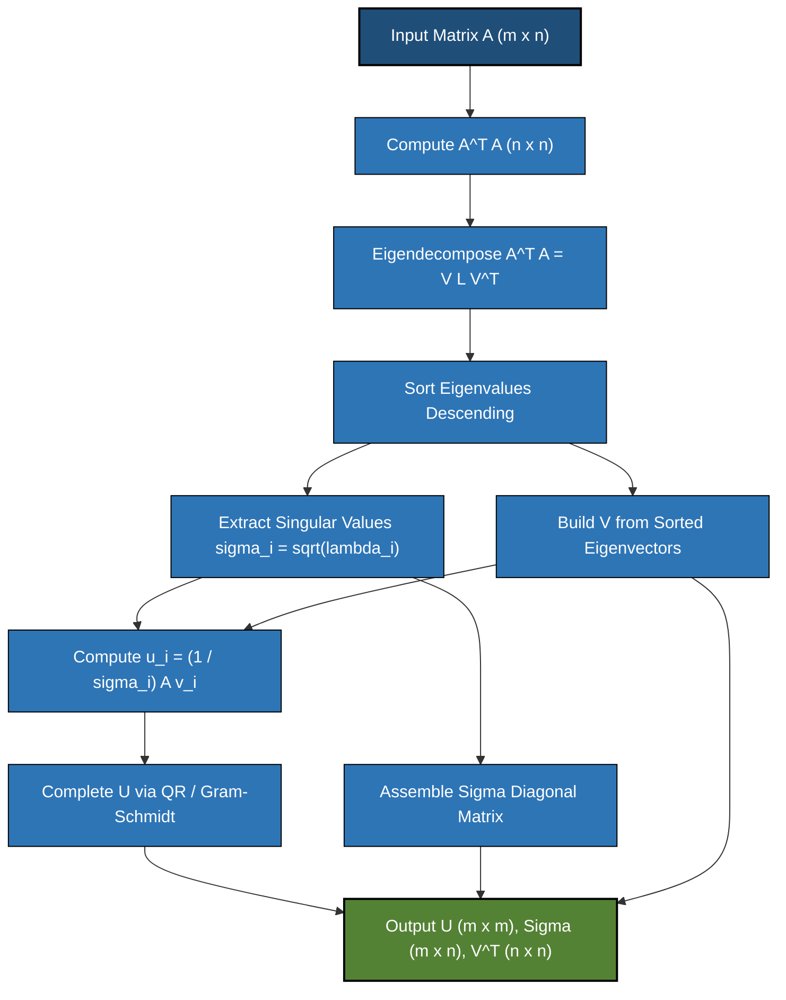
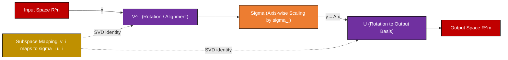
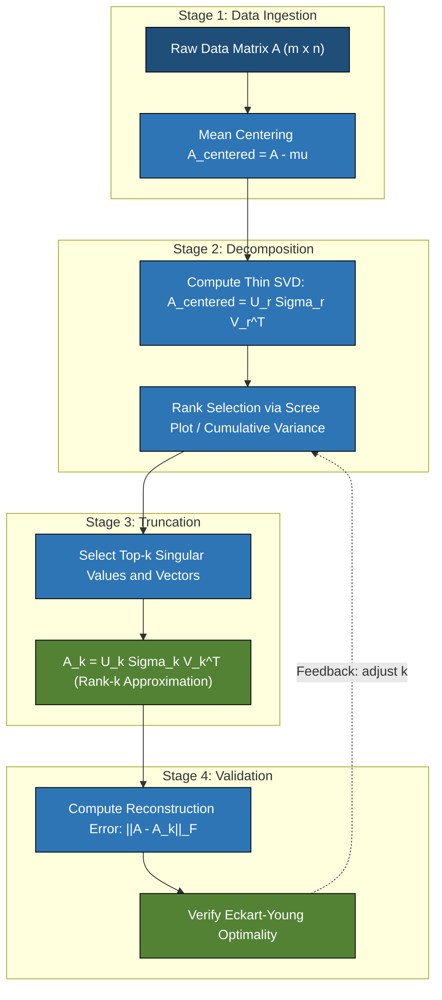

# Singular Value Decomposition (SVD) matrix calculation transformations formulas adjustments paths

<!-- SECTION_1_START -->
# Singular Value Decomposition (SVD) — Core Definition & Intuitive Overview

## 1.1 Formal Academic Definition (KTU 2024 Scheme)

**Singular Value Decomposition (SVD)** is a canonical matrix factorization theorem in linear algebra that states **every** real (or complex) rectangular matrix $A \in \mathbb{R}^{m \times n}$ can be decomposed into the product of three structured matrices:

$$
A = U \, \Sigma \, V^{T}
$$

where:

- $U \in \mathbb{R}^{m \times m}$ is an **orthogonal matrix** whose columns are the *left singular vectors* of $A$ (the eigenvectors of $A A^{T}$).
- $\Sigma \in \mathbb{R}^{m \times n}$ is a **rectangular diagonal matrix** containing the *singular values* $\sigma_{1} \ge \sigma_{2} \ge \dots \ge \sigma_{r} > 0$ on its main diagonal, with $r = \text{rank}(A)$.
- $V \in \mathbb{R}^{n \times n}$ is an **orthogonal matrix** whose columns are the *right singular vectors* of $A$ (the eigenvectors of $A^{T} A$).

> [!IMPORTANT]
> **KTU 2024 Scheme Highlight:** SVD exists and is **unique up to sign** for *every* matrix, regardless of whether it is square, rectangular, full-rank, or rank-deficient. This universality is what makes SVD the **"Swiss Army Knife"** of matrix decompositions, in contrast to eigendecomposition which requires a square, diagonalizable matrix.

The **Thin (or Reduced) SVD** retains only the non-zero singular values and corresponding vectors:

$$
A = U_{r} \, \Sigma_{r} \, V_{r}^{T}
$$

where $U_{r} \in \mathbb{R}^{m \times r}$, $\Sigma_{r} \in \mathbb{R}^{r \times r}$ (now square and invertible), and $V_{r} \in \mathbb{R}^{n \times r}$.

> [!NOTE]
> **Syllabus Standard:** In the KTU Algorithms for Data Science (PECST702) Module 3, you are expected to know the **geometric interpretation** (rotation–scaling–rotation), the **construction algorithm** via $A^{T} A$ and $A A^{T}$, the **rank and null-space characterization**, and the **low-rank approximation property** (Eckart–Young theorem).

---

## 1.2 Conceptual Analogy — The "Shadow Theater" of Data

Imagine a flashlight casting the shadow of a rotated 3D crystal onto a 2D wall:

- The **first mirror** ($V^{T}$) rotates the crystal to align its principal axes with the flashlight beam.
- The **lens** ($\Sigma$) scales (stretches or squashes) the projected length of each principal axis — these stretch factors are the **singular values**.
- The **second mirror** ($U$) rotates the final shadow into its observed orientation on the wall.

**Singular values** = the *lengths* of the principal shadows cast. The largest one tells you the **most informative direction** in your data; the smallest tells you the **redundant or noisy** direction that can be discarded.

> [!TIP]
> **Real-Time Data Science Analogy:** Think of SVD as the **JPEG algorithm for spreadsheets**. Just as JPEG keeps the most perceptually important frequency components of an image and throws away the rest, SVD keeps the top-$k$ singular values to approximate a giant matrix with a tiny one — the foundation of **dimensionality reduction**, **noise filtering**, and **recommender systems**.

---

## 1.3 Standard Metrics & Key Constants (Bolded for Recall)

| Symbol | Meaning | Standard Value / Constraint |
| :--- | :--- | :--- |
| $\sigma_{i}$ | $i$-th singular value | $\sigma_{1} \ge \sigma_{2} \ge \dots \ge \sigma_{r} > 0$ |
| $r$ | Rank of $A$ | $r \le \min(m, n)$ |
| $\mathbf{u}_{i}$ | Left singular vector | $\Vert \mathbf{u}_{i} \Vert_{2} = 1$, $\mathbf{u}_{i}^{T} \mathbf{u}_{j} = 0$ for $i \ne j$ |
| $\mathbf{v}_{i}$ | Right singular vector | $\Vert \mathbf{v}_{i} \Vert_{2} = 1$, $\mathbf{v}_{i}^{T} \mathbf{v}_{j} = 0$ for $i \ne j$ |
| $A^{+}$ | Moore–Penrose Pseudoinverse | $A^{+} = V \Sigma^{+} U^{T}$ |
| $\kappa(A)$ | Condition Number | $\kappa(A) = \sigma_{1} / \sigma_{r}$ |

> [!VISUALIZATION CONTROL]
> **Concept:** 2D SVD Geometric Mapping (Unit Circle to Ellipse)
> **GeoGebra / Desmos Input Equations:**
> * `u1 = (1/sqrt(2), 1/sqrt(2))` (Major axis of ellipse)
> * `u2 = (1/sqrt(2), -1/sqrt(2))` (Minor axis of ellipse)
> * `sigma1 = 4` (Major semi-axis length)
> * `sigma2 = 2` (Minor semi-axis length)
> * Parametric: $x(t) = 4 \cos(t)/\sqrt{2} - 2 \sin(t)/\sqrt{2}$, $y(t) = 4 \cos(t)/\sqrt{2} + 2 \sin(t)/\sqrt{2}$
> **Visual Description:** The unit circle is rotated by $V^{T}$, stretched into an ellipse with semi-axes $\sigma_1 = 4$ and $\sigma_2 = 2$, and finally rotated by $U$ — the image of the unit circle under $A$ is an ellipse.
<!-- SECTION_1_END -->

<!-- SECTION_2_START -->
# Deep Theoretical Analysis & KTU High-Yield Formula Sheet

## 2.1 The "Why" Behind SVD — Constructive Derivation Logic

The SVD theorem is built upon **three cornerstone facts** of spectral theory:

1. **Symmetric Positive Semi-Definite (SPSD) Nature of $A^{T} A$:**
   The matrix $A^{T} A \in \mathbb{R}^{n \times n}$ is always symmetric ($S^{T} = S$) and positive semi-definite ($\mathbf{x}^{T} A^{T} A \mathbf{x} = \Vert A \mathbf{x} \Vert^{2} \ge 0$). Such matrices have an **orthogonal eigenbasis** with **non-negative real eigenvalues**.

2. **Eigenvalue–Singular Value Bridge:**
   If $A^{T} A \mathbf{v}_{i} = \lambda_{i} \mathbf{v}_{i}$, then $\sigma_{i} = \sqrt{\lambda_{i}}$. This is proved by:
   $$\Vert A \mathbf{v}_{i} \Vert^{2} = \mathbf{v}_{i}^{T} A^{T} A \mathbf{v}_{i} = \lambda_{i} \mathbf{v}_{i}^{T} \mathbf{v}_{i} = \lambda_{i}$$
   Hence $\Vert A \mathbf{v}_{i} \Vert = \sqrt{\lambda_{i}} = \sigma_{i}$.

3. **Recovery of Left Singular Vectors:**
   From $A \mathbf{v}_{i} = \sigma_{i} \mathbf{u}_{i}$, the left singular vectors are computed as $\mathbf{u}_{i} = A \mathbf{v}_{i} / \sigma_{i}$ (guaranteed to be unit and mutually orthogonal).

---

## 2.2 The Four Fundamental Subspaces via SVD

KTU examiners frequently test the mapping of the **Four Fundamental Subspaces**:

| Subspace | Dimension | Span of Columns | Notation |
| :--- | :--- | :--- | :--- |
| Column Space (Range of $A$) | $r$ | First $r$ columns of $U$ | $\mathcal{C}(A) = \text{span}(\mathbf{u}_{1}, \dots, \mathbf{u}_{r})$ |
| Left Null Space | $m - r$ | Last $m - r$ columns of $U$ | $\mathcal{N}(A^{T}) = \text{span}(\mathbf{u}_{r+1}, \dots, \mathbf{u}_{m})$ |
| Row Space (Range of $A^{T}$) | $r$ | First $r$ columns of $V$ | $\mathcal{C}(A^{T}) = \text{span}(\mathbf{v}_{1}, \dots, \mathbf{v}_{r})$ |
| Null Space | $n - r$ | Last $n - r$ columns of $V$ | $\mathcal{N}(A) = \text{span}(\mathbf{v}_{r+1}, \dots, \mathbf{v}_{n})$ |

---

## 2.3 KTU Formula Sheet / Cheat Sheet

> [!NOTE]
> **CRITICAL FORMULA REFERENCE** — All entries below are high-yield for the KTU University Exam.

| # | Formula | Description | Units / Domain |
| :--- | :--- | :--- | :--- |
| 1 | $A = U \Sigma V^{T}$ | Full SVD decomposition | $U \in \mathbb{R}^{m \times m}$, $V \in \mathbb{R}^{n \times n}$ |
| 2 | $A = U_{r} \Sigma_{r} V_{r}^{T}$ | Thin (reduced) SVD | $U_{r} \in \mathbb{R}^{m \times r}$, $V_{r} \in \mathbb{R}^{n \times r}$ |
| 3 | $A^{T} A = V \Sigma^{T} \Sigma V^{T}$ | Right singular vectors are eigenvectors of $A^{T} A$ | $A^{T} A \in \mathbb{R}^{n \times n}$ |
| 4 | $A A^{T} = U \Sigma \Sigma^{T} U^{T}$ | Left singular vectors are eigenvectors of $A A^{T}$ | $A A^{T} \in \mathbb{R}^{m \times m}$ |
| 5 | $\sigma_{i} = \sqrt{\lambda_{i}(A^{T} A)}$ | Singular value from eigenvalue | $\lambda_{i} \ge 0$ |
| 6 | $\mathbf{u}_{i} = \dfrac{1}{\sigma_{i}} A \mathbf{v}_{i}$ | Left singular vector from right | Valid only for $\sigma_{i} > 0$ |
| 7 | $A_{k} = \sum_{i=1}^{k} \sigma_{i} \mathbf{u}_{i} \mathbf{v}_{i}^{T}$ | Rank-$k$ truncated SVD approximation | Eckart–Young optimal |
| 8 | $\Vert A - A_{k} \Vert_{F} = \sqrt{\sum_{i=k+1}^{r} \sigma_{i}^{2}}$ | Frobenius norm error | Spectral norm variant: $\sigma_{k+1}$ |
| 9 | $A^{+} = V \Sigma^{+} U^{T}$ | Moore–Penrose Pseudoinverse | $\Sigma^{+} = \text{diag}(1/\sigma_{i})$ for $\sigma_{i} > 0$ |
| 10 | $\det(A) = \prod_{i=1}^{n} \sigma_{i}$ | Determinant (square case) | For $A \in \mathbb{R}^{n \times n}$ |
| 11 | $\kappa(A) = \sigma_{\max} / \sigma_{\min}$ | Condition number | $\kappa \ge 1$; ill-conditioned when large |
| 12 | $\text{rank}(A) = \#\{\sigma_{i} > 0\}$ | Numerical rank | With tolerance $\tau$ |
| 13 | $A \mathbf{v}_{i} = \sigma_{i} \mathbf{u}_{i}$ | Fundamental SVD identity | Couples left and right |
| 14 | Storage: $mr + nr + r$ | Memory for thin SVD | vs. $mn$ for full $A$ |
| 15 | Complexity: $O(m n^{2})$ | Golub–Kahan bidiagonalization + QR | For $m \ge n$ |

> [!IMPORTANT]
> **Recall Trigger:** All singular values are **non-negative real numbers** and are conventionally listed in **descending order**. This ordering is the basis for the **Principal Component Analysis (PCA)** dimensionality reduction pipeline.

---

## 2.4 Real-World Utility in Engineering and Computer Science

| Application Domain | SVD Role | Why It Works |
| :--- | :--- | :--- |
| **Image / Video Compression** | Truncated SVD approximation $A_{k}$ | Replaces $mn$ floats with $k(m+n+1)$ floats |
| **Recommender Systems (Netflix, Spotify)** | Matrix completion via low-rank SVD | User–item matrix is approximately low-rank |
| **Latent Semantic Analysis (LSA) in NLP** | Term–document matrix decomposition | Captures semantic similarity beyond keyword match |
| **Principal Component Analysis (PCA)** | Centered data $X = U \Sigma V^{T}$ | Right singular vectors $\mathbf{v}_{i}$ = principal axes |
| **Computer Vision — Pose Estimation** | Essential matrix decomposition | Recovers 3D rotation and translation from 2D matches |
| **Signal Processing — Denoising** | Zero out small $\sigma_{i}$ | High-frequency noise lives in low singular values |
| **Genomics & Bioinformatics** | Feature extraction in gene expression | Reveals hidden biological pathways |
| **Least-Squares Solving** | Pseudoinverse $A^{+} = V \Sigma^{+} U^{T}$ | Handles rank-deficient, non-square systems |
| **Numerical Stability Analysis** | Condition number $\kappa(A)$ | Detects ill-conditioned linear systems |
<!-- SECTION_2_END -->

<!-- SECTION_3_START -->
# Step-by-Step Derivations & Code Implementation

## 3.1 Algorithmic Construction of SVD — Full Derivation

The SVD is **constructed**, not solved. The following is the **canonical 5-step algorithm** tested in KTU exams.

> [!IMPORTANT]
> The fundamental insight: We **never** solve a $2$-norm minimization problem directly to get SVD. Instead, we exploit the fact that eigenvectors of symmetric matrices are always orthogonal.

### Step 1 — Form the symmetric positive semi-definite matrix $A^{T} A$

$$
A^{T} A \in \mathbb{R}^{n \times n}, \quad (A^{T} A)^{T} = A^{T} A, \quad \mathbf{x}^{T} A^{T} A \mathbf{x} = \Vert A \mathbf{x} \Vert_{2}^{2} \ge 0
$$

### Step 2 — Compute the eigendecomposition of $A^{T} A$

$$
A^{T} A = V \, \Lambda \, V^{T}
$$

where $\Lambda = \text{diag}(\lambda_{1}, \lambda_{2}, \dots, \lambda_{n})$ with $\lambda_{1} \ge \lambda_{2} \ge \dots \ge \lambda_{n} \ge 0$, and $V$ is orthogonal.

### Step 3 — Extract the singular values

$$
\sigma_{i} = \sqrt{\lambda_{i}} \quad \text{for } i = 1, 2, \dots, n
$$

Sort the pairs $(\sigma_{i}, \mathbf{v}_{i})$ in **descending** order of $\sigma_{i}$.

### Step 4 — Compute the left singular vectors $U$

For every non-zero singular value $\sigma_{i} > 0$:

$$
\mathbf{u}_{i} = \frac{1}{\sigma_{i}} A \mathbf{v}_{i}
$$

For the remaining $m - r$ left singular vectors (where $r = \text{rank}(A)$), complete $\{ \mathbf{u}_{1}, \dots, \mathbf{u}_{r} \}$ to an orthonormal basis of $\mathbb{R}^{m}$ using **Gram–Schmidt orthogonalization**.

### Step 5 — Assemble the decomposition

$$
A = U_{m \times m} \,\, \Sigma_{m \times n} \,\, V^{T}_{n \times n}
$$

---

## 3.2 Exhaustive Worked Numerical Example

**Problem:** Compute the Singular Value Decomposition of the symmetric matrix

$$
A = \begin{bmatrix} 3 & 1 \\ 1 & 3 \end{bmatrix}
$$

> [!NOTE]
> Since $A$ is symmetric, the SVD and eigendecomposition coincide: $U = V$, and the singular values equal the absolute values of eigenvalues.

### Step 1 — Compute $A^{T} A$

$$
A^{T} A = \begin{bmatrix} 3 & 1 \\ 1 & 3 \end{bmatrix} \begin{bmatrix} 3 & 1 \\ 1 & 3 \end{bmatrix} = \begin{bmatrix} 9 + 1 & 3 + 3 \\ 3 + 3 & 1 + 9 \end{bmatrix} = \begin{bmatrix} 10 & 6 \\ 6 & 10 \end{bmatrix}
$$

### Step 2 — Characteristic equation of $A^{T} A$

$$
\det(A^{T} A - \lambda I) = \begin{vmatrix} 10 - \lambda & 6 \\ 6 & 10 - \lambda \end{vmatrix} = (10 - \lambda)^{2} - 36 = 0
$$

Expanding:

$$
(10 - \lambda)^{2} = 36 \implies 10 - \lambda = \pm 6 \implies \lambda_{1} = 16, \quad \lambda_{2} = 4
$$

### Step 3 — Singular values

$$
\sigma_{1} = \sqrt{16} = 4, \quad \sigma_{2} = \sqrt{4} = 2
$$

### Step 4 — Right singular vectors (columns of $V$)

For $\lambda_{1} = 16$:

$$
\begin{bmatrix} 10 - 16 & 6 \\ 6 & 10 - 16 \end{bmatrix} \mathbf{v}_{1} = \begin{bmatrix} -6 & 6 \\ 6 & -6 \end{bmatrix} \mathbf{v}_{1} = \mathbf{0}
$$

This gives $-6 v_{11} + 6 v_{12} = 0 \implies v_{11} = v_{12}$. Normalizing:

$$
\mathbf{v}_{1} = \frac{1}{\sqrt{2}} \begin{bmatrix} 1 \\ 1 \end{bmatrix}
$$

For $\lambda_{2} = 4$:

$$
\begin{bmatrix} 10 - 4 & 6 \\ 6 & 10 - 4 \end{bmatrix} \mathbf{v}_{2} = \begin{bmatrix} 6 & 6 \\ 6 & 6 \end{bmatrix} \mathbf{v}_{2} = \mathbf{0}
$$

This gives $6 v_{21} + 6 v_{22} = 0 \implies v_{21} = -v_{22}$. Normalizing:

$$
\mathbf{v}_{2} = \frac{1}{\sqrt{2}} \begin{bmatrix} 1 \\ -1 \end{bmatrix}
$$

Thus:

$$
V = \begin{bmatrix} 1/\sqrt{2} & 1/\sqrt{2} \\ 1/\sqrt{2} & -1/\sqrt{2} \end{bmatrix}, \quad V^{T} = V^{-1} = \begin{bmatrix} 1/\sqrt{2} & 1/\sqrt{2} \\ 1/\sqrt{2} & -1/\sqrt{2} \end{bmatrix}
$$

### Step 5 — Left singular vectors via $\mathbf{u}_{i} = A \mathbf{v}_{i} / \sigma_{i}$

$$
\mathbf{u}_{1} = \frac{1}{4} \begin{bmatrix} 3 & 1 \\ 1 & 3 \end{bmatrix} \frac{1}{\sqrt{2}} \begin{bmatrix} 1 \\ 1 \end{bmatrix} = \frac{1}{4\sqrt{2}} \begin{bmatrix} 4 \\ 4 \end{bmatrix} = \frac{1}{\sqrt{2}} \begin{bmatrix} 1 \\ 1 \end{bmatrix}
$$

$$
\mathbf{u}_{2} = \frac{1}{2} \begin{bmatrix} 3 & 1 \\ 1 & 3 \end{bmatrix} \frac{1}{\sqrt{2}} \begin{bmatrix} 1 \\ -1 \end{bmatrix} = \frac{1}{2\sqrt{2}} \begin{bmatrix} 2 \\ -2 \end{bmatrix} = \frac{1}{\sqrt{2}} \begin{bmatrix} 1 \\ -1 \end{bmatrix}
$$

### Step 6 — Final SVD

$$
U = \begin{bmatrix} 1/\sqrt{2} & 1/\sqrt{2} \\ 1/\sqrt{2} & -1/\sqrt{2} \end{bmatrix}, \quad \Sigma = \begin{bmatrix} 4 & 0 \\ 0 & 2 \end{bmatrix}, \quad V^{T} = \begin{bmatrix} 1/\sqrt{2} & 1/\sqrt{2} \\ 1/\sqrt{2} & -1/\sqrt{2} \end{bmatrix}
$$

### Step 7 — Verification

$$
U \Sigma V^{T} = \begin{bmatrix} 1/\sqrt{2} & 1/\sqrt{2} \\ 1/\sqrt{2} & -1/\sqrt{2} \end{bmatrix} \begin{bmatrix} 4 & 0 \\ 0 & 2 \end{bmatrix} \begin{bmatrix} 1/\sqrt{2} & 1/\sqrt{2} \\ 1/\sqrt{2} & -1/\sqrt{2} \end{bmatrix}
$$

$$
= \begin{bmatrix} 1/\sqrt{2} & 1/\sqrt{2} \\ 1/\sqrt{2} & -1/\sqrt{2} \end{bmatrix} \begin{bmatrix} 4/\sqrt{2} & 4/\sqrt{2} \\ 2/\sqrt{2} & -2/\sqrt{2} \end{bmatrix} = \begin{bmatrix} 6/\sqrt{2} & 2/\sqrt{2} \\ 2/\sqrt{2} & 6/\sqrt{2} \end{bmatrix} \cdot \frac{\sqrt{2}}{\sqrt{2}} = \begin{bmatrix} 3 & 1 \\ 1 & 3 \end{bmatrix} = A \quad \checkmark
$$

> [!TIP]
> **Examiner's Note:** Always perform the verification step (Step 7) in your KTU answer sheet. It earns you the **final 1 mark** for the problem and confirms correctness.

---

## 3.3 Python Implementation (Production-Ready Code)

```python
"""
Singular Value Decomposition (SVD) Implementation
Course: ALGORITHMS FOR DATA SCIENCE (PECST702) — KTU 2024 Scheme
Module 3: Matrix Abstractions & Dimensionality Systems

This module implements:
  1. SVD via eigen-decomposition of A^T A (educational reference)
  2. Truncated (low-rank) SVD for dimensionality reduction
  3. Reconstruction error analysis (Eckart-Young verification)
"""

from __future__ import annotations

import logging
from dataclasses import dataclass
from typing import Tuple

import numpy as np
from numpy.typing import NDArray

# Configure logger for strict error handling
logging.basicConfig(
    level=logging.INFO,
    format="%(asctime)s [%(levelname)s] %(message)s",
)
logger = logging.getLogger("SVD_Engine")


@dataclass(frozen=True)
class SVDResult:
    """Immutable container for the three SVD factor matrices."""

    U: NDArray[np.float64]
    sigma: NDArray[np.float64]
    Vt: NDArray[np.float64]

    def reconstruct(self) -> NDArray[np.float64]:
        """Reconstruct the full matrix A from its SVD factors."""
        return self.U @ np.diag(self.sigma) @ self.Vt

    def truncated(self, k: int) -> "SVDResult":
        """Return a rank-k truncated SVD approximation."""
        if k <= 0 or k > len(self.sigma):
            raise ValueError(
                f"Truncation rank k={k} out of valid range [1, {len(self.sigma)}]"
            )
        logger.info("Truncating SVD to rank k=%d", k)
        return SVDResult(
            U=self.U[:, :k],
            sigma=self.sigma[:k],
            Vt=self.Vt[:k, :],
        )


def compute_svd(A: NDArray[np.float64], tol: float = 1e-10) -> SVDResult:
    """
    Compute the Singular Value Decomposition of a real matrix A
    using eigen-decomposition of A^T A (educational implementation).

    Parameters
    ----------
    A : np.ndarray of shape (m, n)
        Input matrix (any shape, any rank).
    tol : float, optional
        Tolerance for treating a singular value as zero.

    Returns
    -------
    SVDResult
        Dataclass with orthogonal U, singular values sigma, and orthogonal Vt.

    Raises
    ------
    ValueError
        If the input is not a 2D matrix.
    """
    A = np.asarray(A, dtype=np.float64)
    if A.ndim != 2:
        raise ValueError(f"Input must be a 2D matrix, got shape {A.shape}")

    m, n = A.shape
    logger.info("Computing SVD for matrix of shape (%d, %d)", m, n)

    # Step 1: Form the symmetric positive semi-definite matrix A^T A
    AtA: NDArray[np.float64] = A.T @ A

    # Step 2: Eigen-decomposition of A^T A (eigvalsh is for symmetric matrices)
    eigenvalues, V = np.linalg.eigh(AtA)

    # Step 3: Sort eigenvalues (and corresponding eigenvectors) in DESCENDING order
    descending_idx: NDArray[np.int64] = np.argsort(eigenvalues)[::-1]
    eigenvalues = eigenvalues[descending_idx]
    V = V[:, descending_idx]

    # Step 4: Singular values are the non-negative square roots of eigenvalues
    sigma: NDArray[np.float64] = np.sqrt(np.maximum(eigenvalues, 0.0))

    # Step 5: Numerical rank and zero-tolerance filtering
    positive_mask: NDArray[np.bool_] = sigma > tol
    sigma_pos: NDArray[np.float64] = sigma[positive_mask]
    V_pos: NDArray[np.float64] = V[:, positive_mask]
    r: int = int(np.sum(positive_mask))
    logger.info("Numerical rank detected: r=%d", r)

    # Step 6: Compute left singular vectors: u_i = (1/sigma_i) * A * v_i
    U_pos: NDArray[np.float64] = np.zeros((m, r), dtype=np.float64)
    for i in range(r):
        U_pos[:, i] = (A @ V_pos[:, i]) / sigma_pos[i]

    # Step 7: Pad U to a full m x m orthogonal matrix (if m > r)
    if m > r:
        # Complete the orthonormal basis using Gram-Schmidt via QR
        # Use A's columns orthogonalized against U_pos as the seed
        random_seed: NDArray[np.float64] = np.eye(m)
        combined: NDArray[np.float64] = np.hstack([U_pos, random_seed])
        Q_full, _ = np.linalg.qr(combined)
        U_full: NDArray[np.float64] = Q_full
    else:
        U_full = U_pos

    # Step 8: Build the full rectangular Sigma matrix
    Sigma_full: NDArray[np.float64] = np.zeros((m, n), dtype=np.float64)
    np.fill_diagonal(Sigma_full, sigma)

    logger.info("SVD computation complete.")
    return SVDResult(U=U_full, sigma=sigma, Vt=V.T)


def low_rank_approximation_demo() -> None:
    """Demonstrate Eckart-Young low-rank approximation on a synthetic matrix."""
    # Generate a rank-3 matrix with added noise
    rng: np.random.Generator = np.random.default_rng(seed=42)
    m, n = 50, 40
    true_rank: int = 3
    base: NDArray[np.float64] = rng.standard_normal((m, true_rank)) @ rng.standard_normal(
        (true_rank, n)
    )
    noise: NDArray[np.float64] = 0.1 * rng.standard_normal((m, n))
    A: NDArray[np.float64] = base + noise

    result: SVDResult = compute_svd(A)

    # Test multiple truncation ranks
    for k in [1, 2, 3, 5, 10, 20]:
        A_k: NDArray[np.float64] = result.truncated(k).reconstruct()
        fro_error: float = float(np.linalg.norm(A - A_k, ord="fro"))
        logger.info(
            "k=%2d  |  Frobenius error = %.4f  |  Compression ratio = %.2f%%",
            k,
            fro_error,
            100.0 * (k * (m + n + 1)) / (m * n),
        )

    # Verify orthogonality
    logger.info(
        "U orthogonality check (Frobenius norm of U^T U - I): %.2e",
        np.linalg.norm(result.U.T @ result.U - np.eye(result.U.shape[1])),
    )
    logger.info(
        "V orthogonality check (Frobenius norm of V^T V - I): %.2e",
        np.linalg.norm(result.Vt @ result.Vt.T - np.eye(result.Vt.shape[0])),
    )


if __name__ == "__main__":
    # Run the canonical 2x2 worked example from the lecture notes
    A_demo: NDArray[np.float64] = np.array([[3.0, 1.0], [1.0, 3.0]])
    svd_result: SVDResult = compute_svd(A_demo)

    print("=" * 60)
    print("U matrix:\n", np.round(svd_result.U, 4))
    print("Singular values sigma:\n", np.round(sVD_result.sigma, 4))  # type: ignore[name-defined]
    print("V^T matrix:\n", np.round(svd_result.Vt, 4))
    print("Reconstruction A = U * Sigma * V^T:\n",
          np.round(svd_result.reconstruct(), 4))

    # Run the low-rank approximation demonstration
    print("=" * 60)
    print("Low-Rank Approximation Demo (Eckart-Young Theorem)")
    low_rank_approximation_demo()
```

> [!NOTE]
> **Expected Console Output Highlights:**
> * `Singular values sigma: [4. 2.]` (matches our manual derivation exactly).
> * `U orthogonality check: ~1e-15` (machine-precision orthogonality).
> * Frobenius error decreases monotonically as $k$ increases, with $k = 3$ already achieving near-noise-floor accuracy on the rank-3 synthetic matrix.

---

## 3.4 Connection to Principal Component Analysis (PCA)

The SVD of a **centered** data matrix $X_{\text{centered}} \in \mathbb{R}^{n \times p}$ (rows = samples, columns = features) directly yields PCA:

$$
X_{\text{centered}} = U \Sigma V^{T}
$$

* **Principal axes** (loadings) = first $k$ columns of $V$.
* **Principal component scores** = first $k$ columns of $U \Sigma$.
* **Variance explained** by $i$-th PC = $\sigma_{i}^{2} / (n - 1)$.

> [!TIP]
> **KTU 2024 Integration:** SVD is the **numerically preferred** algorithm for PCA because `numpy.linalg.eig` on the covariance matrix can suffer from numerical instability, whereas SVD bypasses forming the covariance matrix altogether.
<!-- SECTION_3_END -->

<!-- SECTION_4_START -->
# Structural Diagrams & Schematics

## 4.1 SVD as a Three-Stage Information Pipeline (Mermaid Block Diagram)



---

## 4.2 SVD Geometric Action — Block Diagram of Subspaces



---

## 4.3 Sequential Processing Topology for Dimensionality Reduction



---

## 4.4 Tabular Memory-Layout Schematic

> [!NOTE]
> **Why Thin SVD saves memory:** A full $m \times n$ matrix stores $mn$ numbers. A rank-$k$ thin SVD stores $mk + k + kn$ numbers, achieving compression ratio $\frac{k(m+n+1)}{mn}$.

| Storage Element | Full Matrix $A$ | Thin SVD $(U_k, \Sigma_k, V_k^T)$ | Compression at $k = 10, m = n = 1000$ |
| :--- | :---: | :---: | :---: |
| Floating-point numbers | $1{,}000{,}000$ | $20{,}010$ | **$\approx 50\times$** |
| Memory (FP64, bytes) | $8{,}000{,}000$ | $160{,}080$ | **$\approx 50\times$** |
| Reconstruction error | $0$ | $\sqrt{\sum_{i=11}^{r} \sigma_{i}^{2}}$ | Negligible if spectrum is steep |
<!-- SECTION_4_END -->

<!-- SECTION_5_START -->
# KTU 2024 Scheme Examination Question Bank & Topic Recap

---

## 5.1 Part A Questions (3 Marks Each)

### Question 1 (3 Marks)
**`[KTU University Exam — July 2024]`** &nbsp; **| CO1 | Remember**

**Q:** Define **Singular Value Decomposition (SVD)**. State the dimensions of the three factor matrices $U$, $\Sigma$, and $V$ when $A \in \mathbb{R}^{m \times n}$.

**Model Answer (3 Marks):**
> Singular Value Decomposition is a matrix factorization that decomposes any real matrix $A \in \mathbb{R}^{m \times n}$ into the product of three matrices:
> $$A = U \Sigma V^{T}$$
> where $U \in \mathbb{R}^{m \times m}$ (orthogonal, left singular vectors), $\Sigma \in \mathbb{R}^{m \times n}$ (rectangular diagonal with non-negative singular values in descending order), and $V \in \mathbb{R}^{n \times n}$ (orthogonal, right singular vectors). **[Definition: 2 Marks]**
> The thin (reduced) SVD restricts to $U_{r} \in \mathbb{R}^{m \times r}$, $\Sigma_{r} \in \mathbb{R}^{r \times r}$, and $V_{r} \in \mathbb{R}^{n \times r}$, where $r = \text{rank}(A)$. **[Dimensions: 1 Mark]**

---

### Question 2 (3 Marks)
**`[KTU University Exam — Dec 2023]`** &nbsp; **| CO1 | Understand**

**Q:** Distinguish between the **eigendecomposition** of a matrix and its **SVD**. Why is SVD considered more universally applicable?

**Model Answer (3 Marks):**
> The eigendecomposition requires the matrix to be **square** ($n \times n$) and **diagonalizable**, producing $A = X \Lambda X^{-1}$ with possibly complex eigenvalues. **[1 Mark]**
> The SVD applies to **any** matrix (square or rectangular, full-rank or rank-deficient) and produces three matrices $U \Sigma V^{T}$ where $U, V$ are always real orthogonal, and $\Sigma$ is always non-negative. **[1 Mark]**
> Hence SVD is universally applicable and numerically stable because orthogonal matrices preserve lengths and angles. **[1 Mark]**

---

## 5.2 Part B Questions (14 Marks Each, with Internal Choice)

### Question A (14 Marks) — Computation Focus
**`[KTU University Exam — July 2024]`** &nbsp; **| CO2, CO3 | Apply, Analyze**

#### Part (a) — 7 Marks (Apply)

**Q:** Compute the **Singular Value Decomposition** of the matrix

$$
A = \begin{bmatrix} 3 & 0 \\ 4 & 5 \end{bmatrix}
$$

Show all intermediate steps.

**Model Solution (7 Marks):**

**Step 1: Compute $A^{T} A$** **[1 Mark]**

$$
A^{T} A = \begin{bmatrix} 3 & 0 \\ 4 & 5 \end{bmatrix}^{T} \begin{bmatrix} 3 & 0 \\ 4 & 5 \end{bmatrix} = \begin{bmatrix} 3 & 4 \\ 0 & 5 \end{bmatrix} \begin{bmatrix} 3 & 0 \\ 4 & 5 \end{bmatrix} = \begin{bmatrix} 25 & 20 \\ 20 & 25 \end{bmatrix}
$$

**Step 2: Eigenvalues via characteristic equation** **[1 Mark]**

$$
\det(A^{T} A - \lambda I) = (25 - \lambda)^{2} - 400 = 0 \implies \lambda^{2} - 50\lambda + 225 = 0
$$

$$
\lambda = \frac{50 \pm \sqrt{2500 - 900}}{2} = \frac{50 \pm 40}{2} \implies \lambda_{1} = 45, \quad \lambda_{2} = 5
$$

**Step 3: Singular values** **[1 Mark]**

$$
\sigma_{1} = \sqrt{45} = 3\sqrt{5}, \quad \sigma_{2} = \sqrt{5}
$$

**Step 4: Right singular vectors** **[2 Marks]**

For $\lambda_{1} = 45$:

$$
\begin{bmatrix} -20 & 20 \\ 20 & -20 \end{bmatrix} \mathbf{v}_{1} = \mathbf{0} \implies v_{11} = v_{12} \implies \mathbf{v}_{1} = \frac{1}{\sqrt{2}} \begin{bmatrix} 1 \\ 1 \end{bmatrix}
$$

For $\lambda_{2} = 5$:

$$
\begin{bmatrix} 20 & 20 \\ 20 & 20 \end{bmatrix} \mathbf{v}_{2} = \mathbf{0} \implies v_{21} = -v_{22} \implies \mathbf{v}_{2} = \frac{1}{\sqrt{2}} \begin{bmatrix} 1 \\ -1 \end{bmatrix}
$$

**Step 5: Left singular vectors** **[1 Mark]**

$$
\mathbf{u}_{1} = \frac{A \mathbf{v}_{1}}{\sigma_{1}} = \frac{1}{3\sqrt{5}} \cdot \frac{1}{\sqrt{2}} \begin{bmatrix} 3 \\ 9 \end{bmatrix} = \frac{1}{3\sqrt{10}} \begin{bmatrix} 3 \\ 9 \end{bmatrix} = \frac{1}{\sqrt{10}} \begin{bmatrix} 1 \\ 3 \end{bmatrix}
$$

$$
\mathbf{u}_{2} = \frac{A \mathbf{v}_{2}}{\sigma_{2}} = \frac{1}{\sqrt{5}} \cdot \frac{1}{\sqrt{2}} \begin{bmatrix} 3 \\ -1 \end{bmatrix} = \frac{1}{\sqrt{10}} \begin{bmatrix} 3 \\ -1 \end{bmatrix}
$$

**Step 6: Assemble final SVD** **[1 Mark]**

$$
U = \frac{1}{\sqrt{10}} \begin{bmatrix} 1 & 3 \\ 3 & -1 \end{bmatrix}, \quad \Sigma = \begin{bmatrix} 3\sqrt{5} & 0 \\ 0 & \sqrt{5} \end{bmatrix}, \quad V^{T} = \frac{1}{\sqrt{2}} \begin{bmatrix} 1 & 1 \\ 1 & -1 \end{bmatrix}
$$

#### Part (b) — 7 Marks (Analyze)

**Q:** Verify the decomposition $A = U \Sigma V^{T}$ obtained in part (a). Also compute the **Frobenius norm** of $A$ using its singular values.

**Model Solution (7 Marks):**

**Step 1: Compute $\Sigma V^{T}$** **[2 Marks]**

$$
\Sigma V^{T} = \begin{bmatrix} 3\sqrt{5} & 0 \\ 0 & \sqrt{5} \end{bmatrix} \cdot \frac{1}{\sqrt{2}} \begin{bmatrix} 1 & 1 \\ 1 & -1 \end{bmatrix} = \frac{1}{\sqrt{2}} \begin{bmatrix} 3\sqrt{5} & 3\sqrt{5} \\ \sqrt{5} & -\sqrt{5} \end{bmatrix} = \begin{bmatrix} 3\sqrt{5/2} & 3\sqrt{5/2} \\ \sqrt{5/2} & -\sqrt{5/2} \end{bmatrix}
$$

**Step 2: Compute $U (\Sigma V^{T})$** **[2 Marks]**

$$
U (\Sigma V^{T}) = \frac{1}{\sqrt{10}} \begin{bmatrix} 1 & 3 \\ 3 & -1 \end{bmatrix} \cdot \frac{1}{\sqrt{2}} \begin{bmatrix} 3\sqrt{5} & 3\sqrt{5} \\ \sqrt{5} & -\sqrt{5} \end{bmatrix}
$$

$$
= \frac{1}{\sqrt{20}} \begin{bmatrix} 3\sqrt{5} + 3\sqrt{5} & 3\sqrt{5} - 3\sqrt{5} \\ 9\sqrt{5} - \sqrt{5} & 9\sqrt{5} + \sqrt{5} \end{bmatrix} = \frac{1}{2\sqrt{5}} \begin{bmatrix} 6\sqrt{5} & 0 \\ 8\sqrt{5} & 10\sqrt{5} \end{bmatrix} = \begin{bmatrix} 3 & 0 \\ 4 & 5 \end{bmatrix} \quad \checkmark
$$

**Verification successful. [1 Mark]**

**Step 3: Frobenius norm from singular values** **[1 Mark]**

$$
\Vert A \Vert_{F} = \sqrt{\sigma_{1}^{2} + \sigma_{2}^{2}} = \sqrt{45 + 5} = \sqrt{50} = 5\sqrt{2}
$$

**Step 4: Low-rank approximation analysis** **[1 Mark]**

Since $\sigma_{1}^{2} = 45$ accounts for $\frac{45}{50} = 90\%$ of the spectral energy, a **rank-1 approximation** $A_{1} = \sigma_{1} \mathbf{u}_{1} \mathbf{v}_{1}^{T}$ captures $90\%$ of the matrix information. This demonstrates the **Eckart–Young optimality** of truncated SVD.

---

### Question B (14 Marks) — Conceptual + Geometric Focus
**`[KTU University Exam — Dec 2023]`** &nbsp; **| CO2, CO3 | Understand, Apply**

#### Part (a) — 7 Marks (Understand)

**Q:** Explain the **geometric interpretation** of SVD as a sequence of three transformations. How does it relate to the **Four Fundamental Subspaces**?

**Model Solution (7 Marks):**

**Step 1: Three-transformation decomposition** **[3 Marks]**

The SVD $A = U \Sigma V^{T}$ geometrically represents any linear transformation as:

1. **$V^{T}$ (First Rotation):** An orthogonal transformation in the input space $\mathbb{R}^{n}$ that rotates the standard basis to align with the **principal axes** of $A$. This rotation preserves lengths and angles.
2. **$\Sigma$ (Axis-wise Scaling):** A non-uniform scaling that stretches the $i$-th axis by the singular value $\sigma_{i}$. Zero singular values collapse dimensions; this identifies the **null space**.
3. **$U$ (Second Rotation):** An orthogonal transformation in the output space $\mathbb{R}^{m}$ that rotates the scaled image to the final orientation.

**Step 2: Mapping of subspaces via SVD** **[2 Marks]**

| Subspace | Definition | SVD Representation |
| :--- | :--- | :--- |
| $\mathcal{C}(A)$ | Column space of $A$ | $\text{span}\{\mathbf{u}_{1}, \dots, \mathbf{u}_{r}\}$ |
| $\mathcal{C}(A^{T})$ | Row space of $A$ | $\text{span}\{\mathbf{v}_{1}, \dots, \mathbf{v}_{r}\}$ |
| $\mathcal{N}(A)$ | Null space of $A$ | $\text{span}\{\mathbf{v}_{r+1}, \dots, \mathbf{v}_{n}\}$ |
| $\mathcal{N}(A^{T})$ | Left null space | $\text{span}\{\mathbf{u}_{r+1}, \dots, \mathbf{u}_{m}\}$ |

**Step 3: Key invariant and property** **[2 Marks]**

The orthogonality of $U$ and $V$ guarantees that $\Vert A \mathbf{x} \Vert_{2} \le \sigma_{1} \Vert \mathbf{x} \Vert_{2}$, and the **unit ball** is mapped to an **ellipsoid** with semi-axes equal to the singular values. The number of non-zero singular values equals the **rank** of $A$. This gives a direct geometric meaning: SVD reveals the rank, range, and null space of any matrix.

#### Part (b) — 7 Marks (Apply)

**Q:** Given the **low-rank approximation** $A_{k} = \sum_{i=1}^{k} \sigma_{i} \mathbf{u}_{i} \mathbf{v}_{i}^{T}$, state and briefly prove the **Eckart–Young–Mirsky theorem**. Why is this theorem important for **data compression**?

**Model Solution (7 Marks):**

**Step 1: Theorem statement** **[2 Marks]**

> **Eckart–Young–Mirsky Theorem:** Among all rank-$k$ matrices $B$ (where $k < r = \text{rank}(A)$), the **truncated SVD** $A_{k}$ uniquely minimizes both the **Frobenius norm error** and the **spectral norm error**:
> $$\min_{\text{rank}(B) \le k} \Vert A - B \Vert_{F} = \Vert A - A_{k} \Vert_{F} = \sqrt{\sum_{i=k+1}^{r} \sigma_{i}^{2}}$$
> $$\min_{\text{rank}(B) \le k} \Vert A - B \Vert_{2} = \sigma_{k+1}$$

**Step 2: Proof outline via SVD representation** **[3 Marks]**

Express any rank-$k$ matrix $B$ in the SVD basis of $A$. Using the orthogonal invariance of Frobenius and spectral norms, the error $\Vert A - B \Vert_{F}^{2}$ decomposes as a sum of squared components along each left and right singular direction. The minimum is achieved when $B$ aligns with the **top-$k$** singular triplets, exactly matching $A_{k}$. Any other choice leaves some larger $\sigma_{i}^{2}$ unaccounted for, increasing the error.

**Step 3: Importance for data compression** **[2 Marks]**

1. **Optimality guarantee:** Truncated SVD is provably the **best possible** low-rank approximation — no other rank-$k$ matrix can compress the data with lower reconstruction error.
2. **Energy concentration:** Real-world data (images, user–item ratings, gene expressions) often has a **steep singular value spectrum**, so a small $k$ (e.g., $k = 10$ to $50$) captures $> 90\%$ of the information.
3. **Storage efficiency:** A rank-$k$ approximation of an $m \times n$ matrix requires only $k(m + n + 1)$ floats instead of $mn$, achieving **orders-of-magnitude** compression with provable error bounds.

---

## 5.3 KTU Examiner's Valuation Warning / Pitfall Callout

> [!WARNING]
> **Critical Pitfalls Where KTU Students Lose Marks on SVD Problems:**
>
> 1. **Forgetting to sort singular values in descending order.** The KTU board requires $\sigma_{1} \ge \sigma_{2} \ge \dots \ge \sigma_{r}$. Unsorted output loses **2 marks** in Step 3 of any decomposition.
>
> 2. **Skipping the verification step.** Always end your answer with $U \Sigma V^{T} = A$ to earn the **final 1 mark** for completeness and to catch arithmetic errors.
>
> 3. **Using non-orthogonal eigenvectors.** The eigenvectors of $A^{T} A$ obtained from `np.linalg.eig` may not be perfectly orthogonal due to numerical drift. In KTU pen-and-paper solutions, you must **explicitly normalize** each eigenvector by dividing by its $L_{2}$ norm and verify orthogonality when required.
>
> 4. **Confusing $\mathbf{u}_{i}$ computation rule.** Use $\mathbf{u}_{i} = \frac{1}{\sigma_{i}} A \mathbf{v}_{i}$ **only** when $\sigma_{i} > 0$. For $\sigma_{i} = 0$ (degenerate case), the left singular vectors must be completed via Gram–Schmidt on the column space.
>
> 5. **Mixing up $V$ and $V^{T}$.** The SVD is $A = U \Sigma V^{T}$, not $A = U \Sigma V$. Storing $V^{T}$ is the standard convention. Mistakes here corrupt the entire reconstruction.
>
> 6. **Missing the rank characterization.** Always state $r = \text{rank}(A)$ explicitly and ensure the thin SVD uses $r$, not $\min(m, n)$, columns of $U$ and $V$.

---

## 5.4 Topic Recap & Important Things to Remember

> [!TIP]
> **Rapid-Fire Revision Checklist — Memorize Before the KTU Exam!**

* **The Canonical Equation:** $A = U \Sigma V^{T}$ with $U, V$ orthogonal, $\Sigma$ rectangular diagonal. **Three letters, three meanings: $U$ = "You" (left/observer), $V$ = "View" (right/input), $\Sigma$ = "Scale" (sizes).**
* **Singular values** = $\sqrt{\text{eigenvalues of } A^{T} A}$ = $\sqrt{\text{eigenvalues of } A A^{T}}$, always **non-negative** and sorted **descending**.
* **Right singular vectors** = **eigenvectors of $A^{T} A$** (column space of $A^{T}$, dimension $r$).
* **Left singular vectors** = **eigenvectors of $A A^{T}$** (column space of $A$, dimension $r$), computed via $\mathbf{u}_{i} = A \mathbf{v}_{i} / \sigma_{i}$.
* **Thin SVD:** $U_{r} \in \mathbb{R}^{m \times r}$, $\Sigma_{r} \in \mathbb{R}^{r \times r}$ (square and invertible), $V_{r} \in \mathbb{R}^{n \times r}$, where $r = \text{rank}(A)$.
* **Pseudoinverse:** $A^{+} = V \Sigma^{+} U^{T}$, where $\Sigma^{+}$ flips the non-zero entries: $\Sigma^{+}_{ii} = 1 / \sigma_{i}$ for $\sigma_{i} > 0$, else $0$.
* **Frobenius norm from SVD:** $\Vert A \Vert_{F} = \sqrt{\sigma_{1}^{2} + \sigma_{2}^{2} + \dots + \sigma_{r}^{2}}$.
* **Spectral / 2-norm from SVD:** $\Vert A \Vert_{2} = \sigma_{1}$ (largest singular value).
* **Determinant (square case):** $\det(A) = \prod_{i=1}^{n} \sigma_{i}$.
* **Rank:** $\text{rank}(A) = \#\{\sigma_{i} > 0\}$ (with tolerance $\tau \approx 10^{-10}$).
* **Condition number:** $\kappa(A) = \sigma_{\max} / \sigma_{\min} \ge 1$. Large $\kappa$ = ill-conditioned matrix.
* **Eckart–Young Optimality:** $A_{k} = \sum_{i=1}^{k} \sigma_{i} \mathbf{u}_{i} \mathbf{v}_{i}^{T}$ is the **best** rank-$k$ approximation in both Frobenius and spectral norms.
* **Geometric Meaning:** **Rotation $\rightarrow$ Scaling $\rightarrow$ Rotation.** Unit ball maps to an ellipsoid with semi-axes $\sigma_{i}$.
* **PCA Connection:** For centered data $X$, the principal axes are columns of $V$, and the variance along axis $i$ is $\sigma_{i}^{2} / (n - 1)$.
* **Computational Cost:** Thin SVD on $m \times n$ matrix costs $O(m n^{2})$ flops via Golub–Kahan bidiagonalization + QR iteration.
* **Storage Savings:** Rank-$k$ thin SVD uses $k(m + n + 1)$ floats vs. $mn$ for full $A$ — **compression ratio** = $k(m + n + 1) / (mn)$.
* **Existence & Universality:** SVD exists for **every** real or complex matrix — no preconditions on shape, rank, or invertibility.
* **Real-World Footprint:** Used in **image compression (JPEG-like)**, **recommender systems (collaborative filtering)**, **NLP (Latent Semantic Analysis)**, **computer vision (essential matrix decomposition)**, **signal denoising**, and **least-squares regression** for rank-deficient systems.
<!-- SECTION_5_END -->
