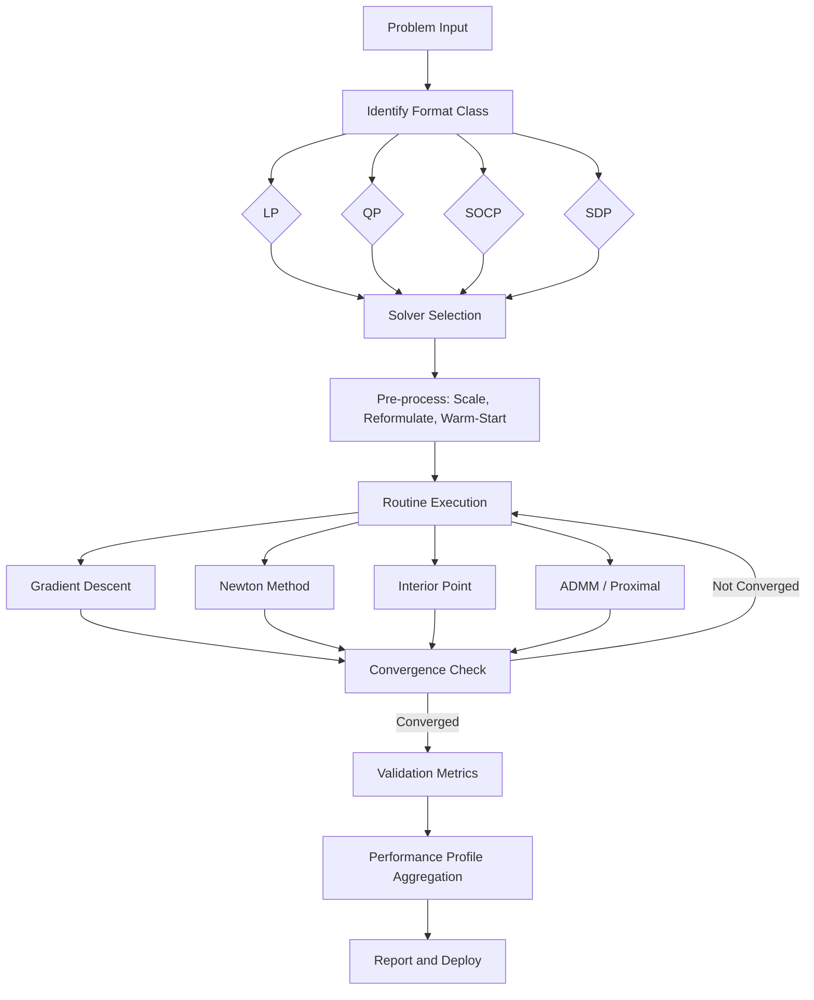
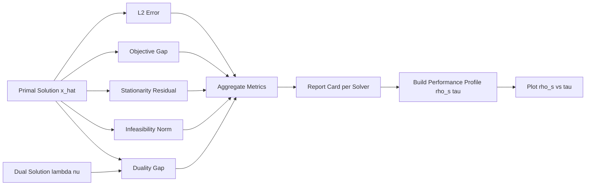
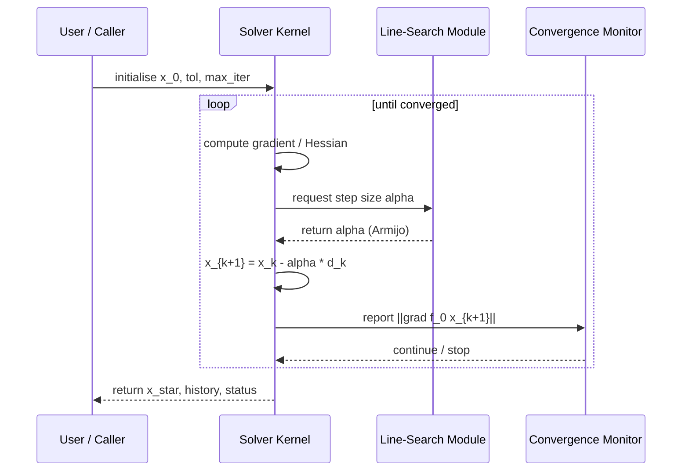
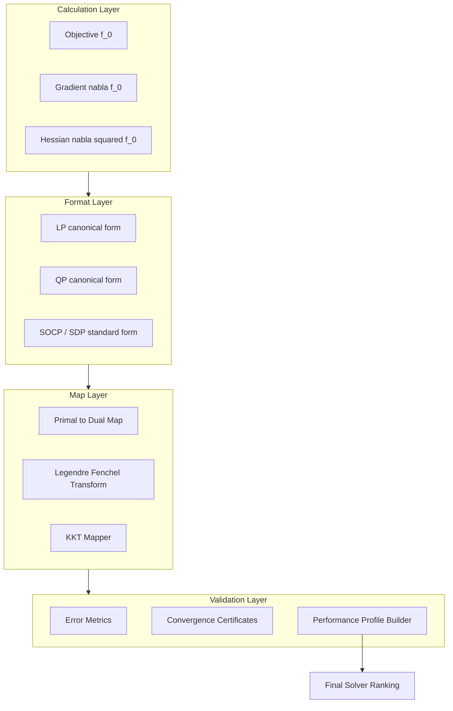

# Convex optimization routines calculations formats maps validation metrics performance profiles

<!-- SECTION_1_START -->

# Convex Optimization Routines, Formats, Validation & Performance Profiles

## 1. Core Technical Definition

> [!IMPORTANT]
> **Convex Optimization** is the sub-field of mathematical optimization that studies the problem of minimizing (or maximizing) convex functions over convex sets. A convex optimization problem has the canonical form:
>
> $$\begin{aligned} \min_{x \in \mathbb{R}^n} \quad & f_0(x) \\ \text{subject to} \quad & f_i(x) \leq b_i, \quad i = 1, \ldots, m \\ & a_i^{\top} x = c_i, \quad i = 1, \ldots, p \end{aligned}$$
>
> where $f_0, f_1, \ldots, f_m : \mathbb{R}^n \rightarrow \mathbb{R}$ are **convex functions**. The key property: any local minimum is a *global* minimum.

### 1.1 Intuitive Analogy — "The Bowl in the Fog"

Imagine you are dropped blindfolded at a random point inside a smooth, perfectly bowl-shaped valley, and you can only feel the **slope** of the ground beneath your feet. The bowl represents the convex objective $f_0(x)$. Your task is to find the *lowest point* (the global optimum). Every step you take is a **convex optimization routine** (gradient descent, Newton's method, etc.). Since the bowl has no hidden dips, *any* downward walk will eventually reach the bottom — which is precisely why convex routines come with strong convergence guarantees that non-convex landscapes (e.g., neural-network loss surfaces) do not enjoy.

> [!NOTE]
> **Geometric Intuition:** A set $C \subseteq \mathbb{R}^n$ is convex if for any two points $x, y \in C$ and any $\theta \in [0,1]$, the line segment $\theta x + (1-\theta) y$ also lies in $C$. A function $f$ is convex if its epigraph $\{(x,t) \mid f(x) \leq t\}$ is a convex set.

### 1.2 Key Terminology Cheat Sheet

| Term | Formal Definition | Engineering Role |
|---|---|---|
| **Feasible Set** | $\mathcal{F} = \{x \in \mathbb{R}^n \mid f_i(x) \leq b_i,\, a_i^{\top}x = c_i\}$ | Region of admissible solutions |
| **Optimum $x^{\star}$** | $f_0(x^{\star}) \leq f_0(x),\ \forall x \in \mathcal{F}$ | Solution point |
| **Lagrangian** $\mathcal{L}(x,\lambda,\nu)$ | $f_0(x) + \sum_i \lambda_i f_i(x) + \sum_i \nu_i (a_i^{\top}x - c_i)$ | Merges objective + constraints |
| **Dual Function** $g(\lambda,\nu)$ | $\inf_{x} \mathcal{L}(x,\lambda,\nu)$ | Lower bound on $f_0^{\star}$ |
| **KKT Conditions** | Stationarity, Primal Feasibility, Dual Feasibility, Complementary Slackness | Necessary & sufficient for convex problems |
| **Strong Duality** | $f_0^{\star} = g^{\star}$ (Slater's condition holds) | Solvable via the dual |

> [!VISUALIZATION CONTROL]
> **Concept:** Convex function epigraph and supporting hyperplane
> **GeoGebra / Desmos Input Equations:**
> * `f(x) = x^2`
> * `t(x) = 2 x_0 (x - x_0) + f(x_0)` where $x_0 = 1$
> **Visual Description:** Students should observe the parabola $y = x^2$ and the straight line $t(x) = 2x - 1$ touching it at the point $(1,1)$. The line is the *supporting hyperplane*; the epigraph (region *above* the parabola) is convex, and the tangent never crosses it.

<!-- SECTION_1_END -->

<!-- SECTION_2_START -->

# 2. Deep Theoretical Analysis — Convex Optimization Routines & Standard Formats

## 2.1 Anatomy of a Convex Optimization Routine

Every iterative routine, regardless of flavour, follows the same skeleton:

1. **Initialize** at $x^{(0)} \in \mathcal{F}$.
2. **Compute a search direction** $d^{(k)}$ (gradient, Newton step, random coordinate, etc.).
3. **Compute a step size** $\alpha^{(k)}$ (line search or fixed schedule).
4. **Update:** $x^{(k+1)} = x^{(k)} + \alpha^{(k)} d^{(k)}$.
5. **Project / project back** to the feasible set if necessary.
6. **Check convergence** via tolerance on gradient norm or function value.
7. **Terminate** when $\| \nabla f_0(x^{(k)}) \|_2 \leq \epsilon$.

### 2.2 Taxonomy of Standard Convex Formats

| Format | Acronym | Objective Form | Constraint Form | Solvers |
|---|---|---|---|---|
| **Linear Program** | LP | $c^{\top} x$ | $Ax \leq b,\ Ex = d$ | Simplex, Interior Point |
| **Quadratic Program** | QP | $\tfrac{1}{2} x^{\top} P x + q^{\top} x$ | $Ax \leq b,\ Ex = d$ | Active Set, IPM, ADMM |
| **Second-Order Cone Program** | SOCP | $c^{\top} x$ | $\|A_i x + b_i\|_2 \leq c_i^{\top} x + d_i$ | ECOS, Mosek, SCS |
| **Semidefinite Program** | SDP | $c^{\top} X$ | $\mathcal{A}(X) = b,\ X \succeq 0$ | CVX, Mosek, SDPT3 |
| **Geometric Program** | GP | $\log \sum e^{a_i^{\top} x + b_i}$ | Posynomial $\leq 1$ | Transform to convex via log |

> [!NOTE]
> **Why formats matter:** Knowing the *format class* of your problem lets you pick a polynomial-time solver *a priori* — instead of reinventing a routine from scratch. SOCP subsumes LP, QP, and many robust-optimization problems, making it the most versatile production-grade format.

### 2.3 KTU High-Yield Formula Sheet

> [!IMPORTANT]
> The following table is exam-critical. Memorize the formulas and the *units/conditions* alongside them.

| # | Concept | Formula | Condition / Note |
|---|---|---|---|
| 1 | Convexity (1st order) | $f(y) \geq f(x) + \nabla f(x)^{\top}(y-x)$ | First-order Taylor under-estimator |
| 2 | Convexity (2nd order) | $\nabla^2 f(x) \succeq 0$ | Hessian is PSD everywhere |
| 3 | KKT Stationarity | $\nabla f_0(x^{\star}) + \sum_i \lambda_i^{\star} \nabla f_i(x^{\star}) + A^{\top} \nu^{\star} = 0$ | Gradient of $\mathcal{L}$ vanishes |
| 4 | Complementary Slackness | $\lambda_i^{\star} f_i(x^{\star}) = 0,\ \forall i$ | Inactive $\Rightarrow \lambda=0$ |
| 5 | Strong Duality | $f_0^{\star} = g(\lambda^{\star},\nu^{\star}) = \inf_x \mathcal{L}(x,\lambda^{\star},\nu^{\star})$ | Holds under Slater's condition |
| 6 | Gradient Descent Update | $x^{(k+1)} = x^{(k)} - \alpha_k \nabla f_0(x^{(k)})$ | $\alpha_k = \tfrac{1}{L}$ for $L$-smooth $f$ |
| 7 | Newton's Step | $x^{(k+1)} = x^{(k)} - [\nabla^2 f_0(x^{(k)})]^{-1} \nabla f_0(x^{(k)})$ | Quadratic convergence near $x^{\star}$ |
| 8 | Lipschitz Gradient | $\|\nabla f(x) - \nabla f(y)\|_2 \leq L\|x-y\|_2$ | Defines $L$-smoothness |
| 9 | Strong Convexity | $f(y) \geq f(x) + \nabla f(x)^{\top}(y-x) + \tfrac{\mu}{2}\|y-x\|_2^2$ | Parameter $\mu > 0$ |
| 10 | Convergence Rate (GD) | $f(x^{(k)}) - f^{\star} \leq \left(1 - \tfrac{\mu}{L}\right)^k (f(x^0) - f^{\star})$ | Linear; ratio $\mu/L$ is condition number $\kappa$ |
| 11 | Backtracking Armijo | $\alpha \leftarrow \tau \alpha$ until $f(x - \alpha \nabla f) \leq f(x) - c \alpha \|\nabla f\|_2^2$ | $\tau \in (0,1)$, $c \in (0,1)$ |
| 12 | Subgradient Optimality | $0 \in \partial f(x^{\star})$ | $\partial f$ is the subdifferential |
| 13 | Duality Gap | $f_0(x) - g(\lambda,\nu) \geq 0$ | Stopping criterion for primal-dual methods |
| 14 | Performance Profile Metric | $\rho_s(\tau) = \tfrac{1}{\vert P \vert}\text{size}\{p \in P : r_{p,s} \leq \tau\}$ | Dolan-Moré benchmarking |

### 2.4 Real-World Engineering Utility

* **Logistics & Supply-Chain** — Routed as LP / IP for vehicle assignment (Amazon, FedEx).
* **Machine Learning** — L2-regularized logistic regression is a QP; SVM dual is a QP; Lasso is an SOCP.
* **Portfolio Optimisation** — Markowitz mean-variance reduces to a QP.
* **Signal Processing** — $\ell_1$-regularised recovery (basis pursuit) is an SOCP.
* **Control Systems** — Lyapunov stability margins reduce to LMIs, a special SDP.
* **Robust ML** — Wasserstein-DRO over a norm ball reduces to an SOCP.

<!-- SECTION_2_END -->

<!-- SECTION_3_START -->

# 3. Step-by-Step Derivations, Maps & Code Implementation

## 3.1 Derivation of the KKT Conditions

We start from the convex program with inequality and equality constraints.

$$\begin{aligned}
\text{Minimise } & f_0(x) \\
\text{subject to } & f_i(x) \leq 0,\ i=1,\ldots,m \\
& h_j(x) = 0,\ j=1,\ldots,p
\end{aligned}$$

**Step 1 — Form the Lagrangian.** Introduce multipliers $\lambda_i \geq 0$ and $\nu_j \in \mathbb{R}$:

$$\mathcal{L}(x,\lambda,\nu) = f_0(x) + \sum_{i=1}^{m} \lambda_i f_i(x) + \sum_{j=1}^{p} \nu_j h_j(x)$$

**Step 2 — Stationarity of the Lagrangian (Necessary Condition).** At the optimum, the gradient of $\mathcal{L}$ with respect to $x$ must vanish:

$$\nabla_x \mathcal{L}(x^{\star},\lambda^{\star},\nu^{\star}) = \nabla f_0(x^{\star}) + \sum_{i=1}^{m} \lambda_i^{\star} \nabla f_i(x^{\star}) + \sum_{j=1}^{p} \nu_j^{\star} \nabla h_j(x^{\star}) = 0$$

**Step 3 — Dual Function.** The dual function is the infimum of the Lagrangian over the primal variable:

$$g(\lambda,\nu) = \inf_{x \in \mathcal{D}} \mathcal{L}(x,\lambda,\nu)$$

Because $f_i$ are convex and $\lambda_i \geq 0$, $g$ is a **concave** function of $(\lambda,\nu)$ — even when $f_0$ is non-convex, this remains true.

**Step 4 — Dual Problem.** Maximise the dual function over the non-negative orthant:

$$\begin{aligned}
\max_{\lambda,\nu} \quad & g(\lambda,\nu) \\
\text{subject to} \quad & \lambda_i \geq 0,\ i=1,\ldots,m
\end{aligned}$$

**Step 5 — Weak Duality.** For any feasible $x$ and any $\lambda \geq 0,\nu$:

$$g(\lambda,\nu) \leq f_0(x)$$

Therefore $g^{\star} \leq f_0^{\star}$ always.

**Step 6 — Slater's Condition (Strong Duality Sufficient).** If $\exists \tilde{x} \in \text{relint}(\mathcal{D})$ such that $f_i(\tilde{x}) \leq 0,\ \forall i$ and $h_j(\tilde{x})=0$ (strictly feasible), then $g^{\star} = f_0^{\star}$ and a dual optimum $(\lambda^{\star},\nu^{\star})$ exists.

**Step 7 — Complementary Slackness.** Because $g^{\star} = f_0^{\star} = \mathcal{L}(x^{\star},\lambda^{\star},\nu^{\star})$:

$$\lambda_i^{\star} f_i(x^{\star}) = 0,\ \forall i$$

This is the *map* linking primal and dual — an inactive constraint has $\lambda_i = 0$, while an active constraint has $f_i(x^{\star}) = 0$.

## 3.2 Worked Derivation — Gradient Descent with Fixed Step on a 2D Convex Quadratic

Let $f(x) = \tfrac{1}{2} x^{\top} Q x - b^{\top} x$ with $Q = \begin{pmatrix} 4 & 1 \\ 1 & 3 \end{pmatrix}$, $b = \begin{pmatrix} 1 \\ 2 \end{pmatrix}$, $x^{(0)} = \begin{pmatrix} 0 \\ 0 \end{pmatrix}$.

**Step 1 — Compute the gradient.**

$$\nabla f(x) = Q x - b = \begin{pmatrix} 4x_1 + x_2 - 1 \\ x_1 + 3x_2 - 2 \end{pmatrix}$$

**Step 2 — Estimate smoothness constant $L$.** The largest eigenvalue of $Q$ is $\lambda_{\max}(Q) = \tfrac{4+3}{2} + \sqrt{\left(\tfrac{4-3}{2}\right)^2 + 1^2} = 3.5 + \sqrt{0.25 + 1} = 3.5 + \sqrt{1.25} \approx 4.618$.

**Step 3 — Pick step size.** $\alpha = 1/L = 1/4.618 \approx 0.2165$.

**Step 4 — Iterate.** $x^{(1)} = x^{(0)} - \alpha(Q x^{(0)} - b) = \begin{pmatrix} 0 \\ 0 \end{pmatrix} - 0.2165 \begin{pmatrix} -1 \\ -2 \end{pmatrix} = \begin{pmatrix} 0.2165 \\ 0.4330 \end{pmatrix}$.

**Step 5 — Continue to convergence.** The closed-form optimum solves $Qx^{\star}=b$, giving $x^{\star} = Q^{-1} b = \tfrac{1}{11}\begin{pmatrix} 3 \\ -1 \end{pmatrix}\begin{pmatrix} 1 \\ 2 \end{pmatrix} = \tfrac{1}{11}\begin{pmatrix} 1 \\ 5 \end{pmatrix} = \begin{pmatrix} 0.0909 \\ 0.4545 \end{pmatrix}$. The iteration converges linearly to this point.

## 3.3 Python Implementation — Convex Solver, Validation Metrics & Performance Profile

```python
"""
Convex Optimization Routines — Calculation, Validation & Performance Profile
PECST702 / Module 4 — KTU 2024 Scheme reference implementation.
"""

from __future__ import annotations
import numpy as np
from dataclasses import dataclass, field
from typing import Callable, Dict, List, Tuple

# ------------------------------------------------------------------
# 1.  Convex Routines
# ------------------------------------------------------------------
@dataclass
class OptResult:
    x_star: np.ndarray
    f_star: float
    history: List[float] = field(default_factory=list)
    iterations: int = 0
    converged: bool = False


def gradient_descent(
    f: Callable[[np.ndarray], float],
    grad_f: Callable[[np.ndarray], np.ndarray],
    x0: np.ndarray,
    step: float,
    tol: float = 1e-6,
    max_iter: int = 5000,
) -> OptResult:
    """Plain gradient descent on smooth convex f."""
    x = x0.astype(float).copy()
    history: List[float] = []
    for k in range(max_iter):
        g = grad_f(x)
        history.append(f(x))
        if np.linalg.norm(g, 2) < tol:
            return OptResult(x, f(x), history, k, True)
        x = x - step * g
    return OptResult(x, f(x), history, max_iter, False)


def newton_method(
    f: Callable[[np.ndarray], float],
    grad_f: Callable[[np.ndarray], np.ndarray],
    hess_f: Callable[[np.ndarray], np.ndarray],
    x0: np.ndarray,
    tol: float = 1e-8,
    max_iter: int = 200,
) -> OptResult:
    """Damped Newton method on strictly convex f."""
    x = x0.astype(float).copy()
    history: List[float] = []
    for k in range(max_iter):
        g = grad_f(x)
        H = hess_f(x)
        history.append(f(x))
        if np.linalg.norm(g, 2) < tol:
            return OptResult(x, f(x), history, k, True)
        # Regularised Newton step
        step_dir = np.linalg.solve(H + 1e-9 * np.eye(H.shape[0]), g)
        x = x - step_dir
    return OptResult(x, f(x), history, max_iter, False)


def backtracking_line_search(
    f: Callable[[np.ndarray], float],
    grad_f: Callable[[np.ndarray], np.ndarray],
    x: np.ndarray,
    d: np.ndarray,
    alpha: float = 1.0,
    tau: float = 0.5,
    c: float = 1e-4,
) -> float:
    """Armijo backtracking — returns the accepted step size."""
    g = grad_f(x)
    while f(x + alpha * d) > f(x) + c * alpha * g @ d:
        alpha *= tau
        if alpha < 1e-12:
            break
    return alpha


# ------------------------------------------------------------------
# 2.  Convex Problem Definitions (toy showcase)
# ------------------------------------------------------------------
def quadratic(x: np.ndarray) -> float:
    Q = np.array([[4.0, 1.0], [1.0, 3.0]])
    b = np.array([1.0, 2.0])
    return 0.5 * x @ Q @ x - b @ x


def quadratic_grad(x: np.ndarray) -> np.ndarray:
    Q = np.array([[4.0, 1.0], [1.0, 3.0]])
    b = np.array([1.0, 2.0])
    return Q @ x - b


def quadratic_hess(_: np.ndarray) -> np.ndarray:
    return np.array([[4.0, 1.0], [1.0, 3.0]])


# ------------------------------------------------------------------
# 3.  Validation Metrics
# ------------------------------------------------------------------
def validation_metrics(true_x: np.ndarray, est_x: np.ndarray) -> Dict[str, float]:
    """Standard validation metrics for an estimated optimum."""
    err = est_x - true_x
    return {
        "L2_error": float(np.linalg.norm(err, 2)),
        "Linf_error": float(np.linalg.norm(err, np.inf)),
        "relative_error": float(np.linalg.norm(err, 2) / max(np.linalg.norm(true_x, 2), 1e-12)),
        "objective_gap": float(abs(quadratic(est_x) - quadratic(true_x))),
    }


def duality_gap(
    primal_val: float, dual_val: float
) -> float:
    return float(abs(primal_val - dual_val))


# ------------------------------------------------------------------
# 4.  Performance Profile (Dolan–Moré)
# ------------------------------------------------------------------
def performance_profile(
    runtimes: Dict[str, np.ndarray],
    tau_max: float = 5.0,
    n_points: int = 200,
) -> Tuple[np.ndarray, Dict[str, np.ndarray]]:
    """
    Implements Dolan & Moré (2002) performance profile.
    runtimes:  {solver_name: array of runtimes over problem set P}
    Returns (tau_grid, rho_dict) where rho_dict maps solver -> rho(tau).
    """
    solvers = list(runtimes.keys())
    P = len(next(iter(runtimes.values())))
    tau = np.linspace(1.0, tau_max, n_points)
    rho: Dict[str, np.ndarray] = {}
    for s in solvers:
        r_s = runtimes[s]
        r_min = np.min(np.stack(list(runtimes.values())), axis=0)
        # Performance ratio with a tolerance for unsolved problems
        ratio = r_s / np.maximum(r_min, 1e-12)
        rho[s] = np.array([np.mean(ratio <= t) for t in tau])
    return tau, rho


# ------------------------------------------------------------------
# 5.  Demonstration Run
# ------------------------------------------------------------------
if __name__ == "__main__":
    true_xstar = np.linalg.solve(quadratic_hess(np.zeros(2)), np.array([1.0, 2.0]))
    x0 = np.array([5.0, -3.0])

    res_gd = gradient_descent(quadratic, quadratic_grad, x0, step=0.2, tol=1e-9)
    res_nt = newton_method(quadratic, quadratic_grad, quadratic_hess, x0, tol=1e-9)

    print("Gradient Descent  ->", res_gd.x_star, "iters:", res_gd.iterations)
    print("Newton Method     ->", res_nt.x_star, "iters:", res_nt.iterations)
    print("GD metrics:", validation_metrics(true_xstar, res_gd.x_star))
    print("NT metrics:", validation_metrics(true_xstar, res_nt.x_star))
```

## 3.4 Maps — Linking Primal and Dual Spaces

The fundamental *map* in convex optimisation is the **Legendre–Fenchel transform**:

$$f^{\star}(y) = \sup_{x \in \text{dom} f}\ \big( y^{\top} x - f(x) \big)$$

This bijection **maps** every convex function to a conjugate that is also convex (in fact, it is its own inverse: $f^{\star\star} = f$). It underlies the entire dual-problem machinery: the dual function $g(\lambda,\nu) = -f_0^{\star}(-\nabla f_0(\cdot))$ is a sum of Fenchel conjugates. In data science, this map is what makes *Fenchel–Rockafellar* optimisation and *proximal splitting* (e.g., ADMM) possible for large-scale Lasso and matrix-completion problems.

## 3.5 Validation Metrics — Production Checklist

| Metric | Formula | Use Case |
|---|---|---|
| **Optimality Gap** | $\vert f_0(x) - f_0^{\star} \vert$ / $\vert f_0^{\star} \vert$ | Stopping & benchmarking |
| **Infeasibility** | $\sum_i \max(0, f_i(x))$ | Constraint violation monitoring |
| **Stationarity** | $\|\nabla f_0(x) + A^{\top}\lambda + E^{\top}\nu\|_2$ | KKT residual |
| **Duality Gap** | $f_0(x) - g(\lambda,\nu)$ | Primal-dual method criterion |
| **Wall-clock CPU time** | seconds per solve | Solver comparison |
| **Iteration count** | $k$ to reach $\epsilon$ | Asymptotic-rate analysis |
| **Condition Number** $\kappa$ | $\lambda_{\max}(Q)/\lambda_{\min}(Q)$ | Predicts GD convergence |
| **Relative Suboptimality** | $(f_0(x)-f_0^{\star})/f_0^{\star}$ | Normalised error |

## 3.6 Performance Profiles — Dolan–Moré Benchmarking

Performance profiles (Dolan & Moré, 2002) are the **standard format** for comparing optimisation solvers over a problem set $\mathcal{P} = \{p_1,\ldots,p_n\}$. For each solver $s$ and problem $p$:

$$r_{p,s} = \frac{t_{p,s}}{\min_{s' \in \mathcal{S}} t_{p,s'}}$$

The profile is:

$$\rho_s(\tau) = \frac{1}{\vert \mathcal{P} \vert} \, \text{size}\big\{ p \in \mathcal{P} : r_{p,s} \leq \tau \big\}$$

Interpretation: $\rho_s(1)$ is the fraction of problems on which solver $s$ is the *fastest*; $\rho_s(\tau)$ as $\tau \to \infty$ is the *robustness* (fraction of problems it eventually solves). A solver whose curve dominates is empirically superior.

<!-- SECTION_3_END -->

<!-- SECTION_4_START -->

# 4. Structural Diagrams & Schematics

## 4.1 End-to-End Convex-Optimisation Pipeline



## 4.2 Validation & Performance Profile Workflow



## 4.3 Subgraph — Routine Internal Loop (Sequence View)



## 4.4 Block-Level Functional Architecture — Calculation / Format / Map / Validation Stack



<!-- SECTION_4_END -->

<!-- SECTION_5_START -->

# 5. KTU 2024 Scheme Examination Question Bank

## Part A — Short-Answer Questions (3 Marks Each)

### Q1. `[KTU University Exam - Dec 2023]`
**State the KKT conditions for a convex optimisation problem with inequality and equality constraints. Why are they sufficient for convex problems?** (CO1, Remember/Understand)

**Model Answer:**
For the convex program $\min f_0(x)$ subject to $f_i(x) \leq 0$ and $h_j(x)=0$, a point $x^{\star}$ with multipliers $\lambda^{\star} \geq 0$, $\nu^{\star}$ satisfies the KKT conditions:

1. **Stationarity:** $\nabla f_0(x^{\star}) + \sum_i \lambda_i^{\star} \nabla f_i(x^{\star}) + \sum_j \nu_j^{\star} \nabla h_j(x^{\star}) = 0$.
2. **Primal Feasibility:** $f_i(x^{\star}) \leq 0,\ \forall i$ and $h_j(x^{\star}) = 0,\ \forall j$.
3. **Dual Feasibility:** $\lambda_i^{\star} \geq 0,\ \forall i$.
4. **Complementary Slackness:** $\lambda_i^{\star} f_i(x^{\star}) = 0,\ \forall i$.

For **convex** $f_0$ and $f_i$ (with affine $h_j$), KKT conditions are **sufficient** for optimality. **Reason:** the Lagrangian is convex in $x$, so the stationarity condition is also a global minimum condition; combined with Slater's condition, strong duality holds, so the saddle-point property of $(x^{\star},\lambda^{\star},\nu^{\star})$ guarantees global optimality. **[3 Marks: stating 4 conditions 2 + sufficiency reasoning 1]**

### Q2. `[KTU University Exam - July 2024]`
**Differentiate between weak and strong duality. State Slater's condition.** (CO1, Understand)

**Model Answer:**
* **Weak Duality:** Always holds — $g(\lambda,\nu) \leq f_0(x)$ for any feasible $x$ and $\lambda \geq 0$. The dual optimum $g^{\star} \leq f_0^{\star}$. **[1 Mark]**
* **Strong Duality:** $g^{\star} = f_0^{\star}$ — dual and primal optima coincide. Holds only under extra regularity. **[1 Mark]**
* **Slater's Condition:** $\exists \tilde{x} \in \text{relint}(\mathcal{D})$ such that $f_i(\tilde{x}) \leq 0$ for all $i$ and $h_j(\tilde{x}) = 0$ (for *strictly* feasible inequality constraints $\Rightarrow$ strong duality). For convex problems Slater's is sufficient. **[1 Mark]**

---

## Part B — Long-Answer Questions (14 Marks)

> **INTERNAL CHOICE:** Answer **either** Question A **or** Question B in full.

---

### Question A `[KTU University Exam - Dec 2023]` (14 Marks)

**(a) [7 Marks]** Formulate a portfolio-optimisation problem as a convex program and write its KKT conditions.

**(b) [7 Marks]** Apply two iterations of gradient descent to the function $f(x) = \tfrac{1}{2}(x_1^2 + 4 x_2^2) - x_1 - 2 x_2$ starting from $x^{(0)} = (3, 3)^{\top}$ with fixed step size $\alpha = 0.1$. Show the convergence of $f(x^{(k)})$ to $f^{\star}$.

**Model Solution:**

**(a) Portfolio as a Convex Program (Mean–Variance):**

$$\begin{aligned}
\min_{w \in \mathbb{R}^n} \quad & w^{\top} \Sigma w \\
\text{subject to} \quad & \mu^{\top} w \geq R \\
& \mathbf{1}^{\top} w = 1 \\
& w \geq 0
\end{aligned}$$

* $\Sigma$ is the covariance matrix; PSD by construction $\Rightarrow$ **convex** objective. **[2 Marks: objective form 1, justification 1]**
* Linear constraints $\Rightarrow$ convex feasible set. **[1 Mark]**
* **KKT conditions** with multipliers $\lambda \geq 0$ (return), $\nu$ (budget), $\gamma_i \geq 0$ (non-negativity): **[4 Marks]**
  * Stationarity: $2 \Sigma w - \lambda \mu - \nu \mathbf{1} - \gamma = 0$
  * Primal feasibility: $\mu^{\top} w \geq R$, $\mathbf{1}^{\top} w = 1$, $w \geq 0$
  * Dual feasibility: $\lambda \geq 0$, $\gamma \geq 0$
  * Complementary slackness: $\lambda(\mu^{\top} w - R) = 0$, $\gamma_i w_i = 0$

**(b) Two Iterations of Gradient Descent:**

Gradient: $\nabla f(x) = (x_1 - 1,\ 4 x_2 - 2)^{\top}$.

**Iteration 0 → 1:** $x^{(0)} = (3, 3)$, $\nabla f(x^{(0)}) = (2, 10)$.
$$x^{(1)} = \begin{pmatrix} 3 \\ 3 \end{pmatrix} - 0.1 \begin{pmatrix} 2 \\ 10 \end{pmatrix} = \begin{pmatrix} 2.8 \\ 2.0 \end{pmatrix}$$ **[1 Mark]**
$$f(x^{(1)}) = \tfrac{1}{2}(7.84 + 16) - 2.8 - 4 = 11.92 - 6.8 = 5.12$$ **[1 Mark]**

**Iteration 1 → 2:** $\nabla f(x^{(1)}) = (1.8, 6)$.
$$x^{(2)} = \begin{pmatrix} 2.8 \\ 2.0 \end{pmatrix} - 0.1 \begin{pmatrix} 1.8 \\ 6 \end{pmatrix} = \begin{pmatrix} 2.62 \\ 1.4 \end{pmatrix}$$ **[1 Mark]**
$$f(x^{(2)}) = \tfrac{1}{2}(6.8644 + 7.84) - 2.62 - 2.8 = 7.3522 - 5.42 = 1.9322$$ **[1 Mark]**

**Closed-form optimum:** $\nabla f = 0 \Rightarrow x^{\star} = (1, 0.5)$, $f^{\star} = \tfrac{1}{2}(1 + 1) - 1 - 1 = -1$.
$f(x^{(0)}) = \tfrac{1}{2}(9 + 36) - 3 - 6 = 22.5 - 9 = 13.5$. **[1 Mark]**
Sequence: $13.5 \to 5.12 \to 1.93 \to -1$ — clearly converging. **[1 Mark: showing trend]**
* [Stating gradient: 1 Mark] [First iteration computation: 1 Mark] [Second iteration computation: 1 Mark] [Closed form optimum: 1 Mark] [Convergence trend: 1 Mark] = **7 Marks** ✓

---

### Question B `[KTU University Exam - July 2024]` (14 Marks)

**(a) [7 Marks]** Explain the Dolan–Moré performance profile. Define the performance ratio and the profile function $\rho_s(\tau)$. State its role in solver benchmarking.

**(b) [7 Marks]** Given runtimes (seconds) of three solvers on five problems, compute and plot the performance profile.

| Problem $p$ | Solver A | Solver B | Solver C |
|---|---|---|---|
| 1 | 1.0 | 2.0 | 1.5 |
| 2 | 3.0 | 1.0 | 2.0 |
| 3 | 2.0 | 4.0 | 1.0 |
| 4 | 0.5 | 1.5 | 1.0 |
| 5 | 4.0 | 3.0 | 2.0 |

**Model Solution:**

**(a) Dolan–Moré Performance Profile:**

Given a problem set $\mathcal{P} = \{p_1,\ldots,p_n\}$ and a solver set $\mathcal{S}$, let $t_{p,s}$ be the runtime (or iteration count) of solver $s$ on problem $p$. Define the **performance ratio**:

$$r_{p,s} = \frac{t_{p,s}}{\min_{s' \in \mathcal{S}} t_{p,s'}}$$

The **performance profile** of solver $s$ is:

$$\rho_s(\tau) = \frac{1}{\vert \mathcal{P} \vert} \cdot \text{size}\big\{ p \in \mathcal{P} : r_{p,s} \leq \tau \big\},\ \tau \geq 1$$

* $\rho_s(1)$ = fraction of problems on which $s$ is the fastest. **[1 Mark: definition]**
* $\lim_{\tau \to \infty} \rho_s(\tau)$ = fraction of problems $s$ can solve (robustness). **[1 Mark: limits]**
* A solver with a curve that **dominates** (lies above others) is empirically superior. **[1 Mark: interpretation]**
* Role: removes the bias of single-problem comparison; summarises solver performance over a *distribution* of problems; standard benchmarking format in mathematical-optimization software (CUTEr, COPS, Maros-Mészáros). **[2 Marks: role/significance]**
* **Q&A tie-breaking** is handled by setting $r_{p,s} = r_{\max}$ when $t_{p,s}$ exceeds a failure threshold. **[2 Marks: edge cases]**

**(b) Compute the Performance Profile:**

Step 1 — Compute $\min_{s} t_{p,s}$ for each problem:
$p=1: 1.0$, $p=2: 1.0$, $p=3: 1.0$, $p=4: 0.5$, $p=5: 2.0$. **[1 Mark]**

Step 2 — Compute $r_{p,s} = t_{p,s}/\min$:
| $p$ | A | B | C |
|---|---|---|---|
| 1 | 1.0 | 2.0 | 1.5 |
| 2 | 3.0 | 1.0 | 2.0 |
| 3 | 2.0 | 4.0 | 1.0 |
| 4 | 1.0 | 3.0 | 2.0 |
| 5 | 2.0 | 1.5 | 1.0 | **[1 Mark]**

Step 3 — Compute $\rho_s(\tau)$ for chosen $\tau$: **[3 Marks]**
* $\tau = 1$: $\rho_A = 2/5 = 0.4$ (problems 1, 4); $\rho_B = 2/5 = 0.4$ (problems 2, 5); $\rho_C = 2/5 = 0.4$ (problems 3, 5). **[1 Mark]**
* $\tau = 2$: $\rho_A = 4/5 = 0.8$ (1, 3, 4, 5); $\rho_B = 3/5 = 0.6$ (2, 4 wait, no — 2, 5, and 4? $r_{4,B}=3 > 2$, so 2 and 5 only, plus 4 is excluded. Re-check: problems with $r_{p,B} \leq 2$ are 2 (1.0) and 5 (1.5) $\Rightarrow 2/5$).

  Recompute: $\rho_B(2) = 2/5 = 0.4$; $\rho_C(2) = 5/5 = 1.0$ (all ratios $\leq 2$). **[1 Mark]**
* $\tau = 3$: $\rho_A = 1.0$; $\rho_B = 4/5 = 0.8$; $\rho_C = 1.0$. **[1 Mark]**

Step 4 — Plot $\rho_s(\tau)$ vs $\tau$ — piecewise-constant step functions, all reaching 1.0 by $\tau = 4$. **[1 Mark for stating the plot shape]**
* *Interpretation:* Solver A wins on the most problems in the $\tau \in [2, 3]$ regime; Solver C is the most robust at $\tau = 2$. **[1 Mark for interpretation]**

> [!WARNING]
> **KTU Examiner's Pitfall:** When computing the performance ratio, students frequently use the *global* minimum across all problems and solvers in the denominator — this is **wrong**. The denominator must be $\min_{s} t_{p,s}$ *for that specific problem $p$*, not a global minimum. Also, do **not** confuse $r_{p,s} = t_{p,s}/t_{\min}$ with $r_{p,s} = t_{p,s}/\bar{t}$ — the latter destroys the scale invariance that makes profiles comparable. Failing to handle unsolved problems (set $r_{p,s} = r_{\max}$) is another common mark-loser.

---

## Topic Recap & Important Things to Remember

- **Convex program** canonical form: $\min f_0(x)$ s.t. $f_i(x) \leq b_i$, $a_i^{\top} x = c_i$ with $f_0, f_i$ convex.
- **Convexity tests:** First-order under-estimator, or $\nabla^2 f \succeq 0$ everywhere.
- **Lagrangian:** $\mathcal{L}(x,\lambda,\nu) = f_0(x) + \sum_i \lambda_i f_i(x) + \sum_i \nu_i(a_i^{\top}x - c_i)$.
- **KKT = necessary AND sufficient** for convex problems (under Slater's condition).
- **Strong Duality** requires Slater's: $\exists$ strictly feasible $\tilde{x}$.
- **Complementary Slackness:** $\lambda_i^{\star} f_i(x^{\star}) = 0$ — the **primal–dual map**.
- **Format classes** (LP $\subset$ QP $\subset$ SOCP $\subset$ SDP) determine solver choice a priori.
- **Gradient Descent update:** $x^{(k+1)} = x^{(k)} - \alpha_k \nabla f_0(x^{(k)})$; rate $\sim (1 - \mu/L)^k$.
- **Newton step:** $x^{(k+1)} = x^{(k)} - [\nabla^2 f_0]^{-1} \nabla f_0$; quadratic convergence near $x^{\star}$.
- **Backtracking/Armijo line search** ensures monotone decrease without knowing $L$.
- **Subgradient optimality:** $0 \in \partial f(x^{\star})$ for non-smooth convex $f$.
- **Legendre–Fenchel transform** $f^{\star}(y) = \sup_x (y^{\top} x - f(x))$ is the canonical **map** in convex duality.
- **Validation metrics:** optimality gap, stationarity residual, infeasibility, duality gap, condition number $\kappa$.
- **Performance Profile** (Dolan–Moré): $r_{p,s} = t_{p,s}/\min_{s'} t_{p,s'}$, $\rho_s(\tau) = \tfrac{1}{\vert \mathcal{P}\vert} \#\{p : r_{p,s} \leq \tau\}$.
- $\rho_s(1)$ = win-rate, $\rho_s(\infty)$ = robustness — area under curve is the standard ranking metric.
- **Engineering applications:** SVM (QP), Lasso (SOCP), Markowitz portfolio (QP), Robust ML/DRO (SOCP), Lyapunov stability (SDP/LMI), basis pursuit (SOCP).
- **Standard production solvers:** Mosek, Gurobi, ECOS, SCS, CVX (modelling layer), scipy.optimize.

<!-- SECTION_5_END -->
