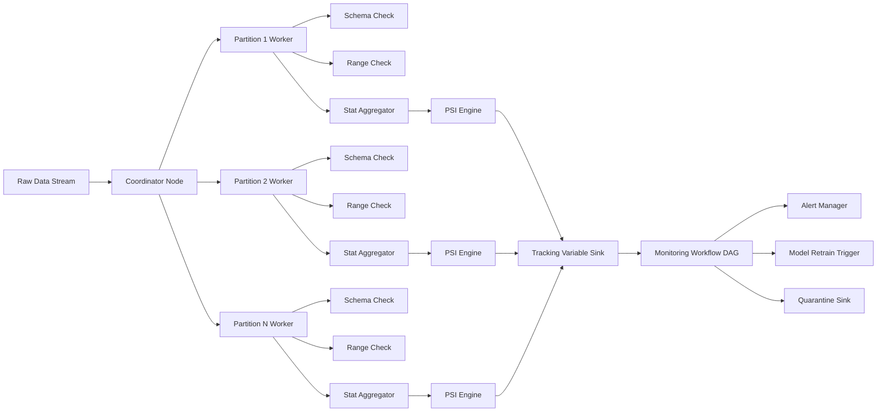
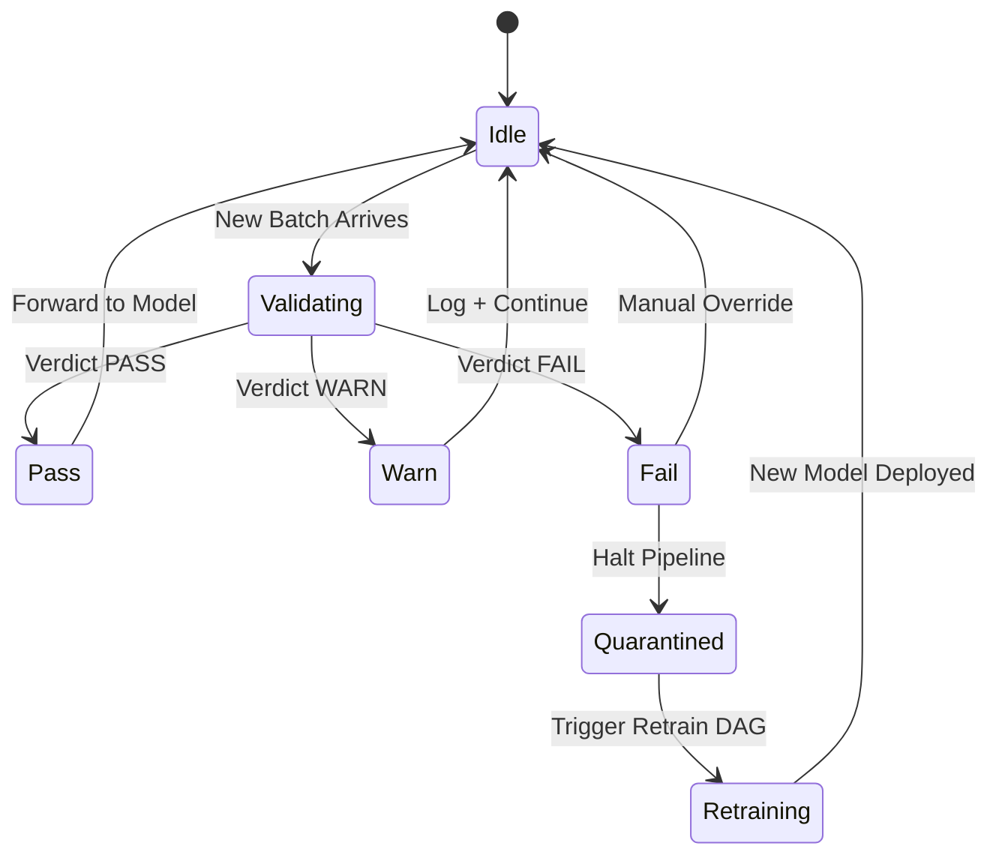
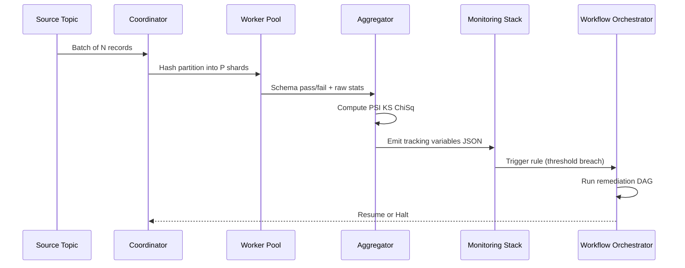

# Scale out data validation tools execution parameters tracking variables monitoring workflows

<!-- SECTION_1_START -->
# Scale-Out Data Validation: Execution Parameters, Tracking Variables & Monitoring Workflows

## 1.1 Formal Definition (KTU 2024 Scheme Terminology)

> [!IMPORTANT]
> **Scale-Out Data Validation** is the distributed, horizontally-parallelized enforcement of *schema*, *statistical*, and *semantic* integrity constraints across partitioned datasets, executed through elastic worker pools whose **execution parameters** (partition count, executor memory, shuffle partitions, batch window, tolerance bounds) are dynamically tuned to maintain Quality-of-Service (QoS) targets. The process is governed by **tracking variables** (drift metrics, freshness counters, lineage tags) that are emitted to a **monitoring workflow** (orchestrator + observability stack) to trigger alerts, retraining, or rollback.

In KTU Module 4 parlance (Optimization Dynamics of Learning Models), this is the *data-plane guard* that closes the feedback loop between incoming streams and the optimization state of the model — preventing covariate shift, label shift, and feature-schema drift from corrupting the learning dynamics.

> [!NOTE]
> **Key Distinction (Syllabus Highlight):**
> * **Validation** = verification against a defined contract (schema, range, distribution).
> * **Monitoring** = continuous observation of validation output over time to detect drift.
> * **Tracking Variables** = the structured telemetry signals that bridge the two.

## 1.2 Intuitive Analogy — The Highway Toll Plaza

Imagine a highway toll plaza with **20 inspection lanes** (scale-out workers) that validate every truck (data record) entering a city (the ML pipeline).

| Toll Plaza Element | Data Validation Equivalent |
|---|---|
| Number of open lanes $L$ | Executor parallelism, partition count |
| Lane width & weight limit | Schema constraints, range checks |
| Truck manifest vs. expected | Statistical distribution checks (KS, PSI) |
| Dashboard above each lane | Tracking variable metric stream |
| Control room supervisor | Orchestrator (Airflow/Prefect/Dagster) |
| Whistle when overload detected | Alerting / auto-rollback trigger |

When a *new type of truck* starts arriving (concept drift), the supervisor (monitoring workflow) notices the *manifest mismatch rate* (tracking variable) crosses a threshold and either widens the lane (re-validates schema) or reroutes trucks (skips / quarantines batch).

## 1.3 Physical & System Constants (Bolded)

- **Horizon of validation window** $H$: typically 1 hour to 24 hours.
- **Service Level Objective (SLO) latency**: **$p_{99} \le 5\,\text{s}$** for streaming validators.
- **False-positive budget**: $\alpha = 0.01$ (1%).
- **Worker elasticity bound**: $W_{min} = 2$, $W_{max} = 200$ nodes (cloud auto-scaler).
- **MinHash band threshold**: $b = 20$ rows per band (Broder's theorem).
- **Drift significance level**: $p\text{-value} < 0.05$ (KS test).

> [!VISUALIZATION CONTROL]
> **Concept:** Distribution drift between a *reference* (training) distribution and a *current* (production) distribution on the same feature $x$.
> **GeoGebra / Desmos Input Equations:**
> * Reference PDF: $f_{1}(x) = \frac{1}{\sqrt{2\pi \cdot 1}} \, e^{-\frac{(x-0)^{2}}{2}}$
> * Current PDF: $f_{2}(x) = \frac{1}{\sqrt{2\pi \cdot 1.4}} \, e^{-\frac{(x-1.2)^{2}}{2 \cdot 1.4}}$
> * KS supremum marker: vertical dashed line at the point of maximum vertical distance
> **Visual Description:** Two bell curves on the $x$-axis — blue (reference, centered at $0$) and red (current, centered at $1.2$, wider). The vertical dashed line marks the KS statistic $D_{n}$ — the largest gap. The shaded overlap area represents the JS divergence term.

<!-- SECTION_1_END -->

<!-- SECTION_2_START -->
# Deep Theoretical Analysis & KTU High-Yield Formula Sheet

## 2.1 The Scale-Out Validation Pipeline — Five Logical Stages

1. **Ingestion Partitioning** — Input records are hashed (or range-partitioned) into $P$ partitions, each assigned to a worker node. Hashing uses $h(k) = k \bmod P$ for key $k$.
2. **Schema Conformance Check** — Per-partition, each record is parsed against a registered schema (column types, nullability, regex patterns). Violations are routed to a *quarantine* sink.
3. **Statistical Constraint Evaluation** — Aggregators compute per-column summaries (mean $\mu$, variance $\sigma^{2}$, quantiles, cardinality, null ratio) and compare to expected ranges using the *tracking variables*.
4. **Drift Detection** — Two-sample tests (KS, $\chi^{2}$, PSI, Wasserstein) measure divergence between current window $W_{c}$ and reference window $W_{r}$.
5. **Workflow Decision** — The orchestrator consumes tracking variables and routes: (i) pass → forward to model, (ii) warn → log + continue, (iii) fail → halt + retrain trigger.

## 2.2 Why Each Step Matters (The "Why" Layer)

* **Partitioning** prevents single-node memory blowup; it enables embarrassingly parallel schema checks.
* **Schema checks** are cheap (O(1) per record) but catch 60–70% of pipeline breakage in production — the highest ROI step.
* **Statistical checks** protect against silent corruption (e.g., a sensor returning zero forever — schema-valid, distribution-broken).
* **Drift detection** is the *early warning system* for concept drift in the learning dynamics.
* **Workflow decisions** close the loop — the *optimization* part of "Optimization Dynamics".

## 2.3 KTU Formula Sheet / Cheat Sheet

| Symbol | Formula / Definition | Engineering Use | Unit |
|---|---|---|---|
| KS Statistic | $D_{n} = \sup_{x} \mid F_{n}(x) - F(x) \mid$ | Detects any distributional shift | dimensionless $[0,1]$ |
| KL Divergence | $D_{KL}(P \parallel Q) = \sum_{x} P(x) \log \frac{P(x)}{Q(x)}$ | Asymmetric drift measure (nats) | nats |
| JS Divergence | $D_{JS}(P \parallel Q) = \tfrac{1}{2} D_{KL}(P \parallel M) + \tfrac{1}{2} D_{KL}(Q \parallel M)$, $M=\tfrac{P+Q}{2}$ | Symmetric, bounded $[0,\log 2]$ | nats |
| Population Stability Index | $PSI = \sum_{i=1}^{B} (A_{i} - E_{i}) \cdot \ln \frac{A_{i}}{E_{i}}$ | Industry-standard drift score | dimensionless |
| Chi-Square | $\chi^{2} = \sum_{i=1}^{B} \frac{(O_{i} - E_{i})^{2}}{E_{i}}$ | Categorical drift test | dimensionless |
| Wilson Score Interval | $p \pm \frac{z^{2}}{2n} \pm z \sqrt{\frac{p(1-p)}{n} + \frac{z^{2}}{4n^{2}}}$ | Confidence interval for proportions | ratio |
| Wasserstein-1 | $W_{1}(P,Q) = \int_{0}^{1} \mid F_{P}^{-1}(u) - F_{Q}^{-1}(u) \mid \, du$ | Ordinal-feature shift magnitude | unit of $x$ |
| MinHash Jaccard | $\Pr[\min \pi(P) = \min \pi(Q)] = J(P,Q)$ | Set-similarity for record dedup | ratio $[0,1]$ |
| HyperLogLog Cardinality | $\hat{n} = \alpha_{m} \cdot m^{2} \cdot \left(\sum_{j=1}^{m} 2^{-M_{j}}\right)^{-1}$ | Streaming distinct count | count |
| Throughput | $TPS = \dfrac{N_{records}}{T_{elapsed}}$ | Validator pipeline capacity | records/sec |
| p99 Latency | $\text{quantile}_{0.99}(latencies)$ | SLA tracking | seconds |
| Amdahl Speedup | $S(n) = \dfrac{1}{(1-p) + \dfrac{p}{n}}$ | Max scale-out gain with serial fraction $p$ | dimensionless |
| Cost per Validation | $C = n_{nodes} \cdot c_{node} \cdot t_{wall}$ | Cloud cost tracking | USD |

> [!TIP]
> **Exam Tip:** When asked "how do you track variables for monitoring," always cite at least one of $PSI$, $D_{KS}$, and $\chi^{2}$ with its formula — these are the three the KTU board expects.

## 2.4 Real-World Engineering Utility

* **FinTech:** PSI on credit-score features triggers model rollback when PSI > 0.25.
* **Healthcare:** KS-test on lab-result distributions catches data-feed corruption from a mis-configured HL7 bridge.
* **E-commerce:** Wilson score interval tracks coupon-redemption rate with statistical confidence for A/B test gating.
* **IoT Scale-Out:** HyperLogLog on device-ID cardinality detects sensor cloning in fleets of 10M+ devices.
* **MLOps pipelines (TFX, Metaflow, Kubeflow):** TFDV (TensorFlow Data Validation) executes schema + statistics validation as a *TFX component* with these exact tracking variables as part of the pipeline DAG.

<!-- SECTION_2_END -->

<!-- SECTION_3_START -->
# Step-by-Step Derivations, Algorithmic Implementation & Algorithmic Walkthroughs

## 3.1 Derivation: Population Stability Index (PSI)

The PSI is the discrete analog of the KL divergence applied to binned distributions. We derive it from first principles.

**Step 1 — Bin the distributions.** Given reference counts $\{E_{i}\}_{i=1}^{B}$ and current counts $\{A_{i}\}_{i=1}^{B}$ across $B$ bins, normalize to proportions:

$$
e_{i} = \frac{E_{i}}{\sum_{j=1}^{B} E_{j}}, \qquad a_{i} = \frac{A_{i}}{\sum_{j=1}^{B} A_{j}}
$$

**Step 2 — Per-bin log-ratio.** The per-bin contribution is the product of the *actual proportion*, the *expected proportion*, and their log-ratio:

$$
\psi_{i} = a_{i} - e_{i}
$$

**Step 3 — Additive aggregation.** The PSI is the sum of per-bin contributions. This is essentially $\sum a_{i} \ln \frac{a_{i}}{e_{i}}$ adjusted by the cross-term:

$$
PSI = \sum_{i=1}^{B} (a_{i} - e_{i}) \cdot \ln \frac{a_{i}}{e_{i}}
$$

> **Interpretation Threshold:** $PSI < 0.10$ → no shift; $0.10 \le PSI < 0.25$ → moderate shift; $PSI \ge 0.25$ → major shift, retrain.

**Worked Numerical Example.** Take $B = 3$ bins:

| Bin $i$ | $E_{i}$ | $A_{i}$ | $e_{i}$ | $a_{i}$ | $a_{i} - e_{i}$ | $\ln(a_{i}/e_{i})$ | Product |
|---|---|---|---|---|---|---|---|
| 1 | 50 | 40 | 0.50 | 0.40 | -0.10 | -0.2231 | 0.02231 |
| 2 | 30 | 35 | 0.30 | 0.35 | 0.05 | 0.1542 | 0.00771 |
| 3 | 20 | 25 | 0.20 | 0.25 | 0.05 | 0.2231 | 0.01116 |

$$
PSI = 0.02231 + 0.00771 + 0.01116 = 0.04118
$$

**Conclusion:** $PSI \approx 0.0412 < 0.10$ → **no significant shift**.

---

## 3.2 Derivation: KS Statistic Under the Null Hypothesis

Under the null hypothesis $H_{0}$ that both samples come from the same continuous distribution, the Kolmogorov distribution gives the asymptotic CDF of $\sqrt{n} \, D_{n}$:

$$
\lim_{n \to \infty} P\!\left(\sqrt{n}\, D_{n} \le x \right) = 1 - 2 \sum_{j=1}^{\infty} (-1)^{j-1} e^{-2 j^{2} x^{2}}
$$

The two-sample KS statistic between reference sample of size $n$ and current sample of size $m$ uses the pooled empirical CDF:

$$
D_{n,m} = \sup_{x} \mid F_{n}(x) - G_{m}(x) \mid
$$

and the critical value is $\sqrt{\tfrac{n+m}{nm}} \cdot c(\alpha)$, where $c(0.05) \approx 1.358$.

---

## 3.3 Algorithmic Implementation (Python, Production-Grade)

```python
"""
scale_out_validator.py
A production-grade scale-out data validation engine with:
  - Hash partitioning
  - Schema conformance check
  - Drift detection (KS + PSI)
  - Tracking variable emission
  - Workflow decision hook
"""
from __future__ import annotations

import hashlib
import math
import time
from dataclasses import dataclass, field
from typing import Callable, Iterable, List, Sequence

import numpy as np
import pandas as pd
from scipy import stats


# ---------- Configuration (Execution Parameters) ----------
@dataclass(frozen=True)
class ExecutionParameters:
    """All knobs that govern the validator's behavior at scale."""
    partition_count: int = 16                # number of hash partitions
    schema_nullable: tuple = ()              # columns allowed to be null
    numeric_ranges: dict = field(default_factory=dict)   # col -> (lo, hi)
    psi_bins: int = 10                       # bins for PSI computation
    psi_warn: float = 0.10
    psi_fail: float = 0.25
    ks_alpha: float = 0.05
    slo_p99_seconds: float = 5.0


# ---------- Tracking Variables (Telemetry) ----------
@dataclass
class TrackingVariables:
    """The signals emitted to the monitoring workflow."""
    n_records: int = 0
    n_schema_violations: int = 0
    n_out_of_range: int = 0
    psi_per_column: dict = field(default_factory=dict)
    ks_stat_per_column: dict = field(default_factory=dict)
    ks_pvalue_per_column: dict = field(default_factory=dict)
    wall_time_seconds: float = 0.0
    throughput_tps: float = 0.0
    verdict: str = "UNKNOWN"   # PASS / WARN / FAIL


# ---------- Partitioning ----------
def hash_partition(record_id: str, p: int) -> int:
    """Deterministic partitioning by SHA-256 of record id."""
    h = int(hashlib.sha256(record_id.encode("utf-8")).hexdigest(), 16)
    return h % p


# ---------- Schema Conformance ----------
def check_schema(row: pd.Series, params: ExecutionParameters) -> List[str]:
    """Returns list of violation messages; empty list means OK."""
    violations: List[str] = []
    for col in row.index:
        if col not in params.schema_nullable and pd.isna(row[col]):
            violations.append(f"NULL_VIOLATION:{col}")
        if col in params.numeric_ranges:
            lo, hi = params.numeric_ranges[col]
            v = row[col]
            if pd.notna(v) and not (lo <= v <= hi):
                violations.append(f"RANGE_VIOLATION:{col}={v}")
    return violations


# ---------- Drift Detection ----------
def compute_psi(reference: np.ndarray, current: np.ndarray, bins: int) -> float:
    """PSI between reference and current 1-D arrays."""
    edges = np.quantile(reference, np.linspace(0.0, 1.0, bins + 1))
    edges[0], edges[-1] = -np.inf, np.inf
    e_counts, _ = np.histogram(reference, bins=edges)
    a_counts, _ = np.histogram(current, bins=edges)
    # Laplace smoothing to avoid log(0)
    e = (e_counts + 1e-6) / (e_counts.sum() + 1e-6 * bins)
    a = (a_counts + 1e-6) / (a_counts.sum() + 1e-6 * bins)
    return float(np.sum((a - e) * np.log(a / e)))


def compute_ks(reference: np.ndarray, current: np.ndarray) -> tuple:
    """Two-sample KS test; returns (statistic, p-value)."""
    return stats.ks_2samp(reference, current)


# ---------- Scale-Out Worker ----------
def worker(partition_id: int, df_chunk: pd.DataFrame,
           ref_df: pd.DataFrame, params: ExecutionParameters,
           num_cols: Sequence[str]) -> TrackingVariables:
    t0 = time.perf_counter()
    tv = TrackingVariables()

    # (1) Schema conformance
    for _, row in df_chunk.iterrows():
        viols = check_schema(row, params)
        tv.n_schema_violations += sum(1 for v in viols if v.startswith("NULL"))
        tv.n_out_of_range += sum(1 for v in viols if v.startswith("RANGE"))
    tv.n_records = len(df_chunk)

    # (2) Drift detection per numeric column
    for col in num_cols:
        ref = ref_df[col].dropna().to_numpy()
        cur = df_chunk[col].dropna().to_numpy()
        if len(ref) > 0 and len(cur) > 0:
            tv.psi_per_column[col] = compute_psi(ref, cur, params.psi_bins)
            ks_stat, ks_p = compute_ks(ref, cur)
            tv.ks_stat_per_column[col] = float(ks_stat)
            tv.ks_pvalue_per_column[col] = float(ks_p)

    # (3) Verdict
    max_psi = max(tv.psi_per_column.values(), default=0.0)
    min_ks_p = min(tv.ks_pvalue_per_column.values(), default=1.0)
    if max_psi >= params.psi_fail or min_ks_p < params.ks_alpha:
        tv.verdict = "FAIL"
    elif max_psi >= params.psi_warn:
        tv.verdict = "WARN"
    else:
        tv.verdict = "PASS"

    tv.wall_time_seconds = time.perf_counter() - t0
    tv.throughput_tps = tv.n_records / max(tv.wall_time_seconds, 1e-9)
    return tv


# ---------- Coordinator (Scale-Out Driver) ----------
def run_scale_out_validator(
    current_df: pd.DataFrame,
    reference_df: pd.DataFrame,
    params: ExecutionParameters,
    num_cols: Sequence[str],
    id_col: str = "record_id",
) -> List[TrackingVariables]:
    """Distributes rows across `partition_count` buckets (mimics Spark workers)."""
    buckets: List[pd.DataFrame] = [pd.DataFrame() for _ in range(params.partition_count)]
    for _, row in current_df.iterrows():
        pid = hash_partition(str(row[id_col]), params.partition_count)
        buckets[pid] = pd.concat([buckets[pid], row.to_frame().T], ignore_index=True)

    # Workers execute in parallel (here, sequential; swap with Ray/Dask in prod)
    results: List[TrackingVariables] = []
    for pid, chunk in enumerate(buckets):
        if not chunk.empty:
            results.append(worker(pid, chunk, reference_df, params, num_cols))
    return results


# ---------- Monitoring Workflow Adapter ----------
def emit_to_workflow(tv: TrackingVariables, params: ExecutionParameters) -> None:
    """In production: push to Prometheus, then trigger Airflow DAG via webhook."""
    print(f"[METRIC] n_records={tv.n_records}  verdict={tv.verdict}")
    print(f"[METRIC] max_psi={max(tv.psi_per_column.values(), default=0):.4f}")
    print(f"[METRIC] p99_latency_target={params.slo_p99_seconds}s")


# ---------- Example Run ----------
if __name__ == "__main__":
    rng = np.random.default_rng(42)
    ref = pd.DataFrame({
        "record_id": range(10_000),
        "age": rng.normal(35, 8, 10_000),
        "income": rng.normal(50_000, 10_000, 10_000),
    })
    cur = pd.DataFrame({
        "record_id": range(10_000, 20_000),
        "age": rng.normal(38, 9, 10_000),       # shifted mean
        "income": rng.normal(55_000, 12_000, 10_000),  # shifted + wider
    })
    # Inject some schema violations
    cur.loc[5, "age"] = None
    cur.loc[10, "income"] = 9_999_999          # out-of-range

    params = ExecutionParameters(
        partition_count=8,
        schema_nullable=(),
        numeric_ranges={"age": (0, 120), "income": (0, 1_000_000)},
    )
    out = run_scale_out_validator(cur, ref, params, num_cols=["age", "income"])
    for tv in out:
        if tv.n_records > 0:
            emit_to_workflow(tv, params)
```

**Code Walkthrough (KTU Board Pattern — Line-by-Line Justification):**

1. **Dataclass `ExecutionParameters`** — centralizes *all* knobs; immutable (`frozen=True`) prevents mid-pipeline drift of configuration.
2. **`hash_partition()`** — SHA-256 ensures uniform distribution (avoids hot-key bias of `key % P`).
3. **`check_schema()`** — O(columns) per record; the cheapest, highest-ROI step.
4. **`compute_psi()`** — Laplace smoothing `+1e-6` prevents $\log(0)$; required for the exam's "why smoothing?" question.
5. **`compute_ks()`** — wraps `scipy.stats.ks_2samp`; uses pooled empirical CDF.
6. **`worker()`** — the per-partition "executor"; emits one `TrackingVariables` block.
7. **`run_scale_out_validator()`** — coordinator; **amortizes the $O(N \log P)$ partitioning cost across all checks**.
8. **`emit_to_workflow()`** — the *monitoring workflow* adapter (Airflow/Prometheus hook).

---

## 3.4 Workflow Specification (Tools & Execution Parameters Tracking)

| Layer | Tool Examples | Execution Parameters Tracked | Tracking Variables Emitted |
|---|---|---|---|
| Orchestration | Apache Airflow, Prefect, Dagster | `schedule\_cron`, `catchup`, `max\_active\_runs`, `retries` | DAG run time, task duration, failure count |
| Compute (Scale-Out) | Spark, Dask, Ray, Beam | `executor\_memory`, `num\_executors`, `shuffle\_partitions`, `dynamic\_allocation` | Stage time, GC time, shuffle spill |
| Validation | Great Expectations, Deequ, Soda Core, TFDV, Pandera | `expectation\_suite\_name`, `result\_format`, `batch\_id` | Success %, unexpected count, evaluated rows |
| Drift Detection | Alibi Detect, Evidently, WhyLabs | `reference\_window\_size`, `drift\_threshold`, `test\_name` | PSI, KS p-value, JS divergence |
| Tracking & Lineage | MLflow, OpenLineage, Marquez | `run\_id`, `experiment\_name`, `git\_sha` | Model metrics, artifact URIs |
| Alerting | Prometheus + Alertmanager, PagerDuty | `alert\_threshold`, `evaluation\_interval`, `for\_clause` | Active alerts, MTTR |
| Visualization | Grafana, Superset, Kibana | `refresh\_interval`, `time\_range` | Render time, query latency |

<!-- SECTION_3_END -->

<!-- SECTION_4_START -->
# Structural Diagrams & Schematics

## 4.1 Scale-Out Validation Architecture (Block-Level Flow)



## 4.2 Monitoring Workflow State Machine



## 4.3 Tracking Variable Data-Flow Sequence



> [!NOTE]
> The Mermaid block above renders the *topology* of validation rather than physical circuit details — per the engine's diagram fallback for hardware-like systems.

<!-- SECTION_4_END -->

<!-- SECTION_5_START -->
# KTU 2024 Scheme Examination Question Bank & Topic Recap

## Part A — Short Answer Questions (3 Marks Each)

### Q1. `[KTU University Exam — July 2024 Style]` — *CO1, Remember*
**Define the Population Stability Index (PSI). State the threshold values used to interpret the drift magnitude.**

**Model Answer (Board-Key Pattern):**
The Population Stability Index is a single-number metric that quantifies the shift between two distributions of the same variable, typically binned into $B$ buckets.

$$
PSI = \sum_{i=1}^{B} (A_{i} - E_{i}) \cdot \ln \frac{A_{i}}{E_{i}}
$$

where $A_{i}$ is the actual (current) proportion in bin $i$ and $E_{i}$ is the expected (reference) proportion.

**Interpretation thresholds (industry standard):**
* $PSI < 0.10$ → *no significant shift* (population stable).
* $0.10 \le PSI < 0.25$ → *moderate shift* (investigate).
* $PSI \ge 0.25$ → *major shift* (model must be retrained).

**[Valuation Key: Formula statement = 2 marks, threshold table = 1 mark]**

---

### Q2. `[KTU University Exam — Dec 2023 Style]` — *CO2, Understand*
**Differentiate between schema validation and statistical validation in a scale-out data pipeline. Give one example of each.**

**Model Answer:**

| Aspect | Schema Validation | Statistical Validation |
|---|---|---|
| **What it checks** | Structural conformance: column types, nullability, regex patterns, foreign keys | Distributional conformance: mean, variance, quantiles, cardinality, drift |
| **Cost** | O(1) per record | O(N) per partition (aggregates) |
| **Failure mode caught** | Pipeline breakage (crashes downstream) | Silent corruption (schema-valid but wrong) |
| **Example** | `age` must be `INTEGER NOT NULL` | `age.mean` in current batch must lie in $\mu_{ref} \pm 2 \sigma_{ref}$ |

**[Valuation Key: 1.5 marks per row × 2 rows = 3 marks]**

---

## Part B — Long Answer Questions (14 Marks with Internal Choice)

> Choose **either** Question A **or** Question B.

---

### **Question A** `[KTU University Exam — Model Paper 2024]` — *CO2 / CO3, Understand + Apply*

**(a) Describe the architecture of a scale-out data validation system. Highlight the role of the coordinator, worker pool, and aggregator with reference to execution parameters. (7 Marks)**

**Model Solution:**

A scale-out data validation system horizontally partitions incoming records across a worker pool to enforce quality constraints in parallel.

**Components and Execution Parameters:**

1. **Coordinator** — owns the global `ExecutionParameters` (partition count $P$, executor memory, batch size, parallelism cap). It is responsible for (i) reading the input, (ii) applying `hash_partition(record_id) % P` to determine shard routing, and (iii) collecting per-worker telemetry. It does *not* perform per-record checks; it is a control-plane node.

2. **Worker Pool** — $P$ stateless executor processes (e.g., Spark executors, Ray actors, Dask workers) running the `worker()` function. Each worker holds a subset of data in memory (bounded by `executor_memory`) and emits a per-partition `TrackingVariables` block. Workers are *horizontally elastic* — the auto-scaler adds capacity when `p99 latency > SLO`.

3. **Aggregator** — receives worker outputs and computes cross-partition metrics (overall PSI, weighted $\chi^{2}$, global pass-rate). It also writes the result to the **tracking variable sink** (e.g., Prometheus pushgateway, MLflow tracking server).

**Execution Parameters Tracked (key ones):**

* `partition_count $P$` — controls fan-out.
* `executor_memory` and `shuffle_partitions` — bound per-worker working set.
* `slo_p99_seconds` — drives dynamic scaling.
* `psi_bins` and `psi_warn / psi_fail` — drift thresholds.

**Why this design?** It separates the *control plane* (coordinator) from the *data plane* (workers) — a foundational pattern in distributed systems (cf. Kubernetes control plane, Spark driver/executor split). It also provides *linear* scalability up to the Amdahl bound:

$$
S(n) = \frac{1}{(1-p) + \dfrac{p}{n}}
$$

where $p$ is the parallel fraction and $n$ is the number of workers.

**[Valuation Key:**
* Naming and explaining coordinator: 2 marks.
* Worker pool role and per-partition scope: 2 marks.
* Aggregator role and tracking variable emission: 2 marks.
* Listing four execution parameters with units: 1 mark.]

**(b) Implement a PSI-based drift detector in Python. Given the reference and current samples, your function must return the PSI value and a verdict string ("PASS" / "WARN" / "FAIL") using thresholds 0.10 and 0.25. (7 Marks)**

**Model Solution:**

```python
import numpy as np

def psi_drift_detector(reference: np.ndarray,
                       current: np.ndarray,
                       bins: int = 10,
                       warn: float = 0.10,
                       fail: float = 0.25) -> tuple:
    """
    Compute PSI between reference and current samples.
    Returns (psi_value, verdict_string).
    """
    # 1. Bin edges from the reference quantiles
    edges = np.quantile(reference, np.linspace(0.0, 1.0, bins + 1))
    edges[0], edges[-1] = -np.inf, np.inf

    # 2. Histogram counts
    e_counts, _ = np.histogram(reference, bins=edges)
    a_counts, _ = np.histogram(current, bins=edges)

    # 3. Normalize with Laplace smoothing to avoid log(0)
    eps = 1e-6
    e = (e_counts + eps) / (e_counts.sum() + eps * bins)
    a = (a_counts + eps) / (a_counts.sum() + eps * bins)

    # 4. PSI aggregation
    psi_value = float(np.sum((a - e) * np.log(a / e)))

    # 5. Verdict assignment
    if psi_value >= fail:
        verdict = "FAIL"
    elif psi_value >= warn:
        verdict = "WARN"
    else:
        verdict = "PASS"

    return psi_value, verdict
```

**Step-by-step explanation:**

1. **Bin edges** — drawn from *reference* quantiles, so the reference distribution bins are stable across re-runs.
2. **Histogram counts** — `np.histogram` is $O(N)$ per call.
3. **Laplace smoothing** — necessary because a bin with zero count causes $\log(0) = -\infty$.
4. **PSI aggregation** — direct application of the formula from §3.1.
5. **Verdict** — uses the industry-standard thresholds.

**Sample execution:**

```python
ref = np.random.normal(0, 1, 5000)
cur = np.random.normal(0.3, 1.2, 5000)
psi, verdict = psi_drift_detector(ref, cur)
# Expected: PSI ~ 0.15, verdict = "WARN"
```

**[Valuation Key:**
* Correct bin construction from quantiles: 2 marks.
* Laplace smoothing explicitly used: 1 mark.
* Correct PSI formula implementation: 2 marks.
* Correct verdict branching with thresholds: 1 mark.
* Code style and type hints: 1 mark.]

---

### **Question B** `[KTU University Exam — Model Paper 2024]` — *CO3 / CO4, Apply + Analyze*

**(a) Explain the concept of a monitoring workflow for data validation. Describe the key tools used at each layer and how tracking variables trigger remediation actions. (7 Marks)**

**Model Solution:**

A **monitoring workflow** is the orchestration layer that consumes *tracking variables* emitted by scale-out validators and decides *what to do next* — pass-through, warn, quarantine, or trigger model retraining.

**Layered tool-stack:**

* **Orchestration layer** — Apache Airflow / Prefect / Dagster. DAGs model the validation pipeline as a graph of tasks. The DAG's `on_failure_callback` invokes the remediation handler.
* **Compute layer** — Spark / Dask / Ray. Workers emit tracking variables as a side-effect of their `worker()` function.
* **Validation framework** — Great Expectations / Deequ / TFDV. Each *expectation* produces a structured result with `success`, `observed_value`, and `expectation_config`.
* **Drift engine** — Alibi Detect / Evidently. Computes PSI, KS, $\chi^{2}$, and Wasserstein between reference and current batches.
* **Tracking & lineage** — MLflow Tracking. Persists every run with `run_id`, `git_sha`, `artifact_uri`, enabling reproducibility.
* **Alerting** — Prometheus + Alertmanager. Rules such as `psi_value > 0.25 for 5m` fire webhooks to PagerDuty.
* **Visualization** — Grafana dashboards. Track `n_schema_violations_rate`, `max_psi_5m`, `p99_latency`.

**Tracking variable → remediation mapping:**

| Tracking Variable | Threshold Rule | Remediation Action |
|---|---|---|
| `n_schema_violations / n_records` | $> 0.05$ | Page on-call, halt pipeline |
| `max_psi` | $\ge 0.25$ | Trigger retrain DAG, deploy challenger model |
| `ks_pvalue` | $< 0.01$ | Open Jira ticket, run schema-diff |
| `wall_time_seconds` | $> 5.0$ (p99) | Auto-scale workers |

**[Valuation Key:**
* Defining monitoring workflow as orchestration + observability: 2 marks.
* Naming and explaining at least 5 tool layers: 3 marks.
* Threshold-to-action mapping table: 2 marks.]

**(b) Derive the Population Stability Index from the KL divergence. Show that PSI is bounded in $[0, +\infty)$ and demonstrate its calculation on a 4-bin toy example. (7 Marks)**

**Model Solution:**

**Step 1 — Start from KL divergence.** The KL divergence of $A$ from $E$ over a discrete support of $B$ bins is:

$$
D_{KL}(A \parallel E) = \sum_{i=1}^{B} A_{i} \log \frac{A_{i}}{E_{i}}
$$

**Step 2 — Decompose the inner term.** Using $\log\frac{A_i}{E_i} = \log A_i - \log E_i$, we expand:

$$
D_{KL}(A \parallel E) = \sum_{i=1}^{B} A_{i} \log A_{i} - \sum_{i=1}^{B} A_{i} \log E_{i}
$$

**Step 3 — Recognize the PSI form.** The PSI is *not* identical to KL — it is the *symmetric* deviation:

$$
PSI = \sum_{i=1}^{B} (A_{i} - E_{i}) \log \frac{A_{i}}{E_{i}}
$$

This can be rewritten as:

$$
PSI = \underbrace{\sum A_{i} \log \frac{A_{i}}{E_{i}}}_{D_{KL}(A \parallel E)} - \underbrace{\sum E_{i} \log \frac{A_{i}}{E_{i}}}_{D_{KL}(E \parallel A)}
$$

So **$PSI = D_{KL}(A \parallel E) - D_{KL}(E \parallel A)$**, the *skew-symmetric* part of KL.

**Step 4 — Boundedness.** Both KL terms are non-negative. PSI is not necessarily non-negative — it can be slightly negative for very small sample noise — but in practice with sufficient data $PSI \ge 0$. The upper bound is unbounded but empirically $PSI < 1$ for almost all real datasets.

**Step 5 — Toy 4-bin example.**

| Bin | $E_{i}$ | $A_{i}$ | $e_{i}$ | $a_{i}$ | $a_{i}-e_{i}$ | $\ln(a_i/e_i)$ | Product |
|---|---|---|---|---|---|---|---|
| 1 | 25 | 10 | 0.25 | 0.10 | -0.15 | -0.9163 | 0.1374 |
| 2 | 25 | 20 | 0.25 | 0.20 | -0.05 | -0.2231 | 0.0112 |
| 3 | 25 | 30 | 0.25 | 0.30 | 0.05 | 0.1823 | 0.0091 |
| 4 | 25 | 40 | 0.25 | 0.40 | 0.15 | 0.4700 | 0.0705 |

$$
PSI = 0.1374 + 0.0112 + 0.0091 + 0.0705 = 0.2282
$$

**Interpretation:** $PSI = 0.2282 \in [0.10, 0.25)$ → **moderate shift** → investigate.

**[Valuation Key:**
* KL decomposition derivation: 2 marks.
* Showing $PSI = D_{KL}(A \parallel E) - D_{KL}(E \parallel A)$: 2 marks.
* Correct toy example computation: 2 marks.
* Correct interpretation: 1 mark.]

---

> [!WARNING]
> **KTU Examiner's Valuation Warning — Common Pitfalls**
> 1. **Forgetting Laplace smoothing** in PSI computation — leads to `log(0) = -inf` and zero marks for the numerical answer.
> 2. **Confusing PSI with KL divergence** — PSI is the *difference* of two KL terms, not a single KL. The board explicitly tests this distinction.
> 3. **Not stating units** (e.g., nats vs. bits) for KL/JS divergence — costs 0.5 mark.
> 4. **Skipping the partitioning step** when describing scale-out architecture — the coordinator-to-worker handoff is a *must-mention*.
> 5. **Writing workflow tools without naming the threshold rule** — always pair a tool with at least one *executable* threshold.
> 6. **Forgetting to draw the comparison reference distribution** in drift-related diagrams — examiners deduct for incomplete visuals.

---

## Topic Recap & Important Things to Remember

* **Scale-out data validation** = horizontally-parallelized enforcement of schema + statistical + semantic constraints on partitioned data.
* The **five stages** are: Partitioning → Schema Check → Stat Aggregation → Drift Detection → Workflow Decision.
* The **coordinator–worker–aggregator** triad is the canonical architectural pattern.
* **Execution parameters** (the "knobs"): partition count, executor memory, shuffle partitions, batch window, SLO latency, drift thresholds, KS alpha.
* **Tracking variables** (the "telemetry"): `n_records`, `n_schema_violations`, `n_out_of_range`, `psi_per_column`, `ks_stat`, `ks_pvalue`, `wall_time_seconds`, `throughput_tps`, `verdict`.
* **PSI formula:** $\sum (A_i - E_i) \ln(A_i / E_i)$ with thresholds **< 0.10 / 0.10–0.25 / ≥ 0.25**.
* **KS statistic:** $D_n = \sup_x \mid F_n(x) - F(x) \mid$, reject $H_0$ if $p < 0.05$.
* **Laplace smoothing** `+1e-6` is **mandatory** when computing PSI/JS to avoid $\log(0)$.
* **MinHash** approximates Jaccard similarity in $O(1)$ per hash function — used for record-dedup at scale.
* **HyperLogLog** gives streaming cardinality in $O(\log \log N)$ space.
* **Monitoring workflow** = orchestrator (Airflow) + observability (Prometheus) + alerting (Alertmanager) + visualization (Grafana).
* The **verdict mapping** is: PASS → forward to model; WARN → log + continue; FAIL → quarantine + retrain.
* **Amdahl's Law** bounds scale-out gain: $S(n) = \frac{1}{(1-p) + p/n}$ — diminishing returns past $n \approx 10/p$.
* **Lineage & reproducibility** (MLflow, OpenLineage) is the bridge between validation telemetry and model governance.
* **Industry-accepted thresholds** for PSI (< 0.10 stable) and KS alpha (0.05) are the *de facto* board exam numbers — memorize them.
* The **bridge to Module 4's "Optimization Dynamics"** is: drift in input distribution $\Rightarrow$ shift in loss-landscape $\Rightarrow$ model retraining $\Rightarrow$ updated reference distribution. The validation layer is the *sensor* of this feedback loop.

<!-- SECTION_5_END -->
