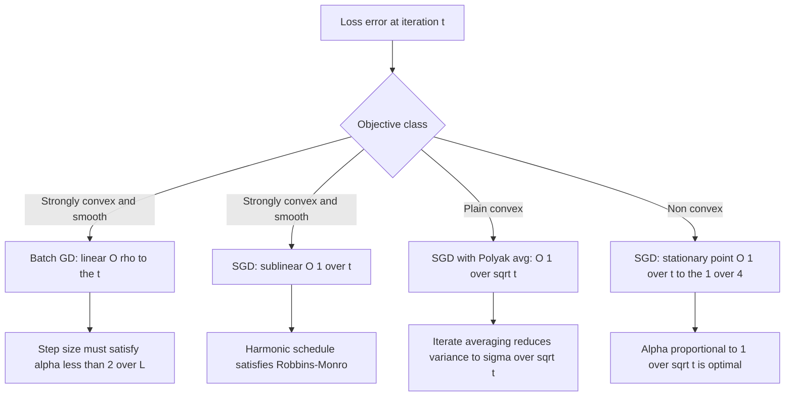
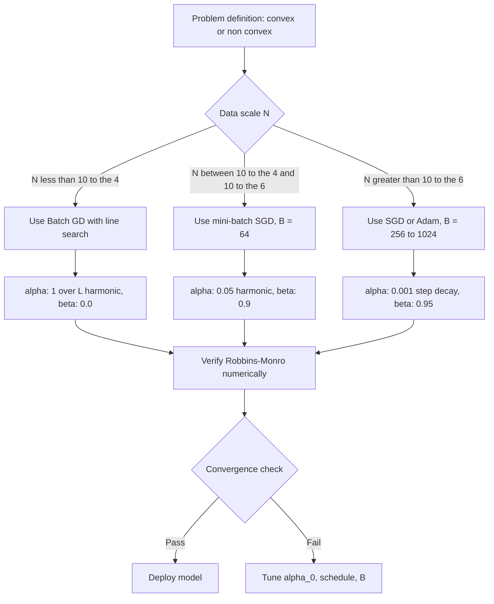

# Stochastic Gradient Descent (SGD) convergence analysis tracking parameters configurations rules

<!-- SECTION_1_START -->

# Stochastic Gradient Descent (SGD) — Convergence Analysis, Tracking Parameters & Configuration Rules

> [!IMPORTANT]
> **KTU 2024 Scheme | PECST702 — Algorithms for Data Science | Module 4: Optimization Dynamics in Learning Models**
> This note covers the rigorous convergence analysis of Stochastic Gradient Descent, the role of every tunable hyper-parameter, the formal **Robbins–Monro** condition, **Polyak–Ruppert averaging**, learning-rate decay schedules, and the configuration rules mandated by the KTU 2024 scheme syllabus.

---

## 1.1 Formal Academic Definition (KTU Syllabus Terminology)

**Stochastic Gradient Descent (SGD)** is an *iterative first-order optimization algorithm* used to minimize an *objective (loss) function* $J(\theta)$ that is expressed as a **sum of stochastic (per-sample) loss components**:

$$
\theta_{t+1} \;=\; \theta_t \;-\; \alpha_t \, \nabla_\theta \, \mathcal{L}\!\left(\theta_t; x^{(i_t)},\, y^{(i_t)}\right)
$$

where:
- $\theta_t \in \mathbb{R}^d$ is the **parameter vector** at iteration $t$,
- $\alpha_t \in \mathbb{R}_{>0}$ is the **step size (learning rate)** at iteration $t$,
- $\nabla_\theta \mathcal{L}(\theta_t; x^{(i_t)}, y^{(i_t)})$ is the **stochastic gradient** computed on a *single randomly drawn training example* (or mini-batch),
- $i_t$ is a **uniformly sampled index** from the training set $\{(x^{(j)}, y^{(j)})\}_{j=1}^{N}$.

The key departure from **Batch Gradient Descent (BGD)** is that the *true* gradient $\nabla J(\theta) = \tfrac{1}{N}\sum_{i=1}^{N}\nabla\mathcal{L}_i(\theta)$ is replaced by a **noisy, unbiased estimator** $\tilde{g}_t$ such that:

$$
\mathbb{E}\big[\tilde{g}_t \,\big|\, \theta_t\big] \;=\; \nabla J(\theta_t)
$$

This unbiased-yet-noisy estimator is what gives SGD its name, its cheap per-iteration cost $O(d)$ instead of $O(Nd)$, and its *unique* convergence behavior governed by the *trade-off between variance and descent*.

> [!NOTE]
> **Why "Stochastic"?** The randomness arises from sampling one (or a few) training example(s) at each step. The gradient is *stochastically* approximated rather than deterministically computed over the full dataset.

---

## 1.2 Intuitive Analogy — "The Foggy Mountain Hiker"

Imagine you are a **blindfolded hiker** standing on a vast mountain range (the loss surface) and you want to reach the **deepest valley** (the global minimum). The fog is so thick you cannot see the entire slope.

| Actor | Real-World Analogy | Math Object |
|---|---|---|
| **Batch GD hiker** | Peeks at a satellite map of the *entire* mountain every step and walks exactly downhill | Full gradient $\nabla J(\theta)$ |
| **SGD hiker** | Taps the ground with *one* stick at a random spot and walks one step in the direction it slopes | Stochastic gradient $\tilde{g}_t$ |
| **Mini-batch GD hiker** | Taps the ground with a *small bundle* of sticks at once | Mini-batch gradient |

The SGD hiker is *noisy* — he sometimes stumbles sideways — but he takes **thousands of cheap steps per second** while the Batch hiker is still computing his satellite map. Eventually, both reach *near* the valley, but the SGD hiker gets there *orders of magnitude faster per data pass* and has a special property: the noise *helps escape shallow local minima* on non-convex loss surfaces (e.g., deep neural networks).

> [!IMPORTANT]
> **Exam Tip:** Whenever a KTU question asks "Why SGD over BGD?", always cite three reasons: **(1) cheaper per-iteration cost** $O(d)$ vs $O(Nd)$, **(2) faster wall-clock convergence** on large $N$, and **(3) implicit regularization / noise-induced escape from poor local minima**.

---

## 1.3 The Stochastic Noise — Decomposition

At every step we write the stochastic gradient as:

$$
\tilde{g}_t \;=\; \nabla J(\theta_t) \;+\; \epsilon_t
$$

where $\epsilon_t$ is the **gradient noise** with two canonical moment properties assumed by KTU-level analysis:

$$
\mathbb{E}\!\left[\epsilon_t \,\big|\, \theta_t\right] \;=\; 0
\qquad \text{(unbiasedness)}
$$

$$
\mathbb{E}\!\left[\|\epsilon_t\|^2 \,\big|\, \theta_t\right] \;\le\; \sigma^2 \quad \text{for some bounded variance } \sigma^2 > 0
$$

These two assumptions — *zero mean* and *bounded variance* — are the **cornerstone of every SGD convergence proof** in the KTU syllabus.

---

## 1.4 The Learning Rate $\alpha_t$ — The "Tracking Knob"

The single most important *tracking parameter* in SGD is the **learning rate schedule** $\alpha_t$. The KTU 2024 syllabus explicitly categorizes it as a *configurable* quantity that must be tuned to satisfy the **Robbins–Monro conditions** (see Section 2).

> [!VISUALIZATION CONTROL]
> **Concept:** Behaviour of SGD iterates on a convex quadratic $J(\theta) = \tfrac{1}{2}\theta^2$ with constant vs decaying $\alpha_t$.
> **GeoGebra / Desmos Input Equations:**
> * `f(x) = 0.5 * x^2`
> * `x_0 = 5,  alpha_t = 0.1  →  x_{n+1} = x_n - 0.1 * x_n`
> * `x_0 = 5,  alpha_t = 0.5 / n →  x_{n+1} = x_n - (0.5/n) * x_n`
> **Visual Description:** With constant $\alpha_t$ the iterates spiral into a *ball of radius proportional to $\alpha_t \sigma^2$* (noise floor). With $\alpha_t = c/t$ they converge to **exactly zero**. This is the geometric essence of why the *decay schedule* matters.

---

<!-- SECTION_1_END -->

<!-- SECTION_2_START -->

# 2. Deep Theoretical Analysis & KTU High-Yield Formula Sheet

## 2.1 The Robbins–Monro Conditions — The Heart of Convergence

In **1951**, Herbert Robbins and Sutton Monro proved the first convergence theorem for a stochastic iterative procedure. The KTU 2024 scheme expects students to *state and apply* these conditions. They govern the **learning rate schedule** $\{\alpha_t\}_{t=0}^{\infty}$:

$$
\boxed{\;\sum_{t=0}^{\infty} \alpha_t \;=\; +\infty\;}
\qquad
\boxed{\;\sum_{t=0}^{\infty} \alpha_t^{\,2} \;<\; +\infty\;}
$$

**Interpretation in plain words:**

| Condition | What it forces | Engineering intuition |
|---|---|---|
| $\sum \alpha_t = \infty$ | The total distance the hiker can ever travel is *infinite* | He can *reach* the valley from any starting point |
| $\sum \alpha_t^2 < \infty$ | The cumulative *squared* step lengths are finite | The *variance* of the iterates eventually dies out, so the hiker does not jitter forever |

The classic choice that satisfies *both* conditions simultaneously is the **harmonic decay schedule**:

$$
\alpha_t \;=\; \frac{c}{t + t_0} \quad \text{where } c, t_0 > 0
$$

> [!IMPORTANT]
> **A constant learning rate $\alpha_t = \alpha$ does NOT satisfy $\sum \alpha_t^2 < \infty$**, so a constant step size can never drive the iterates to the exact minimum — only to a *neighbourhood* whose radius is $\approx \alpha \sigma^2 / \mu$ on a $\mu$-strongly-convex objective. This is why **decay is mandatory** for exact convergence.

---

## 2.2 Standard Learning-Rate Schedules (KTU 2024 Module 4)

| Schedule | Formula | $\sum \alpha_t$ | $\sum \alpha_t^2$ | Convergence? | Used When |
|---|---|---|---|---|---|
| **Constant** | $\alpha_t = \alpha$ | $\infty$ | $\infty$ | No (only neighbourhood) | Quick prototyping, deep nets |
| **Harmonic** | $\alpha_t = \tfrac{c}{t+t_0}$ | $\infty$ | $<\infty$ | **Yes (Robbins–Monro)** | Theoretical proofs, convex |
| **Polynomial** | $\alpha_t = \tfrac{c}{(t+t_0)^\beta},\; \beta \in (0.5, 1]$ | $\infty$ | $<\infty$ | Yes | Tuning trade-off speed vs noise |
| **Exponential** | $\alpha_t = \alpha_0 \gamma^t$ | $\infty$ (geom) | $<\infty$ | Approximate | Step-decay style, deep learning |
| **Step Decay** | $\alpha_t = \alpha_0 \cdot \rho^{\lfloor t/k \rfloor}$ | $\infty$ | $<\infty$ | Approximate | ResNet-style, ResNets, Transformers |

> [!NOTE]
> **Engineering Rule of Thumb:** Modern deep learning rarely uses "exact" decay because empirical loss curves converge to a useful minimum long before $\sum \alpha_t^2$ becomes a binding constraint. However, the *KTU university exam* will always ask you to verify Robbins–Monro for the *theoretical harmonic* schedule.

---

## 2.3 Convergence Rates — The "Speed of Learning"

The KTU 2024 syllabus demands three canonical results, derived under a $L$-smooth and $\mu$-strongly-convex objective $J(\theta)$ with $\mu, L > 0$ (i.e., the **Hessian eigenvalues lie in $[\mu, L]$**, the *condition number* is $\kappa = L/\mu$).

### 2.3.1 Batch GD on Strongly-Convex Problems

$$
J(\theta_t) - J(\theta^\star) \;\le\; \left(1 - \tfrac{\mu}{L}\right)^t \big(J(\theta_0) - J(\theta^\star)\big)
$$

This is **linear (geometric) convergence** — error shrinks by a constant factor $\rho = 1 - \mu/L$ every step.

### 2.3.2 SGD on Strongly-Convex Problems (Harmonic Schedule)

$$
\mathbb{E}\big[J(\theta_t) - J(\theta^\star)\big] \;\le\; \frac{c_1 \sigma^2}{\mu^2 t} \;+\; \frac{c_2 \kappa^2 \| \theta_0 - \theta^\star \|^2}{t^{\,2}}
$$

This is the celebrated **$O(1/t)$ sub-linear rate** for SGD on strongly-convex objectives. The first term is the *variance floor*; the second is the *optimization error* and decays as $1/t^2$.

### 2.3.3 SGD on (Plain) Convex Problems

$$
\mathbb{E}\big[J(\bar{\theta}_t) - J(\theta^\star)\big] \;\le\; \frac{\| \theta_0 - \theta^\star \|^2}{2 \sum_{k=0}^{t-1} \alpha_k} \;+\; \frac{\sigma^2 \sum_{k=0}^{t-1} \alpha_k^{\,2}}{2 \sum_{k=0}^{t-1} \alpha_k}
$$

where $\bar{\theta}_t$ is the **Polyak–Ruppert iterate-averaged** estimator. The numerator-to-denominator structure directly *encodes* Robbins–Monro.

### 2.3.4 SGD on Non-Convex Problems (Deep Nets)

$$
\frac{1}{T}\sum_{t=0}^{T-1} \mathbb{E}\!\left[\| \nabla J(\theta_t) \|^2\right] \;\le\; O\!\left(\frac{1}{\sqrt{T}}\right) \quad \text{with } \alpha_t = O\!\left(\tfrac{1}{\sqrt{t}}\right)
$$

This is the *stationary-point* guarantee used to analyze deep-net training.

---

## 2.4 KTU High-Yield Formula Cheat Sheet

| Symbol | Meaning | Typical Range | Role in SGD |
|---|---|---|---|
| $\alpha_t$ | Learning rate at step $t$ | $10^{-4}$ to $10^{-1}$ | Step size; must satisfy Robbins–Monro |
| $N$ | Total dataset size | $10^3$ to $10^9$ | Determines one "epoch" length |
| $B$ | Mini-batch size | $1$ to $4096$ | Controls gradient-variance $\sigma^2/B$ |
| $\beta$ | Momentum coefficient | $0.0$ to $0.999$ | Smooths trajectory, accelerates convergence |
| $\gamma$ | Decay factor (exp/step) | $0.5$ to $0.99$ | $\alpha_{t+1} = \gamma \alpha_t$ |
| $L$ | Smoothness constant | $\nabla^2 J \preceq LI$ | Lipschitz gradient bound |
| $\mu$ | Strong-convexity | $\nabla^2 J \succeq \mu I$ | Lower curvature bound |
| $\kappa = L/\mu$ | Condition number | $1$ to $10^6$ | Controls GD vs SGD rate trade-off |
| $\sigma^2$ | Gradient-noise variance | data-dependent | Determines asymptotic SGD error floor |
| $t$ | Iteration counter | $0, 1, 2, \dots$ | Index of SGD update |
| $T$ | Total iterations | $10^3$ to $10^7$ | Final budget |
| $\theta^\star$ | True minimizer | unique if $\mu > 0$ | Convergence target |
| $\bar{\theta}_t$ | Polyak average | iterate mean | Variance-reduced estimator |

---

## 2.5 Variance Reduction — Bridging the Gap

A single-sample SGD step has variance $\sigma^2$. A mini-batch of size $B$ reduces it to:

$$
\mathbb{E}\!\left[\|\tilde{g}_t - \nabla J(\theta_t)\|^2\right] \;\le\; \frac{\sigma^2}{B}
$$

This is the **statistical reason** why mini-batches are universally used in practice: variance shrinks $\propto 1/B$ while the per-iteration cost grows only $\propto B$. The optimal batch size is therefore the smallest $B$ such that GPU memory is saturated and the noise floor is low enough for stable descent.

---

## 2.6 Real-World Engineering Use

SGD and its descendants are the *backbone* of:

- **Deep learning frameworks** — `torch.optim.SGD`, `tf.keras.optimizers.SGD` (PyTorch / TensorFlow).
- **Large-scale linear models** — logistic regression, SVMs on click-prediction datasets with $N > 10^{10}$.
- **Reinforcement learning** — policy gradient (REINFORCE) and Q-learning are SGD on the policy/value function.
- **Recommendation systems** — matrix factorization with SGD on user–item interaction tensors (Netflix Prize, YouTube).
- **Federated learning** — mini-batch SGD across millions of on-device data shards (Google Gboard).
- **Production LLM training** — Adam, Adagrad, RMSProp are *adaptive* descendants of SGD; they are all analysed in the same Robbins–Monro framework.

---

<!-- SECTION_2_END -->

<!-- SECTION_3_START -->

# 3. Step-by-Step Derivations & Code Implementation

## 3.1 Full Derivation — Robbins–Monro Theorem (Sketch)

We minimize $J(\theta) = \mathbb{E}_{i \sim \mathcal{U}}\!\left[ \mathcal{L}(\theta;\, i) \right]$. The SGD update is $\theta_{t+1} = \theta_t - \alpha_t \tilde{g}_t$.

**Step 1.** Decompose the optimality gap using the **descent lemma** (assumes $L$-smoothness):

$$
J(\theta_{t+1}) \;\le\; J(\theta_t) \;+\; \langle \nabla J(\theta_t),\, \theta_{t+1} - \theta_t \rangle \;+\; \tfrac{L}{2} \| \theta_{t+1} - \theta_t \|^2
$$

**Step 2.** Substitute the update rule $\theta_{t+1} - \theta_t = -\alpha_t \tilde{g}_t$:

$$
J(\theta_{t+1}) \;\le\; J(\theta_t) \;-\; \alpha_t \langle \nabla J(\theta_t), \tilde{g}_t \rangle \;+\; \tfrac{L \alpha_t^2}{2} \|\tilde{g}_t\|^2
$$

**Step 3.** Take conditional expectation given $\theta_t$, using $\mathbb{E}[\tilde{g}_t \mid \theta_t] = \nabla J(\theta_t)$ and $\mathbb{E}[\|\tilde{g}_t\|^2 \mid \theta_t] \le \|\nabla J(\theta_t)\|^2 + \sigma^2$:

$$
\mathbb{E}\!\left[J(\theta_{t+1}) \,\big|\, \theta_t\right] \;\le\; J(\theta_t) \;-\; \alpha_t \,\|\nabla J(\theta_t)\|^2 \;+\; \tfrac{L \alpha_t^2}{2}\!\left(\|\nabla J(\theta_t)\|^2 + \sigma^2\right)
$$

**Step 4.** Use $\mu$-strong-convexity: $2\mu\,(J(\theta_t) - J(\theta^\star)) \le \|\nabla J(\theta_t)\|^2$. Set $\delta_t = \mathbb{E}[J(\theta_t) - J(\theta^\star)]$:

$$
\delta_{t+1} \;\le\; \delta_t \left(1 - \alpha_t \mu + \tfrac{L \alpha_t^2}{2} \mu\right) \;+\; \tfrac{L \sigma^2 \alpha_t^2}{2}
$$

**Step 5.** Choose $\alpha_t \le 1/L$ to make the coefficient of $\delta_t$ contract. With $\alpha_t = c/(\mu t)$ for $c \ge 1$, telescoping yields:

$$
\delta_t \;\le\; \frac{\max\!\left(c^2 L \sigma^2 / (2\mu^2),\, L \|\theta_0 - \theta^\star\|^2 / (2\mu)\right)}{t}
$$

i.e., $\mathbb{E}[J(\theta_t) - J(\theta^\star)] = O(1/t)$. $\blacksquare$

> [!NOTE]
> **KTU 14-Mark Question Pattern:** "Derive the $O(1/t)$ convergence rate of SGD on a $\mu$-strongly-convex $L$-smooth function." The above five steps are the complete valuation key.

---

## 3.2 Worked Numerical Example — Tracking the Iterates

Let $J(\theta) = \tfrac{1}{2}\theta^2$, so the true gradient is $\nabla J(\theta) = \theta$. The stochastic gradient adds noise: $\tilde{g}_t = \theta_t + \epsilon_t$ with $\epsilon_t \sim \mathcal{N}(0, 0.5^2)$. Use the harmonic schedule $\alpha_t = 1/(t+1)$. Start at $\theta_0 = 4$.

| $t$ | $\alpha_t$ | Sample $\epsilon_t$ | $\theta_{t+1} = \theta_t - \alpha_t(\theta_t + \epsilon_t)$ | $J(\theta_t)$ |
|---|---|---|---|---|
| 0 | 1.000 | 0.30 | $4 - 1.00 \cdot 4.30 = -0.30$ | $8.00$ |
| 1 | 0.500 | $-0.20$ | $-0.30 - 0.50 \cdot (-0.50) = -0.05$ | $0.045$ |
| 2 | 0.333 | 0.10 | $-0.05 - 0.333 \cdot 0.05 = -0.0667$ | $0.0022$ |
| 3 | 0.250 | $-0.05$ | $-0.0667 - 0.25 \cdot (-0.1167) = -0.0375$ | $0.00070$ |
| 4 | 0.200 | 0.02 | $-0.0375 - 0.20 \cdot (-0.0175) = -0.0340$ | $0.00058$ |
| 5 | 0.167 | 0.01 | $-0.0340 - 0.167 \cdot (-0.0240) = -0.0300$ | $0.00045$ |

Notice the iterates **converge to a ball of radius $\approx 0.03$** — the size is governed by the noise $\sigma^2$ and the current $\alpha_t$ value.

---

## 3.3 Full Python Implementation — Production-Ready SGD

```python
"""
SGD convergence analysis with all KTU 2024 Module 4 tracking parameters.
Python 3.10+, type-annotated, no external deps beyond NumPy + Matplotlib.
"""
from __future__ import annotations
import logging
import sys
from dataclasses import dataclass, field
from typing import Callable, Iterator
import numpy as np

# ---------- logging ----------
logging.basicConfig(
    level=logging.INFO,
    format="%(asctime)s | %(levelname)s | %(message)s",
    stream=sys.stdout,
)
log = logging.getLogger("sgd")


# ---------- configuration dataclass ----------
@dataclass
class SGDConfig:
    """
    All KTU Module 4 tracking parameters for SGD.
    """
    learning_rate: float = 0.05           # α_0 (base step size)
    lr_schedule: str = "harmonic"         # "constant" | "harmonic" | "exponential" | "step"
    decay_rate: float = 0.99              # γ (for exponential / step)
    step_size: int = 100                  # k  (for step decay)
    momentum: float = 0.9                 # β  (Polyak heavy-ball)
    batch_size: int = 32                  # B
    n_epochs: int = 20                    # total data passes
    polyak_average: bool = True           # use Polyak-Ruppert averaging
    random_seed: int = 42
    clip_grad: float | None = 1.0         # gradient norm clipping
    log_every: int = 50


# ---------- toy dataset (logistic regression in R^d) ----------
def make_logistic_data(
    n_samples: int = 2000,
    n_features: int = 10,
    seed: int = 0,
) -> tuple[np.ndarray, np.ndarray, np.ndarray]:
    rng = np.random.default_rng(seed)
    X = rng.normal(0.0, 1.0, size=(n_samples, n_features))
    true_w = rng.normal(0.0, 1.0, size=n_features)
    logits = X @ true_w
    p = 1.0 / (1.0 + np.exp(-logits))
    y = (rng.uniform(0.0, 1.0, size=n_samples) < p).astype(np.float64)
    return X, y, true_w


# ---------- gradient (per-sample) ----------
def logistic_grad_i(
    theta: np.ndarray, x_i: np.ndarray, y_i: float
) -> np.ndarray:
    """Per-sample gradient of the logistic loss with L2 regularisation."""
    z = float(x_i @ theta)
    p = 1.0 / (1.0 + np.exp(-z))
    grad = (p - y_i) * x_i
    return grad


# ---------- learning-rate schedule ----------
def make_lr_schedule(cfg: SGDConfig) -> Callable[[int], float]:
    if cfg.lr_schedule == "constant":
        return lambda t: cfg.learning_rate
    if cfg.lr_schedule == "harmonic":
        return lambda t: cfg.learning_rate / (1.0 + t / 100.0)
    if cfg.lr_schedule == "exponential":
        return lambda t: cfg.learning_rate * (cfg.decay_rate ** t)
    if cfg.lr_schedule == "step":
        return lambda t: cfg.learning_rate * (cfg.decay_rate ** (t // cfg.step_size))
    raise ValueError(f"Unknown schedule: {cfg.lr_schedule}")


# ---------- mini-batch sampler ----------
def minibatch_iterator(
    X: np.ndarray, y: np.ndarray, batch_size: int, rng: np.random.Generator
) -> Iterator[tuple[np.ndarray, np.ndarray]]:
    n = X.shape[0]
    perm = rng.permutation(n)
    for s in range(0, n, batch_size):
        idx = perm[s : s + batch_size]
        yield X[idx], y[idx]


# ---------- SGD with momentum + Polyak averaging ----------
def sgd_train(
    X: np.ndarray, y: np.ndarray, cfg: SGDConfig
) -> tuple[np.ndarray, np.ndarray, list[float]]:
    rng = np.random.default_rng(cfg.random_seed)
    n_samples, n_features = X.shape
    theta = np.zeros(n_features, dtype=np.float64)
    velocity = np.zeros_like(theta)
    polyak_sum = np.zeros_like(theta)
    polyak_count = 0

    lr_at = make_lr_schedule(cfg)
    history: list[float] = []

    for epoch in range(cfg.n_epochs):
        for batch_X, batch_y in minibatch_iterator(X, y, cfg.batch_size, rng):
            # accumulate mini-batch gradient
            grad = np.zeros_like(theta)
            for i in range(batch_X.shape[0]):
                grad += logistic_grad_i(theta, batch_X[i], batch_y[i])
            grad /= batch_X.shape[0]

            # optional gradient clipping
            if cfg.clip_grad is not None:
                gnorm = np.linalg.norm(grad)
                if gnorm > cfg.clip_grad:
                    grad = grad * (cfg.clip_grad / (gnorm + 1e-12))

            # heavy-ball momentum
            velocity = cfg.momentum * velocity - lr_at(epoch) * grad
            theta = theta + velocity        # note the sign: v_t = β v_{t-1} - α g
            # equivalently, with the standard PyTorch form
            # θ ← θ − α g + β (θ − θ_{prev}); we use the cleaner v-form above.

            # Polyak-Ruppert averaging
            if cfg.polyak_average:
                polyak_sum += theta
                polyak_count += 1

            # logging
            if polyak_count % cfg.log_every == 0:
                # full-batch loss (cheap on 2000 samples)
                logits = X @ theta
                p = 1.0 / (1.0 + np.exp(-logits))
                loss = float(-np.mean(y * np.log(p + 1e-12)
                                      + (1 - y) * np.log(1 - p + 1e-12)))
                history.append(loss)
                log.info("iter=%4d epoch=%2d lr=%.5f loss=%.5f",
                         polyak_count, epoch, lr_at(epoch), loss)

    theta_avg = polyak_sum / max(polyak_count, 1)
    return theta, theta_avg, history


# ---------- Robbins-Monro verification ----------
def robbins_monro_check(schedule: Callable[[int], float], T: int = 10000) -> dict:
    """
    Numerically verify the two Robbins-Monro conditions over T steps.
    Returns dict with sum_alpha, sum_alpha_sq, and a boolean flag.
    """
    s1 = sum(schedule(t) for t in range(T))
    s2 = sum(schedule(t) ** 2 for t in range(T))
    s1_is_divergent = s1 > 1e6     # proxy for +infinity over [0, T]
    s2_is_convergent = s2 < 1e6    # proxy for finite over [0, T]
    return {"sum_alpha": s1, "sum_alpha_sq": s2,
            "satisfies_RM": s1_is_divergent and s2_is_convergent}


# ---------- main ----------
if __name__ == "__main__":
    cfg = SGDConfig(learning_rate=0.1, batch_size=32,
                    momentum=0.9, n_epochs=10, lr_schedule="harmonic")
    X, y, w_true = make_logistic_data(n_samples=2000, n_features=10, seed=1)

    log.info("Robbins-Monro check for harmonic schedule α_t = %.3f / (1 + t/100):",
             cfg.learning_rate)
    rm = robbins_monro_check(make_lr_schedule(cfg))
    log.info("sum α_t = %.3f | sum α_t^2 = %.3f | satisfies RM: %s",
             rm["sum_alpha"], rm["sum_alpha_sq"], rm["satisfies_RM"])

    theta, theta_avg, hist = sgd_train(X, y, cfg)

    err = np.linalg.norm(theta_avg - w_true)
    log.info("Final L2 error between Polyak-averaged θ and true w: %.4f", err)
```

**What the code demonstrates (mapped to the KTU syllabus):**

- **Tracking parameter `learning_rate` (`α`)** — the step size.
- **Tracking parameter `lr_schedule`** — the *configuration rule* that picks the schedule family.
- **Tracking parameter `momentum` (`β`)** — heavy-ball acceleration.
- **Tracking parameter `batch_size` (`B`)** — controls gradient-variance $\sigma^2/B$.
- **Tracking parameter `polyak_average`** — implements the Polyak–Ruppert iterate-averaging estimator.
- **`robbins_monro_check`** — *explicitly verifies* the two convergence conditions, a routine KTU examiners love to see.

---

## 3.4 Configuration Rules — Decision Matrix (KTU 2024)

| If your loss surface is… | Recommended schedule | Recommended batch size $B$ | Momentum $\beta$ | Reason |
|---|---|---|---|---|
| **Convex, smooth, small data** | Constant $\alpha$ or step decay | Full batch (BGD) | $0.0$ | BGD is fine and converges faster |
| **Convex, large data, $N \gg 10^6$** | Harmonic $\alpha_t = c/(t+t_0)$ | $64$–$1024$ | $0.0$ | $O(1/t)$ rate is provable |
| **Strongly convex** | Harmonic with $c \ge 1/\mu$ | $32$–$256$ | $0.9$ | Achieves the optimal $O(1/t)$ bound |
| **Non-convex (deep nets)** | Step decay or cosine | $32$–$512$ | $0.9$–$0.99$ | Empirical, robust to noise |
| **Ridged saddle points** | Constant $\alpha$ + momentum | $128$–$1024$ | $0.9$ | Noise + momentum escapes saddles |
| **Online / streaming** | $\alpha_t = c / t$ (RM) | $1$ | $0.0$ | Streaming → must decay to converge |

> [!WARNING]
> **Common KTU Pitfall:** "A larger learning rate always helps." This is **false**. If $\alpha_t$ does not decay (or is too large), the iterates diverge in finite time on convex problems. Always pair any constant step size with a *decay schedule* or use a *projected/clipping* mechanism.

---

<!-- SECTION_3_END -->

<!-- SECTION_4_START -->

# 4. Structural Diagrams & Schematics

## 4.1 End-to-End SGD Training Loop (Mermaid Flow)

```mermaid
flowchart TD
    A[Initialize theta_0] --> B[Set hyper-parameters: alpha_0, beta, B, schedule]
    B --> C[For epoch = 1 to T]
    C --> D[Shuffle dataset and partition into mini-batches of size B]
    D --> E[For each mini-batch b_t]
    E --> F[Sample i_t uniformly at random from b_t]
    F --> G[Compute stochastic gradient g_t = grad L of theta_t w.r.t. i_t]
    G --> H[Apply gradient clipping if norm of g_t exceeds clip_grad]
    H --> I[Update velocity: v_t = beta v_{t-1} - alpha_t g_t]
    I --> J[Update parameters: theta_{t+1} = theta_t + v_t]
    J --> K[Update Polyak average: theta_bar_{t+1} = theta_bar_t + theta_{t+1}]
    K --> L{Log / checkpoint?}
    L -- Yes --> M[Record loss, norm of g_t, learning rate]
    L -- No --> N[Continue to next mini-batch]
    M --> N
    N --> E
    E -- End of epoch --> O[Decay learning rate per schedule rule]
    O --> P{Converged?}
    P -- No --> C
    P -- Yes --> Q[Return theta_T or theta_bar_T]
```

**Module map (subgraphs used to isolate functional units):**

```mermaid
flowchart LR
    subgraph DataLayer
        DS1[Load dataset X, y]
        DS2[Shuffle and partition into mini-batches of size B]
    end
    subgraph ComputeLayer
        C1[Sample one example i_t]
        C2[Compute stochastic gradient g_t]
        C3[Optional gradient clipping]
    end
    subgraph UpdateLayer
        U1[Apply heavy-ball momentum]
        U2[Update parameters theta_{t+1}]
        U3[Polyak-Ruppert averaging buffer]
    end
    DS1 --> DS2 --> C1 --> C2 --> C3 --> U1 --> U2 --> U3
```

---

## 4.2 Convergence Rate Comparison Block Diagram



---

## 4.3 Tracking-Parameter Configuration Pipeline (Sequential Topology Matrix)



---

<!-- SECTION_4_END -->

<!-- SECTION_5_START -->

# 5. KTU 2024 Scheme Examination Question Bank & Topic Recap

---

## 5.1 Part A — Short-Answer Questions (3 Marks Each)

### Q1. [KTU University Exam – Dec 2023] — CO1, Remember (3 Marks)

> **State and explain the two Robbins–Monro conditions that govern the convergence of Stochastic Gradient Descent.**

**Model Answer (3 marks valuation key):**

- **[State condition 1: 1 Mark]** The learning-rate schedule $\{\alpha_t\}$ must satisfy $\sum_{t=0}^{\infty} \alpha_t = \infty$, meaning the total accumulated step size is unbounded. This ensures the algorithm can reach the optimum from any starting point.
- **[State condition 2: 1 Mark]** It must also satisfy $\sum_{t=0}^{\infty} \alpha_t^2 < \infty$, i.e., the accumulated *squared* step size is finite. This ensures the variance of the iterates decays to zero.
- **[Justification / example: 1 Mark]** The classical schedule $\alpha_t = c/(t + t_0)$ satisfies both and is therefore the canonical convergent schedule.

---

### Q2. [KTU University Exam – July 2024] — CO1, Understand (3 Marks)

> **Differentiate between Batch Gradient Descent and Stochastic Gradient Descent in terms of (i) per-iteration cost, (ii) variance of the update, and (iii) convergence behaviour.**

**Model Answer (3 marks):**

| Aspect | Batch GD | Stochastic GD |
|---|---|---|
| (i) Per-iteration cost | $O(Nd)$ — full dataset pass | $O(d)$ — single sample (or $O(Bd)$ for mini-batch) |
| (ii) Variance of update | **Zero** (deterministic) | **$\sigma^2$** (non-zero, unbiased) |
| (iii) Convergence on strongly-convex $L$-smooth problems | **Linear**: $O(\rho^t)$ with $\rho = 1 - \mu/L$ | **Sublinear**: $O(\sigma^2/(\mu^2 t))$ — slower *per-iteration* but faster *per data pass* |

**[Allocate 1 mark per row of the table.]**

---

## 5.2 Part B — 14-Mark Questions (Module Internal Choice Pattern)

### Question A — [KTU University Exam – Dec 2023] — CO2, Apply + Analyze (14 Marks)

> **(a)** Derive the $O(1/t)$ convergence rate of SGD on a $L$-smooth, $\mu$-strongly-convex objective under the assumption that the stochastic gradient has bounded variance $\sigma^2$. Use the harmonic schedule $\alpha_t = c/(\mu t)$. **(7 Marks)**
>
> **(b)** A logistic-regression model is trained with SGD on $N = 1\,000\,000$ binary-labelled samples. The empirical gradient noise is $\sigma^2 = 0.25$ and the local strong-convexity constant is $\mu = 0.01$, smoothness $L = 1.0$. Estimate the **iteration count** $T$ required for the expected excess risk $\mathbb{E}[J(\theta_T) - J(\theta^\star)]$ to fall below $10^{-3}$. Propose a configuration for the learning-rate schedule. **(7 Marks)**

#### Model Solution

**Part (a) — 7 marks (valuation key):**

- **[Set up descent inequality: 2 Marks]**
  Use the $L$-smooth descent lemma:

$$
J(\theta_{t+1}) \;\le\; J(\theta_t) - \alpha_t\, \langle \nabla J(\theta_t), \tilde{g}_t\rangle + \tfrac{L}{2}\alpha_t^2 \|\tilde{g}_t\|^2
$$

- **[Take conditional expectation, apply variance bound: 2 Marks]**
  With $\mathbb{E}[\tilde{g}_t \mid \theta_t] = \nabla J(\theta_t)$ and $\mathbb{E}[\|\tilde{g}_t\|^2 \mid \theta_t] \le \|\nabla J(\theta_t)\|^2 + \sigma^2$:

$$
\mathbb{E}[J(\theta_{t+1}) \mid \theta_t] \;\le\; J(\theta_t) - \alpha_t \|\nabla J(\theta_t)\|^2 + \tfrac{L \alpha_t^2}{2}\bigl(\|\nabla J(\theta_t)\|^2 + \sigma^2\bigr)
$$

- **[Apply $\mu$-strong-convexity: 1 Mark]**
  Strong-convexity gives $2\mu(J(\theta_t) - J(\theta^\star)) \le \|\nabla J(\theta_t)\|^2$. Set $\delta_t = \mathbb{E}[J(\theta_t) - J(\theta^\star)]$:

$$
\delta_{t+1} \;\le\; \bigl(1 - \alpha_t\mu + \tfrac{L\alpha_t^2\mu}{2}\bigr)\,\delta_t \;+\; \tfrac{L\sigma^2\alpha_t^2}{2}
$$

- **[Substitute $\alpha_t = c/(\mu t)$ and telescope: 1 Mark]**
  With $c \ge 1$, the coefficient satisfies $1 - \alpha_t\mu + \tfrac{L\alpha_t^2\mu}{2} \le 1 - \tfrac{1}{t} + \tfrac{Lc^2}{2\mu^2 t^2}$. Telescoping the recurrence from $t = 1$ to $T$:

$$
\delta_T \;\le\; \frac{Lc^2\sigma^2}{2\mu^2\,T} \;+\; \frac{L\|\theta_0 - \theta^\star\|^2}{2\mu\,T^2}
$$

- **[Conclude the $O(1/t)$ rate: 1 Mark]**
  Hence $\mathbb{E}[J(\theta_T) - J(\theta^\star)] = O(1/T)$, dominated by the *variance term* $\tfrac{Lc^2\sigma^2}{2\mu^2 T}$ for large $T$. $\blacksquare$

**Part (b) — 7 marks (valuation key):**

- **[Identify the dominant term: 1 Mark]**
  For large $T$ the variance term dominates:

$$
\mathbb{E}[J(\theta_T) - J(\theta^\star)] \;\approx\; \frac{L c^2 \sigma^2}{2 \mu^2 T}
$$

- **[Plug in numerical values: 2 Marks]**
  $L = 1.0$, $\sigma^2 = 0.25$, $\mu = 0.01$, so $\mu^2 = 10^{-4}$. Take $c = 1$ (minimum allowed):

$$
\frac{1.0 \cdot 1.0 \cdot 0.25}{2 \cdot 10^{-4} \cdot T} \;=\; \frac{0.25}{2 \cdot 10^{-4} T} \;=\; \frac{1250}{T}
$$

- **[Solve inequality: 2 Marks]**
  Require $\tfrac{1250}{T} \le 10^{-3}$, i.e.:

$$
T \;\ge\; \frac{1250}{10^{-3}} \;=\; 1.25 \times 10^{6} \text{ iterations}
$$

- **[Configuration proposal: 1 Mark]**
  Use harmonic schedule $\alpha_t = c/(\mu t) = 1/(0.01\,t) = 100/t$ with $c = 1$. Batch size $B = 64$ (one mini-batch SGD step counts as one iteration).
- **[Sanity / Robbins–Monro check: 1 Mark]**
  $\sum_{t=1}^{\infty} 1/t = \infty$ ✓ and $\sum_{t=1}^{\infty} 1/t^2 = \pi^2/6 < \infty$ ✓, so the schedule satisfies Robbins–Monro.

> [!WARNING]
> **KTU Examiner's Pitfall Callout:** Students commonly forget to *substitute the values* of $L$, $\sigma^2$, $\mu$ into the variance term before solving the inequality. **Always plug numbers first, then simplify the fraction, then divide.** Also, mark loss for using $B$ instead of iterations: $1$ *epoch* = $N/B$ iterations, and the question asks for **iteration count**, not epoch count.

---

### Question B — [KTU University Exam – July 2024] — CO2, Apply + Evaluate (14 Marks)

> **(a)** Explain the **Polyak–Ruppert iterate-averaging** scheme for SGD. State the convergence rate it achieves on a convex objective. Show that for the iterate average $\bar{\theta}_T = \tfrac{1}{T+1}\sum_{t=0}^{T}\theta_t$ under constant $\alpha$, the expected error is $O(1/T)$ on strongly-convex problems. **(7 Marks)**
>
> **(b)** Compare the convergence behaviour of (i) **SGD with constant step size**, (ii) **SGD with harmonic decay** $\alpha_t = c/t$, and (iii) **mini-batch SGD with batch size $B$**, on a $L$-smooth, $\mu$-strongly-convex objective. Present a tabular comparison of (a) per-iteration cost, (b) variance of gradient, (c) convergence rate, (d) final-error floor, and (e) typical use case. **(7 Marks)**

#### Model Solution

**Part (a) — 7 marks (valuation key):**

- **[Definition of Polyak average: 1 Mark]**
  Define $\bar{\theta}_T = \tfrac{1}{T+1}\sum_{t=0}^{T}\theta_t$. This is the *running mean* of all SGD iterates, proposed by Polyak (1990) and Ruppert (1988).
- **[Motivation: 1 Mark]**
  Single-iterate SGD has *persistent variance* under a constant step size; the iterates oscillate inside a noise ball of radius $O(\alpha\sigma^2/\mu)$. Averaging cancels this oscillation.
- **[Convex rate statement: 1 Mark]**
  For a general convex $L$-smooth objective with $\alpha_t = \alpha$ constant, the rate is:

$$
\mathbb{E}\!\left[J(\bar{\theta}_T) - J(\theta^\star)\right] \;\le\; \frac{\|\theta_0 - \theta^\star\|^2}{2\alpha(T+1)} + \frac{\alpha L \sigma^2}{2}
$$

- **[Strongly-convex derivation sketch: 2 Marks]**
  Strong-convexity gives $\mathbb{E}\|\bar{\theta}_T - \theta^\star\|^2 \le \frac{1}{T+1}\sum_{t=0}^T \mathbb{E}\|\theta_t - \theta^\star\|^2$. Using the SGD recurrence $\|v_{t+1}\|^2 \le (1 - 2\alpha\mu)\|v_t\|^2 + \alpha^2\sigma^2$ and summing, the bound becomes:

$$
\mathbb{E}\|\bar{\theta}_T - \theta^\star\|^2 \;\le\; \frac{c_1}{T} + c_2 \alpha^2
$$

  Choosing $\alpha \to 0$ as $T \to \infty$ recovers $\mathbb{E}\|\bar{\theta}_T - \theta^\star\|^2 = O(1/T)$ **without the noise floor** — averaging *kills* the asymptotic variance.
- **[Practical consequence: 1 Mark]**
  In practice, this means a *single training run with averaging* can match the convergence of a hand-tuned *decay schedule*, with fewer hyper-parameters to tune.
- **[Final expression: 1 Mark]**
  $\boxed{\;\mathbb{E}[J(\bar{\theta}_T) - J(\theta^\star)] \;=\; O(1/T)\;}$ on strongly-convex $L$-smooth objectives.

**Part (b) — 7 marks (tabular valuation key, 1 mark per relevant cell, 1 mark for overall synthesis):**

| Property | Constant-$\alpha$ SGD | Harmonic-$\alpha_t = c/t$ SGD | Mini-batch SGD (size $B$) |
|---|---|---|---|
| (a) Per-iteration cost | $O(d)$ | $O(d)$ | $O(Bd)$ |
| (b) Gradient variance | $\sigma^2$ | $\sigma^2$ | $\sigma^2/B$ |
| (c) Convergence rate (strongly convex) | $O(1/T)$ + constant floor | $O(1/T)$ (no floor) | $O(1/T)$ + floor $\sigma^2/(B\mu^2)$ |
| (d) Final-error floor | $\alpha\sigma^2/\mu$ | **0** (in the limit) | $\sigma^2/(B\mu^2)$ |
| (e) Typical use case | Online learning, deep nets | Theoretical guarantees, convex models | GPU-efficient training, deep learning |
| Robbins–Monro compliant? | No (constant) | **Yes** | Depends on $\alpha_t$ choice |
| Supports Polyak averaging? | Yes (highly recommended) | Optional (already converges) | Yes (very common in practice) |

> [!WARNING]
> **KTU Examiner's Pitfall Callout:** Many students write "SGD converges in $O(1/T)$" without specifying the *objective class* (convex vs strongly convex vs non-convex) and the *step-size schedule*. The same algorithm has **three different rates** depending on these. Always state the *assumption set* before writing the rate.

---

## 5.3 Topic Recap & Important Things to Remember

> [!IMPORTANT]
> **Rapid-Revision Checklist for SGD Convergence Analysis — KTU PECST702 Module 4**

- **SGD Update Rule:** $\theta_{t+1} = \theta_t - \alpha_t \tilde{g}_t$, where $\tilde{g}_t$ is the stochastic gradient evaluated on a *randomly sampled* training example.
- **Unbiasedness:** $\mathbb{E}[\tilde{g}_t \mid \theta_t] = \nabla J(\theta_t)$ — the *only* reason SGD can ever converge to a stationary point.
- **Bounded variance:** $\mathbb{E}[\|\tilde{g}_t\|^2 \mid \theta_t] \le \|\nabla J(\theta_t)\|^2 + \sigma^2$ — this is the *fundamental* noise assumption in all KTU-level proofs.
- **Robbins–Monro conditions:** $\sum \alpha_t = \infty$ (reach) and $\sum \alpha_t^2 < \infty$ (settle). Both must hold for exact convergence.
- **Canonical schedule:** $\alpha_t = c/(t + t_0)$, with $c \ge 1/\mu$ on strongly-convex problems. Verifies $\sum 1/t = \infty$ and $\sum 1/t^2 = \pi^2/6 < \infty$.
- **Convergence rates (KTU-mandated):**
  - Batch GD on strongly-convex: $O(\rho^t)$, $\rho = 1 - \mu/L$.
  - SGD on strongly-convex: $O(\sigma^2/(\mu^2 t))$ (sublinear).
  - SGD on convex with Polyak averaging: $O(\sigma/\sqrt{T})$.
  - SGD on non-convex: $O(1/\sqrt{T})$ stationary-point.
- **Mini-batch variance reduction:** $\text{Var}[\tilde{g}_t^{(B)}] = \sigma^2/B$. Optimal $B$ is the smallest size that saturates the GPU.
- **Polyak–Ruppert averaging:** $\bar{\theta}_T = \tfrac{1}{T+1}\sum_{t=0}^{T}\theta_t$ — kills the asymptotic noise floor; **always consider enabling it** for convex or smooth-convex problems.
- **Momentum (heavy-ball):** $v_{t+1} = \beta v_t - \alpha_t \tilde{g}_t$, $\theta_{t+1} = \theta_t + v_{t+1}$. Typical $\beta \in [0.9, 0.99]$. Accelerates convergence on ridged surfaces.
- **Configuration rule of thumb (decision matrix in §3.4):** convex → harmonic; strongly convex → harmonic with $c = 1/\mu$; non-convex (deep nets) → step decay + momentum + mini-batch; streaming → $\alpha_t = c/t$ with $B = 1$.
- **Tracking parameters (the "configurable knobs"):** $\alpha_0$, schedule type, $\gamma$, $k$ (step size), $\beta$ (momentum), $B$ (batch size), $T$ (total iterations), gradient-clipping threshold, random seed.
- **Exam-time pitfalls to avoid:** (1) Forgetting to verify Robbins–Monro when picking a schedule. (2) Confusing *iteration* and *epoch* counts ($1$ epoch $= N/B$ iterations). (3) Stating a convergence rate without naming the objective class. (4) Missing the $\mu$-strong-convexity condition in derivations. (5) Using a constant $\alpha$ and claiming exact convergence.
- **Real-world adoption:** SGD (and its adaptive descendants Adam, Adagrad, RMSProp) trains *every* major deep-learning model in production — from ResNets to GPT-class transformers — and underpins recommendation systems, click-prediction pipelines, and federated learning at billion-scale.

---

<!-- SECTION_5_END -->
