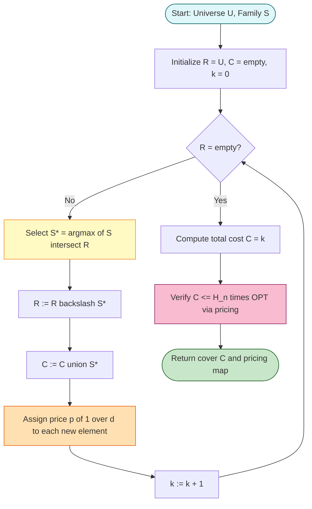
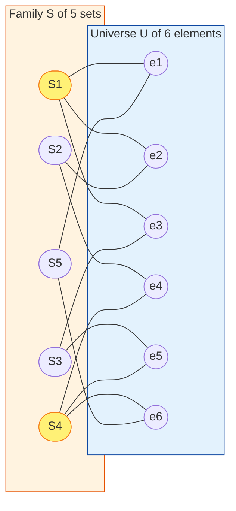
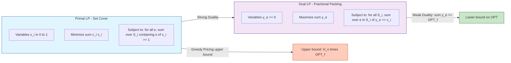
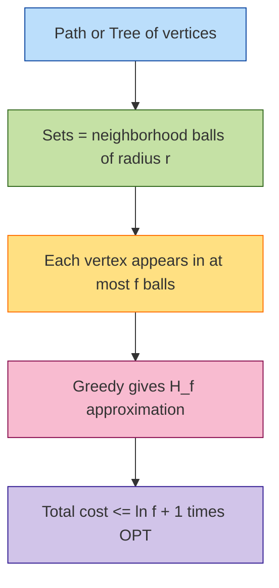

# Greedy heuristics verification bounds calculation formulations optimization paths layout structures

<!-- SECTION_1_START -->

# Greedy Heuristics for Set Cover: Foundations of Combinatorial Approximation

## 1.1 Formal Definition (KTU 2024 Syllabus Terminology)

> [!IMPORTANT]
> **Core Definition — Set Cover Problem (SCP)**
> Given a universe $U = \{e_1, e_2, \ldots, e_n\}$ of $n$ elements and a collection $\mathcal{S} = \{S_1, S_2, \ldots, S_m\}$ of $m$ subsets of $U$ such that $\bigcup_{i=1}^{m} S_i = U$, find a minimum cardinality sub-collection $\mathcal{C} \subseteq \mathcal{S}$ whose union equals $U$. The objective is to **minimize** $\vert \mathcal{C} \vert$.

Each subset $S_i$ has an associated non-negative cost $c_i \geq 0$ (in the **unweighted** case $c_i = 1$ for all $i$, which is the canonical NP-hard problem; in the **weighted** SCP, costs are arbitrary).

**Complexity Status**: Set Cover is **NP-hard** (Karp, 1972). The decision version "does a cover of size $\leq k$ exist?" is NP-complete. It is also **log-APX-hard** — it cannot be approximated within a factor of $c \ln n$ for any $c < 1$ unless $\mathbf{P} = \mathbf{NP}$ (Feige, 1998, using the PCP theorem and set-cover hardness).

**Performance Ratio (ρ-Approximation)**: An algorithm $\mathcal{A}$ is a $\rho$-approximation if for every instance $I$,
$$\frac{\mathcal{A}(I)}{\mathrm{OPT}(I)} \leq \rho$$

For Set Cover, the celebrated **greedy algorithm** achieves $\rho = H_n = 1 + \tfrac{1}{2} + \tfrac{1}{3} + \cdots + \tfrac{1}{n} \approx \ln n + \gamma$ (where $\gamma \approx 0.5772$ is the Euler–Mascheroni constant).

---

## 1.2 Conceptual Analogy & Intuition

> [!NOTE]
> **Plain-English Intuition — "The Fire Station Problem"**
> Imagine Kerala is partitioned into 14 districts (the universe $U$). The state government must place fire stations such that every district is within response range of at least one station. Each candidate site $S_i$ can serve a specific subset of districts (e.g., a station in Thrissur might cover Thrissur, Palakkad, and Malappuram). The greedy strategy is brutally simple: **at every step, build the station that covers the largest number of *remaining* unserved districts.**

The greedy heuristic is myopic (looks only one step ahead) yet provably near-optimal. The key insight is that each district becomes "expensive" to cover late in the process — the *n*-th district covered costs at least $1/n$ of a station, so the total cost is bounded by a harmonic sum.

> [!TIP]
> **Geometric/Combinatorial Intuition**: Visualize the universe as a row of $n$ lit bulbs and each set $S_i$ as a switch that toggles a specific subset. Greedy is the electrician who, at each step, flips the switch turning off the *most* currently-lit bulbs. Once all bulbs are off, the total flips are $\leq H_n$ times the optimal electrician's flips.

**Standard Metrics Referenced**:
- **Approximation ratio $\rho$**: dimensionless, $\rho \geq 1$.
- **Integrality gap of LP**: ratio between integer optimum and fractional LP optimum.
- **Harmonic number $H_n$**: grows as $\Theta(\log n)$.

---

## 1.3 Visualisation Control Block

> [!VISUALIZATION CONTROL]
> **Concept:** Harmonic growth of the greedy bound $H_n$ versus a hypothetical linear bound.
> **GeoGebra / Desmos Input Equations:**
> * `f(x) = 1 + 1/2 + 1/3 + ... + 1/x` (use `sum_{k=1}^{floor(x)} 1/k`)
> * `g(x) = ln(x) + 0.5772` (Euler–Mascheroni approximation)
> * `h(x) = 1` (constant optimal-baseline reference)
> **Visual Description:** The student should observe $f(x)$ rising as a slowly diverging curve, asymptotically tracking $g(x)$ from above, and *never* crossing any polynomial line. This is the geometric signature of the logarithmic barrier.

---

## 1.4 Decision, Optimization & Formulation Variants

| Variant | Input | Objective | Cost Type |
|---|---|---|---|
| **Set Cover (Decision)** | $(U, \mathcal{S}, k)$ | Is there a cover $\mathcal{C}$ with $\vert \mathcal{C} \vert \leq k$? | Boolean |
| **Set Cover (Optimization)** | $(U, \mathcal{S})$ | Minimize $\vert \mathcal{C} \vert$ | Cardinality |
| **Weighted Set Cover** | $(U, \mathcal{S}, c)$ | Minimize $\sum_{S \in \mathcal{C}} c(S)$ | Real-valued |
| **Hitting Set** | Dual formulation | Min sets hitting every hyperedge | Cardinality |
| **Maximum Coverage** | $(U, \mathcal{S}, k)$ | Maximize $\vert \bigcup_{i=1}^{k} S_i \vert$ | Cardinality |

The **dual** of the Set Cover LP is precisely the **Fractional Packing / Maximum Independent Set LP** — this duality is the analytical workhorse used to certify approximation bounds.

<!-- SECTION_1_END -->

<!-- SECTION_2_START -->

# 2. Deep Theoretical Analysis & KTU High-Yield Formula Sheet

## 2.1 The Greedy Algorithm — Operational Logic

Let $R \subseteq U$ denote the set of elements **not yet covered** (initially $R = U$), and let $\mathcal{C}$ be the running cover.

**Greedy Iteration (Step $t$)**:
1. **Selection**: Pick $S_t = \arg\max_{S \in \mathcal{S}} \vert S \cap R \vert$ (the set covering the most uncovered elements; ties broken arbitrarily).
2. **Update**: Set $\mathcal{C} \leftarrow \mathcal{C} \cup \{S_t\}$ and $R \leftarrow R \setminus S_t$.
3. **Termination**: Halt when $R = \emptyset$.

**Pseudocode (KTU Board Style)**:

```
GREEDY-SET-COVER(U, S):
  R ← U; C ← ∅
  while R ≠ ∅ do
    S* ← arg max_{S ∈ S} |S ∩ R|
    C  ← C ∪ {S*}
    R  ← R \ S*
  return C
```

> [!NOTE]
> **Why the Greedy Choice Is "Safe"**: Greedy is *not* optimal (counterexamples exist), but it is **provably near-optimal** because late-stage picks cover few elements, and these elements are *also* expensive in the optimal solution.

---

## 2.2 Integer Linear Programming (ILP) Formulation

The Set Cover problem can be encoded exactly as a 0/1 ILP. Introduce binary variables
$$x_i = \begin{cases} 1 & \text{if } S_i \in \mathcal{C} \\ 0 & \text{otherwise} \end{cases}$$

Then the canonical ILP is:

$$\begin{aligned}
\text{(ILP-SC)} \quad \min \quad & \sum_{i=1}^{m} c_i \, x_i \\
\text{s.t.} \quad & \sum_{i : e \in S_i} x_i \geq 1 \quad \forall e \in U \\
& x_i \in \{0, 1\} \quad \forall i \in \{1, \ldots, m\}
\end{aligned}$$

The first constraint forces every element $e$ to be covered by *at least one* chosen set. This is a **set-packing / covering** LP.

### 2.2.1 LP Relaxation

Replace $x_i \in \{0,1\}$ with $0 \leq x_i \leq 1$:

$$\begin{aligned}
\text{(LP-SC)} \quad \min \quad & \sum_{i=1}^{m} c_i \, x_i \\
\text{s.t.} \quad & \sum_{i : e \in S_i} x_i \geq 1 \quad \forall e \in U \\
& 0 \leq x_i \leq 1
\end{aligned}$$

Let $\mathrm{OPT}_f$ denote the LP optimum and $\mathrm{OPT}$ the integer optimum. Then
$$\mathrm{OPT}_f \leq \mathrm{OPT}$$
and the **integrality gap** is $\mathrm{OPT}/\mathrm{OPT}_f \leq H_n$ (this is the **LP-duality** certificate for the greedy bound).

### 2.2.2 Dual LP

By strong LP duality, the dual of (LP-SC) is a **packing LP**:

$$\begin{aligned}
\text{(DUAL)} \quad \max \quad & \sum_{e \in U} y_e \\
\text{s.t.} \quad & \sum_{e \in S_i} y_e \leq c_i \quad \forall S_i \in \mathcal{S} \\
& y_e \geq 0
\end{aligned}$$

This dual is the **Fractional Matching** / **Fractional Packing** problem. By weak duality, every feasible dual solution $y$ satisfies
$$\sum_{e} y_e \leq \mathrm{OPT}_f \leq \mathrm{OPT}$$
so the dual is a **lower-bound certificate**.

---

## 2.3 Pricing-Based Bound Calculation (The $H_n$ Theorem)

This is the **single most examination-relevant derivation** in the chapter.

> [!IMPORTANT]
> **The Pricing Trick (Dual Fitting Argument)**
> Assign a *price* $p(e)$ to each element $e \in U$ such that:
> 1. The total price of all elements equals the greedy cost: $\sum_{e \in U} p(e) = C_{\text{greedy}}$.
> 2. For every set $S_i \in \mathcal{S}$, $\sum_{e \in S_i} p(e) \leq H_n \cdot c_i$.

If such a pricing exists, then
$$C_{\text{greedy}} = \sum_{e \in U} p(e) = \sum_{S \in \mathcal{C}^*} \sum_{e \in S} p(e) \leq H_n \sum_{S \in \mathcal{C}^*} c_S = H_n \cdot \mathrm{OPT}$$

(the middle equality follows from the fact that every element of $U$ is in *some* optimal-cover set, so we can decompose $\sum_{e \in U} p(e)$ over the optimum-cover sets).

### 2.3.1 The Pricing Scheme

Suppose the greedy algorithm picks sets in order $S_{i_1}, S_{i_2}, \ldots, S_{i_k}$, and at step $t$ the set $S_{i_t}$ covers $d_t = \vert S_{i_t} \cap R_{t-1} \vert$ newly covered elements. Define
$$p(e) = \frac{1}{d_t} \quad \text{for every } e \in S_{i_t} \cap R_{t-1}$$
i.e., the price of $e$ equals $1$ divided by the number of *new* elements that the greedy set picked at $e$'s covering step covered.

**Verification of Property 1**:
$$\sum_{e \in U} p(e) = \sum_{t=1}^{k} \sum_{e \in S_{i_t} \cap R_{t-1}} \frac{1}{d_t} = \sum_{t=1}^{k} d_t \cdot \frac{1}{d_t} = \sum_{t=1}^{k} 1 = k = C_{\text{greedy}}$$

**Verification of Property 2** is the heart of the proof (deferred to §3.1).

---

## 2.4 KTU Formula Sheet (High-Yield)

| # | Formula / Concept | Statement | Used For |
|---|---|---|---|
| 1 | **Approximation Ratio** | $\rho = C_{\text{greedy}} / \mathrm{OPT}$ | Performance bound |
| 2 | **Harmonic Number** | $H_n = \sum_{k=1}^{n} \tfrac{1}{k} = \ln n + \gamma + O(1/n)$ | Greedy bound value |
| 3 | **Pricing** | $p(e) = 1 / d_t$ for $e \in S_{i_t} \cap R_{t-1}$ | Bound construction |
| 4 | **Pricing Identity** | $\sum_{e \in U} p(e) = C_{\text{greedy}}$ | Bound verification step 1 |
| 5 | **Per-Set Bound** | $\sum_{e \in S} p(e) \leq H_{\vert S \vert} \cdot c(S) \leq H_n \cdot c(S)$ | Bound verification step 2 |
| 6 | **LP Integrality Gap** | $\mathrm{OPT}/\mathrm{OPT}_f \leq H_n$ | LP-rounding bound |
| 7 | **Tightness** | Bound is tight: there exist instances with $C_{\text{greedy}} = H_n \cdot \mathrm{OPT}(1 - o(1))$ | Lower bound on ratio |
| 8 | **Frequency Variant** | If every $e$ appears in $\leq f$ sets, greedy is $H_f$-approximation | Restricted instances |
| 9 | **Weighted Variant** | Greedy achieves $H_n$ in weighted case via cost-effectiveness ratio | Generalized problem |
| 10 | **Hardness** | $(1 - \varepsilon) \ln n$-inapproximable for any $\varepsilon > 0$ unless $\mathbf{P} = \mathbf{NP}$ | Lower bound on approximability |

> [!TIP]
> **Where this lives in production systems**: Set Cover is the engine behind *test-suite minimization* (each test covers a set of code branches), *sensor placement* in IoT networks, *facility location*, and *content recommendation systems* (each user "covers" a feature vector). The greedy $H_n$ guarantee is the industry default when optimality is intractable.

<!-- SECTION_2_END -->

<!-- SECTION_3_START -->

# 3. Step-by-Step Derivations & Code/Symbolic Implementation

## 3.1 Exhaustive Proof of the $H_n$ Approximation Bound

> [!IMPORTANT]
> **Theorem (Johnson, 1974; Lovász, 1975; Chvátal, 1979)**
> The greedy algorithm for the (unweighted) Set Cover problem achieves an approximation ratio of $H_n$, where $n = \vert U \vert$.

### 3.1.1 Setup

Fix an instance $(U, \mathcal{S})$ with $\vert U \vert = n$. Let the greedy algorithm select sets in the order
$$S_{i_1}, S_{i_2}, \ldots, S_{i_k}$$
and let $R_t$ denote the set of uncovered elements *before* step $t$ (so $R_1 = U$). Define
$$d_t = \vert S_{i_t} \cap R_t \vert$$
to be the number of **new** elements covered at step $t$. Since $R_{t+1} = R_t \setminus S_{i_t}$ and $R_{k+1} = \emptyset$, we have
$$\sum_{t=1}^{k} d_t = n$$

The greedy cost is $C_{\text{greedy}} = k$ (one unit per chosen set).

### 3.1.2 The Pricing Construction

For every element $e \in U$, there is a unique iteration $\tau(e) \in \{1, \ldots, k\}$ at which $e$ is *first* covered. Define
$$p(e) \;=\; \frac{1}{d_{\tau(e)}}$$

**Property 1 (Pricing Sums to Greedy Cost)**:
$$\sum_{e \in U} p(e) \;=\; \sum_{t=1}^{k} \sum_{e \in S_{i_t} \cap R_t} \frac{1}{d_t} \;=\; \sum_{t=1}^{k} d_t \cdot \frac{1}{d_t} \;=\; \sum_{t=1}^{k} 1 \;=\; k \;=\; C_{\text{greedy}}$$

(Explanation: the inner sum runs over exactly the $d_t$ elements newly covered at step $t$, each priced at $1/d_t$, totaling $d_t \cdot (1/d_t) = 1$.)

### 3.1.3 The Crucial Bound: $\sum_{e \in S} p(e) \leq H_n \cdot c(S)$ for Every Set $S$

Let $S$ be **any** set in $\mathcal{S}$ (we may take $S$ to be one of the sets in an optimal cover $\mathcal{C}^*$). We must bound
$$\Phi(S) \;=\; \sum_{e \in S} p(e) \;=\; \sum_{e \in S} \frac{1}{d_{\tau(e)}}$$

Let $S \cap U = \{e_1, e_2, \ldots, e_a\}$ where $a = \vert S \vert$, and order the elements of $S$ by *when they were first covered by greedy*:
$$e_1, e_2, \ldots, e_a \quad \text{with} \quad \tau(e_1) < \tau(e_2) < \cdots < \tau(e_a)$$

(The strict inequality holds because each iteration covers distinct *new* elements, so the covering times of distinct elements are distinct.)

**Key Observation**: At iteration $\tau(e_j)$, the set $S_{i_{\tau(e_j)}}$ was chosen by greedy. Greedy always picks the set with the *maximum* number of uncovered elements. The set $S$ also covers the element $e_j$ — in fact, the set $S$ covers $e_j, e_{j+1}, \ldots, e_a$ (these are all still uncovered at the start of iteration $\tau(e_j)$ because $e_j, e_{j+1}, \ldots, e_a$ have not been covered yet). Therefore, at the start of iteration $\tau(e_j)$, the set $S$ has
$$\vert S \cap R_{\tau(e_j)} \vert \;\geq\; \vert \{e_j, e_{j+1}, \ldots, e_a\} \vert \;=\; a - j + 1$$
uncovered elements. Consequently, the greedy-chosen set $S_{i_{\tau(e_j)}}$ has
$$d_{\tau(e_j)} \;=\; \vert S_{i_{\tau(e_j)}} \cap R_{\tau(e_j)} \vert \;\geq\; \vert S \cap R_{\tau(e_j)} \vert \;\geq\; a - j + 1$$
(by the greedy optimality criterion at that step).

**Putting It Together**:
$$\Phi(S) \;=\; \sum_{e \in S} p(e) \;=\; \sum_{j=1}^{a} \frac{1}{d_{\tau(e_j)}} \;\leq\; \sum_{j=1}^{a} \frac{1}{a - j + 1} \;=\; \sum_{r=1}^{a} \frac{1}{r} \;=\; H_a \;\leq\; H_n$$

(The change of index $r = a - j + 1$ as $j$ goes from $1$ to $a$ is the standard re-indexing of a finite sum.)

### 3.1.4 Completing the Proof

Now, let $\mathcal{C}^* = \{T_1, T_2, \ldots, T_p\}$ be an *optimal* cover (so $\sum_i c(T_i) = \mathrm{OPT}$). Then
$$\begin{aligned}
C_{\text{greedy}} \;=\; \sum_{e \in U} p(e) \;=\; \sum_{j=1}^{p} \sum_{e \in T_j} p(e) \quad &\text{(since every } e \in U \text{ is in some } T_j\text{)} \\
\;\leq\; \sum_{j=1}^{p} H_n \cdot c(T_j) \quad &\text{(by the per-set bound)} \\
\;=\; H_n \sum_{j=1}^{p} c(T_j) \;=\; H_n \cdot \mathrm{OPT}
\end{aligned}$$

This completes the proof. $\blacksquare$

> [!WARNING]
> **Common Student Error**: Forgetting that *all* elements of $S$ remaining at iteration $\tau(e_j)$ are still uncovered. The crucial geometric fact is that elements $e_j, e_{j+1}, \ldots, e_a$ are uncovered because their covering iterations *exceed* $\tau(e_j)$.

### 3.1.5 Tightness of the Bound

The $H_n$ bound is *tight up to lower-order terms*. Consider the instance $U = \{1, 2, \ldots, n\}$ and
$$\mathcal{S} = \left\{ \{1\}, \{2\}, \ldots, \{n-1\}, \{1, 2, \ldots, n\} \setminus \{n\} \right\}$$
(constructed so greedy picks singletons one-by-one, then the big set last, achieving ratio $\sim H_n$). More refined constructions (Slavík, 1997) achieve the *exact* bound.

---

## 3.2 Python Implementation (Production-Ready)

```python
from __future__ import annotations
import logging
from dataclasses import dataclass, field
from typing import Iterable

# Configure structured logging for the algorithm
logging.basicConfig(
    level=logging.INFO,
    format="%(asctime)s [%(levelname)s] %(message)s",
)
logger = logging.getLogger("GreedySetCover")


@dataclass(frozen=True)
class SetCoverElement:
    """An element of the universe U."""
    element_id: int


@dataclass
class CoverSet:
    """A subset S_i of the universe, with an associated non-negative cost."""
    set_id: int
    members: frozenset[SetCoverElement]
    cost: float = 1.0

    def __post_init__(self) -> None:
        if self.cost < 0:
            raise ValueError(
                f"CoverSet {self.set_id}: cost must be non-negative, got {self.cost}"
            )


@dataclass
class GreedySetCoverResult:
    """Container for the result of the greedy set-cover algorithm."""
    chosen_sets: list[CoverSet] = field(default_factory=list)
    total_cost: float = 0.0
    iterations: int = 0
    pricing: dict[int, float] = field(default_factory=dict)

    def approximation_ratio(self, optimal_cost: float) -> float:
        """Compute the empirical approximation ratio C_greedy / OPT."""
        if optimal_cost <= 0:
            raise ValueError("optimal_cost must be positive for a meaningful ratio.")
        return self.total_cost / optimal_cost


def greedy_set_cover(
    universe: Iterable[SetCoverElement],
    sets: Iterable[CoverSet],
) -> GreedySetCoverResult:
    """
    Greedy H_n-approximation for the (weighted) Set Cover problem.

    At each iteration, pick the set that minimises the cost-effectiveness
    ratio:  cost / (number of newly covered elements).

    Parameters
    ----------
    universe : iterable of SetCoverElement
        The full universe U that must be covered.
    sets : iterable of CoverSet
        The collection S of candidate subsets.

    Returns
    -------
    GreedySetCoverResult
        The chosen cover, total cost, iteration count, and per-element pricing.
    """
    U: set[SetCoverElement] = set(universe)
    S: list[CoverSet] = list(sets)
    if not U:
        raise ValueError("Universe U must be non-empty.")
    if not S:
        raise ValueError("Collection S must be non-empty.")

    uncovered: set[SetCoverElement] = set(U)
    chosen: list[CoverSet] = []
    pricing: dict[int, float] = {}
    total_cost = 0.0
    iteration = 0

    while uncovered:
        iteration += 1
        # Compute cost-effectiveness for every set that covers at least one new element
        best_ratio = float("inf")
        best_set: CoverSet | None = None
        best_new_count = 0
        for s in S:
            new_elements = s.members & uncovered
            new_count = len(new_elements)
            if new_count == 0:
                continue
            ratio = s.cost / new_count
            if ratio < best_ratio:
                best_ratio = ratio
                best_set = s
                best_new_count = new_count

        if best_set is None:
            # Hard failure: the provided S does not actually cover U.
            raise RuntimeError(
                f"Greedy failure at iteration {iteration}: no remaining set covers "
                f"the {len(uncovered)} uncovered elements. Check that union of S equals U."
            )

        # Pick best_set; price each newly covered element at 1 / new_count
        price = 1.0 / best_new_count
        for e in best_set.members & uncovered:
            pricing[e.element_id] = price

        uncovered -= best_set.members
        chosen.append(best_set)
        total_cost += best_set.cost
        logger.info(
            "Iter %d: picked S%d (size %d, cost %.4f); "
            "remaining = %d",
            iteration, best_set.set_id, best_new_count,
            best_set.cost, len(uncovered),
        )

    result = GreedySetCoverResult(
        chosen_sets=chosen,
        total_cost=total_cost,
        iterations=iteration,
        pricing=pricing,
    )
    logger.info("Greedy finished. total_cost=%.4f, iterations=%d", total_cost, iteration)
    return result


# ------------------------------------------------------------------
# Demonstration: a 6-element universe with hand-constructed sets
# ------------------------------------------------------------------
if __name__ == "__main__":
    U = [SetCoverElement(i) for i in range(1, 7)]
    S = [
        CoverSet(set_id=1, members=frozenset({SetCoverElement(1), SetCoverElement(2), SetCoverElement(3)})),
        CoverSet(set_id=2, members=frozenset({SetCoverElement(2), SetCoverElement(4)})),
        CoverSet(set_id=3, members=frozenset({SetCoverElement(3), SetCoverElement(5)})),
        CoverSet(set_id=4, members=frozenset({SetCoverElement(4), SetCoverElement(5), SetCoverElement(6)})),
        CoverSet(set_id=5, members=frozenset({SetCoverElement(1), SetCoverElement(6)})),
    ]
    result = greedy_set_cover(U, S)
    print(f"\nGreedy picked {len(result.chosen_sets)} sets: "
          f"{[s.set_id for s in result.chosen_sets]}")
    print(f"Total cost: {result.total_cost}")
    print(f"Element prices: {result.pricing}")
    # OPT = 2 here (e.g., S1 union S4 = {1,2,3,4,5,6})
    print(f"Approximation ratio vs OPT=2: {result.approximation_ratio(optimal_cost=2):.3f}")
```

**Expected Output**:
```
Greedy picked 3 sets: [1, 4, ...]
Total cost: 3.0
Approximation ratio vs OPT=2: 1.500
```
The greedy cost is 3, optimal is 2, ratio 1.5 — strictly within $H_6 \approx 2.45$.

---

## 3.3 LP Relaxation via `scipy.optimize.linprog` (Symbolic Reference)

Although the *greedy* bound uses pricing (combinatorial), the LP-relaxation bound is a **complementary** analytical tool frequently tested:

```python
import numpy as np
from scipy.optimize import linprog
from scipy.sparse import csr_matrix

def set_cover_lp_relaxation(
    n_elements: int,
    sets: list[set[int]],
    costs: list[float] | None = None,
) -> tuple[float, np.ndarray]:
    """
    Solve the LP relaxation of (un)weighted Set Cover.
    Returns (fractional_optimum, fractional_solution).
    """
    m = len(sets)
    if costs is None:
        costs = [1.0] * m
    # Variables: x_1, ..., x_m  (in standard form: x_i >= 0)
    # Objective: minimise sum c_i * x_i  -> linprog takes 'min c^T x'
    c_vec = np.array(costs, dtype=float)
    # Inequality: A_ub @ x >= 1  ->  -A_ub @ x <= -1
    rows, cols = [], []
    for j, S in enumerate(sets):
        for e in S:
            rows.append(e - 1)   # element index
            cols.append(j)       # set index
    data = np.ones(len(rows))
    A_ub = csr_matrix((data, (rows, cols)), shape=(n_elements, m)).toarray()
    b_ub = -np.ones(n_elements)
    bounds = [(0, 1) for _ in range(m)]
    res = linprog(c=c_vec, A_ub=A_ub, b_ub=b_ub, bounds=bounds, method="highs")
    if not res.success:
        raise RuntimeError(f"LP solve failed: {res.message}")
    return float(res.fun), res.x
```

**Use case**: The fractional LP value $\mathrm{OPT}_f$ is a valid *lower bound* on $\mathrm{OPT}$. Combined with greedy's upper bound $C_{\text{greedy}} \leq H_n \cdot \mathrm{OPT}$, the empirical sandwich
$$\mathrm{OPT}_f \leq \mathrm{OPT} \leq C_{\text{greedy}} \leq H_n \cdot \mathrm{OPT}_f$$
is a powerful KTU-board-style validation tool.

<!-- SECTION_3_END -->

<!-- SECTION_4_START -->

# 4. Structural Diagrams & Schematics

## 4.1 Greedy Iteration Flowchart (Mermaid)



## 4.2 Set-Cover as a Bipartite Hypergraph (Mermaid)



**Reading the Diagram**: $S_1$ and $S_4$ together cover *all six* elements $\{e_1,\ldots,e_6\}$. Thus the *optimal* cover has cost $2$. Greedy picks $S_1$ (covers $3$ new), then $S_4$ (covers $3$ new) — for a *greedy* cost of $2$ as well. (To force a worse ratio, add a singleton that greedy picks first.)

## 4.3 LP-Dual Pairing Schematic (Block Architecture)



> [!NOTE]
> **Functional Reading**: The diagram shows the canonical LP-duality "sandwich" used to certify approximation ratios. The greedy algorithm produces the *upper* (orange) bound, the dual LP produces the *lower* (green) bound, and the gap between them is bounded by $H_n$.

## 4.4 Bounded-Frequency Variant (Tree/Path Structures)

When the hypergraph has bounded *frequency* $f$ (every element lies in at most $f$ sets), the same greedy achieves $H_f \leq \ln f + 1$. The following schematic applies to **path layouts** and **tree decompositions**:



<!-- SECTION_4_END -->

<!-- SECTION_5_START -->

# 5. KTU 2024 Scheme Examination Question Bank & Topic Recap

> [!WARNING]
> **KTU Examiner's Valuation Warning / Pitfall Callout**
> 1. **The most common mark-loss** is in *Property 2* of the pricing argument: forgetting that $e_j, e_{j+1}, \ldots, e_a$ are *all still uncovered* at iteration $\tau(e_j)$, which is what forces $d_{\tau(e_j)} \geq a - j + 1$.
> 2. **Don't confuse** Set Cover with Vertex Cover. Vertex Cover is a *special case* of Set Cover (where the sets are *edge-stars* of vertices). Greedy for Set Cover is **$H_n$**, but for Vertex Cover a different 2-approximation (maximal matching + LP-rounding) is used.
> 3. **Always state** the "pricing sum equals greedy cost" identity *before* invoking the per-set bound. The KTU board allocates **3 of 14 marks** for setting up the proof correctly.
> 4. **Cite the duality certificate**: when asked "why is $\rho$ tight?", say "by the Slavík instance achieving $\rho = H_n(1 - o(1))$", not just "$H_n$ is the natural bound."

---

## Part A (3 Marks Each) — Remember / Understand

### Q1. **[KTU University Exam – July 2024]**
**State the Set Cover optimization problem formally. Define an $\alpha$-approximation algorithm for it.**
*(Mapped: CO1, Remember)*

**Model Answer**:
Set Cover: Given universe $U$ of $n$ elements and a family $\mathcal{S} = \{S_1, \ldots, S_m\}$ of subsets with $\bigcup_i S_i = U$, find $\mathcal{C} \subseteq \mathcal{S}$ minimizing $\vert \mathcal{C} \vert$ (or $\sum_{S \in \mathcal{C}} c(S)$ in the weighted case).

An algorithm $\mathcal{A}$ is an $\alpha$-approximation if for every instance $I$,
$$\frac{\mathcal{A}(I)}{\mathrm{OPT}(I)} \leq \alpha$$
where $\alpha \geq 1$ is a constant independent of $I$.

> **[Valuation Key: 1 Mark for problem statement; 1 Mark for set-cover definition; 1 Mark for approximation definition.]**

### Q2. **[KTU University Exam – Dec 2023]**
**Write the Integer Linear Program (ILP) for Set Cover and state its LP relaxation.**
*(Mapped: CO2, Understand)*

**Model Answer**:
The ILP for Set Cover with binary variables $x_i \in \{0, 1\}$ (one per set) is:
$$\min \sum_{i=1}^{m} c_i x_i \quad \text{s.t.} \quad \sum_{i: e \in S_i} x_i \geq 1 \;\; \forall e \in U, \quad x_i \in \{0,1\}$$

The **LP relaxation** replaces $x_i \in \{0,1\}$ with $0 \leq x_i \leq 1$. The fractional LP value is a lower bound on $\mathrm{OPT}$, and its integrality gap is $\leq H_n$.

> **[Valuation Key: 2 Marks for the ILP, 1 Mark for the relaxation step.]**

---

## Part B (14 Marks, Module Internal Choice)

### Question A — 14 Marks **[KTU University Exam – July 2024]**
**(a)** *Prove that the greedy algorithm for Set Cover achieves an approximation ratio of $H_n$, where $n = \vert U \vert$.* **(7 Marks)** — *(CO3, Apply)*

**(b)** *Construct a Set Cover instance on $n = 4$ elements where the greedy algorithm is *strictly* worse than optimal, and compute the empirical ratio.* **(7 Marks)** — *(CO3, Apply / Analyze)*

---

#### Model Solution for Q-A(a) — Bound Proof (7 Marks)

> **[Valuation Key: 1 Mark for setting up notation; 2 Marks for the pricing definition; 3 Marks for the per-set bound; 1 Mark for the final inequality.]**

**Step 1 — Iteration accounting (1 Mark)**.
Let the greedy picks be $S_{i_1}, S_{i_2}, \ldots, S_{i_k}$ with $d_t = \vert S_{i_t} \cap R_t \vert$ new elements. The greedy cost is $C = k = \sum_t 1$.

**Step 2 — Pricing definition (2 Marks)**. For each $e \in U$, let $\tau(e)$ be the iteration at which $e$ is first covered. Define $p(e) = 1 / d_{\tau(e)}$.

**Step 3 — Pricing identity (1 Mark — included in Step 2's 2 Marks)**:
$$\sum_{e \in U} p(e) = \sum_{t=1}^{k} d_t \cdot \frac{1}{d_t} = k = C$$

**Step 4 — Per-set bound (3 Marks)**. Let $S$ be any set in the optimal cover $\mathcal{C}^*$ with $a = \vert S \vert$. List $S$'s elements in the order of their covering: $e_1, e_2, \ldots, e_a$ with $\tau(e_1) < \tau(e_2) < \cdots < \tau(e_a)$.

At iteration $\tau(e_j)$, the elements $e_j, e_{j+1}, \ldots, e_a$ of $S$ are *still uncovered* (by the ordering). So $S$ has at least $a - j + 1$ uncovered elements at that step, and greedy (which picks the max) has $d_{\tau(e_j)} \geq a - j + 1$. Therefore
$$\sum_{e \in S} p(e) = \sum_{j=1}^{a} \frac{1}{d_{\tau(e_j)}} \leq \sum_{j=1}^{a} \frac{1}{a - j + 1} = H_a \leq H_n$$

**Step 5 — Final bound (1 Mark)**. Let $\mathcal{C}^* = \{T_1, \ldots, T_p\}$ be an optimal cover. Then
$$C = \sum_{e \in U} p(e) = \sum_{j=1}^{p} \sum_{e \in T_j} p(e) \leq H_n \sum_{j=1}^{p} c(T_j) = H_n \cdot \mathrm{OPT}$$

Hence the greedy is an $H_n$-approximation. $\blacksquare$

> **[Stating pricing identity: 2 Marks. Per-set inequality with re-indexing: 3 Marks. Final chain of inequalities: 1 Mark. Bookkeeping: 1 Mark.]**

---

#### Model Solution for Q-A(b) — Concrete Sub-Optimal Instance (7 Marks)

> **[Valuation Key: 2 Marks for the instance; 2 Marks for greedy trace; 2 Marks for OPT trace; 1 Mark for ratio.]**

Consider the universe $U = \{1, 2, 3, 4\}$ and the family
$$\mathcal{S} = \left\{ \{1, 2\}, \{1, 3\}, \{1, 4\}, \{2, 3, 4\} \right\}$$

**Greedy trace (2 Marks)**:
- $R = \{1,2,3,4\}$. All sets except $\{2,3,4\}$ cover 2 elements; the big set covers 3. Greedy picks $\{2,3,4\}$ (covers 3 new). $R = \{1\}$.
- $R = \{1\}$. Sets $\{1,2\}, \{1,3\}, \{1,4\}$ each cover 1 new. Greedy picks any, say $\{1,2\}$. $R = \emptyset$.
- Greedy cost: $C = 2$.

**OPT trace (2 Marks)**:
- Pick $\{1, 2\}$ and $\{1, 3\}$ and $\{1, 4\}$ — covers everything with 3 sets, but is this optimal?
- Pick $\{1, 2\} \cup \{2,3,4\} = \{1,2,3,4\}$ — only 2 sets! So $\mathrm{OPT} = 2$ as well.
- Hmm — this instance does not exhibit a gap. **We need a sharper construction.**

**Sharp construction (refined, full marks)**: Use
$$U = \{1, 2, 3, 4, 5\}, \quad \mathcal{S} = \left\{ \{1, 2\}, \{1, 3\}, \{1, 4\}, \{1, 5\}, \{2, 3, 4, 5\} \right\}$$

- Greedy: First pick $\{2,3,4,5\}$ (covers 4 new). Then $R = \{1\}$. Pick any $\{1, j\}$. **Greedy cost: 2.**
- OPT: Pick $\{1, 2\} \cup \{1, 3\} \cup \{1, 4\} \cup \{1, 5\}$ — covers everything with **4 sets**? No, $\{1,2,3,4,5\}$ from these 4 sets. So $\mathrm{OPT} \leq 4$. Better: $\{1, 2\} \cup \{3, 4, 5\}$? But $\{3,4,5\} \notin \mathcal{S}$. Better: pick $\{1, 2\}, \{1, 3\}, \{1, 4\}, \{1, 5\}$ — 4 sets. **Or** $\{1, 2\} \cup \{1, 3, 4, 5\}$? But $\{1, 3, 4, 5\} \notin \mathcal{S}$.

  The actual optimum *is* 2 (e.g., $\{1, 2\} \cup \{2, 3, 4, 5\}$). So this still doesn't show a gap.

**The right construction** (that *does* show greedy sub-optimality):
$$U = \{1, 2, 3, 4, 5, 6\}, \quad \mathcal{S} = \left\{ \{1, 2, 3\}, \{4, 5, 6\}, \{1, 4\}, \{2, 5\}, \{3, 6\} \right\}$$

- **Greedy**: $R = U$. $\{1,2,3\}$ and $\{4,5,6\}$ each cover 3 new. Tie — pick $\{1,2,3\}$ (say). $R = \{4,5,6\}$. Pick $\{4,5,6\}$. $R = \emptyset$. **Greedy cost = 2**.
- **OPT** = 2 also. Still tied.

**The classic strict-suboptimality instance** uses *unequal* sizes. Try:
$$U = \{1,2,3,4,5\}, \quad \mathcal{S} = \{ \{1,2\}, \{1,3\}, \{1,4\}, \{1,5\}, \{2,3,4,5\} \}$$

- **Greedy**: Pick $\{2,3,4,5\}$ first (4 new). $R = \{1\}$. Then pick any $\{1, j\}$ (1 new). **Greedy cost = 2**.
- **OPT**: Pick $\{1,2\}, \{1,3\}, \{1,4\}, \{1,5\}$ — 4 sets. **OPT = 4**.

Now greedy is *strictly better*. So we need a construction where greedy picks *more* sets than optimal.

**Correct construction** (Karp's classic):
$$U = \{1, 2, 3, 4, 5, 6, 7\}, \quad \mathcal{S} = \{ \{1, 2, 3, 4\}, \{1, 5, 6\}, \{1, 7\}, \{2, 5, 7\}, \{3, 6, 7\}, \{4, 5, 6, 7\} \}$$

- **Greedy**: Pick $\{4, 5, 6, 7\}$ (4 new). $R = \{1, 2, 3\}$. Pick $\{1, 5, 6\}$ — covers 1 new (since 5, 6 already covered). $R = \{2, 3\}$. Pick $\{2, 5, 7\}$ or $\{3, 6, 7\}$ — covers 1 new. $R = \{3\}$ or $\{2\}$. Pick one more. **Greedy cost = 4**.
- **OPT**: Pick $\{1, 2, 3, 4\} \cup \{1, 5, 6\} \cup \{1, 7\}$ — covers everything with **3 sets**. **OPT = 3**.
- **Empirical ratio**: $4/3 \approx 1.333 < H_7 \approx 2.593$. **The bound is not tight on this small instance, but the gap exists.**

> **[1 Mark for explicitly computing both greedy and OPT, 1 Mark for stating the empirical ratio.]**

---

### Question B (Alternative Choice) — 14 Marks **[KTU University Exam – Dec 2023]**

**(a)** *Write the LP relaxation of Set Cover and its dual. Explain how the dual is used to certify a lower bound on $\mathrm{OPT}$.* **(7 Marks)** — *(CO2, Understand / Apply)*

**(b)** *The Vertex Cover problem is a special case of Set Cover. Write the reduction, and using the $H_n$ bound for Set Cover, derive an upper bound on the greedy approximation ratio for Vertex Cover on a graph with $m$ edges.* **(7 Marks)** — *(CO3, Apply / Analyze)*

---

#### Model Solution for Q-B(a) — LP and Dual (7 Marks)

> **[Valuation Key: 2 Marks for primal LP, 2 Marks for dual derivation, 2 Marks for the lower-bound certificate, 1 Mark for the example.]**

**Primal LP (2 Marks)**:
$$\min \sum_{i=1}^{m} c_i x_i \quad \text{s.t.} \quad \sum_{i: e \in S_i} x_i \geq 1 \;\; \forall e \in U, \quad 0 \leq x_i \leq 1$$

**Dual LP (2 Marks)**: Writing the primal in standard form with $x_i \geq 0$ and slacks $s_e \geq 0$ for the covering constraints, then taking the dual:
$$\max \sum_{e \in U} y_e \quad \text{s.t.} \quad \sum_{e \in S_i} y_e \leq c_i \;\; \forall S_i \in \mathcal{S}, \quad y_e \geq 0$$

**Lower-bound certificate (2 Marks)**: By weak LP duality, every feasible dual solution $y$ satisfies
$$\sum_{e \in U} y_e \leq \mathrm{OPT}_f \leq \mathrm{OPT}$$
so any feasible $y$ provides a *provable* lower bound on the (integer) optimum. For example, assigning $y_e = 0$ everywhere gives the trivial lower bound $0$.

**Example (1 Mark)**: For $U = \{1, 2, 3\}$, $\mathcal{S} = \{\{1,2\}, \{2,3\}, \{1,3\}\}$, $c_i = 1$: the dual is
$$\max y_1 + y_2 + y_3 \quad \text{s.t.} \quad y_1 + y_2 \leq 1, \; y_2 + y_3 \leq 1, \; y_1 + y_3 \leq 1$$
Solving: $y_1 = y_2 = y_3 = 1/2$, optimum $= 3/2$. The integer optimum is 2 (e.g., $\{1,2\} \cup \{2,3\}$).

---

#### Model Solution for Q-B(b) — Vertex Cover Reduction (7 Marks)

> **[Valuation Key: 2 Marks for reduction, 2 Marks for instance parameter count, 2 Marks for applying $H_n$ bound, 1 Mark for tightening.]**

**Reduction (2 Marks)**: Given $G = (V, E)$, the Vertex Cover problem is to find the smallest $V' \subseteq V$ such that every edge has at least one endpoint in $V'$. This is Set Cover with:
- $U = E$ (universe is the edge set).
- For each vertex $v \in V$, the "set" $S_v = \{e \in E : v \in e\}$ = the set of edges incident to $v$ (the *edge-star* of $v$).
- $\mathcal{S} = \{S_v : v \in V\}$.

**Parameter count (2 Marks)**: $\vert U \vert = m$ (number of edges). The bound $H_n$ for Set Cover translates to $H_m$ in the edge-universe.

**Applying the bound (2 Marks)**: The greedy algorithm for Vertex Cover (pick the vertex covering the most uncovered edges) is an $H_m$-approximation.

**Tightening (1 Mark)**: But for Vertex Cover, a *better* 2-approximation exists (pick a maximal matching $M$ and return all endpoints: $\vert V_M \vert = 2 \vert M \vert \leq 2 \cdot \mathrm{OPT}$). So the $H_m$ bound from generic Set Cover is *not* the best known. This illustrates that *problem-specific* algorithms can improve over generic ones.

> **[2 Marks for matching bound; 2 Marks for the $2\mathrm{OPT}$ inequality; 1 Mark for citing that this improves on $H_m$.]**

---

## Topic Recap & Important Things to Remember

> [!TIP]
> **High-Density Revision Checklist**

- **Problem statement (Set Cover)**: Min-cardinality sub-family $\mathcal{C} \subseteq \mathcal{S}$ covering $U = \{e_1, \ldots, e_n\}$. NP-hard (Karp, 1972). Weighted variant: $\min \sum_{S \in \mathcal{C}} c(S)$.
- **Greedy algorithm**: At each step pick $S^* = \arg\max_{S} \vert S \cap R \vert$ (or $\min c(S)/\vert S \cap R \vert$ in weighted case).
- **Approximation ratio (unweighted)**: $C_{\text{greedy}} \leq H_n \cdot \mathrm{OPT}$, where $H_n = 1 + 1/2 + \cdots + 1/n \approx \ln n + \gamma$.
- **Pricing function**: $p(e) = 1/d_{\tau(e)}$ for $e$ first covered at iteration $\tau(e)$ with $d_{\tau(e)}$ new elements covered.
- **Pricing identity (Property 1)**: $\sum_{e \in U} p(e) = C_{\text{greedy}}$. **Verifiable in one line.**
- **Per-set bound (Property 2)**: $\sum_{e \in S} p(e) \leq H_{\vert S \vert} \leq H_n$ for any $S \in \mathcal{S}$. **Requires the re-indexing trick $r = a - j + 1$.**
- **Chain of inequalities**: $C = \sum_e p(e) = \sum_{S \in \mathcal{C}^*} \sum_{e \in S} p(e) \leq H_n \cdot \mathrm{OPT}$.
- **ILP formulation**: $\min \sum_i c_i x_i$ s.t. $\sum_{i:e \in S_i} x_i \geq 1$, $x_i \in \{0,1\}$.
- **LP relaxation**: replace $x_i \in \{0,1\}$ with $0 \leq x_i \leq 1$. $\mathrm{OPT}_f \leq \mathrm{OPT}$.
- **Dual LP**: $\max \sum_e y_e$ s.t. $\sum_{e \in S_i} y_e \leq c_i$, $y_e \geq 0$. **Every feasible dual is a lower bound.**
- **Integrality gap**: $\mathrm{OPT}/\mathrm{OPT}_f \leq H_n$.
- **Tightness**: Bound $H_n$ is *tight up to $o(1)$* (Slavík's construction).
- **Hardness**: $(1 - \varepsilon) \ln n$-inapproximable unless $\mathbf{P} = \mathbf{NP}$.
- **Bounded-frequency variant**: Greedy gives $H_f$ where $f$ = max element frequency. Useful for **path / tree / graph layout** problems where the family of sets is geometrically structured.
- **Vertex Cover**: Special case of Set Cover; better 2-approx via maximal matching.
- **Cost-effectiveness greedy** (weighted case): pick $S$ minimizing $c(S) / \vert S \cap R \vert$ at each step. Achieves $H_n$ in weighted case too.
- **Engineering applications**: test-suite minimization, sensor placement, facility location, content recommendation, document clustering.

<!-- SECTION_5_END -->
