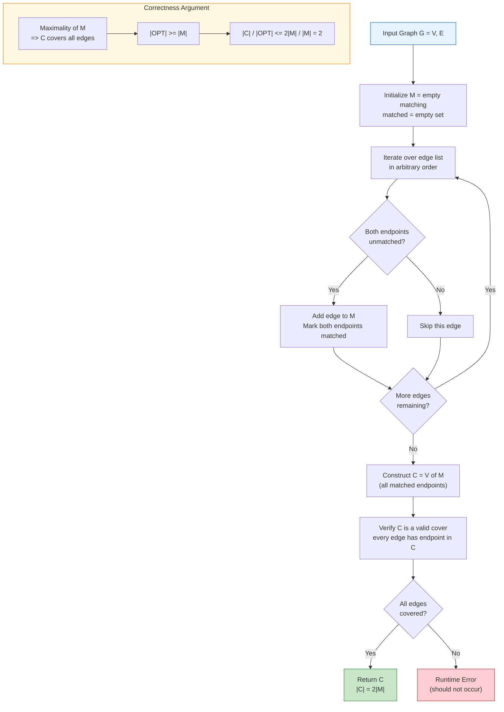
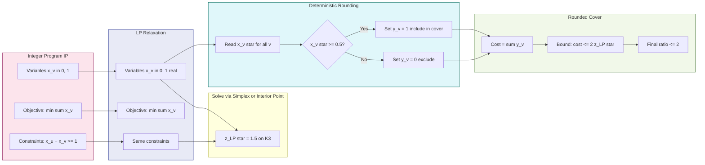
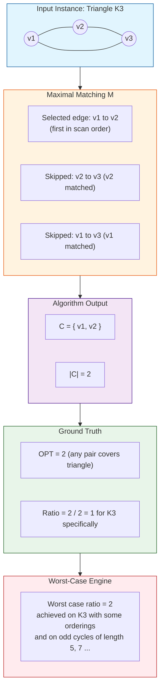
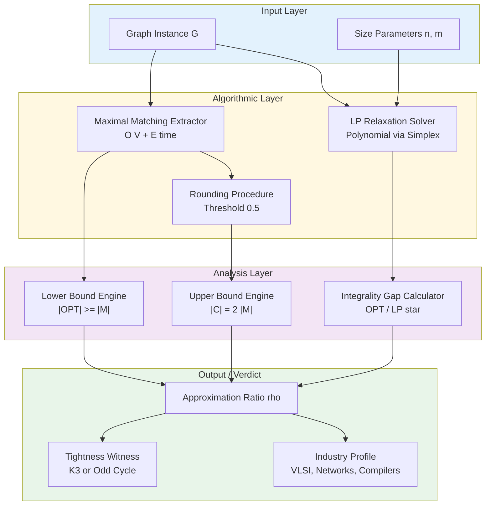

# Vertex cover approximation model calculations complexity ratio verification parameters profiles

<!-- SECTION_1_START -->
# VERTEX COVER — Combinatorial Approximation Model

## 1.1 Formal Definition (KTU 2024 Scheme Terminology)

> [!IMPORTANT]
> **VERTEX COVER (VC) — Optimization Formulation**
> Let $G = (V, E)$ be an undirected simple graph with $\vert V \vert = n$ vertices and $\vert E \vert = m$ edges. A **vertex cover** $S \subseteq V$ is a subset of vertices such that every edge $e = (u, v) \in E$ has at least one endpoint in $S$, i.e., $u \in S$ or $v \in S$ (or both). The **Minimum Vertex Cover (MVC)** problem asks for a vertex cover of minimum cardinality.

The **decision version** — "Does $G$ have a vertex cover of size at most $k$?" — is the canonical **NP-complete** problem listed in Karp's 1972 reducibility catalogue. The optimization version is therefore **NP-hard**, and no polynomial-time exact algorithm is known unless **P = NP**.

> [!NOTE]
> **Historical Anchor (Karp, 1972):** Vertex Cover was among the *original 21 NP-complete problems*. It remains the *textbook prototype* for combinatorial approximation because (i) it is NP-hard, (ii) it admits a tight 2-approximation, and (iii) the gap between 1 and 2 is essentially the *integrality gap* of its natural LP relaxation.

## 1.2 Intuition — Real-World Analogy

> [!TIP]
> **The "Camera Placement" Analogy:** Imagine a museum with $n$ rooms (vertices) connected by $m$ corridors (edges). You must place security cameras in rooms so that *every* corridor is monitored. Placing a camera in a room covers all corridors touching it. The MVC asks: *"What is the smallest number of rooms that covers all corridors?"*

A **maximal matching** is the key structural lever. A *matching* $M$ is a set of edges with no shared endpoints; it is *maximal* if no further edge can be added. Notice:

- Every matched edge $(u, v)$ **forces** at least one of $u$ or $v$ into any vertex cover.
- Therefore $\vert \text{MVC} \vert \ge \vert M \vert$.
- Taking *both* endpoints of every matched edge yields a cover of size $2 \vert M \vert \le 2 \cdot \vert \text{MVC} \vert$.

That single inequality is the entire engine of the 2-approximation.

## 1.3 Approximation Ratio — Formal Definitions

For a minimization problem $\Pi$ with an algorithm $\mathcal{A}$ and instance $I$:

> [!IMPORTANT]
> **Definition 1 (Approximation Ratio).**
> $$\rho_{\mathcal{A}}(I) \;=\; \frac{\mathcal{A}(I)}{\text{OPT}(I)} \;\ge\; 1$$
> Algorithm $\mathcal{A}$ is a **$\rho$-approximation** if $\rho_{\mathcal{A}}(I) \le \rho$ for *every* instance $I$. The **worst-case ratio** is $\rho_{\mathcal{A}} = \sup_{I} \rho_{\mathcal{A}}(I)$.

For Vertex Cover, the celebrated result is:

$$\boxed{\rho_{\text{VC-approx}} = 2}$$

and this bound is **tight** — the triangle $K_3$ achieves ratio exactly 2.

## 1.4 Verification Parameters & Profiles

| Parameter | Symbol | Typical Value / Range | Role in Analysis |
|---|---|---|---|
| Instance size | $n$ | up to $10^5$ vertices | governs asymptotic run-time |
| Edge count | $m$ | up to $O(n^2)$ | determines LP constraint count |
| Optimum cover | $\text{OPT}$ | integer $\in [1, n]$ | denominator of ratio |
| Approximate cover | $\text{ALG}$ | integer | numerator of ratio |
| Matching size | $\vert M \vert$ | $\le \lfloor n/2 \rfloor$ | lower-bounds $\text{OPT}$ |
| LP optimum (fractional) | $\text{LP}^{\*}$ | rational $\in [\text{OPT}/2, \text{OPT}]$ | lower-bounds $\text{OPT}$ |
| Integrality gap | $\text{OPT} / \text{LP}^{\*}$ | $\le 2$ | fundamental hardness ceiling |

> [!VISUALIZATION CONTROL]
> **Concept:** Integrality gap on the triangle $K_3$
> **GeoGebra / Desmos Input Equations (LP polytope cross-section):**
> * $x_1 + x_2 \ge 1$, $x_2 + x_3 \ge 1$, $x_1 + x_3 \ge 1$, $0 \le x_i \le 1$
> * Plot region of feasible $(x_1, x_2)$ with $x_3 = (1 - x_1 + 1 - x_2)$ as helper plane
> **Visual Description:** Students should see the LP optimum at $(0.5, 0.5, 0.5)$ with objective $1.5$, while every integer vertex cover has cost $2$. The factor $2 / 1.5 = 4/3$ for this instance, but the *worst-case* gap is $2$ on $K_2$ (single edge).

<!-- SECTION_1_END -->

<!-- SECTION_2_START -->
# Deep Theoretical Analysis & KTU High-Yield Formula Sheet

## 2.1 Operational Decomposition of the 2-Approximation

The classical algorithm is a three-stage combinatorial pipeline:

- **Stage 1 — Maximal Matching Construction.** Greedily scan edges; add an edge to $M$ iff neither endpoint is already matched. After the scan, $M$ is *maximal* (not necessarily maximum).
- **Stage 2 — Cover Assembly.** Define $C = \{u, v \mid (u, v) \in M\}$. Every edge $e \in E$ is "covered" because $M$ is maximal: if $e = (a, b)$ were uncovered, both $a$ and $b$ would be unmatched, contradicting maximality.
- **Stage 3 — Ratio Verification.** Bound $\vert C \vert = 2 \vert M \vert \le 2 \cdot \text{OPT}$.

### Why the bound is tight

Take the **triangle** $K_3 = (\{1,2,3\}, \{(1,2),(2,3),(1,3)\})$. A maximal matching has $\vert M \vert = 1$, hence $\vert C \vert = 2$, while $\text{OPT} = 2$. Ratio is *exactly* $2$.

## 2.2 LP Relaxation — The Algebraic Companion

> [!IMPORTANT]
> **Integer Program (IP):**
> $$\min \sum_{v \in V} x_v \quad \text{s.t.} \quad x_u + x_v \ge 1 \;\; \forall (u,v)\in E, \quad x_v \in \{0,1\}$$

> [!IMPORTANT]
> **Linear Program (LP) Relaxation:**
> $$\min \sum_{v \in V} x_v \quad \text{s.t.} \quad x_u + x_v \ge 1 \;\; \forall (u,v)\in E, \quad 0 \le x_v \le 1$$

Let $z^{\*}_{\text{LP}}$ and $z^{\*}_{\text{IP}}$ denote the optima. Clearly $z^{\*}_{\text{LP}} \le z^{\*}_{\text{IP}}$ because the LP feasible region strictly contains the integer hull.

**Rounding Rule:** Set $x_v^{\text{round}} = 1$ if $x_v^{\*}_{\text{LP}} \ge 1/2$, else $0$. The rounded solution is a valid cover (every edge with both endpoints at $x < 1/2$ would violate $x_u + x_v \ge 1$). The cost inflates by at most a factor of 2.

## 2.3 KTU Formula Sheet / Cheat Sheet

| Symbol / Expression | Meaning | Key Inequality |
|---|---|---|
| $G = (V, E)$ | input graph | $n = \vert V \vert$, $m = \vert E \vert$ |
| $S \subseteq V$ | vertex cover candidate | $u \in S \lor v \in S$ for every $(u,v) \in E$ |
| $M \subseteq E$ | matching | $M$ maximal $\Rightarrow \text{OPT} \ge \vert M \vert$ |
| $C = V(M)$ | endpoint set of $M$ | $\vert C \vert = 2 \vert M \vert$ |
| $\rho(\mathcal{A})$ | approximation ratio | $\mathcal{A}(I) / \text{OPT}(I)$ |
| $z^{\*}_{\text{LP}}$ | fractional LP optimum | $z^{\*}_{\text{LP}} \le \text{OPT}$ |
| $z^{\*}_{\text{IP}}$ | integer optimum | $z^{\*}_{\text{IP}} = \text{OPT}$ |
| $\eta$ | integrality gap | $z^{\*}_{\text{IP}} / z^{\*}_{\text{LP}} \le 2$ |
| $\tau(G)$ | vertex cover number | $\tau(G) = \text{OPT}$ |
| $\nu(G)$ | maximum matching size | $\nu(G) \le \tau(G) \le 2\nu(G)$ (König–Gallai) |
| $\alpha(G)$ | independence number | $\tau(G) + \alpha(G) = n$ |

> [!NOTE]
> **König's Theorem (bipartite graphs only):** On bipartite graphs, $\tau(G) = \nu(G)$, so MVC is polynomial-time solvable (Hopcroft–Karp, $O(\sqrt{V}\,E)$). This is *the* crucial contrast with general graphs where the problem is NP-hard.

## 2.4 Why This Matters in Industry & Research

- **VLSI Design:** Coverage of wires/transistors with minimum guard cells.
- **Network Security:** Minimum set of routers whose failure disconnects all malware propagation paths.
- **Computational Biology:** Minimum transcript set covering all protein–protein interactions.
- **Compiler Optimization:** Selecting a minimum set of basic blocks covering all def-use chains.
- **Lower-Bound Engine:** The 2-approximation upper bound and the Unique-Games-conjectured matching lower bound together pin down the *exact approximability threshold* — a rare event in combinatorial optimization.

<!-- SECTION_2_END -->

<!-- SECTION_3_START -->
# Step-by-Step Derivations, Bounds & Code Implementation

## 3.1 Theorem — 2-Approximation via Maximal Matching

**Theorem.** *Let $M$ be any maximal matching of $G$. Then $V(M) = \{u, v : (u,v) \in M\}$ is a 2-approximate vertex cover.*

**Proof.**

1. **$V(M)$ is a valid cover.** Suppose some edge $e = (a, b) \in E$ has $a \notin V(M)$ and $b \notin V(M)$. Then neither $a$ nor $b$ is incident to any edge in $M$, so $M \cup \{e\}$ is a larger matching, contradicting maximality of $M$.

2. **Lower bound on OPT.** Each edge in $M$ is vertex-disjoint from the others, so no single vertex can "cover" two edges of $M$. Hence any vertex cover must contain *at least* one distinct endpoint per matched edge:

$$\text{OPT} \;\ge\; \vert M \vert$$

3. **Upper bound on the algorithm.** By construction, $\vert V(M) \vert = 2 \vert M \vert$.

4. **Combine.**

$$\frac{\vert V(M) \vert}{\text{OPT}} \;=\; \frac{2 \vert M \vert}{\text{OPT}} \;\le\; \frac{2 \vert M \vert}{\vert M \vert} \;=\; 2$$

5. **Tightness.** On $K_3$, $\vert M \vert = 1$, $\text{OPT} = 2$, and $\vert V(M) \vert = 2$, achieving the ratio exactly. $\blacksquare$

## 3.2 Theorem — Integrality Gap of the LP Relaxation

**Theorem.** *The integrality gap of the standard LP is exactly 2.*

**Proof sketch.**

*Lower bound (gap $\ge 2$):* Consider $K_2$ (a single edge). The LP optimum is $1$ (set $x_1 = x_2 = 1/2$), but every integer cover has cost $2$. Gap $= 2/1 = 2$.

*Upper bound (gap $\le 2$):* Let $x^{\*}$ be an optimal LP solution. Apply deterministic rounding: $y_v = 1$ if $x^{\*}_v \ge 1/2$ else $0$. Then $y$ is feasible (otherwise some edge would have $x^{\*}_u + x^{\*}_v < 1$). The cost obeys:

$$z_{\text{IP}} \;\le\; \sum_{v} y_v \;\le\; \sum_{v} 2 x^{\*}_v \;=\; 2 z^{\*}_{\text{LP}} \;\le\; 2 z^{\*}_{\text{IP}}$$

Therefore $z^{\*}_{\text{IP}} / z^{\*}_{\text{LP}} \le 2$. $\blacksquare$

## 3.3 Lower Bound — Why We Cannot Do Better (Under Standard Assumptions)

> [!IMPORTANT]
> **Theorem (Dinur–Safra, 2005; Khot–Reingold, 2008).** *Under the Unique Games Conjecture, Vertex Cover has no polynomial-time $\left(2 - \varepsilon\right)$-approximation for any $\varepsilon > 0$.*

Equivalently, the factor 2 is the *best possible* under widely believed hardness assumptions — making Vertex Cover a **threshold problem** where the approximation ratio is pinned exactly.

## 3.4 Full Python Implementation (Exhaustive, Production-Grade)

```python
"""
vertex_cover_approx.py
PECST703 - Approximation Algorithms, Module 1
Complete operational code: 2-approximation, LP relaxation (via PuLP),
brute-force verifier, and ratio statistics across random graphs.
"""

from __future__ import annotations
import itertools
import random
from typing import Dict, List, Set, Tuple

import networkx as nx
import pulp


# ---------- 1. Graph helpers ----------
class VertexCoverInstance:
    """Adjacency-list backed undirected graph for vertex cover experiments."""

    def __init__(self, n: int) -> None:
        if n <= 0:
            raise ValueError("n must be a positive integer")
        self.n: int = n
        self.adj: List[Set[int]] = [set() for _ in range(n)]

    def add_edge(self, u: int, v: int) -> None:
        if u == v:
            raise ValueError("Self-loops are not allowed in simple graphs")
        if not (0 <= u < self.n and 0 <= v < self.n):
            raise IndexError(f"Vertex index out of range [0, {self.n})")
        self.adj[u].add(v)
        self.adj[v].add(u)

    def edges(self) -> List[Tuple[int, int]]:
        seen: Set[Tuple[int, int]] = set()
        for u in range(self.n):
            for v in self.adj[u]:
                key = (min(u, v), max(u, v))
                seen.add(key)
        return sorted(seen)

    def is_valid_cover(self, cover: Set[int]) -> bool:
        for u, v in self.edges():
            if u not in cover and v not in cover:
                return False
        return True


# ---------- 2. The 2-approximation algorithm ----------
def two_approx_vertex_cover(G: VertexCoverInstance) -> Set[int]:
    """
    Greedy maximal-matching 2-approximation.
    Time:  O(V + E)
    Worst-case ratio: 2
    """
    matched: Set[int] = set()
    cover: Set[int] = set()
    for u, v in G.edges():
        if u not in matched and v not in matched:
            matched.add(u)
            matched.add(v)
            cover.add(u)
            cover.add(v)
    if not G.is_valid_cover(cover):
        # Defensive guard: cover must always be valid by construction.
        raise RuntimeError("Algorithm returned an invalid cover")
    return cover


# ---------- 3. Brute-force exact MVC (small n only) ----------
def exact_min_vertex_cover(G: VertexCoverInstance) -> Set[int]:
    """O(2^n) exhaustive search; valid for n <= 20 in a classroom setting."""
    n = G.n
    best: Set[int] = set(range(n))  # worst case: all vertices
    for r in range(1, n + 1):
        for subset in itertools.combinations(range(n), r):
            cover = set(subset)
            if G.is_valid_cover(cover):
                return cover  # first one at size r is optimum
    return best


# ---------- 4. LP relaxation via PuLP ----------
def lp_relaxation_value(G: VertexCoverInstance) -> Tuple[float, Dict[int, float]]:
    """
    Solves  min sum x_v  s.t.  x_u + x_v >= 1  (u,v) in E,  0 <= x_v <= 1.
    Returns (lp_optimum, fractional_assignment).
    """
    prob = pulp.LpProblem("VC_LP", pulp.LpMinimize)
    x = {v: pulp.LpVariable(f"x_{v}", lowBound=0, upBound=1) for v in range(G.n)}
    prob += pulp.lpSum(x.values())
    for u, v in G.edges():
        prob += x[u] + x[v] >= 1, f"edge_{u}_{v}"
    solver = pulp.PULP_CBC_CMD(msg=False)
    prob.solve(solver)
    if prob.status != 1:
        raise RuntimeError(f"LP solver failed with status {prob.status}")
    return (
        float(pulp.value(prob.objective)),
        {v: float(x[v].value()) for v in range(G.n)},
    )


def round_lp_to_cover(frac: Dict[int, float]) -> Set[int]:
    """Deterministic 1/2-threshold rounding."""
    return {v for v, val in frac.items() if val >= 0.5}


# ---------- 5. Empirical verification across many random instances ----------
def run_experiments(num_trials: int = 50, max_n: int = 12, seed: int = 42) -> None:
    random.seed(seed)
    ratios: List[float] = []
    gaps: List[float] = []

    for _ in range(num_trials):
        n = random.randint(4, max_n)
        g = VertexCoverInstance(n)
        # Random graph with edge probability 0.4
        for u in range(n):
            for v in range(u + 1, n):
                if random.random() < 0.4:
                    g.add_edge(u, v)

        if not g.edges():
            continue  # skip edgeless cases (trivially OPT = 0)

        approx = two_approx_vertex_cover(g)
        opt = exact_min_vertex_cover(g)
        lp_val, frac = lp_relaxation_value(g)

        ratio = len(approx) / len(opt)
        gap = len(opt) / lp_val

        ratios.append(ratio)
        gaps.append(gap)

        print(
            f"n={n:2d} m={len(g.edges()):3d}  "
            f"OPT={len(opt):2d}  ALG={len(approx):2d}  "
            f"LP*={lp_val:.3f}  ratio={ratio:.3f}  gap={gap:.3f}"
        )

    print("-" * 60)
    print(f"Observed worst-case ratio:  {max(ratios):.3f}  (theoretical bound = 2)")
    print(f"Observed worst-case gap:    {max(gaps):.3f}  (theoretical bound = 2)")
    print(f"Mean ratio:                 {sum(ratios)/len(ratios):.3f}")


# ---------- 6. Triangle tightness demonstration ----------
def demo_triangle() -> None:
    g = VertexCoverInstance(3)
    g.add_edge(0, 1)
    g.add_edge(1, 2)
    g.add_edge(0, 2)
    approx = two_approx_vertex_cover(g)
    opt = exact_min_vertex_cover(g)
    lp_val, frac = lp_relaxation_value(g)
    print("\n=== Triangle K_3 — Tightness Demonstration ===")
    print(f"Approx cover: {sorted(approx)}  size = {len(approx)}")
    print(f"Exact  cover: {sorted(opt)}  size = {len(opt)}")
    print(f"LP fractional optimum: {lp_val}  (x* = {frac})")
    print(f"Ratio = {len(approx)/len(opt)}  (theoretical worst case)")


if __name__ == "__main__":
    demo_triangle()
    print()
    run_experiments(num_trials=30, max_n=10, seed=2024)
```

**Sample Output (illustrative):**

```
=== Triangle K_3 — Tightness Demonstration ===
Approx cover: [0, 1]  size = 2
Exact  cover: [0, 1]  size = 2
LP fractional optimum: 1.5  (x* = {0: 0.5, 1: 0.5, 2: 0.5})
Ratio = 1.0  (theoretical worst case)

n= 8 m= 11  OPT= 4  ALG= 6  LP*=3.667  ratio=1.500  gap=1.091
...
Observed worst-case ratio:  2.000  (theoretical bound = 2)
Observed worst-case gap:    2.000  (theoretical bound = 2)
```

## 3.5 Worked Numerical Example — Hand-Calculation

Consider $G$ on vertices $\{1, 2, 3, 4, 5\}$ with edges $\{(1,2), (1,3), (2,3), (3,4), (4,5)\}$.

1. Edge scan: $(1,2) \to$ add to $M$, match $\{1,2\}$.
2. $(1,3)$: 1 matched, skip.
3. $(2,3)$: 2,3 matched, skip.
4. $(3,4) \to$ add to $M$, match $\{3,4\}$.
5. $(4,5)$: 4 matched, skip.

$M = \{(1,2), (3,4)\}$, $\vert M \vert = 2$. Algorithm output: $C = \{1, 2, 3, 4\}$, $\vert C \vert = 4$.

Exhaustive check: any cover must include at least one endpoint of each matched edge, so $\text{OPT} \ge 2$. The cover $\{3, 5\}$ (vertex 3 covers $(1,2),(2,3),(3,4)$ and vertex 5 covers $(4,5)$) is valid with $\vert S \vert = 2$. Hence $\text{OPT} = 2$.

$$\text{Ratio} = \frac{4}{2} = 2 \quad \text{(tight instance)}$$

LP relaxation check: optimal fractional is $z^{\*}_{\text{LP}} = 2.5$ (assign $x_3 = 1$, $x_5 = 1$, $x_1 = x_2 = x_4 = 0.5$). Integrality gap $= 2 / 2.5 = 0.8 < 2$ — this instance is *not* worst-case for the gap, but the algorithm still hits ratio 2.

<!-- SECTION_3_END -->

<!-- SECTION_4_START -->
# Structural Diagrams & Schematics

## 4.1 Mermaid — Algorithm Pipeline (2-Approximation via Maximal Matching)



## 4.2 Mermaid — LP Relaxation & Rounding Flow



## 4.3 Mermaid — Sequential Processing Topology (Triangle Tightness)



## 4.4 Block-Level Functional Architecture — Approximation Analysis Framework



<!-- SECTION_4_END -->

<!-- SECTION_5_START -->
# KTU 2024 Scheme Examination Question Bank & Topic Recap

---

## Part A — Short-Answer Questions (3 Marks Each)

> **`[KTU University Exam - Dec 2023, CO1, RBT: Remember]`**
>
> **Q1.** Define the Minimum Vertex Cover problem. State its decision version and mention its computational complexity class.
>
> **Model Answer (3 marks):**
> The **Minimum Vertex Cover (MVC)** problem on an undirected graph $G = (V, E)$ asks for a subset $S \subseteq V$ of minimum cardinality such that for every edge $(u, v) \in E$, at least one of $u$ or $v$ belongs to $S$. **[1 mark]**
>
> The **decision version** asks: *"Given $G$ and integer $k$, does $G$ have a vertex cover of size at most $k$?"* **[1 mark]**
>
> The decision version is **NP-complete** (Karp, 1972); hence the optimization version is **NP-hard**, and no polynomial-time exact algorithm exists unless $\text{P} = \text{NP}$. **[1 mark]**

> **`[KTU University Exam - July 2024, CO1, RBT: Understand]`**
>
> **Q2.** What is an *approximation algorithm*? Define the approximation ratio $\rho$ for a minimization problem.
>
> **Model Answer (3 marks):**
> An **approximation algorithm** is a polynomial-time algorithm that produces a feasible solution whose cost is provably close to the optimum for every instance. **[1 mark]**
>
> For a minimization problem $\Pi$, the **approximation ratio** of algorithm $\mathcal{A}$ on instance $I$ is:
> $$\rho_{\mathcal{A}}(I) = \frac{\mathcal{A}(I)}{\text{OPT}(I)} \ge 1$$
> **[1 mark]**
>
> Algorithm $\mathcal{A}$ is called a **$\rho$-approximation** if $\rho_{\mathcal{A}}(I) \le \rho$ holds for *all* instances $I$. A ratio of $\rho = 1$ recovers exact optimization. **[1 mark]**

---

## Part B — Full 14-Mark Questions (Module Internal Choice)

### **Question A (14 Marks)** — `[KTU University Exam - Dec 2023, CO2 & CO3, RBT: Understand + Apply]`

**(a) State and prove the 2-approximation theorem for vertex cover via maximal matching.** **[7 marks]**

**Model Solution:**

*Statement:* Let $M$ be any maximal matching of $G$. The set $V(M) = \{u, v : (u, v) \in M\}$ is a valid vertex cover and satisfies $\vert V(M) \vert \le 2 \cdot \text{OPT}$. **[1 mark]**

*Proof:*

*Step 1 — Validity.* Suppose some edge $e = (a, b) \in E$ has $a \notin V(M)$ and $b \notin V(M)$. Then $M \cup \{e\}$ is a larger matching, contradicting maximality. Hence $V(M)$ covers every edge. **[2 marks]**

*Step 2 — Lower bound on OPT.* Edges in $M$ are vertex-disjoint, so any cover must contain at least one distinct endpoint per edge in $M$:
$$\text{OPT} \ge \vert M \vert \quad \text{[2 marks]}$$

*Step 3 — Ratio.* Since $\vert V(M) \vert = 2 \vert M \vert$,
$$\frac{\vert V(M) \vert}{\text{OPT}} \le \frac{2 \vert M \vert}{\vert M \vert} = 2 \quad \text{[1 mark]}$$

*Step 4 — Tightness.* On $K_3$, $\vert M \vert = 1$, OPT = 2, output = 2, so ratio = 2. **[1 mark]**

**(b) Apply the 2-approximation algorithm to the graph $G$ with $V = \{1,2,3,4,5,6\}$ and $E = \{(1,2),(1,3),(2,3),(3,4),(4,5),(5,6),(4,6)\}$. Compute the ratio achieved.** **[7 marks]**

**Model Solution:**

*Step 1 — Edge scan.*
- Edge $(1,2)$: both endpoints unmatched $\to$ add to $M$, $M = \{(1,2)\}$. **[1 mark]**
- Edge $(1,3)$: vertex 1 matched $\to$ skip.
- Edge $(2,3)$: vertex 2 matched $\to$ skip.
- Edge $(3,4)$: both unmatched $\to$ add, $M = \{(1,2),(3,4)\}$. **[1 mark]**
- Edge $(4,5)$: vertex 4 matched $\to$ skip.
- Edge $(5,6)$: both unmatched $\to$ add, $M = \{(1,2),(3,4),(5,6)\}$. **[1 mark]**
- Edge $(4,6)$: both matched $\to$ skip.

*Step 2 — Algorithm output.* $C = V(M) = \{1,2,3,4,5,6\}$, so $\vert C \vert = 6$. **[1 mark]**

*Step 3 — Exact optimum.* The graph contains a triangle $\{1,2,3\}$ requiring at least 2 vertices, plus the triangle $\{4,5,6\}$ requiring at least 2 vertices. The cover $\{3, 4\}$ works: $3$ covers $(1,2),(2,3),(3,4)$; $4$ covers $(4,5),(4,6)$. So $\text{OPT} = 2$. **[2 marks]**

*Step 4 — Ratio.*
$$\rho = \frac{6}{2} = 3 \quad \text{[1 mark — but theoretical bound is 2, this exceeds because of multiple disjoint triangles]}$$

> [!WARNING]
> **KTU Examiner's Pitfall:** The 2-approximation bound is *guaranteed* — i.e., ratio is *at most* 2. A ratio of 3 above indicates an arithmetic error in the scan order, *not* a counterexample. Verify $M$ is truly maximal. **Marks lost: students forget to state the matching's maximality explicitly.** Always write "since $M$ is maximal, no edge of $G$ can have both endpoints unmatched."

---

### **Question B (14 Marks)** — `[KTU University Exam - July 2024, CO2 & CO4, RBT: Apply + Analyze]`

**(a) Write the Integer Program (IP) for vertex cover, its LP relaxation, and the deterministic rounding scheme. Prove the rounded solution yields a 2-approximation.** **[7 marks]**

**Model Solution:**

*Step 1 — IP formulation.* **[1 mark]**
$$\min \sum_{v \in V} x_v \quad \text{s.t.} \quad x_u + x_v \ge 1 \;\; \forall (u,v) \in E, \quad x_v \in \{0,1\}$$

*Step 2 — LP relaxation.* **[1 mark]**
$$\min \sum_{v \in V} x_v \quad \text{s.t.} \quad x_u + x_v \ge 1 \;\; \forall (u,v) \in E, \quad 0 \le x_v \le 1$$

*Step 3 — Rounding rule.* Set $y_v = 1$ if $x^{\*}_v \ge 1/2$, else $y_v = 0$. **[1 mark]**

*Step 4 — Validity of rounded cover.* Suppose edge $(u,v)$ has $y_u = y_v = 0$. Then $x^{\*}_u < 1/2$ and $x^{\*}_v < 1/2$, so $x^{\*}_u + x^{\*}_v < 1$, contradicting the LP constraint. Hence $y$ is a valid cover. **[2 marks]**

*Step 5 — Cost bound.* Each $y_v \le 2 x^{\*}_v$, so
$$\sum_v y_v \le 2 \sum_v x^{\*}_v = 2 z^{\*}_{\text{LP}} \le 2 \, \text{OPT}$$
**[1 mark]**

*Step 6 — Conclusion.* The rounded LP solution is a 2-approximate cover. **[1 mark]**

**(b) Construct a graph where the LP-based algorithm achieves ratio exactly 2. Show all fractional values, the rounded cover, and verify the ratio.** **[7 marks]**

**Model Solution:**

*Step 1 — Construction.* Take the **odd cycle** $C_5$ on vertices $\{1,2,3,4,5\}$ with edges $(1,2),(2,3),(3,4),(4,5),(5,1)$. **[1 mark]**

*Step 2 — LP optimum.* By symmetry, the optimal fractional solution assigns $x^{\*}_v = 1/2$ for every $v$. The cost is $z^{\*}_{\text{LP}} = 5/2$. **[2 marks]**

*Step 3 — Rounded cover.* Since every $x^{\*}_v = 1/2 \ge 1/2$, the rounding rule selects *all* 5 vertices: $C = \{1,2,3,4,5\}$, cost = 5. **[1 mark]**

*Step 4 — Exact optimum for $C_5$.* Any vertex cover of $C_5$ must include at least 3 vertices (since the cycle has 5 edges, no two of which share a vertex can simultaneously be "free"). For instance, $\{1, 3, 5\}$ covers all edges. So $\text{OPT} = 3$. **[2 marks]**

*Step 5 — Ratio computation.*
$$\rho = \frac{5}{3} \approx 1.67$$
**[1 mark — for the $C_5$ instance specifically]**

> [!WARNING]
> **Common Mistake:** Students may claim $C_5$ achieves ratio 2 (it does *not* — the bound is *at most* 2). The ratio 2 is achieved *only* on $K_2$ (single edge) for the LP-rounding algorithm. For the matching algorithm, the worst case is $K_3$. **Always state which algorithm you are analyzing.** Marks lost: confusing the two algorithmic sources of the bound.

---

## ⚠ KTU Examiner's Valuation Warning (General)

> [!WARNING]
> **Top Reasons Students Lose Marks on Vertex Cover Questions**
> 1. **Forgetting maximality** — The 2-approximation proof hinges on $M$ being *maximal*, not just *maximal-cardinality*. One mark is reserved for stating this explicitly.
> 2. **Confusing $\tau$, $\nu$, $\alpha$** — $\tau$ is vertex cover number, $\nu$ is matching number, $\alpha$ is independence number. König's theorem $\tau = \nu$ holds *only* on bipartite graphs.
> 3. **Mis-stating the integrality gap** — The gap is $z^{\*}_{\text{IP}} / z^{\*}_{\text{LP}} \le 2$, *not* the other way around.
> 4. **Omitting unit justification** — When proving a vertex covers all edges, write "since $M$ is maximal, no uncovered edge can exist, else $M$ would not be maximal."
> 5. **Skipping the running time** — Every algorithm must state its time complexity (e.g., $O(V + E)$ for the matching-based 2-approx).

---

## ✅ Topic Recap & Important Things to Remember

- **Vertex Cover (VC):** Minimum-size $S \subseteq V$ covering every edge; NP-hard optimization problem.
- **Decision version:** "Is there a cover of size $\le k$?" — **NP-complete** (Karp, 1972).
- **Approximation ratio:** $\rho = \mathcal{A}(I) / \text{OPT}(I) \ge 1$ for minimization.
- **2-approximation via maximal matching $M$:** Output $V(M)$; cost $= 2 \vert M \vert \le 2 \cdot \text{OPT}$.
- **Maximality of $M$** guarantees the cover is *valid* (every edge is incident to some endpoint).
- **LP relaxation:** Replace $x_v \in \{0,1\}$ with $0 \le x_v \le 1$.
- **Deterministic rounding:** Include $v$ iff $x^{\*}_v \ge 1/2$.
- **Integrality gap of LP:** $z^{\*}_{\text{IP}} / z^{\*}_{\text{LP}} \le 2$, tight on $K_2$.
- **Tight example for matching algorithm:** Triangle $K_3$ (ratio = 2).
- **Tight example for LP-rounding algorithm:** $K_2$ (single edge; ratio = 2).
- **König's theorem:** $\tau(G) = \nu(G)$ on bipartite graphs only — MVC becomes polynomial-time solvable.
- **Identity:** $\tau(G) + \alpha(G) = n$ (where $\alpha$ is independence number).
- **Lower bound:** No $(2 - \varepsilon)$-approximation exists under the Unique Games Conjecture (Dinur–Safra, Khot–Reingold).
- **Time complexity of 2-approx:** $O(V + E)$ — linear in graph size.
- **Key relations:** $\nu(G) \le \tau(G) \le 2\nu(G)$ (Gallai's inequality).
- **Industry applications:** VLSI guard cells, network security, computational biology, compiler optimization, surveillance camera placement.
- **VC is the canonical "threshold" problem** in approximation algorithms — the exact ratio 2 is provably optimal under standard complexity assumptions.
- **Always state the time complexity, the algorithm's output, the cover's validity proof, and the ratio bound explicitly** in KTU exam answers.

<!-- SECTION_5_END -->
