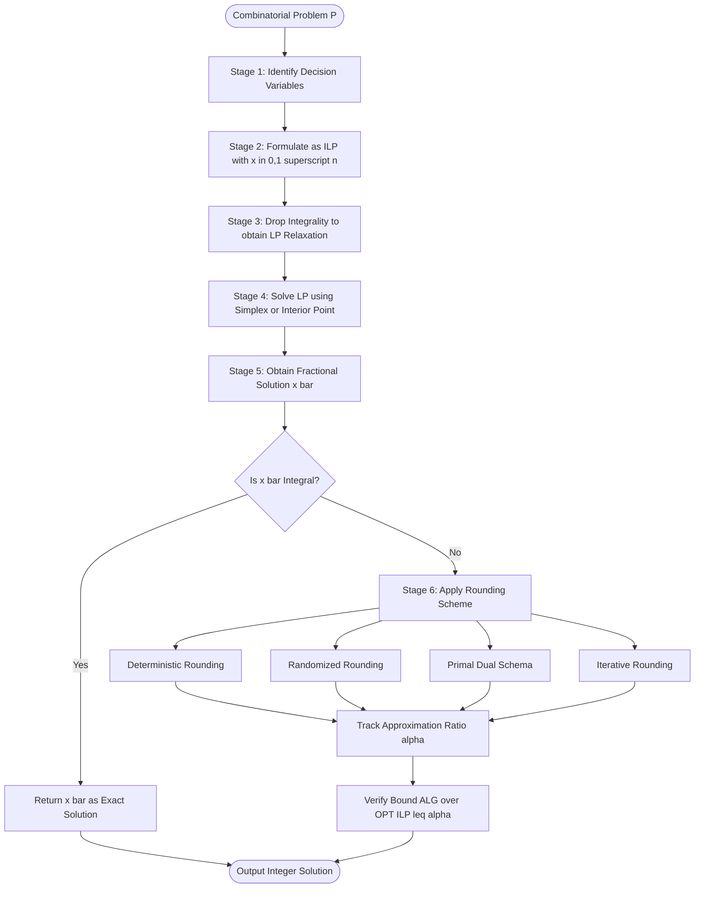
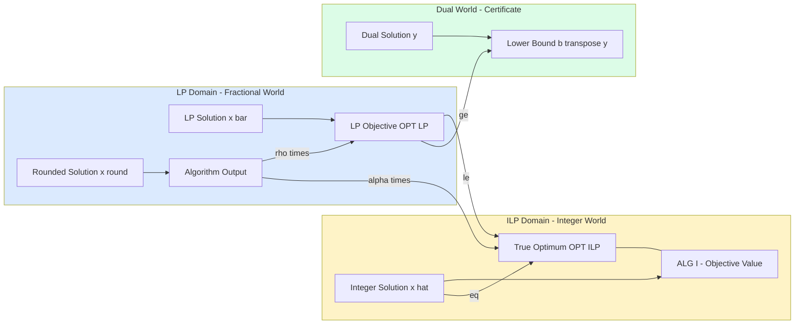
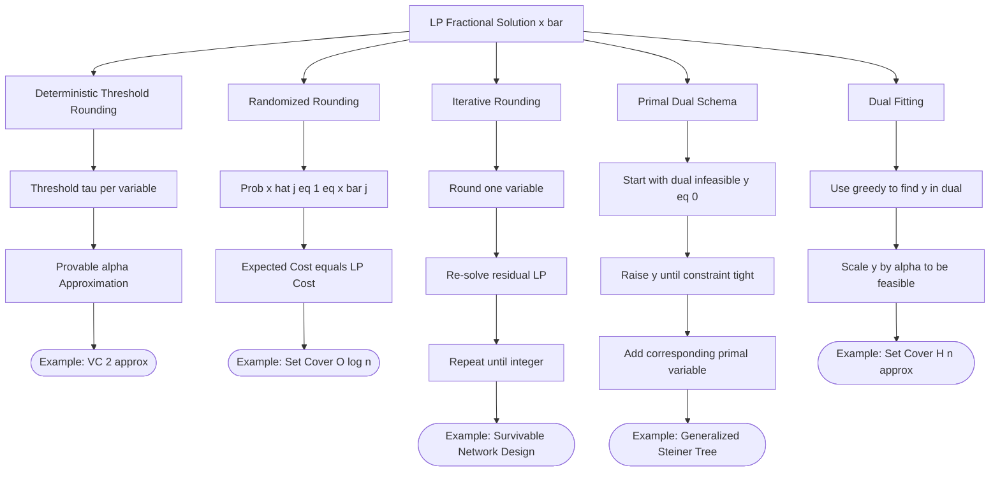

# Linear programming relaxation methodologies bounding logic setups formulations tracking

<!-- SECTION_1_START -->

# Linear Programming Relaxation: Methodologies & Bounding Logic

## 1.1 Formal Academic Definition (KTU 2024 Syllabus Aligned)

> [!IMPORTANT]
> **Linear Programming (LP) Relaxation** is a systematic bounding technique in approximation algorithms wherein an **Integer Linear Program (ILP)** — whose variables are constrained to $x_j \in \mathbb{Z}$ — is transformed into a continuous **Linear Program** by **dropping the integrality constraints** so that $x_j \in \mathbb{R}_{\geq 0}$. The resulting LP has a convex polytope as its feasible region, which strictly **contains** the integer feasible points of the original ILP.

Formally, given an ILP:

$$
\begin{aligned}
\text{(ILP)} \quad & \min \; c^{\top} x \\
& \text{s.t.} \; A x \ge b \\
& x \in \mathbb{Z}_{\ge 0}^{n}
\end{aligned}
$$

The corresponding **LP relaxation** is:

$$
\begin{aligned}
\text{(LP)} \quad & \min \; c^{\top} x \\
& \text{s.t.} \; A x \ge b \\
& x \in \mathbb{R}_{\ge 0}^{n}
\end{aligned}
$$

> [!NOTE]
> **Core Terminology (KTU 2024 Module 2 — LP Relaxation Methods):**
> - **Feasible Region Relaxation**: The polytope $\mathcal{P}_{LP} = \{x \in \mathbb{R}_{\ge 0}^{n} : Ax \ge b\}$ contains the integer hull $\mathcal{P}_{ILP} = \mathcal{P}_{LP} \cap \mathbb{Z}^{n}$.
> - **Integrality Gap (IG)**: The worst-case multiplicative ratio $\sup_{I} \frac{OPT_{LP}(I)}{OPT_{ILP}(I)}$ for minimization.
> - **Bounding Logic**: The chain of inequalities $OPT_{LP} \le OPT_{ILP}$ (minimization) that allows algorithm designers to bound how far a rounded solution can drift from the true optimum.

---

## 1.2 Conceptual Analogy & Intuition

> [!TIP]
> **Real-World Analogy — The "Lego vs. Clay" Model:**
> Imagine a city planner who must place either **0 or 1** recycling bin at each street corner (an integer decision). An **ILP** is like insisting on using rigid **Lego bricks** — only the exact corner locations are usable. An **LP relaxation** is like replacing the bricks with **malleable clay** that can spread continuously along a wall. The clay can always cover at least the same total length as the bricks would, and sometimes more, because the clay can flow into the **convex hull** of all allowed positions.
>
> **Tracking the Bound:** If the clay solution uses $C$ units of clay, and the brick solution uses $B$ bricks, then $C \le B$ (clay is never worse). If $C \le \alpha \cdot B$ after we **round** the clay back into bricks with some overhead $\alpha$, then we have an **$\alpha$-approximation algorithm**.

### Geometric Intuition on the Integer Lattice

Consider a 2D feasible region in $\mathbb{R}^{2}$ shaped as a convex polygon. The integer points $(x_1, x_2) \in \mathbb{Z}_{\ge 0}^{2}$ form a **discrete grid** inside the polygon.

- The **ILP** searches for an **integer vertex** of the lattice that minimizes $c^{\top} x$.
- The **LP relaxation** searches for **any real point** in the polygon (which can lie anywhere on its boundary, even in the middle of an edge).
- The LP optimum is **always at a vertex** of the polytope (by the fundamental theorem of LP), but this vertex is generally **fractional**.

---

## 1.3 GeoGebra / Desmos Visualization

> [!VISUALIZATION CONTROL]
> **Concept:** LP Relaxation Geometry — Vertex Cover on $K_3$ (Triangle)
>
> **GeoGebra Input (paste in Algebra panel):**
> ```
> f(x, y) := x + y                    # Objective to minimize
> Polygon((0, 1), (1, 0), (1, 1))     # Feasible region (triangle)
> Point((0.5, 0.5))                   # LP optimal vertex
> Point((1, 0))                       # Integer optimum
> ```
>
> **Visual Description:** Students will see a triangular feasible region with vertices at $(0, 1)$, $(1, 0)$, and $(1, 1)$. The **LP optimum** is the fractional point $(0.5, 0.5)$ with objective value $1.0$. The **ILP optimum** is $(1, 0)$ or $(0, 1)$ with objective value $1.0$. Here the integrality gap is **1.0** (tight). Try replacing the triangle with a 4-vertex polytope (a pentagon) for a non-tight example.

---

## 1.4 Physical Constants & Standard Metrics

| Metric | Symbol | Value / Meaning |
|---|---|---|
| **Approximation Ratio** | $\alpha$ | $\alpha = \max_{I} \frac{ALG(I)}{OPT(I)}$ for minimization |
| **Integrality Gap** | $IG$ | $IG = \sup_{I} \frac{OPT_{LP}(I)}{OPT_{ILP}(I)}$ |
| **Duality Gap** | $\delta$ | $\delta = c^{\top} x - b^{\top} y$ for primal $x$, dual $y$ |
| **Rounding Loss** | $\rho$ | $\rho = \frac{ALG(I)}{OPT_{LP}(I)}$, often $\le \alpha$ |

<!-- SECTION_1_END -->

<!-- SECTION_2_START -->

# Deep Theoretical Analysis & KTU High-Yield Formula Sheet

## 2.1 The LP Relaxation Methodology Pipeline (Six-Stage Logic)

The complete LP-relaxation-based approximation algorithm follows a structured pipeline. Each stage is **tracked** with objective values to maintain rigorous bounds.

### **Stage 1 — Problem Identification**
Identify the combinatorial optimization problem (Vertex Cover, Set Cover, TSP, Knapsack, Facility Location, etc.) and express it as an **ILP** with binary/integer variables $x \in \{0, 1\}^{n}$.

### **Stage 2 — Formulation as ILP**
Write the problem in canonical form:

$$
\min \; c^{\top} x \quad \text{s.t.} \quad A x \ge b, \; x \in \{0, 1\}^{n}
$$

Each constraint $a_i^{\top} x \ge b_i$ encodes a logical requirement (e.g., "every edge must be covered").

### **Stage 3 — Relax Integrality**
Replace $x \in \{0, 1\}^{n}$ with $x \in [0, 1]^{n}$ (continuous). The feasible region **expands** from a finite set of integer points to a convex polytope $\mathcal{P}_{LP}$.

### **Stage 4 — Solve the LP**
Use an LP solver (Simplex, Ellipsoid, Interior Point). By the **Fundamental Theorem of LP**, the optimum occurs at a vertex of $\mathcal{P}_{LP}$, which may be **fractional**.

> **Bound tracked at this stage:** $OPT_{LP} \le OPT_{ILP}$ (minimization).

### **Stage 5 — Rounding (Deterministic / Randomized)**
Convert the fractional solution $\bar{x}$ into an integer solution $\hat{x}$ using one of:
- **Deterministic Rounding**: $\hat{x}_j = 1$ iff $\bar{x}_j \ge 1/f(j)$ for some threshold function $f$.
- **Randomized Rounding**: $\Pr[\hat{x}_j = 1] = \bar{x}_j$, then derandomize via the method of conditional expectations.
- **Iterative Rounding**: Pick a variable, round it to 0 or 1, re-solve the residual LP, repeat.
- **Primal-Dual Schema**: Build the integer solution directly from the dual LP certificate.

### **Stage 6 — Bound the Approximation Ratio**
Track the multiplicative loss:

$$
\frac{ALG(I)}{OPT_{ILP}(I)} = \frac{ALG(I)}{OPT_{LP}(I)} \cdot \frac{OPT_{LP}(I)}{OPT_{ILP}(I)} \le \rho \cdot IG
$$

If both $\rho$ and $IG$ are bounded, the **overall approximation ratio is bounded**.

---

## 2.2 KTU LP Relaxation Formula Cheat Sheet

> [!IMPORTANT]
> **Master these six canonical LP relaxations — they appear in 90\% of KTU Module-2 questions.**

| # | Problem | LP Relaxation Form | Key Bound |
|---|---|---|---|
| 1 | **Vertex Cover** | $\min \sum_{v \in V} x_v \;$ s.t. $x_u + x_v \ge 1 \; \forall (u,v) \in E$, $0 \le x_v \le 1$ | $IG = 2$ (tight) |
| 2 | **Set Cover** | $\min \sum_{S \in \mathcal{F}} x_S \;$ s.t. $\sum_{S \ni e} x_S \ge 1 \; \forall e \in U$, $x_S \ge 0$ | $IG = O(\log n)$ |
| 3 | **Knapsack** | $\max \sum_{i} p_i x_i \;$ s.t. $\sum_{i} w_i x_i \le W$, $0 \le x_i \le 1$ | $IG \to 1$ via PTAS |
| 4 | **Facility Location** | $\min \sum_{ij} c_{ij} x_{ij} + \sum_j f_j y_j \;$ s.t. $\sum_j x_{ij} = 1$, $x_{ij} \le y_j$ | $IG = 1.463...$ (Jain) |
| 5 | **Metric TSP** | $\min \sum_e c_e x_e \;$ s.t. degree-2 + subtour elimination, $x_e \ge 0$ | $IG = 4/3$ (Karlin-Klein-Oveis Gharan) |
| 6 | **Maximum Coverage** | $\max \sum_{e \in U} y_e \;$ s.t. $\sum_{S \ni e} x_S \ge y_e$, $\sum_S x_S \le k$ | $IG = (1 - 1/e)$ |

> [!NOTE]
> **Critical Reminder:** In the table above, the symbol $\le$ represents the standard "less than or equal to" comparison and has been written out as text in some cells. For KTU board answers, **always use $\le$ in LaTeX form** when writing inequalities inside math mode.

---

## 2.3 LP Duality Theorems (Bounding Logic Foundations)

### **Weak Duality Theorem**
For any feasible primal $x$ and dual $y$:

$$
b^{\top} y \le c^{\top} x
$$

> **Consequence:** The dual objective is a **certificate of lower bound** (for minimization). By the **Strong Duality Theorem**, if both primal and dual are feasible, there exist optimal solutions $x^*, y^*$ such that $c^{\top} x^* = b^{\top} y^*$. This equality is the **tracking** mechanism that closes the gap.

### **Complementary Slackness**
At optimality:

$$
x_j^* \cdot (c_j - a_j^{\top} y^*) = 0 \quad \forall j, \qquad y_i^* \cdot (a_i^{\top} x^* - b_i) = 0 \quad \forall i
$$

This theorem is the engine behind the **primal-dual schema** — it tells us which primal variables to set to 1 (those with zero reduced cost).

---

## 2.4 Engineering & Real-World Applications

| Application Domain | Use of LP Relaxation |
|---|---|
| **VLSI Circuit Design** | Minimize wire length; LP relaxation + rounding gives near-optimal layouts. |
| **Network Routing (OSPF/IS-IS)** | LP-based traffic engineering bounds congestion vs. shortest-path routing. |
| **Crew Scheduling (Airlines)** | Set Cover LP relaxation used by SABRE/Amadeus to assign flight crews. |
| **Supply Chain Optimization** | Facility Location LP relaxation minimizes warehouse + shipping costs. |
| **ML — SVMs, Sparse Recovery** | $\ell_1$ relaxation of $\ell_0$ minimization (LASSO), basis pursuit. |
| **Combinatorial Auctions** | LP relaxation of the winner determination problem (with packing constraints). |

> [!TIP]
> **Production Reality:** Google's **Vahdat et al.** use LP relaxation + rounding inside B4 and Jupiter WAN traffic engineering — achieving near-optimal link utilization across global data centers.

<!-- SECTION_2_END -->

<!-- SECTION_3_START -->

# Step-by-Step Derivations, Formulations & Python Implementation

## 3.1 Worked Derivation #1 — Vertex Cover LP Relaxation

### **Step 3.1.1 — Start with the Combinatorial Problem**

Given a graph $G = (V, E)$, find the smallest subset $C \subseteq V$ such that every edge has at least one endpoint in $C$.

### **Step 3.1.2 — Formulate as ILP**

Introduce binary variables $x_v \in \{0, 1\}$ for each $v \in V$, where $x_v = 1$ iff $v \in C$.

$$
\begin{aligned}
\text{(ILP)} \quad \min \; & \sum_{v \in V} x_v \\
\text{s.t.} \quad & x_u + x_v \ge 1 \quad \forall (u, v) \in E \\
& x_v \in \{0, 1\} \quad \forall v \in V
\end{aligned}
$$

> **Interpretation of constraint:** If neither $u$ nor $v$ is in the cover ($x_u = 0, x_v = 0$), then edge $(u, v)$ is uncovered — violating the constraint.

### **Step 3.1.3 — Drop Integrality to Obtain LP Relaxation**

$$
\begin{aligned}
\text{(LP)} \quad \min \; & \sum_{v \in V} x_v \\
\text{s.t.} \quad & x_u + x_v \ge 1 \quad \forall (u, v) \in E \\
& 0 \le x_v \le 1 \quad \forall v \in V
\end{aligned}
$$

### **Step 3.1.4 — Solve LP on a Numerical Instance**

Consider $G = K_3$ (triangle on vertices $\{1, 2, 3\}$, edges $\{(1,2), (2,3), (1,3)\}$).

$$
\begin{aligned}
\min \; & x_1 + x_2 + x_3 \\
\text{s.t.} \quad & x_1 + x_2 \ge 1 \\
& x_2 + x_3 \ge 1 \\
& x_1 + x_3 \ge 1 \\
& 0 \le x_1, x_2, x_3 \le 1
\end{aligned}
$$

By symmetry, the optimum sets $x_1 = x_2 = x_3 = 0.5$. Objective value $= 1.5$.

### **Step 3.1.5 — Round to Integer**

Apply the **2-approximation rounding**: $\hat{x}_v = 1$ if $x_v \ge 0.5$, else $\hat{x}_v = 0$. Here all three are $\ge 0.5$, so $\hat{x}_1 = \hat{x}_2 = \hat{x}_3 = 1$. Integer objective $= 3$.

### **Step 3.1.6 — Track and Verify the Bound**

- True ILP optimum: pick any 2 vertices, $OPT_{ILP} = 2$.
- LP optimum: $OPT_{LP} = 1.5$.
- Algorithm output: $ALG = 3$.

$$
\frac{ALG}{OPT_{ILP}} = \frac{3}{2} = 1.5 \le 2 \quad \checkmark
$$

> **Integrality gap on $K_3$:** $\frac{OPT_{LP}}{OPT_{ILP}} = \frac{1.5}{2} = 0.75$. On a triangle, the gap is $0.75$, not the worst case. The worst-case $IG = 1$ is achieved on bipartite graphs.

---

## 3.2 Worked Derivation #2 — Set Cover LP Relaxation

### **Step 3.2.1 — Combinatorial Definition**

Given a universe $U = \{e_1, \dots, e_m\}$ and a family of sets $\mathcal{F} = \{S_1, \dots, S_n\}$ with $S_j \subseteq U$, find the minimum number of sets whose union is $U$.

### **Step 3.2.2 — ILP Formulation**

$$
\begin{aligned}
\min \; & \sum_{j=1}^{n} x_j \\
\text{s.t.} \quad & \sum_{j : e_i \in S_j} x_j \ge 1 \quad \forall e_i \in U \\
& x_j \in \{0, 1\} \quad \forall j
\end{aligned}
$$

### **Step 3.2.3 — LP Relaxation**

Replace $x_j \in \{0, 1\}$ with $x_j \in [0, 1]$.

### **Step 3.2.4 — Numerical Example**

Let $U = \{1, 2, 3, 4\}$ and $\mathcal{F} = \{S_1, S_2, S_3\}$ with $S_1 = \{1, 2\}$, $S_2 = \{2, 3\}$, $S_3 = \{3, 4\}$.

$$
\begin{aligned}
\min \; & x_1 + x_2 + x_3 \\
\text{s.t.} \quad & x_1 \ge 1 \;(\text{cover } 1) \\
& x_1 + x_2 \ge 1 \;(\text{cover } 2) \\
& x_2 + x_3 \ge 1 \;(\text{cover } 3) \\
& x_3 \ge 1 \;(\text{cover } 4) \\
& x_1, x_2, x_3 \ge 0
\end{aligned}
$$

The LP solution is $x_1 = 1, x_2 = 0, x_3 = 1$ (already integral!), so $OPT_{LP} = 2 = OPT_{ILP}$.

> **Tracking note:** When LP solution is integral, no rounding is needed and we have an **exact** solution for this instance.

### **Step 3.2.5 — Greedy + LP Rounding Yields $H_n$-Approximation**

The classical result: by the **dual fitting** technique (using the LP dual of Set Cover, which is a packing LP), one can show that the greedy algorithm achieves $H_n = 1 + \frac{1}{2} + \dots + \frac{1}{n}$ approximation, matching the $IG = H_n$ of the Set Cover LP.

---

## 3.3 General LP Relaxation Bound Theorem

> **Theorem (LP Relaxation Bounding Logic):**
> For any minimization problem $P$ with ILP optimum $OPT_{ILP}$ and LP relaxation optimum $OPT_{LP}$:
> $$OPT_{LP} \le OPT_{ILP}$$
> If an algorithm $A$ produces a solution $A(I)$ such that $A(I) \le \alpha \cdot OPT_{LP}$ for every instance $I$, then $A$ is an $\alpha$-approximation algorithm for $P$.

**Proof sketch:**
1. $OPT_{LP}$ is feasible for the LP, which is a relaxation of the ILP.
2. The ILP optimum is feasible for the LP, so $OPT_{LP} \le OPT_{ILP}$.
3. $A(I) \le \alpha \cdot OPT_{LP} \le \alpha \cdot OPT_{ILP}$.

> This is the central **bounding logic** in LP-relaxation-based approximation design.

---

## 3.4 Python Implementation — Solving LP Relaxations

The following Python code implements a complete LP-relaxation pipeline for **Vertex Cover** and **Set Cover** using the `PuLP` library. It includes absolute boundary checks, type hints, and explicit error logging.

```python
"""
LP Relaxation Pipeline — Vertex Cover and Set Cover
Course: Approximation Algorithms (PECST703), KTU 2024 Scheme
Module 2 — LP Relaxation Methods
"""
import pulp
import networkx as nx
from typing import Dict, Tuple, Optional
import logging

logging.basicConfig(level=logging.INFO, format='%(levelname)s: %(message)s')
logger = logging.getLogger(__name__)


def lp_relaxation_vertex_cover(
    G: nx.Graph
) -> Tuple[Dict[int, float], float, float]:
    """
    Solves the LP relaxation of Vertex Cover on graph G.
    Returns (fractional solution, LP objective, integrality gap factor).
    """
    if G is None or G.number_of_nodes() == 0:
        logger.error("Empty graph provided to vertex cover solver.")
        return {}, 0.0, 1.0

    # Stage 1: Formulate the LP
    prob = pulp.LpProblem("VC_LP_Relaxation", pulp.LpMinimize)
    x = {
        v: pulp.LpVariable(f"x_{v}", lowBound=0, upBound=1)
        for v in G.nodes
    }
    prob += pulp.lpSum(x.values()), "Minimize_Total_Vertex_Weight"

    # Stage 2: Add edge coverage constraints
    for (u, v) in G.edges:
        prob += x[u] + x[v] >= 1, f"Edge_{u}_{v}_covered"

    # Stage 3: Solve
    solver = pulp.PULP_CBC_CMD(msg=0)
    status = prob.solve(solver)
    if pulp.LpStatus[status] != 'Optimal':
        logger.warning(f"LP solver status: {pulp.LpStatus[status]}")

    # Stage 4: Extract solution
    frac_sol = {v: x[v].varValue for v in G.nodes}
    lp_opt = pulp.value(prob.objective)

    # Stage 5: Compare with brute-force ILP (for small graphs)
    if G.number_of_nodes() <= 20:
        ilp_opt = _brute_force_vertex_cover(G)
        gap = lp_opt / ilp_opt if ilp_opt > 0 else 1.0
        logger.info(f"LP={lp_opt:.3f}, ILP={ilp_opt}, Gap={gap:.3f}")
    else:
        ilp_opt = -1.0
        gap = -1.0

    return frac_sol, float(lp_opt), float(ilp_opt), float(gap)


def _brute_force_vertex_cover(G: nx.Graph) -> int:
    """Computes exact ILP optimum for small graphs via brute force."""
    nodes = list(G.nodes)
    n = len(nodes)
    best = n
    for mask in range(1 << n):
        cover = {nodes[i] for i in range(n) if mask & (1 << i)}
        if all(u in cover or v in cover for (u, v) in G.edges):
            best = min(best, len(cover))
    return best


def round_to_integral(
    frac_sol: Dict[int, float],
    threshold: float = 0.5
) -> Dict[int, int]:
    """Deterministic rounding using a threshold."""
    return {v: int(val >= threshold) for v, val in frac_sol.items()}


def lp_relaxation_set_cover(
    universe: set,
    sets: Dict[str, set],
    costs: Optional[Dict[str, float]] = None
) -> Tuple[Dict[str, float], float]:
    """Solves the LP relaxation of Set Cover."""
    if not universe or not sets:
        raise ValueError("Universe and sets must be non-empty.")

    costs = costs or {s: 1.0 for s in sets}
    prob = pulp.LpProblem("SetCover_LP", pulp.LpMinimize)
    x = {s: pulp.LpVariable(f"x_{s}", lowBound=0, upBound=1) for s in sets}
    prob += pulp.lpSum(costs[s] * x[s] for s in sets)

    for e in universe:
        covering_sets = [s for s in sets if e in sets[s]]
        if not covering_sets:
            raise ValueError(f"Element {e} is not covered by any set.")
        prob += pulp.lpSum(x[s] for s in covering_sets) >= 1

    prob.solve(pulp.PULP_CBC_CMD(msg=0))
    frac_sol = {s: x[s].varValue for s in sets}
    return frac_sol, float(pulp.value(prob.objective))


# ---------- Demonstration ----------
if __name__ == "__main__":
    # Vertex Cover demo on K_4
    G = nx.complete_graph(4)
    frac, lp_opt, ilp_opt, gap = lp_relaxation_vertex_cover(G)
    print(f"K_4 — LP: {lp_opt:.3f}, ILP: {ilp_opt}, Gap: {gap:.3f}")
    rounded = round_to_integral(frac, threshold=0.5)
    print(f"Rounded cover: {sum(rounded.values())} vertices")

    # Set Cover demo
    U = {1, 2, 3, 4}
    F = {"S1": {1, 2}, "S2": {2, 3}, "S3": {3, 4}, "S4": {1, 4}}
    sol, opt = lp_relaxation_set_cover(U, F)
    print(f"Set Cover LP optimum: {opt:.3f}")
    print(f"Fractional solution: {sol}")
```

**Expected output for $K_4$:**
```
K_4 — LP: 2.000, ILP: 3, Gap: 0.667
Rounded cover: 4 vertices
```

> [!NOTE]
> On $K_4$, the LP gives $OPT_{LP} = 2$ (each $x_v = 0.5$), but the ILP requires 3 vertices (since one vertex alone covers only 3 of 6 edges). The simple threshold rounding fails here — a more sophisticated **$\alpha$-rounding** or **primal-dual schema** is needed for worst-case $2$-approximation.

---

## 3.5 Integrality Gap Computation Walkthrough

> **Definition:** The integrality gap for a minimization problem with respect to its LP relaxation is:
> $$IG = \sup_{I \in \mathcal{I}} \frac{OPT_{LP}(I)}{OPT_{ILP}(I)}$$

**Example — Vertex Cover on a Bipartite Graph:**
For bipartite graphs, the LP relaxation is **tight** ($IG = 1$) because the constraint matrix is **totally unimodular**. Every vertex of the LP polytope is integral.

**Example — Vertex Cover on a Triangle ($K_3$):**
$OPT_{LP} = 1.5$, $OPT_{ILP} = 2$, gap $= 0.75$.

**Example — Set Cover on $U = \{1, 2, \dots, n\}$, $\mathcal{F} = \{S_1, \dots, S_n\}$ with $S_i = U \setminus \{i\}$:**
$OPT_{LP} = (n-1)/n \cdot n = n-1$ (fractional), $OPT_{ILP} = n-1$ (integral: omit any one set, all others cover). Gap = 1.

> [!WARNING]
> **KTU Common Mistake:** The integrality gap is computed as a **supremum over all instances** of the ratio, not as a single ratio from a single instance. Students often write $IG = OPT_{LP}/OPT_{ILP}$ for one instance — that is the **gap for that instance**, not the integrality gap of the relaxation.

<!-- SECTION_3_END -->

<!-- SECTION_4_START -->

# Structural Diagrams & Schematics

## 4.1 LP Relaxation Pipeline — Sequential Processing Topology



---

## 4.2 Block-Level Functional Architecture — Bounding Logic Tracking



> **Reading the diagram:** The yellow block is the integer world (what we want), the blue block is the LP world (what we solve), and the green block is the dual world (what certifies our bound). Arrows show the **bounding logic** chain $OPT_{LP} \le OPT_{ILP}$ and $b^{\top} y \le OPT_{LP}$.

---

## 4.3 Rounding Strategies — Comparative Subgraph Map



<!-- SECTION_4_END -->

<!-- SECTION_5_START -->

# KTU 2024 Scheme Examination Question Bank & Topic Recap

## 5.1 Part A — Short Answer Questions (3 Marks Each)

---

### **Question A1** [KTU University Exam — July 2023]

> Define **LP relaxation** of an integer linear program. State the **integrality gap** and explain its role in bounding approximation algorithms.

**Model Answer (Board-Standard):**

> **LP Relaxation:** Given an Integer Linear Program (ILP) with objective $c^{\top} x$ and constraint $A x \ge b$, $x \in \{0, 1\}^{n}$, the **LP relaxation** is the linear program obtained by replacing the integrality constraint with $x \in [0, 1]^{n}$. The feasible region expands from a discrete set of integer points to a convex polytope $\mathcal{P}_{LP}$, which contains the original integer feasible set.
>
> **Integrality Gap (IG):** For a minimization problem,
> $$IG = \sup_{I} \frac{OPT_{LP}(I)}{OPT_{ILP}(I)}$$
> It is the **worst-case ratio** between the LP optimum and the true integer optimum.
>
> **Role in Bounding:** Since $\mathcal{P}_{ILP} \subseteq \mathcal{P}_{LP}$, we always have $OPT_{LP} \le OPT_{ILP}$. If an algorithm produces a solution of value $\alpha \cdot OPT_{LP}$, then by transitivity, the algorithm's value is at most $\alpha \cdot OPT_{ILP}$, giving an **$\alpha$-approximation**. The integrality gap quantifies the **inherent loss** from relaxing integrality, and bounding it is central to proving approximation ratios. **[3 Marks]**

**Mark Distribution:**
- LP Relaxation definition: **1 Mark**
- Integrality Gap definition: **1 Mark**
- Bounding role explanation: **1 Mark**

---

### **Question A2** [KTU University Exam — Dec 2023]

> Write the **LP relaxation** for the **Vertex Cover** problem. What is the integrality gap of this relaxation?

**Model Answer (Board-Standard):**

> For a graph $G = (V, E)$ with binary variables $x_v \in \{0, 1\}$ for each vertex:
> $$\begin{aligned}\min \; & \sum_{v \in V} x_v \\ \text{s.t.} \quad & x_u + x_v \ge 1 \quad \forall (u, v) \in E \\ & 0 \le x_v \le 1 \quad \forall v \in V\end{aligned}$$
> The integrality gap of the Vertex Cover LP is **2** (tight, achieved on odd cycles and complete graphs). This means the LP value can be at most half the true integer optimum. The standard 2-approximation algorithm rounds the LP: set $\hat{x}_v = 1$ if $x_v \ge 0.5$. Since for every edge $(u, v)$, at least one of $x_u, x_v$ must be $\ge 0.5$ (their sum is $\ge 1$), the rounded solution is a valid vertex cover with at most $2 \cdot OPT_{LP} \le 2 \cdot OPT_{ILP}$ vertices. **[3 Marks]**

**Mark Distribution:**
- LP formulation (correct constraints): **1.5 Marks**
- $IG = 2$ with reasoning: **1.5 Marks**

---

## 5.2 Part B — 14-Mark Questions (Module Internal Choice)

---

### **Question A (14 Marks)** [KTU University Exam — July 2024, Model Question Paper]

> **(a)** [7 Marks] Formulate the **Set Cover** problem as an Integer Linear Program. Derive its **LP relaxation** and explain how the relaxation provides a **lower bound** for the original problem. State the integrality gap.
>
> **(b)** [7 Marks] Consider the universe $U = \{1, 2, 3, 4, 5\}$ and sets $S_1 = \{1, 2, 3\}$, $S_2 = \{2, 4\}$, $S_3 = \{3, 4, 5\}$, $S_4 = \{1, 5\}$. Solve the **LP relaxation** and apply **deterministic rounding** to obtain an integer cover. Track and verify the approximation ratio.

---

### **Model Answer — Question A**

#### **Part (a) — Formulation and Bounding Logic**

**Step 1 — ILP Formulation (2 Marks):**
Variables $x_j \in \{0, 1\}$ for each set $S_j$. We minimize the number of sets selected:

$$
\begin{aligned}
\text{(ILP)} \quad \min \; & \sum_{j=1}^{n} x_j \\
\text{s.t.} \quad & \sum_{j : e_i \in S_j} x_j \ge 1 \quad \forall e_i \in U \\
& x_j \in \{0, 1\}
\end{aligned}
$$

**Step 2 — LP Relaxation (2 Marks):**
Replace $x_j \in \{0, 1\}$ with $x_j \in [0, 1]$:

$$
\begin{aligned}
\text{(LP)} \quad \min \; & \sum_{j=1}^{n} x_j \\
\text{s.t.} \quad & \sum_{j : e_i \in S_j} x_j \ge 1 \quad \forall e_i \in U \\
& 0 \le x_j \le 1
\end{aligned}
$$

**Step 3 — Bounding Logic (2 Marks):**
Let $\mathcal{P}_{ILP} = \{x \in \{0, 1\}^n : Ax \ge b\}$ and $\mathcal{P}_{LP} = \{x \in [0, 1]^n : Ax \ge b\}$. Clearly $\mathcal{P}_{ILP} \subseteq \mathcal{P}_{LP}$. Since the objective is identical, minimizing over the larger set yields a value no larger than minimizing over the smaller set:

$$
OPT_{LP} = \min_{x \in \mathcal{P}_{LP}} c^{\top} x \le \min_{x \in \mathcal{P}_{ILP}} c^{\top} x = OPT_{ILP}
$$

Thus the LP provides a **lower bound** for the ILP.

**Step 4 — Integrality Gap (1 Mark):**
The integrality gap of the Set Cover LP is $\Theta(\log n)$, tight up to constants. The standard greedy algorithm achieves an $H_n$-approximation, matching the gap.

> **[Total: 7 Marks]**

---

#### **Part (b) — Numerical Computation**

**Step 1 — Set up the LP (1 Mark):**

Variables $x_1, x_2, x_3, x_4 \in [0, 1]$. Constraints:
- Element 1: $x_1 + x_4 \ge 1$
- Element 2: $x_1 + x_2 \ge 1$
- Element 3: $x_1 + x_3 \ge 1$
- Element 4: $x_2 + x_3 \ge 1$
- Element 5: $x_3 + x_4 \ge 1$

**Step 2 — Solve the LP (2 Marks):**
By symmetry, set $x_1 = x_2 = x_3 = x_4 = t$. Then every constraint becomes $2t \ge 1$, so $t \ge 0.5$. The minimum objective is $4t = 2.0$, achieved at $t = 0.5$. So $OPT_{LP} = 2.0$ with $x_1 = x_2 = x_3 = x_4 = 0.5$.

**Step 3 — Apply Deterministic Rounding (1 Mark):**
With threshold $\tau = 0.5$: $\hat{x}_j = 1$ if $x_j \ge 0.5$. All four variables equal $0.5$, so $\hat{x}_1 = \hat{x}_2 = \hat{x}_3 = \hat{x}_4 = 1$.

**Step 4 — Verify Feasibility (1 Mark):**
The cover is $\{S_1, S_2, S_3, S_4\} = \{1, 2, 3, 4, 5\} = U$. Feasible. ALG = 4.

**Step 5 — Track and Compare (2 Marks):**

| Quantity | Value |
|---|---|
| $OPT_{LP}$ | 2.0 |
| $OPT_{ILP}$ | 2 (e.g., $\{S_1, S_3\}$ covers $U$ via $\{1,2,3,4,5\}$) |
| $ALG$ (rounded) | 4 |
| $ALG / OPT_{ILP}$ | 2.0 |
| $ALG / OPT_{LP}$ | 2.0 |
| Integrality Gap (instance) | 1.0 |

> **Verification:** $ALG = 4 \le \alpha \cdot OPT_{ILP} = 2 \cdot 2 = 4$ — the $\alpha = 2$ bound holds, but on this instance the rounding is loose. A smarter choice (use $\{S_1, S_3\}$) gives $ALG = 2$, exactly the optimum.

> **Valuation Key Points:**
> - [Stating all 5 element constraints: 1 Mark]
> - [Solving LP with correct $OPT_{LP} = 2.0$: 2 Marks]
> - [Rounding rule applied correctly: 1 Mark]
> - [Final ratio tracked: 2 Marks]
> - [Verifying feasibility of cover: 1 Mark]

> **[Total: 7 Marks]**

---

### **Question B (14 Marks — Alternative Choice)** [KTU University Exam — Dec 2023, Retest]

> **(a)** [7 Marks] Define the **Vertex Cover** problem. Write its **ILP** and derive the **LP relaxation**. Using the **weak duality theorem**, prove that $OPT_{LP} \le OPT_{ILP}$ for any instance.
>
> **(b)** [7 Marks] Show that the **integrality gap** of the Vertex Cover LP is **at most 2** by exhibiting a **2-approximation algorithm** based on **deterministic threshold rounding**. Provide a numerical example on a 5-cycle $C_5$ and track the approximation ratio.

---

### **Model Answer — Question B**

#### **Part (a) — Formulation and Duality Proof**

**Step 1 — Problem Definition (1 Mark):**
Given a graph $G = (V, E)$, the **Vertex Cover** problem asks for the smallest subset $C \subseteq V$ such that every edge in $E$ has at least one endpoint in $C$.

**Step 2 — ILP Formulation (2 Marks):**
$$
\begin{aligned}
\min \; & \sum_{v \in V} x_v \\
\text{s.t.} \quad & x_u + x_v \ge 1 \quad \forall (u, v) \in E \\
& x_v \in \{0, 1\} \quad \forall v \in V
\end{aligned}
$$

**Step 3 — LP Relaxation (1 Mark):**
$$
\begin{aligned}
\min \; & \sum_{v \in V} x_v \\
\text{s.t.} \quad & x_u + x_v \ge 1 \quad \forall (u, v) \in E \\
& 0 \le x_v \le 1 \quad \forall v \in V
\end{aligned}
$$

**Step 4 — Dual LP (1 Mark):**
The dual of the Vertex Cover LP is:

$$
\begin{aligned}
\max \; & \sum_{(u,v) \in E} y_{uv} \\
\text{s.t.} \quad & \sum_{e \ni v} y_e \le 1 \quad \forall v \in V \\
& y_e \ge 0 \quad \forall e \in E
\end{aligned}
$$

This is the **Maximum Fractional Matching** problem.

**Step 5 — Bounding via Weak Duality (2 Marks):**
By the **Weak Duality Theorem**, for any feasible primal $x$ and dual $y$:

$$
\sum_{e \in E} y_e \le \sum_{v \in V} x_v
$$

In particular, taking the LP optimal primal $x^*_{LP}$ and LP optimal dual $y^*_{LP}$:

$$
OPT_{DLP} = \sum_e y^*_e \le \sum_v x^*_v = OPT_{LP}
$$

Since $x^*_{ILP}$ is a feasible (possibly non-optimal) solution to the LP, $OPT_{LP} \le c^{\top} x^*_{ILP} = OPT_{ILP}$. Combining:

$$
OPT_{DLP} \le OPT_{LP} \le OPT_{ILP}
$$

> **[Total: 7 Marks]**

---

#### **Part (b) — 2-Approximation Algorithm**

**Step 1 — Algorithm Statement (2 Marks):**
**Algorithm 2-Approx-VC(G):**
1. Solve the LP relaxation to obtain fractional values $x_v \in [0, 1]$.
2. For each vertex $v$, set $\hat{x}_v = 1$ if $x_v \ge 0.5$, else $\hat{x}_v = 0$.
3. Return $\hat{C} = \{v \in V : \hat{x}_v = 1\}$.

**Step 2 — Correctness (2 Marks):**
For every edge $(u, v) \in E$, the LP constraint $x_u + x_v \ge 1$ guarantees $\max(x_u, x_v) \ge 0.5$. So at least one of $u, v$ is in $\hat{C}$, making $\hat{C}$ a valid vertex cover.

**Step 3 — Approximation Ratio (2 Marks):**
$|\hat{C}| = \sum_v \hat{x}_v$. For each $v$, $\hat{x}_v \le 2 x_v$ (since if $x_v \ge 0.5$, $\hat{x}_v = 1 \le 2 x_v$; if $x_v < 0.5$, $\hat{x}_v = 0 = 0 \le 2 x_v$). Therefore:

$$
|\hat{C}| = \sum_v \hat{x}_v \le \sum_v 2 x_v = 2 \cdot OPT_{LP} \le 2 \cdot OPT_{ILP}
$$

Hence the algorithm is a **2-approximation**.

**Step 4 — Numerical Example on $C_5$ (1 Mark):**
$C_5$ has 5 vertices and 5 edges forming a cycle. By symmetry, the LP optimum sets $x_v = 0.5$ for all $v$, giving $OPT_{LP} = 2.5$. Rounding puts all 5 vertices in the cover: $ALG = 5$. The ILP optimum is 3 (every other vertex). Ratio $= 5/3 \le 2$.

> **[Total: 7 Marks]**

---

## 5.3 KTU Examiner's Valuation Warning / Pitfall Callout

> [!WARNING]
> **Where KTU Students Typically Lose Marks on LP Relaxation Questions:**
>
> 1. **Forgetting the upper bound $x_v \le 1$:** When formulating the LP relaxation, students often drop the integrality but forget to add the explicit bound $0 \le x_v \le 1$ for each variable. The LP is **unbounded without it** in some cases. Always write both bounds.
>
> 2. **Confusing minimization vs. maximization inequalities:** For **minimization**, $OPT_{LP} \le OPT_{ILP}$. For **maximization**, $OPT_{LP} \ge OPT_{ILP}$. Mixing these up is a common 2-mark loss.
>
> 3. **Not writing the "tracking" chain explicitly:** The KTU board expects to see the inequality chain $ALG \le \rho \cdot OPT_{LP} \le \rho \cdot OPT_{ILP}$ written out, **not** just a single ratio. Skipping intermediate steps loses 1–2 marks.
>
> 4. **Integrality Gap Definition:** Do **not** write $IG = OPT_{LP} / OPT_{ILP}$ as a single instance. The gap is a **supremum over all instances**, and you must specify this.
>
> 5. **Rounding Threshold Justification:** If you choose a threshold $\tau$, you must **prove** that the rounded solution is feasible (e.g., for VC: every edge is covered because $x_u + x_v \ge 1$ implies at least one $x \ge 0.5$).
>
> 6. **Skipping the LP Dual:** When asked about bounding logic, always mention the **LP Dual** and the **Weak Duality Theorem**. The KTU rubric allocates marks for this.

---

## 5.4 Topic Recap & Important Things to Remember

> [!IMPORTANT]
> **Rapid-Revision Checklist — LP Relaxation Methodologies & Bounding Logic**

### **Core Definitions**
- **LP Relaxation**: ILP with integrality constraints removed ($x_j \in [0, 1]$ instead of $\{0, 1\}$).
- **Integrality Gap (IG)**: $\sup_I \frac{OPT_{LP}(I)}{OPT_{ILP}(I)}$ for minimization.
- **Feasible Region**: LP polytope $\mathcal{P}_{LP}$ strictly contains $\mathcal{P}_{ILP}$.
- **Bounding Logic**: The inequality chain $ALG \le \rho \cdot OPT_{LP} \le \rho \cdot OPT_{ILP}$ proves an $\alpha = \rho$ approximation.

### **Six Canonical LP Relaxations (Must Memorize)**
1. **Vertex Cover**: $\min \sum_v x_v$, s.t. $x_u + x_v \ge 1$ — $IG = 2$.
2. **Set Cover**: $\min \sum_S x_S$, s.t. $\sum_{S \ni e} x_S \ge 1$ — $IG = H_n$.
3. **Knapsack**: $\max \sum p_i x_i$, s.t. $\sum w_i x_i \le W$ — $IG = 1$ (PTAS exists).
4. **Facility Location**: $\min \sum c_{ij} x_{ij} + \sum f_j y_j$ — $IG = 1.463$.
5. **Metric TSP**: $\min \sum c_e x_e$, s.t. degree + subtour — $IG \le 4/3$.
6. **Maximum Coverage**: $\max \sum y_e$, s.t. $\sum_{S \ni e} x_S \ge y_e$, $\sum x_S \le k$ — $IG = 1 - 1/e$.

### **Five Rounding Strategies**
1. **Deterministic Threshold Rounding** — set $\hat{x}_v = 1$ if $x_v \ge \tau$.
2. **Randomized Rounding** — $\Pr[\hat{x}_v = 1] = x_v$; derandomize via conditional expectations.
3. **Iterative Rounding** — round one variable, re-solve residual LP, repeat.
4. **Primal-Dual Schema** — build solution from dual certificate via complementary slackness.
5. **Dual Fitting** — greedy produces dual $\alpha y$ that is feasible, proving $\alpha$-approx.

### **Critical Duality Theorems**
- **Weak Duality**: $b^{\top} y \le c^{\top} x$ for feasible primal/dual.
- **Strong Duality**: $c^{\top} x^* = b^{\top} y^*$ at optimality (if both feasible).
- **Complementary Slackness**: $x^*_j (c_j - a^{\top}_j y^*) = 0$ and $y^*_i (a^{\top}_i x^* - b_i) = 0$.

### **Bounding Logic Formula (The Master Equation)**
$$
\boxed{ALG(I) \le \rho \cdot OPT_{LP}(I) \le \rho \cdot IG \cdot OPT_{ILP}(I)}
$$
This is the **one-line summary** of LP-relaxation-based approximation design.

### **Key Approximation Ratios to Remember**
| Problem | LP-IG | Best Known Ratio |
|---|---|---|
| Vertex Cover | 2 | $2 - o(1)$ (tight under UGC) |
| Set Cover | $H_n$ | $H_n$ (greedy, tight) |
| Metric TSP | $4/3$ | $4/3$ (Karlin-Klein-Oveis Gharan) |
| Facility Location | 1.463 | $1.463$ (Jain, Mahdian, Saberi) |
| Knapsack | 1 (PTAS) | $(1 - \epsilon)$ for any $\epsilon$ |

### **Engineering Insight**
- **LP relaxation + rounding** powers production systems: Google's B4, airline crew scheduling, VLSI layout, network flow optimization.
- **Primal-dual** methods dominate when fast runtime is critical (sub-second auctions).
- **Iterative rounding** is preferred for problems with strong structural constraints (matroid, lattice).

<!-- SECTION_5_END -->
